# 第4章：动态网页渲染与JavaScript逆向（二）

## 4.2 JavaScript代码混淆与反混淆技术深度解析

### 4.2.1 现代混淆技术演进与分类体系

JavaScript代码混淆已经从简单的变量名替换发展成为一门复杂的逆向工程学科。现代混淆技术结合了编译器优化、密码学和软件工程等多个领域的知识，形成了多层次的保护体系。

**混淆技术演进历程：**

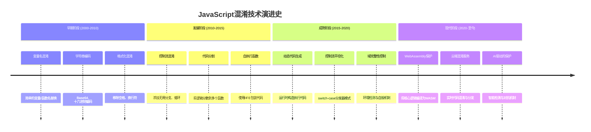

**现代混淆技术分类体系：**

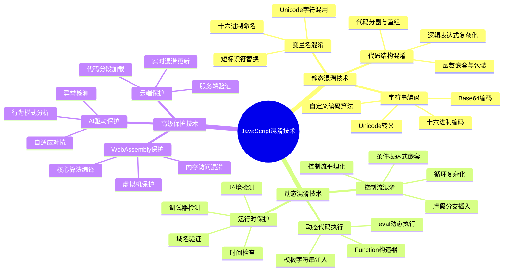

### 4.2.2 字符串编码混淆的技术原理与破解策略

字符串编码混淆是最基础也是最普遍的保护技术。通过将明文字符串转换为各种编码格式，有效增加了静态分析的难度。

**字符串编码混淆的技术矩阵：**

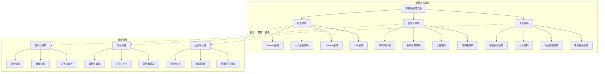

**字符串混淆的检测与识别流程：**

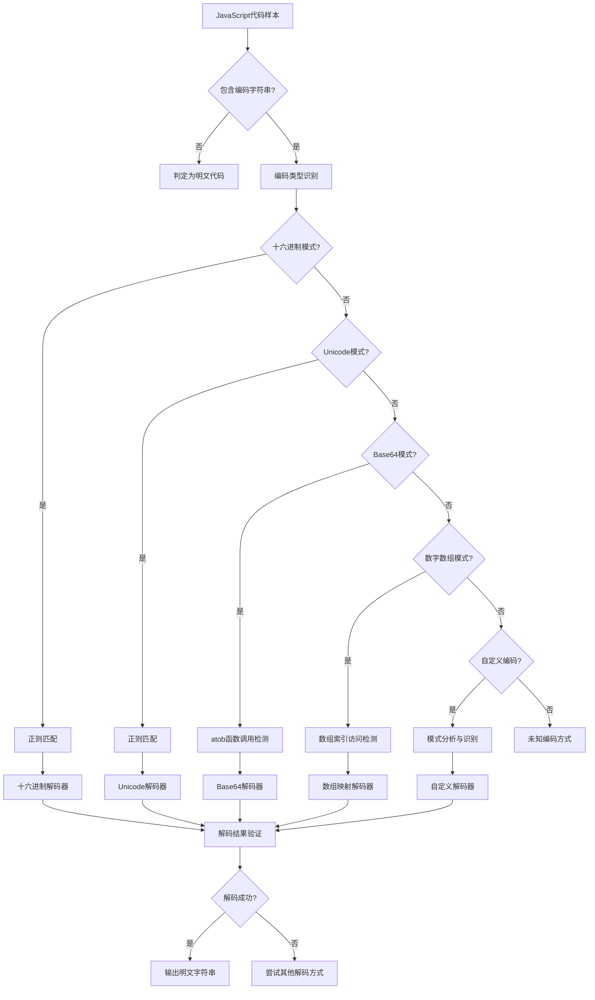

### 4.2.3 控制流混淆与平坦化技术深度分析

控制流混淆是最高级的混淆技术之一，它通过改变程序的执行流程来隐藏真实的逻辑关系，使得逆向分析变得极其困难。

**控制流混淆的技术层次：**

```mermaid
pyramid
    title 控制流混淆技术层次
    "高级平坦化" : 15%
    "分发器模式" : 20%
    "虚假分支插入" : 25%
    "循环复杂化" : 20%
    "条件表达式嵌套" : 20%
```

**控制流平坦化的实现原理：**

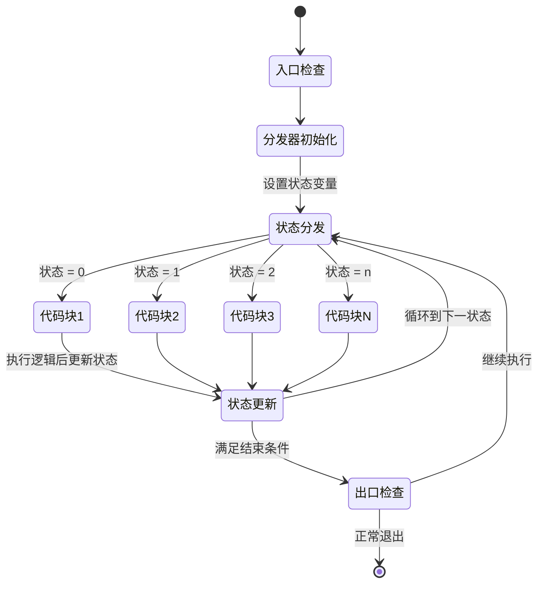

**控制流图分析与优化策略：**

```mermaid
graph LR
    subgraph "原始控制流"
        A1[入口] --> B1[条件判断1]
        B1 --> C1[逻辑块A]
        B1 --> D1[逻辑块B]
        C1 --> E1[条件判断2]
        D1 --> E1
        E1 --> F1[逻辑块C]
        E1 --> G1[逻辑块D]
        F1 --> H1[出口]
        G1 --> H1
    end

    subgraph "混淆后控制流"
        A2[入口] --> B2[分发器]
        B2 --> C2[伪逻辑块1]
        B2 --> D2[伪逻辑块2]
        B2 --> E2[伪逻辑块3]
        B2 --> F2[伪逻辑块4]

        C2 --> G2[状态更新]
        D2 --> G2
        E2 --> G2
        F2 --> G2

        G2 --> B2: 循环分发

        B2 -.->|特定状态| H2[真实逻辑A]
        B2 -.->|特定状态| I2[真实逻辑B]
        B2 -.->|特定状态| J2[真实逻辑C]

        H2 --> G2
        I2 --> G2
        J2 --> G2

        G2 --> K2[出口]
    end
```

### 4.2.4 动态代码执行与运行时保护机制

现代JavaScript混淆大量采用动态代码执行技术，通过在运行时生成和执行代码来规避静态分析。这种技术结合环境检测，形成了强大的运行时保护体系。

**动态代码执行的技术分类：**

```mermaid
graph TB
    subgraph "动态执行技术"
        A[eval函数] --> A1[直接字符串执行]
        A --> A2[字符串拼接执行]
        A --> A3[循环动态执行]

        B[Function构造器] --> B1[函数体动态生成]
        B --> B2[参数动态构造]
        B --> B3[返回值动态计算]

        C[模板字符串] --> C1[标签模板函数]
        C --> C2[动态模板注入]
        C --> C3[嵌套模板执行]

        D[定时器执行] --> D1[setTimeout动态执行]
        D --> D2[setInterval循环执行]
        D --> D3[requestAnimationFrame]
    end

    subgraph "保护机制"
        E[环境检测] --> E1[浏览器环境检测]
        E --> E2[调试器检测]
        E --> E3[虚拟机检测]
        E --> E4[时间检测]

        F[代码完整性] --> F1[源码Hash校验]
        F --> F2[函数长度检查]
        F --> F3[调用栈验证]
        F --> F4[内存布局检查]

        G[反调试技术] --> G1[无限循环陷阱]
        G --> G2[调试器异常]
        G --> G3[性能监控]
        G --> G4[断点检测]
    end

    A -.->|触发| E
    B -.->|触发| F
    C -.->|触发| G
    D -.->|持续监控| E
```

**运行时保护机制的工作流程：**

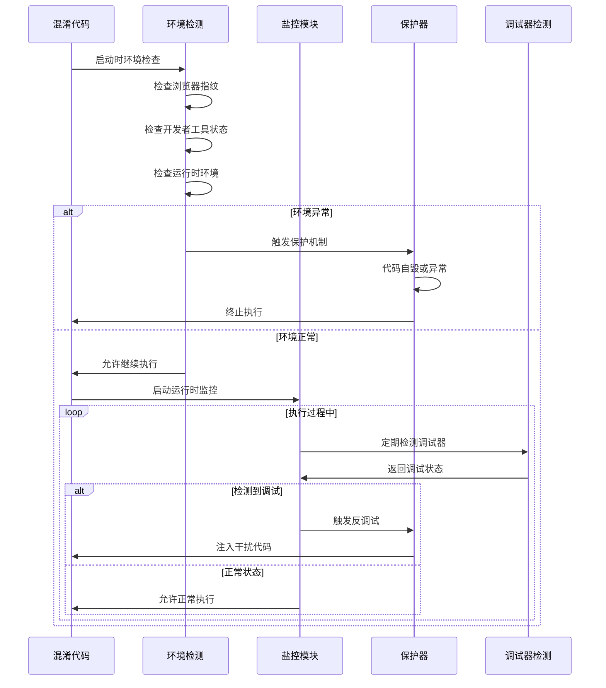

### 4.2.5 WebAssembly保护技术与逆向分析

WebAssembly（WASM）已成为现代JavaScript保护的重要手段。通过将核心算法编译为WASM，可以有效保护关键逻辑不被轻易逆向。

**WASM保护技术的架构设计：**

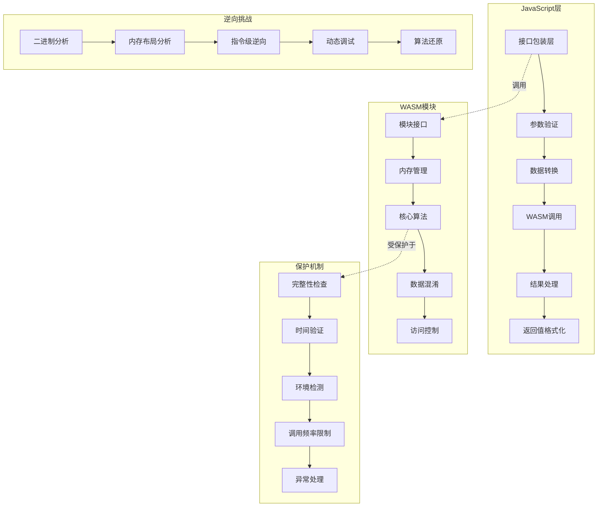

**WASM逆向分析的技术路径：**

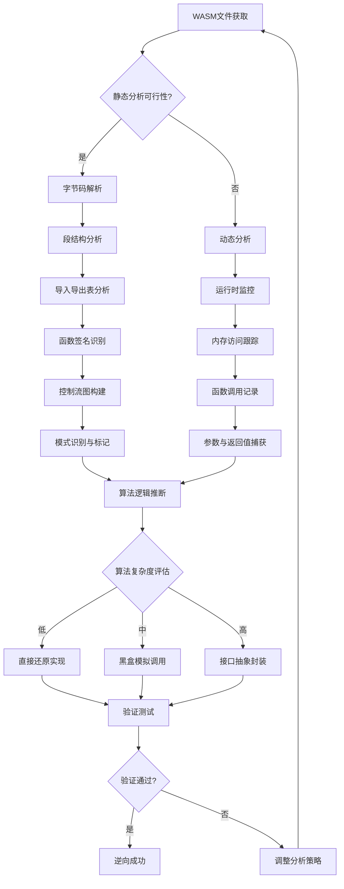

### 4.2.6 混淆代码的自动化分析策略

面对日益复杂的混淆技术，手动分析已经无法满足需求。自动化的分析系统能够快速识别混淆模式，并生成相应的破解策略。

**自动化分析系统的架构设计：**

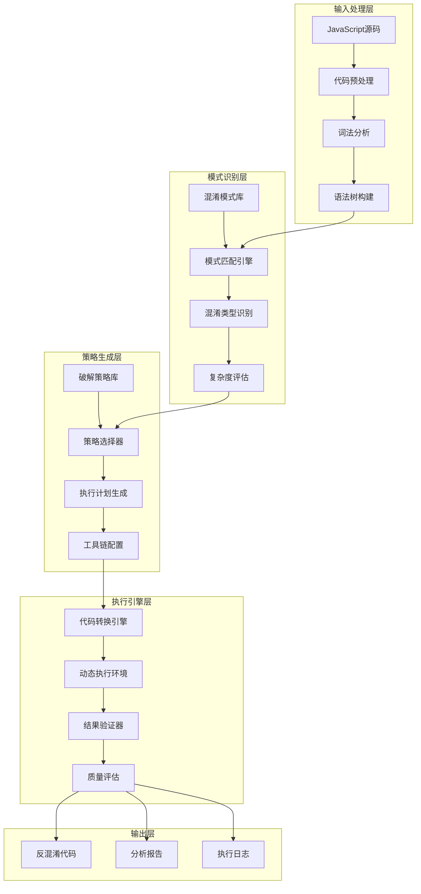

**机器学习在混淆分析中的应用：**

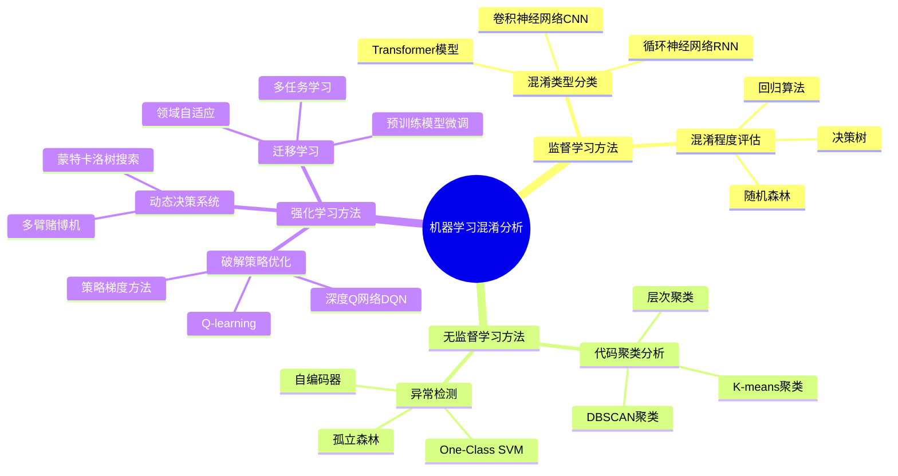

### 4.2.7 反混淆技术的最佳实践与策略

在实际的爬虫开发中，反混淆技术需要结合具体场景选择合适的策略。不同的混淆类型需要不同的应对方法，而效率与准确性的平衡也是关键考量。

**反混淆策略选择的决策树：**

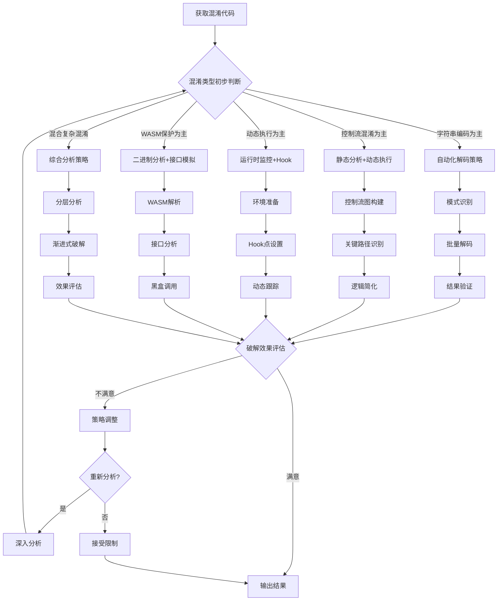

**反混淆效果评估指标体系：**

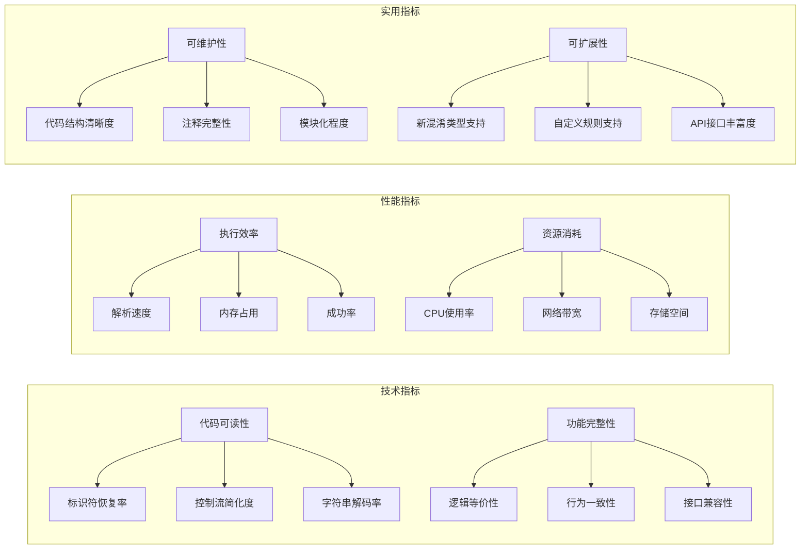

## 总结

JavaScript代码混淆与反混淆技术是现代Web爬虫领域的核心技术之一。本章从技术演进的角度，系统性地介绍了各种混淆技术的原理、特征和破解策略。

### 关键洞察：

1. **技术演进趋势**：JavaScript混淆技术从简单的静态混淆发展到复杂的动态保护，甚至引入了WebAssembly和AI驱动的高级保护机制

2. **多层次保护体系**：现代混淆技术结合了静态混淆、动态保护、环境检测等多种手段，形成了立体的防护体系

3. **分析方法多样化**：针对不同类型的混淆，需要采用静态分析、动态分析、统计分析等多种方法相结合的策略

4. **自动化是必然趋势**：面对日益复杂的混淆技术，自动化的分析系统已经成为必不可少的工具

5. **理论与实践并重**：反混淆技术不仅需要扎实的理论基础，还需要大量的实践经验积累

6. **持续对抗升级**：混淆与反混淆技术之间存在持续的对抗升级，需要保持技术的更新迭代

7. **合规性考量**：在应用反混淆技术时，需要充分考虑法律和伦理的边界

下一章将深入探讨动态调试与Hook技术，这是获取运行时信息、破解复杂保护机制的关键技术手段。