# 第5章：WebSocket与实时数据抓取

## 引言：从静态抓取到实时数据流的技术演进

随着Web应用向实时化和交互化方向发展，传统的HTTP轮询模式已无法满足现代应用对实时性的要求。WebSocket协议的出现标志着Web实时通信技术的重大突破，它通过建立持久化的全双工通信通道，实现了服务器与客户端之间的高效数据交换。

对于爬虫技术而言，WebSocket既是挑战也是机遇。一方面，实时数据流增加了数据抓取的复杂性；另一方面，掌握WebSocket技术使我们能够获取传统方法难以触及的动态实时数据。本章将从协议原理、系统架构、工程实践等多个维度，深入探讨WebSocket实时数据抓取的核心技术。

## 5.1 WebSocket协议深度解析

### 5.1.1 WebSocket协议的演进历程

WebSocket协议的设计理念源于对传统HTTP通信模式的突破。在WebSocket出现之前，实时Web应用主要依赖HTTP轮询、长轮询、Comet等技术，这些方法都存在延迟高、资源消耗大、服务器压力大等问题。

**协议演进的关键节点：**

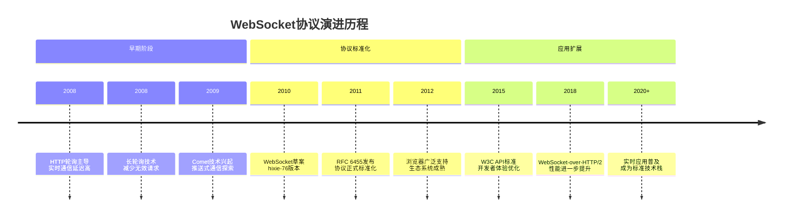

### 5.1.2 WebSocket握手协议机制

WebSocket连接的建立过程体现了协议设计的精妙之处，它在HTTP协议基础上实现了无缝升级，保持了良好的向后兼容性。

**握手过程的核心机制：**

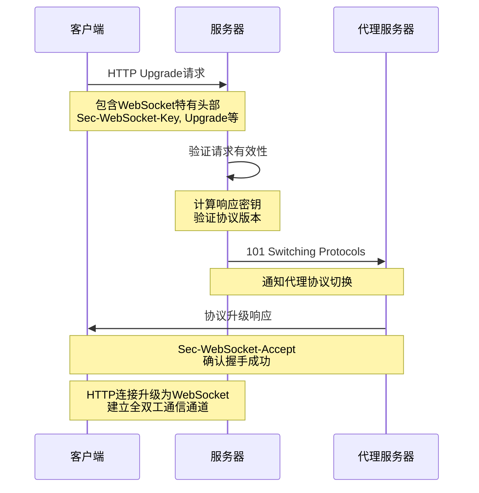

**关键头部字段的技术意义：**

| 头部字段 | 功能作用 | 技术原理 | 安全考虑 |
|---------|---------|---------|---------|
| Upgrade | 协议升级标识 | 明确告知期望的协议 | 防止协议混淆攻击 |
| Connection | 连接管理 | 控制连接状态转移 | 避免连接劫持 |
| Sec-WebSocket-Key | 握手验证 | 客户端随机数生成 | 防止跨协议攻击 |
| Sec-WebSocket-Accept | 握手确认 | 服务器响应验证 | 确保握手真实性 |
| Sec-WebSocket-Version | 版本协商 | 协议版本兼容性 | 避免版本冲突 |

### 5.1.3 WebSocket帧结构与数据传输

WebSocket数据传输采用帧结构设计，这种设计既保证了数据传输的效率，又提供了灵活的扩展能力。

**帧结构的层次化设计：**

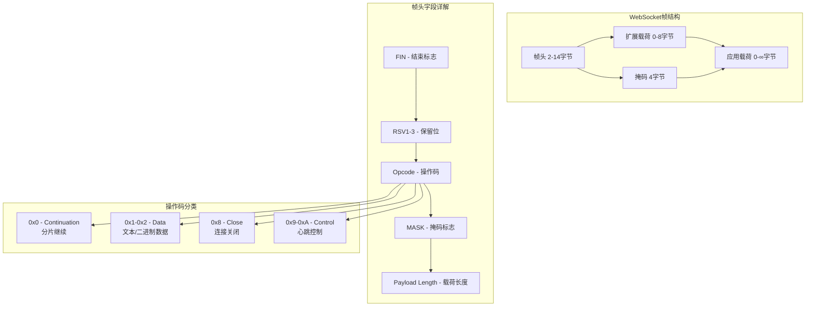

**数据分片传输机制：**

WebSocket支持大数据的分片传输，这种机制在处理大型实时数据流时尤为重要。

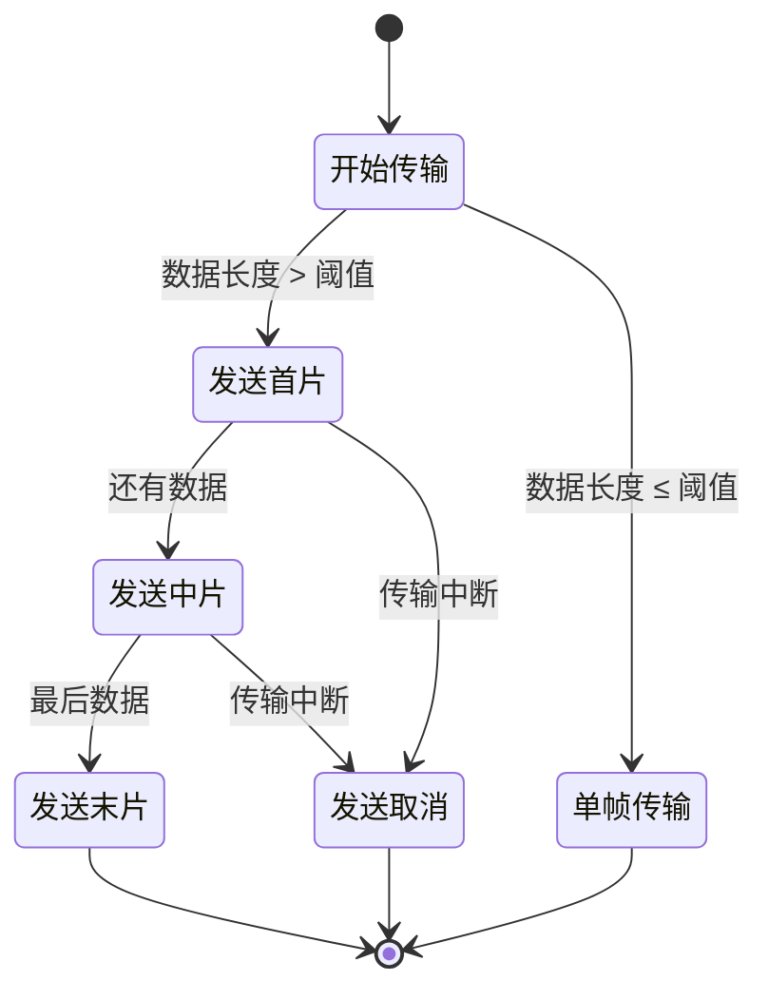

## 5.2 实时数据流处理技术

### 5.2.1 实时数据流的特征与挑战

实时数据流处理是WebSocket爬虫的核心技术环节，与传统批处理相比，它具有截然不同的技术要求和处理模式。

**实时数据流的核心特征：**

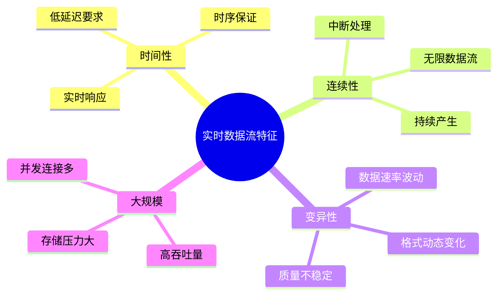

**实时处理的技术挑战分析：**

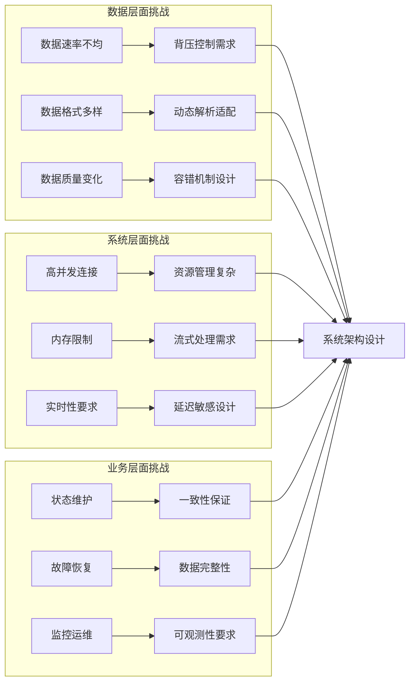

### 5.2.2 流式数据处理架构设计

现代实时数据流处理采用分层架构设计，每一层专注于特定的处理职责，通过清晰的接口实现模块间的协作。

**流式处理架构的层次化设计：**

```mermaid
pyramid
    title 流式数据处理架构层次

    "应用展示层" : 5%
    "业务逻辑层" : 15%
    "数据处理层" : 25%
    "传输协议层" : 30%
    "基础设施层" : 25%
```

**数据流处理的核心组件：**

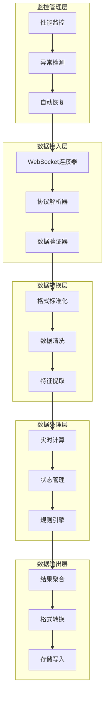

### 5.2.3 数据缓冲与批处理策略

在实时数据流处理中，缓冲机制和批处理策略直接影响系统的性能表现和资源利用率。

**智能缓冲策略的设计原理：**

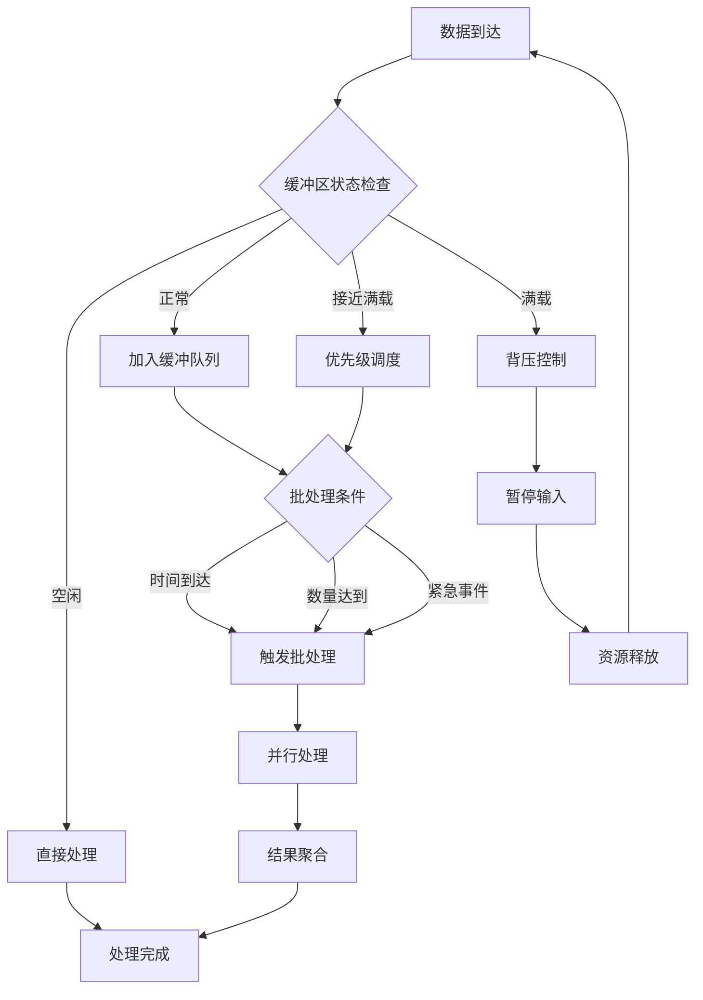

**动态批处理优化算法：**

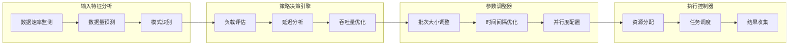

## 5.3 心跳检测与连接管理

### 5.3.1 WebSocket连接的生命周期管理

WebSocket连接的生命周期管理是确保实时数据抓取稳定性的关键环节，需要考虑连接建立、维护、异常处理和资源清理等多个方面。

**连接生命周期的完整流程：**

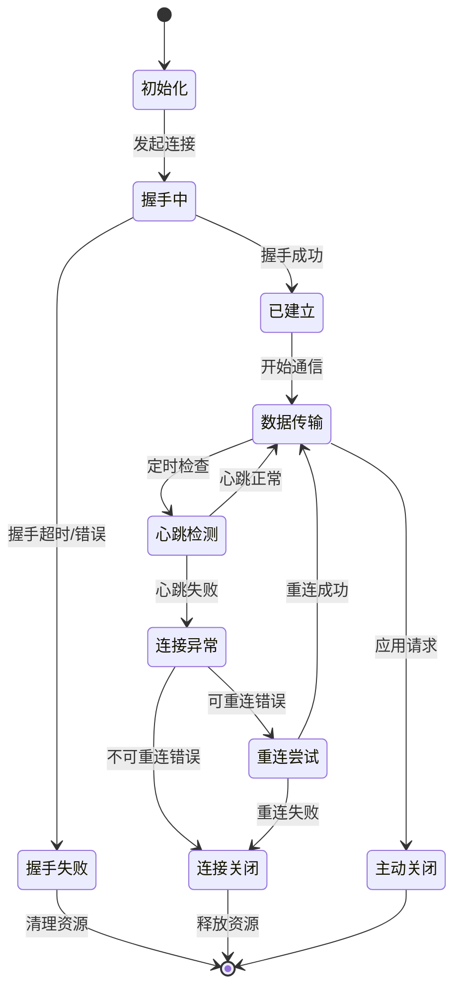

**连接状态管理的核心机制：**

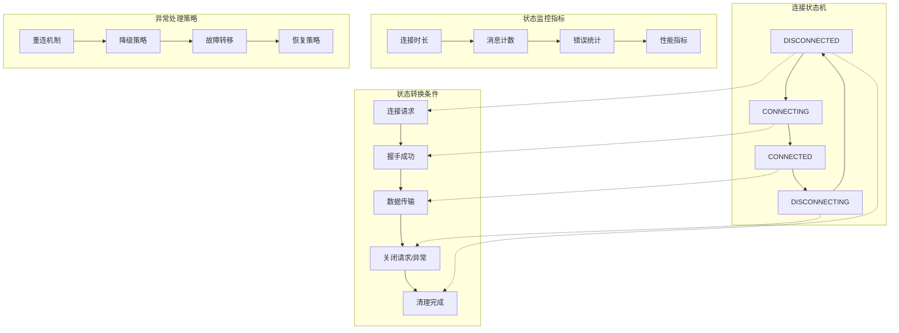

### 5.3.2 智能心跳检测机制

心跳检测是维护WebSocket连接稳定性的核心技术，智能心跳机制需要根据网络状况和应用特点动态调整检测策略。

**心跳检测的多层次设计：**

```mermaid
pyramid
    title 心跳检测层次结构

    "应用层心跳" : 20%
    "协议层心跳" : 30%
    "传输层心跳" : 35%
    "网络层检测" : 15%
```

**自适应心跳算法的核心逻辑：**

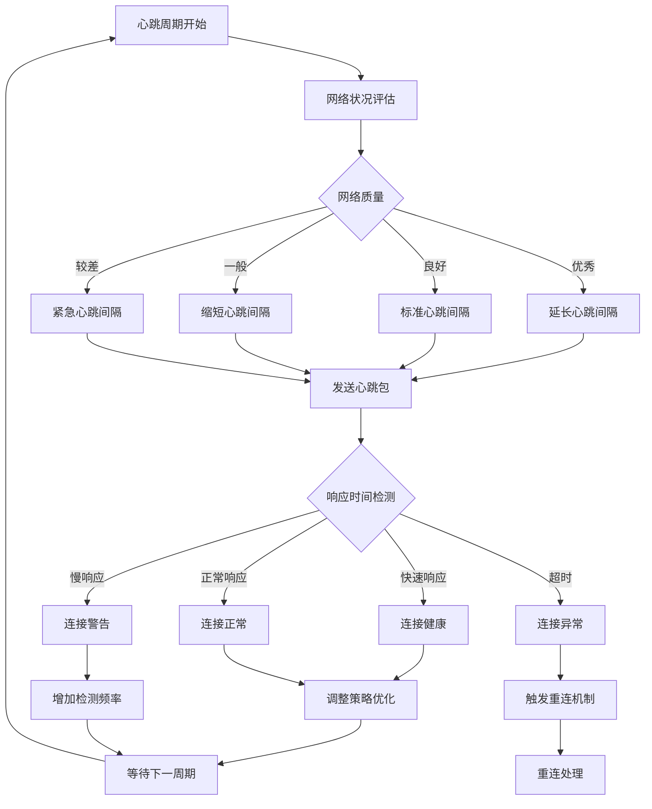

**心跳包的智能化设计：**

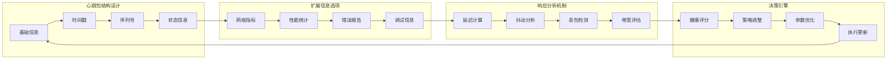

## 5.4 数据包解析与重组技术

### 5.4.1 数据分片传输的理论基础

WebSocket协议支持大数据的分片传输，这一机制对于处理大型实时数据流、保证传输效率具有重要意义。

**分片传输的核心原理：**

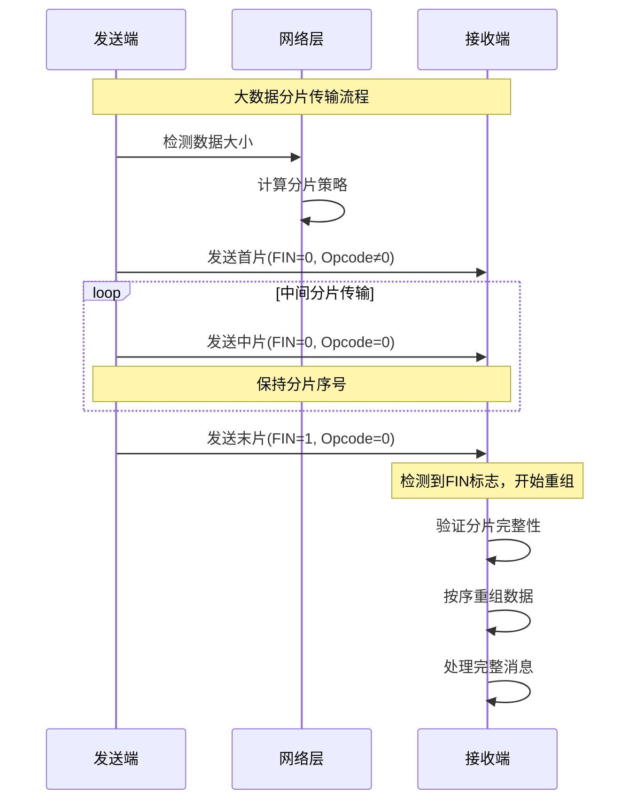

**分片策略的智能决策：**

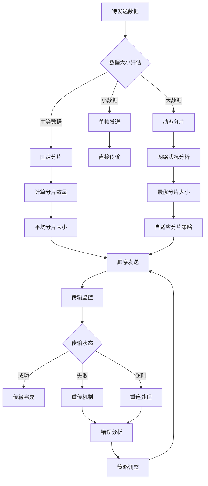

### 5.4.2 消息重组算法与实现

消息重组是WebSocket数据流处理中的关键技术，需要处理分片丢失、乱序、重复等各种异常情况。

**重组算法的状态机模型：**

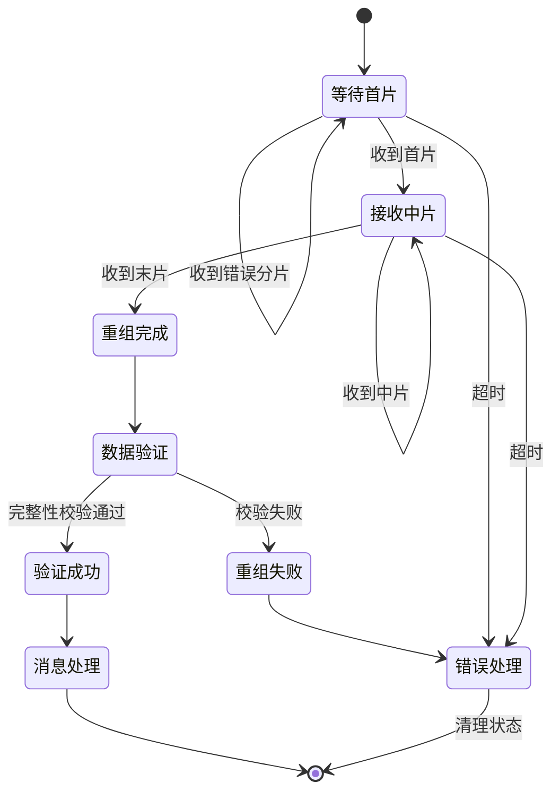

**高效重组策略的设计要点：**

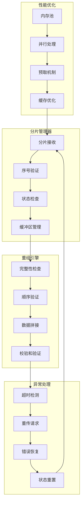

## 5.5 实时数据存储优化

### 5.5.1 时序数据的存储策略

实时数据抓取产生的数据具有明显的时间特征，采用时序数据库存储策略能够大幅提升查询性能和存储效率。

**时序数据的分层存储架构：**

```mermaid
pyramid
    title 时序数据存储层次

    "热数据层<br>(实时访问)" : 15%
    "温数据层<br>(近期查询)" : 25%
    "冷数据层<br>(历史分析)" : 35%
    "归档层<br>(长期保存)" : 25%
```

**数据生命周期的管理策略：**

```mermaid
flowchart TD
    A[实时数据写入] --> B[热数据存储]
    B --> C[数据访问监控]
    C --> D{访问频率评估}

    D -->|高频访问| E[保持热数据]
    D -->|中频访问| F[迁移到温数据]
    D -->|低频访问| G[迁移到冷数据]
    D -->|极少访问| H[归档处理]

    E --> I[定期检查]
    F --> J[压缩处理]
    G --> K[聚合预处理]
    H --> L[长期归档]

    I --> C
    J --> M[温数据存储]
    K --> N[冷数据存储]
    L --> O[归档存储]

    M --> P[定期评估]
    N --> P
    P --> C
```

### 5.5.2 内存缓存与持久化的平衡

在实时数据存储中，内存缓存和持久化存储的平衡直接影响系统的性能表现和数据可靠性。

**多级缓存架构设计：**

```mermaid
graph TB
    subgraph "L1缓存 - 应用内存"
        A[最新数据] --> B[热索引]
        B --> C[计算缓存]
    end

    subgraph "L2缓存 - Redis/Memcached"
        D[近期数据] --> E[聚合结果]
        E --> F[会话状态]
    end

    subgraph "L3缓存 - 本地存储"
        G[历史数据] --> H[压缩缓存]
        H --> I[预计算结果]
    end

    subgraph "持久化存储"
        J[时序数据库] --> K[对象存储]
        K --> L[数据仓库]
    end

    A --> D
    D --> G
    G --> J

    subgraph "缓存策略"
        M[LRU淘汰] --> N[过期清理]
        N --> O[预取机制]
        O --> P[写入策略]
    end

    C --> M
    F --> M
    I --> M
```

**写入性能优化的核心策略：**

```mermaid
mindmap
  root((写入优化策略))
    批量写入
      聚合小数据包
      异步批量提交
      事务优化
    异步处理
      非阻塞写入
      队列缓冲
      并行处理
    压缩技术
      数据压缩
      索引压缩
      存储压缩
    分区策略
      时间分区
      类型分区
      负载分区
    预计算
      实时聚合
      统计预计算
      索引预建
```

## 总结

### 核心技术要点回顾

本章深入探讨了WebSocket与实时数据抓取的核心技术体系，构建了从协议原理到工程实践的完整知识框架：

1. **协议层面深度理解**：
   - WebSocket协议的演进历程和设计哲学
   - 握手机制的安全性和兼容性考量
   - 帧结构设计的高效性和扩展性

2. **实时流处理技术**：
   - 流式数据处理的架构设计原则
   - 智能缓冲和批处理优化策略
   - 背压控制和资源管理机制

3. **连接管理核心机制**：
   - 连接生命周期管理最佳实践
   - 智能心跳检测算法设计
   - 异常恢复和故障处理策略

4. **数据处理技术**：
   - 分片传输的理论基础和实现策略
   - 消息重组算法的设计原理
   - 数据完整性保证机制

5. **存储优化方案**：
   - 时序数据的分层存储架构
   - 多级缓存系统的设计
   - 内存与持久化的平衡策略

### 技术发展趋势与展望

实时数据抓取技术正在向更加智能化、自动化和高效化的方向发展：

- **智能化处理**：机器学习算法在数据清洗、异常检测、质量评估中的应用
- **边缘计算**：将数据处理下沉到网络边缘，减少传输延迟
- **云原生架构**：基于容器和微服务的弹性伸缩架构
- **实时分析**：流式计算和复杂事件处理的深度融合
- **隐私保护**：差分隐私和联邦学习在数据抓取中的应用

### 实战应用指导原则

在实际工程应用中，WebSocket实时数据抓取需要遵循以下核心原则：

1. **稳定性优先**：建立完善的监控、告警、恢复机制
2. **性能平衡**：在实时性、吞吐量、资源消耗间找到最佳平衡点
3. **可扩展性**：设计支持水平扩展的架构模式
4. **数据质量**：建立完整的数据验证和清洗流程
5. **安全合规**：确保数据抓取的合法性和安全性

掌握这些技术和原则，能够帮助我们构建出高效、稳定、可扩展的实时数据抓取系统，为现代Web应用的数据获取提供强有力的技术支撑。
