# 第6章：移动端API接口分析

## 引言：移动生态系统的技术挑战与机遇

移动互联网的蓬勃发展催生了一个独特的生态系统，移动应用的API接口成为了数据交互的核心枢纽。与传统的Web端API相比，移动端API具有更为复杂的技术特征：更严格的安全机制、更复杂的认证体系、更多样化的反爬策略。这种复杂性既是挑战也是机遇——掌握移动端API分析技术，意味着能够获取传统Web爬虫难以触及的高价值数据源。

移动端API分析是一个跨学科的综合性技术领域，它融合了网络协议分析、逆向工程、移动安全、系统架构等多个技术维度。本章将从技术原理、工程实践、安全对抗等多个角度，系统性地阐述移动端API接口分析的完整技术体系。

## 6.1 移动应用网络请求深度分析

### 6.1.1 移动网络通信的架构特征

移动应用的网络通信架构与传统Web应用存在根本性差异，理解这些差异是成功分析移动端API的基础。

**移动网络通信的层次化架构：**

```mermaid
pyramid
    title 移动网络通信架构层次

    "应用层协议<br>(HTTP/HTTPS/WebSocket)" : 15%
    "传输优化层<br>(SPDY/HTTP2/QUIC)" : 20%
    "安全认证层<br>(OAuth/JWT/Token)" : 25%
    "系统网络层<br>(iOS/Android网络栈)" : 25%
    "硬件接口层<br>(4G/5G/WiFi)" : 15%
```

**移动端网络请求的技术特征分析：**

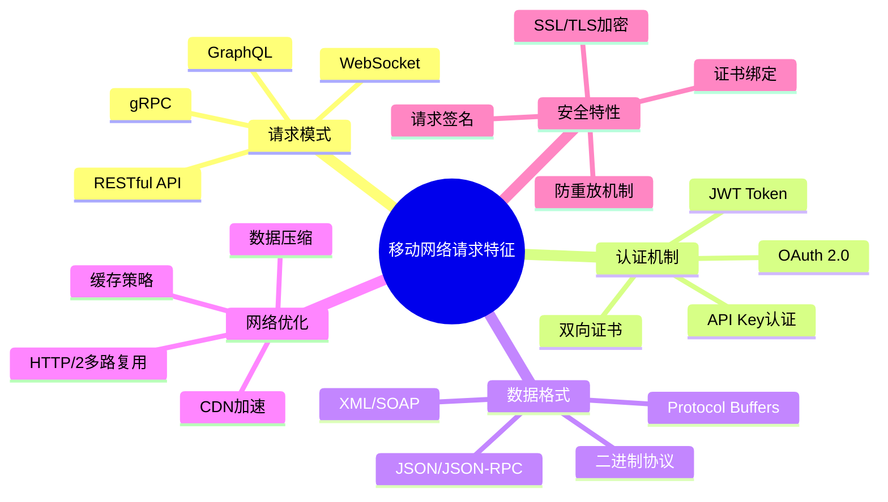

### 6.1.2 代理抓包技术的原理与实现

代理抓包是分析移动端网络请求的核心技术手段，它通过在网络层面拦截和解析数据包来获取完整的API通信信息。

**代理抓包的技术原理：**

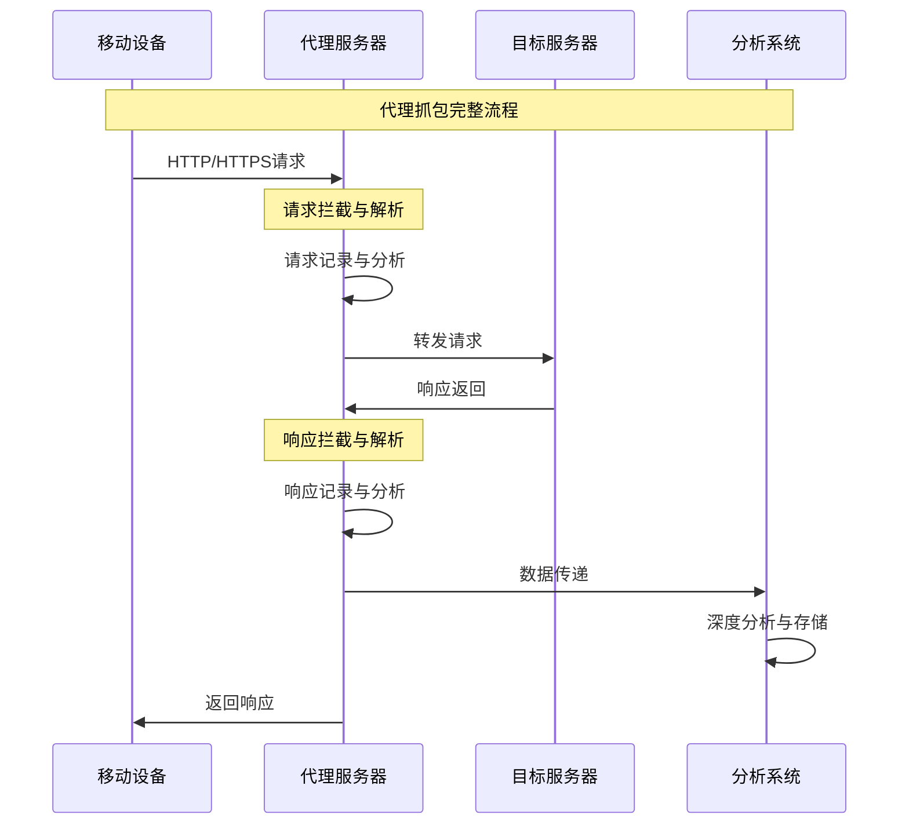

**多层代理抓包架构设计：**

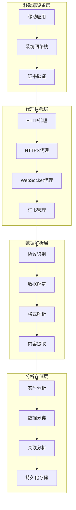

**证书信任链管理的复杂性：**

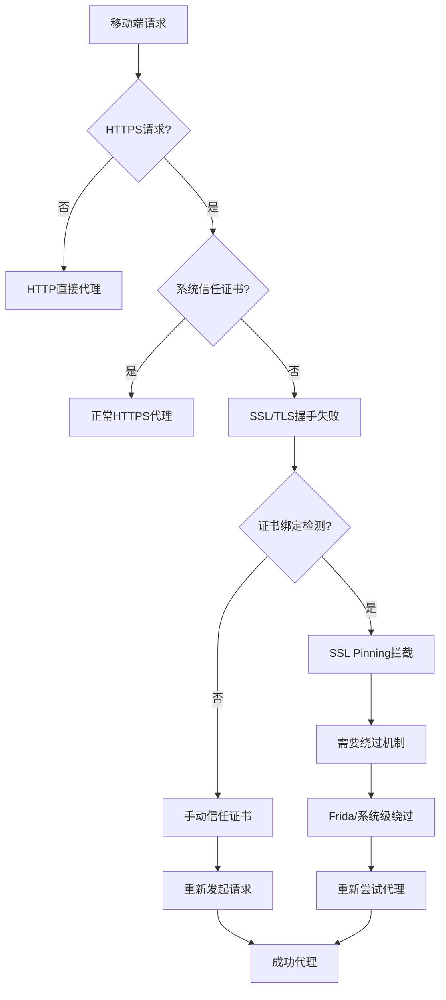

### 6.1.3 移动端证书管理的技术原理

移动端证书管理是HTTPS抓包的技术难点，涉及操作系统、应用层、协议层的多个安全机制。

**证书信任链建立过程：**

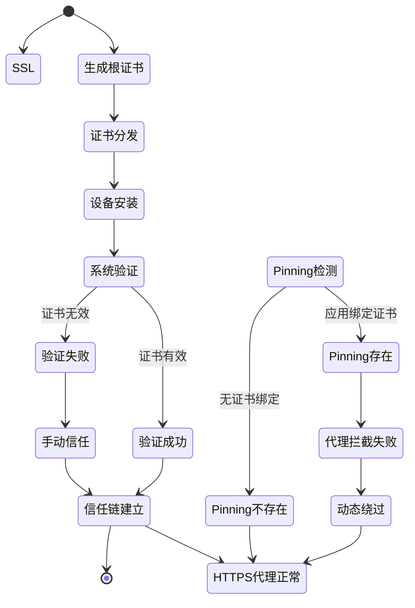

**证书管理的多维度策略：**

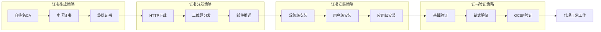

## 6.2 SSL Pinning绕过技术的深度剖析

### 6.2.1 SSL Pinning机制的分类与原理

SSL Pinning是移动应用中常见的安全机制，通过将服务器的SSL证书或公钥硬编码在应用中，实现只信任特定证书的安全策略。

**SSL Pinning技术分类体系：**

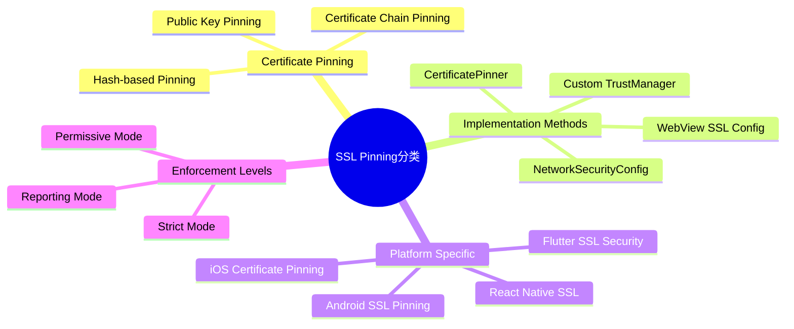

**SSL Pinning的工作机制：**

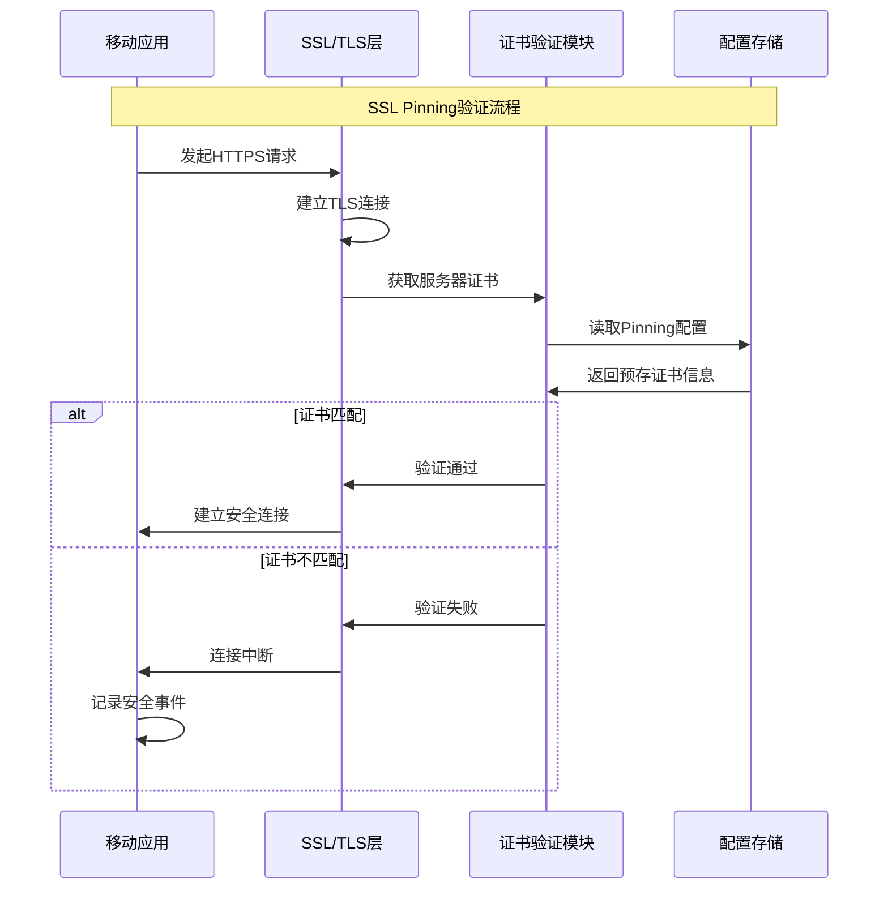

### 6.2.2 动态Hook技术的原理与应用

动态Hook技术是绕过SSL Pinning的核心手段，通过运行时代码注入和方法拦截来修改应用的证书验证逻辑。

**动态Hook技术架构：**

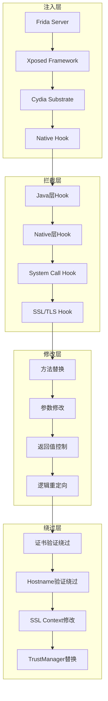

**Frida Hook的执行流程：**

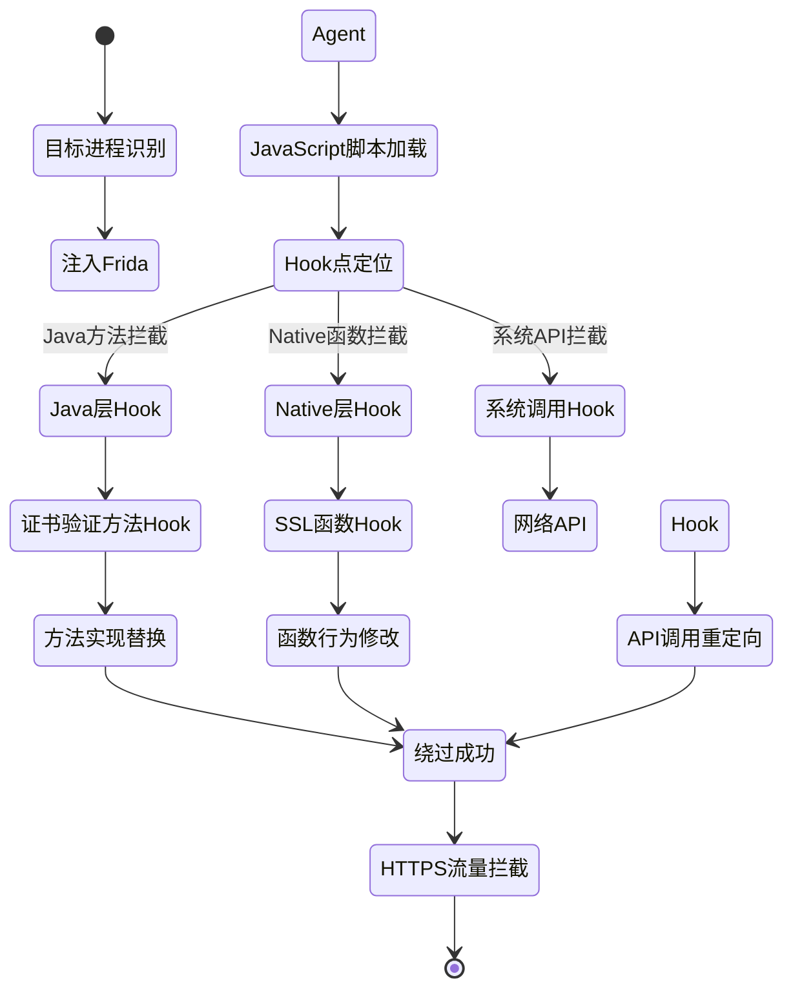

### 6.2.3 系统级绕过策略的原理

系统级绕过策略通过修改操作系统层面的安全机制来实现SSL Pinning的绕过，具有更强的通用性和稳定性。

**系统级绕过的技术路径：**

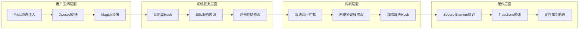

**不同绕过策略的对比分析：**

| 策略类型 | 技术复杂度 | 稳定性 | 检测风险 | 适用场景 | 持久性 |
|---------|-----------|--------|---------|---------|--------|
| Frida动态注入 | 中 | 中 | 低 | 临时分析 | 会话级别 |
| Xposed模块 | 高 | 高 | 中 | 长期使用 | 系统级别 |
| Magisk模块 | 高 | 高 | 中 | 系统修改 | 启动级别 |
| 系统级修改 | 极高 | 极高 | 高 | 深度定制 | 永久级别 |

## 6.3 移动端反调试对抗技术

### 6.3.1 反调试机制的技术原理

移动应用的反调试机制是保护应用安全的重要手段，通过多种技术手段来检测和阻止动态分析工具的介入。

**反调试技术的完整体系：**

```mermaid
pyramid
    title 反调试技术层次结构

    "应用层反调试<br>(Java/Swift代码检测)" : 25%
    "运行时环境检测<br>(JVM/ART环境分析)" : 30%
    "系统级检测<br>(系统调用/进程监控)" : 25%
    "硬件级检测<br>(调试器硬件特征)" : 20%
```

**反调试检测机制的工作流程：**

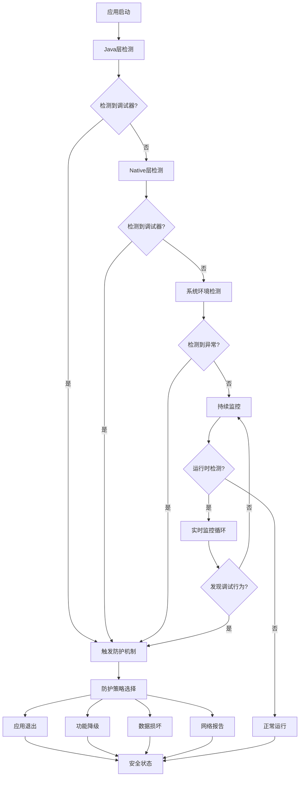

### 6.3.2 多层反调试检测策略

现代移动应用通常采用多层反调试检测策略，通过不同技术维度的组合来实现更强大的保护效果。

**反调试检测的多维度矩阵：**

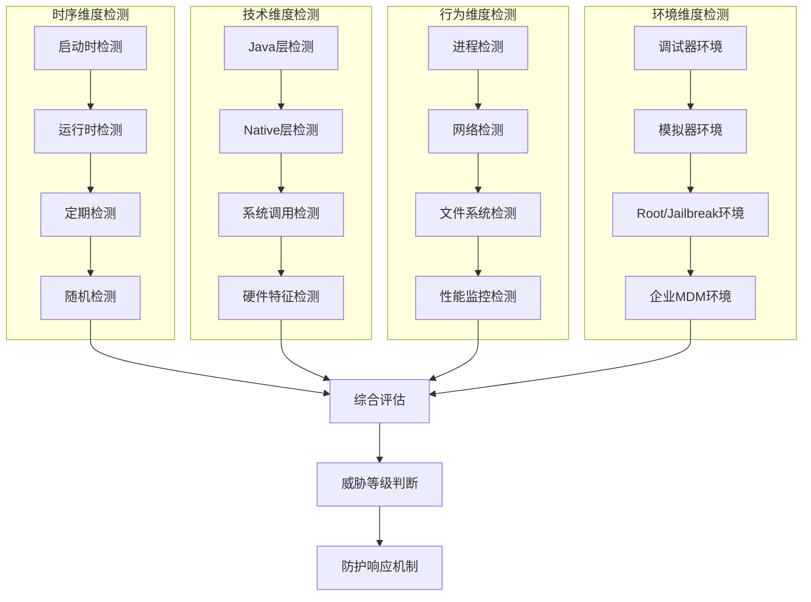

**Java层反调试检测技术详解：**

```mermaid
mindmap
  root((Java层反调试))
    Debug API检测
      Debug.isDebuggerConnected()
      Debug.waitingForDebugger()
      Debug.startMethodTracing()
    Build配置检测
      BuildConfig.DEBUG
      ApplicationInfo.FLAG_DEBUGGABLE
      Manifest配置检测
    运行时环境检测
      JVM参数检测
      StackTrace分析
      异常处理机制
    应用行为检测
      安装来源检测
      签名验证检测
      包名验证检测
```

### 6.3.3 动态反调试对抗策略

针对移动应用的反调试机制，动态对抗策略通过运行时的技术手段来绕过或禁用这些保护措施。

**动态对抗策略的技术框架：**

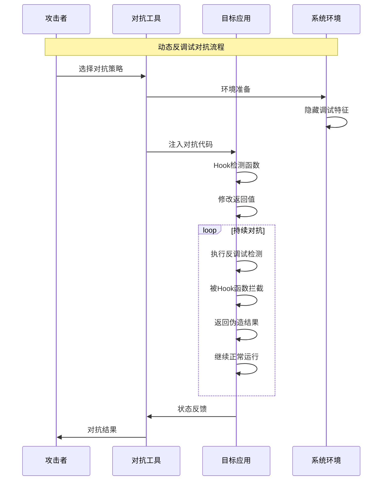

**Hook技术在反调试对抗中的应用：**

```mermaid
graph LR
    subgraph "Hook目标函数"
        A[Debug.isDebuggerConnected] --> B[Debug.waitingForDebugger]
        B --> C[android.os.Debug]
        C --> D[BuildConfig.DEBUG]
    end

    subgraph "Hook策略"
        E[返回值替换] --> F[参数修改]
        F --> G[逻辑重定向]
        G --> H[异常拦截]
    end

    subgraph "实现手段"
        I[Frida JavaScript] --> J[Xposed模块]
        J --> K[Native Hook]
        K --> L[PLT Hook]
    end

    subgraph "效果验证"
        M[功能正常] --> N[性能无影响]
        N --> O[隐蔽性强]
        O --> P[稳定性好]
    end

    D --> E
    H --> I
    L --> M
```

## 6.4 移动端API分析的综合应用策略

### 6.4.1 完整的移动端API分析工作流

成功的移动端API分析需要系统化的工作流程，将各种技术手段有机结合，形成完整的分析体系。

**移动端API分析的完整流程：**

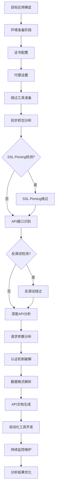

**多技术融合的应用策略：**

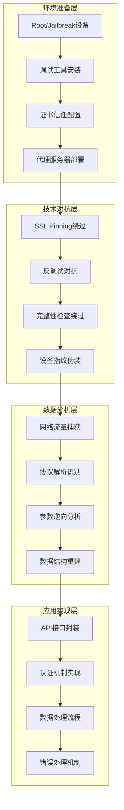

### 6.4.2 实战案例的技术要点分析

通过分析典型的移动端API分析案例，我们可以更好地理解各项技术的实际应用效果。

**典型移动应用的API特征分析：**

```mermaid
mindmap
  root((移动API特征))
    电商应用
      商品搜索API
      订单查询API
      用户认证API
      支付接口API
    社交应用
      消息同步API
      好友列表API
      动态发布API
      用户资料API
    金融应用
      账户查询API
      交易记录API
      投资理财API
      风控评估API
    视频应用
      内容推荐API
      播放记录API
      用户偏好API
      评论互动API
```

**不同类型应用的防护强度对比：**

| 应用类型 | SSL Pinning强度 | 反调试复杂度 | 证书验证严格度 | API加密程度 | 分析难度 |
|---------|----------------|-------------|---------------|-----------|---------|
| 电商应用 | 中等 | 中等 | 中等 | 低 | 中等 |
| 社交应用 | 高 | 高 | 高 | 中等 | 高 |
| 金融应用 | 极高 | 极高 | 极高 | 高 | 极高 |
| 视频应用 | 中等 | 低 | 中等 | 低 | 低 |
| 游戏应用 | 高 | 中等 | 高 | 高 | 高 |

## 总结

### 核心技术要点回顾

本章深入探讨了移动端API接口分析的核心技术体系，构建了从理论基础到实战应用的完整知识框架：

1. **移动网络通信架构理解**：深入理解移动端网络通信的层次化特征，为API分析奠定理论基础
2. **代理抓包技术体系**：掌握多层代理抓包架构和证书信任链管理，实现网络流量的全面拦截
3. **SSL Pinning绕过技术**：理解SSL Pinning的技术原理，掌握动态Hook和系统级绕过策略
4. **反调试对抗技术**：分析多层反调试检测机制，掌握动态对抗的技术手段
5. **综合应用策略**：构建完整的移动端API分析工作流，实现多技术的有机融合

### 技术发展趋势与挑战

移动端API分析技术正在向更加智能化、自动化的方向发展：

- **AI辅助分析**：机器学习在API行为识别和模式分析中的应用
- **自动化工具链**：从环境准备到数据处理的端到端自动化解决方案
- **云原生分析**：基于云计算的分布式移动端API分析平台
- **隐私保护技术**：差分隐私和联邦学习在API分析中的应用
- **跨平台统一**：统一的移动端API分析框架和标准化流程

### 实战应用指导原则

在实际工程应用中，移动端API分析需要遵循以下核心原则：

1. **合法合规优先**：确保所有分析活动符合法律法规和平台政策
2. **技术栈综合运用**：根据目标应用特征选择合适的技术组合
3. **渐进式分析方法**：从表层分析到深度挖掘的系统性分析流程
4. **持续学习更新**：跟进行业最新技术发展和防护机制演进
5. **安全风险管控**：建立完善的风险评估和安全防护机制

掌握这些技术和原则，能够帮助我们构建出高效、稳定、安全的移动端API分析系统，为现代移动应用的数据获取提供强有力的技术支撑。