# 第10章：浏览器指纹与伪装技术

## 10.1 浏览器指纹技术全景分析

### 10.1.1 浏览器指纹的定义与分类体系

浏览器指纹技术通过收集和分析浏览器及设备的各种特征信息，生成能够唯一标识用户或设备的特征向量。这种技术已经成为现代网站反爬虫体系的重要组成部分，即使在Cookie禁用的情况下也能实现用户追踪。

**浏览器指纹的核心特征：**

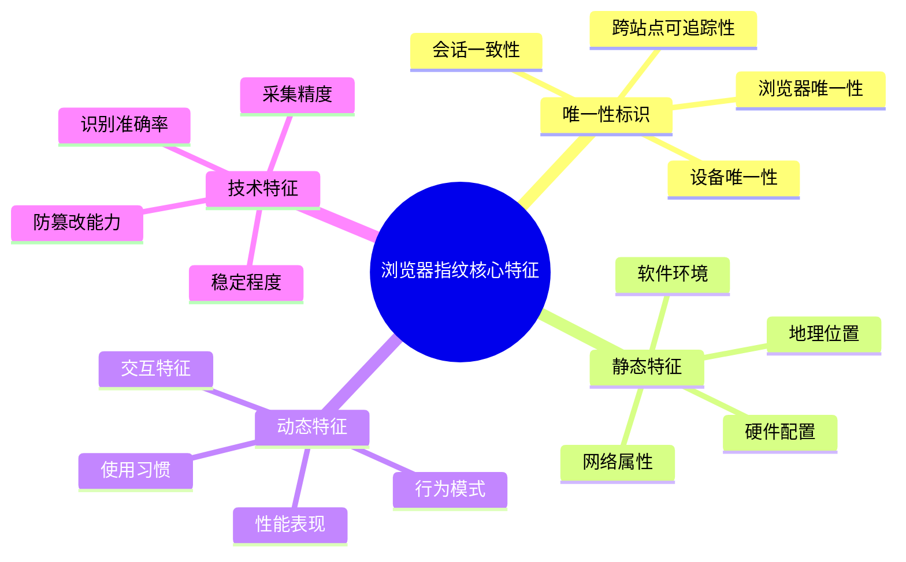

**浏览器指纹的稳定性与唯一性评估：**

```mermaid
pyramid
    title 指纹特征评估维度

    "唯一性<br"(设备区分度)" : 35%
    "稳定性<br"(时间一致性)" : 25%
    "可采集性<br"(技术实现难度)" : 20%
    "防篡改性<br"(抗伪造能力)" : 15%
    "合规性<br"(隐私保护要求)" : 5%
```

### 10.1.2 静态指纹与动态指纹的技术差异

静态指纹和动态指纹代表了两种不同的指纹采集策略，各自具有不同的技术特点和应用场景。

**静态指纹的技术架构：**

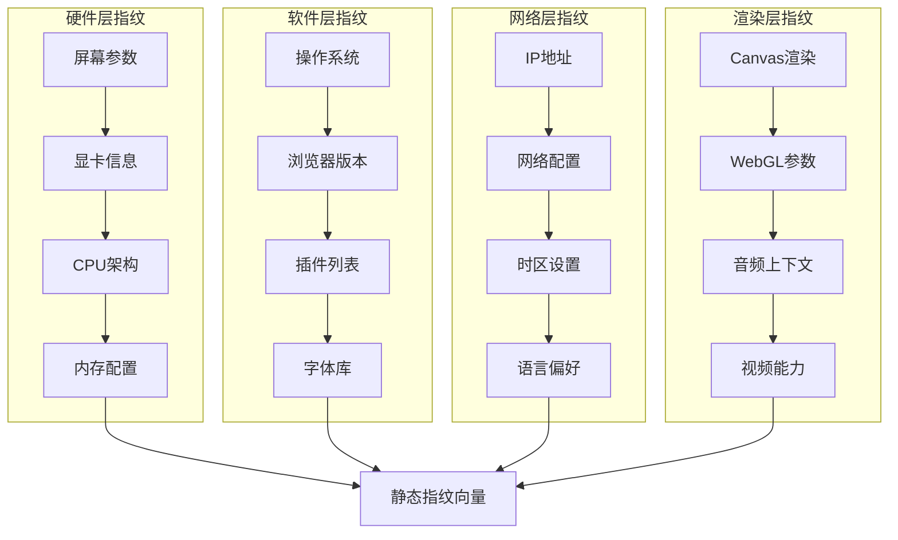

**动态指纹的行为特征分析：**

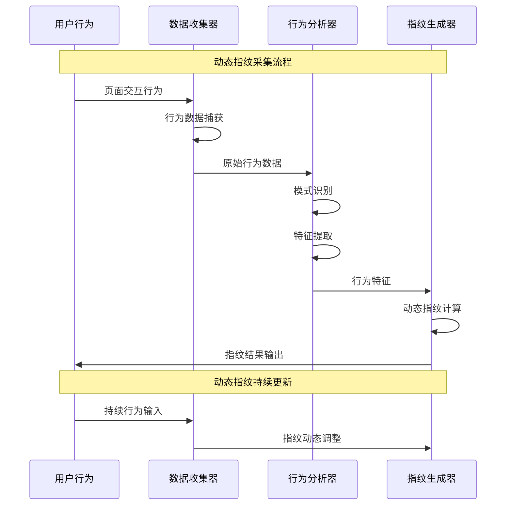

**大型网站指纹检测的技术对比：**

| 指纹类型 | 采集难度 | 稳定性 | 唯一性 | 实时性 | 检测成本 | 应用场景 |
|---------|---------|---------|---------|---------|---------|---------|
| 硬件指纹 | 中等 | 极高 | 高 | 低 | 中等 | 设备识别 |
| 软件指纹 | 低 | 高 | 中等 | 低 | 低 | 环境检测 |
| 渲染指纹 | 高 | 中等 | 极高 | 中等 | 高 | 高级反爬 |
| 行为指纹 | 极高 | 低 | 高 | 极高 | 极高 | 实时风控 |
| 网络指纹 | 中等 | 高 | 中等 | 低 | 中等 | 地理定位 |

### 10.1.3 指纹稳定性与唯一性评估指标

指纹的稳定性和唯一性是评估指纹技术效果的核心指标，直接关系到指纹在实际应用中的价值。

**指纹稳定性的技术评估：**

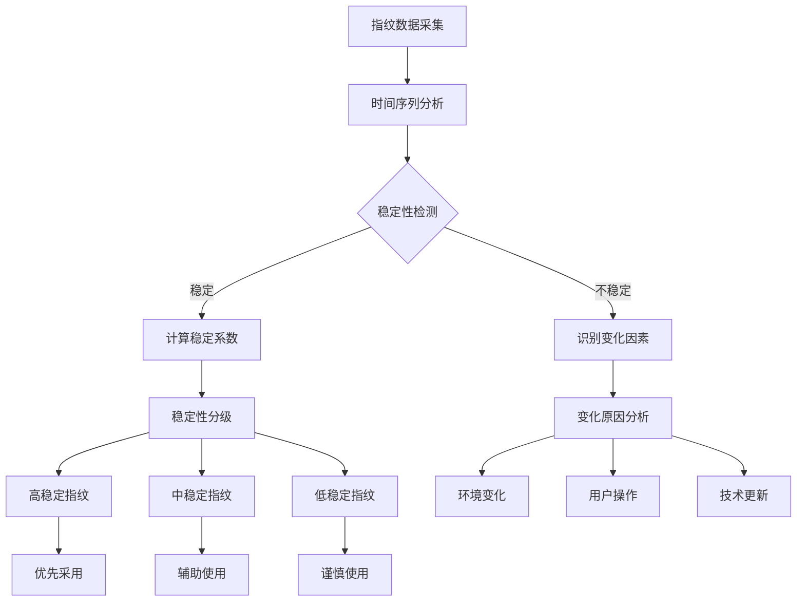

**指纹唯一性的量化评估方法：**

```mermaid
graph LR
    subgraph "数据预处理"
        A1[特征标准化] --> A2[噪声过滤]
        A2 --> A3[缺失值处理]
        A3 --> A4[异常值检测]
    end

    subgraph "相似度计算"
        B1[汉明距离] --> B2[余弦相似度]
        B2 --> B3[欧氏距离]
        B3 --> B4[杰卡德系数]
    end

    subgraph "聚类分析"
        C1[层次聚类] --> C2[K-means聚类]
        C2 --> C3[DBSCAN聚类]
        C3 --> C4[谱聚类]
    end

    subgraph "唯一性评估"
        D1[簇内紧密度] --> D2[簇间分离度]
        D2 --> D3[轮廓系数]
        D3 --> D4[唯一性评分]
    end

    A4 --> B1
    B4 --> C1
    C4 --> D1
```

### 10.1.4 跨浏览器指纹识别技术

跨浏览器指纹技术能够在不同浏览器之间保持用户识别的一致性，是现代追踪技术的高级应用。

**跨浏览器指纹的技术挑战：**

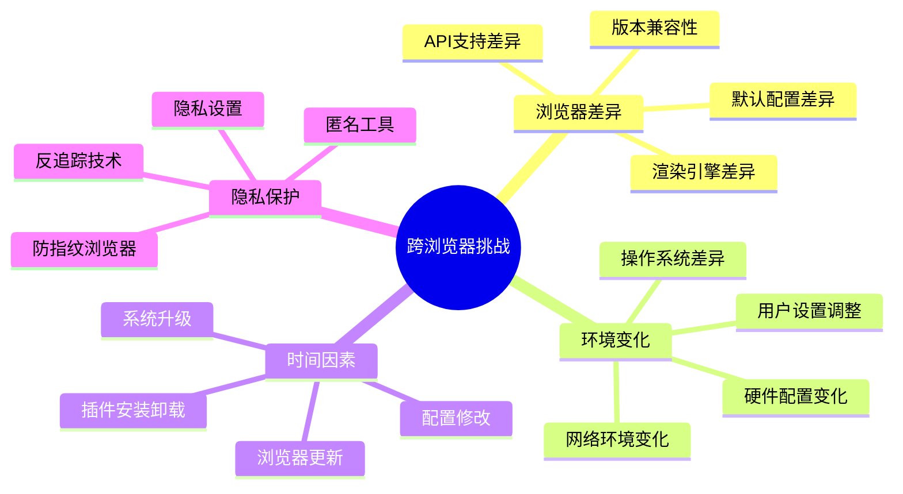

**跨浏览器指纹的技术架构：**

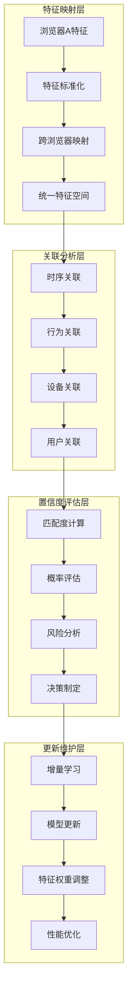

### 10.1.5 指纹隐私保护的法律与伦理考量

指纹技术虽然具有强大的识别能力，但也带来了重要的隐私保护和法律合规问题。

**隐私保护的技术实现：**

```mermaid
pyramid
    title 指纹隐私保护技术层次

    "用户控制<br"(同意机制/选择权)" : 25%
    "数据最小化<br"(最少采集/用途限制)" : 20%
    "技术保护<br"(匿名化/假名化)" : 20%
    "透明度<br"(告知义务/可解释性)" : 15%
    "安全保障<br"(加密存储/访问控制)" : 10%
    "合规管理<br"(审计追踪/责任明确)" : 10%
```

## 10.2 Canvas与WebGL指纹对抗技术

### 10.2.1 Canvas指纹的技术原理与生成机制

Canvas指纹利用HTML5 Canvas API的图形渲染差异来生成独特的设备标识，是目前最具识别力的指纹技术之一。

**Canvas指纹的技术原理：**

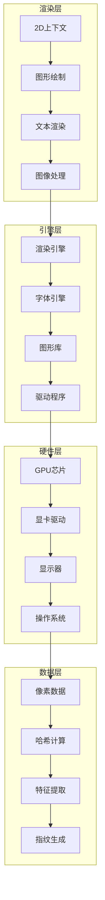

**Canvas指纹的生成流程：**

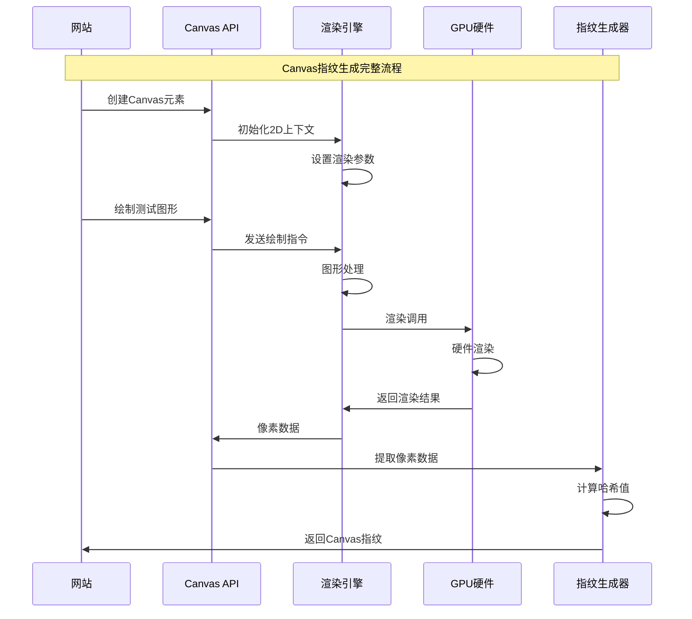

### 10.2.2 WebGL渲染指纹的检测方法

WebGL指纹通过获取WebGL渲染上下文的详细信息来生成设备标识，具有比Canvas指纹更高的唯一性和稳定性。

**WebGL指纹的信息层次：**

```mermaid
pyramid
    title WebGL指纹信息层次

    "硬件层信息<br"(GPU型号/驱动版本)" : 30%
    "渲染层信息<br"(渲染器/着色器/扩展)" : 25%
    "性能层信息<br"(参数限制/精度信息)" : 20%
    "兼容层信息<br"(版本支持/标准符合)" : 15%
    "配置层信息<br"(上下文设置/状态参数)" : 10%
```

**WebGL指纹的检测技术：**

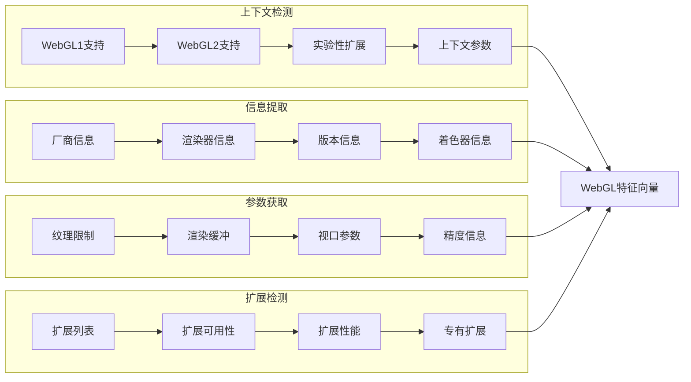

### 10.2.3 GPU信息获取与硬件特征识别

GPU信息是WebGL指纹的核心组成部分，通过GPU的硬件特征可以实现对设备的精确识别。

**GPU指纹的技术架构：**

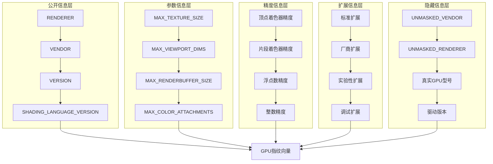

### 10.2.4 图像渲染差异的统计分析

图像渲染差异是Canvas和WebGL指纹的基础，通过分析不同环境下的渲染结果差异来实现设备识别。

**渲染差异的技术分析：**

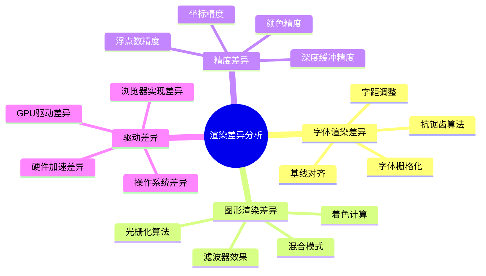

**渲染差异的统计分析方法：**

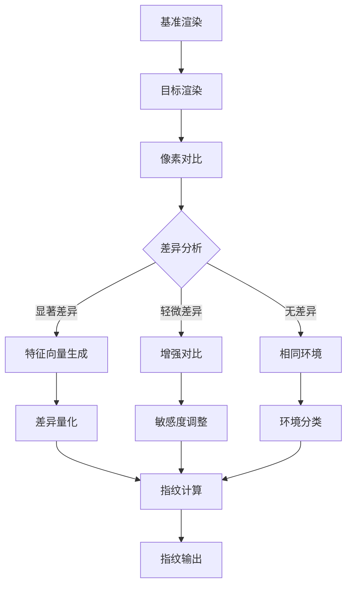

### 10.2.5 噪声注入与指纹标准化技术

针对Canvas和WebGL指纹检测，噪声注入和标准化是有效的对抗技术，可以在保持功能性的同时降低指纹的唯一性。

**噪声注入的技术策略：**

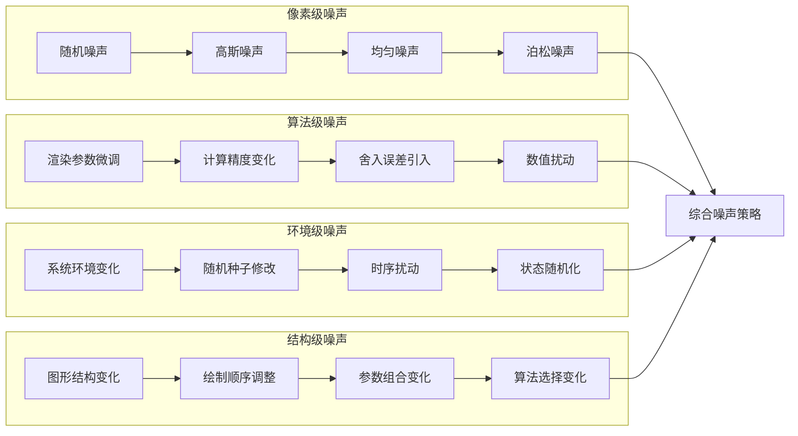

**指纹标准化的实现机制：**

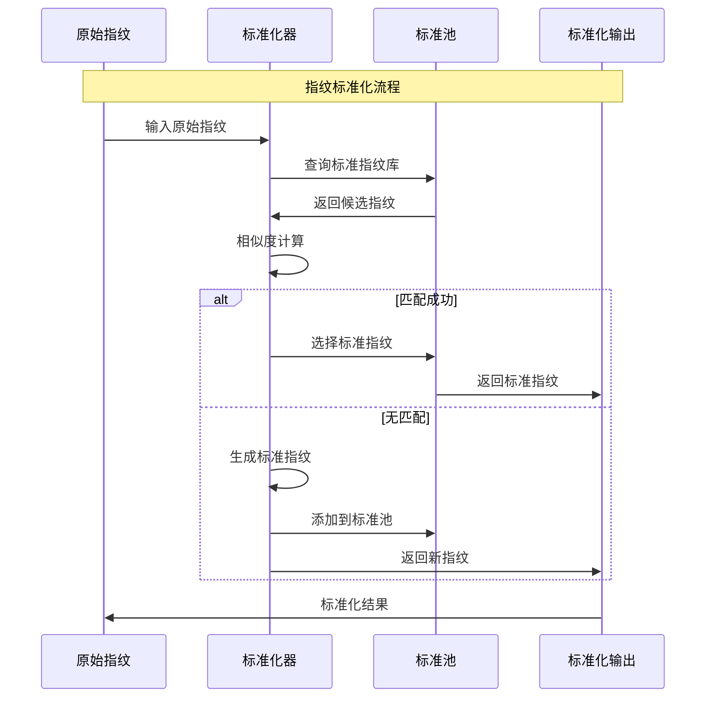

## 10.3 字体与多媒体指纹伪装

### 10.3.1 系统字体检测与识别原理

字体指纹通过检测系统中安装的字体库来生成设备标识，不同用户的字体安装差异提供了很好的区分度。

**字体检测的技术方法：**

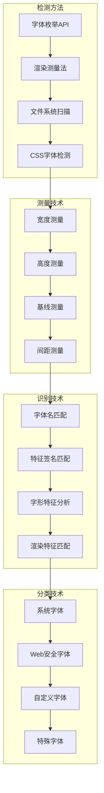

**字体检测的信息层次：**

```mermaid
pyramid
    title 字体指纹信息层次

    "字体渲染特征<br"(字形/间距/基线)" : 30%
    "字体可用性<br"(已安装字体/缺失字体)" : 25%
    "字体元数据<br"(字体名/版本/厂商)" : 20%
    "字体配置<br"(默认字体/字体回退)" : 15%
    "字体性能<br"(加载时间/渲染速度)" : 10%
```

### 10.3.2 字体渲染度量的测量技术

字体渲染度量通过测量特定文本在不同字体下的渲染参数来推断字体特征，是字体指纹检测的核心技术。

**渲染度量的技术参数：**

```mermaid
mindmap
  root((渲染度量参数))
    几何度量
      字符宽度
      字符高度
      行高
      字符间距
    视觉度量
      像素密度
      抗锯齿效果
      渲染清晰度
      颜色深度
    布局度量
      基线位置
      上升高度
      下降高度
      x高度
      行间距
    性能度量
      渲染时间
      内存占用
      缓存命中率
      GPU利用率
```

**字体度量的一致性验证：**

```mermaid
flowchart TD
    A[测试字符串选择] --> B[字体列表准备]
    B --> C[渲染环境初始化]

    C --> D[批量渲染测量]
    D --> E[度量数据收集]

    E --> F{数据一致性检查}

    F -->|通过| G[特征向量生成]
    F -->|失败| H[异常数据处理]

    G --> I[指纹计算]
    H --> J[数据清洗]

    I --> K[指纹输出]
    J --> D
```

### 10.3.3 音频上下文与声卡指纹识别

音频指纹通过Web Audio API获取音频设备和声卡信息来生成设备标识，虽然识别度相对较低，但在多模态融合中具有重要价值。

**音频指纹的技术架构：**

```mermaid
graph LR
    subgraph "音频API层"
        A1[AudioContext] --> A2[AudioBuffer]
        A2 --> A3[AnalyserNode]
        A3 --> A4[OscillatorNode]
    end

    subgraph "硬件层"
        B1[声卡设备] --> B2[音频驱动]
        B2 --> B3[音频编解码器]
        B3 --> B4[音频处理单元]
    end

    subgraph "特征层"
        C1[采样率] --> C2[声道配置]
        C2 --> C3[位深度]
        C3 --> C4[缓冲区大小]
    end

    subgraph "处理层"
        D1[频谱分析] --> D2[时域分析]
        D2 --> D3[特征提取]
        D3 --> D4[指纹生成]
    end

    A4 --> B1
    B4 --> C1
    C4 --> D1
```

**声卡指纹的检测技术：**

```mermaid
sequenceDiagram
    participant WebApp as Web应用
    participant AudioAPI as Audio API
    AudioAPI->>AudioAPI: 初始化音频上下文
    AudioAPI->>AudioAPI: 创建振荡器
    AudioAPI->>AudioAPI: 生成测试音频
    AudioAPI->>WebApp: 音频数据
    WebApp->>WebApp: 音频特征分析
    WebApp->>WebApp: 声卡指纹生成
```

### 10.3.4 摄像头与多媒体设备指纹

摄像头和多媒体设备指纹通过检测系统中可用的多媒体设备来生成设备标识，在移动设备指纹识别中具有重要作用。

**多媒体设备指纹的信息类型：**

```mermaid
pyramid
    title 多媒体设备指纹信息层次

    "视频设备<br"(摄像头/分辨率/编码)" : 35%
    "音频设备<br"(麦克风/采样率/声道)" : 30%
    "设备能力<br"(编码支持/格式兼容)" : 20%
    "权限状态<br"(访问权限/使用状态)" : 10%
    "设备配置<br"(默认设备/优先级)" : 5%
```

### 10.3.5 字体库伪装与渲染一致性

字体库伪装是针对字体指纹检测的有效对抗技术，通过控制字体可用性和渲染行为来降低指纹的唯一性。

**字体伪装的技术策略：**

```mermaid
graph TB
    subgraph "可用性伪装"
        A1[字体列表控制] --> A2[字体回退设置]
        A2 --> A3[网络字体禁用]
        A3 --> A4[自定义字体过滤]
    end

    subgraph "渲染伪装"
        B1[渲染参数调整] --> B2[字体替换策略]
        B2 --> B3[抗锯齿控制]
        B3 --> B4[子像素渲染]
    end

    subgraph "度量伪装"
        C1[度量值标准化] --> C2[噪声注入]
        C2 --> C3[随机扰动]
        C3 --> C4[阈值调整]
    end

    subgraph "元数据伪装"
        D1[字体名修改] --> D2[版本信息伪造]
        D2 --> D3[厂商信息隐藏]
        D3 --> D4[特征签名改变]
    end

    A4 --> E[综合字体伪装]
    B4 --> E
    C4 --> E
    D4 --> E
```

## 10.4 设备与环境指纹对抗

### 10.4.1 屏幕分辨率与显示参数指纹

屏幕分辨率和显示参数是基础的设备指纹信息，通过屏幕相关的配置参数可以生成具有较好区分度的设备标识。

**屏幕指纹的技术维度：**

```mermaid
mindmap
  root((屏幕指纹维度))
    基本参数
      分辨率
      色深
      像素密度
      屏幕方向
    高级参数
      HDR支持
      色域支持
      刷新率
      对比度
    可用区域
      可用宽度
      可用高度
      任务栏占用
      系统托盘
    多显示器
      显示器数量
      主显示器
      扩展模式
      排列方式
```

**屏幕指纹的一致性伪装：**

```mermaid
flowchart TD
    A[真实屏幕检测] --> B[标准配置选择]
    B --> C{配置类型判断}

    C -->|桌面标准| D[1920x1080配置]
    C -->|笔记本标准| E[1366x768配置]
    C -->|移动设备| F[常见移动配置]
    C -->|高分辨率| G[4K配置]

    D --> H[参数标准化]
    E --> H
    F --> H
    G --> H

    H --> I[微小变化添加]
    I --> J[一致性验证]

    J --> K[伪装屏幕配置]
    K --> L[配置输出]
```

### 10.4.2 时区与语言环境检测

时区和语言环境指纹通过检测系统的时间和语言配置来生成设备标识，在用户行为分析和地理定位中具有重要作用。

**时区语言指纹的技术构成：**

```mermaid
graph LR
    subgraph "时间信息"
        A1[时区偏移] --> A2[夏令时设置]
        A2 --> A3[系统时间]
        A3 --> A4[NTP同步]
    end

    subgraph "语言信息"
        B1[浏览器语言] --> B2[系统语言]
        B2 --> B3[区域设置]
        B3 --> B4[输入法语言]
    end

    subgraph "格式化信息"
        C1[日期格式] --> C2[数字格式]
        C2 --> C3[货币格式]
        C3 --> C4[测量单位]
    end

    subgraph "文化信息"
        D1[首周起始] --> D2[工作日历]
        D2 --> D3[节假日设置]
        D3 --> D4[文化习惯]
    end

    A4 --> E[时区语言指纹]
    B4 --> E
    C4 --> E
    D4 --> E
```

### 10.4.3 电池状态与硬件传感器指纹

电池状态和硬件传感器指纹在移动设备指纹识别中具有重要价值，通过检测设备的硬件配置和状态信息来生成设备标识。

**传感器指纹的技术架构：**

```mermaid
pyramid
    title 传感器指纹信息层次

    "电池状态<br"(电量/充电状态/健康度)" : 30%
    "运动传感器<br"(加速度计/陀螺仪/磁力计)" : 25%
    "环境传感器<br"(光线/温度/湿度)" : 20%
    "位置传感器<br"(GPS/网络定位)" : 15%
    "其他传感器<br"(距离/压力/接近)" : 10%
```

### 10.4.4 网络连接类型与带宽特征

网络连接指纹通过检测网络配置和连接特征来生成设备标识，在网络环境分析和用户行为识别中具有重要作用。

**网络指纹的技术维度：**

```mermaid
mindmap
  root((网络指纹维度))
    连接类型
      WiFi连接
      以太网连接
      移动网络
      蓝牙连接
    网络配置
      IP地址
      子网掩码
      网关地址
      DNS服务器
    性能特征
      带宽速度
      延迟时间
      丢包率
      抖动情况
    硬件特征
      网卡型号
      MAC地址
      驱动版本
      固件版本
```

### 10.4.5 虚拟化环境检测与伪装

虚拟化环境检测是反虚拟化技术的重要组成部分，通过识别虚拟化环境的特征来防止自动化工具的滥用。

**虚拟化检测的技术方法：**

```mermaid
graph TB
    subgraph "硬件检测"
        A1[CPU特征] --> A2[内存特征]
        A2 --> A3[显卡特征]
        A3 --> A4[磁盘特征]
    end

    subgraph "软件检测"
        B1[虚拟机驱动] --> B2[虚拟化工具]
        B2 --> B3[调试工具]
        B3 --> B4[监控代理]
    end

    subgraph "行为检测"
        C1[启动速度] --> C2[资源使用]
        C2 --> C3[性能特征]
        C3 --> C4[交互模式]
    end

    subgraph "网络检测"
        D1[MAC地址模式] --> D2[IP地址范围]
        D2 --> D3[域名解析]
        D3 --> D4[网络指纹]
    end

    A4 --> E[虚拟化评估]
    B4 --> E
    C4 --> E
    D4 --> E
```

## 10.5 行为指纹与用户画像对抗

### 10.5.1 鼠标移动轨迹的行为模式分析

鼠标移动轨迹是行为指纹的重要组成部分，通过分析鼠标移动的模式特征可以识别自动化行为。

**鼠标轨迹的行为特征：**

```mermaid
mindmap
  root((鼠标轨迹特征))
    运动特征
      移动速度
      移动加速度
      移动平滑度
      运动方向
    时间特征
      点击间隔
      停留时间
      移动节奏
      操作模式
    空间特征
      移动范围
      目标精度
      路径复杂度
      区域偏好
    交互特征
      点击类型
      拖拽行为
      滚动操作
      键盘交互
```

**人类鼠标行为的技术模型：**

```mermaid
sequenceDiagram
    participant User as 用户
    participant Brain as 大脑
    participant Eye as 眼睛
    participant Hand as 手部
    participant Mouse as 鼠标

    Note over User,Mouse: 人类鼠标行为完整流程

    User->>Eye: 视觉目标识别
    Eye->>Brain: 目标信息处理
    Brain->>Brain: 运动规划生成

    Brain->>Hand: 运动指令发送
    Hand->>Mouse: 手部肌肉执行
    Mouse->>Mouse: 鼠标移动

    Mouse->>User: 视觉反馈
    User->>Brain: 位置偏差分析
    Brain->>Hand: 运动调整

    Note over User,Mouse: 持续调整优化
    User->>Eye: 重新定位目标
    Eye->>Brain: 更新目标信息
    Brain->>Hand: 调整运动轨迹
```

### 10.5.2 键盘输入节奏与打字特征

键盘输入节奏是行为指纹的另一个重要组成部分，通过分析打字的速度和节奏模式可以识别用户身份。

**键盘行为的技术特征：**

```mermaid
pyramid
    title 键盘行为特征层次

    "节奏特征<br"(打字速度/键位间隔)" : 35%
    "准确度特征<br"(错误率/修正模式)" : 25%
    "习惯特征<br"(手指使用/快捷键)" : 20%
    "时间特征<br"(活跃时段/使用模式)" : 15%
    "语言特征<br"(输入语言/文本特征)" : 5%
```

**键盘输入的自然化模拟：**

```mermaid
flowchart TD
    A[输入目标确定] --> B[打字策略规划]
    B --> C{输入类型判断}

    C -->|常规输入| D[标准打字模式]
    C -->|密码输入| E[谨慎打字模式]
    C -->|搜索输入| F[快速打字模式]

    D --> G[自然节奏生成]
    E --> H[小心节奏生成]
    F --> I[快速节奏生成]

    G --> J[键位间隔设置]
    H --> K[安全间隔设置]
    I --> L[高效间隔设置]

    J --> M[键盘事件模拟]
    K --> M
    L --> M

    M --> N[随机误差添加]
    N --> O[输入执行]
```

### 10.5.3 页面浏览习惯与时间模式

页面浏览习惯是行为指纹的高级组成部分，通过分析用户的浏览行为模式来识别用户特征。

**浏览行为的技术维度：**

```mermaid
graph LR
    subgraph "浏览模式"
        A1[扫描式浏览] --> A2[搜索式浏览]
        A2 --> A3[深度浏览]
        A3 --> A4[跳跃式浏览]
    end

    subgraph "时间模式"
        B1[活跃时段] --> B2[浏览时长]
        B2 --> B3[访问频率]
        B3 --> B4[停留分布]
    end

    subgraph "内容偏好"
        C1[页面类型] --> C2[内容类别]
        C2 --> C3[主题偏好]
        C3 --> C4[质量要求]
    end

    subgraph "交互模式"
        D1[滚动行为] --> D2[点击模式]
        D2 --> D3[表单填写]
        D3 --> D4[多媒体交互]
    end

    A4 --> E[浏览行为指纹]
    B4 --> E
    C4 --> E
    D4 --> E
```

### 10.5.4 社交媒体互动行为指纹

社交媒体互动行为指纹通过分析用户在社交平台上的交互模式来生成用户特征标识。

**社交行为指纹的技术特征：**

```mermaid
mindmap
  root((社交行为指纹))
    内容互动
      点赞行为
      评论行为
      分享行为
      收藏行为
    社交网络
      好友关系
      关注行为
      私信交互
      群组参与
    时间模式
      活跃时段
      互动频率
      响应时间
      持续性
    内容偏好
      主题偏好
      格式偏好
      质量判断
      价值取向
    影响力分析
      传播能力
      影响范围
      互动深度
    网络地位
```

### 10.5.5 用户画像混淆与隐私保护

用户画像混淆是针对行为指纹的隐私保护技术，通过改变行为模式来保护用户隐私。

**隐私保护的技术策略：**

```mermaid
pyramid
    title 用户画像隐私保护技术

    "行为随机化<br"(模式变化/时序扰动)" : 30%
    "数据最小化<br"(信息过滤/选择性记录)" : 25%
    "匿名化处理<br"(身份隐藏/数据脱敏)" : 20%
    "差分隐私<br"(噪声添加/统计保护)" : 15%
    "访问控制<br"(权限管理/数据隔离)" : 10%
```

## 总结

### 核心技术要点回顾

本节深入探讨了浏览器指纹与伪装技术的完整技术体系，构建了系统化的知识框架：

1. **指纹技术全景**：理解浏览器指纹的定义、分类和评估体系
2. **Canvas/WebGL指纹**：掌握渲染指纹的技术原理和对抗方法
3. **字体多媒体指纹**：了解字体检测和音频设备指纹技术
4. **设备环境指纹**：掌握屏幕、时区、传感器等设备指纹技术
5. **行为指纹技术**：理解鼠标、键盘、浏览等行为指纹分析
6. **隐私保护技术**：掌握指纹伪装和隐私保护的技术方法

### 实战应用指导

在实际的浏览器指纹对抗中，需要遵循以下核心原则：

1. **多维度协同**：结合多种指纹技术进行综合分析
2. **一致性优先**：确保伪造指纹在各个维度上保持一致
3. **自然性模拟**：重点模拟真实用户的行为特征
4. **稳定性控制**：在同一会话内保持指纹的相对稳定
5. **隐私保护**：在技术对抗的同时重视隐私保护和合规要求

### 技术发展趋势

浏览器指纹技术正在向更加智能化、综合化的方向发展：

- **多模态融合**：结合多种指纹技术的综合分析
- **AI驱动分析**：机器学习在行为模式识别中的应用
- **实时检测能力**：更快速和准确的实时指纹检测
- **隐私保护增强**：更先进的隐私保护技术
- **跨平台统一**：跨浏览器和跨平台的统一指纹标准

### 未来发展建议

面向未来的浏览器指纹技术发展，需要关注以下方向：

1. **技术创新驱动**：持续跟踪新技术在指纹领域的应用
2. **隐私保护优先**：在技术创新中重视隐私保护
3. **标准化建设**：推动行业技术标准和最佳实践
4. **伦理规范遵循**：确保技术应用的伦理合规性
5. **用户体验平衡**：在安全性和用户体验之间找到平衡

掌握这些浏览器指纹和伪装技术，能够帮助我们更好地理解现代Web应用的识别机制，提升网络安全评估和防护的能力。通过持续的技术学习和实践积累，我们能够在复杂的技术挑战中保持竞争优势。