# 第11章：设备指纹与移动端反爬（一）

## 11.1 移动设备指纹识别体系

### 11.1.1 移动设备指纹的技术架构演进

移动设备指纹技术作为传统浏览器指纹技术在移动端的重要延伸，已经成为现代移动应用安全防护的核心技术之一。相比传统Web环境，移动端的设备指纹采集面临更多的技术挑战和限制。

**移动设备指纹的技术特征：**

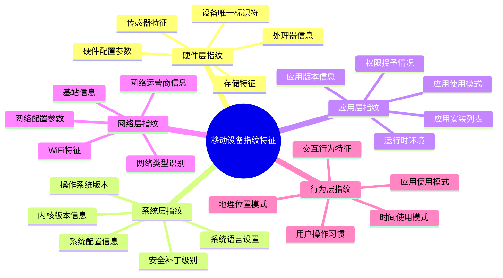

**移动设备指纹与传统指纹的技术差异：**

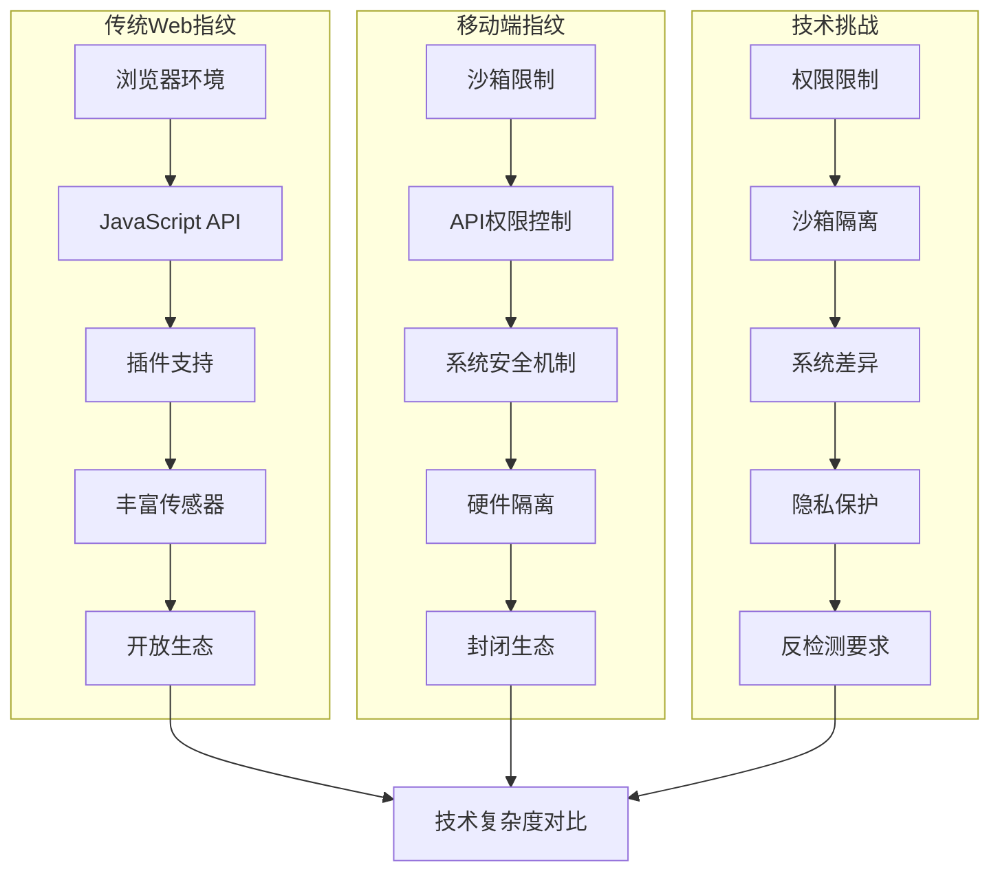

### 11.1.2 移动设备唯一标识符获取技术

移动设备的唯一标识符获取是设备指纹技术的核心，但由于隐私保护和系统安全机制的限制，现代移动操作系统对标识符的获取进行了严格限制。

**移动设备标识符的技术分类：**

```mermaid
pyramid
    title 移动设备标识符技术层次

    "行为特征标识符<br>(使用模式/行为签名)" : 15%
    "软件环境标识符<br>(应用配置/系统设置)" : 20%
    "网络相关标识符<br>(网络指纹/连接特征)" : 25%
    "硬件相关标识符<br>(设备ID/硬件参数)" : 30%
    "系统级标识符<br>(UUID/设备序列号)" : 10%
```

**iOS平台标识符获取的技术机制：**

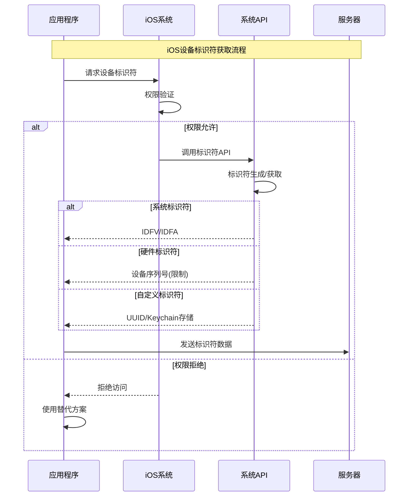

**Android平台标识符获取的技术架构：**

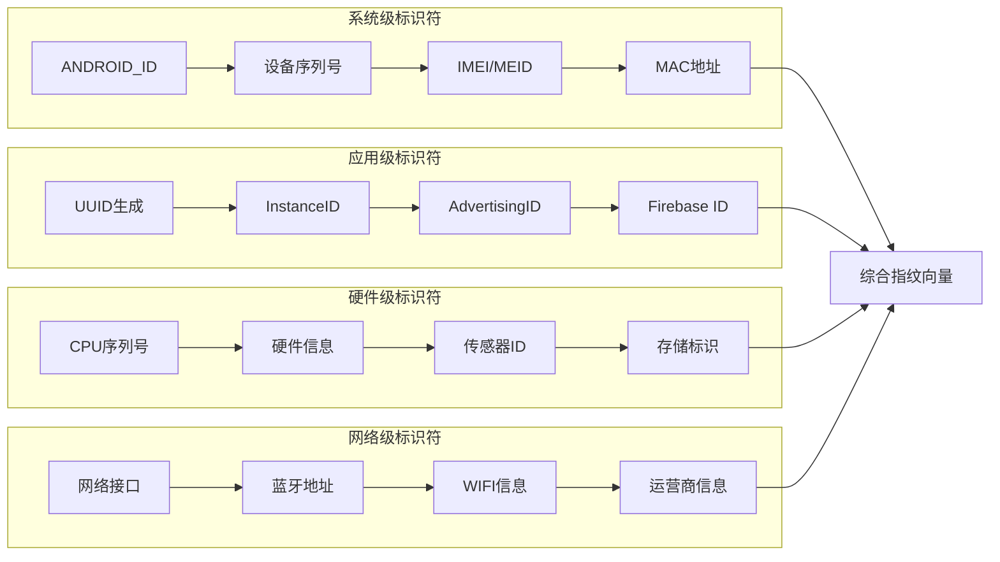

### 11.1.3 硬件参数与系统配置指纹

硬件参数和系统配置构成了移动设备指纹的基础特征，这些信息相对稳定且具有较强的设备区分度。

**硬件指纹的信息层次结构：**

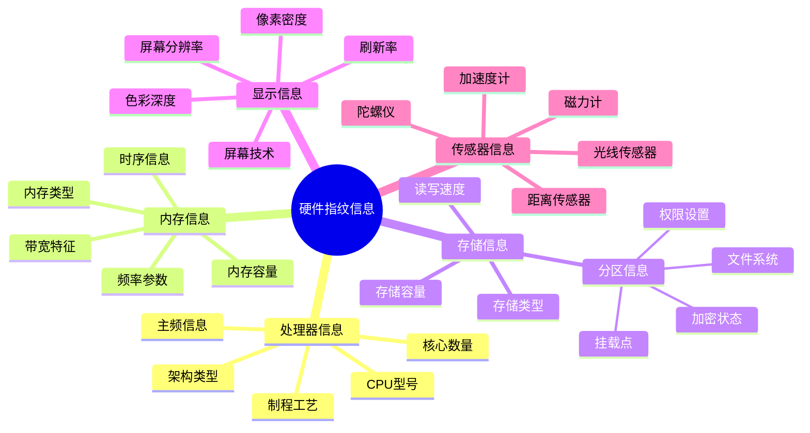

**系统配置指纹的技术实现：**

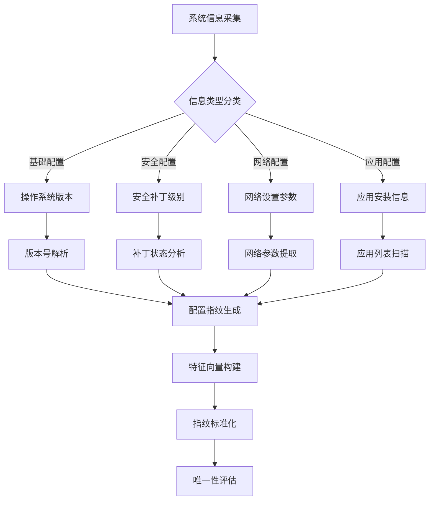

**大型平台移动端指纹采集的实战策略：**

| 采集维度 | 技术难度 | 稳定性 | 唯一性 | 隐私风险 | 实际应用 |
|---------|---------|---------|---------|---------|---------|
| 设备ID | 高 | 极高 | 极高 | 极高 | 用户识别 |
| 硬件参数 | 中等 | 高 | 高 | 中等 | 设备区分 |
| 系统配置 | 低 | 中等 | 中等 | 低 | 环境检测 |
| 应用列表 | 高 | 低 | 高 | 高 | 行为分析 |
| 网络信息 | 中等 | 中等 | 中等 | 中等 | 地理定位 |

### 11.1.4 传感器数据与设备特征

移动设备丰富的传感器为设备指纹提供了独特的数据源，通过分析传感器的原始输出和特征参数，可以生成高区分度的设备指纹。

**移动传感器指纹的技术架构：**

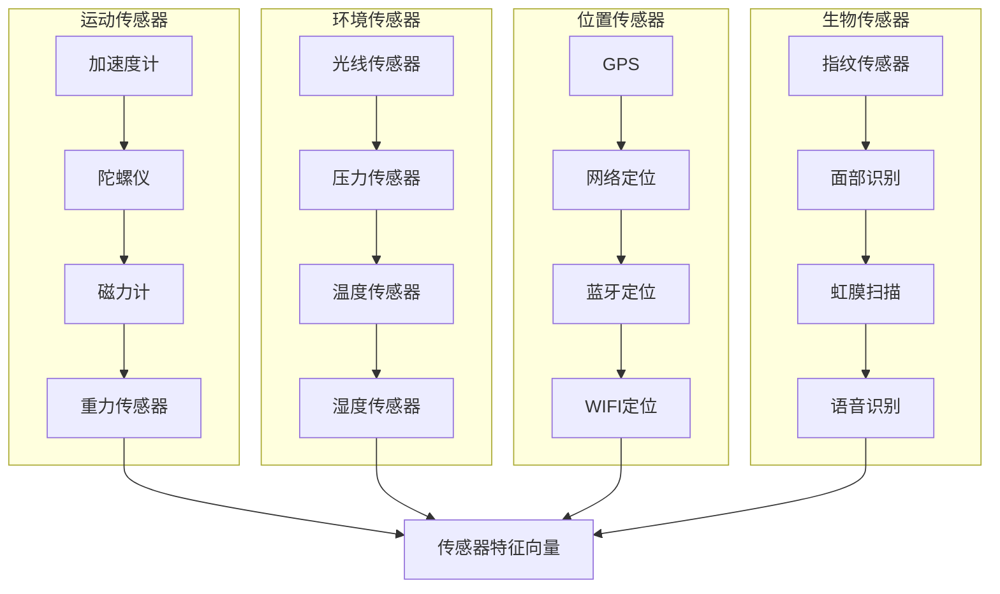

**传感器指纹的数据处理流程：**

```mermaid
stateDiagram-v2
    [*] --> 传感器数据采集
    传感器数据采集 --> 数据预处理

    数据预处理 --> {数据质量检查}

    数据质量检查 --> 数据合格: 特征提取
    数据质量检查 --> 数据异常: 异常处理

    特征提取 --> 统计分析
    异常处理 --> 数据重新采集

    统计分析 --> 模式识别
    模式识别 --> 指纹生成

    指纹生成 --> {指纹质量评估}

    指纹质量评估 --> 质量合格: 指纹存储
    指纹质量评估 --> 质量不合格: 参数调整

    指纹存储 --> 持续监控
    参数调整 --> 特征提取

    持续监控 --> 指纹更新
    指纹更新 --> [*]
```

**传感器指纹的稳定性分析：**

```mermaid
pyramid
    title 传感器指纹稳定性评估

    "环境传感器<br"(光线/压力/温度)" : 25%
    "位置传感器<br"(GPS/网络定位)" : 20%
    "运动传感器<br"(加速度/陀螺仪)" : 30%
    "生物传感器<br"(指纹/面部识别)" : 15%
    "设备传感器<br"(硬件相关传感器)" : 10%
```

### 11.1.5 应用程序安装与使用模式

应用程序的安装情况和使用模式反映了用户的设备使用习惯，通过分析应用生态可以生成具有个人特征的设备指纹。

**应用指纹的技术维度：**

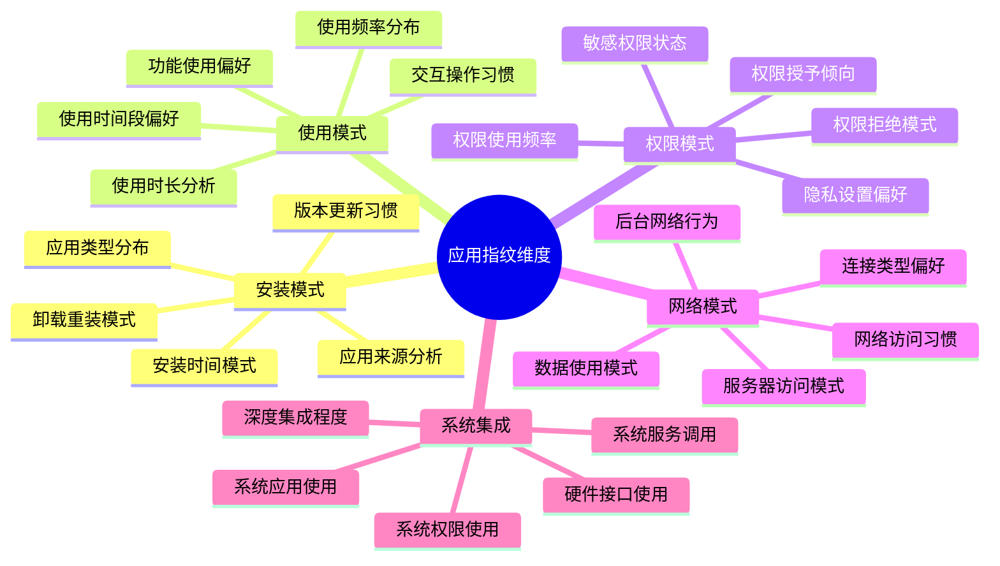

**应用行为指纹的分析技术：**

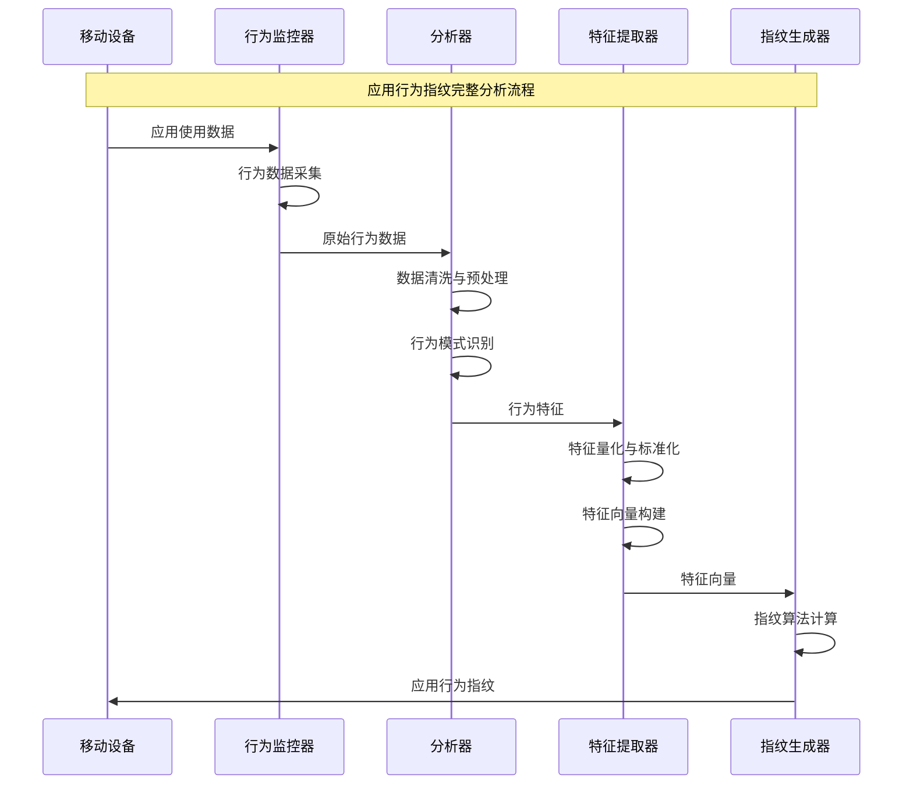

**大型应用平台的行为分析实战：**

```mermaid
graph LR
    subgraph "数据采集层"
        A1[应用启动记录] --> A2[使用时长统计]
        A2 --> A3[功能使用监控]
        A3 --> A4[网络行为记录]
    end

    subgraph "特征提取层"
        B1[时间特征提取] --> B2[频率特征分析]
        B2 --> B3[序列模式识别]
        B3 --> B4[偏好特征量化]
    end

    subgraph "模式识别层"
        C1[聚类分析] --> C2[分类模型]
        C2 --> C3[异常检测]
        C3 --> C4[趋势预测]
    end

    subgraph "指纹生成层"
        D1[特征融合] --> D2[哈希计算]
        D2 --> D3[指纹编码]
        D3 --> D4[质量评估]
    end

    A4 --> B1
    B4 --> C1
    C4 --> D1
```

### 11.1.6 移动网络运营商信息指纹

移动网络信息是移动设备特有的指纹维度，通过分析网络接入相关的参数可以生成具有地理和网络特征的设备标识。

**移动网络指纹的信息架构：**

```mermaid
pyramid
    title 移动网络指纹信息层次

    "运营商网络信息<br"(MCC/MNC/LAC)" : 30%
    "基站信息<br"(Cell ID/信号强度)" : 25%
    "网络类型<br"(4G/5G/WiFi)" : 20%
    "网络配置<br"(APN/DNS/网关)" : 15%
    "连接质量<br"(延迟/带宽/稳定性)" : 10%
```

**网络指纹采集的技术实现：**

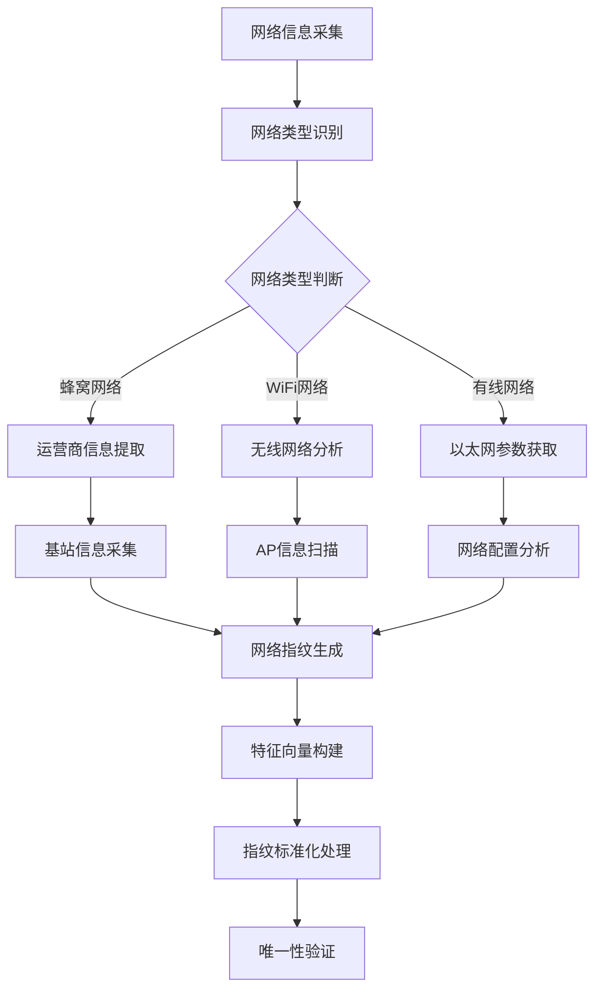

**移动网络指纹的稳定性评估：**

| 网络信息类型 | 稳定性 | 唯一性 | 采集难度 | 隐私影响 | 实际价值 |
|-------------|---------|---------|---------|---------|---------|
| 运营商信息 | 高 | 中等 | 低 | 高 | 地理定位 |
| 基站信息 | 中等 | 高 | 中等 | 高 | 精确定位 |
| 网络类型 | 低 | 低 | 低 | 低 | 环境识别 |
| APN配置 | 中等 | 中等 | 中等 | 中等 | 运营商识别 |
| 信号特征 | 低 | 中等 | 高 | 中等 | 环境特征 |

## 总结

### 核心技术要点回顾

本节深入探讨了移动设备指纹识别体系的技术架构，构建了完整的知识框架：

1. **技术架构演进**：理解移动设备指纹相比传统指纹的技术挑战和特征差异
2. **标识符获取**：掌握iOS和Android平台设备标识符的获取技术机制
3. **硬件系统指纹**：了解硬件参数和系统配置指纹的采集和处理方法
4. **传感器指纹**：掌握移动传感器数据在设备指纹中的应用技术
5. **应用行为指纹**：理解应用程序安装和使用模式的指纹价值
6. **网络信息指纹**：掌握移动网络相关信息的指纹提取技术

### 实战应用指导

在实际的移动端反爬对抗中，设备指纹技术需要遵循以下核心原则：

1. **多维度融合**：结合多个维度的信息构建稳定的设备指纹
2. **隐私保护合规**：确保指纹采集符合相关隐私法规要求
3. **动态更新机制**：建立指纹的动态更新和验证机制
4. **反检测设计**：采用隐蔽的指纹采集策略避免被检测
5. **跨平台适配**：考虑不同平台和设备的差异性

### 技术发展趋势

移动设备指纹技术正在向更加智能化、精细化的方向发展：

- **AI驱动分析**：机器学习在行为模式识别和异常检测中的应用
- **多模态融合**：结合多种传感器和数据源的综合分析
- **隐私保护技术**：差分隐私等技术在指纹保护中的应用
- **实时分析能力**：更高效的实时指纹生成和验证技术
- **边缘计算应用**：在设备端进行指纹处理的技术方案

掌握这些移动设备指纹识别技术，能够帮助我们更好地理解移动端的安全防护机制，提升移动应用的安全评估和防护能力。通过持续的技术学习和实践积累，我们能够在移动端安全挑战中保持技术优势。