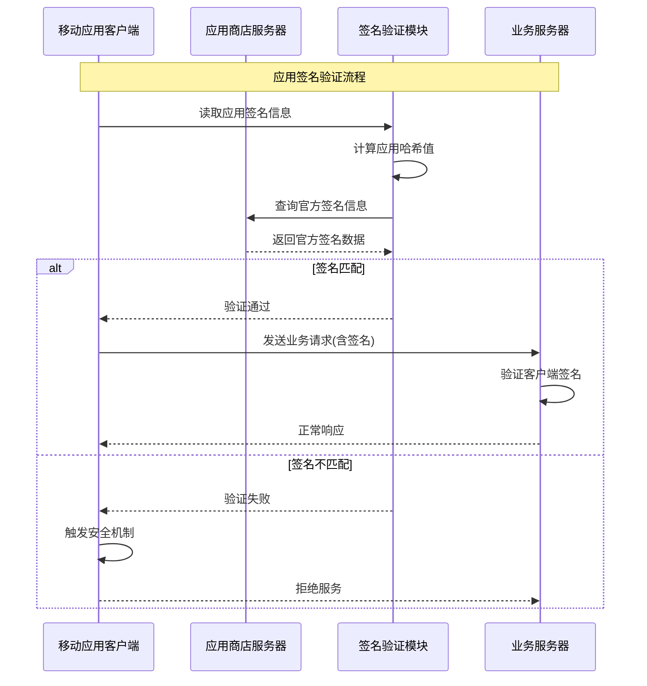
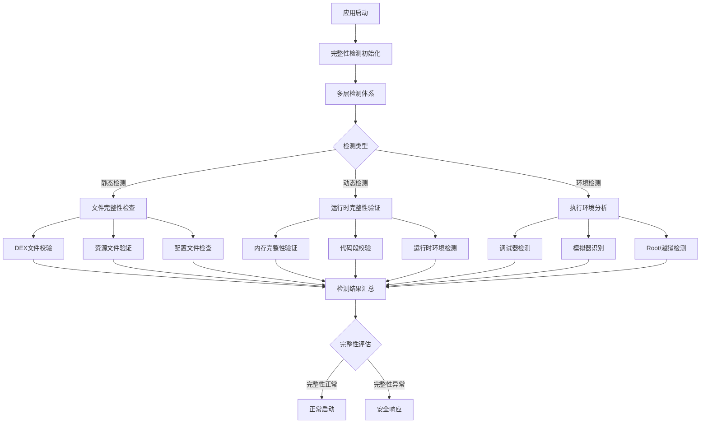
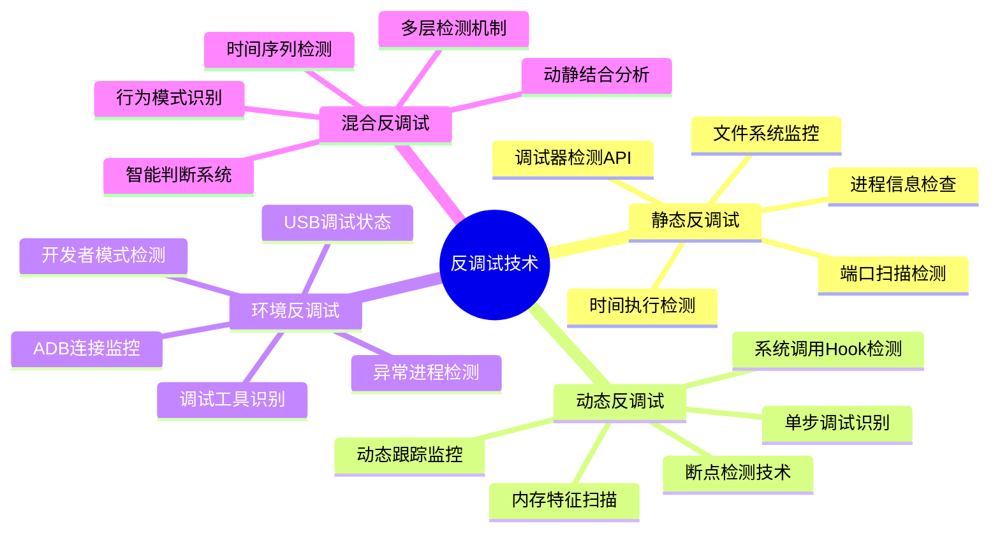
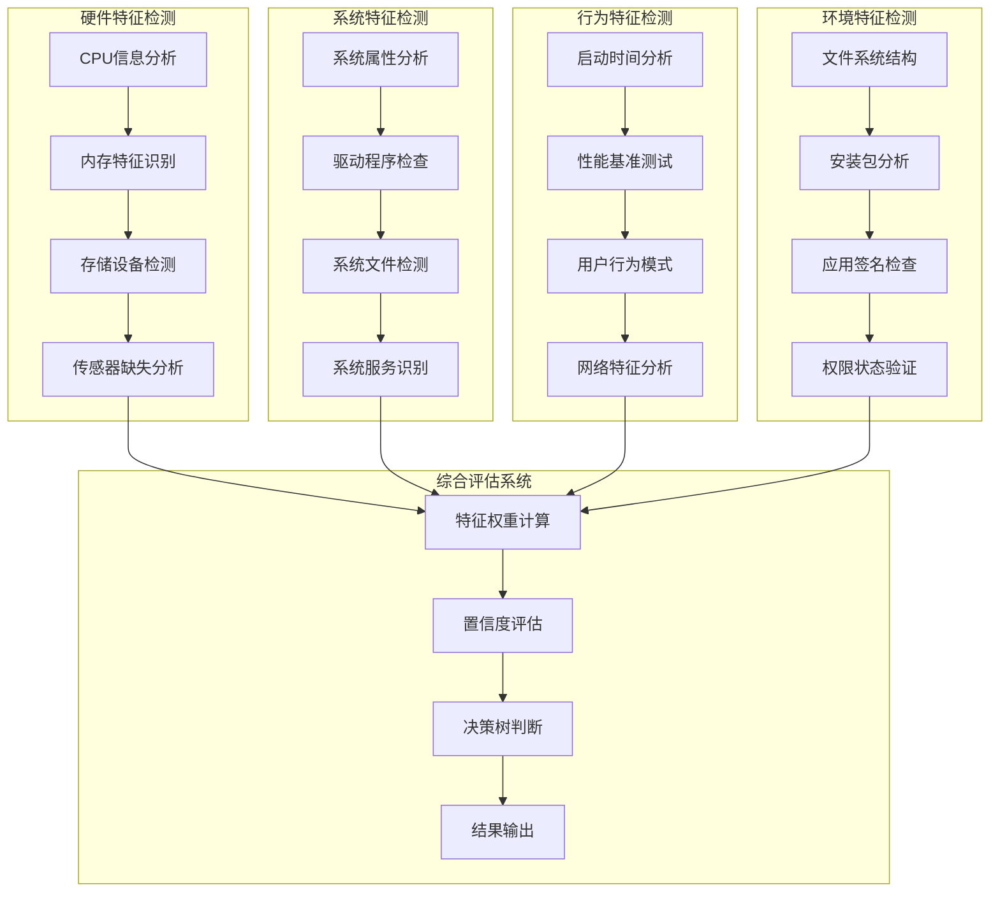
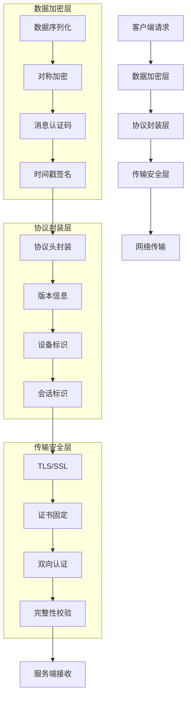
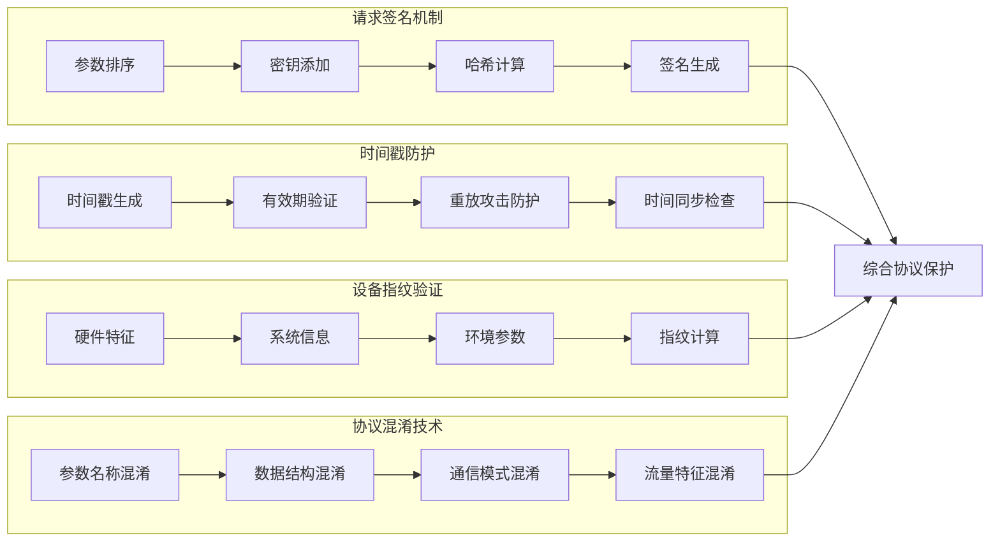
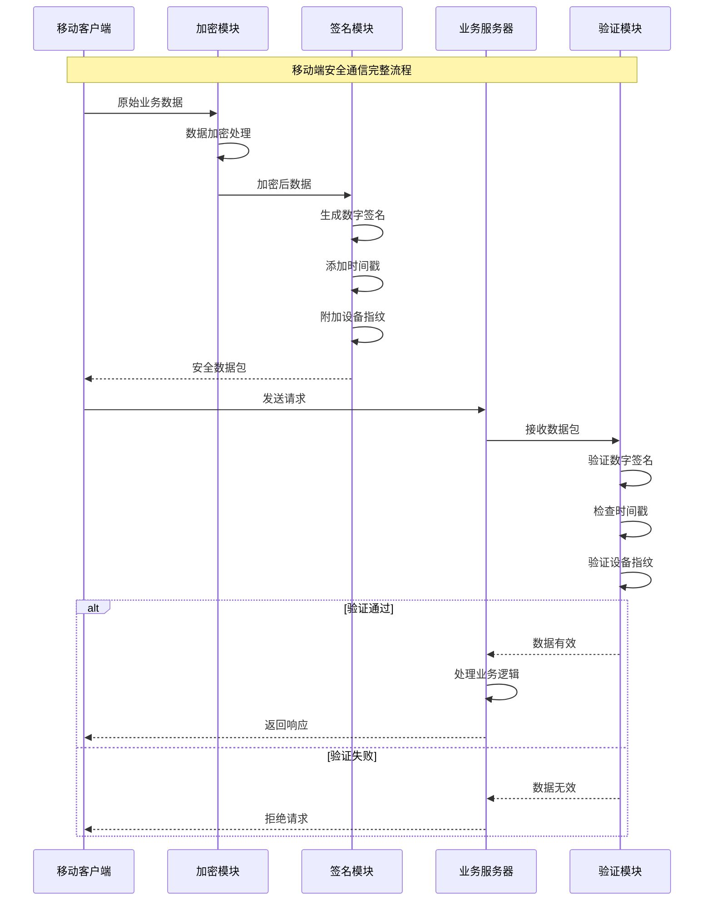
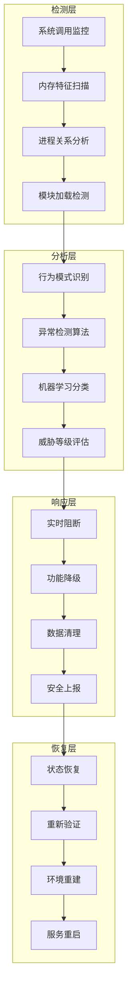

# 第11章：设备指纹与移动端反爬（三）

## 11.3 移动端应用层反爬技术对抗

### 11.3.1 移动应用签名校验与完整性检测

移动应用通过签名校验和完整性检测来防止逆向工程和恶意修改，这是移动端反爬的第一道防线。

**移动应用签名验证机制：**



**应用完整性检测技术架构：**



**大型应用的签名校验实战策略：**

| 检测维度 | 技术实现 | 检测强度 | 绕过难度 | 性能影响 | 实际应用 |
|---------|---------|---------|---------|---------|---------|
| APK签名 | APK Signature Scheme v2/v3 | 高 | 高 | 低 | 应用商店分发 |
| DEX校验 | 哈希值比对 | 极高 | 极高 | 中等 | 核心功能保护 |
| 资源完整性 | CRC32校验 | 中等 | 中等 | 低 | UI资源保护 |
| 运行时检测 | 内存校验 | 高 | 高 | 高 | 关键业务逻辑 |
| 环境检测 | 系统调用分析 | 中等 | 中等 | 中等 | 反调试保护 |

### 11.3.2 反调试与反模拟器技术

反调试和反模拟器技术是移动端反爬的重要组成部分，通过检测恶意分析环境来保护应用安全。

**反调试技术体系架构：**



**反模拟器检测技术实现：**



**反检测技术的对抗策略：**

```mermaid
stateDiagram-v2
    [*] --> 反检测初始化
    反检测初始化 --> 多层检测启动

    多层检测启动 --> 检测执行

    检测执行 --> {检测类型选择}

    检测类型选择 --> 静态检测: API调用监控
    检测类型选择 --> 动态检测: 运行时监控
    检测类型选择 --> 环境检测: 系统环境分析

    API调用监控 --> 调试器识别
    运行时监控 --> 异常行为检测
    系统环境分析 --> 模拟器特征识别

    调试器识别 --> 结果汇总
    异常行为检测 --> 结果汇总
    模拟器特征识别 --> 结果汇总

    结果汇总 --> {威胁评估}

    威胁评估 --> 正常环境: 继续执行
    威胁评估 --> 可疑环境: 增强监控
    威胁评估 --> 恶意环境: 安全响应

    继续执行 --> 周期性检测
    增强监控 --> 实时监控
    安全响应 --> [*]

    周期性检测 --> 检测执行
    实时监控 --> 检测执行
```

### 11.3.3 加密通信与协议保护

移动应用的加密通信和协议保护是防止数据被窃取和伪造的关键技术。

**移动端通信加密架构：**



**移动端协议保护技术：**



**大型移动应用的通信安全实战：**



### 11.3.4 Hook检测与运行时保护

Hook检测和运行时保护技术可以防止应用被恶意注入和篡改，是移动端安全防护的重要组成部分。

**Hook检测技术体系：**

```mermaid
pyramid
    title Hook检测技术层次结构

    "高级检测<br"(行为分析/模式识别)" : 15%
    "中级检测<br"(API监控/内存扫描)" : 35%
    "基础检测<br"(文件检查/进程分析)" : 50%
```

**运行时保护机制：**

```mermaid
stateDiagram-v2
    [*] --> 应用启动
    应用启动 --> 运行时环境初始化

    运行时环境初始化 --> 保护机制激活

    保护机制激活 --> {监控模式选择}

    监控模式选择 --> 主动监控: 持续检测
    监控模式选择 --> 被动监控: 事件驱动
    监控模式选择 --> 混合监控: 结合模式

    主动监控 --> Hook扫描
    被动监控 --> 异常事件监听
    混合监控 --> 周期性检测

    Hook扫描 --> {扫描结果}
    异常事件监听 --> {事件类型}
    周期性检测 --> {检测结果}

    扫描结果 --> 正常: 继续监控
    扫描结果 --> 异常: 触发保护

    事件类型 --> 正常事件: 记录日志
    事件类型 --> 异常事件: 威胁分析

    检测结果 --> 安全: 保持监控
    检测结果 --> 威胁: 升级保护

    继续监控 --> Hook扫描
    记录日志 --> 异常事件监听
    威胁分析 --> 安全响应
    保持监控 --> 周期性检测
    升级保护 --> 安全响应
    安全响应 --> [*]
```

**高级Hook对抗技术：**



### 11.3.5 移动端风控系统集成

移动端风控系统集成了多种反爬技术，通过多维度评估来识别和防范恶意行为。

**移动风控系统架构：**

```mermaid
flowchart TD
    A[客户端数据采集] --> B[实时数据传输]
    B --> C[服务端风险评估]

    subgraph "数据采集层"
        D1[设备指纹] --> D2[行为数据]
        D2 --> D3[环境信息]
        D3 --> D4[业务数据]
    end

    subgraph "评估引擎层"
        E1[规则引擎] --> E2[模型评分]
        E2 --> E3[特征计算]
        E3 --> E4[风险评级]
    end

    subgraph "决策执行层"
        F1[实时拦截] --> F2[延迟响应]
        F3 -> F4[增强验证]
        F4 --> F5[人工审核]
    end

    subgraph "反馈学习层"
        G1[效果分析] --> G2[模型优化]
        G2 --> G3[策略调整]
        G3 --> G4[知识更新]
    end

    D4 --> E1
    E4 --> F1
    F5 --> G1
```

**风控决策树分析：**

```mermaid
graph TD
    A[请求到达] --> B{基础检查}

    B -->|通过| C{设备风险评估}
    B -->|失败| D[直接拒绝]

    C -->|低风险| E{行为模式检查}
    C -->|中风险| F[增强验证]
    C -->|高风险| G[人工审核]

    E -->|正常| H[正常处理]
    E -->|异常| I[延迟响应]

    F -->|验证通过| H
    F -->|验证失败| D

    G -->|审核通过| H
    G -->|审核失败| D

    I --> {二次检查}
    二次检查 -->|通过| H
    二次检查 -->|失败| D

    H --> J[响应返回]
    D --> K[拒绝记录]
```

## 总结

### 核心技术要点回顾

本节全面分析了移动端应用层反爬技术对抗体系，构建了完整的技术防护框架：

1. **签名校验机制**：掌握移动应用的签名验证和完整性检测技术
2. **反调试技术**：理解反调试和反模拟器的技术实现方法
3. **通信安全保护**：掌握移动端加密通信和协议保护技术
4. **运行时保护**：了解Hook检测和运行时保护机制
5. **风控系统集成**：掌握移动端风控系统的架构和决策机制
6. **综合防护策略**：建立多层次、立体化的移动端安全防护体系

### 实战应用指导

在移动端反爬技术的实际应用中，需要遵循以下核心原则：

1. **纵深防御**：构建多层次、全方位的防护体系
2. **动态适应**：根据威胁变化实时调整防护策略
3. **用户体验**：在保证安全的前提下优化用户体验
4. **性能平衡**：合理控制安全检查对性能的影响
5. **持续进化**：不断学习和应对新的攻击手段

### 技术发展趋势

移动端反爬技术正在向以下方向发展：

- **智能化防御**：基于AI的自动化威胁检测和响应
- **隐私保护**：在安全防护中加强用户隐私保护
- **零信任架构**：基于零信任原则的移动端安全模型
- **协同防御**：跨应用、跨平台的协同防护机制
- **边缘安全**：在设备端实现更智能的安全决策

掌握这些移动端应用层反爬技术，能够帮助我们在移动安全对抗中建立更强大的防护能力。通过系统性的技术理解和实践应用，我们可以有效应对移动端的各种安全威胁和挑战。