# 第11章：设备指纹与移动端反爬（二）

## 11.2 Android/iOS系统特性与指纹采集技术

### 11.2.1 Android系统架构与安全机制

Android系统的开放性和定制化特征使其成为设备指纹采集的重要平台，同时也带来了复杂的安全防护机制。

**Android系统分层架构：**

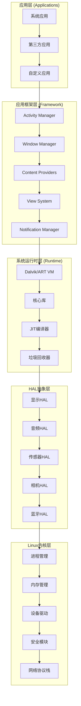

**Android安全机制的指纹防护体系：**

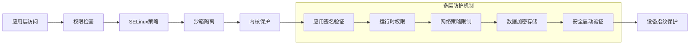

### 11.2.2 iOS系统特性与安全架构

iOS系统的封闭性和统一性为设备指纹提供了稳定的技术环境，但同时也实施了严格的隐私保护机制。

**iOS系统安全架构：**

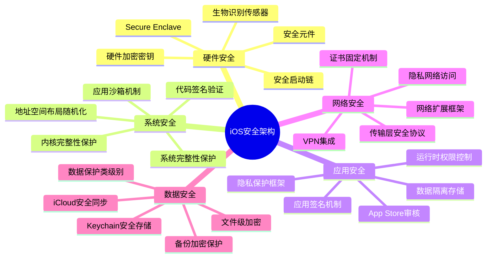

**iOS系统指纹采集的技术限制：**

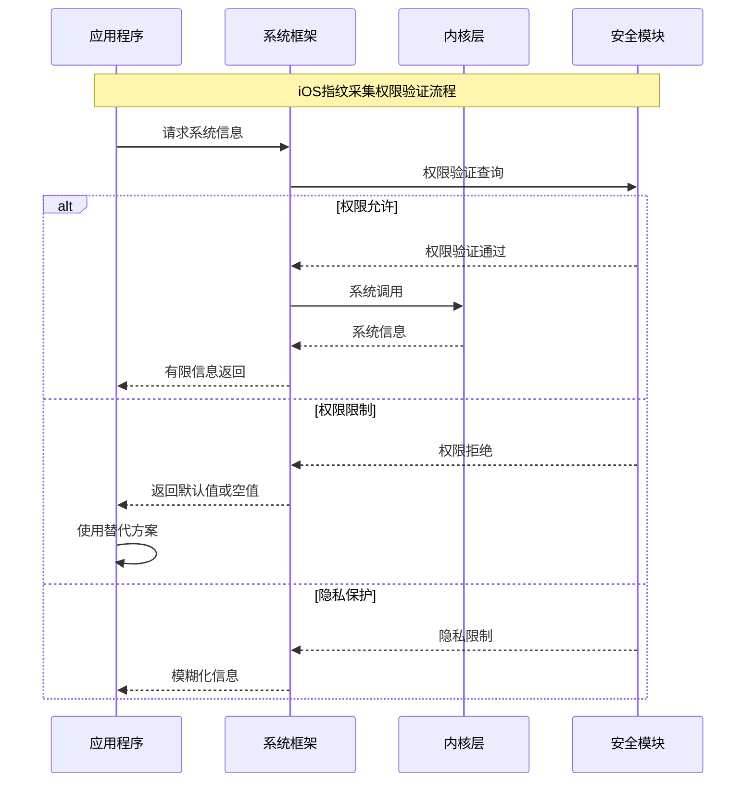

### 11.2.3 Android系统指纹采集技术

Android平台的开放性为设备指纹采集提供了丰富的API接口和数据源。

**Android系统信息采集架构：**

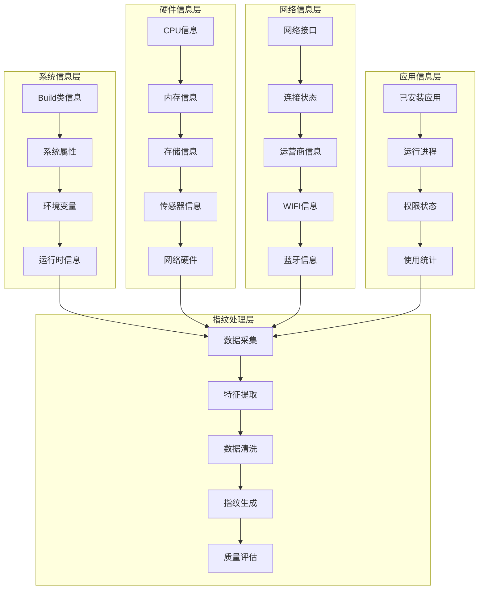

**Android指纹采集的关键技术点：**

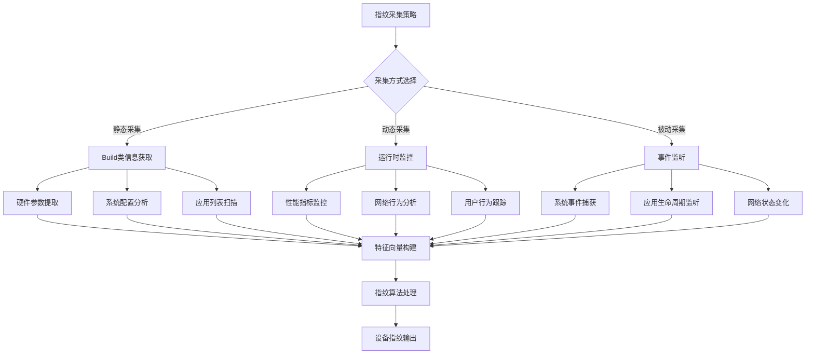

### 11.2.4 iOS系统指纹采集技术

iOS系统的限制性使得指纹采集需要采用更加隐蔽和巧妙的技术手段。

**iOS指纹采集的技术路径：**

```mermaid
pyramid
    title iOS指纹采集技术难度层次

    "系统API调用<br"(UIDevice/NSProcessInfo)" : 15%
    "公开框架信息<br"(UIKit/Foundation)" : 25%
    "私有框架访问<br"(Runtime/ObjC)" : 30%
    "系统漏洞利用<br"(Jailbreak相关)" : 20%
    "硬件特征提取<br"(传感器/设备特性)" : 10%
```

**iOS指纹信息采集的技术实现：**

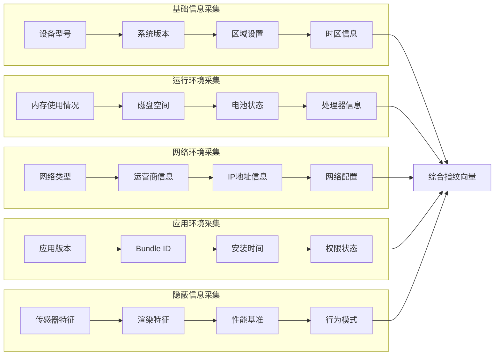

**iOS指纹采集的反检测策略：**

```mermaid
stateDiagram-v2
    [*] --> 采集策略初始化
    采集策略初始化 --> 权限状态检查

    权限状态检查 --> {权限可用性}

    权限可用性 --> 权限充足: 多源信息采集
    权限可用性 --> 权限受限: 隐蔽采集模式

    多源信息采集 --> 数据一致性验证
    隐蔽采集模式 --> 旁路信息获取

    数据一致性验证 --> 指纹生成
    旁路信息获取 --> 数据质量评估

    指纹生成 --> {检测风险评估}
    数据质量评估 --> 指纹生成

    检测风险评估 --> 风险低: 指纹存储
    检测风险评估 --> 风险高: 采集策略调整

    采集策略调整 --> 权限状态检查
    指纹存储 --> 持续监控
    持续监控 --> [*]
```

### 11.2.5 跨平台指纹标准化与对比

不同移动平台的指纹特征需要进行标准化处理，以实现跨平台的设备识别和追踪。

**跨平台指纹标准化流程：**

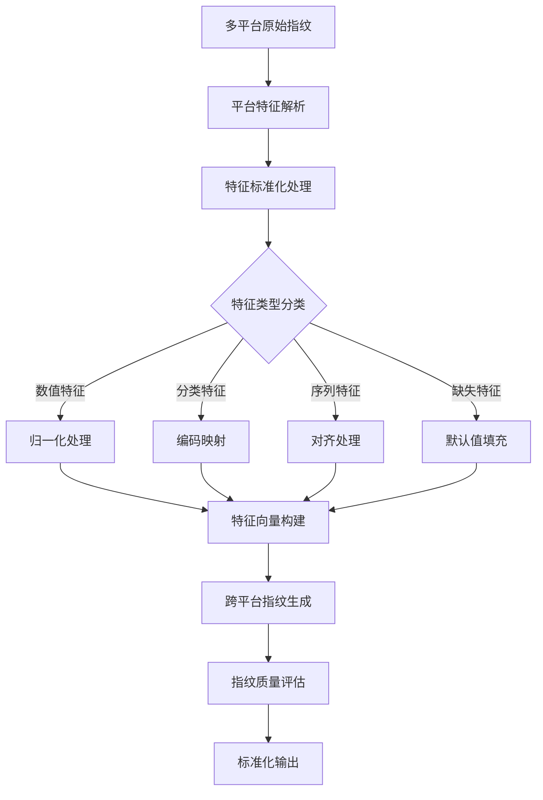

**Android vs iOS指纹特征对比：**

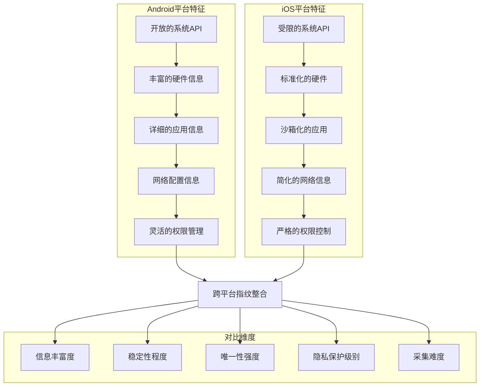

**跨平台指纹质量评估体系：**

| 评估维度 | Android平台 | iOS平台 | 标准化策略 | 权重系数 |
|---------|-------------|---------|-----------|---------|
| 硬件特征 | 极高 | 高 | 参数归一化 | 0.25 |
| 系统特征 | 高 | 中等 | 版本映射 | 0.20 |
| 应用特征 | 极高 | 低 | 类别编码 | 0.20 |
| 网络特征 | 高 | 中等 | 标准化协议 | 0.15 |
| 行为特征 | 高 | 高 | 模式量化 | 0.20 |

### 11.2.6 系统更新与指纹稳定性分析

移动系统的频繁更新对设备指纹的稳定性构成挑战，需要建立动态的指纹更新机制。

**系统更新对指纹的影响分析：**

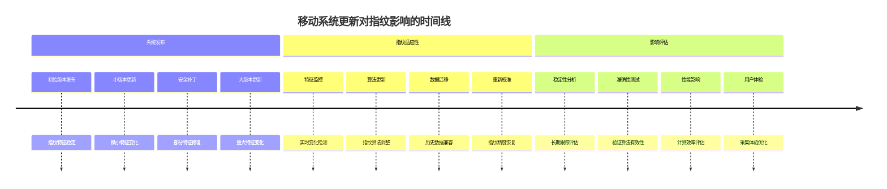

**动态指纹更新机制：**

```mermaid
stateDiagram-v2
    [*] --> 指纹基线建立
    指纹基线建立 --> 持续监控

    持续监控 --> {变化检测}

    变化检测 --> 无显著变化: 继续监控
    变化检测 --> 检测到变化: 变化分析

    变化分析 --> {变化类型判断}

    变化类型判断 --> 系统更新: 更新特征库
    变化类型判断 --> 配置变更: 重计算指纹
    变化类型判断 --> 恶意篡改: 安全告警

    更新特征库 --> 指纹重计算
    重计算指纹 --> 质量验证
    安全告警 --> 异常处理

    质量验证 --> {质量评估}

    质量评估 --> 合格: 指纹更新
    质量评估 --> 不合格: 参数调优

    参数调优 --> 指纹重计算
    指纹更新 --> 持续监控
    异常处理 --> [*]
```

**大型平台的系统更新应对策略：**

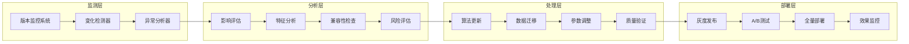

## 总结

### 核心技术要点回顾

本节深入分析了Android/iOS系统特性与指纹采集技术，构建了完整的跨平台指纹技术体系：

1. **系统架构理解**：掌握Android和iOS的系统架构与安全机制差异
2. **指纹采集技术**：了解两个平台的指纹采集技术路径和实现方法
3. **技术限制应对**：掌握面对系统限制时的反检测和隐蔽采集策略
4. **跨平台标准化**：理解不同平台指纹特征的标准化处理方法
5. **稳定性保障**：建立动态的指纹更新和适应性调整机制
6. **更新应对策略**：掌握系统更新对指纹的影响及应对方法

### 实战应用指导

在移动端指纹采集的实战应用中，需要遵循以下核心原则：

1. **平台差异化**：针对不同平台特点制定差异化的采集策略
2. **合规性优先**：确保所有采集行为符合平台政策和法规要求
3. **动态适应性**：建立能够适应系统变化的指纹机制
4. **风险控制**：实施严格的风险评估和安全保护措施
5. **性能优化**：在保证精度的基础上优化采集和计算性能

### 技术发展趋势

移动系统指纹技术正在向以下方向发展：

- **深度集成**：与系统底层更深入的集成方式
- **智能学习**：基于机器学习的自适应指纹算法
- **隐私保护**：在保证精度的同时加强隐私保护
- **边缘计算**：在设备端进行更复杂的指纹处理
- **标准化统一**：跨平台指纹标准的逐步建立

掌握这些系统特性与指纹采集技术，能够帮助我们在移动端安全防护和反爬对抗中建立更强大的技术能力。通过深入理解不同平台的技术特点和限制，我们可以制定更加有效和安全的指纹策略。