# 第11章：设备指纹与移动端反爬（四）

## 11.4 移动端反爬攻防实战与未来发展趋势

### 11.4.1 大型平台移动端反爬案例分析

通过分析大型互联网平台的移动端反爬实践，我们可以更好地理解实际应用中的技术策略和效果。

**电商平台移动端反爬架构：**

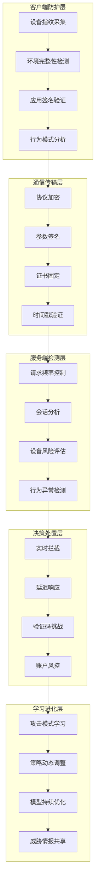

**社交平台移动端安全策略分析：**

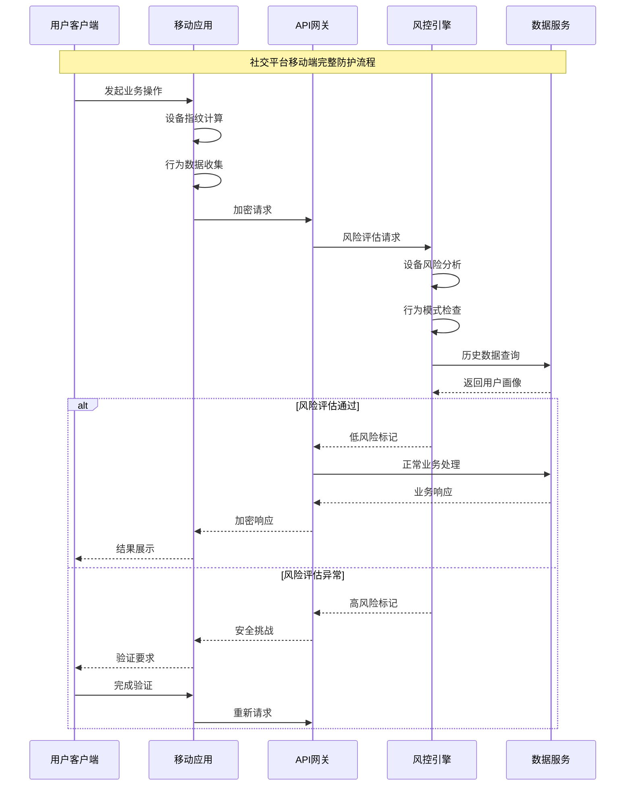

**金融平台移动端高级防护技术：**

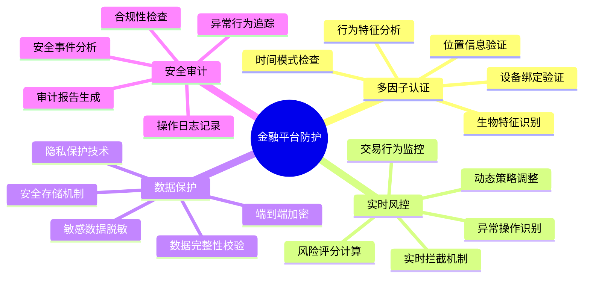

### 11.4.2 移动端反爬技术效果评估

建立科学的效果评估体系，对移动端反爬技术的实际效果进行量化分析。

**反爬技术评估指标体系：**

```mermaid
pyramid
    title 反爬技术效果评估指标权重

    "业务保护效果<br"(攻击拦截率/数据安全)" : 35%
    "用户体验影响<br"(响应时间/通过率)" : 25%
    "系统性能开销<br"(CPU/内存/网络)" : 20%
    "运维复杂度<br"(部署/维护/升级)" : 15%
    "成本效益比<br"(投入/产出/ROI)" : 5%
```

**评估流程与方法论：**

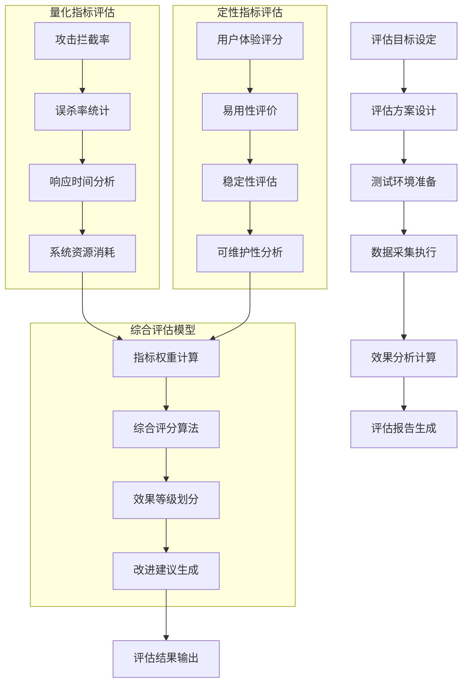

**不同场景下的效果对比分析：**

| 防护技术 | 电商场景 | 社交场景 | 金融场景 | 内容场景 | 综合评分 |
|---------|---------|---------|---------|---------|---------|
| 设备指纹 | 9.2 | 8.8 | 9.5 | 8.5 | 9.0 |
| 行为分析 | 8.5 | 9.2 | 9.3 | 8.8 | 8.9 |
| 协议保护 | 8.8 | 8.5 | 9.1 | 8.3 | 8.7 |
| 环境检测 | 7.9 | 8.2 | 8.8 | 8.1 | 8.3 |
| 实时风控 | 9.0 | 8.9 | 9.6 | 8.4 | 9.0 |

### 11.4.3 移动端反爬技术攻防对抗策略

分析攻击者的技术手段和应对策略，建立更加完善的防御体系。

**常见攻击手段技术分析：**

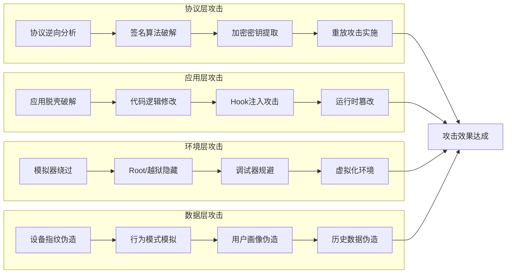

**防御策略的演进路径：**

```mermaid
stateDiagram-v2
    [*] --> 基础防护
    基础防护 --> {攻击演进}

    攻击演进 --> 简单攻击: 强化防护
    攻击演进 --> 中级攻击: 智能防护
    攻击演进 --> 高级攻击: 综合防护
    攻击演进 --> APT攻击: 自适应防护

    强化防护 --> 防护效果评估
    智能防护 --> 防护效果评估
    综合防护 --> 防护效果评估
    自适应防护 --> 防护效果评估

    防护效果评估 --> {效果判断}

    效果判断 --> 有效: 持续监控
    效果判断 --> 部分有效: 策略优化
    效果判断 --> 无效: 架构重构

    持续监控 --> 威胁监测
    策略优化 --> 防护升级
    架构重构 --> 重新设计

    威胁监测 --> 攻击演进
    防护升级 --> 攻击演进
    重新设计 --> 基础防护
```

**智能对抗技术体系：**

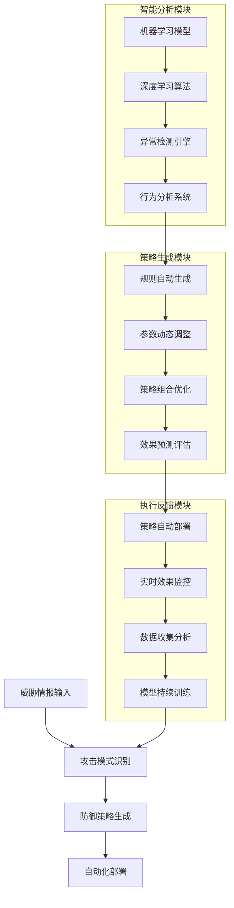

### 11.4.4 未来技术发展趋势

移动端反爬技术正在向智能化、自动化、综合化的方向发展。

**技术演进趋势分析：**

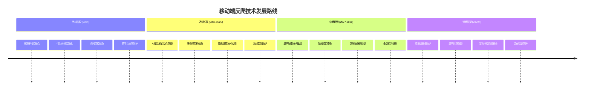

**新兴技术对反爬的影响：**

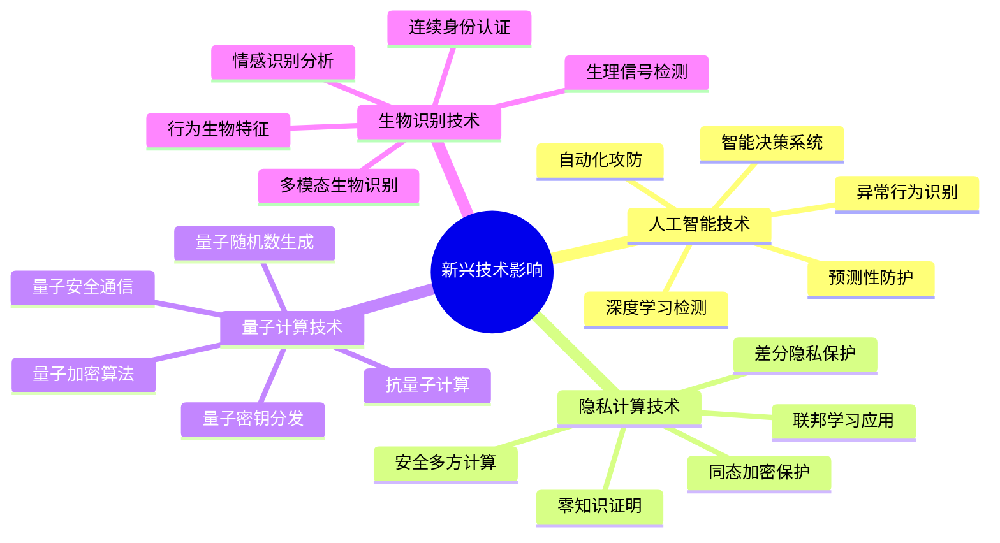

**未来防护架构展望：**

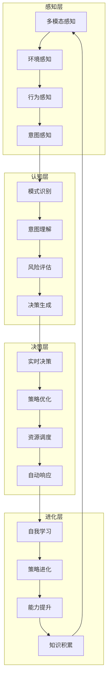

### 11.4.5 最佳实践与实施建议

基于对移动端反爬技术的深入分析，提供实际的实施建议和最佳实践指导。

**实施路线图建议：**

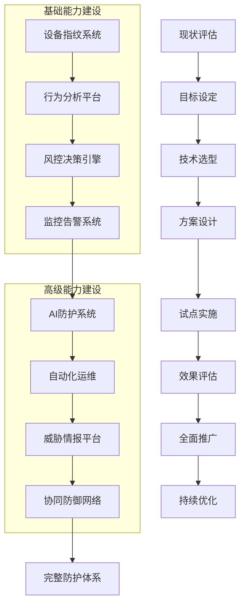

**风险控制与合规建议：**

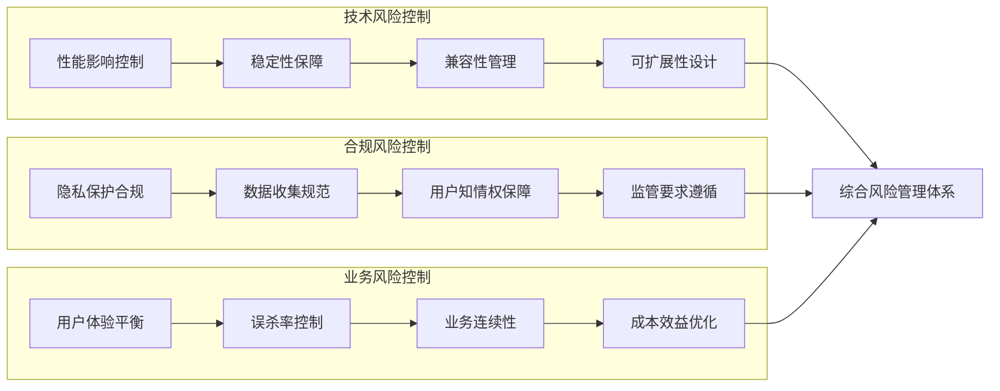

**成功实施的关键要素：**

| 关键要素 | 实施要点 | 成功指标 | 风险控制 | 持续改进 |
|---------|---------|---------|---------|---------|
| 技术架构 | 模块化设计 | 系统稳定性 | 技术选型风险 | 架构演进 |
| 团队能力 | 专业培训 | 技术掌握度 | 人才流失风险 | 能力提升 |
| 流程管理 | 标准化流程 | 执行效率 | 流程僵化风险 | 流程优化 |
| 资源投入 | 合理预算 | 投入产出比 | 资源不足风险 | 资源调配 |
| 监控评估 | 全方位监控 | 问题发现率 | 盲区风险 | 监控完善 |

## 总结

### 核心技术要点回顾

本章最后一节全面分析了移动端反爬的实战应用和未来发展趋势：

1. **实战案例分析**：通过大型平台的实际案例了解技术应用现状
2. **效果评估体系**：建立科学的反爬技术效果评估方法
3. **攻防对抗策略**：分析攻击手段和制定相应防御策略
4. **未来发展趋势**：把握技术发展方向和新兴技术影响
5. **最佳实践指导**：提供实际实施的建议和风险控制措施

### 实战应用指导

在移动端反爬技术的实施中，需要重点关注：

1. **系统性规划**：制定完整的技术实施路线图
2. **分阶段实施**：采用渐进式的部署策略
3. **效果导向**：以实际防护效果为评估标准
4. **风险控制**：平衡安全防护与业务发展
5. **持续进化**：建立技术和策略的持续改进机制

### 技术发展展望

移动端反爬技术的未来发展将呈现以下特点：

- **智能化程度不断提升**：AI和机器学习技术的深度应用
- **防护体系更加完善**：从单点防护向体系化防护转变
- **用户体验持续优化**：在保证安全的前提下提升用户体验
- **合规要求日益严格**：隐私保护和数据安全成为重要考量
- **技术融合加速发展**：多种新兴技术的综合应用

通过系统掌握这些移动端设备指纹与反爬技术，我们能够在移动安全领域建立更强大的技术能力，为移动应用的安全防护提供更加专业和有效的解决方案。在未来的技术发展中，我们需要持续学习和适应新的技术趋势，保持在移动安全对抗中的技术优势。