# 第12章：高级反爬技术与对抗策略（一）

## 12.1 人工智能驱动的反爬技术

### 12.1.1 基于机器学习的异常检测

人工智能技术，特别是机器学习，已经彻底改变了现代反爬系统的技术架构。传统基于规则和阈值的检测方法正在被智能化的异常检测系统所取代，这种转变使得反爬技术能够更精准地识别和应对复杂的爬虫攻击。

**机器学习异常检测的技术架构：**

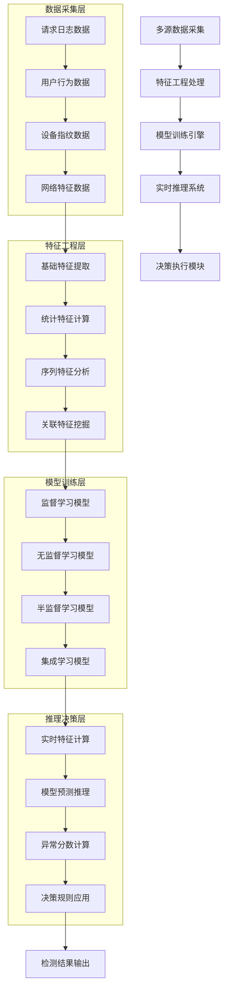

**异常检测算法体系分类：**

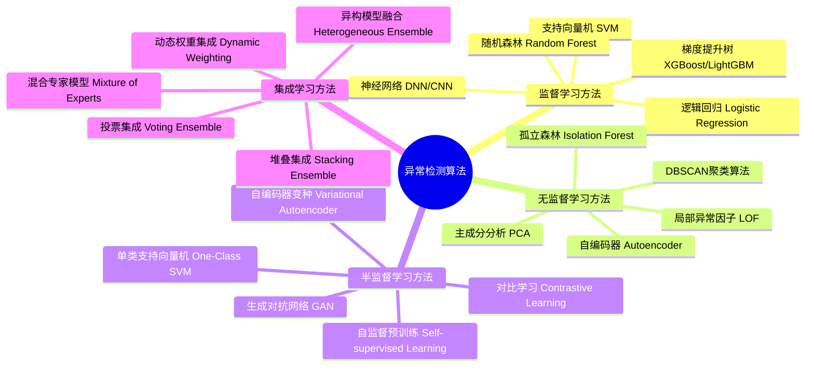

**大型平台异常检测实战架构：**

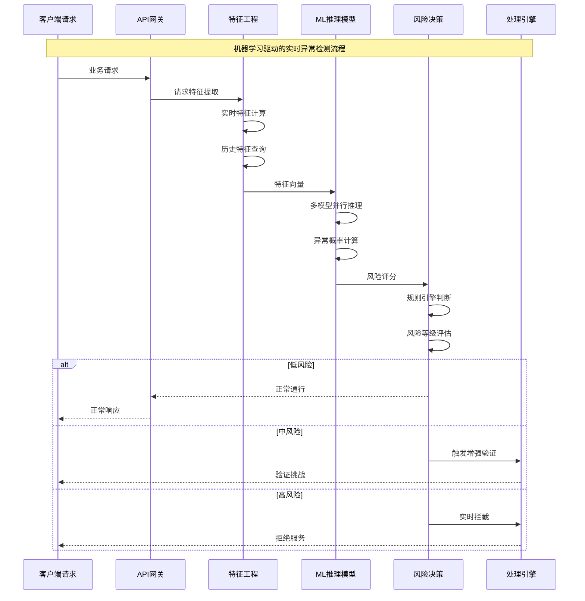

### 12.1.2 用户行为模式分析与识别

用户行为模式分析是AI驱动反爬技术的核心应用领域，通过深度学习技术分析用户的行为序列，能够精准识别自动化工具和爬虫程序的行为特征。

**用户行为特征的多维分析体系：**

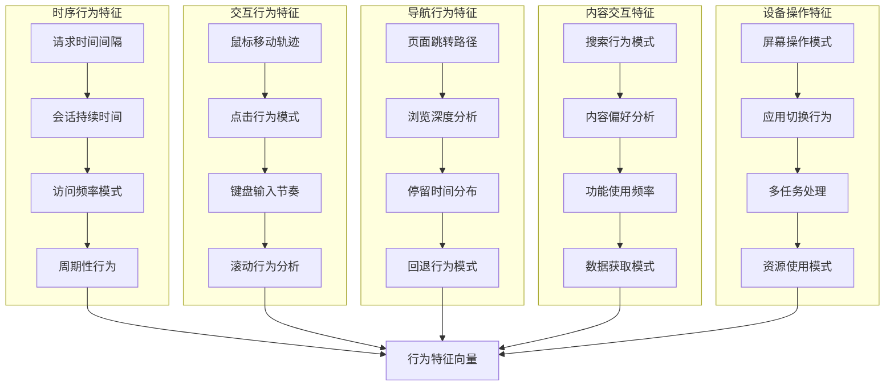

**深度学习行为分析技术架构：**

```mermaid
pyramid
    title 行为分析技术层次架构

    "高级认知分析<br>(意图识别/决策模式)" : 10%
    "序列行为分析<br>(LSTM/Transformer/时序模型)" : 25%
    "模式识别分析<br"(CNN/图像识别/特征提取)" : 30%
    "统计分析<br"(统计特征/分布分析)" : 35%
```

**行为模式识别的技术实现流程：**

```mermaid
stateDiagram-v2
    [*] --> 行为数据采集
    行为数据采集 --> 数据预处理

    数据预处理 --> 特征提取
    特征提取 --> 模式识别

    模式识别 --> {识别类型}

    识别类型 --> 正常行为: 用户画像更新
    识别类型 --> 可疑行为: 深度分析
    识别类型 --> 异常行为: 威胁处置

    深度分析 --> 序列模式分析
    深度分析 --> 关联行为挖掘
    深度分析 --> 异常特征放大

    序列模式分析 --> 综合判断
    关联行为挖掘 --> 综合判断
    异常特征放大 --> 综合判断

    综合判断 --> {最终判定}

    最终判定 --> 确认正常: 持续监控
    最终判定 --> 确认异常: 安全响应
    最终判定 --> 不确定: 增强监控

    用户画像更新 --> 持续监控
    安全响应 --> 风险处置记录
    增强监控 --> 高频监控

    持续监控 --> [*]
    风险处置记录 --> [*]
    高频监控 --> [*]
```

### 12.1.3 深度学习在反爬中的应用

深度学习技术的快速发展为反爬系统提供了更强大的分析和识别能力，特别是在处理复杂的非结构化数据和挖掘深层行为模式方面表现出色。

**反爬中的深度学习模型体系：**

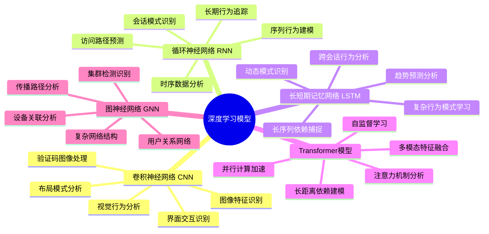

**深度学习反爬系统的训练流程：**

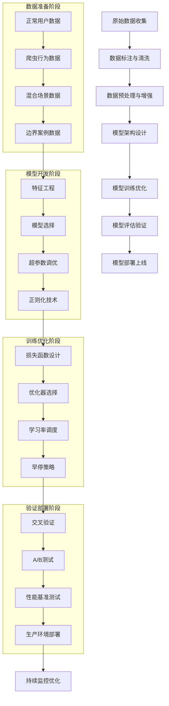

**多模态深度学习融合技术：**

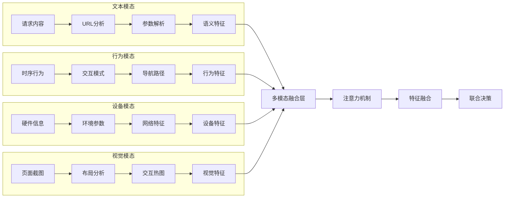

### 12.1.4 实时风险评分与决策系统

实时风险评分系统是AI驱动反爬技术的核心组件，通过综合多个维度的风险指标，为每个请求实时计算风险分数，并做出相应的处置决策。

**实时风险评分系统架构：**

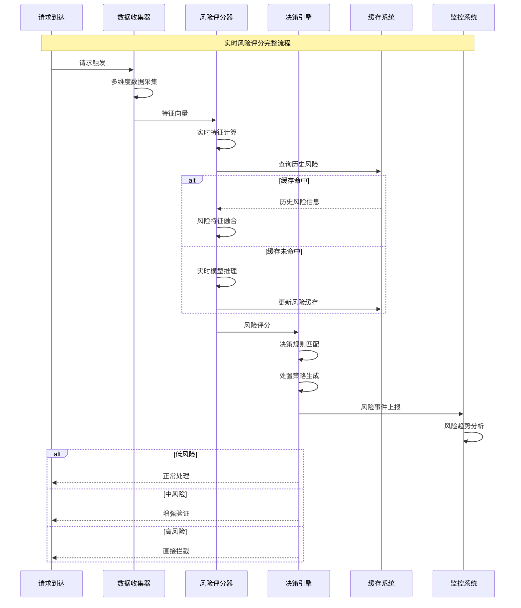

**多维度风险评分指标体系：**

```mermaid
pyramid
    title 风险评分指标权重分布

    "行为风险<br"(访问模式/交互特征)" : 30%
    "设备风险<br"(指纹异常/环境特征)" : 25%
    "网络风险<br"(IP/域名/流量特征)" : 20%
    "内容风险<br"(请求参数/访问目标)" : 15%
    "时间风险<br"(频率/时段/持续性)" : 10%
```

**智能决策引擎的技术实现：**

```mermaid
flowchart TD
    A[风险评分输入] --> B[决策规则引擎]

    B --> C{风险等级判断}

    C -->|低风险(0-30)| D[正常通行策略]
    C -->|中风险(31-70)| E[增强验证策略]
    C -->|高风险(71-90)| F[限制访问策略]
    C -->|极高风险(91-100)| G[直接拦截策略]

    D --> H[记录正常行为]
    E --> I[触发验证机制]
    F --> J[实施访问限制]
    G --> K[启动安全响应]

    subgraph "验证策略选项"
        I1[短信验证] --> I2[邮箱验证]
        I2 --> I3[图形验证码]
        I3 --> I4[行为验证]
    end

    subgraph "限制策略选项"
        J1[降低频率] --> J2[功能限制]
        J2 --> J3[延迟响应]
        J3 --> J4[临时封禁]
    end

    subgraph "安全响应选项"
        K1[IP封禁] --> K2[账户冻结]
        K2 --> K3[安全告警]
        K3 --> K4[法律追责]
    end

    I --> I1
    J --> J1
    K --> K1

    H --> L[用户画像更新]
    I4 --> M[验证结果处理]
    J4 --> N[限制效果监控]
    K4 --> O[安全事件处理]

    L --> P[持续学习优化]
    M --> P
    N --> P
    O --> P
```

### 12.1.5 AI对抗技术与攻防博弈

随着AI技术在反爬领域的广泛应用，攻击者也开始使用AI技术来绕过防护，这催生了一个全新的AI对抗技术领域，形成了复杂的技术攻防博弈。

**AI对抗技术的演进路径：**

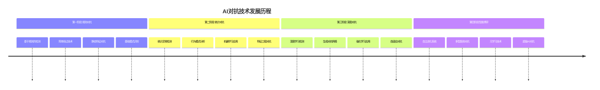

**生成对抗网络(GAN)在反爬中的应用：**

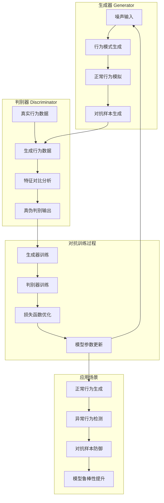

**强化学习在动态防御中的应用：**

```mermaid
stateDiagram-v2
    [*] --> 环境初始化
    环境初始化 --> 智能体感知

    智能体感知 --> 状态分析
    状态分析 --> 动作选择

    动作选择 --> 防御策略执行
    防御策略执行 --> 环境反馈

    环境反馈 --> 奖励计算
    奖励计算 --> 策略评估

    策略评估 --> {策略效果}

    策略效果 --> 正向效果: 策略强化
    策略效果 --> 负向效果: 策略调整
    策略效果 --> 中性效果: 继续探索

    策略强化 --> 模型更新
    策略调整 --> 经验回放
    继续探索 --> 环境感知更新

    模型更新 --> 智能体感知
    经验回放 --> 智能体感知
    环境感知更新 --> 智能体感知
```

**AI攻防博弈的技术平衡：**

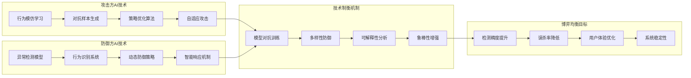

## 总结

### 核心技术要点回顾

本节深入探讨了人工智能驱动的反爬技术体系，构建了完整的AI反爬技术框架：

1. **机器学习异常检测**：掌握了基于各种机器学习算法的异常检测技术架构
2. **行为模式分析**：理解了用户行为多维度分析和深度学习识别技术
3. **深度学习应用**：了解了CNN、RNN、LSTM、Transformer等模型在反爬中的应用
4. **实时风险评分**：掌握了多维度风险评分指标和智能决策引擎技术
5. **AI对抗技术**：理解了GAN、强化学习等AI对抗技术的攻防博弈机制

### 实战应用指导

在AI驱动反爬技术的实际应用中，需要遵循以下核心原则：

1. **数据质量优先**：确保训练数据的质量和多样性，避免模型偏见
2. **模型可解释性**：在保证精度的同时，提高模型决策的可解释性
3. **实时性能优化**：平衡模型复杂度和推理速度，满足实时性要求
4. **持续学习机制**：建立模型的持续学习和自适应优化机制
5. **人机协同决策**：在关键决策点保留人工干预和审核机制

### 技术发展趋势

AI驱动的反爬技术正在向以下方向发展：

- **多模态融合**：结合文本、图像、行为等多种模态的综合分析
- **自监督学习**：减少对标注数据的依赖，提高模型泛化能力
- **联邦学习**：在保护隐私的前提下实现多方协同的模型训练
- **边缘计算**：将AI推理能力下沉到边缘节点，提高响应速度
- **可解释AI**：提高AI决策的透明度和可解释性

掌握这些AI驱动的反爬技术，能够帮助我们在智能化对抗中建立更强大的技术优势。通过持续的技术创新和实践应用，我们可以构建更加智能、精准和高效的反爬防护体系。