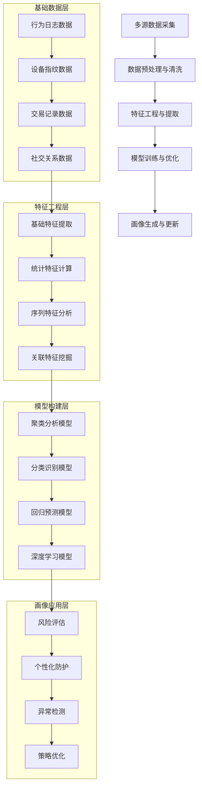
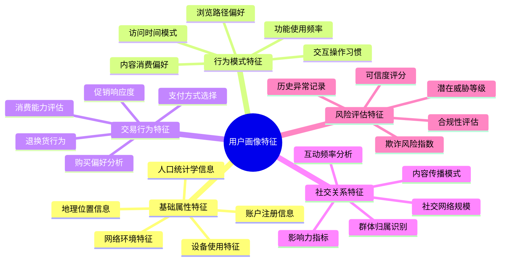
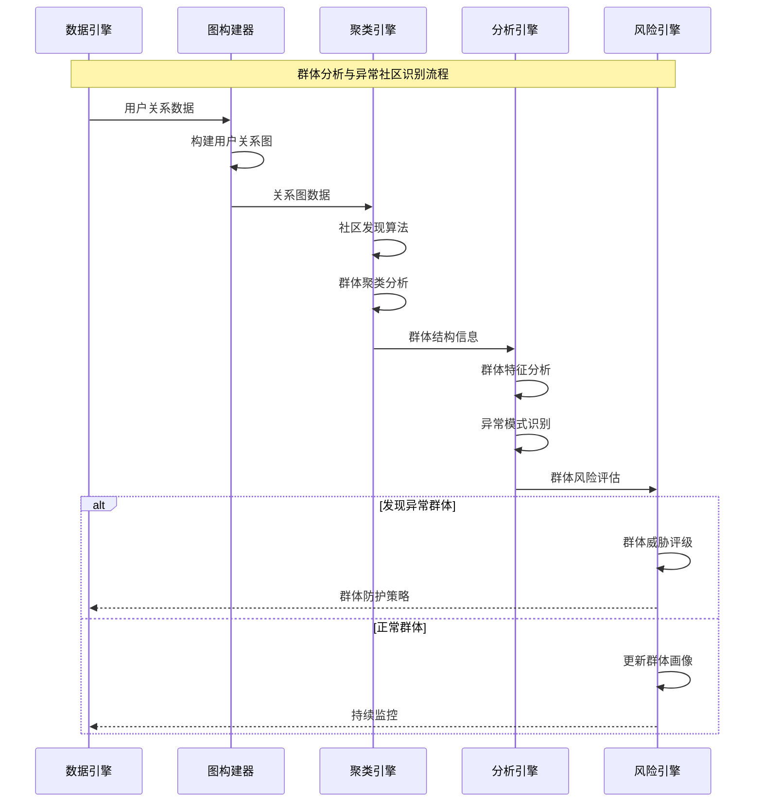
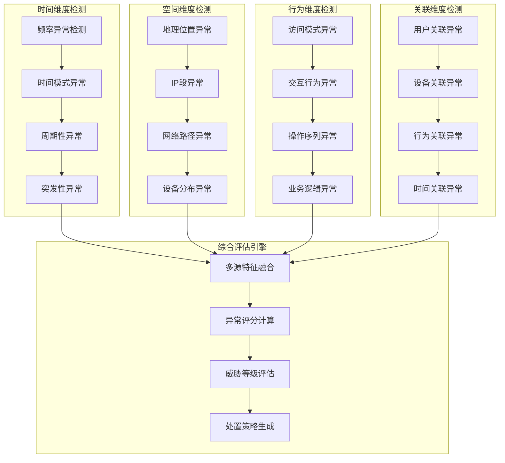
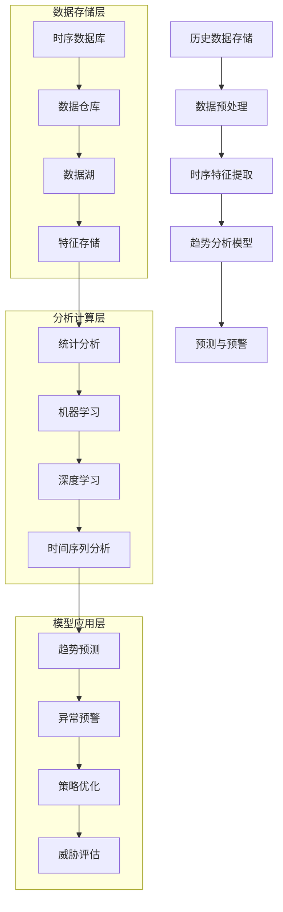
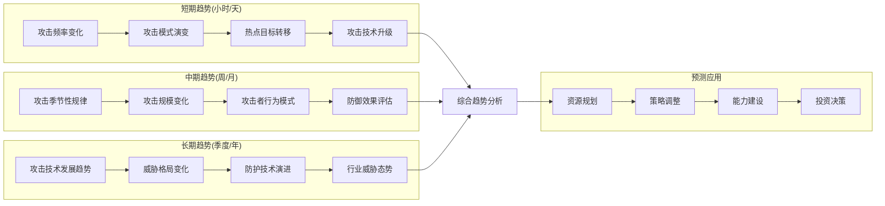
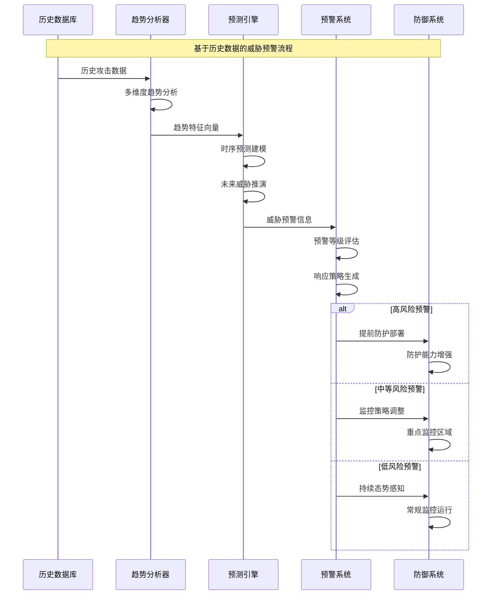
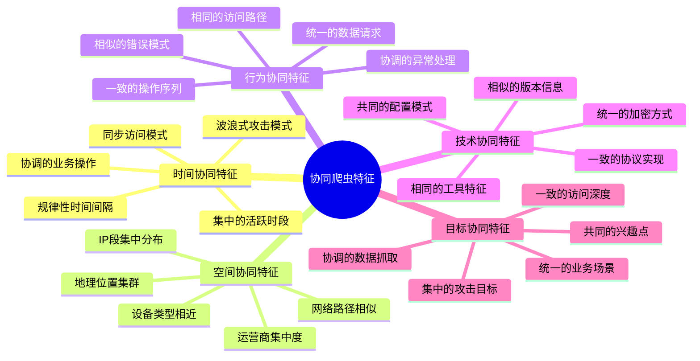
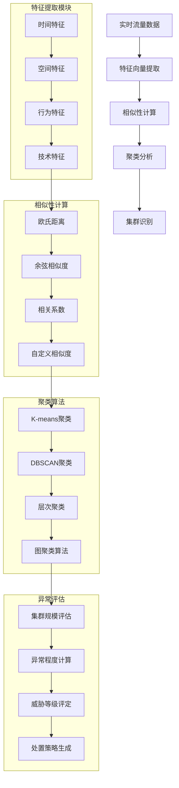
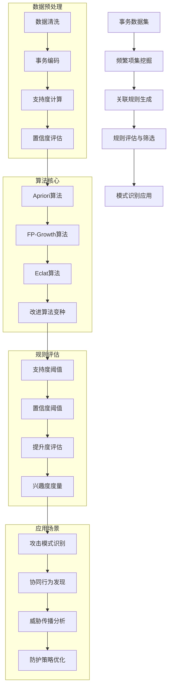

# 第12章：高级反爬技术与对抗策略（三）

## 12.3 大数据驱动的反爬策略

### 12.3.1 用户画像与群体分析

大数据技术使得反爬系统能够构建精确的用户画像和进行深度的群体分析，通过分析海量用户行为数据，识别异常模式和潜在威胁。

**用户画像构建的技术架构：**



**用户画像的多维特征体系：**



**群体分析与社区发现技术：**



### 12.3.2 异常流量模式识别

大数据技术使得反爬系统能够分析海量流量数据，识别复杂的异常模式，包括协同攻击、分布式爬虫和高级持续性威胁。

**异常流量识别的技术体系：**

```mermaid
pyramid
    title 异常流量识别技术层次

    "高级模式识别<br"(协同攻击/APT威胁)" : 15%
    "群体行为分析<br"(集群检测/关联分析)" : 25%
    "个体异常检测<br"(行为异常/统计异常)" : 30%
    "基础流量监控<br"(阈值检测/简单规则)" : 30%
```

**多维度异常流量检测架构：**



**基于机器学习的异常模式识别：**

```mermaid
stateDiagram-v2
    [*] --> 数据采集
    数据采集 --> 特征提取

    特征提取 --> {检测算法选择}

    检测算法选择 --> 监督学习: 分类模型检测
    检测算法选择 --> 无监督学习: 聚类异常检测
    检测算法选择 --> 深度学习: 神经网络检测
    检测算法选择 --> 混合方法: 集成模型检测

    分类模型检测 --> {异常评分}
    聚类异常检测 --> {异常评分}
    神经网络检测 --> {异常评分}
    集成模型检测 --> {异常评分}

    异常评分 --> 阈值判断

    阈值判断 --> 正常流量: 持续监控
    阈值判断 --> 可疑流量: 增强监控
    阈值判断 --> 异常流量: 实时拦截

    持续监控 --> 数据采集
    增强监控 --> 特征提取
    实时拦截 --> 威胁处置
    威胁处置 --> [*]
```

### 12.3.3 基于历史数据的趋势分析

历史数据是反爬系统的重要资产，通过分析长期的历史数据，可以发现攻击趋势、预测未来威胁，并优化防护策略。

**历史数据分析的技术架构：**



**威胁趋势分析的多时间尺度：**



**基于历史数据的智能预警系统：**



### 12.3.4 集群检测与协同爬虫识别

现代爬虫攻击越来越倾向于分布式、协同化的方式，通过集群检测技术可以识别和应对这种复杂的攻击模式。

**协同爬虫攻击的特征分析：**



**集群检测算法的技术实现：**



**分布式爬虫集群的实时检测：**

```mermaid
stateDiagram-v2
    [*] --> 数据流监控
    数据流监控 --> 实时特征计算

    实时特征计算 --> 滑动窗口分析
    滑动窗口分析 --> 相似性聚类

    相似性聚类 --> {集群发现}

    集群发现 --> 发现新集群: 集群特征分析
    集群发现 --> 已有集群: 集群更新跟踪

    集群特征分析 --> 威胁评估
    集群更新跟踪 --> 动态监控

    威胁评估 --> {威胁等级}

    威胁等级 --> 高威胁: 立即拦截
    威胁等级 --> 中威胁: 增强监控
    威胁等级 --> 低威胁: 持续观察

    立即拦截 --> 集群处置
    增强监控 --> 行为追踪
    持续观察 --> 态势感知

    集群处置 --> 效果评估
    行为追踪 --> 模式学习
    态势感知 --> 趋势分析

    效果评估 --> 策略优化
    模式学习 --> 特征更新
    趋势分析 --> 预警升级

    策略优化 --> 数据流监控
    特征更新 --> 实时特征计算
    预警升级 --> 滑动窗口分析
```

### 12.3.5 数据挖掘在反爬中的应用

数据挖掘技术能够从海量数据中发现隐藏的模式和关联规则，为反爬策略的制定和优化提供数据驱动的决策支持。

**反爬数据挖掘的技术框架：**

```mermaid
pyramid
    title 数据挖掘技术在反爬中的应用层次

    "高级分析应用<br"(预测建模/决策支持)" : 15%
    "模式识别应用<br"(关联规则/序列模式)" : 25%
    "统计分析应用<br"(描述统计/推断统计)" : 30%
    "数据预处理<br"(清洗/转换/集成)" : 30%
```

**关联规则挖掘在攻击模式识别中的应用：**



**序列模式挖掘在攻击链分析中的应用：**

```mermaid
sequenceDiagram
    participant LogSystem as 日志系统
    participant PatternMiner as 模式挖掘器
    SequenceAnalyzer as 序列分析器
    participant ThreatDetector as 威胁检测器
    participant DefenseSystem as 防御系统

    Note over LogSystem,DefenseSystem: 序列模式挖掘在攻击链分析中的应用

    LogSystem->>PatternMiner: 用户行为序列
    PatternMiner->>PatternMiner: 序列预处理
    PatternMiner->>SequenceAnalyzer: 清洁序列数据

    SequenceAnalyzer->>SequenceAnalyzer: 序列模式挖掘
    SequenceAnalyzer->>SequenceAnalyzer: 频繁序列识别
    SequenceAnalyzer->>ThreatDetector: 模式特征

    ThreatDetector->>ThreatDetector: 攻击链重构
    ThreatDetector->>ThreatDetector: 威胁阶段识别
    ThreatDetector->>DefenseSystem: 攻击预警

    alt 发现完整攻击链
        DefenseSystem->>DefenseSystem: 链式阻断策略
        DefenseSystem-->>LogSystem: 增强日志记录
    else 发现部分攻击模式
        DefenseSystem->>DefenseSystem: 重点监控策略
        DefenseSystem-->>LogSystem: 详细行为跟踪
    end
```

## 总结

### 核心技术要点回顾

本节深入探讨了大数据驱动的反爬策略体系，构建了完整的数据驱动防护框架：

1. **用户画像技术**：掌握了多维度用户画像构建和群体分析方法
2. **异常流量识别**：理解了基于机器学习的多维度异常检测技术
3. **历史趋势分析**：了解了多时间尺度的威胁趋势分析和预测方法
4. **集群检测技术**：掌握了协同爬虫识别和集群行为分析方法
5. **数据挖掘应用**：理解了关联规则挖掘和序列模式挖掘在反爬中的应用

### 实战应用指导

在大数据驱动反爬策略的实际应用中，需要遵循以下核心原则：

1. **数据质量优先**：确保数据的准确性、完整性和时效性
2. **隐私保护合规**：在数据分析过程中严格遵守隐私保护法规
3. **算法可解释性**：在保证效果的同时提高算法的透明度和可解释性
4. **实时性能平衡**：在大数据分析中兼顾实时性和准确性
5. **持续模型优化**：建立基于新数据的持续学习和模型更新机制

### 技术发展趋势

大数据驱动的反爬技术正在向以下方向发展：

- **实时大数据处理**：基于流式计算的实时大数据分析能力
- **图计算技术**：基于图神经网络的高级关系分析
- **隐私计算**：在保护隐私的前提下进行数据分析和模型训练
- **自动化机器学习**：减少人工干预的自动化模型构建和优化
- **联邦学习**：多方协同的分布式机器学习框架

掌握这些大数据驱动的反爬技术，能够帮助我们在海量数据中发现隐藏的威胁模式，构建更加智能和精准的防护体系。通过数据驱动的决策和优化，我们可以实现反爬技术的持续进化和创新。