# 第12章：高级反爬技术与对抗策略（二）

## 12.2 实时反爬与动态防护

### 12.2.1 实时流量监控与异常检测

实时流量监控是动态反爬防护的基础设施，通过高速数据处理和实时分析能力，能够在攻击发生的瞬间识别和响应异常流量。

**实时流量监控技术架构：**

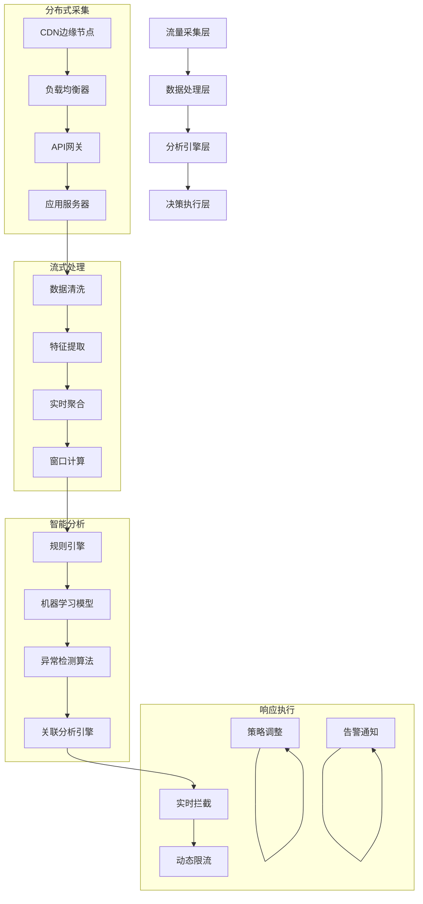

**实时异常检测的多层次分析：**

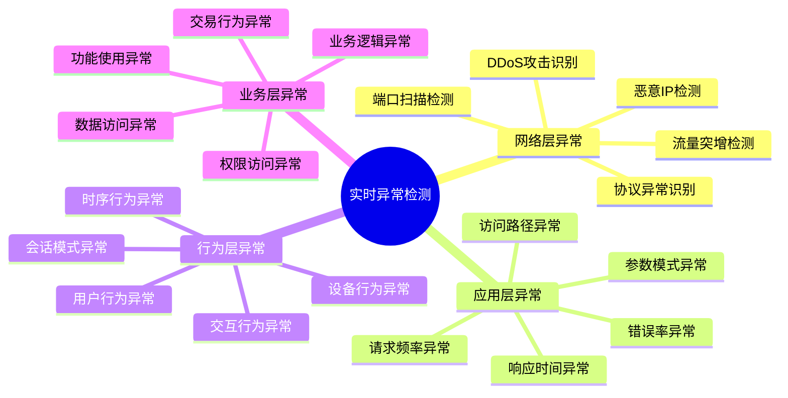

**流式数据处理的技术实现：**

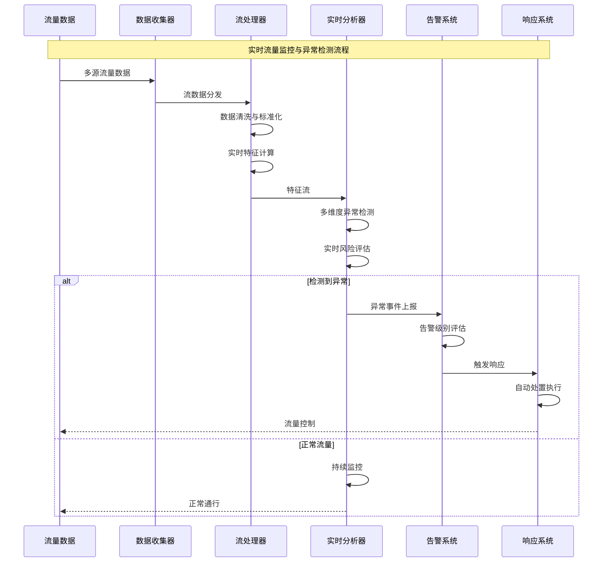

### 12.2.2 动态规则引擎与策略更新

动态规则引擎是现代反爬系统的核心组件，能够根据实时威胁情报和攻击模式变化，自动调整和优化防护策略。

**动态规则引擎的技术架构：**

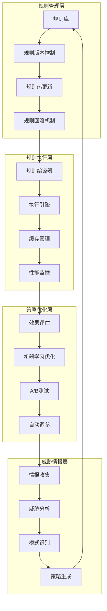

**规则引擎的核心技术组件：**

```mermaid
pyramid
    title 动态规则引擎技术层次

    "智能决策层<br"(AI优化/自动调参)" : 15%
    "策略管理层<br"(A/B测试/效果评估)" : 20%
    "规则执行层<br"(编译优化/缓存加速)" : 25%
    "规则定义层<br"(DSL语法/规则模板)" : 40%
```

**规则热更新与版本管理机制：**

```mermaid
stateDiagram-v2
    [*] --> 规则开发
    规则开发 --> 规则测试

    规则测试 --> {测试结果}

    测试结果 --> 测试通过: 规则发布
    测试结果 --> 测试失败: 规则修改

    规则修改 --> 规则测试

    规则发布 --> 版本管理
    版本管理 --> 灰度发布

    灰度发布 --> {效果监控}

    效果监控 --> 效果良好: 全量发布
    效果监控 --> 效果不佳: 回滚处理
    效果监控 --> 需要调优: 参数调整

    全量发布 --> 持续监控
    回滚处理 --> 版本回退
    参数调整 --> 重新测试

    持续监控 --> 规则优化
    版本回退 --> 规则分析
    重新测试 --> 效果监控

    规则优化 --> 规则开发
    规则分析 --> 规则开发
```

### 12.2.3 基于行为分析的实时拦截

基于行为分析的实时拦截技术通过对用户行为的深度分析，能够在识别恶意行为的瞬间执行拦截操作，实现对高级威胁的实时防护。

**行为分析驱动的实时拦截系统：**

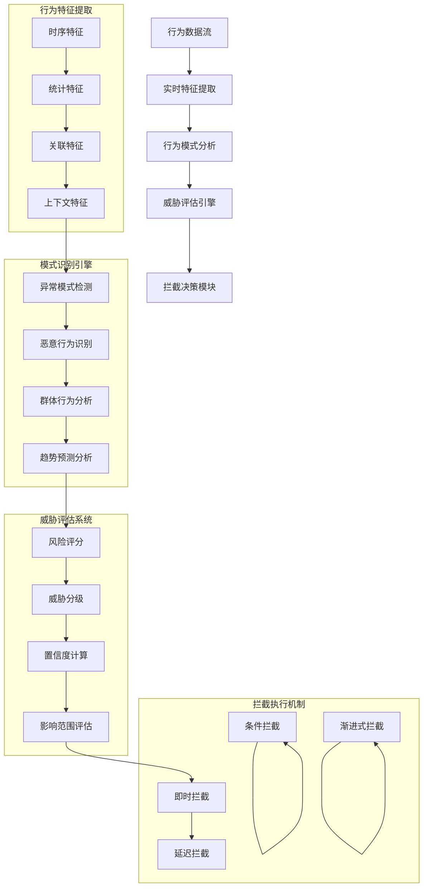

**多层次拦截策略的技术实现：**

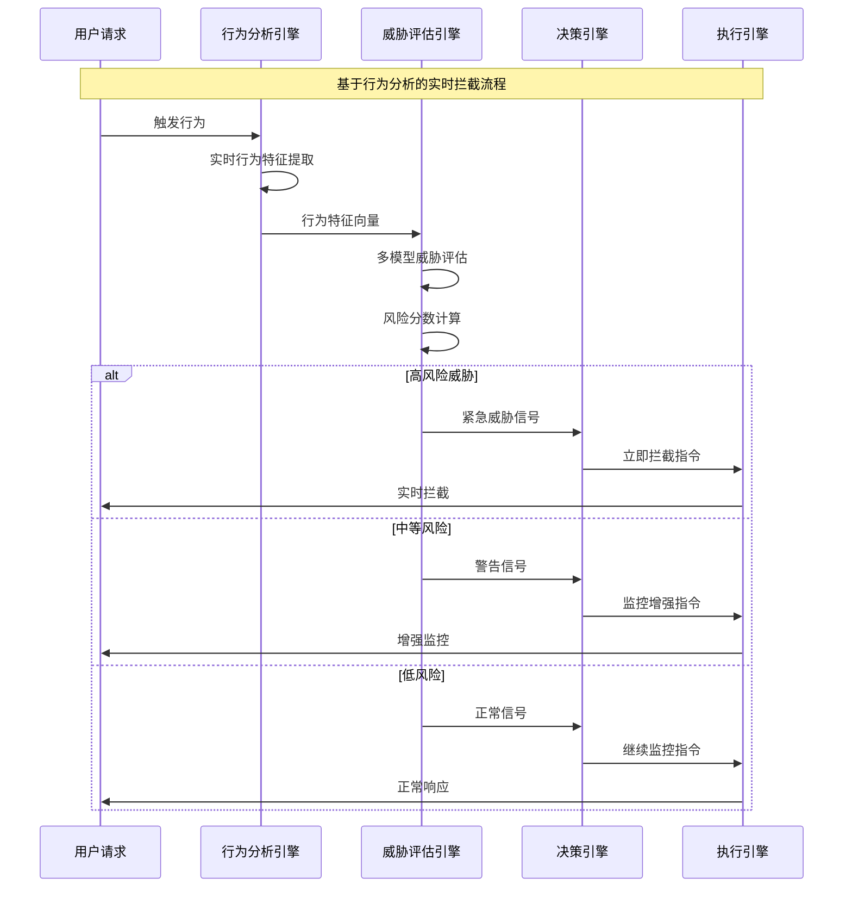

**智能拦截策略的动态调整：**

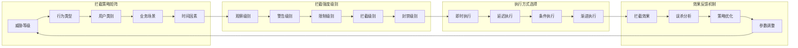

### 12.2.4 灰度发布与A/B测试反爬

灰度发布和A/B测试是现代反爬系统优化的重要方法，通过科学的实验设计和渐进式的部署策略，能够最大程度地降低新策略的风险，提高防护效果。

**灰度发布系统的技术架构：**

```mermaid
stateDiagram-v2
    [*] --> 策略开发
    策略开发 --> 离线测试

    离线测试 --> {测试结果}

    测试结果 --> 通过: 小范围灰度
    测试结果 --> 失败: 策略调整

    策略调整 --> 离线测试

    小范围灰度 --> {效果评估}

    效果评估 --> 效果良好: 中等范围灰度
    效果评估 --> 效果不佳: 策略优化
    效果评估 --> 出现问题: 紧急回滚

    中等范围灰度 --> {进一步评估}

    进一步评估 --> 持续良好: 大范围灰度
    进一步评估 --> 效果下降: 参数调整
    进一步评估 --> 发现问题: 快速回滚

    大范围灰度 --> {最终评估}

    最终评估 --> 验证成功: 全量发布
    最终评估 --> 需要改进: 持续优化
    最终评估 --> 严重问题: 紧急回滚

    全量发布 --> 持续监控
    策略优化 --> 小范围灰度
    参数调整 --> 中等范围灰度
    持续优化 --> 大范围灰度
```

**A/B测试在反爬策略优化中的应用：**

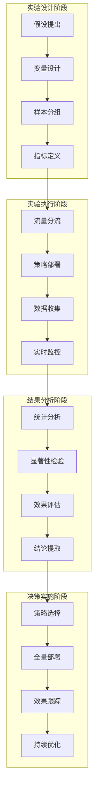

**多变量A/B测试的技术实现：**

```mermaid
pyramid
    title A/B测试变量层次结构

    "高级策略变量<br"(算法模型/决策逻辑)" : 15%
    "中级策略变量<br"(阈值参数/权重配置)" : 25%
    "基础策略变量<br"(拦截规则/限流参数)" : 30%
    "展示变量<br"(提示信息/验证方式)" : 30%
```

### 12.2.5 弹性防护与自适应机制

弹性防护和自适应机制是现代反爬系统的核心特征，能够根据威胁强度、系统负载和业务需求动态调整防护策略，实现最优的防护效果。

**弹性防护系统的技术架构：**

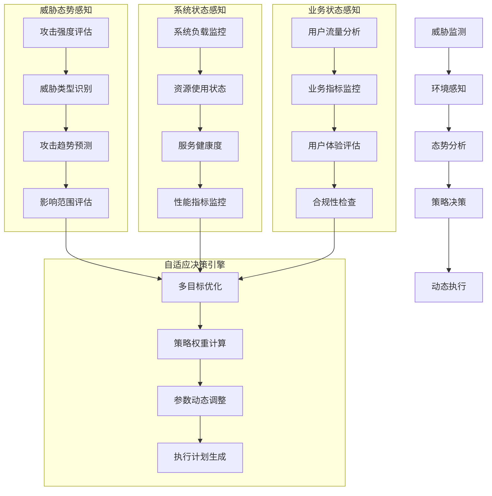

**自适应防护策略的动态调整机制：**

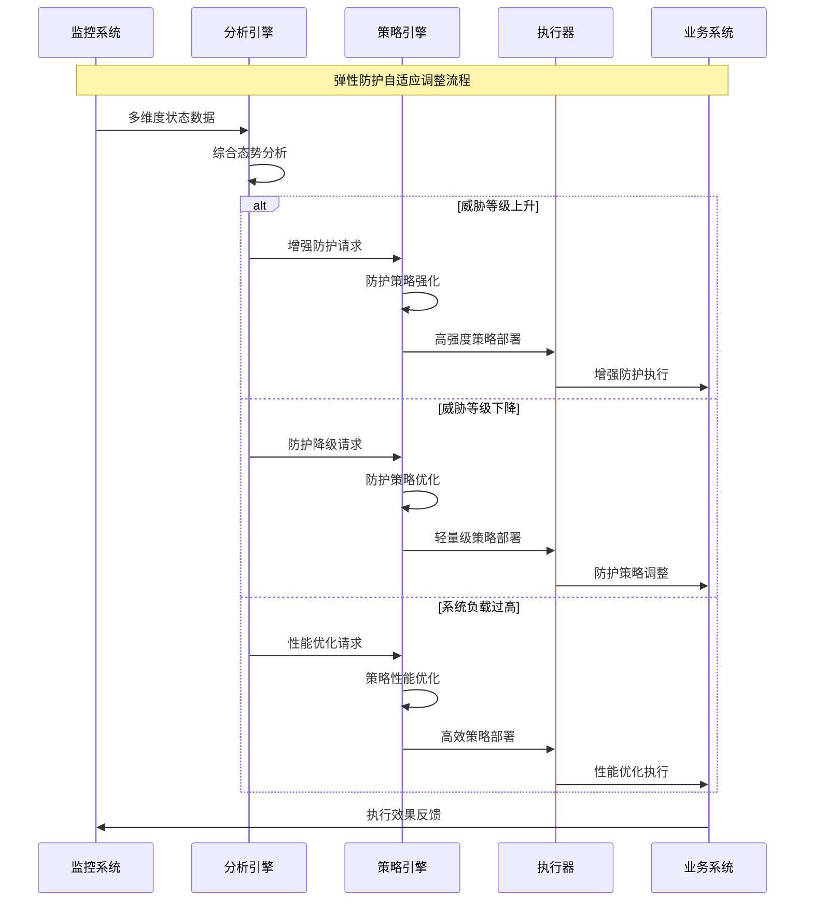

**多目标优化的决策模型：**

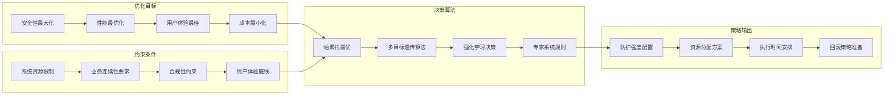

## 总结

### 核心技术要点回顾

本节深入探讨了实时反爬与动态防护技术体系，构建了完整的动态防护技术框架：

1. **实时流量监控**：掌握了基于流式处理的实时异常检测技术架构
2. **动态规则引擎**：理解了规则热更新、版本管理和策略优化机制
3. **行为分析拦截**：了解了基于行为模式的实时拦截和多层次防护策略
4. **灰度发布测试**：掌握了A/B测试在反爬策略优化中的科学应用方法
5. **弹性防护机制**：理解了自适应防护和多目标优化的决策模型

### 实战应用指导

在实时反爬与动态防护的实际应用中，需要遵循以下核心原则：

1. **实时性优先**：确保监控、分析和响应的实时性，减少攻击窗口期
2. **渐进式部署**：采用灰度发布和A/B测试降低新策略的风险
3. **自适应调整**：根据威胁态势和系统状态动态调整防护策略
4. **多目标平衡**：在安全性、性能、用户体验之间寻找最佳平衡点
5. **持续优化**：建立基于数据反馈的持续优化机制

### 技术发展趋势

实时反爬与动态防护技术正在向以下方向发展：

- **边缘计算应用**：将防护能力下沉到CDN边缘节点，提高响应速度
- **云原生架构**：基于容器和微服务的云原生防护架构
- **AI驱动优化**：强化学习在动态策略优化中的深度应用
- **协同防护网络**：跨平台、跨企业的威胁情报共享和协同防护
- **零信任架构**：基于零信任原则的动态访问控制机制

掌握这些实时反爬与动态防护技术，能够帮助我们在快速变化的威胁环境中建立更加灵活、智能和高效的安全防护体系。通过持续的技术创新和策略优化，我们可以构建能够适应未来挑战的新一代反爬防护系统。