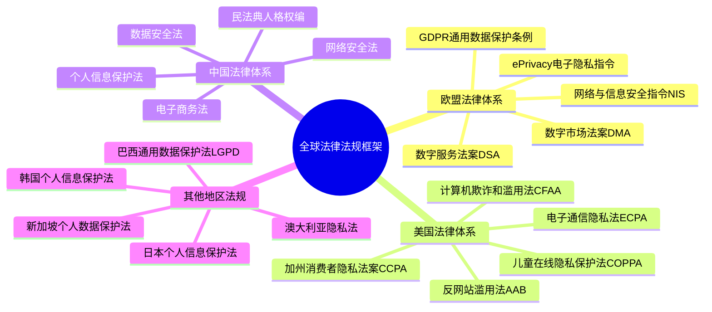
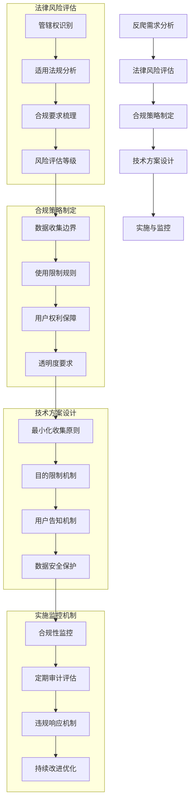
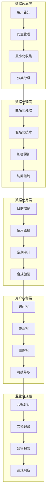
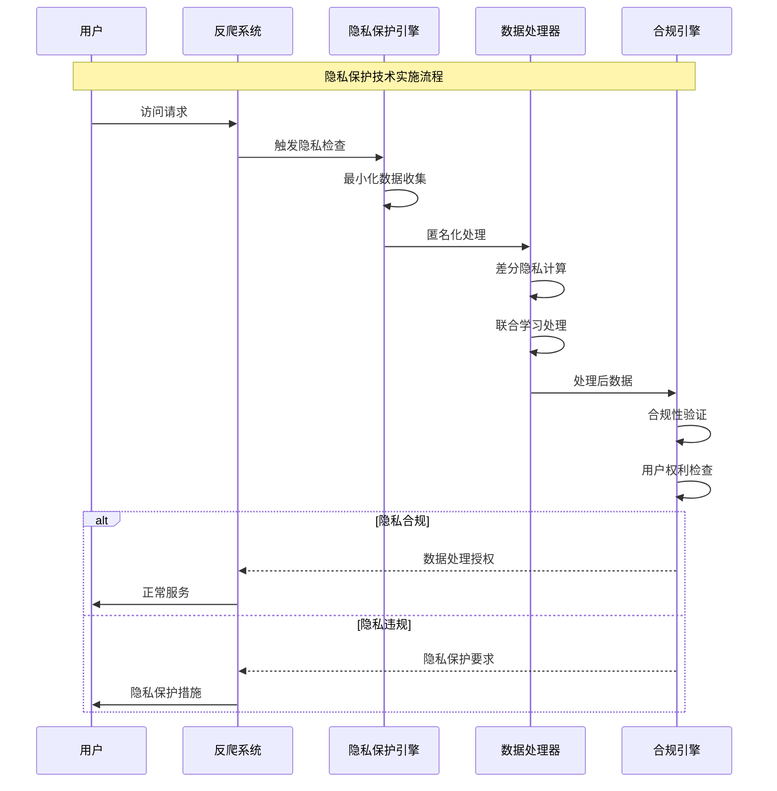
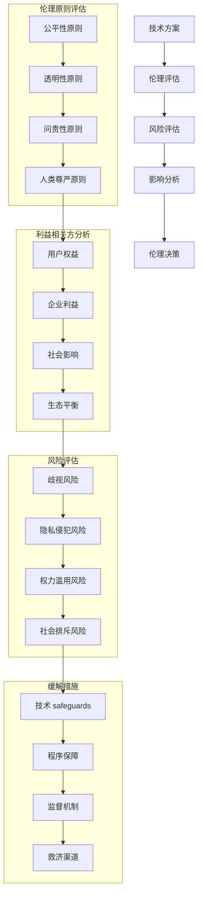
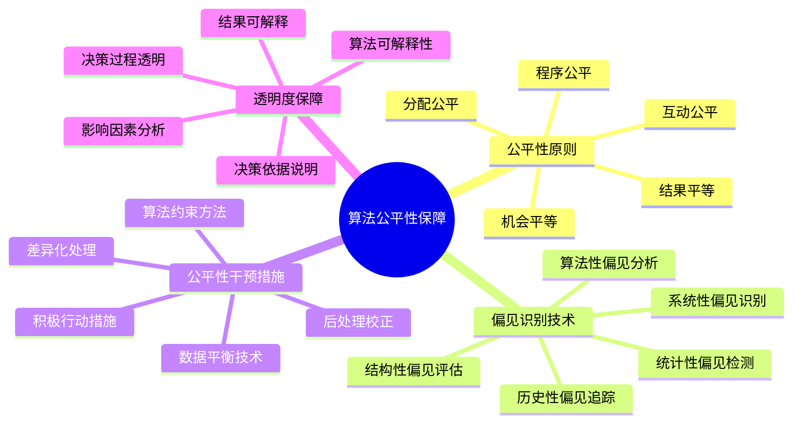
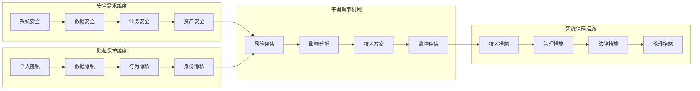
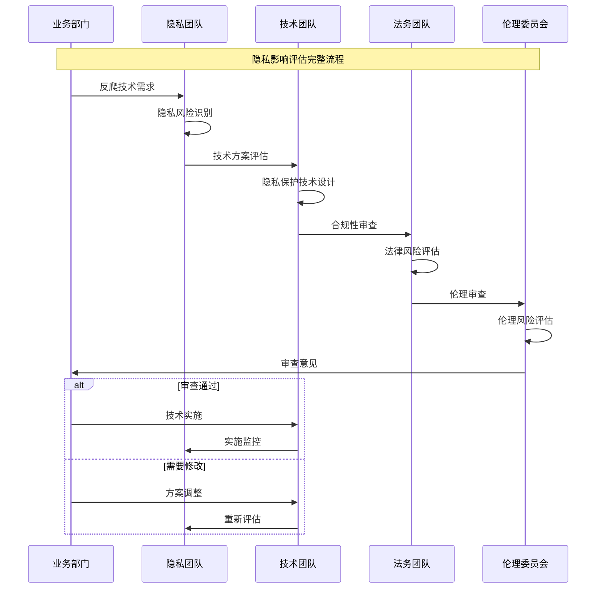
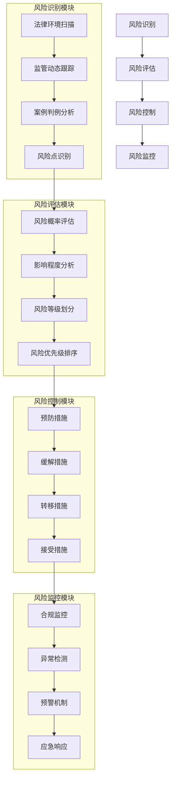
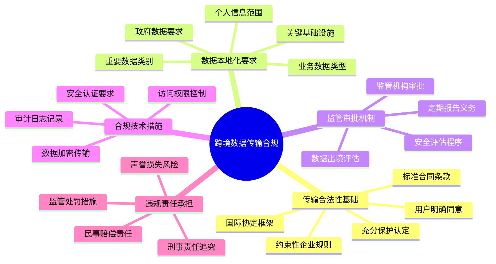

# 第12章：高级反爬技术与对抗策略（四）

## 12.4 法律合规与反爬伦理

### 12.4.1 网络爬虫的法律边界与合规要求

随着网络安全和数据保护法规的不断完善，网络爬虫的法律边界日益清晰，反爬技术的实施必须在法律框架内进行，确保合规性。

**全球主要法律法规框架：**



**反爬技术实施的合规框架：**



**不同司法管辖区的合规要求对比：**

| 管辖区 | 数据收集限制 | 用户同意要求 | 数据处理限制 | 跨境传输要求 | 处罚机制 |
|---------|-------------|-------------|-------------|-------------|---------|
| 欧盟 | 严格限制 | 明确同意 | 目的限制 | 充分保护认定 | 全球营业额4% |
| 美国 | 行业自律 | 选择性同意 | 合法目的 | 部分限制 | 按法案规定 |
| 中国 | 分类分级 | 明确同意 | 合法必要 | 安全评估 | 营业额5% |
| 日本 | 敏感数据限制 | 明确同意 | 目的特定 | 充分保护机制 | 监督指导 |
| 韩国 | 个人信息限制 | 明确同意 | 安全措施 | 信息委员会批准 | 按损失程度 |

### 12.4.2 数据保护与隐私法规遵循

数据保护和隐私法规是反爬技术实施中最重要的合规要求，需要在技术设计阶段就充分考虑隐私保护原则。

**隐私保护的核心原则：**

```mermaid
pyramid
    title 隐私保护原则优先级

    "数据最小化原则<br"(最小必要收集)" : 25%
    "目的限制原则<br"(明确使用目的)" : 20%
    "透明度原则<br"(充分告知用户)" : 20%
    "用户控制原则<br"(用户自主选择)" : 15%
    "安全保护原则<br"(技术安全保障)" : 15%
    "问责制原则<br"(明确责任主体)" : 5%
```

**隐私保护技术架构：**



**隐私增强技术在反爬中的应用：**



### 12.4.3 反爬技术的伦理考量

除了法律合规要求外，反爬技术的实施还需要考虑深层次的伦理问题，确保技术的发展符合社会道德标准和伦理准则。

**反爬技术伦理评估框架：**



**算法公平性与偏见检测：**



**伦理治理委员会的运作机制：**

```mermaid
stateDiagram-v2
    [*] --> 伦理提案接收
    伦理提案接收 --> 初步评估

    初步评估 --> {评估结果}

    评估结果 --> 低风险: 快速审批
    评估结果 --> 中风险: 详细审查
    评估结果 --> 高风险: 深度审议

    快速审批 --> 实施监督
    详细审查 --> 专家评估
    深度审议 --> 公开听证

    专家评估 --> {审查结论}
    公开听证 --> {听证结果}

    审查结论 --> 通过条件: 修改实施
    审查结论 --> 拒绝: 重新设计
    听证结果 --> 通过许可: 监督实施
    听证结果 --> 有条件通过: 限制实施
    听证结果 --> 拒绝: 终止项目

    修改实施 --> 实施监督
    重新设计 --> [*]
    监督实施 --> 实施监督
    限制实施 --> 加强监督
    终止项目 --> [*]

    实施监督 --> 定期评估
    加强监督 --> 定期评估
    定期评估 --> 持续改进
    持续改进 --> [*]
```

### 12.4.4 企业安全与用户隐私平衡

企业安全需求与用户隐私保护之间往往存在张力，如何在保障安全的同时充分尊重用户隐私，是反爬技术面临的重要挑战。

**安全与隐私的平衡模型：**



**隐私影响评估的技术实现：**



**差异化隐私保护策略：**

```mermaid
pyramid
    title 差异化隐私保护策略层次

    "高级敏感数据<br"(生物特征/医疗健康)" : 15%
    "中度敏感数据<br"(财务信息/位置数据)" : 25%
    "一般敏感数据<br"(联系方式/个人偏好)" : 30%
    "基础数据<br"(设备信息/使用统计)" : 30%
```

### 12.4.5 反爬攻防的法律风险管理

反爬技术的攻防对抗涉及复杂的法律风险，需要建立完善的法律风险管理体系，确保技术在法律框架内运行。

**法律风险管理的技术架构：**



**跨境数据传输的合规挑战：**



**合规审计与持续改进机制：**

```mermaid
stateDiagram-v2
    [*] --> 合规基线建立
    合规基线建立 -> 定期合规审计

    定期合规审计 --> {审计结果}

    审计结果 --> 完全合规: 持续监控
    审计结果 --> 部分合规: 整改计划
    审计结果 --> 严重不合规: 紧急整改

    持续监控 --> 合规指标跟踪
    整改计划 --> 整改措施实施
    紧急整改 --> 风险缓解措施

    合规指标跟踪 --> {指标评估}
    整改措施实施 --> 整改效果验证
    风险缓解措施 --> 风险状态评估

    指标评估 --> 合规达标: 持续监控
    指标评估 --> 需要改进: 优化措施
    整改效果验证 --> 验证通过: 持续监控
    整改效果验证 --> 验证失败: 重新整改
    风险状态评估 --> 风险可控: 持续监控
    风险状态评估 --> 风险仍高: 升级措施

    优化措施 --> 重新整改
    重新整改 --> 整改效果验证
    升级措施 --> 风险状态评估
```

## 总结

### 核心技术要点回顾

本节全面探讨了法律合规与反爬伦理，构建了完整的合规与伦理保障框架：

1. **法律边界合规**：掌握了全球主要法律法规体系和合规要求
2. **隐私保护法规**：理解了数据保护原则和隐私增强技术应用
3. **伦理考量框架**：了解了算法公平性、偏见检测和伦理治理机制
4. **安全隐私平衡**：掌握了平衡企业安全与用户隐私的方法论
5. **法律风险管理**：理解了跨境数据传输和合规审计的管理体系

### 实战应用指导

在法律合规与反爬伦理的实践中，需要遵循以下核心原则：

1. **合规优先原则**：确保所有反爬技术在法律框架内实施
2. **隐私保护原则**：将隐私保护理念融入技术设计全过程
3. **透明度原则**：向用户充分告知数据处理方式和目的
4. **公平性原则**：确保算法决策的公平性和无歧视性
5. **问责制原则**：建立明确的责任归属和监督机制

### 技术发展趋势

法律合规与反爬伦理领域正在向以下方向发展：

- **隐私计算技术**：联邦学习、安全多方计算等隐私保护计算技术
- **算法监管科技**：基于AI的合规性监控和审计技术
- **标准化合规框架**：国际统一的合规标准和认证体系
- **自动化合规工具**：减少人工干预的智能化合规管理平台
- **伦理AI治理**：基于伦理原则的AI系统设计和评估框架

掌握这些法律合规与反爬伦理知识，能够帮助我们在技术创新中确保合法性和道德性，建立可持续发展的反爬技术体系。只有在法律合规和伦理规范的框架内，反爬技术才能真正发挥其应有的价值，为数字经济的健康发展提供保障。