# 第7章：IP封禁与代理池技术（一）

## 7.1 IP封禁机制深度剖析

### 7.1.1 IP封禁的演进历程与技术原理

IP封禁作为最基础的反爬虫技术，经历了从简单静态封禁到智能动态封禁的演进过程。现代IP封禁系统已经发展成为一个多层次、智能化的综合性防护体系。

**IP封禁技术的演进阶段：**

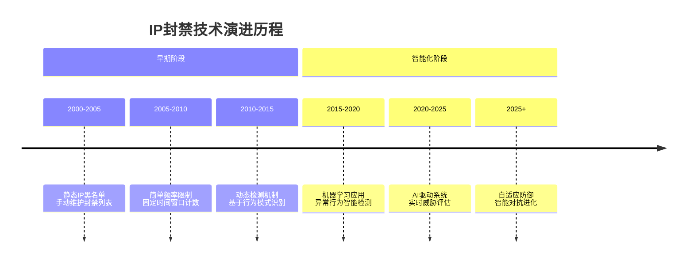

**现代IP封禁系统的技术架构：**

```mermaid
pyramid
    title IP封禁系统架构层次

    "智能决策层<br>(AI/ML算法)" : 15%
    "策略执行层<br>(动态封禁策略)" : 20%
    "行为分析层<br>(模式识别引擎)" : 25%
    "数据采集层<br>(实时监控)" : 25%
    "基础设施层<br>(网络/存储)" : 15%
```

### 7.1.2 多维度检测机制分析

现代IP封禁系统采用多维度检测机制，通过分析访问行为的不同特征来识别爬虫活动。

**IP封禁检测的维度矩阵：**

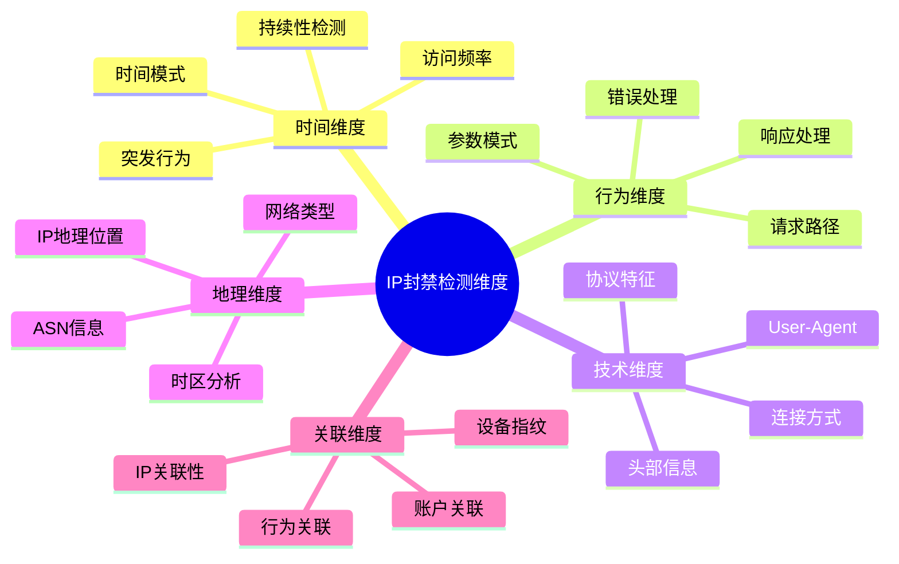

**智能检测算法的工作流程：**

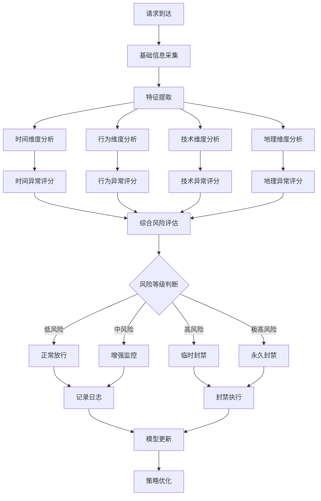

### 7.1.3 封禁策略的类型与机制

不同类型的网站采用不同的封禁策略，理解这些策略有助于制定有效的绕过方案。

**封禁策略分类体系：**

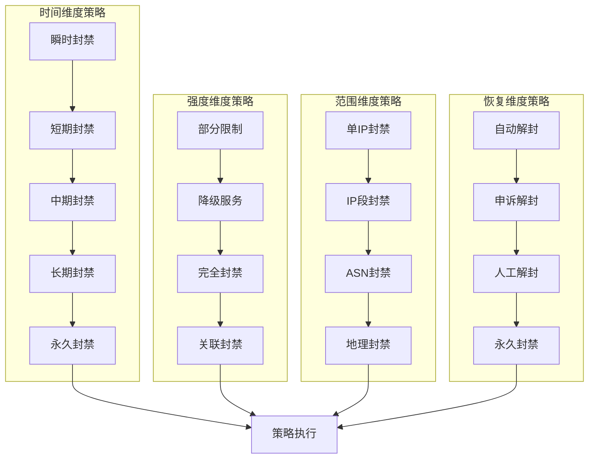

**封禁策略的决策树模型：**

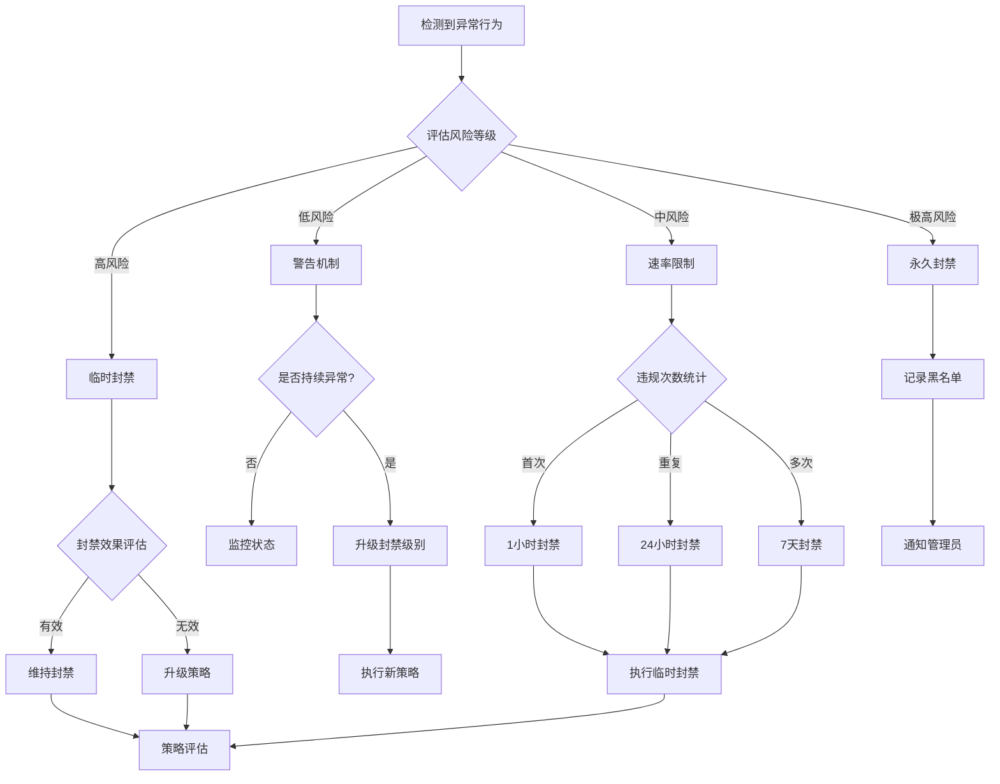

### 7.1.4 现代IP封禁系统的技术特征

现代IP封禁系统具备智能化、自适应、协同化等特征，能够应对不断演进的爬虫技术。

**智能封禁系统的核心特征：**

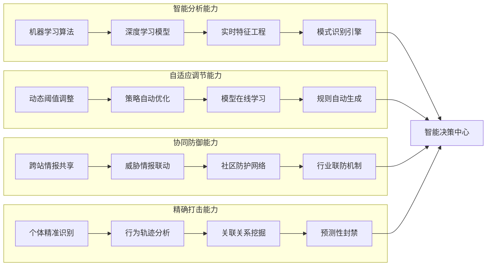

**不同规模网站的封禁策略对比：**

| 网站类型 | 封禁敏感度 | 检测维度 | 封禁时长 | 恢复难度 | 技术复杂度 |
|---------|-----------|---------|---------|---------|-----------|
| 小型网站 | 中等 | 基础检测 | 短期为主 | 容易 | 低 |
| 中型电商 | 较高 | 多维检测 | 中长期 | 中等 | 中等 |
| 大型平台 | 极高 | 智能检测 | 长期为主 | 困难 | 高 |
| 金融机构 | 极高 | 严格检测 | 永久封禁 | 极困难 | 极高 |
| 政府网站 | 高 | 安全检测 | 长期封禁 | 困难 | 高 |

## 7.2 IP风险评分与智能轮换机制

### 7.2.1 IP风险评分的理论基础

IP风险评分是现代代理池管理的核心概念，通过多维度的风险评估来实现IP资源的优化配置和使用。

**IP风险评分的理论模型：**

```mermaid
pyramid
    title IP风险评分模型层次

    "历史表现层<br>(成功率/失败率)" : 25%
    "网络质量层<br>(延迟/稳定性)" : 25%
    "地理位置层<br>(分布/合规性)" : 20%
    "提供商层<br>(信誉/类型)" : 15%
    "时间因子层<br>(新旧/使用频率)" : 15%
```

**风险评分的计算逻辑：**

```mermaid
flowchart TD
    A[IP数据采集] --> B[基础特征提取]
    B --> C[历史数据分析]
    C --> D[实时性能监测]

    B --> E[网络质量评分]
    C --> F[历史表现评分]
    D --> G[实时性能评分]

    E --> H[地理位置评分]
    F --> H
    G --> H

    H --> I[提供商评分]
    I --> J[时间因子评分]
    J --> K[综合风险评分]

    K --> L{风险等级分类}
    L -->|低风险(0-30)| M[高优先级使用]
    L -->|中风险(31-70)| N[常规使用]
    L -->|高风险(71-90)| O[限制使用]
    L -->|极风险(91-100)| P[暂停使用]
```

### 7.2.2 多维度风险指标体系

构建科学的IP风险评分体系需要建立完整的多维度指标体系，涵盖IP的各种特征和表现。

**风险指标的完整分类：**

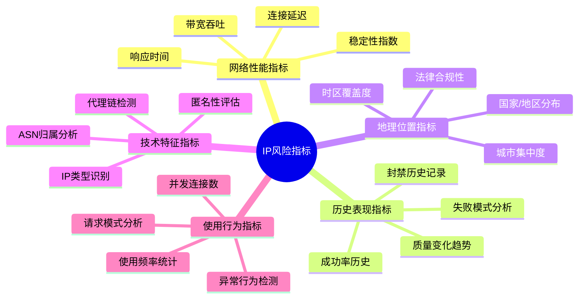

**风险评分的权重分配策略：**

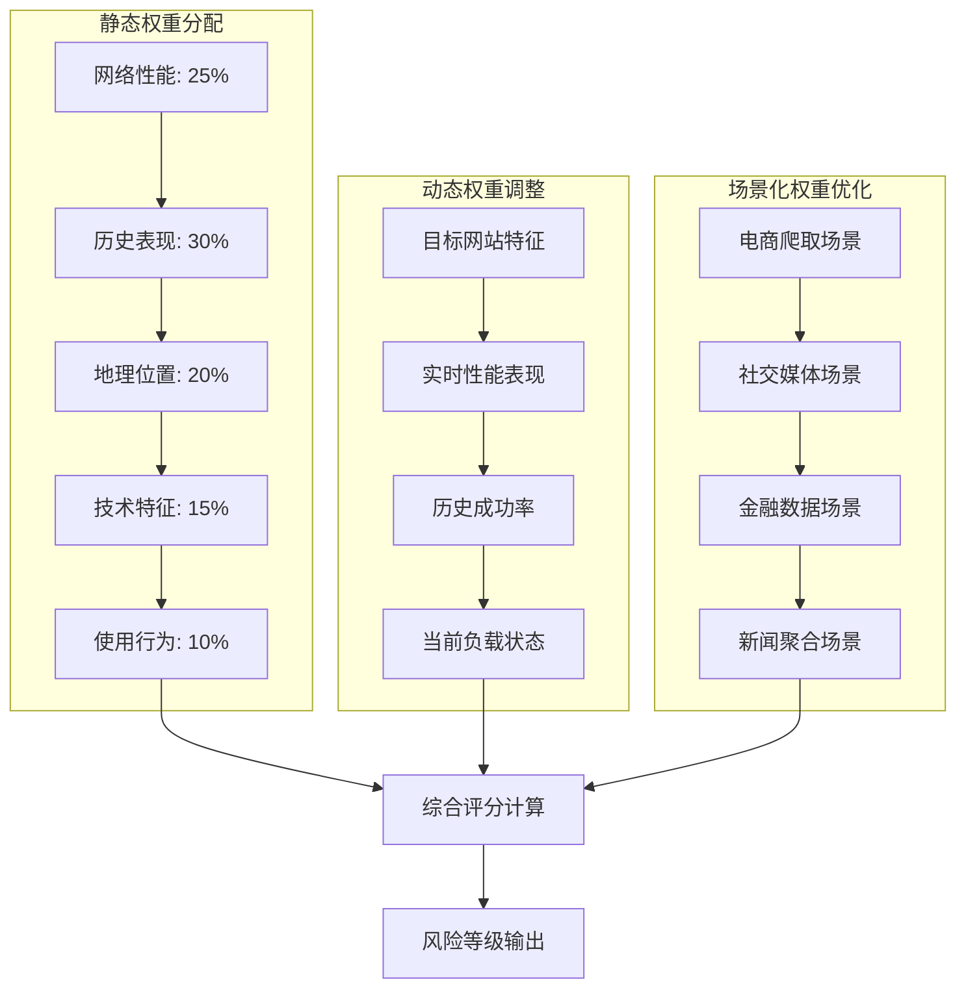

### 7.2.3 智能轮换算法的设计原理

智能轮换算法是代理池的核心技术，需要综合考虑IP质量、风险等级、目标网站特征等多个因素。

**智能轮换算法的决策框架：**

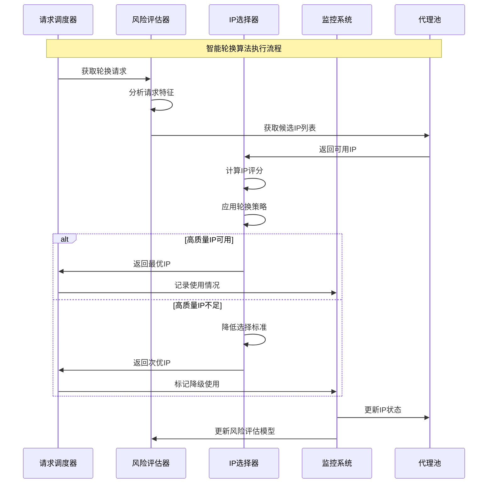

**轮换策略的类型比较：**

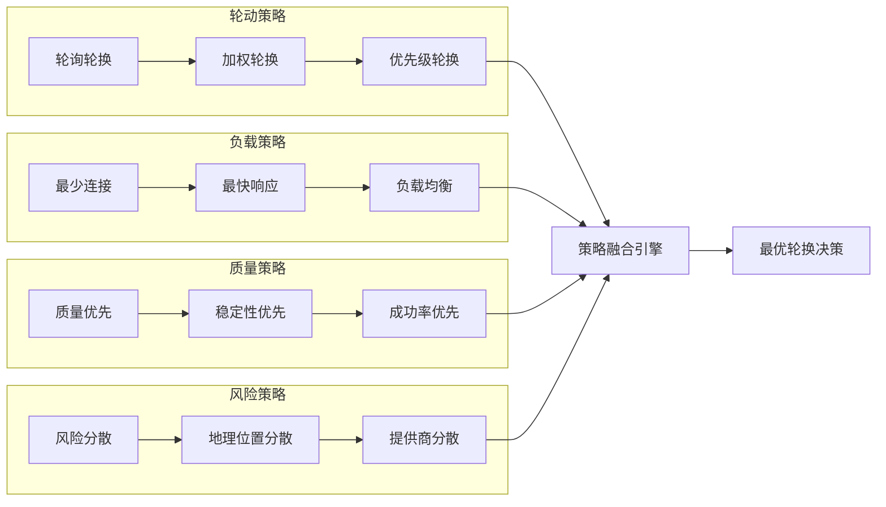

### 7.2.4 自适应轮换策略

自适应轮换策略能够根据实时反馈自动调整轮换算法，实现最优的IP资源利用效果。

**自适应调整机制的工作原理：**

```mermaid
stateDiagram-v2
    [*] --> 监控性能指标
    监控性能指标 --> 分析成功率模式
    分析成功率模式 --> {性能下降?}

    性能下降 --> 是: 调整轮换策略
    性能下降 --> 否: 继续监控

    调整轮换策略 --> 重新计算权重
    重新计算权重 --> 更新选择算法
    更新选择算法 --> 测试新策略

    测试新策略 --> {效果改善?}
    效果改善 --> 是: 固化新策略
    效果改善 --> 否: 回滚原策略

    固化新策略 --> 继续监控
    回滚原策略 --> 分析失败原因
    分析失败原因 --> 策略优化
    策略优化 --> 测试新策略

    继续监控 --> [*]
```

**自适应学习的关键要素：**

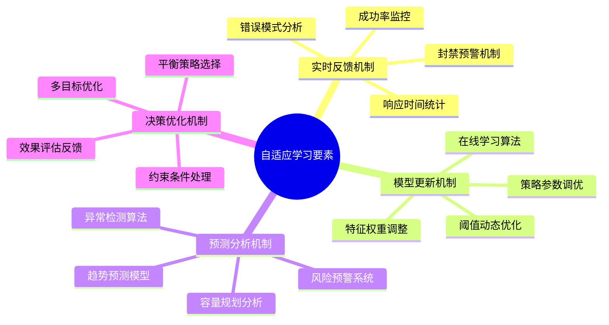

## 总结

### 核心技术要点回顾

本节深入探讨了IP封禁机制和智能轮换技术的核心原理，构建了完整的知识体系：

1. **IP封禁机制理解**：深入理解现代IP封禁系统的演进历程、多维度检测机制和策略类型
2. **风险评分体系**：掌握科学的风险评分模型和多维度指标体系，实现IP资源的精准评估
3. **智能轮换算法**：理解轮换算法的设计原理和策略类型，实现IP资源的优化配置
4. **自适应机制**：掌握自适应调整机制和学习要素，实现轮换策略的持续优化

### 技术发展趋势

IP封禁与轮换技术正在向更加智能化、自动化的方向发展：

- **AI驱动检测**：机器学习在异常行为检测和模式识别中的深度应用
- **实时风险评估**：基于流式计算的风险评估和预警机制
- **协同防御体系**：跨平台、跨行业的威胁情报共享机制
- **预测性防护**：基于历史数据和行为趋势的预测性封禁机制

### 实战应用指导

在实际应用中，IP封禁对抗需要遵循系统性原则：

1. **多策略融合**：结合不同类型的轮换策略，实现最优效果
2. **实时监控调整**：建立完善的监控体系，实现策略的动态调整
3. **风险分散原则**：通过多维度分散降低整体风险
4. **合规性考虑**：确保代理使用符合法律法规和目标网站政策
5. **性能与安全平衡**：在保证爬取效率的同时，确保系统的安全稳定

掌握这些技术原理和实践方法，能够帮助我们构建出高效、稳定、安全的代理池系统，为大规模爬虫应用提供强有力的技术支撑。