# 第7章：IP封禁与代理池技术（三）

## 7.5 代理性能监控与运维体系

### 7.5.1 代理性能监控的核心指标

建立完善的代理性能监控体系是保证代理池稳定运行的关键。需要从多个维度设计监控指标体系，实现对代理状态的全面掌控。

**监控指标的分类体系：**

```mermaid
pyramid
    title 代理监控指标层次

    "业务指标<br>(成功率/可用率)" : 30%
    "性能指标<br>(响应时间/吞吐量)" : 25%
    "质量指标<br>(稳定性/匿名性)" : 20%
    "资源指标<br>(连接数/带宽)" : 15%
    "安全指标<br>(异常检测/风险)" : 10%
```

**实时监控的数据流架构：**

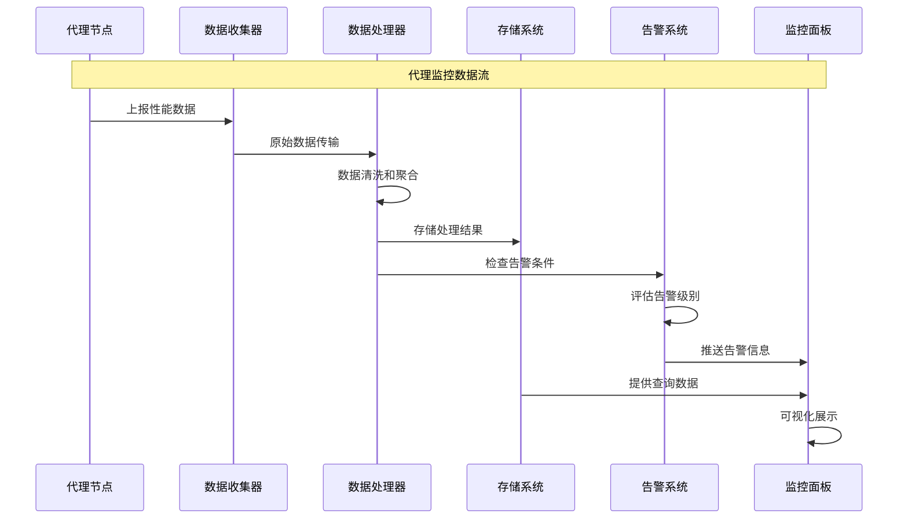

### 7.5.2 异常检测与自动恢复机制

异常检测和自动恢复机制是保证代理池高可用性的核心技术，能够及时发现并处理各种异常情况。

**异常检测的多层次策略：**

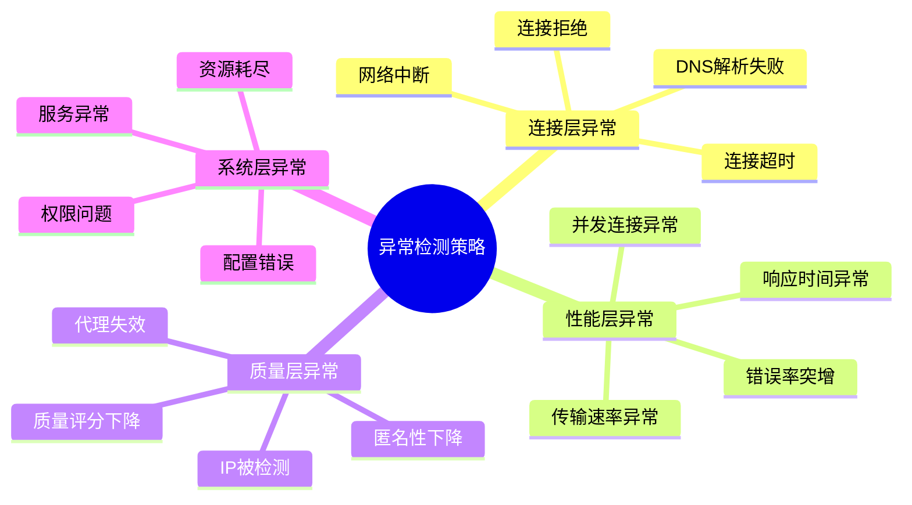

**自动恢复机制的执行流程：**

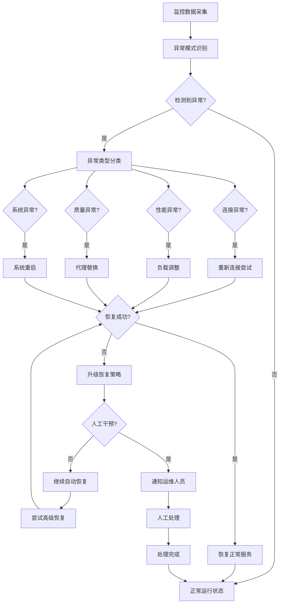

### 7.5.3 容量规划与弹性伸缩

容量规划和弹性伸缩机制能够确保代理池系统在不同负载下的稳定运行，优化资源配置和成本控制。

**容量规划的关键要素：**

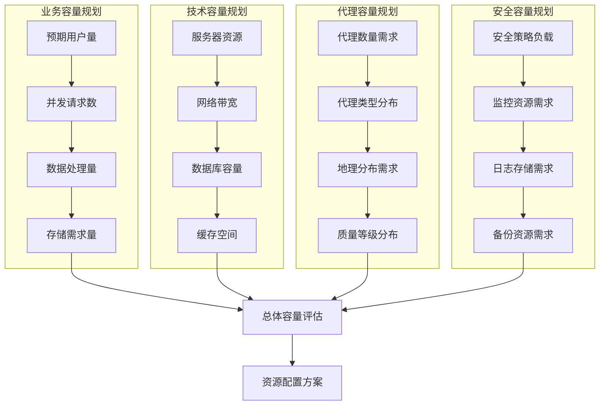

**弹性伸缩的决策机制：**

```mermaid
stateDiagram-v2
    [*] --> 监控系统负载
    监控系统负载 --> {负载超过阈值?}

    负载超过阈值 --> 是: 触发扩容流程
    负载超过阈值 --> 否: 检查资源利用率

    触发扩容流程 --> 评估扩容策略
    评估扩容策略 --> {扩容类型判断}

    扩容类型判断 --> 水平扩容: 增加代理节点
    扩容类型判断 --> 垂直扩容: 提升节点配置
    扩容类型判断 --> 混合扩容: 多维度扩容

    水平扩容 --> 执行扩容操作
    垂直扩容 --> 执行扩容操作
    混合扩容 --> 执行扩容操作

    执行扩容操作 --> 验证扩容效果
    验证扩容效果 --> {扩容成功?}

    扩容成功 --> 更新配置
    扩容成功 --> 持续监控

    检查资源利用率 --> {资源利用率低?}
    资源利用率低 --> 是: 触发缩容流程
    资源利用率低 --> 否: 继续监控

    触发缩容流程 --> 评估缩容策略
    评估缩容策略 --> 执行缩容操作
    执行缩容操作 --> 验证缩容效果

    验证缩容效果 --> 更新配置

    更新配置 --> 持续监控
    持续监控 --> 监控系统负载
```

### 7.5.4 监控可视化与运维自动化

监控可视化和运维自动化能够提高运维效率，降低人工成本，实现代理池的智能化管理。

**监控可视化系统的架构：**

```mermaid
graph LR
    subgraph "数据采集层"
        A1[代理监控数据] --> A2[系统监控数据]
        A2 --> A3[业务监控数据]
        A3 --> A4[日志数据]
    end

    subgraph "数据处理层"
        B1[实时流处理] --> B2[批量数据处理]
        B2 --> B3[数据聚合计算]
        B3 --> B4[异常检测]
    end

    subgraph "可视化层"
        C1[实时仪表盘] --> C2[历史趋势图]
        C2 --> C3[告警面板]
        C3 --> C4[统计报表]
    end

    subgraph "交互层"
        D1[查询接口] --> D2[筛选功能]
        D2 --> D3[导出功能]
        D3 --> D4[分享功能]
    end

    A4 --> B1
    B4 --> C1
    C4 --> D1
```

**运维自动化的核心场景：**

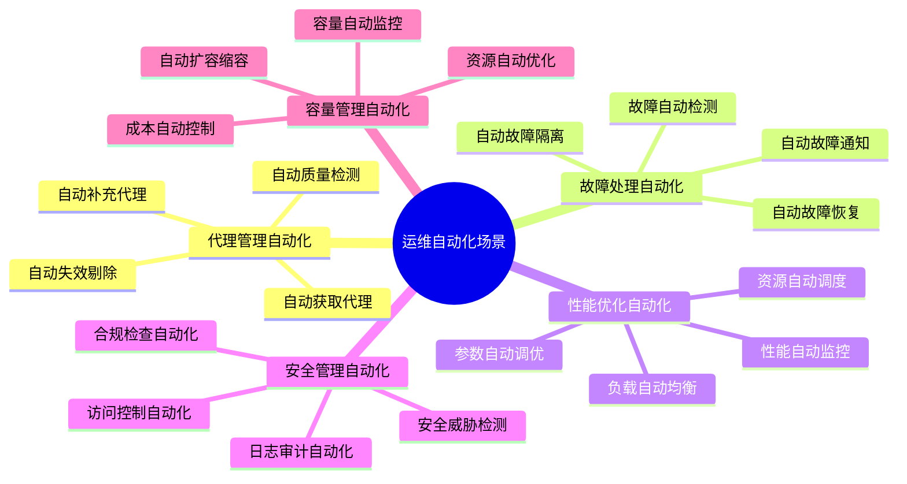

## 7.6 代理池的未来发展趋势

### 7.6.1 AI驱动的智能代理管理

人工智能技术正在深刻改变代理池的管理方式，智能代理管理成为未来发展的重要方向。

**AI在代理管理中的应用场景：**

```mermaid
pyramid
    title AI驱动代理管理层次

    "智能决策层<br>(预测分析/策略优化)" : 20%
    "智能分析层<br>(模式识别/异常检测)" : 25%
    "智能监控层<br>(实时监控/预警)" : 25%
    "智能执行层<br>(自动化操作)" : 20%
    "智能学习层<br>(模型训练/知识积累)" : 10%
```

**机器学习模型在代理管理中的应用：**

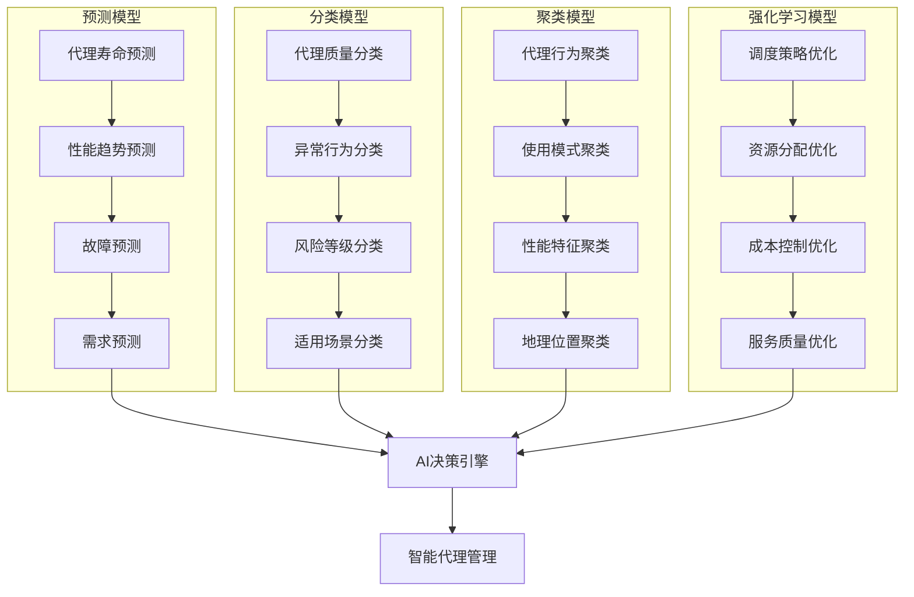

### 7.6.2 云原生代理池架构

云原生技术为代理池系统带来了新的架构模式和部署方式，提高了系统的弹性和可维护性。

**云原生代理池的核心特性：**

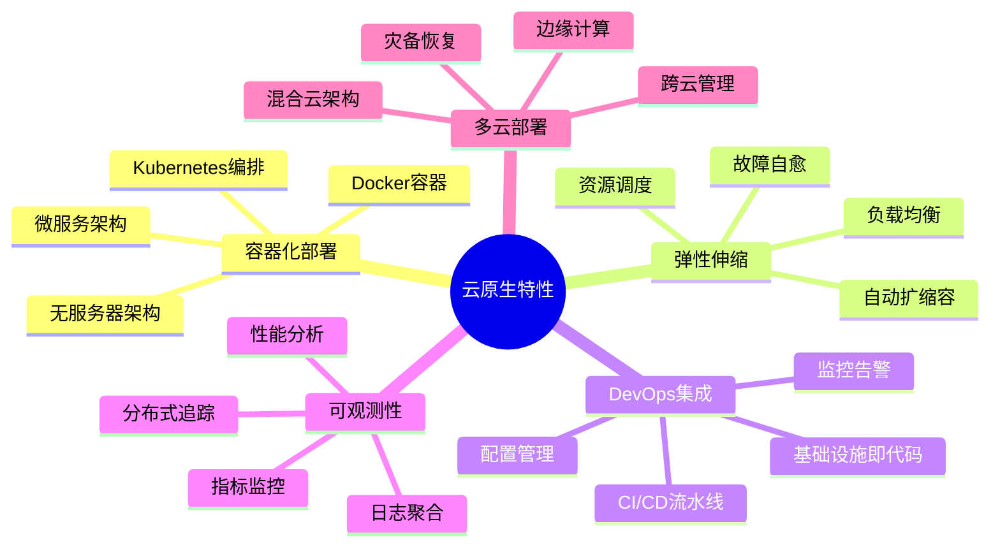

**云原生代理池的部署架构：**

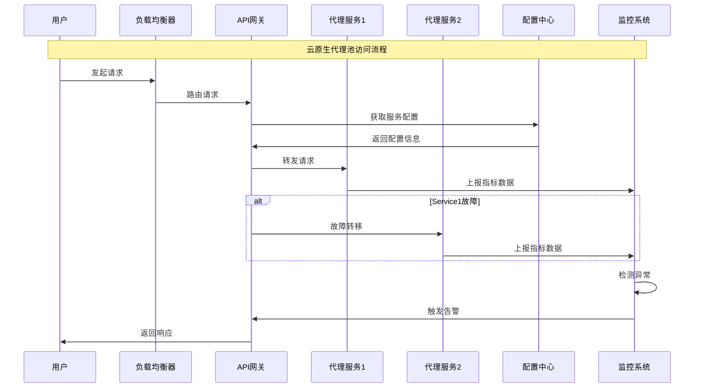

### 7.6.3 隐私保护与合规性发展

随着数据保护法规的日益严格，隐私保护和合规性成为代理池技术发展的重要考量因素。

**隐私保护技术的发展趋势：**

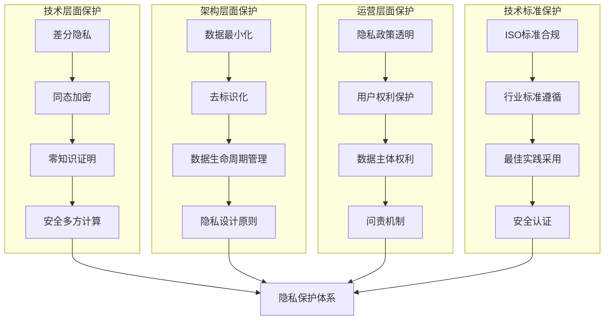

**全球合规性要求对比：**

| 法规类型 | 适用地区 | 核心要求 | 合规挑战 | 技术应对 |
|---------|---------|---------|---------|---------|
| GDPR | 欧盟 | 数据最小化、用户同意、数据保护 | 数据跨境传输 | 数据本地化、匿名化 |
| CCPA | 加州 | 消费者权利、数据透明 | 数据删除权利 | 数据生命周期管理 |
| PIPL | 中国 | 数据分类分级、本地化存储 | 数据出境安全 | 数据脱敏、访问控制 |
| LGPD | 巴西 | 合法基础、权利保障 | 合规成本控制 | 隐私设计、自动化合规 |

### 7.6.4 边缘计算与分布式代理

边缘计算技术为代理池系统带来了新的架构可能性，能够在网络边缘提供更高效的代理服务。

**边缘计算代理的优势：**

```mermaid
pyramid
    title 边缘计算代理优势

    "低延迟访问<br>(就近接入)" : 30%
    "带宽优化<br>(本地缓存)" : 25%
    "隐私保护<br>(数据本地化)" : 20%
    "高可用性<br>(分布式架构)" : 15%
    "成本优化<br>(资源就近)" : 10%
```

**边缘代理网络的架构设计：**

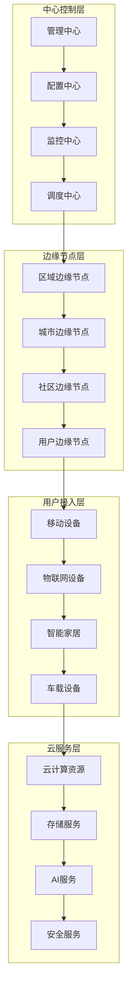

## 总结

### 核心技术要点回顾

本节深入探讨了代理池性能监控和未来发展趋势，构建了完整的技术视野：

1. **性能监控体系**：建立多维度的监控指标体系和数据流架构，实现代理状态的全面掌控
2. **异常检测机制**：掌握多层次异常检测策略和自动恢复机制，确保系统高可用性
3. **容量规划管理**：理解容量规划要素和弹性伸缩机制，实现资源的最优配置
4. **运维自动化**：建立监控可视化系统和运维自动化场景，提高运维效率
5. **技术发展趋势**：把握AI驱动、云原生、隐私保护等未来发展方向

### 技术发展趋势总结

代理池技术正在经历深刻的技术变革：

- **智能化发展**：AI和机器学习技术在代理管理中的广泛应用
- **云原生化**：基于容器和微服务的弹性架构模式
- **隐私保护**：差分隐私、联邦学习等隐私计算技术的应用
- **边缘计算**：分布式边缘代理网络的发展
- **合规驱动**：以合规性为核心的技术发展方向

### 未来发展建议

面向未来的代理池技术发展，需要关注以下关键方向：

1. **技术融合创新**：多技术融合，构建智能化的代理管理系统
2. **安全合规优先**：将安全和合规作为技术发展的首要考量
3. **用户体验优化**：以用户需求为中心，提供更优质的服务体验
4. **生态合作共赢**：建立开放的技术生态，促进行业协作发展
5. **可持续发展**：注重技术的社会价值和可持续发展

掌握这些发展趋势和技术方向，能够帮助我们更好地规划代理池技术的发展路径，为未来的网络爬虫应用提供更加先进、安全、高效的代理服务支撑。