# 第7章：IP封禁与代理池技术（二）

## 7.3 分布式代理池架构设计与实现

### 7.3.1 代理池的系统架构设计

现代代理池系统需要采用分布式架构，以支持大规模、高并发的爬虫应用需求。合理的架构设计是代理池系统稳定运行的基础。

**分布式代理池的层次化架构：**

```mermaid
pyramid
    title 分布式代理池架构层次

    "应用接口层<br>(API/GUI/CLI)" : 10%
    "服务编排层<br>(任务调度/负载均衡)" : 15%
    "核心服务层<br>(代理管理/质量检测)" : 25%
    "数据存储层<br>(数据库/缓存)" : 20%
    "基础设施层<br>(网络/计算资源)" : 30%
```

**代理池系统的核心组件架构：**

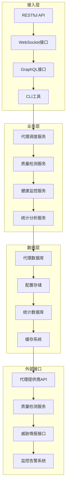

### 7.3.2 微服务架构在代理池中的应用

微服务架构能够提高代理池系统的可扩展性和可维护性，实现不同功能的解耦和独立部署。

**代理池微服务拆分策略：**

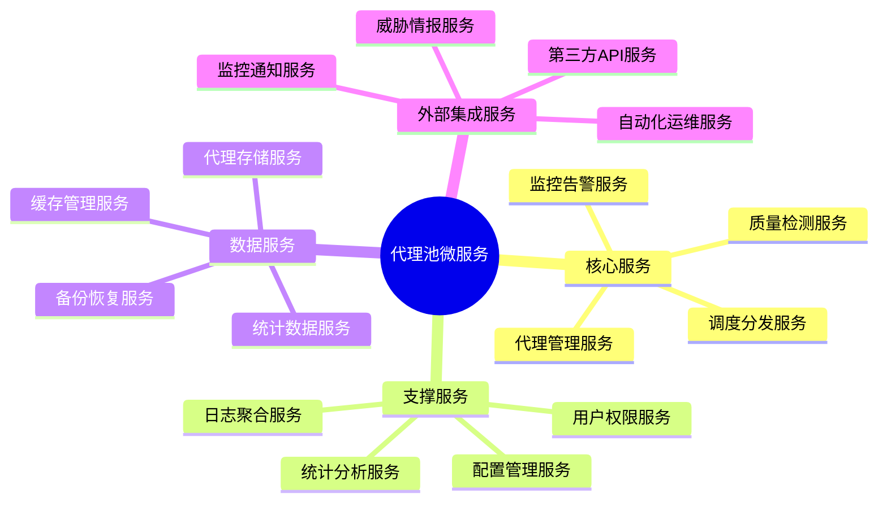

**微服务间的通信架构：**

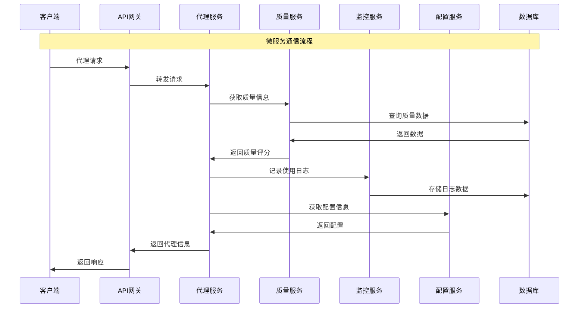

### 7.3.3 代理获取与验证机制

代理获取是代理池系统的核心功能，需要从多个来源获取代理并进行严格的质量验证。

**代理获取的多源策略：**

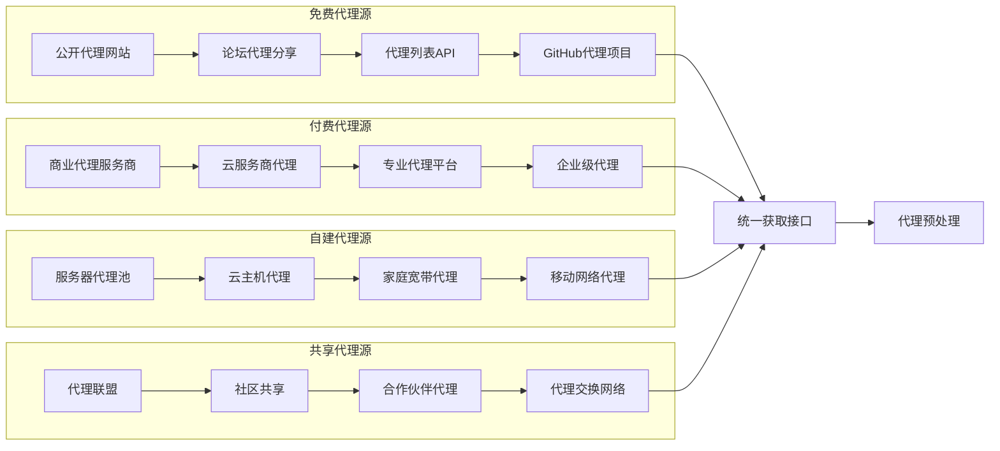

**代理验证的多层次机制：**

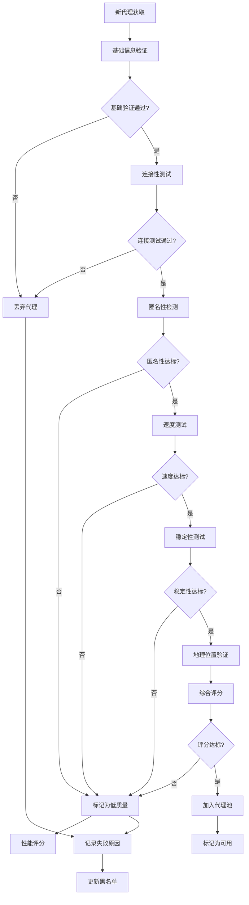

### 7.3.4 代理质量检测与评估体系

建立科学的代理质量检测体系是保证代理池质量的关键，需要从多个维度对代理进行全面评估。

**质量检测的维度体系：**

```mermaid
pyramid
    title 代理质量检测维度

    "稳定性指标<br>(连接成功率/在线时长)" : 30%
    "性能指标<br>(响应时间/下载速度)" : 25%
    "安全性指标<br>(匿名性/数据加密)" : 20%
    "可靠性指标<br>(可用率/故障恢复)" : 15%
    "合规性指标<br>(地理位置/服务条款)" : 10%
```

**动态质量评估的工作流程：**

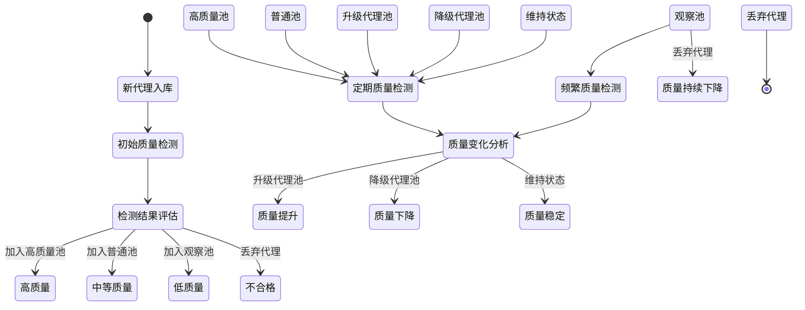

## 7.4 高级代理技术与伪装策略

### 7.4.1 高级代理技术的分类与应用

高级代理技术能够提供更好的匿名性和抗检测能力，是应对高级反爬虫系统的重要手段。

**高级代理技术的分类体系：**

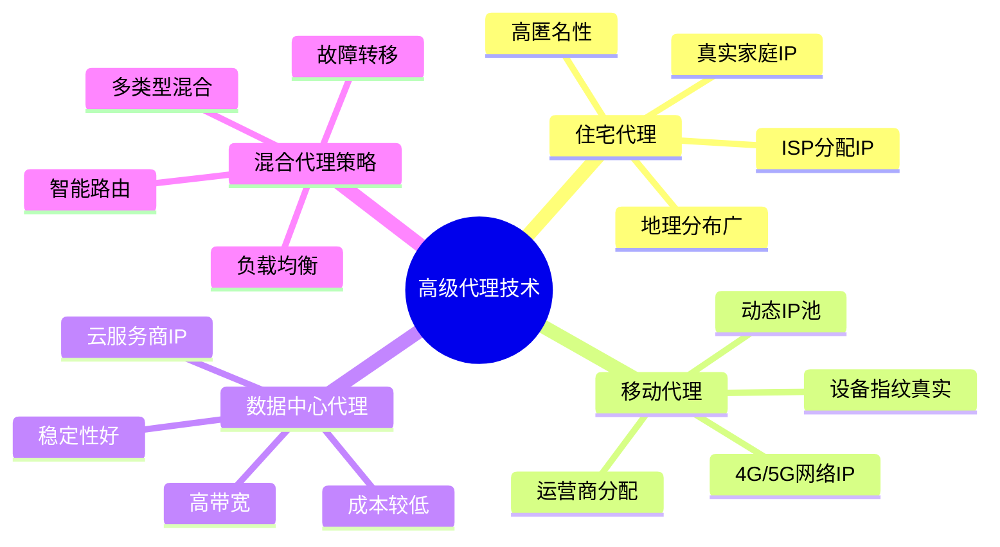

**不同代理技术的特征对比：**

| 代理类型 | 匿名性 | 稳定性 | 速度 | 成本 | 适用场景 |
|---------|--------|--------|------|------|---------|
| 住宅代理 | 极高 | 中等 | 中等 | 高 | 严格反爬网站 |
| 移动代理 | 高 | 较低 | 中等 | 极高 | 金融/电商网站 |
| 数据中心代理 | 中等 | 极高 | 极高 | 低 | 一般网站爬取 |
| 混合代理 | 高 | 高 | 高 | 中等 | 大规模爬取 |

### 7.4.2 代理链与多级代理技术

代理链技术通过多个代理的串联来增强匿名性，是应对高级检测的有效手段。

**代理链的技术架构：**

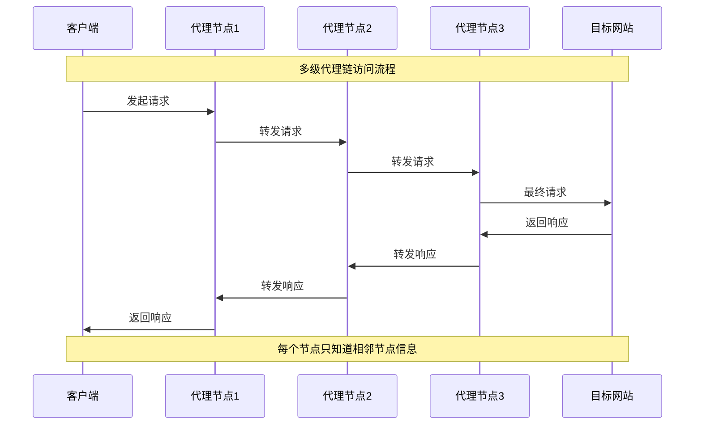

**代理链的优化策略：**

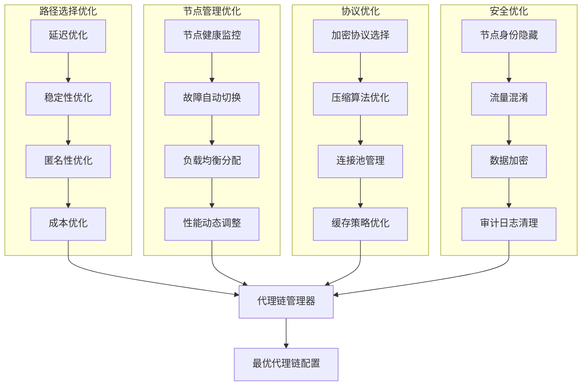

### 7.4.3 地理位置分布与合规性策略

代理的地理位置分布不仅影响爬取效果，还涉及法律合规性问题，需要综合考虑多种因素。

**地理位置分布的策略设计：**

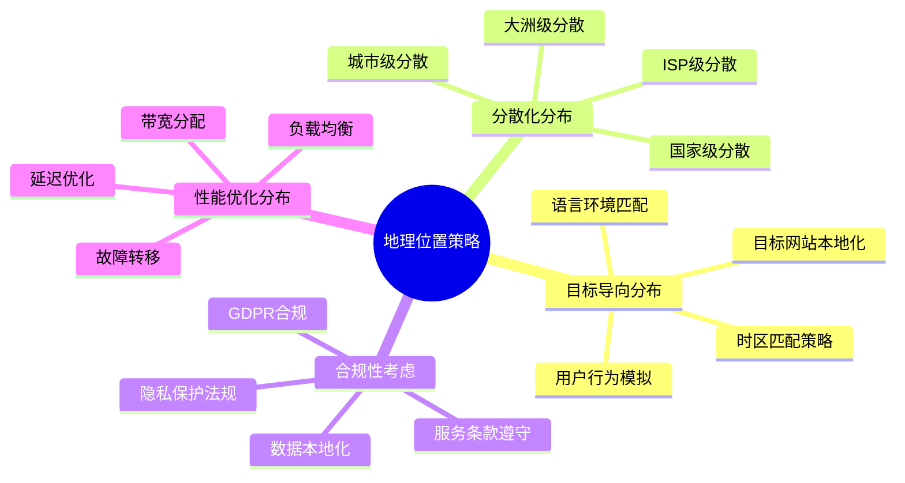

**合规性风险评估框架：**

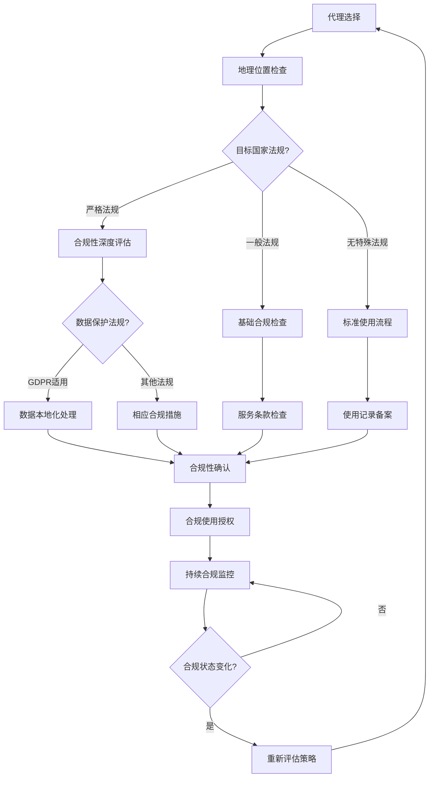

### 7.4.4 智能代理调度算法

智能代理调度算法能够根据实时情况动态调整代理使用策略，实现最优的爬取效果。

**调度算法的决策模型：**

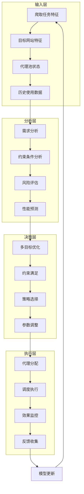

**调度策略的类型与应用场景：**

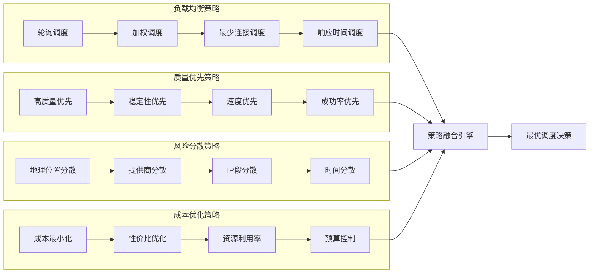

## 总结

### 核心技术要点回顾

本节深入探讨了分布式代理池架构设计和高级代理技术，构建了完整的技术体系：

1. **分布式架构设计**：掌握代理池的微服务架构和核心组件设计，实现高可用、可扩展的系统架构
2. **代理获取与验证**：理解多源代理获取策略和多层次验证机制，确保代理质量
3. **质量检测体系**：建立科学的质量评估维度和动态检测机制，实现代理质量的持续监控
4. **高级代理技术**：掌握各类代理技术特征和应用场景，提升匿名性和抗检测能力
5. **智能调度算法**：理解调度算法的决策模型和策略类型，实现代理资源的最优配置

### 技术发展趋势

代理池技术正在向更加智能化、自动化的方向发展：

- **AI驱动的调度**：机器学习在代理选择和调度优化中的应用
- **自适应架构**：基于微服务和云原生的弹性伸缩架构
- **智能质量评估**：基于大数据分析的代理质量预测和评估
- **合规性自动化**：自动化的合规性检查和风险控制机制

### 实战应用指导

在实际应用中，代理池系统需要遵循以下核心原则：

1. **质量第一原则**：优先保证代理质量和稳定性，其次考虑数量和成本
2. **安全合规原则**：确保代理使用符合法律法规和目标网站政策
3. **弹性扩展原则**：设计支持水平扩展的架构，适应业务增长需求
4. **智能化管理**：采用自动化和智能化技术，降低运维成本
5. **监控告警完善**：建立全面的监控告警体系，确保系统稳定运行

掌握这些技术原理和实践方法，能够帮助我们构建出高效、稳定、安全的代理池系统，为大规模网络爬虫应用提供强有力的基础设施支撑。