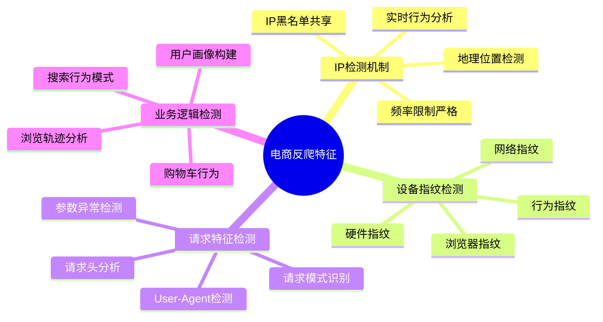
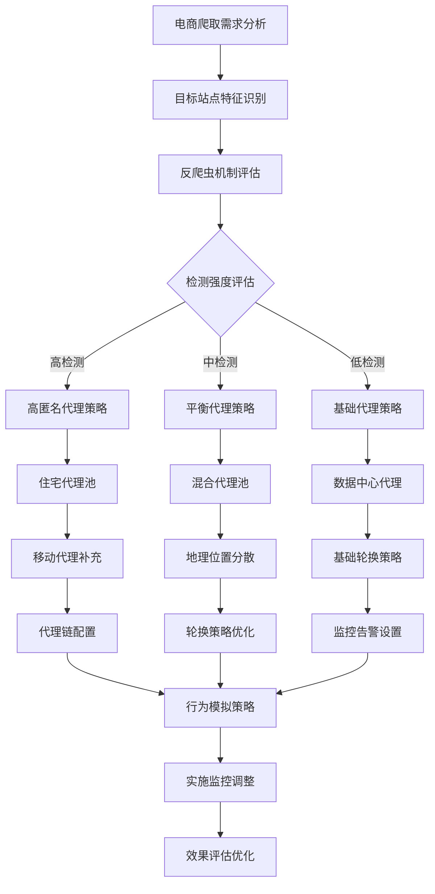
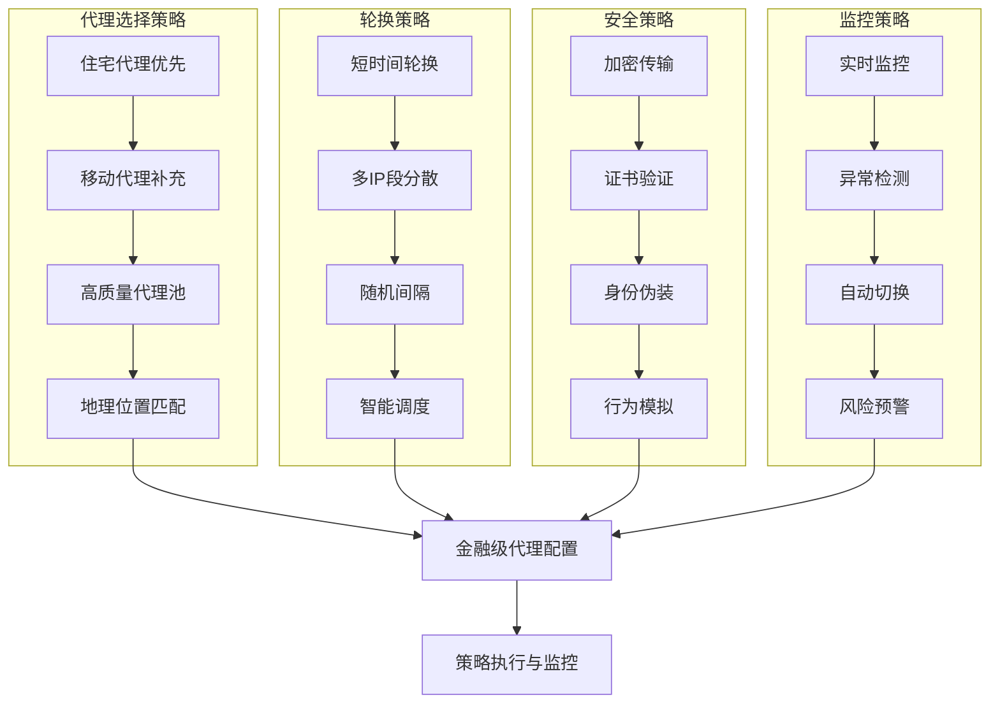
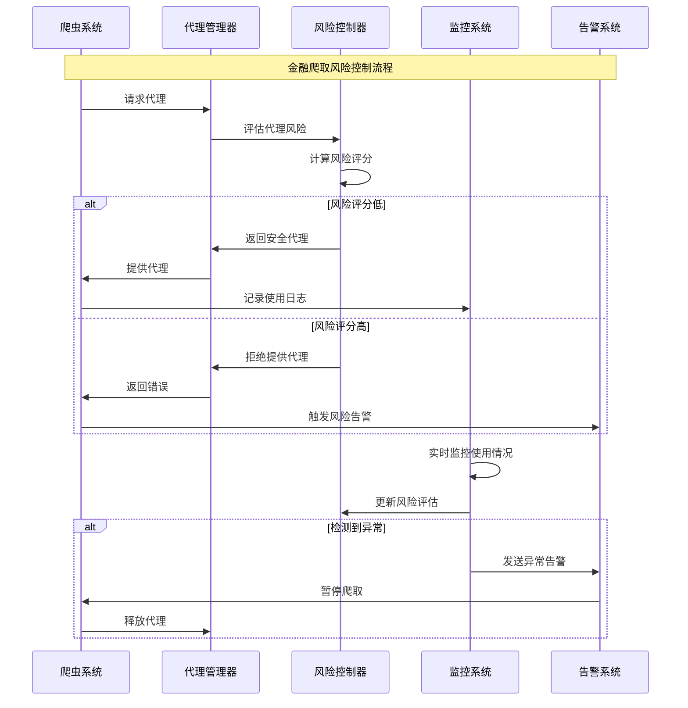
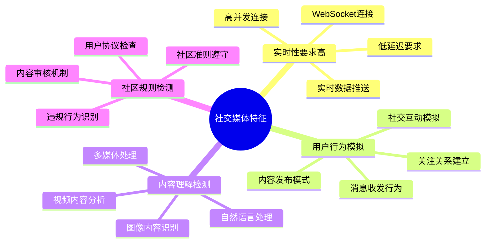
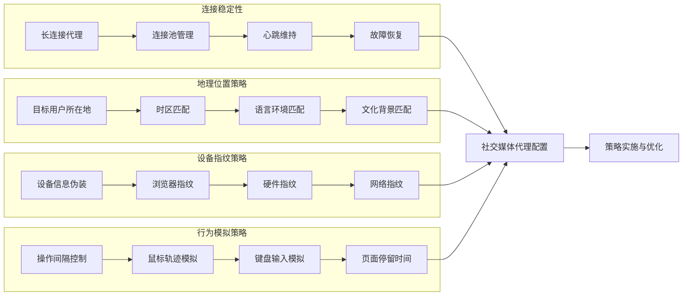
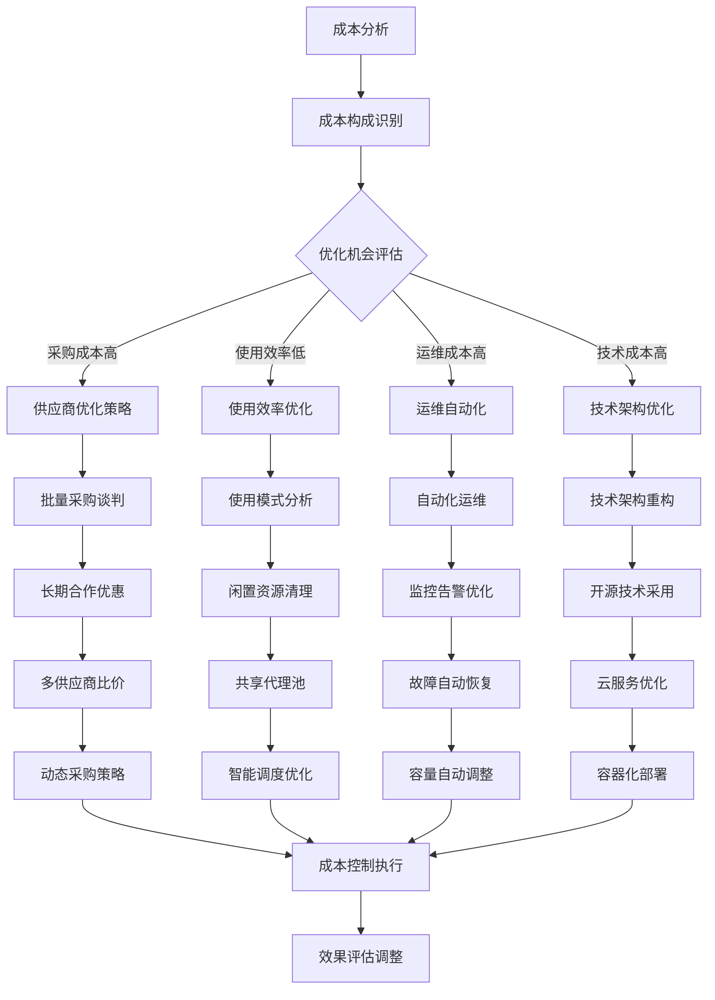
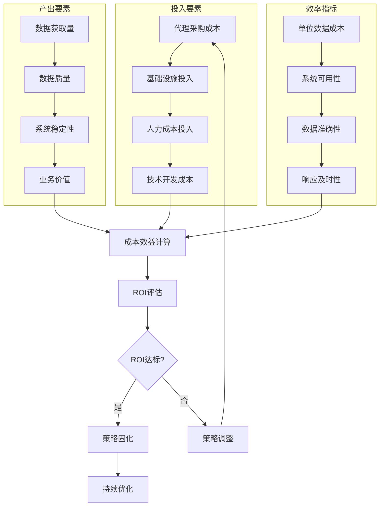

# 第7章：IP封禁与代理池技术（四）

## 7.7 实战案例分析与应用指南

### 7.7.1 大型电商网站的代理策略实战

大型电商网站通常具有严格的反爬虫机制，需要采用精细化的代理策略来应对复杂的检测体系。

**电商网站的反爬虫特征分析：**



**电商网站代理策略的最佳实践：**



**代理质量监控的关键指标：**

| 指标类别 | 关键指标 | 目标值 | 监控频率 | 告警阈值 |
|---------|---------|--------|----------|----------|
| 可用性 | 代理可用率 | >95% | 实时 | <90% |
| 性能 | 平均响应时间 | <2s | 实时 | >5s |
| 稳定性 | 连接成功率 | >98% | 分钟级 | <95% |
| 匿名性 | IP检测率 | <5% | 小时级 | >10% |
| 合规性 | 地理位置准确性 | >99% | 日级 | <95% |

### 7.7.2 金融数据爬取的代理安全策略

金融网站具有最高级别的安全防护，需要采用最严格的代理安全策略来确保数据获取的成功率和安全性。

**金融网站的安全防护特征：**

```mermaid
pyramid
    title 金融网站安全防护层次

    "应用层防护<br>(行为分析/用户画像)" : 20%
    "传输层防护<br>(加密/证书验证)" : 25%
    "网络层防护<br>(IP信誉/地理位置)" : 25%
    "系统层防护<br>(设备指纹/环境检测)" : 20%
    "业务层防护<br>(业务逻辑验证)" : 10%
```

**金融级代理策略的配置要点：**



**金融爬取的风险控制机制：**



### 7.7.3 社交媒体平台的代理应用策略

社交媒体平台的反爬虫机制具有独特的特征，需要采用针对性的代理策略来应对。

**社交媒体平台的技术特征：**



**社交媒体代理策略的配置要点：**



**不同社交媒体平台的代理需求对比：**

| 平台类型 | 代理类型需求 | 地理位置 | 轮换频率 | 匿名性要求 | 技术复杂度 |
|---------|-------------|---------|----------|-----------|-----------|
| 微博平台 | 移动代理为主 | 中国大陆 | 高 | 高 | 中等 |
| Facebook | 住宅代理为主 | 用户所在地 | 中高 | 极高 | 高 |
| Twitter | 混合代理 | 全球分布 | 中 | 高 | 中等 |
| Instagram | 移动代理 | 用户所在地 | 高 | 高 | 高 |
| LinkedIn | 住宅代理 | 职业相关 | 低中 | 高 | 中等 |

### 7.7.4 代理池成本优化策略

代理池的运营成本是大规模爬虫应用的重要考量因素，需要通过科学的优化策略来控制成本。

**代理成本的构成分析：**

```mermaid
pyramid
    title 代理池成本构成

    "代理采购成本<br>(50-70%)" : 60%
    "基础设施成本<br>(10-20%)" : 15%
    "运维人力成本<br>(10-15%)" : 12%
    "技术开发成本<br>(5-10%)" : 8%
    "合规管理成本<br>(3-8%)" : 5%
```

**成本优化的核心策略：**



**成本效益分析模型：**



## 总结

### 核心技术要点回顾

本节通过实战案例分析，深入探讨了不同场景下的代理应用策略和成本优化方法：

1. **场景化策略设计**：理解不同网站类型的反爬虫特征，制定针对性的代理策略
2. **风险控制机制**：掌握多层次的风险控制和监控机制，确保爬取活动的安全性
3. **成本优化方法**：建立科学的成本分析和优化策略，实现成本效益的最大化
4. **实战经验总结**：积累不同场景的最佳实践经验，提升代理池的应用效果
5. **持续优化机制**：建立效果评估和持续优化的闭环机制

### 实战应用核心原则

在实际应用中，代理池的使用需要遵循以下核心原则：

1. **安全第一原则**：在任何情况下都要确保代理使用的安全性和合规性
2. **场景适配原则**：根据不同的爬取场景选择合适的代理策略和技术方案
3. **质量优先原则**：优先保证代理质量和稳定性，其次考虑成本因素
4. **持续监控原则**：建立完善的监控体系，及时发现和处理异常情况
5. **灵活调整原则**：根据实际情况灵活调整策略，适应不同的需求和挑战

### 未来发展建议

面向未来的代理池应用发展，需要关注以下方向：

1. **技术融合创新**：将AI、机器学习等新技术与代理池技术深度融合
2. **场景化服务**：针对不同行业和应用场景提供专业化的代理解决方案
3. **智能化运维**：提升运维自动化水平，降低人力成本和操作风险
4. **合规性保障**：建立完善的合规性保障体系，确保合法合规使用
5. **生态化发展**：构建开放的代理服务生态，促进行业协作发展

掌握这些实战经验和发展方向，能够帮助我们更好地应用代理池技术，为各类网络爬虫应用提供高效、安全、经济的代理服务支撑。通过不断的学习和实践，我们可以构建出更加智能、高效、安全的代理池系统，满足不同场景下的复杂需求。