# 第8章：验证码识别与对抗技术（一）

## 引言：验证码技术的演进与挑战

验证码（Completely Automated Public Turing test to tell Computers and Humans Apart）作为网络安全的重要防线，经历了从简单到复杂的演进过程。随着人工智能技术的发展，验证码的设计理念和技术实现不断升级，形成了多层次、多模态的验证体系。

现代验证码技术已经超越了传统的字符识别范畴，发展为结合计算机视觉、行为分析、机器学习等技术的综合性安全机制。理解验证码的技术原理和对抗策略，不仅是技术挑战，更是对网络安全、人机交互、人工智能等领域的深度探索。

本章将从技术原理、分类体系、对抗策略等多个维度，系统性地阐述验证码识别与对抗技术的完整知识体系。

## 8.1 验证码技术的演进历程与发展趋势

### 8.1.1 验证码技术的历史演进

验证码技术的发展历程反映了网络安全威胁的演进和防御技术的进步，每一代验证码都是对特定安全挑战的回应。

**验证码技术演进的时间线：**

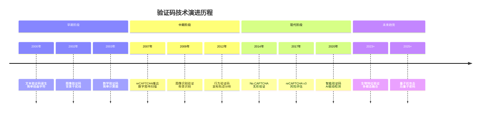

### 8.1.2 现代验证码的技术分类体系

现代验证码已经发展成为一个复杂的技术体系，从不同维度可以进行多种分类。

**验证码技术的多维分类：**

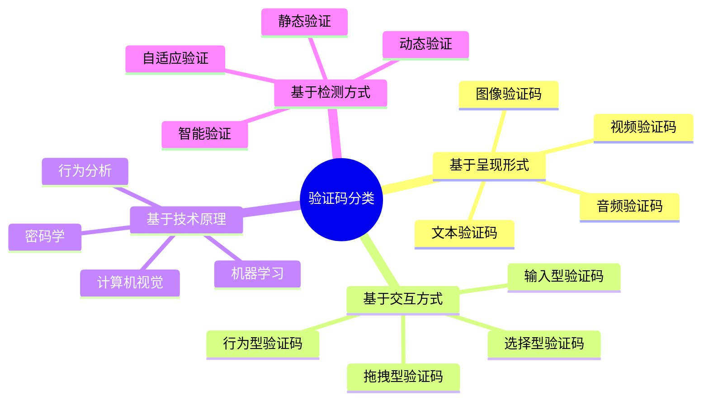

**不同类型验证码的技术特征对比：**

| 验证码类型 | 技术复杂度 | 安全强度 | 用户体验 | 机器对抗难度 | 适用场景 |
|-----------|-----------|---------|---------|-------------|---------|
| 文本验证码 | 低 | 低 | 一般 | 低 | 简单防护 |
| 图像识别码 | 中等 | 中等 | 较好 | 中等 | 通用防护 |
| 滑块验证码 | 中等 | 中等 | 好 | 中等 | 移动端优化 |
| 点击验证码 | 高 | 高 | 一般 | 高 | 高安全需求 |
| 行为验证码 | 极高 | 极高 | 极好 | 极高 | 金融级安全 |
| 智能验证码 | 极高 | 极高 | 极好 | 极高 | 企业级应用 |

### 8.1.3 验证码技术的核心原理

理解验证码的技术原理是制定有效对抗策略的基础，不同类型的验证码基于不同的技术原理。

**验证码技术的三层架构：**

```mermaid
pyramid
    title 验证码技术架构

    "应用接口层<br>(前端展示/用户交互)" : 15%
    "验证逻辑层<br>(算法引擎/规则引擎)" : 35%
    "数据支撑层<br>(题库/模型/特征库)" : 50%
```

**验证码生成与验证的核心流程：**

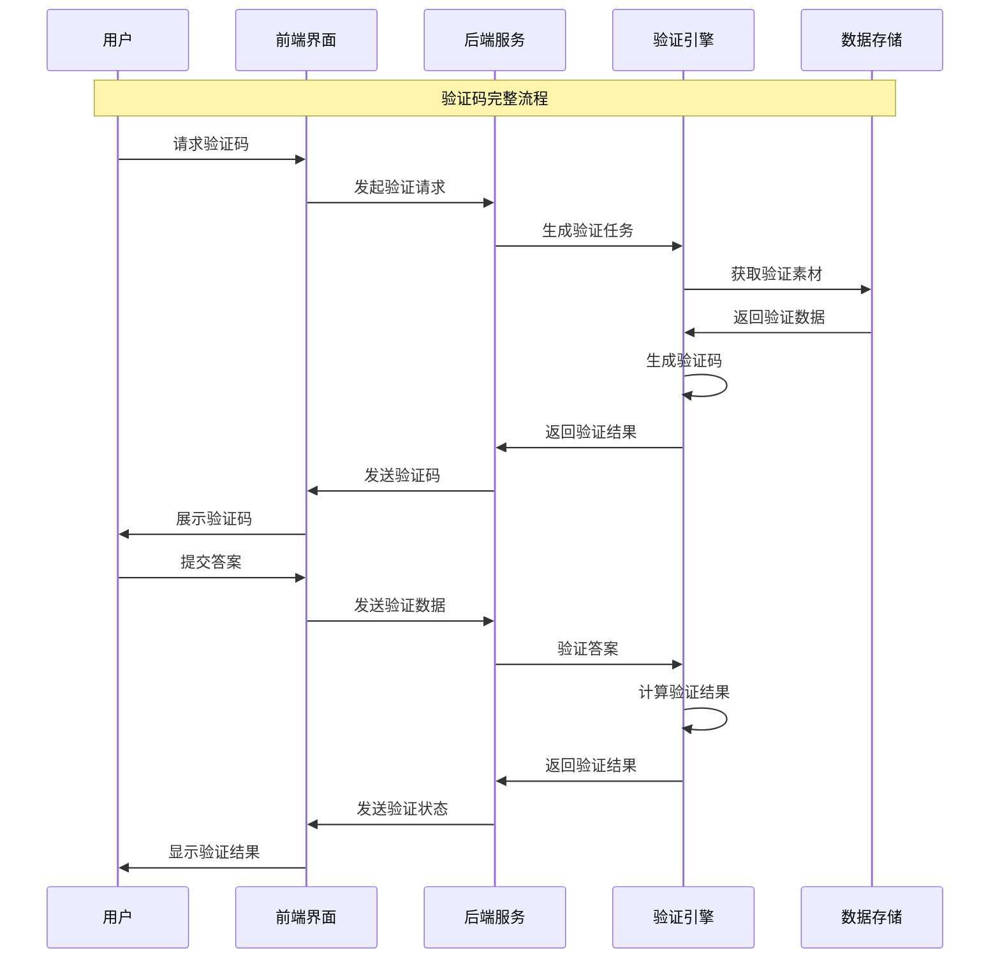

### 8.1.4 验证码技术的发展趋势

验证码技术正在向更加智能化、无感化、个性化的方向发展，以平衡安全性和用户体验。

**未来验证码技术的发展方向：**

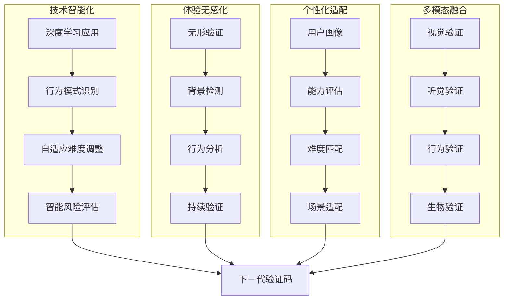

## 8.2 传统文本验证码的识别技术

### 8.2.1 文本验证码的技术特征

文本验证码是最早的验证码形式，虽然安全性相对较低，但其技术原理为后续验证码技术发展奠定了基础。

**文本验证码的设计要素：**

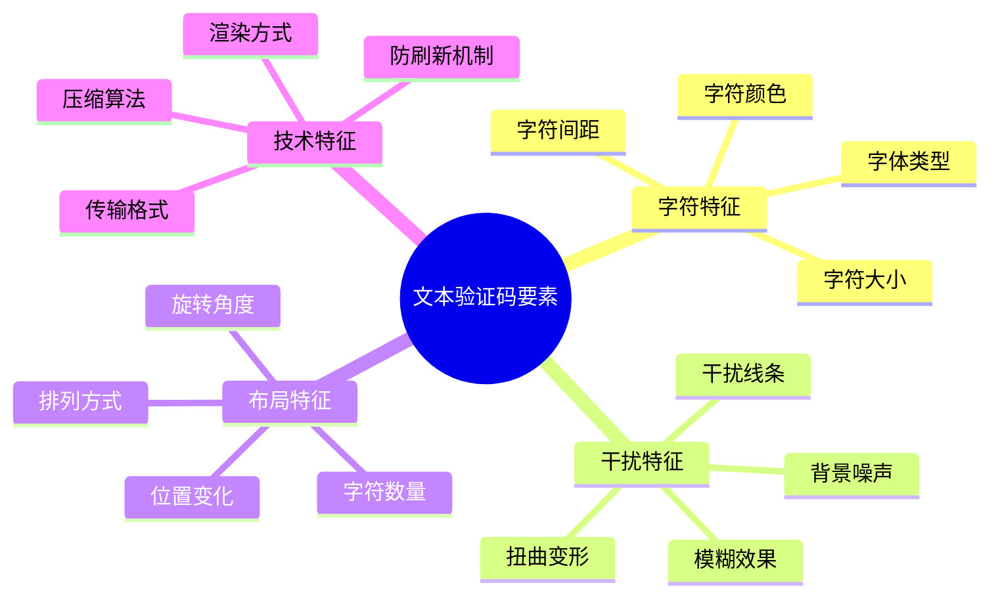

**文本验证码的生成算法：**

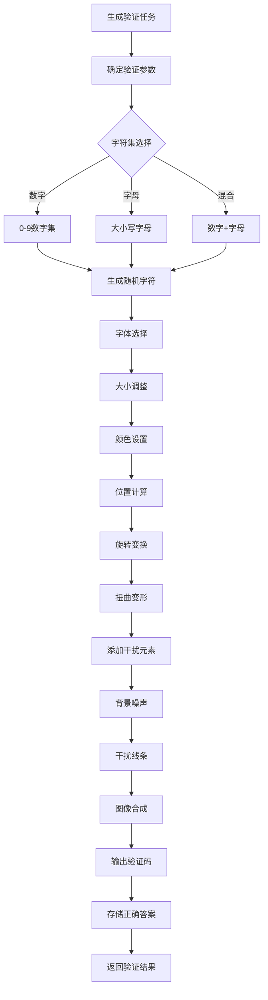

### 8.2.2 图像预处理技术的核心原理

图像预处理是文本验证码识别的关键步骤，通过一系列图像处理技术来提高字符的可识别性。

**图像预处理的完整流程：**

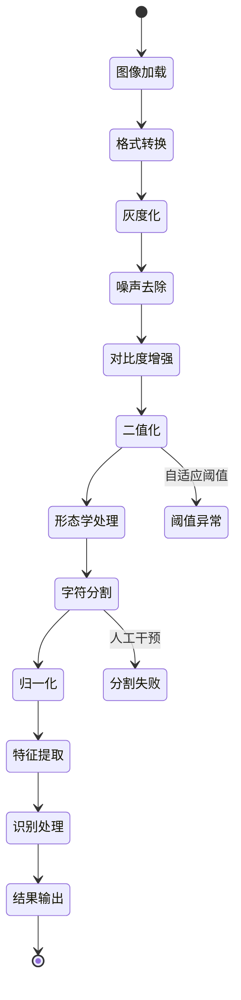

**图像预处理技术的分类体系：**

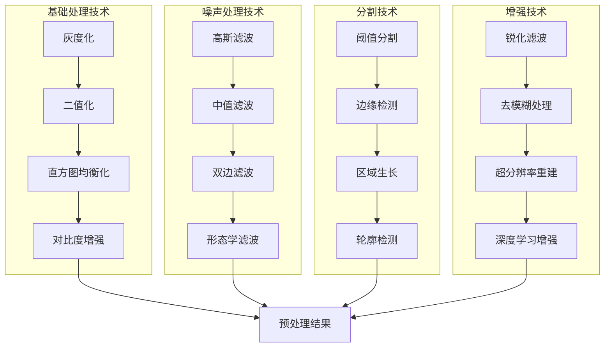

### 8.2.3 字符分割与识别技术

字符分割是文本验证码识别的技术难点，需要根据不同的字符布局采用相应的分割策略。

**字符分割的技术策略：**

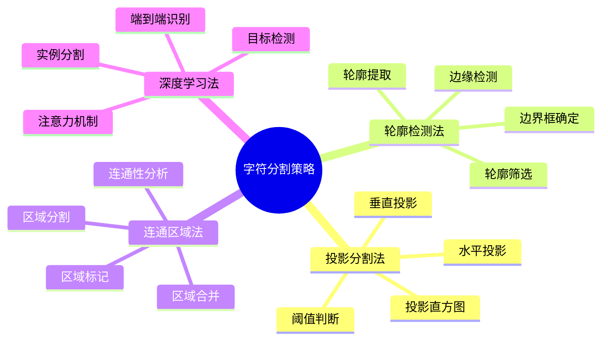

**字符识别的技术路径：**

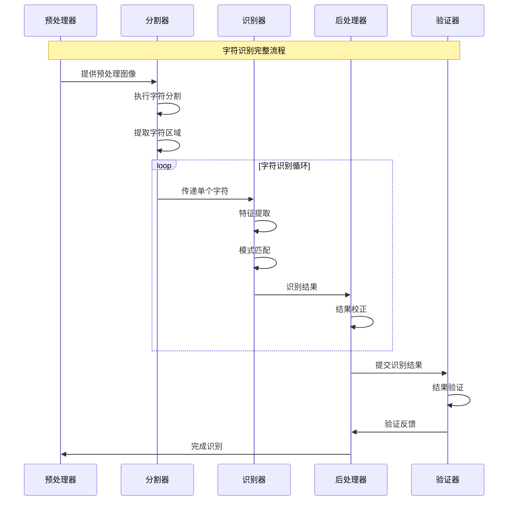

### 8.2.4 机器学习在验证码识别中的应用

机器学习技术大大提高了验证码识别的准确性和鲁棒性，形成了从传统图像处理到深度学习的完整技术体系。

**机器学习方法的演进路径：**

```mermaid
pyramid
    title 验证码识别技术演进

    "传统图像处理<br>(预处理+模板匹配)" : 20%
    "传统机器学习<br>(SVM/随机森林)" : 25%
    "深度学习<br>(CNN/RNN)" : 35%
    "端到端学习<br>(Attention/Transformer)" : 20%
```

**深度学习识别模型的架构设计：**

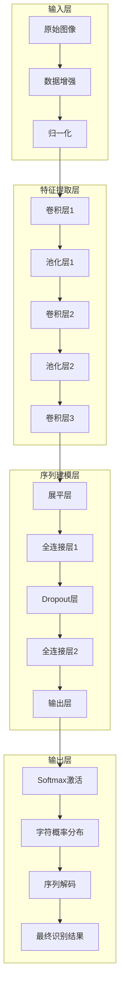

## 总结

### 核心技术要点回顾

本节深入探讨了验证码技术的演进历程和传统文本验证码识别技术，构建了完整的知识框架：

1. **验证码技术演进**：理解验证码从简单到复杂的发展历程和技术分类体系
2. **技术原理分析**：掌握验证码的核心架构和生成验证流程
3. **传统识别技术**：理解文本验证码的特征和图像预处理技术
4. **分割识别方法**：掌握字符分割策略和机器学习识别技术
5. **发展趋势把握**：了解验证码技术向智能化、无感化方向的发展趋势

### 技术发展趋势

验证码技术正在向更加智能化和人性化的方向发展：

- **AI驱动识别**：深度学习在验证码识别中的广泛应用
- **无感验证**：基于行为分析的背景验证技术
- **自适应安全**：根据风险评估动态调整验证难度
- **多模态融合**：结合视觉、听觉、行为等多种验证方式

### 实战应用指导

在实际应用中，验证码识别需要遵循以下核心原则：

1. **技术适配原则**：根据验证码类型选择合适的技术方案
2. **效果优先原则**：优先保证识别准确性和稳定性
3. **效率平衡原则**：在准确性和效率之间找到最佳平衡点
4. **持续学习原则**：根据验证码变化及时调整识别策略
5. **合规使用原则**：确保验证码识别活动符合相关法律法规

掌握这些技术原理和方法，能够帮助我们构建出高效、准确的验证码识别系统，为网络爬虫应用提供重要的技术支撑。