# 第8章：验证码识别与对抗技术（三）

## 8.6 点选验证码的技术原理与架构

### 8.6.1 点选验证码的技术演进

点选验证码作为交互式验证码的重要类型，经历了从简单到复杂的技术演进过程。其核心思想是通过让用户点击图片中的特定元素来验证用户身份。

**点选验证码的发展历程：**

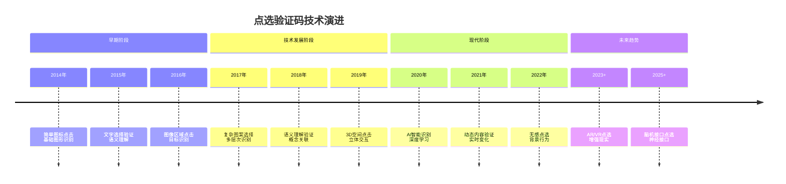

### 8.6.2 点选验证码的系统架构

现代点选验证码系统集成了计算机视觉、语义理解、行为分析等多种技术，形成了复杂的验证架构。

**点选验证码的技术架构：**

```mermaid
pyramid
    title 点选验证码系统架构

    "前端展示层<br>(交互界面/动画效果)" : 15%
    "交互采集层<br>(事件监听/点击坐标)" : 20%
    "识别引擎层<br>(目标检测/语义理解)" : 30%
    "数据支撑层<br>(题库管理/标注数据)" : 25%
    "安全防护层<br>(反作弊/行为分析)" : 10%
```

**点选验证码的完整工作流程：**

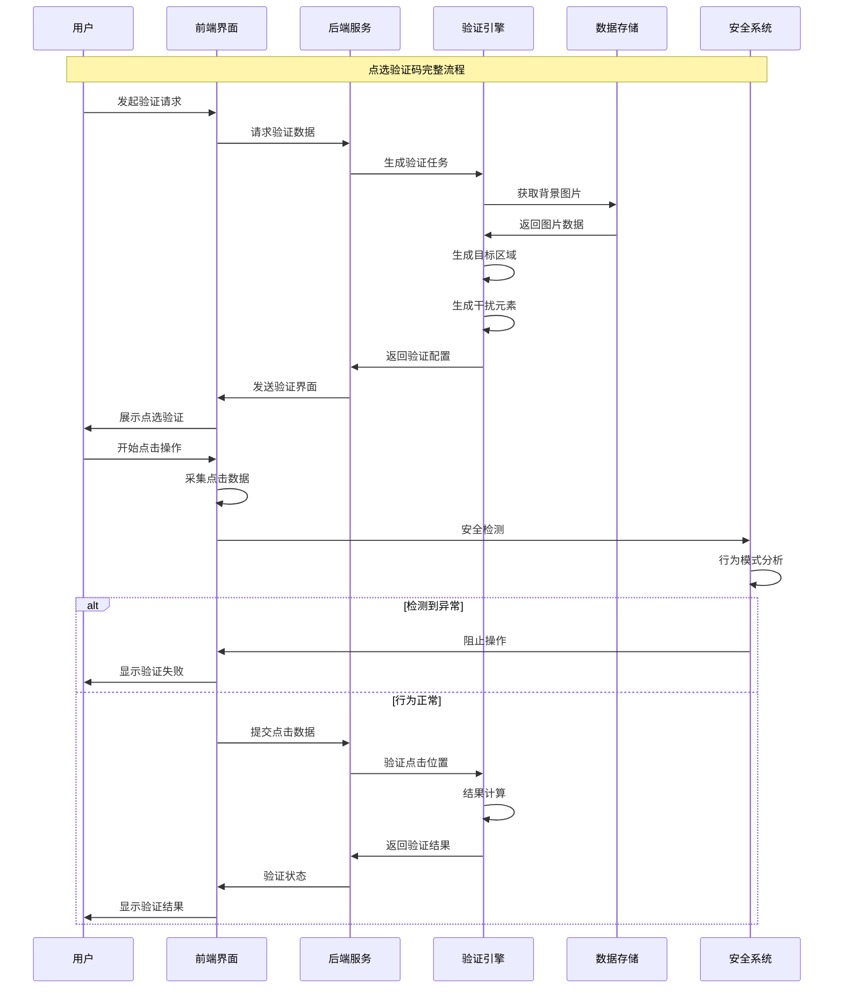

### 8.6.3 点选验证码的技术特征分析

不同类型的点选验证码具有不同的技术特征，需要采用相应的识别和对抗策略。

**点选验证码的分类体系：**

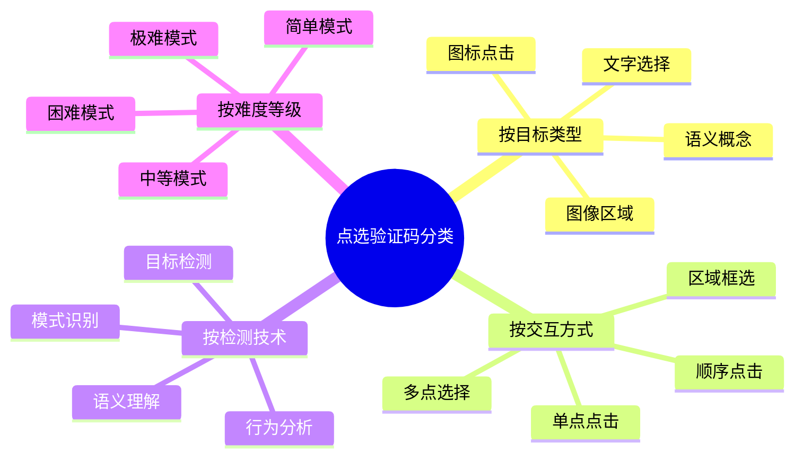

**不同点选验证码的技术对比：**

| 验证码类型 | 技术复杂度 | 识别难度 | 语义要求 | 用户体验 | 适用场景 |
|-----------|-----------|---------|---------|---------|---------|
| 简单图标 | 低 | 低 | 无 | 好 | 一般网站 |
| 文字选择 | 中等 | 中等 | 高 | 较好 | 内容网站 |
| 图像识别 | 高 | 高 | 中等 | 一般 | 电商平台 |
| 语义理解 | 极高 | 极高 | 极高 | 较好 | 智能应用 |
| 动态验证 | 极高 | 极高 | 高 | 极好 | 金融级应用 |

## 8.7 目标检测与识别算法技术

### 8.7.1 目标检测算法原理

目标检测是点选验证码识别的核心技术，通过深度学习方法自动识别图片中的目标元素。

**目标检测算法的演进路径：**

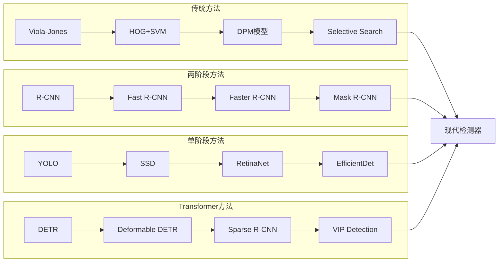

**YOLO目标检测的架构设计：**

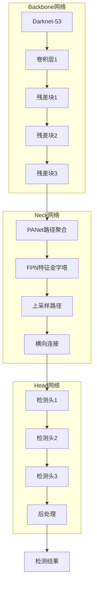

### 8.7.2 语义理解与概念识别

语义理解是高级点选验证码识别的关键技术，需要理解图片内容的语义含义。

**语义理解的技术架构：**

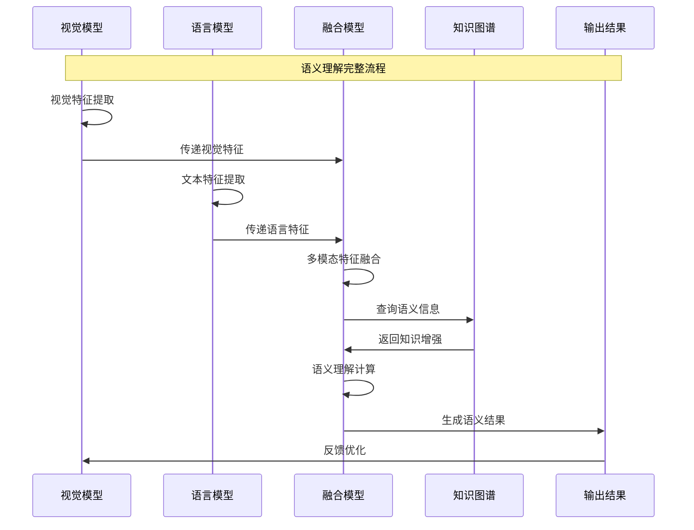

**多模态融合的技术框架：**

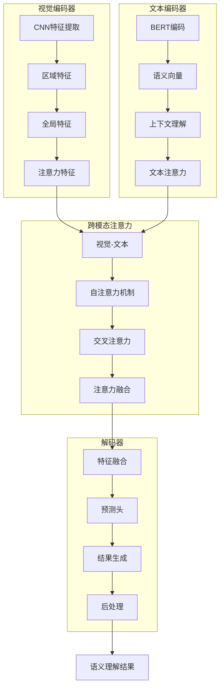

### 8.7.3 多目标检测与跟踪技术

多目标检测是复杂点选验证码识别的核心技术，需要同时识别和跟踪多个目标元素。

**多目标检测的技术流程：**

```mermaid
stateDiagram-v2
    [*] --> 图像输入
    图像输入 --> 预处理
    预处理 --> 特征提取

    特征提取 --> 目标检测
    目标检测 --> {检测到目标?}

    检测到目标 --> 是: 目标分类
    检测到目标 --> 否: 重新检测

    目标分类 --> 目标跟踪
    目标跟踪 --> {跟踪完成?}

    跟踪完成 --> 是: 结果输出
    跟踪完成 --> 否: 轨迹更新

    轨迹更新 --> {目标丢失?}
    目标丢失 --> 是: 重新检测
    目标丢失 --> 否: 目标跟踪

    结果输出 --> [*]
    重新检测 --> 目标检测
```

**多目标跟踪算法的分类：**

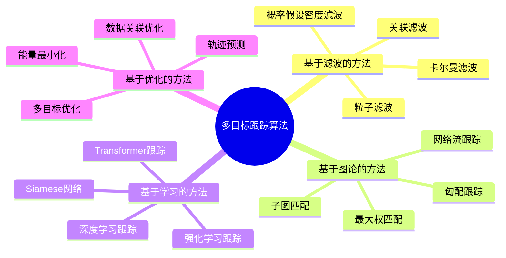

## 8.8 点选验证码的对抗技术

### 8.8.1 反检测与隐蔽技术

反检测技术是点选验证码对抗的核心策略，通过模拟人类行为来规避验证码的检测机制。

**反检测技术的核心策略：**

```mermaid
pyramid
    title 反检测技术策略

    "行为模拟策略<br>(点击轨迹/时间间隔)" : 30%
    "环境伪装策略<br">(浏览器指纹/IP轮换)" : 25%
    "技术规避策略<br">(API限制/请求控制)" : 20%
    "智能适应策略<br"(难度调整/策略切换)" : 15%
    "协作对抗策略<br"(信息共享/团队协作)" : 10%
```

**隐蔽行为的模拟机制：**

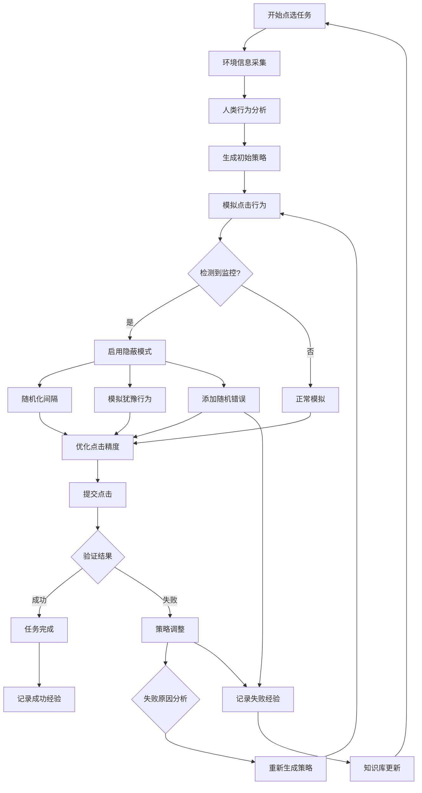

### 8.8.2 机器学习对抗策略

机器学习对抗策略通过训练对抗模型来识别和破解验证码的检测机制。

**GAN对抗网络的架构设计：**

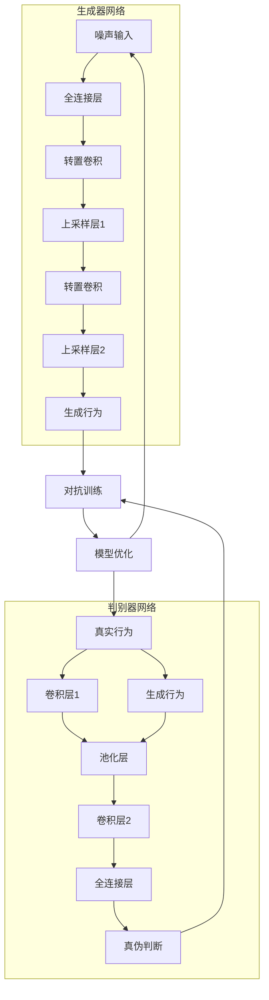

**强化学习对抗的训练流程：**

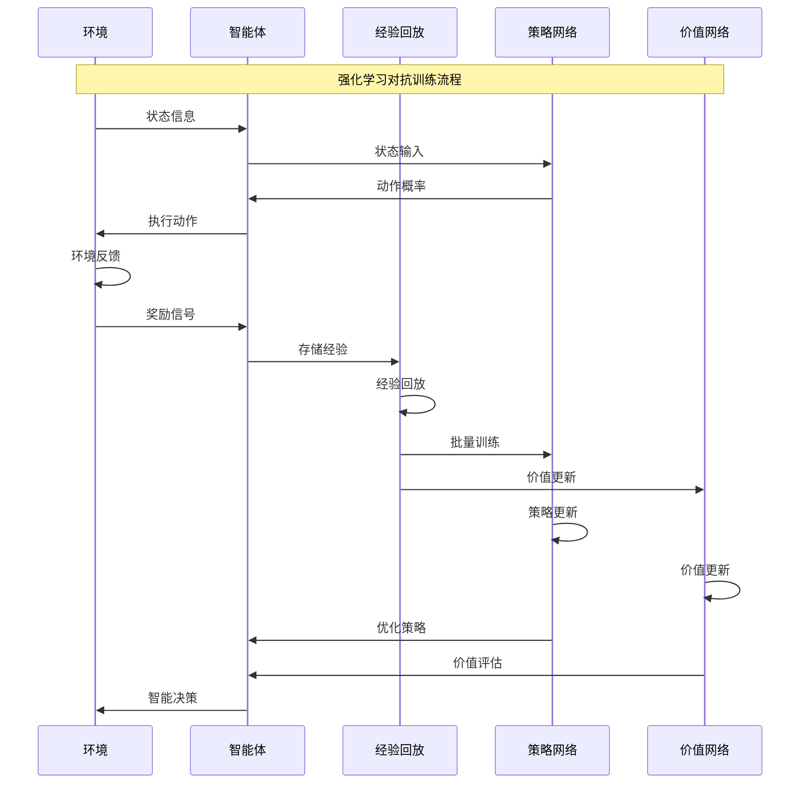

### 8.8.3 协作对抗与信息共享

协作对抗是通过信息共享和团队协作来提高验证码破解成功率的有效策略。

**协作对抗的架构设计：**

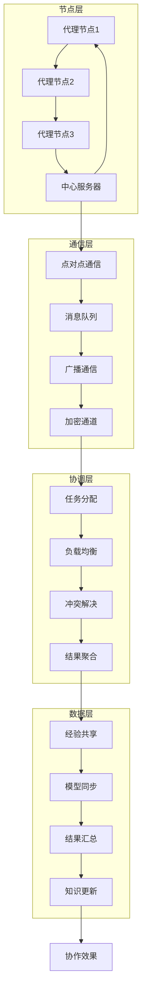

## 总结

### 核心技术要点回顾

本节深入探讨了点选验证码的技术原理和识别方法，构建了完整的技术体系：

1. **技术演进理解**：掌握点选验证码从简单到复杂的发展历程和技术特征
2. **系统架构分析**：理解点选验证码的分层架构和完整工作流程
3. **检测识别技术**：掌握目标检测、语义理解、多目标跟踪等核心技术
4. **对抗策略方法**：了解反检测、机器学习、协作对抗等对抗技术
5. **实战应用指导**：建立完整的识别流程和对抗策略体系

### 技术发展趋势

点选验证码技术正在向更加智能化、语义化的方向发展：

- **语义理解深化**：大语言模型在概念理解和推理中的应用
- **多模态融合**：结合视觉、文本、语音的综合验证技术
- **自适应检测**：基于用户行为模式的智能检测机制
- **无感验证**：基于背景行为的透明化验证技术

### 实战应用指导

在实际应用中，点选验证码识别需要遵循以下核心原则：

1. **技术组合原则**：结合多种检测和识别方法提高成功率
2. **行为模拟优先**：重点模拟真实用户的点击行为特征
3. **持续学习优化**：根据验证码变化及时调整识别策略
4. **风险控制原则**：合理控制识别频率和强度
5. **安全合规使用**：确保识别活动符合相关法律法规

掌握这些技术原理和方法，能够帮助我们构建出高效、准确的点选验证码识别系统，为现代网络爬虫应用提供重要的技术支撑。通过不断的技术创新和方法优化，点选验证码识别技术将能够应对更加复杂的验证挑战。