# 第8章：验证码识别与对抗技术（二）

## 8.3 滑块验证码的技术原理与架构分析

### 8.3.1 滑块验证码的技术演进

滑块验证码作为现代网站的主流验证方式，经历了从简单到复杂的技术演进过程。其核心思想是通过拖拽滑块来完成拼图任务，验证用户是人类而非自动化程序。

**滑块验证码的发展历程：**

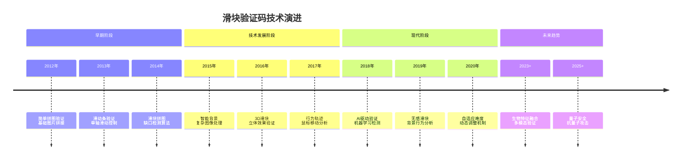

### 8.3.2 滑块验证码的系统架构

现代滑块验证码系统采用分层架构设计，集成了计算机视觉、行为分析、机器学习等多种技术。

**滑块验证码的技术架构：**

```mermaid
pyramid
    title 滑块验证码系统架构

    "前端展示层<br>(UI交互/动画效果)" : 15%
    "交互检测层<br>(事件监听/轨迹采集)" : 20%
    "验证引擎层<br>(算法处理/模式识别)" : 35%
    "数据支撑层<br>(题库管理/模型存储)" : 20%
    "安全防护层<br>(反作弊/安全策略)" : 10%
```

**滑块验证码的完整工作流程：**

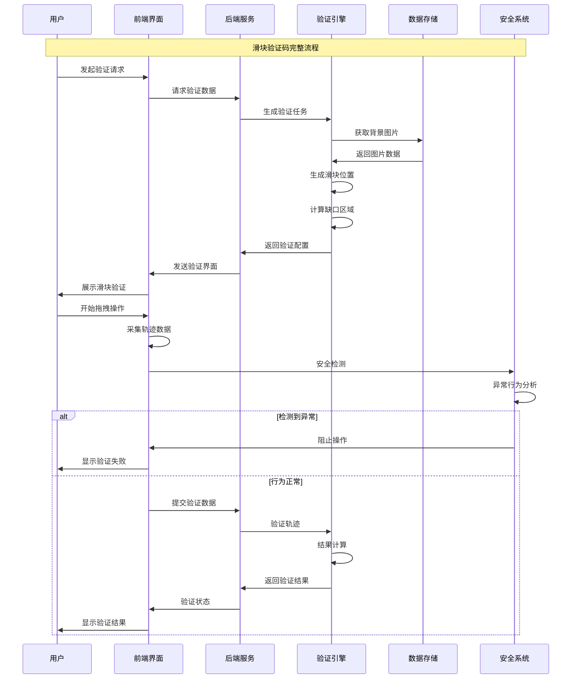

### 8.3.3 滑块验证码的技术特征分析

不同类型的滑块验证码具有不同的技术特征，需要采用相应的识别和对抗策略。

**滑块验证码的分类体系：**

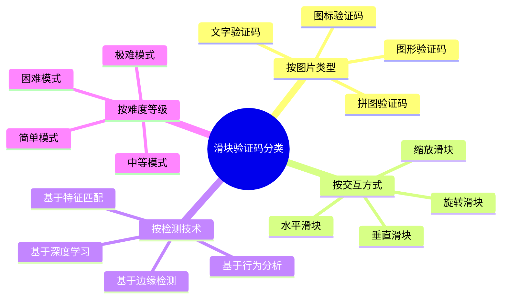

**不同滑块验证码的技术对比：**

| 验证码类型 | 技术复杂度 | 识别难度 | 行为检测 | 用户体验 | 适用场景 |
|-----------|-----------|---------|---------|---------|---------|
| 简单拼图 | 低 | 低 | 基础 | 好 | 一般网站 |
| 复杂图案 | 中等 | 中等 | 中等 | 一般 | 电商平台 |
| 3D立体 | 高 | 高 | 高 | 好 | 高安全网站 |
| 行为验证 | 极高 | 极高 | 极高 | 极好 | 金融网站 |
| AI检测 | 极高 | 极高 | 极高 | 极好 | 企业级应用 |

## 8.4 滑块验证码的核心算法技术

### 8.4.1 缺口检测算法原理

缺口检测是滑块验证码识别的核心技术，通过分析背景图片和滑块图片的关系来确定缺口位置。

**传统缺口检测算法流程：**

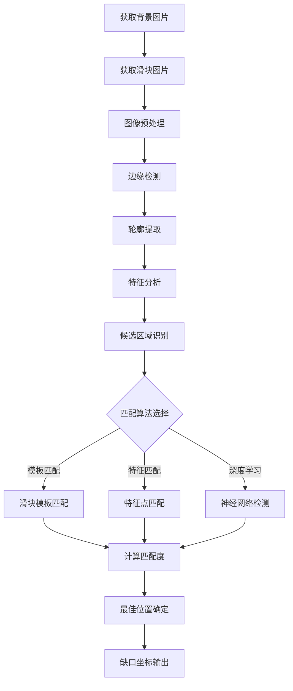

**深度学习缺口检测的技术架构：**

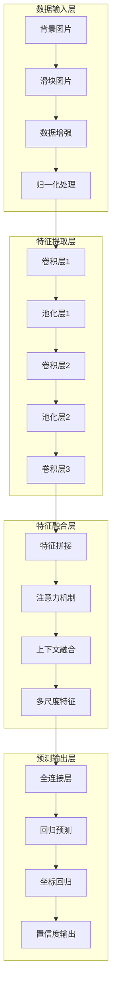

### 8.4.2 图像匹配与特征提取技术

图像匹配和特征提取是滑块验证码识别的基础技术，需要结合多种算法来提高识别准确率。

**图像匹配技术的分类体系：**

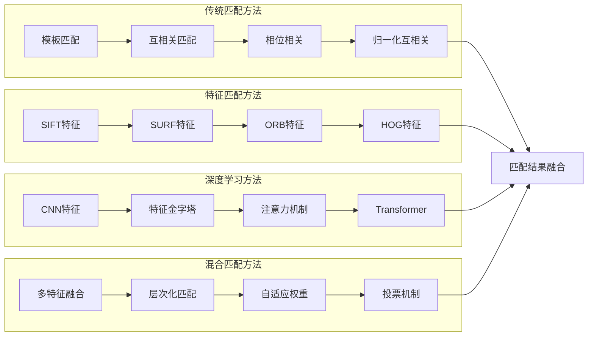

**特征提取的技术流程：**

```mermaid
stateDiagram-v2
    [*] --> 图像加载
    图像加载 --> 预处理
    预处理 --> 特征点检测

    特征点检测 --> SIFT特征提取
    特征点检测 --> SURF特征提取
    特征点检测 --> ORB特征提取

    SIFT特征提取 --> 特征描述符计算
    SURF特征提取 --> 特征描述符计算
    ORB特征提取 --> 特征描述符计算

    特征描述符计算 --> 特征匹配
    特征匹配 --> {匹配质量检查}

    匹配质量检查 --> 匹配成功: RANSAC筛选
    匹配质量检查 --> 匹配失败: 参数调整

    RANSAC筛选 --> 变换矩阵计算
    变换矩阵计算 --> 匹配结果输出
    匹配结果输出 --> [*]

    参数调整 --> 特征点检测
    匹配结果输出 --> [*]
```

### 8.4.3 滑动轨迹生成与模拟技术

滑动轨迹的生成和模拟是滑块验证码对抗的关键技术，需要模拟真实用户的滑动行为特征。

**人类滑动行为的特征分析：**

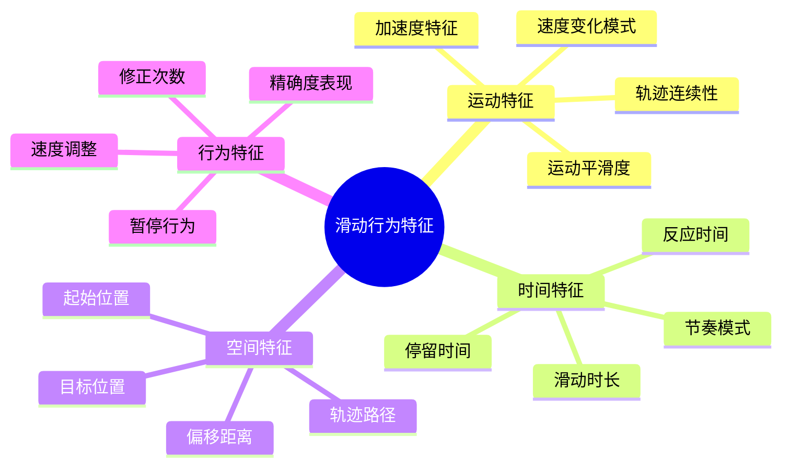

**智能轨迹生成算法架构：**

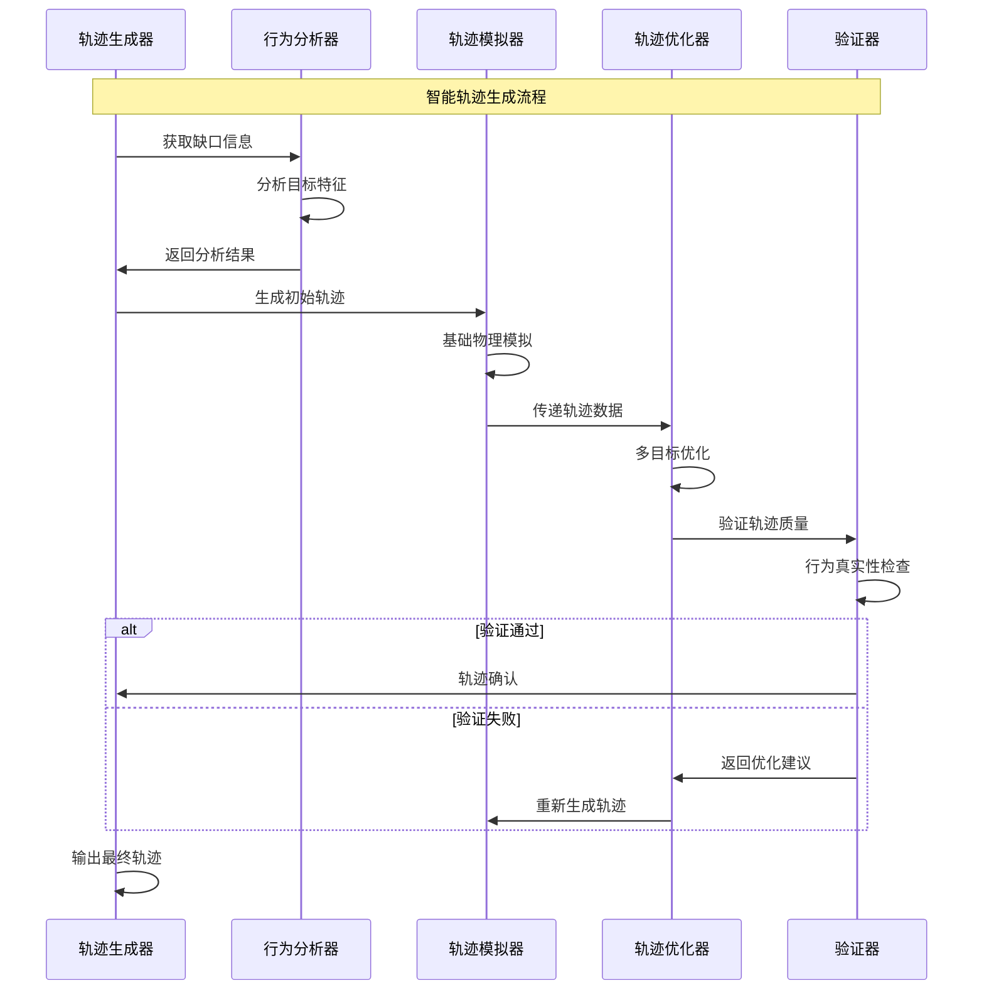

## 8.5 滑块验证码的深度学习识别方法

### 8.5.1 卷积神经网络在滑块识别中的应用

卷积神经网络（CNN）在滑块验证码识别中展现出强大的特征提取和模式识别能力。

**CNN滑块识别的网络架构：**

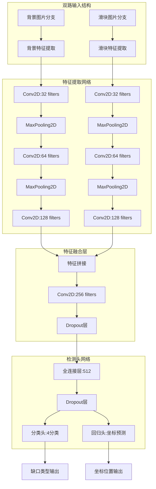

### 8.5.2 端到端深度学习方法

端到端学习方法能够直接从原始图像到滑块位置进行预测，简化了传统方法的复杂流程。

**端到端学习的优势分析：**

```mermaid
pyramid
    title 端到端学习方法优势

    "自动化特征学习<br>(无需人工设计)" : 30%
    "端到端优化<br">(联合训练优化) : 25%
    "泛化能力强<br"(适应性强) : 20%
    "部署简单<br"(一体化模型) : 15%
    "精度提升<br"(信息完整) : 10%
```

**端到端模型的技术架构：**

```mermaid
graph LR
    subgraph "输入层"
        A1[背景图像] --> A2[滑块图像]
        A2 --> A3[位置信息]
        A3 --> A4[预处理]
    end

    subgraph "编码器网络"
        B1[共享CNN] --> B2[背景编码器]
        B2 --> B3[滑块编码器]
        B3 --> B4[特征融合]
    end

    subgraph "解码器网络"
        C1[注意力机制] --> C2[位置回归]
        C2 --> C3[置信度预测]
        C3 --> C4[后处理]
    end

    subgraph "输出层"
        D1[缺口坐标] --> D2[匹配概率]
        D2 --> D3[滑动建议]
        D3 --> D4[结果输出]
    end

    A4 --> B1
    B4 --> C1
    C4 --> D1
```

### 8.5.3 Transformer在滑块验证码中的应用

Transformer架构为滑块验证码识别带来了新的技术突破，特别是在长距离依赖和上下文理解方面。

**Vision Transformer的技术架构：**

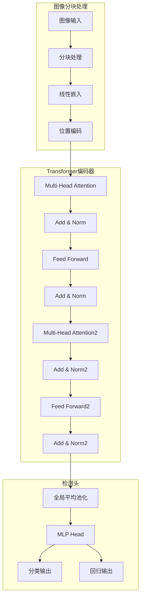

## 总结

### 核心技术要点回顾

本节深入探讨了滑块验证码的技术原理和识别方法，构建了完整的技术体系：

1. **技术演进理解**：掌握滑块验证码从简单到复杂的发展历程和技术特征
2. **系统架构分析**：理解滑块验证码的分层架构和完整工作流程
3. **核心算法技术**：掌握缺口检测、图像匹配、轨迹生成等核心算法
4. **深度学习应用**：了解CNN、端到端学习、Transformer等深度学习方法
5. **实战应用指导**：建立完整的识别流程和对抗策略体系

### 技术发展趋势

滑块验证码技术正在向更加智能化、自适应的方向发展：

- **AI驱动检测**：深度学习在行为分析和异常检测中的广泛应用
- **多模态融合**：结合视觉、行为、设备信息的综合验证
- **自适应安全**：根据风险评估动态调整验证难度
- **无感验证**：基于背景分析的透明化验证技术

### 实战应用指导

在实际应用中，滑块验证码识别需要遵循以下核心原则：

1. **技术适配原则**：根据验证码类型选择合适的技术方案
2. **多方法融合**：结合传统方法和深度学习方法提高识别率
3. **行为模拟优先**：重点模拟真实用户的滑动行为特征
4. **持续优化原则**：根据验证码变化及时调整识别策略
5. **安全合规使用**：确保识别活动符合相关法律法规

掌握这些技术原理和方法，能够帮助我们构建出高效、准确的滑块验证码识别系统，为现代网络爬虫应用提供重要的技术支撑。