# 第8章：验证码识别与对抗技术（五）

## 8.11 验证码对抗的工程化实践

### 8.11.1 验证码识别系统的架构设计

构建一个高效的验证码识别系统需要采用现代化的软件工程架构，确保系统的可扩展性、可维护性和高性能。

**验证码识别系统的分层架构：**

```mermaid
pyramid
    title 验证码识别系统架构

    "应用接口层<br>(API/SDK/前端)" : 15%
    "业务逻辑层<br>(识别流程/策略)" : 25%
    "算法服务层<br>(模型推理/处理)" : 30%
    "基础设施层<br>(计算/存储/网络)" : 20%
    "监控运维层<br"(监控/日志/告警)" : 10%
```

**微服务架构的设计模式：**

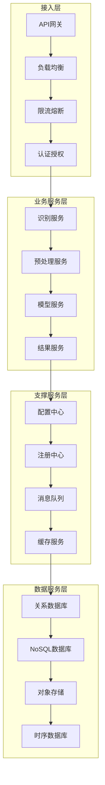

**高可用性架构设计：**

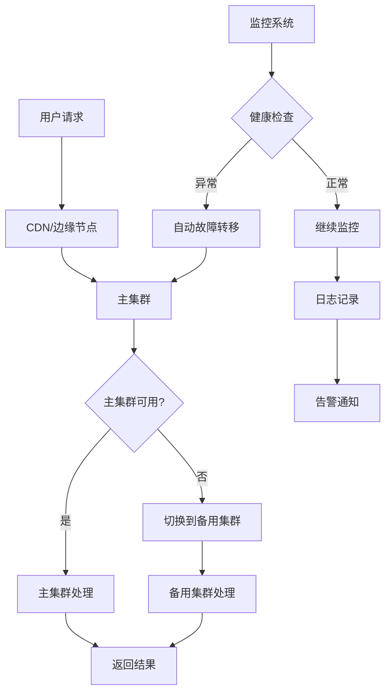

### 8.11.2 模型管理与版本控制

在验证码识别系统中，模型的管理和版本控制是确保系统稳定性和持续改进的关键环节。

**模型生命周期的管理流程：**

```mermaid
stateDiagram-v2
    [*] --> 数据采集
    数据采集 --> 数据预处理
    数据预处理 --> 特征工程
    特征工程 --> 模型训练

    模型训练 --> 模型评估
    模型评估 --> {评估通过?}

    评估通过 --> 是: 模型验证
    评估通过 --> 否: 参数调优

    参数调优 --> 模型训练
    模型验证 --> 模型部署

    模型部署 --> 线上监控
    线上监控 --> {性能满足?}

    性能满足 --> 是: 继续监控
    性能满足 --> 否: 模型回滚

    继续监控 --> 数据收集
    数据收集 --> 模型优化

    模型回滚 --> 问题分析
    问题分析 --> 模型训练
```

**模型版本控制的技术架构：**

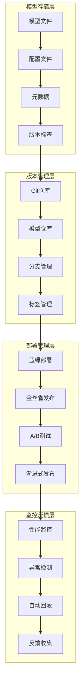

**模型性能监控的关键指标：**

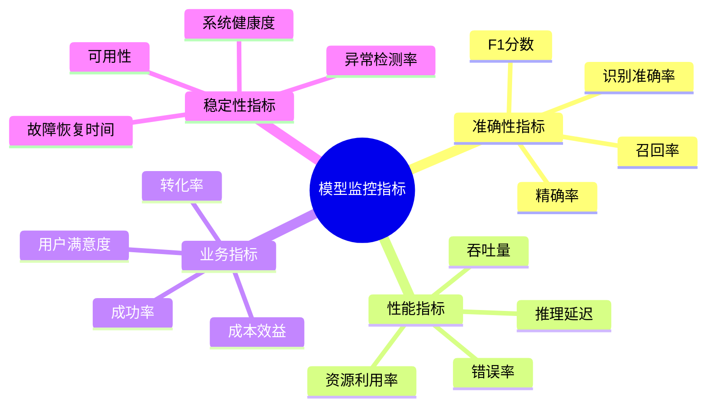

### 8.11.3 数据管道与特征工程

高效的数据管道和特征工程是验证码识别系统的基础设施，直接影响模型的性能和系统的效率。

**数据处理的流水线架构：**

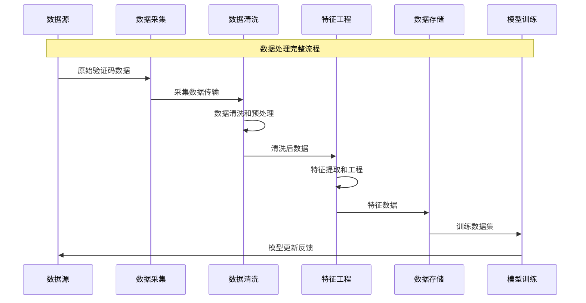

**特征工程的自动化流程：**

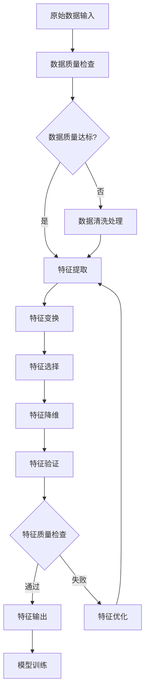

**数据质量保障机制：**

```mermaid
pyramid
    title 数据质量保障体系

    "质量监控<br>(实时监控/告警)" : 25%
    "质量评估<br"(指标计算/评分)" : 20%
    "质量改进<br"(问题修复/优化)" : 20%
    "质量标准<br"(规范制定/执行)" : 15%
    "质量工具<br"(自动化/可视化)" : 10%
    "质量文化<br"(意识培养/培训)" : 10%
```

### 8.11.4 系统监控与运维自动化

完善的监控体系和运维自动化是保证验证码识别系统稳定运行的重要保障。

**监控系统的技术架构：**

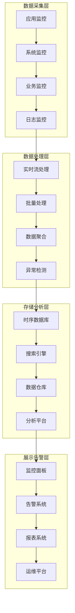

**运维自动化的核心场景：**

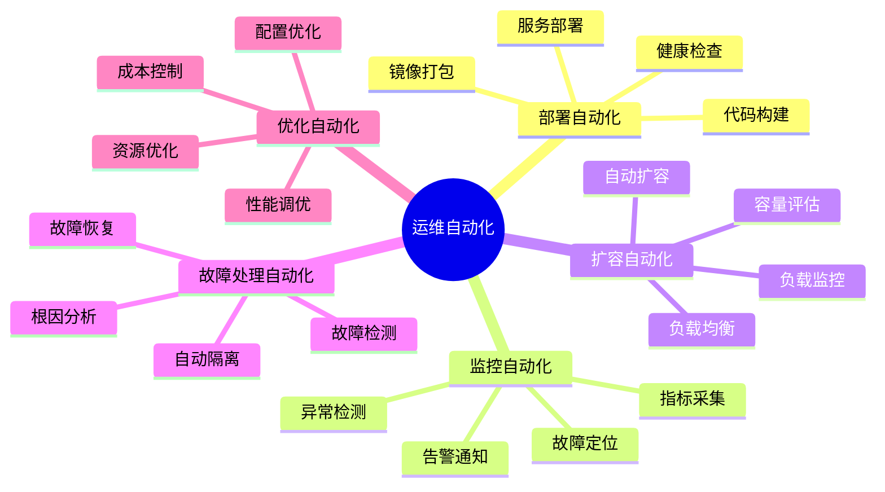

**智能运维的技术实现：**

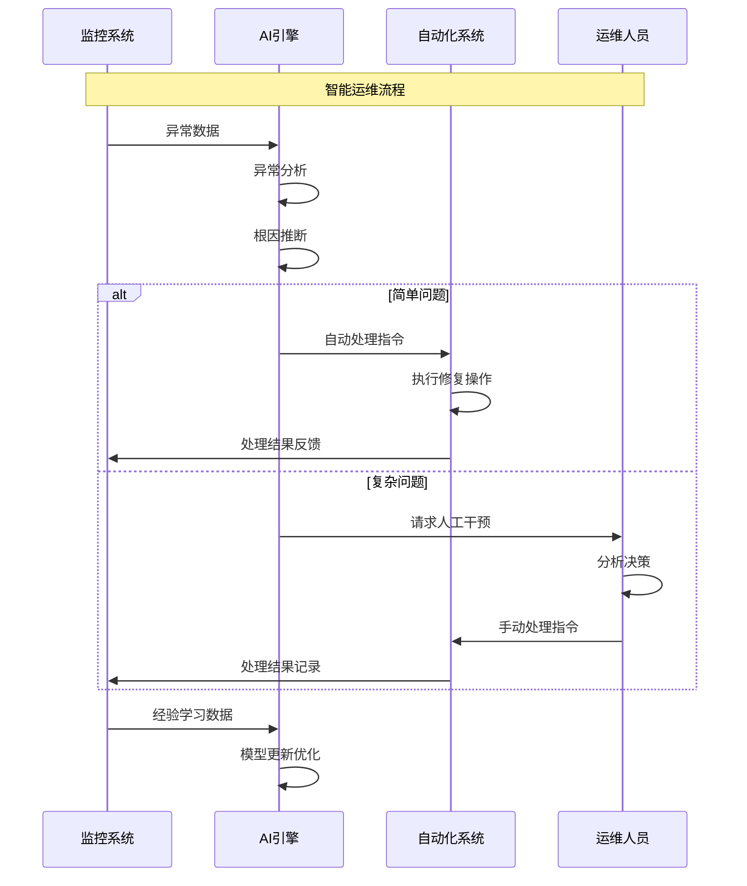

## 8.12 验证码对抗的伦理与合规考量

### 8.12.1 技术伦理原则与规范

验证码识别技术的发展必须建立在技术伦理的基础之上，确保技术应用的正当性和社会责任。

**技术伦理的核心原则：**

```mermaid
pyramid
    title 技术伦理原则层次

    "责任原则<br>(技术创新责任)" : 25%
    "公平原则<br>(公平竞争)" : 20%
    "透明原则<br"(技术透明度)" : 15%
    "安全原则<br"(安全保障)" : 15%
    "隐私原则<br"(隐私保护)" : 15%
    "合规原则<br"(法律法规)" : 10%
```

**伦理风险评估框架：**

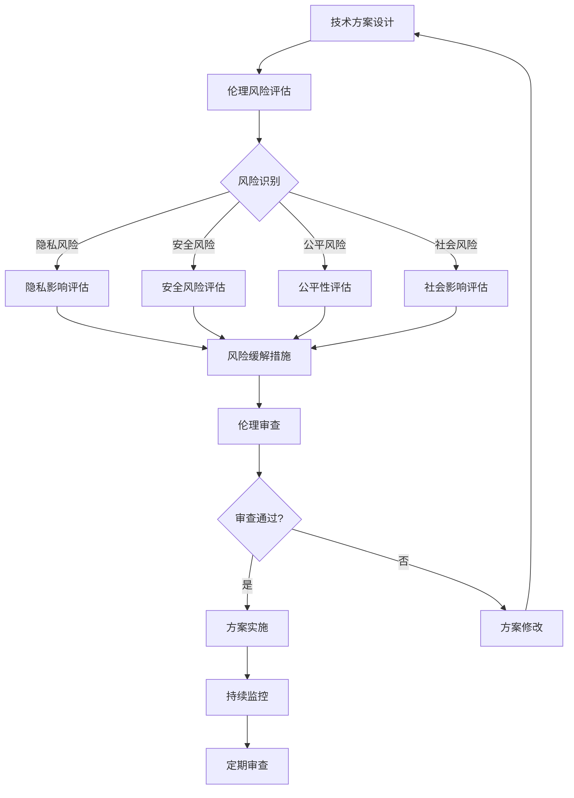

**负责任的技术实践指南：**

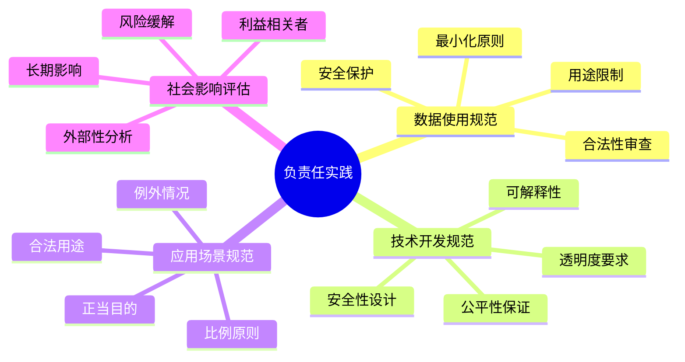

### 8.12.2 法律法规合规框架

验证码识别技术的应用必须遵守相关的法律法规，确保技术发展的合规性和可持续性。

**主要法律法规体系：**

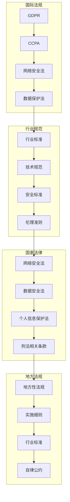

**合规风险管控机制：**

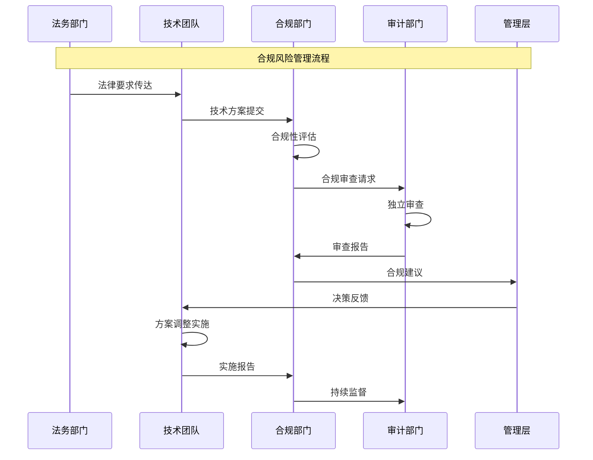

**合规检查清单：**

| 检查项目 | 检查内容 | 检查频率 | 责任部门 | 整改要求 |
|---------|---------|----------|---------|---------|
| 数据合法性 | 数据来源、用途、存储 | 月度 | 法务、技术 | 立即整改 |
| 技术合规性 | 技术标准、安全要求 | 季度 | 技术、合规 | 限期整改 |
| 业务合规性 | 业务范围、用户协议 | 半年 | 业务、法务 | 按需整改 |
| 安全合规性 | 安全措施、应急预案 | 月度 | 安全、技术 | 立即整改 |
| 伦理合规性 | 伦理原则、社会责任 | 年度 | 伦理委员会 | 持续改进 |

### 8.12.3 行业自律与最佳实践

建立健全的行业自律机制和推广最佳实践，是验证码识别技术健康发展的重要保障。

**行业自律组织的功能架构：**

```mermaid
graph LR
    subgraph "治理层"
        A1[理事会] --> A2[专家委员会]
        A2 --> A3[监督委员会]
        A3 --> A4[申诉委员会]
    end

    subgraph "执行层"
        B1[标准制定] --> B2[认证评估]
        B2 --> B3[培训教育]
        B3 --> B4[行业交流]
    end

    subgraph "监督层"
        C1[合规监督] --> C2[质量检查]
        C2 --> C3[投诉处理]
        C3 --> C4[违规处理]
    end

    subgraph "服务层"
        D1[信息咨询] --> D2[技术支持]
        D2 --> D3[争议调解]
        D3 --> D4[国际交流]
    end

    A4 --> B1
    B4 --> C1
    C4 --> D1
```

**最佳实践的推广机制：**

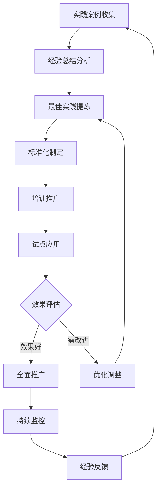

**技术能力认证体系：**

```mermaid
pyramid
    title 技术能力认证等级

    "专家级<br>(技术领先/创新)" : 15%
    "高级<br"(技术精通/指导)" : 25%
    "中级<br"(技术熟练/应用)" : 35%
    "初级<br"(基础掌握/学习)" : 20%
    "入门级<br"(基础了解/入门)" : 5%
```

### 8.12.4 社会责任与可持续发展

验证码识别技术的发展应该承担相应的社会责任，推动技术的可持续发展。

**社会责任的实施框架：**

```mermaid
mindmap
  root((社会责任))
    技术责任
      安全可靠
      透明公开
      可解释性
      质量保证
    经济责任
      促进创新
      创造价值
      公平竞争
      可持续发展
    法律责任
      合法合规
      知识产权
      数据保护
      网络安全
    道德责任
      诚实守信
      公正无私
      尊重隐私
      保护弱者
    环境责任
      绿色计算
      节能减排
      资源优化
      环境友好
```

**可持续发展指标体系：**

```mermaid
graph TB
    subgraph "环境维度"
        A1[能源消耗] --> A2[碳排放]
        A2 --> A3[资源利用]
        A3 --> A4[废弃物处理]
    end

    subgraph "社会维度"
        B1[就业创造] --> B2[技能提升]
        B2 --> B3[社区贡献]
        B3 --> B4[公益参与]
    end

    subgraph "经济维度"
        C1[经济增长] --> C2[创新投入]
        C2 --> C3[效率提升]
        C3 --> C4[成本优化]
    end

    subgraph "治理维度"
        D1[合规管理] --> D2[风险控制]
        D2 --> D3[透明治理]
        D3 --> D4[伦理监督]
    end

    A4 --> E[可持续发展指数]
    B4 --> E
    C4 --> E
    D4 --> E
```

**社会责任实践案例：**

```mermaid
sequenceDiagram
    participant Company as 企业
    participant Research as 研究机构
    participant NGO as NGO组织
    participant Government as 政府部门
    participant Public as 公众

    Note over Company,Public: 社会责任协同实践

    Company->>Research: 技术合作研究
    Research->>Research: 伦理评估
    Research->>Company: 研究成果

    Company->>NGO: 公益项目合作
    NGO->>Public: 社会服务
    Public->>NGO: 反馈意见

    NGO->>Government: 政策建议
    Government->>Company: 监管指导
    Company->>Public: 透明报告

    Public->>Company: 社会监督
    Company->>Company: 持续改进
```

## 总结

### 核心技术要点回顾

本节深入探讨了验证码对抗的工程化实践和伦理合规考量，构建了完整的应用实践体系：

1. **工程化架构**：掌握验证码识别系统的分层架构和微服务设计模式
2. **模型管理**：理解模型生命周期管理和版本控制的技术实践
3. **数据工程**：掌握数据管道和特征工程的自动化流程
4. **运维自动化**：建立完善的监控体系和智能运维机制
5. **伦理合规**：理解技术伦理原则和法律法规合规框架

### 实践应用指导

在实际应用中，验证码识别系统的开发和部署需要遵循以下核心原则：

1. **系统化设计**：采用分层架构和微服务模式，确保系统的可扩展性和可维护性
2. **自动化优先**：通过自动化工具和流程提高开发和运维效率
3. **质量保障**：建立完善的质量监控和保障机制
4. **伦理合规**：将伦理和合规要求贯穿于技术开发的各个环节
5. **持续改进**：建立持续学习和优化的机制，推动技术的持续发展

### 未来发展展望

面向未来的验证码识别技术发展，需要在以下方面持续努力：

1. **技术创新与伦理平衡**：在追求技术创新的同时，重视伦理和社会责任
2. **标准化建设**：推动行业技术标准和最佳实践的建立
3. **国际化合作**：加强国际交流与合作，共同应对全球性挑战
4. **人才培养**：培养具有伦理意识的技术人才队伍
5. **社会共建**：构建政府、企业、学术界、公众共同参与的治理体系

掌握这些工程化实践和伦理合规知识，能够帮助我们构建出更加负责任、可持续的验证码识别系统，为网络安全的健康发展做出积极贡献。通过技术创新与责任担当的平衡，验证码识别技术将在未来的数字化社会中发挥更加重要的作用。