# 第8章：验证码识别与对抗技术（六）

## 8.13 综合实战案例研究

### 8.13.1 大型电商平台验证码系统对抗实战

大型电商平台的验证码系统通常采用多层次、多维度的综合防护机制，需要系统性的对抗策略才能有效应对。

**电商平台验证码系统的技术特征：**

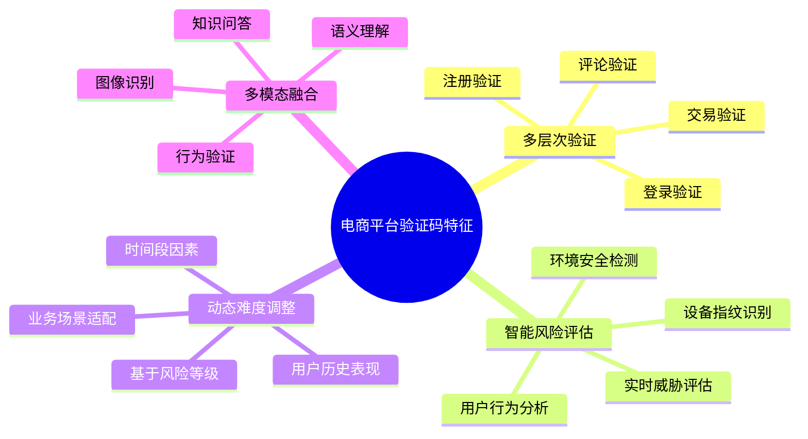

**综合对抗策略的架构设计：**

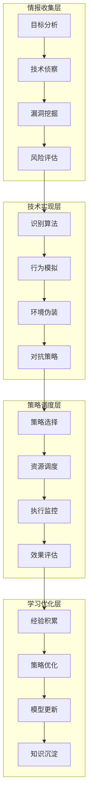

**实战对抗的技术流程：**

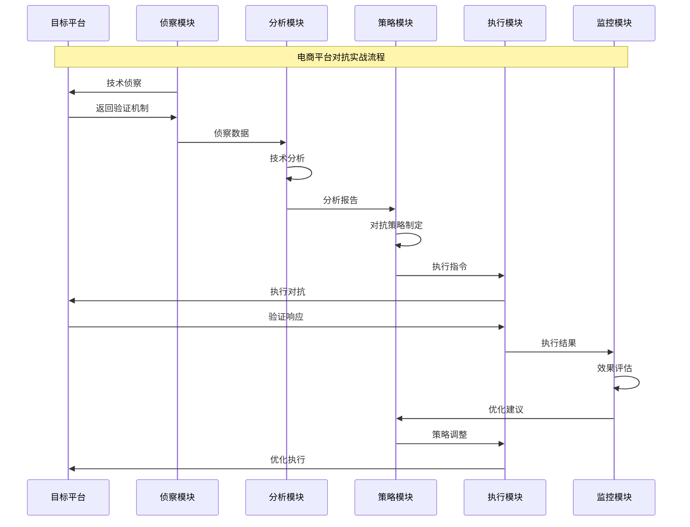

### 8.13.2 金融级验证码系统攻防实战

金融行业的验证码系统具有最高级别的安全防护，需要采用最先进的对抗技术和策略。

**金融验证码系统的安全层次：**

```mermaid
pyramid
    title 金融验证码安全层次

    "业务逻辑层<br"(业务规则/流程控制)" : 15%
    "应用安全层<br"(身份认证/权限控制)" : 20%
    "数据安全层<br"(加密传输/存储安全)" : 25%
    "网络安全层<br"(防火墙/入侵检测)" : 20%
    "基础设施层<br"(物理安全/环境控制)" : 10%
    "合规管理层<br"(监管合规/审计追踪)" : 10%
```

**金融级对抗的技术要求：**

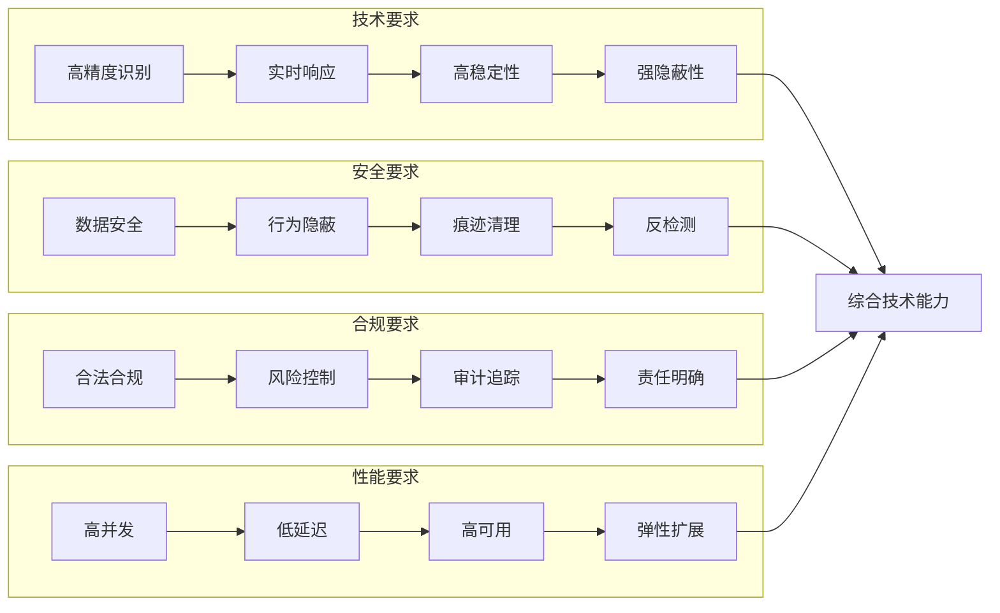

**金融验证码对抗的风险控制：**

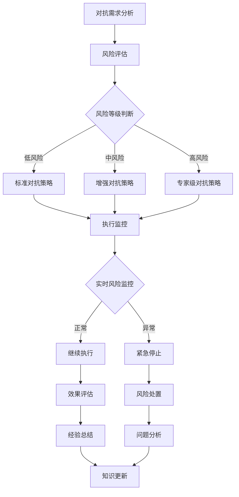

### 8.13.3 社交媒体平台验证码系统破解实战

社交媒体平台的验证码系统具有独特的特征，需要针对性的技术和策略。

**社交媒体验证码的技术特征：**

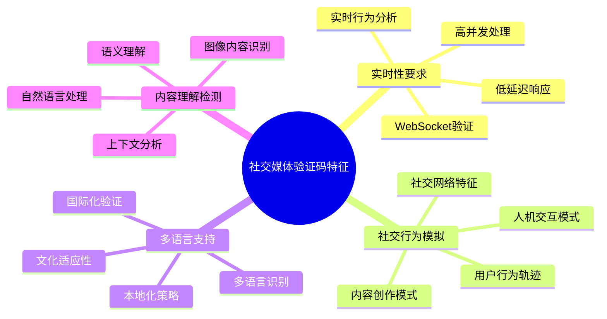

**社交媒体对抗的技术栈：**

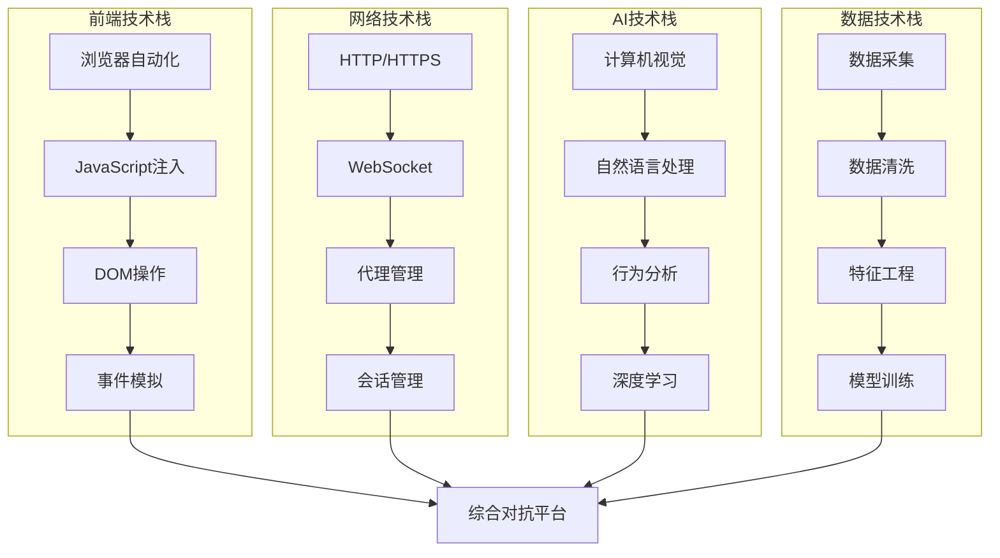

**跨平台适配的技术方案：**

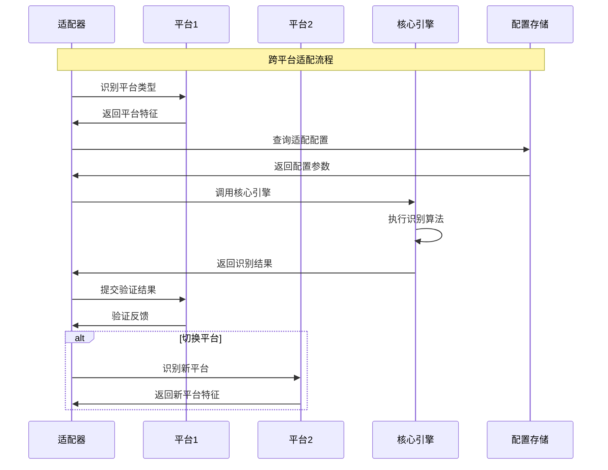

### 8.13.4 政府网站验证码系统应对实践

政府网站的验证码系统通常具有严格的合规要求和特殊的防护机制。

**政府网站验证码的合规特征：**

```mermaid
pyramid
    title 政府网站验证码合规要求

    "无障碍访问<br>(特殊群体支持)" : 25%
    "数据保护<br"(隐私安全)" : 20%
    "审计追踪<br"(操作记录)" : 15%
    "标准化<br"(技术标准)" : 15%
    "安全等级<br"(保护级别)" : 15%
    "服务可用<br"(稳定性)" : 10%
```

**政府网站应对的技术策略：**

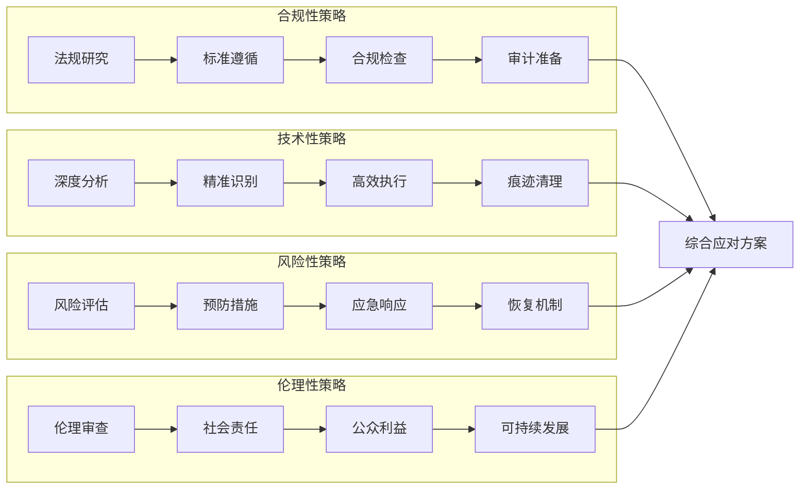

**政府网站验证码的应对流程：**

```mermaid
stateDiagram-v2
    [*] --> 需求分析
    需求分析 --> 合规性评估
    合规性评估 --> 技术可行性分析

    技术可行性分析 --> {合规通过?}

    合规通过 --> 是: 技术方案设计
    合规通过 --> 否: 需求调整

    技术方案设计 --> 风险评估
    风险评估 --> 风险控制措施

    风险控制措施 --> 方案实施
    方案实施 --> 效果监控

    效果监控 --> {效果达标?}

    效果达标 --> 是: 持续优化
    效果达标 --> 否: 方案调整

    方案调整 --> 技术方案设计
    持续优化 --> 经验总结

    经验总结 --> [*]
```

## 8.14 验证码识别技术的未来发展

### 8.14.1 新兴技术趋势预测

验证码识别技术正在经历深刻的技术变革，新兴技术的应用将重塑整个技术格局。

**颠覆性技术的应用前景：**

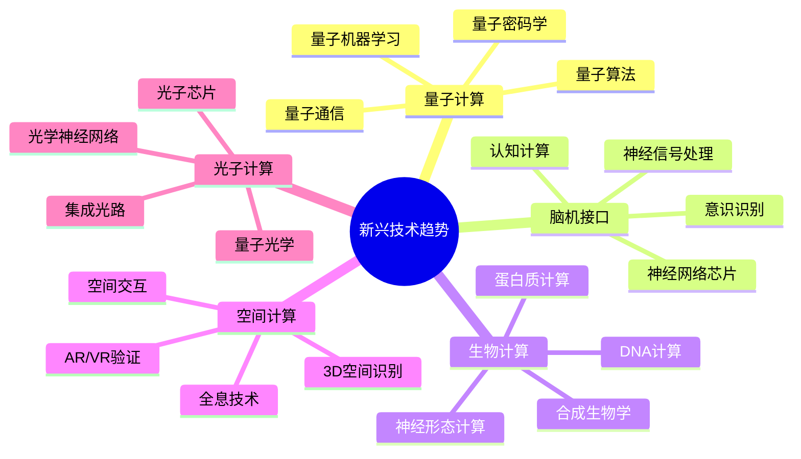

**技术融合的发展趋势：**

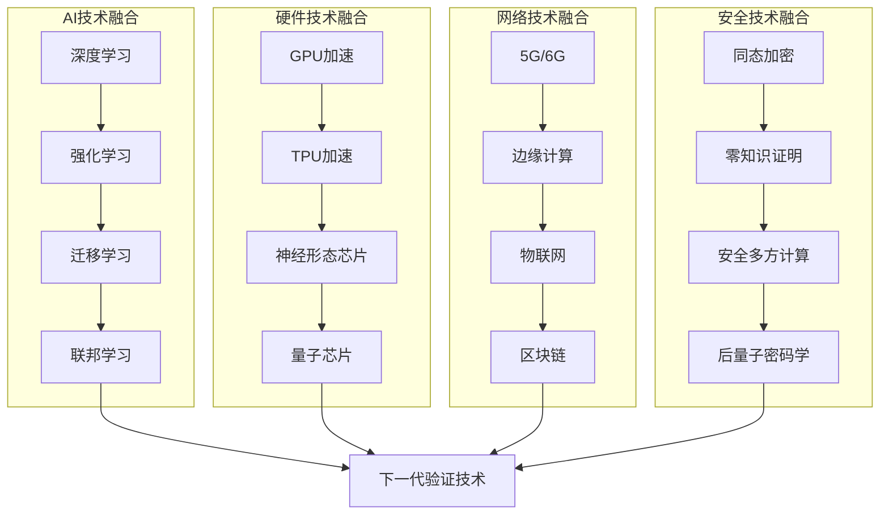

**技术成熟度预测：**

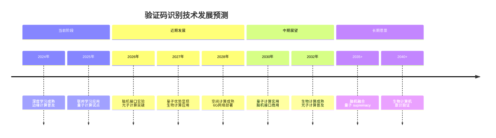

### 8.14.2 产业生态发展展望

验证码识别技术的产业生态将随着技术进步和市场需求的变化而不断演进。

**产业生态的演进路径：**

```mermaid
pyramid
    title 验证码识别产业生态

    "应用服务层<br"(解决方案/咨询服务)" : 20%
    "技术平台层<br"(PaaS/SaaS服务)" : 25%
    "核心算法层<br"(AI模型/算法)" : 30%
    "基础设施层<br"(计算/存储/网络)" : 15%
    "标准规范层<br"(行业标准/法规)" : 10%
```

**商业模式创新方向：**

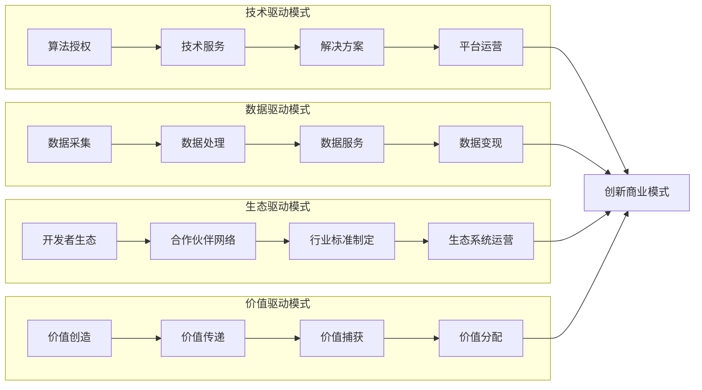

**产业链协同发展机制：**

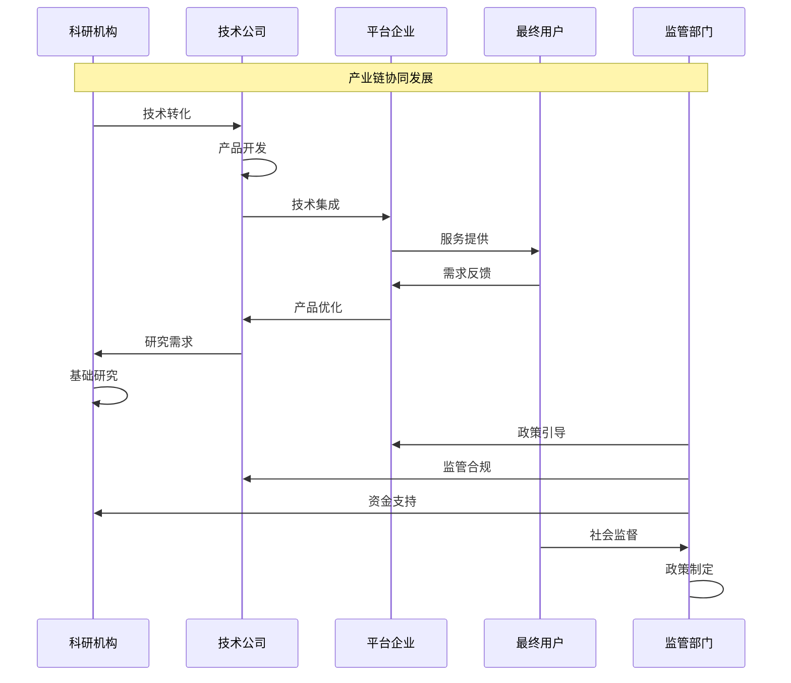

### 8.14.3 技术伦理与社会影响

技术发展必须与社会伦理和价值观相协调，确保技术服务于人类社会的整体利益。

**技术伦理的演进趋势：**

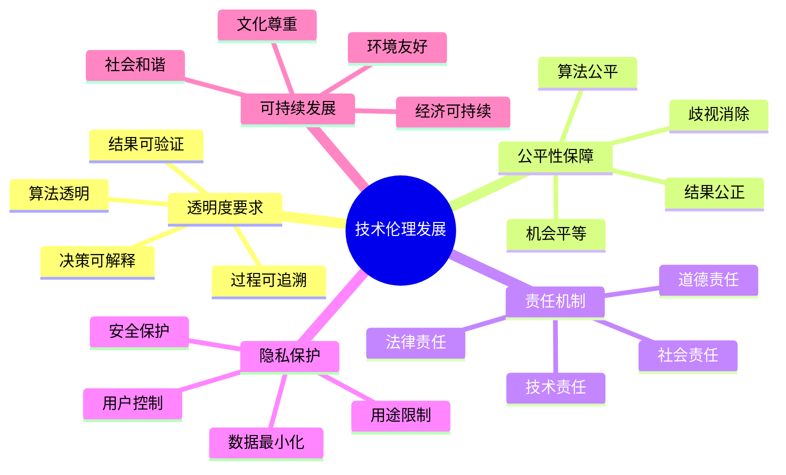

**社会影响的评估框架：**

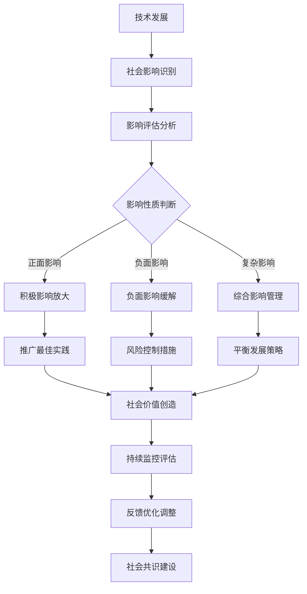

**负责任创新的发展路径：**

```mermaid
graph TB
    subgraph "价值导向"
        A1[人类福祉] --> A2[社会进步]
        A2 --> A3[可持续发展]
        A3 --> A4[文化传承]
    end

    subgraph "过程规范"
        B1[多方参与] --> B2[透明决策]
        B2 --> B3[风险评估]
        B3 --> B4[持续监督]
    end

    subgraph "结果评估"
        C1[效果评估] --> C2[影响分析]
        C2 --> C3[长期监测]
        C3 --> C4[社会反馈]
    end

    subgraph "制度保障"
        D1[法律法规] --> D2[行业标准]
        D2 --> D3[伦理准则]
        D3 --> D4[自律机制]
    end

    A4 --> E[负责任创新]
    B4 --> E
    C4 --> E
    D4 --> E
```

## 总结

### 核心技术要点回顾

本节通过综合实战案例研究和未来发展趋势分析，为验证码识别与对抗技术提供了完整的实践指导和发展展望：

1. **实战案例分析**：掌握不同类型平台验证码系统的对抗策略和技术方案
2. **技术趋势预测**：了解新兴技术的发展趋势和应用前景
3. **产业生态展望**：理解产业生态演进和商业模式创新方向
4. **伦理社会考量**：建立技术伦理框架和社会影响评估机制
5. **未来发展路径**：规划负责任的技术发展路线图

### 实战应用核心经验

通过大量的实战案例分析，我们总结出以下核心经验：

1. **系统性思维**：采用系统性的方法分析和应对复杂的验证码系统
2. **技术适配性**：根据不同场景选择合适的技术方案和策略
3. **风险控制优先**：将风险控制作为技术应用的首要考虑因素
4. **持续学习优化**：建立持续学习和优化的机制，适应技术发展
5. **合规伦理并重**：在追求技术效果的同时重视合规性和伦理要求

### 未来发展建议

面向未来的验证码识别技术发展，需要关注以下关键方向：

1. **技术创新与伦理平衡**：在追求技术创新的同时，重视伦理和社会责任
2. **产业生态协同**：构建健康的产业生态，促进技术可持续发展
3. **国际标准制定**：积极参与国际标准的制定，提升话语权
4. **人才培养体系**：建立完善的人才培养体系，支撑技术发展
5. **社会共识建设**：通过对话和沟通建立技术发展的社会共识

### 结语

验证码识别与对抗技术作为网络安全领域的重要组成部分，将在未来的数字化社会中发挥越来越重要的作用。通过系统性的技术学习、负责任的创新实践、开放的合作交流，我们能够推动这一领域向着更加安全、可靠、可持续的方向发展，为构建更加美好的数字世界贡献力量。

掌握这些知识和技术，不仅能够帮助我们应对当前的技术挑战，更能够为未来的技术发展和社会进步做出积极贡献。让我们携手共同努力，推动验证码识别技术的健康发展，为网络空间的和平、安全、繁荣贡献力量。