# 第8章：验证码识别与对抗技术（四）

## 8.9 高级验证码技术与架构体系

### 8.9.1 智能验证码的技术架构

现代智能验证码已经发展成为集成了多种AI技术的综合性安全系统，采用复杂的技术架构来对抗自动化的识别和破解。

**智能验证码的多层技术架构：**

```mermaid
pyramid
    title 智能验证码技术架构

    "智能决策层<br>(风险评估/动态策略)" : 15%
    "行为分析层<br>(轨迹分析/模式识别)" : 25%
    "AI检测层<br>(深度学习/特征提取)" : 30%
    "数据采集层<br>(多维信息收集)" : 20%
    "基础服务层<br>(存储/计算/网络)" : 10%
```

**智能验证码的核心技术模块：**

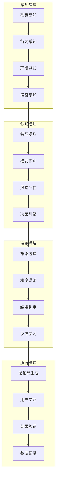

**智能验证码的技术演进路径：**

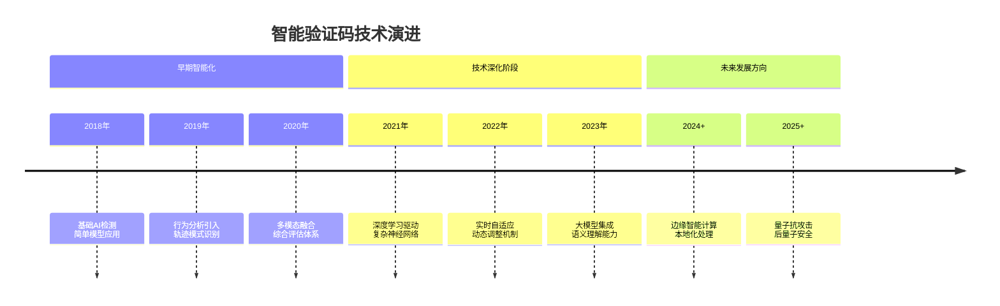

### 8.9.2 行为分析与风险评估技术

行为分析是智能验证码的核心技术，通过分析用户的行为模式来判断其是否为真实用户。

**多维度行为特征分析：**

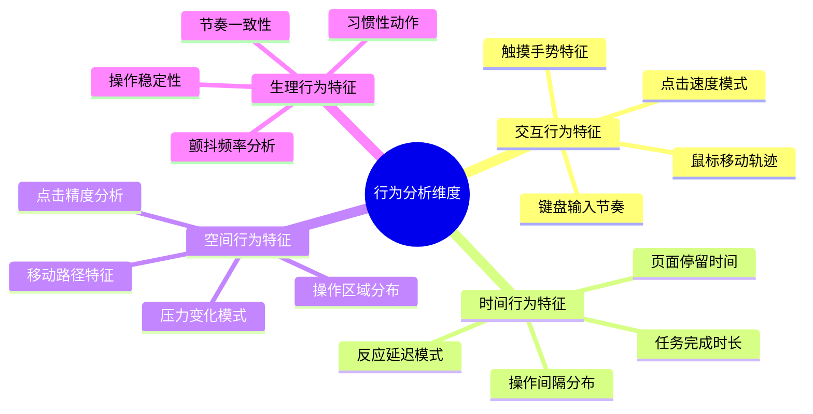

**风险评估的计算模型：**

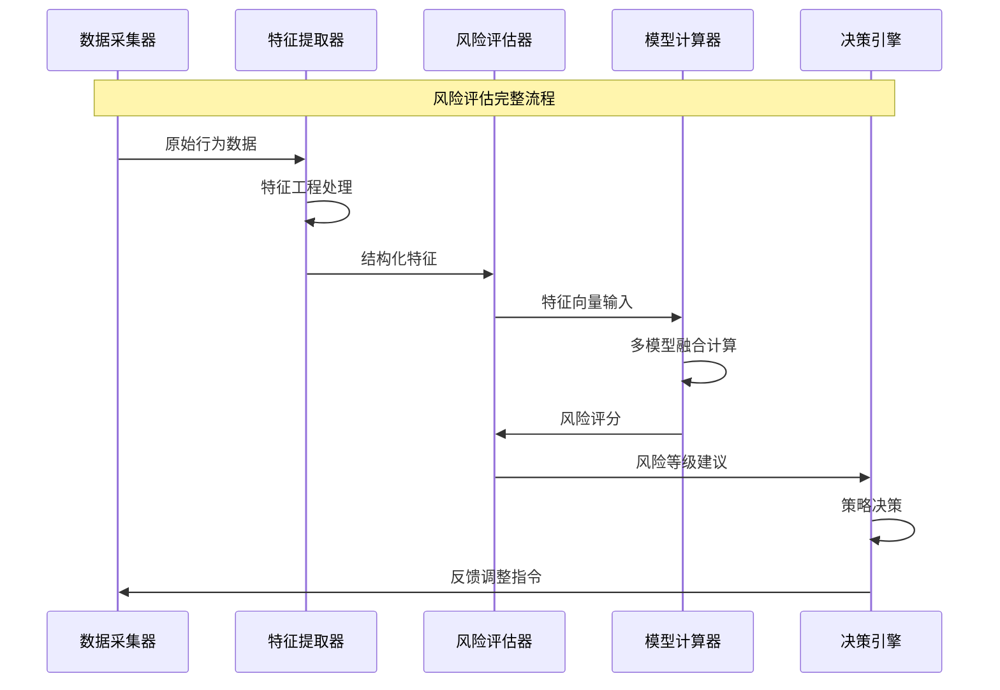

**机器学习模型在风险评估中的应用：**

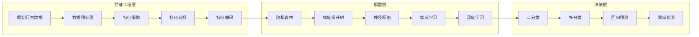

### 8.9.3 多模态融合验证技术

多模态融合验证技术通过结合多种验证方式来提高安全性和用户体验。

**多模态验证的技术架构：**

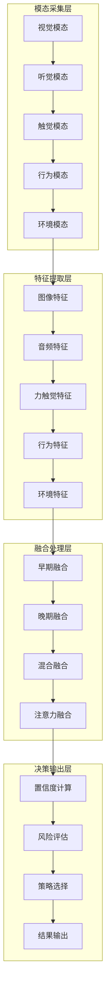

**跨模态注意力机制的技术实现：**

```mermaid
pyramid
    title 跨模态注意力机制层次

    "跨模态语义对齐<br>(概念级关联)" : 25%
    "跨模态特征融合<br>(特征级交互)" : 30%
    "跨模态注意力计算<br>(权重分配)" : 25%
    "单模态特征提取<br>(模态内处理)" : 20%
```

**多模态融合的技术优势分析：**

| 融合策略 | 技术复杂度 | 安全强度 | 用户体验 | 计算开销 | 适用场景 |
|---------|-----------|---------|---------|---------|---------|
| 早期融合 | 中等 | 中等 | 较好 | 中等 | 简单验证 |
| 晚期融合 | 高 | 高 | 好 | 高 | 复杂验证 |
| 混合融合 | 极高 | 极高 | 极好 | 极高 | 高安全场景 |
| 注意力融合 | 极高 | 极高 | 极好 | 高 | AI驱动验证 |

### 8.9.4 实时自适应验证技术

实时自适应验证技术能够根据用户行为和环境变化动态调整验证策略，实现个性化和智能化的验证体验。

**自适应验证的决策机制：**

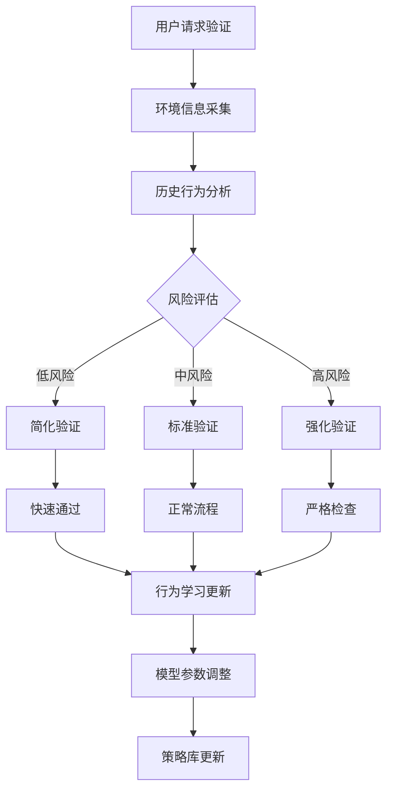

**动态难度调整的算法框架：**

```mermaid
stateDiagram-v2
    [*] --> 风险评估
    风险评估 --> {风险等级判断}

    风险等级判断 --> 低风险: 简化模式
    风险等级判断 --> 中风险: 标准模式
    风险等级判断 --> 高风险: 强化模式

    简化模式 --> 验证执行
    标准模式 --> 验证执行
    强化模式 --> 验证执行

    验证执行 --> {验证结果}

    验证结果 --> 成功: 更新信任等级
    验证结果 --> 失败: 提升风险等级

    更新信任等级 --> 持续监控
    提升风险等级 --> 持续监控

    持续监控 --> 风险评估
```

**机器学习在自适应验证中的应用：**

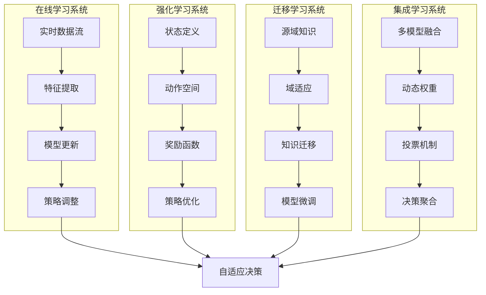

## 8.10 新兴验证码技术与发展趋势

### 8.10.1 生物特征验证技术

生物特征验证技术是验证码发展的重要方向，通过用户的生物特征进行身份验证，具有极高的安全性和便利性。

**生物特征验证的技术分类：**

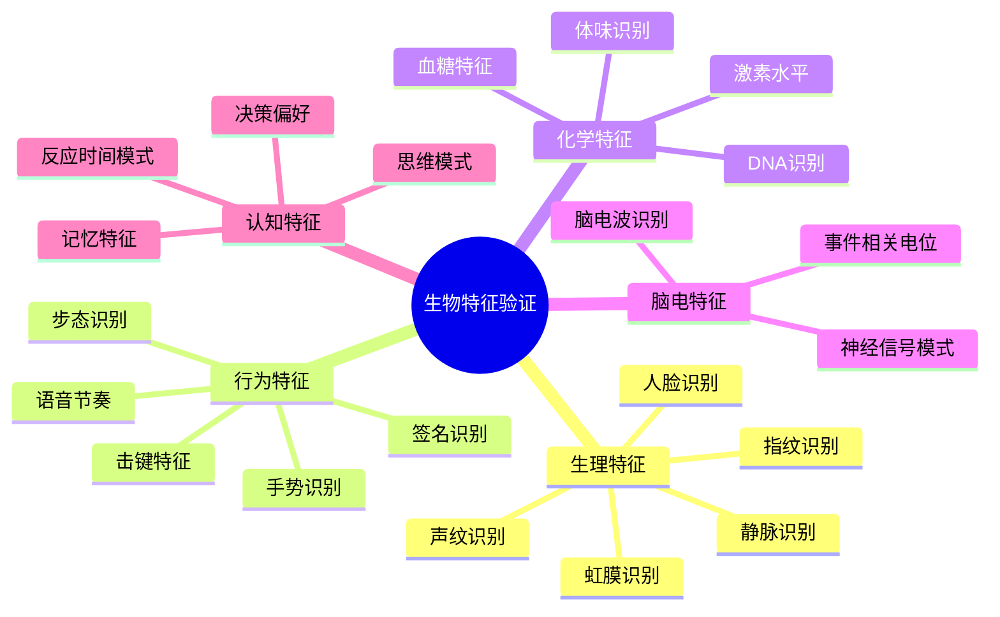

**多模态生物特征融合架构：**

```mermaid
graph LR
    subgraph "采集层"
        A1[指纹传感器] --> A2[摄像头]
        A2 --> A3[麦克风]
        A3 --> A4[其他传感器]
    end

    subgraph "预处理层"
        B1[图像增强] --> B2[信号滤波]
        B2 --> B3[特征提取]
        B3 --> B4[质量评估]
    end

    subgraph "特征层"
        C1[细节特征] --> C2[统计特征]
        C2 --> C3[结构特征]
        C3 --> C4[动态特征]
    end

    subgraph "融合层"
        D1[特征融合] --> D2[分数融合]
        D2 --> D3[决策融合]
        D3 --> D4[加权融合]
    end

    A4 --> B1
    B4 --> C1
    C4 --> D1
    D4 --> E[验证结果]
```

**生物特征验证的安全挑战：**

```mermaid
pyramid
    title 生物特征验证安全挑战

    "活体检测<br>(防伪攻击)" : 25%
    "模板保护<br>(特征安全)" : 20%
    "隐私保护<br>(数据安全)" : 20%
    "跨设备匹配<br>(一致性)" : 15%
    "长期稳定性<br>(特征变化)" : 10%
    "法律合规<br>(监管要求)" : 10%
```

### 8.10.2 量子安全验证技术

量子计算的发展对传统密码学和安全验证技术提出了新的挑战，量子安全验证技术成为未来的重要发展方向。

**量子计算对验证码的威胁分析：**

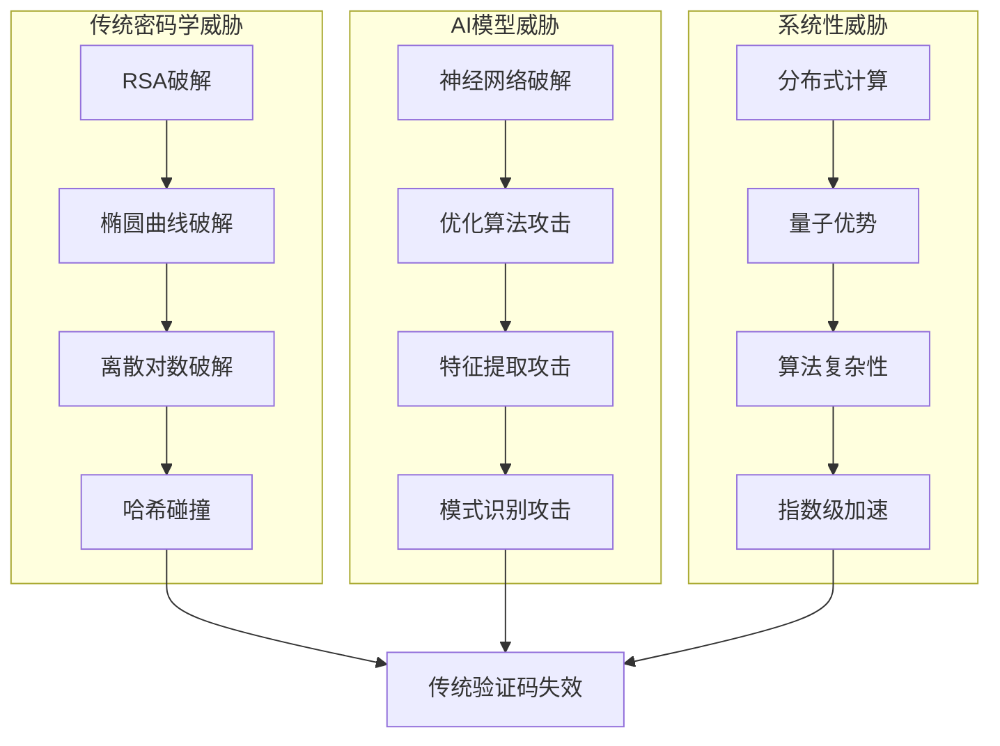

**后量子密码学在验证码中的应用：**

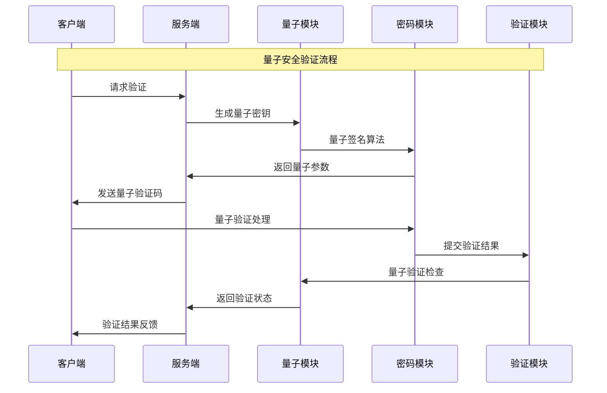

**量子抗攻击验证的技术路径：**

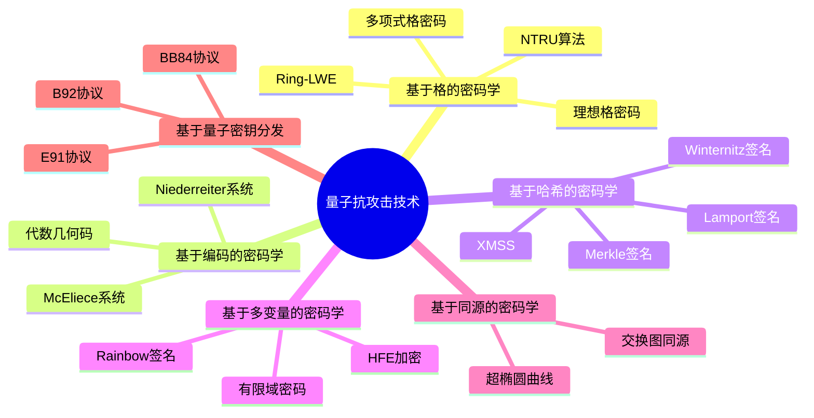

### 8.10.3 边缘计算与分布式验证

边缘计算技术为验证码系统带来了新的架构模式，能够在网络边缘提供更高效、更安全的验证服务。

**边缘计算验证的技术优势：**

```mermaid
pyramid
    title 边缘计算验证优势

    "低延迟响应<br>(本地处理)" : 25%
    "隐私保护<br>(数据不出域)" : 20%
    "高可用性<br>(分布式架构)" : 20%
    "带宽优化<br>(本地缓存)" : 15%
    "弹性扩展<br>(按需部署)" : 10%
    "成本控制<br>(资源优化)" : 10%
```

**分布式边缘验证网络架构：**

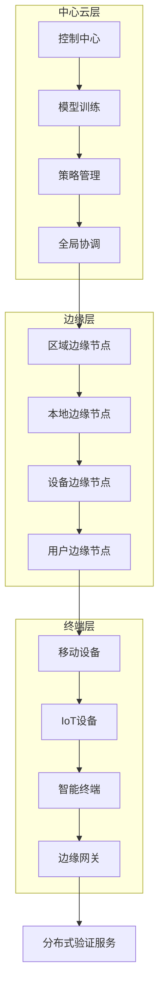

**边缘验证的协同机制：**

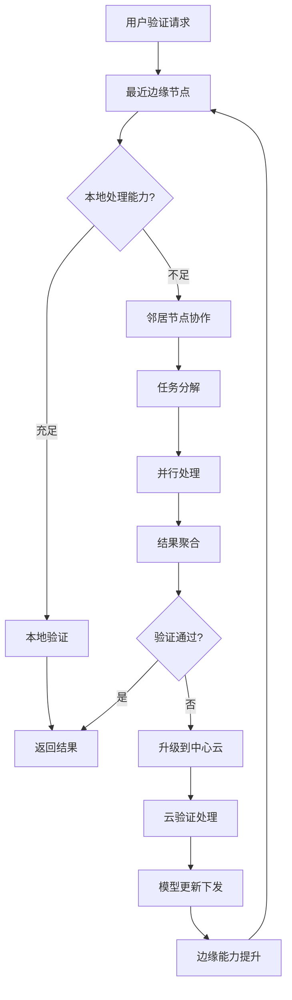

### 8.10.4 联邦学习与隐私保护验证

联邦学习技术能够在保护用户隐私的前提下，实现验证模型的协同训练和优化。

**联邦学习验证的技术架构：**

```mermaid
graph LR
    subgraph "客户端层"
        A1[本地数据] --> A2[本地训练]
        A2 --> A3[梯度加密]
        A3 --> A4[模型更新]
    end

    subgraph "协调层"
        B1[参数服务器] --> B2[聚合算法]
        B2 --> B3[模型融合]
        B3 --> B4[质量评估]
    end

    subgraph "全局层"
        C1[全局模型] --> C2[分发机制]
        C2 --> C3[版本管理]
        C3 --> C4[性能监控]
    end

    A4 --> B1
    B4 --> C1
    C4 --> A1
```

**隐私保护的技术机制：**

```mermaid
mindmap
  root((隐私保护技术))
    差分隐私
      添加噪声
      隐私预算
      敏感性分析
      效用平衡
    同态加密
      部分同态
      全同态
      密文计算
      安全多方计算
    联邦学习
      本地训练
      安全聚合
      模型融合
      隐私保护
    零知识证明
      交互式证明
      非交互式证明
      简洁证明
      可验证计算
    安全多方计算
      秘密共享
      混淆电路
      不经意传输
      安全计算
```

**联邦学习验证的通信协议：**

```mermaid
sequenceDiagram
    participant Client1 as 客户端1
    participant Client2 as 客户端2
    participant Server as 参数服务器
    participant Aggregator as 聚合器
    participant Validator as 验证器

    Note over Client1,Validator: 联邦学习验证流程

    par 并行本地训练
        Client1->>Client1: 本地模型训练
        Client2->>Client2: 本地模型训练
    end

    Client1->>Server: 提交加密梯度
    Client2->>Server: 提交加密梯度

    Server->>Aggregator: 转发梯度数据
    Aggregator->>Aggregator: 安全聚合计算
    Aggregator->>Validator: 聚合结果验证

    Validator->>Server: 验证通过确认
    Server->>Client1: 全局模型更新
    Server->>Client2: 全局模型更新

    Client1->>Client1: 验证性能测试
    Client2->>Client2: 验证性能测试
```

## 总结

### 核心技术要点回顾

本节深入探讨了高级验证码技术和未来发展趋势，构建了完整的技术前瞻视野：

1. **智能验证码架构**：理解多层技术架构和核心模块设计，掌握AI驱动的验证技术
2. **行为分析技术**：掌握多维度行为特征分析和风险评估计算模型
3. **多模态融合**：理解跨模态验证技术和注意力机制的应用
4. **自适应验证**：掌握实时自适应验证的决策机制和动态调整算法
5. **新兴技术趋势**：了解生物特征、量子安全、边缘计算等前沿技术方向

### 技术发展趋势总结

验证码技术正在向更加智能、安全、隐私保护的方向发展：

- **智能化深度发展**：大模型、深度学习在验证技术中的深入应用
- **多模态融合**：结合多种验证方式的综合性安全技术
- **量子安全防护**：抗量子攻击的新一代验证技术
- **边缘分布式**：基于边缘计算的分布式验证架构
- **隐私保护优先**：以隐私保护为核心的验证技术发展

### 未来发展建议

面向未来的验证码技术发展，需要关注以下关键方向：

1. **技术创新驱动**：持续关注前沿技术在验证领域的应用创新
2. **用户体验优化**：在保证安全性的前提下提升用户体验
3. **隐私保护强化**：将隐私保护作为技术发展的核心要求
4. **标准化建设**：推动行业技术标准和最佳实践的建立
5. **伦理合规考量**：注重技术发展中的伦理和法律合规问题

掌握这些前沿技术和发展趋势，能够帮助我们更好地应对未来验证码技术的挑战，为网络安全和用户体验的平衡提供技术支撑。通过持续的技术创新和应用实践，验证码技术将在未来的网络安全体系中发挥更加重要的作用。