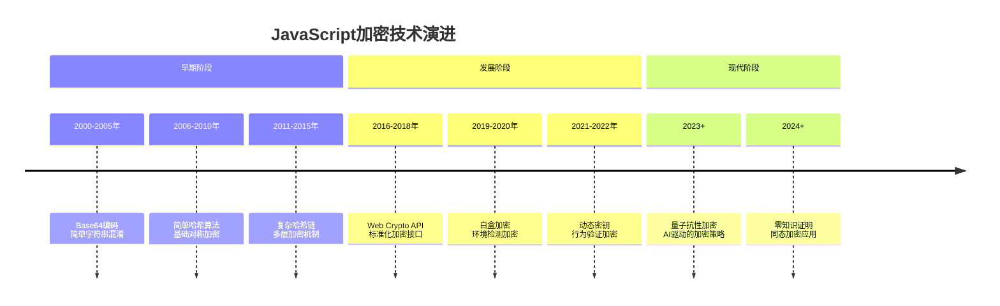
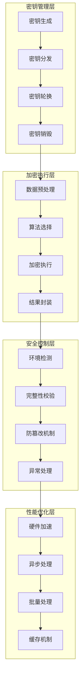
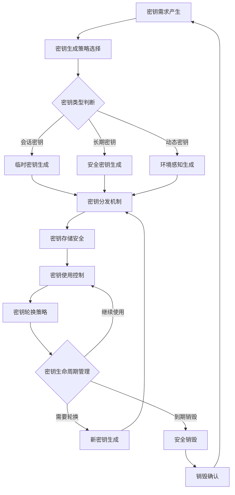
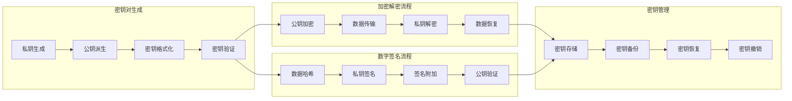
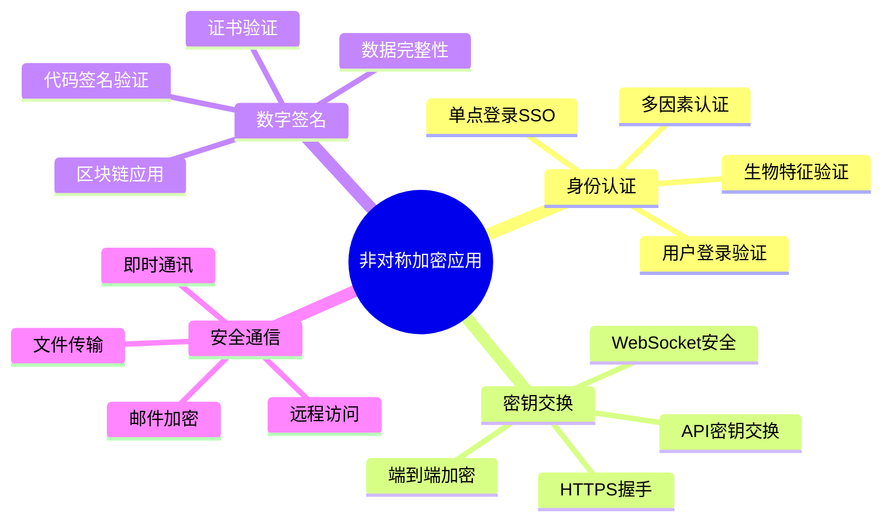
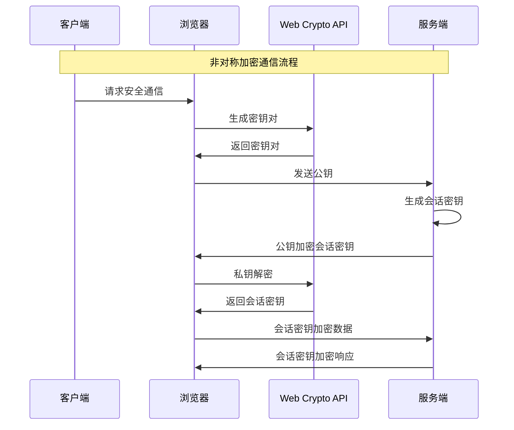
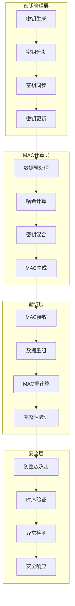
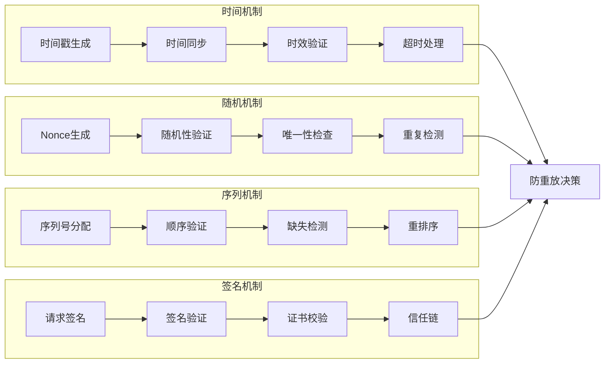
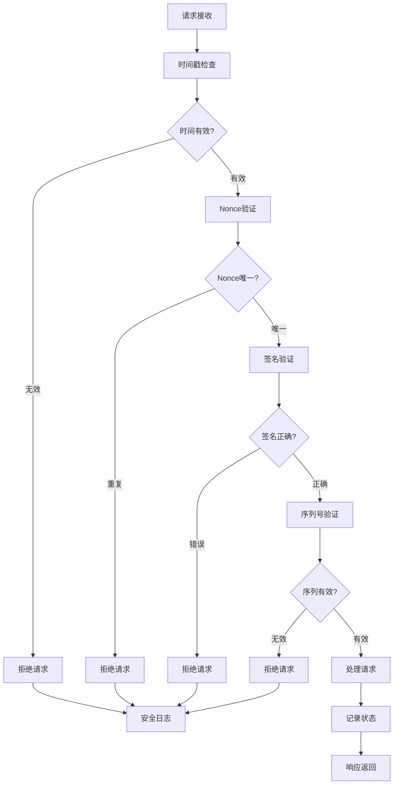
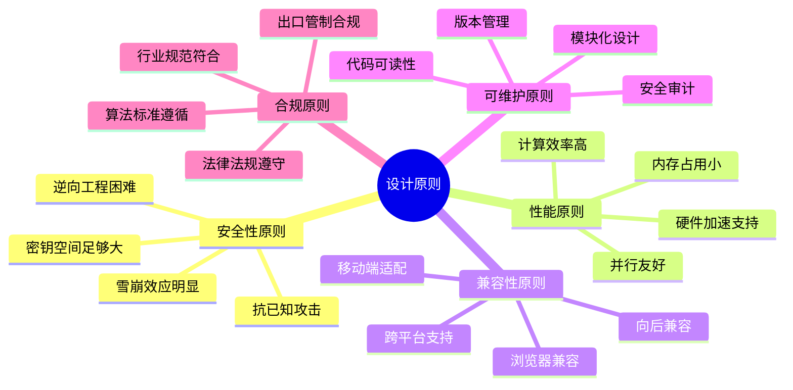

# 第9章：JavaScript加密与混淆破解（一）

## 9.1 现代JavaScript加密技术体系

### 9.1.1 前端加密技术演进历程

JavaScript加密技术作为前端安全的重要组成部分，经历了从简单到复杂、从单一到综合的技术演进过程。现代大型网站广泛采用复杂的加密机制来保护数据传输和业务逻辑。

**前端加密技术的发展阶段：**



**现代前端加密的技术特征：**

```mermaid
pyramid
    title 现代前端加密技术特征

    "智能化<br>(AI驱动/自适应)" : 20%
    "动态化<br>(运行时生成/环境感知)" : 25%
    "标准化<br"(Web Crypto API/行业标准)" : 15%
    "多层次<br"(多层防护/深度防御)" : 20%
    "性能优化<br"(硬件加速/异步处理)" : 20%
```

### 9.1.2 对称加密算法的前端应用

对称加密算法在现代Web应用中广泛用于敏感数据的加密传输，特别是对于需要实时处理的数据场景。

**对称加密在前端的技术架构：**



**大型网站对称加密的实战应用模式：**

| 应用场景 | 加密算法 | 密钥管理 | 性能要求 | 安全等级 | 典型案例 |
|---------|---------|---------|---------|---------|---------|
| 用户登录 | AES-256-GCM | 动态密钥 | 高 | 极高 | 银行/金融 |
| 数据传输 | AES-128-CBC | 会话密钥 | 极高 | 高 | 电商平台 |
| 本地存储 | ChaCha20-Poly1305 | 固定密钥 | 中等 | 中等 | 社交应用 |
| API通信 | AES-256-CTR | 短期密钥 | 高 | 极高 | 企业服务 |
| 实时通信 | AES-GCM-SIV | 动态生成 | 极高 | 高 | 即时通讯 |

**对称加密密钥管理的最佳实践：**



### 9.1.3 非对称加密与数字签名技术

非对称加密技术在前端主要用于密钥交换、数字签名和身份验证，为现代Web应用提供了强大的安全保障。

**非对称加密的技术体系架构：**



**大型网站非对称加密的应用场景分析：**



**Web Crypto API在非对称加密中的应用：**



### 9.1.4 哈希算法与消息认证码

哈希算法和消息认证码（MAC）是现代Web应用中保证数据完整性和进行身份验证的核心技术。

**哈希算法的技术演进与应用层次：**

```mermaid
pyramid
    title 哈希算法技术层次

    "量子抗性哈希<br>(SHA-3/BLAKE3)" : 15%
    "现代安全哈希<br>(SHA-256/SHA-512)" : 25%
    "性能优化哈希<br"(SHA-1优化/MD5变体)" : 20%
    "轻量级哈希<br>(CRC/校验和)" : 15%
    "传统哈希<br>(MD5/SHA-1)" : 10%
    "自定义哈希<br"(业务特定算法)" : 15%
```

**消息认证码的技术架构：**



**大型网站哈希应用的实战策略：**

| 应用类型 | 哈希算法 | 盐值策略 | 性能考量 | 安全等级 | 实际案例 |
|---------|---------|---------|---------|---------|---------|
| 密码存储 | Argon2id/Bcrypt | 随机盐值 | 中等 | 极高 | 用户认证 |
| 数据完整性 | SHA-256 HMAC | 固定密钥 | 高 | 高 | API通信 |
| 文件校验 | SHA-256 | 无 | 极高 | 中等 | 文件传输 |
| 缓存键 | xxHash/MurmurHash | 无 | 极高 | 低 | 缓存系统 |
| 数字指纹 | SHA-512 | 业务盐值 | 高 | 高 | 内容去重 |

### 9.1.5 时间戳与防重放机制

时间戳和防重放机制是现代Web应用中防止重放攻击、保证交易安全的重要技术手段。

**防重放攻击的技术体系：**



**多层防重放保护策略：**



### 9.1.6 自定义加密算法的设计原理

大型网站出于特定业务需求和安全考虑，经常开发自定义加密算法来增强安全防护能力。

**自定义加密算法的设计原则：**



**自定义加密算法的开发流程：**

```mermaid
sequenceDiagram
    participant Security as 安全团队
    participant Dev as 开发团队
    participant QA as 测试团队
    participant Audit as 审计团队
    Expert as 外部专家

    Note over Security,Expert: 自定义加密算法开发流程

    Security->>Dev: 安全需求定义
    Dev->>Dev: 算法设计实现
    Dev->>QA: 提交测试版本

    QA->>QA: 功能测试
    QA->>QA: 性能测试
    QA->>QA: 安全测试

    QA->>Audit: 测试报告
    Audit->>Audit: 安全审计
    Audit->>Expert: 外部评估

    Expert->>Expert: 密码学分析
    Expert->>Security: 评估报告

    Security->>Dev: 优化建议
    Dev->>Dev: 算法优化
    Dev->>QA: 优化版本

    QA->>Security: 验证通过
    Security->>Security: 发布批准
```

**大型网站自定义加密的实战案例：**

```mermaid
pyramid
    title 自定义加密应用领域

    "业务逻辑保护<br>(核心算法/商业秘密)" : 30%
    "数据传输加密<br"(通信协议/接口安全)" : 25%
    "用户认证增强<br"(多因素认证/生物特征)" : 20%
    "版权保护<br"(数字水印/内容保护)" : 15%
    "合规性要求<br"(数据本地化/审计追踪)" : 10%
```

## 总结

### 核心技术要点回顾

本节深入探讨了现代JavaScript加密技术的完整体系，构建了系统化的技术知识框架：

1. **技术演进理解**：掌握前端加密技术从简单到复杂的发展历程和技术特征
2. **对称加密应用**：理解对称加密在前端的技术架构和实战应用模式
3. **非对称加密技术**：掌握非对称加密的技术体系和大型网站应用场景
4. **哈希与MAC**：理解哈希算法和消息认证码的技术架构和策略选择
5. **防重放机制**：掌握时间戳、Nonce等多层防重放保护策略
6. **自定义算法设计**：了解自定义加密算法的设计原则和开发流程

### 实战应用指导

在实际的大型网站应用中，JavaScript加密技术的选择和实施需要遵循以下核心原则：

1. **安全优先原则**：始终将安全性作为技术选择的首要考量
2. **性能平衡原则**：在安全性和性能之间找到最佳平衡点
3. **标准化倾向**：优先选择成熟的标准加密算法和接口
4. **多层防护策略**：采用多种技术手段构建深度防御体系
5. **合规性保障**：确保加密技术应用符合相关法律法规要求

### 技术发展趋势

JavaScript加密技术正在向更加智能化、标准化、高性能化的方向发展：

- **量子安全加密**：抗量子计算攻击的新一代加密算法
- **AI驱动加密**：基于人工智能的自适应加密策略
- **硬件加速加密**：利用专用硬件提升加密性能
- **零知识证明**：在保护隐私的同时验证数据真实性
- **同态加密应用**：在加密状态下进行数据计算和处理

掌握这些现代JavaScript加密技术，能够帮助我们更好地理解和应对大型网站的复杂加密机制，为构建安全可靠的Web应用提供重要的技术支撑。通过持续的学习和实践，我们能够在这个快速发展的技术领域中保持竞争力。