# 第9章：JavaScript加密与混淆破解（三）

## 9.4 Hook技术与代码拦截

### 9.4.1 JavaScript Hook的实现原理

JavaScript Hook技术是一种在运行时拦截和修改函数行为的强大技术，通过函数劫持、原型链修改等手段实现对代码执行流程的精确控制。

**Hook技术的技术架构：**

```mermaid
pyramid
    title JavaScript Hook技术层次

    "应用层Hook<br>(业务逻辑/用户交互)" : 15%
    "框架层Hook<br"(React/Vue/Angular)" : 20%
    "API层Hook<br"(DOM/BOM/网络接口)" : 30%
    "引擎层Hook<br"(V8引擎/执行环境)" : 25%
    "系统层Hook<br"(浏览器内核/操作系统)" : 10%
```

**Hook技术的分类体系：**

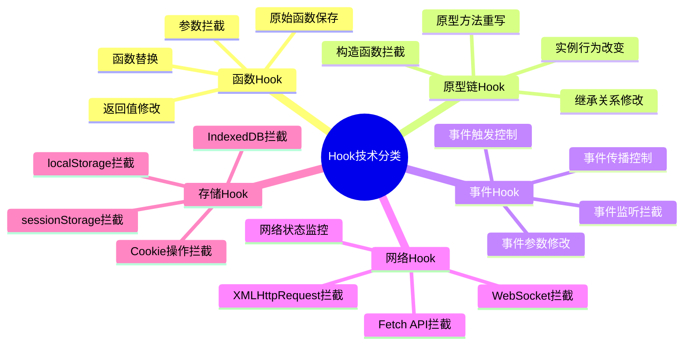

**Hook机制的技术实现流程：**

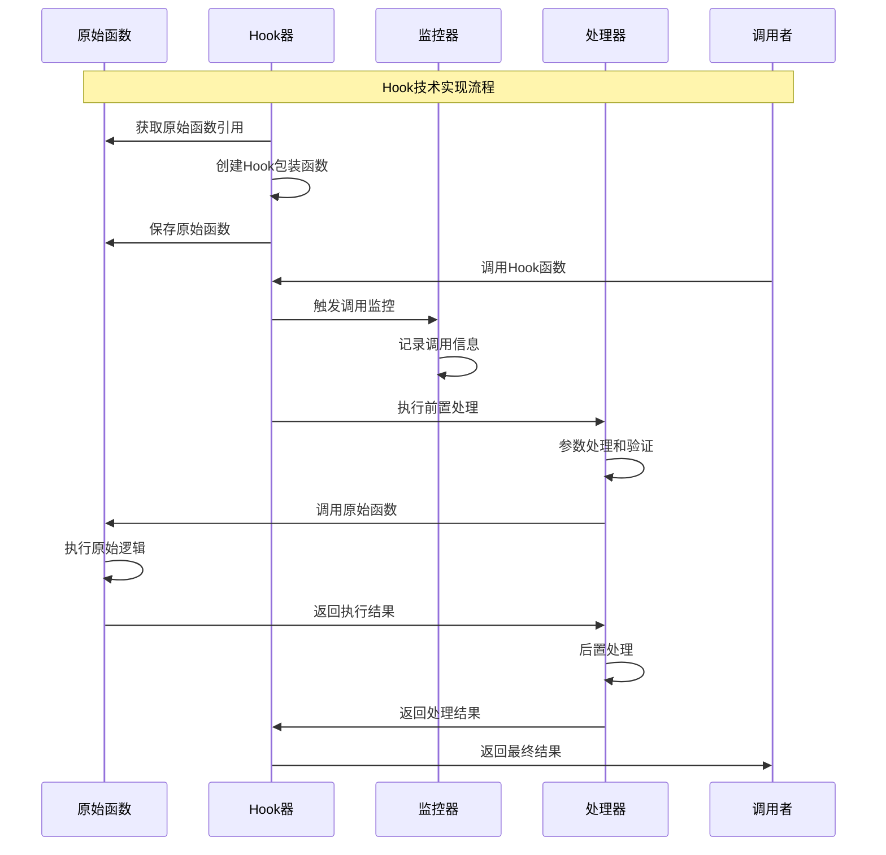

### 9.4.2 函数劫持与API拦截技术

函数劫持是Hook技术的核心实现方式，通过对JavaScript函数和API的拦截来实现对代码执行行为的控制。

**函数劫持的技术机制：**

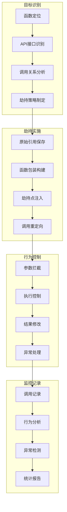

**大型网站API拦截的实战应用：**

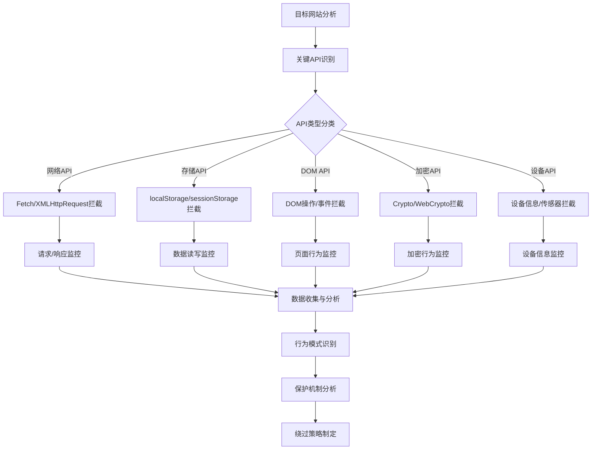

**API拦截的技术对比分析：**

| API类型 | 拦截难度 | 检测风险 | 数据价值 | 实现复杂度 | 典型应用 |
|---------|---------|---------|---------|-----------|---------|
| 网络API | 中等 | 中等 | 极高 | 中等 | 数据抓取 |
| 存储API | 低 | 低 | 高 | 低 | 状态分析 |
| DOM API | 中等 | 高 | 中等 | 中等 | 行为分析 |
| 加密API | 高 | 极高 | 极高 | 高 | 密钥获取 |
| 设备API | 中等 | 中等 | 中等 | 中等 | 指纹识别 |

### 9.4.3 DOM事件监听与数据捕获

DOM事件Hook技术是理解用户交互行为、分析页面逻辑和捕获敏感数据的重要手段。

**DOM事件Hook的技术架构：**

```mermaid
graph LR
    subgraph "事件系统"
        A1[事件捕获] --> A2[事件处理]
        A2 --> A3[事件冒泡]
        A3 --> A4[事件委托]
    end

    subgraph "Hook点设置"
        B1[原生事件Hook] --> B2[自定义事件Hook]
        B2 --> B3[框架事件Hook]
        B3 --> B4[合成事件Hook]
    end

    subgraph "数据捕获"
        C1[事件参数] --> C2[目标元素]
        C2 --> C3[上下文信息]
        C3 --> C4[执行环境]
    end

    subgraph "行为分析"
        D1[用户行为] --> D2[页面交互]
        D2 --> D3[业务逻辑]
        D3 --> D4[安全检测]
    end

    A4 --> B1
    B4 --> C1
    C4 --> D1
```

**事件Hook的实现策略：**

```mermaid
stateDiagram-v2
    [*] --> 事件系统初始化
    事件系统初始化 --> 原生方法保存
    原生方法保存 --> Hook函数构建

    Hook函数构建 --> 事件拦截设置
    事件拦截设置 --> {事件触发检测}

    事件触发检测 --> 事件触发: 捕获事件
    事件触发检测 --> 无事件: 持续监听

    捕获事件 --> 事件信息提取
    事件信息提取 --> 数据处理

    数据处理 --> {需要修改?}

    需要修改 --> 是: 事件数据修改
    需要修改 --> 否: 原样传递

    事件数据修改 --> 事件触发
    原样传递 --> 事件触发

    事件触发 --> 响应处理
    响应处理 --> 数据记录

    数据记录 --> 持续监听
    持续监听 --> 事件触发检测
```

### 9.4.4 网络请求拦截与修改

网络请求拦截是Hook技术中最有价值的应用之一，通过拦截和修改网络请求来获取敏感数据或绕过安全检查。

**网络拦截的技术体系：**

```mermaid
pyramid
    title 网络拦截技术层次

    "应用层拦截<br"(业务API/自定义协议)" : 25%
    "HTTP层拦截<br"(请求/响应/Headers)" : 30%
    "传输层拦截<br"(TCP/UDP连接)" : 20%
    "网络层拦截<br"(IP包/路由)" : 15%
    "物理层拦截<br"(网卡/驱动)" : 10%
```

**多层网络拦截架构：**

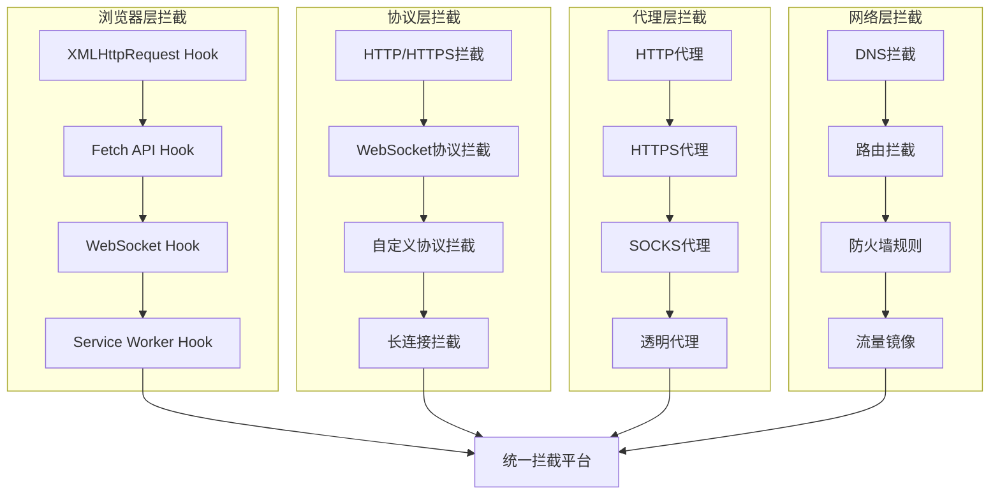

**大型网站网络拦截的实战案例：**

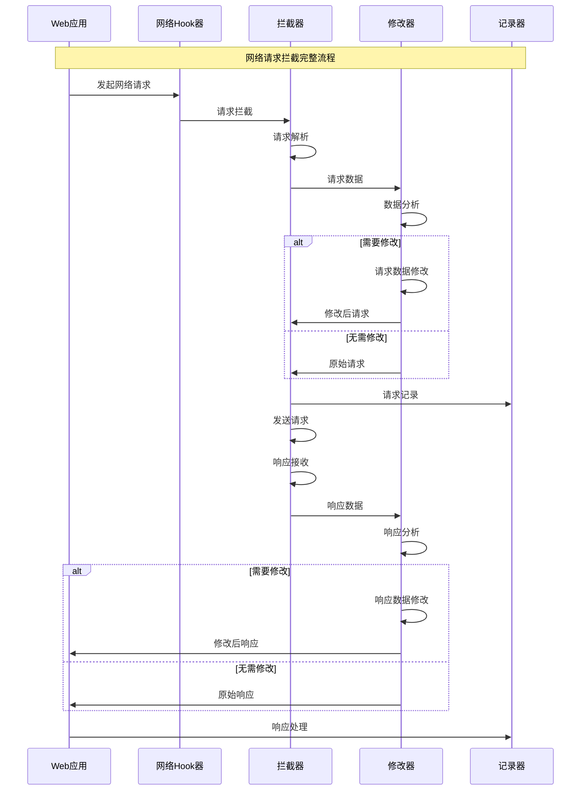

### 9.4.5 运行时代码注入与修改

运行时代码注入技术通过在JavaScript运行时动态注入代码来修改程序行为，是高级Hook技术的重要组成部分。

**代码注入的技术分类：**

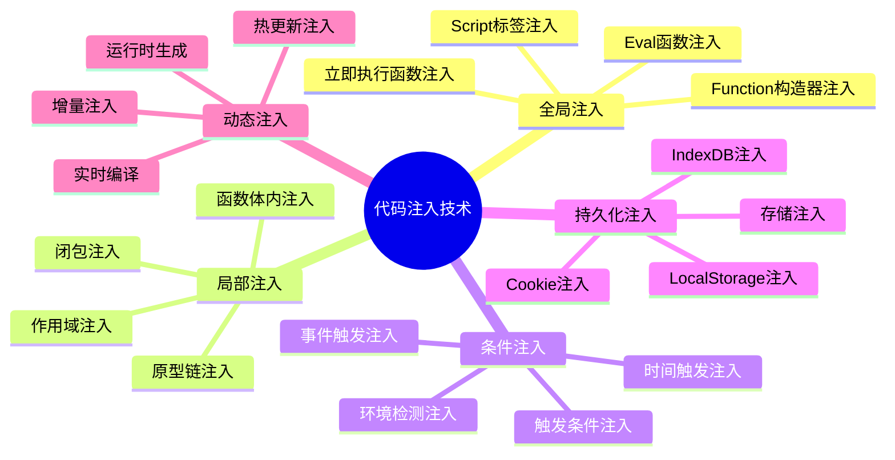

**代码注入的技术架构：**

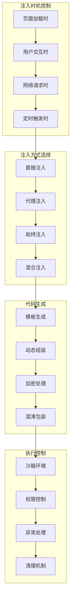

## 9.5 自动化脱混淆工具开发

### 9.5.1 静态分析与代码重构技术

静态分析是自动化脱混淆的第一步，通过分析代码结构、语法树和依赖关系来理解混淆代码的逻辑。

**静态分析的技术架构：**

```mermaid
pyramid
    title 静态分析技术层次

    "语义分析<br"(程序逻辑/数据流)" : 30%
    "语法分析<br"(AST/语法树)" : 25%
    "词法分析<br"(Token/标识符)" : 20%
    "结构分析<br"(控制流/依赖图)" : 15%
    "模式分析<br"(混淆特征/算法识别)" : 10%
```

**AST分析与处理的技术流程：**

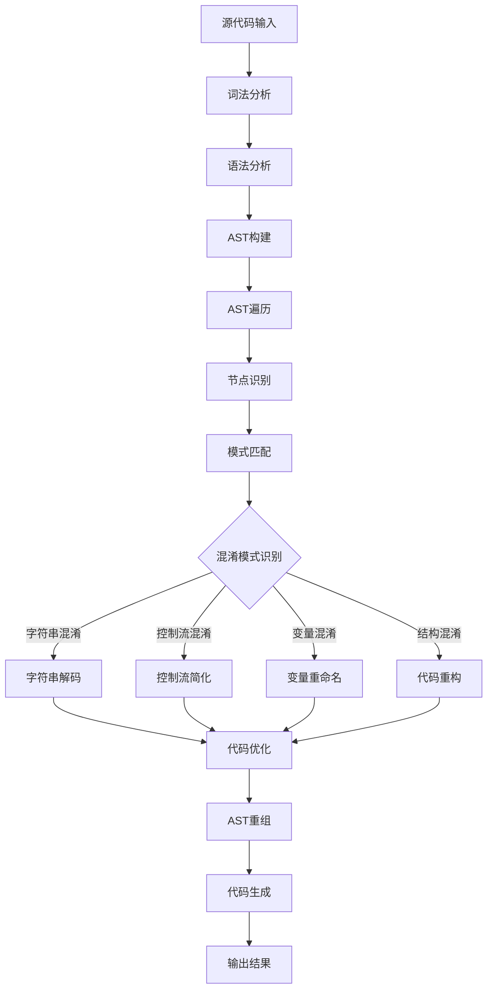

**大型网站混淆代码的静态分析策略：**

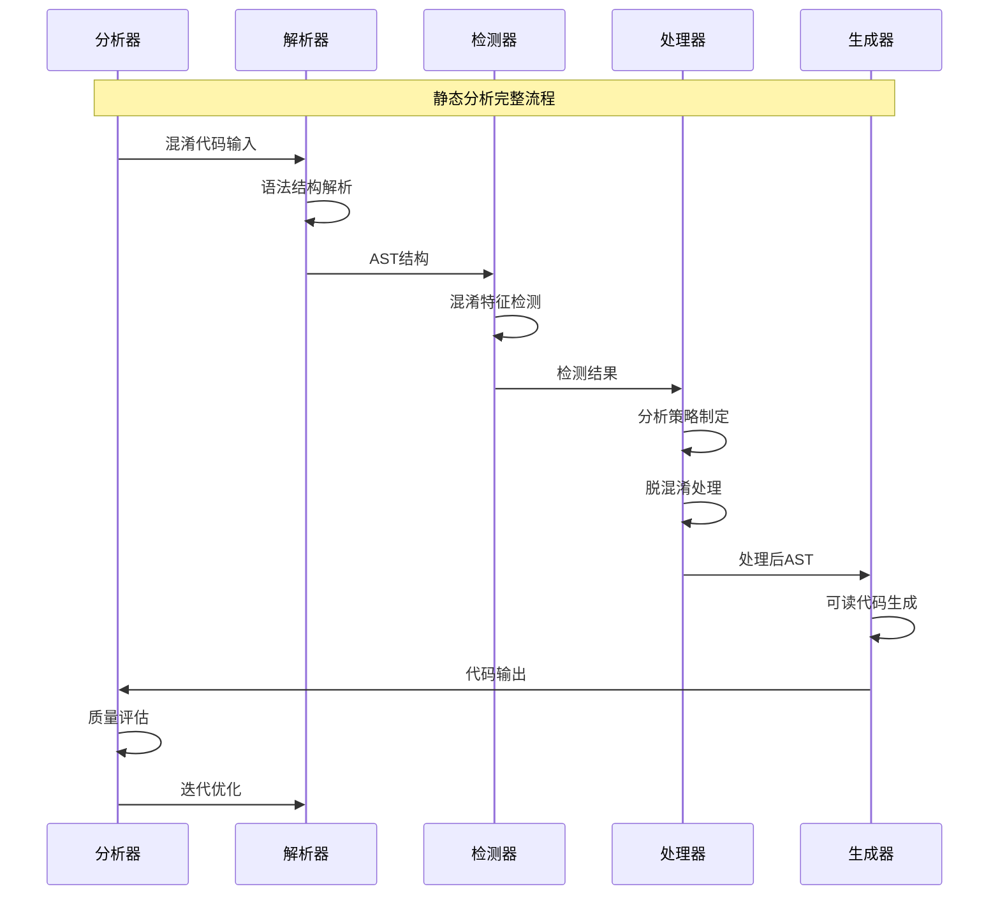

### 9.5.2 符号执行与控制流恢复

符号执行技术通过模拟代码执行路径来恢复被混淆的控制流，是高级脱混淆的重要手段。

**符号执行的技术机制：**

```mermaid
graph LR
    subgraph "路径探索"
        A1[路径枚举] --> A2[约束求解]
        A2 --> A3[路径剪枝]
        A3 --> A4[路径合并]
    end

    subgraph "符号状态"
        B1[变量符号化] --> B2[表达式简化]
        B2 --> B3[约束传播]
        B3 --> B4[状态合并]
    end

    subgraph "约束求解"
        C1[约束收集] --> C2[约束分类]
        C2 --> C3[求解器选择]
        C3 --> C4[结果验证]
    end

    subgraph "控制流恢复"
        D1[死路径删除] --> D2[条件简化]
        D2 --> D3[循环优化]
        D3 --> D4[结构重组]
    end

    A4 --> B1
    B4 --> C1
    C4 --> D1
```

**控制流恢复的技术策略：**

```mermaid
stateDiagram-v2
    [*] --> 控制流图构建
    控制流图构建 --> 基本块识别
    基本块识别 --> 边关系分析

    边关系分析 --> {存在混淆?}

    存在混淆 --> 是: 不透明谓词检测
    存在混淆 --> 否: 控制流优化

    不透明谓词检测 --> 谓词简化
    谓词简化 --> 死代码删除

    死代码删除 --> 循环结构分析
    循环结构分析 --> 循环简化

    循环简化 --> 控制流优化
    控制流优化 --> {可进一步优化?}

    可进一步优化 --> 是: 基本块识别
    可进一步优化 --> 否: 结构化重构

    结构化重构 --> [*]: 完成恢复
```

### 9.5.3 AST抽象语法树分析与处理

AST技术是现代JavaScript代码分析和转换的核心，通过操作抽象语法树来实现自动化的代码处理。

**AST处理的技术架构：**

```mermaid
pyramid
    title AST处理技术层次

    "代码生成<br"(源码重构/美化)" : 20%
    "代码转换<br"(优化/脱混淆)" : 25%
    "代码分析<br"(语义/结构)" : 30%
    "语法分析<br"(解析/验证)" : 15%
    "词法分析<br"(Token/扫描)" : 10%
```

**AST操作的技术流程：**

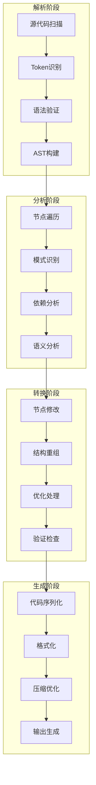

**大型网站AST处理的实战应用：**

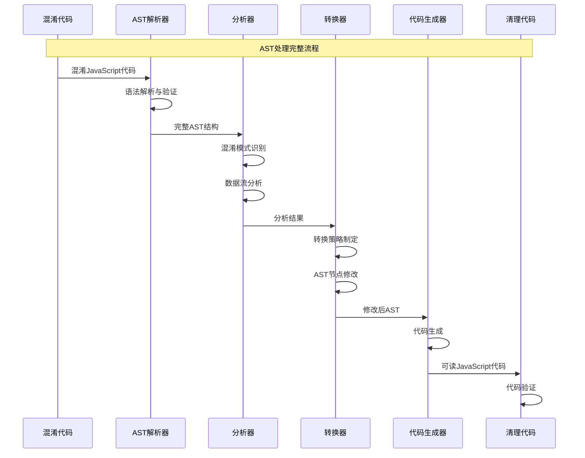

### 9.5.4 模式识别与自动化工具链

模式识别技术通过机器学习和规则引擎来自动识别混淆模式，构建自动化的脱混淆工具链。

**模式识别的技术体系：**

```mermaid
mindmap
  root((模式识别技术))
    基于规则的方法
      正则表达式匹配
      语法模式匹配
      结构模式识别
      行为模式分析
    基于统计的方法
      频率统计分析
      概率分布分析
      相关性分析
      异常检测
    基于机器学习的方法
      监督学习分类
      无监督学习聚类
      深度学习识别
      强化学习优化
    混合方法
      规则+统计
      统计+机器学习
      多模型融合
      层次化识别
```

**自动化工具链的架构设计：**

```mermaid
graph TB
    subgraph "输入层"
        A1[代码获取] --> A2[格式标准化]
        A2 --> A3[预处理]
        A3 --> A4[质量检查]
    end

    subgraph "分析层"
        B1[静态分析] --> B2[动态分析]
        B2 --> B3[模式识别]
        B3 --> B4[威胁评估]
    end

    subgraph "处理层"
        C1[脱混淆引擎] --> C2[代码优化]
        C2 --> C3[结构重组]
        C3 --> C4[质量验证]
    end

    subgraph "输出层"
        D1[代码生成] --> D2[文档生成]
        D2 --> D3[报告生成]
        D3 --> D4[结果输出]
    end

    subgraph "控制层"
        E1[任务调度] --> E2[流程控制]
        E2 --> E3[错误处理]
        E3 --> E4[性能监控]
    end

    A4 --> B1
    B4 --> C1
    C4 --> D1
    E1 --> A1
```

**机器学习辅助的代码还原：**

```mermaid
sequenceDiagram
    participant Training as 训练系统
    participant Model as ML模型
    participant Recognition as 识别系统
    participant Deobfuscator as 脱混淆器
    participant Validator as 验证器

    Note over Training,Validator: 机器学习辅助脱混淆流程

    Training->>Model: 训练数据集
    Model->>Model: 模型训练
    Model->>Recognition: 训练完成模型

    Recognition->>Recognition: 混淆代码分析
    Recognition->>Model: 混淆特征输入
    Model->>Model: 模式识别预测
    Model->>Recognition: 识别结果

    Recognition->>Deobfuscator: 混淆模式信息
    Deobfuscator->>Deobfuscator: 脱混淆策略执行
    Deobfuscator->>Validator: 处理后代码

    Validator->>Validator: 质量评估
    Validator->>Training: 反馈数据
    Training->>Model: 模型优化

    Validator->>Recognition: 验证结果
    Recognition->>Recognition: 结果输出
```

## 总结

### 核心技术要点回顾

本节深入探讨了Hook技术和自动化脱混淆工具开发，构建了完整的技术实现体系：

1. **Hook技术原理**：掌握JavaScript Hook的实现机制和分类体系
2. **函数劫持技术**：理解函数劫持和API拦截的实现策略
3. **事件Hook方法**：掌握DOM事件监听和数据捕获的技术手段
4. **网络拦截技术**：了解网络请求拦截与修改的实战应用
5. **代码注入技术**：掌握运行时代码注入与修改的实现方法
6. **自动化工具开发**：理解静态分析、符号执行、AST处理等自动化技术

### 实战应用指导

在实际的大型网站逆向工程中，Hook技术和脱混淆工具需要遵循以下核心原则：

1. **隐蔽性优先**：确保Hook行为不被检测系统发现
2. **稳定性保证**：保证工具的稳定运行和可靠性
3. **性能平衡**：在功能完整性和系统性能之间找到平衡
4. **可扩展性设计**：构建模块化、可扩展的工具架构
5. **持续更新维护**：跟上目标网站的技术更新和防护升级

### 技术发展趋势

Hook技术和脱混淆工具正在向更加智能化、自动化化的方向发展：

- **AI驱动的分析**：机器学习在模式识别和代码理解中的深度应用
- **自动化工具链**：集成化的分析和处理工具平台
- **实时处理能力**：更高效的实时Hook和脱混淆技术
- **可视化分析**：更直观的数据展示和分析界面
- **云端协作**：基于云平台的分布式处理和协作

### 未来发展建议

面向未来的Hook技术和脱混淆工具发展，需要关注以下方向：

1. **技术创新驱动**：持续跟踪新技术和新方法的发展
2. **工具平台化**：构建开放、可扩展的工具平台
3. **智能化升级**：深度融合人工智能和机器学习技术
4. **标准化建设**：推动行业技术标准和最佳实践
5. **合规性保障**：确保技术应用的合法性和合规性

掌握这些Hook技术和脱混淆工具开发方法，能够帮助我们更好地理解和分析现代Web应用的安全机制，提升网络安全评估和防护的能力。通过持续的技术创新和工具优化，我们能够在复杂的技术挑战中保持领先优势。