# 第9章：JavaScript加密与混淆破解（二）

## 9.2 JavaScript代码混淆技术深度解析

### 9.2.1 代码混淆的分类体系与技术原理

JavaScript代码混淆是现代Web应用保护核心业务逻辑的重要技术手段，通过对代码结构和内容的转换来增加逆向工程的难度。

**代码混淆的技术分类体系：**

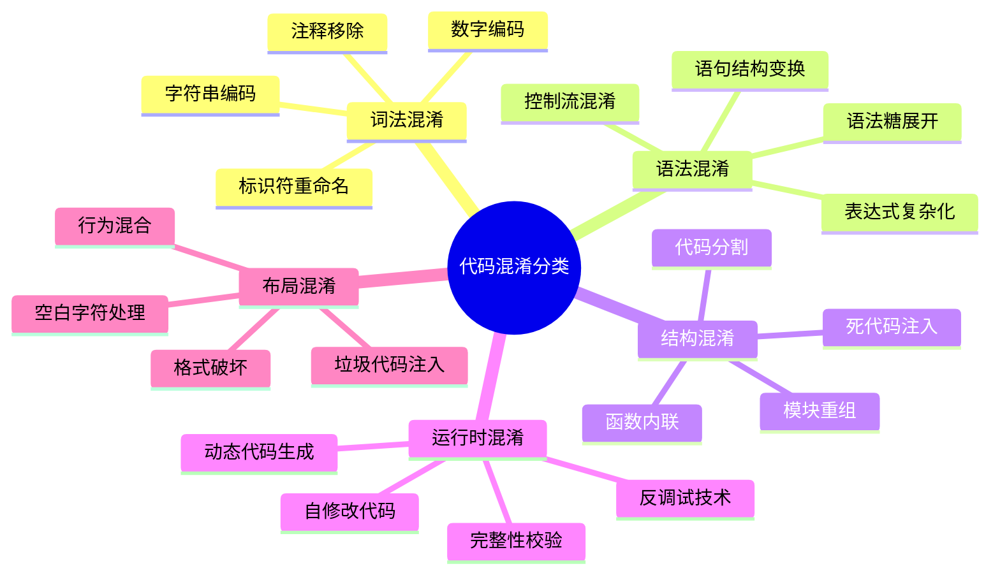

**混淆技术的实现层次：**

```mermaid
pyramid
    title JavaScript混淆技术层次

    "运行时保护<br>(动态检测/自修复)" : 25%
    "结构混淆<br"(控制流/代码分割)" : 30%
    "语法混淆<br"(表达式复杂化/结构变换)" : 25%
    "词法混淆<br"(标识符/字符串编码)" : 20%
```

**现代大型网站混淆技术的特征分析：**

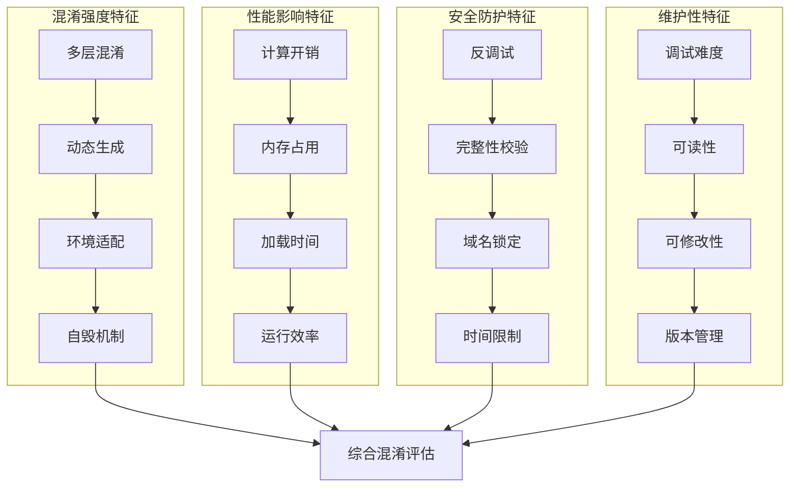

### 9.2.2 控制流混淆与数据混淆技术

控制流混淆是JavaScript混淆技术的核心，通过改变代码的执行逻辑和流程来增加逆向分析难度。

**控制流混淆的技术机制：**

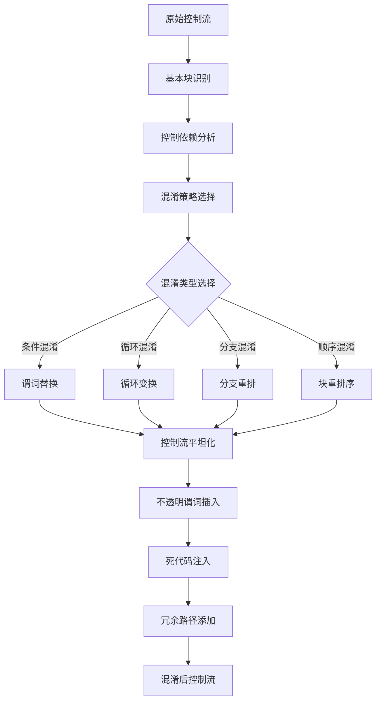

**大型网站控制流混淆的实战应用：**

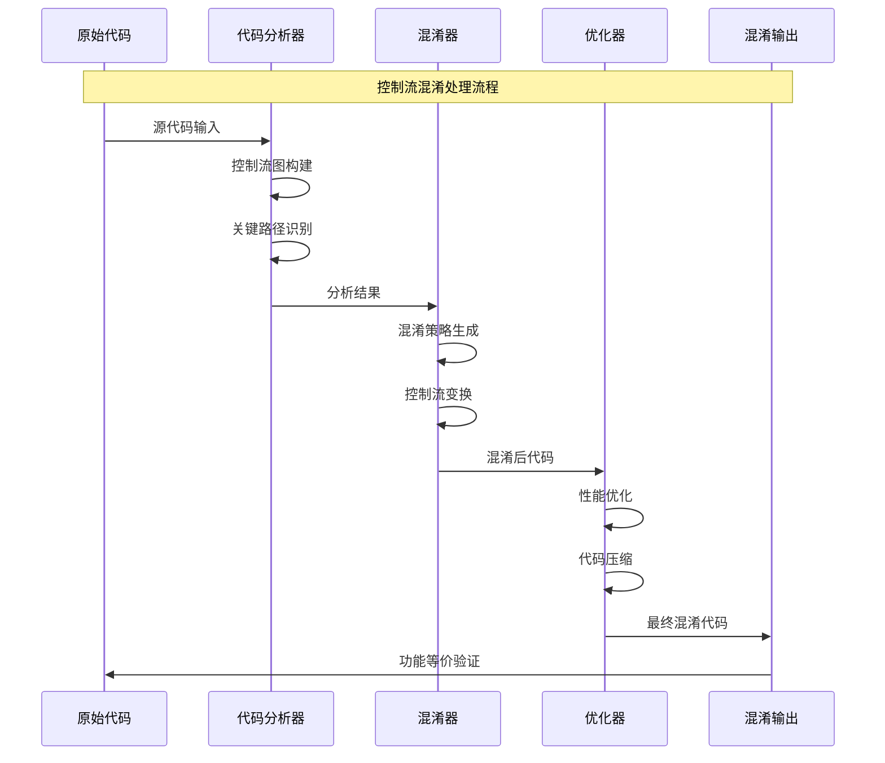

**数据混淆技术的实现策略：**

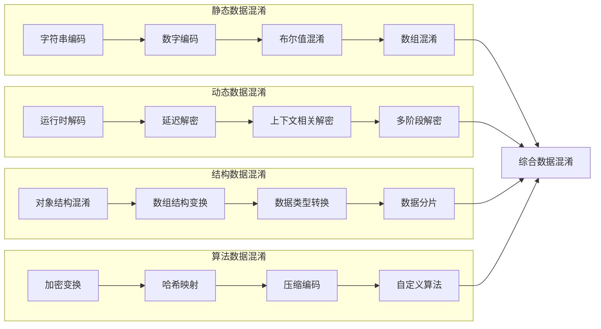

### 9.2.3 字符串编码与动态解密机制

字符串是JavaScript代码中的重要组成部分，对字符串的编码和动态解密是现代混淆技术的核心手段。

**字符串编码技术体系：**

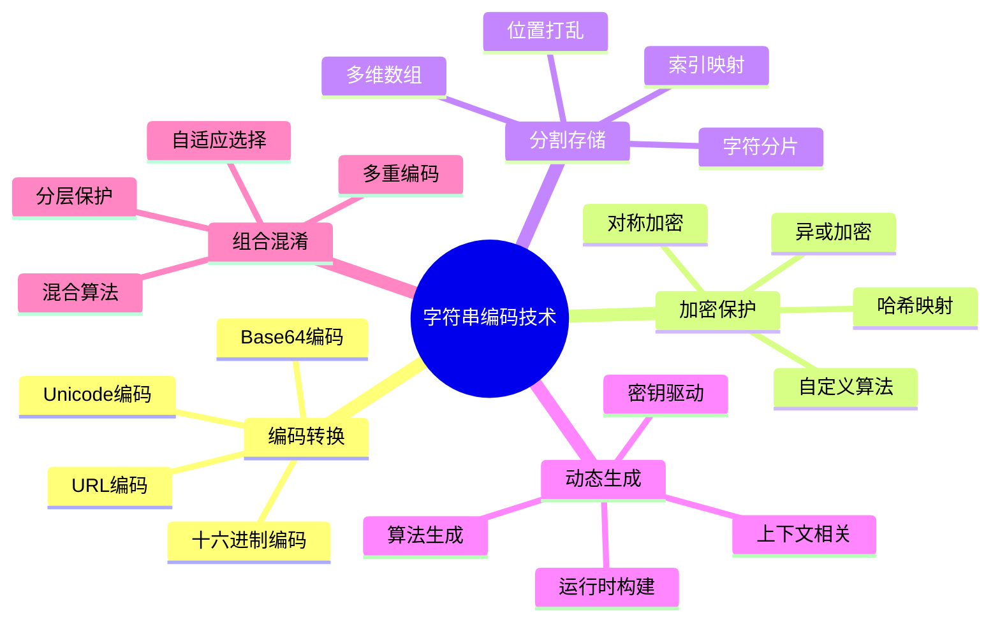

**动态解密机制的架构设计：**

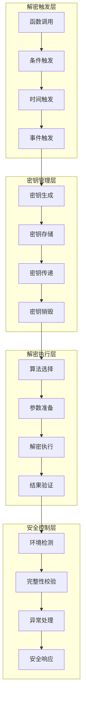

**大型网站字符串混淆的实战模式：**

| 混淆策略 | 技术复杂度 | 性能影响 | 安全强度 | 维护成本 | 应用场景 |
|---------|-----------|---------|---------|---------|---------|
| 简单编码 | 低 | 极低 | 低 | 低 | 一般保护 |
| 加密存储 | 中等 | 中等 | 高 | 中等 | 核心逻辑 |
| 动态解密 | 高 | 高 | 极高 | 高 | 敏感数据 |
| 多层保护 | 极高 | 极高 | 极高 | 极高 | 关键算法 |
| 自适应混淆 | 极高 | 高 | 极高 | 高 | 智能防护 |

### 9.2.4 代码分割与懒加载混淆

代码分割技术将完整的JavaScript代码拆分为多个片段，通过动态加载和按需执行来增加分析难度。

**代码分割的技术架构：**

```mermaid
pyramid
    title 代码分割技术层次

    "模块级分割<br>(功能模块/业务逻辑)" : 30%
    "函数级分割<br"(代码块/执行单元)" : 25%
    "语句级分割<br"(语法结构/逻辑块)" : 20%
    "表达式级分割<br"(计算单元/数据操作)" : 15%
    "字符级分割<br"(字符串/标识符)" : 10%
```

**懒加载混淆的执行流程：**

```mermaid
stateDiagram-v2
    [*] --> 代码分析
    代码分析 --> 分割策略制定
    分割策略制定 --> 代码片段生成

    代码片段生成 --> 加载器构建
    加载器构建 --> 依赖关系建立
    依赖关系建立 --> 执行顺序确定

    执行顺序确定 --> 运行时加载
    运行时加载 --> {加载条件检查}

    加载条件检查 --> 条件满足: 动态解密
    加载条件检查 --> 条件不满足: 等待触发

    动态解密 --> 代码执行
    等待触发 --> 加载条件检查

    代码执行 --> 下一片段准备
    下一片段准备 --> 运行时加载

    下一片段准备 --> [*]: 所有片段完成
```

**模块化混淆的技术实现：**

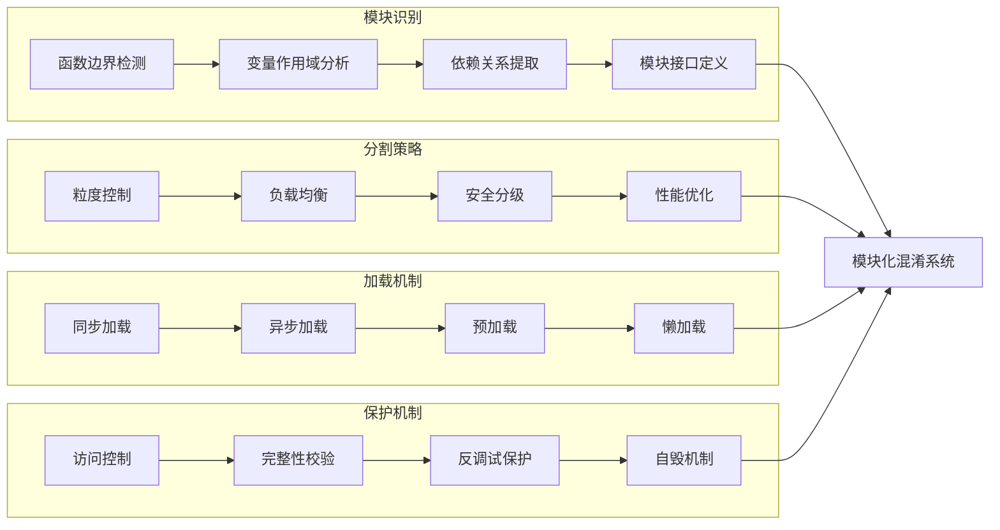

### 9.2.5 反调试与完整性校验技术

反调试技术和完整性校验是现代JavaScript混淆的重要组成部分，通过检测调试环境和代码完整性来防止逆向分析。

**反调试技术的分类体系：**

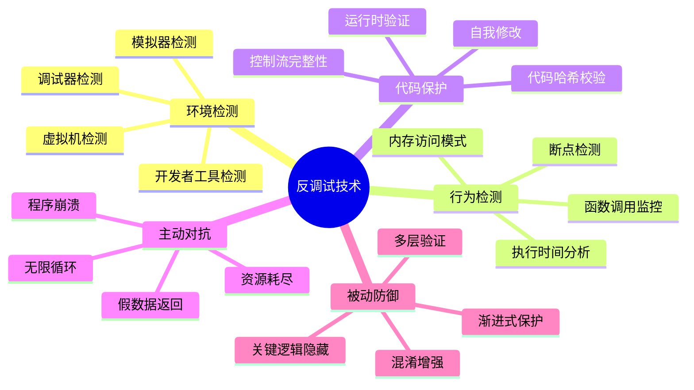

**完整性校验的技术架构：**

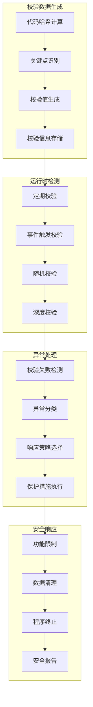

**大型网站反调试技术的实战应用：**

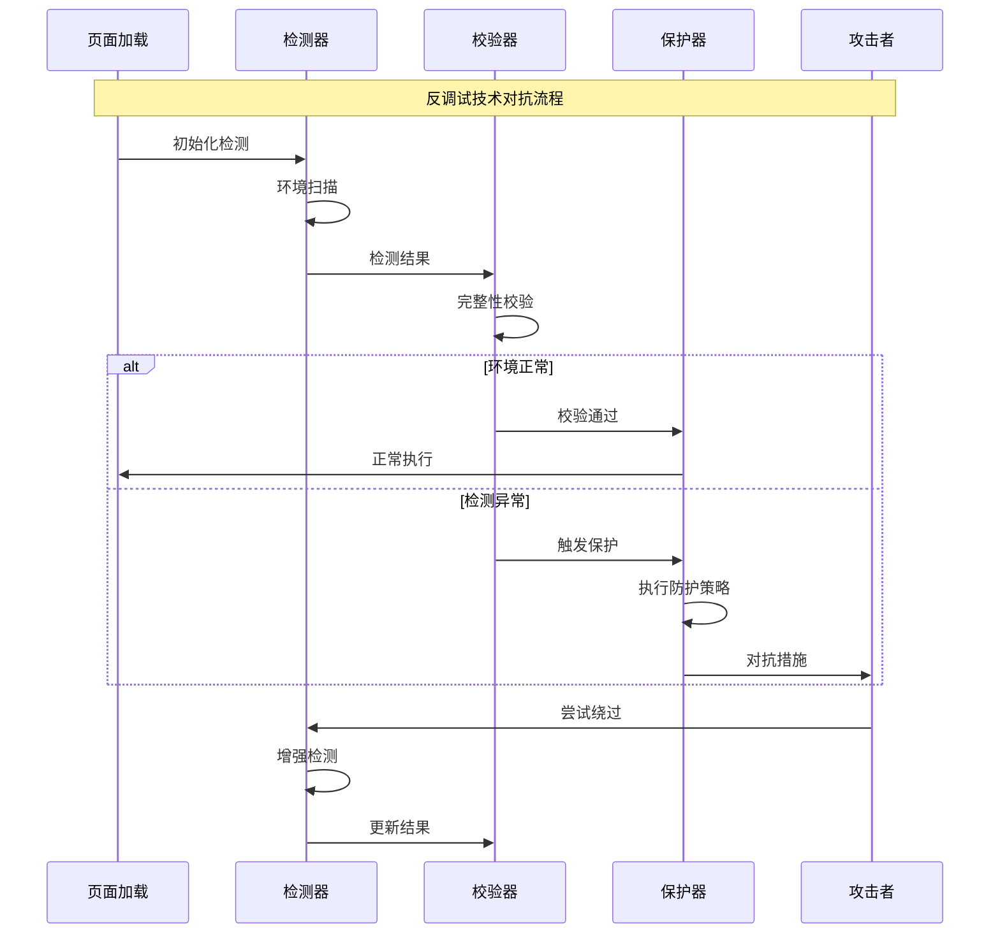

## 9.3 动态调试与逆向分析

### 9.3.1 现代浏览器调试技术体系

现代浏览器提供了强大的调试工具和接口，为JavaScript代码的动态分析和逆向工程提供了技术基础。

**浏览器调试技术架构：**

```mermaid
pyramid
    title 浏览器调试技术层次

    "高层接口<br"(DevTools Protocol/自动化)" : 25%
    "中层工具<br"(开发者工具/扩展程序)" : 30%
    "底层接口<br"(调试API/事件系统)" : 25%
    "系统层面<br"(进程管理/内存调试)" : 20%
```

**开发者工具的高级应用：**

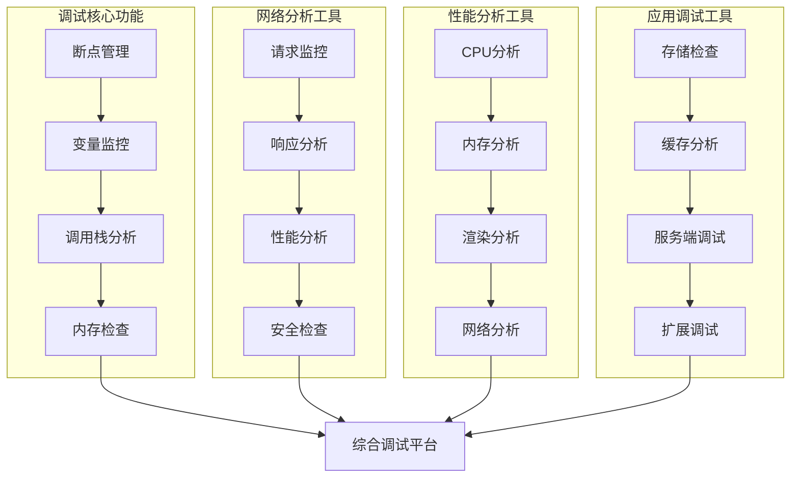

**DevTools Protocol的技术架构：**

```mermaid
graph LR
    subgraph "客户端层"
        A1[调试客户端] --> A2[协议适配器]
        A2 --> A3[消息处理器]
        A3 --> A4[事件管理器]
    end

    subgraph "协议层"
        B1[命令系统] --> B2[事件系统]
        B2 --> B3[会话管理]
        B3 --> B4[错误处理]
    end

    subgraph "服务层"
        C1[调试目标] --> C2[运行时管理]
        C2 --> C3[页面管理]
        C3 --> C4[网络管理]
    end

    subgraph "引擎层"
        D1[V8引擎] --> D2[渲染引擎]
        D2 --> D3[网络引擎]
        D3 --> D4[存储引擎]
    end

    A4 --> B1
    B4 --> C1
    C4 --> D1
```

### 9.3.2 断点调试与条件断点设置

断点调试是动态分析的核心技术，通过在特定位置暂停执行来深入分析代码行为和数据流。

**断点技术的分类体系：**

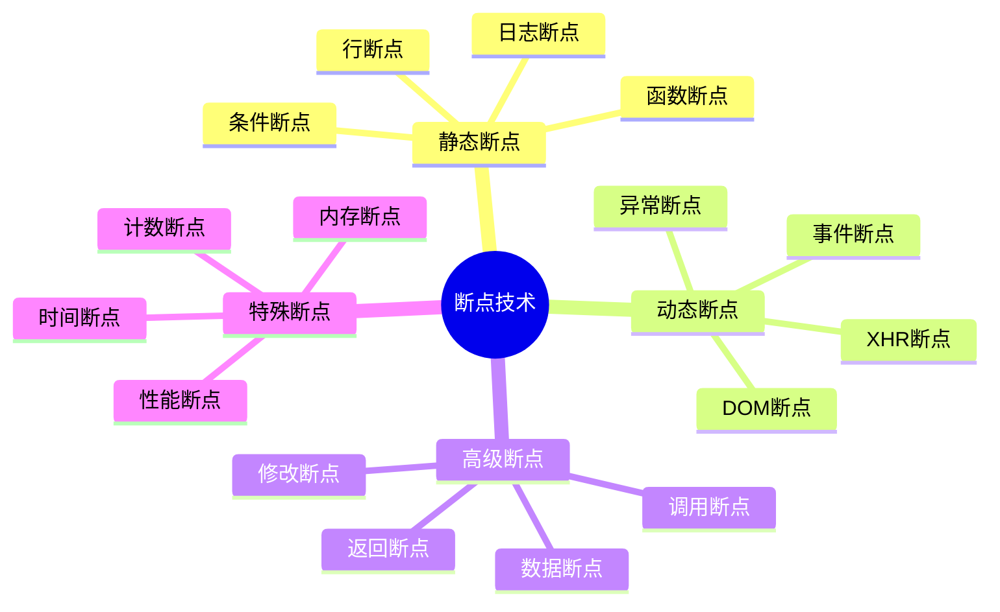

**条件断点的技术实现：**

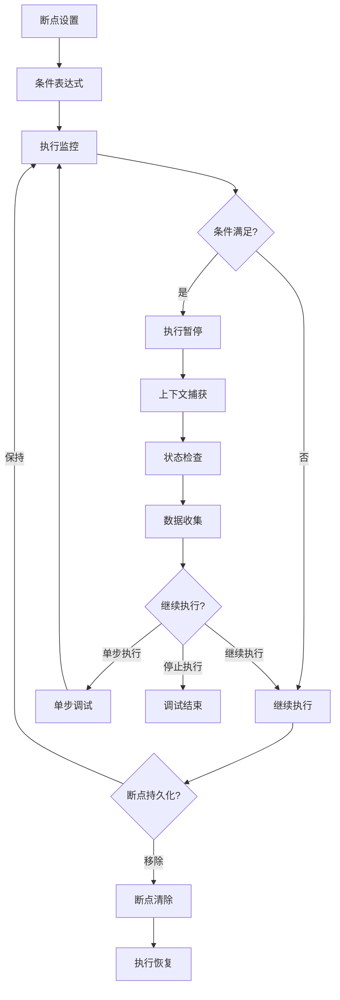

**大型网站断点调试的实战策略：**

| 断点类型 | 应用场景 | 技术要求 | 调试效率 | 风险等级 | 推荐工具 |
|---------|---------|---------|---------|---------|---------|
| 行断点 | 简单逻辑分析 | 低 | 中等 | 低 | 开发者工具 |
| 函数断点 | 函数调用跟踪 | 中等 | 高 | 中等 | Chrome DevTools |
| 条件断点 | 复杂条件判断 | 高 | 极高 | 中等 | VS Code Debugger |
| 异常断点 | 错误处理分析 | 中等 | 高 | 低 | 浏览器调试器 |
| DOM断点 | 界面交互分析 | 中等 | 高 | 低 | 开发者工具 |
| XHR断点 | 网络请求分析 | 高 | 极高 | 中等 | Charles/Fiddler |

### 9.3.3 变量监控与内存分析技术

变量监控和内存分析是理解代码行为、识别关键数据和发现内存问题的重要技术手段。

**变量监控的技术架构：**

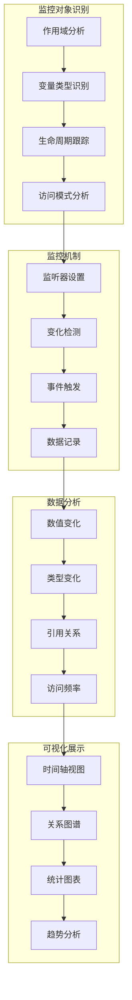

**内存分析的技术层次：**

```mermaid
pyramid
    title 内存分析技术层次

    "泄漏检测<br"(内存泄漏/循环引用)" : 30%
    "堆分析<br"(对象分配/内存布局)" : 25%
    "性能分析<br"(GC影响/内存压力)" : 20%
    "快照对比<br"(内存变化/增量分析)" : 15%
    "实时监控<br"(内存使用/分配趋势)" : 10%
```

**大型网站内存分析的实战应用：**

```mermaid
sequenceDiagram
    participant App as 应用程序
    participant Monitor as 监控器
    participant Analyzer as 分析器
    participant Reporter as 报告器
    participant Developer as 开发者

    Note over App,Developer: 内存分析完整流程

    App->>Monitor: 运行状态数据
    Monitor->>Monitor: 内存使用监控
    Monitor->>Analyzer: 监控数据

    Analyzer->>Analyzer: 内存快照生成
    Analyzer->>Analyzer: 堆分析处理
    Analyzer->>Analyzer: 泄漏检测

    Analyzer->>Reporter: 分析结果
    Reporter->>Reporter: 报告生成
    Reporter->>Developer: 问题报告

    Developer->>Developer: 问题分析
    Developer->>App: 优化措施
    App->>Monitor: 优化后状态
```

### 9.3.4 调用栈分析与函数追踪

调用栈分析是理解代码执行流程、定位问题源头和优化性能的重要技术手段。

**调用栈分析的技术机制：**

```mermaid
graph LR
    subgraph "栈信息采集"
        A1[函数调用记录] --> A2[参数捕获]
        A2 --> A3[返回值记录]
        A3 --> A4[执行时间测量]
    end

    subgraph "栈结构分析"
        B1[调用关系构建] --> B2[递归检测]
        B2 --> B3[循环依赖分析]
        B3 --> B4[深度计算]
    end

    subgraph "性能分析"
        C1[热点函数识别] --> C2[瓶颈定位]
        C2 --> C3[优化建议]
        C3 --> C4[性能报告]
    end

    subgraph "可视化展示"
        D1[调用树图] --> D2[火焰图]
        D2 --> D3[时序图]
        D3 --> D4[统计图表]
    end

    A4 --> B1
    B4 --> C1
    C4 --> D1
```

**函数追踪的技术实现：**

```mermaid
flowchart TD
    A[函数入口] --> B[参数记录]
    B --> C[上下文捕获]
    C --> D[执行开始]

    D --> E[函数执行]
    E --> F{异常检测}

    F -->|异常| G[异常记录]
    F -->|正常| H[执行继续]

    G --> I[异常处理]
    H --> J[返回值记录]

    I --> K[栈回溯]
    J --> K

    K --> L[执行时间计算]
    L --> M[数据整理]
    M --> N[结果输出]

    N --> O{追踪完成?}

    O -->|继续| A
    O -->|结束| P[报告生成]
```

**大型网站调用栈分析的实战策略：**

| 分析类型 | 技术复杂度 | 性能影响 | 分析深度 | 实时性 | 适用场景 |
|---------|-----------|---------|---------|---------|---------|
| 简单栈跟踪 | 低 | 极低 | 浅层 | 实时 | 基础调试 |
| 详细调用分析 | 中等 | 中等 | 中等 | 近实时 | 性能优化 |
| 深度栈分析 | 高 | 高 | 深层 | 批处理 | 复杂问题 |
| 实时监控 | 中等 | 中等 | 中等 | 实时 | 生产环境 |
| 历史分析 | 高 | 低 | 深层 | 离线 | 问题回顾 |

### 9.3.5 网络请求拦截与重放技术

网络请求拦截和重放技术是分析前后端交互、理解业务逻辑和进行安全测试的重要手段。

**网络拦截的技术架构：**

```mermaid
graph TB
    subgraph "拦截点设置"
        A1[XMLHttpRequest拦截] --> A2[Fetch API拦截]
        A2 --> A3[WebSocket拦截]
        A3 --> A4[其他网络接口]
    end

    subgraph "请求处理"
        B1[请求捕获] --> B2[参数解析]
        B2 --> B3[内容修改]
        B3 --> B4[重放控制]
    end

    subgraph "响应处理"
        C1[响应捕获] --> C2[数据解析]
        C2 --> C3[内容修改]
        C3 --> C4[缓存控制]
    end

    subgraph "监控分析"
        D1[流量统计] --> D2[性能分析]
        D2 --> D3[异常检测]
        D3 --> D4[安全扫描]
    end

    A4 --> B1
    B4 --> C1
    C4 --> D1
```

**重放技术的实现机制：**

```mermaid
stateDiagram-v2
    [*] --> 请求录制
    请求录制 --> 请求过滤
    请求过滤 --> 数据存储

    data存储 --> 重放准备
    重放准备 --> 参数修改

    参数修改 --> 环境检查
    环境检查 --> {环境就绪?}

    环境就绪 --> 是: 请求发送
    环境就绪 --> 否: 环境配置

    请求发送 --> 响应接收
    响应接收 --> 结果对比

    结果对比 --> {对比通过?}

    对比通过 --> 是: 重放成功
    对比通过 --> 否: 问题分析

    问题分析 --> 修改重试
    修改重试 --> 参数修改

    环境配置 --> 环境检查
    重放成功 --> [*]: 完成重放
```

## 总结

### 核心技术要点回顾

本节深入探讨了JavaScript代码混淆技术和动态调试方法，构建了完整的技术分析体系：

1. **混淆技术分类**：理解词法、语法、结构、运行时等多层次混淆技术
2. **控制流混淆**：掌握控制流变换、数据混淆等核心技术
3. **字符串保护**：理解字符串编码、动态解密等保护机制
4. **代码分割技术**：掌握模块化混淆和懒加载的实现策略
5. **反调试技术**：了解环境检测、完整性校验等保护手段
6. **动态调试方法**：掌握断点调试、变量监控、调用栈分析等调试技术

### 实战应用指导

在实际的大型网站分析和逆向工程中，需要遵循以下核心原则：

1. **系统性分析**：采用多层次、多维度的分析方法
2. **工具链整合**：结合多种工具和技术手段
3. **性能平衡**：在分析深度和系统性能之间找到平衡
4. **安全合规**：确保所有分析活动符合法律法规要求
5. **持续学习**：跟上技术发展和工具更新

### 技术发展趋势

JavaScript混淆和调试技术正在向更加智能化、自动化的方向发展：

- **AI辅助分析**：机器学习在代码理解和模式识别中的应用
- **自动化工具链**：集成化的分析和调试工具平台
- **实时分析能力**：更高效的实时监控和分析技术
- **可视化技术**：更直观的数据展示和分析界面
- **云端协作**：基于云平台的分布式分析和协作

掌握这些JavaScript混淆和调试技术，能够帮助我们更好地理解现代Web应用的安全机制，提升逆向分析和安全评估的能力。通过不断的技术学习和实践积累，我们能够在复杂的技术挑战中保持竞争优势。