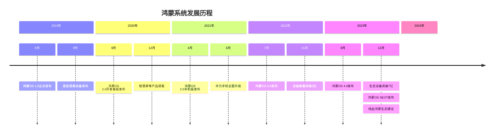
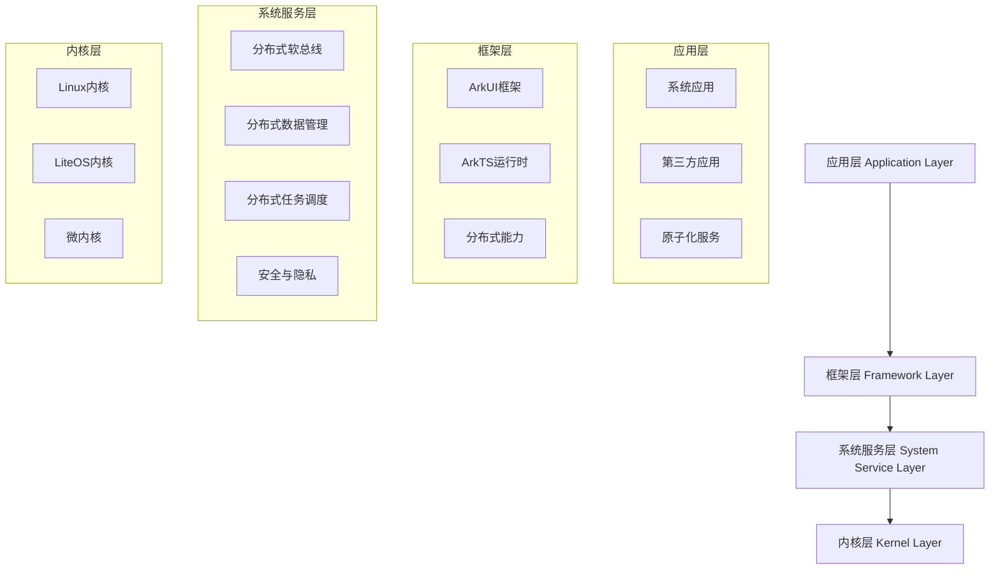
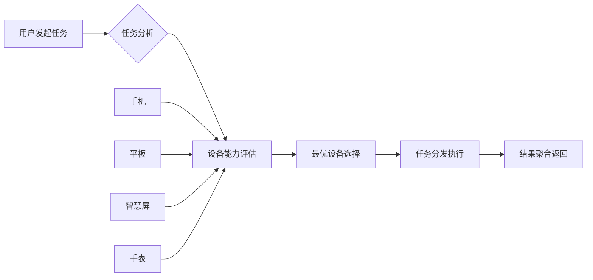
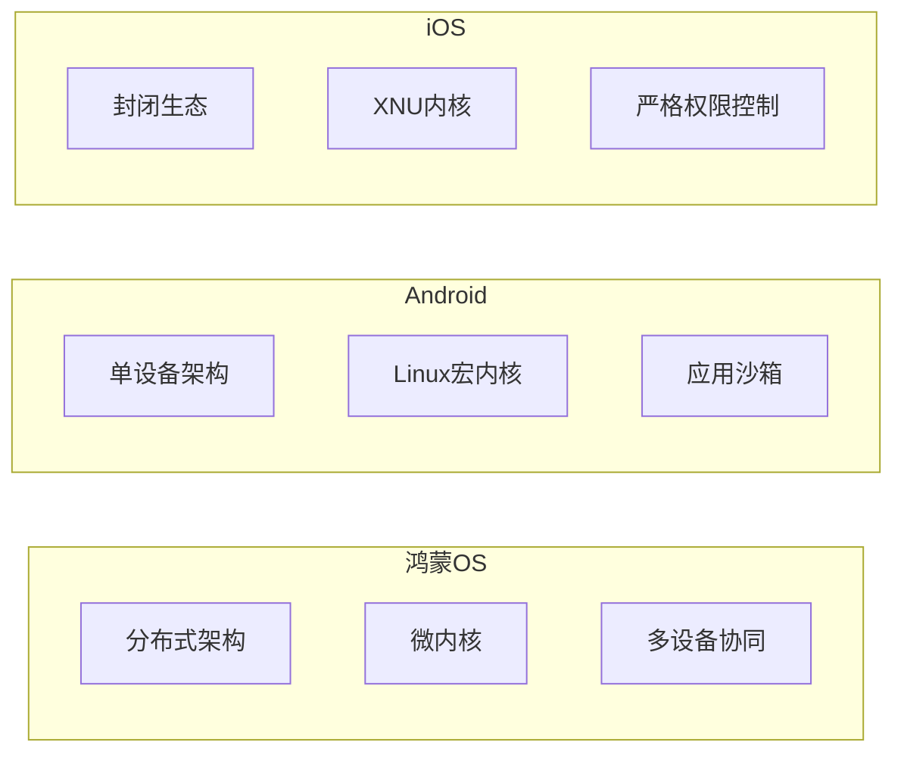
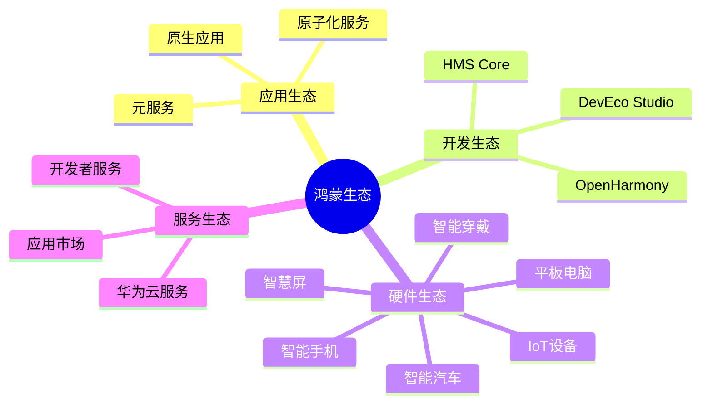
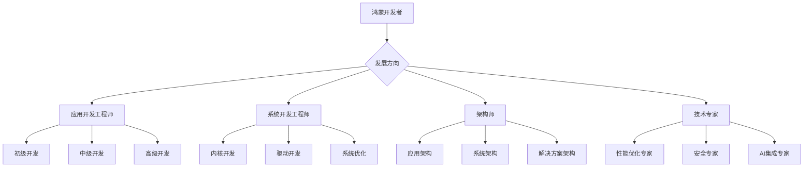

# 第1章：鸿蒙系统概述

## 1.1 鸿蒙系统发展历程

### 1.1.1 诞生背景

鸿蒙操作系统（HarmonyOS）是华为公司于2019年8月正式发布的分布式操作系统。面对全球技术环境的变化和移动操作系统的垄断格局，华为决定开发一套面向万物互联时代的全场景分布式操作系统。



### 1.1.2 版本演进

#### HarmonyOS 1.0（2019年）

-   **定位**：面向IoT设备的分布式操作系统
    
-   **特点**：微内核架构、分布式软总线
    
-   **应用场景**：智慧屏、智能音箱等IoT设备
    

#### HarmonyOS 2.0（2020-2021年）

-   **重大突破**：支持手机、平板等移动设备
    
-   **技术特性**：分布式数据管理、分布式任务调度
    
-   **生态建设**：HMS Core 4.0发布
    

#### HarmonyOS 3.0（2022年）

-   **核心升级**：超级终端、万能卡片
    
-   **性能提升**：系统流畅度提升20%
    
-   **开发体验**：ArkTS语言正式推出
    

#### HarmonyOS 4.0（2023年）

-   **AI能力**：小艺智慧助手升级
    
-   **用户体验**：个性化UI、实况窗
    
-   **开发工具**：DevEco Studio 4.0
    

#### HarmonyOS NEXT（2024年）

-   **历史性突破**：完全脱离Android生态
    
-   **纯血鸿蒙**：不再兼容Android应用
    
-   **原生生态**：基于OpenHarmony构建
    

## 1.2 鸿蒙架构设计理念

### 1.2.1 分布式架构核心

鸿蒙系统采用"一次开发，多端部署"的设计理念，其核心架构可以分为四个层次：



### 1.2.2 关键技术特性

#### 分布式软总线（Distributed Soft Bus）

分布式软总线是鸿蒙系统的核心技术之一，它实现了设备间的无缝连接：

```typescript
// 分布式设备发现示例
import deviceManager from '@ohos.distributedHardware.deviceManager';

// 获取设备管理器实例
let dmInstance = deviceManager.createDeviceManager('com.example.app');

// 发现周边设备
dmInstance.startDeviceDiscovery((discoverInfo) => {
  console.log('发现设备:', discoverInfo);
});

// 建立连接
dmInstance.authenticateDevice(deviceId, (authInfo) => {
  console.log('设备认证成功:', authInfo);
});
```

#### 分布式数据管理

鸿蒙提供了统一的数据管理框架，支持跨设备的数据同步：

```typescript
// 分布式数据同步示例
import distributedData from '@ohos.data.distributedData';

// 创建分布式数据对象
let kvStore = distributedData.createKVStore({
  storeId: 'user_preferences',
  createIfMissing: true
});

// 跨设备数据同步
kvStore.put('theme', 'dark').then(() => {
  console.log('数据同步成功');
});
```

#### 分布式任务调度

支持任务在不同设备间的智能调度：



### 1.2.3 微内核设计

鸿蒙系统采用微内核架构，相比宏内核具有以下优势：

| 特性  | 微内核 | 宏内核 |
| --- | --- | --- |
| 系统稳定性 | 高   | 中等  |
| 安全性 | 高   | 中等  |
| 扩展性 | 强   | 有限  |
| 性能开销 | 稍高  | 较低  |
| 代码维护 | 容易  | 复杂  |

## 1.3 与其他操作系统的对比

### 1.3.1 技术架构对比



### 1.3.2 功能特性对比表

| 特性  | 鸿蒙OS | Android | iOS |
| --- | --- | --- | --- |
| 分布式能力 | ✅ 原生支持 | ❌ 第三方方案 | ❌ 不支持 |
| 多设备协同 | ✅ 无缝体验 | ❌ 有限支持 | ❌ 仅Apple生态 |
| 开发语言 | ArkTS/JS/C++ | Java/Kotlin | Swift/Objective-C |
| 跨平台部署 | ✅ 一次开发多端 | ❌ 需适配 | ❌ 仅Apple设备 |
| 性能表现 | 优秀  | 良好  | 优秀  |
| 生态成熟度 | 发展中 | 成熟  | 成熟  |
| 开发门槛 | 中等  | 低   | 高   |

### 1.3.3 开发体验对比

#### 鸿蒙开发优势

1.  **统一开发框架**：ArkUI框架支持声明式开发
    
2.  **跨设备适配**：一套代码多端运行
    
3.  **性能优化**：编译时优化和运行时优化
    
4.  **开发工具**：DevEco Studio集成开发环境
    

#### 与Android开发差异

```typescript
// 鸿蒙ArkTS开发示例
@Entry
@Component
struct HomePage {
  @State message: string = 'Hello HarmonyOS'
  
  build() {
    Column() {
      Text(this.message)
        .fontSize(20)
        .margin(10)
      
      Button('点击我')
        .onClick(() => {
          this.message = '按钮被点击了！'
        })
    }
    .width('100%')
    .height('100%')
  }
}
```

```java
// Android Java开发对比
public class MainActivity extends AppCompatActivity {
    private TextView textView;
    
    @Override
    protected void onCreate(Bundle savedInstanceState) {
        super.onCreate(savedInstanceState);
        setContentView(R.layout.activity_main);
        
        textView = findViewById(R.id.textView);
        Button button = findViewById(R.id.button);
        
        button.setOnClickListener(v -> {
            textView.setText("按钮被点击了！");
        });
    }
}
```

## 1.4 鸿蒙生态与应用场景

### 1.4.1 生态体系架构



### 1.4.2 典型应用场景

#### 1\. 智慧家居场景

-   **设备互联**：手机控制家电、智能音箱语音控制
    
-   **场景联动**：回家模式、离家模式自动执行
    
-   **数据共享**：家庭成员共享设备控制权
    

#### 2\. 移动办公场景

-   **多屏协同**：手机-平板-电脑无缝切换
    
-   **文件流转**：文档在不同设备间快速传输
    
-   **任务延续**：未完成工作自动同步到其他设备
    

#### 3\. 出行服务场景

-   **车机互联**：手机导航同步到车载系统
    
-   **智慧出行**：手表解锁、手机支付一体化
    
-   **位置服务**：多设备定位信息共享
    

#### 4\. 健康运动场景

-   **数据监测**：手表记录运动数据，手机分析健康报告
    
-   **运动指导**：智慧屏播放健身课程，手表监测心率
    
-   **健康提醒**：多设备联动健康提醒服务
    

### 1.4.3 原子化服务

原子化服务是鸿蒙生态的重要创新，具有以下特点：

```typescript
// 原子化服务示例
import FormExtensionAbility from '@ohos.app.form.FormExtensionAbility';

export default class FormAbility extends FormExtensionAbility {
  onAddForm(want) {
    // 创建卡片服务
    return {
      formId: this.generateFormId(),
      formName: 'WeatherCard',
      dimension: 2,
      formBindingData: {
        temperature: '25°C',
        weather: '晴朗'
      }
    };
  }
  
  onUpdateForm(formId) {
    // 更新卡片数据
    let formData = this.getWeatherData();
    this.updateForm(formId, formData);
  }
}
```

## 1.5 开发者机遇与前景

### 1.5.1 市场机遇分析

#### 设备规模增长

```mermaid
gantt
    title 鸿蒙设备增长趋势
    dateFormat  YYYY-MM
    axisFormat  %Y年%m月
    section 设备数量
    2021年6月   :a1, 2021-06, 2021-12, 1亿
    2022年6月   :a2, 2022-06, 2022-12, 3亿
    2023年6月   :a3, 2023-06, 2023-12, 5亿
    2024年6月   :a4, 2024-06, 2024-12, 8亿
    2025年目标  :a5, 2025-06, 2025-12, 10亿
```

#### 应用生态发展

-   **应用数量**：2024年突破50万个原生应用
    
-   **开发者规模**：注册开发者超过600万
    
-   **企业合作**：超过2000家企业加入鸿蒙生态
    

### 1.5.2 技术发展趋势

#### 1\. AI能力集成

-   **端侧AI**：设备端智能处理能力增强
    
-   **大模型集成**：本地化大语言模型部署
    
-   **智能交互**：自然语言交互成为主流
    

#### 2\. 性能持续优化

-   **启动速度**：应用启动时间减少50%
    
-   **内存占用**：系统内存占用降低30%
    
-   **续航提升**：设备续航时间延长20%
    

#### 3\. 开发体验提升

-   **低代码开发**：可视化开发工具普及
    
-   **AI辅助编程**：智能代码补全和生成
    
-   **跨平台能力**：更多平台支持鸿蒙应用
    

### 1.5.3 职业发展路径

#### 技术岗位需求



#### 技能要求演进

1.  **基础技能**：ArkTS、ArkUI、DevEco Studio
    
2.  **进阶技能**：分布式开发、性能优化、安全开发
    
3.  **专家技能**：系统架构、AI集成、跨平台解决方案
    

#### 薪资水平预期

-   **初级开发**：8K-15K/月
    
-   **中级开发**：15K-25K/月
    
-   **高级开发**：25K-40K/月
    
-   **架构师/专家**：40K-80K/月
    

### 1.5.4 学习建议

#### 学习路径规划

1.  **入门阶段**（1-2个月）
    
    -   掌握ArkTS基础语法
        
    -   熟悉DevEco Studio使用
        
    -   完成简单应用开发
        
2.  **进阶阶段**（2-3个月）
    
    -   深入理解ArkUI框架
        
    -   掌握分布式开发技术
        
    -   学习性能优化技巧
        
3.  **精通阶段**（3-6个月）
    
    -   系统架构设计能力
        
    -   复杂业务场景解决方案
        
    -   团队协作与项目管理
        

#### 学习资源推荐

-   **官方文档**：HarmonyOS开发者官网
    
-   **在线课程**：华为开发者学院
    
-   **实践项目**：开源项目贡献
    
-   **技术社区**：鸿蒙开发者论坛
    

---

## 本章小结

本章全面介绍了鸿蒙系统的发展历程、架构设计理念、与其他操作系统的对比、生态应用场景以及开发者机遇。通过学习本章，您应该：

1.  **了解鸿蒙系统**的发展背景和版本演进
    
2.  **理解分布式架构**的核心设计理念
    
3.  **掌握鸿蒙与其他系统**的主要差异和优势
    
4.  **认识鸿蒙生态**的应用场景和发展前景
    
5.  **明确学习方向**和职业发展路径
    

鸿蒙系统作为面向万物互联时代的新一代操作系统，为开发者提供了广阔的发展空间。掌握鸿蒙开发技术，将为您在移动互联网和物联网时代赢得先机。

## 思考题

1.  鸿蒙系统的分布式架构相比传统单设备架构有哪些优势？
    
2.  ArkTS语言相比传统的Java/Kotlin有哪些特点？
    
3.  如何理解"一次开发，多端部署"的开发理念？
    
4.  鸿蒙生态中的原子化服务与传统应用有什么区别？
    
5.  作为开发者，如何规划自己的鸿蒙技术学习路径？
    

## 下章预告

下一章我们将详细介绍鸿蒙开发环境的搭建，包括DevEco Studio的安装配置、SDK环境设置、模拟器使用等内容，帮助您快速建立鸿蒙开发环境。