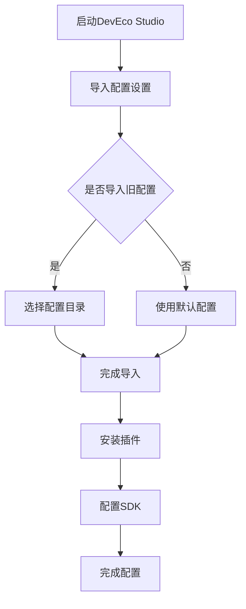
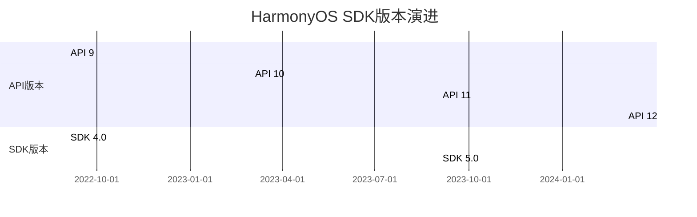
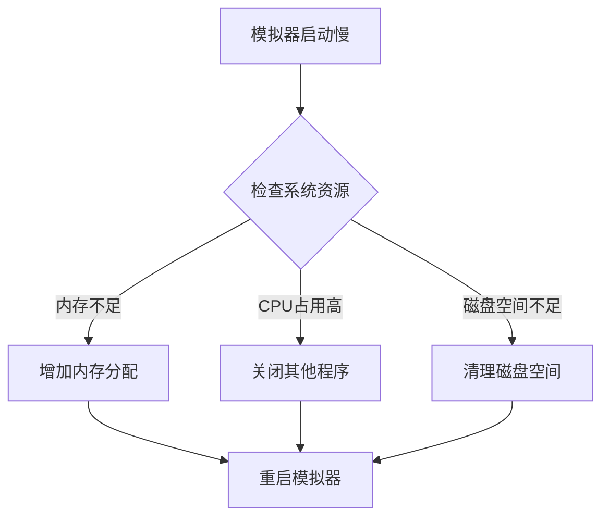

# 第2章：开发环境搭建

## 2.1 DevEco Studio安装与配置

### 2.1.1 DevEco Studio简介

DevEco Studio是华为官方提供的鸿蒙应用集成开发环境（IDE），基于IntelliJ IDEA Community Edition开发，专门为鸿蒙应用开发量身定制。它提供了完整的开发工具链，包括代码编辑、调试、性能分析、模拟器等功能。

### 2.1.2 系统要求

在安装DevEco Studio之前，请确保您的开发环境满足以下要求：

| 组件 | 最低要求 | 推荐配置 |
|------|----------|----------|
| 操作系统 | Windows 10 64位 | Windows 11 64位 |
| 内存 | 8GB RAM | 16GB RAM |
| 硬盘空间 | 15GB可用空间 | 30GB可用空间 |
| Java环境 | JDK 11 | JDK 17 |
| CPU | 双核2.0GHz | 四核3.0GHz |

### 2.1.3 下载与安装步骤

1. **访问华为开发者官网**
   - 打开浏览器，访问 [https://developer.harmonyos.com](https://developer.harmonyos.com)
   - 点击"开发" → "工具" → "DevEco Studio"

2. **下载安装包**
   - 根据您的操作系统选择对应的版本
   - 推荐下载最新稳定版本（当前为5.0.3）

3. **安装过程**
   ```bash
   # Windows安装命令示例
   # 1. 解压安装包
   # 2. 运行安装程序
   # 3. 按照向导完成安装
   ```

### 2.1.4 首次配置

安装完成后，首次启动DevEco Studio需要进行初始配置：



## 2.2 SDK下载与环境变量设置

### 2.2.1 HarmonyOS SDK概述

HarmonyOS SDK（Software Development Kit）是鸿蒙应用开发的核心工具包，包含了：

- **API库**：提供系统API接口
- **工具链**：编译、打包、调试工具
- **模拟器**：设备模拟环境
- **文档**：开发文档和示例代码

### 2.2.2 SDK版本管理

鸿蒙SDK采用版本化管理，支持多版本并存：



### 2.2.3 SDK下载与配置

1. **通过SDK Manager下载**
   - 打开DevEco Studio
   - 进入Tools → SDK Manager
   - 选择需要的SDK版本和组件

2. **SDK组件说明**
   ```
   HarmonyOS SDK/
   ├── native/           # 原生开发库
   ├── js/              # JS开发库
   ├── toolchains/      # 编译工具链
   ├── build-tools/     # 构建工具
   ├── platforms/       # 平台文件
   └── docs/           # 文档
   ```

### 2.2.4 环境变量配置

为了确保命令行工具能够正常使用，需要配置以下环境变量：

```bash
# Windows环境变量设置
set HARMONY_SDK_HOME=C:\Users\用户名\AppData\Local\Huawei\Sdk
set PATH=%PATH%;%HARMONY_SDK_HOME%\toolchains
set PATH=%PATH%;%HARMONY_SDK_HOME%\build-tools

# Linux/Mac环境变量设置
export HARMONY_SDK_HOME=~/Library/Huawei/Sdk
export PATH=$PATH:$HARMONY_SDK_HOME/toolchains
export PATH=$PATH:$HARMONY_SDK_HOME/build-tools
```

## 2.3 模拟器创建与使用

### 2.3.1 模拟器类型

鸿蒙开发支持多种模拟器类型：

| 模拟器类型 | 适用场景 | 特点 |
|------------|----------|------|
| Phone模拟器 | 手机应用开发 | 支持触摸、传感器 |
| Tablet模拟器 | 平板应用开发 | 大屏幕适配 |
| TV模拟器 | 电视应用开发 | 遥控器交互 |
| Wearable模拟器 | 手表应用开发 | 小屏幕优化 |
| Car模拟器 | 车载应用开发 | 驾驶场景适配 |

### 2.3.2 创建模拟器

1. **打开设备管理器**
   - 在DevEco Studio中点击Tools → Device Manager
   - 或点击工具栏的设备图标

2. **创建新设备**
   ```mermaid
   sequenceDiagram
       participant Dev as 开发者
       participant DM as Device Manager
       participant SDK as SDK Manager
       
       Dev->>DM: 点击Create Device
       DM->>Dev: 显示设备类型选择
       Dev->>DM: 选择Phone类型
       DM->>SDK: 获取可用镜像
       SDK->>DM: 返回镜像列表
       DM->>Dev: 显示镜像选择界面
       Dev->>DM: 选择API 12镜像
       DM->>DM: 创建设备配置
       DM->>Dev: 显示创建成功
   ```

3. **配置设备参数**
   - 设备名称：自定义设备标识
   - 系统版本：选择对应的API版本
   - 内存大小：建议4GB以上
   - 存储空间：建议8GB以上

### 2.3.3 模拟器使用技巧

1. **快捷键操作**
   - Ctrl+Alt+←/→：旋转屏幕
   - Ctrl+Alt+F：全屏模式
   - Ctrl+Alt+P：截图功能
   - Ctrl+Alt+V：粘贴文本

2. **网络配置**
   ```typescript
   // 模拟器网络配置示例
   // 在config.json中配置网络权限
   {
     "module": {
       "reqPermissions": [
         {
           "name": "ohos.permission.INTERNET"
         }
       ]
     }
   }
   ```

## 2.4 真机调试配置

### 2.4.1 设备准备

1. **开启开发者选项**
   - 设置 → 关于手机 → 连续点击版本号7次
   - 返回设置 → 开发者选项

2. **USB调试设置**
   - 开启USB调试开关
   - 开启"仅充电模式下允许ADB调试"
   - 开启"USB安装"

3. **网络调试设置**
   ```mermaid
   flowchart LR
       A[手机连接WiFi] --> B[获取IP地址]
       B --> C[开启网络ADB]
       C --> D[电脑连接adb]
       D --> E[验证连接成功]
   ```

### 2.4.2 驱动安装

Windows系统需要安装华为USB驱动：

1. **自动安装**
   - 连接设备到电脑
   - 系统自动识别并安装驱动

2. **手动安装**
   - 从华为官网下载HDB驱动
   - 运行安装程序
   - 重启电脑生效

### 2.4.3 签名配置

鸿蒙应用在真机上运行需要数字签名：

1. **生成调试证书**
   ```bash
   # 使用keytool生成密钥库
   keytool -genkey -alias myapp -keyalg RSA -keysize 2048 -validity 36500 -keystore myapp.keystore
   ```

2. **配置签名信息**
   ```json
   // build-profile.json5中的签名配置
   {
     "app": {
       "signingConfigs": [
         {
           "name": "default",
           "type": "HarmonyOS",
           "material": {
             "keyAlias": "myapp",
             "keyPassword": "123456",
             "signAlg": "SHA256withECDSA",
             "profile": "myapp.p7b",
             "storePassword": "123456",
             "storeFile": "myapp.keystore"
           }
         }
       ]
     }
   }
   ```

## 2.5 常见问题解决方案

### 2.5.1 安装问题

**问题1：DevEco Studio启动失败**
```
解决方案：
1. 检查Java环境是否正确安装
2. 确认系统内存是否充足
3. 以管理员身份运行安装程序
4. 检查防火墙设置
```

**问题2：SDK下载失败**
```
解决方案：
1. 检查网络连接
2. 配置代理设置
3. 清理SDK缓存
4. 重置SDK Manager
```

### 2.5.2 模拟器问题

**问题1：模拟器启动缓慢**


**问题2：模拟器网络异常**
```
解决方案：
1. 重启模拟器网络服务
2. 检查主机网络连接
3. 重置模拟器网络设置
4. 配置DNS服务器
```

### 2.5.3 真机调试问题

**问题1：设备无法识别**
```
解决方案：
1. 检查USB连接线
2. 重新安装USB驱动
3. 重启ADB服务
4. 尝试其他USB端口
```

**问题2：应用安装失败**
```
解决方案：
1. 检查签名配置
2. 确认设备存储空间
3. 检查应用权限配置
4. 清理应用缓存
```

### 2.5.4 性能优化建议

1. **IDE性能优化**
   - 增加JVM内存分配
   - 关闭不必要的插件
   - 配置代码索引排除项

2. **编译优化**
   ```json
   // build-profile.json5编译优化配置
   {
     "app": {
       "compileMode": "esmodule",
       "optimize": {
         "analyzer": true,
         "compress": true,
         "treeShaking": true
       }
     }
   }
   ```

3. **调试优化**
   - 使用条件断点
   - 配置日志级别
   - 启用热重载功能

## 本章小结

本章详细介绍了鸿蒙开发环境的搭建过程，包括DevEco Studio的安装配置、SDK管理、模拟器使用、真机调试以及常见问题的解决方案。通过本章的学习，您应该能够：

1. 熟练安装和配置DevEco Studio开发环境
2. 掌握HarmonyOS SDK的下载和管理方法
3. 能够创建和使用各种类型的模拟器
4. 配置真机调试环境并进行应用调试
5. 解决开发过程中常见的环境问题

良好的开发环境是高效开发的基础，建议您在实际操作中多加练习，熟悉各种工具的使用方法，为后续的鸿蒙应用开发打下坚实的基础。

## 思考题

1. DevEco Studio相比其他IDE有哪些优势？
2. 如何管理多个版本的HarmonyOS SDK？
3. 模拟器和真机调试各有什么优缺点？
4. 在团队开发中，如何统一开发环境配置？
5. 如何优化开发环境的性能？