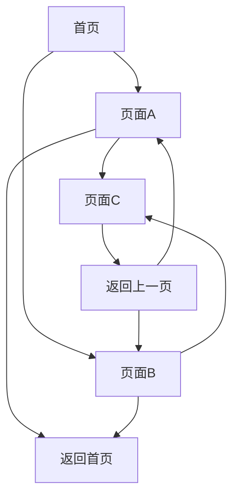
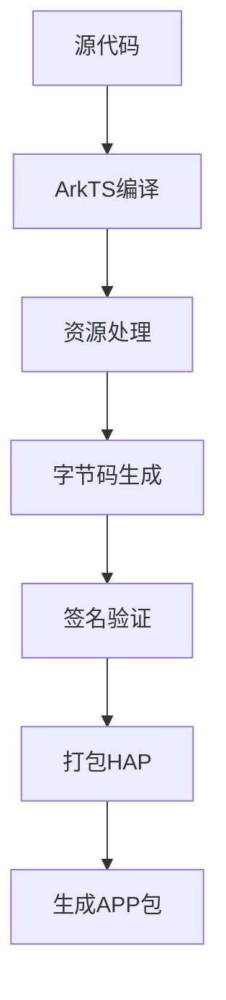

# 第3章：第一个鸿蒙应用

## 3.1 项目创建与结构解析

### 3.1.1 创建新项目

在DevEco Studio中创建鸿蒙应用的步骤如下：

1. **启动项目创建向导**
   - 点击File → New → Project
   - 或点击欢迎界面的Create Project

2. **选择项目模板**
   ```mermaid
   flowchart TD
       A[选择项目模板] --> B{应用类型}
       B -->|Empty Ability| C[空白应用模板]
       B -->|Native C++| D[原生C++模板]
       B -->|JS/eTS| E[JS/ArkTS模板]
       C --> F[配置项目信息]
       D --> F
       E --> F
       F --> G[创建项目]
   ```

3. **配置项目信息**
   - Project Name：HelloHarmony
   - Package Name：com.example.helloharmony
   - Save Location：选择项目保存路径
   - Language：ArkTS
   - Minimum API Level：API 10
   - Device Type：Phone

### 3.1.2 项目目录结构

创建完成后，项目具有以下目录结构：

```
HelloHarmony/
├── entry/
│   ├── src/
│   │   ├── main/
│   │   │   ├── ets/
│   │   │   │   ├── entryability/
│   │   │   │   │   └── EntryAbility.ets
│   │   │   │   └── pages/
│   │   │   │       └── Index.ets
│   │   │   ├── resources/
│   │   │   │   ├── base/
│   │   │   │   │   ├── element/
│   │   │   │   │   ├── media/
│   │   │   │   │   └── profile/
│   │   │   │   └── rawfile/
│   │   │   └── module.json5
│   │   └── test/
│   ├── build-profile.json5
│   └── hvigorfile.ts
├── oh-package.json5
├── build-profile.json5
└── hvigorfile.ts
```

### 3.1.3 核心文件解析

1. **EntryAbility.ets** - 应用入口文件
```typescript
import UIAbility from '@ohos.app.ability.UIAbility';
import hilog from '@ohos.hilog';
import window from '@ohos.window';

export default class EntryAbility extends UIAbility {
  onCreate(want, launchParam) {
    hilog.info(0x0000, 'testTag', '%{public}s', 'Ability onCreate');
  }

  onDestroy() {
    hilog.info(0x0000, 'testTag', '%{public}s', 'Ability onDestroy');
  }

  onWindowStageCreate(windowStage: window.WindowStage) {
    hilog.info(0x0000, 'testTag', '%{public}s', 'Ability onWindowStageCreate');

    windowStage.loadContent('pages/Index', (err, data) => {
      if (err.code) {
        hilog.error(0x0000, 'testTag', 'Failed to load content. Cause: %{public}s', JSON.stringify(err) ?? '');
        return;
      }
      hilog.info(0x0000, 'testTag', 'Succeeded in loading content.');
    });
  }
}
```

2. **module.json5** - 模块配置文件
```json
{
  "module": {
    "name": "entry",
    "type": "entry",
    "description": "$string:module_desc",
    "mainElement": "EntryAbility",
    "deviceTypes": [
      "phone"
    ],
    "deliveryWithInstall": true,
    "installationFree": false,
    "pages": "$profile:main_pages",
    "abilities": [
      {
        "name": "EntryAbility",
        "srcEntry": "./ets/entryability/EntryAbility.ets",
        "description": "$string:EntryAbility_desc",
        "icon": "$media:icon",
        "label": "$string:EntryAbility_label",
        "startWindowIcon": "$media:icon",
        "startWindowBackground": "$color:start_window_background",
        "exported": true,
        "skills": [
          {
            "entities": [
              "entity.system.home"
            ],
            "actions": [
              "action.system.home"
            ]
          }
        ]
      }
    ]
  }
}
```

## 3.2 ArkTS语言基础语法

### 3.2.1 ArkTS简介

ArkTS是鸿蒙应用开发的主要编程语言，基于TypeScript扩展而来，专门为声明式UI开发设计。它具有以下特点：

- **类型安全**：强类型系统，编译时错误检查
- **声明式UI**：简洁的UI描述语法
- **状态驱动**：响应式数据绑定
- **组件化**：可复用的UI组件

### 3.2.2 基础语法结构

1. **变量声明**
```typescript
// 基本类型声明
let message: string = "Hello, HarmonyOS!";
let count: number = 42;
let isVisible: boolean = true;

// 数组类型
let numbers: number[] = [1, 2, 3, 4, 5];
let names: Array<string> = ["Alice", "Bob", "Charlie"];

// 对象类型
interface User {
  id: number;
  name: string;
  age?: number; // 可选属性
}

let user: User = {
  id: 1,
  name: "张三",
  age: 25
};
```

2. **函数定义**
```typescript
// 普通函数
function greet(name: string): string {
  return `Hello, ${name}!`;
}

// 箭头函数
const add = (a: number, b: number): number => a + b;

// 异步函数
async function fetchData(url: string): Promise<any> {
  const response = await fetch(url);
  return response.json();
}
```

### 3.2.3 装饰器系统

ArkTS使用装饰器来增强类的功能：

```typescript
// @Entry装饰器标记页面入口
@Entry
@Component
struct IndexPage {
  // @State装饰器标记状态变量
  @State message: string = 'Hello World'
  
  // @Prop装饰器标记属性
  @Prop title: string = 'My App'
  
  // 构建UI
  build() {
    Column() {
      Text(this.message)
        .fontSize(20)
        .fontWeight(FontWeight.Bold)
      
      Button('Click Me')
        .onClick(() => {
          this.message = 'Button Clicked!'
        })
    }
  }
}
```

## 3.3 基础UI组件使用

### 3.3.1 常用基础组件

1. **Text组件** - 文本显示
```typescript
@Entry
@Component
struct TextExample {
  build() {
    Column() {
      Text('基础文本')
        .fontSize(16)
        .fontColor(Color.Black)
      
      Text('粗体文本')
        .fontSize(18)
        .fontWeight(FontWeight.Bold)
      
      Text('斜体文本')
        .fontSize(16)
        .fontStyle(FontStyle.Italic)
      
      Text('带下划线文本')
        .fontSize(16)
        .decoration({ type: TextDecorationType.Underline })
    }
    .padding(20)
  }
}
```

2. **Button组件** - 按钮交互
```typescript
@Entry
@Component
struct ButtonExample {
  @State counter: number = 0
  
  build() {
    Column() {
      Button('普通按钮')
        .onClick(() => {
          console.log('普通按钮被点击')
        })
      
      Button('计数器: ' + this.counter)
        .type(ButtonType.Capsule)
        .backgroundColor(Color.Blue)
        .onClick(() => {
          this.counter++
        })
      
      Button('图标按钮')
        .width(60)
        .height(60)
        .type(ButtonType.Circle)
        .backgroundColor(Color.Green)
    }
    .spacing(10)
    .padding(20)
  }
}
```

3. **Image组件** - 图片显示
```typescript
@Entry
@Component
struct ImageExample {
  build() {
    Column() {
      // 本地图片
      Image($r('app.media.icon'))
        .width(100)
        .height(100)
        .borderRadius(10)
      
      // 网络图片
      Image('https://example.com/image.jpg')
        .width(200)
        .height(150)
        .objectFit(ImageFit.Cover)
        .alt('加载中...') // 占位文本
    }
    .spacing(20)
    .padding(20)
  }
}
```

### 3.3.2 布局容器组件

1. **Column组件** - 垂直布局
```typescript
@Entry
@Component
struct ColumnExample {
  build() {
    Column() {
      Text('第一行')
        .fontSize(16)
        .backgroundColor(Color.Red)
        .width('100%')
      
      Text('第二行')
        .fontSize(16)
        .backgroundColor(Color.Green)
        .width('100%')
      
      Text('第三行')
        .fontSize(16)
        .backgroundColor(Color.Blue)
        .width('100%')
    }
    .width('100%')
    .height('100%')
    .justifyContent(FlexAlign.Center) // 垂直居中
  }
}
```

2. **Row组件** - 水平布局
```typescript
@Entry
@Component
struct RowExample {
  build() {
    Row() {
      Text('左侧')
        .fontSize(16)
        .backgroundColor(Color.Red)
        .flexGrow(1)
      
      Text('中间')
        .fontSize(16)
        .backgroundColor(Color.Green)
        .flexGrow(2)
      
      Text('右侧')
        .fontSize(16)
        .backgroundColor(Color.Blue)
        .flexGrow(1)
    }
    .width('100%')
    .height(60)
    .justifyContent(FlexAlign.SpaceAround)
  }
}
```

## 3.4 页面路由与导航

### 3.4.1 路由基础概念

鸿蒙应用使用路由系统来管理页面之间的跳转和导航。路由系统基于页面栈实现，支持前进、后退等操作。



### 3.4.2 路由配置

1. **配置页面路由**
   在`main_pages.json`文件中配置页面路由：
```json
{
  "src": [
    "pages/Index",
    "pages/Detail",
    "pages/Profile"
  ]
}
```

2. **路由导航实现**
```typescript
import router from '@ohos.router';

@Entry
@Component
struct IndexPage {
  build() {
    Column() {
      Button('跳转到详情页')
        .onClick(() => {
          // 路由跳转
          router.pushUrl({
            url: 'pages/Detail',
            params: {
              id: 1,
              name: '商品详情'
            }
          });
        })
      
      Button('替换到详情页')
        .onClick(() => {
          // 替换当前页面
          router.replaceUrl({
            url: 'pages/Detail'
          });
        })
    }
    .padding(20)
  }
}
```

3. **页面参数接收**
```typescript
@Entry
@Component
struct DetailPage {
  @State productId: number = 0;
  @State productName: string = '';
  
  aboutToAppear() {
    // 获取路由参数
    const params = router.getParams() as any;
    if (params) {
      this.productId = params.id;
      this.productName = params.name;
    }
  }
  
  build() {
    Column() {
      Text('商品详情')
        .fontSize(24)
        .fontWeight(FontWeight.Bold)
      
      Text(`商品ID: ${this.productId}`)
        .fontSize(16)
      
      Text(`商品名称: ${this.productName}`)
        .fontSize(16)
      
      Button('返回上一页')
        .onClick(() => {
          router.back();
        })
    }
    .padding(20)
  }
}
```

### 3.4.3 路由生命周期

```typescript
@Entry
@Component
struct LifecyclePage {
  
  aboutToAppear() {
    console.log('页面即将出现');
  }
  
  aboutToDisappear() {
    console.log('页面即将消失');
  }
  
  onPageShow() {
    console.log('页面已显示');
  }
  
  onPageHide() {
    console.log('页面已隐藏');
  }
  
  build() {
    Column() {
      Text('路由生命周期示例')
        .fontSize(20)
      
      Button('跳转到其他页面')
        .onClick(() => {
          router.pushUrl({
            url: 'pages/Index'
          });
        })
    }
    .padding(20)
  }
}
```

## 3.5 应用打包与签名

### 3.5.1 应用打包流程

鸿蒙应用的打包流程包括编译、签名、打包等步骤：



### 3.5.2 构建配置

1. **build-profile.json5配置**
```json
{
  "app": {
    "signingConfigs": [
      {
        "name": "default",
        "type": "HarmonyOS",
        "material": {
          "keyAlias": "default",
          "keyPassword": "123456",
          "signAlg": "SHA256withECDSA",
          "profile": "default.p7b",
          "storePassword": "123456",
          "storeFile": "default.keystore"
        }
      }
    ],
    "compileSdkVersion": 12,
    "compatibleSdkVersion": 12,
    "products": [
      {
        "name": "default",
        "signingConfig": "default",
        "compileSdkVersion": 12,
        "compatibleSdkVersion": 12,
        "runtimeOS": "HarmonyOS"
      }
    ],
    "buildModeSet": [
      {
        "name": "debug"
      },
      {
        "name": "release"
      }
    ]
  },
  "modules": [
    {
      "name": "entry",
      "srcPath": "./entry",
      "targets": [
        {
          "name": "default",
          "applyToProducts": [
            "default"
          ]
        }
      ]
    }
  ]
}
```

### 3.5.3 签名证书生成

1. **生成调试证书**
```bash
# 使用DevEco Studio内置工具生成
# 或使用keytool命令行工具
keytool -genkeypair -alias harmony_debug -keyalg EC -validity 3650 -keystore harmony_debug.keystore
```

2. **申请发布证书**
   - 登录华为开发者联盟
   - 创建应用并获取App ID
   - 申请发布证书和Profile文件
   - 下载并配置到项目中

### 3.5.4 打包操作

1. **Debug版本打包**
   - 点击Build → Build Hap(s)/APP(s) → Build Debug Hap(s)/APP(s)
   - 生成的文件位于`build/outputs/hap/debug/`目录

2. **Release版本打包**
   - 点击Build → Build Hap(s)/APP(s) → Build Release Hap(s)/APP(s)
   - 生成的文件位于`build/outputs/hap/release/`目录

3. **自定义打包脚本**
```typescript
// hvigorfile.ts自定义构建脚本
import { Hvigor } from '@ohos/hvigor';

export default {
  system: Hvigor,
  plugins: ['@ohos/hvigor-ohos-plugin'],
  config: {
    compileSdkVersion: 12,
    compatibleSdkVersion: 12,
    products: {
      default: {
        signingConfig: 'default'
      }
    }
  }
};
```

## 完整示例：Hello HarmonyOS应用

下面是一个完整的Hello HarmonyOS应用示例，整合了本章学习的所有知识点：

```typescript
// Index.ets - 主页面
import router from '@ohos.router';

@Entry
@Component
struct Index {
  @State message: string = 'Hello HarmonyOS!'
  @State counter: number = 0
  
  build() {
    Column() {
      // 应用标题
      Text(this.message)
        .fontSize(24)
        .fontWeight(FontWeight.Bold)
        .margin({ top: 50, bottom: 30 })
      
      // 计数器区域
      Row() {
        Button('-')
          .width(50)
          .height(50)
          .fontSize(20)
          .onClick(() => {
            this.counter--;
          })
        
        Text(this.counter.toString())
          .fontSize(20)
          .margin({ left: 20, right: 20 })
        
        Button('+')
          .width(50)
          .height(50)
          .fontSize(20)
          .onClick(() => {
            this.counter++;
          })
      }
      .margin({ bottom: 30 })
      
      // 导航按钮
      Button('查看详情')
        .width('80%')
        .height(50)
        .backgroundColor(Color.Blue)
        .onClick(() => {
          router.pushUrl({
            url: 'pages/Detail',
            params: {
              count: this.counter
            }
          });
        })
      
      // 应用图标
      Image($r('app.media.icon'))
        .width(100)
        .height(100)
        .margin({ top: 30 })
    }
    .width('100%')
    .height('100%')
    .justifyContent(FlexAlign.Center)
    .backgroundColor(Color.White)
  }
}

// Detail.ets - 详情页面
import router from '@ohos.router';

@Entry
@Component
struct Detail {
  @State count: number = 0;
  
  aboutToAppear() {
    const params = router.getParams() as any;
    if (params) {
      this.count = params.count || 0;
    }
  }
  
  build() {
    Column() {
      Text('详情页面')
        .fontSize(24)
        .fontWeight(FontWeight.Bold)
        .margin({ top: 50, bottom: 20 })
      
      Text(`计数器值: ${this.count}`)
        .fontSize(18)
        .margin({ bottom: 30 })
      
      Button('返回首页')
        .width('80%')
        .height(50)
        .backgroundColor(Color.Green)
        .onClick(() => {
          router.back();
        })
    }
    .width('100%')
    .height('100%')
    .justifyContent(FlexAlign.Center)
    .backgroundColor(Color.White)
  }
}
```

## 本章小结

本章通过创建第一个鸿蒙应用，详细介绍了项目创建、ArkTS语法、UI组件、页面路由和应用打包的完整流程。通过本章的学习，您应该掌握：

1. 鸿蒙应用项目的创建和目录结构
2. ArkTS语言的基础语法和装饰器系统
3. 常用UI组件的使用方法
4. 页面路由和导航的实现
5. 应用打包和签名的基本流程

这些知识为后续深入学习鸿蒙开发打下了坚实的基础。建议您多动手实践，尝试创建不同类型的应用，加深对概念的理解。

## 思考题

1. 鸿蒙应用的生命周期包括哪些阶段？
2. @State和@Prop装饰器有什么区别？
3. 如何实现页面间的数据传递？
4. 应用签名的作用是什么？
5. 如何优化应用的启动性能？