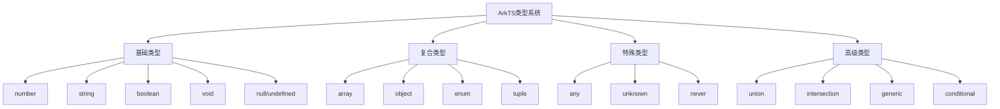
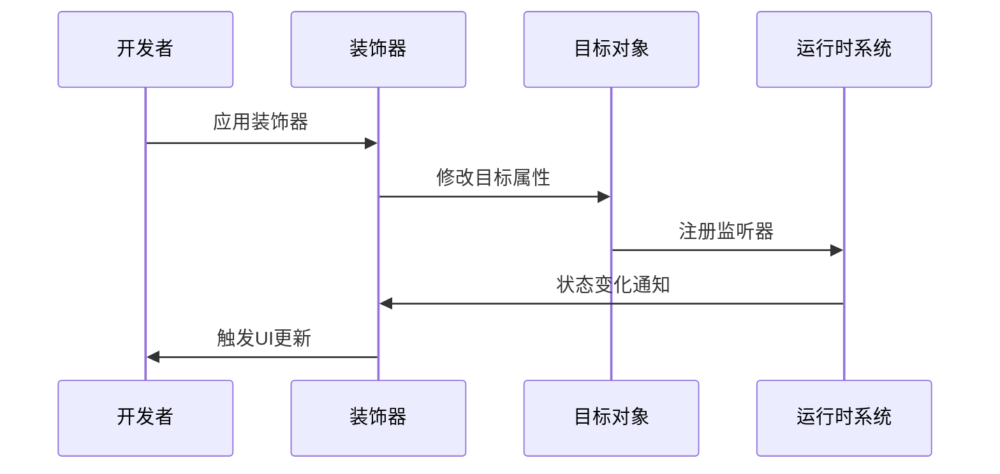
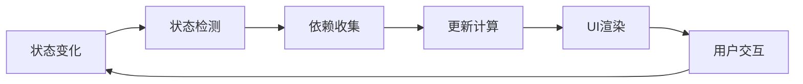
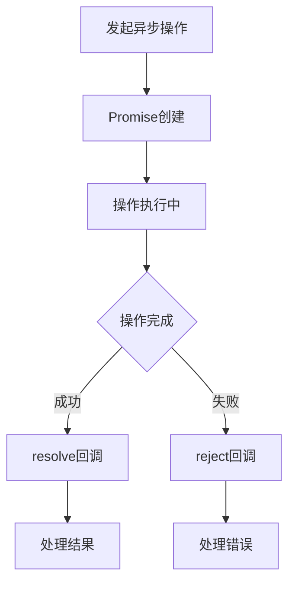

# 第4章：ArkTS语言深入

## 4.1 类型系统与接口定义

### 4.1.1 ArkTS类型系统概述

ArkTS基于TypeScript构建，提供了强大的类型系统，支持静态类型检查、类型推断、泛型编程等特性。类型系统在编译时就能发现潜在的错误，提高代码质量和开发效率。



### 4.1.2 基础类型详解

1. **数字类型**
```typescript
// 整数和浮点数
let age: number = 25;
let price: number = 99.99;
let hex: number = 0xf00d;
let binary: number = 0b1010;
let octal: number = 0o744;

// 数值方法
let pi: number = Math.PI;
let random: number = Math.random();
let max: number = Math.max(1, 2, 3);
```

2. **字符串类型**
```typescript
// 字符串声明
let name: string = "HarmonyOS";
let template: string = `Hello ${name}`;
let multiline: string = `
  第一行
  第二行
  第三行
`;

// 字符串方法
let upper: string = name.toUpperCase();
let length: number = name.length;
let contains: boolean = name.includes("mony");
```

3. **布尔类型**
```typescript
let isVisible: boolean = true;
let isCompleted: boolean = false;
let hasPermission: boolean = age >= 18;

// 布尔运算
let result: boolean = isVisible && isCompleted;
let either: boolean = isVisible || isCompleted;
let not: boolean = !isVisible;
```

### 4.1.3 接口定义与实现

1. **基础接口定义**
```typescript
// 用户接口
interface User {
  readonly id: number;        // 只读属性
  name: string;              // 必需属性
  age?: number;              // 可选属性
  email?: string;            // 可选属性
  [key: string]: any;        // 索引签名
}

// 使用接口
const user: User = {
  id: 1,
  name: "张三",
  age: 25,
  email: "zhangsan@example.com"
};

// 函数接口
interface SearchFunc {
  (source: string, subString: string): boolean;
}

const mySearch: SearchFunc = function(source: string, subString: string): boolean {
  return source.indexOf(subString) > -1;
};
```

2. **接口继承**
```typescript
// 基础接口
interface Person {
  name: string;
  age: number;
}

// 继承接口
interface Employee extends Person {
  employeeId: string;
  department: string;
  salary: number;
}

// 多重继承
interface Manager extends Person, Employee {
  teamSize: number;
  level: string;
}

const manager: Manager = {
  name: "李经理",
  age: 35,
  employeeId: "EMP001",
  department: "技术部",
  salary: 15000,
  teamSize: 10,
  level: "高级"
};
```

3. **泛型接口**
```typescript
// 泛型接口定义
interface Response<T> {
  code: number;
  message: string;
  data: T;
  timestamp: number;
}

// 使用泛型接口
interface User {
  id: number;
  name: string;
}

interface Product {
  id: string;
  title: string;
  price: number;
}

const userResponse: Response<User> = {
  code: 200,
  message: "success",
  data: { id: 1, name: "张三" },
  timestamp: Date.now()
};

const productResponse: Response<Product> = {
  code: 200,
  message: "success",
  data: { id: "P001", title: "手机", price: 2999 },
  timestamp: Date.now()
};
```

### 4.1.4 类型别名与联合类型

1. **类型别名**
```typescript
// 基础类型别名
type ID = string | number;
type Status = "pending" | "success" | "error";
type Callback = (error: Error | null, data?: any) => void;

// 对象类型别名
type Point = {
  x: number;
  y: number;
};

type Circle = {
  center: Point;
  radius: number;
};

// 函数类型别名
type EventHandler<T> = (event: T) => void;
type Validator<T> = (value: T) => boolean;
```

2. **联合类型**
```typescript
// 基础联合类型
type StringOrNumber = string | number;
type BooleanOrUndefined = boolean | undefined;

// 函数参数联合类型
function processValue(value: string | number): void {
  if (typeof value === "string") {
    console.log(`字符串长度: ${value.length}`);
  } else {
    console.log(`数值平方: ${value * value}`);
  }
}

// 对象联合类型
type Cat = {
  type: "cat";
  meow: () => void;
};

type Dog = {
  type: "dog";
  bark: () => void;
};

type Animal = Cat | Dog;

function handleAnimal(animal: Animal): void {
  switch (animal.type) {
    case "cat":
      animal.meow();
      break;
    case "dog":
      animal.bark();
      break;
  }
}
```

## 4.2 装饰器（Decorator）详解

### 4.2.1 装饰器概念与原理

装饰器是一种特殊类型的声明，可以附加到类、方法、属性或参数上，用于修改或扩展其行为。在ArkTS中，装饰器是实现响应式编程和组件化开发的核心机制。



### 4.2.2 常用装饰器详解

1. **@Component装饰器**
```typescript
// 基础组件装饰器
@Component
struct MyComponent {
  // 组件属性和方法
  private title: string = "我的组件";
  
  build() {
    Column() {
      Text(this.title)
        .fontSize(20)
    }
  }
}

// 带参数的组件
@Component
struct CustomButton {
  @Prop text: string = "默认按钮";
  @Prop backgroundColor: ResourceColor = Color.Blue;
  
  build() {
    Button(this.text)
      .backgroundColor(this.backgroundColor)
      .onClick(() => {
        console.log(`${this.text} 被点击`);
      })
  }
}
```

2. **@Entry装饰器**
```typescript
// 页面入口装饰器
@Entry
@Component
struct HomePage {
  @State counter: number = 0;
  
  build() {
    Column() {
      Text(`计数器: ${this.counter}`)
        .fontSize(24)
      
      Button('增加')
        .onClick(() => {
          this.counter++;
        })
    }
  }
}

// 带路由参数的页面
@Entry
@Component
struct DetailPage {
  @State productId: string = "";
  @State productName: string = "";
  
  aboutToAppear() {
    const params = router.getParams() as any;
    if (params) {
      this.productId = params.id;
      this.productName = params.name;
    }
  }
  
  build() {
    Column() {
      Text(`产品ID: ${this.productId}`)
      Text(`产品名称: ${this.productName}`)
    }
  }
}
```

3. **@State装饰器**
```typescript
@Component
struct StateExample {
  // 基础状态
  @State message: string = "Hello";
  @State count: number = 0;
  @State isVisible: boolean = true;
  
  // 对象状态
  @State user: User = {
    id: 1,
    name: "张三",
    age: 25
  };
  
  // 数组状态
  @State items: string[] = ["项目1", "项目2", "项目3"];
  
  build() {
    Column() {
      Text(this.message)
        .fontSize(20)
      
      Button('修改消息')
        .onClick(() => {
          this.message = "Hello HarmonyOS";
        })
      
      Button('增加计数')
        .onClick(() => {
          this.count++;
        })
      
      Button('切换显示')
        .onClick(() => {
          this.isVisible = !this.isVisible;
        })
      
      if (this.isVisible) {
        Text(`用户: ${this.user.name}, 年龄: ${this.user.age}`)
      }
      
      ForEach(this.items, (item: string, index: number) => {
        Text(`${index + 1}. ${item}`)
      })
    }
  }
}
```

4. **@Prop装饰器**
```typescript
// 父组件
@Component
struct ParentComponent {
  @State title: string = "父组件标题";
  @State count: number = 0;
  
  build() {
    Column() {
      Text(this.title)
        .fontSize(20)
      
      ChildComponent({
        childTitle: this.title,
        childCount: this.count,
        onCountChange: (newCount: number) => {
          this.count = newCount;
        }
      })
      
      Button('父组件增加')
        .onClick(() => {
          this.count++;
        })
    }
  }
}

// 子组件
@Component
struct ChildComponent {
  @Prop childTitle: string;
  @Prop childCount: number;
  @Prop onCountChange: (count: number) => void;
  
  build() {
    Column() {
      Text(`子组件接收标题: ${this.childTitle}`)
      Text(`子组件接收计数: ${this.childCount}`)
      
      Button('子组件增加')
        .onClick(() => {
          this.onCountChange(this.childCount + 1);
        })
    }
    .backgroundColor(Color.Gray)
    .padding(10)
    .margin(10)
  }
}
```

5. **@Link装饰器**
```typescript
@Component
struct LinkExample {
  @State message: string = "双向绑定测试";
  
  build() {
    Column() {
      Text(`父组件: ${this.message}`)
        .fontSize(18)
      
      // 双向绑定子组件
      LinkedChildComponent({
        linkedMessage: $message
      })
    }
  }
}

@Component
struct LinkedChildComponent {
  @Link linkedMessage: string;
  
  build() {
    Column() {
      Text(`子组件: ${this.linkedMessage}`)
        .fontSize(16)
      
      TextInput({ placeholder: "输入消息" })
        .width('80%')
        .onChange((value: string) => {
          this.linkedMessage = value;
        })
      
      Button('重置消息')
        .onClick(() => {
          this.linkedMessage = "重置后的消息";
        })
    }
    .backgroundColor(Color.LightGray)
    .padding(10)
  }
}
```

### 4.2.3 自定义装饰器

1. **属性装饰器**
```typescript
// 日志装饰器
function Log(target: any, propertyKey: string) {
  let value = target[propertyKey];
  
  const getter = () => {
    console.log(`获取属性 ${propertyKey}: ${value}`);
    return value;
  };
  
  const setter = (newValue: any) => {
    console.log(`设置属性 ${propertyKey}: ${newValue}`);
    value = newValue;
  };
  
  Object.defineProperty(target, propertyKey, {
    get: getter,
    set: setter,
    enumerable: true,
    configurable: true
  });
}

// 缓存装饰器
function Cache(target: any, propertyKey: string, descriptor: PropertyDescriptor) {
  const originalMethod = descriptor.value;
  const cache = new Map();
  
  descriptor.value = function(...args: any[]) {
    const key = JSON.stringify(args);
    
    if (cache.has(key)) {
      return cache.get(key);
    }
    
    const result = originalMethod.apply(this, args);
    cache.set(key, result);
    return result;
  };
}

// 使用自定义装饰器
class Calculator {
  @Log
  public result: number = 0;
  
  @Cache
  public fibonacci(n: number): number {
    if (n <= 1) return n;
    return this.fibonacci(n - 1) + this.fibonacci(n - 2);
  }
}
```

## 4.3 状态管理与响应式编程

### 4.3.1 响应式编程原理

响应式编程是一种面向数据流和变化传播的编程范式。在ArkTS中，当状态发生变化时，UI会自动更新以反映最新的状态。



### 4.3.2 状态管理策略

1. **本地状态管理**
```typescript
@Component
struct LocalStateComponent {
  // 简单状态
  @State counter: number = 0;
  @State text: string = "";
  @State isLoading: boolean = false;
  
  // 复杂对象状态
  @State formData: {
    username: string;
    password: string;
    email: string;
  } = {
    username: "",
    password: "",
    email: ""
  };
  
  // 数组状态
  @State todoList: Array<{
    id: number;
    text: string;
    completed: boolean;
  }> = [];
  
  // 计算属性
  get completedCount(): number {
    return this.todoList.filter(item => item.completed).length;
  }
  
  get totalCount(): number {
    return this.todoList.length;
  }
  
  // 状态更新方法
  private addTodo(text: string): void {
    const newTodo = {
      id: Date.now(),
      text: text,
      completed: false
    };
    this.todoList.push(newTodo);
  }
  
  private toggleTodo(id: number): void {
    const todo = this.todoList.find(item => item.id === id);
    if (todo) {
      todo.completed = !todo.completed;
    }
  }
  
  build() {
    Column() {
      Text(`待办事项: ${this.completedCount}/${this.totalCount}`)
        .fontSize(18)
        .margin({ bottom: 10 })
      
      ForEach(this.todoList, (todo: any) => {
        Row() {
          Checkbox(todo.completed)
            .onChange((checked: boolean) => {
              this.toggleTodo(todo.id);
            })
          
          Text(todo.text)
            .fontSize(16)
            .decoration({
              type: todo.completed ? TextDecorationType.LineThrough : TextDecorationType.None
            })
        }
        .width('100%')
        .justifyContent(FlexAlign.Start)
        .margin({ bottom: 5 })
      })
      
      Button('添加待办')
        .onClick(() => {
          this.addTodo(`新待办 ${this.todoList.length + 1}`);
        })
    }
    .padding(20)
  }
}
```

2. **跨组件状态共享**
```typescript
// 状态管理类
class AppState {
  private static instance: AppState;
  private _user: User | null = null;
  private _theme: string = "light";
  private _language: string = "zh-CN";
  
  private constructor() {}
  
  static getInstance(): AppState {
    if (!AppState.instance) {
      AppState.instance = new AppState();
    }
    return AppState.instance;
  }
  
  get user(): User | null {
    return this._user;
  }
  
  set user(value: User | null) {
    this._user = value;
    this.notifyListeners('user', value);
  }
  
  get theme(): string {
    return this._theme;
  }
  
  set theme(value: string) {
    this._theme = value;
    this.notifyListeners('theme', value);
  }
  
  private listeners: Map<string, Array<(value: any) => void>> = new Map();
  
  subscribe(property: string, callback: (value: any) => void): void {
    if (!this.listeners.has(property)) {
      this.listeners.set(property, []);
    }
    this.listeners.get(property)?.push(callback);
  }
  
  private notifyListeners(property: string, value: any): void {
    const callbacks = this.listeners.get(property);
    if (callbacks) {
      callbacks.forEach(callback => callback(value));
    }
  }
}

// 使用状态管理的组件
@Component
struct UserProfile {
  @State user: User | null = null;
  private appState = AppState.getInstance();
  
  aboutToAppear() {
    this.user = this.appState.user;
    this.appState.subscribe('user', (newUser: User | null) => {
      this.user = newUser;
    });
  }
  
  build() {
    Column() {
      if (this.user) {
        Text(`用户名: ${this.user.name}`)
        Text(`年龄: ${this.user.age}`)
      } else {
        Text('未登录')
      }
      
      Button(this.user ? '退出登录' : '登录')
        .onClick(() => {
          if (this.user) {
            this.appState.user = null;
          } else {
            this.appState.user = {
              id: 1,
              name: "张三",
              age: 25
            };
          }
        })
    }
  }
}
```

### 4.3.3 状态持久化

```typescript
// 本地存储工具类
class LocalStorage {
  private static instance: LocalStorage;
  
  static getInstance(): LocalStorage {
    if (!LocalStorage.instance) {
      LocalStorage.instance = new LocalStorage();
    }
    return LocalStorage.instance;
  }
  
  async setItem(key: string, value: any): Promise<void> {
    try {
      const jsonString = JSON.stringify(value);
      await preferences.setValue(key, jsonString);
    } catch (error) {
      console.error('保存数据失败:', error);
    }
  }
  
  async getItem<T>(key: string, defaultValue?: T): Promise<T | undefined> {
    try {
      const jsonString = await preferences.getValue(key);
      if (jsonString) {
        return JSON.parse(jsonString) as T;
      }
      return defaultValue;
    } catch (error) {
      console.error('读取数据失败:', error);
      return defaultValue;
    }
  }
  
  async removeItem(key: string): Promise<void> {
    try {
      await preferences.deleteValue(key);
    } catch (error) {
      console.error('删除数据失败:', error);
    }
  }
}

// 持久化状态组件
@Component
struct PersistentStateComponent {
  @State settings: {
    theme: string;
    language: string;
    notifications: boolean;
  } = {
    theme: "light",
    language: "zh-CN",
    notifications: true
  };
  
  private localStorage = LocalStorage.getInstance();
  
  aboutToAppear() {
    this.loadSettings();
  }
  
  private async loadSettings(): Promise<void> {
    const savedSettings = await this.localStorage.getItem('app_settings');
    if (savedSettings) {
      this.settings = savedSettings;
    }
  }
  
  private async saveSettings(): Promise<void> {
    await this.localStorage.setItem('app_settings', this.settings);
  }
  
  build() {
    Column() {
      Text('应用设置')
        .fontSize(20)
        .margin({ bottom: 20 })
      
      Text(`主题: ${this.settings.theme}`)
      Text(`语言: ${this.settings.language}`)
      Text(`通知: ${this.settings.notifications ? '开启' : '关闭'}`)
      
      Button('切换主题')
        .onClick(() => {
          this.settings.theme = this.settings.theme === "light" ? "dark" : "light";
          this.saveSettings();
        })
      
      Button('切换语言')
        .onClick(() => {
          this.settings.language = this.settings.language === "zh-CN" ? "en-US" : "zh-CN";
          this.saveSettings();
        })
      
      Button('切换通知')
        .onClick(() => {
          this.settings.notifications = !this.settings.notifications;
          this.saveSettings();
        })
    }
    .padding(20)
  }
}
```

## 4.4 异步编程与Promise

### 4.4.1 异步编程概念

异步编程允许程序在等待某些操作完成时继续执行其他任务，提高应用的响应性和性能。ArkTS提供了Promise、async/await等异步编程机制。



### 4.4.2 Promise基础使用

1. **创建和使用Promise**
```typescript
// 基础Promise
function fetchData(url: string): Promise<string> {
  return new Promise((resolve, reject) => {
    // 模拟网络请求
    setTimeout(() => {
      if (url.startsWith('https://')) {
        resolve(`数据来自: ${url}`);
      } else {
        reject(new Error('无效的URL'));
      }
    }, 1000);
  });
}

// 使用Promise
fetchData('https://api.example.com/data')
  .then(data => {
    console.log('成功:', data);
  })
  .catch(error => {
    console.error('失败:', error.message);
  })
  .finally(() => {
    console.log('请求完成');
  });
```

2. **Promise链式调用**
```typescript
class DataProcessor {
  // 获取用户信息
  static getUser(id: number): Promise<User> {
    return new Promise((resolve) => {
      setTimeout(() => {
        resolve({ id, name: `用户${id}`, age: 20 + id });
      }, 500);
    });
  }
  
  // 获取用户订单
  static getUserOrders(userId: number): Promise<Order[]> {
    return new Promise((resolve) => {
      setTimeout(() => {
        resolve([
          { id: 1, userId, amount: 99.99 },
          { id: 2, userId, amount: 199.99 }
        ]);
      }, 500);
    });
  }
  
  // 获取订单详情
  static getOrderDetail(orderId: number): Promise<OrderDetail> {
    return new Promise((resolve) => {
      setTimeout(() => {
        resolve({
          orderId,
          items: ['商品1', '商品2'],
          total: 299.98
        });
      }, 500);
    });
  }
}

// 链式调用示例
DataProcessor.getUser(1)
  .then(user => {
    console.log('用户信息:', user);
    return DataProcessor.getUserOrders(user.id);
  })
  .then(orders => {
    console.log('用户订单:', orders);
    return DataProcessor.getOrderDetail(orders[0].id);
  })
  .then(detail => {
    console.log('订单详情:', detail);
  })
  .catch(error => {
    console.error('处理失败:', error);
  });
```

### 4.4.3 async/await语法

1. **基础async/await使用**
```typescript
@Component
struct AsyncAwaitComponent {
  @State userData: User | null = null;
  @State orders: Order[] = [];
  @State isLoading: boolean = false;
  @State errorMessage: string = "";
  
  // 异步获取数据
  private async loadUserData(userId: number): Promise<void> {
    this.isLoading = true;
    this.errorMessage = "";
    
    try {
      // 并行获取用户和订单数据
      const [user, orders] = await Promise.all([
        DataProcessor.getUser(userId),
        DataProcessor.getUserOrders(userId)
      ]);
      
      this.userData = user;
      this.orders = orders;
      
    } catch (error) {
      this.errorMessage = `加载失败: ${error}`;
    } finally {
      this.isLoading = false;
    }
  }
  
  // 顺序获取数据
  private async loadSequentialData(userId: number): Promise<void> {
    try {
      const user = await DataProcessor.getUser(userId);
      this.userData = user;
      
      const orders = await DataProcessor.getUserOrders(user.id);
      this.orders = orders;
      
      if (orders.length > 0) {
        const detail = await DataProcessor.getOrderDetail(orders[0].id);
        console.log('订单详情:', detail);
      }
    } catch (error) {
      console.error('顺序加载失败:', error);
    }
  }
  
  build() {
    Column() {
      if (this.isLoading) {
        LoadingProgress()
          .width(50)
          .height(50)
        Text('加载中...')
          .margin({ top: 10 })
      } else if (this.errorMessage) {
        Text(this.errorMessage)
          .fontSize(16)
          .fontColor(Color.Red)
      } else if (this.userData) {
        Text(`用户: ${this.userData.name}`)
          .fontSize(18)
        Text(`订单数量: ${this.orders.length}`)
          .fontSize(16)
      }
      
      Button('加载数据')
        .onClick(() => {
          this.loadUserData(1);
        })
        .margin({ top: 20 })
    }
    .padding(20)
  }
}
```

2. **错误处理策略**
```typescript
// 错误处理工具类
class ErrorHandler {
  // 重试机制
  static async retry<T>(
    operation: () => Promise<T>,
    maxAttempts: number = 3,
    delay: number = 1000
  ): Promise<T> {
    let lastError: Error;
    
    for (let attempt = 1; attempt <= maxAttempts; attempt++) {
      try {
        return await operation();
      } catch (error) {
        lastError = error as Error;
        console.warn(`尝试 ${attempt} 失败:`, error);
        
        if (attempt < maxAttempts) {
          await this.delay(delay * attempt);
        }
      }
    }
    
    throw lastError!;
  }
  
  // 超时控制
  static async withTimeout<T>(
    operation: () => Promise<T>,
    timeoutMs: number
  ): Promise<T> {
    const timeoutPromise = new Promise<never>((_, reject) => {
      setTimeout(() => {
        reject(new Error(`操作超时 (${timeoutMs}ms)`));
      }, timeoutMs);
    });
    
    return Promise.race([operation(), timeoutPromise]);
  }
  
  // 批量处理
  static async batchProcess<T, R>(
    items: T[],
    processor: (item: T) => Promise<R>,
    batchSize: number = 5
  ): Promise<R[]> {
    const results: R[] = [];
    
    for (let i = 0; i < items.length; i += batchSize) {
      const batch = items.slice(i, i + batchSize);
      const batchResults = await Promise.all(
        batch.map(item => processor(item))
      );
      results.push(...batchResults);
    }
    
    return results;
  }
  
  private static delay(ms: number): Promise<void> {
    return new Promise(resolve => setTimeout(resolve, ms));
  }
}

// 使用错误处理
class NetworkService {
  static async fetchDataWithRetry(url: string): Promise<any> {
    return ErrorHandler.retry(async () => {
      const response = await fetch(url);
      if (!response.ok) {
        throw new Error(`HTTP错误: ${response.status}`);
      }
      return response.json();
    });
  }
  
  static async fetchDataWithTimeout(url: string): Promise<any> {
    return ErrorHandler.withTimeout(async () => {
      const response = await fetch(url);
      return response.json();
    }, 5000);
  }
}
```

## 4.5 错误处理与调试技巧

### 4.5.1 错误类型与处理

1. **错误分类**
```typescript
// 自定义错误类型
class AppError extends Error {
  constructor(
    message: string,
    public code: string,
    public statusCode: number = 500
  ) {
    super(message);
    this.name = 'AppError';
  }
}

class ValidationError extends AppError {
  constructor(message: string, public field: string) {
    super(message, 'VALIDATION_ERROR', 400);
    this.name = 'ValidationError';
  }
}

class NetworkError extends AppError {
  constructor(message: string, public url: string) {
    super(message, 'NETWORK_ERROR', 0);
    this.name = 'NetworkError';
  }
}

// 错误处理中间件
class ErrorBoundary {
  private static instance: ErrorBoundary;
  private errorHandlers: Map<string, (error: Error) => void> = new Map();
  
  static getInstance(): ErrorBoundary {
    if (!ErrorBoundary.instance) {
      ErrorBoundary.instance = new ErrorBoundary();
    }
    return ErrorBoundary.instance;
  }
  
  registerHandler(errorType: string, handler: (error: Error) => void): void {
    this.errorHandlers.set(errorType, handler);
  }
  
  handleError(error: Error): void {
    console.error('发生错误:', error);
    
    const handler = this.errorHandlers.get(error.constructor.name);
    if (handler) {
      handler(error);
    } else {
      this.defaultErrorHandler(error);
    }
  }
  
  private defaultErrorHandler(error: Error): void {
    // 默认错误处理逻辑
    if (error instanceof ValidationError) {
      console.warn(`验证错误 - 字段: ${error.field}, 消息: ${error.message}`);
    } else if (error instanceof NetworkError) {
      console.error(`网络错误 - URL: ${error.url}, 消息: ${error.message}`);
    } else {
      console.error('未知错误:', error);
    }
  }
}
```

2. **错误边界组件**
```typescript
@Component
struct ErrorBoundaryComponent {
  @State hasError: boolean = false;
  @State errorMessage: string = "";
  @State errorStack: string = "";
  
  private errorBoundary = ErrorBoundary.getInstance();
  
  aboutToAppear() {
    // 注册错误处理器
    this.errorBoundary.registerHandler('AppError', (error: AppError) => {
      this.hasError = true;
      this.errorMessage = error.message;
      this.errorStack = error.stack || "";
    });
  }
  
  private resetError(): void {
    this.hasError = false;
    this.errorMessage = "";
    this.errorStack = "";
  }
  
  build() {
    Column() {
      if (this.hasError) {
        // 错误显示界面
        Column() {
          Text('发生错误')
            .fontSize(24)
            .fontColor(Color.Red)
            .margin({ bottom: 10 })
          
          Text(this.errorMessage)
            .fontSize(16)
            .margin({ bottom: 20 })
          
          Button('重试')
            .onClick(() => {
              this.resetError();
            })
        }
        .padding(20)
        .backgroundColor(Color.LightGray)
      } else {
        // 正常内容
        this.renderContent();
      }
    }
  }
  
  @Builder
  private renderContent(): void {
    // 这里放置正常的内容
    Text('正常内容区域')
      .fontSize(18)
  }
}
```

### 4.5.2 调试技巧与工具

1. **日志系统**
```typescript
// 日志级别枚举
enum LogLevel {
  DEBUG = 0,
  INFO = 1,
  WARN = 2,
  ERROR = 3
}

// 日志工具类
class Logger {
  private static instance: Logger;
  private currentLevel: LogLevel = LogLevel.INFO;
  private logs: Array<{
    timestamp: number;
    level: LogLevel;
    message: string;
    data?: any;
  }> = [];
  
  static getInstance(): Logger {
    if (!Logger.instance) {
      Logger.instance = new Logger();
    }
    return Logger.instance;
  }
  
  setLevel(level: LogLevel): void {
    this.currentLevel = level;
  }
  
  debug(message: string, data?: any): void {
    this.log(LogLevel.DEBUG, message, data);
  }
  
  info(message: string, data?: any): void {
    this.log(LogLevel.INFO, message, data);
  }
  
  warn(message: string, data?: any): void {
    this.log(LogLevel.WARN, message, data);
  }
  
  error(message: string, data?: any): void {
    this.log(LogLevel.ERROR, message, data);
  }
  
  private log(level: LogLevel, message: string, data?: any): void {
    if (level < this.currentLevel) {
      return;
    }
    
    const logEntry = {
      timestamp: Date.now(),
      level,
      message,
      data
    };
    
    this.logs.push(logEntry);
    
    // 控制台输出
    const levelName = LogLevel[level];
    const timestamp = new Date(logEntry.timestamp).toISOString();
    console.log(`[${timestamp}] [${levelName}] ${message}`, data || '');
  }
  
  getLogs(): Array<any> {
    return [...this.logs];
  }
  
  clearLogs(): void {
    this.logs = [];
  }
}

// 使用日志系统
const logger = Logger.getInstance();

@Component
struct LoggingComponent {
  @State clickCount: number = 0;
  
  build() {
    Column() {
      Text(`点击次数: ${this.clickCount}`)
        .fontSize(18)
      
      Button('点击我')
        .onClick(() => {
          this.clickCount++;
          logger.info('按钮被点击', { count: this.clickCount });
        })
      
      Button('触发错误')
        .onClick(() => {
          try {
            throw new Error('测试错误');
          } catch (error) {
            logger.error('捕获到错误', error);
          }
        })
    }
    .padding(20)
  }
}
```

2. **性能监控**
```typescript
// 性能监控工具
class PerformanceMonitor {
  private static instance: PerformanceMonitor;
  private timers: Map<string, number> = new Map();
  private metrics: Array<{
    name: string;
    duration: number;
    timestamp: number;
  }> = [];
  
  static getInstance(): PerformanceMonitor {
    if (!PerformanceMonitor.instance) {
      PerformanceMonitor.instance = new PerformanceMonitor();
    }
    return PerformanceMonitor.instance;
  }
  
  startTimer(name: string): void {
    this.timers.set(name, Date.now());
  }
  
  endTimer(name: string): number {
    const startTime = this.timers.get(name);
    if (!startTime) {
      console.warn(`计时器 ${name} 未找到`);
      return 0;
    }
    
    const duration = Date.now() - startTime;
    this.timers.delete(name);
    
    this.metrics.push({
      name,
      duration,
      timestamp: Date.now()
    });
    
    console.log(`性能指标 ${name}: ${duration}ms`);
    return duration;
  }
  
  measureFunction<T>(name: string, fn: () => T): T {
    this.startTimer(name);
    try {
      return fn();
    } finally {
      this.endTimer(name);
    }
  }
  
  async measureAsyncFunction<T>(name: string, fn: () => Promise<T>): Promise<T> {
    this.startTimer(name);
    try {
      return await fn();
    } finally {
      this.endTimer(name);
    }
  }
  
  getMetrics(): Array<any> {
    return [...this.metrics];
  }
  
  getAverageTime(name: string): number {
    const nameMetrics = this.metrics.filter(m => m.name === name);
    if (nameMetrics.length === 0) return 0;
    
    const total = nameMetrics.reduce((sum, m) => sum + m.duration, 0);
    return total / nameMetrics.length;
  }
}

// 使用性能监控
const monitor = PerformanceMonitor.getInstance();

@Component
struct PerformanceComponent {
  @State data: string[] = [];
  @State loadingTime: number = 0;
  
  private async loadData(): Promise<void> {
    await monitor.measureAsyncFunction('loadData', async () => {
      // 模拟数据加载
      await new Promise(resolve => setTimeout(resolve, 1000));
      this.data = Array.from({ length: 100 }, (_, i) => `项目 ${i + 1}`);
    });
  }
  
  build() {
    Column() {
      Text(`数据加载时间: ${this.loadingTime}ms`)
        .fontSize(16)
      
      Button('加载数据')
        .onClick(() => {
          this.loadData();
        })
      
      ForEach(this.data, (item: string) => {
        Text(item)
          .fontSize(14)
      })
    }
    .padding(20)
  }
}
```

## 本章小结

本章深入讲解了ArkTS语言的高级特性，包括类型系统、装饰器、状态管理、异步编程和错误处理。通过本章的学习，您应该掌握：

1. ArkTS强大的类型系统和接口定义
2. 装饰器的工作原理和自定义装饰器开发
3. 响应式状态管理的各种策略和实现
4. 异步编程的Promise和async/await模式
5. 完善的错误处理机制和调试技巧

这些高级特性是构建复杂鸿蒙应用的基础，掌握它们将大大提升您的开发效率和代码质量。

## 思考题

1. 装饰器是如何实现响应式数据绑定的？
2. 如何设计一个全局状态管理方案？
3. Promise和async/await各有什么优势？
4. 如何实现一个完善的错误边界组件？
5. 性能监控在开发中有哪些实际应用场景？