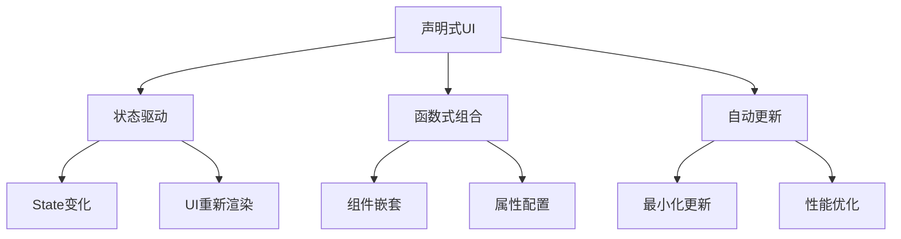
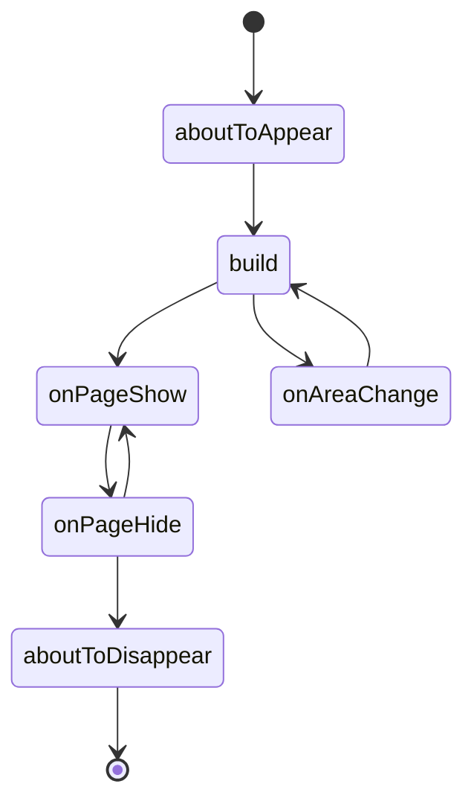
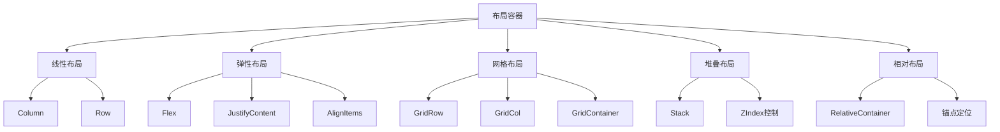
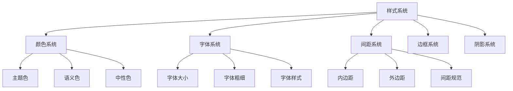
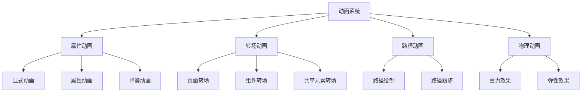

# 第5章：ArkUI框架基础

## 5.1 声明式UI开发范式

### 5.1.1 声明式UI概述

ArkUI采用声明式UI开发范式，开发者只需描述UI应该是什么样子，而不需要关心如何实现。这种方式相比传统的命令式UI开发更加直观、简洁和易于维护。



### 5.1.2 声明式vs命令式对比

1. **命令式UI开发**
```typescript
// 传统命令式方式（伪代码）
class ImperativeUI {
  private textView: TextView;
  private button: Button;
  
  createUI() {
    // 创建视图
    this.textView = new TextView();
    this.textView.setText("Hello World");
    this.textView.setTextSize(16);
    this.textView.setColor(Color.BLACK);
    
    this.button = new Button();
    this.button.setText("Click Me");
    this.button.setOnClickListener(() => {
      this.textView.setText("Button Clicked!");
    });
    
    // 添加到布局
    this.addView(this.textView);
    this.addView(this.button);
  }
  
  updateText(newText: string) {
    // 手动更新UI
    this.textView.setText(newText);
  }
}
```

2. **声明式UI开发**
```typescript
// ArkUI声明式方式
@Entry
@Component
struct DeclarativeUI {
  @State message: string = "Hello World";
  
  build() {
    Column() {
      Text(this.message)
        .fontSize(16)
        .fontColor(Color.Black)
      
      Button("Click Me")
        .onClick(() => {
          this.message = "Button Clicked!";
        })
    }
  }
}
```

### 5.1.3 声明式UI核心特性

1. **状态驱动UI**
```typescript
@Component
struct StateDrivenUI {
  @State counter: number = 0;
  @State isLoading: boolean = false;
  @State items: string[] = [];
  
  build() {
    Column() {
      // UI自动响应状态变化
      if (this.isLoading) {
        LoadingProgress()
          .width(50)
          .height(50)
      } else {
        Text(`计数: ${this.counter}`)
          .fontSize(20)
        
        Button('增加')
          .onClick(() => {
            this.counter++;
          })
        
        ForEach(this.items, (item: string) => {
          Text(item)
            .fontSize(16)
        })
      }
    }
  }
}
```

2. **组件组合**
```typescript
// 可复用的卡片组件
@Component
struct Card {
  @Prop title: string;
  @Prop subtitle?: string;
  @Prop content: string;
  
  build() {
    Column() {
      Text(this.title)
        .fontSize(18)
        .fontWeight(FontWeight.Bold)
        .margin({ bottom: 5 })
      
      if (this.subtitle) {
        Text(this.subtitle)
          .fontSize(14)
          .fontColor(Color.Gray)
          .margin({ bottom: 10 })
      }
      
      Text(this.content)
        .fontSize(16)
        .lineHeight(24)
    }
    .padding(16)
    .backgroundColor(Color.White)
    .borderRadius(8)
    .shadow({ radius: 4, color: Color.Gray, offsetX: 0, offsetY: 2 })
  }
}

// 使用卡片组件
@Entry
@Component
struct CardUsage {
  build() {
    Column() {
      Card({
        title: "标题1",
        subtitle: "副标题",
        content: "这是卡片的内容描述..."
      })
      
      Card({
        title: "标题2",
        content: "另一个卡片的内容..."
      })
    }
    .padding(20)
    .backgroundColor(Color.LightGray)
  }
}
```

## 5.2 组件生命周期

### 5.2.1 生命周期概述

ArkUI组件具有完整的生命周期，从创建到销毁经历多个阶段，每个阶段都有对应的回调函数。



### 5.2.2 生命周期方法详解

1. **页面生命周期**
```typescript
@Entry
@Component
struct LifecyclePage {
  @State message: string = "生命周期演示";
  private pageStartTime: number = 0;
  
  // 页面即将出现
  aboutToAppear() {
    console.log('aboutToAppear - 页面即将出现');
    this.pageStartTime = Date.now();
    
    // 初始化数据
    this.initializeData();
  }
  
  // 页面即将消失
  aboutToDisappear() {
    console.log('aboutToDisappear - 页面即将消失');
    
    // 清理资源
    this.cleanup();
  }
  
  // 页面显示
  onPageShow() {
    console.log('onPageShow - 页面已显示');
    
    // 页面可见时的操作
    this.startTimer();
  }
  
  // 页面隐藏
  onPageHide() {
    console.log('onPageHide - 页面已隐藏');
    
    // 页面不可见时的操作
    this.stopTimer();
  }
  
  // 组件区域变化
  onAreaChange(oldValue: Area, newValue: Area) {
    console.log(`onAreaChange - 区域变化: ${JSON.stringify(newValue)}`);
    
    // 响应布局变化
    this.handleLayoutChange(newValue);
  }
  
  private initializeData(): void {
    console.log('初始化页面数据');
  }
  
  private cleanup(): void {
    console.log('清理页面资源');
  }
  
  private startTimer(): void {
    console.log('启动定时器');
  }
  
  private stopTimer(): void {
    console.log('停止定时器');
  }
  
  private handleLayoutChange(area: Area): void {
    console.log(`处理布局变化: 宽度=${area.width}, 高度=${area.height}`);
  }
  
  build() {
    Column() {
      Text(this.message)
        .fontSize(20)
        .margin({ bottom: 20 })
      
      Text('查看控制台日志了解生命周期')
        .fontSize(16)
        .fontColor(Color.Gray)
      
      Button('跳转到其他页面')
        .onClick(() => {
          router.pushUrl({
            url: 'pages/OtherPage'
          });
        })
        .margin({ top: 20 })
    }
    .padding(20)
  }
}
```

2. **组件生命周期**
```typescript
@Component
struct CustomComponent {
  @Prop title: string;
  @State internalState: number = 0;
  
  // 组件即将出现
  aboutToAppear() {
    console.log(`CustomComponent aboutToAppear: ${this.title}`);
    this.setupComponent();
  }
  
  // 组件即将消失
  aboutToDisappear() {
    console.log(`CustomComponent aboutToDisappear: ${this.title}`);
    this.cleanupComponent();
  }
  
  // 组件构建
  build() {
    Column() {
      Text(this.title)
        .fontSize(18)
        .fontWeight(FontWeight.Bold)
      
      Text(`内部状态: ${this.internalState}`)
        .fontSize(16)
        .margin({ top: 10 })
      
      Button('增加状态')
        .onClick(() => {
          this.internalState++;
        })
        .margin({ top: 10 })
    }
    .padding(15)
    .backgroundColor(Color.LightBlue)
    .borderRadius(8)
  }
  
  private setupComponent(): void {
    console.log(`设置组件: ${this.title}`);
  }
  
  private cleanupComponent(): void {
    console.log(`清理组件: ${this.title}`);
  }
}

// 使用自定义组件
@Entry
@Component
struct ComponentLifecycleDemo {
  @State showComponent: boolean = true;
  
  build() {
    Column() {
      if (this.showComponent) {
        CustomComponent({
          title: "生命周期演示组件"
        })
      }
      
      Button(this.showComponent ? '隐藏组件' : '显示组件')
        .onClick(() => {
          this.showComponent = !this.showComponent;
        })
        .margin({ top: 20 })
    }
    .padding(20)
  }
}
```

### 5.2.3 生命周期最佳实践

```typescript
// 生命周期管理最佳实践
@Component
struct BestPracticeComponent {
  @State data: any[] = [];
  @State isLoading: boolean = false;
  
  private timer: number = 0;
  private dataSubscription: any = null;
  
  aboutToAppear() {
    console.log('组件初始化开始');
    
    // 1. 初始化状态
    this.initializeState();
    
    // 2. 设置数据监听
    this.setupDataSubscription();
    
    // 3. 启动定时器
    this.startPeriodicUpdate();
    
    // 4. 加载初始数据
    this.loadInitialData();
  }
  
  aboutToDisappear() {
    console.log('组件清理开始');
    
    // 1. 清理定时器
    this.clearTimer();
    
    // 2. 取消数据订阅
    this.removeDataSubscription();
    
    // 3. 保存状态
    this.saveState();
  }
  
  private initializeState(): void {
    this.data = [];
    this.isLoading = false;
  }
  
  private setupDataSubscription(): void {
    // 设置数据变化监听
    this.dataSubscription = DataStore.subscribe((newData: any[]) => {
      this.data = newData;
    });
  }
  
  private removeDataSubscription(): void {
    if (this.dataSubscription) {
      this.dataSubscription.unsubscribe();
      this.dataSubscription = null;
    }
  }
  
  private startPeriodicUpdate(): void {
    this.timer = setInterval(() => {
      this.updateData();
    }, 5000);
  }
  
  private clearTimer(): void {
    if (this.timer) {
      clearInterval(this.timer);
      this.timer = 0;
    }
  }
  
  private async loadInitialData(): Promise<void> {
    this.isLoading = true;
    try {
      const result = await DataService.fetchData();
      this.data = result;
    } catch (error) {
      console.error('加载数据失败:', error);
    } finally {
      this.isLoading = false;
    }
  }
  
  private updateData(): void {
    // 定期更新数据
    console.log('定期更新数据');
  }
  
  private saveState(): void {
    // 保存组件状态
    DataStore.saveComponentState({
      data: this.data,
      timestamp: Date.now()
    });
  }
  
  build() {
    Column() {
      if (this.isLoading) {
        LoadingProgress()
          .width(50)
          .height(50)
      } else {
        ForEach(this.data, (item: any, index: number) => {
          Text(`项目 ${index + 1}: ${item.name}`)
            .fontSize(16)
            .margin({ bottom: 5 })
        })
      }
    }
    .padding(20)
  }
}
```

## 5.3 布局系统详解

### 5.3.1 布局容器类型

ArkUI提供了多种布局容器，满足不同的UI设计需求：



### 5.3.2 线性布局详解

1. **Column垂直布局**
```typescript
@Component
struct ColumnLayoutExample {
  build() {
    Column() {
      Text('顶部标题')
        .fontSize(24)
        .fontWeight(FontWeight.Bold)
        .margin({ bottom: 20 })
      
      Text('中间内容')
        .fontSize(16)
        .backgroundColor(Color.LightGray)
        .width('100%')
        .height(100)
        .margin({ bottom: 20 })
      
      Text('底部内容')
        .fontSize(14)
        .fontColor(Color.Gray)
    }
    .width('100%')
    .height('100%')
    .padding(20)
    // 垂直对齐方式
    .justifyContent(FlexAlign.Start)    // Start/Center/End/SpaceBetween/SpaceAround/SpaceEvenly
    // 水平对齐方式
    .alignItems(HorizontalAlign.Center) // Start/Center/End
  }
}
```

2. **Row水平布局**
```typescript
@Component
struct RowLayoutExample {
  build() {
    Row() {
      Text('左侧')
        .fontSize(16)
        .backgroundColor(Color.Red)
        .width(80)
        .height(50)
        .textAlign(TextAlign.Center)
      
      Text('中间')
        .fontSize(16)
        .backgroundColor(Color.Green)
        .width(100)
        .height(50)
        .textAlign(TextAlign.Center)
        .margin({ left: 10, right: 10 })
      
      Text('右侧')
        .fontSize(16)
        .backgroundColor(Color.Blue)
        .width(80)
        .height(50)
        .textAlign(TextAlign.Center)
    }
    .width('100%')
    .height('100%')
    .padding(20)
    // 水平对齐方式
    .justifyContent(FlexAlign.SpaceAround)
    // 垂直对齐方式
    .alignItems(VerticalAlign.Center)
  }
}
```

### 5.3.3 弹性布局（Flex）

1. **基础Flex布局**
```typescript
@Component
struct FlexLayoutExample {
  build() {
    Flex({
      direction: FlexDirection.Row,    // Row/Column/RowReverse/ColumnReverse
      wrap: FlexWrap.NoWrap,           // NoWrap/Wrap/WrapReverse
      justifyContent: FlexAlign.Start, // Start/Center/End/SpaceBetween/SpaceAround/SpaceEvenly
      alignItems: ItemAlign.Start,      // Start/Center/End/Stretch/Baseline
      alignContent: FlexAlign.Start    // Start/Center/End/SpaceBetween/SpaceAround/SpaceEvenly
    }) {
      Text('项目1')
        .fontSize(16)
        .backgroundColor(Color.Red)
        .width(60)
        .height(40)
        .margin(5)
      
      Text('项目2')
        .fontSize(16)
        .backgroundColor(Color.Green)
        .width(80)
        .height(40)
        .margin(5)
        .flexGrow(1)  // 占用剩余空间
      
      Text('项目3')
        .fontSize(16)
        .backgroundColor(Color.Blue)
        .width(60)
        .height(40)
        .margin(5)
        .flexShrink(0) // 不收缩
    }
    .width('100%')
    .height(200)
    .padding(10)
    .backgroundColor(Color.LightGray)
  }
}
```

2. **复杂Flex布局**
```typescript
@Component
struct ComplexFlexLayout {
  @State items: string[] = ['首页', '发现', '消息', '我的'];
  @State activeIndex: number = 0;
  
  build() {
    Column() {
      // 顶部内容区域
      Flex({ justifyContent: FlexAlign.SpaceBetween, alignItems: ItemAlign.Center }) {
        Text('返回')
          .fontSize(16)
          .fontColor(Color.Blue)
        
        Text('页面标题')
          .fontSize(18)
          .fontWeight(FontWeight.Bold)
        
        Text('菜单')
          .fontSize(16)
          .fontColor(Color.Blue)
      }
      .width('100%')
      .height(50)
      .padding({ left: 20, right: 20 })
      .backgroundColor(Color.White)
      
      // 中间内容区域
      Flex({ direction: FlexDirection.Column, justifyContent: FlexAlign.Center }) {
        Text('主要内容区域')
          .fontSize(20)
          .margin({ bottom: 20 })
        
        Flex({ wrap: FlexWrap.Wrap, justifyContent: FlexAlign.SpaceAround }) {
          ForEach(['标签1', '标签2', '标签3', '标签4', '标签5', '标签6'], (tag: string) => {
            Text(tag)
              .fontSize(14)
              .padding(10)
              .backgroundColor(Color.LightBlue)
              .borderRadius(15)
              .margin(5)
          })
        }
      }
      .width('100%')
      .flexGrow(1)
      .padding(20)
      
      // 底部导航
      Flex({ justifyContent: FlexAlign.SpaceAround }) {
        ForEach(this.items, (item: string, index: number) => {
          Column() {
            Image($r('app.media.icon'))
              .width(24)
              .height(24)
              .fillColor(index === this.activeIndex ? Color.Blue : Color.Gray)
            
            Text(item)
              .fontSize(12)
              .fontColor(index === this.activeIndex ? Color.Blue : Color.Gray)
              .margin({ top: 4 })
          }
          .onClick(() => {
            this.activeIndex = index;
          })
        })
      }
      .width('100%')
      .height(60)
      .backgroundColor(Color.White)
    }
    .width('100%')
    .height('100%')
  }
}
```

### 5.3.4 网格布局（Grid）

1. **基础Grid布局**
```typescript
@Component
struct GridLayoutExample {
  build() {
    GridContainer({
      columns: 12,  // 总列数
      sizeType: SizeType.Auto, // Auto/SM/MD/LG
      gutter: 10,  // 列间距
      margin: 10   // 边距
    }) {
      GridRow({
        columns: 12,
        gutter: { x: 10, y: 10 },
        breakpoints: { value: ['320vp', '520vp', '840vp'] }
      }) {
        // 第一行
        ForEach([1, 2, 3, 4], (item: number) => {
          GridCol({
            span: {
              xs: 12,  // 超小屏幕
              sm: 6,   // 小屏幕
              md: 3,   // 中等屏幕
              lg: 3    // 大屏幕
            },
            offset: {
              xs: 0,
              sm: 0,
              md: 0,
              lg: 0
            }
          }) {
            Text(`项目 ${item}`)
              .fontSize(16)
              .textAlign(TextAlign.Center)
              .backgroundColor(Color.LightBlue)
              .height(60)
          }
        })
        
        // 第二行
        GridCol({
          span: {
            xs: 12,
            sm: 12,
            md: 8,
            lg: 8
          }
        }) {
          Text('主要内容区域')
            .fontSize(18)
            .textAlign(TextAlign.Center)
            .backgroundColor(Color.LightGreen)
            .height(100)
        }
        
        GridCol({
          span: {
            xs: 12,
            sm: 12,
            md: 4,
            lg: 4
          }
        }) {
          Text('侧边栏')
            .fontSize(16)
            .textAlign(TextAlign.Center)
            .backgroundColor(Color.LightYellow)
            .height(100)
        }
      }
    }
    .width('100%')
    .height('100%')
    .backgroundColor(Color.Gray)
  }
}
```

2. **响应式Grid布局**
```typescript
@Component
struct ResponsiveGridLayout {
  @State screenSize: string = 'MD';
  
  aboutToAppear() {
    this.updateScreenSize();
  }
  
  private updateScreenSize(): void {
    // 根据屏幕尺寸更新布局
    const width = display.getDefaultDisplaySync().width;
    if (width < 320) {
      this.screenSize = 'XS';
    } else if (width < 520) {
      this.screenSize = 'SM';
    } else if (width < 840) {
      this.screenSize = 'MD';
    } else {
      this.screenSize = 'LG';
    }
  }
  
  build() {
    GridContainer({
      columns: 12,
      sizeType: SizeType.Auto,
      gutter: 16,
      margin: 16
    }) {
      GridRow({
        columns: 12,
        gutter: { x: 16, y: 16 }
      }) {
        // 头部
        GridCol({ span: { xs: 12, sm: 12, md: 12, lg: 12 } }) {
          Text('响应式头部')
            .fontSize(24)
            .fontWeight(FontWeight.Bold)
            .textAlign(TextAlign.Center)
            .backgroundColor(Color.Blue)
            .fontColor(Color.White)
            .height(60)
        }
        
        // 侧边栏和主内容
        if (this.screenSize === 'LG' || this.screenSize === 'MD') {
          // 大屏幕：侧边栏在左
          GridCol({ span: { md: 3, lg: 2 } }) {
            this.buildSidebar()
          }
          
          GridCol({ span: { md: 9, lg: 10 } }) {
            this.buildMainContent()
          }
        } else {
          // 小屏幕：主内容在上，侧边栏在下
          GridCol({ span: { xs: 12, sm: 12 } }) {
            this.buildMainContent()
          }
          
          GridCol({ span: { xs: 12, sm: 12 } }) {
            this.buildSidebar()
          }
        }
        
        // 底部
        GridCol({ span: { xs: 12, sm: 12, md: 12, lg: 12 } }) {
          Text('响应式底部')
            .fontSize(16)
            .textAlign(TextAlign.Center)
            .backgroundColor(Color.Gray)
            .fontColor(Color.White)
            .height(50)
        }
      }
    }
    .width('100%')
    .height('100%')
  }
  
  @Builder
  private buildSidebar(): void {
    Column() {
      Text('侧边栏')
        .fontSize(18)
        .fontWeight(FontWeight.Bold)
        .margin({ bottom: 20 })
      
      ForEach(['菜单1', '菜单2', '菜单3', '菜单4'], (menu: string) => {
        Text(menu)
          .fontSize(16)
          .padding(10)
          .width('100%')
          .backgroundColor(Color.LightGray)
          .margin({ bottom: 5 })
          .borderRadius(5)
      })
    }
    .padding(15)
    .backgroundColor(Color.White)
    .height('100%')
  }
  
  @Builder
  private buildMainContent(): void {
    Column() {
      Text('主要内容')
        .fontSize(20)
        .fontWeight(FontWeight.Bold)
        .margin({ bottom: 20 })
      
      ForEach(Array.from({ length: 6 }, (_, i) => i + 1), (item: number) => {
        Text(`内容项目 ${item}`)
          .fontSize(16)
          .padding(15)
          .width('100%')
          .backgroundColor(Color.LightBlue)
          .margin({ bottom: 10 })
          .borderRadius(8)
      })
    }
    .padding(15)
    .backgroundColor(Color.White)
    .height('100%')
  }
}
```

### 5.3.5 堆叠布局（Stack）

1. **基础Stack布局**
```typescript
@Component
struct StackLayoutExample {
  build() {
    Stack() {
      // 背景层
      Image($r('app.media.background'))
        .width('100%')
        .height('100%')
        .objectFit(ImageFit.Cover)
      
      // 中间层
      Column() {
        Text('堆叠布局示例')
          .fontSize(24)
          .fontWeight(FontWeight.Bold)
          .fontColor(Color.White)
          .margin({ bottom: 20 })
        
        Text('这是在图片上方的文字')
          .fontSize(16)
          .fontColor(Color.White)
          .textAlign(TextAlign.Center)
      }
      .width('100%')
      .justifyContent(FlexAlign.Center)
      .alignItems(HorizontalAlign.Center)
      
      // 前景层
      Button('点击按钮')
        .backgroundColor(Color.Blue)
        .fontColor(Color.White)
        .margin({ bottom: 50 })
        .alignSelf(ItemAlign.End)
    }
    .width('100%')
    .height(300)
    .alignContent(Alignment.BottomEnd)
  }
}
```

2. **复杂Stack布局**
```typescript
@Component
struct ComplexStackLayout {
  @State isPlaying: boolean = false;
  @State progress: number = 0;
  
  build() {
    Stack() {
      // 视频播放器背景
      Image($r('app.media.video_placeholder'))
        .width('100%')
        .height(200)
        .objectFit(ImageFit.Cover)
      
      // 控制层
      Column() {
        // 顶部控制栏
        Row() {
          Text('视频标题')
            .fontSize(16)
            .fontColor(Color.White)
            .fontWeight(FontWeight.Bold)
            .flexGrow(1)
          
          Text('更多')
            .fontSize(14)
            .fontColor(Color.White)
        }
        .width('100%')
        .padding(15)
        .backgroundColor('rgba(0,0,0,0.5)')
        
        // 中间播放按钮
        if (!this.isPlaying) {
          Button({ type: ButtonType.Circle }) {
            Image($r('app.media.play_icon'))
              .width(30)
              .height(30)
              .fillColor(Color.White)
          }
          .width(60)
          .height(60)
          .backgroundColor('rgba(0,0,0,0.7)')
          .onClick(() => {
            this.isPlaying = true;
          })
        }
        
        Blank()
        
        // 底部控制栏
        Column() {
          // 进度条
          Progress({
            value: this.progress,
            total: 100,
            type: ProgressType.Linear
          })
          .width('100%')
          .height(4)
          .color(Color.White)
          .backgroundColor('rgba(255,255,255,0.3)')
          .margin({ bottom: 10 })
          
          // 播放控制按钮
          Row() {
            Text('00:00')
              .fontSize(12)
              .fontColor(Color.White)
            
            Blank()
            
            Button(this.isPlaying ? '暂停' : '播放')
              .fontSize(14)
              .fontColor(Color.White)
              .backgroundColor(Color.Transparent)
              .onClick(() => {
                this.isPlaying = !this.isPlaying;
              })
            
            Button('全屏')
              .fontSize(14)
              .fontColor(Color.White)
              .backgroundColor(Color.Transparent)
              .margin({ left: 20 })
            
            Text('10:30')
              .fontSize(12)
              .fontColor(Color.White)
          }
          .width('100%')
          .padding(15)
        }
        .backgroundColor('rgba(0,0,0,0.5)')
      }
      .width('100%')
      .height('100%')
      .justifyContent(FlexAlign.SpaceBetween)
    }
    .width('100%')
    .height(200)
    .borderRadius(8)
    .onClick(() => {
      // 模拟进度更新
      if (this.isPlaying) {
        this.progress = Math.min(this.progress + 10, 100);
      }
    })
  }
}
```

## 5.4 样式与主题配置

### 5.4.1 样式系统概述

ArkUI提供了丰富的样式配置选项，包括颜色、字体、间距、边框等，支持全局主题和局部样式定制。



### 5.4.2 颜色系统

1. **基础颜色定义**
```typescript
// 颜色常量定义
export class AppColors {
  // 主题色
  static readonly PRIMARY = '#007DFF';
  static readonly PRIMARY_LIGHT = '#4DA6FF';
  static readonly PRIMARY_DARK = '#0056CC';
  
  // 辅助色
  static readonly SECONDARY = '#FF6B35';
  static readonly SECONDARY_LIGHT = '#FF9A70';
  static readonly SECONDARY_DARK = '#CC4A00';
  
  // 功能色
  static readonly SUCCESS = '#00C853';
  static readonly WARNING = '#FFB300';
  static readonly ERROR = '#FF1744';
  static readonly INFO = '#2196F3';
  
  // 中性色
  static readonly WHITE = '#FFFFFF';
  static readonly BLACK = '#000000';
  static readonly GRAY_50 = '#FAFAFA';
  static readonly GRAY_100 = '#F5F5F5';
  static readonly GRAY_200 = '#EEEEEE';
  static readonly GRAY_300 = '#E0E0E0';
  static readonly GRAY_400 = '#BDBDBD';
  static readonly GRAY_500 = '#9E9E9E';
  static readonly GRAY_600 = '#757575';
  static readonly GRAY_700 = '#616161';
  static readonly GRAY_800 = '#424242';
  static readonly GRAY_900 = '#212121';
}

// 使用颜色系统
@Component
struct ColorSystemExample {
  build() {
    Column() {
      Text('主题色示例')
        .fontSize(18)
        .fontColor(AppColors.PRIMARY)
        .backgroundColor(AppColors.PRIMARY_LIGHT)
        .padding(10)
        .margin({ bottom: 10 })
      
      Text('成功状态')
        .fontSize(16)
        .fontColor(Color.White)
        .backgroundColor(AppColors.SUCCESS)
        .padding(10)
        .margin({ bottom: 10 })
      
      Text('警告状态')
        .fontSize(16)
        .fontColor(Color.White)
        .backgroundColor(AppColors.WARNING)
        .padding(10)
        .margin({ bottom: 10 })
      
      Text('错误状态')
        .fontSize(16)
        .fontColor(Color.White)
        .backgroundColor(AppColors.ERROR)
        .padding(10)
    }
    .padding(20)
    .backgroundColor(AppColors.GRAY_50)
  }
}
```

2. **动态颜色主题**
```typescript
// 主题管理器
class ThemeManager {
  private static instance: ThemeManager;
  private currentTheme: 'light' | 'dark' = 'light';
  private themeColors: Map<string, any> = new Map();
  
  static getInstance(): ThemeManager {
    if (!ThemeManager.instance) {
      ThemeManager.instance = new ThemeManager();
    }
    return ThemeManager.instance;
  }
  
  constructor() {
    this.initializeThemes();
  }
  
  private initializeThemes(): void {
    // 浅色主题
    this.themeColors.set('light', {
      primary: '#007DFF',
      background: '#FFFFFF',
      surface: '#F5F5F5',
      text: '#212121',
      textSecondary: '#757575',
      border: '#E0E0E0',
      shadow: 'rgba(0,0,0,0.1)'
    });
    
    // 深色主题
    this.themeColors.set('dark', {
      primary: '#4DA6FF',
      background: '#121212',
      surface: '#1E1E1E',
      text: '#FFFFFF',
      textSecondary: '#B3B3B3',
      border: '#333333',
      shadow: 'rgba(0,0,0,0.3)'
    });
  }
  
  setTheme(theme: 'light' | 'dark'): void {
    this.currentTheme = theme;
  }
  
  getColor(colorName: string): string {
    const theme = this.themeColors.get(this.currentTheme);
    return theme ? theme[colorName] : '#000000';
  }
  
  getCurrentTheme(): 'light' | 'dark' {
    return this.currentTheme;
  }
}

// 主题化组件
@Component
struct ThemedComponent {
  @State currentTheme: 'light' | 'dark' = 'light';
  private themeManager = ThemeManager.getInstance();
  
  aboutToAppear() {
    this.themeManager.setTheme(this.currentTheme);
  }
  
  build() {
    Column() {
      Text('主题化组件')
        .fontSize(20)
        .fontWeight(FontWeight.Bold)
        .fontColor(this.themeManager.getColor('text'))
        .margin({ bottom: 20 })
      
      Button('切换主题')
        .backgroundColor(this.themeManager.getColor('primary'))
        .fontColor(Color.White)
        .onClick(() => {
          this.currentTheme = this.currentTheme === 'light' ? 'dark' : 'light';
          this.themeManager.setTheme(this.currentTheme);
        })
        .margin({ bottom: 20 })
      
      Text('这是主题化的文本内容')
        .fontSize(16)
        .fontColor(this.themeManager.getColor('textSecondary'))
        .padding(15)
        .backgroundColor(this.themeManager.getColor('surface'))
        .borderRadius(8)
        .border({ width: 1, color: this.themeManager.getColor('border') })
        .shadow({
          radius: 4,
          color: this.themeManager.getColor('shadow'),
          offsetX: 0,
          offsetY: 2
        })
    }
    .width('100%')
    .height('100%')
    .padding(20)
    .backgroundColor(this.themeManager.getColor('background'))
  }
}
```

### 5.4.3 字体系统

```typescript
// 字体系统定义
export class AppTypography {
  // 字体大小
  static readonly FONT_SIZE_XS = 12;
  static readonly FONT_SIZE_SM = 14;
  static readonly FONT_SIZE_BASE = 16;
  static readonly FONT_SIZE_LG = 18;
  static readonly FONT_SIZE_XL = 20;
  static readonly FONT_SIZE_2XL = 24;
  static readonly FONT_SIZE_3XL = 30;
  static readonly FONT_SIZE_4XL = 36;
  
  // 字体粗细
  static readonly FONT_WEIGHT_LIGHT = FontWeight.Lighter;
  static readonly FONT_WEIGHT_NORMAL = FontWeight.Normal;
  static readonly FONT_WEIGHT_MEDIUM = FontWeight.Medium;
  static readonly FONT_WEIGHT_BOLD = FontWeight.Bold;
  
  // 行高
  static readonly LINE_HEIGHT_TIGHT = 1.2;
  static readonly LINE_HEIGHT_NORMAL = 1.5;
  static readonly LINE_HEIGHT_LOOSE = 1.8;
  
  // 字体族
  static readonly FONT_FAMILY_DEFAULT = 'HarmonyOS Sans';
  static readonly FONT_FAMILY_MONO = 'HarmonyOS Sans SC';
}

// 字体样式组件
@Component
struct TypographyExample {
  build() {
    Column() {
      // 标题样式
      Text('大标题')
        .fontSize(AppTypography.FONT_SIZE_4XL)
        .fontWeight(AppTypography.FONT_WEIGHT_BOLD)
        .lineHeight(AppTypography.LINE_HEIGHT_TIGHT)
        .margin({ bottom: 10 })
      
      Text('中标题')
        .fontSize(AppTypography.FONT_SIZE_2XL)
        .fontWeight(AppTypography.FONT_WEIGHT_BOLD)
        .lineHeight(AppTypography.LINE_HEIGHT_TIGHT)
        .margin({ bottom: 10 })
      
      Text('小标题')
        .fontSize(AppTypography.FONT_SIZE_XL)
        .fontWeight(AppTypography.FONT_WEIGHT_MEDIUM)
        .lineHeight(AppTypography.LINE_HEIGHT_NORMAL)
        .margin({ bottom: 10 })
      
      // 正文样式
      Text('正文内容')
        .fontSize(AppTypography.FONT_SIZE_BASE)
        .fontWeight(AppTypography.FONT_WEIGHT_NORMAL)
        .lineHeight(AppTypography.LINE_HEIGHT_NORMAL)
        .margin({ bottom: 10 })
      
      Text('辅助文本')
        .fontSize(AppTypography.FONT_SIZE_SM)
        .fontWeight(AppTypography.FONT_WEIGHT_NORMAL)
        .lineHeight(AppTypography.LINE_HEIGHT_NORMAL)
        .fontColor(Color.Gray)
        .margin({ bottom: 10 })
      
      Text('标签文本')
        .fontSize(AppTypography.FONT_SIZE_XS)
        .fontWeight(AppTypography.FONT_WEIGHT_NORMAL)
        .lineHeight(AppTypography.LINE_HEIGHT_TIGHT)
        .fontColor(Color.Gray)
    }
    .padding(20)
  }
}
```

## 5.5 动画基础概念

### 5.5.1 动画系统概述

ArkUI提供了丰富的动画能力，包括属性动画、转场动画、路径动画等，支持复杂的动画效果和交互体验。



### 5.5.2 属性动画

1. **基础属性动画**
```typescript
@Component
struct PropertyAnimationExample {
  @State rotateAngle: number = 0;
  @State scaleValue: number = 1;
  @State translateX: number = 0;
  @State opacityValue: number = 1;
  
  build() {
    Column() {
      // 旋转动画
      Text('旋转动画')
        .fontSize(18)
        .fontWeight(FontWeight.Bold)
        .margin({ bottom: 20 })
      
      Text('旋转')
        .fontSize(16)
        .width(80)
        .height(80)
        .backgroundColor(Color.Blue)
        .fontColor(Color.White)
        .textAlign(TextAlign.Center)
        .rotate({ angle: this.rotateAngle })
        .margin({ bottom: 20 })
        .onClick(() => {
          animateTo({
            duration: 1000,
            curve: Curve.EaseInOut,
            iterations: 1,
            playMode: PlayMode.Normal,
            onFinish: () => {
              console.log('旋转动画完成');
            }
          }, () => {
            this.rotateAngle = this.rotateAngle + 360;
          })
        })
      
      // 缩放动画
      Text('缩放')
        .fontSize(16)
        .width(80)
        .height(80)
        .backgroundColor(Color.Green)
        .fontColor(Color.White)
        .textAlign(TextAlign.Center)
        .scale({ x: this.scaleValue, y: this.scaleValue })
        .margin({ bottom: 20 })
        .onClick(() => {
          animateTo({
            duration: 800,
            curve: Curve.EaseOut,
            iterations: 1
          }, () => {
            this.scaleValue = this.scaleValue === 1 ? 1.5 : 1;
          })
        })
      
      // 平移动画
      Text('平移')
        .fontSize(16)
        .width(80)
        .height(80)
        .backgroundColor(Color.Red)
        .fontColor(Color.White)
        .textAlign(TextAlign.Center)
        .translate({ x: this.translateX, y: 0 })
        .margin({ bottom: 20 })
        .onClick(() => {
          animateTo({
            duration: 600,
            curve: Curve.EaseInOut,
            iterations: 1
          }, () => {
            this.translateX = this.translateX === 0 ? 100 : 0;
          })
        })
      
      // 透明度动画
      Text('透明度')
        .fontSize(16)
        .width(80)
        .height(80)
        .backgroundColor(Color.Orange)
        .fontColor(Color.White)
        .textAlign(TextAlign.Center)
        .opacity(this.opacityValue)
        .onClick(() => {
          animateTo({
            duration: 500,
            curve: Curve.Linear,
            iterations: 1
          }, () => {
            this.opacityValue = this.opacityValue === 1 ? 0.3 : 1;
          })
        })
    }
    .padding(20)
    .width('100%')
    .height('100%')
  }
}
```

2. **组合动画**
```typescript
@Component
struct CombinedAnimationExample {
  @State isAnimating: boolean = false;
  @State animationProgress: number = 0;
  
  build() {
    Column() {
      Text('组合动画示例')
        .fontSize(20)
        .fontWeight(FontWeight.Bold)
        .margin({ bottom: 30 })
      
      // 动画目标
      Stack() {
        Circle({ width: 100, height: 100 })
          .fill(Color.Blue)
          .scale({ x: this.isAnimating ? 1.2 : 1, y: this.isAnimating ? 1.2 : 1 })
          .rotate({ angle: this.isAnimating ? 360 : 0 })
          .translate({ x: this.isAnimating ? 50 : 0, y: this.isAnimating ? -50 : 0 })
          .opacity(this.isAnimating ? 0.7 : 1)
        
        Text('动画')
          .fontSize(16)
          .fontColor(Color.White)
          .fontWeight(FontWeight.Bold)
      }
      .width(200)
      .height(200)
      .justifyContent(FlexAlign.Center)
      .alignContent(Alignment.Center)
      .margin({ bottom: 30 })
      
      // 控制按钮
      Row() {
        Button('开始动画')
          .backgroundColor(Color.Green)
          .onClick(() => {
            this.startCombinedAnimation();
          })
          .margin({ right: 10 })
        
        Button('重置')
          .backgroundColor(Color.Gray)
          .onClick(() => {
            this.resetAnimation();
          })
      }
      
      // 动画进度
      Progress({
        value: this.animationProgress,
        total: 100,
        type: ProgressType.Linear
      })
      .width('100%')
      .height(8)
      .margin({ top: 20 })
      .color(Color.Blue)
    }
    .padding(20)
    .width('100%')
    .height('100%')
  }
  
  private startCombinedAnimation(): void {
    this.isAnimating = true;
    this.animationProgress = 0;
    
    // 模拟进度更新
    const progressInterval = setInterval(() => {
      this.animationProgress += 2;
      if (this.animationProgress >= 100) {
        clearInterval(progressInterval);
        this.animationProgress = 100;
      }
    }, 20);
    
    // 执行组合动画
    animateTo({
      duration: 2000,
      curve: Curve.EaseInOut,
      iterations: 1,
      playMode: PlayMode.Normal,
      onFinish: () => {
        console.log('组合动画完成');
        clearInterval(progressInterval);
      }
    }, () => {
      // 这里会自动应用所有状态变化
    });
  }
  
  private resetAnimation(): void {
    animateTo({
      duration: 500,
      curve: Curve.EaseInOut,
      iterations: 1
    }, () => {
      this.isAnimating = false;
      this.animationProgress = 0;
    });
  }
}
```

### 5.5.3 转场动画

1. **页面转场动画**
```typescript
// 页面转场配置
@Entry
@Component
struct PageTransitionExample {
  @State currentPage: string = 'page1';
  
  build() {
    Navigation() {
      if (this.currentPage === 'page1') {
        this.buildPage1()
      } else {
        this.buildPage2()
      }
    }
    .title('页面转场示例')
    .hideBackButton(true)
    .transition(this.pageTransition())
  }
  
  @Builder
  private buildPage1(): void {
    Column() {
      Text('第一页')
        .fontSize(24)
        .fontWeight(FontWeight.Bold)
        .margin({ bottom: 20 })
      
      Text('这是第一页的内容')
        .fontSize(16)
        .margin({ bottom: 30 })
      
      Button('跳转到第二页')
        .backgroundColor(Color.Blue)
        .onClick(() => {
          this.currentPage = 'page2';
        })
    }
    .width('100%')
    .height('100%')
    .justifyContent(FlexAlign.Center)
    .backgroundColor(Color.LightBlue)
  }
  
  @Builder
  private buildPage2(): void {
    Column() {
      Text('第二页')
        .fontSize(24)
        .fontWeight(FontWeight.Bold)
        .margin({ bottom: 20 })
      
      Text('这是第二页的内容')
        .fontSize(16)
        .margin({ bottom: 30 })
      
      Button('返回第一页')
        .backgroundColor(Color.Green)
        .onClick(() => {
          this.currentPage = 'page1';
        })
    }
    .width('100%')
    .height('100%')
    .justifyContent(FlexAlign.Center)
    .backgroundColor(Color.LightGreen)
  }
  
  // 页面转场效果
  private pageTransition(): PageTransitionOptions {
    return {
      duration: 300,
      curve: Curve.EaseInOut,
      transitions: [
        {
          type: TransitionType.All,
          slideEffect: SlideEffect.Right
        }
      ]
    };
  }
}
```

2. **组件转场动画**
```typescript
@Component
struct ComponentTransitionExample {
  @State showComponent: boolean = true;
  @State componentType: 'box' | 'circle' = 'box';
  
  build() {
    Column() {
      Text('组件转场动画')
        .fontSize(20)
        .fontWeight(FontWeight.Bold)
        .margin({ bottom: 20 })
      
      // 转场区域
      Stack() {
        if (this.showComponent) {
          if (this.componentType === 'box') {
            this.buildBox()
          } else {
            this.buildCircle()
          }
        }
      }
      .width(200)
      .height(200)
      .justifyContent(FlexAlign.Center)
      .alignContent(Alignment.Center)
      .backgroundColor(Color.LightGray)
      .margin({ bottom: 20 })
      
      // 控制按钮
      Row() {
        Button('显示/隐藏')
          .backgroundColor(Color.Blue)
          .onClick(() => {
            this.toggleComponent();
          })
          .margin({ right: 10 })
        
        Button('切换形状')
          .backgroundColor(Color.Green)
          .onClick(() => {
            this.changeShape();
          })
      }
    }
    .padding(20)
    .width('100%')
    .height('100%')
  }
  
  @Builder
  private buildBox(): void {
    Rect({ width: 100, height: 100 })
      .fill(Color.Red)
      .transition(this.componentTransition())
  }
  
  @Builder
  private buildCircle(): void {
    Circle({ width: 100, height: 100 })
      .fill(Color.Blue)
      .transition(this.componentTransition())
  }
  
  private componentTransition(): TransitionOptions {
    return {
      type: TransitionType.All,
      opacity: 1,
      translate: { x: 0, y: 0 },
      scale: { x: 1, y: 1 },
      rotate: { angle: 0 }
    };
  }
  
  private toggleComponent(): void {
    animateTo({
      duration: 500,
      curve: Curve.EaseInOut,
      iterations: 1
    }, () => {
      this.showComponent = !this.showComponent;
    });
  }
  
  private changeShape(): void {
    if (this.showComponent) {
      animateTo({
        duration: 300,
        curve: Curve.EaseInOut,
        iterations: 1
      }, () => {
        this.componentType = this.componentType === 'box' ? 'circle' : 'box';
      });
    }
  }
}
```

## 本章小结

本章详细介绍了ArkUI框架的基础知识，包括声明式UI开发范式、组件生命周期、布局系统、样式主题和动画基础。通过本章的学习，您应该掌握：

1. 声明式UI的开发思想和实现方式
2. 组件生命周期的各个阶段和最佳实践
3. 各种布局容器的使用方法和适用场景
4. 样式系统和主题配置的实现
5. 基础动画的创建和应用

这些知识是构建鸿蒙应用界面的基础，掌握它们将帮助您创建出美观、流畅、响应式的用户界面。

## 思考题

1. 声明式UI相比命令式UI有哪些优势？
2. 如何优化组件的生命周期管理？
3. 不同布局容器分别适用于什么场景？
4. 如何实现一个可复用的主题系统？
5. 动画性能优化的最佳实践是什么？