# 第10章：事件处理机制

事件处理是构建交互式用户界面的核心机制。鸿蒙提供了完整的事件处理系统，支持点击事件、手势识别、键盘事件、系统事件监听等多种交互方式，为开发者提供了丰富而灵活的交互解决方案。

## 10.1 点击事件与手势识别

### 10.1.1 基础点击事件

点击事件是最基础的用户交互方式，包括单击、双击、长按等。

```typescript
@Entry
@Component
struct ClickEventExample {
  @State clickCount: number = 0
  @State lastClickTime: number = 0
  @State clickPosition: { x: number, y: number } = { x: 0, y: 0 }
  @State buttonStates: Record<string, string> = {}

  build() {
    Column() {
      Text('点击事件演示')
        .fontSize(24)
        .fontWeight(FontWeight.Bold)
        .margin(20)

      // 点击统计
      Column() {
        Text('点击统计')
          .fontSize(18)
          .fontWeight(FontWeight.Bold)
          .margin(15)

        Text('总点击次数：' + this.clickCount)
          .fontSize(16)
          .margin(5)

        Text('最后点击时间：' + new Date(this.lastClickTime).toLocaleTimeString())
          .fontSize(16)
          .margin(5)

        Text('最后点击位置：(' + this.clickPosition.x + ', ' + this.clickPosition.y + ')')
          .fontSize(16)
          .margin(5)
      }
      .padding(15)
      .backgroundColor('#e8f5e8'
      .borderRadius(8)
      .margin(10)

      // 基础点击事件
      Column() {
        Text('基础点击事件')
          .fontSize(18)
          .fontWeight(FontWeight.Bold)
          .margin(15)

        Row() {
          Button('普通点击')
            .onClick(() => {
              this.handleNormalClick('普通点击')
            })
            .margin(10)

          Button('带参数点击')
            .onClick(() => {
              this.handleNormalClick('带参数点击', { type: 'button', id: 1 })
            })
            .margin(10)
        }

        Row() {
          Button('重置计数')
            .onClick(() => {
              this.clickCount = 0
              this.lastClickTime = 0
              this.clickPosition = { x: 0, y: 0 }
            })
            .backgroundColor(Color.Red)
            .fontColor(Color.White)
            .margin(10)

          Button('批量点击')
            .onClick(() => {
              for (let i = 0; i < 5; i++) {
                setTimeout(() => {
                  this.handleNormalClick(`批量点击 ${i + 1}`)
                }, i * 200)
              }
            })
            .margin(10)
        }
      }
      .padding(15)
      .backgroundColor('#f0f8ff')
      .borderRadius(8)
      .margin(10)

      // 组件点击事件
      Column() {
        Text('组件点击事件')
          .fontSize(18)
          .fontWeight(FontWeight.Bold)
          .margin(15)

        ForEach(['红色', '绿色', '蓝色'], (color: string, index: number) => {
          Row() {
            Text(color + '区域')
              .fontSize(16)
              .fontColor(Color.White)
              .textAlign(TextAlign.Center)
              .width('100%')
              .height(50)
              .backgroundColor(this.getColorByIndex(index))
              .borderRadius(8)
              .onClick((event: ClickEvent) => {
                this.handleComponentClick(color, event)
              })
          }
          .margin(5)
        })
      }
      .padding(15)
      .backgroundColor('#fff3cd')
      .borderRadius(8)
      .margin(10)

      // 按钮状态记录
      Column() {
        Text('按钮状态记录')
          .fontSize(18)
          .fontWeight(FontWeight.Bold)
          .margin(15)

        if (Object.keys(this.buttonStates).length === 0) {
          Text('暂无按钮点击记录')
            .fontSize(14)
            .fontColor(Color.Gray)
            .margin(10)
        } else {
          ForEach(Object.entries(this.buttonStates).slice(0, 5), ([button, time]) => {
            Text(`${button}: ${time}`)
              .fontSize(14)
              .margin(5)
          })
        }

        Button('清空记录')
          .onClick(() => {
            this.buttonStates = {}
          })
          .margin(10)
      }
      .padding(15)
      .backgroundColor('#f8f9fa')
      .borderRadius(8)
      .margin(10)
      .layoutWeight(1)
    }
    .padding(20)
  }

  private handleNormalClick(source: string, params?: Record<string, any>) {
    this.clickCount++
    this.lastClickTime = Date.now()

    const message = params ? `${source} - 参数: ${JSON.stringify(params)}` : source
    console.log('点击事件:', message)

    // 添加按钮状态记录
    this.buttonStates[source] = new Date().toLocaleTimeString()
  }

  private handleComponentClick(color: string, event: ClickEvent) {
    this.clickCount++
    this.lastClickTime = Date.now()
    this.clickPosition = {
      x: event.screenX,
      y: event.screenY
    }

    console.log('组件点击:', color, '位置:', this.clickPosition)

    // 添加按钮状态记录
    this.buttonStates[color] = new Date().toLocaleTimeString()
  }

  private getColorByIndex(index: number): ResourceColor {
    const colors = [Color.Red, Color.Green, Color.Blue]
    return colors[index] || Color.Gray
  }
}
```

### 10.1.2 手势识别

鸿蒙提供了丰富的手势识别功能，包括点击、滑动、缩放、旋转等。

```typescript
@Entry
@Component
struct GestureExample {
  @State gestureLog: Array<string> = []
  @State tapCount: number = 0
  @State pinchScale: number = 1.0
  @State rotationAngle: number = 0
  @State panOffset: { x: number, y: number } = { x: 0, y: 0 }
  @State swipeDirection: string = ''

  build() {
    Column() {
      Text('手势识别演示')
        .fontSize(24)
        .fontWeight(FontWeight.Bold)
        .margin(20)

      // 手势状态显示
      Column() {
        Text('手势状态')
          .fontSize(18)
          .fontWeight(FontWeight.Bold)
          .margin(15)

        Row() {
          Text('点击次数：' + this.tapCount)
            .fontSize(16)
            .layoutWeight(1)

          Text('缩放比例：' + this.pinchScale.toFixed(2))
            .fontSize(16)
            .layoutWeight(1)
        }
        .margin(10)

        Row() {
          Text('旋转角度：' + this.rotationAngle.toFixed(0) + '°')
            .fontSize(16)
            .layoutWeight(1)

          Text('滑动方向：' + this.swipeDirection)
            .fontSize(16)
            .layoutWeight(1)
        }
        .margin(10)

        Text('偏移量：(' + this.panOffset.x.toFixed(0) + ', ' + this.panOffset.y.toFixed(0) + ')')
          .fontSize(16)
          .margin(10)
      }
      .padding(15)
      .backgroundColor('#e8f5e8'
      .borderRadius(8)
      .margin(10)

      // 点击手势
      Column() {
        Text('点击手势')
          .fontSize(18)
          .fontWeight(FontWeight.Bold)
          .margin(15)

        Row() {
          // 单击手势
          Text('单击区域')
            .fontSize(16)
            .fontColor(Color.White)
            .textAlign(TextAlign.Center)
            .width(100)
            .height(60)
            .backgroundColor(Color.Blue)
            .borderRadius(8)
            .gesture(
              TapGesture()
                .onAction(() => {
                  this.tapCount++
                  this.addGestureLog('单击手势')
                })
            )

          // 双击手势
          Text('双击区域')
            .fontSize(16)
            .fontColor(Color.White)
            .textAlign(TextAlign.Center)
            .width(100)
            .height(60)
            .backgroundColor(Color.Green)
            .borderRadius(8)
            .gesture(
              TapGesture({ count: 2 })
                .onAction(() => {
                  this.tapCount += 2
                  this.addGestureLog('双击手势')
                })
            )

          // 长按手势
          Text('长按区域')
            .fontSize(16)
            .fontColor(Color.White)
            .textAlign(TextAlign.Center)
            .width(100)
            .height(60)
            .backgroundColor(Color.Orange)
            .borderRadius(8)
            .gesture(
              LongPressGesture({ repeat: true, duration: 1000 })
                .onAction(() => {
                  this.addGestureLog('长按手势')
                })
                .onActionEnd(() => {
                  this.addGestureLog('长按结束')
                })
            )
        }
      }
      .padding(15)
      .backgroundColor('#f0f8ff')
      .borderRadius(8)
      .margin(10)

      // 缩放手势
      Column() {
        Text('缩放手势')
          .fontSize(18)
          .fontWeight(FontWeight.Bold)
          .margin(15)

        Text('缩放比例：' + this.pinchScale.toFixed(2))
          .fontSize(16)
          .margin(10)

        // 可缩放的方形
        Stack() {
          Rect()
            .width(100 * this.pinchScale)
            .height(100 * this.pinchScale)
            .fill(Color.Red)
            .borderRadius(10)

          Text('缩放我')
            .fontSize(16 / this.pinchScale)
            .fontColor(Color.White)
          .textAlign(TextAlign.Center)
        }
        .width(200)
        .height(200)
        .backgroundColor('#f0f0f0')
        .borderRadius(10)
        .justifyContent(FlexAlign.Center)
        .alignItems(ItemAlign.Center)
        .gesture(
          PinchGesture({ fingers: 2 })
            .onActionStart(() => {
              this.addGestureLog('缩放开始')
            })
            .onActionUpdate((event: GestureEvent) => {
              if (event.scale) {
                this.pinchScale = Math.max(0.5, Math.min(3.0, event.scale))
              }
            })
            .onActionEnd(() => {
              this.addGestureLog(`缩放结束，比例：${this.pinchScale.toFixed(2)}`)
            })
        )

        Button('重置缩放')
          .onClick(() => {
            this.pinchScale = 1.0
            this.addGestureLog('缩放已重置')
          })
          .margin(10)
      }
      .padding(15)
      .backgroundColor('#fff3cd')
      .borderRadius(8)
      .margin(10)

      // 旋转手势
      Column() {
        Text('旋转手势')
          .fontSize(18)
          .fontWeight(FontWeight.Bold)
          .margin(15)

        Text('旋转角度：' + this.rotationAngle.toFixed(0) + '°')
          .fontSize(16)
          .margin(10)

        // 可旋转的组件
        Stack() {
          Rect()
            .width(80)
            .height(80)
            .fill(Color.Purple)
            .borderRadius(10)
            .rotate({ angle: this.rotationAngle })

          Text('旋转')
            .fontSize(16)
            .fontColor(Color.White)
            .textAlign(TextAlign.Center)
        }
        .width(150)
        .height(150)
        .backgroundColor('#f0f0f0')
        .borderRadius(10)
        .justifyContent(FlexAlign.Center)
        .alignItems(ItemAlign.Center)
        .gesture(
          RotationGesture({ fingers: 2 })
            .onActionStart(() => {
              this.addGestureLog('旋转开始')
            })
            .onActionUpdate((event: GestureEvent) => {
              if (event.angle !== undefined) {
                this.rotationAngle = event.angle
              }
            })
            .onActionEnd(() => {
              this.addGestureLog(`旋转结束，角度：${this.rotationAngle.toFixed(0)}°`)
            })
        )

        Button('重置旋转')
          .onClick(() => {
            this.rotationAngle = 0
            this.addGestureLog('旋转已重置')
          })
          .margin(10)
      }
      .padding(15)
      .backgroundColor('#f0f8ff')
      .borderRadius(8)
      .margin(10)

      // 滑动手势
      Column() {
        Text('滑动手势')
          .fontSize(18)
          .fontWeight(FontWeight.Bold)
          .margin(15)

        Text('滑动方向：' + this.swipeDirection)
          .fontSize(16)
          .margin(10)

        Text('偏移量：(' + this.panOffset.x.toFixed(0) + ', ' + this.panOffset.y.toFixed(0) + ')')
          .fontSize(16)
          .margin(10)

        // 可滑动的区域
        Stack() {
          Rect()
            .width(100)
            .height(100)
            .fill(Color.Cyan)
            .borderRadius(10)
            .translate({ x: this.panOffset.x, y: this.panOffset.y })

          Text('拖动我')
            .fontSize(16)
            .fontColor(Color.White)
            .textAlign(TextAlign.Center)
        }
        .width(300)
        .height(200)
        .backgroundColor('#f0f0f0')
        .borderRadius(10)
        .gesture(
          PanGesture()
            .onActionStart(() => {
              this.addGestureLog('滑动开始')
              this.panOffset = { x: 0, y: 0 }
            })
            .onActionUpdate((event: GestureEvent) => {
              if (event.offsetX !== undefined && event.offsetY !== undefined) {
                this.panOffset = {
                  x: event.offsetX,
                  y: event.offsetY
                }
              }
            })
            .onActionEnd(() => {
              this.addGestureLog(`滑动结束，偏移：(${this.panOffset.x.toFixed(0)}, ${this.panOffset.y.toFixed(0)})`)
            })
        )

        // 滑动方向识别
        Row() {
          ForEach(['上', '下', '左', '右'], (direction: string) => {
            Text(direction)
              .fontSize(16)
              .fontColor(Color.White)
              .textAlign(TextAlign.Center)
              .width(60)
              .height(40)
              .backgroundColor(Color.Gray)
              .borderRadius(5)
              .margin(5)
              .gesture(
                SwipeGesture({ direction: this.getSwipeDirection(direction) })
                  .onAction(() => {
                    this.swipeDirection = direction
                    this.addGestureLog(`向${direction}滑动`)
                  })
              )
          })
        }
        .margin(20)
      }
      .padding(15)
      .backgroundColor('#fff3cd')
      .borderRadius(8)
      .margin(10)

      // 手势日志
      Column() {
        Row() {
          Text('手势日志')
            .fontSize(18)
            .fontWeight(FontWeight.Bold)
            .layoutWeight(1)

          Button('清空日志')
            .onClick(() => {
              this.gestureLog = []
            })
            .margin(10)
        }

        Scroll() {
          ForEach(this.gestureLog, (log: string) => {
            Text(log)
              .fontSize(12)
              .margin(2)
          })
        }
        .height(120)
      }
      .alignItems(HorizontalAlign.Start)
      .padding(15)
      .backgroundColor('#f8f9fa')
      .borderRadius(8)
      .margin(10)
      .layoutWeight(1)
    }
    .padding(20)
  }

  private addGestureLog(message: string) {
    const timestamp = new Date().toLocaleTimeString()
    this.gestureLog.unshift(`[${timestamp}] ${message}`)

    if (this.gestureLog.length > 20) {
      this.gestureLog = this.gestureLog.slice(0, 20)
    }
  }

  private getSwipeDirection(direction: string): SwipeDirection {
    switch (direction) {
      case '上': return SwipeDirection.Up
      case '下': return SwipeDirection.Down
      case '左': return SwipeDirection.Left
      case '右': return SwipeDirection.Right
      default: return SwipeDirection.All
    }
  }
}
```

## 10.2 自定义事件与事件冒泡

### 10.2.1 自定义事件组件

自定义事件允许组件之间进行灵活的通信。

```typescript
// 自定义事件接口
interface CustomEvent {
  type: string
  data: any
  timestamp: number
  source: string
}

// 事件监听器类型
type EventListener = (event: CustomEvent) => void

// 事件管理器
class EventManager {
  private static instance: EventManager
  private listeners: Map<string, Array<EventListener>> = new Map()

  static getInstance(): EventManager {
    if (!EventManager.instance) {
      EventManager.instance = new EventManager()
    }
    return EventManager.instance
  }

  // 注册事件监听器
  on(eventType: string, listener: EventListener) {
    if (!this.listeners.has(eventType)) {
      this.listeners.set(eventType, [])
    }
    this.listeners.get(eventType)!.push(listener)
  }

  // 移除事件监听器
  off(eventType: string, listener?: EventListener) {
    if (!this.listeners.has(eventType)) return

    if (listener) {
      const listeners = this.listeners.get(eventType)!
      const index = listeners.indexOf(listener)
      if (index > -1) {
        listeners.splice(index, 1)
      }
    } else {
      this.listeners.delete(eventType)
    }
  }

  // 触发事件
  emit(eventType: string, data: any, source: string = 'unknown') {
    const event: CustomEvent = {
      type: eventType,
      data: data,
      timestamp: Date.now(),
      source: source
    }

    const listeners = this.listeners.get(eventType)
    if (listeners) {
      listeners.forEach(listener => {
        try {
          listener(event)
        } catch (error) {
          console.error('事件监听器执行失败:', error)
        }
      })
    }
  }

  // 清除所有监听器
  clear() {
    this.listeners.clear()
  }
}

// 自定义事件发送组件
@Component
struct CustomEventSender {
  @State eventCount: number = 0
  @State eventData: string = 'Hello from sender'
  @State selectedEventType: string = 'custom-message'

  private eventManager = EventManager.getInstance()

  build() {
    Column() {
      Text('自定义事件发送器')
        .fontSize(20)
        .fontWeight(FontWeight.Bold)
        .margin(15)

      // 事件数据输入
      Column() {
        Text('事件数据')
          .fontSize(16)
          .fontWeight(FontWeight.Bold)
          .margin(10)

        TextInput({ text: this.eventData })
          .width('100%')
          .onChange((value: string) => {
            this.eventData = value
          })
          .margin(10)
      }
      .padding(15)
      .backgroundColor('#e3f2fd')
      .borderRadius(8)
      .margin(10)

      // 事件类型选择
      Column() {
        Text('事件类型')
          .fontSize(16)
          .fontWeight(FontWeight.Bold)
          .margin(10)

        Row() {
          ForEach(['custom-message', 'user-action', 'data-update', 'notification'], (type: string) => {
            Button(type)
              .backgroundColor(this.selectedEventType === type ? Color.Blue : Color.Gray)
              .fontColor(Color.White)
              .onClick(() => {
                this.selectedEventType = type
              })
              .margin(5)
          })
        }
      }
      .padding(15)
      .backgroundColor('#fff3cd')
      .borderRadius(8)
      .margin(10)

      // 发送事件按钮
      Column() {
        Row() {
          Button('发送简单事件')
            .onClick(() => this.sendSimpleEvent())
            .margin(10)

          Button('发送复杂数据')
            .onClick(() => this.sendComplexEvent())
            .margin(10)
        }

        Row() {
          Button('发送数组数据')
            .onClick(() => this.sendArrayEvent())
            .margin(10)

          Button('批量发送')
            .onClick(() => this.sendBatchEvents())
            .margin(10)
        }

        Row() {
          Button('清空计数')
            .onClick(() => {
              this.eventCount = 0
            })
            .backgroundColor(Color.Red)
            .fontColor(Color.White)
            .margin(10)

          Text('已发送：' + this.eventCount + '个事件')
            .fontSize(16)
            .layoutWeight(1)
            .textAlign(TextAlign.Center)
            .margin(10)
        }
      }
      .padding(15)
      .backgroundColor('#f0f8ff')
      .borderRadius(8)
      .margin(10)
    }
    .padding(20)
  }

  private sendSimpleEvent() {
    this.eventManager.emit(this.selectedEventType, {
      message: this.eventData,
      count: this.eventCount + 1
    }, 'CustomEventSender')

    this.eventCount++
  }

  private sendComplexEvent() {
    this.eventManager.emit(this.selectedEventType, {
      user: {
        id: Date.now(),
        name: '用户' + this.eventCount,
        email: `user${this.eventCount}@example.com`
      },
      action: 'complex-action',
      timestamp: Date.now()
    }, 'CustomEventSender')

    this.eventCount++
  }

  private sendArrayEvent() {
    const data = Array.from({ length: 5 }, (_, i) => ({
      id: i + 1,
      name: `项目${i + 1}`,
      value: Math.random() * 100
    }))

    this.eventManager.emit(this.selectedEventType, data, 'CustomEventSender')
    this.eventCount++
  }

  private sendBatchEvents() {
    const events = ['event1', 'event2', 'event3']
    events.forEach((event, index) => {
      setTimeout(() => {
        this.eventManager.emit(event, {
          batchId: this.eventCount,
          index: index,
          data: this.eventData
        }, 'CustomEventSender')
      }, index * 500)
    })

    this.eventCount++
  }
}

// 自定义事件接收组件
@Component
struct CustomEventReceiver {
  @State receivedEvents: Array<CustomEvent> = []
  @State eventTypes: Set<string> = new Set()
  @State isListening: boolean = true

  private eventManager = EventManager.getInstance()

  aboutToAppear() {
    this.registerEventListeners()
  }

  aboutToDisappear() {
    this.unregisterEventListeners()
  }

  build() {
    Column() {
      Text('自定义事件接收器')
        .fontSize(20)
        .fontWeight(FontWeight.Bold)
        .margin(15)

      // 监听控制
      Row() {
        Button(this.isListening ? '停止监听' : '开始监听')
          .onClick(() => this.toggleListening())
          .backgroundColor(this.isListening ? Color.Red : Color.Green)
          .fontColor(Color.White)
          .margin(10)

        Button('清空记录')
          .onClick(() => {
            this.receivedEvents = []
            this.eventTypes.clear()
          })
          .margin(10)

        Text('事件类型：' + this.eventTypes.size)
          .fontSize(16)
          .layoutWeight(1)
          .textAlign(TextAlign.Center)
      }
      .margin(10)

      // 统计信息
      Column() {
        Text('统计信息')
          .fontSize(16)
          .fontWeight(FontWeight.Bold)
          .margin(10)

        Text('接收事件总数：' + this.receivedEvents.length)
          .fontSize(14)
          .margin(5)

        Text('监听状态：' + (this.isListening ? '监听中' : '已停止'))
          .fontSize(14)
          .fontColor(this.isListening ? Color.Green : Color.Red)
          .margin(5)

        if (this.eventTypes.size > 0) {
          Text('事件类型：' + Array.from(this.eventTypes).join(', '))
            .fontSize(14)
            .margin(5)
        }
      }
      .padding(15)
      .backgroundColor('#e8f5e8'
      .borderRadius(8)
      .margin(10)

      // 事件列表
      Column() {
        Text('接收的事件')
          .fontSize(16)
          .fontWeight(FontWeight.Bold)
          .margin(10)

        if (this.receivedEvents.length === 0) {
          Text('暂无事件')
            .fontSize(14)
            .fontColor(Color.Gray)
            .margin(20)
        } else {
          Scroll() {
            ForEach(this.receivedEvents.slice(0, 10), (event: CustomEvent) => {
              this.buildEventItem(event)
            })
          }
          .height(200)
        }
      }
      .padding(15)
      .backgroundColor('#f8f9fa')
      .borderRadius(8)
      .margin(10)
      .layoutWeight(1)
    }
    .padding(20)
  }

  @Builder
  buildEventItem(event: CustomEvent) {
    Column() {
      Row() {
        Text(event.type)
          .fontSize(14)
          .fontWeight(FontWeight.Bold)
          .fontColor(Color.Blue)

        Text(event.source)
          .fontSize(12)
          .fontColor(Color.Gray)
          .margin({ left: 10 })

        Text(new Date(event.timestamp).toLocaleTimeString())
          .fontSize(12)
          .fontColor(Color.Gray)
          .layoutWeight(1)
          .textAlign(TextAlign.End)
      }

      Text('数据：' + JSON.stringify(event.data))
        .fontSize(12)
        .fontColor('#333333')
        .margin({ top: 5 })
        .maxLines(2)
        .textOverflow({ overflow: TextOverflow.Ellipsis })
    }
    .width('100%')
    .padding(10)
    .backgroundColor('#ffffff')
    .borderRadius(5)
    .margin(5)
    .shadow({ radius: 2, color: '#00000020', offsetX: 1, offsetY: 1 })
  }

  private registerEventListeners() {
    // 监听多种事件类型
    const eventTypes = ['custom-message', 'user-action', 'data-update', 'notification', 'event1', 'event2', 'event3']

    eventTypes.forEach(type => {
      const listener = (event: CustomEvent) => {
        this.receivedEvents.unshift(event)
        this.eventTypes.add(event.type)

        // 限制事件记录数量
        if (this.receivedEvents.length > 50) {
          this.receivedEvents = this.receivedEvents.slice(0, 50)
        }
      }

      this.eventManager.on(type, listener)
    })
  }

  private unregisterEventListeners() {
    this.eventManager.clear()
  }

  private toggleListening() {
    this.isListening = !this.isListening

    if (this.isListening) {
      this.registerEventListeners()
    } else {
      this.unregisterEventListeners()
    }
  }
}

// 事件冒泡演示组件
@Component
struct EventBubblingExample {
  @State eventLog: Array<string> = []

  build() {
    Column() {
      Text('事件冒泡演示')
        .fontSize(20)
        .fontWeight(FontWeight.Bold)
        .margin(15)

      // 外层容器
      Column() {
        Text('外层容器')
          .fontSize(16)
          .fontWeight(FontWeight.Bold)
          .margin(10)

        // 中层容器
        Column() {
          Text('中层容器')
            .fontSize(16)
            .fontWeight(FontWeight.Bold)
            .margin(10)

          // 内层按钮
          Button('内层按钮')
            .onClick((event: ClickEvent) => {
              this.addEventLog('内层按钮点击')
              this.handleBubbleEvent('inner', event)
            })
            .margin(10)
        }
        .width('80%')
        .height(120)
        .backgroundColor('#fff3cd')
        .borderRadius(8)
        .justifyContent(FlexAlign.Center)
        .alignItems(HorizontalAlign.Center)
        .onClick((event: ClickEvent) => {
          this.addEventLog('中层容器点击')
          this.handleBubbleEvent('middle', event)
        })
      }
      .width('90%')
      .height(200)
      .backgroundColor('#e3f2fd')
      .borderRadius(8)
      .justifyContent(FlexAlign.Center)
      .alignItems(HorizontalAlign.Center)
      .onClick((event: ClickEvent) => {
        this.addEventLog('外层容器点击')
        this.handleBubbleEvent('outer', event)
      })

      // 事件日志
      Column() {
        Row() {
          Text('事件日志')
            .fontSize(16)
            .fontWeight(FontWeight.Bold)
            .layoutWeight(1)

          Button('清空')
            .onClick(() => {
              this.eventLog = []
            })
            .margin(10)
        }

        Scroll() {
          ForEach(this.eventLog, (log: string) => {
            Text(log)
              .fontSize(12)
              .margin(2)
          })
        }
        .height(150)
      }
      .alignItems(HorizontalAlign.Start)
      .padding(15)
      .backgroundColor('#f8f9fa')
      .borderRadius(8)
      .margin(10)
      .layoutWeight(1)
    }
    .padding(20)
  }

  private handleBubbleEvent(level: string, event: ClickEvent) {
    // 模拟事件冒泡处理
    setTimeout(() => {
      this.addEventLog(`${level}层事件处理完成`)
    }, 100 * (level === 'inner' ? 1 : level === 'middle' ? 2 : 3))
  }

  private addEventLog(message: string) {
    const timestamp = new Date().toLocaleTimeString()
    this.eventLog.unshift(`[${timestamp}] ${message}`)

    if (this.eventLog.length > 20) {
      this.eventLog = this.eventLog.slice(0, 20)
    }
  }
}

// 主页面
@Entry
@Component
struct CustomEventPage {
  build() {
    Column() {
      Text('自定义事件与事件冒泡')
        .fontSize(24)
        .fontWeight(FontWeight.Bold)
        .margin(20)

      Tabs({ barPosition: BarPosition.Start }) {
        TabContent() {
          CustomEventSender()
        }
        .tabBar('事件发送')

        TabContent() {
          CustomEventReceiver()
        }
        .tabBar('事件接收')

        TabContent() {
          EventBubblingExample()
        }
        .tabBar('事件冒泡')
      }
      .height('80%')
      .margin(10)
    }
    .padding(20)
  }
}
```

## 10.3 键盘事件处理

### 10.3.1 键盘输入事件

键盘事件处理主要用于文本输入和快捷键操作。

```typescript
@Entry
@Component
struct KeyboardEventExample {
  @State inputText: string = ''
  @State keyPressLog: Array<string> = []
  @State shortcutKeys: Set<string> = new Set()
  @State inputHistory: Array<string> = []
  @State currentModifiers: Set<string> = new Set()

  build() {
    Column() {
      Text('键盘事件处理')
        .fontSize(24)
        .fontWeight(FontWeight.Bold)
        .margin(20)

      // 输入框区域
      Column() {
        Text('文本输入区域')
          .fontSize(18)
          .fontWeight(FontWeight.Bold)
          .margin(15)

        TextInput({ placeholder: '请输入文本...' })
          .width('100%')
          .height(50)
          .fontSize(16)
          .backgroundColor('#ffffff')
          .borderRadius(8)
          .border({ width: 1, color: Color.Gray })
          .padding(10)
          .onChange((value: string) => {
            this.inputText = value
            this.addKeyLog('输入变化：' + value)
          })
          .onSubmit(() => {
            this.handleInputSubmit()
          })
          .onFocus(() => {
            this.addKeyLog('输入框获得焦点')
          })
          .onBlur(() => {
            this.addKeyLog('输入框失去焦点')
          })

        Text('当前输入：' + this.inputText)
          .fontSize(16)
          .margin(10)

        Button('提交输入')
          .onClick(() => {
            this.handleInputSubmit()
          })
          .margin(10)
      }
      .padding(15)
      .backgroundColor('#e3f2fd')
      .borderRadius(8)
      .margin(10)

      // 快捷键区域
      Column() {
        Text('快捷键支持')
          .fontSize(18)
          .fontWeight(FontWeight.Bold)
          .margin(15)

        Row() {
          ForEach(['Ctrl+S', 'Ctrl+Z', 'Ctrl+Y', 'Ctrl+C', 'Ctrl+V'], (shortcut: string) => {
            Button(shortcut)
              .fontSize(12)
              .width(80)
              .height(40)
              .backgroundColor(this.shortcutKeys.has(shortcut) ? Color.Green : Color.Gray)
              .fontColor(Color.White)
              .onClick(() => {
                this.handleShortcut(shortcut)
              })
              .margin(5)
          })
        }

        Text('按下的快捷键：' + Array.from(this.shortcutKeys).join(', ') || '无')
          .fontSize(14)
          .margin(10)

        Button('清空快捷键记录')
          .onClick(() => {
            this.shortcutKeys.clear()
          })
          .margin(10)
      }
      .padding(15)
      .backgroundColor('#fff3cd')
      .borderRadius(8)
      .margin(10)

      // 修饰键状态
      Column() {
        Text('修饰键状态')
          .fontSize(18)
          .fontWeight(FontWeight.Bold)
          .margin(15)

        Row() {
          ForEach(['Shift', 'Ctrl', 'Alt', 'Meta'], (modifier: string) => {
            Text(modifier)
              .fontSize(16)
              .fontColor(Color.White)
              .textAlign(TextAlign.Center)
              .width(80)
              .height(40)
              .backgroundColor(this.currentModifiers.has(modifier) ? Color.Blue : Color.Gray)
              .borderRadius(5)
              .margin(5)
          })
        }

        Text('当前修饰键：' + Array.from(this.currentModifiers).join(', ') || '无')
          .fontSize(14)
          .margin(10)
      }
      .padding(15)
      .backgroundColor('#f0f8ff')
      .borderRadius(8)
      .margin(10)

      // 输入历史
      Column() {
        Row() {
          Text('输入历史')
            .fontSize(18)
            .fontWeight(FontWeight.Bold)
            .layoutWeight(1)

          Button('清空历史')
            .onClick(() => {
              this.inputHistory = []
            })
            .margin(10)
        }

        if (this.inputHistory.length === 0) {
          Text('暂无输入历史')
            .fontSize(14)
            .fontColor(Color.Gray)
            .margin(10)
        } else {
          ForEach(this.inputHistory.slice(0, 5), (history: string, index: number) => {
            Row() {
              Text((index + 1).toString() + '.')
                .fontSize(14)
                .margin(10)

              Text(history)
                .fontSize(14)
                .layoutWeight(1)
                .maxLines(1)
                .textOverflow({ overflow: TextOverflow.Ellipsis })
            }
            .width('100%')
            .padding(8)
            .backgroundColor('#f8f9fa')
            .borderRadius(5)
            .margin(3)
          })
        }
      }
      .padding(15)
      .backgroundColor('#e8f5e8'
      .borderRadius(8)
      .margin(10)

      // 键盘事件日志
      Column() {
        Row() {
          Text('键盘事件日志')
            .fontSize(18)
            .fontWeight(FontWeight.Bold)
            .layoutWeight(1)

          Button('清空日志')
            .onClick(() => {
              this.keyPressLog = []
            })
            .margin(10)
        }

        Scroll() {
          ForEach(this.keyPressLog, (log: string) => {
            Text(log)
              .fontSize(12)
              .margin(2)
          })
        }
        .height(150)
      }
      .alignItems(HorizontalAlign.Start)
      .padding(15)
      .backgroundColor('#f8f9fa')
      .borderRadius(8)
      .margin(10)
      .layoutWeight(1)
    }
    .padding(20)
  }

  private handleInputSubmit() {
    if (this.inputText.trim()) {
      this.inputHistory.unshift(this.inputText)
      this.addKeyLog('提交输入：' + this.inputText)
      this.inputText = ''
    }
  }

  private handleShortcut(shortcut: string) {
    this.shortcutKeys.add(shortcut)
    this.addKeyLog('快捷键触发：' + shortcut)

    // 模拟快捷键功能
    switch (shortcut) {
      case 'Ctrl+S':
        this.addKeyLog('执行保存操作')
        break
      case 'Ctrl+Z':
        this.addKeyLog('执行撤销操作')
        break
      case 'Ctrl+Y':
        this.addKeyLog('执行重做操作')
        break
      case 'Ctrl+C':
        this.addKeyLog('执行复制操作')
        break
      case 'Ctrl+V':
        this.addKeyLog('执行粘贴操作')
        break
    }
  }

  private addKeyLog(message: string) {
    const timestamp = new Date().toLocaleTimeString()
    this.keyPressLog.unshift(`[${timestamp}] ${message}`)

    if (this.keyPressLog.length > 20) {
      this.keyPressLog = this.keyPressLog.slice(0, 20)
    }
  }
}
```

## 10.4 系统事件监听

### 10.4.1 系统级事件

系统事件包括网络状态变化、屏幕方向变化、应用生命周期等。

```typescript
import window from '@ohos.window'
import battery from '@ohos.batteryInfo'
import network from '@ohos.net.connection'

@Entry
@Component
struct SystemEventExample {
  @State systemEvents: Array<string> = []
  @State networkStatus: string = '未知'
  @State batteryLevel: number = 0
  @State isCharging: boolean = false
  @State screenOrientation: string = '未知'
  @State appState: string = '前台'

  aboutToAppear() {
    this.initializeSystemEventListeners()
  }

  aboutToDisappear() {
    this.cleanupSystemEventListeners()
  }

  build() {
    Column() {
      Text('系统事件监听')
        .fontSize(24)
        .fontWeight(FontWeight.Bold)
        .margin(20)

      // 系统状态显示
      Column() {
        Text('系统状态')
          .fontSize(18)
          .fontWeight(FontWeight.Bold)
          .margin(15)

        Row() {
          Text('网络状态：')
            .fontSize(16)
            .width(100)

          Text(this.networkStatus)
            .fontSize(16)
            .fontColor(this.getNetworkStatusColor())
        }
        .margin(10)

        Row() {
          Text('电池电量：')
            .fontSize(16)
            .width(100)

          Text(this.batteryLevel + '%')
            .fontSize(16)
            .fontColor(this.getBatteryColor())
        }
        .margin(10)

        Row() {
          Text('充电状态：')
            .fontSize(16)
            .width(100)

          Text(this.isCharging ? '充电中' : '未充电')
            .fontSize(16)
            .fontColor(this.isCharging ? Color.Green : Color.Gray)
        }
        .margin(10)

        Row() {
          Text('屏幕方向：')
            .fontSize(16)
            .width(100)

          Text(this.screenOrientation)
            .fontSize(16)
        }
        .margin(10)

        Row() {
          Text('应用状态：')
            .fontSize(16)
            .width(100)

          Text(this.appState)
            .fontSize(16)
            .fontColor(this.appState === '前台' ? Color.Green : Color.Orange)
        }
        .margin(10)
      }
      .padding(15)
      .backgroundColor('#e8f5e8'
      .borderRadius(8)
      .margin(10)

      // 手动刷新按钮
      Row() {
        Button('刷新网络状态')
          .onClick(() => this.refreshNetworkStatus())
          .margin(10)

        Button('刷新电池状态')
          .onClick(() => this.refreshBatteryStatus())
          .margin(10)

        Button('刷新屏幕方向')
          .onClick(() => this.refreshScreenOrientation())
          .margin(10)
      }

      // 模拟系统事件
      Column() {
        Text('模拟系统事件')
          .fontSize(18)
          .fontWeight(FontWeight.Bold)
          .margin(15)

        Row() {
          Button('网络连接')
            .onClick(() => this.simulateNetworkEvent('connected'))
            .margin(5)

          Button('网络断开')
            .onClick(() => this.simulateNetworkEvent('disconnected'))
            .margin(5)

          Button('充电开始')
            .onClick(() => this.simulateBatteryEvent('charging_start'))
            .margin(5)
        }

        Row() {
          Button('充电结束')
            .onClick(() => this.simulateBatteryEvent('charging_end'))
            .margin(5)

          Button('应用前台')
            .onClick(() => this.simulateAppEvent('foreground'))
            .margin(5)

          Button('应用后台')
            .onClick(() => this.simulateAppEvent('background'))
            .margin(5)
        }
      }
      .padding(15)
      .backgroundColor('#fff3cd')
      .borderRadius(8)
      .margin(10)

      // 系统事件日志
      Column() {
        Row() {
          Text('系统事件日志')
            .fontSize(18)
            .fontWeight(FontWeight.Bold)
            .layoutWeight(1)

          Button('清空日志')
            .onClick(() => {
              this.systemEvents = []
            })
            .margin(10)
        }

        if (this.systemEvents.length === 0) {
          Text('暂无系统事件')
            .fontSize(14)
            .fontColor(Color.Gray)
            .margin(20)
        } else {
          Scroll() {
            ForEach(this.systemEvents, (event: string) => {
              Text(event)
                .fontSize(12)
                .margin(2)
            })
          }
          .height(200)
        }
      }
      .alignItems(HorizontalAlign.Start)
      .padding(15)
      .backgroundColor('#f8f9fa')
      .borderRadius(8)
      .margin(10)
      .layoutWeight(1)
    }
    .padding(20)
  }

  private async initializeSystemEventListeners() {
    try {
      // 初始化网络状态
      await this.refreshNetworkStatus()

      // 初始化电池状态
      await this.refreshBatteryStatus()

      // 初始化屏幕方向
      await this.refreshScreenOrientation()

      this.addSystemEvent('系统事件监听器初始化完成')
    } catch (error) {
      this.addSystemEvent('系统事件监听器初始化失败: ' + error)
    }
  }

  private async refreshNetworkStatus() {
    try {
      const netConnection = await network.createNetworkConnection()
      const netType = await netConnection.getNetworkType()

      switch (netType) {
        case network.NetworkType.NONE:
          this.networkStatus = '无网络'
          break
        case network.NetworkType.WIFI:
          this.networkStatus = 'WiFi'
          break
        case network.NetworkType.CELLULAR:
          this.networkStatus = '蜂窝网络'
          break
        default:
          this.networkStatus = '未知'
      }

      this.addSystemEvent('网络状态更新：' + this.networkStatus)
    } catch (error) {
      this.networkStatus = '获取失败'
      this.addSystemEvent('网络状态获取失败: ' + error)
    }
  }

  private async refreshBatteryStatus() {
    try {
      this.batteryLevel = await battery.batterySOC
      this.isCharging = await battery.chargingStatus

      this.addSystemEvent(`电池状态更新：${this.batteryLevel}%，${this.isCharging ? '充电中' : '未充电'}`)
    } catch (error) {
      this.addSystemEvent('电池状态获取失败: ' + error)
    }
  }

  private async refreshScreenOrientation() {
    try {
      const windowStage = getContext(this).windowStage
      const mainWindow = windowStage.getMainWindowSync()

      const orientation = await mainWindow.getProperties().then(properties => {
        return properties.windowMode
      })

      switch (orientation) {
        case window.WindowMode.WINDOW_MODE_FULLSCREEN:
          this.screenOrientation = '全屏'
          break
        case window.WindowMode.WINDOW_MODE_SPLIT_PRIMARY:
          this.screenOrientation = '分屏主窗口'
          break
        case window.WindowMode.WINDOW_MODE_SPLIT_SECONDARY:
          this.screenOrientation = '分屏副窗口'
          break
        default:
          this.screenOrientation = '未知'
      }

      this.addSystemEvent('屏幕方向更新：' + this.screenOrientation)
    } catch (error) {
      this.addSystemEvent('屏幕方向获取失败: ' + error)
    }
  }

  private simulateNetworkEvent(status: string) {
    switch (status) {
      case 'connected':
        this.networkStatus = 'WiFi'
        this.addSystemEvent('模拟网络连接')
        break
      case 'disconnected':
        this.networkStatus = '无网络'
        this.addSystemEvent('模拟网络断开')
        break
    }
  }

  private simulateBatteryEvent(event: string) {
    switch (event) {
      case 'charging_start':
        this.isCharging = true
        this.addSystemEvent('模拟充电开始')
        break
      case 'charging_end':
        this.isCharging = false
        this.addSystemEvent('模拟充电结束')
        break
    }
  }

  private simulateAppEvent(state: string) {
    switch (state) {
      case 'foreground':
        this.appState = '前台'
        this.addSystemEvent('应用进入前台')
        break
      case 'background':
        this.appState = '后台'
        this.addSystemEvent('应用进入后台')
        break
    }
  }

  private addSystemEvent(message: string) {
    const timestamp = new Date().toLocaleTimeString()
    this.systemEvents.unshift(`[${timestamp}] ${message}`)

    if (this.systemEvents.length > 30) {
      this.systemEvents = this.systemEvents.slice(0, 30)
    }
  }

  private getNetworkStatusColor(): ResourceColor {
    switch (this.networkStatus) {
      case 'WiFi':
      case '蜂窝网络':
        return Color.Green
      case '无网络':
        return Color.Red
      default:
        return Color.Gray
    }
  }

  private getBatteryColor(): ResourceColor {
    if (this.batteryLevel > 50) return Color.Green
    if (this.batteryLevel > 20) return Color.Orange
    return Color.Red
  }

  private cleanupSystemEventListeners() {
    this.addSystemEvent('系统事件监听器清理完成')
  }
}
```

## 10.5 事件总线设计模式

### 10.5.1 事件总线架构

事件总线是一种解耦组件间通信的设计模式，通过中央事件处理器进行事件的发布和订阅。

```typescript
// 事件类型定义
enum EventType {
  USER_LOGIN = 'user_login',
  USER_LOGOUT = 'user_logout',
  DATA_UPDATE = 'data_update',
  ERROR_OCCURRED = 'error_occurred',
  NAVIGATION_CHANGED = 'navigation_changed',
  SETTINGS_CHANGED = 'settings_changed'
}

// 事件数据接口
interface EventData {
  type: EventType
  payload: any
  timestamp: number
  source: string
  id: string
}

// 事件订阅者接口
interface EventSubscriber {
  id: string
  eventType: EventType
  handler: (data: EventData) => void
  priority: number
  once: boolean
}

// 事件总线实现
class EventBus {
  private static instance: EventBus
  private subscribers: Map<EventType, Array<EventSubscriber>> = new Map()
  private eventHistory: Array<EventData> = []
  private maxHistorySize: number = 100
  private isDebugMode: boolean = false

  static getInstance(): EventBus {
    if (!EventBus.instance) {
      EventBus.instance = new EventBus()
    }
    return EventBus.instance
  }

  // 订阅事件
  subscribe(eventType: EventType, handler: (data: EventData) => void, options: {
    id?: string
    priority?: number
    once?: boolean
  } = {}): string {
    const subscriberId = options.id || this.generateSubscriberId()

    const subscriber: EventSubscriber = {
      id: subscriberId,
      eventType: eventType,
      handler: handler,
      priority: options.priority || 0,
      once: options.once || false
    }

    if (!this.subscribers.has(eventType)) {
      this.subscribers.set(eventType, [])
    }

    const subscribers = this.subscribers.get(eventType)!
    subscribers.push(subscriber)

    // 按优先级排序（高优先级先执行）
    subscribers.sort((a, b) => b.priority - a.priority)

    if (this.isDebugMode) {
      console.log(`EventBus: 订阅事件 ${eventType}, 订阅者ID: ${subscriberId}`)
    }

    return subscriberId
  }

  // 取消订阅
  unsubscribe(subscriberId: string): boolean {
    for (const [eventType, subscribers] of this.subscribers.entries()) {
      const index = subscribers.findIndex(sub => sub.id === subscriberId)
      if (index > -1) {
        subscribers.splice(index, 1)

        if (subscribers.length === 0) {
          this.subscribers.delete(eventType)
        }

        if (this.isDebugMode) {
          console.log(`EventBus: 取消订阅 ${eventType}, 订阅者ID: ${subscriberId}`)
        }

        return true
      }
    }
    return false
  }

  // 发布事件
  publish(eventType: EventType, payload: any, source: string = 'unknown'): void {
    const eventData: EventData = {
      type: eventType,
      payload: payload,
      timestamp: Date.now(),
      source: source,
      id: this.generateEventId()
    }

    // 记录事件历史
    this.recordEvent(eventData)

    if (this.isDebugMode) {
      console.log(`EventBus: 发布事件 ${eventType}`, eventData)
    }

    // 通知订阅者
    const subscribers = this.subscribers.get(eventType)
    if (subscribers && subscribers.length > 0) {
      const onceSubscribers: EventSubscriber[] = []

      subscribers.forEach(subscriber => {
        try {
          subscriber.handler(eventData)

          if (subscriber.once) {
            onceSubscribers.push(subscriber)
          }
        } catch (error) {
          console.error(`EventBus: 事件处理器执行失败`, error)
        }
      })

      // 移除一次性订阅者
      onceSubscribers.forEach(subscriber => {
        this.unsubscribe(subscriber.id)
      })
    }
  }

  // 异步发布事件
  async publishAsync(eventType: EventType, payload: any, source: string = 'unknown'): Promise<void> {
    const eventData: EventData = {
      type: eventType,
      payload: payload,
      timestamp: Date.now(),
      source: source,
      id: this.generateEventId()
    }

    this.recordEvent(eventData)

    if (this.isDebugMode) {
      console.log(`EventBus: 异步发布事件 ${eventType}`, eventData)
    }

    const subscribers = this.subscribers.get(eventType)
    if (subscribers && subscribers.length > 0) {
      const onceSubscribers: EventSubscriber[] = []

      await Promise.all(subscribers.map(async subscriber => {
        try {
          await subscriber.handler(eventData)

          if (subscriber.once) {
            onceSubscribers.push(subscriber)
          }
        } catch (error) {
          console.error(`EventBus: 异步事件处理器执行失败`, error)
        }
      }))

      // 移除一次性订阅者
      onceSubscribers.forEach(subscriber => {
        this.unsubscribe(subscriber.id)
      })
    }
  }

  // 获取事件历史
  getEventHistory(eventType?: EventType): Array<EventData> {
    if (eventType) {
      return this.eventHistory.filter(event => event.type === eventType)
    }
    return [...this.eventHistory]
  }

  // 清空事件历史
  clearHistory(): void {
    this.eventHistory = []
  }

  // 获取订阅者信息
  getSubscribers(eventType?: EventType): Array<{ id: string, eventType: EventType, priority: number }> {
    if (eventType) {
      const subscribers = this.subscribers.get(eventType) || []
      return subscribers.map(sub => ({
        id: sub.id,
        eventType: sub.eventType,
        priority: sub.priority
      }))
    }

    const result: Array<{ id: string, eventType: EventType, priority: number }> = []
    for (const [type, subscribers] of this.subscribers.entries()) {
      subscribers.forEach(sub => {
        result.push({
          id: sub.id,
          eventType: sub.eventType,
          priority: sub.priority
        })
      })
    }
    return result
  }

  // 设置调试模式
  setDebugMode(enabled: boolean): void {
    this.isDebugMode = enabled
  }

  private recordEvent(eventData: EventData): void {
    this.eventHistory.unshift(eventData)
    if (this.eventHistory.length > this.maxHistorySize) {
      this.eventHistory = this.eventHistory.slice(0, this.maxHistorySize)
    }
  }

  private generateSubscriberId(): string {
    return 'sub_' + Date.now() + '_' + Math.random().toString(36).substr(2, 9)
  }

  private generateEventId(): string {
    return 'evt_' + Date.now() + '_' + Math.random().toString(36).substr(2, 9)
  }
}

// 事件总线演示页面
@Entry
@Component
struct EventBusExample {
  @State eventLog: Array<string> = []
  @State subscriberInfo: Array<string> = []
  @State isDebugMode: boolean = false
  @State selectedEventType: EventType = EventType.DATA_UPDATE
  @State eventPayload: string = '测试事件数据'

  private eventBus = EventBus.getInstance()
  private subscriberIds: Array<string> = []

  aboutToAppear() {
    this.eventBus.setDebugMode(this.isDebugMode)
  }

  aboutToDisappear() {
    // 清理所有订阅
    this.subscriberIds.forEach(id => {
      this.eventBus.unsubscribe(id)
    })
  }

  build() {
    Column() {
      Text('事件总线设计模式')
        .fontSize(24)
        .fontWeight(FontWeight.Bold)
        .margin(20)

      // 事件发布区域
      Column() {
        Text('事件发布')
          .fontSize(18)
          .fontWeight(FontWeight.Bold)
          .margin(15)

        // 事件类型选择
        Row() {
          Text('事件类型：')
            .fontSize(16)
            .width(80)

          Select([
            { value: EventType.USER_LOGIN },
            { value: EventType.USER_LOGOUT },
            { value: EventType.DATA_UPDATE },
            { value: EventType.ERROR_OCCURRED },
            { value: EventType.NAVIGATION_CHANGED },
            { value: EventType.SETTINGS_CHANGED }
          ])
            .selected(2)
            .value(this.selectedEventType)
            .onSelect((index: number, value: string) => {
              this.selectedEventType = value as EventType
            })
        }
        .margin(10)

        // 事件数据输入
        Row() {
          Text('事件数据：')
            .fontSize(16)
            .width(80)

          TextInput({ text: this.eventPayload })
            .width(200)
            .onChange((value: string) => {
              this.eventPayload = value
            })
        }
        .margin(10)

        // 发布按钮
        Row() {
          Button('同步发布')
            .onClick(() => this.publishEvent(false))
            .margin(10)

          Button('异步发布')
            .onClick(() => this.publishEvent(true))
            .margin(10)
        }
      }
      .padding(15)
      .backgroundColor('#e3f2fd')
      .borderRadius(8)
      .margin(10)

      // 事件订阅区域
      Column() {
        Text('事件订阅')
          .fontSize(18)
          .fontWeight(FontWeight.Bold)
          .margin(15)

        Row() {
          Button('订阅数据更新')
            .onClick(() => this.subscribeToEvent(EventType.DATA_UPDATE, 'normal'))
            .margin(5)

          Button('订阅用户登录')
            .onClick(() => this.subscribeToEvent(EventType.USER_LOGIN, 'normal'))
            .margin(5)

          Button('订阅错误事件')
            .onClick(() => this.subscribeToEvent(EventType.ERROR_OCCURRED, 'high'))
            .margin(5)
        }

        Row() {
          Button('订阅一次性事件')
            .onClick(() => this.subscribeToEvent(EventType.DATA_UPDATE, 'once'))
            .margin(5)

          Button('批量订阅')
            .onClick(() => this.batchSubscribe())
            .margin(5)

          Button('取消所有订阅')
            .onClick(() => this.unsubscribeAll())
            .backgroundColor(Color.Red)
            .fontColor(Color.White)
            .margin(5)
        }
      }
      .padding(15)
      .backgroundColor('#fff3cd')
      .borderRadius(8)
      .margin(10)

      // 订阅者信息
      Column() {
        Row() {
          Text('订阅者信息')
            .fontSize(18)
            .fontWeight(FontWeight.Bold)
            .layoutWeight(1)

          Toggle({ type: ToggleType.Switch, isOn: this.isDebugMode })
            .onChange((isOn: boolean) => {
              this.isDebugMode = isOn
              this.eventBus.setDebugMode(isOn)
            })
            .margin(10)
        }

        if (this.subscriberInfo.length === 0) {
          Text('暂无订阅者')
            .fontSize(14)
            .fontColor(Color.Gray)
            .margin(10)
        } else {
          ForEach(this.subscriberInfo, (info: string) => {
            Text(info)
              .fontSize(14)
              .margin(5)
          })
        }

        Button('刷新订阅者信息')
          .onClick(() => this.refreshSubscriberInfo())
          .margin(10)
      }
      .padding(15)
      .backgroundColor('#f0f8ff')
      .borderRadius(8)
      .margin(10)

      // 事件历史
      Column() {
        Row() {
          Text('事件历史')
            .fontSize(18)
            .fontWeight(FontWeight.Bold)
            .layoutWeight(1)

          Button('清空历史')
            .onClick(() => {
              this.eventBus.clearHistory()
              this.addEventLog('事件历史已清空')
            })
            .margin(10)
        }

        const history = this.eventBus.getEventHistory()
        if (history.length === 0) {
          Text('暂无事件历史')
            .fontSize(14)
            .fontColor(Color.Gray)
            .margin(10)
        } else {
          Scroll() {
            ForEach(history.slice(0, 10), (event: EventData) => {
              this.buildEventHistoryItem(event)
            })
          }
          .height(150)
        }
      }
      .padding(15)
      .backgroundColor('#e8f5e8'
      .borderRadius(8)
      .margin(10)

      // 事件日志
      Column() {
        Row() {
          Text('事件日志')
            .fontSize(18)
          .fontWeight(FontWeight.Bold)
          .layoutWeight(1)

          Button('清空日志')
            .onClick(() => {
              this.eventLog = []
            })
            .margin(10)
        }

        Scroll() {
          ForEach(this.eventLog, (log: string) => {
            Text(log)
              .fontSize(12)
              .margin(2)
          })
        }
        .height(120)
      }
      .alignItems(HorizontalAlign.Start)
      .padding(15)
      .backgroundColor('#f8f9fa')
      .borderRadius(8)
      .margin(10)
      .layoutWeight(1)
    }
    .padding(20)
  }

  @Builder
  buildEventHistoryItem(event: EventData) {
    Column() {
      Row() {
        Text(event.type)
          .fontSize(14)
          .fontWeight(FontWeight.Bold)
          .fontColor(Color.Blue)

        Text(event.source)
          .fontSize(12)
          .fontColor(Color.Gray)
          .margin({ left: 10 })

        Text(new Date(event.timestamp).toLocaleTimeString())
          .fontSize(12)
          .fontColor(Color.Gray)
          .layoutWeight(1)
          .textAlign(TextAlign.End)
      }

      Text('数据：' + JSON.stringify(event.payload))
        .fontSize(12)
        .fontColor('#333333')
        .margin({ top: 5 })
        .maxLines(2)
        .textOverflow({ overflow: TextOverflow.Ellipsis })
    }
    .width('100%')
    .padding(8)
    .backgroundColor('#ffffff')
    .borderRadius(5)
    .margin(3)
    .shadow({ radius: 1, color: '#00000020', offsetX: 1, offsetY: 1 })
  }

  private async publishEvent(async: boolean) {
    try {
      const payload = {
        message: this.eventPayload,
        timestamp: Date.now(),
        async: async
      }

      if (async) {
        await this.eventBus.publishAsync(this.selectedEventType, payload, 'EventBusExample')
        this.addEventLog(`异步发布事件成功: ${this.selectedEventType}`)
      } else {
        this.eventBus.publish(this.selectedEventType, payload, 'EventBusExample')
        this.addEventLog(`同步发布事件成功: ${this.selectedEventType}`)
      }
    } catch (error) {
      this.addEventLog(`发布事件失败: ${error}`)
    }
  }

  private subscribeToEvent(eventType: EventType, mode: string) {
    const subscriberId = this.eventBus.subscribe(eventType, (event: EventData) => {
      this.addEventLog(`接收事件: ${event.type} - ${JSON.stringify(event.payload)}`)
    }, {
      priority: mode === 'high' ? 10 : 1,
      once: mode === 'once'
    })

    this.subscriberIds.push(subscriberId)
    this.addEventLog(`订阅事件成功: ${eventType} (ID: ${subscriberId})`)
    this.refreshSubscriberInfo()
  }

  private batchSubscribe() {
    const eventTypes = [EventType.USER_LOGIN, EventType.USER_LOGOUT, EventType.DATA_UPDATE]

    eventTypes.forEach(eventType => {
      const subscriberId = this.eventBus.subscribe(eventType, (event: EventData) => {
        this.addEventLog(`批量订阅 - 接收事件: ${event.type}`)
      })

      this.subscriberIds.push(subscriberId)
    })

    this.addEventLog('批量订阅完成')
    this.refreshSubscriberInfo()
  }

  private unsubscribeAll() {
    this.subscriberIds.forEach(id => {
      this.eventBus.unsubscribe(id)
    })

    this.subscriberIds = []
    this.addEventLog('取消所有订阅')
    this.refreshSubscriberInfo()
  }

  private refreshSubscriberInfo() {
    const subscribers = this.eventBus.getSubscribers()
    this.subscriberInfo = subscribers.map(sub =>
      `${sub.eventType} (优先级: ${sub.priority}, ID: ${sub.id})`
    )
  }

  private addEventLog(message: string) {
    const timestamp = new Date().toLocaleTimeString()
    this.eventLog.unshift(`[${timestamp}] ${message}`)

    if (this.eventLog.length > 20) {
      this.eventLog = this.eventLog.slice(0, 20)
    }
  }
}
```

## 事件处理架构图

```mermaid
graph TD
    A[鸿蒙事件处理系统] --> B[点击事件]
    A --> C[手势识别]
    A --> D[自定义事件]
    A --> E[键盘事件]
    A --> F[系统事件]
    A --> G[事件总线]

    B --> B1[onClick]
    B --> B2[ClickEvent]
    B --> B3[事件冒泡]
    B --> B4[事件参数]

    C --> C1[TapGesture]
    C --> C2[LongPressGesture]
    C --> C3[PinchGesture]
    C --> C4[RotationGesture]
    C --> C5[PanGesture]
    C --> C6[SwipeGesture]

    D --> D1[事件发布]
    D --> D2[事件订阅]
    D --> D3[事件管理器]
    D --> D4[自定义数据]
    D --> D5[组件通信]

    E --> E1[键盘输入]
    E --> E2[快捷键]
    E --> E3[修饰键]
    E --> E4[输入事件]
    E --> E5[焦点事件]

    F --> F1[网络状态]
    F --> F2[电池状态]
    F --> F3[屏幕方向]
    F --> F4[应用生命周期]
    F --> F5[系统通知]

    G --> G1[事件发布/订阅]
    G --> G2[优先级处理]
    G --> G3[异步事件]
    G --> G4[事件历史]
    G --> G5[调试模式]
```



## 最佳实践建议

### 1. 事件处理原则
- **单一职责**：每个事件处理器只负责一个特定功能
- **避免阻塞**：事件处理器应该快速执行，避免阻塞UI线程
- **错误处理**：完善的事件错误处理和恢复机制
- **资源清理**：及时清理事件监听器，避免内存泄漏

### 2. 性能优化
- **事件防抖**：对频繁触发的事件进行防抖处理
- **事件节流**：限制事件的触发频率
- **懒加载**：按需注册事件监听器
- **批量处理**：合并相似的事件处理操作

### 3. 用户体验
- **视觉反馈**：为事件操作提供即时的视觉反馈
- **响应时间**：确保事件响应的及时性
- **手势识别**：提供自然流畅的手势交互
- **可访问性**：考虑不同用户群体的交互需求

### 4. 架构设计
- **解耦设计**：使用事件总线解耦组件间通信
- **事件命名**：使用有意义且一致的事件命名规范
- **版本兼容**：考虑事件接口的向后兼容性
- **测试覆盖**：对关键事件处理逻辑进行充分测试

## 本章小结

本章全面介绍了鸿蒙的事件处理机制，包括点击事件与手势识别、自定义事件与事件冒泡、键盘事件处理、系统事件监听，以及事件总线设计模式。通过丰富的示例和实际应用案例，帮助开发者构建交互丰富的用户界面。

**学习要点：**
1. 掌握各种点击事件的处理方法和手势识别技术
2. 理解自定义事件的机制和组件间通信方式
3. 学会处理键盘输入和快捷键操作
4. 了解系统事件的监听和处理方法
5. 掌握事件总线设计模式的实现和应用

**思考题：**
1. 如何在复杂的手势交互中避免事件冲突？
2. 自定义事件和系统事件各有什么适用场景？
3. 如何设计一个高效的事件总线系统？
4. 在什么情况下应该使用事件防抖和节流？

第二部分核心开发技能到此结束。下一部分将介绍进阶开发技能，包括网络通信、数据存储、多媒体开发等内容。