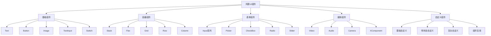

# 第6章：常用UI组件详解

## 6.1 基础组件

### 6.1.1 Text文本组件

Text组件是鸿蒙应用中最基础的文本显示组件，支持丰富的文本样式和格式化功能。

#### 基本用法

```typescript
@Entry
@Component
struct TextExample {
  build() {
    Column() {
      // 基本文本
      Text('Hello HarmonyOS')
        .fontSize(20)
        .fontColor(Color.Blue)
        .margin(10)

      // 富文本
      Text('富文本展示')
        .fontSize(16)
        .fontStyle(FontStyle.Italic)
        .fontWeight(FontWeight.Bold)
        .decoration({ type: TextDecorationType.Underline, color: Color.Red })
        .margin(10)

      // 文本截断
      Text('这是一段很长的文本内容，当超出容器宽度时会自动截断并显示省略号')
        .fontSize(14)
        .maxLines(2)
        .textOverflow({ overflow: TextOverflow.Ellipsis })
        .width(200)
        .margin(10)

      // 文本对齐
      Text('居中对齐文本')
        .fontSize(16)
        .textAlign(TextAlign.Center)
        .width('100%')
        .backgroundColor(Color.Gray)
        .padding(10)
        .margin(10)
    }
    .padding(20)
  }
}
```

#### 文本样式属性

| 属性名 | 类型 | 说明 |
|--------|------|------|
| fontSize | number | 文本大小 |
| fontColor | ResourceColor | 文本颜色 |
| fontWeight | FontWeight | 字体粗细 |
| fontStyle | FontStyle | 字体样式 |
| fontFamily | string | 字体族 |
| textAlign | TextAlign | 文本对齐方式 |
| maxLines | number | 最大行数 |
| textOverflow | TextOverflow | 文本溢出处理 |

### 6.1.2 Button按钮组件

Button组件是用户交互的核心组件，支持多种样式和点击事件处理。

```typescript
@Entry
@Component
struct ButtonExample {
  @State message: string = '点击按钮试试'

  build() {
    Column() {
      Text(this.message)
        .fontSize(16)
        .margin(20)

      // 普通按钮
      Button('普通按钮')
        .onClick(() => {
          this.message = '普通按钮被点击'
        })
        .margin(10)

      // 自定义样式按钮
      Button('自定义样式')
        .width(150)
        .height(50)
        .backgroundColor(Color.Pink)
        .fontColor(Color.White)
        .borderRadius(25)
        .onClick(() => {
          this.message = '自定义样式按钮被点击'
        })
        .margin(10)

      // 图标按钮
      Button({ type: ButtonType.Circle }) {
        Image($r('app.media.icon'))
          .width(24)
          .height(24)
      }
      .width(50)
      .height(50)
      .backgroundColor(Color.Blue)
      .onClick(() => {
        this.message = '图标按钮被点击'
      })
      .margin(10)

      // 胶囊按钮
      Button('胶囊按钮', { type: ButtonType.Capsule })
        .onClick(() => {
          this.message = '胶囊按钮被点击'
        })
        .margin(10)
    }
    .padding(20)
  }
}
```

### 6.1.3 Image图片组件

Image组件用于显示图片资源，支持本地资源、网络图片和Base64编码图片。

```typescript
@Entry
@Component
struct ImageExample {
  @State imageWidth: number = 200

  build() {
    Column() {
      // 本地资源图片
      Image($r('app.media.logo'))
        .width(100)
        .height(100)
        .margin(10)

      // 网络图片
      Image('https://example.com/image.jpg')
        .width(150)
        .height(150)
        .borderRadius(10)
        .objectFit(ImageFit.Cover)
        .margin(10)

      // 可调整大小的图片
      Image($r('app.media.sample'))
        .width(this.imageWidth)
        .height(this.imageWidth)
        .border({ width: 2, color: Color.Blue })
        .margin(10)

      // 控制按钮
      Row() {
        Button('缩小')
          .onClick(() => {
            this.imageWidth = Math.max(50, this.imageWidth - 20)
          })
        
        Button('放大')
          .onClick(() => {
            this.imageWidth = Math.min(300, this.imageWidth + 20)
          })
      }
      .margin(20)
    }
    .padding(20)
  }
}
```

### 6.1.4 其他基础组件

#### TextInput文本输入框

```typescript
@Entry
@Component
struct TextInputExample {
  @State inputValue: string = ''

  build() {
    Column() {
      TextInput({ placeholder: '请输入内容' })
        .width('80%')
        .height(40)
        .backgroundColor(Color.Gray)
        .margin(10)
        .onChange((value: string) => {
          this.inputValue = value
        })

      Text('输入内容：' + this.inputValue)
        .fontSize(16)
        .margin(10)
    }
    .padding(20)
  }
}
```

#### Switch开关组件

```typescript
@Entry
@Component
struct SwitchExample {
  @State isOn: boolean = false

  build() {
    Column() {
      Switch({ type: SwitchType.Switch, isOn: this.isOn })
        .onChange((isOn: boolean) => {
          this.isOn = isOn
        })
        .margin(20)

      Text('开关状态：' + (this.isOn ? '开启' : '关闭'))
        .fontSize(16)
    }
    .padding(20)
  }
}
```

## 6.2 容器组件

### 6.2.1 Stack堆叠容器

Stack组件允许子组件在同一个位置堆叠显示，常用于实现覆盖效果。

```typescript
@Entry
@Component
struct StackExample {
  @State stackAlign: Alignment = Alignment.BottomEnd

  build() {
    Column() {
      // 基本堆叠
      Stack() {
        // 背景图片
        Image($r('app.media.background'))
          .width('100%')
          .height(200)
          .objectFit(ImageFit.Cover)

        // 文字覆盖
        Text('堆叠文字')
          .fontSize(24)
          .fontColor(Color.White)
          .backgroundColor(Color.Black)
          .opacity(0.7)
          .padding(10)
          .borderRadius(5)
      }
      .width('100%')
      .height(200)
      .margin(10)

      // 对齐方式控制
      Stack({ alignContent: this.stackAlign }) {
        Rect()
          .width(100)
          .height(100)
          .fill(Color.Blue)

        Rect()
          .width(60)
          .height(60)
          .fill(Color.Red)

        Rect()
          .width(30)
          .height(30)
          .fill(Color.Yellow)
      }
      .width(120)
      .height(120)
      .margin(20)

      // 对齐方式选择
      Row() {
        Button('左上')
          .onClick(() => { this.stackAlign = Alignment.TopStart })
        Button('中心')
          .onClick(() => { this.stackAlign = Alignment.Center })
        Button('右下')
          .onClick(() => { this.stackAlign = Alignment.BottomEnd })
      }
      .margin(20)
    }
    .padding(20)
  }
}
```

### 6.2.2 Flex弹性容器

Flex容器提供了强大的弹性布局能力，支持灵活的子元素排列。

```typescript
@Entry
@Component
struct FlexExample {
  @State direction: FlexDirection = FlexDirection.Row
  @State justifyContent: FlexAlign = FlexAlign.Start
  @State alignItems: ItemAlign = ItemAlign.Start

  build() {
    Column() {
      // Flex布局示例
      Flex({
        direction: this.direction,
        justifyContent: this.justifyContent,
        alignItems: this.alignItems,
        wrap: FlexWrap.Wrap
      }) {
        Text('Item1')
          .width(60)
          .height(40)
          .backgroundColor(Color.Red)
          .margin(5)

        Text('Item2')
          .width(80)
          .height(40)
          .backgroundColor(Color.Green)
          .margin(5)

        Text('Item3')
          .width(70)
          .height(40)
          .backgroundColor(Color.Blue)
          .margin(5)

        Text('Item4')
          .width(90)
          .height(40)
          .backgroundColor(Color.Yellow)
          .margin(5)
      }
      .width('100%')
      .height(150)
      .backgroundColor(Color.Gray)
      .padding(10)
      .margin(10)

      // 控制面板
      Column() {
        Text('方向控制')
          .fontSize(16)
          .margin(10)
        Row() {
          Button('行')
            .onClick(() => { this.direction = FlexDirection.Row })
          Button('列')
            .onClick(() => { this.direction = FlexDirection.Column })
        }
        .margin(10)

        Text('主轴对齐')
          .fontSize(16)
          .margin(10)
        Row() {
          Button('开始')
            .onClick(() => { this.justifyContent = FlexAlign.Start })
          Button('居中')
            .onClick(() => { this.justifyContent = FlexAlign.Center })
          Button('结束')
            .onClick(() => { this.justifyContent = FlexAlign.End })
        }
        .margin(10)

        Text('交叉轴对齐')
          .fontSize(16)
          .margin(10)
        Row() {
          Button('开始')
            .onClick(() => { this.alignItems = ItemAlign.Start })
          Button('居中')
            .onClick(() => { this.alignItems = ItemAlign.Center })
          Button('结束')
            .onClick(() => { this.alignItems = ItemAlign.End })
        }
        .margin(10)
      }
    }
    .padding(20)
  }
}
```

### 6.2.3 Grid网格容器

Grid容器提供了二维网格布局能力，适合复杂的网格化界面设计。

```typescript
@Entry
@Component
struct GridExample {
  @State columnsTemplate: string = '1fr 1fr 1fr'
  @State rowsTemplate: string = '1fr 1fr'

  build() {
    Column() {
      // 网格布局示例
      Grid() {
        ForEach([1, 2, 3, 4, 5, 6], (item: number) => {
          GridItem() {
            Text('Item ' + item)
              .fontSize(16)
              .fontColor(Color.White)
              .textAlign(TextAlign.Center)
              .width('100%')
              .height('100%')
              .backgroundColor(item % 2 === 0 ? Color.Blue : Color.Green)
          }
        })
      }
      .columnsTemplate(this.columnsTemplate)
      .rowsTemplate(this.rowsTemplate)
      .columnsGap(10)
      .rowsGap(10)
      .width('100%')
      .height(200)
      .margin(10)

      // 控制面板
      Column() {
        Text('列模板')
          .fontSize(16)
          .margin(10)
        Row() {
          Button('2列')
            .onClick(() => { this.columnsTemplate = '1fr 1fr' })
          Button('3列')
            .onClick(() => { this.columnsTemplate = '1fr 1fr 1fr' })
          Button('4列')
            .onClick(() => { this.columnsTemplate = '1fr 1fr 1fr 1fr' })
        }
        .margin(10)

        Text('行模板')
          .fontSize(16)
          .margin(10)
        Row() {
          Button('2行')
            .onClick(() => { this.rowsTemplate = '1fr 1fr' })
          Button('3行')
            .onClick(() => { this.rowsTemplate = '1fr 1fr 1fr' })
        }
        .margin(10)
      }
    }
    .padding(20)
  }
}
```

## 6.3 表单组件

### 6.3.1 Input输入组件族

鸿蒙提供了丰富的输入组件，包括文本输入、数字输入、密码输入等。

```typescript
@Entry
@Component
struct FormInputExample {
  @State username: string = ''
  @State password: string = ''
  @State email: string = ''
  @State phone: string = ''
  @State age: number = 18

  build() {
    Column() {
      // 用户名输入
      TextInput({ placeholder: '请输入用户名' })
        .width('80%')
        .height(40)
        .margin(10)
        .onChange((value: string) => {
          this.username = value
        })

      // 密码输入
      TextInput({ placeholder: '请输入密码' })
        .width('80%')
        .height(40)
        .margin(10)
        .type(InputType.Password)
        .showPasswordIcon(true)
        .onChange((value: string) => {
          this.password = value
        })

      // 邮箱输入
      TextInput({ placeholder: '请输入邮箱' })
        .width('80%')
        .height(40)
        .margin(10)
        .type(InputType.Normal)
        .inputFilter('[a-zA-Z0-9@._-]')
        .onChange((value: string) => {
          this.email = value
        })

      // 电话号码输入
      TextInput({ placeholder: '请输入电话号码' })
        .width('80%')
        .height(40)
        .margin(10)
        .type(InputType.Number)
        .maxLength(11)
        .onChange((value: string) => {
          this.phone = value
        })

      // 年龄输入
      TextInput({ placeholder: '请输入年龄' })
        .width('80%')
        .height(40)
        .margin(10)
        .type(InputType.Number)
        .onChange((value: string) => {
          this.age = parseInt(value) || 0
        })

      // 提交按钮
      Button('提交')
        .width('60%')
        .height(40)
        .margin(20)
        .onClick(() => {
          console.log('表单数据：', {
            username: this.username,
            password: this.password,
            email: this.email,
            phone: this.phone,
            age: this.age
          })
        })
    }
    .padding(20)
  }
}
```

### 6.3.2 Picker选择器组件

Picker组件提供了多种选择器类型，包括日期选择、时间选择、自定义选择等。

```typescript
@Entry
@Component
struct PickerExample {
  @State selectedDate: Date = new Date()
  @State selectedTime: Date = new Date()
  @State selectedCity: number = 0
  @State selectedHobby: Array<number> = [0, 2]

  private cities: string[] = ['北京', '上海', '广州', '深圳', '杭州']
  private hobbies: string[] = ['阅读', '运动', '音乐', '旅行', '美食']

  build() {
    Column() {
      // 日期选择器
      Text('日期选择：' + this.selectedDate.toLocaleDateString())
        .fontSize(16)
        .margin(10)

      DatePicker({
        selected: this.selectedDate
      })
        .onChange((date: Date) => {
          this.selectedDate = date
        })
        .margin(10)

      // 时间选择器
      Text('时间选择：' + this.selectedTime.toLocaleTimeString())
        .fontSize(16)
        .margin(10)

      TimePicker({
        selected: this.selectedTime
      })
        .onChange((time: Date) => {
          this.selectedTime = time
        })
        .margin(10)

      // 文本选择器
      Text('城市选择：' + this.cities[this.selectedCity])
        .fontSize(16)
        .margin(10)

      TextPicker({
        range: this.cities,
        selected: this.selectedCity
      })
        .onChange((value: string, index: number) => {
          this.selectedCity = index
        })
        .margin(10)

      // 多选选择器
      Text('爱好选择：' + this.selectedHobby.map(i => this.hobbies[i]).join(', '))
        .fontSize(16)
        .margin(10)

      TextPicker({
        range: this.hobbies,
        selected: this.selectedHobby[0]
      })
        .onChange((value: string, index: number) => {
          this.selectedHobby[0] = index
        })
        .margin(10)
    }
    .padding(20)
  }
}
```

### 6.3.3 CheckBox和Radio组件

```typescript
@Entry
@Component
struct CheckRadioExample {
  @State checkedItems: Array<boolean> = [false, false, false]
  @State selectedRadio: number = 0

  private checkBoxLabels: string[] = ['选项1', '选项2', '选项3']
  private radioLabels: string[] = ['男', '女', '其他']

  build() {
    Column() {
      // 复选框组
      Text('复选框选择')
        .fontSize(18)
        .fontWeight(FontWeight.Bold)
        .margin(20)

      ForEach(this.checkBoxLabels, (label: string, index: number) => {
        Row() {
          CheckBox({ name: 'check' + index, group: 'checkboxGroup' })
            .select(this.checkedItems[index])
            .onChange((value: boolean) => {
              this.checkedItems[index] = value
            })
            .margin(10)

          Text(label)
            .fontSize(16)
            .margin(10)
        }
        .width('100%')
        .justifyContent(FlexAlign.Start)
      })

      // 单选框组
      Text('单选框选择')
        .fontSize(18)
        .fontWeight(FontWeight.Bold)
        .margin(20)

      ForEach(this.radioLabels, (label: string, index: number) => {
        Row() {
          Radio({ value: 'radio' + index, group: 'radioGroup' })
            .checked(index === this.selectedRadio)
            .onChange((isChecked: boolean) => {
              if (isChecked) {
                this.selectedRadio = index
              }
            })
            .margin(10)

          Text(label)
            .fontSize(16)
            .margin(10)
        }
        .width('100%')
        .justifyContent(FlexAlign.Start)
      })

      // 显示选择结果
      Text('复选框选择：' + this.checkedItems.map((checked, index) => 
        checked ? this.checkBoxLabels[index] : null).filter(Boolean).join(', '))
        .fontSize(14)
        .margin(20)

      Text('单选框选择：' + this.radioLabels[this.selectedRadio])
        .fontSize(14)
        .margin(20)
    }
    .padding(20)
  }
}
```

## 6.4 媒体组件

### 6.4.1 Video视频播放组件

Video组件提供了完整的视频播放功能，支持播放控制、全屏播放等特性。

```typescript
@Entry
@Component
struct VideoExample {
  @State videoSrc: string = 'https://example.com/video.mp4'
  @State isPlaying: boolean = false
  @State currentTime: number = 0
  @State duration: number = 0
  @State controller: VideoController = new VideoController()

  build() {
    Column() {
      // 视频播放器
      Video({
        src: this.videoSrc,
        controller: this.controller
      })
        .width('100%')
        .height(200)
        .autoPlay(false)
        .controls(true)
        .loop(false)
        .muted(false)
        .objectFit(ImageFit.Contain)
        .onStart(() => {
          this.isPlaying = true
          console.log('视频开始播放')
        })
        .onPause(() => {
          this.isPlaying = false
          console.log('视频暂停播放')
        })
        .onFinish(() => {
          this.isPlaying = false
          console.log('视频播放完成')
        })
        .onError((error) => {
          console.error('视频播放错误：', error)
        })
        .onPrepared((duration) => {
          this.duration = duration
          console.log('视频准备完成，时长：', duration)
        })
        .onSeeking((time) => {
          console.log('正在跳转到：', time)
        })
        .onSeeked((time) => {
          this.currentTime = time
          console.log('已跳转到：', time)
        })
        .onUpdate((time) => {
          this.currentTime = time
        })
        .margin(10)

      // 播放控制按钮
      Row() {
        Button(this.isPlaying ? '暂停' : '播放')
          .onClick(() => {
            if (this.isPlaying) {
              this.controller.pause()
            } else {
              this.controller.start()
            }
          })
          .margin(10)

        Button('停止')
          .onClick(() => {
            this.controller.stop()
          })
          .margin(10)

        Button('全屏')
          .onClick(() => {
            this.controller.requestFullscreen(true)
          })
          .margin(10)
      }

      // 时间显示
      Text(`时间：${this.formatTime(this.currentTime)} / ${this.formatTime(this.duration)}`)
        .fontSize(14)
        .margin(10)
    }
    .padding(20)
  }

  private formatTime(time: number): string {
    const minutes = Math.floor(time / 60)
    const seconds = Math.floor(time % 60)
    return `${minutes.toString().padStart(2, '0')}:${seconds.toString().padStart(2, '0')}`
  }
}
```

### 6.4.2 Audio音频播放组件

```typescript
@Entry
@Component
struct AudioExample {
  @State audioSrc: string = 'https://example.com/audio.mp3'
  @State isPlaying: boolean = false
  @State currentTime: number = 0
  @State duration: number = 0
  @State volume: number = 0.5
  @State controller: AudioController = new AudioController()

  build() {
    Column() {
      // 音频播放器（Audio组件在鸿蒙中通常通过其他方式实现）
      // 这里使用自定义的音频控制界面
      Column() {
        Image($r('app.media.album_cover'))
          .width(200)
          .height(200)
          .borderRadius(10)
          .margin(20)

        // 播放进度条
        Row() {
          Text(this.formatTime(this.currentTime))
            .fontSize(12)
            .margin(10)

          Slider({
            value: this.currentTime,
            min: 0,
            max: this.duration || 100
          })
            .width('60%')
            .onChange((value: number) => {
              this.currentTime = value
              // this.controller.setCurrentTime(value)
            })

          Text(this.formatTime(this.duration))
            .fontSize(12)
            .margin(10)
        }
        .width('100%')
        .alignItems(VerticalAlign.Center)

        // 播放控制
        Row() {
          Button('上一首')
            .onClick(() => {
              // 上一首逻辑
            })
            .margin(10)

          Button(this.isPlaying ? '暂停' : '播放')
            .onClick(() => {
              this.isPlaying = !this.isPlaying
              if (this.isPlaying) {
                // this.controller.start()
              } else {
                // this.controller.pause()
              }
            })
            .width(80)
            .height(40)
            .margin(10)

          Button('下一首')
            .onClick(() => {
              // 下一首逻辑
            })
            .margin(10)
        }
        .margin(20)

        // 音量控制
        Row() {
          Text('音量')
            .fontSize(14)
            .margin(10)

          Slider({
            value: this.volume,
            min: 0,
            max: 1
          })
            .width('60%')
            .onChange((value: number) => {
              this.volume = value
              // this.controller.setVolume(value)
            })

          Text(Math.round(this.volume * 100) + '%')
            .fontSize(12)
            .margin(10)
        }
        .width('100%')
        .alignItems(VerticalAlign.Center)
      }
    }
    .padding(20)
  }

  private formatTime(time: number): string {
    const minutes = Math.floor(time / 60)
    const seconds = Math.floor(time % 60)
    return `${minutes.toString().padStart(2, '0')}:${seconds.toString().padStart(2, '0')}`
  }
}
```

### 6.4.3 Camera相机组件

Camera组件提供了相机预览、拍照、录像等功能。

```typescript
@Entry
@Component
struct CameraExample {
  @State isRecording: boolean = false
  @State photoUri: string = ''
  @State videoUri: string = ''
  @State cameraController: CameraController = new CameraController()

  build() {
    Column() {
      // 相机预览区域
      Stack() {
        // Camera组件（实际使用时需要配置相机权限）
        // Camera({
        //   cameraController: this.cameraController
        // })
        //   .width('100%')
        //   .height(300)

        // 占位符
        Rectangle()
          .width('100%')
          .height(300)
          .fill(Color.Gray)

        Text('相机预览区域')
          .fontSize(16)
          .fontColor(Color.White)
      }
      .width('100%')
      .height(300)
      .margin(10)

      // 控制按钮
      Row() {
        Button('拍照')
          .onClick(() => {
            this.takePhoto()
          })
          .margin(10)

        Button(this.isRecording ? '停止录像' : '开始录像')
          .backgroundColor(this.isRecording ? Color.Red : Color.Green)
          .onClick(() => {
            if (this.isRecording) {
              this.stopRecording()
            } else {
              this.startRecording()
            }
          })
          .margin(10)

        Button('切换摄像头')
          .onClick(() => {
            this.switchCamera()
          })
          .margin(10)
      }

      // 显示拍摄结果
      if (this.photoUri) {
        Text('照片路径：' + this.photoUri)
          .fontSize(12)
          .margin(10)
      }

      if (this.videoUri) {
        Text('视频路径：' + this.videoUri)
          .fontSize(12)
          .margin(10)
      }
    }
    .padding(20)
  }

  private takePhoto() {
    // 拍照逻辑
    console.log('执行拍照')
    // this.cameraController.takePhoto().then((uri) => {
    //   this.photoUri = uri
    // })
  }

  private startRecording() {
    // 开始录像
    console.log('开始录像')
    this.isRecording = true
    // this.cameraController.startRecording().then((uri) => {
    //   this.videoUri = uri
    // })
  }

  private stopRecording() {
    // 停止录像
    console.log('停止录像')
    this.isRecording = false
    // this.cameraController.stopRecording()
  }

  private switchCamera() {
    // 切换摄像头
    console.log('切换摄像头')
    // this.cameraController.switchCamera()
  }
}
```

## 6.5 自定义组件开发

### 6.5.1 基础自定义组件

自定义组件是鸿蒙开发的核心概念，通过@Component装饰器创建可复用的UI组件。

```typescript
// 自定义卡片组件
@Component
struct CustomCard {
  @Prop title: string = ''
  @Prop subtitle: string = ''
  @Prop imageUrl: string = ''
  @Prop cardWidth: number = 300
  @Prop cardHeight: number = 200

  build() {
    Column() {
      // 图片区域
      if (this.imageUrl) {
        Image(this.imageUrl)
          .width('100%')
          .height(120)
          .objectFit(ImageFit.Cover)
          .borderRadius({ topLeft: 10, topRight: 10 })
      }

      // 内容区域
      Column() {
        Text(this.title)
          .fontSize(18)
          .fontWeight(FontWeight.Bold)
          .margin({ top: 10, bottom: 5 })

        if (this.subtitle) {
          Text(this.subtitle)
            .fontSize(14)
            .fontColor(Color.Gray)
            .margin({ bottom: 10 })
        }
      }
      .alignItems(HorizontalAlign.Start)
      .padding(15)
      .width('100%')
    }
    .width(this.cardWidth)
    .height(this.cardHeight)
    .backgroundColor(Color.White)
    .borderRadius(10)
    .shadow({
      radius: 8,
      color: Color.Gray,
      offsetX: 2,
      offsetY: 2
    })
  }
}

// 使用自定义组件
@Entry
@Component
struct CustomCardExample {
  build() {
    Column() {
      CustomCard({
        title: '鸿蒙开发',
        subtitle: '从入门到精通',
        imageUrl: 'https://example.com/image.jpg',
        cardWidth: 320,
        cardHeight: 220
      })
        .margin(10)

      CustomCard({
        title: 'ArkTS语言',
        subtitle: 'TypeScript的超集',
        cardWidth: 320,
        cardHeight: 180
      })
        .margin(10)
    }
    .padding(20)
  }
}
```

### 6.5.2 带状态的自定义组件

```typescript
// 自定义计数器组件
@Component
struct Counter {
  @State count: number = 0
  @Prop minValue: number = 0
  @Prop maxValue: number = 100
  @Prop step: number = 1
  @Prop onCountChange?: (count: number) => void

  private increaseCount() {
    if (this.count < this.maxValue) {
      this.count += this.step
      this.onCountChange?.(this.count)
    }
  }

  private decreaseCount() {
    if (this.count > this.minValue) {
      this.count -= this.step
      this.onCountChange?.(this.count)
    }
  }

  build() {
    Row() {
      Button('-')
        .width(40)
        .height(40)
        .fontSize(20)
        .onClick(() => this.decreaseCount())

      Text(this.count.toString())
        .fontSize(24)
        .fontWeight(FontWeight.Bold)
        .margin({ left: 20, right: 20 })

      Button('+')
        .width(40)
        .height(40)
        .fontSize(20)
        .onClick(() => this.increaseCount())
    }
    .justifyContent(FlexAlign.Center)
    .alignItems(VerticalAlign.Center)
    .padding(20)
    .backgroundColor(Color.Gray)
    .borderRadius(10)
  }
}

// 使用计数器组件
@Entry
@Component
struct CounterExample {
  @State totalCount: number = 0

  build() {
    Column() {
      Text('总计数：' + this.totalCount)
        .fontSize(20)
        .margin(20)

      Counter({
        minValue: 0,
        maxValue: 10,
        step: 1,
        onCountChange: (count: number) => {
          this.totalCount = count
        }
      })
        .margin(10)

      Counter({
        minValue: 5,
        maxValue: 20,
        step: 2,
        onCountChange: (count: number) => {
          console.log('第二个计数器：', count)
        }
      })
        .margin(10)
    }
    .padding(20)
  }
}
```

### 6.5.3 复杂自定义组件

```typescript
// 自定义搜索框组件
@Component
struct SearchBox {
  @State searchText: string = ''
  @State isFocused: boolean = false
  @Prop placeholder: string = '请输入搜索内容'
  @Prop onSearch?: (text: string) => void
  @Prop onTextChange?: (text: string) => void

  private handleSearch() {
    if (this.searchText.trim()) {
      this.onSearch?.(this.searchText.trim())
    }
  }

  private clearSearch() {
    this.searchText = ''
    this.onTextChange?.('')
  }

  build() {
    Row() {
      // 搜索图标
      Image($r('app.media.search_icon'))
        .width(20)
        .height(20)
        .margin({ left: 15, right: 10 })
        .fillColor(this.isFocused ? Color.Blue : Color.Gray)

      // 输入框
      TextInput({ placeholder: this.placeholder })
        .width('70%')
        .height(40)
        .backgroundColor(Color.Transparent)
        .border({ width: 0 })
        .fontSize(16)
        .onChange((value: string) => {
          this.searchText = value
          this.onTextChange?.(value)
        })
        .onFocus(() => {
          this.isFocused = true
        })
        .onBlur(() => {
          this.isFocused = false
        })

      // 清除按钮
      if (this.searchText) {
        Button('×')
          .width(30)
          .height(30)
          .fontSize(18)
          .backgroundColor(Color.Transparent)
          .fontColor(Color.Gray)
          .onClick(() => this.clearSearch())
      }

      // 搜索按钮
      Button('搜索')
        .width(60)
        .height(40)
        .fontSize(14)
        .backgroundColor(this.isFocused ? Color.Blue : Color.Gray)
        .onClick(() => this.handleSearch())
    }
    .width('100%')
    .height(50)
    .backgroundColor(Color.White)
    .borderRadius(25)
    .border({
      width: 1,
      color: this.isFocused ? Color.Blue : Color.Gray
    })
    .justifyContent(FlexAlign.SpaceBetween)
    .alignItems(VerticalAlign.Center)
    .padding({ right: 10 })
  }
}

// 自定义列表项组件
@Component
struct ListItem {
  @Prop title: string = ''
  @Prop subtitle: string = ''
  @Prop icon: string = ''
  @Prop showArrow: boolean = true
  @Prop onItemClick?: () => void

  build() {
    Row() {
      // 图标
      if (this.icon) {
        Image(this.icon)
          .width(24)
          .height(24)
          .margin({ right: 15 })
      }

      // 文本内容
      Column() {
        Text(this.title)
          .fontSize(16)
          .fontWeight(FontWeight.Medium)
          .alignSelf(ItemAlign.Start)

        if (this.subtitle) {
          Text(this.subtitle)
            .fontSize(14)
            .fontColor(Color.Gray)
            .margin({ top: 4 })
            .alignSelf(ItemAlign.Start)
        }
      }
      .alignItems(HorizontalAlign.Start)
      .layoutWeight(1)

      // 箭头
      if (this.showArrow) {
        Image($r('app.media.arrow_right'))
          .width(16)
          .height(16)
          .fillColor(Color.Gray)
          .margin({ left: 10 })
      }
    }
    .width('100%')
    .height(60)
    .padding({ left: 15, right: 15 })
    .justifyContent(FlexAlign.SpaceBetween)
    .alignItems(VerticalAlign.Center)
    .backgroundColor(Color.White)
    .onClick(() => {
      this.onItemClick?.()
    })
  }
}

// 使用复杂自定义组件
@Entry
@Component
struct ComplexComponentExample {
  @State searchResults: Array<string> = []
  @State selectedItems: Array<string> = []

  build() {
    Column() {
      // 搜索框
      SearchBox({
        placeholder: '搜索应用',
        onSearch: (text: string) => {
          this.searchResults = ['结果1', '结果2', '结果3'].filter(item => 
            item.includes(text)
          )
        }
      })
      .margin(10)

      // 搜索结果列表
      if (this.searchResults.length > 0) {
        Column() {
          ForEach(this.searchResults, (item: string) => {
            ListItem({
              title: item,
              subtitle: '点击选择此项',
              icon: 'common/icon.png',
              onItemClick: () => {
                this.selectedItems.push(item)
                console.log('选中：', item)
              }
            })
          })
        }
        .width('100%')
        .backgroundColor(Color.White)
        .borderRadius(10)
        .margin(10)
      }

      // 已选择项目
      if (this.selectedItems.length > 0) {
        Text('已选择：' + this.selectedItems.join(', '))
          .fontSize(14)
          .margin(10)
      }
    }
    .padding(20)
    .backgroundColor(Color.Gray)
  }
}
```

## 组件分类总结



## 最佳实践建议

### 1. 组件选择原则
- **简单优先**：优先使用系统提供的标准组件
- **性能考虑**：避免过度嵌套和不必要的组件
- **复用性**：将可复用的UI抽象为自定义组件

### 2. 性能优化
- **懒加载**：使用LazyForEach优化长列表
- **状态管理**：合理使用@State和@Prop
- **内存管理**：及时释放不需要的资源

### 3. 用户体验
- **响应式设计**：适配不同屏幕尺寸
- **无障碍访问**：支持辅助功能
- **国际化**：考虑多语言支持

### 4. 开发规范
- **命名规范**：使用有意义的组件名
- **代码复用**：提取公共组件和样式
- **文档注释**：为自定义组件添加详细说明

## 本章小结

本章详细介绍了鸿蒙开发中的常用UI组件，包括基础组件、容器组件、表单组件、媒体组件和自定义组件。通过丰富的代码示例和实际应用场景，帮助开发者掌握组件的使用方法和最佳实践。

**学习要点：**
1. 掌握基础组件的属性和用法
2. 理解容器组件的布局原理
3. 熟练使用表单组件进行数据输入
4. 了解媒体组件的功能特性
5. 能够开发高质量的自定义组件

**思考题：**
1. 如何选择合适的容器组件来实现复杂的布局？
2. 自定义组件中@State和@Prop的区别是什么？
3. 如何优化包含大量图片的列表性能？
4. 在什么情况下应该创建自定义组件？

下一章将深入讲解鸿蒙的布局系统，帮助开发者更好地掌握界面布局技巧。