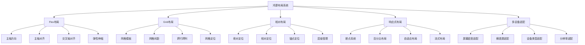

# 第7章：布局系统深入

## 7.1 Flex布局详解

Flex布局是鸿蒙中最灵活和强大的布局方式之一，它基于弹性盒子模型，能够轻松实现复杂的响应式布局。

### 7.1.1 Flex布局基本概念

Flex布局由容器（Flex）和项目（子组件）组成，容器通过设置不同的属性来控制项目的排列方式。

```typescript
@Entry
@Component
struct FlexBasicsExample {
  @State direction: FlexDirection = FlexDirection.Row
  @State justifyContent: FlexAlign = FlexAlign.Start
  @State alignItems: ItemAlign = ItemAlign.Start
  @State wrap: FlexWrap = FlexWrap.NoWrap

  build() {
    Column() {
      // Flex布局演示区域
      Flex({
        direction: this.direction,
        justifyContent: this.justifyContent,
        alignItems: this.alignItems,
        wrap: this.wrap
      }) {
        ForEach([1, 2, 3, 4, 5], (item: number) => {
          Text(`Item${item}`)
            .width(60)
            .height(40)
            .backgroundColor(this.getItemColor(item))
            .fontSize(14)
            .fontColor(Color.White)
            .textAlign(TextAlign.Center)
            .margin(2)
        })
      }
      .width('100%')
      .height(200)
      .backgroundColor('#f0f0f0')
      .padding(10)
      .margin(10)

      // 控制面板
      this.buildControlPanel()
    }
    .padding(20)
  }

  @Builder
  buildControlPanel() {
    Column() {
      // 方向控制
      Text('主轴方向')
        .fontSize(16)
        .fontWeight(FontWeight.Bold)
        .margin(10)
      
      Row() {
        Button('行').onClick(() => this.direction = FlexDirection.Row)
        Button('列').onClick(() => this.direction = FlexDirection.Column)
        Button('行反转').onClick(() => this.direction = FlexDirection.RowReverse)
        Button('列反转').onClick(() => this.direction = FlexDirection.ColumnReverse)
      }
      .margin(10)

      // 主轴对齐
      Text('主轴对齐')
        .fontSize(16)
        .fontWeight(FontWeight.Bold)
        .margin(10)
      
      Row() {
        Button('开始').onClick(() => this.justifyContent = FlexAlign.Start)
        Button('居中').onClick(() => this.justifyContent = FlexAlign.Center)
        Button('结束').onClick(() => this.justifyContent = FlexAlign.End)
        Button('等间距').onClick(() => this.justifyContent = FlexAlign.SpaceBetween)
        Button('环绕').onClick(() => this.justifyContent = FlexAlign.SpaceAround)
        Button('均匀').onClick(() => this.justifyContent = FlexAlign.SpaceEvenly)
      }
      .margin(10)

      // 交叉轴对齐
      Text('交叉轴对齐')
        .fontSize(16)
        .fontWeight(FontWeight.Bold)
        .margin(10)
      
      Row() {
        Button('开始').onClick(() => this.alignItems = ItemAlign.Start)
        Button('居中').onClick(() => this.alignItems = ItemAlign.Center)
        Button('结束').onClick(() => this.alignItems = ItemAlign.End)
        Button('拉伸').onClick(() => this.alignItems = ItemAlign.Stretch)
        Button('基线').onClick(() => this.alignItems = ItemAlign.Baseline)
      }
      .margin(10)

      // 换行控制
      Text('换行控制')
        .fontSize(16)
        .fontWeight(FontWeight.Bold)
        .margin(10)
      
      Row() {
        Button('不换行').onClick(() => this.wrap = FlexWrap.NoWrap)
        Button('换行').onClick(() => this.wrap = FlexWrap.Wrap)
        Button('反向换行').onClick(() => this.wrap = FlexWrap.WrapReverse)
      }
      .margin(10)
    }
  }

  private getItemColor(item: number): ResourceColor {
    const colors = [Color.Red, Color.Green, Color.Blue, Color.Orange, Color.Purple]
    return colors[item - 1] || Color.Gray
  }
}
```

### 7.1.2 Flex布局高级特性

#### flexGrow属性

flexGrow属性定义项目的放大比例，默认为0，即如果存在剩余空间，也不放大。

```typescript
@Entry
@Component
struct FlexGrowExample {
  build() {
    Column() {
      Text('FlexGrow演示')
        .fontSize(18)
        .fontWeight(FontWeight.Bold)
        .margin(20)

      // 等比例放大
      Flex({ direction: FlexDirection.Row }) {
        Text('1:1:1')
          .flexGrow(1)
          .height(50)
          .backgroundColor(Color.Red)
          .textAlign(TextAlign.Center)
          .fontColor(Color.White)

        Text('1:1:1')
          .flexGrow(1)
          .height(50)
          .backgroundColor(Color.Green)
          .textAlign(TextAlign.Center)
          .fontColor(Color.White)

        Text('1:1:1')
          .flexGrow(1)
          .height(50)
          .backgroundColor(Color.Blue)
          .textAlign(TextAlign.Center)
          .fontColor(Color.White)
      }
      .width('100%')
      .height(60)
      .margin(10)

      // 不同比例放大
      Flex({ direction: FlexDirection.Row }) {
        Text('1:2:3')
          .flexGrow(1)
          .height(50)
          .backgroundColor(Color.Red)
          .textAlign(TextAlign.Center)
          .fontColor(Color.White)

        Text('1:2:3')
          .flexGrow(2)
          .height(50)
          .backgroundColor(Color.Green)
          .textAlign(TextAlign.Center)
          .fontColor(Color.White)

        Text('1:2:3')
          .flexGrow(3)
          .height(50)
          .backgroundColor(Color.Blue)
          .textAlign(TextAlign.Center)
          .fontColor(Color.White)
      }
      .width('100%')
      .height(60)
      .margin(10)
    }
    .padding(20)
  }
}
```

#### flexShrink属性

flexShrink属性定义了项目的缩小比例，默认为1，即如果空间不足，该项目将缩小。

```typescript
@Entry
@Component
struct FlexShrinkExample {
  build() {
    Column() {
      Text('FlexShrink演示')
        .fontSize(18)
        .fontWeight(FontWeight.Bold)
        .margin(20)

      // 容器宽度不足时的收缩行为
      Flex({ direction: FlexDirection.Row }) {
        Text('不收缩')
          .width(200)
          .height(50)
          .flexShrink(0)
          .backgroundColor(Color.Red)
          .textAlign(TextAlign.Center)
          .fontColor(Color.White)

        Text('正常收缩')
          .width(200)
          .height(50)
          .flexShrink(1)
          .backgroundColor(Color.Green)
          .textAlign(TextAlign.Center)
          .fontColor(Color.White)

        Text('快速收缩')
          .width(200)
          .height(50)
          .flexShrink(2)
          .backgroundColor(Color.Blue)
          .textAlign(TextAlign.Center)
          .fontColor(Color.White)
      }
      .width(400) // 容器宽度小于子元素总宽度
      .height(60)
      .margin(10)
    }
    .padding(20)
  }
}
```

### 7.1.3 实际应用案例

#### 导航栏布局

```typescript
@Component
struct NavigationBar {
  @Prop title: string = ''
  @Prop showBack: boolean = true
  @Prop onBackClick?: () => void

  build() {
    Flex({
      direction: FlexDirection.Row,
      alignItems: ItemAlign.Center,
      justifyContent: FlexAlign.SpaceBetween
    }) {
      // 左侧返回按钮
      if (this.showBack) {
        Button('返回')
          .onClick(() => this.onBackClick?.())
          .margin({ left: 16 })
      } else {
        Blank().width(60)
      }

      // 中间标题
      Text(this.title)
        .fontSize(18)
        .fontWeight(FontWeight.Medium)
        .maxLines(1)
        .textOverflow({ overflow: TextOverflow.Ellipsis })
        .margin({ left: 16, right: 16 })

      // 右侧操作区域
      Row() {
        Button('分享')
          .margin({ right: 8 })
        Button('设置')
          .margin({ right: 16 })
      }
    }
    .width('100%')
    .height(56)
    .backgroundColor(Color.White)
    .border({ width: { bottom: 1 }, color: Color.Gray })
  }
}

// 使用导航栏
@Entry
@Component
struct NavigationExample {
  build() {
    Column() {
      NavigationBar({
        title: 'Flex布局应用',
        showBack: true,
        onBackClick: () => {
          console.log('返回上一页')
        }
      })

      // 页面内容
      Column() {
        Text('页面内容区域')
          .fontSize(16)
          .margin(20)
      }
      .layoutWeight(1)
    }
  }
}
```

## 7.2 Grid网格布局

Grid布局提供了二维网格系统，适合创建复杂的网格化界面，如日历、图片墙等。

### 7.2.1 Grid基础概念

Grid布局通过定义行和列的模板来创建网格结构，子组件可以跨越多个行或列。

```typescript
@Entry
@Component
struct GridBasicsExample {
  @State columnsTemplate: string = '1fr 1fr 1fr'
  @State rowsTemplate: string = '1fr 1fr'
  @State columnsGap: number = 10
  @State rowsGap: number = 10

  build() {
    Column() {
      // Grid布局演示
      Grid() {
        ForEach([1, 2, 3, 4, 5, 6, 7, 8, 9], (item: number) => {
          GridItem() {
            Text(`Item ${item}`)
              .fontSize(16)
              .fontColor(Color.White)
              .textAlign(TextAlign.Center)
              .width('100%')
              .height('100%')
              .backgroundColor(this.getItemColor(item))
          }
        })
      }
      .columnsTemplate(this.columnsTemplate)
      .rowsTemplate(this.rowsTemplate)
      .columnsGap(this.columnsGap)
      .rowsGap(this.rowsGap)
      .width('100%')
      .height(300)
      .backgroundColor('#f0f0f0')
      .margin(10)

      // 控制面板
      this.buildGridControlPanel()
    }
    .padding(20)
  }

  @Builder
  buildGridControlPanel() {
    Column() {
      // 列模板控制
      Text('列模板')
        .fontSize(16)
        .fontWeight(FontWeight.Bold)
        .margin(10)
      
      Row() {
        Button('2列').onClick(() => this.columnsTemplate = '1fr 1fr')
        Button('3列').onClick(() => this.columnsTemplate = '1fr 1fr 1fr')
        Button('4列').onClick(() => this.columnsTemplate = '1fr 1fr 1fr 1fr')
        Button('固定列').onClick(() => this.columnsTemplate = '100px 1fr 100px')
      }
      .margin(10)

      // 行模板控制
      Text('行模板')
        .fontSize(16)
        .fontWeight(FontWeight.Bold)
        .margin(10)
      
      Row() {
        Button('2行').onClick(() => this.rowsTemplate = '1fr 1fr')
        Button('3行').onClick(() => this.rowsTemplate = '1fr 1fr 1fr')
        Button('固定行').onClick(() => this.rowsTemplate = '80px 1fr 80px')
      }
      .margin(10)

      // 间距控制
      Text('间距控制')
        .fontSize(16)
        .fontWeight(FontWeight.Bold)
        .margin(10)
      
      Row() {
        Text('列间距：')
        Slider({
          value: this.columnsGap,
          min: 0,
          max: 20
        })
          .width(100)
          .onChange((value: number) => this.columnsGap = value)
        Text(this.columnsGap.toString())
      }
      .margin(10)

      Row() {
        Text('行间距：')
        Slider({
          value: this.rowsGap,
          min: 0,
          max: 20
        })
          .width(100)
          .onChange((value: number) => this.rowsGap = value)
        Text(this.rowsGap.toString())
      }
      .margin(10)
    }
  }

  private getItemColor(item: number): ResourceColor {
    const colors = [Color.Red, Color.Green, Color.Blue, Color.Orange, Color.Purple,
                   Color.Pink, Color.Brown, Color.Cyan, Color.Magenta]
    return colors[item - 1] || Color.Gray
  }
}
```

### 7.2.2 GridItem高级特性

#### 跨行跨列布局

```typescript
@Entry
@Component
struct GridSpanExample {
  build() {
    Column() {
      Text('GridItem跨行跨列演示')
        .fontSize(18)
        .fontWeight(FontWeight.Bold)
        .margin(20)

      Grid() {
        // 跨列项目
        GridItem() {
          Text('跨2列')
            .fontSize(16)
            .fontColor(Color.White)
            .textAlign(TextAlign.Center)
            .width('100%')
            .height('100%')
            .backgroundColor(Color.Red)
        }
        .columnStart(0)
        .columnEnd(1)

        // 正常项目
        GridItem() {
          Text('正常')
            .fontSize(16)
            .fontColor(Color.White)
            .textAlign(TextAlign.Center)
            .width('100%')
            .height('100%')
            .backgroundColor(Color.Green)
        }

        // 跨行项目
        GridItem() {
          Text('跨2行')
            .fontSize(16)
            .fontColor(Color.White)
            .textAlign(TextAlign.Center)
            .width('100%')
            .height('100%')
            .backgroundColor(Color.Blue)
        }
        .rowStart(1)
        .rowEnd(2)

        // 填充项目
        GridItem() {
          Text('填充')
            .fontSize(16)
            .fontColor(Color.White)
            .textAlign(TextAlign.Center)
            .width('100%')
            .height('100%')
            .backgroundColor(Color.Orange)
        }

        GridItem() {
          Text('填充')
            .fontSize(16)
            .fontColor(Color.White)
            .textAlign(TextAlign.Center)
            .width('100%')
            .height('100%')
            .backgroundColor(Color.Purple)
        }
      }
      .columnsTemplate('1fr 1fr 1fr')
      .rowsTemplate('1fr 1fr 1fr')
      .columnsGap(10)
      .rowsGap(10)
      .width('100%')
      .height(300)
      .backgroundColor('#f0f0f0')
      .margin(10)
    }
    .padding(20)
  }
}
```

### 7.2.3 实际应用案例

#### 日历组件

```typescript
@Component
struct CalendarView {
  @State currentMonth: Date = new Date()
  @State selectedDate: Date = new Date()

  private getDaysInMonth(date: Date): number {
    return new Date(date.getFullYear(), date.getMonth() + 1, 0).getDate()
  }

  private getFirstDayOfMonth(date: Date): number {
    return new Date(date.getFullYear(), date.getMonth(), 1).getDay()
  }

  private generateCalendarDays(): Array<number | null> {
    const daysInMonth = this.getDaysInMonth(this.currentMonth)
    const firstDay = this.getFirstDayOfMonth(this.currentMonth)
    const days: Array<number | null> = []

    // 添加空白格子
    for (let i = 0; i < firstDay; i++) {
      days.push(null)
    }

    // 添加日期
    for (let i = 1; i <= daysInMonth; i++) {
      days.push(i)
    }

    return days
  }

  build() {
    Column() {
      // 月份导航
      Row() {
        Button('<')
          .onClick(() => {
            this.currentMonth = new Date(this.currentMonth.getFullYear(), 
                                       this.currentMonth.getMonth() - 1)
          })

        Text(this.currentMonth.toLocaleDateString('zh-CN', { 
          year: 'numeric', 
          month: 'long' 
        }))
          .fontSize(18)
          .fontWeight(FontWeight.Bold)
          .margin({ left: 20, right: 20 })

        Button('>')
          .onClick(() => {
            this.currentMonth = new Date(this.currentMonth.getFullYear(), 
                                       this.currentMonth.getMonth() + 1)
          })
      }
      .justifyContent(FlexAlign.Center)
      .margin(20)

      // 星期标题
      Grid() {
        ForEach(['日', '一', '二', '三', '四', '五', '六'], (day: string) => {
          GridItem() {
            Text(day)
              .fontSize(14)
              .fontWeight(FontWeight.Bold)
              .textAlign(TextAlign.Center)
              .width('100%')
              .height(40)
              .backgroundColor('#f0f0f0')
          }
        })
      }
      .columnsTemplate('repeat(7, 1fr)')
      .rowsTemplate('40px')
      .width('100%')
      .margin(10)

      // 日期网格
      Grid() {
        ForEach(this.generateCalendarDays(), (day: number | null, index: number) => {
          GridItem() {
            if (day) {
              Text(day.toString())
                .fontSize(16)
                .textAlign(TextAlign.Center)
                .width('100%')
                .height(40)
                .backgroundColor(this.isToday(day) ? Color.Blue : 
                                 this.isSelected(day) ? Color.Green : Color.White)
                .fontColor(this.isToday(day) || this.isSelected(day) ? Color.White : Color.Black)
                .borderRadius(20)
                .onClick(() => {
                  this.selectedDate = new Date(this.currentMonth.getFullYear(), 
                                             this.currentMonth.getMonth(), day)
                })
            }
          }
        })
      }
      .columnsTemplate('repeat(7, 1fr)')
      .rowsTemplate('repeat(6, 40px)')
      .columnsGap(5)
      .rowsGap(5)
      .width('100%')
      .margin(10)
    }
    .padding(20)
  }

  private isToday(day: number): boolean {
    const today = new Date()
    return day === today.getDate() && 
           this.currentMonth.getMonth() === today.getMonth() &&
           this.currentMonth.getFullYear() === today.getFullYear()
  }

  private isSelected(day: number): boolean {
    return day === this.selectedDate.getDate() && 
           this.currentMonth.getMonth() === this.selectedDate.getMonth() &&
           this.currentMonth.getFullYear() === this.selectedDate.getFullYear()
  }
}
```

## 7.3 相对布局与绝对定位

### 7.3.1 相对布局基础

相对布局通过设置组件相对于父容器或其他组件的位置来实现精确定位。

```typescript
@Entry
@Component
struct RelativeLayoutExample {
  build() {
    Stack() {
      // 父容器
      Rectangle()
        .width(300)
        .height(300)
        .fill(Color.Gray)

      // 相对定位的子组件
      Text('左上角')
        .position({ x: 10, y: 10 })
        .fontSize(14)
        .fontColor(Color.White)

      Text('右上角')
        .position({ x: 220, y: 10 })
        .fontSize(14)
        .fontColor(Color.White)

      Text('左下角')
        .position({ x: 10, y: 270 })
        .fontSize(14)
        .fontColor(Color.White)

      Text('右下角')
        .position({ x: 220, y: 270 })
        .fontSize(14)
        .fontColor(Color.White)

      Text('中心')
        .position({ x: 130, y: 140 })
        .fontSize(14)
        .fontColor(Color.White)
    }
    .width('100%')
    .height(400)
    .justifyContent(FlexAlign.Center)
    .alignItems(ItemAlign.Center)
  }
}
```

### 7.3.2 绝对定位与锚点

```typescript
@Entry
@Component
struct AbsoluteLayoutExample {
  @State showAnchor: boolean = true

  build() {
    Column() {
      // 绝对定位演示
      Stack() {
        // 背景容器
        Rectangle()
          .width('100%')
          .height(400)
          .fill('#f0f0f0')

        // 锚点组件
        if (this.showAnchor) {
          Circle({ width: 20, height: 20 })
            .fill(Color.Red)
            .position({ x: 150, y: 150 })
        }

        // 相对于锚点定位的组件
        Text('上方')
          .position({ x: 150, y: 120 })
          .fontSize(14)
          .markAnchor({ x: 20, y: 20 })

        Text('下方')
          .position({ x: 150, y: 180 })
          .fontSize(14)
          .markAnchor({ x: 20, y: 0 })

        Text('左侧')
          .position({ x: 120, y: 150 })
          .fontSize(14)
          .markAnchor({ x: 20, y: 10 })

        Text('右侧')
          .position({ x: 180, y: 150 })
          .fontSize(14)
          .markAnchor({ x: 0, y: 10 })
      }
      .width('100%')
      .height(400)
      .margin(10)

      // 控制按钮
      Button(this.showAnchor ? '隐藏锚点' : '显示锚点')
        .onClick(() => {
          this.showAnchor = !this.showAnchor
        })
        .margin(20)
    }
    .padding(20)
  }
}
```

### 7.3.3 复杂定位案例

#### 浮动按钮布局

```typescript
@Component
struct FloatingActionButton {
  @State position: { x: number, y: number } = { x: 300, y: 500 }
  @State isExpanded: boolean = false

  build() {
    Stack() {
      // 主按钮
      Button('+')
        .width(56)
        .height(56)
        .fontSize(24)
        .fontColor(Color.White)
        .backgroundColor(Color.Blue)
        .borderRadius(28)
        .position(this.position)
        .onClick(() => {
          this.isExpanded = !this.isExpanded
        })

      // 展开的子按钮
      if (this.isExpanded) {
        Button('A')
          .width(48)
          .height(48)
          .fontSize(16)
          .fontColor(Color.White)
          .backgroundColor(Color.Green)
          .borderRadius(24)
          .position({ x: this.position.x, y: this.position.y - 70 })
          .onClick(() => {
            console.log('按钮A被点击')
          })

        Button('B')
          .width(48)
          .height(48)
          .fontSize(16)
          .fontColor(Color.White)
          .backgroundColor(Color.Orange)
          .borderRadius(24)
          .position({ x: this.position.x - 70, y: this.position.y })
          .onClick(() => {
            console.log('按钮B被点击')
          })

        Button('C')
          .width(48)
          .height(48)
          .fontSize(16)
          .fontColor(Color.White)
          .backgroundColor(Color.Purple)
          .borderRadius(24)
          .position({ x: this.position.x + 70, y: this.position.y })
          .onClick(() => {
            console.log('按钮C被点击')
          })
      }
    }
    .width('100%')
    .height('100%')
  }
}

// 使用浮动按钮
@Entry
@Component
struct FabExample {
  build() {
    Stack() {
      // 页面内容
      Column() {
        Text('页面内容')
          .fontSize(20)
          .margin(20)
        
        Text('向下滚动查看浮动按钮效果')
          .fontSize(16)
          .margin(20)
      }
      .width('100%')
      .height('100%')

      // 浮动按钮
      FloatingActionButton()
    }
  }
}
```

## 7.4 响应式布局设计

### 7.4.1 断点系统

鸿蒙提供了断点系统来适配不同屏幕尺寸，开发者可以根据断点调整布局。

```typescript
@Entry
@Component
struct ResponsiveLayoutExample {
  @State currentBreakpoint: string = 'sm'

  aboutToAppear() {
    // 监听屏幕尺寸变化
    mediaQuery.matchMedia('(width >= 600vp)').onMatch((result) => {
      this.currentBreakpoint = result ? 'md' : 'sm'
    })
  }

  build() {
    Column() {
      Text('当前断点：' + this.currentBreakpoint)
        .fontSize(18)
        .fontWeight(FontWeight.Bold)
        .margin(20)

      // 响应式布局
      if (this.currentBreakpoint === 'sm') {
        // 小屏幕布局
        this.buildSmallLayout()
      } else {
        // 大屏幕布局
        this.buildLargeLayout()
      }
    }
    .padding(20)
  }

  @Builder
  buildSmallLayout() {
    Column() {
      Text('小屏幕布局')
        .fontSize(16)
        .margin(10)

      Flex({ direction: FlexDirection.Column }) {
        Text('内容1')
          .width('100%')
          .height(80)
          .backgroundColor(Color.Red)
          .textAlign(TextAlign.Center)
          .fontColor(Color.White)
          .margin(5)

        Text('内容2')
          .width('100%')
          .height(80)
          .backgroundColor(Color.Green)
          .textAlign(TextAlign.Center)
          .fontColor(Color.White)
          .margin(5)

        Text('内容3')
          .width('100%')
          .height(80)
          .backgroundColor(Color.Blue)
          .textAlign(TextAlign.Center)
          .fontColor(Color.White)
          .margin(5)
      }
    }
  }

  @Builder
  buildLargeLayout() {
    Column() {
      Text('大屏幕布局')
        .fontSize(16)
        .margin(10)

      Flex({ direction: FlexDirection.Row }) {
        Text('内容1')
          .width('33%')
          .height(120)
          .backgroundColor(Color.Red)
          .textAlign(TextAlign.Center)
          .fontColor(Color.White)
          .margin(5)

        Text('内容2')
          .width('33%')
          .height(120)
          .backgroundColor(Color.Green)
          .textAlign(TextAlign.Center)
          .fontColor(Color.White)
          .margin(5)

        Text('内容3')
          .width('33%')
          .height(120)
          .backgroundColor(Color.Blue)
          .textAlign(TextAlign.Center)
          .fontColor(Color.White)
          .margin(5)
      }
    }
  }
}
```

### 7.4.2 百分比布局

```typescript
@Entry
@Component
struct PercentageLayoutExample {
  build() {
    Column() {
      // 标题区域 - 20%高度
      Text('标题区域 (20%)')
        .fontSize(18)
        .fontWeight(FontWeight.Bold)
        .textAlign(TextAlign.Center)
        .width('100%')
        .height('20%')
        .backgroundColor(Color.Blue)
        .fontColor(Color.White)

      // 内容区域 - 60%高度
      Flex({ direction: FlexDirection.Row }) {
        // 侧边栏 - 30%宽度
        Column() {
          Text('侧边栏')
            .fontSize(16)
            .margin(10)
          Text('(30%宽度)')
            .fontSize(14)
            .margin(10)
        }
        .width('30%')
        .height('100%')
        .backgroundColor(Color.Gray)

        // 主内容 - 70%宽度
        Column() {
          Text('主内容区域')
            .fontSize(16)
            .margin(10)
          Text('(70%宽度)')
            .fontSize(14)
            .margin(10)
        }
        .width('70%')
        .height('100%')
        .backgroundColor(Color.White)
      }
      .height('60%')

      // 底部区域 - 20%高度
      Text('底部区域 (20%)')
        .fontSize(18)
        .fontWeight(FontWeight.Bold)
        .textAlign(TextAlign.Center)
        .width('100%')
        .height('20%')
        .backgroundColor(Color.Green)
        .fontColor(Color.White)
    }
    .width('100%')
    .height('100%')
  }
}
```

### 7.4.3 自适应布局

```typescript
@Entry
@Component
struct AdaptiveLayoutExample {
  @State containerWidth: number = 300

  build() {
    Column() {
      // 宽度控制
      Row() {
        Text('容器宽度：')
        Slider({
          value: this.containerWidth,
          min: 200,
          max: 600
        })
          .width(200)
          .onChange((value: number) => {
            this.containerWidth = value
          })
        Text(this.containerWidth + 'px')
      }
      .margin(20)

      // 自适应布局容器
      Column() {
        // 根据容器宽度调整列数
        Grid() {
          ForEach([1, 2, 3, 4, 5, 6, 7, 8, 9], (item: number) => {
            GridItem() {
              Text(`Item ${item}`)
                .fontSize(14)
                .textAlign(TextAlign.Center)
                .width('100%')
                .height(60)
                .backgroundColor(this.getItemColor(item))
                .fontColor(Color.White)
            }
          })
        }
        .columnsTemplate(this.getColumnsTemplate())
        .rowsGap(10)
        .columnsGap(10)
        .width('100%')
      }
      .width(this.containerWidth)
      .padding(20)
      .backgroundColor('#f0f0f0')
    }
    .padding(20)
  }

  private getColumnsTemplate(): string {
    if (this.containerWidth < 300) {
      return '1fr'
    } else if (this.containerWidth < 450) {
      return '1fr 1fr'
    } else {
      return '1fr 1fr 1fr'
    }
  }

  private getItemColor(item: number): ResourceColor {
    const colors = [Color.Red, Color.Green, Color.Blue, Color.Orange, Color.Purple,
                   Color.Pink, Color.Brown, Color.Cyan, Color.Magenta]
    return colors[item - 1] || Color.Gray
  }
}
```

## 7.5 多设备适配策略

### 7.5.1 屏幕密度适配

```typescript
@Entry
@Component
struct DensityAdaptationExample {
  @State screenDensity: number = 2.0

  aboutToAppear() {
    // 获取屏幕密度
    this.screenDensity = display.getDefaultDisplaySync().densityDPI / 160
  }

  build() {
    Column() {
      Text('屏幕密度：' + this.screenDensity.toFixed(2))
        .fontSize(16)
        .margin(20)

      // 使用vp单位适配不同密度
      Text('使用vp单位的文本')
        .fontSize(16) // vp单位，会根据屏幕密度自动调整
        .margin(10)

      Text('使用px单位的文本')
        .fontSize(32) // px单位，固定像素值
        .margin(10)

      // 适配不同密度的图片
      Image($r('app.media.icon'))
        .width(100) // vp单位
        .height(100)
        .margin(10)

      // 根据密度调整间距
      Column() {
        Text('间距适配')
          .fontSize(16)
          .margin({ top: 10 * this.screenDensity, bottom: 10 * this.screenDensity })
      }
    }
    .padding(20)
  }
}
```

### 7.5.2 横竖屏适配

```typescript
@Entry
@Component
struct OrientationAdaptationExample {
  @State isLandscape: boolean = false

  aboutToAppear() {
    // 监听屏幕方向变化
    mediaQuery.matchMedia('(orientation: landscape)').onMatch((result) => {
      this.isLandscape = result
    })
  }

  build() {
    if (this.isLandscape) {
      this.buildLandscapeLayout()
    } else {
      this.buildPortraitLayout()
    }
  }

  @Builder
  buildPortraitLayout() {
    Column() {
      Text('竖屏布局')
        .fontSize(20)
        .fontWeight(FontWeight.Bold)
        .margin(20)

      // 竖屏时的垂直布局
      Column() {
        Text('内容区域1')
          .width('100%')
          .height(150)
          .backgroundColor(Color.Red)
          .textAlign(TextAlign.Center)
          .fontColor(Color.White)
          .margin(10)

        Text('内容区域2')
          .width('100%')
          .height(150)
          .backgroundColor(Color.Green)
          .textAlign(TextAlign.Center)
          .fontColor(Color.White)
          .margin(10)

        Text('内容区域3')
          .width('100%')
          .height(150)
          .backgroundColor(Color.Blue)
          .textAlign(TextAlign.Center)
          .fontColor(Color.White)
          .margin(10)
      }
    }
    .padding(20)
  }

  @Builder
  buildLandscapeLayout() {
    Row() {
      Text('横屏布局')
        .fontSize(20)
        .fontWeight(FontWeight.Bold)
        .margin(20)
    }

    // 横屏时的水平布局
    Row() {
      Text('内容1')
        .width('33%')
        .height('100%')
        .backgroundColor(Color.Red)
        .textAlign(TextAlign.Center)
        .fontColor(Color.White)
        .margin(5)

      Text('内容2')
        .width('33%')
        .height('100%')
        .backgroundColor(Color.Green)
        .textAlign(TextAlign.Center)
        .fontColor(Color.White)
        .margin(5)

      Text('内容3')
        .width('33%')
        .height('100%')
        .backgroundColor(Color.Blue)
        .textAlign(TextAlign.Center)
        .fontColor(Color.White)
        .margin(5)
    }
    .height(200)
    .padding(20)
  }
}
```

### 7.5.3 设备类型适配

```typescript
@Entry
@Component
struct DeviceTypeAdaptationExample {
  @State deviceType: string = 'phone'

  aboutToAppear() {
    // 检测设备类型
    const displayInfo = display.getDefaultDisplaySync()
    const screenWidth = displayInfo.width
    const screenHeight = displayInfo.height
    
    if (screenWidth >= 768) {
      this.deviceType = 'tablet'
    } else if (screenWidth >= 1024) {
      this.deviceType = 'desktop'
    } else {
      this.deviceType = 'phone'
    }
  }

  build() {
    Column() {
      Text('设备类型：' + this.deviceType)
        .fontSize(18)
        .fontWeight(FontWeight.Bold)
        .margin(20)

      // 根据设备类型显示不同布局
      if (this.deviceType === 'phone') {
        this.buildPhoneLayout()
      } else if (this.deviceType === 'tablet') {
        this.buildTabletLayout()
      } else {
        this.buildDesktopLayout()
      }
    }
    .padding(20)
  }

  @Builder
  buildPhoneLayout() {
    Column() {
      Text('手机布局')
        .fontSize(16)
        .margin(10)

      // 单列布局
      Column() {
        ForEach([1, 2, 3, 4, 5], (item: number) => {
          Text(`列表项 ${item}`)
            .width('100%')
            .height(50)
            .backgroundColor(Color.Gray)
            .textAlign(TextAlign.Center)
            .margin(5)
        })
      }
    }
  }

  @Builder
  buildTabletLayout() {
    Column() {
      Text('平板布局')
        .fontSize(16)
        .margin(10)

      // 双列布局
      Flex({ direction: FlexDirection.Row }) {
        Column() {
          ForEach([1, 2, 3], (item: number) => {
            Text(`左侧 ${item}`)
              .width('95%')
              .height(50)
              .backgroundColor(Color.Blue)
              .textAlign(TextAlign.Center)
              .fontColor(Color.White)
              .margin(5)
          })
        }
        .width('50%')

        Column() {
          ForEach([4, 5, 6], (item: number) => {
            Text(`右侧 ${item}`)
              .width('95%')
              .height(50)
              .backgroundColor(Color.Green)
              .textAlign(TextAlign.Center)
              .fontColor(Color.White)
              .margin(5)
          })
        }
        .width('50%')
      }
    }
  }

  @Builder
  buildDesktopLayout() {
    Column() {
      Text('桌面布局')
        .fontSize(16)
        .margin(10)

      // 三列布局
      Flex({ direction: FlexDirection.Row }) {
        Column() {
          ForEach([1, 2, 3], (item: number) => {
            Text(`列1-${item}`)
              .width('95%')
              .height(40)
              .backgroundColor(Color.Red)
              .textAlign(TextAlign.Center)
              .fontColor(Color.White)
              .margin(3)
          })
        }
        .width('33%')

        Column() {
          ForEach([4, 5, 6], (item: number) => {
            Text(`列2-${item}`)
              .width('95%')
              .height(40)
              .backgroundColor(Color.Orange)
              .textAlign(TextAlign.Center)
              .fontColor(Color.White)
              .margin(3)
          })
        }
        .width('33%')

        Column() {
          ForEach([7, 8, 9], (item: number) => {
            Text(`列3-${item}`)
              .width('95%')
              .height(40)
              .backgroundColor(Color.Purple)
              .textAlign(TextAlign.Center)
              .fontColor(Color.White)
              .margin(3)
          })
        }
        .width('33%')
      }
    }
  }
}
```

## 布局系统架构图



## 最佳实践建议

### 1. 布局选择原则
- **简单优先**：优先使用简单的布局方式
- **性能考虑**：避免过度嵌套和复杂的布局计算
- **维护性**：选择易于理解和维护的布局结构

### 2. 响应式设计
- **移动优先**：先设计移动端布局，再适配大屏
- **断点合理**：设置合适的断点值
- **渐进增强**：从基础功能开始，逐步增强体验

### 3. 性能优化
- **减少重绘**：避免频繁的布局变化
- **懒加载**：对复杂布局使用懒加载
- **缓存机制**：缓存布局计算结果

### 4. 测试策略
- **多设备测试**：在不同设备上测试布局效果
- **边界测试**：测试极端尺寸下的布局表现
- **用户体验**：关注不同场景下的使用体验

## 本章小结

本章深入讲解了鸿蒙的布局系统，包括Flex布局、Grid布局、相对定位、响应式设计和多设备适配。通过丰富的示例和实际应用案例，帮助开发者掌握复杂的界面布局技巧。

**学习要点：**
1. 掌握Flex布局的各种属性和使用场景
2. 理解Grid布局的网格系统和跨行跨列
3. 熟练使用相对定位和绝对定位
4. 实现响应式布局和自适应设计
5. 掌握多设备适配的策略和方法

**思考题：**
1. Flex布局和Grid布局各有什么优势？如何选择？
2. 如何实现一个既支持横屏又支持竖屏的复杂布局？
3. 在什么情况下应该使用绝对定位而不是Flex布局？
4. 如何优化包含大量元素的布局性能？

下一章将详细介绍鸿蒙的数据管理与状态机制，帮助开发者构建数据驱动的应用。