# 第9章：路由与导航

在现代应用开发中，路由与导航是构建多页面应用的核心机制。鸿蒙提供了完整的路由管理系统，支持页面跳转、参数传递、路由拦截等功能，为开发者提供了灵活而强大的导航解决方案。

## 9.1 页面路由基础

### 9.1.1 Router基础概念

Router是鸿蒙提供的路由管理模块，通过router对象可以实现页面之间的跳转和导航。

```typescript
import router from '@ohos.router'

@Entry
@Component
struct RouterBasicsExample {
  @State navigationLogs: Array<string> = []

  aboutToAppear() {
    this.addLog('页面加载完成')
  }

  private addLog(message: string) {
    const timestamp = new Date().toLocaleTimeString()
    this.navigationLogs.unshift(`[${timestamp}] ${message}`)

    // 限制日志数量
    if (this.navigationLogs.length > 10) {
      this.navigationLogs = this.navigationLogs.slice(0, 10)
    }
  }

  build() {
    Column() {
      Text('路由基础演示')
        .fontSize(24)
        .fontWeight(FontWeight.Bold)
        .margin(20)

      // 基础导航按钮
      Column() {
        Text('基础导航操作')
          .fontSize(18)
          .fontWeight(FontWeight.Bold)
          .margin(15)

        Row() {
          Button('pushUrl - 普通跳转')
            .onClick(() => this.navigateToPage('push'))
            .margin(10)

          Button('replaceUrl - 替换页面')
            .onClick(() => this.navigateToPage('replace'))
            .margin(10)
        }

        Row() {
          Button('pushUrl - 清空栈')
            .onClick(() => this.navigateToPage('clear'))
            .margin(10)

          Button('back - 返回上一页')
            .onClick(() => this.goBack())
            .margin(10)
        }
      }
      .padding(15)
      .backgroundColor('#f0f8ff')
      .borderRadius(8)
      .margin(10)

      // 路由信息显示
      Column() {
        Text('当前路由信息')
          .fontSize(18)
          .fontWeight(FontWeight.Bold)
          .margin(15)

        Text('页面路径：' + router.getState().path)
          .fontSize(14)
          .margin(5)

        Text('页面参数：' + JSON.stringify(router.getState().params))
          .fontSize(14)
          .margin(5)

        Text('栈深度：' + router.getLength())
          .fontSize(14)
          .margin(5)
      }
      .alignItems(HorizontalAlign.Start)
      .padding(15)
      .backgroundColor('#fff3cd')
      .borderRadius(8)
      .margin(10)

      // 导航日志
      Column() {
        Text('导航日志')
          .fontSize(18)
          .fontWeight(FontWeight.Bold)
          .margin(15)

        if (this.navigationLogs.length === 0) {
          Text('暂无导航记录')
            .fontSize(14)
            .fontColor(Color.Gray)
            .margin(10)
        } else {
          ForEach(this.navigationLogs, (log: string) => {
            Text(log)
              .fontSize(12)
              .fontColor('#333333')
              .margin(2)
          })
        }
      }
      .alignItems(HorizontalAlign.Start)
      .padding(15)
      .backgroundColor('#f8f9fa')
      .borderRadius(8)
      .margin(10)
      .layoutWeight(1)

      // 清空日志按钮
      Button('清空日志')
        .onClick(() => {
          this.navigationLogs = []
          this.addLog('日志已清空')
        })
        .margin(20)
    }
    .padding(20)
  }

  // 导航到指定页面
  private async navigateToPage(mode: string) {
    try {
      this.addLog(`开始${mode}模式导航`)

      const params = {
        fromPage: 'RouterBasicsExample',
        mode: mode,
        timestamp: Date.now()
      }

      let options: router.RouterOptions = {
        url: 'pages/router/TargetPage',
        params: params
      }

      switch (mode) {
        case 'push':
          await router.pushUrl(options, router.RouterMode.Standard)
          this.addLog('pushUrl导航成功')
          break

        case 'replace':
          await router.replaceUrl(options, router.RouterMode.Standard)
          this.addLog('replaceUrl导航成功')
          break

        case 'clear':
          await router.pushUrl(options, router.RouterMode.Standard)
          await router.clear()
          this.addLog('清空路由栈成功')
          break
      }
    } catch (error) {
      this.addLog(`导航失败: ${error}`)
    }
  }

  // 返回上一页
  private async goBack() {
    try {
      if (router.getLength() > 1) {
        await router.back()
        this.addLog('返回上一页成功')
      } else {
        this.addLog('已经是第一页，无法返回')
      }
    } catch (error) {
      this.addLog(`返回失败: ${error}`)
    }
  }
}
```

### 9.1.2 路由模式详解

鸿蒙提供了不同的路由模式，适用于不同的应用场景。

```typescript
import router from '@ohos.router'

// 目标页面组件
@Entry
@Component
struct TargetPage {
  @State pageParams: Record<string, any> = {}
  @State navigationHistory: Array<string> = []
  @State visitTime: string = ''

  aboutToAppear() {
    // 获取页面参数
    this.pageParams = router.getState().params || {}
    this.visitTime = new Date().toLocaleString()

    // 添加到导航历史
    this.addToHistory('页面加载')
  }

  private addToHistory(action: string) {
    const timestamp = new Date().toLocaleTimeString()
    this.navigationHistory.unshift(`[${timestamp}] ${action}`)

    if (this.navigationHistory.length > 8) {
      this.navigationHistory = this.navigationHistory.slice(0, 8)
    }
  }

  build() {
    Column() {
      // 页面标题
      Row() {
        Button('← 返回')
          .onClick(() => this.goBack())
          .margin(10)

        Text('目标页面')
          .fontSize(20)
          .fontWeight(FontWeight.Bold)
          .layoutWeight(1)
          .textAlign(TextAlign.Center)

        Button('主页')
          .onClick(() => this.goToHome())
          .margin(10)
      }
      .width('100%')
      .height(60)
      .backgroundColor('#f0f0f0')
      .justifyContent(FlexAlign.SpaceBetween)
      .alignItems(VerticalAlign.Center)

      // 页面参数显示
      Column() {
        Text('页面参数')
          .fontSize(18)
          .fontWeight(FontWeight.Bold)
          .margin(15)

        ForEach(Object.entries(this.pageParams), ([key, value]) => {
          Row() {
            Text(key + ':')
              .fontSize(16)
              .fontWeight(FontWeight.Bold)
              .width(100)

            Text(JSON.stringify(value))
              .fontSize(14)
              .fontColor(Color.Blue)
              .layoutWeight(1)
          }
          .width('100%')
          .margin(10)
        })

        Text('访问时间：' + this.visitTime)
          .fontSize(14)
          .fontColor(Color.Gray)
          .margin(10)
      }
      .alignItems(HorizontalAlign.Start)
      .padding(15)
      .backgroundColor('#e8f5e8')
      .borderRadius(8)
      .margin(10)

      // 路由模式演示
      Column() {
        Text('路由模式演示')
          .fontSize(18)
          .fontWeight(FontWeight.Bold)
          .margin(15)

        Row() {
          Button('Standard模式')
            .onClick(() => this.navigateWithMode(router.RouterMode.Standard))
            .margin(10)

          Button('Single模式')
            .onClick(() => this.navigateWithMode(router.RouterMode.Single))
            .margin(10)
        }

        Row() {
          Button('多级导航')
            .onClick(() => this.multiLevelNavigation())
            .margin(10)

          Button('返回主页')
            .onClick(() => this.backToRoot())
            .margin(10)
        }
      }
      .padding(15)
      .backgroundColor('#fff3cd')
      .borderRadius(8)
      .margin(10)

      // 导航历史
      Column() {
        Text('导航历史')
          .fontSize(18)
          .fontWeight(FontWeight.Bold)
          .margin(15)

        if (this.navigationHistory.length === 0) {
          Text('暂无导航记录')
            .fontSize(14)
            .fontColor(Color.Gray)
            .margin(10)
        } else {
          ForEach(this.navigationHistory, (record: string) => {
            Text(record)
              .fontSize(12)
              .margin(2)
          })
        }
      }
      .alignItems(HorizontalAlign.Start)
      .padding(15)
      .backgroundColor('#f8f9fa')
      .borderRadius(8)
      .margin(10)
      .layoutWeight(1)
    }
    .padding(10)
  }

  private async goBack() {
    try {
      if (router.getLength() > 1) {
        await router.back()
        this.addToHistory('返回上一页')
      } else {
        this.addToHistory('已经是第一页')
      }
    } catch (error) {
      this.addToHistory(`返回失败: ${error}`)
    }
  }

  private async goToHome() {
    try {
      await router.replaceUrl({
        url: 'pages/Index',
        params: { fromTarget: true }
      }, router.RouterMode.Standard)
      this.addToHistory('返回主页')
    } catch (error) {
      this.addToHistory(`返回主页失败: ${error}`)
    }
  }

  private async navigateWithMode(mode: router.RouterMode) {
    try {
      const modeName = mode === router.RouterMode.Standard ? 'Standard' : 'Single'
      this.addToHistory(`使用${modeName}模式导航`)

      await router.pushUrl({
        url: 'pages/router/TargetPage',
        params: {
          fromMode: modeName,
          timestamp: Date.now()
        }
      }, mode)

      this.addToHistory(`${modeName}模式导航成功`)
    } catch (error) {
      this.addToHistory(`${mode}模式导航失败: ${error}`)
    }
  }

  private async multiLevelNavigation() {
    try {
      this.addToHistory('开始多级导航')

      // 第一级
      await router.pushUrl({
        url: 'pages/router/Level1Page',
        params: { level: 1 }
      })

      this.addToHistory('导航到Level1')
    } catch (error) {
      this.addToHistory(`多级导航失败: ${error}`)
    }
  }

  private async backToRoot() {
    try {
      this.addToHistory('返回到根页面')

      while (router.getLength() > 1) {
        await router.back()
      }

      this.addToHistory('已返回到根页面')
    } catch (error) {
      this.addToHistory(`返回根页面失败: ${error}`)
    }
  }
}

// 第一级页面
@Component
export struct Level1Page {
  @State level: number = 1

  build() {
    Column() {
      Text('第一级页面')
        .fontSize(24)
        .fontWeight(FontWeight.Bold)
        .margin(20)

      Button('进入第二级')
        .onClick(() => this.goToLevel2())
        .margin(20)

      Button('返回')
        .onClick(() => router.back())
        .margin(10)
    }
    .padding(20)
  }

  private async goToLevel2() {
    await router.pushUrl({
      url: 'pages/router/Level2Page',
      params: { level: 2 }
    })
  }
}

// 第二级页面
@Component
export struct Level2Page {
  @State level: number = 2

  build() {
    Column() {
      Text('第二级页面')
        .fontSize(24)
        .fontWeight(FontWeight.Bold)
        .margin(20)

      Button('进入第三级')
        .onClick(() => this.goToLevel3())
        .margin(20)

      Button('返回')
        .onClick(() => router.back())
        .margin(10)
    }
    .padding(20)
  }

  private async goToLevel3() {
    await router.pushUrl({
      url: 'pages/router/Level3Page',
      params: { level: 3 }
    })
  }
}

// 第三级页面
@Component
export struct Level3Page {
  @State level: number = 3

  build() {
    Column() {
      Text('第三级页面')
        .fontSize(24)
        .fontWeight(FontWeight.Bold)
        .margin(20)

      Text('这是最深层页面')
        .fontSize(16)
        .fontColor(Color.Gray)
        .margin(10)

      Button('返回主页')
        .onClick(() => this.backToHome())
        .margin(20)

      Button('返回上一级')
        .onClick(() => router.back())
        .margin(10)
    }
    .padding(20)
  }

  private async backToHome() {
    await router.replaceUrl({
      url: 'pages/Index'
    })
  }
}
```

## 9.2 参数传递与接收

### 9.2.1 基础参数传递

参数传递是页面间通信的重要方式，鸿蒙支持多种数据类型的参数传递。

```typescript
import router from '@ohos.router'

// 发送参数页面
@Entry
@Component
struct ParameterSenderPage {
  @State basicParam: string = 'Hello HarmonyOS'
  @State numberParam: number = 42
  @State booleanParam: boolean = true
  @State arrayParam: Array<string> = ['苹果', '香蕉', '橙子']
  @State objectParam: UserObject = {
    id: 1,
    name: '张三',
    email: 'zhangsan@example.com',
    preferences: {
      theme: 'dark',
      language: 'zh-CN'
    }
  }

  build() {
    Column() {
      Text('参数传递演示')
        .fontSize(24)
        .fontWeight(FontWeight.Bold)
        .margin(20)

      Scroll() {
        Column() {
          // 基础类型参数
          this.buildBasicParamsSection()

          Divider()

          // 复杂类型参数
          this.buildComplexParamsSection()

          Divider()

          // 动态参数构建
          this.buildDynamicParamsSection()

          Divider()

          // 操作按钮
          this.buildActionButtons()
        }
        .width('100%')
      }
      .layoutWeight(1)
    }
    .padding(20)
  }

  @Builder
  buildBasicParamsSection() {
    Column() {
      Text('基础类型参数')
        .fontSize(18)
        .fontWeight(FontWeight.Bold)
        .margin(15)

      // 字符串参数
      Row() {
        Text('字符串：')
          .fontSize(16)
          .width(80)

        TextInput({ text: this.basicParam })
          .width(200)
          .onChange((value: string) => {
            this.basicParam = value
          })
      }
      .margin(10)

      // 数字参数
      Row() {
        Text('数字：')
          .fontSize(16)
          .width(80)

        Row() {
          Button('-')
            .onClick(() => {
              this.numberParam--
            })
            .width(40)

          Text(this.numberParam.toString())
            .fontSize(16)
            .width(80)
            .textAlign(TextAlign.Center)

          Button('+')
            .onClick(() => {
              this.numberParam++
            })
            .width(40)
        }
      }
      .margin(10)

      // 布尔参数
      Row() {
        Text('布尔值：')
          .fontSize(16)
          .width(80)

        Toggle({ type: ToggleType.Switch, isOn: this.booleanParam })
          .onChange((isOn: boolean) => {
            this.booleanParam = isOn
          })
      }
      .margin(10)

      // 数组参数
      Column() {
        Text('数组：')
          .fontSize(16)
          .width(80)

        ForEach(this.arrayParam, (item: string, index: number) => {
          Row() {
            Text(item)
              .fontSize(14)
              .layoutWeight(1)

            Button('删除')
              .onClick(() => {
                this.arrayParam.splice(index, 1)
              })
              .backgroundColor(Color.Red)
              .fontColor(Color.White)
          }
          .margin(5)
        })

        Row() {
          TextInput({ placeholder: '添加项' })
            .width(150)
            .id('arrayInput')
            .margin(5)

          Button('添加')
            .onClick(() => this.addArrayItem())
            .margin(5)
        }
      }
      .alignItems(HorizontalAlign.Start)
      .margin(10)
    }
    .padding(15)
    .backgroundColor('#f0f8ff')
    .borderRadius(8)
    .margin(10)
  }

  @Builder
  buildComplexParamsSection() {
    Column() {
      Text('复杂类型参数')
        .fontSize(18)
        .fontWeight(FontWeight.Bold)
        .margin(15)

      // 对象参数编辑
      Column() {
        Text('用户对象：')
          .fontSize(16)
          .fontWeight(FontWeight.Bold)
          .margin(10)

        Row() {
          Text('姓名：')
            .fontSize(14)
            .width(60)

          TextInput({ text: this.objectParam.name })
            .width(150)
            .onChange((value: string) => {
              this.objectParam.name = value
            })
        }
        .margin(5)

        Row() {
          Text('邮箱：')
            .fontSize(14)
            .width(60)

          TextInput({ text: this.objectParam.email })
            .width(150)
            .onChange((value: string) => {
              this.objectParam.email = value
            })
        }
        .margin(5)

        Text('偏好设置：')
          .fontSize(14)
          .fontWeight(FontWeight.Bold)
          .margin({ top: 10 })

        Row() {
          Text('主题：')
            .fontSize(14)
            .width(60)

          Select([
            { value: 'light' },
            { value: 'dark' },
            { value: 'auto' }
          ])
            .selected(0)
            .value(this.objectParam.preferences.theme)
            .onSelect((index: number, value: string) => {
              this.objectParam.preferences.theme = value
            })
        }
        .margin(5)

        Row() {
          Text('语言：')
            .fontSize(14)
            .width(60)

          Select([
            { value: 'zh-CN' },
            { value: 'en-US' }
          ])
            .selected(0)
            .value(this.objectParam.preferences.language)
            .onSelect((index: number, value: string) => {
              this.objectParam.preferences.language = value
            })
        }
        .margin(5)
      }
      .alignItems(HorizontalAlign.Start)
    }
    .padding(15)
    .backgroundColor('#fff3cd')
    .borderRadius(8)
    .margin(10)
  }

  @Builder
  buildDynamicParamsSection() {
    Column() {
      Text('动态参数构建')
        .fontSize(18)
        .fontWeight(FontWeight.Bold)
        .margin(15)

      Text('自定义参数键值对：')
        .fontSize(16)
        .margin(10)

      // 自定义参数输入
      ForEach([1, 2, 3], (index: number) => {
        Row() {
          TextInput({ placeholder: `键${index}` })
            .width(100)
            .margin(5)
            .id(`key${index}`)

          TextInput({ placeholder: `值${index}` })
            .width(150)
            .margin(5)
            .id(`value${index}`)
        }
        .margin(5)
      })
    }
    .padding(15)
    .backgroundColor('#f0f0f0')
    .borderRadius(8)
    .margin(10)
  }

  @Builder
  buildActionButtons() {
    Column() {
      Row() {
        Button('传递基础参数')
          .onClick(() => this.sendBasicParams())
          .margin(10)

        Button('传递复杂参数')
          .onClick(() => this.sendComplexParams())
          .margin(10)
      }

      Row() {
        Button('传递动态参数')
          .onClick(() => this.sendDynamicParams())
          .margin(10)

        Button('传递所有参数')
          .onClick(() => this.sendAllParams())
          .margin(10)
      }
    }
    .margin(20)
  }

  private addArrayItem() {
    const input = this.getUIContext().getRouter().getStackByName('arrayInput')[0]
    if (input && input.text.trim()) {
      this.arrayParam.push(input.text.trim())
      input.text = ''
    }
  }

  private async sendBasicParams() {
    try {
      const params = {
        type: 'basic',
        stringParam: this.basicParam,
        numberParam: this.numberParam,
        booleanParam: this.booleanParam,
        arrayParam: this.arrayParam,
        timestamp: Date.now()
      }

      await router.pushUrl({
        url: 'pages/router/ParameterReceiverPage',
        params: params
      })
    } catch (error) {
      console.error('传递基础参数失败:', error)
    }
  }

  private async sendComplexParams() {
    try {
      const params = {
        type: 'complex',
        userObject: this.objectParam,
        timestamp: Date.now()
      }

      await router.pushUrl({
        url: 'pages/router/ParameterReceiverPage',
        params: params
      })
    } catch (error) {
      console.error('传递复杂参数失败:', error)
    }
  }

  private async sendDynamicParams() {
    try {
      const dynamicParams: Record<string, any> = {
        type: 'dynamic',
        timestamp: Date.now()
      }

      // 收集动态参数
      for (let i = 1; i <= 3; i++) {
        const keyInput = this.getUIContext().getRouter().getStackByName(`key${i}`)[0]
        const valueInput = this.getUIContext().getRouter().getStackByName(`value${i}`)[0]

        if (keyInput?.text && valueInput?.text) {
          dynamicParams[keyInput.text] = valueInput.text
        }
      }

      await router.pushUrl({
        url: 'pages/router/ParameterReceiverPage',
        params: dynamicParams
      })
    } catch (error) {
      console.error('传递动态参数失败:', error)
    }
  }

  private async sendAllParams() {
    try {
      const params = {
        type: 'all',
        basicParams: {
          stringParam: this.basicParam,
          numberParam: this.numberParam,
          booleanParam: this.booleanParam,
          arrayParam: this.arrayParam
        },
        complexParams: {
          userObject: this.objectParam
        },
        timestamp: Date.now()
      }

      await router.pushUrl({
        url: 'pages/router/ParameterReceiverPage',
        params: params
      })
    } catch (error) {
      console.error('传递所有参数失败:', error)
    }
  }
}

// 参数接收页面
@Entry
@Component
struct ParameterReceiverPage {
  @State receivedParams: Record<string, any> = {}
  @State paramType: string = ''
  @State formattedParams: string = ''

  aboutToAppear() {
    this.receivedParams = router.getState().params || {}
    this.paramType = this.receivedParams.type || 'unknown'
    this.formatParams()
  }

  private formatParams() {
    try {
      this.formattedParams = JSON.stringify(this.receivedParams, null, 2)
    } catch (error) {
      this.formattedParams = '参数格式化失败: ' + error
    }
  }

  build() {
    Column() {
      // 页面标题
      Row() {
        Button('← 返回')
          .onClick(() => router.back())
          .margin(10)

        Text('参数接收页面')
          .fontSize(20)
          .fontWeight(FontWeight.Bold)
          .layoutWeight(1)
          .textAlign(TextAlign.Center)
      }
      .width('100%')
      .height(60)
      .backgroundColor('#f0f0f0')
      .justifyContent(FlexAlign.Center)
      .alignItems(VerticalAlign.Center)

      Scroll() {
        Column() {
          // 参数类型
          Column() {
            Text('参数类型：' + this.paramType)
              .fontSize(18)
              .fontWeight(FontWeight.Bold)
              .margin(15)

            Text('接收时间：' + new Date(this.receivedParams.timestamp || 0).toLocaleString())
              .fontSize(14)
              .fontColor(Color.Gray)
              .margin(10)
          }
          .padding(15)
          .backgroundColor('#e8f5e8'
          .borderRadius(8)
          .margin(10)

          // 参数处理
          this.buildParameterProcessing()

          Divider()

          // 原始参数显示
          Column() {
            Text('原始参数JSON')
              .fontSize(18)
              .fontWeight(FontWeight.Bold)
              .margin(15)

            Text(this.formattedParams)
              .fontSize(12)
              .fontColor('#333333')
              .margin(10)
              .padding(10)
              .backgroundColor('#f8f9fa')
              .borderRadius(5)
              .maxLines(20)
              .textOverflow({ overflow: TextOverflow.Ellipsis })
          }
          .alignItems(HorizontalAlign.Start)
          .padding(15)
          .backgroundColor('#fff3cd')
          .borderRadius(8)
          .margin(10)

          // 操作按钮
          Row() {
            Button('复制参数')
              .onClick(() => this.copyParams())
              .margin(10)

            Button('修改参数')
              .onClick(() => this.modifyParams())
              .margin(10)

            Button('返回修改')
              .onClick(() => this.returnWithModifiedParams())
              .margin(10)
          }
          .margin(20)
        }
      }
      .layoutWeight(1)
    }
    .padding(10)
  }

  @Builder
  buildParameterProcessing() {
    Column() {
      Text('参数处理')
        .fontSize(18)
        .fontWeight(FontWeight.Bold)
        .margin(15)

      switch (this.paramType) {
        case 'basic':
          this.buildBasicParamsDisplay()
          break
        case 'complex':
          this.buildComplexParamsDisplay()
          break
        case 'dynamic':
          this.buildDynamicParamsDisplay()
          break
        case 'all':
          this.buildAllParamsDisplay()
          break
        default:
          Text('未知参数类型')
            .fontSize(16)
            .fontColor(Color.Orange)
            .margin(10)
      }
    }
    .padding(15)
    .backgroundColor('#f0f8ff')
    .borderRadius(8)
    .margin(10)
  }

  @Builder
  buildBasicParamsDisplay() {
    Column() {
      Text('基础类型参数处理')
        .fontSize(16)
        .fontWeight(FontWeight.Bold)
        .margin(10)

      ForEach(Object.entries(this.receivedParams).filter(([key]) => key !== 'type' && key !== 'timestamp'),
               ([key, value]) => {
        Row() {
          Text(key + ':')
            .fontSize(14)
            .fontWeight(FontWeight.Bold)
            .width(100)

          if (Array.isArray(value)) {
            Text('数组 [' + value.join(', ') + ']')
              .fontSize(14)
              .fontColor(Color.Blue)
              .layoutWeight(1)
          } else {
            Text(typeof value + ': ' + JSON.stringify(value))
              .fontSize(14)
              .fontColor(Color.Blue)
              .layoutWeight(1)
          }
        }
        .margin(5)
      })
    }
    .alignItems(HorizontalAlign.Start)
  }

  @Builder
  buildComplexParamsDisplay() {
    Column() {
      Text('复杂类型参数处理')
        .fontSize(16)
        .fontWeight(FontWeight.Bold)
        .margin(10)

      if (this.receivedParams.userObject) {
        const user = this.receivedParams.userObject
        Text('用户对象：')
          .fontSize(14)
          .fontWeight(FontWeight.Bold)
          .margin(10)

        Text('ID: ' + user.id)
          .fontSize(14)
          .margin(5)

        Text('姓名: ' + user.name)
          .fontSize(14)
          .margin(5)

        Text('邮箱: ' + user.email)
          .fontSize(14)
          .margin(5)

        Text('偏好设置：')
          .fontSize(14)
          .fontWeight(FontWeight.Bold)
          .margin({ top: 10 })

        Text('主题: ' + user.preferences.theme)
          .fontSize(14)
          .margin(5)

        Text('语言: ' + user.preferences.language)
          .fontSize(14)
          .margin(5)
      }
    }
    .alignItems(HorizontalAlign.Start)
  }

  @Builder
  buildDynamicParamsDisplay() {
    Column() {
      Text('动态参数处理')
        .fontSize(16)
        .fontWeight(FontWeight.Bold)
        .margin(10)

      ForEach(Object.entries(this.receivedParams).filter(([key]) =>
               key !== 'type' && key !== 'timestamp'), ([key, value]) => {
        Row() {
          Text(key + ':')
            .fontSize(14)
            .fontWeight(FontWeight.Bold)
            .width(100)

          Text(value.toString())
            .fontSize(14)
            .fontColor(Color.Green)
            .layoutWeight(1)
        }
        .margin(5)
      })
    }
    .alignItems(HorizontalAlign.Start)
  }

  @Builder
  buildAllParamsDisplay() {
    Column() {
      Text('所有参数处理')
        .fontSize(16)
        .fontWeight(FontWeight.Bold)
        .margin(10)

      // 基础参数
      if (this.receivedParams.basicParams) {
        Text('基础参数：')
          .fontSize(14)
          .fontWeight(FontWeight.Bold)
          .margin(10)

        ForEach(Object.entries(this.receivedParams.basicParams), ([key, value]) => {
          Text(key + ': ' + JSON.stringify(value))
            .fontSize(12)
            .margin(5)
        })
      }

      // 复杂参数
      if (this.receivedParams.complexParams?.userObject) {
        Text('用户对象：')
          .fontSize(14)
          .fontWeight(FontWeight.Bold)
          .margin({ top: 10 })

        const user = this.receivedParams.complexParams.userObject
        Text('姓名: ' + user.name + ', 邮箱: ' + user.email)
          .fontSize(12)
          .margin(5)
      }
    }
    .alignItems(HorizontalAlign.Start)
  }

  private copyParams() {
    // 这里可以实现复制到剪贴板的功能
    console.log('复制参数:', this.formattedParams)
  }

  private modifyParams() {
    // 修改参数示例
    this.receivedParams.modified = true
    this.receivedParams.modifyTime = Date.now()
    this.formatParams()
  }

  private async returnWithModifiedParams() {
    try {
      const result = {
        originalParams: this.receivedParams,
        processed: true,
        result: '参数处理完成',
        returnTime: Date.now()
      }

      await router.back({
        url: 'pages/router/ParameterSenderPage',
        params: result
      })
    } catch (error) {
      console.error('返回失败:', error)
    }
  }
}

// 接口定义
interface UserObject {
  id: number
  name: string
  email: string
  preferences: {
    theme: string
    language: string
  }
}
```

## 9.3 路由拦截与守卫

### 9.3.1 路由守卫系统

路由守卫可以在页面跳转前进行权限验证、登录检查等操作。

```typescript
import router from '@ohos.router'
import { BusinessError } from '@ohos.base'

// 路由守卫管理器
class RouterGuard {
  private static instance: RouterGuard
  private guards: Array<GuardFunction> = []
  private navigationHistory: Array<NavigationRecord> = []

  static getInstance(): RouterGuard {
    if (!RouterGuard.instance) {
      RouterGuard.instance = new RouterGuard()
    }
    return RouterGuard.instance
  }

  // 添加路由守卫
  addGuard(guard: GuardFunction) {
    this.guards.push(guard)
  }

  // 移除路由守卫
  removeGuard(guard: GuardFunction) {
    const index = this.guards.indexOf(guard)
    if (index > -1) {
      this.guards.splice(index, 1)
    }
  }

  // 执行导航
  async navigate(options: router.RouterOptions, mode: router.RouterMode = router.RouterMode.Standard): Promise<boolean> {
    try {
      // 记录导航历史
      this.recordNavigation(options.url, 'before', options.params)

      // 执行所有守卫
      for (const guard of this.guards) {
        const result = await guard(options.url, options.params, 'before')
        if (!result.allow) {
          console.warn('路由守卫拦截:', result.message)
          this.recordNavigation(options.url, 'blocked', { reason: result.message })
          return false
        }
      }

      // 执行导航
      await router.pushUrl(options, mode)

      // 记录成功导航
      this.recordNavigation(options.url, 'success', options.params)

      // 执行后置守卫
      for (const guard of this.guards) {
        await guard(options.url, options.params, 'after')
      }

      return true
    } catch (error) {
      const err = error as BusinessError.BusinessError
      console.error('导航失败:', err)
      this.recordNavigation(options.url, 'error', { error: err.message })
      return false
    }
  }

  private recordNavigation(url: string, status: string, data?: Record<string, any>) {
    this.navigationHistory.unshift({
      url: url,
      status: status,
      timestamp: Date.now(),
      data: data || {}
    })

    // 限制历史记录数量
    if (this.navigationHistory.length > 50) {
      this.navigationHistory = this.navigationHistory.slice(0, 50)
    }
  }

  getNavigationHistory(): Array<NavigationRecord> {
    return [...this.navigationHistory]
  }

  clearHistory() {
    this.navigationHistory = []
  }
}

// 守卫函数类型定义
type GuardFunction = (url: string, params: Record<string, any>, phase: 'before' | 'after') => Promise<GuardResult>

interface GuardResult {
  allow: boolean
  message?: string
  redirectUrl?: string
}

interface NavigationRecord {
  url: string
  status: string
  timestamp: number
  data: Record<string, any>
}

// 认证守卫
const authGuard: GuardFunction = async (url: string, params: Record<string, any>, phase: string) => {
  if (phase === 'before') {
    // 需要认证的页面列表
    const protectedPages = [
      'pages/profile/ProfilePage',
      'pages/settings/SettingsPage',
      'pages/admin/AdminPage'
    ]

    if (protectedPages.includes(url)) {
      const isLoggedIn = await checkUserLoginStatus()

      if (!isLoggedIn) {
        return {
          allow: false,
          message: '需要登录才能访问此页面',
          redirectUrl: 'pages/auth/LoginPage'
        }
      }
    }
  }

  return { allow: true }
}

// 权限守卫
const permissionGuard: GuardFunction = async (url: string, params: Record<string, any>, phase: string) => {
  if (phase === 'before') {
    // 需要特定权限的页面
    const permissionMap: Record<string, string[]> = {
      'pages/admin/AdminPage': ['admin'],
      'pages/settings/AdvancedSettings': ['user', 'admin'],
      'pages/profile/EditProfile': ['user']
    }

    const requiredPermissions = permissionMap[url]
    if (requiredPermissions) {
      const userPermissions = await getUserPermissions()
      const hasPermission = requiredPermissions.some(perm => userPermissions.includes(perm))

      if (!hasPermission) {
        return {
          allow: false,
          message: '权限不足，无法访问此页面'
        }
      }
    }
  }

  return { allow: true }
}

// 日志守卫
const loggingGuard: GuardFunction = async (url: string, params: Record<string, any>, phase: string) => {
  if (phase === 'after') {
    console.log(`页面导航完成: ${url}`, params)

    // 记录到 analytics
    await trackPageView(url, params)
  }

  return { allow: true }
}

// 工具函数
async function checkUserLoginStatus(): Promise<boolean> {
  // 模拟检查登录状态
  return new Promise(resolve => {
    setTimeout(() => {
      resolve(Math.random() > 0.3) // 70%概率已登录
    }, 100)
  })
}

async function getUserPermissions(): Promise<string[]> {
  // 模拟获取用户权限
  return new Promise(resolve => {
    setTimeout(() => {
      const permissions = ['user']
      if (Math.random() > 0.7) {
        permissions.push('admin')
      }
      resolve(permissions)
    }, 100)
  })
}

async function trackPageView(url: string, params: Record<string, any>) {
  // 模拟页面访问统计
  console.log('Analytics: Page view', url, params)
}

// 路由守卫演示页面
@Entry
@Component
struct RouterGuardExample {
  @State navigationLogs: Array<string> = []
  @State isAuthGuardEnabled: boolean = true
  @State isPermissionGuardEnabled: boolean = true
  @State isLoggingGuardEnabled: boolean = true
  @State currentUser: string = '访客'

  private routerGuard = RouterGuard.getInstance()

  aboutToAppear() {
    this.initializeGuards()
  }

  private initializeGuards() {
    // 注册守卫
    this.routerGuard.addGuard(authGuard)
    this.routerGuard.addGuard(permissionGuard)
    this.routerGuard.addGuard(loggingGuard)
  }

  build() {
    Column() {
      Text('路由守卫演示')
        .fontSize(24)
        .fontWeight(FontWeight.Bold)
        .margin(20)

      // 用户状态显示
      Column() {
        Row() {
          Text('当前用户：')
            .fontSize(16)

          Text(this.currentUser)
            .fontSize(16)
            .fontWeight(FontWeight.Bold)
            .fontColor(this.currentUser === '访客' ? Color.Red : Color.Green)

          Button(this.currentUser === '访客' ? '模拟登录' : '模拟退出')
            .onClick(() => this.toggleLoginStatus())
            .margin({ left: 10 })
        }
        .width('100%')
        .justifyContent(FlexAlign.SpaceBetween)
      }
      .padding(15)
      .backgroundColor('#e8f5e8')
      .borderRadius(8)
      .margin(10)

      // 守卫控制
      Column() {
        Text('守卫控制')
          .fontSize(18)
          .fontWeight(FontWeight.Bold)
          .margin(15)

        Row() {
          Text('认证守卫：')
            .fontSize(16)
            .width(100)

          Toggle({ type: ToggleType.Switch, isOn: this.isAuthGuardEnabled })
            .onChange((isOn: boolean) => {
              this.isAuthGuardEnabled = isOn
              this.toggleGuard('auth', isOn)
            })
        }
        .margin(10)

        Row() {
          Text('权限守卫：')
            .fontSize(16)
            .width(100)

          Toggle({ type: ToggleType.Switch, isOn: this.isPermissionGuardEnabled })
            .onChange((isOn: boolean) => {
              this.isPermissionGuardEnabled = isOn
              this.toggleGuard('permission', isOn)
            })
        }
        .margin(10)

        Row() {
          Text('日志守卫：')
            .fontSize(16)
            .width(100)

          Toggle({ type: ToggleType.Switch, isOn: this.isLoggingGuardEnabled })
            .onChange((isOn: boolean) => {
              this.isLoggingGuardEnabled = isOn
              this.toggleGuard('logging', isOn)
            })
        }
        .margin(10)
      }
      .alignItems(HorizontalAlign.Start)
      .padding(15)
      .backgroundColor('#fff3cd')
      .borderRadius(8)
      .margin(10)

      // 测试导航
      Column() {
        Text('测试导航')
          .fontSize(18)
          .fontWeight(FontWeight.Bold)
          .margin(15)

        Column() {
          Text('公开页面：')
            .fontSize(16)
            .fontWeight(FontWeight.Bold)
            .margin(10)

          Row() {
            Button('首页')
              .onClick(() => this.navigateToPage('pages/Index'))
              .margin(5)

            Button('关于页面')
              .onClick(() => this.navigateToPage('pages/AboutPage'))
              .margin(5)

            Button('帮助页面')
              .onClick(() => this.navigateToPage('pages/HelpPage'))
              .margin(5)
          }
        }

        Column() {
          Text('需要登录：')
            .fontSize(16)
            .fontWeight(FontWeight.Bold)
            .margin(10)

          Row() {
            Button('个人资料')
              .onClick(() => this.navigateToPage('pages/profile/ProfilePage'))
              .margin(5)

            Button('设置页面')
              .onClick(() => this.navigateToPage('pages/settings/SettingsPage'))
              .margin(5)

            Button('编辑资料')
              .onClick(() => this.navigateToPage('pages/profile/EditProfile'))
              .margin(5)
          }
        }

        Column() {
          Text('需要权限：')
            .fontSize(16)
            .fontWeight(FontWeight.Bold)
            .margin(10)

          Row() {
            Button('管理员页面')
              .onClick(() => this.navigateToPage('pages/admin/AdminPage'))
              .margin(5)

            Button('高级设置')
              .onClick(() => this.navigateToPage('pages/settings/AdvancedSettings'))
              .margin(5)
          }
        }
      }
      .padding(15)
      .backgroundColor('#f0f8ff')
      .borderRadius(8)
      .margin(10)

      // 导航日志
      Column() {
        Row() {
          Text('导航日志')
            .fontSize(18)
            .fontWeight(FontWeight.Bold)
            .layoutWeight(1)

          Button('清空日志')
            .onClick(() => this.clearLogs())
            .margin(10)
        }

        if (this.navigationLogs.length === 0) {
          Text('暂无导航记录')
            .fontSize(14)
            .fontColor(Color.Gray)
            .margin(10)
        } else {
          Scroll() {
            ForEach(this.navigationLogs, (log: string) => {
              Text(log)
                .fontSize(12)
                .margin(2)
            })
          }
          .height(150)
        }
      }
      .alignItems(HorizontalAlign.Start)
      .padding(15)
      .backgroundColor('#f8f9fa')
      .borderRadius(8)
      .margin(10)
      .layoutWeight(1)
    }
    .padding(20)
  }

  private toggleLoginStatus() {
    if (this.currentUser === '访客') {
      this.currentUser = '测试用户'
      this.addLog('用户登录成功')
    } else {
      this.currentUser = '访客'
      this.addLog('用户退出登录')
    }
  }

  private toggleGuard(type: string, enabled: boolean) {
    if (enabled) {
      switch (type) {
        case 'auth':
          this.routerGuard.addGuard(authGuard)
          break
        case 'permission':
          this.routerGuard.addGuard(permissionGuard)
          break
        case 'logging':
          this.routerGuard.addGuard(loggingGuard)
          break
      }
      this.addLog(`${type}守卫已启用`)
    } else {
      switch (type) {
        case 'auth':
          this.routerGuard.removeGuard(authGuard)
          break
        case 'permission':
          this.routerGuard.removeGuard(permissionGuard)
          break
        case 'logging':
          this.routerGuard.removeGuard(loggingGuard)
          break
      }
      this.addLog(`${type}守卫已禁用`)
    }
  }

  private async navigateToPage(url: string) {
    this.addLog(`尝试导航到: ${url}`)

    const success = await this.routerGuard.navigate({
      url: url,
      params: {
        from: 'RouterGuardExample',
        timestamp: Date.now()
      }
    })

    if (success) {
      this.addLog(`导航成功: ${url}`)
    } else {
      this.addLog(`导航失败: ${url}`)
    }
  }

  private addLog(message: string) {
    const timestamp = new Date().toLocaleTimeString()
    this.navigationLogs.unshift(`[${timestamp}] ${message}`)

    if (this.navigationLogs.length > 20) {
      this.navigationLogs = this.navigationLogs.slice(0, 20)
    }
  }

  private clearLogs() {
    this.navigationLogs = []
    this.routerGuard.clearHistory()
  }
}
```

## 9.4 TabBar与底部导航

### 9.4.1 Tabs基础使用

Tabs是鸿蒙提供的标签页组件，常用于底部导航栏。

```typescript
@Entry
@Component
struct TabBarExample {
  @State currentIndex: number = 0
  @State tabBarTitles: Array<string> = ['首页', '发现', '消息', '我的']
  @State badgeNumbers: Array<number> = [0, 3, 12, 0]

  build() {
    Column() {
      // 顶部内容区域
      this.buildContentArea()

      // 底部TabBar
      Tabs({ barPosition: BarPosition.End, index: this.currentIndex }) {
        ForEach(this.tabBarTitles, (title: string, index: number) => {
          TabContent() {
            this.buildTabPage(title, index)
          }
          .tabBar(this.buildTabBarItem(title, index))
        })
      }
      .onChange((index: number) => {
        this.currentIndex = index
        console.log(`切换到标签页: ${this.tabBarTitles[index]}`)
      })
      .height(60)
      .backgroundColor('#ffffff')
      .barBackgroundColor('#ffffff')
      .animationDuration(300)
    }
    .width('100%')
    .height('100%')
    .backgroundColor('#f5f5f5')
  }

  @Builder
  buildContentArea() {
    Column() {
      // 页面标题
      Text(this.tabBarTitles[this.currentIndex])
        .fontSize(24)
        .fontWeight(FontWeight.Bold)
        .margin(20)

      // 当前标签页信息
      Column() {
        Text('当前标签页：' + this.tabBarTitles[this.currentIndex])
          .fontSize(16)
          .margin(10)

        Text('标签页索引：' + this.currentIndex)
          .fontSize(16)
          .margin(10)

        if (this.badgeNumbers[this.currentIndex] > 0) {
          Text('消息数量：' + this.badgeNumbers[this.currentIndex])
            .fontSize(16)
            .fontColor(Color.Red)
            .margin(10)
        }
      }
      .padding(15)
      .backgroundColor('#ffffff')
      .borderRadius(8)
      .margin(10)

      // 标签页控制
      Column() {
        Text('标签页控制')
          .fontSize(18)
          .fontWeight(FontWeight.Bold)
          .margin(15)

        Row() {
          ForEach(this.tabBarTitles, (title: string, index: number) => {
            Button(title)
              .backgroundColor(this.currentIndex === index ? Color.Blue : Color.Gray)
              .fontColor(Color.White)
              .onClick(() => {
                this.currentIndex = index
              })
              .margin(5)
          })
        }

        Row() {
          Button('清空消息')
            .onClick(() => {
              this.badgeNumbers[this.currentIndex] = 0
            })
            .margin(10)

          Button('添加消息')
            .onClick(() => {
              this.badgeNumbers[this.currentIndex]++
            })
            .margin(10)
        }
      }
      .padding(15)
      .backgroundColor('#f0f8ff')
      .borderRadius(8)
      .margin(10)
      .layoutWeight(1)
    }
    .layoutWeight(1)
    .padding(20)
  }

  @Builder
  buildTabBarItem(title: string, index: number) {
    Column() {
      // 图标（这里用文字代替图标）
      Text(this.getTabIcon(index))
        .fontSize(24)
        .fontColor(this.currentIndex === index ? Color.Blue : Color.Gray)

      // 标题
      Text(title)
        .fontSize(12)
        .fontColor(this.currentIndex === index ? Color.Blue : Color.Gray)
        .margin({ top: 4 })

      // 消息徽章
      if (this.badgeNumbers[index] > 0) {
        Text(this.badgeNumbers[index].toString())
          .fontSize(10)
          .fontColor(Color.White)
          .textAlign(TextAlign.Center)
          .width(16)
          .height(16)
          .backgroundColor(Color.Red)
          .borderRadius(8)
          .margin({ left: 20, bottom: 20 })
      }
    }
    .width('100%')
    .height('100%')
    .justifyContent(FlexAlign.Center)
    .alignItems(HorizontalAlign.Center)
    .position({ x: 0, y: 0 })
  }

  @Builder
  buildTabPage(title: string, index: number) {
    Column() {
      Text(title + '页面内容')
        .fontSize(20)
        .fontWeight(FontWeight.Bold)
        .margin(20)

      // 根据不同标签页显示不同内容
      switch (index) {
        case 0: // 首页
          this.buildHomePage()
          break
        case 1: // 发现
          this.buildDiscoverPage()
          break
        case 2: // 消息
          this.buildMessagePage()
          break
        case 3: // 我的
          this.buildProfilePage()
          break
      }
    }
    .padding(20)
    .width('100%')
    .height('100%')
    .backgroundColor('#ffffff')
  }

  @Builder
  buildHomePage() {
    Column() {
      Text('首页内容')
        .fontSize(18)
        .margin(10)

      ForEach(['推荐内容1', '推荐内容2', '推荐内容3'], (content: string) => {
        Text(content)
          .fontSize(16)
          .margin(10)
          .padding(15)
          .backgroundColor('#f0f0f0')
          .borderRadius(8)
          .width('100%')
      })
    }
  }

  @Builder
  buildDiscoverPage() {
    Column() {
      Text('发现内容')
        .fontSize(18)
        .margin(10)

      ForEach(['热门话题1', '热门话题2', '热门话题3'], (topic: string) => {
        Text(topic)
          .fontSize(16)
          .margin(10)
          .padding(15)
          .backgroundColor('#fff3cd')
          .borderRadius(8)
          .width('100%')
      })
    }
  }

  @Builder
  buildMessagePage() {
    Column() {
      Text('消息列表')
        .fontSize(18)
        .margin(10)

      if (this.badgeNumbers[2] === 0) {
        Text('暂无新消息')
          .fontSize(16)
          .fontColor(Color.Gray)
          .margin(20)
      } else {
        ForEach(['消息1', '消息2', '消息3'], (msg: string) => {
          Row() {
            Text(msg)
              .fontSize(16)
              .layoutWeight(1)

            Button('已读')
              .onClick(() => {
                if (this.badgeNumbers[2] > 0) {
                  this.badgeNumbers[2]--
                }
              })
              .margin(10)
          }
          .width('100%')
          .padding(15)
          .backgroundColor('#e8f5e8'
          .borderRadius(8)
          .margin(5)
        })
      }
    }
  }

  @Builder
  buildProfilePage() {
    Column() {
      Text('个人中心')
        .fontSize(18)
        .margin(10)

      ForEach(['设置', '收藏', '历史', '关于'], (item: string) => {
        Text(item)
          .fontSize(16)
          .margin(10)
          .padding(15)
          .backgroundColor('#f0f8ff')
          .borderRadius(8)
          .width('100%')
      })
    }
  }

  private getTabIcon(index: number): string {
    const icons = ['🏠', '🔍', '💬', '👤']
    return icons[index] || '📄'
  }
}
```

### 9.4.2 自定义底部导航

```typescript
@Entry
@Component
struct CustomTabBarExample {
  @State selectedTabIndex: number = 0
  @State isTabBarVisible: boolean = true

  // 标签页配置
  private readonly tabItems: TabItem[] = [
    {
      id: 0,
      title: '首页',
      icon: '🏠',
      activeIcon: '🏠',
      badge: 0
    },
    {
      id: 1,
      title: '分类',
      icon: '📁',
      activeIcon: '📂',
      badge: 0
    },
    {
      id: 2,
      title: '发布',
      icon: '➕',
      activeIcon: '✏️',
      badge: 0,
      isCenter: true
    },
    {
      id: 3,
      title: '消息',
      icon: '💬',
      activeIcon: '💭',
      badge: 5
    },
    {
      id: 4,
      title: '我的',
      icon: '👤',
      activeIcon: '👨‍💼',
      badge: 0
    }
  ]

  build() {
    Column() {
      // 主内容区域
      Stack() {
        // 页面内容
        this.buildMainContent()

        // 自定义底部导航栏
        if (this.isTabBarVisible) {
          this.buildCustomTabBar()
        }
      }
      .layoutWeight(1)

      // 控制按钮
      this.buildControlButtons()
    }
    .width('100%')
    .height('100%')
    .backgroundColor('#f5f5f5')
  }

  @Builder
  buildMainContent() {
    Column() {
      // 顶部导航栏
      Row() {
        Text('自定义底部导航')
          .fontSize(20)
          .fontWeight(FontWeight.Bold)
          .layoutWeight(1)
          .textAlign(TextAlign.Center)

        Button(this.isTabBarVisible ? '隐藏' : '显示')
          .onClick(() => {
            this.isTabBarVisible = !this.isTabBarVisible
          })
          .margin(10)
      }
      .width('100%')
      .height(56)
      .backgroundColor('#ffffff')
      .justifyContent(FlexAlign.Center)
      .alignItems(VerticalAlign.Center)

      // 页面内容区域
      Column() {
        Text(this.tabItems[this.selectedTabIndex].title)
          .fontSize(24)
          .fontWeight(FontWeight.Bold)
          .margin(20)

        this.buildTabContent(this.selectedTabIndex)
      }
      .layoutWeight(1)
      .padding(20)
    }
    .width('100%')
    .height('100%')
  }

  @Builder
  buildTabContent(index: number) {
    switch (index) {
      case 0: // 首页
        this.buildHomePageContent()
        break
      case 1: // 分类
        this.buildCategoryContent()
        break
      case 2: // 发布
        this.buildPublishContent()
        break
      case 3: // 消息
        this.buildMessageContent()
        break
      case 4: // 我的
        this.buildProfileContent()
        break
    }
  }

  @Builder
  buildCustomTabBar() {
    Row() {
      ForEach(this.tabItems, (item: TabItem) => {
        this.buildTabBarItem(item)
      })
    }
    .width('100%')
    .height(70)
    .backgroundColor('#ffffff')
    .justifyContent(FlexAlign.SpaceEvenly)
    .alignItems(VerticalAlign.Center)
    .shadow({ radius: 4, color: '#00000020', offsetX: 0, offsetY: -2 })
    .position({ x: 0, y: '100%' })
    .translate({ y: -70 })
  }

  @Builder
  buildTabBarItem(item: TabItem) {
    Column() {
      // 中心按钮特殊处理
      if (item.isCenter) {
        Button() {
          Text(item.activeIcon)
            .fontSize(28)
        }
        .width(56)
        .height(56)
        .backgroundColor(Color.Blue)
        .borderRadius(28)
        .shadow({ radius: 8, color: '#00000030', offsetX: 0, offsetY: 4 })
        .onClick(() => {
          this.selectedTabIndex = item.id
        })
      } else {
        Column() {
          Stack() {
            Text(this.selectedTabIndex === item.id ? item.activeIcon : item.icon)
              .fontSize(24)
              .fontColor(this.selectedTabIndex === item.id ? Color.Blue : Color.Gray)

            // 消息徽章
            if (item.badge > 0) {
              Text(item.badge > 99 ? '99+' : item.badge.toString())
                .fontSize(10)
                .fontColor(Color.White)
                .textAlign(TextAlign.Center)
                .width(item.badge > 99 ? 30 : 16)
                .height(16)
                .backgroundColor(Color.Red)
                .borderRadius(8)
                .position({ x: 12, y: -8 })
            }
          }

          Text(item.title)
            .fontSize(10)
            .fontColor(this.selectedTabIndex === item.id ? Color.Blue : Color.Gray)
            .margin({ top: 2 })
        }
        .onClick(() => {
          this.selectedTabIndex = item.id
          // 清除该标签页的徽章
          if (item.badge > 0) {
            item.badge = 0
          }
        })
      }
    }
    .width(60)
    .height(50)
    .justifyContent(FlexAlign.Center)
    .alignItems(HorizontalAlign.Center)
  }

  @Builder
  buildHomePageContent() {
    Column() {
      Text('首页内容')
        .fontSize(18)
        .margin(10)

      ForEach(['推荐1', '推荐2', '推荐3'], (item: string) => {
        Row() {
          Text(item)
            .fontSize(16)
            .layoutWeight(1)

          Button('查看')
            .onClick(() => {
              console.log('查看:', item)
            })
        }
        .width('100%')
        .padding(15)
        .backgroundColor('#ffffff')
        .borderRadius(8)
        .margin(5)
        .shadow({ radius: 2, color: '#00000020', offsetX: 1, offsetY: 1 })
      })
    }
  }

  @Builder
  buildCategoryContent() {
    Column() {
      Text('分类浏览')
        .fontSize(18)
        .margin(10)

      Grid() {
        ForEach(['科技', '生活', '娱乐', '体育', '新闻', '教育'], (category: string) => {
          GridItem() {
            Text(category)
              .fontSize(16)
              .textAlign(TextAlign.Center)
              .width('100%')
              .height(60)
              .backgroundColor('#e3f2fd')
              .borderRadius(8)
              .onClick(() => {
                console.log('选择分类:', category)
              })
          }
        })
      }
      .columnsTemplate('1fr 1fr 1fr')
      .rowsGap(10)
      .columnsGap(10)
      .width('100%')
    }
  }

  @Builder
  buildPublishContent() {
    Column() {
      Text('发布内容')
        .fontSize(18)
        .margin(10)

      TextInput({ placeholder: '输入标题' })
        .width('100%')
        .margin(10)

      TextArea({ placeholder: '输入内容' })
        .width('100%')
        .height(150)
        .margin(10)

      Row() {
        Button('添加图片')
          .onClick(() => console.log('添加图片'))
          .margin(10)

        Button('发布')
          .backgroundColor(Color.Blue)
          .fontColor(Color.White)
          .onClick(() => console.log('发布内容'))
          .margin(10)
      }
    }
  }

  @Builder
  buildMessageContent() {
    Column() {
      Text('消息中心')
        .fontSize(18)
        .margin(10)

      const messages = [
        { title: '系统通知', content: '欢迎使用应用', time: '10:30' },
        { title: '新消息', content: '您有一条新消息', time: '09:15' },
        { title: '活动提醒', content: '活动即将开始', time: '昨天' }
      ]

      ForEach(messages, (msg: any) => {
        Row() {
          Column() {
            Text(msg.title)
              .fontSize(16)
              .fontWeight(FontWeight.Bold)

            Text(msg.content)
              .fontSize(14)
              .fontColor(Color.Gray)
              .margin({ top: 5 })
          }
          .alignItems(HorizontalAlign.Start)
          .layoutWeight(1)

          Text(msg.time)
            .fontSize(12)
            .fontColor(Color.Gray)
        }
        .width('100%')
        .padding(15)
        .backgroundColor('#ffffff')
        .borderRadius(8)
        .margin(5)
        .shadow({ radius: 2, color: '#00000020', offsetX: 1, offsetY: 1 })
      })
    }
  }

  @Builder
  buildProfileContent() {
    Column() {
      Text('个人中心')
        .fontSize(18)
        .margin(10)

      Row() {
        Image($r('app.media.icon'))
          .width(60)
          .height(60)
          .borderRadius(30)
          .margin(10)

        Column() {
          Text('用户名')
            .fontSize(18)
            .fontWeight(FontWeight.Bold)

          Text('user@example.com')
            .fontSize(14)
            .fontColor(Color.Gray)
        }
        .alignItems(HorizontalAlign.Start)
        .layoutWeight(1)
      }
      .width('100%')
      .padding(20)
      .backgroundColor('#ffffff')
      .borderRadius(8)
      .margin(10)

      ForEach(['设置', '收藏', '历史', '帮助'], (item: string) => {
        Row() {
          Text(item)
            .fontSize(16)
            .layoutWeight(1)

          Text('>')
            .fontSize(16)
            .fontColor(Color.Gray)
        }
        .width('100%')
        .padding(15)
        .backgroundColor('#ffffff')
        .borderRadius(8)
        .margin(5)
        .onClick(() => console.log('点击:', item))
      })
    }
  }

  @Builder
  buildControlButtons() {
    Row() {
      Button('添加消息徽章')
        .onClick(() => {
          this.tabItems[3].badge++
        })
        .margin(10)

      Button('清除所有徽章')
        .onClick(() => {
          this.tabItems.forEach(item => item.badge = 0)
        })
        .margin(10)

      Button('随机切换')
        .onClick(() => {
          this.selectedTabIndex = Math.floor(Math.random() * this.tabItems.length)
        })
        .margin(10)
    }
    .padding(20)
  }
}

// 标签页项接口
interface TabItem {
  id: number
  title: string
  icon: string
  activeIcon: string
  badge: number
  isCenter?: boolean
}
```

## 9.5 深度链接处理

### 9.5.1 URI路由配置

深度链接允许应用通过URI直接跳转到特定页面。

```typescript
import router from '@ohos.router'
import Want from '@ohos.app.ability.Want'

// 路由配置管理
class RouteConfig {
  private static instance: RouteConfig
  private routes: Map<string, RouteHandler> = new Map()

  static getInstance(): RouteConfig {
    if (!RouteConfig.instance) {
      RouteConfig.instance = new RouteConfig()
    }
    return RouteConfig.instance
  }

  // 注册路由
  registerRoute(pattern: string, handler: RouteHandler) {
    this.routes.set(pattern, handler)
  }

  // 解析路由
  async parseRoute(uri: string): Promise<boolean> {
    try {
      const path = this.extractPath(uri)
      const params = this.extractParams(uri)

      // 查找匹配的路由处理器
      for (const [pattern, handler] of this.routes) {
        if (this.matchPattern(pattern, path)) {
          await handler(path, params)
          return true
        }
      }

      console.warn('未找到匹配的路由:', uri)
      return false
    } catch (error) {
      console.error('路由解析失败:', error)
      return false
    }
  }

  private extractPath(uri: string): string {
    const match = uri.match(/^[^?#]+/)
    return match ? match[0] : ''
  }

  private extractParams(uri: string): Record<string, string> {
    const params: Record<string, string> = {}

    // 提取查询参数
    const queryMatch = uri.match(/\?([^#]*)/)
    if (queryMatch) {
      const query = queryMatch[1]
      query.split('&').forEach(param => {
        const [key, value] = param.split('=')
        if (key) {
          params[decodeURIComponent(key)] = decodeURIComponent(value || '')
        }
      })
    }

    return params
  }

  private matchPattern(pattern: string, path: string): boolean {
    // 简单的路径匹配
    if (pattern === path) return true

    // 支持通配符
    const regexPattern = pattern.replace(/\*/g, '.*')
    const regex = new RegExp('^' + regexPattern + '$')
    return regex.test(path)
  }
}

// 路由处理器类型
type RouteHandler = (path: string, params: Record<string, string>) => Promise<void>

// 深度链接演示页面
@Entry
@Component
struct DeepLinkExample {
  @State deepLinkUri: string = ''
  @State navigationHistory: Array<string> = []
  @State routeParams: Record<string, string> = {}

  private routeConfig = RouteConfig.getInstance()

  aboutToAppear() {
    this.initializeRoutes()
    this.handleIncomingIntent()
  }

  private initializeRoutes() {
    // 注册各种路由处理器
    this.routeConfig.registerRoute('/home', this.handleHomeRoute.bind(this))
    this.routeConfig.registerRoute('/profile', this.handleProfileRoute.bind(this))
    this.routeConfig.registerRoute('/product/*', this.handleProductRoute.bind(this))
    this.routeConfig.registerRoute('/search', this.handleSearchRoute.bind(this))
    this.routeConfig.registerRoute('/settings', this.handleSettingsRoute.bind(this))
    this.routeConfig.registerRoute('/share/*', this.handleShareRoute.bind(this))
  }

  private async handleIncomingIntent() {
    try {
      // 获取启动参数
      const want = getContext(this).abilityContext.startWant as Want
      if (want && want.uri) {
        this.deepLinkUri = want.uri
        await this.routeConfig.parseRoute(want.uri)
        this.addToHistory(`接收深度链接: ${want.uri}`)
      }
    } catch (error) {
      console.error('处理启动参数失败:', error)
    }
  }

  build() {
    Column() {
      Text('深度链接处理')
        .fontSize(24)
        .fontWeight(FontWeight.Bold)
        .margin(20)

      // 深度链接输入
      Column() {
        Text('深度链接URI')
          .fontSize(18)
          .fontWeight(FontWeight.Bold)
          .margin(15)

        Row() {
          TextInput({ placeholder: '输入深度链接URI' })
            .width(200)
            .onChange((value: string) => {
              this.deepLinkUri = value
            })

          Button('解析')
            .onClick(() => this.parseAndNavigate())
            .margin(10)
        }

        Text('示例URI：')
          .fontSize(14)
          .fontColor(Color.Gray)
          .margin(10)

        ForEach([
          '/home',
          '/profile?userId=123',
          '/product/456',
          '/search?q=HarmonyOS',
          '/settings',
          '/share/article/789'
        ], (example: string) => {
          Text(example)
            .fontSize(12)
            .fontColor(Color.Blue)
            .margin(5)
            .onClick(() => {
              this.deepLinkUri = example
            })
        })
      }
      .alignItems(HorizontalAlign.Start)
      .padding(15)
      .backgroundColor('#e3f2fd')
      .borderRadius(8)
      .margin(10)

      // 路由参数显示
      Column() {
        Text('路由参数')
          .fontSize(18)
          .fontWeight(FontWeight.Bold)
          .margin(15)

        if (Object.keys(this.routeParams).length === 0) {
          Text('暂无参数')
            .fontSize(14)
            .fontColor(Color.Gray)
            .margin(10)
        } else {
          ForEach(Object.entries(this.routeParams), ([key, value]) => {
            Row() {
              Text(key + ':')
                .fontSize(14)
                .fontWeight(FontWeight.Bold)
                .width(100)

              Text(value)
                .fontSize(14)
                .fontColor(Color.Blue)
                .layoutWeight(1)
            }
            .margin(5)
          })
        }
      }
      .alignItems(HorizontalAlign.Start)
      .padding(15)
      .backgroundColor('#fff3cd')
      .borderRadius(8)
      .margin(10)

      // 快速导航按钮
      Column() {
        Text('快速导航')
          .fontSize(18)
          .fontWeight(FontWeight.Bold)
          .margin(15)

        Grid() {
          ForEach([
            { title: '首页', uri: '/home' },
            { title: '个人资料', uri: '/profile?userId=123' },
            { title: '产品详情', uri: '/product/456' },
            { title: '搜索', uri: '/search?q=测试' },
            { title: '设置', uri: '/settings' },
            { title: '分享', uri: '/share/article/789' }
          ], (item: any) => {
            GridItem() {
              Text(item.title)
                .fontSize(14)
                .textAlign(TextAlign.Center)
                .width('100%')
                .height(50)
                .backgroundColor('#f0f0f0')
                .borderRadius(8)
                .onClick(() => {
                  this.deepLinkUri = item.uri
                  this.parseAndNavigate()
                })
            }
          })
        }
        .columnsTemplate('1fr 1fr')
        .rowsGap(10)
        .columnsGap(10)
        .width('100%')
      }
      .padding(15)
      .backgroundColor('#f0f8ff')
      .borderRadius(8)
      .margin(10)

      // 导航历史
      Column() {
        Row() {
          Text('导航历史')
            .fontSize(18)
            .fontWeight(FontWeight.Bold)
            .layoutWeight(1)

          Button('清空')
            .onClick(() => {
              this.navigationHistory = []
            })
            .margin(10)
        }

        if (this.navigationHistory.length === 0) {
          Text('暂无导航记录')
            .fontSize(14)
            .fontColor(Color.Gray)
            .margin(10)
        } else {
          Scroll() {
            ForEach(this.navigationHistory, (record: string) => {
              Text(record)
                .fontSize(12)
                .margin(2)
            })
          }
          .height(120)
        }
      }
      .alignItems(HorizontalAlign.Start)
      .padding(15)
      .backgroundColor('#f8f9fa')
      .borderRadius(8)
      .margin(10)
      .layoutWeight(1)
    }
    .padding(20)
  }

  private async parseAndNavigate() {
    if (!this.deepLinkUri.trim()) {
      console.log('请输入深度链接URI')
      return
    }

    this.addToHistory(`解析URI: ${this.deepLinkUri}`)

    const success = await this.routeConfig.parseRoute(this.deepLinkUri)

    if (success) {
      this.addToHistory(`导航成功: ${this.deepLinkUri}`)
    } else {
      this.addToHistory(`导航失败: ${this.deepLinkUri}`)
    }
  }

  private addToHistory(record: string) {
    const timestamp = new Date().toLocaleTimeString()
    this.navigationHistory.unshift(`[${timestamp}] ${record}`)

    if (this.navigationHistory.length > 15) {
      this.navigationHistory = this.navigationHistory.slice(0, 15)
    }
  }

  // 路由处理器
  private async handleHomeRoute(path: string, params: Record<string, string>) {
    this.routeParams = params
    this.addToHistory('导航到首页')

    await router.pushUrl({
      url: 'pages/home/HomePage',
      params: params
    })
  }

  private async handleProfileRoute(path: string, params: Record<string, string>) {
    this.routeParams = params
    this.addToHistory(`导航到个人资料页面，用户ID: ${params.userId}`)

    await router.pushUrl({
      url: 'pages/profile/ProfilePage',
      params: params
    })
  }

  private async handleProductRoute(path: string, params: Record<string, string>) {
    const productId = path.split('/').pop()
    this.routeParams = { ...params, productId }
    this.addToHistory(`导航到产品详情页面，产品ID: ${productId}`)

    await router.pushUrl({
      url: 'pages/product/ProductDetailPage',
      params: { productId, ...params }
    })
  }

  private async handleSearchRoute(path: string, params: Record<string, string>) {
    this.routeParams = params
    this.addToHistory(`导航到搜索页面，关键词: ${params.q}`)

    await router.pushUrl({
      url: 'pages/search/SearchPage',
      params: params
    })
  }

  private async handleSettingsRoute(path: string, params: Record<string, string>) {
    this.routeParams = params
    this.addToHistory('导航到设置页面')

    await router.pushUrl({
      url: 'pages/settings/SettingsPage',
      params: params
    })
  }

  private async handleShareRoute(path: string, params: Record<string, string>) {
    const shareType = path.split('/')[2]
    const shareId = path.split('/')[3]
    this.routeParams = { ...params, shareType, shareId }
    this.addToHistory(`导航到分享页面，类型: ${shareType}, ID: ${shareId}`)

    await router.pushUrl({
      url: 'pages/share/SharePage',
      params: { shareType, shareId, ...params }
    })
  }
}
```

## 路由与导航架构图

```mermaid
graph TD
    A[鸿蒙路由系统] --> B[基础路由]
    A --> C[参数传递]
    A --> D[路由守卫]
    A --> E[TabBar导航]
    A --> F[深度链接]

    B --> B1[pushUrl - 普通跳转]
    B --> B2[replaceUrl - 替换页面]
    B --> B3[back - 返回上一页]
    B --> B4[clear - 清空栈]
    B --> B5[路由模式 - Standard/Single]

    C --> C1[基础类型参数]
    C --> C2[复杂对象参数]
    C --> C3[数组参数]
    C --> C4[动态参数构建]
    C --> C5[参数序列化]

    D --> D1[认证守卫]
    D --> D2[权限守卫]
    D --> D3[日志守卫]
    D --> D4[自定义守卫]
    D --> D5[守卫链管理]

    E --> E1[Tabs组件]
    E --> E2[TabContent]
    E --> E3[自定义TabBar]
    E --> E4[徽章管理]
    E --> E5[动画效果]

    F --> F1[URI解析]
    F --> F2[路由配置]
    F --> F3[参数提取]
    F --> F4[模式匹配]
    F --> F5[Intent处理]
```



## 最佳实践建议

### 1. 路由设计原则
- **层级清晰**：保持路由结构的层次化和逻辑性
- **命名规范**：使用有意义且一致的路由命名
- **参数设计**：合理设计参数结构和传递方式
- **错误处理**：完善路由错误的处理和反馈机制

### 2. 性能优化
- **预加载**：对常用页面进行预加载
- **懒加载**：对不常用的页面延迟加载
- **缓存策略**：合理使用页面缓存机制
- **内存管理**：及时清理不需要的页面资源

### 3. 用户体验
- **加载状态**：提供清晰的加载反馈
- **过渡动画**：使用合适的页面切换动画
- **返回逻辑**：正确处理返回按钮和手势
- **深度链接**：支持各种来源的深度链接访问

### 4. 安全考虑
- **权限验证**：在路由守卫中进行权限检查
- **参数验证**：对传入参数进行安全验证
- **路由保护**：保护敏感页面的访问
- **日志记录**：记录关键的路由操作

## 本章小结

本章全面介绍了鸿蒙的路由与导航系统，包括基础路由、参数传递、路由守卫、TabBar导航和深度链接处理。通过丰富的示例和实际应用案例，帮助开发者构建完整的多页面应用导航体系。

**学习要点：**
1. 掌握Router模块的基础使用和各种路由模式
2. 理解参数传递的机制和最佳实践
3. 学会使用路由守卫实现权限控制和导航拦截
4. 掌握TabBar的配置和自定义导航栏的实现
5. 了解深度链接的处理和应用场景

**思考题：**
1. pushUrl和replaceUrl有什么区别？在什么场景下使用？
2. 如何设计一个灵活的路由守卫系统？
3. 实现一个支持多种布局的自定义TabBar需要考虑哪些因素？
4. 如何处理复杂应用的深度链接路由配置？

下一章将详细介绍鸿蒙的事件处理机制，帮助开发者构建交互丰富的用户界面。