# 第11章：网络通信开发

网络通信是现代应用开发的重要组成部分。鸿蒙提供了完整的网络通信API，支持HTTP请求、WebSocket实时通信、数据解析等多种网络操作，为开发者构建联网应用提供了强大而灵活的工具。

## 11.1 HTTP请求封装

### 11.1.1 基础HTTP请求

鸿蒙提供了@ohos.net.http模块用于发送HTTP请求，支持GET、POST、PUT、DELETE等多种请求方法。

```typescript
import http from '@ohos.net.http'
import { BusinessError } from '@ohos.base'

// HTTP响应接口
interface HttpResponse<T = any> {
  data: T
  status: number
  statusText: string
  headers: Record<string, string>
  config: HttpRequestConfig
}

// HTTP请求配置接口
interface HttpRequestConfig {
  url: string
  method?: 'GET' | 'POST' | 'PUT' | 'DELETE' | 'PATCH'
  headers?: Record<string, string>
  params?: Record<string, any>
  data?: any
  timeout?: number
  responseType?: 'json' | 'text' | 'arraybuffer' | 'blob'
}

// HTTP请求错误类
class HttpError extends Error {
  constructor(
    message: string,
    public status?: number,
    public config?: HttpRequestConfig,
    public response?: any
  ) {
    super(message)
    this.name = 'HttpError'
  }
}

// HTTP客户端类
class HttpClient {
  private baseUrl: string = ''
  private defaultHeaders: Record<string, string> = {}
  private timeout: number = 10000

  constructor(config?: { baseUrl?: string; headers?: Record<string, string>; timeout?: number }) {
    if (config) {
      this.baseUrl = config.baseUrl || ''
      this.defaultHeaders = config.headers || {}
      this.timeout = config.timeout || 10000
    }
  }

  // 设置请求拦截器
  private async requestInterceptor(config: HttpRequestConfig): Promise<HttpRequestConfig> {
    // 添加公共头部
    config.headers = {
      ...this.defaultHeaders,
      ...config.headers,
      'Content-Type': 'application/json',
      'Accept': 'application/json'
    }

    // 处理URL
    if (this.baseUrl && !config.url.startsWith('http')) {
      config.url = this.baseUrl + config.url
    }

    // 处理查询参数
    if (config.params) {
      const params = new URLSearchParams()
      Object.entries(config.params).forEach(([key, value]) => {
        params.append(key, String(value))
      })
      const queryString = params.toString()
      if (queryString) {
        config.url += (config.url.includes('?') ? '&' : '?') + queryString
      }
    }

    console.log('HTTP Request:', config.method || 'GET', config.url)
    return config
  }

  // 设置响应拦截器
  private async responseInterceptor<T>(response: http.HttpResponse, config: HttpRequestConfig): Promise<HttpResponse<T>> {
    const statusCode = response.responseCode
    const statusText = this.getStatusText(statusCode)

    // 解析响应头
    const headers: Record<string, string> = {}
    response.header.forEach((value, key) => {
      headers[key] = value
    })

    // 解析响应数据
    let data: T
    try {
      const result = await response.result as string
      if (config.responseType === 'json') {
        data = JSON.parse(result)
      } else {
        data = result as T
      }
    } catch (error) {
      throw new HttpError('响应数据解析失败', statusCode, config, response)
    }

    // 错误处理
    if (statusCode >= 400) {
      throw new HttpError(statusText, statusCode, config, data)
    }

    return {
      data,
      status: statusCode,
      statusText,
      headers,
      config
    }
  }

  // 通用请求方法
  private async request<T>(config: HttpRequestConfig): Promise<HttpResponse<T>> {
    try {
      // 请求拦截
      config = await this.requestInterceptor(config)

      // 创建HTTP请求
      const httpRequest = http.createHttp()

      // 设置超时
      const options: http.HttpRequestOptions = {
        method: config.method || 'GET',
        header: config.headers,
        extraData: config.data,
        connectTimeout: this.timeout,
        readTimeout: this.timeout
      }

      // 发送请求
      const response = await httpRequest.request(config.url, options)

      // 响应拦截
      return await this.responseInterceptor<T>(response, config)

    } catch (error) {
      if (error instanceof HttpError) {
        throw error
      }

      const err = error as BusinessError.BusinessError
      throw new HttpError(`网络请求失败: ${err.message}`, 0, config)
    }
  }

  // GET请求
  async get<T>(url: string, config?: Partial<HttpRequestConfig>): Promise<HttpResponse<T>> {
    return this.request<T>({
      url,
      method: 'GET',
      ...config
    })
  }

  // POST请求
  async post<T>(url: string, data?: any, config?: Partial<HttpRequestConfig>): Promise<HttpResponse<T>> {
    return this.request<T>({
      url,
      method: 'POST',
      data,
      ...config
    })
  }

  // PUT请求
  async put<T>(url: string, data?: any, config?: Partial<HttpRequestConfig>): Promise<HttpResponse<T>> {
    return this.request<T>({
      url,
      method: 'PUT',
      data,
      ...config
    })
  }

  // DELETE请求
  async delete<T>(url: string, config?: Partial<HttpRequestConfig>): Promise<HttpResponse<T>> {
    return this.request<T>({
      url,
      method: 'DELETE',
      ...config
    })
  }

  private getStatusText(status: number): string {
    const statusTexts: Record<number, string> = {
      200: 'OK',
      201: 'Created',
      400: 'Bad Request',
      401: 'Unauthorized',
      403: 'Forbidden',
      404: 'Not Found',
      500: 'Internal Server Error'
    }
    return statusTexts[status] || 'Unknown'
  }
}

// HTTP请求演示页面
@Entry
@Component
struct HttpRequestExample {
  @State requestLogs: Array<string> = []
  @State isLoading: boolean = false
  @State responseData: string = ''
  @State selectedMethod: string = 'GET'
  @State requestUrl: string = 'https://jsonplaceholder.typicode.com/posts/1'
  @State requestBody: string = '{"title": "test", "body": "test content"}'

  private httpClient = new HttpClient({
    timeout: 15000,
    headers: {
      'User-Agent': 'HarmonyOS-App/1.0'
    }
  })

  build() {
    Column() {
      Text('HTTP请求演示')
        .fontSize(24)
        .fontWeight(FontWeight.Bold)
        .margin(20)

      // 请求配置区域
      Column() {
        Text('请求配置')
          .fontSize(18)
          .fontWeight(FontWeight.Bold)
          .margin(15)

        // 请求方法选择
        Row() {
          Text('请求方法：')
            .fontSize(16)
            .width(80)

          Select([
            { value: 'GET' },
            { value: 'POST' },
            { value: 'PUT' },
            { value: 'DELETE' }
          ])
            .selected(0)
            .value(this.selectedMethod)
            .onSelect((index: number, value: string) => {
              this.selectedMethod = value
            })
        }
        .margin(10)

        // URL输入
        Row() {
          Text('请求URL：')
            .fontSize(16)
            .width(80)

          TextInput({ text: this.requestUrl })
            .width(250)
            .onChange((value: string) => {
              this.requestUrl = value
            })
        }
        .margin(10)

        // 请求体（POST/PUT）
        if (this.selectedMethod === 'POST' || this.selectedMethod === 'PUT') {
          Row() {
            Text('请求体：')
              .fontSize(16)
              .width(80)

            TextInput({ text: this.requestBody })
              .width(250)
              .onChange((value: string) => {
                this.requestBody = value
              })
          }
          .margin(10)
        }
      }
      .padding(15)
      .backgroundColor('#e3f2fd')
      .borderRadius(8)
      .margin(10)

      // 快速请求按钮
      Column() {
        Text('快速请求')
          .fontSize(18)
          .fontWeight(FontWeight.Bold)
          .margin(15)

        Row() {
          Button('获取文章')
            .onClick(() => this.getPost())
            .margin(5)

          Button('创建文章')
            .onClick(() => this.createPost())
            .margin(5)

          Button('更新文章')
            .onClick(() => this.updatePost())
            .margin(5)

          Button('删除文章')
            .onClick(() => this.deletePost())
            .margin(5)
        }
      }
      .padding(15)
      .backgroundColor('#fff3cd')
      .borderRadius(8)
      .margin(10)

      // 自定义请求
      Row() {
        Button(this.isLoading ? '请求中...' : '发送请求')
          .enabled(!this.isLoading)
          .backgroundColor(this.isLoading ? Color.Gray : Color.Blue)
          .onClick(() => this.sendCustomRequest())
          .margin(10)

        Button('清空响应')
          .onClick(() => {
            this.responseData = ''
          })
          .margin(10)
      }

      // 加载指示器
      if (this.isLoading) {
        LoadingProgress()
          .width(50)
          .height(50)
          .margin(20)
      }

      // 响应数据显示
      Column() {
        Text('响应数据')
          .fontSize(18)
          .fontWeight(FontWeight.Bold)
          .margin(15)

        if (this.responseData) {
          Scroll() {
            Text(this.responseData)
              .fontSize(12)
              .fontColor('#333333')
              .padding(10)
          }
          .height(200)
          .backgroundColor('#f8f9fa')
          .borderRadius(5)
        } else {
          Text('暂无响应数据')
            .fontSize(14)
            .fontColor(Color.Gray)
            .margin(20)
        }
      }
      .layoutWeight(1)
      .padding(15)
      .backgroundColor('#e8f5e8'
      .borderRadius(8)
      .margin(10)

      // 请求日志
      Column() {
        Row() {
          Text('请求日志')
            .fontSize(18)
            .fontWeight(FontWeight.Bold)
            .layoutWeight(1)

          Button('清空日志')
            .onClick(() => {
              this.requestLogs = []
            })
            .margin(10)
        }

        Scroll() {
          ForEach(this.requestLogs, (log: string) => {
            Text(log)
              .fontSize(12)
              .margin(2)
          })
        }
        .height(120)
      }
      .alignItems(HorizontalAlign.Start)
      .padding(15)
      .backgroundColor('#f8f9fa')
      .borderRadius(8)
      .margin(10)
    }
    .padding(20)
  }

  private async getPost() {
    await this.executeRequest('GET', 'https://jsonplaceholder.typicode.com/posts/1')
  }

  private async createPost() {
    const postData = {
      title: '新文章',
      body: '这是新文章的内容',
      userId: 1
    }
    await this.executeRequest('POST', 'https://jsonplaceholder.typicode.com/posts', postData)
  }

  private async updatePost() {
    const updateData = {
      id: 1,
      title: '更新的文章',
      body: '这是更新后的内容'
    }
    await this.executeRequest('PUT', 'https://jsonplaceholder.typicode.com/posts/1', updateData)
  }

  private async deletePost() {
    await this.executeRequest('DELETE', 'https://jsonplaceholder.typicode.com/posts/1')
  }

  private async sendCustomRequest() {
    try {
      let data: any = undefined
      if (this.selectedMethod === 'POST' || this.selectedMethod === 'PUT') {
        try {
          data = JSON.parse(this.requestBody)
        } catch (error) {
          this.addLog('请求体JSON格式错误')
          return
        }
      }

      await this.executeRequest(this.selectedMethod as any, this.requestUrl, data)
    } catch (error) {
      this.addLog(`请求失败: ${error}`)
    }
  }

  private async executeRequest(method: string, url: string, data?: any) {
    this.isLoading = true
    this.addLog(`开始${method}请求: ${url}`)

    try {
      let response: HttpResponse<any>

      switch (method) {
        case 'GET':
          response = await this.httpClient.get(url)
          break
        case 'POST':
          response = await this.httpClient.post(url, data)
          break
        case 'PUT':
          response = await this.httpClient.put(url, data)
          break
        case 'DELETE':
          response = await this.httpClient.delete(url)
          break
        default:
          throw new Error(`不支持的请求方法: ${method}`)
      }

      this.responseData = JSON.stringify(response.data, null, 2)
      this.addLog(`请求成功: ${response.status} ${response.statusText}`)

    } catch (error) {
      const httpError = error as HttpError
      this.addLog(`请求失败: ${httpError.message}`)
      if (httpError.response) {
        this.responseData = JSON.stringify(httpError.response, null, 2)
      }
    } finally {
      this.isLoading = false
    }
  }

  private addLog(message: string) {
    const timestamp = new Date().toLocaleTimeString()
    this.requestLogs.unshift(`[${timestamp}] ${message}`)

    if (this.requestLogs.length > 15) {
      this.requestLogs = this.requestLogs.slice(0, 15)
    }
  }
}
```

### 11.1.2 请求拦截器和响应处理

```typescript
// 高级HTTP客户端，支持拦截器和缓存
class AdvancedHttpClient extends HttpClient {
  private requestInterceptors: Array<(config: HttpRequestConfig) => HttpRequestConfig> = []
  private responseInterceptors: Array<(response: HttpResponse) => HttpResponse> = []
  private cache: Map<string, { data: any; timestamp: number; ttl: number }> = new Map()

  // 添加请求拦截器
  addRequestInterceptor(interceptor: (config: HttpRequestConfig) => HttpRequestConfig) {
    this.requestInterceptors.push(interceptor)
  }

  // 添加响应拦截器
  addResponseInterceptor(interceptor: (response: HttpResponse) => HttpResponse) {
    this.responseInterceptors.push(interceptor)
  }

  // 重写请求方法，支持拦截器
  private async requestWithInterceptors<T>(config: HttpRequestConfig): Promise<HttpResponse<T>> {
    // 执行请求拦截器
    let processedConfig = config
    for (const interceptor of this.requestInterceptors) {
      processedConfig = interceptor(processedConfig)
    }

    // 执行请求
    const response = await super.request<T>(processedConfig)

    // 执行响应拦截器
    let processedResponse = response
    for (const interceptor of this.responseInterceptors) {
      processedResponse = interceptor(processedResponse)
    }

    return processedResponse
  }

  // 带缓存的GET请求
  async getCached<T>(url: string, ttl: number = 300000): Promise<HttpResponse<T>> {
    const cacheKey = url
    const cached = this.cache.get(cacheKey)

    if (cached && Date.now() - cached.timestamp < cached.ttl) {
      console.log('使用缓存数据:', url)
      return {
        data: cached.data,
        status: 200,
        statusText: 'OK (Cached)',
        headers: {},
        config: { url }
      }
    }

    const response = await this.get<T>(url)

    // 缓存响应数据
    this.cache.set(cacheKey, {
      data: response.data,
      timestamp: Date.now(),
      ttl
    })

    return response
  }

  // 清除缓存
  clearCache(url?: string) {
    if (url) {
      this.cache.delete(url)
    } else {
      this.cache.clear()
    }
  }

  // 重写GET方法
  async get<T>(url: string, config?: Partial<HttpRequestConfig>): Promise<HttpResponse<T>> {
    return this.requestWithInterceptors<T>({
      url,
      method: 'GET',
      ...config
    })
  }

  // 重写POST方法
  async post<T>(url: string, data?: any, config?: Partial<HttpRequestConfig>): Promise<HttpResponse<T>> {
    return this.requestWithInterceptors<T>({
      url,
      method: 'POST',
      data,
      ...config
    })
  }
}

// 拦截器演示页面
@Entry
@Component
struct InterceptorExample {
  @State logs: Array<string> = []
  @State useAuth: boolean = true
  @State useCache: boolean = true
  @State retryCount: number = 0

  private advancedClient: AdvancedHttpClient

  aboutToAppear() {
    this.setupInterceptors()
  }

  private setupInterceptors() {
    this.advancedClient = new AdvancedHttpClient({
      baseUrl: 'https://jsonplaceholder.typicode.com'
    })

    // 认证拦截器
    this.advancedClient.addRequestInterceptor((config) => {
      if (this.useAuth) {
        config.headers = {
          ...config.headers,
          'Authorization': 'Bearer mock-token-12345'
        }
        this.addLog('添加认证头部')
      }
      return config
    })

    // 日志拦截器
    this.advancedClient.addRequestInterceptor((config) => {
      this.addLog(`请求: ${config.method} ${config.url}`)
      return config
    })

    // 响应日志拦截器
    this.advancedClient.addResponseInterceptor((response) => {
      this.addLog(`响应: ${response.status} ${response.statusText}`)
      return response
    })

    // 错误重试拦截器
    this.advancedClient.addResponseInterceptor((response) => {
      if (response.status >= 500 && this.retryCount < 3) {
        this.addLog(`服务器错误，准备重试 (${this.retryCount + 1}/3)`)
        // 这里可以实现重试逻辑
      }
      return response
    })
  }

  build() {
    Column() {
      Text('拦截器演示')
        .fontSize(24)
        .fontWeight(FontWeight.Bold)
        .margin(20)

      // 拦截器控制
      Column() {
        Text('拦截器控制')
          .fontSize(18)
          .fontWeight(FontWeight.Bold)
          .margin(15)

        Row() {
          Text('认证拦截器：')
            .fontSize(16)

          Toggle({ type: ToggleType.Switch, isOn: this.useAuth })
            .onChange((isOn: boolean) => {
              this.useAuth = isOn
              this.setupInterceptors()
            })
        }
        .margin(10)

        Row() {
          Text('缓存拦截器：')
            .fontSize(16)

          Toggle({ type: ToggleType.Switch, isOn: this.useCache })
            .onChange((isOn: boolean) => {
              this.useCache = isOn
            })
        }
        .margin(10)
      }
      .padding(15)
      .backgroundColor('#e3f2fd')
      .borderRadius(8)
      .margin(10)

      // 请求测试
      Column() {
        Text('请求测试')
          .fontSize(18)
          .fontWeight(FontWeight.Bold)
          .margin(15)

        Row() {
          Button('普通请求')
            .onClick(() => this.testNormalRequest())
            .margin(10)

          Button('缓存请求')
            .onClick(() => this.testCachedRequest())
            .margin(10)

          Button('错误请求')
            .onClick(() => this.testErrorRequest())
            .margin(10)
        }

        Button('清除缓存')
          .onClick(() => {
            this.advancedClient.clearCache()
            this.addLog('缓存已清除')
          })
          .margin(10)
      }
      .padding(15)
      .backgroundColor('#fff3cd')
      .borderRadius(8)
      .margin(10)

      // 拦截器日志
      Column() {
        Row() {
          Text('拦截器日志')
            .fontSize(18)
            .fontWeight(FontWeight.Bold)
            .layoutWeight(1)

          Button('清空日志')
            .onClick(() => {
              this.logs = []
            })
            .margin(10)
        }

        Scroll() {
          ForEach(this.logs, (log: string) => {
            Text(log)
              .fontSize(12)
              .margin(2)
          })
        }
        .height(200)
      }
      .alignItems(HorizontalAlign.Start)
      .padding(15)
      .backgroundColor('#f8f9fa')
      .borderRadius(8)
      .margin(10)
      .layoutWeight(1)
    }
    .padding(20)
  }

  private async testNormalRequest() {
    try {
      const response = await this.advancedClient.get('/posts/1')
      this.addLog(`普通请求成功: ${JSON.stringify(response.data).substring(0, 50)}...`)
    } catch (error) {
      this.addLog(`普通请求失败: ${error}`)
    }
  }

  private async testCachedRequest() {
    try {
      const response = await this.advancedClient.getCached('/posts/1', 10000) // 10秒缓存
      this.addLog(`缓存请求成功: ${response.statusText}`)
    } catch (error) {
      this.addLog(`缓存请求失败: ${error}`)
    }
  }

  private async testErrorRequest() {
    try {
      const response = await this.advancedClient.get('/nonexistent-endpoint')
      this.addLog(`错误请求意外成功`)
    } catch (error) {
      this.addLog(`错误请求预期失败: ${error}`)
    }
  }

  private addLog(message: string) {
    const timestamp = new Date().toLocaleTimeString()
    this.logs.unshift(`[${timestamp}] ${message}`)

    if (this.logs.length > 20) {
      this.logs = this.logs.slice(0, 20)
    }
  }
}
```

## 11.2 WebSocket实时通信

### 11.2.1 WebSocket基础实现

WebSocket提供了全双工的实时通信通道，适合聊天应用、实时数据推送等场景。

```typescript
import webSocket from '@ohos.net.webSocket'
import { BusinessError } from '@ohos.base'

// WebSocket消息类型
enum MessageType {
  TEXT = 'text',
  BINARY = 'binary',
  PING = 'ping',
  PONG = 'pong'
}

// WebSocket消息接口
interface WebSocketMessage {
  type: MessageType
  data: string | ArrayBuffer
  timestamp: number
  id: string
}

// WebSocket连接状态
enum ConnectionState {
  CONNECTING = 0,
  OPEN = 1,
  CLOSING = 2,
  CLOSED = 3
}

// WebSocket客户端类
class WebSocketClient {
  private ws: webSocket.WebSocket | null = null
  private url: string = ''
  private reconnectAttempts: number = 0
  private maxReconnectAttempts: number = 5
  private reconnectInterval: number = 3000
  private heartbeatInterval: number = 30000
  private heartbeatTimer: number = -1
  private messageQueue: Array<string> = []
  private isManualClose: boolean = false

  // 事件回调
  private onOpenCallback?: () => void
  private onMessageCallback?: (message: WebSocketMessage) => void
  private onErrorCallback?: (error: Error) => void
  private onCloseCallback?: (event: CloseEvent) => void
  private onReconnectCallback?: (attempt: number) => void

  constructor(url: string) {
    this.url = url
  }

  // 连接WebSocket
  connect(): Promise<void> {
    return new Promise((resolve, reject) => {
      try {
        this.isManualClose = false
        this.ws = webSocket.createWebSocket()

        // 设置事件监听
        this.ws.on('open', () => {
          console.log('WebSocket连接已建立')
          this.reconnectAttempts = 0
          this.startHeartbeat()
          this.flushMessageQueue()
          this.onOpenCallback?.()
          resolve()
        })

        this.ws.on('message', (data: string | ArrayBuffer) => {
          const message: WebSocketMessage = {
            type: typeof data === 'string' ? MessageType.TEXT : MessageType.BINARY,
            data,
            timestamp: Date.now(),
            id: this.generateMessageId()
          }

          // 处理心跳响应
          if (typeof data === 'string' && data === 'pong') {
            return
          }

          this.onMessageCallback?.(message)
        })

        this.ws.on('error', (error: Error) => {
          console.error('WebSocket错误:', error)
          this.onErrorCallback?.(error)
          this.scheduleReconnect()
          reject(error)
        })

        this.ws.on('close', (code: number, reason: string) => {
          console.log('WebSocket连接已关闭:', code, reason)
          this.stopHeartbeat()

          const closeEvent: CloseEvent = {
            code,
            reason,
            wasClean: code === 1000
          }

          this.onCloseCallback?.(closeEvent)

          if (!this.isManualClose) {
            this.scheduleReconnect()
          }
        })

        // 连接服务器
        this.ws.connect(this.url)

      } catch (error) {
        const err = error as BusinessError.BusinessError
        reject(new Error(`WebSocket连接失败: ${err.message}`))
      }
    })
  }

  // 发送消息
  send(data: string | ArrayBuffer): boolean {
    if (!this.ws || this.ws.readyState !== ConnectionState.OPEN) {
      // 连接未建立时，将消息加入队列
      if (typeof data === 'string') {
        this.messageQueue.push(data)
      }
      return false
    }

    try {
      this.ws.send(data)
      return true
    } catch (error) {
      console.error('发送消息失败:', error)
      return false
    }
  }

  // 发送JSON消息
  sendJSON(obj: any): boolean {
    return this.send(JSON.stringify(obj))
  }

  // 关闭连接
  close(code: number = 1000, reason: string = 'Normal closure') {
    this.isManualClose = true
    this.stopHeartbeat()

    if (this.ws) {
      this.ws.close(code, reason)
      this.ws = null
    }
  }

  // 重新连接
  private async scheduleReconnect() {
    if (this.reconnectAttempts >= this.maxReconnectAttempts) {
      console.log('达到最大重连次数，停止重连')
      return
    }

    this.reconnectAttempts++
    const delay = this.reconnectInterval * Math.pow(2, this.reconnectAttempts - 1) // 指数退避

    console.log(`${delay}ms后尝试第${this.reconnectAttempts}次重连`)
    this.onReconnectCallback?.(this.reconnectAttempts)

    setTimeout(async () => {
      try {
        await this.connect()
      } catch (error) {
        console.error('重连失败:', error)
      }
    }, delay)
  }

  // 开始心跳
  private startHeartbeat() {
    this.heartbeatTimer = setInterval(() => {
      this.send('ping')
    }, this.heartbeatInterval)
  }

  // 停止心跳
  private stopHeartbeat() {
    if (this.heartbeatTimer !== -1) {
      clearInterval(this.heartbeatTimer)
      this.heartbeatTimer = -1
    }
  }

  // 清空消息队列
  private flushMessageQueue() {
    while (this.messageQueue.length > 0) {
      const message = this.messageQueue.shift()
      if (message) {
        this.send(message)
      }
    }
  }

  // 生成消息ID
  private generateMessageId(): string {
    return 'msg_' + Date.now() + '_' + Math.random().toString(36).substr(2, 9)
  }

  // 获取连接状态
  get readyState(): ConnectionState {
    return this.ws?.readyState ?? ConnectionState.CLOSED
  }

  // 检查是否已连接
  get isConnected(): boolean {
    return this.readyState === ConnectionState.OPEN
  }

  // 事件监听器设置
  onOpen(callback: () => void) {
    this.onOpenCallback = callback
  }

  onMessage(callback: (message: WebSocketMessage) => void) {
    this.onMessageCallback = callback
  }

  onError(callback: (error: Error) => void) {
    this.onErrorCallback = callback
  }

  onClose(callback: (event: CloseEvent) => void) {
    this.onCloseCallback = callback
  }

  onReconnect(callback: (attempt: number) => void) {
    this.onReconnectCallback = callback
  }
}

// CloseEvent接口
interface CloseEvent {
  code: number
  reason: string
  wasClean: boolean
}

// WebSocket演示页面
@Entry
@Component
struct WebSocketExample {
  @State connectionStatus: string = '未连接'
  @State messages: Array<WebSocketMessage> = []
  @State inputMessage: string = ''
  @State serverUrl: string = 'ws://echo.websocket.org'
  @State reconnectCount: number = 0
  @State isConnected: boolean = false

  private wsClient: WebSocketClient | null = null

  aboutToDisappear() {
    this.disconnect()
  }

  build() {
    Column() {
      Text('WebSocket实时通信')
        .fontSize(24)
        .fontWeight(FontWeight.Bold)
        .margin(20)

      // 连接配置
      Column() {
        Text('连接配置')
          .fontSize(18)
          .fontWeight(FontWeight.Bold)
          .margin(15)

        Row() {
          Text('服务器URL：')
            .fontSize(16)

          TextInput({ text: this.serverUrl })
            .width(200)
            .onChange((value: string) => {
              this.serverUrl = value
            })
        }
        .margin(10)

        Row() {
          Text('连接状态：')
            .fontSize(16)

          Text(this.connectionStatus)
            .fontSize(16)
            .fontColor(this.getStatusColor())
        }
        .margin(10)

        Row() {
          Button(this.isConnected ? '断开连接' : '连接')
            .backgroundColor(this.isConnected ? Color.Red : Color.Green)
            .fontColor(Color.White)
            .onClick(() => {
              if (this.isConnected) {
                this.disconnect()
              } else {
                this.connect()
              }
            })
            .margin(10)

          Text(`重连次数：${this.reconnectCount}`)
            .fontSize(14)
            .fontColor(Color.Gray)
            .layoutWeight(1)
            .textAlign(TextAlign.Center)
        }
      }
      .padding(15)
      .backgroundColor('#e3f2fd')
      .borderRadius(8)
      .margin(10)

      // 消息发送
      Column() {
        Text('消息发送')
          .fontSize(18)
          .fontWeight(FontWeight.Bold)
          .margin(15)

        Row() {
          TextInput({ placeholder: '输入消息...' })
            .width(200)
            .onChange((value: string) => {
              this.inputMessage = value
            })

          Button('发送')
            .enabled(this.isConnected && this.inputMessage.trim().length > 0)
            .onClick(() => this.sendMessage())
            .margin(10)
        }

        Row() {
          Button('发送心跳')
            .enabled(this.isConnected)
            .onClick(() => this.sendHeartbeat())
            .margin(5)

          Button('发送JSON')
            .enabled(this.isConnected)
            .onClick(() => this.sendJSONMessage())
            .margin(5)

          Button('清空输入')
            .onClick(() => {
              this.inputMessage = ''
            })
            .margin(5)
        }
      }
      .padding(15)
      .backgroundColor('#fff3cd')
      .borderRadius(8)
      .margin(10)

      // 消息历史
      Column() {
        Row() {
          Text('消息历史')
            .fontSize(18)
            .fontWeight(FontWeight.Bold)
            .layoutWeight(1)

          Button('清空历史')
            .onClick(() => {
              this.messages = []
            })
            .margin(10)
        }

        if (this.messages.length === 0) {
          Text('暂无消息')
            .fontSize(14)
            .fontColor(Color.Gray)
            .margin(20)
        } else {
          Scroll() {
            ForEach(this.messages, (message: WebSocketMessage) => {
              this.buildMessageItem(message)
            })
          }
          .height(200)
        }
      }
      .padding(15)
      .backgroundColor('#e8f5e8'
      .borderRadius(8)
      .margin(10)
      .layoutWeight(1)
    }
    .padding(20)
  }

  @Builder
  buildMessageItem(message: WebSocketMessage) {
    Row() {
      // 消息类型标识
      Text(this.getMessageTypeIcon(message.type))
        .fontSize(16)
        .margin(10)

      Column() {
        Text(typeof message.data === 'string' ? message.data : '[二进制数据]')
          .fontSize(14)
          .maxLines(2)
          .textOverflow({ overflow: TextOverflow.Ellipsis })

        Text(new Date(message.timestamp).toLocaleTimeString())
          .fontSize(12)
          .fontColor(Color.Gray)
          .margin({ top: 5 })
      }
      .alignItems(HorizontalAlign.Start)
      .layoutWeight(1)
    }
    .width('100%')
    .padding(10)
    .backgroundColor('#ffffff')
    .borderRadius(5)
    .margin(5)
    .shadow({ radius: 2, color: '#00000020', offsetX: 1, offsetY: 1 })
  }

  private async connect() {
    if (!this.serverUrl.trim()) {
      console.log('请输入服务器URL')
      return
    }

    this.connectionStatus = '连接中...'

    try {
      this.wsClient = new WebSocketClient(this.serverUrl)

      // 设置事件监听
      this.wsClient.onOpen(() => {
        this.connectionStatus = '已连接'
        this.isConnected = true
        this.addSystemMessage('WebSocket连接已建立')
      })

      this.wsClient.onMessage((message) => {
        this.messages.unshift(message)
        if (this.messages.length > 50) {
          this.messages = this.messages.slice(0, 50)
        }
      })

      this.wsClient.onError((error) => {
        this.connectionStatus = '连接错误'
        this.isConnected = false
        this.addSystemMessage(`连接错误: ${error.message}`)
      })

      this.wsClient.onClose((event) => {
        this.connectionStatus = '已断开'
        this.isConnected = false
        this.addSystemMessage(`连接已关闭: ${event.reason}`)
      })

      this.wsClient.onReconnect((attempt) => {
        this.reconnectCount = attempt
        this.connectionStatus = `重连中(${attempt})`
        this.addSystemMessage(`尝试第${attempt}次重连`)
      })

      await this.wsClient.connect()

    } catch (error) {
      this.connectionStatus = '连接失败'
      this.isConnected = false
      this.addSystemMessage(`连接失败: ${error}`)
    }
  }

  private disconnect() {
    if (this.wsClient) {
      this.wsClient.close()
      this.wsClient = null
    }
    this.connectionStatus = '未连接'
    this.isConnected = false
    this.reconnectCount = 0
    this.addSystemMessage('WebSocket连接已断开')
  }

  private sendMessage() {
    if (this.wsClient && this.inputMessage.trim()) {
      const success = this.wsClient.send(this.inputMessage.trim())
      if (success) {
        this.inputMessage = ''
      }
    }
  }

  private sendHeartbeat() {
    if (this.wsClient) {
      this.wsClient.send('ping')
      this.addSystemMessage('发送心跳包')
    }
  }

  private sendJSONMessage() {
    if (this.wsClient) {
      const jsonData = {
        type: 'test',
        message: '这是一个JSON消息',
        timestamp: Date.now()
      }
      this.wsClient.sendJSON(jsonData)
      this.addSystemMessage('发送JSON消息')
    }
  }

  private addSystemMessage(content: string) {
    const message: WebSocketMessage = {
      type: MessageType.TEXT,
      data: `[系统] ${content}`,
      timestamp: Date.now(),
      id: 'system_' + Date.now()
    }
    this.messages.unshift(message)
    if (this.messages.length > 50) {
      this.messages = this.messages.slice(0, 50)
    }
  }

  private getStatusColor(): ResourceColor {
    switch (this.connectionStatus) {
      case '已连接': return Color.Green
      case '连接中': return Color.Blue
      case '连接错误': return Color.Red
      default: return Color.Gray
    }
  }

  private getMessageTypeIcon(type: MessageType): string {
    switch (type) {
      case MessageType.TEXT: return '💬'
      case MessageType.BINARY: return '📦'
      case MessageType.PING: return '📡'
      case MessageType.PONG: return '📡'
      default: return '❓'
    }
  }
}
```

## 11.3 数据解析与序列化

### 11.3.1 JSON数据处理

JSON是最常用的数据交换格式，鸿蒙提供了完整的JSON解析和序列化支持。

```typescript
// JSON数据模型
interface User {
  id: number
  name: string
  email: string
  avatar?: string
  createdAt: string
  updatedAt: string
}

interface ApiResponse<T = any> {
  success: boolean
  data: T
  message: string
  code: number
  timestamp: number
}

// JSON工具类
class JsonUtils {
  // 安全的JSON解析
  static safeParse<T>(jsonString: string, defaultValue: T): T {
    try {
      return JSON.parse(jsonString) as T
    } catch (error) {
      console.error('JSON解析失败:', error)
      return defaultValue
    }
  }

  // 安全的JSON序列化
  static safeStringify(obj: any, defaultValue: string = '{}'): string {
    try {
      return JSON.stringify(obj)
    } catch (error) {
      console.error('JSON序列化失败:', error)
      return defaultValue
    }
  }

  // 深度克隆对象
  static deepClone<T>(obj: T): T {
    return this.safeParse(this.safeStringify(obj), obj)
  }

  // 合并对象
  static merge<T extends object>(target: T, ...sources: Partial<T>[]): T {
    const result = { ...target }
    sources.forEach(source => {
      Object.assign(result, source)
    })
    return result
  }

  // 格式化JSON
  static format(jsonString: string, indent: number = 2): string {
    try {
      const obj = JSON.parse(jsonString)
      return JSON.stringify(obj, null, indent)
    } catch (error) {
      return jsonString
    }
  }

  // 验证JSON格式
  static isValid(jsonString: string): boolean {
    try {
      JSON.parse(jsonString)
      return true
    } catch {
      return false
    }
  }
}

// 数据转换器类
class DataTransformer {
  // 驼峰命名转下划线
  static camelToSnake(str: string): string {
    return str.replace(/[A-Z]/g, letter => `_${letter.toLowerCase()}`)
  }

  // 下划线转驼峰命名
  static snakeToCamel(str: string): string {
    return str.replace(/_([a-z])/g, (_, letter) => letter.toUpperCase())
  }

  // 转换对象键名
  static transformKeys(obj: any, transformer: (key: string) => string): any {
    if (Array.isArray(obj)) {
      return obj.map(item => this.transformKeys(item, transformer))
    }

    if (obj !== null && typeof obj === 'object') {
      const result: any = {}
      for (const [key, value] of Object.entries(obj)) {
        const newKey = transformer(key)
        result[newKey] = this.transformKeys(value, transformer)
      }
      return result
    }

    return obj
  }

  // 日期格式化
  static formatDate(date: string | Date, format: string = 'YYYY-MM-DD HH:mm:ss'): string {
    const d = typeof date === 'string' ? new Date(date) : date

    const year = d.getFullYear()
    const month = String(d.getMonth() + 1).padStart(2, '0')
    const day = String(d.getDate()).padStart(2, '0')
    const hours = String(d.getHours()).padStart(2, '0')
    const minutes = String(d.getMinutes()).padStart(2, '0')
    const seconds = String(d.getSeconds()).padStart(2, '0')

    return format
      .replace('YYYY', year.toString())
      .replace('MM', month)
      .replace('DD', day)
      .replace('HH', hours)
      .replace('mm', minutes)
      .replace('ss', seconds)
  }
}

// JSON处理演示页面
@Entry
@Component
struct JsonProcessingExample {
  @State inputJson: string = ''
  @State formattedJson: string = ''
  @State parseResult: string = ''
  @State isValidJson: boolean = true
  @State selectedFormat: string = 'compact'
  @State sampleData: string = ''

  aboutToAppear() {
    // 初始化示例数据
    this.sampleData = JSON.stringify({
      users: [
        {
          id: 1,
          name: "张三",
          email: "zhangsan@example.com",
          profile: {
            age: 25,
            city: "北京",
            interests: ["编程", "阅读", "旅行"]
          }
        },
        {
          id: 2,
          name: "李四",
          email: "lisi@example.com",
          profile: {
            age: 30,
            city: "上海",
            interests: ["音乐", "运动"]
          }
        }
      ],
      total: 2,
      timestamp: Date.now()
    }, null, 2)

    this.inputJson = this.sampleData
    this.formatJson()
  }

  build() {
    Column() {
      Text('JSON数据处理')
        .fontSize(24)
        .fontWeight(FontWeight.Bold)
        .margin(20)

      // JSON输入区域
      Column() {
        Row() {
          Text('JSON输入')
            .fontSize(18)
            .fontWeight(FontWeight.Bold)
            .layoutWeight(1)

          Button('加载示例')
            .onClick(() => {
              this.inputJson = this.sampleData
              this.formatJson()
            })
            .margin(10)
        }

        TextArea({ placeholder: '输入JSON数据...' })
          .width('100%')
          .height(150)
          .fontSize(14)
          .backgroundColor('#f8f9fa')
          .borderRadius(5)
          .border({ width: 1, color: this.isValidJson ? Color.Green : Color.Red })
          .onChange((value: string) => {
            this.inputJson = value
            this.validateJson()
          })

        // 格式选择
        Row() {
          Text('格式：')
            .fontSize(16)

          Select([
            { value: 'compact' },
            { value: 'formatted' }
          ])
            .selected(0)
            .value(this.selectedFormat)
            .onSelect((index: number, value: string) => {
              this.selectedFormat = value
              this.formatJson()
            })
        }
        .margin(10)

        // 操作按钮
        Row() {
          Button('格式化')
            .onClick(() => this.formatJson())
            .margin(5)

          Button('压缩')
            .onClick(() => this.compressJson())
            .margin(5)

          Button('验证')
            .onClick(() => this.validateJson())
            .margin(5)

          Button('清空')
            .onClick(() => {
              this.inputJson = ''
              this.formattedJson = ''
              this.parseResult = ''
            })
            .margin(5)
        }
      }
      .padding(15)
      .backgroundColor('#e3f2fd')
      .borderRadius(8)
      .margin(10)

      // 解析结果
      Column() {
        Text('解析结果')
          .fontSize(18)
          .fontWeight(FontWeight.Bold)
          .margin(15)

        if (this.parseResult) {
          Text(this.parseResult)
            .fontSize(14)
            .fontColor(this.isValidJson ? Color.Green : Color.Red)
            .margin(10)
        } else {
          Text('暂无解析结果')
            .fontSize(14)
            .fontColor(Color.Gray)
            .margin(10)
        }
      }
      .padding(15)
      .backgroundColor('#fff3cd')
      .borderRadius(8)
      .margin(10)

      // 格式化输出
      Column() {
        Text('格式化输出')
          .fontSize(18)
          .fontWeight(FontWeight.Bold)
          .margin(15)

        if (this.formattedJson) {
          Scroll() {
            Text(this.formattedJson)
              .fontSize(12)
              .fontColor('#333333')
              .padding(10)
          }
          .height(150)
          .backgroundColor('#f8f9fa')
          .borderRadius(5)
        } else {
          Text('暂无格式化输出')
            .fontSize(14)
            .fontColor(Color.Gray)
            .margin(20)
        }

        Button('复制格式化结果')
          .onClick(() => {
            // 这里可以实现复制到剪贴板
            console.log('复制JSON:', this.formattedJson)
          })
          .margin(10)
      }
      .padding(15)
      .backgroundColor('#e8f5e8'
      .borderRadius(8)
      .margin(10)

      // 数据转换演示
      Column() {
        Text('数据转换演示')
          .fontSize(18)
          .fontWeight(FontWeight.Bold)
          .margin(15)

        Row() {
          Button('键名转换')
            .onClick(() => this.transformKeys())
            .margin(5)

          Button('日期格式化')
            .onClick(() => this.formatDates())
            .margin(5)

          Button('数据提取')
            .onClick(() => this.extractData())
            .margin(5)
        }

        if (this.parseResult) {
          Text('转换结果将在上面显示')
            .fontSize(14)
            .fontColor(Color.Gray)
            .margin(10)
        }
      }
      .padding(15)
      .backgroundColor('#f0f8ff')
      .borderRadius(8)
      .margin(10)
    }
    .padding(20)
  }

  private formatJson() {
    if (!this.inputJson.trim()) {
      this.formattedJson = ''
      return
    }

    if (this.selectedFormat === 'formatted') {
      this.formattedJson = JsonUtils.format(this.inputJson, 2)
    } else {
      this.formattedJson = JsonUtils.safeStringify(JSON.parse(this.inputJson), '{}')
    }
  }

  private compressJson() {
    if (!this.inputJson.trim()) return

    try {
      const parsed = JSON.parse(this.inputJson)
      this.formattedJson = JSON.stringify(parsed)
      this.inputJson = this.formattedJson
      this.parseResult = 'JSON压缩成功'
      this.isValidJson = true
    } catch (error) {
      this.parseResult = 'JSON压缩失败: ' + error
      this.isValidJson = false
    }
  }

  private validateJson() {
    if (!this.inputJson.trim()) {
      this.parseResult = '请输入JSON数据'
      this.isValidJson = false
      return
    }

    if (JsonUtils.isValid(this.inputJson)) {
      this.parseResult = 'JSON格式正确 ✓'
      this.isValidJson = true

      // 尝试解析并显示结构信息
      try {
        const parsed = JSON.parse(this.inputJson)
        const info = this.getJsonInfo(parsed)
        this.parseResult += '\n' + info
      } catch (error) {
        // 忽略解析错误
      }
    } else {
      this.parseResult = 'JSON格式错误 ✗'
      this.isValidJson = false
    }
  }

  private getJsonInfo(obj: any): string {
    if (Array.isArray(obj)) {
      return `数组，包含 ${obj.length} 个元素`
    } else if (obj !== null && typeof obj === 'object') {
      const keys = Object.keys(obj)
      return `对象，包含 ${keys.length} 个属性: ${keys.slice(0, 5).join(', ')}${keys.length > 5 ? '...' : ''}`
    } else if (typeof obj === 'string') {
      return `字符串，长度: ${obj.length}`
    } else {
      return typeof obj
    }
  }

  private transformKeys() {
    try {
      const parsed = JSON.parse(this.inputJson)
      const transformed = DataTransformer.transformKeys(parsed, DataTransformer.snakeToCamel)
      this.formattedJson = JSON.stringify(transformed, null, 2)
      this.parseResult = '键名已转换为驼峰命名'
    } catch (error) {
      this.parseResult = '键名转换失败: ' + error
    }
  }

  private formatDates() {
    try {
      const parsed = JSON.parse(this.inputJson)
      const formatted = this.formatDatesInObject(parsed)
      this.formattedJson = JSON.stringify(formatted, null, 2)
      this.parseResult = '日期已格式化'
    } catch (error) {
      this.parseResult = '日期格式化失败: ' + error
    }
  }

  private formatDatesInObject(obj: any): any {
    if (Array.isArray(obj)) {
      return obj.map(item => this.formatDatesInObject(item))
    }

    if (obj !== null && typeof obj === 'object') {
      const result: any = {}
      for (const [key, value] of Object.entries(obj)) {
        if (typeof value === 'string' && this.isDateString(value)) {
          result[key] = DataTransformer.formatDate(value)
        } else {
          result[key] = this.formatDatesInObject(value)
        }
      }
      return result
    }

    return obj
  }

  private isDateString(str: string): boolean {
    const dateRegex = /^\d{4}-\d{2}-\d{2}T\d{2}:\d{2}:\d{2}/
    return dateRegex.test(str)
  }

  private extractData() {
    try {
      const parsed = JSON.parse(this.inputJson)

      // 提取用户信息
      if (parsed.users && Array.isArray(parsed.users)) {
        const users = parsed.users.map((user: any) => ({
          id: user.id,
          name: user.name,
          email: user.email
        }))

        this.formattedJson = JSON.stringify({ users: users, count: users.length }, null, 2)
        this.parseResult = `提取到 ${users.length} 个用户信息`
      } else {
        this.parseResult = '未找到用户数组数据'
      }
    } catch (error) {
      this.parseResult = '数据提取失败: ' + error
    }
  }
}
```

## 11.4 网络状态监听

### 11.4.1 网络状态检测

监听网络状态变化，根据网络连接情况调整应用行为。

```typescript
import network from '@ohos.net.connection'
import { BusinessError } from '@ohos.base'

// 网络状态接口
interface NetworkState {
  type: NetworkType
  isConnected: boolean
  strength: number
  details: NetworkDetails
}

// 网络类型枚举
enum NetworkType {
  NONE = 'none',
  WIFI = 'wifi',
  CELLULAR = 'cellular',
  ETHERNET = 'ethernet',
  UNKNOWN = 'unknown'
}

// 网络详情接口
interface NetworkDetails {
  ssid?: string // WiFi名称
  bssid?: string // WiFi BSSID
  frequency?: number // 频率
  linkSpeed?: number // 链接速度
  rssi?: number // 信号强度
  operatorName?: string // 运营商名称
  mcc?: string // 移动国家代码
  mnc?: string // 移动网络代码
}

// 网络监听器类
class NetworkMonitor {
  private static instance: NetworkMonitor
  private netConnection: network.NetConnection | null = null
  private currentState: NetworkState = {
    type: NetworkType.UNKNOWN,
    isConnected: false,
    strength: 0,
    details: {}
  }
  private listeners: Array<(state: NetworkState) => void> = []
  private isMonitoring: boolean = false

  static getInstance(): NetworkMonitor {
    if (!NetworkMonitor.instance) {
      NetworkMonitor.instance = new NetworkMonitor()
    }
    return NetworkMonitor.instance
  }

  // 开始监听网络状态
  async startMonitoring(): Promise<void> {
    if (this.isMonitoring) {
      return
    }

    try {
      this.netConnection = await network.createNetworkConnection()

      // 设置网络状态变化监听
      this.netConnection.on('networkAvailable', (data) => {
        this.handleNetworkAvailable(data)
      })

      this.netConnection.on('networkLost', (data) => {
        this.handleNetworkLost(data)
      })

      // 获取当前网络状态
      await this.updateCurrentState()

      this.isMonitoring = true
      console.log('网络状态监听已启动')

    } catch (error) {
      const err = error as BusinessError.BusinessError
      console.error('启动网络监听失败:', err)
      throw new Error(`网络监听启动失败: ${err.message}`)
    }
  }

  // 停止监听
  stopMonitoring(): void {
    if (this.netConnection) {
      this.netConnection.off('networkAvailable')
      this.netConnection.off('networkLost')
      this.netConnection = null
    }
    this.isMonitoring = false
    console.log('网络状态监听已停止')
  }

  // 添加状态监听器
  addListener(listener: (state: NetworkState) => void): void {
    this.listeners.push(listener)
  }

  // 移除状态监听器
  removeListener(listener: (state: NetworkState) => void): void {
    const index = this.listeners.indexOf(listener)
    if (index > -1) {
      this.listeners.splice(index, 1)
    }
  }

  // 获取当前网络状态
  getCurrentState(): NetworkState {
    return { ...this.currentState }
  }

  // 检查网络是否可用
  async isNetworkAvailable(): Promise<boolean> {
    try {
      if (!this.netConnection) {
        await this.startMonitoring()
      }

      const netType = await this.netConnection.getNetworkType()
      return netType !== network.NetworkType.NONE
    } catch (error) {
      console.error('检查网络可用性失败:', error)
      return false
    }
  }

  // 获取网络类型
  async getNetworkType(): Promise<NetworkType> {
    try {
      if (!this.netConnection) {
        await this.startMonitoring()
      }

      const netType = await this.netConnection.getNetworkType()
      return this.mapNetworkType(netType)
    } catch (error) {
      console.error('获取网络类型失败:', error)
      return NetworkType.UNKNOWN
    }
  }

  // 处理网络可用事件
  private async handleNetworkAvailable(data: any): Promise<void> {
    console.log('网络可用:', data)
    await this.updateCurrentState()
    this.notifyListeners()
  }

  // 处理网络丢失事件
  private handleNetworkLost(data: any): void {
    console.log('网络丢失:', data)
    this.currentState = {
      type: NetworkType.NONE,
      isConnected: false,
      strength: 0,
      details: {}
    }
    this.notifyListeners()
  }

  // 更新当前网络状态
  private async updateCurrentState(): Promise<void> {
    if (!this.netConnection) return

    try {
      const netType = await this.netConnection.getNetworkType()
      const isConnected = netType !== network.NetworkType.NONE

      this.currentState = {
        type: this.mapNetworkType(netType),
        isConnected,
        strength: await this.getSignalStrength(),
        details: await this.getNetworkDetails(netType)
      }
    } catch (error) {
      console.error('更新网络状态失败:', error)
    }
  }

  // 映射网络类型
  private mapNetworkType(netType: network.NetworkType): NetworkType {
    switch (netType) {
      case network.NetworkType.WIFI:
        return NetworkType.WIFI
      case network.NetworkType.CELLULAR:
        return NetworkType.CELLULAR
      case network.NetworkType.ETHERNET:
        return NetworkType.ETHERNET
      case network.NetworkType.NONE:
        return NetworkType.NONE
      default:
        return NetworkType.UNKNOWN
    }
  }

  // 获取信号强度
  private async getSignalStrength(): Promise<number> {
    try {
      // 这里可以调用系统API获取信号强度
      // 暂时返回模拟值
      return Math.floor(Math.random() * 5) + 1
    } catch (error) {
      return 0
    }
  }

  // 获取网络详情
  private async getNetworkDetails(netType: network.NetworkType): Promise<NetworkDetails> {
    const details: NetworkDetails = {}

    try {
      if (netType === network.NetworkType.WIFI) {
        // 获取WiFi详情
        details.ssid = 'WiFi_Network' // 模拟值
        details.bssid = '00:00:00:00:00:00' // 模拟值
        details.frequency = 2400 // 模拟值
        details.linkSpeed = 150 // 模拟值
        details.rssi = -60 // 模拟值
      } else if (netType === network.NetworkType.CELLULAR) {
        // 获取蜂窝网络详情
        details.operatorName = '运营商' // 模拟值
        details.mcc = '460' // 模拟值
        details.mnc = '01' // 模拟值
      }
    } catch (error) {
      console.error('获取网络详情失败:', error)
    }

    return details
  }

  // 通知所有监听器
  private notifyListeners(): void {
    this.listeners.forEach(listener => {
      try {
        listener({ ...this.currentState })
      } catch (error) {
        console.error('网络状态监听器执行失败:', error)
      }
    })
  }
}

// 网络状态演示页面
@Entry
@Component
struct NetworkMonitorExample {
  @State networkState: NetworkState = {
    type: NetworkType.UNKNOWN,
    isConnected: false,
    strength: 0,
    details: {}
  }
  @State monitoringLogs: Array<string> = []
  @State isMonitoring: boolean = false
  @State refreshCount: number = 0

  private networkMonitor: NetworkMonitor

  aboutToAppear() {
    this.networkMonitor = NetworkMonitor.getInstance()
    this.setupNetworkListener()
  }

  aboutToDisappear() {
    this.networkMonitor.removeListener(this.handleNetworkStateChange)
    if (this.isMonitoring) {
      this.networkMonitor.stopMonitoring()
    }
  }

  private setupNetworkListener() {
    this.networkMonitor.addListener(this.handleNetworkStateChange)
  }

  private handleNetworkStateChange = (state: NetworkState) => {
    this.networkState = state
    this.addLog(`网络状态变化: ${this.formatNetworkState(state)}`)
  }

  build() {
    Column() {
      Text('网络状态监听')
        .fontSize(24)
        .fontWeight(FontWeight.Bold)
        .margin(20)

      // 网络状态显示
      Column() {
        Text('当前网络状态')
          .fontSize(18)
          .fontWeight(FontWeight.Bold)
          .margin(15)

        Row() {
          Text('连接状态：')
            .fontSize(16)
            .width(100)

          Text(this.networkState.isConnected ? '已连接' : '未连接')
            .fontSize(16)
            .fontColor(this.networkState.isConnected ? Color.Green : Color.Red)
        }
        .margin(10)

        Row() {
          Text('网络类型：')
            .fontSize(16)
            .width(100)

          Text(this.getNetworkTypeText(this.networkState.type))
            .fontSize(16)
            .fontColor(this.getNetworkTypeColor(this.networkState.type))
        }
        .margin(10)

        Row() {
          Text('信号强度：')
            .fontSize(16)
            .width(100)

          Row() {
            ForEach(Array(5), (_, index) => {
              Text('📶')
                .fontSize(16)
                .fontColor(index < this.networkState.strength ? Color.Green : Color.Gray)
            })
          }
        }
        .margin(10)

        // 网络详情
        if (Object.keys(this.networkState.details).length > 0) {
          Text('网络详情：')
            .fontSize(16)
            .fontWeight(FontWeight.Bold)
            .margin(10)

          ForEach(Object.entries(this.networkState.details), ([key, value]) => {
            if (value) {
              Row() {
                Text(this.formatDetailKey(key) + '：')
                  .fontSize(14)
                  .width(100)

                Text(String(value))
                  .fontSize(14)
                  .layoutWeight(1)
              }
              .margin(5)
            }
          })
        }
      }
      .padding(15)
      .backgroundColor('#e8f5e8'
      .borderRadius(8)
      .margin(10)

      // 控制按钮
      Column() {
        Text('监听控制')
          .fontSize(18)
          .fontWeight(FontWeight.Bold)
          .margin(15)

        Row() {
          Button(this.isMonitoring ? '停止监听' : '开始监听')
            .backgroundColor(this.isMonitoring ? Color.Red : Color.Green)
            .fontColor(Color.White)
            .onClick(() => this.toggleMonitoring())
            .margin(10)

          Button('刷新状态')
            .onClick(() => this.refreshNetworkStatus())
            .margin(10)
        }

        Text(`刷新次数：${this.refreshCount}`)
          .fontSize(14)
          .fontColor(Color.Gray)
          .margin(10)
      }
      .padding(15)
      .backgroundColor('#fff3cd')
      .borderRadius(8)
      .margin(10)

      // 网络检测功能
      Column() {
        Text('网络检测')
          .fontSize(18)
          .fontWeight(FontWeight.Bold)
          .margin(15)

        Row() {
          Button('检查连接')
            .onClick(() => this.checkConnection())
            .margin(5)

          Button('获取类型')
            .onClick(() => this.getNetworkType())
            .margin(5)

          Button('模拟断开')
            .onClick(() => this.simulateDisconnection())
            .margin(5)

          Button('模拟连接')
            .onClick(() => this.simulateConnection())
            .margin(5)
        }
      }
      .padding(15)
      .backgroundColor('#f0f8ff')
      .borderRadius(8)
      .margin(10)

      // 监听日志
      Column() {
        Row() {
          Text('监听日志')
            .fontSize(18)
            .fontWeight(FontWeight.Bold)
            .layoutWeight(1)

          Button('清空日志')
            .onClick(() => {
              this.monitoringLogs = []
            })
            .margin(10)
        }

        if (this.monitoringLogs.length === 0) {
          Text('暂无监听日志')
            .fontSize(14)
            .fontColor(Color.Gray)
            .margin(20)
        } else {
          Scroll() {
            ForEach(this.monitoringLogs, (log: string) => {
              Text(log)
                .fontSize(12)
                .margin(2)
            })
          }
          .height(150)
        }
      }
      .alignItems(HorizontalAlign.Start)
      .padding(15)
      .backgroundColor('#f8f9fa')
      .borderRadius(8)
      .margin(10)
      .layoutWeight(1)
    }
    .padding(20)
  }

  private async toggleMonitoring() {
    if (this.isMonitoring) {
      this.networkMonitor.stopMonitoring()
      this.isMonitoring = false
      this.addLog('网络监听已停止')
    } else {
      try {
        await this.networkMonitor.startMonitoring()
        this.isMonitoring = true
        this.addLog('网络监听已启动')
      } catch (error) {
        this.addLog(`启动监听失败: ${error}`)
      }
    }
  }

  private async refreshNetworkStatus() {
    try {
      await this.networkMonitor.updateCurrentState()
      this.networkState = this.networkMonitor.getCurrentState()
      this.refreshCount++
      this.addLog('网络状态已刷新')
    } catch (error) {
      this.addLog(`刷新失败: ${error}`)
    }
  }

  private async checkConnection() {
    try {
      const isAvailable = await this.networkMonitor.isNetworkAvailable()
      this.addLog(`网络连接检查: ${isAvailable ? '可用' : '不可用'}`)
    } catch (error) {
      this.addLog(`连接检查失败: ${error}`)
    }
  }

  private async getNetworkType() {
    try {
      const type = await this.networkMonitor.getNetworkType()
      this.addLog(`网络类型: ${type}`)
    } catch (error) {
      this.addLog(`获取网络类型失败: ${error}`)
    }
  }

  private simulateDisconnection() {
    // 模拟网络断开
    this.networkState = {
      type: NetworkType.NONE,
      isConnected: false,
      strength: 0,
      details: {}
    }
    this.addLog('模拟网络断开')
  }

  private simulateConnection() {
    // 模拟网络连接
    this.networkState = {
      type: NetworkType.WIFI,
      isConnected: true,
      strength: 4,
      details: {
        ssid: 'Mock_WiFi',
        bssid: '00:11:22:33:44:55',
        frequency: 2400,
        linkSpeed: 150,
        rssi: -45
      }
    }
    this.addLog('模拟网络连接')
  }

  private addLog(message: string) {
    const timestamp = new Date().toLocaleTimeString()
    this.monitoringLogs.unshift(`[${timestamp}] ${message}`)

    if (this.monitoringLogs.length > 20) {
      this.monitoringLogs = this.monitoringLogs.slice(0, 20)
    }
  }

  private formatNetworkState(state: NetworkState): string {
    return `${state.isConnected ? '已连接' : '未连接'} - ${state.type} - 信号${state.strength}/5`
  }

  private getNetworkTypeText(type: NetworkType): string {
    switch (type) {
      case NetworkType.WIFI: return 'WiFi'
      case NetworkType.CELLULAR: return '蜂窝网络'
      case NetworkType.ETHERNET: return '以太网'
      case NetworkType.NONE: return '无网络'
      default: return '未知'
    }
  }

  private getNetworkTypeColor(type: NetworkType): ResourceColor {
    switch (type) {
      case NetworkType.WIFI: return Color.Blue
      case NetworkType.CELLULAR: return Color.Green
      case NetworkType.ETHERNET: return Color.Orange
      case NetworkType.NONE: return Color.Red
      default: return Color.Gray
    }
  }

  private formatDetailKey(key: string): string {
    const keyMap: Record<string, string> = {
      ssid: 'WiFi名称',
      bssid: 'BSSID',
      frequency: '频率',
      linkSpeed: '链接速度',
      rssi: '信号强度',
      operatorName: '运营商',
      mcc: '国家代码',
      mnc: '网络代码'
    }
    return keyMap[key] || key
  }
}
```

## 11.5 离线缓存策略

### 11.5.1 离线数据缓存

实现智能的离线缓存策略，提升应用在网络不佳时的用户体验。

```typescript
// 缓存策略枚举
enum CacheStrategy {
  CACHE_FIRST = 'cache_first',      // 优先使用缓存
  NETWORK_FIRST = 'network_first',  // 优先使用网络
  CACHE_ONLY = 'cache_only',        // 仅使用缓存
  NETWORK_ONLY = 'network_only'     // 仅使用网络
}

// 缓存项接口
interface CacheItem<T = any> {
  data: T
  timestamp: number
  ttl: number // 生存时间（毫秒）
  key: string
  etag?: string
  lastModified?: string
}

// 缓存统计接口
interface CacheStats {
  totalItems: number
  totalSize: number
  hitCount: number
  missCount: number
  hitRate: number
}

// 离线缓存管理器
class OfflineCacheManager {
  private static instance: OfflineCacheManager
  private cache: Map<string, CacheItem> = new Map()
  private maxSize: number = 50 * 1024 * 1024 // 50MB
  private maxItems: number = 1000
  private stats: CacheStats = {
    totalItems: 0,
    totalSize: 0,
    hitCount: 0,
    missCount: 0,
    hitRate: 0
  }

  static getInstance(): OfflineCacheManager {
    if (!OfflineCacheManager.instance) {
      OfflineCacheManager.instance = new OfflineCacheManager()
    }
    return OfflineCacheManager.instance
  }

  // 存储数据到缓存
  set<T>(key: string, data: T, ttl: number = 3600000): void { // 默认1小时
    const item: CacheItem<T> = {
      data,
      timestamp: Date.now(),
      ttl,
      key
    }

    const size = this.calculateItemSize(item)

    // 检查缓存大小限制
    if (this.shouldEvict(size)) {
      this.evictLRU()
    }

    this.cache.set(key, item)
    this.updateStats()
  }

  // 从缓存获取数据
  get<T>(key: string): T | null {
    const item = this.cache.get(key) as CacheItem<T>

    if (!item) {
      this.stats.missCount++
      this.updateHitRate()
      return null
    }

    // 检查是否过期
    if (this.isExpired(item)) {
      this.cache.delete(key)
      this.stats.missCount++
      this.updateHitRate()
      return null
    }

    // 更新访问时间（LRU）
    item.timestamp = Date.now()

    this.stats.hitCount++
    this.updateHitRate()
    return item.data
  }

  // 检查缓存是否存在且未过期
  has(key: string): boolean {
    const item = this.cache.get(key)
    if (!item) return false

    if (this.isExpired(item)) {
      this.cache.delete(key)
      return false
    }

    return true
  }

  // 删除缓存项
  delete(key: string): boolean {
    const deleted = this.cache.delete(key)
    if (deleted) {
      this.updateStats()
    }
    return deleted
  }

  // 清空所有缓存
  clear(): void {
    this.cache.clear()
    this.stats = {
      totalItems: 0,
      totalSize: 0,
      hitCount: 0,
      missCount: 0,
      hitRate: 0
    }
  }

  // 获取缓存统计
  getStats(): CacheStats {
    return { ...this.stats }
  }

  // 清理过期缓存
  cleanup(): number {
    let cleanedCount = 0
    const now = Date.now()

    for (const [key, item] of this.cache.entries()) {
      if (this.isExpired(item)) {
        this.cache.delete(key)
        cleanedCount++
      }
    }

    this.updateStats()
    return cleanedCount
  }

  // 智能缓存请求
  async smartRequest<T>(
    key: string,
    networkRequest: () => Promise<T>,
    strategy: CacheStrategy = CacheStrategy.CACHE_FIRST,
    ttl: number = 3600000
  ): Promise<T> {
    switch (strategy) {
      case CacheStrategy.CACHE_FIRST:
        return this.cacheFirstStrategy(key, networkRequest, ttl)

      case CacheStrategy.NETWORK_FIRST:
        return this.networkFirstStrategy(key, networkRequest, ttl)

      case CacheStrategy.CACHE_ONLY:
        return this.cacheOnlyStrategy(key)

      case CacheStrategy.NETWORK_ONLY:
        return this.networkOnlyStrategy(networkRequest)

      default:
        return this.cacheFirstStrategy(key, networkRequest, ttl)
    }
  }

  // 缓存优先策略
  private async cacheFirstStrategy<T>(
    key: string,
    networkRequest: () => Promise<T>,
    ttl: number
  ): Promise<T> {
    // 先尝试从缓存获取
    const cached = this.get<T>(key)
    if (cached !== null) {
      console.log('从缓存获取数据:', key)
      return cached
    }

    // 缓存未命中，发起网络请求
    try {
      console.log('发起网络请求:', key)
      const data = await networkRequest()
      this.set(key, data, ttl)
      return data
    } catch (error) {
      console.error('网络请求失败:', error)
      throw error
    }
  }

  // 网络优先策略
  private async networkFirstStrategy<T>(
    key: string,
    networkRequest: () => Promise<T>,
    ttl: number
  ): Promise<T> {
    try {
      console.log('发起网络请求:', key)
      const data = await networkRequest()
      this.set(key, data, ttl)
      return data
    } catch (error) {
      console.error('网络请求失败，尝试使用缓存:', error)

      // 网络失败，尝试使用缓存
      const cached = this.get<T>(key)
      if (cached !== null) {
        console.log('使用缓存数据:', key)
        return cached
      }

      throw error
    }
  }

  // 仅缓存策略
  private async cacheOnlyStrategy<T>(key: string): Promise<T> {
    const cached = this.get<T>(key)
    if (cached !== null) {
      return cached
    }

    throw new Error('缓存未命中且禁止网络请求')
  }

  // 仅网络策略
  private async networkOnlyStrategy<T>(networkRequest: () => Promise<T>): Promise<T> {
    console.log('发起网络请求（仅网络）')
    return networkRequest()
  }

  // 检查项目是否过期
  private isExpired(item: CacheItem): boolean {
    return Date.now() - item.timestamp > item.ttl
  }

  // 计算项目大小
  private calculateItemSize(item: CacheItem): number {
    return JSON.stringify(item.data).length * 2 // 粗略计算
  }

  // 检查是否需要清理
  private shouldEvict(newItemSize: number): boolean {
    const currentSize = this.stats.totalSize
    const currentItems = this.stats.totalItems

    return (currentSize + newItemSize > this.maxSize) ||
           (currentItems >= this.maxItems)
  }

  // LRU清理
  private evictLRU(): void {
    const items = Array.from(this.cache.entries())
      .sort(([, a], [, b]) => a.timestamp - b.timestamp)

    // 删除最旧的25%项目
    const deleteCount = Math.max(1, Math.floor(items.length * 0.25))

    for (let i = 0; i < deleteCount; i++) {
      this.cache.delete(items[i][0])
    }

    console.log(`LRU清理: 删除了 ${deleteCount} 个缓存项`)
  }

  // 更新统计信息
  private updateStats(): void {
    this.stats.totalItems = this.cache.size

    let totalSize = 0
    for (const item of this.cache.values()) {
      totalSize += this.calculateItemSize(item)
    }
    this.stats.totalSize = totalSize

    this.updateHitRate()
  }

  // 更新命中率
  private updateHitRate(): void {
    const total = this.stats.hitCount + this.stats.missCount
    this.stats.hitRate = total > 0 ? (this.stats.hitCount / total) * 100 : 0
  }
}

// 离线缓存演示页面
@Entry
@Component
struct OfflineCacheExample {
  @State cacheKey: string = ''
  @State cacheData: string = ''
  @State cacheResult: string = ''
  @State selectedStrategy: CacheStrategy = CacheStrategy.CACHE_FIRST
  @State cacheStats: CacheStats = {
    totalItems: 0,
    totalSize: 0,
    hitCount: 0,
    missCount: 0,
    hitRate: 0
  }
  @State operationLogs: Array<string> = []

  private cacheManager: OfflineCacheManager

  aboutToAppear() {
    this.cacheManager = OfflineCacheManager.getInstance()
    this.updateStats()
  }

  build() {
    Column() {
      Text('离线缓存策略')
        .fontSize(24)
        .fontWeight(FontWeight.Bold)
        .margin(20)

      // 缓存操作
      Column() {
        Text('缓存操作')
          .fontSize(18)
          .fontWeight(FontWeight.Bold)
          .margin(15)

        Row() {
          Text('缓存键：')
            .fontSize(16)
            .width(80)

          TextInput({ placeholder: '输入缓存键...' })
            .width(150)
            .onChange((value: string) => {
              this.cacheKey = value
            })
        }
        .margin(10)

        Row() {
          Text('缓存数据：')
            .fontSize(16)
            .width(80)

          TextInput({ placeholder: '输入缓存数据...' })
            .width(150)
            .onChange((value: string) => {
              this.cacheData = value
            })
        }
        .margin(10)

        Row() {
          Button('存储缓存')
            .onClick(() => this.storeCache())
            .margin(5)

          Button('读取缓存')
            .onClick(() => this.readCache())
            .margin(5)

          Button('删除缓存')
            .onClick(() => this.deleteCache())
            .margin(5)
        }
      }
      .padding(15)
      .backgroundColor('#e3f2fd')
      .borderRadius(8)
      .margin(10)

      // 缓存策略测试
      Column() {
        Text('缓存策略测试')
          .fontSize(18)
          .fontWeight(FontWeight.Bold)
          .margin(15)

        Row() {
          Text('策略：')
            .fontSize(16)
            .width(80)

          Select([
            { value: CacheStrategy.CACHE_FIRST },
            { value: CacheStrategy.NETWORK_FIRST },
            { value: CacheStrategy.CACHE_ONLY },
            { value: CacheStrategy.NETWORK_ONLY }
          ])
            .selected(0)
            .value(this.selectedStrategy)
            .onSelect((index: number, value: string) => {
              this.selectedStrategy = value as CacheStrategy
            })
        }
        .margin(10)

        Row() {
          Button('智能请求测试')
            .onClick(() => this.testSmartRequest())
            .margin(5)

          Button('模拟网络请求')
            .onClick(() => this.simulateNetworkRequest())
            .margin(5)

          Button('清空所有缓存')
            .onClick(() => this.clearAllCache())
            .backgroundColor(Color.Red)
            .fontColor(Color.White)
            .margin(5)
        }

        // 测试结果显示
        if (this.cacheResult) {
          Text('测试结果：' + this.cacheResult)
            .fontSize(14)
            .margin(10)
            .padding(10)
            .backgroundColor('#f0f8ff')
            .borderRadius(5)
        }
      }
      .padding(15)
      .backgroundColor('#fff3cd')
      .borderRadius(8)
      .margin(10)

      // 缓存统计
      Column() {
        Text('缓存统计')
          .fontSize(18)
          .fontWeight(FontWeight.Bold)
          .margin(15)

        Row() {
          Text('缓存项数：')
            .fontSize(16)
            .width(100)

          Text(this.cacheStats.totalItems.toString())
            .fontSize(16)
        }
        .margin(10)

        Row() {
          Text('缓存大小：')
            .fontSize(16)
            .width(100)

          Text(this.formatSize(this.cacheStats.totalSize))
            .fontSize(16)
        }
        .margin(10)

        Row() {
          Text('命中次数：')
            .fontSize(16)
            .width(100)

          Text(this.cacheStats.hitCount.toString())
            .fontSize(16)
            .fontColor(Color.Green)
        }
        .margin(10)

        Row() {
          Text('未命中次数：')
            .fontSize(16)
            .width(100)

          Text(this.cacheStats.missCount.toString())
            .fontSize(16)
            .fontColor(Color.Red)
        }
        .margin(10)

        Row() {
          Text('命中率：')
            .fontSize(16)
            .width(100)

          Text(this.cacheStats.hitRate.toFixed(1) + '%')
            .fontSize(16)
            .fontColor(this.cacheStats.hitRate > 50 ? Color.Green : Color.Orange)
        }
        .margin(10)

        Row() {
          Button('刷新统计')
            .onClick(() => this.updateStats())
            .margin(10)

          Button('清理过期缓存')
            .onClick(() => this.cleanupCache())
            .margin(10)
        }
      }
      .padding(15)
      .backgroundColor('#e8f5e8'
      .borderRadius(8)
      .margin(10)

      // 操作日志
      Column() {
        Row() {
          Text('操作日志')
            .fontSize(18)
            .fontWeight(FontWeight.Bold)
            .layoutWeight(1)

          Button('清空日志')
            .onClick(() => {
              this.operationLogs = []
            })
            .margin(10)
        }

        Scroll() {
          ForEach(this.operationLogs, (log: string) => {
            Text(log)
              .fontSize(12)
              .margin(2)
          })
        }
        .height(120)
      }
      .alignItems(HorizontalAlign.Start)
      .padding(15)
      .backgroundColor('#f8f9fa')
      .borderRadius(8)
      .margin(10)
      .layoutWeight(1)
    }
    .padding(20)
  }

  private storeCache() {
    if (!this.cacheKey.trim() || !this.cacheData.trim()) {
      this.addLog('请输入缓存键和数据')
      return
    }

    this.cacheManager.set(this.cacheKey, {
      content: this.cacheData,
      timestamp: Date.now()
    }, 60000) // 1分钟

    this.addLog(`存储缓存: ${this.cacheKey}`)
    this.updateStats()
    this.cacheResult = '缓存存储成功'
  }

  private readCache() {
    if (!this.cacheKey.trim()) {
      this.addLog('请输入缓存键')
      return
    }

    const data = this.cacheManager.get(this.cacheKey)
    if (data) {
      this.cacheResult = `缓存命中: ${JSON.stringify(data)}`
      this.addLog(`读取缓存成功: ${this.cacheKey}`)
    } else {
      this.cacheResult = '缓存未命中'
      this.addLog(`缓存未命中: ${this.cacheKey}`)
    }
    this.updateStats()
  }

  private deleteCache() {
    if (!this.cacheKey.trim()) {
      this.addLog('请输入缓存键')
      return
    }

    const deleted = this.cacheManager.delete(this.cacheKey)
    this.cacheResult = deleted ? '缓存删除成功' : '缓存不存在'
    this.addLog(`删除缓存: ${this.cacheKey} - ${this.cacheResult}`)
    this.updateStats()
  }

  private async testSmartRequest() {
    try {
      const testKey = 'smart_request_test'
      const result = await this.cacheManager.smartRequest(
        testKey,
        async () => {
          // 模拟网络请求
          await new Promise(resolve => setTimeout(resolve, 1000))
          return {
            data: '网络数据_' + Date.now(),
            source: 'network'
          }
        },
        this.selectedStrategy,
        30000 // 30秒
      )

      this.cacheResult = `策略测试成功: ${JSON.stringify(result)}`
      this.addLog(`智能请求测试完成，策略: ${this.selectedStrategy}`)
    } catch (error) {
      this.cacheResult = `策略测试失败: ${error}`
      this.addLog(`智能请求测试失败: ${error}`)
    }
    this.updateStats()
  }

  private async simulateNetworkRequest() {
    const testKey = 'network_simulation'

    try {
      const result = await this.cacheManager.smartRequest(
        testKey,
        async () => {
          await new Promise(resolve => setTimeout(resolve, 500))
          return {
            message: '模拟网络数据',
            timestamp: Date.now(),
            random: Math.random()
          }
        },
        CacheStrategy.NETWORK_FIRST,
        10000 // 10秒
      )

      this.cacheResult = `网络请求成功: ${JSON.stringify(result).substring(0, 100)}...`
      this.addLog('模拟网络请求成功')
    } catch (error) {
      this.cacheResult = `网络请求失败: ${error}`
      this.addLog(`模拟网络请求失败: ${error}`)
    }
    this.updateStats()
  }

  private clearAllCache() {
    this.cacheManager.clear()
    this.updateStats()
    this.cacheResult = '所有缓存已清空'
    this.addLog('清空所有缓存')
  }

  private cleanupCache() {
    const cleanedCount = this.cacheManager.cleanup()
    this.updateStats()
    this.cacheResult = `清理了 ${cleanedCount} 个过期缓存项`
    this.addLog(`清理过期缓存: ${cleanedCount} 项`)
  }

  private updateStats() {
    this.cacheStats = this.cacheManager.getStats()
  }

  private addLog(message: string) {
    const timestamp = new Date().toLocaleTimeString()
    this.operationLogs.unshift(`[${timestamp}] ${message}`)

    if (this.operationLogs.length > 15) {
      this.operationLogs = this.operationLogs.slice(0, 15)
    }
  }

  private formatSize(bytes: number): string {
    if (bytes === 0) return '0 B'

    const k = 1024
    const sizes = ['B', 'KB', 'MB', 'GB']
    const i = Math.floor(Math.log(bytes) / Math.log(k))

    return parseFloat((bytes / Math.pow(k, i)).toFixed(2)) + ' ' + sizes[i]
  }
}
```

## 网络通信架构图

```mermaid
graph TD
    A[鸿蒙网络通信系统] --> B[HTTP请求封装]
    A --> C[WebSocket实时通信]
    A --> D[数据解析与序列化]
    A --> E[网络状态监听]
    A --> F[离线缓存策略]

    B --> B1[基础HTTP客户端]
    B --> B2[请求拦截器]
    B --> B3[响应拦截器]
    B --> B4[错误处理与重试]
    B --> B5[请求队列管理]

    C --> C1[WebSocket连接]
    C --> C2[消息发送与接收]
    C --> C3[心跳机制]
    C --> C4[自动重连]
    C --> C5[消息队列]

    D --> D1[JSON解析]
    D --> D2[数据序列化]
    D --> D3[数据转换]
    D --> D4[格式化工具]
    D --> D5[数据验证]

    E --> E1[网络状态检测]
    E --> E2[连接状态监听]
    E --> E3[网络类型识别]
    E --> E4[信号强度检测]
    E --> E5[网络变化通知]

    F --> F1[缓存策略管理]
    F --> F2[LRU清理算法]
    F --> F3[智能缓存请求]
    F --> F4[缓存统计监控]
    F --> F5[过期数据清理]
```



## 最佳实践建议

### 1. 网络请求优化
- **请求合并**：合并多个小请求为批量请求
- **数据压缩**：使用gzip等压缩算法减少传输量
- **连接复用**：复用HTTP连接减少握手开销
- **缓存策略**：合理设置缓存减少重复请求

### 2. 错误处理机制
- **重试策略**：实现指数退避的重试机制
- **降级方案**：网络失败时使用本地缓存
- **用户反馈**：及时向用户反馈网络状态
- **日志记录**：记录网络请求日志便于调试

### 3. 安全考虑
- **HTTPS加密**：使用HTTPS协议保护数据传输
- **请求签名**：对关键请求进行签名验证
- **数据校验**：验证服务器返回数据的完整性
- **防重放攻击**：使用时间戳和nonce防止重放

### 4. 性能优化
- **懒加载**：按需加载网络数据
- **预加载**：提前加载可能需要的数据
- **分页加载**：大数据集采用分页加载
- **图片优化**：根据网络状况调整图片质量

## 本章小结

本章全面介绍了鸿蒙的网络通信开发，包括HTTP请求封装、WebSocket实时通信、数据解析与序列化、网络状态监听，以及离线缓存策略。通过丰富的示例和实际应用案例，帮助开发者构建功能完善的网络应用。

**学习要点：**
1. 掌握HTTP请求的封装和拦截器机制
2. 理解WebSocket实时通信的实现原理
3. 学会JSON等数据的解析和序列化处理
4. 掌握网络状态监听和处理方法
5. 了解离线缓存策略的设计和实现

**思考题：**
1. 如何设计一个支持请求队列和优先级的HTTP客户端？
2. WebSocket的心跳机制如何实现？如何处理断线重连？
3. 在网络请求中，如何平衡缓存更新和实时性的需求？
4. 当网络状态变化时，应用应该如何优雅地处理用户界面更新？

下一章将详细介绍数据存储方案，包括首选项存储、关系型数据库、分布式数据服务等。