# 第12章：数据存储方案

数据存储是应用开发的核心功能之一。鸿蒙提供了多种数据存储方案，从轻量级的首选项存储到功能完善的关系型数据库，以及分布式数据服务，为开发者提供了灵活而强大的数据管理能力。

## 12.1 首选项存储

### 12.1.1 Preferences基础应用

Preferences是轻量级的键值对存储方案，适合存储应用配置、用户偏好等简单数据。

```typescript
import data_preferences from '@ohos.data.preferences'
import { BusinessError } from '@ohos.base'

// 首选项管理器类
class PreferencesManager {
  private static instance: PreferencesManager
  private preferences: data_preferences.Preferences | null = null
  private storeName: string = 'app_preferences'

  static getInstance(): PreferencesManager {
    if (!PreferencesManager.instance) {
      PreferencesManager.instance = new PreferencesManager()
    }
    return PreferencesManager.instance
  }

  // 初始化首选项
  async initialize(context: Context): Promise<void> {
    try {
      this.preferences = await data_preferences.getPreferences(context, this.storeName)
      console.log('首选项初始化成功')
    } catch (error) {
      const err = error as BusinessError.BusinessError
      console.error('首选项初始化失败:', err)
      throw new Error(`首选项初始化失败: ${err.message}`)
    }
  }

  // 存储数据
  async put(key: string, value: any): Promise<void> {
    if (!this.preferences) {
      throw new Error('首选项未初始化')
    }

    try {
      await this.preferences.put(key, value)
      await this.preferences.flush()
      console.log(`存储数据成功: ${key} = ${value}`)
    } catch (error) {
      const err = error as BusinessError.BusinessError
      console.error('存储数据失败:', err)
      throw new Error(`存储数据失败: ${err.message}`)
    }
  }

  // 获取数据
  async get<T>(key: string, defaultValue: T): Promise<T> {
    if (!this.preferences) {
      throw new Error('首选项未初始化')
    }

    try {
      const value = await this.preferences.get(key, defaultValue)
      console.log(`获取数据: ${key} = ${value}`)
      return value
    } catch (error) {
      const err = error as BusinessError.BusinessError
      console.error('获取数据失败:', err)
      return defaultValue
    }
  }

  // 删除数据
  async delete(key: string): Promise<void> {
    if (!this.preferences) {
      throw new Error('首选项未初始化')
    }

    try {
      await this.preferences.delete(key)
      await this.preferences.flush()
      console.log(`删除数据成功: ${key}`)
    } catch (error) {
      const err = error as BusinessError.BusinessError
      console.error('删除数据失败:', err)
      throw new Error(`删除数据失败: ${err.message}`)
    }
  }

  // 检查键是否存在
  async has(key: string): Promise<boolean> {
    if (!this.preferences) {
      return false
    }

    try {
      return await this.preferences.has(key)
    } catch (error) {
      console.error('检查键存在性失败:', error)
      return false
    }
  }

  // 获取所有键
  async getAllKeys(): Promise<string[]> {
    if (!this.preferences) {
      return []
    }

    try {
      return await this.preferences.getAllKeys()
    } catch (error) {
      console.error('获取所有键失败:', error)
      return []
    }
  }

  // 清空所有数据
  async clear(): Promise<void> {
    if (!this.preferences) {
      throw new Error('首选项未初始化')
    }

    try {
      await this.preferences.clear()
      await this.preferences.flush()
      console.log('清空首选项成功')
    } catch (error) {
      const err = error as BusinessError.BusinessError
      console.error('清空首选项失败:', err)
      throw new Error(`清空首选项失败: ${err.message}`)
    }
  }

  // 批量操作
  async putBatch(items: Record<string, any>): Promise<void> {
    if (!this.preferences) {
      throw new Error('首选项未初始化')
    }

    try {
      for (const [key, value] of Object.entries(items)) {
        await this.preferences.put(key, value)
      }
      await this.preferences.flush()
      console.log('批量存储数据成功')
    } catch (error) {
      const err = error as BusinessError.BusinessError
      console.error('批量存储失败:', err)
      throw new Error(`批量存储失败: ${err.message}`)
    }
  }
}

// 应用配置接口
interface AppConfig {
  theme: 'light' | 'dark' | 'auto'
  language: string
  fontSize: number
  autoSave: boolean
  notifications: boolean
  firstLaunch: boolean
  lastLoginTime: number
}

// 用户偏好接口
interface UserPreferences {
  favoriteCategories: string[]
  recentSearches: string[]
  bookmarkedItems: string[]
  privacySettings: {
    shareData: boolean
    analytics: boolean
    personalization: boolean
  }
}

// 首选项存储演示页面
@Entry
@Component
struct PreferencesExample {
  @State appConfig: AppConfig = {
    theme: 'light',
    language: 'zh-CN',
    fontSize: 16,
    autoSave: true,
    notifications: true,
    firstLaunch: true,
    lastLoginTime: Date.now()
  }

  @State userPreferences: UserPreferences = {
    favoriteCategories: [],
    recentSearches: [],
    bookmarkedItems: [],
    privacySettings: {
      shareData: false,
      analytics: true,
      personalization: true
    }
  }

  @State operationLogs: Array<string> = []
  @State customKey: string = ''
  @State customValue: string = ''

  private prefsManager: PreferencesManager

  aboutToAppear() {
    this.prefsManager = PreferencesManager.getInstance()
    this.initializePreferences()
  }

  private async initializePreferences() {
    try {
      await this.prefsManager.initialize(getContext(this))
      await this.loadAppConfig()
      await this.loadUserPreferences()
      this.addLog('首选项初始化完成')
    } catch (error) {
      this.addLog(`首选项初始化失败: ${error}`)
    }
  }

  build() {
    Column() {
      Text('首选项存储')
        .fontSize(24)
        .fontWeight(FontWeight.Bold)
        .margin(20)

      // 应用配置
      Column() {
        Text('应用配置')
          .fontSize(18)
          .fontWeight(FontWeight.Bold)
          .margin(15)

        // 主题设置
        Row() {
          Text('主题：')
            .fontSize(16)
            .width(80)

          Select([
            { value: 'light' },
            { value: 'dark' },
            { value: 'auto' }
          ])
            .selected(0)
            .value(this.appConfig.theme)
            .onSelect((index: number, value: string) => {
              this.appConfig.theme = value as any
            })
        }
        .margin(10)

        // 语言设置
        Row() {
          Text('语言：')
            .fontSize(16)
            .width(80)

          Select([
            { value: 'zh-CN' },
            { value: 'en-US' },
            { value: 'ja-JP' }
          ])
            .selected(0)
            .value(this.appConfig.language)
            .onSelect((index: number, value: string) => {
              this.appConfig.language = value
            })
        }
        .margin(10)

        // 字体大小
        Row() {
          Text('字体大小：')
            .fontSize(16)
            .width(80)

          Row() {
            Button('-')
              .onClick(() => {
                this.appConfig.fontSize = Math.max(12, this.appConfig.fontSize - 2)
              })
              .width(40)

            Text(this.appConfig.fontSize.toString())
              .fontSize(16)
              .width(50)
              .textAlign(TextAlign.Center)

            Button('+')
              .onClick(() => {
                this.appConfig.fontSize = Math.min(24, this.appConfig.fontSize + 2)
              })
              .width(40)
          }
        }
        .margin(10)

        // 自动保存和通知
        Row() {
          Text('自动保存：')
            .fontSize(16)

          Toggle({ type: ToggleType.Switch, isOn: this.appConfig.autoSave })
            .onChange((isOn: boolean) => {
              this.appConfig.autoSave = isOn
            })
        }
        .margin(10)

        Row() {
          Text('通知：')
            .fontSize(16)

          Toggle({ type: ToggleType.Switch, isOn: this.appConfig.notifications })
            .onChange((isOn: boolean) => {
              this.appConfig.notifications = isOn
            })
        }
        .margin(10)

        Button('保存配置')
          .onClick(() => this.saveAppConfig())
          .margin(10)
      }
      .padding(15)
      .backgroundColor('#e3f2fd')
      .borderRadius(8)
      .margin(10)

      // 用户偏好
      Column() {
        Text('用户偏好')
          .fontSize(18)
          .fontWeight(FontWeight.Bold)
          .margin(15)

        // 隐私设置
        Text('隐私设置')
          .fontSize(16)
          .fontWeight(FontWeight.Bold)
          .margin(10)

        Row() {
          Text('数据分享：')
            .fontSize(16)

          Toggle({ type: ToggleType.Switch, isOn: this.userPreferences.privacySettings.shareData })
            .onChange((isOn: boolean) => {
              this.userPreferences.privacySettings.shareData = isOn
            })
        }
        .margin(10)

        Row() {
          Text('使用分析：')
            .fontSize(16)

          Toggle({ type: ToggleType.Switch, isOn: this.userPreferences.privacySettings.analytics })
            .onChange((isOn: boolean) => {
              this.userPreferences.privacySettings.analytics = isOn
            })
        }
        .margin(10)

        Row() {
          Text('个性化：')
            .fontSize(16)

          Toggle({ type: ToggleType.Switch, isOn: this.userPreferences.privacySettings.personalization })
            .onChange((isOn: boolean) => {
              this.userPreferences.privacySettings.personalization = isOn
            })
        }
        .margin(10)

        Button('保存偏好')
          .onClick(() => this.saveUserPreferences())
          .margin(10)
      }
      .padding(15)
      .backgroundColor('#fff3cd')
      .borderRadius(8)
      .margin(10)

      // 自定义键值对
      Column() {
        Text('自定义键值对')
          .fontSize(18)
          .fontWeight(FontWeight.Bold)
          .margin(15)

        Row() {
          TextInput({ placeholder: '键名' })
            .width(100)
            .onChange((value: string) => {
              this.customKey = value
            })

          TextInput({ placeholder: '值' })
            .width(150)
            .onChange((value: string) => {
              this.customValue = value
            })
        }
        .margin(10)

        Row() {
          Button('存储')
            .onClick(() => this.storeCustomData())
            .margin(5)

          Button('读取')
            .onClick(() => this.readCustomData())
            .margin(5)

          Button('删除')
            .onClick(() => this.deleteCustomData())
            .margin(5)
        }
      }
      .padding(15)
      .backgroundColor('#f0f8ff')
      .borderRadius(8)
      .margin(10)

      // 操作日志
      Column() {
        Row() {
          Text('操作日志')
            .fontSize(18)
            .fontWeight(FontWeight.Bold)
            .layoutWeight(1)

          Button('清空日志')
            .onClick(() => {
              this.operationLogs = []
            })
            .margin(10)
        }

        Scroll() {
          ForEach(this.operationLogs, (log: string) => {
            Text(log)
              .fontSize(12)
              .margin(2)
          })
        }
        .height(120)
      }
      .alignItems(HorizontalAlign.Start)
      .padding(15)
      .backgroundColor('#f8f9fa')
      .borderRadius(8)
      .margin(10)
      .layoutWeight(1)
    }
    .padding(20)
  }

  private async saveAppConfig() {
    try {
      await this.prefsManager.put('app_config', this.appConfig)
      this.addLog('应用配置保存成功')
    } catch (error) {
      this.addLog(`应用配置保存失败: ${error}`)
    }
  }

  private async loadAppConfig() {
    try {
      const config = await this.prefsManager.get('app_config', this.appConfig)
      this.appConfig = config
      this.addLog('应用配置加载成功')
    } catch (error) {
      this.addLog(`应用配置加载失败: ${error}`)
    }
  }

  private async saveUserPreferences() {
    try {
      await this.prefsManager.put('user_preferences', this.userPreferences)
      this.addLog('用户偏好保存成功')
    } catch (error) {
      this.addLog(`用户偏好保存失败: ${error}`)
    }
  }

  private async loadUserPreferences() {
    try {
      const prefs = await this.prefsManager.get('user_preferences', this.userPreferences)
      this.userPreferences = prefs
      this.addLog('用户偏好加载成功')
    } catch (error) {
      this.addLog(`用户偏好加载失败: ${error}`)
    }
  }

  private async storeCustomData() {
    if (!this.customKey || !this.customValue) {
      this.addLog('请输入键名和值')
      return
    }

    try {
      await this.prefsManager.put(this.customKey, this.customValue)
      this.addLog(`自定义数据存储成功: ${this.customKey}`)
      this.customKey = ''
      this.customValue = ''
    } catch (error) {
      this.addLog(`自定义数据存储失败: ${error}`)
    }
  }

  private async readCustomData() {
    if (!this.customKey) {
      this.addLog('请输入键名')
      return
    }

    try {
      const value = await this.prefsManager.get(this.customKey, '')
      this.addLog(`读取数据: ${this.customKey} = ${value}`)
      this.customValue = value
    } catch (error) {
      this.addLog(`读取数据失败: ${error}`)
    }
  }

  private async deleteCustomData() {
    if (!this.customKey) {
      this.addLog('请输入键名')
      return
    }

    try {
      const hasKey = await this.prefsManager.has(this.customKey)
      if (hasKey) {
        await this.prefsManager.delete(this.customKey)
        this.addLog(`删除数据成功: ${this.customKey}`)
        this.customKey = ''
        this.customValue = ''
      } else {
        this.addLog(`键不存在: ${this.customKey}`)
      }
    } catch (error) {
      this.addLog(`删除数据失败: ${error}`)
    }
  }

  private addLog(message: string) {
    const timestamp = new Date().toLocaleTimeString()
    this.operationLogs.unshift(`[${timestamp}] ${message}`)

    if (this.operationLogs.length > 15) {
      this.operationLogs = this.operationLogs.slice(0, 15)
    }
  }
}
```

## 12.2 关系型数据库（RDB）

### 12.2.1 RDB基础操作

关系型数据库提供了完整的SQL支持，适合存储结构化的复杂数据。

```typescript
import relationalStore from '@ohos.data.relationalStore'
import { BusinessError } from '@ohos.base'

// 数据库管理器类
class DatabaseManager {
  private static instance: DatabaseManager
  private store: relationalStore.RdbStore | null = null
  private dbName: string = 'app_database.db'
  private readonly STORE_CONFIG: relationalStore.StoreConfig = {
    name: this.dbName,
    securityLevel: relationalStore.SecurityLevel.S1
  }

  static getInstance(): DatabaseManager {
    if (!DatabaseManager.instance) {
      DatabaseManager.instance = new DatabaseManager()
    }
    return DatabaseManager.instance
  }

  // 初始化数据库
  async initialize(context: Context): Promise<void> {
    try {
      this.store = await relationalStore.getRdbStore(context, this.STORE_CONFIG)
      await this.createTables()
      console.log('数据库初始化成功')
    } catch (error) {
      const err = error as BusinessError.BusinessError
      console.error('数据库初始化失败:', err)
      throw new Error(`数据库初始化失败: ${err.message}`)
    }
  }

  // 创建表
  private async createTables(): Promise<void> {
    if (!this.store) return

    try {
      // 用户表
      await this.store.executeSql(`
        CREATE TABLE IF NOT EXISTS users (
          id INTEGER PRIMARY KEY AUTOINCREMENT,
          name TEXT NOT NULL,
          email TEXT UNIQUE NOT NULL,
          age INTEGER NOT NULL,
          avatar TEXT,
          created_at INTEGER NOT NULL,
          updated_at INTEGER NOT NULL
        )
      `)

      // 任务表
      await this.store.executeSql(`
        CREATE TABLE IF NOT EXISTS tasks (
          id INTEGER PRIMARY KEY AUTOINCREMENT,
          title TEXT NOT NULL,
          description TEXT,
          user_id INTEGER NOT NULL,
          status TEXT NOT NULL DEFAULT 'pending',
          priority INTEGER NOT NULL DEFAULT 1,
          due_date INTEGER,
          created_at INTEGER NOT NULL,
          updated_at INTEGER NOT NULL,
          FOREIGN KEY (user_id) REFERENCES users(id) ON DELETE CASCADE
        )
      `)

      // 标签表
      await this.store.executeSql(`
        CREATE TABLE IF NOT EXISTS tags (
          id INTEGER PRIMARY KEY AUTOINCREMENT,
          name TEXT UNIQUE NOT NULL,
          color TEXT NOT NULL,
          created_at INTEGER NOT NULL
        )
      `)

      // 任务标签关联表
      await this.store.executeSql(`
        CREATE TABLE IF NOT EXISTS task_tags (
          task_id INTEGER NOT NULL,
          tag_id INTEGER NOT NULL,
          PRIMARY KEY (task_id, tag_id),
          FOREIGN KEY (task_id) REFERENCES tasks(id) ON DELETE CASCADE,
          FOREIGN KEY (tag_id) REFERENCES tags(id) ON DELETE CASCADE
        )
      `)

      console.log('数据库表创建成功')
    } catch (error) {
      const err = error as BusinessError.BusinessError
      console.error('创建表失败:', err)
      throw new Error(`创建表失败: ${err.message}`)
    }
  }

  // 执行查询
  async query(sql: string, args?: any[]): Promise<relationalStore.ResultSet> {
    if (!this.store) {
      throw new Error('数据库未初始化')
    }

    try {
      const result = await this.store.querySql(sql, args || [])
      console.log('查询执行成功:', sql)
      return result
    } catch (error) {
      const err = error as BusinessError.BusinessError
      console.error('查询执行失败:', err)
      throw new Error(`查询执行失败: ${err.message}`)
    }
  }

  // 执行更新（INSERT, UPDATE, DELETE）
  async execute(sql: string, args?: any[]): Promise<number> {
    if (!this.store) {
      throw new Error('数据库未初始化')
    }

    try {
      const result = await this.store.executeSql(sql, args || [])
      console.log('更新执行成功:', sql, '影响行数:', result)
      return result
    } catch (error) {
      const err = error as BusinessError.BusinessError
      console.error('更新执行失败:', err)
      throw new Error(`更新执行失败: ${err.message}`)
    }
  }

  // 开启事务
  async transaction<T>(operations: () => Promise<T>): Promise<T> {
    if (!this.store) {
      throw new Error('数据库未初始化')
    }

    try {
      await this.store.executeSql('BEGIN TRANSACTION')
      const result = await operations()
      await this.store.executeSql('COMMIT')
      console.log('事务执行成功')
      return result
    } catch (error) {
      await this.store.executeSql('ROLLBACK')
      console.error('事务执行失败:', error)
      throw error
    }
  }

  // 关闭数据库
  close(): void {
    if (this.store) {
      this.store.close()
      this.store = null
      console.log('数据库连接已关闭')
    }
  }
}

// 用户数据访问对象
class UserDao {
  private dbManager: DatabaseManager

  constructor() {
    this.dbManager = DatabaseManager.getInstance()
  }

  // 创建用户
  async createUser(user: Omit<User, 'id' | 'createdAt' | 'updatedAt'>): Promise<number> {
    const now = Date.now()
    const sql = `
      INSERT INTO users (name, email, age, avatar, created_at, updated_at)
      VALUES (?, ?, ?, ?, ?, ?)
    `
    const args = [user.name, user.email, user.age, user.avatar, now, now]
    return await this.dbManager.execute(sql, args)
  }

  // 根据ID获取用户
  async getUserById(id: number): Promise<User | null> {
    const sql = 'SELECT * FROM users WHERE id = ?'
    const result = await this.dbManager.query(sql, [id])

    try {
      if (result.goToNextRow()) {
        return this.mapRowToUser(result)
      }
      return null
    } finally {
      result.close()
    }
  }

  // 根据邮箱获取用户
  async getUserByEmail(email: string): Promise<User | null> {
    const sql = 'SELECT * FROM users WHERE email = ?'
    const result = await this.dbManager.query(sql, [email])

    try {
      if (result.goToNextRow()) {
        return this.mapRowToUser(result)
      }
      return null
    } finally {
      result.close()
    }
  }

  // 获取所有用户
  async getAllUsers(): Promise<User[]> {
    const sql = 'SELECT * FROM users ORDER BY created_at DESC'
    const result = await this.dbManager.query(sql)
    const users: User[] = []

    try {
      while (result.goToNextRow()) {
        users.push(this.mapRowToUser(result))
      }
      return users
    } finally {
      result.close()
    }
  }

  // 更新用户
  async updateUser(id: number, updates: Partial<Omit<User, 'id' | 'createdAt'>>): Promise<boolean> {
    const setParts: string[] = []
    const args: any[] = []

    if (updates.name) {
      setParts.push('name = ?')
      args.push(updates.name)
    }
    if (updates.email) {
      setParts.push('email = ?')
      args.push(updates.email)
    }
    if (updates.age) {
      setParts.push('age = ?')
      args.push(updates.age)
    }
    if (updates.avatar !== undefined) {
      setParts.push('avatar = ?')
      args.push(updates.avatar)
    }

    if (setParts.length === 0) return false

    setParts.push('updated_at = ?')
    args.push(Date.now())
    args.push(id)

    const sql = `UPDATE users SET ${setParts.join(', ')} WHERE id = ?`
    const affectedRows = await this.dbManager.execute(sql, args)
    return affectedRows > 0
  }

  // 删除用户
  async deleteUser(id: number): Promise<boolean> {
    const sql = 'DELETE FROM users WHERE id = ?'
    const affectedRows = await this.dbManager.execute(sql, [id])
    return affectedRows > 0
  }

  // 搜索用户
  async searchUsers(keyword: string): Promise<User[]> {
    const sql = `
      SELECT * FROM users
      WHERE name LIKE ? OR email LIKE ?
      ORDER BY name
    `
    const result = await this.dbManager.query(sql, [`%${keyword}%`, `%${keyword}%`])
    const users: User[] = []

    try {
      while (result.goToNextRow()) {
        users.push(this.mapRowToUser(result))
      }
      return users
    } finally {
      result.close()
    }
  }

  private mapRowToUser(result: relationalStore.ResultSet): User {
    return {
      id: result.getLong(0),
      name: result.getString(1),
      email: result.getString(2),
      age: result.getLong(3),
      avatar: result.getString(4),
      createdAt: result.getLong(5),
      updatedAt: result.getLong(6)
    }
  }
}

// 用户接口
interface User {
  id: number
  name: string
  email: string
  age: number
  avatar?: string
  createdAt: number
  updatedAt: number
}

// 任务接口
interface Task {
  id: number
  title: string
  description?: string
  userId: number
  status: 'pending' | 'in_progress' | 'completed' | 'cancelled'
  priority: number
  dueDate?: number
  createdAt: number
  updatedAt: number
}

// RDB演示页面
@Entry
@Component
struct RdbExample {
  @State users: Array<User> = []
  @State selectedUser: User | null = null
  @State operationLogs: Array<string> = []
  @State userName: string = ''
  @State userEmail: string = ''
  @State userAge: string = ''
  @State searchKeyword: string = ''

  private dbManager: DatabaseManager
  private userDao: UserDao

  aboutToAppear() {
    this.dbManager = DatabaseManager.getInstance()
    this.userDao = new UserDao()
    this.initializeDatabase()
  }

  aboutToDisappear() {
    this.dbManager.close()
  }

  private async initializeDatabase() {
    try {
      await this.dbManager.initialize(getContext(this))
      await this.loadUsers()
      this.addLog('数据库初始化完成')
    } catch (error) {
      this.addLog(`数据库初始化失败: ${error}`)
    }
  }

  build() {
    Column() {
      Text('关系型数据库（RDB）')
        .fontSize(24)
        .fontWeight(FontWeight.Bold)
        .margin(20)

      // 用户创建表单
      Column() {
        Text('创建用户')
          .fontSize(18)
          .fontWeight(FontWeight.Bold)
          .margin(15)

        Row() {
          Text('姓名：')
            .fontSize(16)
            .width(80)

          TextInput({ placeholder: '输入姓名' })
            .width(150)
            .onChange((value: string) => {
              this.userName = value
            })
        }
        .margin(10)

        Row() {
          Text('邮箱：')
            .fontSize(16)
            .width(80)

          TextInput({ placeholder: '输入邮箱' })
            .width(150)
            .onChange((value: string) => {
              this.userEmail = value
            })
        }
        .margin(10)

        Row() {
          Text('年龄：')
            .fontSize(16)
            .width(80)

          TextInput({ placeholder: '输入年龄' })
            .width(150)
            .onChange((value: string) => {
              this.userAge = value
            })
        }
        .margin(10)

        Button('创建用户')
          .onClick(() => this.createUser())
          .margin(10)
      }
      .padding(15)
      .backgroundColor('#e3f2fd')
      .borderRadius(8)
      .margin(10)

      // 用户搜索
      Column() {
        Text('搜索用户')
          .fontSize(18)
          .fontWeight(FontWeight.Bold)
          .margin(15)

        Row() {
          TextInput({ placeholder: '输入搜索关键词' })
            .width(200)
            .onChange((value: string) => {
              this.searchKeyword = value
            })

          Button('搜索')
            .onClick(() => this.searchUsers())
            .margin(10)
        }
        .margin(10)

        Button('显示所有用户')
          .onClick(() => this.loadUsers())
          .margin(10)
      }
      .padding(15)
      .backgroundColor('#fff3cd')
      .borderRadius(8)
      .margin(10)

      // 用户列表
      Column() {
        Text('用户列表')
          .fontSize(18)
          .fontWeight(FontWeight.Bold)
          .margin(15)

        if (this.users.length === 0) {
          Text('暂无用户数据')
            .fontSize(14)
            .fontColor(Color.Gray)
            .margin(20)
        } else {
          Scroll() {
            ForEach(this.users, (user: User) => {
              this.buildUserItem(user)
            })
          }
          .height(200)
        }
      }
      .padding(15)
      .backgroundColor('#e8f5e8'
      .borderRadius(8)
      .margin(10)

      // 选中用户详情
      if (this.selectedUser) {
        Column() {
          Text('用户详情')
            .fontSize(18)
            .fontWeight(FontWeight.Bold)
            .margin(15)

          Column() {
            Text(`ID: ${this.selectedUser.id}`)
              .fontSize(14)
              .margin(5)

            Text(`姓名: ${this.selectedUser.name}`)
              .fontSize(14)
              .margin(5)

            Text(`邮箱: ${this.selectedUser.email}`)
              .fontSize(14)
              .margin(5)

            Text(`年龄: ${this.selectedUser.age}`)
              .fontSize(14)
              .margin(5)

            Text(`创建时间: ${new Date(this.selectedUser.createdAt).toLocaleString()}`)
              .fontSize(12)
              .fontColor(Color.Gray)
              .margin(5)

            Text(`更新时间: ${new Date(this.selectedUser.updatedAt).toLocaleString()}`)
              .fontSize(12)
              .fontColor(Color.Gray)
              .margin(5)
          }
          .alignItems(HorizontalAlign.Start)
          .padding(10)
          .backgroundColor('#f0f8ff')
          .borderRadius(5)

          Row() {
            Button('更新用户')
              .onClick(() => this.updateUser())
              .margin(5)

            Button('删除用户')
              .backgroundColor(Color.Red)
              .fontColor(Color.White)
              .onClick(() => this.deleteUser())
              .margin(5)

            Button('取消选择')
              .onClick(() => {
                this.selectedUser = null
              })
              .margin(5)
          }
          .margin(10)
        }
        .padding(15)
        .backgroundColor('#f0f8ff')
        .borderRadius(8)
        .margin(10)
      }

      // 操作日志
      Column() {
        Row() {
          Text('操作日志')
            .fontSize(18)
            .fontWeight(FontWeight.Bold)
            .layoutWeight(1)

          Button('清空日志')
            .onClick(() => {
              this.operationLogs = []
            })
            .margin(10)
        }

        Scroll() {
          ForEach(this.operationLogs, (log: string) => {
            Text(log)
              .fontSize(12)
              .margin(2)
          })
        }
        .height(120)
      }
      .alignItems(HorizontalAlign.Start)
      .padding(15)
      .backgroundColor('#f8f9fa')
      .borderRadius(8)
      .margin(10)
      .layoutWeight(1)
    }
    .padding(20)
  }

  @Builder
  buildUserItem(user: User) {
    Row() {
      Column() {
        Text(user.name)
          .fontSize(16)
          .fontWeight(FontWeight.Bold)

        Text(user.email)
          .fontSize(14)
          .fontColor(Color.Gray)

        Text(`年龄: ${user.age}`)
          .fontSize(12)
          .fontColor(Color.Gray)
      }
      .alignItems(HorizontalAlign.Start)
      .layoutWeight(1)

      Button('选择')
        .onClick(() => {
          this.selectedUser = user
        })
        .margin(10)
    }
    .width('100%')
    .padding(15)
    .backgroundColor('#ffffff')
    .borderRadius(8)
    .margin(5)
    .shadow({ radius: 2, color: '#00000020', offsetX: 1, offsetY: 1 })
  }

  private async createUser() {
    if (!this.userName.trim() || !this.userEmail.trim() || !this.userAge.trim()) {
      this.addLog('请填写完整的用户信息')
      return
    }

    const age = parseInt(this.userAge)
    if (isNaN(age) || age < 0 || age > 150) {
      this.addLog('请输入有效的年龄')
      return
    }

    try {
      const insertId = await this.userDao.createUser({
        name: this.userName.trim(),
        email: this.userEmail.trim(),
        age: age,
        avatar: ''
      })

      this.addLog(`用户创建成功，ID: ${insertId}`)

      // 清空表单
      this.userName = ''
      this.userEmail = ''
      this.userAge = ''

      // 重新加载用户列表
      await this.loadUsers()
    } catch (error) {
      this.addLog(`用户创建失败: ${error}`)
    }
  }

  private async loadUsers() {
    try {
      this.users = await this.userDao.getAllUsers()
      this.addLog(`加载了 ${this.users.length} 个用户`)
    } catch (error) {
      this.addLog(`加载用户失败: ${error}`)
    }
  }

  private async searchUsers() {
    if (!this.searchKeyword.trim()) {
      this.addLog('请输入搜索关键词')
      return
    }

    try {
      this.users = await this.userDao.searchUsers(this.searchKeyword.trim())
      this.addLog(`搜索到 ${this.users.length} 个用户`)
    } catch (error) {
      this.addLog(`搜索用户失败: ${error}`)
    }
  }

  private async updateUser() {
    if (!this.selectedUser) return

    try {
      const success = await this.userDao.updateUser(this.selectedUser.id, {
        name: this.selectedUser.name,
        email: this.selectedUser.email,
        age: this.selectedUser.age
      })

      if (success) {
        this.addLog(`用户更新成功: ${this.selectedUser.name}`)
        await this.loadUsers()
      } else {
        this.addLog('用户更新失败')
      }
    } catch (error) {
      this.addLog(`用户更新失败: ${error}`)
    }
  }

  private async deleteUser() {
    if (!this.selectedUser) return

    try {
      const success = await this.userDao.deleteUser(this.selectedUser.id)

      if (success) {
        this.addLog(`用户删除成功: ${this.selectedUser.name}`)
        this.selectedUser = null
        await this.loadUsers()
      } else {
        this.addLog('用户删除失败')
      }
    } catch (error) {
      this.addLog(`用户删除失败: ${error}`)
    }
  }

  private addLog(message: string) {
    const timestamp = new Date().toLocaleTimeString()
    this.operationLogs.unshift(`[${timestamp}] ${message}`)

    if (this.operationLogs.length > 15) {
      this.operationLogs = this.operationLogs.slice(0, 15)
    }
  }
}
```

## 12.3 分布式数据服务

### 12.3.1 分布式数据同步

分布式数据服务支持多设备间的数据同步，适合构建跨设备的协同应用。

```typescript
import distributedData from '@ohos.data.distributedData'
import { BusinessError } from '@ohos.base'

// 分布式数据管理器
class DistributedDataManager {
  private static instance: DistributedDataManager
  private kvStore: distributedData.KVStore | null = null
  private storeId: string = 'distributed_app_store'

  static getInstance(): DistributedDataManager {
    if (!DistributedDataManager.instance) {
      DistributedDataManager.instance = new DistributedDataManager()
    }
    return DistributedDataManager.instance
  }

  // 初始化分布式数据服务
  async initialize(): Promise<void> {
    try {
      // 创建KV存储配置
      const config: distributedData.KVStoreConfig = {
        createIfMissing: true,
        encrypt: false,
        backup: false,
        autoSync: true,
        kvStoreType: distributedData.KVStoreType.SINGLE_VERSION
      }

      // 创建分布式数据管理器
      const kvManager = distributedData.createKVManager(getContext(this))

      // 获取KV存储
      this.kvStore = await kvManager.getKVStore(this.storeId, config)

      console.log('分布式数据服务初始化成功')
    } catch (error) {
      const err = error as BusinessError.BusinessError
      console.error('分布式数据服务初始化失败:', err)
      throw new Error(`分布式数据服务初始化失败: ${err.message}`)
    }
  }

  // 存储数据
  async put(key: string, value: any): Promise<void> {
    if (!this.kvStore) {
      throw new Error('分布式数据服务未初始化')
    }

    try {
      const valueStr = JSON.stringify(value)
      await this.kvStore.put(key, valueStr)
      console.log(`分布式数据存储成功: ${key}`)
    } catch (error) {
      const err = error as BusinessError.BusinessError
      console.error('分布式数据存储失败:', err)
      throw new Error(`分布式数据存储失败: ${err.message}`)
    }
  }

  // 获取数据
  async get<T>(key: string, defaultValue: T): Promise<T> {
    if (!this.kvStore) {
      throw new Error('分布式数据服务未初始化')
    }

    try {
      const valueStr = await this.kvStore.get(key)
      if (valueStr) {
        return JSON.parse(valueStr)
      }
      return defaultValue
    } catch (error) {
      const err = error as BusinessError.BusinessError
      console.error('分布式数据获取失败:', err)
      return defaultValue
    }
  }

  // 删除数据
  async delete(key: string): Promise<void> {
    if (!this.kvStore) {
      throw new Error('分布式数据服务未初始化')
    }

    try {
      await this.kvStore.delete(key)
      console.log(`分布式数据删除成功: ${key}`)
    } catch (error) {
      const err = error as BusinessError.BusinessError
      console.error('分布式数据删除失败:', err)
      throw new Error(`分布式数据删除失败: ${err.message}`)
    }
  }

  // 同步数据
  async sync(deviceIds: string[]): Promise<void> {
    if (!this.kvStore) {
      throw new Error('分布式数据服务未初始化')
    }

    try {
      const mode: distributedData.SyncMode = distributedData.SyncMode.PULL_ONLY
      await this.kvStore.sync(deviceIds, mode)
      console.log('分布式数据同步成功')
    } catch (error) {
      const err = error as BusinessError.BusinessError
      console.error('分布式数据同步失败:', err)
      throw new Error(`分布式数据同步失败: ${err.message}`)
    }
  }

  // 监听数据变化
  onDataChange(callback: (key: string, value: any) => void): void {
    if (!this.kvStore) return

    this.kvStore.on('dataChange', distributedData.SubscribeType.SUBSCRIBE_TYPE_ALL, (data) => {
      console.log('分布式数据变化:', data)
      callback(data.key, data.value)
    })
  }
}

// 协同数据模型
interface CollaborativeData {
  sessionId: string
  userId: string
  deviceInfo: {
    deviceId: string
    deviceName: string
    deviceType: string
  }
  lastSyncTime: number
  sharedData: {
    notes: Array<Note>
    tasks: Array<Task>
    bookmarks: Array<Bookmark>
  }
}

interface Note {
  id: string
  title: string
  content: string
  createdBy: string
  createdAt: number
  updatedAt: number
  tags: string[]
}

interface Bookmark {
  id: string
  title: string
  url: string
  description?: string
  createdBy: string
  createdAt: number
  folder: string
}

// 分布式数据演示页面
@Entry
@Component
struct DistributedDataExample {
  @State sessionId: string = ''
  @State userId: string = 'user_' + Date.now()
  @State connectedDevices: Array<string> = []
  @State sharedNotes: Array<Note> = []
  @State newNoteTitle: string = ''
  @State newNoteContent: string = ''
  @State syncLogs: Array<string> = []
  @State isOnline: boolean = false

  private distributedDataManager: DistributedDataManager

  aboutToAppear() {
    this.distributedDataManager = DistributedDataManager.getInstance()
    this.initializeDistributedData()
  }

  private async initializeDistributedData() {
    try {
      await this.distributedDataManager.initialize()

      // 生成会话ID
      this.sessionId = 'session_' + Date.now()

      // 设置数据变化监听
      this.distributedDataManager.onDataChange((key, value) => {
        this.handleDataChange(key, value)
      })

      this.isOnline = true
      this.addLog('分布式数据服务初始化成功')

      // 加载初始数据
      await this.loadSharedData()
    } catch (error) {
      this.addLog(`分布式数据服务初始化失败: ${error}`)
      this.isOnline = false
    }
  }

  build() {
    Column() {
      Text('分布式数据服务')
        .fontSize(24)
        .fontWeight(FontWeight.Bold)
        .margin(20)

      // 连接状态
      Column() {
        Text('连接状态')
          .fontSize(18)
          .fontWeight(FontWeight.Bold)
          .margin(15)

        Row() {
          Text('服务状态：')
            .fontSize(16)

          Text(this.isOnline ? '已连接' : '未连接')
            .fontSize(16)
            .fontColor(this.isOnline ? Color.Green : Color.Red)
        }
        .margin(10)

        Row() {
          Text('会话ID：')
            .fontSize(16)

          Text(this.sessionId)
            .fontSize(14)
            .fontColor(Color.Gray)
            .layoutWeight(1)
        }
        .margin(10)

        Row() {
          Text('用户ID：')
            .fontSize(16)

          Text(this.userId)
            .fontSize(14)
            .fontColor(Color.Gray)
            .layoutWeight(1)
        }
        .margin(10)

        Button(this.isOnline ? '断开连接' : '重新连接')
          .backgroundColor(this.isOnline ? Color.Red : Color.Green)
          .fontColor(Color.White)
          .onClick(() => this.toggleConnection())
          .margin(10)
      }
      .padding(15)
      .backgroundColor('#e8f5e8'
      .borderRadius(8)
      .margin(10)

      // 设备列表
      Column() {
        Text('已连接设备')
          .fontSize(18)
          .fontWeight(FontWeight.Bold)
          .margin(15)

        if (this.connectedDevices.length === 0) {
          Text('暂无连接设备')
            .fontSize(14)
            .fontColor(Color.Gray)
            .margin(20)
        } else {
          ForEach(this.connectedDevices, (device: string) => {
            Text(device)
              .fontSize(14)
              .margin(5)
              .padding(10)
              .backgroundColor('#f0f0f0')
              .borderRadius(5)
              .width('100%')
          })
        }

        Row() {
          Button('添加模拟设备')
            .onClick(() => this.addMockDevice())
            .margin(5)

          Button('同步数据')
            .onClick(() => this.syncData())
            .margin(5)
        }
      }
      .padding(15)
      .backgroundColor('#fff3cd')
      .borderRadius(8)
      .margin(10)

      // 共享笔记
      Column() {
        Text('共享笔记')
          .fontSize(18)
          .fontWeight(FontWeight.Bold)
          .margin(15)

        // 创建笔记
        Column() {
          Text('创建新笔记')
            .fontSize(16)
            .fontWeight(FontWeight.Bold)
            .margin(10)

          TextInput({ placeholder: '笔记标题' })
            .width('100%')
            .margin(5)
            .onChange((value: string) => {
              this.newNoteTitle = value
            })

          TextArea({ placeholder: '笔记内容' })
            .width('100%')
            .height(80)
            .margin(5)
            .onChange((value: string) => {
              this.newNoteContent = value
            })

          Button('创建笔记')
            .onClick(() => this.createNote())
            .margin(10)
        }
        .padding(10)
        .backgroundColor('#f0f8ff')
        .borderRadius(5)
        .margin(10)

        // 笔记列表
        if (this.sharedNotes.length === 0) {
          Text('暂无共享笔记')
            .fontSize(14)
            .fontColor(Color.Gray)
            .margin(20)
        } else {
          ForEach(this.sharedNotes, (note: Note) => {
            this.buildNoteItem(note)
          })
        }
      }
      .padding(15)
      .backgroundColor('#e3f2fd')
      .borderRadius(8)
      .margin(10)

      // 同步日志
      Column() {
        Row() {
          Text('同步日志')
            .fontSize(18)
            .fontWeight(FontWeight.Bold)
            .layoutWeight(1)

          Button('清空日志')
            .onClick(() => {
              this.syncLogs = []
            })
            .margin(10)
        }

        Scroll() {
          ForEach(this.syncLogs, (log: string) => {
            Text(log)
              .fontSize(12)
              .margin(2)
          })
        }
        .height(120)
      }
      .alignItems(HorizontalAlign.Start)
      .padding(15)
      .backgroundColor('#f8f9fa')
      .borderRadius(8)
      .margin(10)
      .layoutWeight(1)
    }
    .padding(20)
  }

  @Builder
  buildNoteItem(note: Note) {
    Column() {
      Row() {
        Text(note.title)
          .fontSize(16)
          .fontWeight(FontWeight.Bold)
          .layoutWeight(1)

        Text('by ' + note.createdBy)
          .fontSize(12)
          .fontColor(Color.Gray)
      }

      Text(note.content)
        .fontSize(14)
        .maxLines(3)
        .textOverflow({ overflow: TextOverflow.Ellipsis })
        .margin({ top: 5 })

      Row() {
        Text(new Date(note.createdAt).toLocaleString())
          .fontSize(12)
          .fontColor(Color.Gray)

        if (note.tags.length > 0) {
          Text('标签: ' + note.tags.join(', '))
            .fontSize(12)
            .fontColor(Color.Blue)
            .margin({ left: 10 })
        }
      }
      .margin({ top: 5 })
    }
    .width('100%')
    .padding(15)
    .backgroundColor('#ffffff')
    .borderRadius(8)
    .margin(5)
    .shadow({ radius: 2, color: '#00000020', offsetX: 1, offsetY: 1 })
  }

  private async toggleConnection() {
    if (this.isOnline) {
      this.isOnline = false
      this.addLog('分布式数据服务已断开')
    } else {
      try {
        await this.initializeDistributedData()
        this.addLog('分布式数据服务已重新连接')
      } catch (error) {
        this.addLog(`重新连接失败: ${error}`)
      }
    }
  }

  private addMockDevice() {
    const deviceId = 'device_' + Date.now()
    const deviceName = '模拟设备 ' + (this.connectedDevices.length + 1)

    this.connectedDevices.push(`${deviceName} (${deviceId})`)
    this.addLog(`添加模拟设备: ${deviceName}`)
  }

  private async syncData() {
    if (!this.isOnline || this.connectedDevices.length === 0) {
      this.addLog('无可用设备进行同步')
      return
    }

    try {
      // 提取设备ID（简化处理）
      const deviceIds = this.connectedDevices.map(device =>
        device.match(/\(([^)]+)\)/)?.[1] || device
      )

      await this.distributedDataManager.sync(deviceIds)
      this.addLog('数据同步已发起')
    } catch (error) {
      this.addLog(`数据同步失败: ${error}`)
    }
  }

  private async createNote() {
    if (!this.newNoteTitle.trim() || !this.newNoteContent.trim()) {
      this.addLog('请填写笔记标题和内容')
      return
    }

    try {
      const newNote: Note = {
        id: 'note_' + Date.now(),
        title: this.newNoteTitle.trim(),
        content: this.newNoteContent.trim(),
        createdBy: this.userId,
        createdAt: Date.now(),
        updatedAt: Date.now(),
        tags: ['shared']
      }

      this.sharedNotes.unshift(newNote)
      await this.saveSharedData()

      this.newNoteTitle = ''
      this.newNoteContent = ''

      this.addLog(`创建笔记: ${newNote.title}`)
    } catch (error) {
      this.addLog(`创建笔记失败: ${error}`)
    }
  }

  private async loadSharedData() {
    try {
      const data = await this.distributedDataManager.get('shared_data', {
        notes: [],
        tasks: [],
        bookmarks: []
      })

      this.sharedNotes = data.notes || []
      this.addLog(`加载了 ${this.sharedNotes.length} 个共享笔记`)
    } catch (error) {
      this.addLog(`加载共享数据失败: ${error}`)
    }
  }

  private async saveSharedData() {
    try {
      const data = {
        notes: this.sharedNotes,
        tasks: [],
        bookmarks: []
      }

      await this.distributedDataManager.put('shared_data', data)
      this.addLog('共享数据已保存')
    } catch (error) {
      this.addLog(`保存共享数据失败: ${error}`)
    }
  }

  private handleDataChange(key: string, value: any) {
    this.addLog(`数据变化: ${key}`)

    if (key === 'shared_data') {
      this.sharedNotes = value.notes || []
      this.addLog('笔记列表已更新')
    }
  }

  private addLog(message: string) {
    const timestamp = new Date().toLocaleTimeString()
    this.syncLogs.unshift(`[${timestamp}] ${message}`)

    if (this.syncLogs.length > 15) {
      this.syncLogs = this.syncLogs.slice(0, 15)
    }
  }
}
```

## 12.4 文件系统操作

### 12.4.1 文件读写与管理

鸿蒙提供了完整的文件系统操作API，支持文件和目录的创建、读写、删除等操作。

```typescript
import fs from '@ohos.file.fs'
import { BusinessError } from '@ohos.base'

// 文件操作管理器
class FileManager {
  private static instance: FileManager
  private context: Context | null = null
  private baseDir: string = ''

  static getInstance(): FileManager {
    if (!FileManager.instance) {
      FileManager.instance = new FileManager()
    }
    return FileManager.instance
  }

  // 初始化文件管理器
  initialize(context: Context): void {
    this.context = context
    // 获取应用私有目录
    this.baseDir = context.filesDir || ''
    console.log('文件管理器初始化成功，基础目录:', this.baseDir)
  }

  // 获取完整文件路径
  private getFullPath(relativePath: string): string {
    return this.baseDir + '/' + relativePath
  }

  // 检查文件是否存在
  async exists(filePath: string): Promise<boolean> {
    try {
      const fullPath = this.getFullPath(filePath)
      await fs.access(fullPath)
      return true
    } catch (error) {
      return false
    }
  }

  // 创建目录
  async createDirectory(dirPath: string): Promise<void> {
    try {
      const fullPath = this.getFullPath(dirPath)
      await fs.mkdir(fullPath)
      console.log('目录创建成功:', fullPath)
    } catch (error) {
      const err = error as BusinessError.BusinessError
      console.error('目录创建失败:', err)
      throw new Error(`目录创建失败: ${err.message}`)
    }
  }

  // 创建文件
  async createFile(filePath: string, content: string = ''): Promise<void> {
    try {
      const fullPath = this.getFullPath(filePath)
      const file = await fs.open(fullPath, fs.OpenMode.READ_WRITE | fs.OpenMode.CREATE)
      await fs.write(file.fd, content)
      await fs.close(file)
      console.log('文件创建成功:', fullPath)
    } catch (error) {
      const err = error as BusinessError.BusinessError
      console.error('文件创建失败:', err)
      throw new Error(`文件创建失败: ${err.message}`)
    }
  }

  // 读取文件
  async readFile(filePath: string): Promise<string> {
    try {
      const fullPath = this.getFullPath(filePath)
      const file = await fs.open(fullPath, fs.OpenMode.READ_ONLY)
      const stat = await fs.stat(fullPath)
      const buffer = new ArrayBuffer(stat.size)
      await fs.read(file.fd, buffer)
      await fs.close(file)

      const decoder = new util.TextDecoder()
      return decoder.decode(buffer)
    } catch (error) {
      const err = error as BusinessError.BusinessError
      console.error('文件读取失败:', err)
      throw new Error(`文件读取失败: ${err.message}`)
    }
  }

  // 写入文件
  async writeFile(filePath: string, content: string): Promise<void> {
    try {
      const fullPath = this.getFullPath(filePath)
      const file = await fs.open(fullPath, fs.OpenMode.READ_WRITE | fs.OpenMode.TRUNC)
      const encoder = new util.TextEncoder()
      const buffer = encoder.encode(content)
      await fs.write(file.fd, buffer)
      await fs.close(file)
      console.log('文件写入成功:', fullPath)
    } catch (error) {
      const err = error as BusinessError.BusinessError
      console.error('文件写入失败:', err)
      throw new Error(`文件写入失败: ${err.message}`)
    }
  }

  // 追加文件内容
  async appendFile(filePath: string, content: string): Promise<void> {
    try {
      const fullPath = this.getFullPath(filePath)
      const file = await fs.open(fullPath, fs.OpenMode.READ_WRITE | fs.OpenMode.APPEND)
      const encoder = new util.TextEncoder()
      const buffer = encoder.encode(content)
      await fs.write(file.fd, buffer)
      await fs.close(file)
      console.log('文件追加成功:', fullPath)
    } catch (error) {
      const err = error as BusinessError.BusinessError
      console.error('文件追加失败:', err)
      throw new Error(`文件追加失败: ${err.message}`)
    }
  }

  // 删除文件
  async deleteFile(filePath: string): Promise<void> {
    try {
      const fullPath = this.getFullPath(filePath)
      await fs.unlink(fullPath)
      console.log('文件删除成功:', fullPath)
    } catch (error) {
      const err = error as BusinessError.BusinessError
      console.error('文件删除失败:', err)
      throw new Error(`文件删除失败: ${err.message}`)
    }
  }

  // 复制文件
  async copyFile(sourcePath: string, destPath: string): Promise<void> {
    try {
      const sourceFullPath = this.getFullPath(sourcePath)
      const destFullPath = this.getFullPath(destPath)
      await fs.copyFile(sourceFullPath, destFullPath)
      console.log('文件复制成功:', sourceFullPath, '->', destFullPath)
    } catch (error) {
      const err = error as BusinessError.BusinessError
      console.error('文件复制失败:', err)
      throw new Error(`文件复制失败: ${err.message}`)
    }
  }

  // 移动文件
  async moveFile(sourcePath: string, destPath: string): Promise<void> {
    try {
      const sourceFullPath = this.getFullPath(sourcePath)
      const destFullPath = this.getFullPath(destPath)
      await fs.rename(sourceFullPath, destFullPath)
      console.log('文件移动成功:', sourceFullPath, '->', destFullPath)
    } catch (error) {
      const err = error as BusinessError.BusinessError
      console.error('文件移动失败:', err)
      throw new Error(`文件移动失败: ${err.message}`)
    }
  }

  // 获取文件信息
  async getFileInfo(filePath: string): Promise<FileStat> {
    try {
      const fullPath = this.getFullPath(filePath)
      const stat = await fs.stat(fullPath)

      return {
        size: stat.size,
        isFile: stat.isFile(),
        isDirectory: stat.isDirectory(),
        lastModified: stat.mtime,
        created: stat.birthtime
      }
    } catch (error) {
      const err = error as BusinessError.BusinessError
      console.error('获取文件信息失败:', err)
      throw new Error(`获取文件信息失败: ${err.message}`)
    }
  }

  // 列出目录内容
  async listDirectory(dirPath: string): Promise<Array<string>> {
    try {
      const fullPath = this.getFullPath(dirPath)
      const files = await fs.listFile(fullPath)
      return files
    } catch (error) {
      const err = error as BusinessError.BusinessError
      console.error('列出目录内容失败:', err)
      throw new Error(`列出目录内容失败: ${err.message}`)
    }
  }
}

// 文件信息接口
interface FileStat {
  size: number
  isFile: boolean
  isDirectory: boolean
  lastModified: number
  created: number
}

// 文档管理器
class DocumentManager {
  private fileManager: FileManager
  private documentsDir: string = 'documents'
  private tempDir: string = 'temp'
  private backupDir: string = 'backup'

  constructor() {
    this.fileManager = FileManager.getInstance()
  }

  // 初始化文档目录
  async initialize(context: Context): Promise<void> {
    this.fileManager.initialize(context)

    // 创建必要的目录
    await this.fileManager.createDirectory(this.documentsDir)
    await this.fileManager.createDirectory(this.tempDir)
    await this.fileManager.createDirectory(this.backupDir)

    console.log('文档管理器初始化完成')
  }

  // 创建文档
  async createDocument(title: string, content: string): Promise<string> {
    const fileName = `${title}_${Date.now()}.txt`
    const filePath = `${this.documentsDir}/${fileName}`

    const documentContent = JSON.stringify({
      title,
      content,
      createdAt: Date.now(),
      updatedAt: Date.now()
    }, null, 2)

    await this.fileManager.createFile(filePath, documentContent)
    return filePath
  }

  // 读取文档
  async readDocument(filePath: string): Promise<Document | null> {
    try {
      const content = await this.fileManager.readFile(filePath)
      return JSON.parse(content) as Document
    } catch (error) {
      console.error('读取文档失败:', error)
      return null
    }
  }

  // 更新文档
  async updateDocument(filePath: string, updates: Partial<Document>): Promise<void> {
    const doc = await this.readDocument(filePath)
    if (!doc) {
      throw new Error('文档不存在')
    }

    const updatedDoc: Document = {
      ...doc,
      ...updates,
      updatedAt: Date.now()
    }

    const content = JSON.stringify(updatedDoc, null, 2)
    await this.fileManager.writeFile(filePath, content)
  }

  // 删除文档
  async deleteDocument(filePath: string): Promise<void> {
    // 先备份文档
    await this.backupDocument(filePath)

    // 然后删除
    await this.fileManager.deleteFile(filePath)
  }

  // 备份文档
  private async backupDocument(filePath: string): Promise<void> {
    try {
      const fileName = filePath.split('/').pop()
      if (fileName) {
        const backupPath = `${this.backupDir}/${fileName}_${Date.now()}`
        await this.fileManager.copyFile(filePath, backupPath)
      }
    } catch (error) {
      console.error('备份文档失败:', error)
    }
  }

  // 列出所有文档
  async listDocuments(): Promise<Array<DocumentInfo>> {
    const files = await this.fileManager.listDirectory(this.documentsDir)
    const documents: Array<DocumentInfo> = []

    for (const file of files) {
      try {
        const filePath = `${this.documentsDir}/${file}`
        const stat = await this.fileManager.getFileInfo(filePath)
        const doc = await this.readDocument(filePath)

        if (doc) {
          documents.push({
            filePath,
            fileName: file,
            title: doc.title,
            size: stat.size,
            lastModified: stat.lastModified,
            createdAt: doc.createdAt
          })
        }
      } catch (error) {
        console.error(`处理文档失败: ${file}`, error)
      }
    }

    return documents.sort((a, b) => b.lastModified - a.lastModified)
  }
}

// 文档接口
interface Document {
  title: string
  content: string
  createdAt: number
  updatedAt: number
}

// 文档信息接口
interface DocumentInfo {
  filePath: string
  fileName: string
  title: string
  size: number
  lastModified: number
  createdAt: number
}

// 文件系统演示页面
@Entry
@Component
struct FileSystemExample {
  @State documents: Array<DocumentInfo> = []
  @State selectedDocument: DocumentInfo | null = null
  @State documentContent: string = ''
  @State newDocTitle: string = ''
  @State newDocContent: string = ''
  @State operationLogs: Array<string> = []

  private documentManager: DocumentManager

  aboutToAppear() {
    this.documentManager = new DocumentManager()
    this.initializeDocumentManager()
  }

  private async initializeDocumentManager() {
    try {
      await this.documentManager.initialize(getContext(this))
      await this.loadDocuments()
      this.addLog('文档管理器初始化成功')
    } catch (error) {
      this.addLog(`文档管理器初始化失败: ${error}`)
    }
  }

  build() {
    Column() {
      Text('文件系统操作')
        .fontSize(24)
        .fontWeight(FontWeight.Bold)
        .margin(20)

      // 创建文档
      Column() {
        Text('创建新文档')
          .fontSize(18)
          .fontWeight(FontWeight.Bold)
          .margin(15)

        TextInput({ placeholder: '文档标题' })
          .width('100%')
          .margin(5)
          .onChange((value: string) => {
            this.newDocTitle = value
          })

        TextArea({ placeholder: '文档内容' })
          .width('100%')
          .height(100)
          .margin(5)
          .onChange((value: string) => {
            this.newDocContent = value
          })

        Button('创建文档')
          .onClick(() => this.createDocument())
          .margin(10)
      }
      .padding(15)
      .backgroundColor('#e3f2fd')
      .borderRadius(8)
      .margin(10)

      // 文档列表
      Column() {
        Text('文档列表')
          .fontSize(18)
          .fontWeight(FontWeight.Bold)
          .margin(15)

        if (this.documents.length === 0) {
          Text('暂无文档')
            .fontSize(14)
            .fontColor(Color.Gray)
            .margin(20)
        } else {
          Scroll() {
            ForEach(this.documents, (doc: DocumentInfo) => {
              this.buildDocumentItem(doc)
            })
          }
          .height(200)
        }
      }
      .padding(15)
      .backgroundColor('#fff3cd')
      .borderRadius(8)
      .margin(10)

      // 选中文档详情
      if (this.selectedDocument) {
        Column() {
          Text('文档详情')
            .fontSize(18)
            .fontWeight(FontWeight.Bold)
            .margin(15)

          Text(`标题: ${this.selectedDocument.title}`)
            .fontSize(16)
            .margin(5)

          Text(`大小: ${this.formatSize(this.selectedDocument.size)}`)
            .fontSize(14)
            .fontColor(Color.Gray)
            .margin(5)

          Text(`创建时间: ${new Date(this.selectedDocument.createdAt).toLocaleString()}`)
            .fontSize(14)
            .fontColor(Color.Gray)
            .margin(5)

          Text(`修改时间: ${new Date(this.selectedDocument.lastModified).toLocaleString()}`)
            .fontSize(14)
            .fontColor(Color.Gray)
            .margin(5)

          // 文档内容
          Text('文档内容:')
            .fontSize(16)
            .fontWeight(FontWeight.Bold)
            .margin({ top: 10 })

          Scroll() {
            Text(this.documentContent)
              .fontSize(14)
              .padding(10)
              .backgroundColor('#f8f9fa')
              .borderRadius(5)
          }
          .height(150)
          .margin(10)

          // 操作按钮
          Row() {
            Button('删除文档')
              .backgroundColor(Color.Red)
              .fontColor(Color.White)
              .onClick(() => this.deleteDocument())
              .margin(5)

            Button('取消选择')
              .onClick(() => {
                this.selectedDocument = null
                this.documentContent = ''
              })
              .margin(5)
          }
          .margin(10)
        }
        .padding(15)
        .backgroundColor('#f0f8ff')
        .borderRadius(8)
        .margin(10)
      }

      // 操作日志
      Column() {
        Row() {
          Text('操作日志')
            .fontSize(18)
            .fontWeight(FontWeight.Bold)
            .layoutWeight(1)

          Button('清空日志')
            .onClick(() => {
              this.operationLogs = []
            })
            .margin(10)
        }

        Scroll() {
          ForEach(this.operationLogs, (log: string) => {
            Text(log)
              .fontSize(12)
              .margin(2)
          })
        }
        .height(120)
      }
      .alignItems(HorizontalAlign.Start)
      .padding(15)
      .backgroundColor('#f8f9fa')
      .borderRadius(8)
      .margin(10)
      .layoutWeight(1)
    }
    .padding(20)
  }

  @Builder
  buildDocumentItem(doc: DocumentInfo) {
    Row() {
      Column() {
        Text(doc.title)
          .fontSize(16)
          .fontWeight(FontWeight.Bold)

        Text(this.formatSize(doc.size))
          .fontSize(12)
          .fontColor(Color.Gray)

        Text(new Date(doc.lastModified).toLocaleString())
          .fontSize(12)
          .fontColor(Color.Gray)
      }
      .alignItems(HorizontalAlign.Start)
      .layoutWeight(1)

      Button('查看')
        .onClick(() => this.selectDocument(doc))
        .margin(10)
    }
    .width('100%')
    .padding(15)
    .backgroundColor('#ffffff')
    .borderRadius(8)
    .margin(5)
    .shadow({ radius: 2, color: '#00000020', offsetX: 1, offsetY: 1 })
  }

  private async createDocument() {
    if (!this.newDocTitle.trim() || !this.newDocContent.trim()) {
      this.addLog('请填写文档标题和内容')
      return
    }

    try {
      const filePath = await this.documentManager.createDocument(
        this.newDocTitle.trim(),
        this.newDocContent.trim()
      )

      this.addLog(`文档创建成功: ${this.newDocTitle}`)

      // 清空表单
      this.newDocTitle = ''
      this.newDocContent = ''

      // 重新加载文档列表
      await this.loadDocuments()
    } catch (error) {
      this.addLog(`文档创建失败: ${error}`)
    }
  }

  private async loadDocuments() {
    try {
      this.documents = await this.documentManager.listDocuments()
      this.addLog(`加载了 ${this.documents.length} 个文档`)
    } catch (error) {
      this.addLog(`加载文档失败: ${error}`)
    }
  }

  private async selectDocument(doc: DocumentInfo) {
    try {
      const document = await this.documentManager.readDocument(doc.filePath)
      if (document) {
        this.selectedDocument = doc
        this.documentContent = document.content
        this.addLog(`加载文档: ${doc.title}`)
      }
    } catch (error) {
      this.addLog(`加载文档失败: ${error}`)
    }
  }

  private async deleteDocument() {
    if (!this.selectedDocument) return

    try {
      await this.documentManager.deleteDocument(this.selectedDocument.filePath)
      this.addLog(`文档删除成功: ${this.selectedDocument.title}`)

      this.selectedDocument = null
      this.documentContent = ''

      // 重新加载文档列表
      await this.loadDocuments()
    } catch (error) {
      this.addLog(`文档删除失败: ${error}`)
    }
  }

  private addLog(message: string) {
    const timestamp = new Date().toLocaleTimeString()
    this.operationLogs.unshift(`[${timestamp}] ${message}`)

    if (this.operationLogs.length > 15) {
      this.operationLogs = this.operationLogs.slice(0, 15)
    }
  }

  private formatSize(bytes: number): string {
    if (bytes === 0) return '0 B'

    const k = 1024
    const sizes = ['B', 'KB', 'MB', 'GB']
    const i = Math.floor(Math.log(bytes) / Math.log(k))

    return parseFloat((bytes / Math.pow(k, i)).toFixed(2)) + ' ' + sizes[i]
  }
}
```

## 数据存储架构图

```mermaid
graph TD
    A[鸿蒙数据存储系统] --> B[首选项存储]
    A --> C[关系型数据库]
    A --> D[分布式数据服务]
    A --> E[文件系统操作]
    A --> F[数据加密与安全]

    B --> B1[轻量级键值存储]
    B --> B2[应用配置管理]
    B --> B3[用户偏好设置]
    B --> B4[数据持久化]
    B --> B5[批量操作]

    C --> C1[SQLite数据库]
    C --> C2[SQL查询支持]
    C --> C3[事务管理]
    C --> C4[数据模型映射]
    C --> C5[数据访问对象]

    D --> D1[跨设备数据同步]
    D --> D2[分布式KV存储]
    D --> D3[实时数据同步]
    D --> D4[设备协作]
    D --> D5[冲突解决]

    E --> E1[文件读写操作]
    E --> E2[目录管理]
    E --> E3[文档管理系统]
    E --> E4[文件元数据]
    E --> E5[文件备份恢复]

    F --> F1[数据加密算法]
    F --> F2[安全存储方案]
    F --> F3[密钥管理]
    F --> F4[访问控制]
    F --> F5[数据完整性]
```



## 最佳实践建议

### 1. 存储方案选择
- **数据规模**：根据数据量选择合适的存储方案
- **数据结构**：简单数据用Preferences，复杂数据用RDB
- **访问频率**：高频访问数据需要优化读写性能
- **同步需求**：多设备同步选择分布式数据服务

### 2. 数据安全
- **敏感数据加密**：对重要数据进行加密存储
- **访问控制**：实现合适的权限控制机制
- **数据备份**：定期备份重要数据
- **完整性检查**：验证数据的完整性和一致性

### 3. 性能优化
- **批量操作**：使用批量操作减少IO次数
- **索引优化**：为常用查询字段建立索引
- **缓存策略**：合理使用缓存减少数据库访问
- **异步操作**：使用异步操作避免阻塞UI线程

### 4. 错误处理
- **异常捕获**：完善的数据操作异常处理
- **事务回滚**：确保数据操作的原子性
- **降级策略**：存储失败时的备选方案
- **日志记录**：记录关键数据操作日志

## 本章小结

本章全面介绍了鸿蒙的数据存储方案，包括首选项存储、关系型数据库、分布式数据服务、文件系统操作等内容。通过丰富的示例和实际应用案例，帮助开发者构建功能完善的数据管理应用。

**学习要点：**
1. 掌握Preferences轻量级存储的使用方法
2. 理解RDB关系型数据库的操作和事务管理
3. 学会分布式数据服务的同步机制
4. 掌握文件系统的读写和管理操作
5. 了解数据安全和性能优化的最佳实践

**思考题：**
1. 在什么场景下应该使用Preferences而不是RDB？
2. 如何设计一个支持多用户的数据存储架构？
3. 分布式数据服务如何处理数据冲突和一致性问题？
4. 文件系统操作中如何确保数据安全和完整性？

下一章将详细介绍多媒体开发，包括图片处理、音视频播放、相机与相册访问等内容。