# 第13章：多媒体开发

多媒体功能是现代应用的重要组成部分。鸿蒙提供了完整的多媒体开发能力，包括图片处理、音频播放与录制、视频播放与编辑、相机与相册访问等功能，为开发者构建丰富的媒体应用提供了强大支持。

## 13.1 图片处理与显示

### 13.1.1 图片基础处理

鸿蒙提供了完整的图片加载、缓存、处理能力，支持多种图片格式和效果。

```typescript
import image from '@ohos.multimedia.image'
import media from '@ohos.multimedia.media'
import { BusinessError } from '@ohos.base'

// 图片处理工具类
class ImageProcessor {
  private static instance: ImageProcessor
  private imageCache: Map<string, image.PixelMap> = new Map()
  private maxCacheSize: number = 50

  static getInstance(): ImageProcessor {
    if (!ImageProcessor.instance) {
      ImageProcessor.instance = new ImageProcessor()
    }
    return ImageProcessor.instance
  }

  // 加载图片
  async loadImage(uri: string): Promise<image.PixelMap> {
    // 检查缓存
    if (this.imageCache.has(uri)) {
      return this.imageCache.get(uri)!
    }

    try {
      // 创建图片源
      const imageSource = image.createImageSource(uri)

      // 创建PixelMap
      const pixelMap = await imageSource.createPixelMap({
        editable: true,
        pixelFormat: image.PixelFormat.RGBA_8888
      })

      // 缓存图片
      this.cacheImage(uri, pixelMap)

      console.log('图片加载成功:', uri)
      return pixelMap
    } catch (error) {
      const err = error as BusinessError.BusinessError
      console.error('图片加载失败:', err)
      throw new Error(`图片加载失败: ${err.message}`)
    }
  }

  // 缓存图片
  private cacheImage(uri: string, pixelMap: image.PixelMap): void {
    // 如果缓存已满，清理最旧的图片
    if (this.imageCache.size >= this.maxCacheSize) {
      const firstKey = this.imageCache.keys().next().value
      this.imageCache.delete(firstKey)
    }

    this.imageCache.set(uri, pixelMap)
  }

  // 图片缩放
  async scaleImage(pixelMap: image.PixelMap, scaleX: number, scaleY: number): Promise<image.PixelMap> {
    try {
      // 创建缩放矩阵
      const matrix = new matrix.Matrix()
      matrix.scale(scaleX, scaleY)

      // 应用变换
      const scaledPixelMap = await pixelMap.transform(matrix)
      console.log('图片缩放成功:', scaleX, scaleY)
      return scaledPixelMap
    } catch (error) {
      console.error('图片缩放失败:', error)
      throw error
    }
  }

  // 图片旋转
  async rotateImage(pixelMap: image.PixelMap, angle: number): Promise<image.PixelMap> {
    try {
      const matrix = new matrix.Matrix()
      matrix.rotate(angle)

      const rotatedPixelMap = await pixelMap.transform(matrix)
      console.log('图片旋转成功:', angle)
      return rotatedPixelMap
    } catch (error) {
      console.error('图片旋转失败:', error)
      throw error
    }
  }

  // 图片裁剪
  async cropImage(pixelMap: image.PixelMap, x: number, y: number, width: number, height: number): Promise<image.PixelMap> {
    try {
      const matrix = new matrix.Matrix()
      matrix.translate(-x, -y)

      const croppedPixelMap = await pixelMap.transform(matrix)
      console.log('图片裁剪成功:', x, y, width, height)
      return croppedPixelMap
    } catch (error) {
      console.error('图片裁剪失败:', error)
      throw error
    }
  }

  // 调整图片亮度
  async adjustBrightness(pixelMap: image.PixelMap, brightness: number): Promise<image.PixelMap> {
    try {
      const colorMatrix = [
        1, 0, 0, 0, brightness,
        0, 1, 0, 0, brightness,
        0, 0, 1, 0, brightness,
        0, 0, 0, 1, 0
      ]

      const adjustedPixelMap = await pixelMap.adjustColor(colorMatrix)
      console.log('亮度调整成功:', brightness)
      return adjustedPixelMap
    } catch (error) {
      console.error('亮度调整失败:', error)
      throw error
    }
  }

  // 转换为灰度图
  async toGrayscale(pixelMap: image.PixelMap): Promise<image.PixelMap> {
    try {
      const colorMatrix = [
        0.299, 0.587, 0.114, 0, 0,
        0.299, 0.587, 0.114, 0, 0,
        0.299, 0.587, 0.114, 0, 0,
        0, 0, 0, 1, 0
      ]

      const grayscalePixelMap = await pixelMap.adjustColor(colorMatrix)
      console.log('灰度转换成功')
      return grayscalePixelMap
    } catch (error) {
      console.error('灰度转换失败:', error)
      throw error
    }
  }

  // 保存图片到文件
  async saveImage(pixelMap: image.PixelMap, filePath: string, format: string = 'image/png'): Promise<void> {
    try {
      const imagePacker = image.createImagePacker()
      const packOptions: image.PackingOption = {
        format: format as string,
        quality: 90
      }

      await imagePacker.packing(pixelMap, packOptions, filePath)
      console.log('图片保存成功:', filePath)
    } catch (error) {
      const err = error as BusinessError.BusinessError
      console.error('图片保存失败:', err)
      throw new Error(`图片保存失败: ${err.message}`)
    }
  }

  // 清理缓存
  clearCache(): void {
    this.imageCache.clear()
    console.log('图片缓存已清理')
  }
}

// 图片滤镜效果
enum ImageFilter {
  NONE = 'none',
  GRAYSCALE = 'grayscale',
  SEPIA = 'sepia',
  INVERT = 'invert',
  BLUR = 'blur',
  SHARPEN = 'sharpen',
  BRIGHTNESS = 'brightness',
  CONTRAST = 'contrast'
}

// 图片效果管理器
class ImageEffectManager {
  private imageProcessor: ImageProcessor

  constructor() {
    this.imageProcessor = ImageProcessor.getInstance()
  }

  // 应用滤镜效果
  async applyFilter(pixelMap: image.PixelMap, filter: ImageFilter, intensity: number = 1.0): Promise<image.PixelMap> {
    try {
      switch (filter) {
        case ImageFilter.GRAYSCALE:
          return await this.imageProcessor.toGrayscale(pixelMap)

        case ImageFilter.SEPIA:
          return await this.applySepiaEffect(pixelMap, intensity)

        case ImageFilter.INVERT:
          return await this.applyInvertEffect(pixelMap)

        case ImageFilter.BLUR:
          return await this.applyBlurEffect(pixelMap, intensity)

        case ImageFilter.SHARPEN:
          return await this.applySharpenEffect(pixelMap, intensity)

        case ImageFilter.BRIGHTNESS:
          return await this.imageProcessor.adjustBrightness(pixelMap, (intensity - 0.5) * 100)

        case ImageFilter.CONTRAST:
          return await this.applyContrastEffect(pixelMap, intensity)

        default:
          return pixelMap
      }
    } catch (error) {
      console.error('应用滤镜失败:', error)
      throw error
    }
  }

  // 应用棕褐色调效果
  private async applySepiaEffect(pixelMap: image.PixelMap, intensity: number): Promise<image.PixelMap> {
    const colorMatrix = [
      (1 - 0.607 * intensity), (0.769 * intensity), (0.189 * intensity), 0, 0,
      (0.349 * intensity), (1 - 0.314 * intensity), (0.168 * intensity), 0, 0,
      (0.272 * intensity), (0.534 * intensity), (1 - 0.869 * intensity), 0, 0,
      0, 0, 0, 1, 0
    ]

    return await pixelMap.adjustColor(colorMatrix)
  }

  // 应用反色效果
  private async applyInvertEffect(pixelMap: image.PixelMap): Promise<image.PixelMap> {
    const colorMatrix = [
      -1, 0, 0, 0, 255,
      0, -1, 0, 0, 255,
      0, 0, -1, 0, 255,
      0, 0, 0, 1, 0
    ]

    return await pixelMap.adjustColor(colorMatrix)
  }

  // 应用模糊效果
  private async applyBlurEffect(pixelMap: image.PixelMap, intensity: number): Promise<image.PixelMap> {
    // 简化的模糊效果实现
    const blurRadius = Math.floor(intensity * 10)
    // 这里应该使用更复杂的模糊算法
    console.log(`应用模糊效果，强度: ${intensity}, 半径: ${blurRadius}`)
    return pixelMap
  }

  // 应用锐化效果
  private async applySharpenEffect(pixelMap: image.PixelMap, intensity: number): Promise<image.PixelMap> {
    const sharpenLevel = intensity * 2
    const colorMatrix = [
      0, -sharpenLevel, 0, 0, 0,
      -sharpenLevel, 1 + 4 * sharpenLevel, -sharpenLevel, 0, 0,
      0, -sharpenLevel, 0, 0, 0,
      0, 0, 0, 1, 0
    ]

    return await pixelMap.adjustColor(colorMatrix)
  }

  // 应用对比度效果
  private async applyContrastEffect(pixelMap: image.PixelMap, intensity: number): Promise<image.PixelMap> {
    const contrast = (intensity - 0.5) * 2
    const factor = (259 * (contrast + 1)) / (1 * (259 - contrast))
    const colorMatrix = [
      factor, 0, 0, 0, 128 * (1 - factor),
      0, factor, 0, 0, 128 * (1 - factor),
      0, 0, factor, 0, 128 * (1 - factor),
      0, 0, 0, 1, 0
    ]

    return await pixelMap.adjustColor(colorMatrix)
  }
}

// 图片处理演示页面
@Entry
@Component
struct ImageProcessingExample {
  @State imageUri: string = ''
  @State selectedFilter: ImageFilter = ImageFilter.NONE
  @State filterIntensity: number = 1.0
  @State processingLogs: Array<string> = []
  @State originalPixelMap: image.PixelMap | null = null
  @State processedPixelMap: image.PixelMap | null = null

  private imageProcessor: ImageProcessor
  private effectManager: ImageEffectManager

  aboutToAppear() {
    this.imageProcessor = ImageProcessor.getInstance()
    this.effectManager = new ImageEffectManager()
  }

  build() {
    Column() {
      Text('图片处理与显示')
        .fontSize(24)
        .fontWeight(FontWeight.Bold)
        .margin(20)

      // 图片选择
      Column() {
        Text('选择图片')
          .fontSize(18)
          .fontWeight(FontWeight.Bold)
          .margin(15)

        Row() {
          TextInput({ placeholder: '输入图片URI或选择系统图片' })
            .width(250)
            .onChange((value: string) => {
              this.imageUri = value
            })

          Button('加载')
            .onClick(() => this.loadImage())
            .margin(10)
        }
        .margin(10)

        // 示例图片按钮
        Row() {
          Button('加载示例图片1')
            .onClick(() => this.loadSampleImage('sample1'))
            .margin(5)

          Button('加载示例图片2')
            .onClick(() => this.loadSampleImage('sample2'))
            .margin(5)

          Button('清空图片')
            .onClick(() => this.clearImage())
            .backgroundColor(Color.Red)
            .fontColor(Color.White)
            .margin(5)
        }
      }
      .padding(15)
      .backgroundColor('#e3f2fd')
      .borderRadius(8)
      .margin(10)

      // 图片预览
      Column() {
        Text('图片预览')
          .fontSize(18)
          .fontWeight(FontWeight.Bold)
          .margin(15)

        if (this.processedPixelMap) {
          Image(this.processedPixelMap)
            .width(200)
            .height(200)
            .objectFit(ImageFit.Contain)
            .margin(10)
            .borderRadius(8)
            .shadow({ radius: 4, color: '#00000030', offsetX: 2, offsetY: 2 })
        } else {
          Text('暂无图片')
            .fontSize(14)
            .fontColor(Color.Gray)
            .margin(20)
        }
      }
      .padding(15)
      .backgroundColor('#fff3cd')
      .borderRadius(8)
      .margin(10)

      // 滤镜选择
      Column() {
        Text('滤镜效果')
          .fontSize(18)
          .fontWeight(FontWeight.Bold)
          .margin(15)

        // 滤镜类型选择
        Grid() {
          ForEach([
            { name: '原图', filter: ImageFilter.NONE },
            { name: '灰度', filter: ImageFilter.GRAYSCALE },
            { name: '棕褐色', filter: ImageFilter.SEPIA },
            { name: '反色', filter: ImageFilter.INVERT },
            { name: '模糊', filter: ImageFilter.BLUR },
            { name: '锐化', filter: ImageFilter.SHARPEN },
            { name: '亮度', filter: ImageFilter.BRIGHTNESS },
            { name: '对比度', filter: ImageFilter.CONTRAST }
          ], (item: any) => {
            GridItem() {
              Text(item.name)
                .fontSize(14)
                .textAlign(TextAlign.Center)
                .width('100%')
                .height(40)
                .backgroundColor(this.selectedFilter === item.filter ? Color.Blue : Color.Gray)
                .fontColor(Color.White)
                .borderRadius(5)
                .onClick(() => {
                  this.selectedFilter = item.filter
                  this.applyFilter()
                })
            }
          })
        }
        .columnsTemplate('1fr 1fr 1fr 1fr')
        .rowsGap(10)
        .columnsGap(10)
        .width('100%')
        .margin(10)

        // 滤镜强度调节
        if (this.selectedFilter !== ImageFilter.NONE) {
          Column() {
            Text('滤镜强度')
              .fontSize(16)
              .margin(10)

            Slider({
              value: this.filterIntensity,
              min: 0,
              max: 1,
              step: 0.1
            })
              .width('100%')
              .onChange((value: number) => {
                this.filterIntensity = value
                this.applyFilter()
              })

            Text(this.filterIntensity.toFixed(1))
              .fontSize(14)
              .fontColor(Color.Gray)
              .margin(5)
          }
          .padding(10)
          .backgroundColor('#f0f8ff')
          .borderRadius(5)
          .margin(10)
        }
      }
      .padding(15)
      .backgroundColor('#e8f5e8'
      .borderRadius(8)
      .margin(10)

      // 图片操作
      Column() {
        Text('图片操作')
          .fontSize(18)
          .fontWeight(FontWeight.Bold)
          .margin(15)

        Row() {
          Button('缩放')
            .onClick(() => this.scaleImage())
            .margin(5)

          Button('旋转')
            .onClick(() => this.rotateImage())
            .margin(5)

          Button('裁剪')
            .onClick(() => this.cropImage())
            .margin(5)

          Button('保存')
            .onClick(() => this.saveImage())
            .margin(5)
        }

        Row() {
          Button('重置')
            .onClick(() => this.resetImage())
            .margin(5)

          Button('恢复原图')
            .onClick(() => this.restoreOriginal())
            .margin(5)

          Button('清空缓存')
            .onClick(() => this.clearCache())
            .margin(5)
        }
      }
      .padding(15)
      .backgroundColor('#f0f8ff')
      .borderRadius(8)
      .margin(10)

      // 处理日志
      Column() {
        Row() {
          Text('处理日志')
            .fontSize(18)
            .fontWeight(FontWeight.Bold)
            .layoutWeight(1)

          Button('清空日志')
            .onClick(() => {
              this.processingLogs = []
            })
            .margin(10)
        }

        Scroll() {
          ForEach(this.processingLogs, (log: string) => {
            Text(log)
              .fontSize(12)
              .margin(2)
          })
        }
        .height(120)
      }
      .alignItems(HorizontalAlign.Start)
      .padding(15)
      .backgroundColor('#f8f9fa')
      .borderRadius(8)
      .margin(10)
      .layoutWeight(1)
    }
    .padding(20)
  }

  private async loadImage() {
    if (!this.imageUri.trim()) {
      this.addLog('请输入图片URI')
      return
    }

    try {
      this.originalPixelMap = await this.imageProcessor.loadImage(this.imageUri)
      this.processedPixelMap = this.originalPixelMap
      this.addLog(`图片加载成功: ${this.imageUri}`)
    } catch (error) {
      this.addLog(`图片加载失败: ${error}`)
    }
  }

  private async loadSampleImage(sampleId: string) {
    try {
      // 模拟加载示例图片
      this.imageUri = `sample://images/${sampleId}.jpg`
      this.originalPixelMap = await this.imageProcessor.loadImage(this.imageUri)
      this.processedPixelMap = this.originalPixelMap
      this.addLog(`示例图片加载成功: ${sampleId}`)
    } catch (error) {
      this.addLog(`示例图片加载失败: ${error}`)
    }
  }

  private clearImage() {
    this.originalPixelMap = null
    this.processedPixelMap = null
    this.imageUri = ''
    this.selectedFilter = ImageFilter.NONE
    this.addLog('图片已清空')
  }

  private async applyFilter() {
    if (!this.originalPixelMap) {
      this.addLog('请先加载图片')
      return
    }

    try {
      this.processedPixelMap = await this.effectManager.applyFilter(
        this.originalPixelMap,
        this.selectedFilter,
        this.filterIntensity
      )
      this.addLog(`滤镜应用成功: ${this.selectedFilter}`)
    } catch (error) {
      this.addLog(`滤镜应用失败: ${error}`)
    }
  }

  private async scaleImage() {
    if (!this.processedPixelMap) {
      this.addLog('请先加载图片')
      return
    }

    try {
      this.processedPixelMap = await this.imageProcessor.scaleImage(
        this.processedPixelMap,
        0.8,
        0.8
      )
      this.addLog('图片缩放成功: 80%')
    } catch (error) {
      this.addLog(`图片缩放失败: ${error}`)
    }
  }

  private async rotateImage() {
    if (!this.processedPixelMap) {
      this.addLog('请先加载图片')
      return
    }

    try {
      this.processedPixelMap = await this.imageProcessor.rotateImage(
        this.processedPixelMap,
        90
      )
      this.addLog('图片旋转成功: 90度')
    } catch (error) {
      this.addLog(`图片旋转失败: ${error}`)
    }
  }

  private async cropImage() {
    if (!this.processedPixelMap) {
      this.addLog('请先加载图片')
      return
    }

    try {
      // 简化的裁剪操作
      this.processedPixelMap = await this.imageProcessor.cropImage(
        this.processedPixelMap,
        50,
        50,
        100,
        100
      )
      this.addLog('图片裁剪成功')
    } catch (error) {
      this.addLog(`图片裁剪失败: ${error}`)
    }
  }

  private async saveImage() {
    if (!this.processedPixelMap) {
      this.addLog('请先加载图片')
      return
    }

    try {
      const fileName = `processed_${Date.now()}.png`
      const filePath = `/data/storage/el2/base/files/${fileName}`

      await this.imageProcessor.saveImage(this.processedPixelMap, filePath)
      this.addLog(`图片保存成功: ${fileName}`)
    } catch (error) {
      this.addLog(`图片保存失败: ${error}`)
    }
  }

  private resetImage() {
    if (this.originalPixelMap) {
      this.processedPixelMap = this.originalPixelMap
      this.selectedFilter = ImageFilter.NONE
      this.filterIntensity = 1.0
      this.addLog('图片已重置')
    }
  }

  private restoreOriginal() {
    this.resetImage()
    this.addLog('已恢复原图')
  }

  private clearCache() {
    this.imageProcessor.clearCache()
    this.addLog('图片缓存已清空')
  }

  private addLog(message: string) {
    const timestamp = new Date().toLocaleTimeString()
    this.processingLogs.unshift(`[${timestamp}] ${message}`)

    if (this.processingLogs.length > 15) {
      this.processingLogs = this.processingLogs.slice(0, 15)
    }
  }
}
```

## 13.2 音频播放与录制

### 13.2.1 音频播放功能

鸿蒙提供了完整的音频播放能力，支持多种音频格式和播放控制。

```typescript
import media from '@ohos.multimedia.media'
import audio from '@ohos.multimedia.audio'
import { BusinessError } from '@ohos.base'

// 音频播放器类
class AudioPlayer {
  private player: media.AVPlayer | null = null
  private isPlaying: boolean = false
  private currentTime: number = 0
  private duration: number = 0
  private volume: number = 1.0
  private playbackRate: number = 1.0

  // 事件回调
  private onStateChangeCallback?: (state: media.PlaybackState) => void
  private onTimeUpdateCallback?: (currentTime: number, duration: number) => void
  private onErrorCallback?: (error: Error) => void
  private onCompleteCallback?: () => void

  constructor() {
    this.initializePlayer()
  }

  // 初始化播放器
  private async initializePlayer(): Promise<void> {
    try {
      this.player = await media.createAVPlayer()
      this.setupEventListeners()
      console.log('音频播放器初始化成功')
    } catch (error) {
      const err = error as BusinessError.BusinessError
      console.error('音频播放器初始化失败:', err)
      throw new Error(`音频播放器初始化失败: ${err.message}`)
    }
  }

  // 设置事件监听器
  private setupEventListeners(): void {
    if (!this.player) return

    // 状态变化监听
    this.player.on('stateChange', (state) => {
      console.log('播放器状态变化:', state)

      switch (state) {
        case media.PlaybackState.INITIALIZED:
          this.currentTime = 0
          break
        case media.PlaybackState.PREPARED:
          this.duration = this.player.duration
          break
        case media.PlaybackState.PLAYING:
          this.isPlaying = true
          break
        case media.PlaybackState.PAUSED:
          this.isPlaying = false
          break
        case media.PlaybackState.COMPLETED:
          this.isPlaying = false
          this.onCompleteCallback?.()
          break
        case media.PlaybackState.ERROR:
          this.isPlaying = false
          const error = new Error('播放器错误')
          this.onErrorCallback?.(error)
          break
      }

      this.onStateChangeCallback?.(state)
    })

    // 时间更新监听
    this.player.on('timeUpdate', (time) => {
      this.currentTime = time
      this.onTimeUpdateCallback?.(time, this.duration)
    })
  }

  // 设置音频源
  async setSource(source: string | media.MediaSource): Promise<void> {
    if (!this.player) {
      throw new Error('播放器未初始化')
    }

    try {
      if (typeof source === 'string') {
        await this.player.setSrc(source)
      } else {
        await this.player.setSrc(source)
      }
      console.log('音频源设置成功:', source)
    } catch (error) {
      const err = error as BusinessError.BusinessError
      console.error('设置音频源失败:', err)
      throw new Error(`设置音频源失败: ${err.message}`)
    }
  }

  // 准备播放
  async prepare(): Promise<void> {
    if (!this.player) {
      throw new Error('播放器未初始化')
    }

    try {
      await this.player.prepare()
      this.duration = this.player.duration
      console.log('音频准备完成')
    } catch (error) {
      const err = error as BusinessError.BusinessError
      console.error('音频准备失败:', err)
      throw new Error(`音频准备失败: ${err.message}`)
    }
  }

  // 播放音频
  async play(): Promise<void> {
    if (!this.player) {
      throw new Error('播放器未初始化')
    }

    try {
      await this.player.play()
      console.log('开始播放')
    } catch (error) {
      const err = error as BusinessError.BusinessError
      console.error('播放失败:', err)
      throw new Error(`播放失败: ${err.message}`)
    }
  }

  // 暂停播放
  pause(): void {
    if (!this.player) {
      throw new Error('播放器未初始化')
    }

    try {
      this.player.pause()
      console.log('暂停播放')
    } catch (error) {
      console.error('暂停失败:', error)
    }
  }

  // 停止播放
  stop(): void {
    if (!this.player) {
      throw new Error('播放器未初始化')
    }

    try {
      this.player.stop()
      this.currentTime = 0
      console.log('停止播放')
    } catch (error) {
      console.error('停止失败:', error)
    }
  }

  // 跳转到指定位置
  async seekTo(time: number): Promise<void> {
    if (!this.player) {
      throw new Error('播放器未初始化')
    }

    try {
      await this.player.seek(time)
      console.log('跳转到:', time)
    } catch (error) {
      const err = error as BusinessError.BusinessError
      console.error('跳转失败:', err)
      throw new Error(`跳转失败: ${err.message}`)
    }
  }

  // 设置音量
  setVolume(volume: number): void {
    if (!this.player) {
      throw new Error('播放器未初始化')
    }

    if (volume < 0 || volume > 1) {
      throw new Error('音量必须在0-1之间')
    }

    try {
      this.player.setVolume(volume)
      this.volume = volume
      console.log('音量设置:', volume)
    } catch (error) {
      console.error('设置音量失败:', error)
    }
  }

  // 设置播放速度
  setPlaybackRate(rate: number): void {
    if (!this.player) {
      throw new Error('播放器未初始化')
    }

    if (rate <= 0) {
      throw new Error('播放速度必须大于0')
    }

    try {
      this.player.setSpeed(rate)
      this.playbackRate = rate
      console.log('播放速度设置:', rate)
    } catch (error) {
      console.error('设置播放速度失败:', error)
    }
  }

  // 获取播放状态
  getPlaybackState(): media.PlaybackState {
    return this.player?.state || media.PlaybackState.IDLE
  }

  // 获取播放信息
  getPlaybackInfo(): {
    isPlaying: boolean
    currentTime: number
    duration: number
    volume: number
    playbackRate: number
  } {
    return {
      isPlaying: this.isPlaying,
      currentTime: this.currentTime,
      duration: this.duration,
      volume: this.volume,
      playbackRate: this.playbackRate
    }
  }

  // 事件监听器设置
  onStateChange(callback: (state: media.PlaybackState) => void): void {
    this.onStateChangeCallback = callback
  }

  onTimeUpdate(callback: (currentTime: number, duration: number) => void): void {
    this.onTimeUpdateCallback = callback
  }

  onError(callback: (error: Error) => void): void {
    this.onErrorCallback = callback
  }

  onComplete(callback: () => void): void {
    this.onCompleteCallback = callback
  }

  // 释放播放器
  release(): void {
    if (this.player) {
      this.player.release()
      this.player = null
    }
    this.isPlaying = false
    this.currentTime = 0
    this.duration = 0
    console.log('播放器已释放')
  }
}

// 音频录制器类
class AudioRecorder {
  private recorder: media.AVRecorder | null = null
  private isRecording: boolean = false
  private recordingFilePath: string = ''

  // 事件回调
  private onStateChangeCallback?: (state: media.RecorderState) => void
  private onErrorCallback?: (error: Error) => void

  constructor() {
    this.initializeRecorder()
  }

  // 初始化录制器
  private async initializeRecorder(): Promise<void> {
    try {
      this.recorder = await media.createAVRecorder()
      this.setupEventListeners()
      console.log('音频录制器初始化成功')
    } catch (error) {
      const err = error as BusinessError.BusinessError
      console.error('音频录制器初始化失败:', err)
      throw new Error(`音频录制器初始化失败: ${err.message}`)
    }
  }

  // 设置事件监听器
  private setupEventListeners(): void {
    if (!this.recorder) return

    this.recorder.on('stateChange', (state) => {
      console.log('录制器状态变化:', state)

      switch (state) {
        case media.RecorderState.PREPARED:
          break
        case media.RecorderState.RECORDING:
          this.isRecording = true
          break
        case media.RecorderState.PAUSED:
          this.isRecording = false
          break
        case media.RecorderState.STOPPED:
          this.isRecording = false
          break
        case media.RecorderState.ERROR:
          this.isRecording = false
          const error = new Error('录制器错误')
          this.onErrorCallback?.(error)
          break
      }

      this.onStateChangeCallback?.(state)
    })
  }

  // 配置录制参数
  async configure(config: media.AudioRecorderConfig): Promise<void> {
    if (!this.recorder) {
      throw new Error('录制器未初始化')
    }

    try {
      await this.recorder.prepare(config)
      console.log('录制器配置成功')
    } catch (error) {
      const err = error as BusinessError.BusinessError
      console.error('录制器配置失败:', err)
      throw new Error(`录制器配置失败: ${err.message}`)
    }
  }

  // 开始录制
  async start(filePath: string): Promise<void> {
    if (!this.recorder) {
      throw new Error('录制器未初始化')
    }

    try {
      this.recordingFilePath = filePath
      await this.recorder.start()
      console.log('开始录制:', filePath)
    } catch (error) {
      const err = error as BusinessError.BusinessError
      console.error('开始录制失败:', err)
      throw new Error(`开始录制失败: ${err.message}`)
    }
  }

  // 暂停录制
  pause(): void {
    if (!this.recorder) {
      throw new Error('录制器未初始化')
    }

    try {
      this.recorder.pause()
      console.log('暂停录制')
    } catch (error) {
      console.error('暂停录制失败:', error)
    }
  }

  // 恢复录制
  resume(): void {
    if (!this.recorder) {
      throw new Error('录制器未初始化')
    }

    try {
      this.recorder.resume()
      console.log('恢复录制')
    } catch (error) {
      console.error('恢复录制失败:', error)
    }
  }

  // 停止录制
  stop(): void {
    if (!this.recorder) {
      throw new Error('录制器未初始化')
    }

    try {
      this.recorder.stop()
      console.log('停止录制:', this.recordingFilePath)
    } catch (error) {
      console.error('停止录制失败:', error)
    }
  }

  // 获取录制状态
  getRecordingState(): media.RecorderState {
    return this.recorder?.state || media.RecorderState.IDLE
  }

  // 获取录制信息
  getRecordingInfo(): {
    isRecording: boolean
    filePath: string
  } {
    return {
      isRecording: this.isRecording,
      filePath: this.recordingFilePath
    }
  }

  // 事件监听器设置
  onStateChange(callback: (state: media.RecorderState) => void): void {
    this.onStateChangeCallback = callback
  }

  onError(callback: (error: Error) => void): void {
    this.onErrorCallback = callback
  }

  // 释放录制器
  release(): void {
    if (this.recorder) {
      this.recorder.release()
      this.recorder = null
    }
    this.isRecording = false
    this.recordingFilePath = ''
    console.log('录制器已释放')
  }
}

// 音频播放与录制演示页面
@Entry
@Component
struct AudioExample {
  @State playerState: string = '未初始化'
  @State recorderState: string = '未初始化'
  @State currentTime: number = 0
  @State duration: number = 0
  @State volume: number = 1.0
  @State playbackRate: number = 1.0
  @State audioFilePath: string = ''
  @State recordingFilePath: string = ''
  @State operationLogs: Array<string> = []

  private audioPlayer: AudioPlayer
  private audioRecorder: AudioRecorder

  aboutToAppear() {
    this.audioPlayer = new AudioPlayer()
    this.audioRecorder = new AudioRecorder()
    this.setupEventListeners()
  }

  aboutToDisappear() {
    this.audioPlayer.release()
    this.audioRecorder.release()
  }

  private setupEventListeners() {
    // 播放器事件监听
    this.audioPlayer.onStateChange((state) => {
      this.playerState = this.getStateText(state)
      this.addLog(`播放器状态: ${this.playerState}`)
    })

    this.audioPlayer.onTimeUpdate((currentTime, duration) => {
      this.currentTime = currentTime
      this.duration = duration
    })

    this.audioPlayer.onError((error) => {
      this.addLog(`播放器错误: ${error.message}`)
    })

    this.audioPlayer.onComplete(() => {
      this.addLog('播放完成')
    })

    // 录制器事件监听
    this.audioRecorder.onStateChange((state) => {
      this.recorderState = this.getRecorderStateText(state)
      this.addLog(`录制器状态: ${this.recorderState}`)
    })

    this.audioRecorder.onError((error) => {
      this.addLog(`录制器错误: ${error.message}`)
    })
  }

  build() {
    Column() {
      Text('音频播放与录制')
        .fontSize(24)
        .fontWeight(FontWeight.Bold)
        .margin(20)

      // 音频播放
      Column() {
        Text('音频播放')
          .fontSize(18)
          .fontWeight(FontWeight.Bold)
          .margin(15)

        // 播放控制
        Row() {
          Text('播放状态：')
            .fontSize(16)

          Text(this.playerState)
            .fontSize(16)
            .fontColor(this.getStateColor(this.playerState))
        }
        .margin(10)

        // 文件路径
        Row() {
          TextInput({ placeholder: '音频文件路径' })
            .width(200)
            .onChange((value: string) => {
              this.audioFilePath = value
            })

          Button('加载')
            .onClick(() => this.loadAudio())
            .margin(10)
        }
        .margin(10)

        // 播放控制按钮
        Row() {
          Button('播放')
            .onClick(() => this.playAudio())
            .margin(5)

          Button('暂停')
            .onClick(() => this.pauseAudio())
            .margin(5)

          Button('停止')
            .onClick(() => this.stopAudio())
            .margin(5)

          Button('跳转')
            .onClick(() => this.seekAudio())
            .margin(5)
        }

        // 进度和音量控制
        Column() {
          Text(`进度: ${this.formatTime(this.currentTime)} / ${this.formatTime(this.duration)}`)
            .fontSize(14)
            .margin(10)

          Slider({
            value: this.currentTime,
            min: 0,
            max: this.duration
          })
            .width('100%')
            .onChange((value: number) => {
              this.seekToTime(value)
            })

          Text(`音量: ${(this.volume * 100).toFixed(0)}%`)
            .fontSize(14)
            .margin(10)

          Slider({
            value: this.volume,
            min: 0,
            max: 1
          })
            .width('100%')
            .onChange((value: number) => {
              this.setVolume(value)
            })
        }
        .margin(10)
      }
      .padding(15)
      .backgroundColor('#e3f2fd')
      .borderRadius(8)
      .margin(10)

      // 音频录制
      Column() {
        Text('音频录制')
          .fontSize(18)
          .fontWeight(FontWeight.Bold)
          .margin(15)

        // 录制状态
        Row() {
          Text('录制状态：')
            .fontSize(16)

          Text(this.recorderState)
            .fontSize(16)
            .fontColor(this.getStateColor(this.recorderState))
        }
        .margin(10)

        // 录制控制按钮
        Row() {
          Button('开始录制')
            .onClick(() => this.startRecording())
            .margin(5)

          Button('暂停录制')
            .onClick(() => this.pauseRecording())
            .margin(5)

          Button('停止录制')
            .onClick(() => this.stopRecording())
            .margin(5)
        }

        // 录制文件路径
        if (this.recordingFilePath) {
          Text(`录制文件: ${this.recordingFilePath}`)
            .fontSize(14)
            .fontColor(Color.Gray)
            .margin(10)
        }
      }
      .padding(15)
      .backgroundColor('#fff3cd')
      .borderRadius(8)
      .margin(10)

      // 操作日志
      Column() {
        Row() {
          Text('操作日志')
            .fontSize(18)
            .fontWeight(FontWeight.Bold)
            .layoutWeight(1)

          Button('清空日志')
            .onClick(() => {
              this.operationLogs = []
            })
            .margin(10)
        }

        Scroll() {
          ForEach(this.operationLogs, (log: string) => {
            Text(log)
              .fontSize(12)
              .margin(2)
          })
        }
        .height(150)
      }
      .alignItems(HorizontalAlign.Start)
      .padding(15)
      .backgroundColor('#f8f9fa')
      .borderRadius(8)
      .margin(10)
      .layoutWeight(1)
    }
    .padding(20)
  }

  private async loadAudio() {
    if (!this.audioFilePath.trim()) {
      this.addLog('请输入音频文件路径')
      return
    }

    try {
      await this.audioPlayer.setSource(this.audioFilePath)
      await this.audioPlayer.prepare()
      this.addLog(`音频加载成功: ${this.audioFilePath}`)
    } catch (error) {
      this.addLog(`音频加载失败: ${error}`)
    }
  }

  private async playAudio() {
    try {
      await this.audioPlayer.play()
      this.addLog('开始播放')
    } catch (error) {
      this.addLog(`播放失败: ${error}`)
    }
  }

  private pauseAudio() {
    try {
      this.audioPlayer.pause()
      this.addLog('暂停播放')
    } catch (error) {
      this.addLog(`暂停失败: ${error}`)
    }
  }

  private stopAudio() {
    try {
      this.audioPlayer.stop()
      this.addLog('停止播放')
    } catch (error) {
      this.addLog(`停止失败: ${error}`)
    }
  }

  private async seekAudio() {
    try {
      const seekTime = Math.floor(this.duration / 2)
      await this.audioPlayer.seekTo(seekTime)
      this.addLog(`跳转到: ${this.formatTime(seekTime)}`)
    } catch (error) {
      this.addLog(`跳转失败: ${error}`)
    }
  }

  private async seekToTime(time: number) {
    try {
      await this.audioPlayer.seekTo(time)
    } catch (error) {
      console.error('跳转失败:', error)
    }
  }

  private setVolume(volume: number) {
    try {
      this.audioPlayer.setVolume(volume)
      this.volume = volume
    } catch (error) {
      console.error('设置音量失败:', error)
    }
  }

  private async startRecording() {
    try {
      const config: media.AudioRecorderConfig = {
        audioEncoder: media.AudioEncoder.AAC_LC,
        audioEncodeBitRate: 48000,
        audioSampleRate: 48000,
        numberOfChannels: 2,
        format: media.AudioOutputFormat.MPEG_4,
        location: '/data/storage/el2/base/files/recording_' + Date.now() + '.mp4'
      }

      await this.audioRecorder.configure(config)
      await this.audioRecorder.start(config.location)
      this.recordingFilePath = config.location
      this.addLog(`开始录制: ${this.recordingFilePath}`)
    } catch (error) {
      this.addLog(`录制启动失败: ${error}`)
    }
  }

  private pauseRecording() {
    try {
      this.audioRecorder.pause()
      this.addLog('暂停录制')
    } catch (error) {
      this.addLog(`暂停录制失败: ${error}`)
    }
  }

  private stopRecording() {
    try {
      this.audioRecorder.stop()
      this.addLog(`停止录制: ${this.recordingFilePath}`)
    } catch (error) {
      this.addLog(`停止录制失败: ${error}`)
    }
  }

  private getStateText(state: media.PlaybackState): string {
    switch (state) {
      case media.PlaybackState.IDLE: return '空闲'
      case media.PlaybackState.INITIALIZED: return '已初始化'
      case media.PlaybackState.PREPARED: return '已准备'
      case media.PlaybackState.PLAYING: return '播放中'
      case media.PlaybackState.PAUSED: return '已暂停'
      case media.PlaybackState.COMPLETED: return '播放完成'
      case media.PlaybackState.STOPPED: return '已停止'
      case media.PlaybackState.ERROR: return '错误'
      default: return '未知'
    }
  }

  private getRecorderStateText(state: media.RecorderState): string {
    switch (state) {
      case media.RecorderState.IDLE: return '空闲'
      case media.RecorderState.PREPARED: return '已准备'
      case media.RecorderState.RECORDING: return '录制中'
      case media.RecorderState.PAUSED: return '已暂停'
      case media.RecorderState.STOPPED: return '已停止'
      case media.RecorderState.ERROR: return '错误'
      default: return '未知'
    }
  }

  private getStateColor(state: string): ResourceColor {
    if (state.includes('播放中') || state.includes('录制中')) {
      return Color.Green
    } else if (state.includes('错误')) {
      return Color.Red
    } else {
      return Color.Blue
    }
  }

  private formatTime(time: number): string {
    const minutes = Math.floor(time / 60)
    const seconds = Math.floor(time % 60)
    return `${minutes.toString().padStart(2, '0')}:${seconds.toString().padStart(2, '0')}`
  }

  private addLog(message: string) {
    const timestamp = new Date().toLocaleTimeString()
    this.operationLogs.unshift(`[${timestamp}] ${message}`)

    if (this.operationLogs.length > 20) {
      this.operationLogs = this.operationLogs.slice(0, 20)
    }
  }
}
```

## 13.3 视频播放与编辑

### 13.3.1 视频播放器

视频播放器支持多种视频格式和播放控制，提供丰富的视频播放功能。

```typescript
import media from '@ohos.multimedia.media'

// 视频播放器类
class VideoPlayer {
  private player: media.AVPlayer | null = null
  private isPlaying: boolean = false
  private currentTime: number = 0
  private duration: number = 0
  private videoWidth: number = 0
  private videoHeight: number = 0
  private volume: number = 1.0
  private playbackRate: number = 1.0

  // 事件回调
  private onStateChangeCallback?: (state: media.PlaybackState) => void
  private onTimeUpdateCallback?: (currentTime: number, duration: number) => void
  private onVideoSizeChangeCallback?: (width: number, height: number) => void
  private onErrorCallback?: (error: Error) => void
  private onCompleteCallback?: () => void

  constructor() {
    this.initializePlayer()
  }

  // 初始化播放器
  private async initializePlayer(): Promise<void> {
    try {
      this.player = await media.createAVPlayer()
      this.setupEventListeners()
      console.log('视频播放器初始化成功')
    } catch (error) {
      console.error('视频播放器初始化失败:', error)
      throw new Error('视频播放器初始化失败')
    }
  }

  // 设置事件监听器
  private setupEventListeners(): void {
    if (!this.player) return

    // 状态变化监听
    this.player.on('stateChange', (state) => {
      console.log('视频播放器状态变化:', state)

      switch (state) {
        case media.PlaybackState.PREPARED:
          this.duration = this.player.duration
          break
        case media.PlaybackState.PLAYING:
          this.isPlaying = true
          break
        case media.PlaybackState.PAUSED:
          this.isPlaying = false
          break
        case media.PlaybackState.COMPLETED:
          this.isPlaying = false
          this.onCompleteCallback?.()
          break
        case media.PlaybackState.ERROR:
          this.isPlaying = false
          const error = new Error('播放器错误')
          this.onErrorCallback?.(error)
          break
      }

      this.onStateChangeCallback?.(state)
    })

    // 时间更新监听
    this.player.on('timeUpdate', (time) => {
      this.currentTime = time
      this.onTimeUpdateCallback?.(time, this.duration)
    })

    // 视频尺寸变化监听
    this.player.on('videoSizeChange', (width, height) => {
      this.videoWidth = width
      this.videoHeight = height
      this.onVideoSizeChangeCallback?.(width, height)
    })
  }

  // 设置视频源
  async setSource(source: string | media.MediaSource): Promise<void> {
    if (!this.player) {
      throw new Error('播放器未初始化')
    }

    try {
      if (typeof source === 'string') {
        await this.player.setSrc(source)
      } else {
        await this.player.setSrc(source)
      }
      console.log('视频源设置成功:', source)
    } catch (error) {
      console.error('设置视频源失败:', error)
      throw new Error('设置视频源失败')
    }
  }

  // 准备播放
  async prepare(): Promise<void> {
    if (!this.player) {
      throw new Error('播放器未初始化')
    }

    try {
      await this.player.prepare()
      this.duration = this.player.duration
      console.log('视频准备完成')
    } catch (error) {
      console.error('视频准备失败:', error)
      throw new Error('视频准备失败')
    }
  }

  // 播放视频
  async play(): Promise<void> {
    if (!this.player) {
      throw new Error('播放器未初始化')
    }

    try {
      await this.player.play()
      console.log('开始播放视频')
    } catch (error) {
      console.error('播放失败:', error)
      throw new Error('播放失败')
    }
  }

  // 暂停播放
  pause(): void {
    if (!this.player) {
      throw new Error('播放器未初始化')
    }

    try {
      this.player.pause()
      console.log('暂停播放')
    } catch (error) {
      console.error('暂停失败:', error)
    }
  }

  // 停止播放
  stop(): void {
    if (!this.player) {
      throw new Error('播放器未初始化')
    }

    try {
      this.player.stop()
      this.currentTime = 0
      console.log('停止播放')
    } catch (error) {
      console.error('停止失败:', error)
    }
  }

  // 跳转到指定位置
  async seekTo(time: number): Promise<void> {
    if (!this.player) {
      throw new Error('播放器未初始化')
    }

    try {
      await this.player.seek(time)
      console.log('跳转到:', time)
    } catch (error) {
      console.error('跳转失败:', error)
      throw new Error('跳转失败')
    }
  }

  // 设置音量
  setVolume(volume: number): void {
    if (!this.player) {
      throw new Error('播放器未初始化')
    }

    if (volume < 0 || volume > 1) {
      throw new Error('音量必须在0-1之间')
    }

    try {
      this.player.setVolume(volume)
      this.volume = volume
      console.log('音量设置:', volume)
    } catch (error) {
      console.error('设置音量失败:', error)
    }
  }

  // 获取播放信息
  getPlaybackInfo(): {
    isPlaying: boolean
    currentTime: number
    duration: number
    videoWidth: number
    videoHeight: number
    volume: number
    playbackRate: number
  } {
    return {
      isPlaying: this.isPlaying,
      currentTime: this.currentTime,
      duration: this.duration,
      videoWidth: this.videoWidth,
      videoHeight: this.videoHeight,
      volume: this.volume,
      playbackRate: this.playbackRate
    }
  }

  // 事件监听器设置
  onStateChange(callback: (state: media.PlaybackState) => void): void {
    this.onStateChangeCallback = callback
  }

  onTimeUpdate(callback: (currentTime: number, duration: number) => void): void {
    this.onTimeUpdateCallback = callback
  }

  onVideoSizeChange(callback: (width: number, height: number) => void): void {
    this.onVideoSizeChangeCallback = callback
  }

  onError(callback: (error: Error) => void): void {
    this.onErrorCallback = callback
  }

  onComplete(callback: () => void): void {
    this.onCompleteCallback = callback
  }

  // 释放播放器
  release(): void {
    if (this.player) {
      this.player.release()
      this.player = null
    }
    this.isPlaying = false
    this.currentTime = 0
    this.duration = 0
    console.log('视频播放器已释放')
  }
}

// 视频播放器组件
@Component
export struct VideoPlayerComponent {
  @State videoSrc: string = ''
  @State isPlaying: boolean = false
  @State currentTime: number = 0
  @State duration: number = 0
  @State volume: number = 1.0
  @State showControls: boolean = true
  @State controllerOpacity: number = 1.0

  private videoPlayer: VideoPlayer
  private hideControlsTimer: number = -1

  aboutToAppear() {
    this.videoPlayer = new VideoPlayer()
    this.setupVideoPlayer()
  }

  aboutToDisappear() {
    this.videoPlayer.release()
    if (this.hideControlsTimer !== -1) {
      clearTimeout(this.hideControlsTimer)
    }
  }

  private setupVideoPlayer() {
    this.videoPlayer.onStateChange((state) => {
      this.isPlaying = state === media.PlaybackState.PLAYING
    })

    this.videoPlayer.onTimeUpdate((currentTime, duration) => {
      this.currentTime = currentTime
      this.duration = duration
    })

    this.videoPlayer.onComplete(() => {
      this.isPlaying = false
    })
  }

  build() {
    Stack() {
      // 视频播放区域
      if (this.videoSrc) {
        Video({
          src: this.videoSrc,
          controller: new VideoController()
        })
          .width('100%')
          .height('100%')
          .autoPlay(false)
          .controls(false)
          .objectFit(ImageFit.Contain)
          .onStart(() => {
            this.isPlaying = true
          })
          .onPause(() => {
            this.isPlaying = false
          })
          .onFinish(() => {
            this.isPlaying = false
          })
          .onError(() => {
            console.error('视频播放错误')
          })
          .onClick(() => {
            this.toggleControls()
          })
      } else {
        Text('请选择视频文件')
          .fontSize(16)
          .fontColor(Color.Gray)
      }

      // 播放控制条
      if (this.showControls) {
        Column() {
          // 进度条
          Row() {
            Text(this.formatTime(this.currentTime))
              .fontSize(12)
              .fontColor(Color.White)

            Slider({
              value: this.currentTime,
              min: 0,
              max: this.duration
            })
              .width('60%')
              .onChange((value: number) => {
                this.videoPlayer.seekTo(value)
              })

            Text(this.formatTime(this.duration))
              .fontSize(12)
              .fontColor(Color.White)
          }
          .width('100%')
          .padding(10)
          .backgroundColor('rgba(0,0,0,0.7)')

          // 控制按钮
          Row() {
            Button(this.isPlaying ? '⏸' : '▶')
              .fontSize(24)
              .fontColor(Color.White)
              .backgroundColor(Color.Transparent)
              .onClick(() => {
                this.togglePlay()
              })

            Button('⏹')
              .fontSize(24)
              .fontColor(Color.White)
              .backgroundColor(Color.Transparent)
              .onClick(() => {
                this.videoPlayer.stop()
              })

            Slider({
              value: this.volume,
              min: 0,
              max: 1
            })
              .width('30%')
              .onChange((value: number) => {
                this.videoPlayer.setVolume(value)
                this.volume = value
              })

            Button('🔊')
              .fontSize(24)
              .fontColor(Color.White)
              .backgroundColor(Color.Transparent)
          }
          .width('100%')
          .padding(10)
          .backgroundColor('rgba(0,0,0,0.7)')
          .justifyContent(FlexAlign.SpaceAround)
        }
        .width('100%')
        .position({ x: 0, y: '100%' })
        .translate({ y: -80 })
        .opacity(this.controllerOpacity)
        .animation({
          duration: 300,
          curve: Curve.EaseInOut
        })
      }
    }
    .width('100%')
    .height(300)
    .backgroundColor('#000000')
  }

  private async togglePlay() {
    if (this.isPlaying) {
      this.videoPlayer.pause()
    } else {
      if (!this.videoSrc) return

      if (!this.videoPlayer.getPlaybackInfo().duration) {
        await this.videoPlayer.setSource(this.videoSrc)
        await this.videoPlayer.prepare()
      }

      this.videoPlayer.play()
    }
  }

  private toggleControls() {
    this.showControls = !this.showControls
    this.controllerOpacity = this.showControls ? 1 : 0

    if (this.showControls) {
      this.hideControlsTimer = setTimeout(() => {
        this.showControls = false
        this.controllerOpacity = 0
      }, 3000)
    } else {
      if (this.hideControlsTimer !== -1) {
        clearTimeout(this.hideControlsTimer)
      }
    }
  }

  private formatTime(time: number): string {
    const minutes = Math.floor(time / 60)
    const seconds = Math.floor(time % 60)
    return `${minutes.toString().padStart(2, '0')}:${seconds.toString().padStart(2, '0')}`
  }

  // 设置视频源
  setVideoSrc(src: string) {
    this.videoSrc = src
  }
}
```

## 13.4 相机与相册访问

### 13.4.1 相机拍照功能

相机功能支持拍照、录像等多种操作，为应用提供完整的多媒体采集能力。

```typescript
import camera from '@ohos.multimedia.camera'
import image from '@ohos.multimedia.image'
import { BusinessError } from '@ohos.base'

// 相机管理器类
class CameraManager {
  private cameraManager: camera.CameraManager | null = null
  private cameraInput: camera.CameraInput | null = null
  private captureSession: camera.CaptureSession | null = null
  private photoOutput: camera.PhotoOutput | null = null
  private videoOutput: camera.VideoOutput | null = null
  private previewOutput: camera.PreviewOutput | null = null
  private cameraDevices: Array<camera.CameraDevice> = []
  private currentCameraIndex: number = 0

  // 事件回调
  private onPhotoTakenCallback?: (photoUri: string) => void
  private onVideoRecordStartCallback?: () => void
  private onVideoRecordStopCallback?: (videoUri: string) => void
  private onErrorCallback?: (error: Error) => void

  constructor() {
    this.initializeCamera()
  }

  // 初始化相机
  private async initializeCamera(): Promise<void> {
    try {
      this.cameraManager = camera.getCameraManager(getContext(this))
      await this.enumerateDevices()
      console.log('相机管理器初始化成功')
    } catch (error) {
      const err = error as BusinessError.BusinessError
      console.error('相机管理器初始化失败:', err)
      throw new Error(`相机管理器初始化失败: ${err.message}`)
    }
  }

  // 枚举相机设备
  private async enumerateDevices(): Promise<void> {
    try {
      this.cameraDevices = await this.cameraManager!.getSupportedCameras()
      console.log(`找到 ${this.cameraDevices.length} 个相机设备`)
    } catch (error) {
      console.error('枚举相机设备失败:', error)
    }
  }

  // 打开相机
  async openCamera(): Promise<void> {
    if (this.cameraDevices.length === 0) {
      throw new Error('没有可用的相机设备')
    }

    try {
      const cameraDevice = this.cameraDevices[this.currentCameraIndex]

      // 创建相机输入
      this.cameraInput = this.cameraManager!.createCameraInput(cameraDevice)

      // 创建预览输出
      this.previewOutput = this.cameraManager!.createPreviewOutput()

      // 创建拍照输出
      this.photoOutput = this.cameraManager!.createPhotoOutput()

      // 创建会话
      this.captureSession = this.cameraManager!.createCaptureSession(camera.SceneMode.NORMAL_PHOTO)

      // 开始配置会话
      await this.captureSession.beginConfig()

      // 添加输入和输出
      await this.captureSession.addInput(this.cameraInput)
      await this.captureSession.addOutput(this.previewOutput)
      await this.captureSession.addOutput(this.photoOutput)

      // 提交配置
      await this.captureSession.commitConfig()

      // 设置拍照回调
      this.photoOutput.on('photoAvailable', (index, photoUri) => {
        console.log('拍照完成:', photoUri)
        this.onPhotoTakenCallback?.(photoUri)
      })

      console.log('相机打开成功')
    } catch (error) {
      const err = error as BusinessError.BusinessError
      console.error('打开相机失败:', err)
      throw new Error(`打开相机失败: ${err.message}`)
    }
  }

  // 拍照
  async takePhoto(): Promise<void> {
    if (!this.photoOutput) {
      throw new Error('拍照输出未初始化')
    }

    try {
      const photoSettings: camera.PhotoSettings = {
        quality: camera.QualityLevel.QUALITY_LEVEL_HIGH,
        rotation: camera.ImageRotation.ROTATION_0
      }

      await this.photoOutput.capture(photoSettings)
      console.log('拍照指令发送成功')
    } catch (error) {
      const err = error as BusinessError.BusinessError
      console.error('拍照失败:', err)
      throw new Error(`拍照失败: ${err.message}`)
    }
  }

  // 切换相机
  async switchCamera(): Promise<void> {
    if (this.cameraDevices.length <= 1) {
      console.log('只有一个相机设备，无法切换')
      return
    }

    try {
      // 关闭当前会话
      await this.closeCamera()

      // 切换到下一个相机
      this.currentCameraIndex = (this.currentCameraIndex + 1) % this.cameraDevices.length

      // 重新打开相机
      await this.openCamera()

      console.log('相机切换成功')
    } catch (error) {
      console.error('切换相机失败:', error)
      throw error
    }
  }

  // 关闭相机
  async closeCamera(): Promise<void> {
    try {
      if (this.captureSession) {
        await this.captureSession.stop()
        this.captureSession = null
      }

      if (this.cameraInput) {
        this.cameraInput.close()
        this.cameraInput = null
      }

      if (this.photoOutput) {
        this.photoOutput.release()
        this.photoOutput = null
      }

      if (this.previewOutput) {
        this.previewOutput.release()
        this.previewOutput = null
      }

      console.log('相机关闭成功')
    } catch (error) {
      console.error('关闭相机失败:', error)
    }
  }

  // 获取相机信息
  getCameraInfo(): {
    deviceCount: number
    currentCameraIndex: number
    isCameraOpen: boolean
  } {
    return {
      deviceCount: this.cameraDevices.length,
      currentCameraIndex: this.currentCameraIndex,
      isCameraOpen: this.captureSession !== null
    }
  }

  // 事件监听器设置
  onPhotoTaken(callback: (photoUri: string) => void): void {
    this.onPhotoTakenCallback = callback
  }

  onVideoRecordStart(callback: () => void): void {
    this.onVideoRecordStartCallback = callback
  }

  onVideoRecordStop(callback: (videoUri: string) => void): void {
    this.onVideoRecordStopCallback = callback
  }

  onError(callback: (error: Error) => void): void {
    this.onErrorCallback = callback
  }

  // 获取预览输出
  getPreviewOutput(): camera.PreviewOutput | null {
    return this.previewOutput
  }

  // 释放相机资源
  release(): void {
    this.closeCamera()
    this.cameraDevices = []
    this.currentCameraIndex = 0
    console.log('相机资源已释放')
  }
}

// 相册管理器类
class AlbumManager {
  // 获取相册中的图片
  async getImages(): Promise<Array<media.MediaAsset>> {
    try {
      const mediaLibrary = media.getMediaLibrary(getContext(this))

      const fetchOptions: media.MediaFetchOptions = {
        selections: [
          media.FileKey.ID,
          media.FileKey.URI,
          media.FileKey.FILE_TYPE,
          media.FileKey.DATE_ADDED,
          media.FileKey.DISPLAY_NAME
        ],
        selectionArgs: [],
        order: media.MediaKey.DATE_ADDED + ' DESC',
        uri: 'file:///media/external/images'
      }

      const fetchResult = await mediaLibrary.getFileAssets(fetchOptions)
      const assets: Array<media.MediaAsset> = []

      if (fetchResult.getCount() > 0) {
        while (fetchResult.isAfterLast()) {
          const asset = await fetchResult.getNextObject()
          assets.push(asset)
        }
      }

      fetchResult.close()
      return assets
    } catch (error) {
      const err = error as BusinessError.BusinessError
      console.error('获取相册图片失败:', err)
      throw new Error(`获取相册图片失败: ${err.message}`)
    }
  }

  // 获取单个图片
  async getImage(uri: string): Promise<media.MediaAsset | null> {
    try {
      const mediaLibrary = media.getMediaLibrary(getContext(this))
      const asset = await mediaLibrary.getMediaAsset(uri)
      return asset
    } catch (error) {
      console.error('获取图片失败:', error)
      return null
    }
  }

  // 创建相册
  async createAlbum(name: string): Promise<string> {
    try {
      const mediaLibrary = media.getMediaLibrary(getContext(this))
      const album = await mediaLibrary.createAlbum(name)
      return album
    } catch (error) {
      const err = error as BusinessError.BusinessError
      console.error('创建相册失败:', err)
      throw new Error(`创建相册失败: ${err.message}`)
    }
  }

  // 保存图片到相册
  async saveImageToAlbum(uri: string, albumName?: string): Promise<void> {
    try {
      const mediaLibrary = media.getMediaLibrary(getContext(this))
      await mediaLibrary.publishImage(uri, albumName)
      console.log('图片保存到相册成功:', uri)
    } catch (error) {
      const err = error as BusinessError.BusinessError
      console.error('保存图片到相册失败:', err)
      throw new Error(`保存图片到相册失败: ${err.message}`)
    }
  }

  // 删除图片
  async deleteImage(uri: string): Promise<void> {
    try {
      const mediaLibrary = media.getMediaLibrary(getContext(this))
      await mediaLibrary.deleteAsset(uri)
      console.log('图片删除成功:', uri)
    } catch (error) {
      const err = error as BusinessError.BusinessError
      console.error('删除图片失败:', err)
      throw new Error(`删除图片失败: ${err.message}`)
    }
  }
}

// 相机与相册演示页面
@Entry
@Component
struct CameraAlbumExample {
  @State cameraInfo: string = '未初始化'
  @State capturedPhotos: Array<string> = []
  @State albumImages: Array<media.MediaAsset> = []
  @State operationLogs: Array<string> = []
  @State showAlbum: boolean = false
  @State selectedPhotoUri: string = ''

  private cameraManager: CameraManager
  private albumManager: AlbumManager
  private previewXComponent: XComponent | null = null

  aboutToAppear() {
    this.cameraManager = new CameraManager()
    this.albumManager = new AlbumManager()
    this.setupEventListeners()
    this.loadAlbumImages()
  }

  aboutToDisappear() {
    this.cameraManager.release()
  }

  private setupEventListeners() {
    this.cameraManager.onPhotoTaken((photoUri) => {
      this.capturedPhotos.unshift(photoUri)
      this.addLog(`拍照完成: ${photoUri}`)
    })

    this.cameraManager.onError((error) => {
      this.addLog(`相机错误: ${error.message}`)
    })
  }

  build() {
    Column() {
      Text('相机与相册访问')
        .fontSize(24)
        .fontWeight(FontWeight.Bold)
        .margin(20)

      // 相机控制
      Column() {
        Text('相机控制')
          .fontSize(18)
          .fontWeight(FontWeight.Bold)
          .margin(15)

        Text(this.cameraInfo)
          .fontSize(14)
          .margin(10)

        Row() {
          Button('打开相机')
            .onClick(() => this.openCamera())
            .margin(5)

          Button('拍照')
            .onClick(() => this.takePhoto())
            .margin(5)

          Button('切换相机')
            .onClick(() => this.switchCamera())
            .margin(5)

          Button('关闭相机')
            .onClick(() => this.closeCamera())
            .margin(5)
        }
      }
      .padding(15)
      .backgroundColor('#e3f2fd')
      .borderRadius(8)
      .margin(10)

      // 相机预览区域
      Column() {
        Text('相机预览')
          .fontSize(18)
          .fontWeight(FontWeight.Bold)
          .margin(15)

        Stack() {
          if (this.previewXComponent) {
            // XComponent用于相机预览
            XComponent({
              id: 'camera_preview',
              type: 'camera',
              libraryname: 'libentry.so'
            })
              .width('100%')
              .height(200)
              .onLoad(() => {
                this.addLog('相机预览组件加载完成')
              })
              .onDestroy(() => {
                this.previewXComponent = null
              })
          } else {
            Text('相机预览区域')
              .fontSize(14)
              .fontColor(Color.Gray)
              .width('100%')
              .height(200)
              .textAlign(TextAlign.Center)
              .backgroundColor('#f0f0f0')
              .borderRadius(8)
          }
        }
        .width('100%')
        .height(200)
        .margin(10)
      }
      .padding(15)
      .backgroundColor('#fff3cd')
      .borderRadius(8)
      .margin(10)

      // 相册管理
      Column() {
        Row() {
          Text('相册管理')
            .fontSize(18)
            .fontWeight(FontWeight.Bold)
            .layoutWeight(1)

          Toggle({ type: ToggleType.Switch, isOn: this.showAlbum })
            .onChange((isOn: boolean) => {
              this.showAlbum = isOn
            })
            .margin(10)
        }

        if (this.showAlbum) {
          Row() {
            Button('刷新相册')
              .onClick(() => this.loadAlbumImages())
              .margin(5)

            Button('保存照片到相册')
              .onClick(() => this.savePhotoToAlbum())
              .margin(5)

            Button('创建相册')
              .onClick(() => this.createAlbum())
              .margin(5)
          }
          .margin(10)

          // 相册图片列表
          Scroll() {
            ForEach(this.albumImages, (image: media.MediaAsset) => {
              this.buildAlbumImageItem(image)
            })
          }
          .height(150)
        }
      }
      .padding(15)
      .backgroundColor('#e8f5e8'
      .borderRadius(8)
      .margin(10)

      // 拍摄的照片
      if (this.capturedPhotos.length > 0) {
        Column() {
          Text('拍摄的照片')
            .fontSize(18)
            .fontWeight(FontWeight.Bold)
            .margin(15)

          Scroll() {
            ForEach(this.capturedPhotos, (photoUri: string) => {
              this.buildPhotoItem(photoUri)
            })
          }
          .height(120)
        }
        .padding(15)
        .backgroundColor('#f0f8ff')
        .borderRadius(8)
        .margin(10)
      }

      // 操作日志
      Column() {
        Row() {
          Text('操作日志')
            .fontSize(18)
            .fontWeight(FontWeight.Bold)
            .layoutWeight(1)

          Button('清空日志')
            .onClick(() => {
              this.operationLogs = []
            })
            .margin(10)
        }

        Scroll() {
          ForEach(this.operationLogs, (log: string) => {
            Text(log)
              .fontSize(12)
              .margin(2)
          })
        }
        .height(120)
      }
      .alignItems(HorizontalAlign.Start)
      .padding(15)
      .backgroundColor('#f8f9fa')
      .borderRadius(8)
      .margin(10)
      .layoutWeight(1)
    }
    .padding(20)
  }

  @Builder
  buildAlbumImageItem(image: media.MediaAsset) {
    Row() {
      Text(image.displayName || '未命名')
        .fontSize(14)
        .layoutWeight(1)

      Button('查看')
        .onClick(() => {
          this.viewImage(image.uri)
        })
        .margin(5)
    }
    .width('100%')
    .padding(10)
    .backgroundColor('#ffffff')
    .borderRadius(5)
    .margin(5)
    .shadow({ radius: 1, color: '#00000020', offsetX: 1, offsetY: 1 })
  }

  @Builder
  buildPhotoItem(photoUri: string) {
    Row() {
      Text('拍摄照片')
        .fontSize(14)
        .layoutWeight(1)

      Button('查看')
        .onClick(() => {
          this.viewImage(photoUri)
        })
        .margin(5)

      Button('删除')
        .backgroundColor(Color.Red)
        .fontColor(Color.White)
        .onClick(() => {
          this.deletePhoto(photoUri)
        })
        .margin(5)
    }
    .width('100%')
    .padding(10)
    .backgroundColor('#f0f8ff')
    .borderRadius(5)
    .margin(5)
  }

  private async openCamera() {
    try {
      await this.cameraManager.openCamera()
      this.updateCameraInfo()
      this.addLog('相机打开成功')

      // 设置预览输出
      const previewOutput = this.cameraManager.getPreviewOutput()
      if (previewOutput && this.previewXComponent) {
        // 这里需要将预览输出与XComponent关联
        // 具体实现需要参考相机API文档
      }
    } catch (error) {
      this.addLog(`打开相机失败: ${error}`)
    }
  }

  private async takePhoto() {
    try {
      await this.cameraManager.takePhoto()
      this.addLog('拍照指令发送成功')
    } catch (error) {
      this.addLog(`拍照失败: ${error}`)
    }
  }

  private async switchCamera() {
    try {
      await this.cameraManager.switchCamera()
      this.updateCameraInfo()
      this.addLog('相机切换成功')
    } catch (error) {
      this.addLog(`切换相机失败: ${error}`)
    }
  }

  private async closeCamera() {
    try {
      await this.cameraManager.closeCamera()
      this.updateCameraInfo()
      this.addLog('相机关闭成功')
    } catch (error) {
      this.addLog(`关闭相机失败: ${error}`)
    }
  }

  private updateCameraInfo() {
    const info = this.cameraManager.getCameraInfo()
    this.cameraInfo = `设备数量: ${info.deviceCount}, 当前设备: ${info.currentCameraIndex + 1}, 状态: ${info.isCameraOpen ? '已打开' : '已关闭'}`
  }

  private async loadAlbumImages() {
    try {
      this.albumImages = await this.albumManager.getImages()
      this.addLog(`加载了 ${this.albumImages.length} 张相册图片`)
    } catch (error) {
      this.addLog(`加载相册失败: ${error}`)
    }
  }

  private async savePhotoToAlbum() {
    if (this.capturedPhotos.length === 0) {
      this.addLog('暂无拍摄的照片可保存')
      return
    }

    try {
      const latestPhoto = this.capturedPhotos[0]
      await this.albumManager.saveImageToAlbum(latestPhoto)
      this.addLog(`照片已保存到相册: ${latestPhoto}`)
    } catch (error) {
      this.addLog(`保存到相册失败: ${error}`)
    }
  }

  private async createAlbum() {
    try {
      const albumName = `新相册_${Date.now()}`
      const albumUri = await this.albumManager.createAlbum(albumName)
      this.addLog(`相册创建成功: ${albumName}`)
    } catch (error) {
      this.addLog(`创建相册失败: ${error}`)
    }
  }

  private viewImage(uri: string) {
    this.selectedPhotoUri = uri
    this.addLog(`查看图片: ${uri}`)
    // 这里可以打开图片查看器或显示在预览区域
  }

  private async deletePhoto(photoUri: string) {
    try {
      const index = this.capturedPhotos.indexOf(photoUri)
      if (index > -1) {
        this.capturedPhotos.splice(index, 1)
      }

      // 这里可以同时删除文件系统中的图片文件
      this.addLog(`删除照片: ${photoUri}`)
    } catch (error) {
      this.addLog(`删除照片失败: ${error}`)
    }
  }

  private addLog(message: string) {
    const timestamp = new Date().toLocaleTimeString()
    this.operationLogs.unshift(`[${timestamp}] ${message}`)

    if (this.operationLogs.length > 15) {
      this.operationLogs = this.operationLogs.slice(0, 15)
    }
  }
}
```

## 多媒体开发架构图

```mermaid
graph TD
    A[鸿蒙多媒体开发] --> B[图片处理]
    A --> C[音频播放与录制]
    A --> D[视频播放与编辑]
    A --> E[相机与相册访问]
    A --> F[媒体元数据管理]

    B --> B1[图片加载与缓存]
    B --> B2[图片滤镜效果]
    B --> B3[图片变换操作]
    B --> B4[图片格式转换]
    B --> B5[图片压缩优化]

    C --> C1[音频播放器]
    C --> C2[音频录制器]
    C --> C3[播放控制]
    C --> C4[音频格式支持]
    C --> C5[音频效果处理]

    D --> D1[视频播放器]
    D --> D2[视频录制]
    D --> D3[视频编辑]
    D --> D4[视频格式支持]
    D --> D5[播放控制条]

    E --> E1[相机管理器]
    E --> E2[拍照功能]
    E --> E3[录像功能]
    E --> E4[相册访问]
    E --> E5[媒体文件管理]

    F --> F1[元数据提取]
    F --> F2[媒体信息管理]
    F --> F3[缩略图生成]
    F --> F4[文件格式识别]
    F --> F5[媒体库操作]
```



## 最佳实践建议

### 1. 媒体资源管理
- **内存管理**：及时释放不再使用的媒体资源
- **缓存策略**：合理使用缓存提升加载速度
- **格式兼容**：支持多种媒体格式确保兼容性
- **预加载**：预加载常用媒体资源提升体验

### 2. 性能优化
- **异步处理**：使用异步操作避免阻塞UI线程
- **分辨率适配**：根据设备性能调整媒体质量
- **懒加载**：按需加载媒体资源
- **压缩优化**：合理压缩减少存储和传输开销

### 3. 用户体验
- **加载反馈**：提供清晰的加载状态反馈
- **错误处理**：完善错误处理和用户提示
- **响应式设计**：适配不同屏幕尺寸和方向
- **交互控制**：提供直观的媒体控制界面

### 4. 权限与安全
- **权限申请**：正确申请和使用媒体相关权限
- **隐私保护**：尊重用户隐私，安全处理媒体数据
- **数据安全**：对敏感媒体数据进行加密保护
- **合规要求**：遵循相关法律法规要求

## 本章小结

本章全面介绍了鸿蒙的多媒体开发能力，包括图片处理与显示、音频播放与录制、视频播放与编辑、相机与相册访问等内容。通过丰富的示例和实际应用案例，帮助开发者构建功能完善的多媒体应用。

**学习要点：**
1. 掌握图片加载、处理和滤镜效果的实现
2. 理解音频播放和录制的完整流程
3. 学会视频播放器的使用和控制
4. 掌握相机和相册的访问和管理
5. 了解媒体元数据的管理和操作

**思考题：**
1. 如何实现一个支持多种滤镜效果的图片编辑器？
2. 音频播放中如何处理后台播放和系统音量控制？
3. 视频播放器如何实现自定义的控制界面？
4. 在相机应用中如何处理权限申请和错误处理？

下一章将详细介绍设备能力调用，包括传感器数据获取、位置服务与地图、蓝牙与WiFi通信等内容。