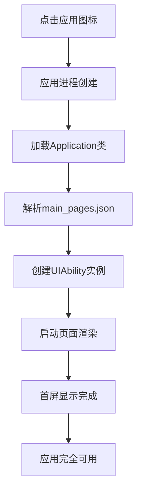

# 第16章：性能优化

## 16.1 应用启动优化

### 16.1.1 启动流程分析

应用启动是用户对应用的第一印象，启动速度直接影响用户体验。HarmonyOS应用启动主要分为以下几个阶段：



### 16.1.2 启动任务配置

HarmonyOS提供了启动任务配置机制，通过`startup_config.json`文件来优化启动流程：

```json
{
  "startupTasks": [
    {
      "name": "InitDatabase",
      "srcEntry": "./ets/startup/DatabaseInitTask.ets",
      "dependencies": [],
      "runOnThread": "taskPool",
      "waitOnMainThread": false,
      "priority": 1
    },
    {
      "name": "LoadConfig",
      "srcEntry": "./ets/startup/ConfigLoadTask.ets",
      "dependencies": [],
      "runOnThread": "taskPool",
      "waitOnMainThread": false,
      "priority": 2
    },
    {
      "name": "InitNetwork",
      "srcEntry": "./ets/startup/NetworkInitTask.ets",
      "dependencies": ["LoadConfig"],
      "runOnThread": "taskPool",
      "waitOnMainThread": false,
      "priority": 3
    },
    {
      "name": "PrepareUI",
      "srcEntry": "./ets/startup/UIPrepareTask.ets",
      "dependencies": ["LoadConfig"],
      "runOnThread": "mainThread",
      "waitOnMainThread": true,
      "priority": 4
    }
  ],
  "configEntry": "./ets/startup/StartupConfig.ets"
}
```

### 16.1.3 启动任务实现

```typescript
// DatabaseInitTask.ets
import hilog from '@ohos.hilog'
import { StartupTask } from '@ohos.app.ability.StartupTask'
import { Context } from '@ohos.app.ability.common'

export default class DatabaseInitTask extends StartupTask {
  async init(context: Context): Promise<void> {
    hilog.info(0x0000, 'DatabaseInit', '开始初始化数据库')

    try {
      // 异步初始化数据库连接
      await this.initDatabase()
      hilog.info(0x0000, 'DatabaseInit', '数据库初始化完成')
    } catch (error) {
      hilog.error(0x0000, 'DatabaseInit', `数据库初始化失败: ${error}`)
    }
  }

  private async initDatabase(): Promise<void> {
    // 模拟数据库初始化
    await new Promise(resolve => setTimeout(resolve, 100))
  }
}

// ConfigLoadTask.ets
import hilog from '@ohos.hilog'
import { StartupTask } from '@ohos.app.ability.StartupTask'
import { Context } from '@ohos.app.ability.common'

export default class ConfigLoadTask extends StartupTask {
  async init(context: Context): Promise<void> {
    hilog.info(0x0000, 'ConfigLoad', '开始加载配置')

    try {
      // 加载应用配置
      await this.loadAppConfig()
      hilog.info(0x0000, 'ConfigLoad', '配置加载完成')
    } catch (error) {
      hilog.error(0x0000, 'ConfigLoad', `配置加载失败: ${error}`)
    }
  }

  private async loadAppConfig(): Promise<void> {
    // 模拟配置加载
    await new Promise(resolve => setTimeout(resolve, 50))
  }
}

// StartupConfig.ets
import hilog from '@ohos.hilog'
import { StartupConfig } from '@ohos.app.ability.StartupConfig'

export default class MyStartupConfig extends StartupConfig {
  onConfigReady(): void {
    hilog.info(0x0000, 'StartupConfig', '启动配置准备完成')
  }

  onConfigError(error: Error): void {
    hilog.error(0x0000, 'StartupConfig', `启动配置错误: ${error.message}`)
  }
}
```

### 16.1.4 冷启动优化策略

```typescript
// ColdStartOptimizer.ets
import hilog from '@ohos.hilog'
import { AbilityConstant, UIAbility, Want } from '@ohos.app.ability.UIAbility'

export class ColdStartOptimizer {
  private static instance: ColdStartOptimizer
  private startTime: number = 0
  private readonly TAG = 'ColdStartOpt'

  static getInstance(): ColdStartOptimizer {
    if (!ColdStartOptimizer.instance) {
      ColdStartOptimizer.instance = new ColdStartOptimizer()
    }
    return ColdStartOptimizer.instance
  }

  /**
   * 记录启动开始时间
   */
  recordStartLaunch(): void {
    this.startTime = Date.now()
    hilog.info(0x0000, this.TAG, '应用启动开始')
  }

  /**
   * 记录启动完成时间
   */
  recordLaunchComplete(stage: string): void {
    const elapsed = Date.now() - this.startTime
    hilog.info(0x0000, this.TAG, `${stage}完成，耗时: ${elapsed}ms`)
  }

  /**
   * 预加载关键资源
   */
  async preloadCriticalResources(): Promise<void> {
    const preloadTasks = [
      this.preloadFonts(),
      this.preloadImages(),
      this.preloadConfigs()
    ]

    await Promise.allSettled(preloadTasks)
  }

  private async preloadFonts(): Promise<void> {
    // 预加载字体文件
    hilog.info(0x0000, this.TAG, '预加载字体文件')
  }

  private async preloadImages(): Promise<void> {
    // 预加载关键图片资源
    hilog.info(0x0000, this.TAG, '预加载图片资源')
  }

  private async preloadConfigs(): Promise<void> {
    // 预加载配置文件
    hilog.info(0x0000, this.TAG, '预加载配置文件')
  }

  /**
   * 优化首页渲染
   */
  optimizeFirstPageRender(): void {
    // 1. 减少首页布局复杂度
    // 2. 延迟加载非关键组件
    // 3. 使用占位符组件
    hilog.info(0x0000, this.TAG, '优化首页渲染')
  }
}

// 在UIAbility中应用优化
export class MainAbility extends UIAbility {
  private optimizer = ColdStartOptimizer.getInstance()

  onCreate(want: Want, launchParam: AbilityConstant.LaunchParam): void {
    // 记录启动开始
    this.optimizer.recordStartLaunch()

    // 预加载资源
    this.optimizer.preloadCriticalResources()

    hilog.info(0x0000, 'MainAbility', 'MainAbility onCreate')
  }

  onWindowStageCreate(windowStage: window.WindowStage): void {
    this.optimizer.recordLaunchComplete('WindowStage创建')

    // 设置主页面
    windowStage.loadContent('pages/Index', (err) => {
      if (err.code) {
        hilog.error(0x0000, 'MainAbility', '加载页面失败')
        return
      }
      this.optimizer.recordLaunchComplete('首页加载完成')
      this.optimizer.optimizeFirstPageRender()
    })
  }
}
```

## 16.2 内存管理与泄漏检测

### 16.2.1 内存监控工具

HarmonyOS提供了多种内存监控工具，帮助开发者识别内存问题：

```typescript
// MemoryMonitor.ets
import hidebug from '@ohos.hidebug'
import hilog from '@ohos.hilog'

export interface MemoryInfo {
  nativeHeapPss: number
  arktsHeapPss: number
  graphicPss: number
  gpuPss: number
  totalPss: number
  heapAlloc: number
  heapFree: number
  memAvailable: number
}

export class MemoryMonitor {
  private static instance: MemoryMonitor
  private monitoringInterval: number = 0
  private isMonitoring: boolean = false
  private memoryHistory: MemoryInfo[] = []
  private readonly TAG = 'MemoryMonitor'

  static getInstance(): MemoryMonitor {
    if (!MemoryMonitor.instance) {
      MemoryMonitor.instance = new MemoryMonitor()
    }
    return MemoryMonitor.instance
  }

  /**
   * 获取当前内存信息
   */
  getCurrentMemoryInfo(): MemoryInfo {
    try {
      const memoryInfo = hidebug.getMemoryInfoSync()
      return {
        nativeHeapPss: memoryInfo.nativeHeapPss || 0,
        arktsHeapPss: memoryInfo.arktsHeapPss || 0,
        graphicPss: memoryInfo.graphicPss || 0,
        gpuPss: memoryInfo.gpuPss || 0,
        totalPss: memoryInfo.totalPss || 0,
        heapAlloc: memoryInfo.heapAlloc || 0,
        heapFree: memoryInfo.heapFree || 0,
        memAvailable: memoryInfo.memAvailable || 0
      }
    } catch (error) {
      hilog.error(0x0000, this.TAG, `获取内存信息失败: ${error}`)
      return this.getEmptyMemoryInfo()
    }
  }

  /**
   * 开始内存监控
   */
  startMonitoring(interval: number = 5000): void {
    if (this.isMonitoring) {
      return
    }

    this.isMonitoring = true
    this.monitoringInterval = setInterval(() => {
      const memoryInfo = this.getCurrentMemoryInfo()
      this.memoryHistory.push(memoryInfo)

      // 保持最近100条记录
      if (this.memoryHistory.length > 100) {
        this.memoryHistory.shift()
      }

      this.checkMemoryAnomaly(memoryInfo)
    }, interval)

    hilog.info(0x0000, this.TAG, `开始内存监控，间隔: ${interval}ms`)
  }

  /**
   * 停止内存监控
   */
  stopMonitoring(): void {
    if (this.monitoringInterval) {
      clearInterval(this.monitoringInterval)
      this.monitoringInterval = 0
    }
    this.isMonitoring = false
    hilog.info(0x0000, this.TAG, '停止内存监控')
  }

  /**
   * 检查内存异常
   */
  private checkMemoryAnomaly(memoryInfo: MemoryInfo): void {
    // 检查内存使用率
    if (memoryInfo.totalPss > 500 * 1024) { // 500MB
      hilog.warn(0x0000, this.TAG, `内存使用过高: ${memoryInfo.totalPss}KB`)
    }

    // 检查堆内存分配
    if (memoryInfo.heapAlloc > 200 * 1024) { // 200MB
      hilog.warn(0x0000, this.TAG, `堆内存分配过高: ${memoryInfo.heapAlloc}KB`)
    }

    // 检查可用内存
    if (memoryInfo.memAvailable < 100 * 1024) { // 100MB
      hilog.warn(0x0000, this.TAG, `可用内存不足: ${memoryInfo.memAvailable}KB`)
    }
  }

  /**
   * 获取内存使用趋势
   */
  getMemoryTrend(): { trend: 'rising' | 'stable' | 'falling', rate: number } {
    if (this.memoryHistory.length < 10) {
      return { trend: 'stable', rate: 0 }
    }

    const recent = this.memoryHistory.slice(-10)
    const firstPss = recent[0].totalPss
    const lastPss = recent[recent.length - 1].totalPss
    const rate = (lastPss - firstPss) / firstPss

    let trend: 'rising' | 'stable' | 'falling'
    if (rate > 0.1) {
      trend = 'rising'
    } else if (rate < -0.1) {
      trend = 'falling'
    } else {
      trend = 'stable'
    }

    return { trend, rate }
  }

  /**
   * 获取内存历史数据
   */
  getMemoryHistory(): MemoryInfo[] {
    return [...this.memoryHistory]
  }

  /**
   * 清空内存历史
   */
  clearHistory(): void {
    this.memoryHistory = []
  }

  private getEmptyMemoryInfo(): MemoryInfo {
    return {
      nativeHeapPss: 0,
      arktsHeapPss: 0,
      graphicPss: 0,
      gpuPss: 0,
      totalPss: 0,
      heapAlloc: 0,
      heapFree: 0,
      memAvailable: 0
    }
  }
}
```

### 16.2.2 内存泄漏检测

```typescript
// MemoryLeakDetector.ets
import hilog from '@ohos.hilog'

export interface ObjectInfo {
  id: string
  createTime: number
  stackTrace: string
  objectType: string
}

export class MemoryLeakDetector {
  private static instance: MemoryLeakDetector
  private trackedObjects: Map<string, ObjectInfo> = new Map()
  private weakRefs: Map<string, WeakRef<any>> = new Map()
  private readonly TAG = 'MemoryLeakDetector'

  static getInstance(): MemoryLeakDetector {
    if (!MemoryLeakDetector.instance) {
      MemoryLeakDetector.instance = new MemoryLeakDetector()
    }
    return MemoryLeakDetector.instance
  }

  /**
   * 开始追踪对象
   */
  startTracking(obj: any, objectType: string): string {
    const id = this.generateId()
    const stackTrace = this.getStackTrace()

    const objectInfo: ObjectInfo = {
      id,
      createTime: Date.now(),
      stackTrace,
      objectType
    }

    this.trackedObjects.set(id, objectInfo)
    this.weakRefs.set(id, new WeakRef(obj))

    hilog.info(0x0000, this.TAG, `开始追踪对象: ${objectType} (${id})`)
    return id
  }

  /**
   * 停止追踪对象
   */
  stopTracking(id: string): void {
    this.trackedObjects.delete(id)
    this.weakRefs.delete(id)
    hilog.info(0x0000, this.TAG, `停止追踪对象: ${id}`)
  }

  /**
   * 检查内存泄漏
   */
  detectLeaks(): Array<{ object: ObjectInfo, leaked: boolean }> {
    const results: Array<{ object: ObjectInfo, leaked: boolean }> = []

    for (const [id, objectInfo] of this.trackedObjects) {
      const weakRef = this.weakRefs.get(id)
      if (weakRef) {
        const obj = weakRef.deref()
        const leaked = obj !== undefined

        if (leaked) {
          const age = Date.now() - objectInfo.createTime
          hilog.warn(0x0000, this.TAG,
            `检测到潜在内存泄漏: ${objectInfo.objectType} (${id}), 存活时间: ${age}ms`)
        }

        results.push({ object: objectInfo, leaked })
      }
    }

    return results
  }

  /**
   * 自动清理长期存活对象
   */
  autoCleanup(maxAge: number = 300000): number { // 默认5分钟
    let cleanedCount = 0
    const now = Date.now()

    for (const [id, objectInfo] of this.trackedObjects) {
      const age = now - objectInfo.createTime
      if (age > maxAge) {
        this.stopTracking(id)
        cleanedCount++
      }
    }

    if (cleanedCount > 0) {
      hilog.info(0x0000, this.TAG, `自动清理了 ${cleanedCount} 个长期存活对象`)
    }

    return cleanedCount
  }

  /**
   * 获取追踪统计
   */
  getTrackingStats(): { total: number, byType: Map<string, number> } {
    const byType = new Map<string, number>()

    for (const objectInfo of this.trackedObjects.values()) {
      const count = byType.get(objectInfo.objectType) || 0
      byType.set(objectInfo.objectType, count + 1)
    }

    return {
      total: this.trackedObjects.size,
      byType
    }
  }

  private generateId(): string {
    return `obj_${Date.now()}_${Math.random().toString(36).substr(2, 9)}`
  }

  private getStackTrace(): string {
    // 简化的堆栈跟踪获取
    const stack = new Error().stack || ''
    return stack.split('\n').slice(3, 8).join('\n')
  }
}

// 使用示例
class ComponentManager {
  private leakDetector = MemoryLeakDetector.getInstance()
  private components: Map<string, any> = new Map()

  createComponent(id: string, component: any): void {
    // 追踪组件创建
    this.leakDetector.startTracking(component, 'UIComponent')
    this.components.set(id, component)
  }

  destroyComponent(id: string): void {
    const component = this.components.get(id)
    if (component) {
      // 停止追踪组件
      this.leakDetector.stopTracking(id)
      this.components.delete(id)
    }
  }

  checkForLeaks(): void {
    const leaks = this.leakDetector.detectLeaks()
    const leakedCount = leaks.filter(l => l.leaked).length

    if (leakedCount > 0) {
      hilog.error(0x0000, 'ComponentManager', `检测到 ${leakedCount} 个组件内存泄漏`)
    }
  }
}
```

### 16.2.3 内存优化策略

```typescript
// MemoryOptimizer.ets
import hilog from '@ohos.hilog'

export class MemoryOptimizer {
  private static instance: MemoryOptimizer
  private readonly TAG = 'MemoryOptimizer'

  static getInstance(): MemoryOptimizer {
    if (!MemoryOptimizer.instance) {
      MemoryOptimizer.instance = new MemoryOptimizer()
    }
    return MemoryOptimizer.instance
  }

  /**
   * 优化ForEach组件内存使用
   */
  optimizeForEachMemory<T>(items: T[], keyGenerator: (item: T) => string): T[] {
    // 为大列表提供自定义keyGenerator，避免默认序列化开销
    if (items.length > 100) {
      hilog.info(0x0000, this.TAG, '优化大列表ForEach内存使用')
    }
    return items
  }

  /**
   * 清理无用缓存
   */
  clearUnusedCaches(): void {
    // 清理图片缓存
    this.clearImageCache()

    // 清理数据缓存
    this.clearDataCache()

    // 触发垃圾回收
    this.triggerGarbageCollection()
  }

  private clearImageCache(): void {
    // 清理图片缓存的实现
    hilog.info(0x0000, this.TAG, '清理图片缓存')
  }

  private clearDataCache(): void {
    // 清理数据缓存的实现
    hilog.info(0x0000, this.TAG, '清理数据缓存')
  }

  private triggerGarbageCollection(): void {
    // 触发垃圾回收（如果支持）
    hilog.info(0x0000, this.TAG, '触发垃圾回收')
  }

  /**
   * 延迟加载优化
   */
  createLazyLoader<T>(loader: () => Promise<T>): () => Promise<T> {
    let cachedPromise: Promise<T> | null = null

    return async (): Promise<T> => {
      if (!cachedPromise) {
        cachedPromise = loader()
      }
      return cachedPromise
    }
  }

  /**
   * 对象池模式
   */
  createObjectPool<T>(
    factory: () => T,
    resetFn: (obj: T) => void,
    maxSize: number = 10
  ): {
    acquire: () => T,
    release: (obj: T) => void,
    clear: () => void
  } {
    const pool: T[] = []

    return {
      acquire(): T {
        if (pool.length > 0) {
          return pool.pop()!
        }
        return factory()
      },

      release(obj: T): void {
        if (pool.length < maxSize) {
          resetFn(obj)
          pool.push(obj)
        }
      },

      clear(): void {
        pool.length = 0
      }
    }
  }

  /**
   * 内存使用建议
   */
  getMemoryOptimizationTips(): string[] {
    return [
      '使用WeakRef避免循环引用',
      '及时释放事件监听器',
      '合理使用对象池减少GC压力',
      '避免在循环中创建大对象',
      '使用LazyLoad延迟加载资源',
      '定期清理缓存数据',
      '优化ForEach的keyGenerator',
      '监控内存使用趋势'
    ]
  }
}
```

## 16.3 渲染性能优化

### 16.3.1 渲染性能监控

```typescript
// RenderPerformanceMonitor.ets
import hilog from '@ohos.hilog'

export interface FrameMetrics {
  frameNumber: number
  frameStartTime: number
  frameEndTime: number
  frameDuration: number
  fps: number
  jankCount: number
}

export class RenderPerformanceMonitor {
  private static instance: RenderPerformanceMonitor
  private frameMetrics: FrameMetrics[] = []
  private lastFrameTime: number = 0
  private frameCount: number = 0
  private totalFrameTime: number = 0
  private jankThreshold: number = 16.67 // 60fps阈值
  private readonly TAG = 'RenderMonitor'

  static getInstance(): RenderPerformanceMonitor {
    if (!RenderPerformanceMonitor.instance) {
      RenderPerformanceMonitor.instance = new RenderPerformanceMonitor()
    }
    return RenderPerformanceMonitor.instance
  }

  /**
   * 开始帧监控
   */
  startFrameMonitoring(): void {
    this.frameMetrics = []
    this.lastFrameTime = performance.now()
    this.frameCount = 0
    this.totalFrameTime = 0

    hilog.info(0x0000, this.TAG, '开始帧监控')
  }

  /**
   * 记录帧完成
   */
  recordFrameComplete(): void {
    const currentTime = performance.now()

    if (this.lastFrameTime > 0) {
      const frameDuration = currentTime - this.lastFrameTime
      const fps = 1000 / frameDuration
      const isJank = frameDuration > this.jankThreshold

      const frameMetric: FrameMetrics = {
        frameNumber: this.frameCount,
        frameStartTime: this.lastFrameTime,
        frameEndTime: currentTime,
        frameDuration,
        fps,
        jankCount: isJank ? 1 : 0
      }

      this.frameMetrics.push(frameMetric)
      this.totalFrameTime += frameDuration
      this.frameCount++

      // 检测性能问题
      if (isJank) {
        hilog.warn(0x0000, this.TAG,
          `检测到掉帧: 帧时长 ${frameDuration.toFixed(2)}ms, FPS ${fps.toFixed(1)}`)
      }

      // 保持最近500帧数据
      if (this.frameMetrics.length > 500) {
        this.frameMetrics.shift()
      }
    }

    this.lastFrameTime = currentTime
  }

  /**
   * 获取性能统计
   */
  getPerformanceStats(): {
    avgFps: number
    minFps: number
    maxFps: number
    jankRate: number
    avgFrameTime: number
  } {
    if (this.frameMetrics.length === 0) {
      return {
        avgFps: 0,
        minFps: 0,
        maxFps: 0,
        jankRate: 0,
        avgFrameTime: 0
      }
    }

    const fpsValues = this.frameMetrics.map(m => m.fps)
    const jankCount = this.frameMetrics.reduce((sum, m) => sum + m.jankCount, 0)

    return {
      avgFps: fpsValues.reduce((sum, fps) => sum + fps, 0) / fpsValues.length,
      minFps: Math.min(...fpsValues),
      maxFps: Math.max(...fpsValues),
      jankRate: (jankCount / this.frameMetrics.length) * 100,
      avgFrameTime: this.totalFrameTime / this.frameCount
    }
  }

  /**
   * 获取性能趋势
   */
  getPerformanceTrend(): 'improving' | 'stable' | 'degrading' {
    if (this.frameMetrics.length < 30) {
      return 'stable'
    }

    const recent = this.frameMetrics.slice(-10)
    const earlier = this.frameMetrics.slice(-30, -20)

    const recentAvgFps = recent.reduce((sum, m) => sum + m.fps, 0) / recent.length
    const earlierAvgFps = earlier.reduce((sum, m) => sum + m.fps, 0) / earlier.length

    const diff = recentAvgFps - earlierAvgFps

    if (diff > 2) {
      return 'improving'
    } else if (diff < -2) {
      return 'degrading'
    } else {
      return 'stable'
    }
  }

  /**
   * 生成性能报告
   */
  generateReport(): string {
    const stats = this.getPerformanceStats()
    const trend = this.getPerformanceTrend()

    return `
渲染性能报告
-------------
平均FPS: ${stats.avgFps.toFixed(1)}
最低FPS: ${stats.minFps.toFixed(1)}
最高FPS: ${stats.maxFps.toFixed(1)}
掉帧率: ${stats.jankRate.toFixed(1)}%
平均帧时长: ${stats.avgFrameTime.toFixed(2)}ms
性能趋势: ${trend}
监控帧数: ${this.frameCount}
    `.trim()
  }

  /**
   * 清除监控数据
   */
  clearData(): void {
    this.frameMetrics = []
    this.frameCount = 0
    this.totalFrameTime = 0
    hilog.info(0x0000, this.TAG, '清除监控数据')
  }
}
```

### 16.3.2 UI优化策略

```typescript
// UIOptimizer.ets
import hilog from '@ohos.hilog'

export class UIOptimizer {
  private static instance: UIOptimizer
  private readonly TAG = 'UIOptimizer'

  static getInstance(): UIOptimizer {
    if (!UIOptimizer.instance) {
      UIOptimizer.instance = new UIOptimizer()
    }
    return UIOptimizer.instance
  }

  /**
   * 优化列表渲染
   */
  optimizeListRendering<T>(
    items: T[],
    itemSize: number,
    visibleCount: number,
    renderItem: (item: T, index: number) => void
  ): { visibleItems: T[], startIndex: number } {
    // 虚拟列表优化
    const startIndex = Math.max(0, Math.floor(Math.random() * (items.length - visibleCount)))
    const endIndex = Math.min(startIndex + visibleCount, items.length)

    const visibleItems = items.slice(startIndex, endIndex)

    hilog.info(0x0000, this.TAG, `优化列表渲染: 显示 ${visibleItems.length}/${items.length} 项`)

    return { visibleItems, startIndex }
  }

  /**
   * 防抖动函数
   */
  createDebouncer<T extends (...args: any[]) => void>(
    fn: T,
    delay: number = 300
  ): (...args: Parameters<T>) => void {
    let timeoutId: number = 0

    return (...args: Parameters<T>) => {
      if (timeoutId) {
        clearTimeout(timeoutId)
      }

      timeoutId = setTimeout(() => {
        fn(...args)
      }, delay)
    }
  }

  /**
   * 节流函数
   */
  createThrottler<T extends (...args: any[]) => void>(
    fn: T,
    interval: number = 100
  ): (...args: Parameters<T>) => void {
    let lastTime = 0

    return (...args: Parameters<T>) => {
      const now = Date.now()
      if (now - lastTime >= interval) {
        lastTime = now
        fn(...args)
      }
    }
  }

  /**
   * 组件懒加载
   */
  createLazyComponent<T>(
    loader: () => Promise<T>,
    placeholder?: Component
  ): {
    component: T | null,
    loading: boolean,
    load: () => Promise<void>
  } {
    let component: T | null = null
    let loading = false
    let loadPromise: Promise<void> | null = null

    return {
      get component() { return component },
      get loading() { return loading },

      async load(): Promise<void> {
        if (loadPromise) {
          return loadPromise
        }

        loading = true
        loadPromise = loader().then(comp => {
          component = comp
          loading = false
        }).catch(error => {
          loading = false
          hilog.error(0x0000, this.TAG, `懒加载组件失败: ${error}`)
          throw error
        })

        return loadPromise
      }
    }
  }

  /**
   * 图片优化
   */
  optimizeImageLoading(
    src: string,
    options: {
      width?: number,
      height?: number,
      quality?: number,
      format?: 'webp' | 'jpg' | 'png'
    } = {}
  ): string {
    // 根据设备和网络条件优化图片
    const { width, height, quality = 80, format = 'webp' } = options

    let optimizedSrc = src

    // 添加尺寸参数
    if (width || height) {
      const sizeParams = []
      if (width) sizeParams.push(`w=${width}`)
      if (height) sizeParams.push(`h=${height}`)
      optimizedSrc += `?${sizeParams.join('&')}`
    }

    // 添加质量参数
    optimizedSrc += `${optimizedSrc.includes('?') ? '&' : '?'}q=${quality}`

    // 添加格式参数
    if (format !== 'jpg') {
      optimizedSrc += `&f=${format}`
    }

    hilog.info(0x0000, this.TAG, `优化图片加载: ${optimizedSrc}`)
    return optimizedSrc
  }

  /**
   * 动画性能优化
   */
  optimizeAnimation(options: {
    duration: number,
    easing: string,
    useGPU?: boolean
  }): void {
    const { duration, easing, useGPU = true } = options

    // 优先使用transform和opacity属性进行动画
    // 避免layout和paint
    hilog.info(0x0000, this.TAG,
      `优化动画: 时长${duration}ms, 缓动${easing}, GPU加速${useGPU}`)
  }

  /**
   * 布局优化建议
   */
  getLayoutOptimizationTips(): string[] {
    return [
      '避免过度嵌套布局',
      '使用Flex布局代替多层嵌套',
      '合理使用if/else条件渲染',
      '避免在列表中使用复杂布局',
      '使用LazyForEach进行大数据列表渲染',
      '合理设置组件的width和height',
      '避免频繁修改布局属性',
      '使用state装饰器减少不必要的刷新'
    ]
  }
}
```

## 16.4 网络请求优化

### 16.4.1 网络性能监控

```typescript
// NetworkPerformanceMonitor.ets
import hilog from '@ohos.hilog'

export interface NetworkMetrics {
  url: string
  method: string
  startTime: number
  endTime: number
  duration: number
  size: number
  success: boolean
  statusCode?: number
  errorType?: string
}

export class NetworkPerformanceMonitor {
  private static instance: NetworkPerformanceMonitor
  private metrics: NetworkMetrics[] = []
  private activeRequests: Map<string, NetworkMetrics> = new Map()
  private readonly TAG = 'NetworkMonitor'

  static getInstance(): NetworkPerformanceMonitor {
    if (!NetworkPerformanceMonitor.instance) {
      NetworkPerformanceMonitor.instance = new NetworkPerformanceMonitor()
    }
    return NetworkPerformanceMonitor.instance
  }

  /**
   * 开始监控请求
   */
  startRequest(url: string, method: string): string {
    const requestId = this.generateRequestId()
    const metrics: NetworkMetrics = {
      url,
      method,
      startTime: performance.now(),
      endTime: 0,
      duration: 0,
      size: 0,
      success: false
    }

    this.activeRequests.set(requestId, metrics)
    return requestId
  }

  /**
   * 完成请求监控
   */
  completeRequest(
    requestId: string,
    success: boolean,
    statusCode?: number,
    size?: number,
    errorType?: string
  ): void {
    const metrics = this.activeRequests.get(requestId)
    if (!metrics) {
      return
    }

    metrics.endTime = performance.now()
    metrics.duration = metrics.endTime - metrics.startTime
    metrics.success = success
    metrics.statusCode = statusCode
    metrics.size = size || 0
    metrics.errorType = errorType

    this.metrics.push(metrics)
    this.activeRequests.delete(requestId)

    // 分析请求性能
    this.analyzeRequestPerformance(metrics)

    // 保持最近1000条记录
    if (this.metrics.length > 1000) {
      this.metrics.shift()
    }
  }

  /**
   * 分析请求性能
   */
  private analyzeRequestPerformance(metrics: NetworkMetrics): void {
    const { url, duration, success, statusCode } = metrics

    // 检查响应时间
    if (duration > 3000) {
      hilog.warn(0x0000, this.TAG,
        `请求响应时间过长: ${url} (${duration.toFixed(0)}ms)`)
    } else if (duration > 1000) {
      hilog.info(0x0000, this.TAG,
        `请求响应较慢: ${url} (${duration.toFixed(0)}ms)`)
    }

    // 检查失败请求
    if (!success) {
      hilog.error(0x0000, this.TAG,
        `请求失败: ${url} (${metrics.errorType})`)
    } else if (statusCode && statusCode >= 400) {
      hilog.warn(0x0000, this.TAG,
        `HTTP错误: ${url} (${statusCode})`)
    }
  }

  /**
   * 获取网络统计
   */
  getNetworkStats(): {
    totalRequests: number
    successRate: number
    avgResponseTime: number
    slowRequests: number
    failedRequests: number
    totalDataTransferred: number
  } {
    const totalRequests = this.metrics.length
    const successRequests = this.metrics.filter(m => m.success).length
    const failedRequests = this.metrics.filter(m => !m.success).length
    const slowRequests = this.metrics.filter(m => m.duration > 1000).length
    const totalDataTransferred = this.metrics.reduce((sum, m) => sum + m.size, 0)
    const avgResponseTime = totalRequests > 0
      ? this.metrics.reduce((sum, m) => sum + m.duration, 0) / totalRequests
      : 0

    return {
      totalRequests,
      successRate: totalRequests > 0 ? (successRequests / totalRequests) * 100 : 0,
      avgResponseTime,
      slowRequests,
      failedRequests,
      totalDataTransferred
    }
  }

  /**
   * 获取最慢的请求
   */
  getSlowRequests(limit: number = 10): NetworkMetrics[] {
    return this.metrics
      .sort((a, b) => b.duration - a.duration)
      .slice(0, limit)
  }

  /**
   * 获取失败的请求
   */
  getFailedRequests(limit: number = 10): NetworkMetrics[] {
    return this.metrics
      .filter(m => !m.success)
      .slice(-limit)
  }

  /**
   * 生成性能报告
   */
  generateReport(): string {
    const stats = this.getNetworkStats()
    const slowRequests = this.getSlowRequests(5)
    const failedRequests = this.getFailedRequests(5)

    let report = `
网络性能报告
-------------
总请求数: ${stats.totalRequests}
成功率: ${stats.successRate.toFixed(1)}%
平均响应时间: ${stats.avgResponseTime.toFixed(0)}ms
慢请求数: ${stats.slowRequests}
失败请求数: ${stats.failedRequests}
数据传输量: ${(stats.totalDataTransferred / 1024).toFixed(1)}KB

最慢的请求:
    `

    slowRequests.forEach((req, index) => {
      report += `\n${index + 1}. ${req.url} (${req.duration.toFixed(0)}ms)`
    })

    if (failedRequests.length > 0) {
      report += '\n\n失败的请求:'
      failedRequests.forEach((req, index) => {
        report += `\n${index + 1}. ${req.url} (${req.errorType})`
      })
    }

    return report.trim()
  }

  private generateRequestId(): string {
    return `req_${Date.now()}_${Math.random().toString(36).substr(2, 9)}`
  }

  /**
   * 清除监控数据
   */
  clearData(): void {
    this.metrics = []
    this.activeRequests.clear()
    hilog.info(0x0000, this.TAG, '清除网络监控数据')
  }
}
```

### 16.4.2 请求优化策略

```typescript
// NetworkOptimizer.ets
import http from '@ohos.net.http'
import hilog from '@ohos.hilog'

export interface RequestConfig {
  timeout: number
  retryCount: number
  retryDelay: number
  enableCache: boolean
  cacheTime: number
  compress: boolean
}

export class NetworkOptimizer {
  private static instance: NetworkOptimizer
  private cache: Map<string, { data: any, timestamp: number }> = new Map()
  private requestQueue: Map<string, Promise<any>> = new Map()
  private readonly TAG = 'NetworkOptimizer'

  static getInstance(): NetworkOptimizer {
    if (!NetworkOptimizer.instance) {
      NetworkOptimizer.instance = new NetworkOptimizer()
    }
    return NetworkOptimizer.instance
  }

  /**
   * 优化的HTTP请求
   */
  async optimizedRequest(
    url: string,
    options: {
      method?: http.RequestMethod,
      data?: Object,
      headers?: Record<string, string>,
      config?: Partial<RequestConfig>
    } = {}
  ): Promise<any> {
    const config: RequestConfig = {
      timeout: 10000,
      retryCount: 3,
      retryDelay: 1000,
      enableCache: true,
      cacheTime: 300000, // 5分钟
      compress: true,
      ...options.config
    }

    // 检查缓存
    if (config.enableCache && options.method === http.RequestMethod.GET) {
      const cachedData = this.getCachedData(url)
      if (cachedData) {
        hilog.info(0x0000, this.TAG, `使用缓存数据: ${url}`)
        return cachedData
      }
    }

    // 防止重复请求
    const requestKey = `${options.method || 'GET'}_${url}`
    if (this.requestQueue.has(requestKey)) {
      hilog.info(0x0000, this.TAG, `等待重复请求完成: ${url}`)
      return this.requestQueue.get(requestKey)
    }

    const requestPromise = this.executeRequestWithRetry(url, options, config)
    this.requestQueue.set(requestKey, requestPromise)

    try {
      const result = await requestPromise

      // 缓存结果
      if (config.enableCache && options.method === http.RequestMethod.GET) {
        this.setCachedData(url, result, config.cacheTime)
      }

      return result
    } finally {
      this.requestQueue.delete(requestKey)
    }
  }

  /**
   * 带重试机制的请求执行
   */
  private async executeRequestWithRetry(
    url: string,
    options: any,
    config: RequestConfig
  ): Promise<any> {
    const monitor = NetworkPerformanceMonitor.getInstance()
    const requestId = monitor.startRequest(url, options.method || 'GET')

    for (let attempt = 1; attempt <= config.retryCount; attempt++) {
      try {
        const result = await this.executeRequest(url, options, config)

        monitor.completeRequest(requestId, true, 200, this.getResponseSize(result))
        return result
      } catch (error) {
        hilog.warn(0x0000, this.TAG,
          `请求失败 (尝试 ${attempt}/${config.retryCount}): ${url} - ${error}`)

        if (attempt === config.retryCount) {
          monitor.completeRequest(requestId, false, undefined, undefined,
            error instanceof Error ? error.name : 'UnknownError')
          throw error
        }

        // 重试延迟
        await this.delay(config.retryDelay * attempt)
      }
    }

    throw new Error('Request failed after all retries')
  }

  /**
   * 执行单个请求
   */
  private async executeRequest(
    url: string,
    options: any,
    config: RequestConfig
  ): Promise<any> {
    const httpRequest = http.createHttp()

    // 设置请求头
    const headers = {
      'User-Agent': 'HarmonyOS-App/1.0',
      'Accept': 'application/json',
      ...options.headers
    }

    if (config.compress) {
      headers['Accept-Encoding'] = 'gzip, deflate'
    }

    // 配置请求选项
    const requestOptions = {
      method: options.method || http.RequestMethod.GET,
      header: headers,
      extraData: options.data,
      expectDataType: http.HttpDataType.OBJECT,
      connectTimeout: config.timeout,
      readTimeout: config.timeout,
      usingCache: !config.enableCache
    }

    return new Promise((resolve, reject) => {
      httpRequest.request(url, requestOptions, (err, data) => {
        if (err) {
          reject(err)
        } else {
          if (data.responseCode >= 200 && data.responseCode < 300) {
            resolve(data.result)
          } else {
            reject(new Error(`HTTP ${data.responseCode}`))
          }
        }
      })
    })
  }

  /**
   * 批量请求优化
   */
  async batchRequest(
    requests: Array<{
      url: string,
      options?: any,
      config?: Partial<RequestConfig>
    }>
  ): Promise<any[]> {
    // 使用Promise.all并行执行请求
    const promises = requests.map(req =>
      this.optimizedRequest(req.url, req.options, req.config)
    )

    hilog.info(0x0000, this.TAG, `执行批量请求: ${requests.length}个`)

    return Promise.all(promises)
  }

  /**
   * 分段数据上传
   */
  async segmentedUpload(
    url: string,
    dataProvider: (chunkSize: number) => ArrayBuffer,
    chunkSize: number = 1024 * 1024 // 1MB
  ): Promise<any> {
    hilog.info(0x0000, this.TAG, `开始分段上传: ${url}, 块大小: ${chunkSize}`)

    const httpRequest = http.createHttp()

    try {
      const response = await new Promise<any>((resolve, reject) => {
        const requestOptions = {
          method: http.RequestMethod.POST,
          extraData: dataProvider,
          expectDataType: http.HttpDataType.STRING,
          connectTimeout: 30000,
          readTimeout: 30000
        }

        httpRequest.request(url, requestOptions, (err, data) => {
          if (err) {
            reject(err)
          } else {
            resolve(data)
          }
        })
      })

      hilog.info(0x0000, this.TAG, '分段上传完成')
      return response
    } finally {
      httpRequest.destroy()
    }
  }

  /**
   * 缓存管理
   */
  private getCachedData(key: string): any | null {
    const cached = this.cache.get(key)
    if (cached && Date.now() - cached.timestamp < 300000) { // 5分钟有效期
      return cached.data
    }
    return null
  }

  private setCachedData(key: string, data: any, ttl: number): void {
    this.cache.set(key, {
      data,
      timestamp: Date.now()
    })

    // 设置过期清理
    setTimeout(() => {
      this.cache.delete(key)
    }, ttl)
  }

  /**
   * 清理过期缓存
   */
  clearExpiredCache(): void {
    const now = Date.now()
    const expiredKeys: string[] = []

    for (const [key, cached] of this.cache.entries()) {
      if (now - cached.timestamp > 300000) {
        expiredKeys.push(key)
      }
    }

    expiredKeys.forEach(key => this.cache.delete(key))
    hilog.info(0x0000, this.TAG, `清理过期缓存: ${expiredKeys.length}个`)
  }

  private getResponseSize(data: any): number {
    if (typeof data === 'string') {
      return data.length
    } else if (data instanceof ArrayBuffer) {
      return data.byteLength
    } else {
      return JSON.stringify(data).length
    }
  }

  private delay(ms: number): Promise<void> {
    return new Promise(resolve => setTimeout(resolve, ms))
  }
}
```

## 16.5 电池使用优化

### 16.5.1 电源管理

```typescript
// PowerManager.ets
import batteryInfo from '@ohos.batteryInfo'
import hilog from '@ohos.hilog'

export interface BatteryInfo {
  level: number
  charging: boolean
  health: number
  plugged: number
  temperature: number
  voltage: number
}

export interface PowerOptimizationConfig {
  enableLowPowerMode: boolean
  batteryThreshold: number
  disableBackgroundTasks: boolean
  reduceFrequency: boolean
  disableAnimations: boolean
}

export class PowerManager {
  private static instance: PowerManager
  private batteryInfo: BatteryInfo | null = null
  private powerConfig: PowerOptimizationConfig = {
    enableLowPowerMode: false,
    batteryThreshold: 20,
    disableBackgroundTasks: false,
    reduceFrequency: false,
    disableAnimations: false
  }
  private batteryChangeCallback: ((info: BatteryInfo) => void) | null = null
  private readonly TAG = 'PowerManager'

  static getInstance(): PowerManager {
    if (!PowerManager.instance) {
      PowerManager.instance = new PowerManager()
    }
    return PowerManager.instance
  }

  /**
   * 初始化电源管理
   */
  async initialize(): Promise<void> {
    try {
      // 获取电池信息
      this.updateBatteryInfo()

      // 监听电池状态变化
      this.startBatteryMonitoring()

      hilog.info(0x0000, this.TAG, '电源管理初始化完成')
    } catch (error) {
      hilog.error(0x0000, this.TAG, `电源管理初始化失败: ${error}`)
    }
  }

  /**
   * 更新电池信息
   */
  private updateBatteryInfo(): void {
    this.batteryInfo = {
      level: batteryInfo.batterySOC,
      charging: batteryInfo.chargingStatus === batteryInfo.BatteryChargingState.ENABLE,
      health: batteryInfo.batteryHealthStatus,
      plugged: batteryInfo.pluggedType,
      temperature: batteryInfo.batteryTemperature,
      voltage: batteryInfo.batteryVoltage
    }
  }

  /**
   * 开始电池监控
   */
  private startBatteryMonitoring(): void {
    // 注册电池状态变化监听
    batteryInfo.on('batteryChange', () => {
      this.updateBatteryInfo()
      this.handleBatteryChange()
    })
  }

  /**
   * 处理电池状态变化
   */
  private handleBatteryChange(): void {
    if (!this.batteryInfo) return

    hilog.info(0x0000, this.TAG,
      `电池状态变化: 电量${this.batteryInfo.level}%, 充电${this.batteryInfo.charging}`)

    // 检查是否需要启用省电模式
    if (this.batteryInfo.level <= this.powerConfig.batteryThreshold &&
        !this.batteryInfo.charging) {
      this.enableLowPowerMode()
    } else if (this.batteryInfo.level > 30 || this.batteryInfo.charging) {
      this.disableLowPowerMode()
    }

    // 通知回调
    if (this.batteryChangeCallback) {
      this.batteryChangeCallback(this.batteryInfo)
    }
  }

  /**
   * 启用省电模式
   */
  private enableLowPowerMode(): void {
    if (this.powerConfig.enableLowPowerMode) return

    hilog.info(0x0000, this.TAG, '启用省电模式')

    this.powerConfig.enableLowPowerMode = true
    this.powerConfig.disableBackgroundTasks = true
    this.powerConfig.reduceFrequency = true
    this.powerConfig.disableAnimations = true

    // 应用省电策略
    this.applyPowerOptimizations()
  }

  /**
   * 禁用省电模式
   */
  private disableLowPowerMode(): void {
    if (!this.powerConfig.enableLowPowerMode) return

    hilog.info(0x0000, this.TAG, '禁用省电模式')

    this.powerConfig.enableLowPowerMode = false
    this.powerConfig.disableBackgroundTasks = false
    this.powerConfig.reduceFrequency = false
    this.powerConfig.disableAnimations = false

    // 恢复正常设置
    this.restoreNormalSettings()
  }

  /**
   * 应用电源优化策略
   */
  private applyPowerOptimizations(): void {
    // 1. 降低更新频率
    if (this.powerConfig.reduceFrequency) {
      this.reduceUpdateFrequency()
    }

    // 2. 禁用后台任务
    if (this.powerConfig.disableBackgroundTasks) {
      this.disableBackgroundTasks()
    }

    // 3. 降低屏幕亮度（如果支持）
    this.reduceScreenBrightness()

    // 4. 禁用动画效果
    if (this.powerConfig.disableAnimations) {
      this.disableAnimations()
    }
  }

  /**
   * 恢复正常设置
   */
  private restoreNormalSettings(): void {
    // 恢复更新频率
    this.restoreUpdateFrequency()

    // 启用后台任务
    this.enableBackgroundTasks()

    // 恢复屏幕亮度
    this.restoreScreenBrightness()

    // 启用动画效果
    this.enableAnimations()
  }

  /**
   * 降低更新频率
   */
  private reduceUpdateFrequency(): void {
    hilog.info(0x0000, this.TAG, '降低更新频率')
    // 实现降低频率的逻辑
  }

  /**
   * 禁用后台任务
   */
  private disableBackgroundTasks(): void {
    hilog.info(0x0000, this.TAG, '禁用后台任务')
    // 实现禁用后台任务的逻辑
  }

  /**
   * 降低屏幕亮度
   */
  private reduceScreenBrightness(): void {
    hilog.info(0x0000, this.TAG, '降低屏幕亮度')
    // 实现降低屏幕亮度的逻辑
  }

  /**
   * 禁用动画效果
   */
  private disableAnimations(): void {
    hilog.info(0x0000, this.TAG, '禁用动画效果')
    // 实现禁用动画的逻辑
  }

  /**
   * 恢复更新频率
   */
  private restoreUpdateFrequency(): void {
    hilog.info(0x0000, this.TAG, '恢复更新频率')
  }

  /**
   * 启用后台任务
   */
  private enableBackgroundTasks(): void {
    hilog.info(0x0000, this.TAG, '启用后台任务')
  }

  /**
   * 恢复屏幕亮度
   */
  private restoreScreenBrightness(): void {
    hilog.info(0x0000, this.TAG, '恢复屏幕亮度')
  }

  /**
   * 启用动画效果
   */
  private enableAnimations(): void {
    hilog.info(0x0000, this.TAG, '启用动画效果')
  }

  /**
   * 获取当前电池信息
   */
  getBatteryInfo(): BatteryInfo | null {
    return this.batteryInfo
  }

  /**
   * 获取电源配置
   */
  getPowerConfig(): PowerOptimizationConfig {
    return { ...this.powerConfig }
  }

  /**
   * 设置电池阈值
   */
  setBatteryThreshold(threshold: number): void {
    this.powerConfig.batteryThreshold = Math.max(0, Math.min(100, threshold))
    hilog.info(0x0000, this.TAG, `设置电池阈值: ${threshold}%`)
  }

  /**
   * 设置电池状态变化回调
   */
  setBatteryChangeCallback(callback: (info: BatteryInfo) => void): void {
    this.batteryChangeCallback = callback
  }

  /**
   * 获取电池使用建议
   */
  getBatteryOptimizationTips(): string[] {
    const tips = [
      '在低电量时降低屏幕亮度',
      '关闭不必要的后台应用',
      '减少动画效果',
      '降低数据更新频率',
      '使用WiFi代替移动数据',
      '避免在高温环境下使用'
    ]

    if (this.batteryInfo) {
      if (this.batteryInfo.temperature > 35) {
        tips.push('设备温度过高，建议冷却后使用')
      }
      if (this.batteryInfo.health !== batteryInfo.BatteryHealthState.GOOD) {
        tips.push('电池健康状态不佳，建议检查电池')
      }
    }

    return tips
  }
}
```

### 16.5.2 性能模式管理

```typescript
// PerformanceModeManager.ets
import hilog from '@ohos.hilog'

export enum PerformanceMode {
  POWER_SAVE = 'power_save',
  BALANCED = 'balanced',
  HIGH_PERFORMANCE = 'high_performance'
}

export interface PerformanceConfig {
  mode: PerformanceMode
  cpuFrequency: 'low' | 'normal' | 'high'
  gpuPerformance: 'low' | 'normal' | 'high'
  networkPolicy: 'restricted' | 'normal' | 'unrestricted'
  updateFrequency: number
  enableBackgroundProcessing: boolean
}

export class PerformanceModeManager {
  private static instance: PerformanceModeManager
  private currentMode: PerformanceMode = PerformanceMode.BALANCED
  private modeConfigs: Map<PerformanceMode, PerformanceConfig> = new Map()
  private modeChangeCallback: ((mode: PerformanceMode) => void) | null = null
  private readonly TAG = 'PerformanceModeManager'

  static getInstance(): PerformanceModeManager {
    if (!PerformanceModeManager.instance) {
      PerformanceModeManager.instance = new PerformanceModeManager()
    }
    return PerformanceModeManager.instance
  }

  constructor() {
    this.initializeModeConfigs()
  }

  /**
   * 初始化性能模式配置
   */
  private initializeModeConfigs(): void {
    // 省电模式配置
    this.modeConfigs.set(PerformanceMode.POWER_SAVE, {
      mode: PerformanceMode.POWER_SAVE,
      cpuFrequency: 'low',
      gpuPerformance: 'low',
      networkPolicy: 'restricted',
      updateFrequency: 30000, // 30秒
      enableBackgroundProcessing: false
    })

    // 平衡模式配置
    this.modeConfigs.set(PerformanceMode.BALANCED, {
      mode: PerformanceMode.BALANCED,
      cpuFrequency: 'normal',
      gpuPerformance: 'normal',
      networkPolicy: 'normal',
      updateFrequency: 5000, // 5秒
      enableBackgroundProcessing: true
    })

    // 高性能模式配置
    this.modeConfigs.set(PerformanceMode.HIGH_PERFORMANCE, {
      mode: PerformanceMode.HIGH_PERFORMANCE,
      cpuFrequency: 'high',
      gpuPerformance: 'high',
      networkPolicy: 'unrestricted',
      updateFrequency: 1000, // 1秒
      enableBackgroundProcessing: true
    })
  }

  /**
   * 设置性能模式
   */
  setPerformanceMode(mode: PerformanceMode): void {
    if (this.currentMode === mode) return

    hilog.info(0x0000, this.TAG, `切换性能模式: ${this.currentMode} -> ${mode}`)

    const oldMode = this.currentMode
    this.currentMode = mode

    // 应用新的性能配置
    this.applyPerformanceConfig(this.getModeConfig(mode))

    // 通知回调
    if (this.modeChangeCallback) {
      this.modeChangeCallback(mode)
    }
  }

  /**
   * 应用性能配置
   */
  private applyPerformanceConfig(config: PerformanceConfig): void {
    hilog.info(0x0000, this.TAG, `应用性能配置: ${JSON.stringify(config)}`)

    // 1. 设置CPU频率
    this.setCPUFrequency(config.cpuFrequency)

    // 2. 设置GPU性能
    this.setGPUPerformance(config.gpuPerformance)

    // 3. 设置网络策略
    this.setNetworkPolicy(config.networkPolicy)

    // 4. 设置更新频率
    this.setUpdateFrequency(config.updateFrequency)

    // 5. 设置后台处理
    this.setBackgroundProcessing(config.enableBackgroundProcessing)
  }

  /**
   * 自动选择性能模式
   */
  autoSelectMode(batteryLevel: number, charging: boolean, thermalState: string): void {
    let targetMode: PerformanceMode

    if (thermalState === 'critical' || (!charging && batteryLevel < 15)) {
      targetMode = PerformanceMode.POWER_SAVE
    } else if (charging && batteryLevel > 80 && thermalState === 'normal') {
      targetMode = PerformanceMode.HIGH_PERFORMANCE
    } else {
      targetMode = PerformanceMode.BALANCED
    }

    this.setPerformanceMode(targetMode)
  }

  /**
   * 设置CPU频率
   */
  private setCPUFrequency(frequency: 'low' | 'normal' | 'high'): void {
    hilog.info(0x0000, this.TAG, `设置CPU频率: ${frequency}`)
    // 实现CPU频率设置逻辑
  }

  /**
   * 设置GPU性能
   */
  private setGPUPerformance(performance: 'low' | 'normal' | 'high'): void {
    hilog.info(0x0000, this.TAG, `设置GPU性能: ${performance}`)
    // 实现GPU性能设置逻辑
  }

  /**
   * 设置网络策略
   */
  private setNetworkPolicy(policy: 'restricted' | 'normal' | 'unrestricted'): void {
    hilog.info(0x0000, this.TAG, `设置网络策略: ${policy}`)
    // 实现网络策略设置逻辑
  }

  /**
   * 设置更新频率
   */
  private setUpdateFrequency(frequency: number): void {
    hilog.info(0x0000, this.TAG, `设置更新频率: ${frequency}ms`)
    // 实现更新频率设置逻辑
  }

  /**
   * 设置后台处理
   */
  private setBackgroundProcessing(enabled: boolean): void {
    hilog.info(0x0000, this.TAG, `设置后台处理: ${enabled}`)
    // 实现后台处理设置逻辑
  }

  /**
   * 获取当前性能模式
   */
  getCurrentMode(): PerformanceMode {
    return this.currentMode
  }

  /**
   * 获取模式配置
   */
  getModeConfig(mode: PerformanceMode): PerformanceConfig {
    return this.modeConfigs.get(mode) || this.modeConfigs.get(PerformanceMode.BALANCED)!
  }

  /**
   * 获取当前配置
   */
  getCurrentConfig(): PerformanceConfig {
    return this.getModeConfig(this.currentMode)
  }

  /**
   * 设置模式变化回调
   */
  setModeChangeCallback(callback: (mode: PerformanceMode) => void): void {
    this.modeChangeCallback = callback
  }

  /**
   * 获取性能模式描述
   */
  getModeDescription(mode: PerformanceMode): string {
    const descriptions = {
      [PerformanceMode.POWER_SAVE]: '省电模式 - 降低性能以延长电池续航',
      [PerformanceMode.BALANCED]: '平衡模式 - 在性能和功耗之间取得平衡',
      [PerformanceMode.HIGH_PERFORMANCE]: '高性能模式 - 最大化性能表现'
    }
    return descriptions[mode] || '未知模式'
  }

  /**
   * 获取性能优化建议
   */
  getOptimizationSuggestions(): string[] {
    const suggestions = []

    switch (this.currentMode) {
      case PerformanceMode.POWER_SAVE:
        suggestions.push(
          '关闭不必要的动画效果',
          '降低屏幕刷新率',
          '限制后台应用活动',
          '使用WiFi代替移动数据'
        )
        break
      case PerformanceMode.BALANCED:
        suggestions.push(
          '定期清理缓存数据',
          '监控电池使用情况',
          '适当调整应用设置'
        )
        break
      case PerformanceMode.HIGH_PERFORMANCE:
        suggestions.push(
          '注意设备温度',
          '及时充电以维持高性能',
          '避免长时间高负载运行'
        )
        break
    }

    return suggestions
  }
}
```

## 实践项目：性能优化监控面板

```typescript
// PerformanceDashboard.ets
import { MemoryMonitor } from './MemoryMonitor'
import { NetworkPerformanceMonitor } from './NetworkPerformanceMonitor'
import { PowerManager } from './PowerManager'
import { PerformanceModeManager, PerformanceMode } from './PerformanceModeManager'

@Entry
@Component
struct PerformanceDashboard {
  @State memoryInfo: any = null
  @State networkStats: any = null
  @State batteryInfo: any = null
  @State currentMode: PerformanceMode = PerformanceMode.BALANCED
  @State isMonitoring: boolean = false

  private memoryMonitor = MemoryMonitor.getInstance()
  private networkMonitor = NetworkPerformanceMonitor.getInstance()
  private powerManager = PowerManager.getInstance()
  private performanceManager = PerformanceModeManager.getInstance()

  aboutToAppear() {
    this.initializeMonitoring()
  }

  aboutToDisappear() {
    this.stopMonitoring()
  }

  private initializeMonitoring() {
    // 设置回调
    this.powerManager.setBatteryChangeCallback((info) => {
      this.batteryInfo = info
    })

    this.performanceManager.setModeChangeCallback((mode) => {
      this.currentMode = mode
    })
  }

  build() {
    Column() {
      // 标题栏
      Row() {
        Text('性能优化监控面板')
          .fontSize(20)
          .fontWeight(FontWeight.Bold)
          .fontColor('#333333')

        Button(this.isMonitoring ? '停止监控' : '开始监控')
          .width(80)
          .height(32)
          .backgroundColor(this.isMonitoring ? '#FF3B30' : '#34C759')
          .fontSize(12)
          .onClick(() => {
            this.toggleMonitoring()
          })
      }
      .justifyContent(FlexAlign.SpaceBetween)
      .width('100%')
      .padding(16)
      .backgroundColor('#FFFFFF')
      .shadow({
        radius: 2,
        color: '#00000010',
        offsetX: 0,
        offsetY: 1
      })

      Scroll() {
        Column() {
          // 性能模式选择
          this.PerformanceModeSelector()

          // 电池信息卡片
          if (this.batteryInfo) {
            this.BatteryInfoCard()
          }

          // 内存信息卡片
          if (this.memoryInfo) {
            this.MemoryInfoCard()
          }

          // 网络性能卡片
          if (this.networkStats) {
            this.NetworkStatsCard()
          }

          // 优化建议
          this.OptimizationSuggestions()
        }
        .padding(16)
      }
      .layoutWeight(1)
      .width('100%')
    }
    .width('100%')
    .height('100%')
    .backgroundColor('#F5F5F5')
  }

  @Builder PerformanceModeSelector() {
    Column() {
      Text('性能模式')
        .fontSize(16)
        .fontWeight(FontWeight.Medium)
        .margin({ bottom: 12 })

      Row() {
        ForEach([
          PerformanceMode.POWER_SAVE,
          PerformanceMode.BALANCED,
          PerformanceMode.HIGH_PERFORMANCE
        ], (mode: PerformanceMode) => {
          Button(this.getModeTitle(mode))
            .width(100)
            .height(36)
            .backgroundColor(this.currentMode === mode ? '#007AFF' : '#F0F0F0')
            .fontColor(this.currentMode === mode ? '#FFFFFF' : '#666666')
            .fontSize(12)
            .margin({ right: 8 })
            .onClick(() => {
              this.performanceManager.setPerformanceMode(mode)
            })
        })
      }
      .width('100%')
      .justifyContent(FlexAlign.Start)

      Text(this.performanceManager.getModeDescription(this.currentMode))
        .fontSize(12)
        .fontColor('#666666')
        .margin({ top: 8 })
    }
    .width('100%')
    .padding(16)
    .backgroundColor('#FFFFFF')
    .borderRadius(8)
    .margin({ bottom: 16 })
  }

  @Builder BatteryInfoCard() {
    Column() {
      Row() {
        Text('电池状态')
          .fontSize(16)
          .fontWeight(FontWeight.Medium)

        Text(`${this.batteryInfo.level}%`)
          .fontSize(18)
          .fontWeight(FontWeight.Bold)
          .fontColor(this.batteryInfo.level > 20 ? '#34C759' : '#FF3B30')
      }
      .width('100%')
      .justifyContent(FlexAlign.SpaceBetween)
      .margin({ bottom: 12 })

      Row() {
        Column() {
          Text(`${this.batteryInfo.charging ? '充电中' : '放电中'}`)
            .fontSize(14)
            .fontColor('#666666')
          Text(`温度: ${this.batteryInfo.temperature}°C`)
            .fontSize(12)
            .fontColor('#666666')
            .margin({ top: 4 })
        }
        .alignItems(HorizontalAlign.Start)

        Progress({
          value: this.batteryInfo.level,
          total: 100,
          type: ProgressType.Linear
        })
          .width(120)
          .height(6)
          .color(this.getBatteryColor(this.batteryInfo.level))
      }
      .width('100%')
      .justifyContent(FlexAlign.SpaceBetween)
    }
    .width('100%')
    .padding(16)
    .backgroundColor('#FFFFFF')
    .borderRadius(8)
    .margin({ bottom: 16 })
  }

  @Builder MemoryInfoCard() {
    Column() {
      Text('内存使用')
        .fontSize(16)
        .fontWeight(FontWeight.Medium)
        .margin({ bottom: 12 })

      Row() {
        Column() {
          Text('总PSS')
            .fontSize(12)
            .fontColor('#666666')
          Text(`${(this.memoryInfo.totalPss / 1024).toFixed(1)}MB`)
            .fontSize(16)
            .fontWeight(FontWeight.Bold)
        }
        .alignItems(HorizontalAlign.Start)

        Column() {
          Text('堆内存')
            .fontSize(12)
            .fontColor('#666666')
          Text(`${(this.memoryInfo.heapAlloc / 1024).toFixed(1)}MB`)
            .fontSize(16)
            .fontWeight(FontWeight.Bold)
        }
        .alignItems(HorizontalAlign.Start)

        Column() {
          Text('可用内存')
            .fontSize(12)
            .fontColor('#666666')
          Text(`${(this.memoryInfo.memAvailable / 1024).toFixed(1)}MB`)
            .fontSize(16)
            .fontWeight(FontWeight.Bold)
            .fontColor('#34C759')
        }
        .alignItems(HorizontalAlign.Start)
      }
      .width('100%')
      .justifyContent(FlexAlign.SpaceAround)
    }
    .width('100%')
    .padding(16)
    .backgroundColor('#FFFFFF')
    .borderRadius(8)
    .margin({ bottom: 16 })
  }

  @Builder NetworkStatsCard() {
    Column() {
      Text('网络性能')
        .fontSize(16)
        .fontWeight(FontWeight.Medium)
        .margin({ bottom: 12 })

      Row() {
        Column() {
          Text('总请求数')
            .fontSize(12)
            .fontColor('#666666')
          Text(this.networkStats.totalRequests.toString())
            .fontSize(16)
            .fontWeight(FontWeight.Bold)
        }
        .alignItems(HorizontalAlign.Start)

        Column() {
          Text('成功率')
            .fontSize(12)
            .fontColor('#666666')
          Text(`${this.networkStats.successRate.toFixed(1)}%`)
            .fontSize(16)
            .fontWeight(FontWeight.Bold)
            .fontColor(this.networkStats.successRate > 90 ? '#34C759' : '#FF9500')
        }
        .alignItems(HorizontalAlign.Start)

        Column() {
          Text('平均响应时间')
            .fontSize(12)
            .fontColor('#666666')
          Text(`${this.networkStats.avgResponseTime.toFixed(0)}ms`)
            .fontSize(16)
            .fontWeight(FontWeight.Bold)
        }
        .alignItems(HorizontalAlign.Start)
      }
      .width('100%')
      .justifyContent(FlexAlign.SpaceAround)
    }
    .width('100%')
    .padding(16)
    .backgroundColor('#FFFFFF')
    .borderRadius(8)
    .margin({ bottom: 16 })
  }

  @Builder OptimizationSuggestions() {
    Column() {
      Text('优化建议')
        .fontSize(16)
        .fontWeight(FontWeight.Medium)
        .margin({ bottom: 12 })

      ForEach(this.getCombinedSuggestions(), (suggestion: string) => {
        Row() {
          Text('•')
            .fontSize(14)
            .fontColor('#007AFF')
            .margin({ right: 8 })

          Text(suggestion)
            .fontSize(14)
            .fontColor('#333333')
            .layoutWeight(1)
        }
        .width('100%')
        .margin({ bottom: 8 })
      })
    }
    .width('100%')
    .padding(16)
    .backgroundColor('#FFFFFF')
    .borderRadius(8)
  }

  private async toggleMonitoring() {
    this.isMonitoring = !this.isMonitoring

    if (this.isMonitoring) {
      this.startMonitoring()
    } else {
      this.stopMonitoring()
    }
  }

  private startMonitoring() {
    this.memoryMonitor.startMonitoring(2000)
    this.updateData()
  }

  private stopMonitoring() {
    this.memoryMonitor.stopMonitoring()
  }

  private updateData() {
    if (!this.isMonitoring) return

    // 更新内存信息
    this.memoryInfo = this.memoryMonitor.getCurrentMemoryInfo()

    // 更新网络统计
    this.networkStats = this.networkMonitor.getNetworkStats()

    // 更新电池信息
    this.batteryInfo = this.powerManager.getBatteryInfo()

    // 继续更新
    setTimeout(() => {
      this.updateData()
    }, 2000)
  }

  private getModeTitle(mode: PerformanceMode): string {
    const titles = {
      [PerformanceMode.POWER_SAVE]: '省电',
      [PerformanceMode.BALANCED]: '平衡',
      [PerformanceMode.HIGH_PERFORMANCE]: '高性能'
    }
    return titles[mode] || '未知'
  }

  private getBatteryColor(level: number): string {
    if (level > 60) return '#34C759'
    if (level > 20) return '#FF9500'
    return '#FF3B30'
  }

  private getCombinedSuggestions(): string[] {
    const suggestions = [
      ...this.powerManager.getBatteryOptimizationTips(),
      ...this.performanceManager.getOptimizationSuggestions()
    ]
    return [...new Set(suggestions)].slice(0, 6) // 去重并限制数量
  }
}
```

## 本章小结

本章深入学习了HarmonyOS性能优化的各个方面，包括：

### 核心优化领域
1. **应用启动优化** - 启动任务配置、冷启动优化、资源预加载
2. **内存管理** - 内存监控、泄漏检测、优化策略
3. **渲染性能** - 帧率监控、UI优化、动画优化
4. **网络优化** - 请求监控、缓存策略、批量处理
5. **电池优化** - 电源管理、性能模式、省电策略

### 关键技术
1. **性能监控工具** - hidumper、hidebug等系统工具的使用
2. **启动任务管理** - startup_config.json配置和任务调度
3. **内存泄漏检测** - WeakRef追踪和自动清理机制
4. **网络请求优化** - 重试机制、缓存管理、分段上传
5. **智能电源管理** - 自适应性能模式和电池状态监控

### 实践能力
1. **性能分析** - 使用监控工具识别性能瓶颈
2. **优化策略制定** - 根据应用场景制定合适的优化方案
3. **自动化优化** - 实现自适应的性能调整机制
4. **性能监控面板** - 构建实时的性能监控系统

掌握这些性能优化技术，将帮助开发者创建流畅、高效、省电的HarmonyOS应用，为用户提供卓越的使用体验。下一章将学习动画与特效的实现，让应用界面更加生动有趣。