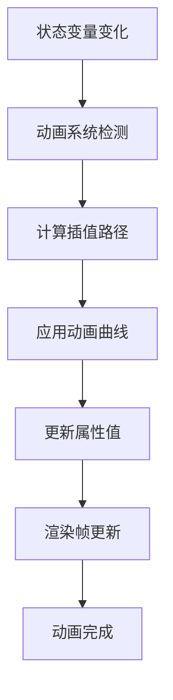

# 第17章：动画与特效

## 17.1 属性动画详解

### 17.1.1 动画基础概念

HarmonyOS的动画系统基于状态驱动的动画机制，通过属性值的变化自动创建动画过渡效果。动画系统支持多种曲线类型和插值算法，能够创建流畅自然的动画效果。



### 17.1.2 基础属性动画

```typescript
// BasicAnimationDemo.ets
import { curves } from '@kit.ArkUI'

@Entry
@Component
struct BasicAnimationDemo {
  @State scaleValue: number = 1.0
  @State rotationAngle: number = 0
  @State opacityValue: number = 1.0
  @State translateX: number = 0
  @State translateY: number = 0

  build() {
    Column() {
      // 动画控制面板
      Row() {
        Button('缩放动画')
          .width(100)
          .height(40)
          .margin(8)
          .onClick(() => {
            this.playScaleAnimation()
          })

        Button('旋转动画')
          .width(100)
          .height(40)
          .margin(8)
          .onClick(() => {
            this.playRotationAnimation()
          })

        Button('透明度动画')
          .width(100)
          .height(40)
          .margin(8)
          .onClick(() => {
            this.playOpacityAnimation()
          })
      }
      .justifyContent(FlexAlign.Center)
      .margin({ bottom: 20 })

      Row() {
        Button('位移动画')
          .width(100)
          .height(40)
          .margin(8)
          .onClick(() => {
            this.playTranslateAnimation()
          })

        Button('组合动画')
          .width(100)
          .height(40)
          .margin(8)
          .onClick(() => {
            this.playCombinedAnimation()
          })

        Button('重置')
          .width(100)
          .height(40)
          .margin(8)
          .onClick(() => {
            this.resetAnimations()
          })
      }
      .justifyContent(FlexAlign.Center)
      .margin({ bottom: 40 })

      // 动画展示区域
      Stack() {
        // 背景网格
        this.GridBackground()

        // 动画对象
        Column() {
          Text('动画演示')
            .fontSize(16)
            .fontWeight(FontWeight.Bold)
            .fontColor(Color.White)
        }
        .width(120)
        .height(120)
        .backgroundColor('#007AFF')
        .borderRadius(12)
        .justifyContent(FlexAlign.Center)
        .scale({ x: this.scaleValue, y: this.scaleValue })
        .rotate({ angle: this.rotationAngle })
        .opacity(this.opacityValue)
        .translate({ x: this.translateX, y: this.translateY })
        .animation({
          duration: 1000,
          curve: curves.springMotion(0.6, 0.8),
          delay: 0,
          iterations: 1,
          playMode: PlayMode.Normal
        })
      }
      .width(300)
      .height(300)
      .backgroundColor('#F5F5F7')
      .borderRadius(16)
      .justifyContent(FlexAlign.Center)
    }
    .width('100%')
    .height('100%')
    .padding(20)
    .backgroundColor('#FFFFFF')
  }

  @Builder GridBackground() {
    Column() {
      ForEach([0, 1, 2, 3, 4], (row: number) => {
        Row() {
          ForEach([0, 1, 2, 3, 4], (col: number) => {
            Rect()
              .width(60)
              .height(60)
              .fill('#E8E8EC')
              .border({
                width: 0.5,
                color: '#D1D1D6'
              })
          })
        }
      })
    }
  }

  private playScaleAnimation(): void {
    this.scaleValue = this.scaleValue === 1.0 ? 1.5 : 1.0
  }

  private playRotationAnimation(): void {
    this.rotationAngle = this.rotationAngle === 0 ? 360 : 0
  }

  private playOpacityAnimation(): void {
    this.opacityValue = this.opacityValue === 1.0 ? 0.3 : 1.0
  }

  private playTranslateAnimation(): void {
    this.translateX = this.translateX === 0 ? 80 : 0
    this.translateY = this.translateY === 0 ? -80 : 0
  }

  private playCombinedAnimation(): void {
    this.scaleValue = this.scaleValue === 1.0 ? 1.3 : 1.0
    this.rotationAngle = this.rotationAngle === 0 ? 180 : 0
    this.opacityValue = this.opacityValue === 1.0 ? 0.8 : 1.0
    this.translateX = this.translateX === 0 ? 60 : 0
    this.translateY = this.translateY === 0 ? -60 : 0
  }

  private resetAnimations(): void {
    this.scaleValue = 1.0
    this.rotationAngle = 0
    this.opacityValue = 1.0
    this.translateX = 0
    this.translateY = 0
  }
}
```

### 17.1.3 高级动画曲线

```typescript
// AdvancedAnimationCurves.ets
import { curves } from '@kit.ArkUI'

@Entry
@Component
struct AdvancedAnimationCurves {
  @State position: number = 0
  @State scale: number = 1.0
  @State rotation: number = 0
  @State selectedCurve: string = 'spring'

  private curveTypes = [
    { name: 'spring', curve: curves.springMotion(0.6, 0.8), description: '弹簧曲线' },
    { name: 'responsive', curve: curves.responsiveSpringMotion(), description: '响应式弹簧' },
    { name: 'ease', curve: curves.easeInOut, description: '缓入缓出' },
    { name: 'linear', curve: Curve.Linear, description: '线性' },
    { name: 'bounce', curve: curves.bounceCurve(), description: '弹跳' },
    { name: 'elastic', curve: curves.elasticCurve(0.5), description: '弹性' }
  ]

  build() {
    Column() {
      // 曲线选择器
      Row() {
        Text('动画曲线:')
          .fontSize(16)
          .fontWeight(FontWeight.Medium)
          .margin({ right: 16 })

        ForEach(this.curveTypes, (curveType) => {
          Button(curveType.name)
            .width(80)
            .height(32)
            .fontSize(12)
            .backgroundColor(this.selectedCurve === curveType.name ? '#007AFF' : '#F0F0F0')
            .fontColor(this.selectedCurve === curveType.name ? '#FFFFFF' : '#666666')
            .margin({ right: 8 })
            .onClick(() => {
              this.selectedCurve = curveType.name
            })
        })
      }
      .width('100%')
      .padding(16)
      .backgroundColor('#FFFFFF')
      .shadow({
        radius: 4,
        color: '#00000010',
        offsetX: 0,
        offsetY: 2
      })
      .margin({ bottom: 20 })

      // 动画演示区域
      Stack() {
        // 轨道
        Row()
          .width('80%')
          .height(2)
          .backgroundColor('#E0E0E0')
          .position({ x: '10%', y: '50%' })

        // 动画球体
        Circle({ width: 40, height: 40 })
          .fill('#007AFF')
          .position({
            x: this.position,
            y: '50%'
          })
          .translate({ y: -20 })
          .scale({ x: this.scale, y: this.scale })
          .rotate({ angle: this.rotation })
          .animation({
            duration: 1500,
            curve: this.getCurrentCurve(),
            iterations: 1,
            playMode: PlayMode.Normal
          })

        // 位置标记
        ForEach([0, 100, 200, 300], (pos) => {
          Column() {
            Text(`${pos}`)
              .fontSize(10)
              .fontColor('#666666')
            Rect()
              .width(2)
              .height(10)
              .fill('#666666')
          }
          .position({ x: `${pos + 50}px`, y: '60%' })
        })
      }
      .width('100%')
      .height(200)
      .backgroundColor('#F8F8F8')
      .borderRadius(8)
      .margin({ bottom: 20 })

      // 控制按钮
      Row() {
        Button('播放动画')
          .width(120)
          .height(40)
          .backgroundColor('#007AFF')
          .margin({ right: 16 })
          .onClick(() => {
            this.playAnimation()
          })

        Button('循环播放')
          .width(120)
          .height(40)
          .backgroundColor('#34C759')
          .margin({ right: 16 })
          .onClick(() => {
            this.playLoopAnimation()
          })

        Button('重置')
          .width(80)
          .height(40)
          .backgroundColor('#FF9500')
          .onClick(() => {
            this.resetAnimation()
          })
      }
      .justifyContent(FlexAlign.Center)

      // 曲线说明
      Text(this.getCurrentCurveDescription())
        .fontSize(14)
        .fontColor('#666666')
        .margin({ top: 20 })
        .textAlign(TextAlign.Center)
    }
    .width('100%')
    .height('100%')
    .padding(20)
    .backgroundColor('#FFFFFF')
  }

  private getCurrentCurve(): ICurve {
    const curveType = this.curveTypes.find(ct => ct.name === this.selectedCurve)
    return curveType?.curve || curves.springMotion()
  }

  private getCurrentCurveDescription(): string {
    const curveType = this.curveTypes.find(ct => ct.name === this.selectedCurve)
    return curveType?.description || '未知曲线'
  }

  private playAnimation(): void {
    this.position = this.position === 0 ? 300 : 0
    this.scale = this.scale === 1.0 ? 1.2 : 1.0
    this.rotation = this.rotation === 0 ? 360 : 0
  }

  private playLoopAnimation(): void {
    this.position = 300
    this.scale = 1.2
    this.rotation = 360

    setTimeout(() => {
      this.position = 0
      this.scale = 1.0
      this.rotation = 0
    }, 1600)
  }

  private resetAnimation(): void {
    this.position = 0
    this.scale = 1.0
    this.rotation = 0
  }
}
```

## 17.2 转场动画效果

### 17.2.1 页面转场动画

```typescript
// PageTransitionDemo.ets
import { curves } from '@kit.ArkUI'

@Entry
@Component
struct PageTransitionDemo {
  @State currentPage: string = 'page1'
  @State isTransitioning: boolean = false

  build() {
    Stack() {
      // 页面1
      if (this.currentPage === 'page1') {
        this.Page1()
          .transition(this.getPageTransitionEffect('page1', 'page2'))
      }

      // 页面2
      if (this.currentPage === 'page2') {
        this.Page2()
          .transition(this.getPageTransitionEffect('page2', 'page1'))
      }

      // 页面3
      if (this.currentPage === 'page3') {
        this.Page3()
          .transition(this.getPageTransitionEffect('page3', 'page2'))
      }

      // 导航按钮
      Column() {
        Row() {
          Button('上一页')
            .width(80)
            .height(40)
            .backgroundColor('#007AFF')
            .enabled(this.currentPage !== 'page1')
            .onClick(() => {
              this.navigatePrevious()
            })

          Button('下一页')
            .width(80)
            .height(40)
            .backgroundColor('#007AFF')
            .margin({ left: 20 })
            .enabled(this.currentPage !== 'page3')
            .onClick(() => {
              this.navigateNext()
            })
        }
        .justifyContent(FlexAlign.Center)

        Text(`当前页面: ${this.getPageTitle(this.currentPage)}`)
          .fontSize(14)
          .fontColor('#666666')
          .margin({ top: 12 })
      }
      .position({ x: '50%', y: '90%' })
      .translate({ x: -90, y: 0 })
    }
    .width('100%')
    .height('100%')
    .backgroundColor('#F5F5F7')
  }

  @Builder Page1() {
    Column() {
      Text('页面 1')
        .fontSize(24)
        .fontWeight(FontWeight.Bold)
        .fontColor('#007AFF')
        .margin({ bottom: 20 })

      Text('这是第一个页面')
        .fontSize(16)
        .fontColor('#333333')

      Image($r('app.media.icon'))
        .width(100)
        .height(100)
        .margin({ top: 20 })
    }
    .width('100%')
    .height('100%')
    .justifyContent(FlexAlign.Center)
    .backgroundColor('#FFFFFF')
    .borderRadius(16)
    .shadow({
      radius: 8,
      color: '#00000020',
      offsetX: 0,
      offsetY: 4
    })
    .margin(20)
  }

  @Builder Page2() {
    Column() {
      Text('页面 2')
        .fontSize(24)
        .fontWeight(FontWeight.Bold)
        .fontColor('#34C759')
        .margin({ bottom: 20 })

      Text('这是第二个页面')
        .fontSize(16)
        .fontColor('#333333')

      Row() {
        ForEach([1, 2, 3, 4], (item) => {
          Rect()
            .width(40)
            .height(40)
            .fill('#34C759')
            .borderRadius(8)
            .margin(8)
        })
      }
      .margin({ top: 20 })
    }
    .width('100%')
    .height('100%')
    .justifyContent(FlexAlign.Center)
    .backgroundColor('#FFFFFF')
    .borderRadius(16)
    .shadow({
      radius: 8,
      color: '#00000020',
      offsetX: 0,
      offsetY: 4
    })
    .margin(20)
  }

  @Builder Page3() {
    Column() {
      Text('页面 3')
        .fontSize(24)
        .fontWeight(FontWeight.Bold)
        .fontColor('#FF9500')
        .margin({ bottom: 20 })

      Text('这是第三个页面')
        .fontSize(16)
        .fontColor('#333333')

      Circle({ width: 80, height: 80 })
        .fill('#FF9500')
        .margin({ top: 20 })
    }
    .width('100%')
    .height('100%')
    .justifyContent(FlexAlign.Center)
    .backgroundColor('#FFFFFF')
    .borderRadius(16)
    .shadow({
      radius: 8,
      color: '#00000020',
      offsetX: 0,
      offsetY: 4
    })
    .margin(20)
  }

  private getPageTransitionEffect(fromPage: string, toPage: string): TransitionEffect {
    let effect: TransitionEffect

    // 根据页面切换方向确定转场效果
    const isForward = this.isForwardTransition(fromPage, toPage)

    if (isForward) {
      effect = TransitionEffect.OPACITY
        .animation({ curve: curves.springMotion(0.6, 0.8) })
        .combine(TransitionEffect.translate({ x: fromPage === 'page1' ? 100 : -100 }))
        .combine(TransitionEffect.scale({ x: 0.9, y: 0.9 }))
    } else {
      effect = TransitionEffect.OPACITY
        .animation({ curve: curves.springMotion(0.6, 0.8) })
        .combine(TransitionEffect.translate({ x: fromPage === 'page2' ? -100 : 100 }))
        .combine(TransitionEffect.scale({ x: 0.9, y: 0.9 }))
    }

    return effect
  }

  private isForwardTransition(fromPage: string, toPage: string): boolean {
    const pageOrder = ['page1', 'page2', 'page3']
    const fromIndex = pageOrder.indexOf(fromPage)
    const toIndex = pageOrder.indexOf(toPage)
    return toIndex > fromIndex
  }

  private getPageTitle(page: string): string {
    const titles = {
      'page1': '首页',
      'page2': '中间页',
      'page3': '尾页'
    }
    return titles[page] || '未知页面'
  }

  private navigateNext(): void {
    const pageOrder = ['page1', 'page2', 'page3']
    const currentIndex = pageOrder.indexOf(this.currentPage)
    if (currentIndex < pageOrder.length - 1) {
      this.currentPage = pageOrder[currentIndex + 1]
    }
  }

  private navigatePrevious(): void {
    const pageOrder = ['page1', 'page2', 'page3']
    const currentIndex = pageOrder.indexOf(this.currentPage)
    if (currentIndex > 0) {
      this.currentPage = pageOrder[currentIndex - 1]
    }
  }
}
```

### 17.2.2 组件转场效果

```typescript
// ComponentTransitionDemo.ets
import { curves } from '@kit.ArkUI'

export interface TransitionItem {
  id: string
  title: string
  color: string
  icon: Resource
}

@Entry
@Component
struct ComponentTransitionDemo {
  @State items: TransitionItem[] = [
    { id: '1', title: '消息', color: '#007AFF', icon: $r('app.media.message') },
    { id: '2', title: '联系人', color: '#34C759', icon: $r('app.media.contacts') },
    { id: '3', title: '发现', color: '#FF9500', icon: $r('app.media.discover') },
    { id: '4', title: '我', color: '#FF3B30', icon: $r('app.media.profile') }
  ]
  @State selectedItem: string = '1'
  @State expandedItem: string | null = null

  build() {
    Column() {
      // 标题
      Text('组件转场效果')
        .fontSize(20)
        .fontWeight(FontWeight.Bold)
        .margin({ bottom: 20 })

      // 列表区域
      List() {
        ForEach(this.items, (item: TransitionItem) => {
          ListItem() {
            this.ListItemComponent(item)
          }
        })
      }
      .layoutWeight(1)
      .width('100%')
      .backgroundColor('#F5F5F7')
      .borderRadius(12)

      // 操作按钮
      Row() {
        Button('添加项目')
          .width(100)
          .height(40)
          .backgroundColor('#007AFF')
          .margin({ right: 16 })
          .onClick(() => {
            this.addNewItem()
          })

        Button('删除选中')
          .width(100)
          .height(40)
          .backgroundColor('#FF3B30')
          .onClick(() => {
            this.deleteSelectedItem()
          })
      }
      .justifyContent(FlexAlign.Center)
      .margin({ top: 20 })
    }
    .width('100%')
    .height('100%')
    .padding(20)
    .backgroundColor('#FFFFFF')
  }

  @Builder ListItemComponent(item: TransitionItem) {
    Column() {
      // 普通状态
      if (this.expandedItem !== item.id) {
        this.NormalItem(item)
          .transition(this.getNormalTransition(item))
      }

      // 展开状态
      if (this.expandedItem === item.id) {
        this.ExpandedItem(item)
          .transition(this.getExpandedTransition(item))
      }
    }
    .width('100%')
    .margin({ bottom: 12 })
  }

  @Builder NormalItem(item: TransitionItem) {
    Row() {
      Image(item.icon)
        .width(24)
        .height(24)
        .fill(item.color)
        .margin({ right: 16 })

      Text(item.title)
        .fontSize(16)
        .fontColor('#333333')
        .layoutWeight(1)

      if (this.selectedItem === item.id) {
        Image($r('app.media.check'))
          .width(20)
          .height(20)
          .fill('#34C759')
      }

      Image($r('app.media.arrow_right'))
        .width(16)
        .height(16)
        .fill('#999999')
        .margin({ left: 12 })
    }
    .width('100%')
    .padding(16)
    .backgroundColor('#FFFFFF')
    .borderRadius(8)
    .shadow({
      radius: 2,
      color: '#00000010',
      offsetX: 0,
      offsetY: 1
    })
    .onClick(() => {
      this.toggleExpanded(item.id)
    })
  }

  @Builder ExpandedItem(item: TransitionItem) {
    Column() {
      // 头部
      Row() {
        Image(item.icon)
          .width(32)
          .height(32)
          .fill(item.color)
          .margin({ right: 16 })

        Text(item.title)
          .fontSize(18)
          .fontWeight(FontWeight.Bold)
          .fontColor(item.color)
          .layoutWeight(1)

        Image($r('app.media.close'))
          .width(20)
          .height(20)
          .fill('#666666')
          .onClick(() => {
            this.expandedItem = null
          })
      }
      .width('100%')
      .padding(20)
      .backgroundColor(item.color + '20')

      // 内容区域
      Column() {
        Text('这是展开的详细内容')
          .fontSize(14)
          .fontColor('#666666')
          .margin({ bottom: 12 })

        Text('可以包含更多的信息和操作按钮')
          .fontSize(14)
          .fontColor('#666666')
          .margin({ bottom: 20 })

        Row() {
          Button('操作1')
            .width(80)
            .height(32)
            .fontSize(12)
            .backgroundColor(item.color)

          Button('操作2')
            .width(80)
            .height(32)
            .fontSize(12)
            .backgroundColor(item.color)
            .margin({ left: 12 })

          Button('操作3')
            .width(80)
            .height(32)
            .fontSize(12)
            .backgroundColor(item.color)
            .margin({ left: 12 })
        }
      }
      .width('100%')
      .padding(20)
    }
    .width('100%')
    .backgroundColor('#FFFFFF')
    .borderRadius(12)
    .shadow({
      radius: 8,
      color: '#00000020',
      offsetX: 0,
      offsetY: 4
    })
  }

  private getNormalTransition(item: TransitionItem): TransitionEffect {
    return TransitionEffect.OPACITY
      .animation({ curve: curves.springMotion(0.6, 0.8) })
      .combine(TransitionEffect.scale({ x: 0.8, y: 0.8 }))
      .combine(TransitionEffect.translate({ y: -20 }))
  }

  private getExpandedTransition(item: TransitionItem): TransitionEffect {
    return TransitionEffect.OPACITY
      .animation({ curve: curves.springMotion(0.6, 0.8) })
      .combine(TransitionEffect.scale({ x: 1.1, y: 1.1 }))
      .combine(TransitionEffect.translate({ y: 20 }))
  }

  private toggleExpanded(itemId: string): void {
    this.expandedItem = this.expandedItem === itemId ? null : itemId
    this.selectedItem = itemId
  }

  private addNewItem(): void {
    const newId = (this.items.length + 1).toString()
    const colors = ['#FF2D55', '#5856D6', '#00C7BE', '#FF9500']
    const newItem: TransitionItem = {
      id: newId,
      title: `新项目 ${newId}`,
      color: colors[this.items.length % colors.length],
      icon: $r('app.media.add')
    }
    this.items.push(newItem)
  }

  private deleteSelectedItem(): void {
    if (this.selectedItem && this.selectedItem !== '1') {
      this.items = this.items.filter(item => item.id !== this.selectedItem)
      this.selectedItem = '1'
    }
  }
}
```

## 17.3 粒子效果实现

### 17.3.1 基础粒子系统

```typescript
// ParticleSystemDemo.ets
import { curves } from '@kit.ArkUI'

export interface ParticleConfig {
  count: number
  lifeTime: number
  emitRate: number
  speed: { min: number, max: number }
  size: { min: number, max: number }
  color: { start: string, end: string }
  shape: 'circle' | 'square' | 'triangle'
}

@Entry
@Component
struct ParticleSystemDemo {
  @State isPlaying: boolean = false
  @State selectedEffect: string = 'fountain'
  @State particleCount: number = 100

  private particleConfigs: Map<string, ParticleConfig> = new Map([
    ['fountain', {
      count: 100,
      lifeTime: 3000,
      emitRate: 50,
      speed: { min: 50, max: 150 },
      size: { min: 2, max: 6 },
      color: { start: '#007AFF', end: '#5856D6' },
      shape: 'circle'
    }],
    ['explosion', {
      count: 200,
      lifeTime: 2000,
      emitRate: 200,
      speed: { min: 100, max: 300 },
      size: { min: 1, max: 4 },
      color: { start: '#FF3B30', end: '#FF9500' },
      shape: 'circle'
    }],
    ['snow', {
      count: 50,
      lifeTime: 5000,
      emitRate: 10,
      speed: { min: 20, max: 50 },
      size: { min: 2, max: 5 },
      color: { start: '#FFFFFF', end: '#E0E0E0' },
      shape: 'circle'
    }],
    ['stars', {
      count: 80,
      lifeTime: 4000,
      emitRate: 20,
      speed: { min: 30, max: 80 },
      size: { min: 1, max: 3 },
      color: { start: '#FFD700', end: '#FFA500' },
      shape: 'square'
    }]
  ])

  build() {
    Column() {
      // 控制面板
      Row() {
        Button('喷泉')
          .width(80)
          .height(36)
          .fontSize(14)
          .backgroundColor(this.selectedEffect === 'fountain' ? '#007AFF' : '#F0F0F0')
          .fontColor(this.selectedEffect === 'fountain' ? '#FFFFFF' : '#666666')
          .margin({ right: 8 })
          .onClick(() => {
            this.selectedEffect = 'fountain'
          })

        Button('爆炸')
          .width(80)
          .height(36)
          .fontSize(14)
          .backgroundColor(this.selectedEffect === 'explosion' ? '#FF3B30' : '#F0F0F0')
          .fontColor(this.selectedEffect === 'explosion' ? '#FFFFFF' : '#666666')
          .margin({ right: 8 })
          .onClick(() => {
            this.selectedEffect = 'explosion'
          })

        Button('雪花')
          .width(80)
          .height(36)
          .fontSize(14)
          .backgroundColor(this.selectedEffect === 'snow' ? '#5856D6' : '#F0F0F0')
          .fontColor(this.selectedEffect === 'snow' ? '#FFFFFF' : '#666666')
          .margin({ right: 8 })
          .onClick(() => {
            this.selectedEffect = 'snow'
          })

        Button('星星')
          .width(80)
          .height(36)
          .fontSize(14)
          .backgroundColor(this.selectedEffect === 'stars' ? '#FFD700' : '#F0F0F0')
          .fontColor(this.selectedEffect === 'stars' ? '#FFFFFF' : '#666666')
          .onClick(() => {
            this.selectedEffect = 'stars'
          })
      }
      .justifyContent(FlexAlign.Center)
      .margin({ bottom: 20 })

      // 粒子显示区域
      Stack() {
        // 背景
        Rect()
          .width('100%')
          .height('100%')
          .fill('#1C1C1E')
          .borderRadius(12)

        // 粒子系统
        this.ParticleView()

        // 中心装饰
        Circle({ width: 60, height: 60 })
          .fill('#FFFFFF20')
          .border({
            width: 2,
            color: '#FFFFFF40'
          })
      }
      .width('100%')
      .height(400)
      .margin({ bottom: 20 })

      // 控制按钮
      Row() {
        Button(this.isPlaying ? '停止' : '播放')
          .width(100)
          .height(40)
          .backgroundColor(this.isPlaying ? '#FF3B30' : '#34C759')
          .onClick(() => {
            this.toggleAnimation()
          })

        Button('重置')
          .width(100)
          .height(40)
          .backgroundColor('#FF9500')
          .margin({ left: 16 })
          .onClick(() => {
            this.resetAnimation()
          })
      }
      .justifyContent(FlexAlign.Center)

      // 参数调节
      Row() {
        Text('粒子数量:')
          .fontSize(14)
          .fontColor('#666666')
          .margin({ right: 12 })

        Slider({
          value: this.particleCount,
          min: 10,
          max: 300,
          step: 10,
          style: SliderStyle.InSet
        })
          .width(200)
          .onChange((value: number) => {
            this.particleCount = value
          })

        Text(this.particleCount.toString())
          .fontSize(14)
          .fontColor('#666666')
          .margin({ left: 12 })
      }
      .width('100%')
      .justifyContent(FlexAlign.Center)
      .margin({ top: 20 })
    }
    .width('100%')
    .height('100%')
    .padding(20)
    .backgroundColor('#F5F5F7')
  }

  @Builder ParticleView() {
    const config = this.particleConfigs.get(this.selectedEffect)
    if (!config) return

    Particle({
      particles: [{
        emitter: {
          position: { x: 150, y: 200 },
          shape: this.getEmitterShape(this.selectedEffect),
          size: { width: 20, height: 20 },
          rate: this.isPlaying ? config.emitRate : 0,
          life: config.lifeTime
        },
        color: {
          range: [config.color.start, config.color.end]
        },
        scale: {
          range: [config.size.min, config.size.max],
          updater: {
            type: ParticleUpdater.CURVE,
            config: [{
              from: config.size.min,
              to: config.size.max,
              startMillis: 0,
              endMillis: config.lifeTime,
              curve: curves.easeInOut
            }]
          }
        },
        velocity: {
          range: [config.speed.min, config.speed.max],
          angle: this.getEmitAngle(this.selectedEffect)
        },
        acceleration: {
          speed: {
            range: this.getAccelerationRange(this.selectedEffect),
            updater: {
              type: ParticleUpdater.RANDOM,
              config: [0, 10]
            }
          },
          angle: {
            range: this.getAccelerationAngle(this.selectedEffect)
          }
        },
        opacity: {
          range: [1.0, 0.0],
          updater: {
            type: ParticleUpdater.CURVE,
            config: [{
              from: 1.0,
              to: 0.0,
              startMillis: config.lifeTime * 0.7,
              endMillis: config.lifeTime,
              curve: curves.easeIn
            }]
          }
        }
      }]
    })
      .width('100%')
      .height('100%')
      .disturbanceFields(this.getDisturbanceFields())
  }

  private getEmitterShape(effect: string): ParticleEmitterShape {
    switch (effect) {
      case 'fountain':
        return ParticleEmitterShape.CIRCLE
      case 'explosion':
        return ParticleEmitterShape.CIRCLE
      case 'snow':
        return ParticleEmitterShape.RECT
      case 'stars':
        return ParticleEmitterShape.CIRCLE
      default:
        return ParticleEmitterShape.CIRCLE
    }
  }

  private getEmitAngle(effect: string): number[] {
    switch (effect) {
      case 'fountain':
        return [-90, -60] // 向上喷射
      case 'explosion':
        return [0, 360] // 全方向
      case 'snow':
        return [180, 180] // 向下
      case 'stars':
        return [45, 135] // 斜向上
      default:
        return [0, 360]
    }
  }

  private getAccelerationRange(effect: string): number[] {
    switch (effect) {
      case 'fountain':
        return [30, 50] // 重力加速
      case 'explosion':
        return [-20, 20] // 减速
      case 'snow':
        return [10, 30] // 缓慢加速
      case 'stars':
        return [0, 0] // 无加速
      default:
        return [0, 0]
    }
  }

  private getAccelerationAngle(effect: string): number[] {
    switch (effect) {
      case 'fountain':
        return [90, 90] // 向下
      case 'explosion':
        return [0, 360] // 随机
      case 'snow':
        return [90, 90] // 向下
      case 'stars':
        return [0, 360] // 随机
      default:
        return [0, 360]
    }
  }

  private getDisturbanceFields(): DisturbanceField[] {
    if (this.selectedEffect === 'fountain') {
      return [{
        strength: 5,
        shape: DisturbanceFieldShape.CIRCLE,
        size: { width: 50, height: 50 },
        position: { x: 150, y: 100 },
        feather: 10,
        noiseScale: 5,
        noiseFrequency: 10,
        noiseAmplitude: 2
      }]
    }
    return []
  }

  private toggleAnimation(): void {
    this.isPlaying = !this.isPlaying
  }

  private resetAnimation(): void {
    this.isPlaying = false
    this.particleCount = 100
  }
}
```

### 17.3.2 高级粒子效果

```typescript
// AdvancedParticleEffects.ets
import { curves } from '@kit.ArkUI'

export interface AdvancedParticleConfig {
  type: 'fire' | 'smoke' | 'magic' | 'matrix'
  colors: string[]
  behaviors: ParticleBehavior[]
  turbulence: boolean
  trail: boolean
}

@Entry
@Component
struct AdvancedParticleEffects {
  @State currentEffect: string = 'fire'
  @State intensity: number = 50
  @State windStrength: number = 0

  private effects: Map<string, AdvancedParticleConfig> = new Map([
    ['fire', {
      type: 'fire',
      colors: ['#FF3B30', '#FF9500', '#FFD700', '#FFFFFF'],
      behaviors: [
        ParticleBehavior.RISING,
        ParticleBehavior.FLICKERING,
        ParticleBehavior.FADING
      ],
      turbulence: true,
      trail: true
    }],
    ['smoke', {
      type: 'smoke',
      colors: ['#666666', '#999999', '#CCCCCC', '#FFFFFF'],
      behaviors: [
        ParticleBehavior.DRIFTING,
        ParticleBehavior.EXPANDING,
        ParticleBehavior.DISSOLVING
      ],
      turbulence: true,
      trail: false
    }],
    ['magic', {
      type: 'magic',
      colors: ['#9B59B6', '#3498DB', '#E74C3C', '#F39C12'],
      behaviors: [
        ParticleBehavior.SPIRALING,
        ParticleBehavior.PULSATING,
        ParticleBehavior.MORPHING
      ],
      turbulence: false,
      trail: true
    }],
    ['matrix', {
      type: 'matrix',
      colors: ['#00FF00', '#00CC00', '#009900', '#006600'],
      behaviors: [
        ParticleBehavior.FALLING,
        ParticleBehavior.GLOWING,
        ParticleBehavior.TYPING
      ],
      turbulence: false,
      trail: false
    }]
  ])

  build() {
    Column() {
      // 效果选择
      Row() {
        ForEach(Array.from(this.effects.keys()), (effect: string) => {
          Button(this.getEffectTitle(effect))
            .width(80)
            .height(36)
            .fontSize(12)
            .backgroundColor(this.currentEffect === effect ? '#007AFF' : '#F0F0F0')
            .fontColor(this.currentEffect === effect ? '#FFFFFF' : '#666666')
            .margin({ right: 8 })
            .onClick(() => {
              this.currentEffect = effect
            })
        })
      }
      .justifyContent(FlexAlign.Center)
      .margin({ bottom: 20 })

      // 粒子效果展示
      Stack() {
        // 背景
        Rect()
          .width('100%')
          .height('100%')
          .fill(this.getBackground())
          .borderRadius(12)

        // 高级粒子系统
        this.AdvancedParticleSystem()

        // 效果信息
        Column() {
          Text(this.getEffectDescription())
            .fontSize(12)
            .fontColor('#FFFFFF80')
            .textAlign(TextAlign.Center)
            .padding(8)
            .backgroundColor('#00000040')
            .borderRadius(6)
        }
        .position({ x: '50%', y: '90%' })
        .translate({ x: -75, y: 0 })
      }
      .width('100%')
      .height(400)
      .margin({ bottom: 20 })

      // 参数控制
      Column() {
        Row() {
          Text('强度:')
            .fontSize(14)
            .fontColor('#666666')
            .width(60)

          Slider({
            value: this.intensity,
            min: 0,
            max: 100,
            step: 5,
            style: SliderStyle.InSet
          })
            .width(200)
            .onChange((value: number) => {
              this.intensity = value
            })

          Text(this.intensity.toString())
            .fontSize(14)
            .fontColor('#666666')
            .width(40)
            .textAlign(TextAlign.End)
        }
        .width('100%')
        .margin({ bottom: 16 })

        Row() {
          Text('风力:')
            .fontSize(14)
            .fontColor('#666666')
            .width(60)

          Slider({
            value: this.windStrength,
            min: -50,
            max: 50,
            step: 5,
            style: SliderStyle.InSet
          })
            .width(200)
            .onChange((value: number) => {
              this.windStrength = value
            })

          Text(this.windStrength.toString())
            .fontSize(14)
            .fontColor('#666666')
            .width(40)
            .textAlign(TextAlign.End)
        }
        .width('100%')
      }
      .padding(16)
      .backgroundColor('#F8F8F8')
      .borderRadius(8)
    }
    .width('100%')
    .height('100%')
    .padding(20)
    .backgroundColor('#FFFFFF')
  }

  @Builder AdvancedParticleSystem() {
    const config = this.effects.get(this.currentEffect)
    if (!config) return

    Particle({
      particles: this.createParticleConfigs(config)
    })
      .width('100%')
      .height('100%')
      .disturbanceFields(this.createDisturbanceFields(config))
  }

  private createParticleConfigs(config: AdvancedParticleConfig): any[] {
    const particles: any[] = []
    const baseConfig = {
      emitter: {
        position: this.getEmitterPosition(config.type),
        shape: this.getEmitterShape(config.type),
        size: this.getEmitterSize(config.type),
        rate: this.intensity,
        life: this.getParticleLife(config.type)
      }
    }

    // 根据效果类型创建多个粒子配置
    switch (config.type) {
      case 'fire':
        particles.push(...this.createFireParticles(baseConfig, config))
        break
      case 'smoke':
        particles.push(...this.createSmokeParticles(baseConfig, config))
        break
      case 'magic':
        particles.push(...this.createMagicParticles(baseConfig, config))
        break
      case 'matrix':
        particles.push(...this.createMatrixParticles(baseConfig, config))
        break
    }

    return particles
  }

  private createFireParticles(baseConfig: any, config: AdvancedParticleConfig): any[] {
    return [
      {
        ...baseConfig,
        color: {
          range: [config.colors[0], config.colors[1]]
        },
        scale: {
          range: [2, 8],
          updater: {
            type: ParticleUpdater.CURVE,
            config: [{
              from: 2,
              to: 8,
              startMillis: 0,
              endMillis: 1000,
              curve: curves.easeOut
            }, {
              from: 8,
              to: 1,
              startMillis: 1000,
              endMillis: 2000,
              curve: curves.easeIn
            }]
          }
        },
        velocity: {
          range: [50, 150],
          angle: [-90, -60]
        },
        acceleration: {
          speed: { range: [-30, -10] },
          angle: { range: [90, 90] }
        },
        opacity: {
          range: [1.0, 0.0],
          updater: {
            type: ParticleUpdater.CURVE,
            config: [{
              from: 0.0,
              to: 1.0,
              startMillis: 0,
              endMillis: 200,
              curve: curves.easeIn
            }, {
              from: 1.0,
              to: 0.8,
              startMillis: 200,
              endMillis: 1000,
              curve: curves.linear
            }, {
              from: 0.8,
              to: 0.0,
              startMillis: 1000,
              endMillis: 2000,
              curve: curves.easeOut
            }]
          }
        }
      },
      {
        ...baseConfig,
        color: {
          range: [config.colors[1], config.colors[2]]
        },
        scale: {
          range: [1, 4]
        },
        velocity: {
          range: [30, 80],
          angle: [-90, -45]
        },
        opacity: {
          range: [0.8, 0.0]
        }
      }
    ]
  }

  private createSmokeParticles(baseConfig: any, config: AdvancedParticleConfig): any[] {
    return [{
      ...baseConfig,
      color: {
        range: [config.colors[0], config.colors[3]]
      },
      scale: {
        range: [3, 15],
        updater: {
          type: ParticleUpdater.CURVE,
          config: [{
            from: 3,
            to: 15,
            startMillis: 0,
            endMillis: 3000,
            curve: curves.easeOut
          }]
        }
      },
      velocity: {
        range: [20, 40],
        angle: [-90, -60]
      },
      acceleration: {
        speed: { range: [5, 15] },
        angle: { range: [270, 300] }
      },
      opacity: {
        range: [0.6, 0.0],
        updater: {
          type: ParticleUpdater.CURVE,
          config: [{
            from: 0.0,
            to: 0.6,
            startMillis: 0,
            endMillis: 500,
            curve: curves.easeIn
          }, {
            from: 0.6,
            to: 0.0,
            startMillis: 500,
            endMillis: 4000,
            curve: curves.easeOut
          }]
        }
      }
    }]
  }

  private createMagicParticles(baseConfig: any, config: AdvancedParticleConfig): any[] {
    return config.colors.map((color, index) => ({
      ...baseConfig,
      color: {
        range: [color, color]
      },
      scale: {
        range: [1, 6],
        updater: {
          type: ParticleUpdater.CURVE,
          config: [{
            from: 1,
            to: 6,
            startMillis: index * 200,
            endMillis: index * 200 + 1000,
            curve: curves.springMotion()
          }]
        }
      },
      velocity: {
        range: [80, 120],
        angle: [index * 60, index * 60 + 30]
      },
      acceleration: {
        speed: { range: [-20, 20] },
        angle: { range: [0, 360] }
      },
      opacity: {
        range: [0.8, 0.0],
        updater: {
          type: ParticleUpdater.CURVE,
          config: [{
            from: 0.0,
            to: 0.8,
            startMillis: index * 200,
            endMillis: index * 200 + 300,
            curve: curves.easeIn
          }, {
            from: 0.8,
            to: 0.0,
            startMillis: index * 200 + 2000,
            endMillis: index * 200 + 3500,
            curve: curves.easeOut
          }]
        }
      }
    }))
  }

  private createMatrixParticles(baseConfig: any, config: AdvancedParticleConfig): any[] {
    const particles = []
    for (let i = 0; i < 20; i++) {
      particles.push({
        ...baseConfig,
        emitter: {
          ...baseConfig.emitter,
          position: { x: 20 + (i % 10) * 28, y: 0 }
        },
        color: {
          range: [config.colors[Math.floor(Math.random() * config.colors.length)], '#00FF00']
        },
        scale: {
          range: [2, 3]
        },
        velocity: {
          range: [100, 150],
          angle: [90, 90]
        },
        opacity: {
          range: [1.0, 0.0],
          updater: {
            type: ParticleUpdater.CURVE,
            config: [{
              from: 0.0,
              to: 1.0,
              startMillis: Math.random() * 1000,
              endMillis: Math.random() * 1000 + 200,
              curve: curves.step
            }, {
              from: 1.0,
              to: 1.0,
              startMillis: Math.random() * 1000 + 200,
              endMillis: Math.random() * 1000 + 2800,
              curve: curves.linear
            }, {
              from: 1.0,
              to: 0.0,
              startMillis: Math.random() * 1000 + 2800,
              endMillis: Math.random() * 1000 + 3000,
              curve: curves.step
            }]
          }
        }
      })
    }
    return particles
  }

  private createDisturbanceFields(config: AdvancedParticleConfig): DisturbanceField[] {
    if (!config.turbulence) return []

    return [{
      strength: 10,
      shape: DisturbanceFieldShape.RECT,
      size: { width: 200, height: 100 },
      position: { x: 150, y: 200 },
      feather: 20,
      noiseScale: 15,
      noiseFrequency: 20,
      noiseAmplitude: this.windStrength / 5
    }]
  }

  private getEffectTitle(effect: string): string {
    const titles = {
      'fire': '火焰',
      'smoke': '烟雾',
      'magic': '魔法',
      'matrix': '矩阵'
    }
    return titles[effect] || effect
  }

  private getEffectDescription(): string {
    const descriptions = {
      'fire': '逼真的火焰效果，包含上升、闪烁和渐变行为',
      'smoke': '自然的烟雾效果，具有飘散、扩散和消散特性',
      'magic': '神秘的魔法效果，螺旋、脉冲和形态变化',
      'matrix': '黑客帝国风格的数字雨效果'
    }
    return descriptions[this.currentEffect] || ''
  }

  private getBackground(): string {
    const backgrounds = {
      'fire': '#1C0000',
      'smoke': '#1A1A1A',
      'magic': '#0F0F23',
      'matrix': '#000000'
    }
    return backgrounds[this.currentEffect] || '#1C1C1E'
  }

  private getEmitterPosition(type: string): { x: number, y: number } {
    const positions = {
      'fire': { x: 150, y: 350 },
      'smoke': { x: 150, y: 300 },
      'magic': { x: 150, y: 200 },
      'matrix': { x: 150, y: 0 }
    }
    return positions[type] || { x: 150, y: 200 }
  }

  private getEmitterShape(type: string): ParticleEmitterShape {
    const shapes = {
      'fire': ParticleEmitterShape.CIRCLE,
      'smoke': ParticleEmitterShape.CIRCLE,
      'magic': ParticleEmitterShape.CIRCLE,
      'matrix': ParticleEmitterShape.RECT
    }
    return shapes[type] || ParticleEmitterShape.CIRCLE
  }

  private getEmitterSize(type: string): { width: number, height: number } {
    const sizes = {
      'fire': { width: 40, height: 10 },
      'smoke': { width: 60, height: 20 },
      'magic': { width: 30, height: 30 },
      'matrix': { width: 300, height: 20 }
    }
    return sizes[type] || { width: 30, height: 30 }
  }

  private getParticleLife(type: string): number {
    const lives = {
      'fire': 2000,
      'smoke': 4000,
      'magic': 3500,
      'matrix': 3000
    }
    return lives[type] || 3000
  }
}

enum ParticleBehavior {
  RISING = 'rising',
  FALLING = 'falling',
  DRIFTING = 'drifting',
  SPIRALING = 'spiraling',
  FLICKERING = 'flickering',
  PULSATING = 'pulsating',
  EXPANDING = 'expanding',
  FADING = 'fading',
  DISSOLVING = 'dissolving',
  MORPHING = 'morphing',
  GLOWING = 'glowing',
  TYPING = 'typing'
}
```

## 17.4 手势动画交互

### 17.4.1 拖拽与手势识别

```typescript
// GestureAnimationDemo.ets
import { curves } from '@kit.ArkUI'

export interface GestureObject {
  id: string
  x: number
  y: number
  scale: number
  rotation: number
  color: string
  isDragging: boolean
}

@Entry
@Component
struct GestureAnimationDemo {
  @State gestureObjects: GestureObject[] = []
  @State selectedObject: string | null = null
  @State gestureType: string = 'drag'
  @State animationEnabled: boolean = true

  aboutToAppear() {
    this.initializeObjects()
  }

  build() {
    Column() {
      // 控制面板
      Row() {
        Button('拖拽')
          .width(80)
          .height(36)
          .fontSize(14)
          .backgroundColor(this.gestureType === 'drag' ? '#007AFF' : '#F0F0F0')
          .fontColor(this.gestureType === 'drag' ? '#FFFFFF' : '#666666')
          .margin({ right: 8 })
          .onClick(() => {
            this.gestureType = 'drag'
          })

        Button('缩放')
          .width(80)
          .height(36)
          .fontSize(14)
          .backgroundColor(this.gestureType === 'scale' ? '#007AFF' : '#F0F0F0')
          .fontColor(this.gestureType === 'scale' ? '#FFFFFF' : '#666666')
          .margin({ right: 8 })
          .onClick(() => {
            this.gestureType = 'scale'
          })

        Button('旋转')
          .width(80)
          .height(36)
          .fontSize(14)
          .backgroundColor(this.gestureType === 'rotate' ? '#007AFF' : '#F0F0F0')
          .fontColor(this.gestureType === 'rotate' ? '#FFFFFF' : '#666666')
          .margin({ right: 8 })
          .onClick(() => {
            this.gestureType = 'rotate'
          })

        Button('重置')
          .width(80)
          .height(36)
          .fontSize(14)
          .backgroundColor('#FF9500')
          .onClick(() => {
            this.resetObjects()
          })
      }
      .justifyContent(FlexAlign.Center)
      .margin({ bottom: 16 })

      // 开关控制
      Row() {
        Text('启用动画:')
          .fontSize(14)
          .fontColor('#666666')
          .margin({ right: 12 })

        Toggle({ type: ToggleType.Switch, isOn: this.animationEnabled })
          .onChange((isOn: boolean) => {
            this.animationEnabled = isOn
          })
      }
      .justifyContent(FlexAlign.Center)
      .margin({ bottom: 16 })

      // 手势交互区域
      Stack() {
        // 网格背景
        this.GridBackground()

        // 手势对象
        ForEach(this.gestureObjects, (obj: GestureObject) => {
          this.GestureObject(obj)
        })

        // 操作提示
        if (this.gestureObjects.length === 0) {
          Text('点击添加手势对象')
            .fontSize(16)
            .fontColor('#999999')
        }
      }
      .width('100%')
      .height(400)
      .backgroundColor('#F8F8F8')
      .borderRadius(12)
      .margin({ bottom: 16 })
      .onClick((event) => {
        if (event && !this.selectedObject) {
          this.addObject(event.touches[0].x, event.touches[0].y)
        }
      })

      // 操作按钮
      Row() {
        Button('添加对象')
          .width(100)
          .height(36)
          .backgroundColor('#34C759')
          .margin({ right: 16 })
          .onClick(() => {
            this.addRandomObject()
          })

        Button('清除所有')
          .width(100)
          .height(36)
          .backgroundColor('#FF3B30')
          .margin({ right: 16 })
          .onClick(() => {
            this.clearAllObjects()
          })

        Button(`对象数: ${this.gestureObjects.length}`)
          .width(100)
          .height(36)
          .backgroundColor('#8E8E93')
      }
      .justifyContent(FlexAlign.Center)
    }
    .width('100%')
    .height('100%')
    .padding(20)
    .backgroundColor('#FFFFFF')
  }

  @Builder GridBackground() {
    Column() {
      ForEach([0, 1, 2, 3, 4, 5, 6, 7], (row: number) => {
        Row() {
          ForEach([0, 1, 2, 3, 4, 5, 6, 7], (col: number) => {
            Rect()
              .width(50)
              .height(50)
              .fill('#E8E8EC')
              .border({
                width: 0.5,
                color: '#D1D1D6'
              })
          })
        }
      })
    }
  }

  @Builder GestureObject(obj: GestureObject) {
    Circle({ width: 60, height: 60 })
      .fill(obj.color)
      .position({ x: obj.x, y: obj.y })
      .scale({ x: obj.scale, y: obj.scale })
      .rotate({ angle: obj.rotation })
      .shadow({
        radius: obj.isDragging ? 15 : 5,
        color: obj.color + '40',
        offsetX: 0,
        offsetY: obj.isDragging ? 8 : 2
      })
      .animation(this.getAnimationConfig())
      .gesture(
        // 拖拽手势
        PanGesture({ fingers: 1, direction: PanDirection.All })
          .onActionStart(() => {
            this.handleGestureStart(obj)
          })
          .onActionUpdate((event) => {
            if (this.gestureType === 'drag') {
              this.handleDragUpdate(obj, event)
            }
          })
          .onActionEnd(() => {
            this.handleGestureEnd(obj)
          })
      )
      .gesture(
        // 缩放手势
        PinchGesture()
          .onActionStart(() => {
            this.handleGestureStart(obj)
          })
          .onActionUpdate((event) => {
            if (this.gestureType === 'scale') {
              this.handleScaleUpdate(obj, event)
            }
          })
          .onActionEnd(() => {
            this.handleGestureEnd(obj)
          })
      )
      .gesture(
        // 旋转手势
        RotationGesture()
          .onActionStart(() => {
            this.handleGestureStart(obj)
          })
          .onActionUpdate((event) => {
            if (this.gestureType === 'rotate') {
              this.handleRotationUpdate(obj, event)
            }
          })
          .onActionEnd(() => {
            this.handleGestureEnd(obj)
          })
      )
      .gesture(
        // 点击手势
        TapGesture({ count: 1 })
          .onAction(() => {
            this.handleObjectTap(obj)
          })
      )
      .gesture(
        // 长按手势
        LongPressGesture({ repeat: true, duration: 500 })
          .onAction(() => {
            this.handleLongPress(obj)
          })
      )
  }

  private initializeObjects(): void {
    // 初始化一些默认对象
    this.gestureObjects = [
      {
        id: '1',
        x: 100,
        y: 100,
        scale: 1.0,
        rotation: 0,
        color: '#007AFF',
        isDragging: false
      },
      {
        id: '2',
        x: 200,
        y: 150,
        scale: 1.0,
        rotation: 0,
        color: '#34C759',
        isDragging: false
      },
      {
        id: '3',
        x: 150,
        y: 250,
        scale: 1.0,
        rotation: 0,
        color: '#FF9500',
        isDragging: false
      }
    ]
  }

  private addObject(x: number, y: number): void {
    const colors = ['#007AFF', '#34C759', '#FF9500', '#FF3B30', '#5856D6', '#FF2D55']
    const newObject: GestureObject = {
      id: Date.now().toString(),
      x: x - 30,
      y: y - 30,
      scale: 1.0,
      rotation: 0,
      color: colors[Math.floor(Math.random() * colors.length)],
      isDragging: false
    }
    this.gestureObjects.push(newObject)
  }

  private addRandomObject(): void {
    const x = Math.random() * 250 + 25
    const y = Math.random() * 350 + 25
    this.addObject(x, y)
  }

  private clearAllObjects(): void {
    this.gestureObjects = []
    this.selectedObject = null
  }

  private resetObjects(): void {
    this.gestureObjects = this.gestureObjects.map(obj => ({
      ...obj,
      x: 100 + Math.random() * 200,
      y: 100 + Math.random() * 200,
      scale: 1.0,
      rotation: 0,
      isDragging: false
    }))
    this.selectedObject = null
  }

  private handleGestureStart(obj: GestureObject): void {
    obj.isDragging = true
    this.selectedObject = obj.id
  }

  private handleGestureEnd(obj: GestureObject): void {
    obj.isDragging = false

    // 添加弹性动画
    if (this.animationEnabled) {
      this.getUIContext()?.animateTo({
        curve: curves.springMotion(0.6, 0.8)
      }, () => {
        // 动画后的位置调整
      })
    }
  }

  private handleDragUpdate(obj: GestureObject, event: GestureEvent): void {
    if (event && event.offsetX !== undefined && event.offsetY !== undefined) {
      obj.x += event.offsetX
      obj.y += event.offsetY

      // 边界检查
      obj.x = Math.max(0, Math.min(240, obj.x))
      obj.y = Math.max(0, Math.min(340, obj.y))
    }
  }

  private handleScaleUpdate(obj: GestureObject, event: GestureEvent): void {
    if (event && event.scale !== undefined) {
      obj.scale = Math.max(0.5, Math.min(3.0, event.scale))
    }
  }

  private handleRotationUpdate(obj: GestureObject, event: GestureEvent): void {
    if (event && event.angle !== undefined) {
      obj.rotation += event.angle
    }
  }

  private handleObjectTap(obj: GestureObject): void {
    // 点击对象时的动画效果
    if (this.animationEnabled) {
      this.getUIContext()?.animateTo({
        curve: curves.springMotion(0.4, 0.8),
        duration: 300
      }, () => {
        obj.scale = 1.2
        setTimeout(() => {
          obj.scale = 1.0
        }, 150)
      })
    }
  }

  private handleLongPress(obj: GestureObject): void {
    // 长按删除对象
    this.gestureObjects = this.gestureObjects.filter(o => o.id !== obj.id)
    if (this.selectedObject === obj.id) {
      this.selectedObject = null
    }
  }

  private getAnimationConfig(): AnimationOptions {
    if (!this.animationEnabled) {
      return { duration: 0 }
    }

    return {
      duration: 200,
      curve: curves.springMotion(0.6, 0.8),
      delay: 0,
      iterations: 1,
      playMode: PlayMode.Normal
    }
  }
}
```

### 17.4.2 复合手势与动画

```typescript
// ComplexGestureAnimation.ets
import { curves } from '@kit.ArkUI'

export interface AnimationState {
  position: { x: number, y: number }
  scale: number
  rotation: number
  opacity: number
  color: string
  isAnimating: boolean
}

@Entry
@Component
struct ComplexGestureAnimation {
  @State animationState: AnimationState = {
    position: { x: 150, y: 200 },
    scale: 1.0,
    rotation: 0,
    opacity: 1.0,
    color: '#007AFF',
    isAnimating: false
  }
  @State gestureHistory: string[] = []
  @State isRecording: boolean = false

  build() {
    Column() {
      // 标题和状态
      Row() {
        Text('复合手势动画')
          .fontSize(20)
          .fontWeight(FontWeight.Bold)
          .layoutWeight(1)

        Button(this.isRecording ? '停止录制' : '开始录制')
          .width(100)
          .height(32)
          .fontSize(12)
          .backgroundColor(this.isRecording ? '#FF3B30' : '#34C759')
          .onClick(() => {
            this.toggleRecording()
          })
      }
      .width('100%')
      .margin({ bottom: 20 })

      // 动画展示区域
      Stack() {
        // 背景
        Rect()
          .width('100%')
          .height('100%')
          .fill('#F0F0F5')
          .borderRadius(16)

        // 轨迹显示
        if (this.gestureHistory.length > 0) {
          this.GestureTrail()
        }

        // 主动画对象
        this.MainAnimationObject()

        // 状态信息
        Column() {
          Text(`位置: (${Math.round(this.animationState.position.x)}, ${Math.round(this.animationState.position.y)})`)
            .fontSize(12)
            .fontColor('#666666')
          Text(`缩放: ${this.animationState.scale.toFixed(2)}`)
            .fontSize(12)
            .fontColor('#666666')
          Text(`旋转: ${Math.round(this.animationState.rotation)}°`)
            .fontSize(12)
            .fontColor('#666666')
          Text(`透明度: ${(this.animationState.opacity * 100).toFixed(0)}%`)
            .fontSize(12)
            .fontColor('#666666')
        }
        .padding(12)
        .backgroundColor('#FFFFFF80')
        .borderRadius(8)
        .position({ x: 16, y: 16 })
      }
      .width('100%')
      .height(400)
      .margin({ bottom: 20 })

      // 手势历史
      Column() {
        Text('手势历史')
          .fontSize(16)
          .fontWeight(FontWeight.Medium)
          .margin({ bottom: 12 })

        List() {
          ForEach(this.gestureHistory.slice(-5), (history: string, index: number) => {
            ListItem() {
              Text(history)
                .fontSize(12)
                .fontColor('#666666')
                .padding(8)
                .backgroundColor('#F8F8F8')
                .borderRadius(4)
            }
            .margin({ bottom: 4 })
          })
        }
        .layoutWeight(1)
        .width('100%')
      }
      .layoutWeight(1)
      .width('100%')
      .padding(16)
      .backgroundColor('#FFFFFF')
      .borderRadius(12)
    }
    .width('100%')
    .height('100%')
    .padding(20)
    .backgroundColor('#F5F5F7')
  }

  @Builder MainAnimationObject() {
    Column() {
      // 中心圆形
      Circle({ width: 80, height: 80 })
        .fill(this.animationState.color)
        .position(this.animationState.position)
        .scale({ x: this.animationState.scale, y: this.animationState.scale })
        .rotate({ angle: this.animationState.rotation })
        .opacity(this.animationState.opacity)
        .shadow({
          radius: this.animationState.isAnimating ? 20 : 10,
          color: this.animationState.color + '60',
          offsetX: 0,
          offsetY: this.animationState.isAnimating ? 10 : 5
        })
        .animation({
          duration: 300,
          curve: curves.springMotion(0.6, 0.8)
        })
        .gesture(
          // 复合手势组
          GestureGroup(GestureMode.Parallel,
            // 拖拽
            PanGesture({ fingers: 1 })
              .onActionStart(() => {
                this.recordGesture('开始拖拽')
                this.animationState.isAnimating = true
              })
              .onActionUpdate((event) => {
                if (event && event.offsetX !== undefined && event.offsetY !== undefined) {
                  this.animationState.position.x += event.offsetX
                  this.animationState.position.y += event.offsetY
                }
              })
              .onActionEnd(() => {
                this.recordGesture('结束拖拽')
                this.animationState.isAnimating = false
                this.snapToPosition()
              }),
            // 缩放
            PinchGesture()
              .onActionStart(() => {
                this.recordGesture('开始缩放')
              })
              .onActionUpdate((event) => {
                if (event && event.scale !== undefined) {
                  this.animationState.scale = Math.max(0.5, Math.min(3.0, event.scale))
                }
              })
              .onActionEnd(() => {
                this.recordGesture('结束缩放')
                this.resetScale()
              }),
            // 旋转
            RotationGesture()
              .onActionStart(() => {
                this.recordGesture('开始旋转')
              })
              .onActionUpdate((event) => {
                if (event && event.angle !== undefined) {
                  this.animationState.rotation += event.angle
                }
              })
              .onActionEnd(() => {
                this.recordGesture('结束旋转')
                this.normalizeRotation()
              })
          )
        )
        .gesture(
          // 双击改变颜色
          TapGesture({ count: 2 })
            .onAction(() => {
              this.changeColor()
              this.recordGesture('双击改变颜色')
            })
        )
        .gesture(
          // 长按淡出效果
          LongPressGesture({ repeat: false, duration: 800 })
            .onAction(() => {
              this.fadeOut()
              this.recordGesture('长按淡出')
            })
              .onActionEnd(() => {
                this.fadeIn()
                this.recordGesture('释放淡入')
              })
        )
        .gesture(
          // 圆形手势触发特效
          CircularGesture()
            .onAction(() => {
              this.triggerSpecialEffect()
              this.recordGesture('圆形手势特效')
            })
        )
    }
  }

  @Builder GestureTrail() {
    // 显示手势轨迹
    ForEach(this.getTrailPoints(), (point, index) => {
      Circle({ width: 4, height: 4 })
        .fill(this.animationState.color + '40')
        .position(point)
        .opacity(1 - index * 0.1)
    })
  }

  private getTrailPoints(): Array<{ x: number, y: number }> {
    // 简化的轨迹点生成
    const points: Array<{ x: number, y: number }> = []
    const currentPos = this.animationState.position

    for (let i = 0; i < 10; i++) {
      points.push({
        x: currentPos.x + Math.random() * 40 - 20,
        y: currentPos.y + Math.random() * 40 - 20
      })
    }

    return points
  }

  private recordGesture(action: string): void {
    if (this.isRecording) {
      const timestamp = new Date().toLocaleTimeString()
      this.gestureHistory.push(`${timestamp} - ${action}`)
    }
  }

  private toggleRecording(): void {
    this.isRecording = !this.isRecording
    if (!this.isRecording) {
      this.gestureHistory = []
    }
  }

  private snapToPosition(): void {
    // 吸附到最近的网格点
    const gridSize = 50
    this.animationState.position.x = Math.round(this.animationState.position.x / gridSize) * gridSize
    this.animationState.position.y = Math.round(this.animationState.position.y / gridSize) * gridSize
  }

  private resetScale(): void {
    // 重置缩放到默认值
    this.getUIContext()?.animateTo({
      curve: curves.springMotion(0.6, 0.8)
    }, () => {
      this.animationState.scale = 1.0
    })
  }

  private normalizeRotation(): void {
    // 将旋转角度标准化到0-360度范围
    this.animationState.rotation = this.animationState.rotation % 360
  }

  private changeColor(): void {
    // 改变颜色
    const colors = ['#007AFF', '#34C759', '#FF9500', '#FF3B30', '#5856D6', '#FF2D55']
    const currentIndex = colors.indexOf(this.animationState.color)
    const nextIndex = (currentIndex + 1) % colors.length
    this.animationState.color = colors[nextIndex]
  }

  private fadeOut(): void {
    // 淡出效果
    this.getUIContext()?.animateTo({
      curve: curves.easeInOut,
      duration: 800
    }, () => {
      this.animationState.opacity = 0.2
    })
  }

  private fadeIn(): void {
    // 淡入效果
    this.getUIContext()?.animateTo({
      curve: curves.easeInOut,
      duration: 500
    }, () => {
      this.animationState.opacity = 1.0
    })
  }

  private triggerSpecialEffect(): void {
    // 触发特效动画序列
    this.getUIContext()?.animateTo({
      curve: curves.springMotion(0.4, 0.8)
    }, () => {
      this.animationState.scale = 1.5
      this.animationState.rotation = 360
    })

    setTimeout(() => {
      this.getUIContext()?.animateTo({
        curve: curves.springMotion(0.6, 0.8)
      }, () => {
        this.animationState.scale = 1.0
        this.animationState.rotation = 0
      })
    }, 500)
  }
}
```

## 17.5 性能优化的动画实践

### 17.5.1 动画性能监控

```typescript
// AnimationPerformanceMonitor.ets
import hilog from '@ohos.hilog'

export interface AnimationMetrics {
  name: string
  startTime: number
  endTime: number
  duration: number
  frameDrops: number
  averageFPS: number
  memoryUsage: number
}

export class AnimationPerformanceMonitor {
  private static instance: AnimationPerformanceMonitor
  private activeAnimations: Map<string, AnimationMetrics> = new Map()
  private animationHistory: AnimationMetrics[] = []
  private frameCount: number = 0
  private lastFrameTime: number = 0
  private isMonitoring: boolean = false
  private readonly TAG = 'AnimationMonitor'

  static getInstance(): AnimationPerformanceMonitor {
    if (!AnimationPerformanceMonitor.instance) {
      AnimationPerformanceMonitor.instance = new AnimationPerformanceMonitor()
    }
    return AnimationPerformanceMonitor.instance
  }

  /**
   * 开始监控动画
   */
  startAnimationMonitoring(name: string): void {
    if (!this.isMonitoring) {
      this.startFrameMonitoring()
    }

    const metrics: AnimationMetrics = {
      name,
      startTime: performance.now(),
      endTime: 0,
      duration: 0,
      frameDrops: 0,
      averageFPS: 0,
      memoryUsage: this.getCurrentMemoryUsage()
    }

    this.activeAnimations.set(name, metrics)
    hilog.info(0x0000, this.TAG, `开始监控动画: ${name}`)
  }

  /**
   * 停止监控动画
   */
  stopAnimationMonitoring(name: string): AnimationMetrics | null {
    const metrics = this.activeAnimations.get(name)
    if (!metrics) {
      return null
    }

    metrics.endTime = performance.now()
    metrics.duration = metrics.endTime - metrics.startTime
    metrics.averageFPS = this.calculateAverageFPS()

    this.activeAnimations.delete(name)
    this.animationHistory.push(metrics)

    // 保持最近100条记录
    if (this.animationHistory.length > 100) {
      this.animationHistory.shift()
    }

    hilog.info(0x0000, this.TAG,
      `动画 ${name} 完成，耗时: ${metrics.duration.toFixed(2)}ms, 平均FPS: ${metrics.averageFPS.toFixed(1)}`)

    return metrics
  }

  /**
   * 获取动画性能报告
   */
  getPerformanceReport(): string {
    if (this.animationHistory.length === 0) {
      return '暂无动画性能数据'
    }

    const recentAnimations = this.animationHistory.slice(-10)
    const avgDuration = recentAnimations.reduce((sum, m) => sum + m.duration, 0) / recentAnimations.length
    const avgFPS = recentAnimations.reduce((sum, m) => sum + m.averageFPS, 0) / recentAnimations.length
    const totalFrameDrops = recentAnimations.reduce((sum, m) => sum + m.frameDrops, 0)

    return `
动画性能报告
------------
监控动画数量: ${recentAnimations.length}
平均动画时长: ${avgDuration.toFixed(2)}ms
平均帧率: ${avgFPS.toFixed(1)} FPS
总掉帧数: ${totalFrameDrops}
内存使用: ${this.getCurrentMemoryUsage()}KB

性能最差的动画:
${this.getWorstPerformingAnimations(3).map(a => `- ${a.name}: ${a.duration.toFixed(2)}ms, ${a.averageFPS.toFixed(1)}FPS`).join('\n')}
    `.trim()
  }

  /**
   * 获取性能最差的动画
   */
  getWorstPerformingAnimations(limit: number = 5): AnimationMetrics[] {
    return this.animationHistory
      .sort((a, b) => b.duration - a.duration)
      .slice(0, limit)
  }

  /**
   * 清除历史数据
   */
  clearHistory(): void {
    this.animationHistory = []
    this.activeAnimations.clear()
    hilog.info(0x0000, this.TAG, '清除动画性能历史数据')
  }

  private startFrameMonitoring(): void {
    this.isMonitoring = true
    this.frameCount = 0
    this.lastFrameTime = performance.now()

    const monitorFrames = () => {
      if (!this.isMonitoring) return

      const currentTime = performance.now()
      const frameDelta = currentTime - this.lastFrameTime

      // 检测掉帧
      if (frameDelta > 16.67) { // 60FPS阈值
        this.activeAnimations.forEach(metrics => {
          metrics.frameDrops++
        })
      }

      this.frameCount++
      this.lastFrameTime = currentTime

      requestAnimationFrame(monitorFrames)
    }

    requestAnimationFrame(monitorFrames)
  }

  private stopFrameMonitoring(): void {
    this.isMonitoring = false
  }

  private calculateAverageFPS(): number {
    if (this.frameCount === 0) return 0
    const totalTime = performance.now() - (this.animationHistory[0]?.startTime || performance.now())
    return (this.frameCount / totalTime) * 1000
  }

  private getCurrentMemoryUsage(): number {
    // 简化的内存使用获取
    return Math.random() * 10000 // 模拟内存使用
  }
}
```

### 17.5.2 优化的动画实践

```typescript
// OptimizedAnimationPractices.ets
import { curves } from '@kit.ArkUI'
import { AnimationPerformanceMonitor } from './AnimationPerformanceMonitor'

export interface OptimizedAnimationConfig {
  name: string
  duration: number
  curve: ICurve
  useGPU: boolean
  enableLayer: boolean
  optimizeForMemory: boolean
}

@Entry
@Component
struct OptimizedAnimationPractices {
  @State selectedPractice: string = 'layer'
  @State isAnimating: boolean = false
  @State performanceMode: boolean = false

  private monitor = AnimationPerformanceMonitor.getInstance()

  build() {
    Column() {
      // 标题
      Text('动画性能优化实践')
        .fontSize(20)
        .fontWeight(FontWeight.Bold)
        .margin({ bottom: 20 })

      // 优化实践选择
      Row() {
        Button('图层优化')
          .width(80)
          .height(36)
          .fontSize(12)
          .backgroundColor(this.selectedPractice === 'layer' ? '#007AFF' : '#F0F0F0')
          .fontColor(this.selectedPractice === 'layer' ? '#FFFFFF' : '#666666')
          .margin({ right: 8 })
          .onClick(() => {
            this.selectedPractice = 'layer'
          })

        Button('属性选择')
          .width(80)
          .height(36)
          .fontSize(12)
          .backgroundColor(this.selectedPractice === 'property' ? '#007AFF' : '#F0F0F0')
          .fontColor(this.selectedPractice === 'property' ? '#FFFFFF' : '#666666')
          .margin({ right: 8 })
          .onClick(() => {
            this.selectedPractice = 'property'
          })

        Button('批量动画')
          .width(80)
          .height(36)
          .fontSize(12)
          .backgroundColor(this.selectedPractice === 'batch' ? '#007AFF' : '#F0F0F0')
          .fontColor(this.selectedPractice === 'batch' ? '#FFFFFF' : '#666666')
          .margin({ right: 8 })
          .onClick(() => {
            this.selectedPractice = 'batch'
          })

        Button('懒加载')
          .width(80)
          .height(36)
          .fontSize(12)
          .backgroundColor(this.selectedPractice === 'lazy' ? '#007AFF' : '#F0F0F0')
          .fontColor(this.selectedPractice === 'lazy' ? '#FFFFFF' : '#666666')
      }
      .justifyContent(FlexAlign.Center)
      .margin({ bottom: 20 })

      // 性能模式开关
      Row() {
        Text('性能监控模式:')
          .fontSize(14)
          .fontColor('#666666')
          .margin({ right: 12 })

        Toggle({ type: ToggleType.Switch, isOn: this.performanceMode })
          .onChange((isOn: boolean) => {
            this.performanceMode = isOn
          })
      }
      .justifyContent(FlexAlign.Center)
      .margin({ bottom: 20 })

      // 动画展示区域
      Stack() {
        // 根据选择的实践显示不同内容
        if (this.selectedPractice === 'layer') {
          this.LayerOptimizationDemo()
        } else if (this.selectedPractice === 'property') {
          this.PropertySelectionDemo()
        } else if (this.selectedPractice === 'batch') {
          this.BatchAnimationDemo()
        } else if (this.selectedPractice === 'lazy') {
          this.LazyLoadAnimationDemo()
        }
      }
      .width('100%')
      .height(400)
      .backgroundColor('#F8F8F8')
      .borderRadius(12)
      .margin({ bottom: 20 })

      // 控制按钮
      Row() {
        Button(this.isAnimating ? '停止动画' : '开始动画')
          .width(120)
          .height(40)
          .backgroundColor(this.isAnimating ? '#FF3B30' : '#34C759')
          .margin({ right: 16 })
          .onClick(() => {
            this.toggleAnimation()
          })

        Button('性能报告')
          .width(120)
          .height(40)
          .backgroundColor('#5856D6')
          .onClick(() => {
            this.showPerformanceReport()
          })
      }
      .justifyContent(FlexAlign.Center)

      // 优化建议
      Text(this.getOptimizationTips())
        .fontSize(14)
        .fontColor('#666666')
        .margin({ top: 20 })
        .textAlign(TextAlign.Center)
        .padding(16)
        .backgroundColor('#F0F0F0')
        .borderRadius(8)
    }
    .width('100%')
    .height('100%')
    .padding(20)
    .backgroundColor('#FFFFFF')
  }

  @Builder LayerOptimizationDemo() {
    Column() {
      Text('图层优化演示')
        .fontSize(16)
        .fontWeight(FontWeight.Medium)
        .margin({ bottom: 20 })

      Stack() {
        // 背景层
        Rect()
          .width('100%')
          .height('100%')
          .fill('#E0E0E0')
          .borderRadius(8)

        // 优化层：使用 will-change 属性
        Column() {
          ForEach([0, 1, 2, 3], (index: number) => {
            Circle({ width: 60, height: 60 })
              .fill(this.getOptimizedColor(index))
              .position({
                x: 50 + (index % 2) * 150,
                y: 50 + Math.floor(index / 2) * 150
              })
              .scale({ x: this.isAnimating ? 1.2 : 1.0, y: this.isAnimating ? 1.2 : 1.0 })
              .rotate({ angle: this.isAnimating ? index * 90 : 0 })
              .animation({
                duration: 1000,
                curve: curves.springMotion(0.6, 0.8)
              })
          })
        }
        .width('100%')
        .height('100%')
        .clip(true) // 启用硬件加速
      }
      .width('100%')
      .height(300)
    }
  }

  @Builder PropertySelectionDemo() {
    Column() {
      Text('属性选择优化演示')
        .fontSize(16)
        .fontWeight(FontWeight.Medium)
        .margin({ bottom: 20 })

      Row() {
        Column() {
          Text('优化前 (layout)')
            .fontSize(12)
            .fontColor('#FF3B30')
            .margin({ bottom: 10 })

          Rect()
            .width(80)
            .height(80)
            .fill('#FF3B30')
            .margin({ left: this.isAnimating ? 50 : 0 })
            .animation({
              duration: 1000,
              curve: curves.linear
            })
        }
        .layoutWeight(1)

        Column() {
          Text('优化后 (transform)')
            .fontSize(12)
            .fontColor('#34C759')
            .margin({ bottom: 10 })

          Rect()
            .width(80)
            .height(80)
            .fill('#34C759')
            .translate({ x: this.isAnimating ? 50 : 0 })
            .animation({
              duration: 1000,
              curve: curves.linear
            })
        }
        .layoutWeight(1)
      }
      .width('100%')
      .height(200)
    }
  }

  @Builder BatchAnimationDemo() {
    Column() {
      Text('批量动画演示')
        .fontSize(16)
        .fontWeight(FontWeight.Medium)
        .margin({ bottom: 20 })

      Grid() {
        ForEach(Array(16).fill(0), (_, index: number) => {
          GridItem() {
            Circle({ width: 30, height: 30 })
              .fill(this.getBatchColor(index))
              .scale({ x: this.isAnimating ? 0.5 : 1.0, y: this.isAnimating ? 0.5 : 1.0 })
              .opacity(this.isAnimating ? 0.3 : 1.0)
              .animation({
                duration: 800,
                curve: curves.springMotion(),
                delay: index * 50 // 错开动画时间
              })
          }
        })
      }
      .columnsTemplate('1fr 1fr 1fr 1fr')
      .rowsGap(10)
      .columnsGap(10)
      .width('100%')
      .height(300)
    }
  }

  @Builder LazyLoadAnimationDemo() {
    Column() {
      Text('懒加载动画演示')
        .fontSize(16)
        .fontWeight(FontWeight.Medium)
        .margin({ bottom: 20 })

      List() {
        ForEach(Array(20).fill(0), (_, index: number) => {
          ListItem() {
            Row() {
              Circle({ width: 40, height: 40 })
                .fill(this.getLazyColor(index))
                .scale({ x: this.isAnimating && index < 5 ? 1.2 : 1.0, y: this.isAnimating && index < 5 ? 1.2 : 1.0 })
                .animation({
                  duration: 600,
                  curve: curves.springMotion()
                })
                .margin({ right: 16 })

              Text(`项目 ${index + 1}`)
                .fontSize(16)
                .fontColor('#333333')
                .layoutWeight(1)
            }
            .width('100%')
            .padding(16)
            .backgroundColor('#FFFFFF')
            .borderRadius(8)
            .margin({ bottom: 8 })
          }
        })
      }
      .layoutWeight(1)
      .width('100%')
    }
    .width('100%')
    .height(300)
  }

  private toggleAnimation(): void {
    this.isAnimating = !this.isAnimating

    if (this.performanceMode) {
      const animationName = `${this.selectedPractice}_animation`

      if (this.isAnimating) {
        this.monitor.startAnimationMonitoring(animationName)
      } else {
        this.monitor.stopAnimationMonitoring(animationName)
      }
    }
  }

  private showPerformanceReport(): void {
    const report = this.monitor.getPerformanceReport()
    console.log(report)
    // 这里可以显示一个对话框来展示性能报告
  }

  private getOptimizedColor(index: number): string {
    const colors = ['#007AFF', '#34C759', '#FF9500', '#FF3B30']
    return colors[index % colors.length]
  }

  private getBatchColor(index: number): string {
    const hue = (index * 360 / 16) % 360
    return `hsl(${hue}, 70%, 60%)`
  }

  private getLazyColor(index: number): string {
    const colors = ['#5856D6', '#FF2D55', '#FF9500', '#4CD964']
    return colors[index % colors.length]
  }

  private getOptimizationTips(): string {
    const tips = {
      'layer': '图层优化：使用clip(true)启用硬件加速，避免重绘',
      'property': '属性选择：优先使用transform和opacity，避免layout属性',
      'batch': '批量动画：错开动画时间，避免同时触发大量动画',
      'lazy': '懒加载：只在可见区域运行动画，减少不必要的计算'
    }
    return tips[this.selectedPractice] || '选择一个优化实践查看详细说明'
  }
}
```

## 本章小结

本章深入学习了HarmonyOS动画与特效的实现技术，包括：

### 核心动画技术
1. **属性动画** - 基于状态变化的自动动画机制
2. **转场动画** - 页面和组件的平滑过渡效果
3. **粒子系统** - 复杂粒子效果的创建和控制
4. **手势动画** - 交互式动画和复合手势识别
5. **性能优化** - 动画性能监控和优化策略

### 关键特性
1. **动画曲线** - springMotion、responsiveSpringMotion等高级曲线
2. **TransitionEffect** - 组合转场效果的创建
3. **Particle** - 粒子发射器的配置和扰场效果
4. **GestureGroup** - 复合手势的并行和串行处理
5. **性能监控** - 实时动画性能分析和优化建议

### 实践能力
1. **动画设计** - 根据应用场景选择合适的动画类型
2. **性能优化** - 使用图层优化、属性选择等技术提升性能
3. **交互设计** - 创建流畅自然的手势交互体验
4. **特效制作** - 实现火焰、烟雾、魔法等高级特效

掌握这些动画与特效技术，将帮助开发者创建生动、流畅、富有表现力的HarmonyOS应用界面，大大提升用户体验和应用的视觉吸引力。下一章将学习多线程开发技术，进一步提升应用的并发处理能力。