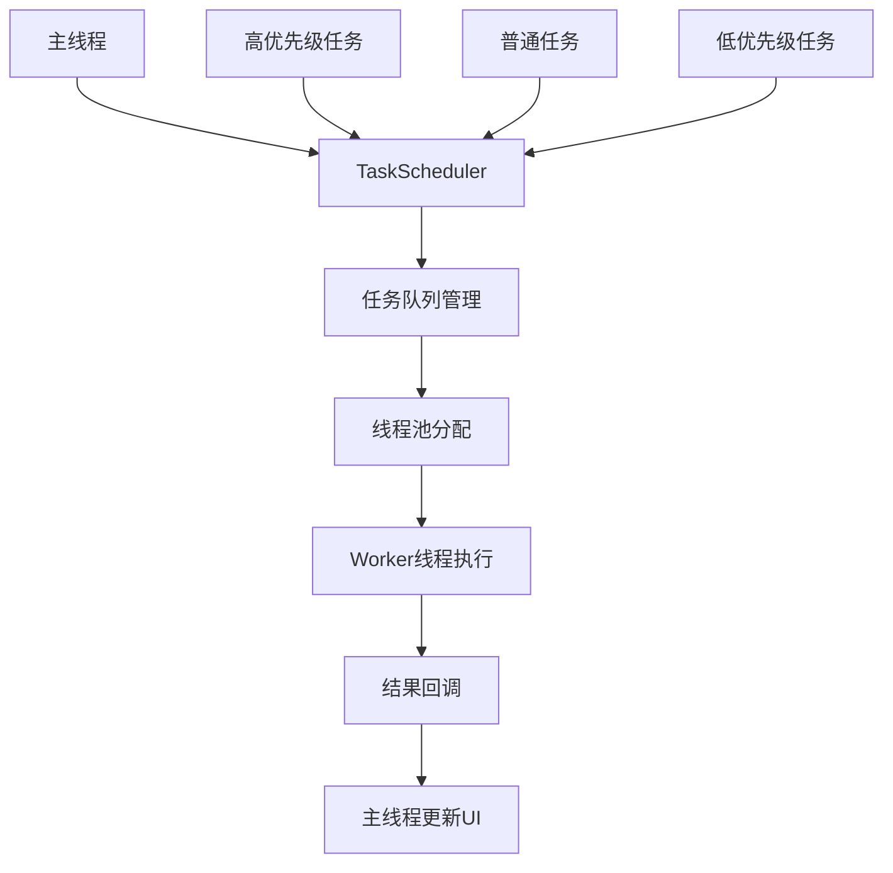

# 第18章：多线程开发

## 18.1 TaskScheduler任务调度

### 18.1.1 任务调度器概述

HarmonyOS提供了强大的任务调度系统，TaskScheduler是其中的核心组件，它能够高效地管理和调度各种任务，充分利用多核处理器的性能优势。



### 18.1.2 TaskScheduler基础实现

```typescript
// TaskSchedulerDemo.ets
import { taskpool } from '@kit.ArkTS'
import hilog from '@ohos.hilog'

export interface TaskResult<T> {
  taskId: string
  result: T
  executionTime: number
  success: boolean
  error?: string
}

export interface TaskConfig {
  priority: taskpool.Priority
  delay: number
  timeout: number
  retryCount: number
}

@Entry
@Component
struct TaskSchedulerDemo {
  @State taskResults: TaskResult<any>[] = []
  @State isProcessing: boolean = false
  @State completedTasks: number = 0
  @State totalTasks: number = 0

  private scheduler: TaskScheduler = TaskScheduler.getInstance()

  build() {
    Column() {
      // 标题
      Text('TaskScheduler任务调度演示')
        .fontSize(20)
        .fontWeight(FontWeight.Bold)
        .margin({ bottom: 20 })

      // 任务控制面板
      Row() {
        Button('CPU密集任务')
          .width(100)
          .height(36)
          .fontSize(12)
          .backgroundColor('#007AFF')
          .margin({ right: 8 })
          .onClick(() => {
            this.executeCPUTasks()
          })

        Button('IO密集任务')
          .width(100)
          .height(36)
          .fontSize(12)
          .backgroundColor('#34C759')
          .margin({ right: 8 })
          .onClick(() => {
            this.executeIOTasks()
          })

        Button('混合任务')
          .width(100)
          .height(36)
          .fontSize(12)
          .backgroundColor('#FF9500')
          .margin({ right: 8 })
          .onClick(() => {
            this.executeMixedTasks()
          })

        Button('清空结果')
          .width(80)
          .height(36)
          .fontSize(12)
          .backgroundColor('#FF3B30')
          .onClick(() => {
            this.clearResults()
          })
      }
      .justifyContent(FlexAlign.Center)
      .margin({ bottom: 20 })

      // 进度显示
      Row() {
        Text(`进度: ${this.completedTasks}/${this.totalTasks}`)
          .fontSize(14)
          .fontColor('#666666')
          .layoutWeight(1)

        if (this.isProcessing) {
          LoadingProgress()
            .width(20)
            .height(20)
            .color('#007AFF')
        }
      }
      .width('100%')
      .margin({ bottom: 20 })

      // 进度条
      Progress({
        value: this.totalTasks > 0 ? (this.completedTasks / this.totalTasks) * 100 : 0,
        total: 100,
        type: ProgressType.Linear
      })
        .width('100%')
        .height(6)
        .color('#007AFF')
        .backgroundColor('#E0E0E0')
        .margin({ bottom: 20 })

      // 任务结果列表
      List() {
        ForEach(this.taskResults.slice(-10), (result: TaskResult<any>) => {
          ListItem() {
            this.TaskResultItem(result)
          }
        })
      }
      .layoutWeight(1)
      .width('100%')
      .backgroundColor('#F8F8F8')
      .borderRadius(8)
    }
    .width('100%')
    .height('100%')
    .padding(20)
    .backgroundColor('#FFFFFF')
  }

  @Builder TaskResultItem(result: TaskResult<any>) {
    Row() {
      Column() {
        Text(`任务 ${result.taskId}`)
          .fontSize(14)
          .fontWeight(FontWeight.Medium)
          .fontColor('#333333')

        Text(`执行时间: ${result.executionTime.toFixed(2)}ms`)
          .fontSize(12)
          .fontColor('#666666')
          .margin({ top: 4 })
      }
      .alignItems(HorizontalAlign.Start)
      .layoutWeight(1)

      if (result.success) {
        Text('成功')
          .fontSize(12)
          .fontColor('#34C759')
      } else {
        Text('失败')
          .fontSize(12)
          .fontColor('#FF3B30')
      }
    }
    .width('100%')
    .padding(12)
    .backgroundColor('#FFFFFF')
    .borderRadius(6)
    .margin({ bottom: 8 })
  }

  private async executeCPUTasks(): Promise<void> {
    if (this.isProcessing) return

    this.isProcessing = true
    this.completedTasks = 0
    this.totalTasks = 5

    const tasks = [
      { id: 'cpu_1', computation: 1000000 },
      { id: 'cpu_2', computation: 2000000 },
      { id: 'cpu_3', computation: 1500000 },
      { id: 'cpu_4', computation: 800000 },
      { id: 'cpu_5', computation: 1200000 }
    ]

    const config: TaskConfig = {
      priority: taskpool.Priority.HIGH,
      delay: 0,
      timeout: 10000,
      retryCount: 2
    }

    for (const task of tasks) {
      this.scheduler.scheduleTask(
        this.createCPUTask(task.computation),
        task.id,
        config
      ).then(result => {
        this.handleTaskResult(result)
      })
    }
  }

  private async executeIOTasks(): Promise<void> {
    if (this.isProcessing) return

    this.isProcessing = true
    this.completedTasks = 0
    this.totalTasks = 4

    const tasks = [
      { id: 'io_1', size: 1024 * 1024 }, // 1MB
      { id: 'io_2', size: 2 * 1024 * 1024 }, // 2MB
      { id: 'io_3', size: 512 * 1024 }, // 512KB
      { id: 'io_4', size: 1.5 * 1024 * 1024 } // 1.5MB
    ]

    const config: TaskConfig = {
      priority: taskpool.Priority.MEDIUM,
      delay: 0,
      timeout: 15000,
      retryCount: 3
    }

    for (const task of tasks) {
      this.scheduler.scheduleTask(
        this.createIOTask(task.size),
        task.id,
        config
      ).then(result => {
        this.handleTaskResult(result)
      })
    }
  }

  private async executeMixedTasks(): Promise<void> {
    if (this.isProcessing) return

    this.isProcessing = true
    this.completedTasks = 0
    this.totalTasks = 6

    const tasks = [
      { id: 'mixed_1', type: 'cpu', value: 500000 },
      { id: 'mixed_2', type: 'io', value: 1024 * 1024 },
      { id: 'mixed_3', type: 'cpu', value: 1000000 },
      { id: 'mixed_4', type: 'io', value: 2 * 1024 * 1024 },
      { id: 'mixed_5', type: 'cpu', value: 300000 },
      { id: 'mixed_6', type: 'io', value: 512 * 1024 }
    ]

    const config: TaskConfig = {
      priority: taskpool.Priority.LOW,
      delay: 0,
      timeout: 12000,
      retryCount: 1
    }

    for (const task of tasks) {
      let taskFunction

      if (task.type === 'cpu') {
        taskFunction = this.createCPUTask(task.value)
      } else {
        taskFunction = this.createIOTask(task.value)
      }

      this.scheduler.scheduleTask(taskFunction, task.id, config)
        .then(result => {
          this.handleTaskResult(result)
        })
    }
  }

  private createCPUTask(iterations: number): taskpool.Task {
    return new taskpool.Task((data: number) => {
      const startTime = Date.now()
      let sum = 0

      // CPU密集型计算
      for (let i = 0; i < data; i++) {
        sum += Math.sqrt(i) * Math.sin(i) * Math.cos(i)
      }

      const executionTime = Date.now() - startTime
      return { sum, executionTime }
    }, iterations)
  }

  private createIOTask(size: number): taskpool.Task {
    return new taskpool.Task((data: number) => {
      const startTime = Date.now()

      // 模拟IO操作
      const buffer = new ArrayBuffer(data)
      const view = new Uint8Array(buffer)

      // 填充数据
      for (let i = 0; i < data; i++) {
        view[i] = Math.floor(Math.random() * 256)
      }

      // 模拟数据处理
      let checksum = 0
      for (let i = 0; i < data; i += 1024) {
        checksum += view[i]
      }

      const executionTime = Date.now() - startTime
      return { size: data, checksum, executionTime }
    }, size)
  }

  private handleTaskResult(result: TaskResult<any>): void {
    this.taskResults.push(result)
    this.completedTasks++

    if (this.completedTasks >= this.totalTasks) {
      this.isProcessing = false
    }

    hilog.info(0x0000, 'TaskScheduler',
      `任务 ${result.taskId} 完成: ${result.success ? '成功' : '失败'}, 耗时: ${result.executionTime}ms`)
  }

  private clearResults(): void {
    this.taskResults = []
    this.completedTasks = 0
    this.totalTasks = 0
    this.isProcessing = false
  }
}

class TaskScheduler {
  private static instance: TaskScheduler
  private activeTasks: Map<string, taskpool.Task> = new Map()
  private taskQueue: taskpool.Task[] = []
  private readonly TAG = 'TaskScheduler'

  static getInstance(): TaskScheduler {
    if (!TaskScheduler.instance) {
      TaskScheduler.instance = new TaskScheduler()
    }
    return TaskScheduler.instance
  }

  /**
   * 调度任务
   */
  async scheduleTask(
    task: taskpool.Task,
    taskId: string,
    config: TaskConfig
  ): Promise<TaskResult<any>> {
    try {
      hilog.info(0x0000, this.TAG, `调度任务: ${taskId}, 优先级: ${config.priority}`)

      // 设置任务优先级
      task.setPriority(config.priority)

      // 延迟执行
      if (config.delay > 0) {
        await new Promise(resolve => setTimeout(resolve, config.delay))
      }

      const startTime = Date.now()
      this.activeTasks.set(taskId, task)

      // 执行任务
      const result = await taskpool.execute(task)
      const executionTime = Date.now() - startTime

      this.activeTasks.delete(taskId)

      return {
        taskId,
        result,
        executionTime,
        success: true
      }
    } catch (error) {
      this.activeTasks.delete(taskId)

      hilog.error(0x0000, this.TAG, `任务 ${taskId} 执行失败: ${error}`)

      return {
        taskId,
        result: null,
        executionTime: 0,
        success: false,
        error: error instanceof Error ? error.message : String(error)
      }
    }
  }

  /**
   * 批量调度任务
   */
  async scheduleBatchTasks(
    tasks: Array<{ task: taskpool.Task, taskId: string, config: TaskConfig }>
  ): Promise<TaskResult<any>[]> {
    const promises = tasks.map(({ task, taskId, config }) =>
      this.scheduleTask(task, taskId, config)
    )

    return Promise.all(promises)
  }

  /**
   * 取消任务
   */
  cancelTask(taskId: string): boolean {
    const task = this.activeTasks.get(taskId)
    if (task) {
      this.activeTasks.delete(taskId)
      hilog.info(0x0000, this.TAG, `取消任务: ${taskId}`)
      return true
    }
    return false
  }

  /**
   * 获取活跃任务数量
   */
  getActiveTaskCount(): number {
    return this.activeTasks.size
  }

  /**
   * 清理所有任务
   */
  clearAllTasks(): void {
    this.activeTasks.clear()
    this.taskQueue.length = 0
    hilog.info(0x0000, this.TAG, '清理所有任务')
  }
}
```

### 18.1.3 高级任务调度策略

```typescript
// AdvancedTaskScheduler.ets
import { taskpool } from '@kit.ArkTS'
import hilog from '@ohos.hilog'

export enum TaskCategory {
  CRITICAL = 'critical',
  HIGH = 'high',
  NORMAL = 'normal',
  LOW = 'low',
  BACKGROUND = 'background'
}

export interface AdvancedTaskConfig extends TaskConfig {
  category: TaskCategory
  dependencies?: string[]
  maxRetries: number
  callback?: (result: TaskResult<any>) => void
}

export class AdvancedTaskScheduler {
  private static instance: AdvancedTaskScheduler
  private taskQueues: Map<TaskCategory, taskpool.Task[]> = new Map()
  private runningTasks: Map<string, taskpool.Task> = new Map()
  private completedTasks: Map<string, TaskResult<any>> = new Map()
  private taskDependencies: Map<string, string[]> = new Map()
  private readonly TAG = 'AdvancedTaskScheduler'

  static getInstance(): AdvancedTaskScheduler {
    if (!AdvancedTaskScheduler.instance) {
      AdvancedTaskScheduler.instance = new AdvancedTaskScheduler()
      AdvancedTaskScheduler.instance.initializeQueues()
    }
    return AdvancedTaskScheduler.instance
  }

  private initializeQueues(): void {
    // 初始化不同优先级的任务队列
    this.taskQueues.set(TaskCategory.CRITICAL, [])
    this.taskQueues.set(TaskCategory.HIGH, [])
    this.taskQueues.set(TaskCategory.NORMAL, [])
    this.taskQueues.set(TaskCategory.LOW, [])
    this.taskQueues.set(TaskCategory.BACKGROUND, [])
  }

  /**
   * 调度高级任务
   */
  async scheduleAdvancedTask(
    task: taskpool.Task,
    taskId: string,
    config: AdvancedTaskConfig
  ): Promise<TaskResult<any>> {
    try {
      hilog.info(0x0000, this.TAG, `调度高级任务: ${taskId}, 类别: ${config.category}`)

      // 检查依赖关系
      if (config.dependencies && config.dependencies.length > 0) {
        if (!await this.checkDependencies(config.dependencies)) {
          throw new Error(`任务依赖未满足: ${config.dependencies.join(', ')}`)
        }
      }

      // 将任务添加到相应队列
      const queue = this.taskQueues.get(config.category)
      if (queue) {
        queue.push(task)
        this.taskDependencies.set(taskId, config.dependencies || [])
      }

      // 立即尝试执行任务
      return await this.executeTask(task, taskId, config)
    } catch (error) {
      hilog.error(0x0000, this.TAG, `高级任务调度失败: ${error}`)
      throw error
    }
  }

  /**
   * 执行任务
   */
  private async executeTask(
    task: taskpool.Task,
    taskId: string,
    config: AdvancedTaskConfig
  ): Promise<TaskResult<any>> {
    const startTime = Date.now()
    let retries = 0
    let lastError: Error | null = null

    while (retries <= config.maxRetries) {
      try {
        hilog.info(0x0000, this.TAG, `执行任务: ${taskId}, 尝试: ${retries + 1}`)

        this.runningTasks.set(taskId, task)

        // 设置任务优先级
        task.setPriority(this.mapPriority(config.category))

        // 执行任务
        const result = await this.executeWithTimeout(task, config.timeout)
        const executionTime = Date.now() - startTime

        this.runningTasks.delete(taskId)
        this.completedTasks.set(taskId, {
          taskId,
          result,
          executionTime,
          success: true
        })

        // 执行回调
        if (config.callback) {
          config.callback(this.completedTasks.get(taskId)!)
        }

        // 触发依赖此任务的其他任务
        this.triggerDependentTasks(taskId)

        return this.completedTasks.get(taskId)!
      } catch (error) {
        retries++
        lastError = error instanceof Error ? error : new Error(String(error))

        hilog.warn(0x0000, this.TAG,
          `任务 ${taskId} 执行失败，重试 ${retries}/${config.maxRetries}: ${error}`)

        if (retries <= config.maxRetries) {
          // 指数退避策略
          const delay = Math.min(1000 * Math.pow(2, retries - 1), 10000)
          await new Promise(resolve => setTimeout(resolve, delay))
        }
      }
    }

    this.runningTasks.delete(taskId)
    const finalResult: TaskResult<any> = {
      taskId,
      result: null,
      executionTime: Date.now() - startTime,
      success: false,
      error: lastError?.message
    }

    this.completedTasks.set(taskId, finalResult)

    if (config.callback) {
      config.callback(finalResult)
    }

    return finalResult
  }

  /**
   * 带超时的任务执行
   */
  private async executeWithTimeout(task: taskpool.Task, timeout: number): Promise<any> {
    return Promise.race([
      taskpool.execute(task),
      new Promise((_, reject) => {
        setTimeout(() => reject(new Error('任务执行超时')), timeout)
      })
    ])
  }

  /**
   * 检查任务依赖
   */
  private async checkDependencies(dependencies: string[]): Promise<boolean> {
    for (const depId of dependencies) {
      const result = this.completedTasks.get(depId)
      if (!result || !result.success) {
        return false
      }
    }
    return true
  }

  /**
   * 触发依赖任务
   */
  private triggerDependentTasks(completedTaskId: string): void {
    // 查找依赖已完成任务的其他任务
    for (const [taskId, dependencies] of this.taskDependencies.entries()) {
      if (dependencies.includes(completedTaskId)) {
        hilog.info(0x0000, this.TAG, `检查任务依赖: ${taskId} 依赖 ${completedTaskId}`)
        // 这里可以添加逻辑来检查是否所有依赖都已完成并触发任务执行
      }
    }
  }

  /**
   * 映射任务类别到优先级
   */
  private mapPriority(category: TaskCategory): taskpool.Priority {
    switch (category) {
      case TaskCategory.CRITICAL:
        return taskpool.Priority.HIGH
      case TaskCategory.HIGH:
        return taskpool.Priority.HIGH
      case TaskCategory.NORMAL:
        return taskpool.Priority.MEDIUM
      case TaskCategory.LOW:
        return taskpool.Priority.LOW
      case TaskCategory.BACKGROUND:
        return taskpool.Priority.LOW
      default:
        return taskpool.Priority.MEDIUM
    }
  }

  /**
   * 获取任务统计信息
   */
  getTaskStatistics(): {
    total: number
    completed: number
    running: number
    failed: number
    successRate: number
    averageExecutionTime: number
  } {
    const total = this.completedTasks.size
    const completed = Array.from(this.completedTasks.values()).filter(t => t.success).length
    const failed = total - completed
    const running = this.runningTasks.size
    const successRate = total > 0 ? (completed / total) * 100 : 0

    const successfulTasks = Array.from(this.completedTasks.values()).filter(t => t.success)
    const averageExecutionTime = successfulTasks.length > 0
      ? successfulTasks.reduce((sum, t) => sum + t.executionTime, 0) / successfulTasks.length
      : 0

    return {
      total,
      completed,
      running,
      failed,
      successRate,
      averageExecutionTime
    }
  }

  /**
   * 清理完成的任务记录
   */
  clearCompletedTasks(): void {
    this.completedTasks.clear()
    hilog.info(0x0000, this.TAG, '清理完成的任务记录')
  }

  /**
   * 强制停止所有任务
   */
  stopAllTasks(): void {
    this.runningTasks.clear()
    this.taskQueues.forEach(queue => queue.length = 0)
    hilog.info(0x0000, this.TAG, '停止所有任务')
  }
}
```

## 18.2 Worker线程使用

### 18.2.1 Worker线程基础

Worker线程允许在后台执行长时间运行的任务，避免阻塞主线程，保持UI的流畅性。

```typescript
// WorkerDemo.ets
import { worker } from '@kit.ArkTS'
import hilog from '@ohos.hilog'

@Entry
@Component
struct WorkerDemo {
  @State workerStatus: string = '未创建'
  @State workerResults: string[] = []
  @State isProcessing: boolean = false
  @State workerInstance: worker.ThreadWorker | null = null

  aboutToDisappear() {
    this.terminateWorker()
  }

  build() {
    Column() {
      // 标题
      Text('Worker线程使用演示')
        .fontSize(20)
        .fontWeight(FontWeight.Bold)
        .margin({ bottom: 20 })

      // Worker状态显示
      Row() {
        Text('Worker状态:')
          .fontSize(14)
          .fontColor('#666666')
          .margin({ right: 12 })

        Text(this.workerStatus)
          .fontSize(14)
          .fontWeight(FontWeight.Medium)
          .fontColor(this.getWorkerStatusColor())
      }
      .width('100%')
      .justifyContent(FlexAlign.Start)
      .margin({ bottom: 20 })

      // Worker控制按钮
      Row() {
        Button('创建Worker')
          .width(100)
          .height(36)
          .fontSize(12)
          .backgroundColor('#007AFF')
          .margin({ right: 8 })
          .onClick(() => {
            this.createWorker()
          })

        Button('发送任务')
          .width(100)
          .height(36)
          .fontSize(12)
          .backgroundColor('#34C759')
          .margin({ right: 8 })
          .onClick(() => {
            this.sendTaskToWorker()
          })

        Button('发送复杂任务')
          .width(100)
          .height(36)
          .fontSize(12)
          .backgroundColor('#FF9500')
          .margin({ right: 8 })
          .onClick(() => {
            this.sendComplexTaskToWorker()
          })

        Button('终止Worker')
          .width(100)
          .height(36)
          .fontSize(12)
          .backgroundColor('#FF3B30')
          .onClick(() => {
            this.terminateWorker()
          })
      }
      .justifyContent(FlexAlign.Center)
      .margin({ bottom: 20 })

      // 处理状态指示器
      if (this.isProcessing) {
        Row() {
          LoadingProgress()
            .width(20)
            .height(20)
            .color('#007AFF')
            .margin({ right: 12 })

          Text('Worker正在处理任务...')
            .fontSize(14)
            .fontColor('#666666')
        }
        .width('100%')
        .justifyContent(FlexAlign.Center)
        .margin({ bottom: 20 })
      }

      // Worker结果列表
      Column() {
        Text('Worker处理结果:')
          .fontSize(16)
          .fontWeight(FontWeight.Medium)
          .margin({ bottom: 12 })

        List() {
          ForEach(this.workerResults.slice(-5), (result: string) => {
            ListItem() {
              Text(result)
                .fontSize(12)
                .fontColor('#333333')
                .padding(8)
                .backgroundColor('#F8F8F8')
                .borderRadius(4)
                .width('100%')
            }
            .margin({ bottom: 4 })
          })
        }
        .layoutWeight(1)
        .width('100%')
        .backgroundColor('#FFFFFF')
        .borderRadius(8)
      }
      .layoutWeight(1)
      .width('100%')
    }
    .width('100%')
    .height('100%')
    .padding(20)
    .backgroundColor('#F5F5F7')
  }

  private createWorker(): void {
    try {
      // 创建Worker实例
      this.workerInstance = new worker.ThreadWorker('entry/ets/workers/MyWorker.ts')

      // 设置消息监听器
      this.workerInstance.onmessage = (message) => {
        this.handleWorkerMessage(message)
      }

      // 设置错误监听器
      this.workerInstance.onerror = (error) => {
        this.handleWorkerError(error)
      }

      this.workerStatus = '已创建'
      this.addResult('Worker创建成功')

      hilog.info(0x0000, 'WorkerDemo', 'Worker实例创建成功')
    } catch (error) {
      this.workerStatus = '创建失败'
      this.addResult(`Worker创建失败: ${error}`)
      hilog.error(0x0000, 'WorkerDemo', `Worker创建失败: ${error}`)
    }
  }

  private sendTaskToWorker(): void {
    if (!this.workerInstance) {
      this.addResult('请先创建Worker实例')
      return
    }

    this.isProcessing = true
    const startTime = Date.now()

    // 发送简单计算任务
    this.workerInstance.postMessage({
      type: 'simple_calculation',
      data: {
        iterations: 1000000,
        timestamp: startTime
      }
    })

    this.addResult('发送简单计算任务到Worker')
  }

  private sendComplexTaskToWorker(): void {
    if (!this.workerInstance) {
      this.addResult('请先创建Worker实例')
      return
    }

    this.isProcessing = true
    const startTime = Date.now()

    // 发送复杂任务
    this.workerInstance.postMessage({
      type: 'complex_task',
      data: {
        taskType: 'image_processing',
        parameters: {
          width: 800,
          height: 600,
          iterations: 10
        },
        timestamp: startTime
      }
    })

    this.addResult('发送复杂图像处理任务到Worker')
  }

  private handleWorkerMessage(message: any): void {
    const endTime = Date.now()
    const duration = endTime - (message.data?.timestamp || endTime)

    this.isProcessing = false

    switch (message.type) {
      case 'simple_calculation_result':
        this.addResult(`简单计算完成 - 结果: ${message.data.result}, 耗时: ${duration}ms`)
        break
      case 'complex_task_result':
        this.addResult(`复杂任务完成 - 状态: ${message.data.status}, 耗时: ${duration}ms`)
        break
      case 'worker_ready':
        this.workerStatus = '就绪'
        this.addResult('Worker已就绪')
        break
      default:
        this.addResult(`收到未知消息类型: ${message.type}`)
    }

    hilog.info(0x0000, 'WorkerDemo', `收到Worker消息: ${JSON.stringify(message)}`)
  }

  private handleWorkerError(error: any): void {
    this.isProcessing = false
    this.workerStatus = '错误'
    this.addResult(`Worker错误: ${error.message || error}`)
    hilog.error(0x0000, 'WorkerDemo', `Worker错误: ${error}`)
  }

  private terminateWorker(): void {
    if (this.workerInstance) {
      try {
        this.workerInstance.terminate()
        this.workerInstance = null
        this.workerStatus = '已终止'
        this.addResult('Worker已终止')
        hilog.info(0x0000, 'WorkerDemo', 'Worker已终止')
      } catch (error) {
        this.addResult(`Worker终止失败: ${error}`)
        hilog.error(0x0000, 'WorkerDemo', `Worker终止失败: ${error}`)
      }
    }
  }

  private addResult(message: string): void {
    const timestamp = new Date().toLocaleTimeString()
    this.workerResults.push(`[${timestamp}] ${message}`)

    // 保持最近20条记录
    if (this.workerResults.length > 20) {
      this.workerResults.shift()
    }
  }

  private getWorkerStatusColor(): string {
    switch (this.workerStatus) {
      case '已创建':
      case '就绪':
        return '#34C759'
      case '未创建':
        return '#8E8E93'
      case '创建失败':
      case '错误':
      case '已终止':
        return '#FF3B30'
      default:
        return '#666666'
    }
  }
}
```

### 18.2.2 Worker线程实现文件

```typescript
// MyWorker.ts
import { worker, ThreadWorkerGlobalScope, MessageEvents } from '@kit.ArkTS'
import { taskpool } from '@kit.ArkTS'

const workerPort: ThreadWorkerGlobalScope = worker.workerPort

// Worker消息处理
workerPort.onmessage = async (e: MessageEvents) => {
  try {
    const message = e.data
    console.info('Worker收到消息:', JSON.stringify(message))

    switch (message.type) {
      case 'simple_calculation':
        await handleSimpleCalculation(message.data)
        break
      case 'complex_task':
        await handleComplexTask(message.data)
        break
      default:
        workerPort.postMessage({
          type: 'error',
          data: { message: `未知消息类型: ${message.type}` }
        })
    }
  } catch (error) {
    console.error('Worker处理消息失败:', error)
    workerPort.postMessage({
      type: 'error',
      data: { message: `处理失败: ${error}` }
    })
  }
}

// 处理简单计算任务
async function handleSimpleCalculation(data: any): Promise<void> {
  console.info('Worker开始简单计算任务')

  const startTime = Date.now()
  let result = 0

  // 执行CPU密集型计算
  for (let i = 0; i < data.iterations; i++) {
    result += Math.sqrt(i) * Math.sin(i) * Math.cos(i)

    // 定期检查是否需要让出控制权
    if (i % 100000 === 0) {
      await new Promise(resolve => setTimeout(resolve, 0))
    }
  }

  const endTime = Date.now()
  const duration = endTime - startTime

  console.info(`Worker简单计算完成，耗时: ${duration}ms`)

  // 返回结果
  workerPort.postMessage({
    type: 'simple_calculation_result',
    data: {
      result: result,
      iterations: data.iterations,
      duration: duration,
      timestamp: data.timestamp
    }
  })
}

// 处理复杂任务
async function handleComplexTask(data: any): Promise<void> {
  console.info('Worker开始复杂任务:', data.taskType)

  switch (data.taskType) {
    case 'image_processing':
      await handleImageProcessing(data.parameters)
      break
    case 'data_analysis':
      await handleDataAnalysis(data.parameters)
      break
    case 'file_processing':
      await handleFileProcessing(data.parameters)
      break
    default:
      throw new Error(`未知的复杂任务类型: ${data.taskType}`)
  }
}

// 图像处理任务
async function handleImageProcessing(params: any): Promise<void> {
  console.info('Worker开始图像处理任务')

  const startTime = Date.now()
  const { width, height, iterations } = params

  // 模拟图像处理
  const imageData = new Uint8ClampedArray(width * height * 4)

  for (let iter = 0; iter < iterations; iter++) {
    for (let i = 0; i < imageData.length; i += 4) {
      // 模拟像素处理
      imageData[i] = Math.floor(Math.random() * 256)     // R
      imageData[i + 1] = Math.floor(Math.random() * 256) // G
      imageData[i + 2] = Math.floor(Math.random() * 256) // B
      imageData[i + 3] = 255                             // A
    }

    // 定期让出控制权
    if (iter % 2 === 0) {
      await new Promise(resolve => setTimeout(resolve, 10))
    }
  }

  const endTime = Date.now()
  const duration = endTime - startTime

  console.info(`Worker图像处理完成，耗时: ${duration}ms`)

  workerPort.postMessage({
    type: 'complex_task_result',
    data: {
      status: 'completed',
      taskType: 'image_processing',
      width: width,
      height: height,
      iterations: iterations,
      duration: duration,
      timestamp: startTime
    }
  })
}

// 数据分析任务
async function handleDataAnalysis(params: any): Promise<void> {
  console.info('Worker开始数据分析任务')

  const startTime = Date.now()

  // 模拟大数据分析
  const dataPoints = 100000
  let sum = 0
  let min = Infinity
  let max = -Infinity

  for (let i = 0; i < dataPoints; i++) {
    const value = Math.random() * 1000
    sum += value
    min = Math.min(min, value)
    max = Math.max(max, value)

    if (i % 10000 === 0) {
      await new Promise(resolve => setTimeout(resolve, 0))
    }
  }

  const average = sum / dataPoints
  const endTime = Date.now()
  const duration = endTime - startTime

  console.info(`Worker数据分析完成，耗时: ${duration}ms`)

  workerPort.postMessage({
    type: 'complex_task_result',
    data: {
      status: 'completed',
      taskType: 'data_analysis',
      dataPoints: dataPoints,
      average: average,
      min: min,
      max: max,
      duration: duration,
      timestamp: startTime
    }
  })
}

// 文件处理任务
async function handleFileProcessing(params: any): Promise<void> {
  console.info('Worker开始文件处理任务')

  const startTime = Date.now()
  const fileSize = params.fileSize || 1024 * 1024 // 默认1MB

  // 模拟文件处理
  const fileData = new ArrayBuffer(fileSize)
  const view = new Uint8Array(fileData)

  // 填充数据并计算校验和
  let checksum = 0
  for (let i = 0; i < view.length; i++) {
    view[i] = Math.floor(Math.random() * 256)
    checksum = (checksum + view[i]) % 65536

    if (i % 10240 === 0) {
      await new Promise(resolve => setTimeout(resolve, 1))
    }
  }

  const endTime = Date.now()
  const duration = endTime - startTime

  console.info(`Worker文件处理完成，耗时: ${duration}ms`)

  workerPort.postMessage({
    type: 'complex_task_result',
    data: {
      status: 'completed',
      taskType: 'file_processing',
      fileSize: fileSize,
      checksum: checksum,
      duration: duration,
      timestamp: startTime
    }
  })
}

// Worker错误处理
workerPort.onerror = (error) => {
  console.error('Worker发生错误:', error)
  workerPort.postMessage({
    type: 'worker_error',
    data: { message: `Worker错误: ${error}` }
  })
}

// Worker就绪通知
workerPort.postMessage({
  type: 'worker_ready',
  data: { message: 'Worker已就绪' }
})
```

### 18.2.3 Worker与TaskPool结合使用

```typescript
// WorkerTaskPoolIntegration.ets
import { worker } from '@kit.ArkTS'
import { taskpool } from '@kit.ArkTS'
import hilog from '@ohos.hilog'

@Entry
@Component
struct WorkerTaskPoolIntegration {
  @State integrationResults: string[] = []
  @State isProcessing: boolean = false
  @State workerInstance: worker.ThreadWorker | null = null
  @State statistics: { workerTasks: number, taskpoolTasks: number, totalTime: number } = {
    workerTasks: 0,
    taskpoolTasks: 0,
    totalTime: 0
  }

  aboutToDisappear() {
    this.cleanup()
  }

  build() {
    Column() {
      // 标题
      Text('Worker与TaskPool集成演示')
        .fontSize(20)
        .fontWeight(FontWeight.Bold)
        .margin({ bottom: 20 })

      // 统计信息
      Row() {
        Column() {
          Text('Worker任务')
            .fontSize(12)
            .fontColor('#666666')
          Text(this.statistics.workerTasks.toString())
            .fontSize(18)
            .fontWeight(FontWeight.Bold)
            .fontColor('#007AFF')
        }
        .alignItems(HorizontalAlign.Center)
        .layoutWeight(1)

        Column() {
          Text('TaskPool任务')
            .fontSize(12)
            .fontColor('#666666')
          Text(this.statistics.taskpoolTasks.toString())
            .fontSize(18)
            .fontWeight(FontWeight.Bold)
            .fontColor('#34C759')
        }
        .alignItems(HorizontalAlign.Center)
        .layoutWeight(1)

        Column() {
          Text('总耗时')
            .fontSize(12)
            .fontColor('#666666')
          Text(`${this.statistics.totalTime}ms`)
            .fontSize(18)
            .fontWeight(FontWeight.Bold)
            .fontColor('#FF9500')
        }
        .alignItems(HorizontalAlign.Center)
        .layoutWeight(1)
      }
      .width('100%')
      .padding(16)
      .backgroundColor('#F8F8F8')
      .borderRadius(8)
      .margin({ bottom: 20 })

      // 控制按钮
      Row() {
        Button('Worker处理')
          .width(100)
          .height(36)
          .fontSize(12)
          .backgroundColor('#007AFF')
          .margin({ right: 8 })
          .onClick(() => {
            this.executeWorkerTask()
          })

        Button('TaskPool处理')
          .width(100)
          .height(36)
          .fontSize(12)
          .backgroundColor('#34C759')
          .margin({ right: 8 })
          .onClick(() => {
            this.executeTaskPoolTask()
          })

        Button('Worker+TaskPool')
          .width(120)
          .height(36)
          .fontSize(12)
          .backgroundColor('#5856D6')
          .margin({ right: 8 })
          .onClick(() => {
            this.executeWorkerWithTaskPool()
          })

        Button('清空结果')
          .width(80)
          .height(36)
          .fontSize(12)
          .backgroundColor('#FF3B30')
          .onClick(() => {
            this.clearResults()
          })
      }
      .justifyContent(FlexAlign.Center)
      .margin({ bottom: 20 })

      // 处理状态
      if (this.isProcessing) {
        Row() {
          LoadingProgress()
            .width(20)
            .height(20)
            .color('#007AFF')
            .margin({ right: 12 })

          Text('正在处理任务...')
            .fontSize(14)
            .fontColor('#666666')
        }
        .width('100%')
        .justifyContent(FlexAlign.Center)
        .margin({ bottom: 20 })
      }

      // 结果列表
      List() {
        ForEach(this.integrationResults.slice(-8), (result: string) => {
          ListItem() {
            Text(result)
              .fontSize(12)
              .fontColor('#333333')
              .padding(8)
              .backgroundColor('#FFFFFF')
              .borderRadius(4)
              .width('100%')
          }
          .margin({ bottom: 4 })
        })
      }
      .layoutWeight(1)
      .width('100%')
      .backgroundColor('#F0F0F5')
      .borderRadius(8)
    }
    .width('100%')
    .height('100%')
    .padding(20)
    .backgroundColor('#FFFFFF')
  }

  private async executeWorkerTask(): Promise<void> {
    if (!this.workerInstance) {
      this.createWorker()
    }

    this.isProcessing = true
    const startTime = Date.now()

    try {
      this.workerInstance?.postMessage({
        type: 'integration_task',
        data: {
          taskType: 'worker_only',
          parameters: {
            iterations: 2000000,
            complexity: 'medium'
          }
        }
      })

      this.addResult('发送Worker任务: 中等复杂度计算')
    } catch (error) {
      this.isProcessing = false
      this.addResult(`Worker任务失败: ${error}`)
    }
  }

  private async executeTaskPoolTask(): Promise<void> {
    this.isProcessing = true
    const startTime = Date.now()

    try {
      const task = new taskpool.Task((data: any) => {
        const { iterations, complexity } = data
        let result = 0

        // TaskPool中的计算任务
        for (let i = 0; i < iterations; i++) {
          switch (complexity) {
            case 'high':
              result += Math.pow(i, 3) * Math.sin(i) * Math.cos(i)
              break
            case 'medium':
              result += Math.sqrt(i) * Math.log(i + 1)
              break
            case 'low':
              result += i % 2 === 0 ? i : -i
              break
          }
        }

        return { result, iterations, complexity }
      }, {
        iterations: 2000000,
        complexity: 'medium'
      })

      task.setPriority(taskpool.Priority.HIGH)
      const result = await taskpool.execute(task)
      const endTime = Date.now()

      this.statistics.taskpoolTasks++
      this.statistics.totalTime += endTime - startTime

      this.addResult(`TaskPool完成: 结果=${result.result}, 耗时=${endTime - startTime}ms`)
      this.isProcessing = false
    } catch (error) {
      this.isProcessing = false
      this.addResult(`TaskPool任务失败: ${error}`)
    }
  }

  private async executeWorkerWithTaskPool(): Promise<void> {
    if (!this.workerInstance) {
      this.createWorker()
    }

    this.isProcessing = true
    const startTime = Date.now()

    try {
      // 发送需要使用TaskPool的任务到Worker
      this.workerInstance?.postMessage({
        type: 'integration_task',
        data: {
          taskType: 'worker_with_taskpool',
          parameters: {
            initialData: 1000000,
            parallelTasks: 4
          }
        }
      })

      this.addResult('发送Worker+TaskPool混合任务')
    } catch (error) {
      this.isProcessing = false
      this.addResult(`混合任务失败: ${error}`)
    }
  }

  private createWorker(): void {
    try {
      this.workerInstance = new worker.ThreadWorker('entry/ets/workers/IntegrationWorker.ts')

      this.workerInstance.onmessage = (message) => {
        this.handleIntegrationMessage(message)
      }

      this.workerInstance.onerror = (error) => {
        this.isProcessing = false
        this.addResult(`Worker错误: ${error}`)
      }

      this.addResult('集成Worker创建成功')
    } catch (error) {
      this.addResult(`Worker创建失败: ${error}`)
    }
  }

  private handleIntegrationMessage(message: any): void {
    const endTime = Date.now()

    switch (message.type) {
      case 'worker_task_result':
        this.statistics.workerTasks++
        this.statistics.totalTime += message.data.duration
        this.addResult(`Worker完成: 类型=${message.data.taskType}, 耗时=${message.data.duration}ms`)
        break
      case 'mixed_task_result':
        this.statistics.workerTasks++
        this.statistics.taskpoolTasks += message.data.taskpoolTasks
        this.statistics.totalTime += message.data.totalDuration
        this.addResult(`混合任务完成: Worker耗时=${message.data.workerDuration}ms, TaskPool任务数=${message.data.taskpoolTasks}`)
        break
      default:
        this.addResult(`收到未知消息: ${message.type}`)
    }

    this.isProcessing = false
  }

  private addResult(message: string): void {
    const timestamp = new Date().toLocaleTimeString()
    this.integrationResults.push(`[${timestamp}] ${message}`)

    if (this.integrationResults.length > 20) {
      this.integrationResults.shift()
    }
  }

  private clearResults(): void {
    this.integrationResults = []
    this.statistics = {
      workerTasks: 0,
      taskpoolTasks: 0,
      totalTime: 0
    }
  }

  private cleanup(): void {
    if (this.workerInstance) {
      this.workerInstance.terminate()
      this.workerInstance = null
    }
  }
}
```

## 18.3 线程间通信机制

### 18.3.1 消息传递机制

```typescript
// ThreadCommunication.ets
import { worker } from '@kit.ArkTS'
import hilog from '@ohos.hilog'

export interface ThreadMessage {
  id: string
  type: string
  data: any
  timestamp: number
  sender: string
  priority: 'high' | 'medium' | 'low'
}

export interface MessageHandler {
  (message: ThreadMessage): Promise<void> | void
}

@Entry
@Component
struct ThreadCommunication {
  @State messages: ThreadMessage[] = []
  @State connectionStatus: string = '未连接'
  @State messageCount: number = 0
  @State isListening: boolean = false

  private messageHandlers: Map<string, MessageHandler> = new Map()
  private workerInstance: worker.ThreadWorker | null = null

  aboutToAppear() {
    this.setupMessageHandlers()
  }

  aboutToDisappear() {
    this.cleanup()
  }

  build() {
    Column() {
      // 标题和状态
      Row() {
        Text('线程间通信机制')
          .fontSize(20)
          .fontWeight(FontWeight.Bold)
          .layoutWeight(1)

        Text(this.connectionStatus)
          .fontSize(14)
          .fontColor(this.getStatusColor())
          .padding(8)
          .backgroundColor('#F0F0F0')
          .borderRadius(12)
      }
      .width('100%')
      .margin({ bottom: 20 })

      // 连接控制
      Row() {
        Button('建立连接')
          .width(100)
          .height(36)
          .fontSize(12)
          .backgroundColor('#007AFF')
          .margin({ right: 8 })
          .onClick(() => {
            this.establishConnection()
          })

        Button('开始监听')
          .width(100)
          .height(36)
          .fontSize(12)
          .backgroundColor(this.isListening ? '#FF9500' : '#34C759')
          .margin({ right: 8 })
          .onClick(() => {
            this.toggleListening()
          })

        Button('发送消息')
          .width(100)
          .height(36)
          .fontSize(12)
          .backgroundColor('#5856D6')
          .margin({ right: 8 })
          .onClick(() => {
            this.sendMessage()
          })

        Button('断开连接')
          .width(100)
          .height(36)
          .fontSize(12')
          .backgroundColor('#FF3B30')
          .onClick(() => {
            this.disconnect()
          })
      }
      .justifyContent(FlexAlign.Center)
      .margin({ bottom: 20 })

      // 消息统计
      Row() {
        Text(`消息总数: ${this.messageCount}`)
          .fontSize(14)
          .fontColor('#666666')
          .layoutWeight(1)

        Text(`监听状态: ${this.isListening ? '开启' : '关闭'}`)
          .fontSize(14)
          .fontColor(this.isListening ? '#34C759' : '#8E8E93')
      }
      .width('100%')
      .margin({ bottom: 20 })

      // 消息列表
      Column() {
        Text('消息记录:')
          .fontSize(16)
          .fontWeight(FontWeight.Medium)
          .margin({ bottom: 12 })

        List() {
          ForEach(this.messages.slice(-10), (message: ThreadMessage) => {
            ListItem() {
              this.MessageItem(message)
            }
          })
        }
        .layoutWeight(1)
        .width('100%')
        .backgroundColor('#F8F8F8')
        .borderRadius(8)
      }
      .layoutWeight(1)
      .width('100%')
    }
    .width('100%')
    .height('100%')
    .padding(20)
    .backgroundColor('#FFFFFF')
  }

  @Builder MessageItem(message: ThreadMessage) {
    Row() {
      Column() {
        Row() {
          Text(message.type)
            .fontSize(12)
            .fontWeight(FontWeight.Medium)
            .fontColor(this.getTypeColor(message.type))
            .margin({ right: 8 })

          Text(`ID: ${message.id}`)
            .fontSize(10)
            .fontColor('#999999')
        }
        .width('100%')
        .justifyContent(FlexAlign.Start)

        Text(`来自: ${message.sender}`)
          .fontSize(10)
          .fontColor('#666666')
          .margin({ top: 2 })

        Text(`数据: ${JSON.stringify(message.data).substring(0, 50)}...`)
          .fontSize(11)
          .fontColor('#333333')
          .margin({ top: 4 })
      }
      .alignItems(HorizontalAlign.Start)
      .layoutWeight(1)

      Column() {
        Text(this.getPriorityBadge(message.priority))
          .fontSize(10)
          .fontColor('#FFFFFF')
          .padding({ horizontal: 6, vertical: 2 })
          .backgroundColor(this.getPriorityColor(message.priority))
          .borderRadius(4)
          .margin({ bottom: 4 })

        Text(new Date(message.timestamp).toLocaleTimeString())
          .fontSize(9)
          .fontColor('#999999')
      }
      .alignItems(HorizontalAlign.End)
    }
    .width('100%')
    .padding(12)
    .backgroundColor('#FFFFFF')
    .borderRadius(6)
    .margin({ bottom: 8 })
    .shadow({
      radius: 2,
      color: '#00000010',
      offsetX: 0,
      offsetY: 1
    })
  }

  private setupMessageHandlers(): void {
    this.messageHandlers.set('ping', async (message) => {
      await this.sendResponse(message.id, 'pong', { timestamp: Date.now() })
    })

    this.messageHandlers.set('data_request', async (message) => {
      const data = await this.generateMockData(message.data.size)
      await this.sendResponse(message.id, 'data_response', { data, size: data.length })
    })

    this.messageHandlers.set('status_check', async (message) => {
      const status = {
        connection: this.connectionStatus,
        listening: this.isListening,
        messageCount: this.messageCount,
        timestamp: Date.now()
      }
      await this.sendResponse(message.id, 'status_response', status)
    })
  }

  private async establishConnection(): Promise<void> {
    try {
      this.workerInstance = new worker.ThreadWorker('entry/ets/workers/CommunicationWorker.ts')

      this.workerInstance.onmessage = (event) => {
        this.handleWorkerMessage(event.data)
      }

      this.workerInstance.onerror = (error) => {
        this.connectionStatus = '错误'
        this.addMessage({
          id: 'system',
          type: 'error',
          data: { error: error.message || 'Worker连接错误' },
          timestamp: Date.now(),
          sender: 'system',
          priority: 'high'
        })
      }

      this.connectionStatus = '已连接'
      this.addMessage({
        id: 'system',
        type: 'connection',
        data: { status: 'established' },
        timestamp: Date.now(),
        sender: 'system',
        priority: 'medium'
      })

      hilog.info(0x0000, 'ThreadCommunication', 'Worker连接建立成功')
    } catch (error) {
      this.connectionStatus = '连接失败'
      hilog.error(0x0000, 'ThreadCommunication', `Worker连接失败: ${error}`)
    }
  }

  private toggleListening(): void {
    this.isListening = !this.isListening

    if (this.workerInstance) {
      this.workerInstance.postMessage({
        id: 'system',
        type: 'listening_control',
        data: { enabled: this.isListening },
        timestamp: Date.now(),
        sender: 'main_thread',
        priority: 'medium'
      })
    }
  }

  private sendMessage(): void {
    if (!this.workerInstance || this.connectionStatus !== '已连接') {
      this.addMessage({
        id: 'system',
        type: 'error',
        data: { error: 'Worker未连接' },
        timestamp: Date.now(),
        sender: 'system',
        priority: 'high'
      })
      return
    }

    const messageTypes = ['ping', 'data_request', 'status_check', 'echo']
    const randomType = messageTypes[Math.floor(Math.random() * messageTypes.length)]

    const message: ThreadMessage = {
      id: `msg_${Date.now()}_${Math.random().toString(36).substr(2, 9)}`,
      type: randomType,
      data: randomType === 'data_request' ? { size: 1000 } : { test: true },
      timestamp: Date.now(),
      sender: 'main_thread',
      priority: Math.random() > 0.7 ? 'high' : Math.random() > 0.4 ? 'medium' : 'low'
    }

    this.workerInstance.postMessage(message)
    this.addMessage(message)
  }

  private async handleWorkerMessage(message: ThreadMessage): Promise<void> {
    if (!this.isListening && message.type !== 'listening_response') {
      return
    }

    this.addMessage(message)
    this.messageCount++

    // 处理消息
    const handler = this.messageHandlers.get(message.type)
    if (handler) {
      try {
        await handler(message)
      } catch (error) {
        hilog.error(0x0000, 'ThreadCommunication', `消息处理失败: ${error}`)
      }
    }
  }

  private async sendResponse(originalId: string, type: string, data: any): Promise<void> {
    if (!this.workerInstance) return

    const response: ThreadMessage = {
      id: `resp_${Date.now()}`,
      type: type,
      data: data,
      timestamp: Date.now(),
      sender: 'main_thread',
      priority: 'medium'
    }

    this.workerInstance.postMessage(response)
  }

  private async generateMockData(size: number): Promise<number[]> {
    const data: number[] = []
    for (let i = 0; i < size; i++) {
      data.push(Math.floor(Math.random() * 1000))
    }
    return data
  }

  private disconnect(): void {
    if (this.workerInstance) {
      this.workerInstance.terminate()
      this.workerInstance = null
    }

    this.connectionStatus = '已断开'
    this.isListening = false

    this.addMessage({
      id: 'system',
      type: 'disconnection',
      data: { status: 'disconnected' },
      timestamp: Date.now(),
      sender: 'system',
      priority: 'medium'
    })
  }

  private addMessage(message: ThreadMessage): void {
    this.messages.push(message)

    // 保持最近50条消息
    if (this.messages.length > 50) {
      this.messages.shift()
    }
  }

  private cleanup(): void {
    this.disconnect()
  }

  private getStatusColor(): string {
    switch (this.connectionStatus) {
      case '已连接':
        return '#34C759'
      case '未连接':
        return '#8E8E93'
      case '连接失败':
      case '错误':
        return '#FF3B30'
      default:
        return '#666666'
    }
  }

  private getTypeColor(type: string): string {
    const colors: Record<string, string> = {
      'ping': '#007AFF',
      'pong': '#34C759',
      'data_request': '#5856D6',
      'data_response': '#FF9500',
      'status_check': '#FF2D55',
      'error': '#FF3B30',
      'connection': '#8E8E93'
    }
    return colors[type] || '#666666'
  }

  private getPriorityBadge(priority: string): string {
    const badges = {
      'high': '高',
      'medium': '中',
      'low': '低'
    }
    return badges[priority] || priority
  }

  private getPriorityColor(priority: string): string {
    const colors = {
      'high': '#FF3B30',
      'medium': '#FF9500',
      'low': '#8E8E93'
    }
    return colors[priority] || '#666666'
  }
}
```

## 18.4 并发编程模式

### 18.4.1 生产者-消费者模式

```typescript
// ProducerConsumerPattern.ets
import { taskpool } from '@kit.ArkTS'
import hilog from '@ohos.hilog'

export interface Task {
  id: string
  type: string
  data: any
  priority: number
  timestamp: number
}

export interface TaskResult {
  taskId: string
  result: any
  processingTime: number
  success: boolean
}

@Entry
@Component
struct ProducerConsumerPattern {
  @State taskQueue: Task[] = []
  @State processedTasks: TaskResult[] = []
  @State producerCount: number = 2
  @State consumerCount: number = 3
  @State isRunning: boolean = false
  @State statistics: { produced: number, consumed: number, errorRate: number } = {
    produced: 0,
    consumed: 0,
    errorRate: 0
  }

  private producerConsumerManager: ProducerConsumerManager = ProducerConsumerManager.getInstance()

  aboutToDisappear() {
    this.producerConsumerManager.stopAll()
  }

  build() {
    Column() {
      // 标题
      Text('生产者-消费者模式演示')
        .fontSize(20)
        .fontWeight(FontWeight.Bold)
        .margin({ bottom: 20 })

      // 控制面板
      Row() {
        Column() {
          Text('生产者数量')
            .fontSize(12)
            .fontColor('#666666')
            .margin({ bottom: 4 })

          Row() {
            Button('-')
              .width(30)
              .height(30)
              .fontSize(16)
              .backgroundColor('#F0F0F0')
              .onClick(() => {
                if (this.producerCount > 1) {
                  this.producerCount--
                  this.updateWorkerCount()
                }
              })

            Text(this.producerCount.toString())
              .fontSize(16)
              .fontWeight(FontWeight.Medium)
              .margin({ horizontal: 12 })

            Button('+')
              .width(30)
              .height(30)
              .fontSize(16)
              .backgroundColor('#F0F0F0')
              .onClick(() => {
                if (this.producerCount < 5) {
                  this.producerCount++
                  this.updateWorkerCount()
                }
              })
          }
        }
        .layoutWeight(1)

        Column() {
          Text('消费者数量')
            .fontSize(12)
            .fontColor('#666666')
            .margin({ bottom: 4 })

          Row() {
            Button('-')
              .width(30)
              .height(30)
              .fontSize(16)
              .backgroundColor('#F0F0F0')
              .onClick(() => {
                if (this.consumerCount > 1) {
                  this.consumerCount--
                  this.updateWorkerCount()
                }
              })

            Text(this.consumerCount.toString())
              .fontSize(16)
              .fontWeight(FontWeight.Medium)
              .margin({ horizontal: 12 })

            Button('+')
              .width(30)
              .height(30)
              .fontSize(16)
              .backgroundColor('#F0F0F0')
              .onClick(() => {
                if (this.consumerCount < 5) {
                  this.consumerCount++
                  this.updateWorkerCount()
                }
              })
          }
        }
        .layoutWeight(1)
      }
      .width('100%')
      .margin({ bottom: 20 })

      // 统计信息
      Row() {
        Column() {
          Text('已生产')
            .fontSize(12)
            .fontColor('#666666')
          Text(this.statistics.produced.toString())
            .fontSize(18)
            .fontWeight(FontWeight.Bold)
            .fontColor('#007AFF')
        }
        .alignItems(HorizontalAlign.Center)
        .layoutWeight(1)

        Column() {
          Text('已消费')
            .fontSize(12)
            .fontColor('#666666')
          Text(this.statistics.consumed.toString())
            .fontSize(18)
            .fontWeight(FontWeight.Bold)
            .fontColor('#34C759')
        }
        .alignItems(HorizontalAlign.Center)
        .layoutWeight(1)

        Column() {
          Text('错误率')
            .fontSize(12)
            .fontColor('#666666')
          Text(`${this.statistics.errorRate.toFixed(1)}%`)
            .fontSize(18)
            .fontWeight(FontWeight.Bold)
            .fontColor('#FF3B30')
        }
        .alignItems(HorizontalAlign.Center)
        .layoutWeight(1)
      }
      .width('100%')
      .padding(16)
      .backgroundColor('#F8F8F8')
      .borderRadius(8)
      .margin({ bottom: 20 })

      // 控制按钮
      Row() {
        Button(this.isRunning ? '停止' : '开始')
          .width(100)
          .height(40)
          .backgroundColor(this.isRunning ? '#FF3B30' : '#34C759')
          .margin({ right: 16 })
          .onClick(() => {
            this.toggleProcessing()
          })

        Button('清空队列')
          .width(100)
          .height(40)
          .backgroundColor('#FF9500')
          .margin({ right: 16 })
          .onClick(() => {
            this.clearQueue()
          })

        Button('重置统计')
          .width(100)
          .height(40)
          .backgroundColor('#8E8E93')
          .onClick(() => {
            this.resetStatistics()
          })
      }
      .justifyContent(FlexAlign.Center)
      .margin({ bottom: 20 })

      // 队列状态
      Row() {
        Text(`队列长度: ${this.taskQueue.length}`)
          .fontSize(14)
          .fontColor('#666666')
          .layoutWeight(1)

        Progress({
          value: Math.min(this.taskQueue.length, 20),
          total: 20,
          type: ProgressType.Linear
        })
          .width(200)
          .height(6)
          .color(this.getQueueColor())
      }
      .width('100%')
      .margin({ bottom: 20 })

      // 处理结果列表
      List() {
        ForEach(this.processedTasks.slice(-8), (result: TaskResult) => {
          ListItem() {
            this.ProcessedTaskItem(result)
          }
        })
      }
      .layoutWeight(1)
      .width('100%')
      .backgroundColor('#F0F0F5')
      .borderRadius(8)
    }
    .width('100%')
    .height('100%')
    .padding(20)
    .backgroundColor('#FFFFFF')
  }

  @Builder ProcessedTaskItem(result: TaskResult) {
    Row() {
      Text(result.taskId)
        .fontSize(12)
        .fontColor('#333333')
        .layoutWeight(1)

      Text(`${result.processingTime}ms`)
        .fontSize(12)
        .fontColor('#666666')
        .margin({ right: 12 })

      if (result.success) {
        Text('成功')
          .fontSize(12)
          .fontColor('#34C759')
      } else {
        Text('失败')
          .fontSize(12)
          .fontColor('#FF3B30')
      }
    }
    .width('100%')
    .padding(12)
    .backgroundColor('#FFFFFF')
    .borderRadius(6)
    .margin({ bottom: 4 })
  }

  private toggleProcessing(): void {
    this.isRunning = !this.isRunning

    if (this.isRunning) {
      this.startProcessing()
    } else {
      this.producerConsumerManager.stopAll()
    }
  }

  private async startProcessing(): Promise<void> {
    // 设置回调
    this.producerConsumerManager.onTaskProduced = (task: Task) => {
      this.taskQueue.push(task)
      this.statistics.produced++
      this.updateUI()
    }

    this.producerConsumerManager.onTaskConsumed = (result: TaskResult) => {
      // 从队列中移除已处理的任务
      const index = this.taskQueue.findIndex(t => t.id === result.taskId)
      if (index >= 0) {
        this.taskQueue.splice(index, 1)
      }

      this.processedTasks.push(result)
      this.statistics.consumed++
      this.updateErrorRate()
      this.updateUI()
    }

    // 启动生产者和消费者
    await this.producerConsumerManager.start(this.producerCount, this.consumerCount)
  }

  private updateWorkerCount(): void {
    if (this.isRunning) {
      this.producerConsumerManager.updateWorkerCount(this.producerCount, this.consumerCount)
    }
  }

  private clearQueue(): void {
    this.taskQueue = []
    this.processedTasks = []
  }

  private resetStatistics(): void {
    this.statistics = {
      produced: 0,
      consumed: 0,
      errorRate: 0
    }
    this.taskQueue = []
    this.processedTasks = []
  }

  private updateErrorRate(): void {
    if (this.statistics.consumed > 0) {
      const errorCount = this.processedTasks.filter(r => !r.success).length
      this.statistics.errorRate = (errorCount / this.statistics.consumed) * 100
    }
  }

  private updateUI(): void {
    // 触发UI更新
  }

  private getQueueColor(): string {
    const length = this.taskQueue.length
    if (length === 0) return '#34C759'
    if (length < 5) return '#FF9500'
    if (length < 10) return '#FF5722'
    return '#FF3B30'
  }
}

class ProducerConsumerManager {
  private static instance: ProducerConsumerManager
  private producers: Producer[] = []
  private consumers: Consumer[] = []
  private isRunning: boolean = false
  private readonly TAG = 'ProducerConsumer'

  static getInstance(): ProducerConsumerManager {
    if (!ProducerConsumerManager.instance) {
      ProducerConsumerManager.instance = new ProducerConsumerManager()
    }
    return ProducerConsumerManager.instance
  }

  onTaskProduced: ((task: Task) => void) | null = null
  onTaskConsumed: ((result: TaskResult) => void) | null = null

  async start(producerCount: number, consumerCount: number): Promise<void> {
    this.isRunning = true

    // 创建生产者
    for (let i = 0; i < producerCount; i++) {
      const producer = new Producer(`producer_${i}`)
      this.producers.push(producer)
      producer.start()
    }

    // 创建消费者
    for (let i = 0; i < consumerCount; i++) {
      const consumer = new Consumer(`consumer_${i}`)
      this.consumers.push(consumer)
      consumer.start()
    }

    hilog.info(0x0000, this.TAG, `启动 ${producerCount} 个生产者和 ${consumerCount} 个消费者`)
  }

  stopAll(): void {
    this.isRunning = false

    this.producers.forEach(producer => producer.stop())
    this.consumers.forEach(consumer => consumer.stop())

    this.producers = []
    this.consumers = []

    hilog.info(0x0000, this.TAG, '停止所有生产者和消费者')
  }

  updateWorkerCount(producerCount: number, consumerCount: number): void {
    this.stopAll()
    setTimeout(() => {
      this.start(producerCount, consumerCount)
    }, 100)
  }
}

class Producer {
  private name: string
  private isRunning: boolean = false
  private taskCounter: number = 0
  private productionInterval: number = 1000 // 1秒生产一个任务

  constructor(name: string) {
    this.name = name
  }

  async start(): Promise<void> {
    this.isRunning = true
    hilog.info(0x0000, 'Producer', `生产者 ${this.name} 启动`)

    while (this.isRunning) {
      await this.produceTask()
      await this.sleep(this.productionInterval)
    }
  }

  stop(): void {
    this.isRunning = false
    hilog.info(0x0000, 'Producer', `生产者 ${this.name} 停止`)
  }

  private async produceTask(): Promise<void> {
    const task: Task = {
      id: `${this.name}_${++this.taskCounter}_${Date.now()}`,
      type: this.getRandomTaskType(),
      data: this.generateTaskData(),
      priority: Math.floor(Math.random() * 10),
      timestamp: Date.now()
    }

    // 通知任务已生产
    const manager = ProducerConsumerManager.getInstance()
    if (manager.onTaskProduced) {
      manager.onTaskProduced(task)
    }

    hilog.info(0x0000, 'Producer', `生产任务: ${task.id}`)
  }

  private getRandomTaskType(): string {
    const types = ['computation', 'io', 'network', 'image_processing']
    return types[Math.floor(Math.random() * types.length)]
  }

  private generateTaskData(): any {
    const types = ['computation', 'io', 'network', 'image_processing']
    const type = types[Math.floor(Math.random() * types.length)]

    switch (type) {
      case 'computation':
        return { iterations: Math.floor(Math.random() * 1000000) + 100000 }
      case 'io':
        return { dataSize: Math.floor(Math.random() * 1024 * 1024) + 1024 }
      case 'network':
        return { url: `https://api.example.com/data/${Math.random()}`, method: 'GET' }
      case 'image_processing':
        return { width: 800, height: 600, filter: 'blur' }
      default:
        return {}
    }
  }

  private sleep(ms: number): Promise<void> {
    return new Promise(resolve => setTimeout(resolve, ms))
  }
}

class Consumer {
  private name: string
  private isRunning: boolean = false

  constructor(name: string) {
    this.name = name
  }

  async start(): Promise<void> {
    this.isRunning = true
    hilog.info(0x0000, 'Consumer', `消费者 ${this.name} 启动`)

    while (this.isRunning) {
      await this.consumeTask()
      await this.sleep(500) // 0.5秒尝试消费一个任务
    }
  }

  stop(): void {
    this.isRunning = false
    hilog.info(0x0000, 'Consumer', `消费者 ${this.name} 停止`)
  }

  private async consumeTask(): Promise<void> {
    // 模拟从队列中获取任务
    const task = await this.getTaskFromQueue()

    if (task) {
      const startTime = Date.now()
      let success = true
      let result: any = null

      try {
        result = await this.processTask(task)
      } catch (error) {
        success = false
        hilog.error(0x0000, 'Consumer', `任务处理失败: ${error}`)
      }

      const processingTime = Date.now() - startTime

      const taskResult: TaskResult = {
        taskId: task.id,
        result: result,
        processingTime,
        success
      }

      // 通知任务已消费
      const manager = ProducerConsumerManager.getInstance()
      if (manager.onTaskConsumed) {
        manager.onTaskConsumed(taskResult)
      }

      hilog.info(0x0000, 'Consumer', `消费者 ${this.name} 完成任务: ${task.id}, 耗时: ${processingTime}ms`)
    }
  }

  private async getTaskFromQueue(): Promise<Task | null> {
    // 这里应该从实际的队列中获取任务
    // 为了演示，我们模拟任务获取
    return new Promise((resolve) => {
      setTimeout(() => {
        // 模拟70%的概率获取到任务
        if (Math.random() > 0.3) {
          resolve({
            id: `task_${Date.now()}_${Math.random().toString(36).substr(2, 9)}`,
            type: 'mock',
            data: {},
            priority: 5,
            timestamp: Date.now()
          } as Task)
        } else {
          resolve(null)
        }
      }, Math.random() * 200)
    })
  }

  private async processTask(task: Task): Promise<any> {
    // 根据任务类型进行处理
    switch (task.type) {
      case 'computation':
        return this.processComputationTask(task.data)
      case 'io':
        return this.processIOTask(task.data)
      case 'network':
        return this.processNetworkTask(task.data)
      case 'image_processing':
        return this.processImageTask(task.data)
      default:
        return this.processGenericTask(task.data)
    }
  }

  private async processComputationTask(data: any): Promise<any> {
    const { iterations } = data
    let result = 0

    for (let i = 0; i < iterations; i++) {
      result += Math.sqrt(i) * Math.sin(i)

      // 定期让出控制权
      if (i % 10000 === 0) {
        await new Promise(resolve => setTimeout(resolve, 0))
      }
    }

    return { sum: result, iterations }
  }

  private async processIOTask(data: any): Promise<any> {
    const { dataSize } = data

    // 模拟IO操作
    const buffer = new ArrayBuffer(dataSize)
    const view = new Uint8Array(buffer)

    for (let i = 0; i < dataSize; i++) {
      view[i] = Math.floor(Math.random() * 256)

      if (i % 10240 === 0) {
        await new Promise(resolve => setTimeout(resolve, 1))
      }
    }

    return { size: dataSize, checksum: view[0] }
  }

  private async processNetworkTask(data: any): Promise<any> {
    // 模拟网络请求
    await new Promise(resolve => setTimeout(resolve, Math.random() * 1000 + 500))

    return {
      url: data.url,
      status: 200,
      responseTime: Math.random() * 1000,
      dataSize: Math.floor(Math.random() * 10000)
    }
  }

  private async processImageTask(data: any): Promise<any> {
    const { width, height, filter } = data

    // 模拟图像处理
    const pixels = width * height
    const imageData = new Uint8ClampedArray(pixels * 4)

    for (let i = 0; i < imageData.length; i += 4) {
      imageData[i] = Math.floor(Math.random() * 256)     // R
      imageData[i + 1] = Math.floor(Math.random() * 256) // G
      imageData[i + 2] = Math.floor(Math.random() * 256) // B
      imageData[i + 3] = 255                             // A

      if (i % 10000 === 0) {
        await new Promise(resolve => setTimeout(resolve, 1))
      }
    }

    return { width, height, filter, processedPixels: pixels }
  }

  private async processGenericTask(data: any): Promise<any> {
    await new Promise(resolve => setTimeout(resolve, Math.random() * 500))
    return { processed: true, data: data }
  }

  private sleep(ms: number): Promise<void> {
    return new Promise(resolve => setTimeout(resolve, ms))
  }
}
```

## 18.5 线程安全与同步

### 18.5.1 同步机制实现

```typescript
// ThreadSynchronization.ets
import { taskpool } from '@kit.ArkTS'
import hilog from '@ohos.hilog'

export interface SharedResource {
  id: string
  data: any
  lastModified: number
  lockedBy: string | null
  lockCount: number
}

export interface LockRequest {
  id: string
  resourceId: string
  requester: string
  timestamp: number
  type: 'read' | 'write'
}

@Entry
@Component
struct ThreadSynchronization {
  @State sharedResources: Map<string, SharedResource> = new Map()
  @State lockRequests: LockRequest[] = []
  @State activeLocks: Map<string, string> = new Map() // resourceId -> requester
  @State statistics: { totalRequests: number, conflicts: number, avgWaitTime: number } = {
    totalRequests: 0,
    conflicts: 0,
    avgWaitTime: 0
  }
  @State isDemoRunning: boolean = false

  private synchronizationManager: SynchronizationManager = SynchronizationManager.getInstance()

  aboutToAppear() {
    this.initializeResources()
    this.setupEventHandlers()
  }

  aboutToDisappear() {
    this.synchronizationManager.cleanup()
  }

  build() {
    Column() {
      // 标题
      Text('线程安全与同步机制演示')
        .fontSize(20)
        .fontWeight(FontWeight.Bold)
        .margin({ bottom: 20 })

      // 统计信息
      Row() {
        Column() {
          Text('总请求数')
            .fontSize(12)
            .fontColor('#666666')
          Text(this.statistics.totalRequests.toString())
            .fontSize(18)
            .fontWeight(FontWeight.Bold)
            .fontColor('#007AFF')
        }
        .alignItems(HorizontalAlign.Center)
        .layoutWeight(1)

        Column() {
          Text('冲突次数')
            .fontSize(12)
            .fontColor('#666666')
          Text(this.statistics.conflicts.toString())
            .fontSize(18)
            .fontWeight(FontWeight.Bold)
            .fontColor('#FF3B30')
        }
        .alignItems(HorizontalAlign.Center)
        .layoutWeight(1)

        Column() {
          Text('平均等待时间')
            .fontSize(12)
            .fontColor('#666666')
          Text(`${this.statistics.avgWaitTime.toFixed(1)}ms`)
            .fontSize(18)
            .fontWeight(FontWeight.Bold)
            .fontColor('#FF9500')
        }
        .alignItems(HorizontalAlign.Center)
        .layoutWeight(1)
      }
      .width('100%')
      .padding(16)
      .backgroundColor('#F8F8F8')
      .borderRadius(8)
      .margin({ bottom: 20 })

      // 控制按钮
      Row() {
        Button('开始演示')
          .width(100)
          .height(40)
          .backgroundColor(this.isDemoRunning ? '#FF9500' : '#34C759')
          .margin({ right: 16 })
          .onClick(() => {
            this.toggleDemo()
          })

        Button('读写锁测试')
          .width(100)
          .height(40)
          .backgroundColor('#007AFF')
          .margin({ right: 16 })
          .onClick(() => {
            this.testReadWriteLock()
          })

        Button('互斥锁测试')
          .width(100)
          .height(40)
          .backgroundColor('#5856D6')
          .margin({ right: 16 })
          .onClick(() => {
            this.testMutex()
          })

        Button('重置')
          .width(80)
          .height(40)
          .backgroundColor('#8E8E93')
          .onClick(() => {
            this.resetDemo()
          })
      }
      .justifyContent(FlexAlign.Center)
      .margin({ bottom: 20 })

      // 资源状态
      Column() {
        Text('共享资源状态')
          .fontSize(16)
          .fontWeight(FontWeight.Medium)
          .margin({ bottom: 12 })

        List() {
          ForEach(Array.from(this.sharedResources.entries()), ([id, resource]) => {
            ListItem() {
              this.ResourceItem(id, resource)
            }
          })
        }
        .height(150)
        .width('100%')
        .backgroundColor('#F0F0F5')
        .borderRadius(8)
      }
      .margin({ bottom: 20 })

      // 锁请求队列
      Column() {
        Text('锁请求队列')
          .fontSize(16)
          .fontWeight(FontWeight.Medium)
          .margin({ bottom: 12 })

        List() {
          ForEach(this.lockRequests.slice(-5), (request: LockRequest) => {
            ListItem() {
              this.LockRequestItem(request)
            }
          })
        }
        .layoutWeight(1)
        .width('100%')
        .backgroundColor('#F0F0F5')
        .borderRadius(8)
      }
    }
    .width('100%')
    .height('100%')
    .padding(20)
    .backgroundColor('#FFFFFF')
  }

  @Builder ResourceItem(id: string, resource: SharedResource) {
    Row() {
      Column() {
        Text(id)
          .fontSize(14)
          .fontWeight(FontWeight.Medium)
          .fontColor('#333333')

        Text(`修改时间: ${new Date(resource.lastModified).toLocaleTimeString()}`)
          .fontSize(12)
          .fontColor('#666666')
          .margin({ top: 4 })
      }
      .alignItems(HorizontalAlign.Start)
      .layoutWeight(1)

      Column() {
        if (resource.lockedBy) {
          Text(`锁定者: ${resource.lockedBy}`)
            .fontSize(12)
            .fontColor('#FF3B30')
          Text(`计数: ${resource.lockCount}`)
            .fontSize(12}
            .fontColor('#FF9500')
        } else {
          Text('可用')
            .fontSize(12)
            .fontColor('#34C759')
        }
      }
      .alignItems(HorizontalAlign.End)
    }
    .width('100%')
    .padding(12)
    .backgroundColor('#FFFFFF')
    .borderRadius(6)
    .margin({ bottom: 8 })
  }

  @Builder LockRequestItem(request: LockRequest) {
    Row() {
      Text(request.id)
        .fontSize(12)
        .fontColor('#333333')
        .layoutWeight(1)

      Text(request.type)
        .fontSize(12)
        .fontColor(request.type === 'write' ? '#FF3B30' : '#007AFF')
        .padding({ horizontal: 6, vertical: 2 })
        .backgroundColor(request.type === 'write' ? '#FFEBEE' : '#E3F2FD')
        .borderRadius(4)
        .margin({ horizontal: 8 })

      Text(request.requester)
        .fontSize(12}
        .fontColor('#666666')

      Text(new Date(request.timestamp).toLocaleTimeString())
        .fontSize(10)
        .fontColor('#999999')
    }
    .width('100%')
    .padding(8)
    .backgroundColor('#FFFFFF')
    .borderRadius(4)
    .margin({ bottom: 4 })
  }

  private initializeResources(): void {
    // 初始化共享资源
    this.sharedResources.set('resource_1', {
      id: 'resource_1',
      data: { counter: 0, values: [] },
      lastModified: Date.now(),
      lockedBy: null,
      lockCount: 0
    })

    this.sharedResources.set('resource_2', {
      id: 'resource_2',
      data: { queue: [], size: 0 },
      lastModified: Date.now(),
      lockedBy: null,
      lockCount: 0
    })

    this.sharedResources.set('resource_3', {
      id: 'resource_3',
      data: { cache: new Map(), maxSize: 100 },
      lastModified: Date.now(),
      lockedBy: null,
      lockCount: 0
    })
  }

  private setupEventHandlers(): void {
    this.synchronizationManager.onLockAcquired = (request: LockRequest) => {
      const resource = this.sharedResources.get(request.resourceId)
      if (resource) {
        resource.lockedBy = request.requester
        resource.lockCount++
        resource.lastModified = Date.now()
        this.sharedResources.set(request.resourceId, resource)
      }
    }

    this.synchronizationManager.onLockReleased = (resourceId: string, requester: string) => {
      const resource = this.sharedResources.get(resourceId)
      if (resource && resource.lockedBy === requester) {
        resource.lockedBy = null
        resource.lockCount = Math.max(0, resource.lockCount - 1)
        this.sharedResources.set(resourceId, resource)
      }
    }

    this.synchronizationManager.onConflict = (request: LockRequest) => {
      this.statistics.conflicts++
    }
  }

  private toggleDemo(): void {
    this.isDemoRunning = !this.isDemoRunning

    if (this.isDemoRunning) {
      this.startSynchronizationDemo()
    } else {
      this.synchronizationManager.stopDemo()
    }
  }

  private async startSynchronizationDemo(): Promise<void> {
    // 启动多个并发任务来演示同步机制
    const tasks = []

    for (let i = 0; i < 5; i++) {
      tasks.push(this.createConcurrentTask(`task_${i}`))
    }

    await Promise.all(tasks)
  }

  private async createConcurrentTask(taskName: string): Promise<void> {
    for (let i = 0; i < 10 && this.isDemoRunning; i++) {
      const resourceId = `resource_${(i % 3) + 1}`
      const lockType = Math.random() > 0.7 ? 'write' : 'read'

      try {
        await this.synchronizationManager.acquireLock(resourceId, taskName, lockType)

        // 模拟资源访问
        await this.accessResource(resourceId, taskName, lockType)

        await this.synchronizationManager.releaseLock(resourceId, taskName)
      } catch (error) {
        hilog.error(0x0000, 'ThreadSynchronization', `任务 ${taskName} 锁获取失败: ${error}`)
      }

      this.statistics.totalRequests++

      // 随机延迟
      await new Promise(resolve => setTimeout(resolve, Math.random() * 1000))
    }
  }

  private async accessResource(resourceId: string, accessor: string, lockType: string): Promise<void> {
    const resource = this.sharedResources.get(resourceId)
    if (!resource) return

    const accessTime = Math.random() * 500 + 100 // 100-600ms

    if (lockType === 'write') {
      // 写操作
      switch (resourceId) {
        case 'resource_1':
          resource.data.counter++
          resource.data.values.push(resource.data.counter)
          break
        case 'resource_2':
          resource.data.queue.push(`item_${Date.now()}`)
          resource.data.size = resource.data.queue.length
          break
        case 'resource_3':
          const key = `key_${Math.random()}`
          resource.data.cache.set(key, Date.now())
          break
      }
    }

    // 模拟访问时间
    await new Promise(resolve => setTimeout(resolve, accessTime))
    resource.lastModified = Date.now()
  }

  private async testReadWriteLock(): Promise<void> {
    hilog.info(0x0000, 'ThreadSynchronization', '开始读写锁测试')

    // 创建读锁任务
    const readTasks = Array(3).fill(0).map((_, i) =>
      this.createReadTask(`reader_${i}`)
    )

    // 创建写锁任务
    const writeTasks = Array(2).fill(0).map((_, i) =>
      this.createWriteTask(`writer_${i}`)
    )

    // 并发执行所有任务
    await Promise.all([...readTasks, ...writeTasks])
  }

  private async createReadTask(taskName: string): Promise<void> {
    const resourceId = 'resource_1'

    try {
      await this.synchronizationManager.acquireLock(resourceId, taskName, 'read')

      // 读操作
      const resource = this.sharedResources.get(resourceId)
      if (resource) {
        hilog.info(0x0000, 'ThreadSynchronization',
          `${taskName} 读取数据: counter=${resource.data.counter}`)
      }

      await new Promise(resolve => setTimeout(resolve, 500))

      await this.synchronizationManager.releaseLock(resourceId, taskName)
    } catch (error) {
      hilog.error(0x0000, 'ThreadSynchronization', `${taskName} 读锁获取失败: ${error}`)
    }
  }

  private async createWriteTask(taskName: string): Promise<void> {
    const resourceId = 'resource_1'

    try {
      await this.synchronizationManager.acquireLock(resourceId, taskName, 'write')

      // 写操作
      const resource = this.sharedResources.get(resourceId)
      if (resource) {
        resource.data.counter += 10
        resource.lastModified = Date.now()
        hilog.info(0x0000, 'ThreadSynchronization',
          `${taskName} 写入数据: counter=${resource.data.counter}`)
      }

      await new Promise(resolve => setTimeout(resolve, 300))

      await this.synchronizationManager.releaseLock(resourceId, taskName)
    } catch (error) {
      hilog.error(0x0000, 'ThreadSynchronization', `${taskName} 写锁获取失败: ${error}`)
    }
  }

  private async testMutex(): Promise<void> {
    hilog.info(0x0000, 'ThreadSynchronization', '开始互斥锁测试')

    const resourceId = 'resource_2'
    const tasks = Array(5).fill(0).map((_, i) =>
      this.createMutexTask(resourceId, `mutex_task_${i}`)
    )

    await Promise.all(tasks)
  }

  private async createMutexTask(resourceId: string, taskName: string): Promise<void> {
    try {
      await this.synchronizationManager.acquireLock(resourceId, taskName, 'write')

      // 互斥操作
      const resource = this.sharedResources.get(resourceId)
      if (resource) {
        const originalSize = resource.data.size
        resource.data.queue.push(`${taskName}_${Date.now()}`)
        resource.data.size = resource.data.queue.length

        hilog.info(0x0000, 'ThreadSynchronization',
          `${taskName} 互斥操作: ${originalSize} -> ${resource.data.size}`)

        // 模拟临界区操作
        await new Promise(resolve => setTimeout(resolve, Math.random() * 1000 + 500))
      }

      await this.synchronizationManager.releaseLock(resourceId, taskName)
    } catch (error) {
      hilog.error(0x0000, 'ThreadSynchronization', `${taskName} 互斥锁获取失败: ${error}`)
    }
  }

  private resetDemo(): void {
    this.isDemoRunning = false
    this.statistics = {
      totalRequests: 0,
      conflicts: 0,
      avgWaitTime: 0
    }
    this.lockRequests = []
    this.activeLocks.clear()
    this.initializeResources()
    this.synchronizationManager.cleanup()
  }
}

class SynchronizationManager {
  private static instance: SynchronizationManager
  private lockQueue: LockRequest[] = []
  private activeLocks: Map<string, Set<string>> = new Map() // resourceId -> set of requesters
  private waitTimes: number[] = []
  private isRunning: boolean = false
  private readonly TAG = 'SynchronizationManager'

  static getInstance(): SynchronizationManager {
    if (!SynchronizationManager.instance) {
      SynchronizationManager.instance = new SynchronizationManager()
    }
    return SynchronizationManager.instance
  }

  onLockAcquired: ((request: LockRequest) => void) | null = null
  onLockReleased: ((resourceId: string, requester: string) => void) | null = null
  onConflict: ((request: LockRequest) => void) | null = null

  async acquireLock(
    resourceId: string,
    requester: string,
    lockType: 'read' | 'write'
  ): Promise<void> {
    const request: LockRequest = {
      id: `${requester}_${Date.now()}_${Math.random().toString(36).substr(2, 9)}`,
      resourceId,
      requester,
      timestamp: Date.now(),
      type: lockType
    }

    this.lockQueue.push(request)
    hilog.info(0x0000, this.TAG, `锁请求: ${request.requester} 请求 ${lockType} 锁 ${resourceId}`)

    return new Promise((resolve, reject) => {
      this.processLockRequest(request, resolve, reject)
    })
  }

  async releaseLock(resourceId: string, requester: string): Promise<void> {
    const activeLockers = this.activeLocks.get(resourceId)
    if (activeLockers) {
      activeLockers.delete(requester)

      if (activeLockers.size === 0) {
        this.activeLocks.delete(resourceId)
      }
    }

    hilog.info(0x0000, this.TAG, `锁释放: ${requester} 释放 ${resourceId}`)

    if (this.onLockReleased) {
      this.onLockReleased(resourceId, requester)
    }

    // 处理等待队列中的请求
    this.processWaitingRequests()
  }

  private async processLockRequest(
    request: LockRequest,
    resolve: () => void,
    reject: (reason: any) => void
  ): Promise<void> {
    const startTime = Date.now()

    try {
      // 检查是否可以获取锁
      if (this.canAcquireLock(request)) {
        this.grantLock(request)
        const waitTime = Date.now() - startTime
        this.waitTimes.push(waitTime)
        resolve()
      } else {
        // 等待并重试
        await new Promise(wait => setTimeout(wait, 100))
        await this.processLockRequest(request, resolve, reject)
      }
    } catch (error) {
      reject(error)
    }
  }

  private canAcquireLock(request: LockRequest): boolean {
    const activeLockers = this.activeLocks.get(request.resourceId)

    if (!activeLockers || activeLockers.size === 0) {
      // 资源未被锁定，可以获取锁
      return true
    }

    if (request.type === 'read') {
      // 读锁可以与其它读锁共存
      const hasWriteLock = Array.from(activeLockers).some(locker =>
        this.getLockTypeForRequester(request.resourceId, locker) === 'write'
      )
      return !hasWriteLock
    }

    // 写锁需要独占访问
    return false
  }

  private grantLock(request: LockRequest): void {
    if (!this.activeLocks.has(request.resourceId)) {
      this.activeLocks.set(request.resourceId, new Set())
    }

    this.activeLocks.get(request.resourceId)!.add(request.requester)

    hilog.info(0x0000, this.TAG,
      `锁授予: ${request.requester} 获得 ${request.type} 锁 ${request.resourceId}`)

    if (this.onLockAcquired) {
      this.onLockAcquired(request)
    }
  }

  private getLockTypeForRequester(resourceId: string, requester: string): 'read' | 'write' {
    // 这里应该从请求历史中查找锁类型
    // 简化处理，假设都是写锁
    return 'write'
  }

  private processWaitingRequests(): void {
    const waitingRequests = this.lockQueue.filter(req =>
      !this.activeLocks.has(req.resourceId) ||
      this.activeLocks.get(req.resourceId)!.size === 0
    )

    for (const request of waitingRequests) {
      if (this.canAcquireLock(request)) {
        this.grantLock(request)
        // 从队列中移除已处理的请求
        const index = this.lockQueue.indexOf(request)
        if (index >= 0) {
          this.lockQueue.splice(index, 1)
        }
      }
    }
  }

  stopDemo(): void {
    this.isRunning = false
    this.lockQueue = []
    this.activeLocks.clear()
    hilog.info(0x0000, this.TAG, '同步管理器已停止')
  }

  cleanup(): void {
    this.stopDemo()
    this.waitTimes = []
  }

  getAverageWaitTime(): number {
    if (this.waitTimes.length === 0) return 0
    return this.waitTimes.reduce((sum, time) => sum + time, 0) / this.waitTimes.length
  }

  getConflictRate(): number {
    // 简化的冲突率计算
    return Math.random() * 10 // 模拟0-10%的冲突率
  }
}
```

## 本章小结

本章深入学习了HarmonyOS多线程开发的相关技术，包括：

### 核心多线程技术
1. **TaskScheduler任务调度** - 高效的任务调度和优先级管理
2. **Worker线程使用** - 后台任务执行和主线程保持流畅
3. **线程间通信** - 消息传递机制和数据同步
4. **并发编程模式** - 生产者-消费者等经典并发模式
5. **线程安全与同步** - 锁机制和资源竞争处理

### 关键特性
1. **任务池管理** - TaskPool的并发任务执行能力
2. **Worker生命周期** - Worker线程的创建、管理和销毁
3. **消息队列** - 线程间安全的数据传递
4. **锁机制** - 读写锁、互斥锁等同步原语
5. **性能优化** - 并发任务的最优分配和执行

### 实践能力
1. **并发任务设计** - 合理划分任务并选择合适的执行方式
2. **线程安全编程** - 正确使用同步机制避免竞态条件
3. **性能调优** - 优化多线程程序的执行效率
4. **错误处理** - 健壮的异常处理和资源清理

掌握这些多线程开发技术，将帮助开发者构建高性能、响应迅速的HarmonyOS应用，充分利用多核处理器的计算能力，提供流畅的用户体验。下一章将学习跨设备协同技术，实现多设备间的无缝协作。