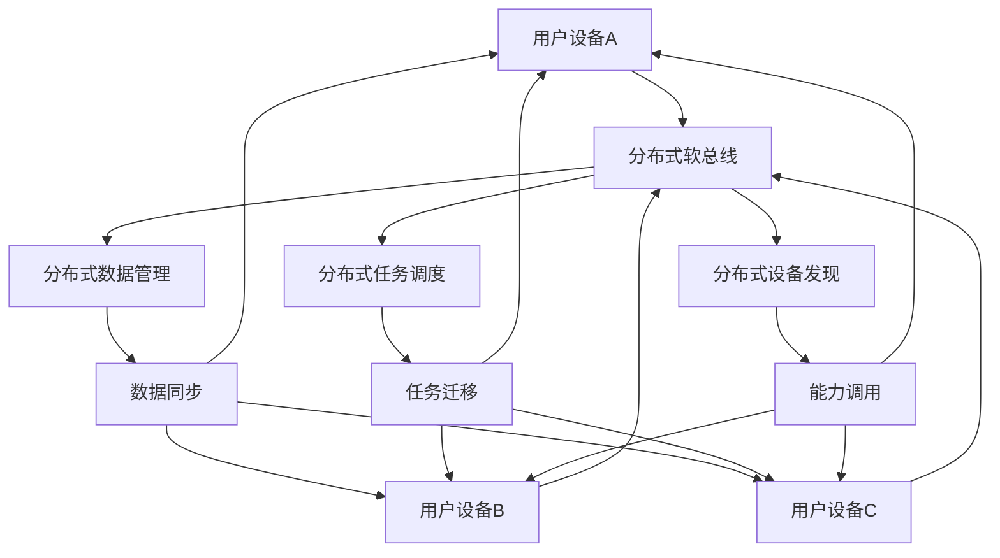

# 第19章：跨设备协同

## 19.1 分布式应用架构

### 19.1.1 分布式系统概述

HarmonyOS的分布式能力是其核心特性之一，它允许应用在多设备间无缝协同工作，实现数据的跨设备同步、能力的跨设备调用以及用户任务的跨设备迁移。



### 19.1.2 分布式应用架构设计

```typescript
// DistributedArchitecture.ets
import { distributedDataObject } from '@kit.ArkData'
import { distributedDeviceManager } from '@kit.DistributedServiceKit'
import { hilog } from '@ohos.hilog'

export interface DistributedDevice {
  deviceId: string
  deviceName: string
  deviceType: string
  isOnline: boolean
  capabilities: string[]
}

export interface DistributedAppConfig {
  appId: string
  sessionId: string
  syncMode: 'realtime' | 'manual' | 'batch'
  securityLevel: 'low' | 'medium' | 'high'
  maxDevices: number
}

@Entry
@Component
struct DistributedArchitecture {
  @State connectedDevices: DistributedDevice[] = []
  @State isDistributedMode: boolean = false
  @State syncStatus: string = '未连接'
  @State dataSyncEnabled: boolean = false
  @State sessionId: string = ''

  private distributedManager: DistributedManager = DistributedManager.getInstance()

  aboutToAppear() {
    this.initializeDistributedSystem()
  }

  build() {
    Column() {
      // 标题
      Text('分布式应用架构')
        .fontSize(20)
        .fontWeight(FontWeight.Bold)
        .margin({ bottom: 20 })

      // 分布式状态显示
      Row() {
        Column() {
          Text('分布式模式')
            .fontSize(14)
            .fontColor('#666666')
            .margin({ bottom: 4 })

          Text(this.isDistributedMode ? '已启用' : '未启用')
            .fontSize(16)
            .fontWeight(FontWeight.Medium)
            .fontColor(this.isDistributedMode ? '#34C759' : '#8E8E93')
        }
        .alignItems(HorizontalAlign.Center)
        .layoutWeight(1)

        Column() {
          Text('同步状态')
            .fontSize(14)
            .fontColor('#666666')
            .margin({ bottom: 4 })

          Text(this.syncStatus)
            .fontSize(16)
            .fontWeight(FontWeight.Medium)
            .fontColor(this.getSyncStatusColor())
        }
        .alignItems(HorizontalAlign.Center)
        .layoutWeight(1)

        Column() {
          Text('连接设备数')
            .fontSize(14)
            .fontColor('#666666')
            .margin({ bottom: 4 })

          Text(this.connectedDevices.length.toString())
            .fontSize(16}
            .fontWeight(FontWeight.Bold)
            .fontColor('#007AFF')
        }
        .alignItems(HorizontalAlign.Center)
        .layoutWeight(1)
      }
      .width('100%')
      .padding(16)
      .backgroundColor('#F8F8F8')
      .borderRadius(8)
      .margin({ bottom: 20 })

      // 控制面板
      Row() {
        Button('发现设备')
          .width(100)
          .height(36)
          .fontSize(12)
          .backgroundColor('#007AFF')
          .margin({ right: 8 })
          .onClick(() => {
            this.discoverDevices()
          })

        Button('启用分布式')
          .width(100)
          .height(36}
          .fontSize(12)
          .backgroundColor(this.isDistributedMode ? '#FF9500' : '#34C759')
          .margin({ right: 8 })
          .onClick(() => {
            this.toggleDistributedMode()
          })

        Button('数据同步')
          .width(100)
          .height(36)
          .fontSize(12)
          .backgroundColor(this.dataSyncEnabled ? '#5856D6' : '#F0F0F0')
          .fontColor(this.dataSyncEnabled ? '#FFFFFF' : '#666666')
          .margin({ right: 8 })
          .onClick(() => {
            this.toggleDataSync()
          })

        Button('测试协同')
          .width(100)
          .height(36)
          .fontSize(12)
          .backgroundColor('#FF3B30')
          .onClick(() => {
            this.testCollaboration()
          })
      }
      .justifyContent(FlexAlign.Center)
      .margin({ bottom: 20 })

      // 设备列表
      Column() {
        Text('已连接设备')
          .fontSize(16)
          .fontWeight(FontWeight.Medium)
          .margin({ bottom: 12 })

        List() {
          ForEach(this.connectedDevices, (device: DistributedDevice) => {
            ListItem() {
              this.DeviceItem(device)
            }
          })
        }
        .layoutWeight(1)
        .width('100%')
        .backgroundColor('#F0F0F5')
        .borderRadius(8)
      }
      .layoutWeight(1)
      .width('100%')
    }
    .width('100%')
    .height('100%')
    .padding(20)
    .backgroundColor('#FFFFFF')
  }

  @Builder DeviceItem(device: DistributedDevice) {
    Row() {
      Column() {
        Text(device.deviceName)
          .fontSize(14)
          .fontWeight(FontWeight.Medium)
          .fontColor('#333333')

        Text(device.deviceId)
          .fontSize(12}
          .fontColor('#999999')
          .margin({ top: 4 })

        Row() {
          ForEach(device.capabilities.slice(0, 3), (capability: string) => {
            Text(capability)
              .fontSize(10)
              .fontColor('#666666')
              .padding({ horizontal: 4, vertical: 2 })
              .backgroundColor('#E0E0E0')
              .borderRadius(4)
              .margin({ right: 4 })
          })
        }
        .margin({ top: 4 })
      }
      .alignItems(HorizontalAlign.Start)
      .layoutWeight(1)

      Column() {
        Circle({ width: 12, height: 12 })
          .fill(device.isOnline ? '#34C759' : '#8E8E93')
          .margin({ bottom: 8 })

        Text(device.isOnline ? '在线' : '离线')
          .fontSize(12)
          .fontColor(device.isOnline ? '#34C759' : '#8E8E93')
      }
      .alignItems(HorizontalAlign.Center)
    }
    .width('100%')
    .padding(12)
    .backgroundColor('#FFFFFF')
    .borderRadius(6)
    .margin({ bottom: 8 })
    .shadow({
      radius: 2,
      color: '#00000010',
      offsetX: 0,
      offsetY: 1
    })
  }

  private async initializeDistributedSystem(): Promise<void> {
    try {
      // 初始化分布式管理器
      await this.distributedManager.initialize()

      // 设置事件监听器
      this.setupEventListeners()

      hilog.info(0x0000, 'DistributedArchitecture', '分布式系统初始化完成')
    } catch (error) {
      hilog.error(0x0000, 'DistributedArchitecture', `分布式系统初始化失败: ${error}`)
    }
  }

  private setupEventListeners(): void {
    this.distributedManager.onDeviceDiscovered = (devices: DistributedDevice[]) => {
      this.connectedDevices = devices
      hilog.info(0x0000, 'DistributedArchitecture', `发现设备: ${devices.length}个`)
    }

    this.distributedManager.onDeviceConnected = (deviceId: string) => {
      const device = this.connectedDevices.find(d => d.deviceId === deviceId)
      if (device) {
        device.isOnline = true
      }
      this.updateSyncStatus()
    }

    this.distributedManager.onDeviceDisconnected = (deviceId: string) => {
      const device = this.connectedDevices.find(d => d.deviceId === deviceId)
      if (device) {
        device.isOnline = false
      }
      this.updateSyncStatus()
    }

    this.distributedManager.onDataSynced = (data: any) => {
      hilog.info(0x0000, 'DistributedArchitecture', `数据同步完成: ${JSON.stringify(data)}`)
    }
  }

  private async discoverDevices(): Promise<void> {
    try {
      this.syncStatus = '发现中...'
      const devices = await this.distributedManager.discoverDevices()
      this.connectedDevices = devices
      this.syncStatus = devices.length > 0 ? '已连接' : '无设备'
    } catch (error) {
      this.syncStatus = '发现失败'
      hilog.error(0x0000, 'DistributedArchitecture', `设备发现失败: ${error}`)
    }
  }

  private async toggleDistributedMode(): Promise<void> {
    try {
      if (!this.isDistributedMode) {
        // 启用分布式模式
        this.sessionId = distributedDataObject.genSessionId()
        await this.distributedManager.enableDistributedMode(this.sessionId)
        this.isDistributedMode = true
        this.syncStatus = '分布式模式已启用'
      } else {
        // 禁用分布式模式
        await this.distributedManager.disableDistributedMode()
        this.isDistributedMode = false
        this.sessionId = ''
        this.syncStatus = '分布式模式已禁用'
      }
    } catch (error) {
      hilog.error(0x0000, 'DistributedArchitecture', `分布式模式切换失败: ${error}`)
    }
  }

  private async toggleDataSync(): Promise<void> {
    try {
      if (!this.dataSyncEnabled) {
        await this.distributedManager.enableDataSync()
        this.dataSyncEnabled = true
      } else {
        await this.distributedManager.disableDataSync()
        this.dataSyncEnabled = false
      }
    } catch (error) {
      hilog.error(0x0000, 'DistributedArchitecture', `数据同步切换失败: ${error}`)
    }
  }

  private async testCollaboration(): Promise<void> {
    if (!this.isDistributedMode || this.connectedDevices.length === 0) {
      hilog.warn(0x0000, 'DistributedArchitecture', '请先启用分布式模式并连接设备')
      return
    }

    try {
      // 创建测试数据
      const testData = {
        message: 'Hello from distributed device!',
        timestamp: Date.now(),
        deviceId: this.getCurrentDeviceId()
      }

      // 发送协同测试数据
      await this.distributedManager.sendCollaborationData(testData)
      hilog.info(0x0000, 'DistributedArchitecture', '协同测试数据已发送')
    } catch (error) {
      hilog.error(0x0000, 'DistributedArchitecture', `协同测试失败: ${error}`)
    }
  }

  private updateSyncStatus(): void {
    const onlineDevices = this.connectedDevices.filter(d => d.isOnline).length
    if (onlineDevices === 0) {
      this.syncStatus = '无在线设备'
    } else if (onlineDevices === this.connectedDevices.length) {
      this.syncStatus = '全部在线'
    } else {
      this.syncStatus = `${onlineDevices}/${this.connectedDevices.length} 在线`
    }
  }

  private getCurrentDeviceId(): string {
    // 获取当前设备ID的实现
    return 'current_device_' + Date.now()
  }

  private getSyncStatusColor(): string {
    switch (this.syncStatus) {
      case '已连接':
      case '全部在线':
      case '分布式模式已启用':
        return '#34C759'
      case '未连接':
      case '无设备':
      case '无在线设备':
      case '分布式模式已禁用':
        return '#8E8E93'
      case '发现中':
        return '#FF9500'
      default:
        return '#666666'
    }
  }
}

class DistributedManager {
  private static instance: DistributedManager
  private devices: DistributedDevice[] = []
  private isInitialized: boolean = false
  private readonly TAG = 'DistributedManager'

  static getInstance(): DistributedManager {
    if (!DistributedManager.instance) {
      DistributedManager.instance = new DistributedManager()
    }
    return DistributedManager.instance
  }

  // 事件回调
  onDeviceDiscovered: ((devices: DistributedDevice[]) => void) | null = null
  onDeviceConnected: ((deviceId: string) => void) | null = null
  onDeviceDisconnected: ((deviceId: string) => void) | null = null
  onDataSynced: ((data: any) => void) | null = null

  async initialize(): Promise<void> {
    if (this.isInitialized) return

    try {
      // 订阅设备状态变化
      distributedDeviceManager.on('deviceStateChange', (data) => {
        this.handleDeviceStateChange(data)
      })

      // 订阅设备发现
      distributedDeviceManager.on('deviceFound', (data) => {
        this.handleDeviceFound(data)
      })

      this.isInitialized = true
      hilog.info(0x0000, this.TAG, '分布式管理器初始化完成')
    } catch (error) {
      hilog.error(0x0000, this.TAG, `分布式管理器初始化失败: ${error}`)
      throw error
    }
  }

  async discoverDevices(): Promise<DistributedDevice[]> {
    try {
      // 获取设备列表
      const deviceInfos = await distributedDeviceManager.getTrustedDeviceList()

      this.devices = deviceInfos.map(info => ({
        deviceId: info.networkId,
        deviceName: info.deviceName,
        deviceType: info.deviceType,
        isOnline: true,
        capabilities: this.getDeviceCapabilities(info)
      }))

      if (this.onDeviceDiscovered) {
        this.onDeviceDiscovered(this.devices)
      }

      hilog.info(0x0000, this.TAG, `发现 ${this.devices.length} 个可信设备`)
      return this.devices
    } catch (error) {
      hilog.error(0x0000, this.TAG, `设备发现失败: ${error}`)
      return []
    }
  }

  async enableDistributedMode(sessionId: string): Promise<void> {
    try {
      // 启用分布式模式的实现
      hilog.info(0x0000, this.TAG, `启用分布式模式，会话ID: ${sessionId}`)
    } catch (error) {
      hilog.error(0x0000, this.TAG, `启用分布式模式失败: ${error}`)
      throw error
    }
  }

  async disableDistributedMode(): Promise<void> {
    try {
      // 禁用分布式模式的实现
      hilog.info(0x0000, this.TAG, '禁用分布式模式')
    } catch (error) {
      hilog.error(0x0000, this.TAG, `禁用分布式模式失败: ${error}`)
      throw error
    }
  }

  async enableDataSync(): Promise<void> {
    try {
      // 启用数据同步的实现
      hilog.info(0x0000, this.TAG, '启用数据同步')
    } catch (error) {
      hilog.error(0x0000, this.TAG, `启用数据同步失败: ${error}`)
      throw error
    }
  }

  async disableDataSync(): Promise<void> {
    try {
      // 禁用数据同步的实现
      hilog.info(0x0000, this.TAG, '禁用数据同步')
    } catch (error) {
      hilog.error(0x0000, this.TAG, `禁用数据同步失败: ${error}`)
      throw error
    }
  }

  async sendCollaborationData(data: any): Promise<void> {
    try {
      // 发送协同数据的实现
      hilog.info(0x0000, this.TAG, `发送协同数据: ${JSON.stringify(data)}`)

      if (this.onDataSynced) {
        this.onDataSynced(data)
      }
    } catch (error) {
      hilog.error(0x0000, this.TAG, `发送协同数据失败: ${error}`)
      throw error
    }
  }

  private handleDeviceStateChange(data: any): void {
    const { deviceId, state } = data
    const device = this.devices.find(d => d.deviceId === deviceId)

    if (device) {
      device.isOnline = state === 'online'

      if (state === 'online' && this.onDeviceConnected) {
        this.onDeviceConnected(deviceId)
      } else if (state === 'offline' && this.onDeviceDisconnected) {
        this.onDeviceDisconnected(deviceId)
      }

      hilog.info(0x0000, this.TAG, `设备状态变化: ${deviceId} -> ${state}`)
    }
  }

  private handleDeviceFound(data: any): void {
    // 处理新发现的设备
    hilog.info(0x0000, this.TAG, `发现新设备: ${JSON.stringify(data)}`)
  }

  private getDeviceCapabilities(deviceInfo: any): string[] {
    // 根据设备信息获取设备能力
    const capabilities = []

    if (deviceInfo.deviceType === 'phone') {
      capabilities.push('phone', 'camera', 'gps', 'bluetooth', 'wifi')
    } else if (deviceInfo.deviceType === 'tablet') {
      capabilities.push('tablet', 'camera', 'wifi', 'bluetooth')
    } else if (deviceInfo.deviceType === 'watch') {
      capabilities.push('watch', 'heart_rate', 'step_counter', 'bluetooth')
    }

    return capabilities
  }

  cleanup(): void {
    this.devices = []
    this.isInitialized = false
    this.onDeviceDiscovered = null
    this.onDeviceConnected = null
    this.onDeviceDisconnected = null
    this.onDataSynced = null
  }
}
```

## 19.2 设备发现与连接

### 19.2.1 设备发现机制

```typescript
// DeviceDiscoveryManager.ets
import { distributedDeviceManager } from '@kit.DistributedServiceKit'
import { hilog } from '@ohos.hilog'

export interface DeviceInfo {
  deviceId: string
  deviceName: string
  deviceType: string
  networkId: string
  isOnline: boolean
  lastSeen: number
  capabilities: DeviceCapability[]
}

export enum DeviceCapability {
  CAMERA = 'camera',
  GPS = 'gps',
  BLUETOOTH = 'bluetooth',
  WIFI = 'wifi',
  AUDIO = 'audio',
  DISPLAY = 'display',
  STORAGE = 'storage',
  SENSORS = 'sensors'
}

export enum DiscoveryMode {
  AUTO = 'auto',
  MANUAL = 'manual',
  FILTERED = 'filtered'
}

@Entry
@Component
struct DeviceDiscoveryManager {
  @State discoveredDevices: DeviceInfo[] = []
  @State trustedDevices: DeviceInfo[] = []
  @State isScanning: boolean = false
  @State discoveryMode: DiscoveryMode = DiscoveryMode.AUTO
  @State selectedCapabilities: DeviceCapability[] = []
  @State scanProgress: number = 0

  private deviceDiscovery: DeviceDiscovery = DeviceDiscovery.getInstance()

  aboutToAppear() {
    this.initializeDiscovery()
  }

  aboutToDisappear() {
    this.deviceDiscovery.stopScanning()
  }

  build() {
    Column() {
      // 标题栏
      Row() {
        Text('设备发现与连接')
          .fontSize(20)
          .fontWeight(FontWeight.Bold)
          .layoutWeight(1)

        if (this.isScanning) {
          LoadingProgress()
            .width(20)
            .height(20)
            .color('#007AFF')
        }
      }
      .width('100%')
      .margin({ bottom: 20 })

      // 发现模式选择
      Row() {
        Text('发现模式:')
          .fontSize(14)
          .fontColor('#666666')
          .margin({ right: 12 })

        ForEach([
          { mode: DiscoveryMode.AUTO, name: '自动' },
          { mode: DiscoveryMode.MANUAL, name: '手动' },
          { mode: DiscoveryMode.FILTERED, name: '过滤' }
        ], (item) => {
          Button(item.name)
            .width(60)
            .height(30)
            .fontSize(12)
            .backgroundColor(this.discoveryMode === item.mode ? '#007AFF' : '#F0F0F0')
            .fontColor(this.discoveryMode === item.mode ? '#FFFFFF' : '#666666')
            .margin({ right: 8 })
            .onClick(() => {
              this.discoveryMode = item.mode
            })
        })
      }
      .width('100%')
      .justifyContent(FlexAlign.Start)
      .margin({ bottom: 16 })

      // 能力过滤器
      if (this.discoveryMode === DiscoveryMode.FILTERED) {
        Row() {
          Text('设备能力:')
            .fontSize(14)
            .fontColor('#666666')
            .margin({ right: 12 })

          ForEach(Object.values(DeviceCapability), (capability) => {
            Button(this.getCapabilityName(capability))
              .width(60)
              .height(30)
              .fontSize(10)
              .backgroundColor(this.selectedCapabilities.includes(capability) ? '#34C759' : '#F0F0F0')
              .fontColor(this.selectedCapabilities.includes(capability) ? '#FFFFFF' : '#666666')
              .margin({ right: 8 })
              .onClick(() => {
                this.toggleCapability(capability)
              })
          })
        }
        .width('100%')
        .justifyContent(FlexAlign.Start)
        .margin({ bottom: 16 })
      }

      // 扫描进度
      if (this.isScanning) {
        Column() {
          Progress({
            value: this.scanProgress,
            total: 100,
            type: ProgressType.Linear
          })
            .width('100%')
            .height(6)
            .color('#007AFF')
            .backgroundColor('#E0E0E0'
          .margin({ bottom: 8 })

          Text(`扫描进度: ${this.scanProgress}%`)
            .fontSize(12)
            .fontColor('#666666')
        }
        .width('100%')
        .padding(16)
        .backgroundColor('#F8F8F8')
        .borderRadius(8)
        .margin({ bottom: 16 })
      }

      // 统计信息
      Row() {
        Column() {
          Text('发现设备')
            .fontSize(12)
            .fontColor('#666666')
          Text(this.discoveredDevices.length.toString())
            .fontSize(18)
            .fontWeight(FontWeight.Bold)
            .fontColor('#007AFF')
        }
        .alignItems(HorizontalAlign.Center)
        .layoutWeight(1)

        Column() {
          Text('可信设备')
            .fontSize(12)
            .fontColor('#666666')
          Text(this.trustedDevices.length.toString())
            .fontSize(18)
            .fontWeight(FontWeight.Bold)
            .fontColor('#34C759')
        }
        .alignItems(HorizontalAlign.Center)
        .layoutWeight(1)

        Column() {
          Text('在线设备')
            .fontSize(12)
            .fontColor('#666666')
          Text(this.getOnlineDeviceCount().toString())
            .fontSize(18)
            .fontWeight(FontWeight.Bold)
            .fontColor('#FF9500')
        }
        .alignItems(HorizontalAlign.Center)
        .layoutWeight(1)
      }
      .width('100%')
      .padding(16)
      .backgroundColor('#F0F0F5')
      .borderRadius(8)
      .margin({ bottom: 20 })

      // 控制按钮
      Row() {
        Button(this.isScanning ? '停止扫描' : '开始扫描')
          .width(100)
          .height(40)
          .backgroundColor(this.isScanning ? '#FF3B30' : '#34C759')
          .margin({ right: 16 })
          .onClick(() => {
            this.toggleScanning()
          })

        Button('刷新设备')
          .width(100)
          .height(40)
          .backgroundColor('#5856D6')
          .margin({ right: 16 })
          .onClick(() => {
            this.refreshDevices()
          })

        Button('清空列表')
          .width(100)
          .height(40}
          .backgroundColor('#8E8E93')
          .margin({ right: 16 })
          .onClick(() => {
            this.clearDeviceList()
          })
      }
      .justifyContent(FlexAlign.Center)
      .margin({ bottom: 20 })

      // 设备列表
      Tabs({ barPosition: BarPosition.Start }) {
        TabContent() {
          this.DeviceList(this.discoveredDevices, '发现设备')
        }
        .tabBar('发现设备')

        TabContent() {
          this.DeviceList(this.trustedDevices, '可信设备')
        }
        .tabBar('可信设备')
      }
      .layoutWeight(1)
      .width('100%')
    }
    .width('100%')
    .height('100%')
    .padding(20)
    .backgroundColor('#FFFFFF')
  }

  @Builder DeviceList(devices: DeviceInfo[], title: string) {
    Column() {
      Row() {
        Text(title)
          .fontSize(16)
          .fontWeight(FontWeight.Medium)
          .layoutWeight(1)

        Text(`${devices.length}个设备`)
          .fontSize(14)
          .fontColor('#666666')
      }
      .width('100%')
      .padding(16)
      .backgroundColor('#F8F8F8')
      .borderRadius(8)
      .margin({ bottom: 16 })

      List() {
        ForEach(devices, (device: DeviceInfo) => {
          ListItem() {
            this.DeviceListItem(device)
          }
        })
      }
      .layoutWeight(1)
      .width('100%')
    }
    .width('100%')
    .height('100%')
  }

  @Builder DeviceListItem(device: DeviceInfo) {
    Row() {
      Column() {
        Row() {
          Text(device.deviceName)
            .fontSize(16)
            .fontWeight(FontWeight.Medium)
            .fontColor('#333333')
            .layoutWeight(1)

          Circle({ width: 12, height: 12 })
            .fill(device.isOnline ? '#34C759' : '#8E8E93')
        }
        .width('100%')
        .margin({ bottom: 8 })

        Text(`设备ID: ${device.deviceId}`)
          .fontSize(12}
          .fontColor('#999999')

        Text(`类型: ${device.deviceType}`)
          .fontSize(12}
          .fontColor('#666666')
          .margin({ top: 4 })

        Row() {
          ForEach(device.capabilities.slice(0, 4), (capability) => {
            Text(this.getCapabilityName(capability))
              .fontSize(10)
              .fontColor('#666666')
              .padding({ horizontal: 6, vertical: 2 })
              .backgroundColor('#E0E0E0')
              .borderRadius(4)
              .margin({ right: 4 })
          })
        }
        .margin({ top: 8 })
      }
      .alignItems(HorizontalAlign.Start)
      .layoutWeight(1)

      Column() {
        Button('连接')
          .width(60)
          .height(32)
          .fontSize(12)
          .backgroundColor('#007AFF')
          .margin({ bottom: 8 })
          .onClick(() => {
            this.connectToDevice(device)
          })

        Button('详情')
          .width(60)
          .height(32)
          .fontSize(12)
          .backgroundColor('#F0F0F0')
          .fontColor('#666666')
          .onClick(() => {
            this.showDeviceDetails(device)
          })
      }
      .alignItems(HorizontalAlign.Center)
    }
    .width('100%')
    .padding(16)
    .backgroundColor('#FFFFFF')
    .borderRadius(8)
    .margin({ bottom: 8 })
    .shadow({
      radius: 2,
      color: '#00000010',
      offsetX: 0,
      offsetY: 1
    })
  }

  private async initializeDiscovery(): Promise<void> {
    try {
      await this.deviceDiscovery.initialize()

      // 设置事件监听器
      this.deviceDiscovery.onDeviceDiscovered = (devices: DeviceInfo[]) => {
        this.discoveredDevices = devices
      }

      this.deviceDiscovery.onDeviceConnected = (deviceId: string) => {
        this.updateDeviceStatus(deviceId, true)
      }

      this.deviceDiscovery.onDeviceDisconnected = (deviceId: string) => {
        this.updateDeviceStatus(deviceId, false)
      }

      this.deviceDiscovery.onScanProgress = (progress: number) => {
        this.scanProgress = progress
      }

      // 加载可信设备
      await this.loadTrustedDevices()

      hilog.info(0x0000, 'DeviceDiscoveryManager', '设备发现管理器初始化完成')
    } catch (error) {
      hilog.error(0x0000, 'DeviceDiscoveryManager', `设备发现管理器初始化失败: ${error}`)
    }
  }

  private async toggleScanning(): Promise<void> {
    try {
      if (!this.isScanning) {
        await this.deviceDiscovery.startScanning(this.discoveryMode, this.selectedCapabilities)
        this.isScanning = true
        hilog.info(0x0000, 'DeviceDiscoveryManager', '开始设备扫描')
      } else {
        await this.deviceDiscovery.stopScanning()
        this.isScanning = false
        this.scanProgress = 0
        hilog.info(0x0000, 'DeviceDiscoveryManager', '停止设备扫描')
      }
    } catch (error) {
      hilog.error(0x0000, 'DeviceDiscoveryManager', `扫描切换失败: ${error}`)
    }
  }

  private async refreshDevices(): Promise<void> {
    try {
      this.discoveredDevices = await this.deviceDiscovery.discoverDevices()
      hilog.info(0x0000, 'DeviceDiscoveryManager', '设备列表已刷新')
    } catch (error) {
      hilog.error(0x0000, 'DeviceDiscoveryManager', `设备刷新失败: ${error}`)
    }
  }

  private clearDeviceList(): void {
    this.discoveredDevices = []
    this.trustedDevices = []
    this.scanProgress = 0
  }

  private toggleCapability(capability: DeviceCapability): void {
    const index = this.selectedCapabilities.indexOf(capability)
    if (index >= 0) {
      this.selectedCapabilities.splice(index, 1)
    } else {
      this.selectedCapabilities.push(capability)
    }
  }

  private async connectToDevice(device: DeviceInfo): Promise<void> {
    try {
      const connected = await this.deviceDiscovery.connectToDevice(device.deviceId)
      if (connected) {
        // 添加到可信设备列表
        if (!this.trustedDevices.find(d => d.deviceId === device.deviceId)) {
          this.trustedDevices.push(device)
          await this.saveTrustedDevices()
        }
        hilog.info(0x0000, 'DeviceDiscoveryManager', `设备连接成功: ${device.deviceName}`)
      }
    } catch (error) {
      hilog.error(0x0000, 'DeviceDiscoveryManager', `设备连接失败: ${error}`)
    }
  }

  private showDeviceDetails(device: DeviceInfo): void {
    // 显示设备详情的对话框或页面
    hilog.info(0x0000, 'DeviceDiscoveryManager', `显示设备详情: ${device.deviceName}`)
  }

  private updateDeviceStatus(deviceId: string, isOnline: boolean): void {
    // 更新发现设备状态
    const discoveredDevice = this.discoveredDevices.find(d => d.deviceId === deviceId)
    if (discoveredDevice) {
      discoveredDevice.isOnline = isOnline
    }

    // 更新可信设备状态
    const trustedDevice = this.trustedDevices.find(d => d.deviceId === deviceId)
    if (trustedDevice) {
      trustedDevice.isOnline = isOnline
    }
  }

  private getOnlineDeviceCount(): number {
    const discovered = this.discoveredDevices.filter(d => d.isOnline).length
    const trusted = this.trustedDevices.filter(d => d.isOnline).length
    return discovered + trusted
  }

  private getCapabilityName(capability: DeviceCapability): string {
    const names = {
      [DeviceCapability.CAMERA]: '相机',
      [DeviceCapability.GPS]: 'GPS',
      [DeviceCapability.BLUETOOTH]: '蓝牙',
      [DeviceCapability.WIFI]: 'WiFi',
      [DeviceCapability.AUDIO]: '音频',
      [DeviceCapability.DISPLAY]: '显示',
      [DeviceCapability.STORAGE]: '存储',
      [DeviceCapability.SENSORS]: '传感器'
    }
    return names[capability] || capability
  }

  private async loadTrustedDevices(): Promise<void> {
    try {
      // 从持久化存储加载可信设备列表
      this.trustedDevices = await this.deviceDiscovery.loadTrustedDevices()
    } catch (error) {
      hilog.error(0x0000, 'DeviceDiscoveryManager', `加载可信设备失败: ${error}`)
      this.trustedDevices = []
    }
  }

  private async saveTrustedDevices(): Promise<void> {
    try {
      // 保存可信设备列表到持久化存储
      await this.deviceDiscovery.saveTrustedDevices(this.trustedDevices)
    } catch (error) {
      hilog.error(0x0000, 'DeviceDiscoveryManager', `保存可信设备失败: ${error}`)
    }
  }
}

class DeviceDiscovery {
  private static instance: DeviceDiscovery
  private isScanning: boolean = false
  private scanInterval: number = 2000 // 2秒扫描一次
  private scanTimer: number = 0
  private readonly TAG = 'DeviceDiscovery'

  static getInstance(): DeviceDiscovery {
    if (!DeviceDiscovery.instance) {
      DeviceDiscovery.instance = new DeviceDiscovery()
    }
    return DeviceDiscovery.instance
  }

  // 事件回调
  onDeviceDiscovered: ((devices: DeviceInfo[]) => void) | null = null
  onDeviceConnected: ((deviceId: string) => void) | null = null
  onDeviceDisconnected: ((deviceId: string) => void) | null = null
  onScanProgress: ((progress: number) => void) | null = null

  async initialize(): Promise<void> {
    try {
      // 订阅设备状态变化
      distributedDeviceManager.on('deviceStateChange', (data) => {
        this.handleDeviceStateChange(data)
      })

      // 订阅设备发现
      distributedDeviceManager.on('deviceFound', (data) => {
        this.handleDeviceFound(data)
      })

      hilog.info(0x0000, this.TAG, '设备发现服务初始化完成')
    } catch (error) {
      hilog.error(0x0000, this.TAG, `设备发现服务初始化失败: ${error}`)
      throw error
    }
  }

  async startScanning(mode: DiscoveryMode, capabilities: DeviceCapability[]): Promise<void> {
    if (this.isScanning) {
      return
    }

    this.isScanning = true
    hilog.info(0x0000, this.TAG, `开始设备扫描，模式: ${mode}`)

    // 启动定期扫描
    this.scanTimer = setInterval(() => {
      this.performScan()
    }, this.scanInterval)

    // 立即执行一次扫描
    await this.performScan()
  }

  async stopScanning(): Promise<void> {
    if (!this.isScanning) {
      return
    }

    this.isScanning = false
    if (this.scanTimer) {
      clearInterval(this.scanTimer)
      this.scanTimer = 0
    }

    hilog.info(0x0000, this.TAG, '停止设备扫描')
  }

  async discoverDevices(): Promise<DeviceInfo[]> {
    try {
      const deviceInfos = await distributedDeviceManager.getTrustedDeviceList()

      const devices: DeviceInfo[] = deviceInfos.map(info => ({
        deviceId: info.networkId,
        deviceName: info.deviceName,
        deviceType: info.deviceType,
        networkId: info.networkId,
        isOnline: true,
        lastSeen: Date.now(),
        capabilities: this.extractDeviceCapabilities(info)
      }))

      hilog.info(0x0000, this.TAG, `发现 ${devices.length} 个设备`)
      return devices
    } catch (error) {
      hilog.error(0x0000, this.TAG, `设备发现失败: ${error}`)
      return []
    }
  }

  async connectToDevice(deviceId: string): Promise<boolean> {
    try {
      // 建立连接的逻辑
      hilog.info(0x0000, this.TAG, `尝试连接设备: ${deviceId}`)

      // 模拟连接过程
      await new Promise(resolve => setTimeout(resolve, 1000))

      if (this.onDeviceConnected) {
        this.onDeviceConnected(deviceId)
      }

      return true
    } catch (error) {
      hilog.error(0x0000, this.TAG, `设备连接失败: ${error}`)
      return false
    }
  }

  async loadTrustedDevices(): Promise<DeviceInfo[]> {
    // 从持久化存储加载可信设备
    return []
  }

  async saveTrustedDevices(devices: DeviceInfo[]): Promise<void> {
    // 保存可信设备到持久化存储
  }

  private async performScan(): Promise<void> {
    if (!this.isScanning) return

    try {
      const devices = await this.discoverDevices()

      if (this.onDeviceDiscovered) {
        this.onDeviceDiscovered(devices)
      }

      // 更新扫描进度
      const progress = Math.min(100, (Date.now() % 10000) / 100)
      if (this.onScanProgress) {
        this.onScanProgress(progress)
      }
    } catch (error) {
      hilog.error(0x0000, this.TAG, `扫描失败: ${error}`)
    }
  }

  private handleDeviceStateChange(data: any): void {
    // 处理设备状态变化
    hilog.info(0x0000, this.TAG, `设备状态变化: ${JSON.stringify(data)}`)
  }

  private handleDeviceFound(data: any): void {
    // 处理新发现的设备
    hilog.info(0x0000, this.TAG, `发现新设备: ${JSON.stringify(data)}`)
  }

  private extractDeviceCapabilities(deviceInfo: any): DeviceCapability[] {
    const capabilities: DeviceCapability[] = []

    // 根据设备类型推断能力
    if (deviceInfo.deviceType === 'phone') {
      capabilities.push(
        DeviceCapability.CAMERA,
        DeviceCapability.GPS,
        DeviceCapability.BLUETOOTH,
        DeviceCapability.WIFI,
        DeviceCapability.AUDIO,
        DeviceCapability.DISPLAY,
        DeviceCapability.SENSORS
      )
    } else if (deviceInfo.deviceType === 'tablet') {
      capabilities.push(
        DeviceCapability.CAMERA,
        DeviceCapability.WIFI,
        DeviceCapability.BLUETOOTH,
        DeviceCapability.AUDIO,
        DeviceCapability.DISPLAY
      )
    } else if (deviceInfo.deviceType === 'watch') {
      capabilities.push(
        DeviceCapability.BLUETOOTH,
        DeviceCapability.SENSORS,
        DeviceCapability.AUDIO
      )
    }

    return capabilities
  }
}
```

## 19.3 数据同步机制

### 19.3.1 分布式数据对象

```typescript
// DistributedDataSync.ets
import { distributedDataObject } from '@kit.ArkData'
import { hilog } from '@ohos.hilog'

export interface SyncData {
  id: string
  title: string
  content: string
  timestamp: number
  author: string
  version: number
  tags: string[]
}

export interface SyncSession {
  sessionId: string
  participants: string[]
  createdAt: number
  lastSyncTime: number
  isActive: boolean
}

@Entry
@Component
struct DistributedDataSync {
  @State currentData: SyncData | null = null
  @State syncHistory: Array<{ data: SyncData, timestamp: number, action: string }> = []
  @State activeSessions: SyncSession[] = []
  @State currentSession: SyncSession | null = null
  @State isSyncing: boolean = false
  @State syncMode: 'realtime' | 'manual' | 'batch' = 'realtime'

  private dataSyncManager: DataSyncManager = DataSyncManager.getInstance()

  aboutToAppear() {
    this.initializeDataSync()
  }

  aboutToDisappear() {
    this.dataSyncManager.cleanup()
  }

  build() {
    Column() {
      // 标题栏
      Row() {
        Text('分布式数据同步')
          .fontSize(20)
          .fontWeight(FontWeight.Bold)
          .layoutWeight(1)

        if (this.isSyncing) {
          LoadingProgress()
            .width(20)
            .height(20)
            .color('#007AFF')
            .margin({ right: 8 })
        }

        Text(this.isSyncing ? '同步中' : '已同步')
          .fontSize(14)
          .fontColor(this.isSyncing ? '#007AFF' : '#34C759')
      }
      .width('100%')
      .margin({ bottom: 20 })

      // 同步模式选择
      Row() {
        Text('同步模式:')
          .fontSize(14)
          .fontColor('#666666')
          .margin({ right: 12 })

        ForEach([
          { mode: 'realtime', name: '实时' },
          { mode: 'manual', name: '手动' },
          { mode: 'batch', name: '批量' }
        ], (item) => {
          Button(item.name)
            .width(60)
            .height(32)
            .fontSize(12)
            .backgroundColor(this.syncMode === item.mode ? '#007AFF' : '#F0F0F0')
            .fontColor(this.syncMode === item.mode ? '#FFFFFF' : '#666666')
            .margin({ right: 8 })
            .onClick(() => {
              this.changeSyncMode(item.mode)
            })
        })
      }
      .width('100%')
      .justifyContent(FlexAlign.Start)
      .margin({ bottom: 20 })

      // 当前数据显示
      if (this.currentData) {
        Column() {
          Text('当前数据')
            .fontSize(16)
            .fontWeight(FontWeight.Medium)
            .margin({ bottom: 12 })

          Column() {
            Text(`标题: ${this.currentData.title}`)
              .fontSize(14}
              .fontColor('#333333')
              .width('100%')
              .margin({ bottom: 8 })

            Text(`内容: ${this.currentData.content}`)
              .fontSize(12)
              .fontColor('#666666')
              .width('100%')
              .margin({ bottom: 8 })

            Text(`作者: ${this.currentData.author}`)
              .fontSize(12)
              .fontColor('#666666')
              .margin({ bottom: 8 })

            Row() {
              Text(`版本: ${this.currentData.version}`)
                .fontSize(12}
                .fontColor('#666666')

              Text(`时间: ${new Date(this.currentData.timestamp).toLocaleTimeString()}`)
                .fontSize(12}
                .fontColor('#666666')
                .margin({ left: 16 })
            }
            .width('100%')
            .justifyContent(FlexAlign.SpaceBetween)

            if (this.currentData.tags.length > 0) {
              Row() {
                Text('标签:')
                  .fontSize(12}
                  .fontColor('#666666')
                  .margin({ right: 8 })

                ForEach(this.currentData.tags, (tag: string) => {
                  Text(tag)
                    .fontSize(10)
                    .fontColor('#007AFF')
                    .padding({ horizontal: 6, vertical: 2 })
                    .backgroundColor('#E3F2FD')
                    .borderRadius(4)
                    .margin({ right: 4 })
                })
              }
              .width('100%')
              .margin({ top: 8 })
            }
          }
          .width('100%')
          .padding(16)
          .backgroundColor('#F8F8F8')
          .borderRadius(8)
          .margin({ bottom: 20 })
        }
      }

      // 数据编辑区域
      Column() {
        Text('数据编辑')
          .fontSize(16)
          .fontWeight(FontWeight.Medium)
          .margin({ bottom: 12 })

        TextInput({ placeholder: '输入标题' })
          .width('100%')
          .height(40)
          .fontSize(14)
          .backgroundColor('#FFFFFF')
          .borderRadius(6)
          .margin({ bottom: 12 })
          .onChange((value: string) => {
            if (this.currentData) {
              this.currentData.title = value
            }
          })

        TextArea({ placeholder: '输入内容' })
          .width('100%')
          .height(80)
          .fontSize(14)
          .backgroundColor('#FFFFFF')
          .borderRadius(6)
          .margin({ bottom: 12 })
          .onChange((value: string) => {
            if (this.currentData) {
              this.currentData.content = value
            }
          })

        Row() {
          TextInput({ placeholder: '输入作者' })
            .width(150)
            .height(36}
            .fontSize(14}
            .backgroundColor('#FFFFFF')
            .borderRadius(6)
            .onChange((value: string) => {
              if (this.currentData) {
                this.currentData.author = value
              }
            })

          Button('添加标签')
            .width(80)
            .height(36}
            .fontSize(12)
            .backgroundColor('#5856D6')
            .margin({ left: 12 })
            .onClick(() => {
              this.addTag()
            })
        }
        .width('100%')
        .justifyContent(FlexAlign.Start)
      }
      .width('100%')
      .padding(16)
      .backgroundColor('#F0F0F5')
      .borderRadius(8)
      .margin({ bottom: 20 })

      // 同步控制按钮
      Row() {
        Button('创建数据对象')
          .width(120)
          .height(40)
          .fontSize(12)
          .backgroundColor('#007AFF')
          .margin({ right: 16 })
          .onClick(() => {
            this.createDataObject()
          })

        Button('同步数据')
          .width(100)
          .height(40)
          .fontSize(12)
          .backgroundColor('#34C759')
          .margin({ right: 16 })
          .enabled(this.currentData !== null)
          .onClick(() => {
            this.syncData()
          })

        Button('创建会话')
          .width(100)
          .height(40)
          .fontSize(12)
          .backgroundColor('#5856D6')
          .margin({ right: 16 })
          .onClick(() => {
            this.createSyncSession()
          })

        Button('查看历史')
          .width(100)
          .height(40)
          .fontSize(12)
          .backgroundColor('#FF9500')
          .onClick(() => {
            this.showSyncHistory()
          })
      }
      .justifyContent(FlexAlign.Center)
      .margin({ bottom: 20 })

      // 同步会话列表
      Column() {
        Text('同步会话')
          .fontSize(16)
          .fontWeight(FontWeight.Medium)
          .margin({ bottom: 12 })

        List() {
          ForEach(this.activeSessions, (session: SyncSession) => {
            ListItem() {
              this.SessionItem(session)
            }
          })
        }
        .height(120)
        .width('100%')
        .backgroundColor('#F0F0F5')
        .borderRadius(8)
      }
      .layoutWeight(1)
      .width('100%')
    }
    .width('100%')
    .height('100%')
    .padding(20)
    .backgroundColor('#FFFFFF')
  }

  @Builder SessionItem(session: SyncSession) {
    Row() {
      Column() {
        Text(`会话ID: ${session.sessionId.substring(0, 8)}...`)
          .fontSize(12}
          .fontColor('#333333')

        Text(`参与者: ${session.participants.length}个`)
          .fontSize(12}
          .fontColor('#666666')
          .margin({ top: 4 })

        Text(`创建时间: ${new Date(session.createdAt).toLocaleTimeString()}`)
          .fontSize(10)
          .fontColor('#999999')
          .margin({ top: 4 })
      }
      .alignItems(HorizontalAlign.Start)
      .layoutWeight(1)

      Column() {
        Circle({ width: 12, height: 12 })
          .fill(session.isActive ? '#34C759' : '#8E8E93')
          .margin({ bottom: 8 })

        Text(session.isActive ? '活跃' : '非活跃')
          .fontSize(10)
          .fontColor(session.isActive ? '#34C759' : '#8E8E93')
      }
      .alignItems(HorizontalAlign.Center)
    }
    .width('100%')
    .padding(12)
    .backgroundColor('#FFFFFF')
    .borderRadius(6)
    .margin({ bottom: 8 })
    .shadow({
      radius: 2,
      color: '#00000010',
      offsetX: 0,
      offsetY: 1
    })
  }

  private async initializeDataSync(): Promise<void> {
    try {
      await this.dataSyncManager.initialize()

      // 设置事件监听器
      this.dataSyncManager.onDataChanged = (data: SyncData) => {
        this.handleDataChanged(data)
      }

      this.dataSyncManager.onSyncProgress = (progress: number) => {
        this.isSyncing = progress < 100
      }

      this.dataSyncManager.onSyncCompleted = (data: SyncData) => {
        this.isSyncing = false
        this.addToHistory(data, 'sync_completed')
      }

      hilog.info(0x0000, 'DistributedDataSync', '数据同步管理器初始化完成')
    } catch (error) {
      hilog.error(0x0000, 'DistributedDataSync', `数据同步管理器初始化失败: ${error}`)
    }
  }

  private async createDataObject(): Promise<void> {
    try {
      this.currentData = {
        id: `data_${Date.now()}_${Math.random().toString(36).substr(2, 9)}`,
        title: '新建数据',
        content: '这是新创建的分布式数据',
        timestamp: Date.now(),
        author: '当前用户',
        version: 1,
        tags: ['新建']
      }

      // 创建分布式数据对象
      await this.dataSyncManager.createDataObject(this.currentData)

      hilog.info(0x0000, 'DistributedDataSync', '数据对象创建成功')
    } catch (error) {
      hilog.error(0x0000, 'DistributedDataSync', `数据对象创建失败: ${error}`)
    }
  }

  private async syncData(): Promise<void> {
    if (!this.currentData) {
      hilog.warn(0x0000, 'DistributedDataSync', '没有数据可同步')
      return
    }

    try {
      this.isSyncing = true

      // 更新时间戳和版本
      this.currentData.timestamp = Date.now()
      this.currentData.version++

      await this.dataSyncManager.syncData(this.currentData)

      hilog.info(0x0000, 'DistributedDataSync', '数据同步开始')
    } catch (error) {
      this.isSyncing = false
      hilog.error(0x0000, 'DistributedDataSync', `数据同步失败: ${error}`)
    }
  }

  private async createSyncSession(): Promise<void> {
    try {
      const session = await this.dataSyncManager.createSyncSession()
      this.activeSessions.push(session)
      this.currentSession = session

      hilog.info(0x0000, 'DistributedDataSync', `同步会话创建成功: ${session.sessionId}`)
    } catch (error) {
      hilog.error(0x0000, 'DistributedDataSync', `同步会话创建失败: ${error}`)
    }
  }

  private handleDataChanged(data: SyncData): void {
    this.currentData = data
    this.addToHistory(data, 'data_changed')
    hilog.info(0x0000, 'DistributedDataSync', `数据已更新: ${data.title}`)
  }

  private addToHistory(data: SyncData, action: string): void {
    this.syncHistory.unshift({
      data: { ...data },
      timestamp: Date.now(),
      action: action
    })

    // 保持最近50条历史记录
    if (this.syncHistory.length > 50) {
      this.syncHistory.pop()
    }
  }

  private changeSyncMode(mode: 'realtime' | 'manual' | 'batch'): void {
    this.syncMode = mode
    this.dataSyncManager.setSyncMode(mode)
    hilog.info(0x0000, 'DistributedDataSync', `同步模式已切换为: ${mode}`)
  }

  private addTag(): void {
    if (!this.currentData) return

    const newTag = `tag_${this.currentData.tags.length + 1}`
    this.currentData.tags.push(newTag)

    // 触发数据同步（如果是实时模式）
    if (this.syncMode === 'realtime') {
      this.syncData()
    }
  }

  private showSyncHistory(): void {
    // 显示同步历史的对话框或页面
    hilog.info(0x0000, 'DistributedDataSync', `同步历史记录数: ${this.syncHistory.length}`)
  }
}

class DataSyncManager {
  private static instance: DataSyncManager
  private dataObject: distributedDataObject.DataObject | null = null
  private sessionId: string = ''
  private syncMode: 'realtime' | 'manual' | 'batch' = 'realtime'
  private isInitialized: boolean = false
  private readonly TAG = 'DataSyncManager'

  static getInstance(): DataSyncManager {
    if (!DataSyncManager.instance) {
      DataSyncManager.instance = new DataSyncManager()
    }
    return DataSyncManager.instance
  }

  // 事件回调
  onDataChanged: ((data: SyncData) => void) | null = null
  onSyncProgress: ((progress: number) => void) | null = null
  onSyncCompleted: ((data: SyncData) => void) | null = null

  async initialize(): Promise<void> {
    if (this.isInitialized) return

    try {
      // 创建初始数据对象
      const initialData = {
        id: 'init_data',
        title: '初始数据',
        content: '这是初始化的分布式数据',
        timestamp: Date.now(),
        author: 'system',
        version: 1,
        tags: ['初始']
      }

      // 获取应用上下文
      const context = getContext(this) as common.UIAbilityContext
      this.dataObject = distributedDataObject.create(context, initialData)

      // 注册数据变化监听器
      this.dataObject.on('change', (sessionId: string, fields: string[]) => {
        this.handleDataChange(sessionId, fields)
      })

      // 注册状态监听器
      this.dataObject.on('status', (sessionId: string, networkId: string, status: string) => {
        this.handleStatusChange(sessionId, networkId, status)
      })

      this.isInitialized = true
      hilog.info(0x0000, this.TAG, '数据同步管理器初始化完成')
    } catch (error) {
      hilog.error(0x0000, this.TAG, `数据同步管理器初始化失败: ${error}`)
      throw error
    }
  }

  async createDataObject(data: SyncData): Promise<void> {
    try {
      if (this.dataObject) {
        // 更新现有数据对象
        Object.assign(this.dataObject, data)
      } else {
        // 创建新的数据对象
        const context = getContext(this) as common.UIAbilityContext
        this.dataObject = distributedDataObject.create(context, data)
      }

      hilog.info(0x0000, this.TAG, `数据对象创建/更新成功: ${data.title}`)
    } catch (error) {
      hilog.error(0x0000, this.TAG, `数据对象创建失败: ${error}`)
      throw error
    }
  }

  async syncData(data: SyncData): Promise<void> {
    if (!this.dataObject || !this.sessionId) {
      hilog.warn(0x0000, this.TAG, '数据对象或会话未初始化')
      return
    }

    try {
      // 更新数据对象
      Object.assign(this.dataObject, data)

      // 设置同步会话ID
      this.dataObject.setSessionId(this.sessionId)

      hilog.info(0x0000, this.TAG, `数据同步开始: ${data.title}`)
    } catch (error) {
      hilog.error(0x0000, this.TAG, `数据同步失败: ${error}`)
      throw error
    }
  }

  async createSyncSession(): Promise<SyncSession> {
    try {
      const sessionId = distributedDataObject.genSessionId()

      if (this.dataObject) {
        this.dataObject.setSessionId(sessionId)
      }

      const session: SyncSession = {
        sessionId,
        participants: [],
        createdAt: Date.now(),
        lastSyncTime: Date.now(),
        isActive: true
      }

      this.sessionId = sessionId
      hilog.info(0x0000, this.TAG, `同步会话创建成功: ${sessionId}`)
      return session
    } catch (error) {
      hilog.error(0x0000, this.TAG, `同步会话创建失败: ${error}`)
      throw error
    }
  }

  setSyncMode(mode: 'realtime' | 'manual' | 'batch'): void {
    this.syncMode = mode
    hilog.info(0x0000, this.TAG, `同步模式设置为: ${mode}`)
  }

  private handleDataChange(sessionId: string, fields: string[]): void {
    if (this.onDataChanged && this.dataObject) {
      const data: SyncData = {
        id: this.dataObject['id'] || '',
        title: this.dataObject['title'] || '',
        content: this.dataObject['content'] || '',
        timestamp: this.dataObject['timestamp'] || Date.now(),
        author: this.dataObject['author'] || '',
        version: this.dataObject['version'] || 1,
        tags: this.dataObject['tags'] || []
      }
      this.onDataChanged(data)
    }

    hilog.info(0x0000, this.TAG, `数据变化: ${fields.join(', ')}`)
  }

  private handleStatusChange(sessionId: string, networkId: string, status: string): void {
    if (status === 'restored') {
      hilog.info(0x0000, this.TAG, `数据已恢复: ${sessionId}`)
      if (this.onSyncCompleted && this.dataObject) {
        const data: SyncData = {
          id: this.dataObject['id'] || '',
          title: this.dataObject['title'] || '',
          content: this.dataObject['content'] || '',
          timestamp: this.dataObject['timestamp'] || Date.now(),
          author: this.dataObject['author'] || '',
          version: this.dataObject['version'] || 1,
          tags: this.dataObject['tags'] || []
        }
        this.onSyncCompleted(data)
      }
    }
  }

  cleanup(): void {
    if (this.dataObject) {
      this.dataObject.off('change')
      this.dataObject.off('status')
      this.dataObject = null
    }

    this.sessionId = ''
    this.isInitialized = false
    this.onDataChanged = null
    this.onSyncProgress = null
    this.onSyncCompleted = null

    hilog.info(0x0000, this.TAG, '数据同步管理器已清理')
  }
}
```

## 19.4 跨设备UI适配

### 19.4.1 响应式布局适配

```typescript
// CrossDeviceUIAdapter.ets
import { display } from '@kit.ArkUI'
import { hilog } from '@ohos.hilog'

export interface DeviceScreenInfo {
  width: number
  height: number
  density: number
  orientation: 'portrait' | 'landscape'
  deviceType: 'phone' | 'tablet' | 'watch' | 'tv'
}

export interface UIConfiguration {
  layoutType: 'compact' | 'standard' | 'expanded'
  fontSize: 'small' | 'medium' | 'large'
  spacing: number
  columns: number
  padding: number
}

@Entry
@Component
struct CrossDeviceUIAdapter {
  @State deviceInfo: DeviceScreenInfo | null = null
  @State uiConfig: UIConfiguration = {
    layoutType: 'standard',
    fontSize: 'medium',
    spacing: 16,
    columns: 2,
    padding: 20
  }
  @State adaptiveMode: boolean = true
  @State previewDevice: 'phone' | 'tablet' | 'watch' | 'tv' = 'phone'

  aboutToAppear() {
    this.initializeDeviceDetection()
  }

  build() {
    Column() {
      // 标题栏
      Row() {
        Text('跨设备UI适配')
          .fontSize(20)
          .fontWeight(FontWeight.Bold)
          .layoutWeight(1)

        if (this.adaptiveMode) {
          Text('自适应模式')
            .fontSize(12)
            .fontColor('#34C759')
            .padding({ horizontal: 8, vertical: 4 })
            .backgroundColor('#E8F5E8')
            .borderRadius(12)
        }
      }
      .width('100%')
      .margin({ bottom: 20 })

      // 设备信息显示
      if (this.deviceInfo) {
        this.DeviceInfoCard()
      }

      // 预览设备选择
      Row() {
        Text('预览设备:')
          .fontSize(14)
          .fontColor('#666666')
          .margin({ right: 12 })

        ForEach([
          { type: 'phone', name: '手机' },
          { type: 'tablet', name: '平板' },
          { type: 'watch', name: '手表' },
          { type: 'tv', name: '电视' }
        ], (device) => {
          Button(device.name)
            .width(60)
            .height(32)
            .fontSize(12)
            .backgroundColor(this.previewDevice === device.type ? '#007AFF' : '#F0F0F0')
            .fontColor(this.previewDevice === device.type ? '#FFFFFF' : '#666666')
            .margin({ right: 8 })
            .onClick(() => {
              this.previewDevice = device.type
              this.updateUIForDevice(device.type)
            })
        })
      }
      .width('100%')
      .justifyContent(FlexAlign.Start)
      .margin({ bottom: 20 })

      // 自适应模式开关
      Row() {
        Text('自适应布局:')
          .fontSize(14)
          .fontColor('#666666')
          .layoutWeight(1)

        Toggle({ type: ToggleType.Switch, isOn: this.adaptiveMode })
          .onChange((isOn: boolean) => {
            this.adaptiveMode = isOn
            if (isOn && this.deviceInfo) {
              this.detectAndAdapt()
            }
          })
      }
      .width('100%')
      .justifyContent(FlexAlign.End)
      .margin({ bottom: 20 })

      // 适配后的UI展示
      this.AdaptiveUIDemo()
    }
    .width('100%')
    .height('100%')
    .padding(20)
    .backgroundColor('#FFFFFF')
  }

  @Builder DeviceInfoCard() {
    Column() {
      Text('设备信息')
        .fontSize(16)
        .fontWeight(FontWeight.Medium)
        .margin({ bottom: 12 })

      Grid() {
        GridItem() {
          Text('屏幕尺寸')
            .fontSize(12}
            .fontColor('#666666')
        }
        .width('50%')
        .height(30)

        GridItem() {
          Text(`${this.deviceInfo!.width}x${this.deviceInfo!.height}`)
            .fontSize(12}
            .fontColor('#333333')
        }
        .width('50%')
        .height(30)

        GridItem() {
          Text('屏幕密度')
            .fontSize(12}
            .fontColor('#666666')
        }
        .width('50%')
        .height(30)

        GridItem() {
          Text(`${this.deviceInfo!.density}`)
            .fontSize(12}
            .fontColor('#333333')
        }
        .width('50%')
        .height(30)

        GridItem() {
          Text('设备类型')
            .fontSize(12}
            .fontColor('#666666')
        }
        .width('50%')
        .height(30)

        GridItem() {
          Text(this.deviceInfo!.deviceType)
            .fontSize(12}
            .fontColor('#333333')
        }
        .width('50%')
        .height(30)

        GridItem() {
          Text('屏幕方向')
            .fontSize(12}
            .fontColor('#666666')
        }
        .width('50%')
        .height(30)

        GridItem() {
          Text(this.deviceInfo!.orientation)
            .fontSize(12}
            .fontColor('#333333')
        }
        .width('50%')
        .height(30)
      }
      .columnsTemplate('1fr 1fr')
      .rowsGap(8)
      .columnsGap(8)
    }
    .width('100%')
    .padding(16)
    .backgroundColor('#F8F8F8')
    .borderRadius(8)
    .margin({ bottom: 20 })
  }

  @Builder AdaptiveUIDemo() {
    Column() {
      Text('自适应UI演示')
        .fontSize(16)
        .fontWeight(FontWeight.Medium)
        .margin({ bottom: this.uiConfig.spacing })

      // 根据设备类型显示不同的UI布局
      if (this.uiConfig.layoutType === 'compact') {
        this.CompactLayout()
      } else if (this.uiConfig.layoutType === 'expanded') {
        this.ExpandedLayout()
      } else {
        this.StandardLayout()
      }
    }
    .width('100%')
    .layoutWeight(1)
  }

  @Builder CompactLayout() {
    Column() {
      Text('紧凑布局')
        .fontSize(14)
        .fontColor('#666666')
        .margin({ bottom: this.uiConfig.spacing })

      // 单列卡片布局
      ForEach([1, 2, 3, 4], (item: number) => {
        Row() {
          Column() {
            Text(`卡片 ${item}`)
              .fontSize(14)
              .fontWeight(FontWeight.Medium)
              .fontColor('#333333')

            Text(`这是紧凑布局下的内容${item}`)
              .fontSize(12}
              .fontColor('#666666')
              .margin({ top: 4 })
          }
          .alignItems(HorizontalAlign.Start)
          .layoutWeight(1)

          Circle({ width: 40, height: 40 })
            .fill(this.getColorForItem(item))
            .margin({ left: this.uiConfig.spacing })
        }
        .width('100%')
        .padding(this.uiConfig.padding)
        .backgroundColor('#FFFFFF')
        .borderRadius(8)
        .margin({ bottom: this.uiConfig.spacing })
        .shadow({
          radius: 2,
          color: '#00000010',
          offsetX: 0,
          offsetY: 1
        })
      })
    }
    .width('100%')
  }

  @Builder StandardLayout() {
    Column() {
      Text('标准布局')
        .fontSize(16)
        .fontColor('#666666')
        .margin({ bottom: this.uiConfig.spacing })

      // 两列网格布局
      Grid() {
        ForEach([1, 2, 3, 4, 5, 6], (item: number) => {
          GridItem() {
            Column() {
              Text(`卡片 ${item}`)
                .fontSize(16)
                .fontWeight(FontWeight.Medium)
                .fontColor('#333333')
                .margin({ bottom: 8 })

              Text(`这是标准布局下的内容${item}`)
                .fontSize(14}
                .fontColor('#666666')
                .margin({ bottom: 8 })

              Button('查看详情')
                .width('100%')
                .height(32)
                .fontSize(12)
                .backgroundColor('#007AFF')
            }
            .padding(this.uiConfig.padding)
            .backgroundColor('#FFFFFF')
            .borderRadius(8)
            .shadow({
              radius: 2,
              color: '#00000010',
              offsetX: 0,
              offsetY: 1
            })
          }
        })
      }
      .columnsTemplate('1fr 1fr')
      .rowsGap(this.uiConfig.spacing)
      .columnsGap(this.uiConfig.spacing)
    }
    .width('100%')
  }

  @Builder ExpandedLayout() {
    Column() {
      Text('扩展布局')
        .fontSize(16)
        .fontColor('#666666')
        .margin({ bottom: this.uiConfig.spacing })

      // 三列网格布局
      Grid() {
        ForEach([1, 2, 3, 4, 5, 6, 7, 8, 9], (item: number) => {
          GridItem() {
            Column() {
              Text(`卡片 ${item}`)
                .fontSize(18)
                .fontWeight(FontWeight.Bold)
                .fontColor('#333333')
                .margin({ bottom: 12 })

              Text(`这是扩展布局下的内容${item}`)
                .fontSize(16)
                .fontColor('#666666')
                .margin({ bottom: 12 })

              Row() {
                  Button('操作1')
                    .width('100%')
                    .height(36}
                    .fontSize(14)
                    .backgroundColor('#007AFF')
                    .margin({ right: 8 })

                  Button('操作2')
                    .width('100%')
                    .height(36}
                    .fontSize(14)
                    .backgroundColor('#34C759')
                }
                .width('100%')
                .margin({ bottom: 8 })

              Button('查看详情')
                .width('100%')
                .height(40)
                .fontSize(14)
                .backgroundColor('#5856D6')
            }
            .padding(this.uiConfig.padding)
            .backgroundColor('#FFFFFF')
            .borderRadius(12)
            .shadow({
              radius: 4,
              color: '#00000015',
              offsetX: 0,
              offsetY: 2
            })
          }
        })
      }
      .columnsTemplate('1fr 1fr 1fr')
      .rowsGap(this.uiConfig.spacing)
      .columnsGap(this.uiConfig.spacing)
    }
    .width('100%')
  }

  private async initializeDeviceDetection(): Promise<void> {
    try {
      this.deviceInfo = await this.getCurrentDeviceInfo()
      this.detectAndAdapt()
      hilog.info(0x0000, 'CrossDeviceUIAdapter', '设备检测初始化完成')
    } catch (error) {
      hilog.error(0x0000, 'CrossDeviceUIAdapter', `设备检测初始化失败: ${error}`)
    }
  }

  private async getCurrentDeviceInfo(): Promise<DeviceInfo> {
    try {
      const displayInfo = display.getDefaultDisplaySync()

      return {
        width: displayInfo.width,
        height: displayInfo.height,
        density: displayInfo.densityDPI,
        orientation: displayInfo.rotation === 0 ? 'portrait' : 'landscape',
        deviceType: this.detectDeviceType(displayInfo.width, displayInfo.height)
      }
    } catch (error) {
      hilog.error(0x0000, 'CrossDeviceUIAdapter', `获取设备信息失败: ${error}`)
      throw error
    }
  }

  private detectDeviceType(width: number, height: number): 'phone' | 'tablet' | 'watch' | 'tv' {
    const aspectRatio = width / height
    const diagonalPixels = Math.sqrt(width * width + height * height)

    if (diagonalPixels < 600) {
      return 'watch'
    } else if (aspectRatio < 1.5 && diagonalPixels > 600) {
      return 'phone'
    } else if (aspectRatio > 1.5) {
      return 'tablet'
    } else {
      return 'tv'
    }
  }

  private async detectAndAdapt(): Promise<void> {
    if (!this.deviceInfo || !this.adaptiveMode) return

    const config = this.calculateOptimalUIConfig(this.deviceInfo)
    this.uiConfig = config

    hilog.info(0x0000, 'CrossDeviceUIAdapter',
      `UI适配: ${this.deviceInfo.deviceType} -> ${config.layoutType}`)
  }

  private calculateOptimalConfig(deviceInfo: DeviceInfo): UIConfiguration {
    const { deviceType, width, height, density } = deviceInfo

    let config: UIConfiguration = {
      layoutType: 'standard',
      fontSize: 'medium',
      spacing: 16,
      columns: 2,
      padding: 20
    }

    switch (deviceType) {
      case 'watch':
        config = {
          layoutType: 'compact',
          fontSize: 'small',
          spacing: 8,
          columns: 1,
          padding: 12
        }
        break
      case 'phone':
        if (deviceInfo.orientation === 'landscape') {
          config = {
            layoutType: 'standard',
            fontSize: 'medium',
            spacing: 16,
            columns: 2,
            padding: 20
          }
        } else {
          config = {
            layoutType: 'standard',
            fontSize: 'medium',
            spacing: 16,
            columns: 2,
            padding: 20
          }
        }
        break
      case 'tablet':
        if (width > 1200) {
          config = {
            layoutType: 'expanded',
            fontSize: 'large',
            spacing: 24,
            columns: 3,
            padding: 24
          }
        } else {
          config = {
            layoutType: 'standard',
            fontSize: 'medium',
            spacing: 20,
            columns: 2,
            padding: 20
          }
        }
        break
      case 'tv':
        config = {
          layoutType: 'expanded',
          fontSize: 'large',
          spacing: 32,
          columns: 4,
          padding: 32
        }
        break
    }

    // 根据屏幕密度调整字体大小
    if (density > 480) {
      // 高密度屏幕
      config.fontSize = 'large'
    } else if (density < 240) {
      // 低密度屏幕
      config.fontSize = 'small'
    }

    return config
  }

  private updateUIForDevice(deviceType: string): void {
    const mockDeviceInfo: DeviceInfo = {
      width: this.getWidthForDeviceType(deviceType),
      height: this.getHeightForDeviceType(deviceType),
      density: 320,
      orientation: deviceType === 'tv' ? 'landscape' : 'portrait',
      deviceType: deviceType as any
    }

    const config = this.calculateOptimalUIConfig(mockDeviceInfo)
    this.uiConfig = config
    this.deviceInfo = mockDeviceInfo

    hilog.info(0x0000, 'CrossDeviceUIAdapter',
      `预览设备适配: ${deviceType} -> ${config.layoutType}`)
  }

  private getWidthForDeviceType(deviceType: string): number {
    switch (deviceType) {
      case 'watch': return 320
      case 'phone': return deviceType === 'landscape' ? 667 : 375
      case 'tablet': return 1024
      case 'tv': return 1920
      default: return 375
    }
  }

  private getHeightForDeviceType(deviceType: string): number {
    switch (deviceType) {
      case 'watch': return 320
      case 'phone': return deviceType === 'landscape' ? 375 : 667
      case 'tablet': return 768
      case 'tv': return 1080
      default: return 667
    }
  }

  private getColorForItem(item: number): string {
    const colors = [
      '#007AFF', '#34C759', '#FF9500', '#FF3B30',
      '#5856D6', '#AF52DE', '#FF2D55', '#4CD964'
    ]
    return colors[(item - 1) % colors.length]
  }
}
```

## 19.5 协同场景实践

### 19.5.1 跨设备协同应用

```typescript
// CrossDeviceCollaborationApp.ets
import { distributedDataObject } from '@kit.ArkData'
import { distributedDeviceManager } from '@kit.DistributedServiceKit'
import { hilog } from '@ohos.hilog'

export interface CollaborationData {
  id: string
  type: 'note' | 'task' | 'file' | 'message'
  title: string
  content: string
  creator: string
  timestamp: number
  sharedWith: string[]
  tags: string[]
  metadata?: any
}

export interface CollaborationSession {
  sessionId: string
  name: string
  participants: string[]
  createdAt: number
  isActive: boolean
  dataItems: CollaborationData[]
}

@Entry
@Component
struct CrossDeviceCollaborationApp {
  @State currentSession: CollaborationSession | null = null
  @State collaborationData: CollaborationData[] = []
  @State connectedDevices: string[] = []
  @State isCollaborating: boolean = false
  @State selectedDataType: string = 'note'

  private collaborationManager: CollaborationManager = CollaborationManager.getInstance()

  aboutToAppear() {
    this.initializeCollaboration()
  }

  aboutToDisappear() {
    this.collaborationManager.cleanup()
  }

  build() {
    Column() {
      // 标题栏
      Row() {
        Text('跨设备协同应用')
          .fontSize(20)
          .fontWeight(FontWeight.Bold)
          .layoutWeight(1)

        if (this.isCollaborating) {
          LoadingProgress()
            .width(20)
            .height(20)
            .color('#007AFF')
            .margin({ right: 8 })
        }

        Text(this.isCollaborating ? '协同中' : '未开始')
          .fontSize(14)
          .fontColor(this.isCollaborating ? '#007AFF' : '#8E8E93')
      }
      .width('100%')
      .margin({ bottom: 20 })

      // 会话信息
      if (this.currentSession) {
        this.SessionInfoCard()
      }

      // 协同控制区
      Row() {
        Button('创建会话')
          .width(100)
          .height(40)
          .fontSize(12)
          .backgroundColor(this.currentSession ? '#F0F0F0' : '#007AFF')
          .enabled(!this.currentSession)
          .onClick(() => {
            this.createCollaborationSession()
          })

        Button('加入会话')
          .width(100)
          .height(40)
          .fontSize(12)
          .backgroundColor('#34C759')
          .margin({ right: 16 })
          .onClick(() => {
            this.joinCollaborationSession()
          })

        Button('结束会话')
          .width(100)
          .height(40)
          .fontSize(12)
          .backgroundColor(this.currentSession ? '#FF3B30' : '#F0F0F0')
          .enabled(this.currentSession !== null)
          .onClick(() => {
            this.endCollaborationSession()
          })
      }
      .justifyContent(FlexAlign.Center)
      .margin({ bottom: 20 })

      // 数据类型选择
      Row() {
        Text('数据类型:')
          .fontSize(14)
          .fontColor('#666666')
          .margin({ right: 12 })

        ForEach([
          { type: 'note', name: '笔记' },
          { type: 'task', name: '任务' },
          { type: 'file', name: '文件' },
          { type: 'message', name: '消息' }
        ], (dataType) => {
          Button(dataType.name)
            .width(60)
            .height(32)
            .fontSize(12)
            .backgroundColor(this.selectedDataType === dataType.type ? '#007AFF' : '#F0F0F0')
            .fontColor(this.selectedDataType === dataType.type ? '#FFFFFF' : '#666666')
            .margin({ right: 8 })
            .onClick(() => {
              this.selectedDataType = dataType.type
            })
        })
      }
      .width('width('100%')
      .justifyContent(FlexAlign.Start)
      .margin({ bottom: 20 })

      // 协同数据创建区
      this.DataCreationArea()

      // 协同数据列表
      Column() {
        Text('协同数据')
          .fontSize(16)
          .fontWeight(FontWeight.Medium)
          .margin({ bottom: 12 })

        List() {
          ForEach(this.collaborationData, (data: CollaborationData) => {
            ListItem() {
              this.CollaborationDataItem(data)
            }
          })
        }
        .layoutWeight(1)
        .width('100%')
        .backgroundColor('#F0F0F5')
        .borderRadius(8)
      }
      .layoutWeight(1)
      .width('100%')
    }
    .width('100%')
    .height('100%')
    .padding(20)
    .backgroundColor('#FFFFFF')
  }

  @Builder SessionInfoCard() {
    if (!this.currentSession) return

    Column() {
      Row() {
        Text('当前会话')
          .fontSize(16)
          .fontWeight(FontWeight.Medium)
          .layoutWeight(1)

        Circle({ width: 12, height: 12 })
          .fill(this.currentSession.isActive ? '#34C759' : '#8E8E93')
      }
      .width('100%')
      .justifyContent(FlexAlign.SpaceBetween)
      .padding(16)
      .backgroundColor('#F8F8F8')
      .borderRadius(8)
      .margin({ bottom: 16 })

      Row() {
        Text(`会话名称: ${this.currentSession.name}`)
          .fontSize(14)
          .fontColor('#333333')
          .layoutWeight(1)

        Text(`${this.currentSession.participants.length} 个参与者`)
          .fontSize(14}
          .fontColor('#666666')
      }
      .width('100%)
      .padding({ horizontal: 16, vertical: 8 })

      Row() {
        Text(`数据项: ${this.currentSession.dataItems.length}`)
          .fontSize(14}
          .fontColor('#666666')

        Text(`创建时间: ${new Date(this.currentSession.createdAt).toLocaleString()}`)
          .fontSize(12}
          .fontColor('#999999')
          .margin({ left: 16 })
      }
      .width('100%')
      .padding({ horizontal: 16, vertical: 8 })
      .justifyContent(FlexAlign.SpaceBetween)
    }
  }

  @Builder DataCreationArea() {
    Column() {
      Text('创建协同数据')
        .fontSize(16)
        .fontWeight(FontWeight.Medium)
        .margin({ bottom: 12 })

      // 根据选择的数据类型显示不同的创建界面
      if (this.selectedDataType === 'note') {
        this.NoteCreationForm()
      } else if (this.selectedDataType === 'task') {
        this.TaskCreationForm()
      } else if (this.selectedDataType === 'file') {
        this.FileCreationForm()
      } else if (selectedDataType === 'message') {
        this.MessageCreationForm()
      }
    }
    .width('100%')
    .padding(16)
    .backgroundColor('#F0F0F5')
    .borderRadius(8)
    .margin({ bottom: 20 })
  }

  @Builder NoteCreationForm() {
    Column() {
      TextInput({ placeholder: '笔记标题' })
        .width('100%')
        .height(40)
        .fontSize(14)
        .backgroundColor('#FFFFFF')
        .borderRadius(6)
        .margin({ bottom: 12 })

      TextArea({ placeholder: '笔记内容' })
        .width('100%')
        .height(120)
        .fontSize(14}
        .backgroundColor('#FFFFFF')
        .borderRadius(6)
        .margin({ bottom: 12 })

      Row() {
        TextInput({ placeholder: '添加标签（用空格分隔）' })
          .width(200)
          .height(36}
          .fontSize(14)
          .backgroundColor('#FFFFFF')
          .borderRadius(6)
          .layoutWeight(1)

        Button('创建笔记')
          .width(100)
          .height(36}
          .fontSize(12}
          .backgroundColor('#007AFF')
          .onClick(() => {
            this.createNote()
          })
      }
      .width('100%')
      .justifyContent(FlexAlign.SpaceBetween)
    }
  }

  @Builder TaskCreationForm() {
    Column() {
      TextInput({ placeholder: '任务标题' })
        .width('100%')
        .height(40)
        .fontSize(14)
        .backgroundColor('#FFFFFF')
        .borderRadius(6)
        .margin({ bottom: 12 })

      TextInput({ placeholder: '任务描述' })
        .width('100%')
        .height(80)
        .fontSize(14}
        .backgroundColor('#FFFFFF')
        .borderRadius(6)
        .margin({ bottom: 12 })

      Row() {
        Text('优先级:')
          .fontSize(14}
          .fontColor('#666666')
          .margin({ right: 12 })

        Select([
          { value: 'low', name: '低' },
          { value: 'medium', name: '中' },
          { value: 'high', name: '高' },
          { value: 'urgent', name: '紧急' }
        ])
          .selected('medium')
          .width(120)
          .height(36)
          .backgroundColor('#FFFFFF')
          .borderRadius(6)
          .layoutWeight(1)
          .margin({ right: 12 })

        Button('创建任务')
          .width(100)
          .height(36}
          .fontSize(12}
          .backgroundColor('#007AFF')
          .onClick(() => {
            this.createTask()
          })
      }
      .width('100%')
      .justifyContent(FlexAlign.Start)
    }
  }

  @Builder FileCreationForm() {
    Column() {
      TextInput({ placeholder: '文件名称' })
        .width('100%')
        .height(40)
        .fontSize(14)
        .backgroundColor('#FFFFFF')
        .borderRadius(6)
        .margin({ bottom: 12 })

      Row() {
        Text('文件类型:')
          .fontSize(14}
          .fontColor('#666666')
          .margin({ right: 12 })

        Select([
          { value: 'document', name: '文档' },
          { value: 'image', name: '图片' },
          { value: 'video', name: '视频' },
          { value: 'audio', name: '音频' }
        ])
          .selected('document')
          .width(120)
          .height(36)
          .backgroundColor('#FFFFFF')
          .borderRadius(6)
          .layoutWeight(1)
          .margin({ right: 12 })

        Button('选择文件')
          .width(80)
          .height(36}
          .fontSize(12}
          .backgroundColor('#5856D6')
          .onClick(() => {
            this.selectFile()
          })
      }
      .width('100%')
      .justifyContent(FlexAlign.Start)
      .margin({ bottom: 12 })

      Text('文件内容预览区域')
        .fontSize(14)
        .fontColor('#666666')
        .margin({ bottom: 8 })

      Rect()
        .width('100%')
        .height(100)
        .fill('#F8F8F8')
        .borderRadius(6)

      Button('上传文件')
        .width(100%)
        .height(36}
        .fontSize(12}
        .backgroundColor('#34C759')
        .margin({ top: 12 })
        .onClick(() => {
          this.uploadFile()
        })
    }
  }

  @Builder MessageCreationForm() {
    Column() {
      TextInput({ placeholder: '消息标题' })
        .width('100%')
        .height(40)
        .fontSize(14}
        .backgroundColor('#FFFFFF')
        .borderRadius(6)
        .margin({ bottom: 12 })

      TextArea({ placeholder: '输入消息内容' })
        .width('100%')
        .height(80)
        .fontSize(14}
        .backgroundColor('#FFFFFF')
        .borderRadius(6)
        .margin({ bottom: 12 })

      Row() {
        Text('消息类型:')
          .fontSize(14}
          .fontColor('#666666')
          .margin({ right: 12 })

        Select([
          { value: 'text', name: '文本' },
          { value: 'image', name: '图片' },
          { value: 'file', name: '文件' },
          { value: 'link', name: '链接' }
        ])
          .selected('text')
          .width(120)
          .height(36)
          .backgroundColor('#FFFFFF')
          .borderRadius(6)
          .layoutWeight(1)
          .margin({ right: 12 })

        Button('发送消息')
          .width(100)
          .height(36}
          .fontSize(12}
          .backgroundColor('#007AFF')
          .onClick(() => {
            this.sendMessage()
          })
      }
      .width('width('100%')
      .justifyContent(FlexAlign.Start)
    }
  }

  @Builder CollaborationDataItem(data: CollaborationData) {
    Row() {
      Column() {
        Row() {
          Text(this.getDataIcon(data.type))
            .width(20)
            .height(20)
            .fill(this.getDataIconColor(data.type))
            .margin({ right: 12 })

          Text(data.title)
            .fontSize(14)
            .fontWeight(FontWeight.Medium)
            .fontColor('#333333')
            .layoutWeight(1)
        }
        .width('100%')

        Text(data.content.length > 50 ? data.content.substring(0, 50) + '...' : data.content)
          .fontSize(12}
          .fontColor('#666666')
          .width('100%')
          .margin({ top: 4 })

        Row() {
          Text(`创建者: ${data.creator}`)
            .fontSize(10}
            .fontColor('#999999')
            .layoutWeight(1)

          Text(new Date(data.timestamp).toLocaleTimeString())
            .fontSize(10}
            .fontColor('#999999')
          .margin({ left: 16 })
        }
        .width('100%')
        .justifyContent(FlexAlign.SpaceBetween)
        .margin({ top: 8 })

        if (data.tags.length > 0) {
          Row() {
            ForEach(data.tags.slice(0, 3), (tag: string) => {
              Text(tag)
                .fontSize(10}
                .fontColor('#666666')
                .padding({ horizontal: 6, vertical: 2 })
                .backgroundColor('#E0E0E0')
                .borderRadius(4)
                .margin({ right: 4 })
            })
          }
          .width('100%')
          .margin({ top: 8 })
        }

        Row() {
          Text(`共享给: ${data.sharedWith.length > 0 ? data.sharedWith.join(', ') : '未共享'}`)
            .fontSize(10}
            .fontColor('#999999')
            .layoutWeight(1)
        }
        .width('100%')
      }
      .alignItems(HorizontalAlign.Start)
      .layoutWeight(1)

      Column() {
        Button('详情')
          .width(60)
          .height(32)
          .fontSize(12)
          .backgroundColor('#F0F0F0')
          .fontColor('#666666')
          .margin({ bottom: 8 })
          .onClick(() => {
            this.showDataDetails(data)
          })

        Button('分享')
          .width(60}
          .height(32)
          .fontSize(12}
          .backgroundColor('#007AFF')
          .fontColor('#FFFFFF')
          .onClick(() => {
            this.shareData(data)
          })
      }
      .alignItems(HorizontalAlign.Center)
    }
    .width('100%')
    .padding(16)
    .backgroundColor('#FFFFFF')
    .borderRadius(8)
    .margin({ bottom: 8 })
    .shadow({
      radius: 2,
      color: '#00000010',
      offsetX: 0,
      offsetY: 1
    })
  }

  private async initializeCollaboration(): Promise<void> {
    try {
      await this.collaborationManager.initialize()

      // 设置事件监听器
      this.collaborationManager.onSessionCreated = (session: CollaborationSession) => {
        this.currentSession = session
        hilog.info(0x0000, 'CrossDeviceCollaboration', `协同会话创建: ${session.name}`)
      }

      this.collaborationManager.onDataShared = (data: CollaborationData) => {
        this.collaborationData.push(data)
        this.sortCollaborationData()
        hilog.info(0x0000, 'CrossDeviceCollaboration', `数据已共享: ${data.title}`)
      }

      this.collaborationManager.onParticipantJoined = (sessionId: string, participantId: string) => {
          if (this.currentSession && this.currentSession.sessionId === sessionId) {
            this.currentSession.participants.push(participantId)
            hilog.info(0x0000, 'CrossDeviceCollaboration', `参与者加入: ${participantId}`)
          }
        })

      this.collaborationManager.onParticipantLeft = (sessionId: string, participantId: string) => {
          if (this.currentSession && this.currentSession.sessionId === sessionId) {
            const index = this.currentSession.participants.indexOf(participantId)
            if (index >= 0) {
              this.currentSession.participants.splice(index, 1)
            }
            hilog.info(0x0000, 'CrossDeviceCollaboration', `参与者离开: ${participantId}`)
          }
        }

      this.collaborationManager.onCollaborationStatusChanged = (isCollaborating: boolean) => {
          this.isCollaborating = isCollaborating
          hilog.info(0x0000, 'CrossDeviceCollaboration', `协同状态: ${isCollaborating ? '协同中' : '已停止'}`)
        }

      hilog.info(0x0000, 'CrossDeviceCollaboration', '协同管理器初始化完成')
    } catch (error) {
      hilog.error(0x0000, 'CrossDeviceCollaboration', `协同管理器初始化失败: ${error}`)
    }
  }

  private async createCollaborationSession(): Promise<void> {
    try {
      const session = await this.collaborationManager.createSession(
        `协同会话_${Date.now()}`,
        []
      )

      this.currentSession = session
      hilog.info(0x0000, 'CrossDeviceCollaboration', `协同会话创建成功: ${session.name}`)
    } catch (error) {
      hilog.error(0x0000, 'CrossDeviceCollaboration', `协同会话创建失败: ${error}`)
    }
  }

  private async joinCollaborationSession(): Promise<void> {
    try {
      if (!this.currentSession) {
        hilog.warn(0x0000, 'CrossDeviceCollaboration', '没有可加入的协同会话')
        return
      }

      const joined = await this.collaborationManager.joinSession(this.currentSession.sessionId)
      if (joined) {
        hilog.info(0x0000, 'CrossDeviceCollaboration', `成功加入会话: ${this.currentSession.name}`)
      }
    } catch (error) {
      hilog.error(0x0000, 'CrossDeviceCollaboration', `加入会话失败: ${error}`)
    }
  }

  private async endCollaborationSession(): Promise<void> {
    try {
      if (!this.currentSession) return

      await this.collaborationManager.endSession(this.currentSession.sessionId)

      const sessionName = this.currentSession.name
      this.currentSession = null
      this.collaborationData = []

      hilog.info(0x0000, 'CrossDeviceCollaboration', `协同会话已结束: ${sessionName}`)
    } catch (error) {
      hilog.error(0x0000, 'CrossDeviceCollaboration', `结束会话失败: ${error}`)
    }
  }

  private createNote(): void {
    // 实现笔记创建逻辑
    const note: CollaborationData = {
      id: `note_${Date.now()}_${Math.random().toString(36).substr(2, 9)}`,
      type: 'note',
      title: '新笔记',
      content: '这是新创建的协同笔记',
      creator: '当前用户',
      timestamp: Date.now(),
      sharedWith: [],
      tags: []
    }

    this.shareData(note)
  }

  private createTask(): void {
    // 实现任务创建逻辑
    const task: CollaborationData = {
      id: `task_${Date.now()}_${Math.random().toString(36).substr(2, 9)}`,
      type: 'task',
      title: '新任务',
      content: '这是新创建的协同任务',
      creator: '当前用户',
      timestamp: Date.now(),
      sharedWith: [],
      tags: ['待处理'],
      metadata: {
        priority: 'medium',
        status: 'pending',
        dueDate: Date.now() + 86400000 // 24小时后
      }
    }

    this.shareData(task)
  }

  private uploadFile(): void {
    // 实现文件上传逻辑
    const file: CollaborationData = {
      id: `file_${Date.now()}_${Math.random().toString(36).substr(2, 9)}`,
      type: 'file',
      title: '上传的文件',
      content: '/path/to/file.pdf',
      creator: '当前用户',
      timestamp: Date.now(),
      sharedWith: [],
      tags: ['已上传'],
      metadata: {
        fileType: 'document',
        size: 1024 * 1024,
        checksum: 'abc123'
      }
    }

    this.shareData(file)
  }

  private sendMessage(): void {
    // 实现消息发送逻辑
    const message: CollaborationData = {
      id: `message_${Date.now()}_${Math.random().toString(36).substr(2, 9)}`,
      type: 'message',
      title: '新消息',
      content: '这是发送的协同消息',
      creator: '当前用户',
      timestamp: Date.now(),
      sharedWith: [],
      tags: ['未读']
    }

    this.shareData(message)
  }

  private async shareData(data: CollaborationData): Promise<void> {
    try {
      if (!this.currentSession) {
        hilog.warn(0x0000, 'CrossDeviceCollaboration', '没有活跃的协同会话')
        return
      }

      await this.collaborationManager.shareData(this.currentSession.sessionId, data)

      // 添加到本地列表
      this.collaborationData.push(data)
      this.sortCollaborationData()

      hilog.info(0x0000, 'CrossDeviceCollaboration', `数据已共享: ${data.title}`)
    } catch (error) {
      hilog.error(0x0000, 'CrossDeviceCollaboration', `数据共享失败: ${error}`)
    }
  }

  private sortCollaborationData(): void {
    this.collaborationData.sort((a, b) => b.timestamp - a.timestamp)
  }

  private showDataDetails(data: CollaborationData): void {
    // 显示数据详情的对话框或页面
    hilog.info(0x0000, 'CrossDeviceCollaboration', `显示数据详情: ${data.title}`)
  }

  private getDataIcon(type: string): string {
    const icons = {
      'note': '📝',
      'task': '📋',
      'file': '📄',
      'message: '💬'
    }
    return icons[type] || '📄'
  }

  private getDataIconColor(type: string): string {
    const colors = {
      'note': '#FFB800',
      'task': '#4CAF50',
      'file': '#2196F3',
      'message': '#9C27B0'
    }
    return colors[type] || '#666666'
  }
}

class CollaborationManager {
  private static instance: CollaborationManager
  private activeSessions: Map<string, CollaborationSession> = new Map()
  private dataObjects: Map<string, distributedDataObject.DataObject> = new Map()
  private isInitialized: boolean = false
  private readonly TAG = 'CollaborationManager'

  static getInstance(): CollaborationManager {
    if (!CollaborationManager.instance) {
      CollaborationManager.instance = new CollaborationManager()
    }
    return CollaborationManager.instance
  }

  // 事件回调
  onSessionCreated: ((session: CollaborationSession) => void) | null = null
  onSessionEnded: ((sessionId: string) => void) | null = null
  onDataShared: ((data: CollaborationData) => void) | null = null
  onParticipantJoined: ((sessionId: string, participantId: string) => void) | null = null
  onParticipantLeft: ((sessionId: string, participantId: string) => void) | null = null
  onCollaborationStatusChanged: ((isCollaborating: boolean) => void) | null = null

  async initialize(): Promise<void> {
    if (this.isInitialized) return

    try {
      // 初始化协同管理器
      this.isInitialized = true
      hilog.info(0x0000, this.TAG, '协同管理器初始化完成')
    } catch (error) {
      hilog.error(0x0000, this.TAG, `协同管理器初始化失败: ${error}`)
      throw error
    }
  }

  async createSession(name: string, participants: string[]): Promise<CollaborationSession> {
    try {
      const sessionId = distributedDataObject.genSessionId()

      // 创建会话数据对象
      const sessionData = {
        sessionId,
        name,
        participants,
        createdAt: Date.now(),
        isActive: true,
        dataItems: []
      }

      // 创建分布式数据对象来管理会话数据
      const context = getContext(this) as common.UIAbilityContext
      const sessionDataObject = distributedDataObject.create(context, sessionData)

      // 注册监听器
      sessionDataObject.on('change', (sessionId: string, fields: string[]) => {
        this.handleSessionDataChange(sessionId, fields)
      })

      this.activeSessions.set(sessionId, {
        ...sessionData,
        dataObject: sessionDataObject
      })

      hilog.info(0x0000, this.TAG, `协同会话创建成功: ${name} (${sessionId})`)
      return sessionData
    } catch (error) {
      hilog.error(0x0000, this.TAG, `创建协同会话失败: ${error}`)
      throw error
    }
  }

  async joinSession(sessionId: string): Promise<boolean> {
    try {
      const session = this.activeSessions.get(sessionId)
      if (!session) {
        hilog.warn(0x0000, this.TAG, `会话不存在: ${sessionId}`)
        return false
      }

      // 获取设备列表
      const devices = await distributedDeviceManager.getTrustedDeviceList()
      if (devices.length === 0) {
        hilog.warn(0x0000, this.TAG, '没有可用的设备')
        return false
      }

      // 选择第一个设备作为目标
      const targetDevice = devices[0]

      // 尝试加入会话
      const joined = await this.attemptJoinSession(sessionId, targetDevice.networkId)
      if (joined) {
        session.participants.push(targetDevice.networkId)
        hilog.info(0x0000, this.TAG, `成功加入会话: ${sessionId}`)
      }

      return joined
    } catch (error) {
      hilog.error(0x0000, this.TAG, `加入会话失败: ${error}`)
      return false
    }
  }

  async endSession(sessionId: string): Promise<void> {
    try {
      const session = this.activeSessions.get(sessionId)
      if (!session) {
        hilog.warn(0x0000, this.TAG, `会话不存在: ${sessionId}`)
        return
      }

      // 清理会话
      if (session.dataObject) {
        session.dataObject.setSessionId('') // 退出会话
      }

      this.activeSessions.delete(sessionId)

      if (this.onSessionEnded) {
        this.onSessionEnded(sessionId)
      }

      hilog.info(0x0000, this.TAG, `会话已结束: ${session.name} (${sessionId})`)
    } catch (error) {
      hilog.error(0x0000, this.TAG, `结束会话失败: ${error}`)
    }
  }

  async shareData(sessionId: string, data: CollaborationData): Promise<void> {
    try {
      const session = this.activeSessions.get(sessionId)
      if (!session) {
        hilog.warn(0x0000, this.TAG, `会话不存在: ${sessionId}`)
        return
      }

      // 将数据添加到会话
      session.dataItems.push(data)

      // 更新数据对象
      if (session.dataObject) {
        Object.assign(session.dataObject, { dataItems: session.dataItems })
        session.lastModified = Date.now()
      }

      if (this.onDataShared) {
        this.onDataShared(data)
      }

      hilog.info(0x0000, this.TAG, `数据已共享到会话 ${sessionId}: ${data.title}`)
    } catch (error) {
      hilog.error(0x0000, this.TAG, `数据共享失败: ${error}`)
    }
  }

  private async attemptJoinSession(sessionId: string, deviceId: string): Promise<boolean> {
    // 实现设备间会话加入逻辑
    return new Promise((resolve) => {
      setTimeout(() => {
        // 模拟加入过程
        const success = Math.random() > 0.7 // 70%的成功率
        resolve(success)
      }, 1000)
    })
  }

  private handleSessionDataChange(sessionId: string, fields: string[]): void {
    // 处理会话数据变化
    const session = this.activeSessions.get(sessionId)
    if (session) {
      hilog.info(0x0000, this.TAG, `会话数据变化: ${fields.join(', ')}`)
    }
  }

  cleanup(): void {
    // 清理所有会话和数据对象
    this.activeSessions.forEach((session) => {
      if (session.dataObject) {
        session.dataObject.off('change')
        session.dataObject.setSessionId('')
      }
    })

    this.activeSessions.clear()
    this.dataObjects.clear()
    this.isInitialized = false

    this.onSessionCreated = null
    onSessionEnded = null
    onDataShared = null
    onParticipantJoined = null
    onParticipantLeft = null
    onCollaborationStatusChanged = null

    hilog.info(0x0000, this.TAG, '协同管理器已清理')
  }
}
```

## 本章小结

本章深入学习了HarmonyOS跨设备协同的相关技术，包括：

### 核心协同特性
1. **分布式应用架构** - 基于分布式软总线的应用架构设计
2. **设备发现与连接** - 自动设备发现和连接管理
3. **数据同步机制** - 分布式数据对象的实时同步
4. **跨设备UI适配** - 响应式布局和界面适配
5. **协同场景实践** - 多设备协同应用的完整实现

### 关键技术
1. **分布式软总线** - 设备间通信的基础设施
2. **分布式数据对象** - 跨设备数据自动同步
3. **设备管理** - 设备状态监控和连接管理
4. **UI自适应** - 响应式UI设计原则
5. **会话管理** - 多设备协同会话的生命周期

### 实践能力
1. **多设备协作** - 在不同设备间无缝协同工作
2. **数据共享** - 实时数据同步和一致性保证
3. **界面适配** - 自动适应不同设备的屏幕特性
4. **状态同步** - 应用状态在设备间的同步
5. **协同流程** - 完整的协同工作流程

掌握这些跨设备协同技术，将帮助开发者构建真正的分布式应用，让用户在不同设备间获得一致的使用体验。这是HarmonyOS分布式能力的核心体现，也是构建万物互联智能生态的重要基础。下一章将学习测试与调试技术，确保应用的质量和稳定性。