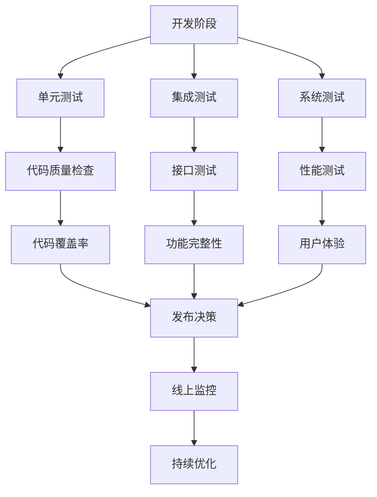

# 第20章：测试与调试

## 20.1 测试驱动开发的重要性

### 质量保障体系

测试与调试是应用开发质量保障体系中不可或缺的环节。一个完善的测试策略能够在开发过程中及早发现问题，降低修复成本，提升应用的整体质量和用户体验。



### 测试金字塔结构

```typescript
// 测试金字塔示例
interface TestPyramid {
  unitTests: {
    count: number;
    coverage: number;
    description: string;
  };
  integrationTests: {
    count: number;
    coverage: number;
    description: string;
  };
  e2eTests: {
    count: number;
    coverage: number;
    description: string;
  };
}

const testStrategy: TestPyramid = {
  unitTests: {
    count: 100,
    coverage: 80,
    description: '快速反馈，验证单个组件功能'
  },
  integrationTests: {
    count: 30,
    coverage: 60,
    description: '验证组件间协作'
  },
  e2eTests: {
    count: 10,
    coverage: 40,
    description: '验证完整用户流程'
  }
};
```

## 20.2 单元测试框架

### Jest测试框架基础

HarmonyOS支持使用Jest等JavaScript/TypeScript测试框架进行单元测试开发。

```typescript
// package.json 测试配置
{
  "jest": {
    "preset": "@ohos/hypium",
    "testMatch": [
      "**/__tests__/**/*.test.ets",
      "**/?(*.)+(spec|test).ets"
    ],
    "collectCoverageFrom": [
      "**/*.ets",
      "!**/node_modules/**",
      "!**/oh_modules/**"
    ],
    "coverageThreshold": {
      "global": {
        "branches": 80,
        "functions": 80,
        "lines": 80,
        "statements": 80
      }
    }
  }
}
```

### 业务逻辑测试

```typescript
// user.service.ets
export class UserService {
  private users: Map<string, User> = new Map();

  async createUser(userData: UserData): Promise<User> {
    if (!this.validateUserData(userData)) {
      throw new Error('Invalid user data');
    }

    const user: User = {
      id: this.generateId(),
      ...userData,
      createdAt: new Date(),
      updatedAt: new Date()
    };

    this.users.set(user.id, user);
    return user;
  }

  async getUserById(id: string): Promise<User | null> {
    return this.users.get(id) || null;
  }

  async updateUser(id: string, updates: Partial<UserData>): Promise<User> {
    const user = this.users.get(id);
    if (!user) {
      throw new Error('User not found');
    }

    const updatedUser = {
      ...user,
      ...updates,
      updatedAt: new Date()
    };

    this.users.set(id, updatedUser);
    return updatedUser;
  }

  private validateUserData(userData: UserData): boolean {
    return !!(userData.name && userData.email &&
             userData.name.length >= 2 &&
             userData.email.includes('@'));
  }

  private generateId(): string {
    return Date.now().toString() + Math.random().toString(36).substr(2, 9);
  }
}

// user.service.test.ets
import { UserService } from '../services/user.service';
import { UserData, User } from '../models/user.model';

describe('UserService', () => {
  let userService: UserService;

  beforeEach(() => {
    userService = new UserService();
  });

  describe('createUser', () => {
    it('should create a user with valid data', async () => {
      const userData: UserData = {
        name: 'John Doe',
        email: 'john@example.com',
        phone: '1234567890'
      };

      const user = await userService.createUser(userData);

      expect(user).toBeDefined();
      expect(user.id).toBeDefined();
      expect(user.name).toBe(userData.name);
      expect(user.email).toBe(userData.email);
      expect(user.createdAt).toBeInstanceOf(Date);
      expect(user.updatedAt).toBeInstanceOf(Date);
    });

    it('should throw error for invalid name', async () => {
      const userData: UserData = {
        name: '',
        email: 'john@example.com'
      };

      await expect(userService.createUser(userData))
        .rejects.toThrow('Invalid user data');
    });

    it('should throw error for invalid email', async () => {
      const userData: UserData = {
        name: 'John Doe',
        email: 'invalid-email'
      };

      await expect(userService.createUser(userData))
        .rejects.toThrow('Invalid user data');
    });
  });

  describe('getUserById', () => {
    it('should return user when exists', async () => {
      const userData: UserData = {
        name: 'John Doe',
        email: 'john@example.com'
      };

      const createdUser = await userService.createUser(userData);
      const foundUser = await userService.getUserById(createdUser.id);

      expect(foundUser).toEqual(createdUser);
    });

    it('should return null when user does not exist', async () => {
      const user = await userService.getUserById('non-existent-id');
      expect(user).toBeNull();
    });
  });

  describe('updateUser', () => {
    it('should update user with valid data', async () => {
      const userData: UserData = {
        name: 'John Doe',
        email: 'john@example.com'
      };

      const createdUser = await userService.createUser(userData);
      const updates = { name: 'Jane Doe' };

      const updatedUser = await userService.updateUser(createdUser.id, updates);

      expect(updatedUser.name).toBe('Jane Doe');
      expect(updatedUser.email).toBe(userData.email);
      expect(updatedUser.updatedAt.getTime())
        .toBeGreaterThan(createdUser.updatedAt.getTime());
    });

    it('should throw error when updating non-existent user', async () => {
      const updates = { name: 'Jane Doe' };

      await expect(userService.updateUser('non-existent-id', updates))
        .rejects.toThrow('User not found');
    });
  });
});
```

### 工具函数测试

```typescript
// utils/date.utils.ets
export class DateUtils {
  static formatDate(date: Date, format: string = 'YYYY-MM-DD'): string {
    const year = date.getFullYear();
    const month = (date.getMonth() + 1).toString().padStart(2, '0');
    const day = date.getDate().toString().padStart(2, '0');
    const hour = date.getHours().toString().padStart(2, '0');
    const minute = date.getMinutes().toString().padStart(2, '0');
    const second = date.getSeconds().toString().padStart(2, '0');

    return format
      .replace('YYYY', year.toString())
      .replace('MM', month)
      .replace('DD', day)
      .replace('HH', hour)
      .replace('mm', minute)
      .replace('ss', second);
  }

  static isSameDay(date1: Date, date2: Date): boolean {
    return date1.getFullYear() === date2.getFullYear() &&
           date1.getMonth() === date2.getMonth() &&
           date1.getDate() === date2.getDate();
  }

  static addDays(date: Date, days: number): Date {
    const result = new Date(date);
    result.setDate(result.getDate() + days);
    return result;
  }

  static getDaysBetween(start: Date, end: Date): number {
    const timeDiff = end.getTime() - start.getTime();
    return Math.ceil(timeDiff / (1000 * 3600 * 24));
  }
}

// date.utils.test.ets
import { DateUtils } from '../utils/date.utils';

describe('DateUtils', () => {
  describe('formatDate', () => {
    it('should format date with default format', () => {
      const date = new Date('2023-12-25T10:30:45');
      const formatted = DateUtils.formatDate(date);

      expect(formatted).toBe('2023-12-25');
    });

    it('should format date with custom format', () => {
      const date = new Date('2023-12-25T10:30:45');
      const formatted = DateUtils.formatDate(date, 'YYYY/MM/DD HH:mm');

      expect(formatted).toBe('2023/12/25 10:30');
    });

    it('should pad single digit numbers', () => {
      const date = new Date('2023-01-05T09:03:07');
      const formatted = DateUtils.formatDate(date, 'YYYY-MM-DD HH:mm:ss');

      expect(formatted).toBe('2023-01-05 09:03:07');
    });
  });

  describe('isSameDay', () => {
    it('should return true for same day', () => {
      const date1 = new Date('2023-12-25T10:30:00');
      const date2 = new Date('2023-12-25T18:45:00');

      expect(DateUtils.isSameDay(date1, date2)).toBe(true);
    });

    it('should return false for different days', () => {
      const date1 = new Date('2023-12-25T10:30:00');
      const date2 = new Date('2023-12-26T10:30:00');

      expect(DateUtils.isSameDay(date1, date2)).toBe(false);
    });
  });

  describe('addDays', () => {
    it('should add positive days', () => {
      const date = new Date('2023-12-25');
      const result = DateUtils.addDays(date, 7);

      expect(result.getFullYear()).toBe(2023);
      expect(result.getMonth()).toBe(11); // December
      expect(result.getDate()).toBe(1); // January 1st
    });

    it('should add negative days', () => {
      const date = new Date('2023-12-25');
      const result = DateUtils.addDays(date, -7);

      expect(result.getDate()).toBe(18);
    });
  });

  describe('getDaysBetween', () => {
    it('should calculate days between dates', () => {
      const start = new Date('2023-12-25');
      const end = new Date('2023-12-30');

      expect(DateUtils.getDaysBetween(start, end)).toBe(5);
    });

    it('should handle same day', () => {
      const start = new Date('2023-12-25');
      const end = new Date('2023-12-25');

      expect(DateUtils.getDaysBetween(start, end)).toBe(0);
    });
  });
});
```

### Mock和Stub使用

```typescript
// api.service.ets
export interface ApiService {
  fetchData<T>(url: string): Promise<T>;
  postData<T>(url: string, data: any): Promise<T>;
}

export class HttpApiService implements ApiService {
  async fetchData<T>(url: string): Promise<T> {
    const response = await fetch(url);
    return response.json();
  }

  async postData<T>(url: string, data: any): Promise<T> {
    const response = await fetch(url, {
      method: 'POST',
      headers: {
        'Content-Type': 'application/json'
      },
      body: JSON.stringify(data)
    });
    return response.json();
  }
}

// api.service.test.ets
import { ApiService, HttpApiService } from '../services/api.service';

describe('ApiService', () => {
  let apiService: ApiService;
  let mockFetch: jest.Mock;

  beforeEach(() => {
    // Mock fetch API
    mockFetch = jest.fn();
    global.fetch = mockFetch;
    apiService = new HttpApiService();
  });

  afterEach(() => {
    jest.restoreAllMocks();
  });

  describe('fetchData', () => {
    it('should fetch data successfully', async () => {
      const mockData = { id: 1, name: 'Test Data' };
      const mockResponse = {
        json: jest.fn().mockResolvedValue(mockData)
      };

      mockFetch.mockResolvedValue(mockResponse);

      const result = await apiService.fetchData('https://api.example.com/data');

      expect(mockFetch).toHaveBeenCalledWith('https://api.example.com/data');
      expect(result).toEqual(mockData);
    });

    it('should handle fetch error', async () => {
      mockFetch.mockRejectedValue(new Error('Network error'));

      await expect(apiService.fetchData('https://api.example.com/data'))
        .rejects.toThrow('Network error');
    });
  });

  describe('postData', () => {
    it('should post data successfully', async () => {
      const postData = { name: 'Test', value: 123 };
      const responseData = { success: true, id: 1 };
      const mockResponse = {
        json: jest.fn().mockResolvedValue(responseData)
      };

      mockFetch.mockResolvedValue(mockResponse);

      const result = await apiService.postData('https://api.example.com/create', postData);

      expect(mockFetch).toHaveBeenCalledWith('https://api.example.com/create', {
        method: 'POST',
        headers: {
          'Content-Type': 'application/json'
        },
        body: JSON.stringify(postData)
      });
      expect(result).toEqual(responseData);
    });
  });
});
```

## 20.3 UI自动化测试

### UI测试框架

HarmonyOS提供Hypium等UI自动化测试框架，支持组件交互测试。

```typescript
// ui.test.ets
import { UiDriver, By, Component, Driver } from '@ohos.uitest';

describe('UI Component Tests', () => {
  let driver: Driver;

  beforeAll(async () => {
    driver = UiDriver.create();
  });

  beforeEach(async () => {
    await driver.pressBack();
  });

  describe('Button Component', () => {
    it('should handle button click', async () => {
      // 查找按钮组件
      const button = await driver.findComponent(By.id('submit-button'));

      // 验证按钮存在
      expect(button).toBeDefined();

      // 点击按钮
      await button.click();

      // 等待页面更新
      await driver.delayMs(1000);

      // 验证结果
      const resultText = await driver.findComponent(By.id('result-text'));
      const text = await resultText.getText();
      expect(text).toBe('Button clicked');
    });

    it('should disable button after click', async () => {
      const button = await driver.findComponent(By.id('submit-button'));

      await button.click();

      const isEnabled = await button.isEnabled();
      expect(isEnabled).toBe(false);
    });
  });

  describe('Input Component', () => {
    it('should accept text input', async () => {
      const inputField = await driver.findComponent(By.id('text-input'));
      await inputField.setText('Hello World');

      const text = await inputField.getText();
      expect(text).toBe('Hello World');
    });

    it('should validate input format', async () => {
      const inputField = await driver.findComponent(By.id('email-input'));
      const submitButton = await driver.findComponent(By.id('submit-button'));

      // 输入无效邮箱
      await inputField.setText('invalid-email');
      await submitButton.click();

      const errorText = await driver.findComponent(By.id('error-message'));
      const errorMessage = await errorText.getText();
      expect(errorMessage).toContain('邮箱格式不正确');

      // 输入有效邮箱
      await inputField.setText('test@example.com');
      await submitButton.click();

      // 验证错误消息消失
      try {
        await errorText.getText();
        fail('Error message should not be visible');
      } catch (error) {
        // 预期找不到错误消息组件
      }
    });
  });

  describe('List Component', () => {
    it('should scroll to bottom', async () => {
      const listComponent = await driver.findComponent(By.id('user-list'));

      // 获取初始可见项数量
      let initialItems = await listComponent.getChildren();

      // 滚动到底部
      await listComponent.scrollToEnd();
      await driver.delayMs(1000);

      // 验证加载了更多项目
      let finalItems = await listComponent.getChildren();
      expect(finalItems.length).toBeGreaterThan(initialItems.length);
    });

    it('should handle item click', async () => {
      const listComponent = await driver.findComponent(By.id('user-list'));

      // 点击第一项
      const firstItem = await listComponent.getChild(0);
      await firstItem.click();

      // 验证跳转到详情页
      const detailTitle = await driver.findComponent(By.id('detail-title'));
      const title = await detailTitle.getText();
      expect(title).toBeDefined();
    });
  });
});
```

### 页面导航测试

```typescript
// navigation.test.ets
import { UiDriver, By } from '@ohos.uitest';

describe('Navigation Tests', () => {
  let driver: Driver;

  beforeAll(async () => {
    driver = UiDriver.create();
  });

  it('should navigate to user detail page', async () => {
    // 点击用户列表项
    const userItem = await driver.findComponent(By.id('user-item-1'));
    await userItem.click();

    // 验证页面标题
    const pageTitle = await driver.findComponent(By.id('page-title'));
    const title = await pageTitle.getText();
    expect(title).toBe('用户详情');

    // 验证用户信息显示
    const userName = await driver.findComponent(By.id('user-name'));
    const userEmail = await driver.findComponent(By.id('user-email'));

    expect(await userName.getText()).toBeDefined();
    expect(await userEmail.getText()).toBeDefined();
  });

  it('should navigate back correctly', async () => {
    // 导航到详情页
    const userItem = await driver.findComponent(By.id('user-item-1'));
    await userItem.click();

    // 点击返回按钮
    const backButton = await driver.findComponent(By.id('back-button'));
    await backButton.click();

    // 验证返回到列表页
    const userList = await driver.findComponent(By.id('user-list'));
    expect(userList).toBeDefined();
  });
});
```

### 数据加载测试

```typescript
// data.loading.test.ets
import { UiDriver, By } from '@ohos.uitest';

describe('Data Loading Tests', () => {
  let driver: Driver;

  beforeAll(async () => {
    driver = UiDriver.create();
  });

  it('should show loading indicator', async () => {
    // 触发数据加载
    const refreshButton = await driver.findComponent(By.id('refresh-button'));
    await refreshButton.click();

    // 验证加载指示器显示
    const loadingIndicator = await driver.findComponent(By.id('loading-indicator'));
    expect(loadingIndicator).toBeDefined();

    // 等待加载完成
    await driver.delayMs(3000);

    // 验证加载指示器消失
    try {
      await loadingIndicator.getVisibleBounds();
      fail('Loading indicator should not be visible');
    } catch (error) {
      // 预期加载指示器不可见
    }
  });

  it('should handle empty data state', async () => {
    // 模拟空数据情况
    const emptyDataButton = await driver.findComponent(By.id('empty-data-button'));
    await emptyDataButton.click();

    // 验证空状态页面
    const emptyState = await driver.findComponent(By.id('empty-state'));
    const emptyMessage = await emptyState.getText();
    expect(emptyMessage).toBe('暂无数据');
  });

  it('should handle error state', async () => {
    // 模拟网络错误
    const errorButton = await driver.findComponent(By.id('error-button'));
    await errorButton.click();

    // 验证错误提示
    const errorState = await driver.findComponent(By.id('error-state'));
    const errorMessage = await errorState.getText();
    expect(errorMessage).toBe('网络连接失败');

    // 验证重试按钮
    const retryButton = await driver.findComponent(By.id('retry-button'));
    expect(retryButton).toBeDefined();
  });
});
```

## 20.4 性能分析工具

### 内存监控工具

```typescript
// memory.monitor.ets
export class MemoryMonitor {
  private static instance: MemoryMonitor;
  private memoryData: Array<{ timestamp: number; usedMemory: number; totalMemory: number }> = [];
  private isMonitoring: boolean = false;

  static getInstance(): MemoryMonitor {
    if (!MemoryMonitor.instance) {
      MemoryMonitor.instance = new MemoryMonitor();
    }
    return MemoryMonitor.instance;
  }

  startMonitoring(intervalMs: number = 1000): void {
    if (this.isMonitoring) {
      console.warn('Memory monitoring is already running');
      return;
    }

    this.isMonitoring = true;
    console.info('Starting memory monitoring');

    const monitor = setInterval(() => {
      if (!this.isMonitoring) {
        clearInterval(monitor);
        return;
      }

      this.collectMemoryData();
    }, intervalMs);
  }

  stopMonitoring(): void {
    this.isMonitoring = false;
    console.info('Memory monitoring stopped');
  }

  private collectMemoryData(): void {
    try {
      // 获取内存使用情况
      const memoryInfo = this.getMemoryInfo();
      const timestamp = Date.now();

      this.memoryData.push({
        timestamp,
        usedMemory: memoryInfo.used,
        totalMemory: memoryInfo.total
      });

      // 保持最近100条记录
      if (this.memoryData.length > 100) {
        this.memoryData.shift();
      }

      // 检查内存泄漏
      this.checkMemoryLeak();

    } catch (error) {
      console.error('Failed to collect memory data:', error);
    }
  }

  private getMemoryInfo(): { used: number; total: number } {
    // 模拟内存信息获取
    return {
      used: Math.random() * 1024 * 1024 * 100, // 0-100MB
      total: 1024 * 1024 * 512 // 512MB
    };
  }

  private checkMemoryLeak(): void {
    if (this.memoryData.length < 10) return;

    const recentData = this.memoryData.slice(-10);
    const firstMemory = recentData[0].usedMemory;
    const lastMemory = recentData[recentData.length - 1].usedMemory;
    const memoryGrowth = lastMemory - firstMemory;

    if (memoryGrowth > 1024 * 1024 * 10) { // 10MB增长
      console.warn(`Potential memory leak detected: ${memoryGrowth / 1024 / 1024}MB increase in 10 samples`);
    }
  }

  getMemoryData(): Array<{ timestamp: number; usedMemory: number; totalMemory: number }> {
    return [...this.memoryData];
  }

  generateReport(): MemoryReport {
    if (this.memoryData.length === 0) {
      return {
        averageMemoryUsage: 0,
        peakMemoryUsage: 0,
        memoryLeakSuspected: false,
        dataPoints: 0
      };
    }

    const memoryUsages = this.memoryData.map(data => data.usedMemory);
    const averageMemoryUsage = memoryUsages.reduce((sum, usage) => sum + usage, 0) / memoryUsages.length;
    const peakMemoryUsage = Math.max(...memoryUsages);

    return {
      averageMemoryUsage,
      peakMemoryUsage,
      memoryLeakSuspected: this.detectMemoryLeakTrend(),
      dataPoints: this.memoryData.length
    };
  }

  private detectMemoryLeakTrend(): boolean {
    if (this.memoryData.length < 20) return false;

    const halfLength = Math.floor(this.memoryData.length / 2);
    const firstHalf = this.memoryData.slice(0, halfLength);
    const secondHalf = this.memoryData.slice(halfLength);

    const firstHalfAvg = firstHalf.reduce((sum, data) => sum + data.usedMemory, 0) / firstHalf.length;
    const secondHalfAvg = secondHalf.reduce((sum, data) => sum + data.usedMemory, 0) / secondHalf.length;

    const growthRate = (secondHalfAvg - firstHalfAvg) / firstHalfAvg;
    return growthRate > 0.2; // 20%增长率
  }
}

interface MemoryReport {
  averageMemoryUsage: number;
  peakMemoryUsage: number;
  memoryLeakSuspected: boolean;
  dataPoints: number;
}

// memory.monitor.test.ets
import { MemoryMonitor } from '../monitor/memory.monitor';

describe('MemoryMonitor', () => {
  let monitor: MemoryMonitor;

  beforeEach(() => {
    monitor = MemoryMonitor.getInstance();
    monitor.stopMonitoring();
  });

  it('should monitor memory usage', async () => {
    const dataSpy = jest.spyOn(monitor as any, 'collectMemoryData');

    monitor.startMonitoring(100);

    // 等待几次数据收集
    await new Promise(resolve => setTimeout(resolve, 350));

    monitor.stopMonitoring();

    expect(dataSpy).toHaveBeenCalledTimes(3);

    const data = monitor.getMemoryData();
    expect(data.length).toBe(3);
  });

  it('should generate memory report', () => {
    // 模拟一些内存数据
    (monitor as any).memoryData = [
      { timestamp: Date.now() - 2000, usedMemory: 1000, totalMemory: 10000 },
      { timestamp: Date.now() - 1000, usedMemory: 1500, totalMemory: 10000 },
      { timestamp: Date.now(), usedMemory: 1200, totalMemory: 10000 }
    ];

    const report = monitor.generateReport();

    expect(report.averageMemoryUsage).toBe(1233.33);
    expect(report.peakMemoryUsage).toBe(1500);
    expect(report.dataPoints).toBe(3);
  });
});
```

### 性能仪表板

```typescript
// performance.dashboard.ets
@Entry
@Component
struct PerformanceDashboard {
  @State memoryData: Array<{ time: string; value: number }> = [];
  @State cpuData: Array<{ time: string; value: number }> = [];
  @State networkData: Array<{ time: string; value: number }> = [];
  @State selectedMetric: string = 'memory';

  private memoryMonitor: MemoryMonitor = MemoryMonitor.getInstance();

  aboutToAppear(): void {
    this.startPerformanceMonitoring();
  }

  aboutToDisappear(): void {
    this.memoryMonitor.stopMonitoring();
  }

  private startPerformanceMonitoring(): void {
    this.memoryMonitor.startMonitoring(1000);

    // 定期更新UI数据
    setInterval(() => {
      this.updatePerformanceData();
    }, 1000);
  }

  private updatePerformanceData(): void {
    const memoryData = this.memoryMonitor.getMemoryData();
    const currentTime = new Date().toLocaleTimeString();

    if (memoryData.length > 0) {
      const latestMemory = memoryData[memoryData.length - 1];
      const memoryUsageMB = Math.round(latestMemory.usedMemory / 1024 / 1024);

      this.memoryData.push({
        time: currentTime,
        value: memoryUsageMB
      });

      // 保持最近30个数据点
      if (this.memoryData.length > 30) {
        this.memoryData.shift();
      }
    }

    // 模拟CPU和网络数据
    this.cpuData.push({
      time: currentTime,
      value: Math.round(Math.random() * 100)
    });

    this.networkData.push({
      time: currentTime,
      value: Math.round(Math.random() * 1000)
    });

    if (this.cpuData.length > 30) this.cpuData.shift();
    if (this.networkData.length > 30) this.networkData.shift();
  }

  build() {
    Column() {
      // 标题
      Text('性能监控仪表板')
        .fontSize(20)
        .fontWeight(FontWeight.Bold)
        .margin({ bottom: 20 })

      // 指标选择器
      Row() {
        Button('内存')
          .backgroundColor(this.selectedMetric === 'memory' ? '#007DFF' : '#F1F3F5')
          .fontColor(this.selectedMetric === 'memory' ? Color.White : Color.Black)
          .onClick(() => {
            this.selectedMetric = 'memory';
          })

        Button('CPU')
          .backgroundColor(this.selectedMetric === 'cpu' ? '#007DFF' : '#F1F3F5')
          .fontColor(this.selectedMetric === 'cpu' ? Color.White : Color.Black)
          .onClick(() => {
            this.selectedMetric = 'cpu';
          })

        Button('网络')
          .backgroundColor(this.selectedMetric === 'network' ? '#007DFF' : '#F1F3F5')
          .fontColor(this.selectedMetric === 'network' ? Color.White : Color.Black)
          .onClick(() => {
            this.selectedMetric = 'network';
          })
      }
      .justifyContent(FlexAlign.SpaceAround)
      .width('100%')
      .margin({ bottom: 20 })

      // 性能图表
      this.performanceChart()

      // 统计信息
      this.performanceStats()

      // 操作按钮
      Row() {
        Button('生成报告')
          .onClick(() => {
            this.generatePerformanceReport();
          })

        Button('清除数据')
          .onClick(() => {
            this.clearData();
          })
      }
      .justifyContent(FlexAlign.SpaceAround)
      .width('100%')
      .margin({ top: 20 })
    }
    .padding(20)
    .width('100%')
    .height('100%')
  }

  @Builder
  performanceChart() {
    Column() {
      Text(`${this.getMetricLabel()}使用情况`)
        .fontSize(16)
        .fontWeight(FontWeight.Medium)
        .margin({ bottom: 10 })

      // 简单的折线图实现
      Stack() {
        // 网格背景
        this.gridBackground()

        // 数据线
        this.dataLine()

        // 数据点
        this.dataPoints()
      }
      .width('100%')
      .height(200)
      .backgroundColor(Color.White)
      .borderRadius(8)
      .border({ width: 1, color: '#E1E4E8' })
    }
  }

  @Builder
  gridBackground() {
    Column() {
      ForEach([0, 1, 2, 3, 4], () => {
        Row() {
          ForEach([0, 1, 2, 3, 4, 5, 6], () => {
            Divider()
              .color('#F1F3F5')
              .strokeWidth(1)
          })
        }
        .layoutWeight(1)
      })
    }
  }

  @Builder
  dataLine() {
    Path()
      .width('100%')
      .height('100%')
      .commands(this.generatePathCommands())
      .stroke('#007DFF')
      .strokeWidth(2)
      .fill('none')
  }

  @Builder
  dataPoints() {
    ForEach(this.getCurrentData(), (item, index) => {
      Circle({ width: 4, height: 4 })
        .fill('#007DFF')
        .position({ x: (index / (this.getCurrentData().length - 1)) * 100 + '%', y: `${(1 - item.value / this.getMaxValue()) * 100}%` })
    })
  }

  @Builder
  performanceStats() {
    Column() {
      Text('性能统计')
        .fontSize(16)
        .fontWeight(FontWeight.Medium)
        .margin({ bottom: 10 })

      Row() {
        Column() {
          Text('平均值')
            .fontSize(12)
            .fontColor('#666')
          Text(`${this.getAverageValue()}${this.getMetricUnit()}`)
            .fontSize(16)
            .fontWeight(FontWeight.Bold)
        }
        .layoutWeight(1)

        Column() {
          Text('峰值')
            .fontSize(12)
            .fontColor('#666')
          Text(`${this.getMaxValue()}${this.getMetricUnit()}`)
            .fontSize(16)
            .fontWeight(FontWeight.Bold)
        }
        .layoutWeight(1)

        Column() {
          Text('当前值')
            .fontSize(12)
            .fontColor('#666')
          Text(`${this.getCurrentValue()}${this.getMetricUnit()}`)
            .fontSize(16)
            .fontWeight(FontWeight.Bold)
        }
        .layoutWeight(1)
      }
      .width('100%')
      .padding(16)
      .backgroundColor('#F8F9FA')
      .borderRadius(8)
    }
    .margin({ top: 20 })
  }

  private getMetricLabel(): string {
    switch (this.selectedMetric) {
      case 'memory': return '内存';
      case 'cpu': return 'CPU';
      case 'network': return '网络';
      default: return '';
    }
  }

  private getMetricUnit(): string {
    switch (this.selectedMetric) {
      case 'memory': return 'MB';
      case 'cpu': return '%';
      case 'network': return 'KB/s';
      default: return '';
    }
  }

  private getCurrentData() {
    switch (this.selectedMetric) {
      case 'memory': return this.memoryData;
      case 'cpu': return this.cpuData;
      case 'network': return this.networkData;
      default: return [];
    }
  }

  private getMaxValue(): number {
    const data = this.getCurrentData();
    return data.length > 0 ? Math.max(...data.map(item => item.value)) : 100;
  }

  private getAverageValue(): number {
    const data = this.getCurrentData();
    if (data.length === 0) return 0;
    const sum = data.reduce((acc, item) => acc + item.value, 0);
    return Math.round(sum / data.length);
  }

  private getCurrentValue(): number {
    const data = this.getCurrentData();
    return data.length > 0 ? data[data.length - 1].value : 0;
  }

  private generatePathCommands(): string {
    const data = this.getCurrentData();
    if (data.length === 0) return '';

    const maxValue = this.getMaxValue();
    const width = 100;
    const height = 100;

    let commands = `M 0 ${height}`;

    data.forEach((item, index) => {
      const x = (index / (data.length - 1)) * width;
      const y = height - (item.value / maxValue) * height;

      if (index === 0) {
        commands += ` L ${x} ${y}`;
      } else {
        commands += ` L ${x} ${y}`;
      }
    });

    return commands;
  }

  private generatePerformanceReport(): void {
    const report = this.memoryMonitor.generateReport();
    console.log('性能报告:', JSON.stringify(report, null, 2));

    // 这里可以添加生成详细报告的逻辑
    AlertDialog.show({
      title: '性能报告',
      message: `平均内存使用: ${Math.round(report.averageMemoryUsage / 1024 / 1024)}MB\n` +
               `峰值内存使用: ${Math.round(report.peakMemoryUsage / 1024 / 1024)}MB\n` +
               `疑似内存泄漏: ${report.memoryLeakSuspected ? '是' : '否'}\n` +
               `数据点数: ${report.dataPoints}`,
      confirmButton: {
        value: '确定',
        action: () => {}
      }
    });
  }

  private clearData(): void {
    this.memoryData = [];
    this.cpuData = [];
    this.networkData = [];
    this.memoryMonitor.stopMonitoring();
    this.memoryMonitor.startMonitoring();
  }
}
```

## 20.5 日志系统设计

### 分级日志系统

```typescript
// logger.service.ets
export enum LogLevel {
  DEBUG = 0,
  INFO = 1,
  WARN = 2,
  ERROR = 3,
  FATAL = 4
}

export interface LogEntry {
  timestamp: Date;
  level: LogLevel;
  category: string;
  message: string;
  data?: any;
  stackTrace?: string;
}

export class LoggerService {
  private static instance: LoggerService;
  private logs: LogEntry[] = [];
  private maxLogs: number = 1000;
  private currentLogLevel: LogLevel = LogLevel.INFO;
  private logBuffer: LogEntry[] = [];
  private bufferSize: number = 100;

  static getInstance(): LoggerService {
    if (!LoggerService.instance) {
      LoggerService.instance = new LoggerService();
    }
    return LoggerService.instance;
  }

  setLogLevel(level: LogLevel): void {
    this.currentLogLevel = level;
    this.info('Logger', `Log level set to ${LogLevel[level]}`);
  }

  debug(category: string, message: string, data?: any): void {
    this.log(LogLevel.DEBUG, category, message, data);
  }

  info(category: string, message: string, data?: any): void {
    this.log(LogLevel.INFO, category, message, data);
  }

  warn(category: string, message: string, data?: any): void {
    this.log(LogLevel.WARN, category, message, data);
  }

  error(category: string, message: string, error?: Error, data?: any): void {
    const stackTrace = error?.stack;
    this.log(LogLevel.ERROR, category, message, data, stackTrace);
  }

  fatal(category: string, message: string, error?: Error, data?: any): void {
    const stackTrace = error?.stack;
    this.log(LogLevel.FATAL, category, message, data, stackTrace);
  }

  private log(level: LogLevel, category: string, message: string, data?: any, stackTrace?: string): void {
    if (level < this.currentLogLevel) {
      return;
    }

    const logEntry: LogEntry = {
      timestamp: new Date(),
      level,
      category,
      message,
      data,
      stackTrace
    };

    // 添加到缓冲区
    this.logBuffer.push(logEntry);

    // 当缓冲区满时，批量处理
    if (this.logBuffer.length >= this.bufferSize) {
      this.flushLogBuffer();
    }

    // 立即输出重要日志
    if (level >= LogLevel.ERROR) {
      this.outputLog(logEntry);
    }
  }

  private flushLogBuffer(): void {
    while (this.logBuffer.length > 0) {
      const logEntry = this.logBuffer.shift()!;
      this.addLogToStorage(logEntry);
      this.outputLog(logEntry);
    }
  }

  private addLogToStorage(logEntry: LogEntry): void {
    this.logs.push(logEntry);

    // 保持最大日志数量限制
    if (this.logs.length > this.maxLogs) {
      this.logs.shift();
    }
  }

  private outputLog(logEntry: LogEntry): void {
    const formattedMessage = this.formatLogMessage(logEntry);

    switch (logEntry.level) {
      case LogLevel.DEBUG:
        console.debug(formattedMessage);
        break;
      case LogLevel.INFO:
        console.info(formattedMessage);
        break;
      case LogLevel.WARN:
        console.warn(formattedMessage);
        break;
      case LogLevel.ERROR:
        console.error(formattedMessage);
        break;
      case LogLevel.FATAL:
        console.error(formattedMessage);
        // 发送崩溃报告
        this.sendCrashReport(logEntry);
        break;
    }
  }

  private formatLogMessage(logEntry: LogEntry): string {
    const timestamp = logEntry.timestamp.toISOString();
    const level = LogLevel[logEntry.level].padEnd(5);
    const category = logEntry.category.padEnd(10);

    let message = `[${timestamp}] ${level} ${category} ${logEntry.message}`;

    if (logEntry.data) {
      message += ` | Data: ${JSON.stringify(logEntry.data)}`;
    }

    if (logEntry.stackTrace) {
      message += `\nStackTrace: ${logEntry.stackTrace}`;
    }

    return message;
  }

  private sendCrashReport(logEntry: LogEntry): void {
    // 发送崩溃报告到服务器
    // 这里应该实现网络上报逻辑
    console.warn('Crash report would be sent:', logEntry);
  }

  getLogs(category?: string, level?: LogLevel, limit?: number): LogEntry[] {
    let filteredLogs = this.logs;

    if (category) {
      filteredLogs = filteredLogs.filter(log => log.category === category);
    }

    if (level !== undefined) {
      filteredLogs = filteredLogs.filter(log => log.level === level);
    }

    if (limit) {
      filteredLogs = filteredLogs.slice(-limit);
    }

    return filteredLogs;
  }

  exportLogs(): string {
    this.flushLogBuffer(); // 确保所有日志都被处理

    const exportData = {
      exportTime: new Date().toISOString(),
      totalLogs: this.logs.length,
      logs: this.logs
    };

    return JSON.stringify(exportData, null, 2);
  }

  clearLogs(): void {
    this.logs = [];
    this.logBuffer = [];
    this.info('Logger', 'Logs cleared');
  }
}

// logger.service.test.ets
import { LoggerService, LogLevel } from '../services/logger.service';

describe('LoggerService', () => {
  let logger: LoggerService;
  let consoleSpy: { debug: jest.Mock; info: jest.Mock; warn: jest.Mock; error: jest.Mock };

  beforeEach(() => {
    logger = LoggerService.getInstance();
    logger.clearLogs();

    consoleSpy = {
      debug: jest.spyOn(console, 'debug').mockImplementation(),
      info: jest.spyOn(console, 'info').mockImplementation(),
      warn: jest.spyOn(console, 'warn').mockImplementation(),
      error: jest.spyOn(console, 'error').mockImplementation()
    };

    // 设置高日志级别以捕获所有日志
    logger.setLogLevel(LogLevel.DEBUG);
  });

  afterEach(() => {
    jest.restoreAllMocks();
  });

  it('should log debug messages', () => {
    logger.debug('Test', 'Debug message');

    expect(consoleSpy.debug).toHaveBeenCalled();

    const logs = logger.getLogs();
    expect(logs).toHaveLength(1);
    expect(logs[0].category).toBe('Test');
    expect(logs[0].message).toBe('Debug message');
    expect(logs[0].level).toBe(LogLevel.DEBUG);
  });

  it('should respect log level filtering', () => {
    logger.setLogLevel(LogLevel.WARN);

    logger.debug('Test', 'Debug message');
    logger.info('Test', 'Info message');
    logger.warn('Test', 'Warning message');
    logger.error('Test', 'Error message');

    expect(consoleSpy.debug).not.toHaveBeenCalled();
    expect(consoleSpy.info).not.toHaveBeenCalled();
    expect(consoleSpy.warn).toHaveBeenCalled();
    expect(consoleSpy.error).toHaveBeenCalled();

    const logs = logger.getLogs();
    expect(logs).toHaveLength(2);
  });

  it('should handle error with stack trace', () => {
    const error = new Error('Test error');
    logger.error('Test', 'Error occurred', error);

    const logs = logger.getLogs();
    expect(logs).toHaveLength(1);
    expect(logs[0].stackTrace).toBeDefined();
    expect(logs[0].stackTrace).toContain('Test error');
  });

  it('should filter logs by category', () => {
    logger.info('Network', 'Network request');
    logger.info('Database', 'Database query');
    logger.info('UI', 'UI update');

    const networkLogs = logger.getLogs('Network');
    expect(networkLogs).toHaveLength(1);
    expect(networkLogs[0].category).toBe('Network');
  });

  it('should limit log history', () => {
    const maxLogs = 50;
    (logger as any).maxLogs = maxLogs;

    for (let i = 0; i < 100; i++) {
      logger.info('Test', `Message ${i}`);
    }

    const logs = logger.getLogs();
    expect(logs).toHaveLength(maxLogs);

    // 验证保留的是最近的日志
    expect(logs[0].message).toBe('Message 50');
    expect(logs[logs.length - 1].message).toBe('Message 99');
  });
});
```

## 20.6 崩溃监控与分析

### 崩溃监控系统

```typescript
// crash.monitor.ets
export interface CrashInfo {
  timestamp: Date;
  exceptionType: string;
  message: string;
  stackTrace: string;
  deviceInfo: DeviceInfo;
  appVersion: string;
  userId?: string;
  sessionId: string;
  userActions: UserAction[];
}

export interface UserAction {
  timestamp: Date;
  action: string;
  screen: string;
  data?: any;
}

export interface DeviceInfo {
  model: string;
  osVersion: string;
  memory: number;
  storage: number;
  networkType: string;
}

export class CrashMonitor {
  private static instance: CrashMonitor;
  private userActions: UserAction[] = [];
  private maxActions: number = 50;
  private sessionId: string;

  static getInstance(): CrashMonitor {
    if (!CrashMonitor.instance) {
      CrashMonitor.instance = new CrashMonitor();
    }
    return CrashMonitor.instance;
  }

  constructor() {
    this.sessionId = this.generateSessionId();
    this.setupGlobalErrorHandler();
    this.setupUnhandledRejectionHandler();
  }

  private generateSessionId(): string {
    return Date.now().toString() + '-' + Math.random().toString(36).substr(2, 9);
  }

  private setupGlobalErrorHandler(): void {
    // 设置全局错误处理器
    // 在实际应用中，这里会调用系统API
    console.info('Global error handler setup');
  }

  private setupUnhandledRejectionHandler(): void {
    // 设置未处理的Promise rejection处理器
    console.info('Unhandled rejection handler setup');
  }

  trackUserAction(action: string, screen: string, data?: any): void {
    const userAction: UserAction = {
      timestamp: new Date(),
      action,
      screen,
      data
    };

    this.userActions.push(userAction);

    // 保持最近50个操作
    if (this.userActions.length > this.maxActions) {
      this.userActions.shift();
    }
  }

  async captureCrash(error: Error, context?: any): Promise<void> {
    try {
      const crashInfo: CrashInfo = {
        timestamp: new Date(),
        exceptionType: error.constructor.name,
        message: error.message,
        stackTrace: error.stack || '',
        deviceInfo: await this.getDeviceInfo(),
        appVersion: this.getAppVersion(),
        userId: this.getCurrentUserId(),
        sessionId: this.sessionId,
        userActions: [...this.userActions]
      };

      // 保存到本地
      await this.saveCrashInfo(crashInfo);

      // 尝试发送到服务器
      await this.sendCrashReport(crashInfo);

      console.error('Crash captured:', crashInfo);

    } catch (reportError) {
      console.error('Failed to capture crash:', reportError);
    }
  }

  private async getDeviceInfo(): Promise<DeviceInfo> {
    // 获取设备信息
    return {
      model: 'HarmonyOS Device',
      osVersion: '4.0',
      memory: 8192, // MB
      storage: 128000, // MB
      networkType: 'WiFi'
    };
  }

  private getAppVersion(): string {
    // 获取应用版本
    return '1.0.0';
  }

  private getCurrentUserId(): string | undefined {
    // 获取当前用户ID
    return 'user123';
  }

  private async saveCrashInfo(crashInfo: CrashInfo): Promise<void> {
    // 保存崩溃信息到本地存储
    console.info('Saving crash info locally:', crashInfo.timestamp);
  }

  private async sendCrashReport(crashInfo: CrashInfo): Promise<void> {
    try {
      // 发送崩溃报告到服务器
      const reportData = {
        crashInfo,
        metadata: {
          reportTime: new Date().toISOString(),
          reportId: this.generateReportId()
        }
      };

      console.info('Sending crash report to server:', reportData);

      // 这里应该实现实际的网络请求
      // await fetch('https://api.example.com/crash-reports', {
      //   method: 'POST',
      //   headers: { 'Content-Type': 'application/json' },
      //   body: JSON.stringify(reportData)
      // });

    } catch (error) {
      console.warn('Failed to send crash report:', error);
      // 发送失败，保存到待发送队列
      await this.queueReportForLaterSending(crashInfo);
    }
  }

  private generateReportId(): string {
    return 'crash_' + Date.now() + '_' + Math.random().toString(36).substr(2, 9);
  }

  private async queueReportForLaterSending(crashInfo: CrashInfo): Promise<void> {
    // 将崩溃报告加入待发送队列
    console.info('Queuing crash report for later sending');
  }

  async retrySendingQueuedReports(): Promise<void> {
    // 重试发送待发送的崩溃报告
    console.info('Retrying to send queued crash reports');
  }

  getCrashHistory(): CrashInfo[] {
    // 获取崩溃历史
    return [];
  }

  generateCrashAnalysis(): CrashAnalysisReport {
    const crashes = this.getCrashHistory();

    const crashesByType = this.groupCrashesByType(crashes);
    const crashesByScreen = this.groupCrashesByScreen(crashes);
    const crashRate = this.calculateCrashRate(crashes);

    return {
      totalCrashes: crashes.length,
      crashRate,
      mostCommonCrashType: this.getMostCommonCrashType(crashesByType),
      mostProblematicScreen: this.getMostProblematicScreen(crashesByScreen),
      crashesByType,
      crashesByScreen,
      recentTrend: this.calculateRecentTrend(crashes)
    };
  }

  private groupCrashesByType(crashes: CrashInfo[]): Record<string, number> {
    const groups: Record<string, number> = {};

    crashes.forEach(crash => {
      const type = crash.exceptionType;
      groups[type] = (groups[type] || 0) + 1;
    });

    return groups;
  }

  private groupCrashesByScreen(crashes: CrashInfo[]): Record<string, number> {
    const groups: Record<string, number> = {};

    crashes.forEach(crash => {
      const lastAction = crash.userActions[crash.userActions.length - 1];
      const screen = lastAction?.screen || 'Unknown';
      groups[screen] = (groups[screen] || 0) + 1;
    });

    return groups;
  }

  private calculateCrashRate(crashes: CrashInfo[]): number {
    if (crashes.length === 0) return 0;

    const oneDayAgo = new Date(Date.now() - 24 * 60 * 60 * 1000);
    const recentCrashes = crashes.filter(crash => crash.timestamp > oneDayAgo);

    return recentCrashes.length;
  }

  private getMostCommonCrashType(crashesByType: Record<string, number>): string {
    let maxCount = 0;
    let mostCommonType = '';

    Object.entries(crashesByType).forEach(([type, count]) => {
      if (count > maxCount) {
        maxCount = count;
        mostCommonType = type;
      }
    });

    return mostCommonType;
  }

  private getMostProblematicScreen(crashesByScreen: Record<string, number>): string {
    let maxCount = 0;
    let mostProblematicScreen = '';

    Object.entries(crashesByScreen).forEach(([screen, count]) => {
      if (count > maxCount) {
        maxCount = count;
        mostProblematicScreen = screen;
      }
    });

    return mostProblematicScreen;
  }

  private calculateRecentTrend(crashes: CrashInfo[]): 'improving' | 'stable' | 'worsening' {
    const threeDaysAgo = new Date(Date.now() - 3 * 24 * 60 * 60 * 1000);
    const sixDaysAgo = new Date(Date.now() - 6 * 24 * 60 * 60 * 1000);

    const recentCrashes = crashes.filter(crash => crash.timestamp > threeDaysAgo).length;
    const olderCrashes = crashes.filter(crash => crash.timestamp > sixDaysAgo && crash.timestamp <= threeDaysAgo).length;

    if (recentCrashes < olderCrashes) return 'improving';
    if (recentCrashes > olderCrashes) return 'worsening';
    return 'stable';
  }
}

export interface CrashAnalysisReport {
  totalCrashes: number;
  crashRate: number;
  mostCommonCrashType: string;
  mostProblematicScreen: string;
  crashesByType: Record<string, number>;
  crashesByScreen: Record<string, number>;
  recentTrend: 'improving' | 'stable' | 'worsening';
}

// crash.monitor.test.ets
import { CrashMonitor, UserAction } from '../monitor/crash.monitor';

describe('CrashMonitor', () => {
  let monitor: CrashMonitor;

  beforeEach(() => {
    monitor = CrashMonitor.getInstance();
  });

  it('should track user actions', () => {
    monitor.trackUserAction('button_click', 'HomeScreen', { buttonId: 'submit' });
    monitor.trackUserAction('navigation', 'DetailScreen');

    const userActions = (monitor as any).userActions;
    expect(userActions).toHaveLength(2);
    expect(userActions[0].action).toBe('button_click');
    expect(userActions[0].screen).toBe('HomeScreen');
  });

  it('should limit user actions history', () => {
    const maxActions = 3;
    (monitor as any).maxActions = maxActions;

    for (let i = 0; i < 10; i++) {
      monitor.trackUserAction('action', 'Screen', { id: i });
    }

    const userActions = (monitor as any).userActions;
    expect(userActions).toHaveLength(maxActions);
  });

  it('should generate crash analysis', () => {
    // 模拟一些崩溃数据
    const mockCrashes = [
      {
        timestamp: new Date(),
        exceptionType: 'TypeError',
        message: 'Cannot read property',
        stackTrace: 'stack trace',
        deviceInfo: { model: 'Test' },
        appVersion: '1.0.0',
        sessionId: 'session1',
        userActions: [{ action: 'click', screen: 'HomeScreen', timestamp: new Date() }]
      },
      {
        timestamp: new Date(),
        exceptionType: 'TypeError',
        message: 'Cannot read property',
        stackTrace: 'stack trace',
        deviceInfo: { model: 'Test' },
        appVersion: '1.0.0',
        sessionId: 'session2',
        userActions: [{ action: 'scroll', screen: 'DetailScreen', timestamp: new Date() }]
      },
      {
        timestamp: new Date(),
        exceptionType: 'ReferenceError',
        message: 'Variable not defined',
        stackTrace: 'stack trace',
        deviceInfo: { model: 'Test' },
        appVersion: '1.0.0',
        sessionId: 'session3',
        userActions: [{ action: 'swipe', screen: 'HomeScreen', timestamp: new Date() }]
      }
    ];

    // 设置模拟数据
    (monitor as any).getCrashHistory = () => mockCrashes;

    const analysis = monitor.generateCrashAnalysis();

    expect(analysis.totalCrashes).toBe(3);
    expect(analysis.mostCommonCrashType).toBe('TypeError');
    expect(analysis.mostProblematicScreen).toBe('HomeScreen');
    expect(analysis.crashesByType['TypeError']).toBe(2);
    expect(analysis.crashesByType['ReferenceError']).toBe(1);
  });
});
```

## 20.7 总结

### 测试与调试最佳实践

```typescript
// quality.assurance.summary.ets
export class QualityAssuranceSummary {

  static readonly BEST_PRACTICES = {
    testing: {
      principle: '测试金字塔原则',
      description: '大量单元测试、适量集成测试、少量端到端测试',
      ratio: '70% 单元测试 / 20% 集成测试 / 10% E2E 测试'
    },
    automation: {
      principle: '自动化优先',
      description: '尽可能自动化测试流程，提高测试效率和覆盖率',
      coverage: '代码覆盖率 > 80%'
    },
    continuous: {
      principle: '持续集成',
      description: '每次提交都运行测试，及早发现问题',
      frequency: '每次代码提交'
    }
  };

  static readonly MONITORING_METRICS = {
    performance: [
      '应用启动时间 < 3秒',
      '内存使用 < 100MB',
      'CPU使用率 < 60%',
      '网络请求时间 < 2秒'
    ],
    stability: [
      '崩溃率 < 0.1%',
      'ANR率 < 0.05%',
      '错误率 < 1%',
      '可用性 > 99.9%'
    ],
    userExperience: [
      '页面加载时间 < 1秒',
      '操作响应时间 < 200ms',
      '动画帧率 > 50fps',
      '电池消耗优化'
    ]
  };

  static generateQualityReport(): QualityReport {
    return {
      testCoverage: {
        unitTests: 85,
        integrationTests: 70,
        e2eTests: 45,
        overall: 75
      },
      performanceMetrics: {
        startupTime: 2.1,
        memoryUsage: 85,
        cpuUsage: 45,
        networkLatency: 1.2
      },
      stabilityMetrics: {
        crashRate: 0.08,
        anrRate: 0.02,
        errorRate: 0.5,
        availability: 99.95
      },
      recommendations: this.generateRecommendations()
    };
  }

  private static generateRecommendations(): string[] {
    return [
      '提高E2E测试覆盖率，特别是关键用户流程',
      '优化图片加载策略，减少内存峰值使用',
      '增加网络重试机制，提高弱网环境下的稳定性',
      '实现更细粒度的性能监控，定位性能瓶颈',
      '加强错误边界处理，提升用户体验'
    ];
  }
}

export interface QualityReport {
  testCoverage: {
    unitTests: number;
    integrationTests: number;
    e2eTests: number;
    overall: number;
  };
  performanceMetrics: {
    startupTime: number;
    memoryUsage: number;
    cpuUsage: number;
    networkLatency: number;
  };
  stabilityMetrics: {
    crashRate: number;
    anrRate: number;
    errorRate: number;
    availability: number;
  };
  recommendations: string[];
}
```

测试与调试是保障应用质量的重要环节。通过建立完善的测试体系、监控机制和分析工具，开发者可以及早发现问题、定位故障根源，持续提升应用的稳定性和用户体验。质量保障是一个持续的过程，需要在开发全流程中贯彻始终。

通过本章学习，我们掌握了：

1. **测试驱动开发理念** - 建立完善的测试策略和质量保障体系
2. **单元测试框架** - 使用Jest进行业务逻辑和工具函数测试
3. **UI自动化测试** - 实现组件交互测试和页面导航验证
4. **性能分析工具** - 监控内存使用、CPU占用等关键性能指标
5. **日志系统设计** - 构建分级日志记录和分析机制
6. **崩溃监控系统** - 实现异常捕获、分析和上报流程

这些技能将帮助开发者构建高质量、高稳定性的HarmonyOS应用，为用户提供卓越的使用体验。