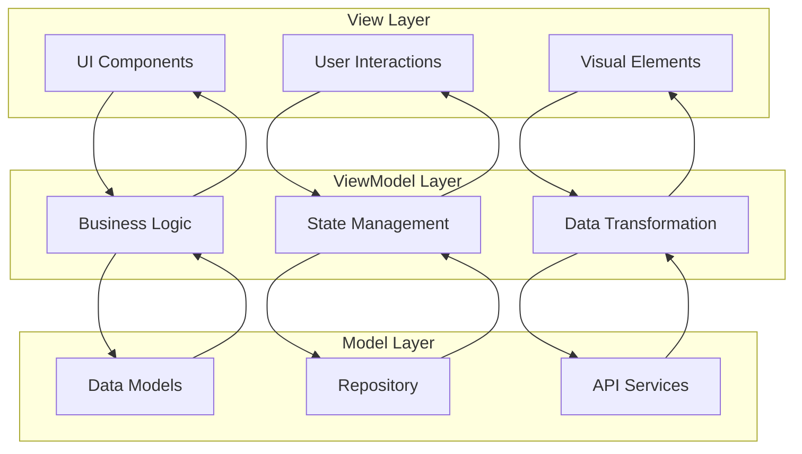

# 第21章：项目架构设计

## 21.1 MVVM架构模式

### 架构设计原则

MVVM（Model-View-ViewModel）架构模式是现代前端开发的重要模式，它将应用程序分为三个主要部分，实现了界面与业务逻辑的彻底分离，提高了代码的可维护性和可测试性。



### 基础架构实现

```typescript
// base.viewmodel.ets
export abstract class BaseViewModel {
  protected _isLoading: boolean = false;
  protected _errorMessage: string = '';
  protected _isRefreshing: boolean = false;

  get isLoading(): boolean {
    return this._isLoading;
  }

  get errorMessage(): string {
    return this._errorMessage;
  }

  get isRefreshing(): boolean {
    return this._isRefreshing;
  }

  protected setLoading(loading: boolean): void {
    this._isLoading = loading;
  }

  protected setErrorMessage(message: string): void {
    this._errorMessage = message;
  }

  protected setRefreshing(refreshing: boolean): void {
    this._isRefreshing = refreshing;
  }

  protected async executeAsync<T>(
    operation: () => Promise<T>,
    onSuccess?: (result: T) => void,
    onError?: (error: Error) => void
  ): Promise<T | null> {
    try {
      this.setLoading(true);
      this.setErrorMessage('');

      const result = await operation();
      onSuccess?.(result);
      return result;

    } catch (error) {
      const errorMessage = error instanceof Error ? error.message : 'Unknown error';
      this.setErrorMessage(errorMessage);
      onError?.(error as Error);
      console.error('Async operation failed:', error);
      return null;
    } finally {
      this.setLoading(false);
    }
  }

  abstract onInit(): void;
  abstract onDestroy(): void;
}

// base.model.ets
export interface BaseModel {
  id: string;
  createdAt: Date;
  updatedAt: Date;
}

export interface PaginatedResponse<T> {
  data: T[];
  total: number;
  page: number;
  pageSize: number;
  hasMore: boolean;
}

export interface ApiResponse<T> {
  success: boolean;
  data?: T;
  message?: string;
  code?: number;
}

// repository.base.ets
export abstract class BaseRepository<T extends BaseModel> {
  protected abstract apiEndpoint: string;

  async findById(id: string): Promise<T | null> {
    const response = await this.get<T>(`${this.apiEndpoint}/${id}`);
    return response.data || null;
  }

  async findAll(params?: any): Promise<PaginatedResponse<T>> {
    const response = await this.get<PaginatedResponse<T>>(this.apiEndpoint, params);
    return response.data || { data: [], total: 0, page: 1, pageSize: 20, hasMore: false };
  }

  async create(data: Partial<T>): Promise<T | null> {
    const response = await this.post<T>(this.apiEndpoint, data);
    return response.data || null;
  }

  async update(id: string, data: Partial<T>): Promise<T | null> {
    const response = await this.put<T>(`${this.apiEndpoint}/${id}`, data);
    return response.data || null;
  }

  async delete(id: string): Promise<boolean> {
    const response = await this.delete_(`${this.apiEndpoint}/${id}`);
    return response.success;
  }

  protected abstract get<T>(url: string, params?: any): Promise<ApiResponse<T>>;
  protected abstract post<T>(url: string, data: any): Promise<ApiResponse<T>>;
  protected abstract put<T>(url: string, data: any): Promise<ApiResponse<T>>;
  protected abstract delete_<T>(url: string): Promise<ApiResponse<T>>;
}
```

### 具体业务实现示例

```typescript
// user.model.ets
export interface User extends BaseModel {
  name: string;
  email: string;
  avatar?: string;
  phone?: string;
  role: UserRole;
  status: UserStatus;
  lastLoginAt?: Date;
}

export enum UserRole {
  ADMIN = 'admin',
  USER = 'user',
  MODERATOR = 'moderator'
}

export enum UserStatus {
  ACTIVE = 'active',
  INACTIVE = 'inactive',
  BANNED = 'banned'
}

// user.repository.ets
export class UserRepository extends BaseRepository<User> {
  protected apiEndpoint = '/users';

  protected async get<T>(url: string, params?: any): Promise<ApiResponse<T>> {
    try {
      const queryString = params ? new URLSearchParams(params).toString() : '';
      const fullUrl = queryString ? `${url}?${queryString}` : url;

      const response = await fetch(`https://api.example.com${fullUrl}`);
      const data = await response.json();

      return {
        success: response.ok,
        data: data.data || data,
        message: data.message,
        code: data.code
      };
    } catch (error) {
      return {
        success: false,
        message: error instanceof Error ? error.message : 'Network error'
      };
    }
  }

  protected async post<T>(url: string, data: any): Promise<ApiResponse<T>> {
    try {
      const response = await fetch(`https://api.example.com${url}`, {
        method: 'POST',
        headers: {
          'Content-Type': 'application/json',
          'Authorization': `Bearer ${this.getAuthToken()}`
        },
        body: JSON.stringify(data)
      });

      const responseData = await response.json();
      return {
        success: response.ok,
        data: responseData.data || responseData,
        message: responseData.message,
        code: responseData.code
      };
    } catch (error) {
      return {
        success: false,
        message: error instanceof Error ? error.message : 'Network error'
      };
    }
  }

  protected async put<T>(url: string, data: any): Promise<ApiResponse<T>> {
    try {
      const response = await fetch(`https://api.example.com${url}`, {
        method: 'PUT',
        headers: {
          'Content-Type': 'application/json',
          'Authorization': `Bearer ${this.getAuthToken()}`
        },
        body: JSON.stringify(data)
      });

      const responseData = await response.json();
      return {
        success: response.ok,
        data: responseData.data || responseData,
        message: responseData.message,
        code: responseData.code
      };
    } catch (error) {
      return {
        success: false,
        message: error instanceof Error ? error.message : 'Network error'
      };
    }
  }

  protected async delete_<T>(url: string): Promise<ApiResponse<T>> {
    try {
      const response = await fetch(`https://api.example.com${url}`, {
        method: 'DELETE',
        headers: {
          'Authorization': `Bearer ${this.getAuthToken()}`
        }
      });

      const responseData = await response.json();
      return {
        success: response.ok,
        data: responseData.data,
        message: responseData.message,
        code: responseData.code
      };
    } catch (error) {
      return {
        success: false,
        message: error instanceof Error ? error.message : 'Network error'
      };
    }
  }

  private getAuthToken(): string {
    // 从存储中获取认证令牌
    return 'mock-jwt-token';
  }

  async findByEmail(email: string): Promise<User | null> {
    const response = await this.get<User>(`${this.apiEndpoint}/by-email/${email}`);
    return response.data || null;
  }

  async updateStatus(id: string, status: UserStatus): Promise<User | null> {
    return this.update(id, { status });
  }
}

// user.viewmodel.ets
export class UserViewModel extends BaseViewModel {
  @State users: User[] = [];
  @State currentUser: User | null = null;
  @State selectedUser: User | null = null;
  @State currentPage: number = 1;
  @State pageSize: number = 20;
  @State hasMore: boolean = true;
  @State searchQuery: string = '';

  private userRepository: UserRepository = new UserRepository();

  onInit(): void {
    this.loadUsers();
  }

  onDestroy(): void {
    // 清理资源
  }

  async loadUsers(refresh: boolean = false): Promise<void> {
    if (refresh) {
      this.currentPage = 1;
      this.hasMore = true;
      this.users = [];
    }

    if (!this.hasMore) return;

    await this.executeAsync(
      async () => {
        const params: any = {
          page: this.currentPage,
          pageSize: this.pageSize
        };

        if (this.searchQuery) {
          params.search = this.searchQuery;
        }

        const response = await this.userRepository.findAll(params);

        if (refresh) {
          this.users = response.data;
        } else {
          this.users = [...this.users, ...response.data];
        }

        this.hasMore = response.hasMore;
        this.currentPage++;
      },
      () => {
        console.info(`Loaded ${this.users.length} users`);
      },
      (error) => {
        console.error('Failed to load users:', error);
      }
    );
  }

  async loadCurrentUser(): Promise<void> {
    await this.executeAsync(
      async () => {
        const userId = 'current-user-id'; // 从认证信息获取
        const user = await this.userRepository.findById(userId);
        this.currentUser = user;
      },
      (user) => {
        console.info('Current user loaded:', user?.name);
      }
    );
  }

  async createUser(userData: Partial<User>): Promise<boolean> {
    const result = await this.executeAsync(
      async () => {
        const user = await this.userRepository.create(userData);
        if (user) {
          this.users = [user, ...this.users];
          return true;
        }
        return false;
      },
      (success) => {
        if (success) {
          console.info('User created successfully');
        }
      }
    );

    return result || false;
  }

  async updateUser(userId: string, userData: Partial<User>): Promise<boolean> {
    const result = await this.executeAsync(
      async () => {
        const user = await this.userRepository.update(userId, userData);
        if (user) {
          this.users = this.users.map(u => u.id === userId ? user : u);
          if (this.currentUser?.id === userId) {
            this.currentUser = user;
          }
          return true;
        }
        return false;
      },
      (success) => {
        if (success) {
          console.info('User updated successfully');
        }
      }
    );

    return result || false;
  }

  async deleteUser(userId: string): Promise<boolean> {
    const result = await this.executeAsync(
      async () => {
        const success = await this.userRepository.delete(userId);
        if (success) {
          this.users = this.users.filter(u => u.id !== userId);
          if (this.selectedUser?.id === userId) {
            this.selectedUser = null;
          }
        }
        return success;
      },
      (success) => {
        if (success) {
          console.info('User deleted successfully');
        }
      }
    );

    return result || false;
  }

  selectUser(user: User): void {
    this.selectedUser = user;
  }

  async searchUsers(query: string): Promise<void> {
    this.searchQuery = query;
    this.loadUsers(true);
  }

  refreshUsers(): void {
    this.loadUsers(true);
  }
}
```

### View层实现

```typescript
// user.list.view.ets
@Entry
@Component
struct UserListView {
  @ObjectLink userViewModel: UserViewModel;

  aboutToAppear(): void {
    this.userViewModel.onInit();
  }

  aboutToDisappear(): void {
    this.userViewModel.onDestroy();
  }

  build() {
    Column() {
      // 标题栏
      this.titleBar()

      // 搜索栏
      this.searchBar()

      // 用户列表
      if (this.userViewModel.isLoading && this.userViewModel.users.length === 0) {
        this.loadingView()
      } else if (this.userViewModel.errorMessage) {
        this.errorView()
      } else {
        this.userList()
      }
    }
    .width('100%')
    .height('100%')
    .backgroundColor('#F5F5F5')
  }

  @Builder
  titleBar() {
    Row() {
      Text('用户管理')
        .fontSize(20)
        .fontWeight(FontWeight.Bold)
        .fontColor('#333333')

      Blank()

      Button('添加用户')
        .fontSize(14)
        .backgroundColor('#007DFF')
        .fontColor(Color.White)
        .onClick(() => {
          // 导航到添加用户页面
        })
    }
    .width('100%')
    .padding(16)
    .backgroundColor(Color.White)
  }

  @Builder
  searchBar() {
    Row() {
      TextInput({ placeholder: '搜索用户...' })
        .width('100%')
        .height(40)
        .backgroundColor('#F8F9FA')
        .borderRadius(20)
        .onChange((value: string) => {
          this.userViewModel.searchUsers(value);
        })
    }
    .width('100%')
    .padding({ left: 16, right: 16, top: 8, bottom: 8 })
  }

  @Builder
  loadingView() {
    Column() {
      LoadingProgress()
        .width(40)
        .height(40)
        .color('#007DFF')

      Text('加载中...')
        .fontSize(14)
        .fontColor('#666666')
        .margin({ top: 8 })
    }
    .width('100%')
    .height('100%')
    .justifyContent(FlexAlign.Center)
  }

  @Builder
  errorView() {
    Column() {
      Text('加载失败')
        .fontSize(16)
        .fontColor('#FF4757')
        .margin({ bottom: 8 })

      Text(this.userViewModel.errorMessage)
        .fontSize(14)
        .fontColor('#666666')
        .margin({ bottom: 16 })

      Button('重试')
        .fontSize(14)
        .backgroundColor('#007DFF')
        .fontColor(Color.White)
        .onClick(() => {
          this.userViewModel.refreshUsers();
        })
    }
    .width('100%')
    .height('100%')
    .justifyContent(FlexAlign.Center)
  }

  @Builder
  userList() {
    List() {
      ForEach(this.userViewModel.users, (user: User) => {
        ListItem() {
          this.userItem(user)
        }
      })

      if (this.userViewModel.hasMore) {
        ListItem() {
          this.loadMoreItem()
        }
      }
    }
    .width('100%')
    .layoutWeight(1)
    .onReachEnd(() => {
      if (this.userViewModel.hasMore && !this.userViewModel.isLoading) {
        this.userViewModel.loadUsers();
      }
    })
  }

  @Builder
  userItem(user: User) {
    Row() {
      // 用户头像
      Image(user.avatar || '/images/default-avatar.png')
        .width(50)
        .height(50)
        .borderRadius(25)
        .margin({ right: 12 })

      // 用户信息
      Column() {
        Text(user.name)
          .fontSize(16)
          .fontWeight(FontWeight.Medium)
          .fontColor('#333333')
          .maxLines(1)
          .textOverflow({ overflow: TextOverflow.Ellipsis })

        Text(user.email)
          .fontSize(14)
          .fontColor('#666666')
          .maxLines(1)
          .textOverflow({ overflow: TextOverflow.Ellipsis })

        Row() {
          Badge({
            value: this.getUserRoleText(user.role),
            position: BadgePosition.Right,
            style: { badgeSize: 12, badgeColor: this.getRoleBadgeColor(user.role) }
          })

          Badge({
            value: this.getUserStatusText(user.status),
            position: BadgePosition.Right,
            style: { badgeSize: 12, badgeColor: this.getStatusBadgeColor(user.status) }
          })
        }
        .margin({ top: 4 })
      }
      .layoutWeight(1)
      .alignItems(HorizontalAlign.Start)

      // 操作按钮
      Row() {
        Button('编辑')
          .fontSize(12)
          .backgroundColor('#F8F9FA')
          .fontColor('#007DFF')
          .margin({ right: 8 })
          .onClick(() => {
            this.userViewModel.selectUser(user);
            // 导航到编辑页面
          })

        Button('删除')
          .fontSize(12)
          .backgroundColor('#FF4757')
          .fontColor(Color.White)
          .onClick(() => {
            this.showDeleteConfirm(user);
          })
      }
    }
    .width('100%')
    .padding(16)
    .backgroundColor(Color.White)
    .borderRadius(8)
    .margin({ left: 16, right: 16, top: 4, bottom: 4 })
    .onClick(() => {
      this.userViewModel.selectUser(user);
      // 导航到详情页面
    })
  }

  @Builder
  loadMoreItem() {
    Row() {
      if (this.userViewModel.isLoading) {
        LoadingProgress()
          .width(20)
          .height(20)
          .color('#007DFF')
          .margin({ right: 8 })

        Text('加载更多...')
          .fontSize(14)
          .fontColor('#666666')
      } else {
        Text('没有更多数据了')
          .fontSize(14)
          .fontColor('#999999')
      }
    }
    .width('100%')
    .height(50)
    .justifyContent(FlexAlign.Center)
  }

  private getUserRoleText(role: UserRole): string {
    switch (role) {
      case UserRole.ADMIN: return '管理员';
      case UserRole.MODERATOR: return '版主';
      case UserRole.USER: return '用户';
      default: return '未知';
    }
  }

  private getUserStatusText(status: UserStatus): string {
    switch (status) {
      case UserStatus.ACTIVE: return '活跃';
      case UserStatus.INACTIVE: return '不活跃';
      case UserStatus.BANNED: return '已封禁';
      default: return '未知';
    }
  }

  private getRoleBadgeColor(role: UserRole): string {
    switch (role) {
      case UserRole.ADMIN: return '#FF4757';
      case UserRole.MODERATOR: return '#FFA502';
      case UserRole.USER: return '#2ED573';
      default: return '#999999';
    }
  }

  private getStatusBadgeColor(status: UserStatus): string {
    switch (status) {
      case UserStatus.ACTIVE: return '#2ED573';
      case UserStatus.INACTIVE: return '#FFA502';
      case UserStatus.BANNED: return '#FF4757';
      default: return '#999999';
    }
  }

  private showDeleteConfirm(user: User): void {
    AlertDialog.show({
      title: '确认删除',
      message: `确定要删除用户 "${user.name}" 吗？`,
      primaryButton: {
        value: '取消',
        action: () => {}
      },
      secondaryButton: {
        value: '删除',
        fontColor: '#FF4757',
        action: () => {
          this.userViewModel.deleteUser(user.id);
        }
      }
    });
  }
}
```

## 21.2 模块化设计原则

### 模块架构设计

```typescript
// module.config.ets
export interface ModuleConfig {
  name: string;
  version: string;
  dependencies: string[];
  routes: RouteConfig[];
  services: ServiceConfig[];
  components: ComponentConfig[];
}

export interface RouteConfig {
  path: string;
  component: string;
  params?: Record<string, any>;
  meta?: RouteMeta;
}

export interface RouteMeta {
  title?: string;
  requireAuth?: boolean;
  roles?: string[];
  keepAlive?: boolean;
}

export interface ServiceConfig {
  name: string;
  singleton: boolean;
  factory: () => any;
}

export interface ComponentConfig {
  name: string;
  path: string;
  global: boolean;
}

// module.registry.ets
export class ModuleRegistry {
  private static instance: ModuleRegistry;
  private modules: Map<string, ModuleConfig> = new Map();
  private services: Map<string, any> = new Map();
  private routes: Map<string, RouteConfig> = new Map();

  static getInstance(): ModuleRegistry {
    if (!ModuleRegistry.instance) {
      ModuleRegistry.instance = new ModuleRegistry();
    }
    return ModuleRegistry.instance;
  }

  registerModule(config: ModuleConfig): void {
    if (this.modules.has(config.name)) {
      throw new Error(`Module ${config.name} already registered`);
    }

    // 检查依赖
    this.checkDependencies(config);

    this.modules.set(config.name, config);

    // 注册路由
    config.routes.forEach(route => {
      this.routes.set(route.path, route);
    });

    // 注册服务
    config.services.forEach(service => {
      this.registerService(service.name, service.factory, service.singleton);
    });

    console.info(`Module ${config.name} registered successfully`);
  }

  private checkDependencies(config: ModuleConfig): void {
    config.dependencies.forEach(dep => {
      if (!this.modules.has(dep)) {
        throw new Error(`Dependency ${dep} not found for module ${config.name}`);
      }
    });
  }

  private registerService(name: string, factory: () => any, singleton: boolean = true): void {
    if (singleton) {
      if (!this.services.has(name)) {
        this.services.set(name, factory());
      }
    } else {
      this.services.set(name, factory);
    }
  }

  getService<T>(name: string): T {
    const service = this.services.get(name);
    if (!service) {
      throw new Error(`Service ${name} not found`);
    }
    return service as T;
  }

  getRoute(path: string): RouteConfig | null {
    return this.routes.get(path) || null;
  }

  getAllRoutes(): RouteConfig[] {
    return Array.from(this.routes.values());
  }

  getModules(): string[] {
    return Array.from(this.modules.keys());
  }
}

// user.module.ets
export const UserModule: ModuleConfig = {
  name: 'UserModule',
  version: '1.0.0',
  dependencies: ['CoreModule'],
  routes: [
    {
      path: '/users',
      component: 'UserListView',
      meta: {
        title: '用户管理',
        requireAuth: true,
        roles: ['admin', 'moderator']
      }
    },
    {
      path: '/users/:id',
      component: 'UserDetailView',
      meta: {
        title: '用户详情',
        requireAuth: true
      }
    },
    {
      path: '/profile',
      component: 'UserProfileView',
      meta: {
        title: '个人资料',
        requireAuth: true
      }
    }
  ],
  services: [
    {
      name: 'UserService',
      singleton: true,
      factory: () => new UserViewModel()
    },
    {
      name: 'UserRepository',
      singleton: true,
      factory: () => new UserRepository()
    }
  ],
  components: [
    {
      name: 'UserAvatar',
      path: '/components/UserAvatar',
      global: true
    },
    {
      name: 'UserBadge',
      path: '/components/UserBadge',
      global: false
    }
  ]
};
```

### 依赖注入系统

```typescript
// di.container.ets
export interface ServiceDescriptor {
  token: string;
  factory: () => any;
  singleton: boolean;
  instance?: any;
}

export class DIContainer {
  private services: Map<string, ServiceDescriptor> = new Map();

  register<T>(
    token: string,
    factory: () => T,
    options: { singleton?: boolean } = {}
  ): void {
    const descriptor: ServiceDescriptor = {
      token,
      factory,
      singleton: options.singleton ?? true
    };

    this.services.set(token, descriptor);
  }

  resolve<T>(token: string): T {
    const descriptor = this.services.get(token);
    if (!descriptor) {
      throw new Error(`Service ${token} not registered`);
    }

    if (descriptor.singleton) {
      if (!descriptor.instance) {
        descriptor.instance = descriptor.factory();
      }
      return descriptor.instance;
    }

    return descriptor.factory();
  }

  registerInstance<T>(token: string, instance: T): void {
    const descriptor: ServiceDescriptor = {
      token,
      factory: () => instance,
      singleton: true,
      instance
    };

    this.services.set(token, descriptor);
  }

  isRegistered(token: string): boolean {
    return this.services.has(token);
  }

  clear(): void {
    this.services.clear();
  }
}

// service.tokens.ets
export const SERVICE_TOKENS = {
  USER_SERVICE: 'UserService',
  USER_REPOSITORY: 'UserRepository',
  AUTH_SERVICE: 'AuthService',
  API_CLIENT: 'ApiClient',
  STORAGE_SERVICE: 'StorageService',
  NOTIFICATION_SERVICE: 'NotificationService'
} as const;

// service.bootstrap.ets
export class ServiceBootstrap {
  private container: DIContainer;

  constructor() {
    this.container = new DIContainer();
  }

  bootstrap(): void {
    this.registerCoreServices();
    this.registerBusinessServices();
    this.registerInfrastructureServices();
  }

  private registerCoreServices(): void {
    // API客户端
    this.container.register(
      SERVICE_TOKENS.API_CLIENT,
      () => new ApiClient(),
      { singleton: true }
    );

    // 存储服务
    this.container.register(
      SERVICE_TOKENS.STORAGE_SERVICE,
      () => new StorageService(),
      { singleton: true }
    );

    // 通知服务
    this.container.register(
      SERVICE_TOKENS.NOTIFICATION_SERVICE,
      () => new NotificationService(),
      { singleton: true }
    );
  }

  private registerBusinessServices(): void {
    // 用户仓储
    this.container.register(
      SERVICE_TOKENS.USER_REPOSITORY,
      () => new UserRepository(this.container.resolve(SERVICE_TOKENS.API_CLIENT)),
      { singleton: true }
    );

    // 用户服务
    this.container.register(
      SERVICE_TOKENS.USER_SERVICE,
      () => new UserViewModel(
        this.container.resolve(SERVICE_TOKENS.USER_REPOSITORY),
        this.container.resolve(SERVICE_TOKENS.NOTIFICATION_SERVICE)
      ),
      { singleton: true }
    );

    // 认证服务
    this.container.register(
      SERVICE_TOKENS.AUTH_SERVICE,
      () => new AuthService(
        this.container.resolve(SERVICE_TOKENS.API_CLIENT),
        this.container.resolve(SERVICE_TOKENS.STORAGE_SERVICE)
      ),
      { singleton: true }
    );
  }

  private registerInfrastructureServices(): void {
    // 可以添加日志服务、监控服务等
  }

  getService<T>(token: string): T {
    return this.container.resolve<T>(token);
  }

  getContainer(): DIContainer {
    return this.container;
  }
}

// api.client.ets
export class ApiClient {
  private baseUrl: string = 'https://api.example.com';
  private authToken: string = '';

  async request<T>(
    method: string,
    endpoint: string,
    data?: any,
    options?: RequestOptions
  ): Promise<ApiResponse<T>> {
    try {
      const url = `${this.baseUrl}${endpoint}`;
      const headers: Record<string, string> = {
        'Content-Type': 'application/json',
        ...options?.headers
      };

      if (this.authToken) {
        headers['Authorization'] = `Bearer ${this.authToken}`;
      }

      const response = await fetch(url, {
        method,
        headers,
        body: data ? JSON.stringify(data) : undefined,
        ...options
      });

      const responseData = await response.json();

      if (!response.ok) {
        throw new Error(responseData.message || `HTTP ${response.status}`);
      }

      return {
        success: true,
        data: responseData.data || responseData,
        message: responseData.message
      };

    } catch (error) {
      return {
        success: false,
        message: error instanceof Error ? error.message : 'Network error'
      };
    }
  }

  async get<T>(endpoint: string, params?: any): Promise<ApiResponse<T>> {
    const queryString = params ? new URLSearchParams(params).toString() : '';
    const url = queryString ? `${endpoint}?${queryString}` : endpoint;
    return this.request<T>('GET', url);
  }

  async post<T>(endpoint: string, data: any): Promise<ApiResponse<T>> {
    return this.request<T>('POST', endpoint, data);
  }

  async put<T>(endpoint: string, data: any): Promise<ApiResponse<T>> {
    return this.request<T>('PUT', endpoint, data);
  }

  async delete<T>(endpoint: string): Promise<ApiResponse<T>> {
    return this.request<T>('DELETE', endpoint);
  }

  setAuthToken(token: string): void {
    this.authToken = token;
  }

  clearAuthToken(): void {
    this.authToken = '';
  }
}

interface RequestOptions {
  headers?: Record<string, string>;
  timeout?: number;
}
```

## 21.3 代码规范与约定

### 命名规范

```typescript
// naming.conventions.ets
/**
 * 文件命名规范：
 * - 组件文件：PascalCase.component.ets (例：UserProfile.component.ets)
 * - 模型文件：PascalCase.model.ets (例：User.model.ets)
 * - 服务文件：PascalCase.service.ets (例：UserService.service.ets)
 * - 工具文件：camelCase.utils.ets (例：dateUtils.utils.ets)
 * - 常量文件：UPPER_CASE.constants.ets (例：API_CONSTANTS.constants.ets)
 *
 * 变量命名规范：
 * - 常量：UPPER_SNAKE_CASE (例：MAX_RETRY_COUNT)
 * - 变量：camelCase (例：userName, isLoading)
 * - 类名：PascalCase (例：UserService, UserProfile)
 * - 接口名：PascalCase (例：IUserData, ApiResponse)
 * - 枚举名：PascalCase (例：UserStatus, UserRole)
 * - 方法名：camelCase (例：getUserById(), validateEmail())
 */

// 示例代码
export const API_CONSTANTS = {
  BASE_URL: 'https://api.example.com',
  MAX_RETRY_COUNT: 3,
  TIMEOUT_DURATION: 10000,
  DEFAULT_PAGE_SIZE: 20
} as const;

export interface IUserProfile {
  id: string;
  userName: string;
  email: string;
  createdAt: Date;
  updatedAt: Date;
}

export enum UserStatus {
  ACTIVE = 'active',
  INACTIVE = 'inactive',
  PENDING = 'pending'
}

export class UserProfileService {
  private readonly userRepository: UserRepository;

  constructor(userRepository: UserRepository) {
    this.userRepository = userRepository;
  }

  async getUserById(userId: string): Promise<IUserProfile | null> {
    try {
      const user = await this.userRepository.findById(userId);
      return user;
    } catch (error) {
      console.error('Failed to get user by ID:', error);
      return null;
    }
  }

  private validateUserEmail(email: string): boolean {
    const emailRegex = /^[^\s@]+@[^\s@]+\.[^\s@]+$/;
    return emailRegex.test(email);
  }
}
```

### 注释规范

```typescript
// documentation.standards.ets
/**
 * 用户服务类
 *
 * 负责处理用户相关的业务逻辑，包括用户注册、登录、信息更新等功能。
 *
 * @example
 * ```typescript
 * const userService = new UserService();
 * const user = await userService.createUser({
 *   name: 'John Doe',
 *   email: 'john@example.com'
 * });
 * ```
 *
 * @since 1.0.0
 * @author Development Team
 */
export class UserService {
  /**
   * 创建新用户
   *
   * @param userData - 用户数据对象
   * @param userData.name - 用户姓名，长度应在2-50个字符之间
   * @param userData.email - 用户邮箱，必须是有效的邮箱格式
   * @param userData.phone - 用户手机号（可选）
   *
   * @returns 返回创建的用户对象，如果创建失败则返回null
   *
   * @throws {ValidationError} 当用户数据验证失败时抛出
   * @throws {NetworkError} 当网络请求失败时抛出
   *
   * @example
   * ```typescript
   * const user = await userService.createUser({
   *   name: 'John Doe',
   *   email: 'john@example.com',
   *   phone: '+1234567890'
   * });
   *
   * if (user) {
   *   console.log('User created:', user.id);
   * }
   * ```
   */
  async createUser(userData: CreateUserData): Promise<User | null> {
    // TODO: 实现用户创建逻辑
    // FIXME: 需要添加输入验证
    return null;
  }

  /**
   * 批量更新用户状态
   *
   * @param userIds - 用户ID数组
   * @param status - 新的用户状态
   * @returns 返回更新成功的用户数量
   *
   * @beta 此功能仍在测试阶段
   */
  async batchUpdateUserStatus(
    userIds: string[],
    status: UserStatus
  ): Promise<number> {
    // 实现批量更新逻辑
    return 0;
  }
}

/**
 * 用户创建数据接口
 */
interface CreateUserData {
  /** 用户姓名 */
  name: string;

  /** 用户邮箱 */
  email: string;

  /** 用户手机号（可选） */
  phone?: string;
}

/**
 * API响应接口
 *
 * @template T 响应数据类型
 */
interface ApiResponse<T> {
  /** 请求是否成功 */
  success: boolean;

  /** 响应数据 */
  data?: T;

  /** 错误消息 */
  message?: string;

  /** 响应代码 */
  code?: number;
}
```

### 代码组织规范

```typescript
// file.structure.ets
/**
 * 文件结构规范
 *
 * 每个文件应该按照以下顺序组织：
 * 1. 文件头部注释
 * 2. Import语句
 * 3. 类型定义
 * 4. 常量定义
 * 5. 类定义
 * 6. 导出语句
 */

// 1. 文件头部注释
/**
 * 用户服务模块
 *
 * 提供用户相关的业务逻辑功能
 *
 * @fileoverview 用户服务实现
 * @version 1.0.0
 * @author Development Team
 * @since 2023-12-01
 */

// 2. Import语句（按字母顺序排列）
import { BaseModel } from './base.model';
import { ApiClient } from './api.client';
import { LoggerService } from './logger.service';

// 3. 类型定义
interface UserCreateRequest {
  name: string;
  email: string;
  phone?: string;
}

interface UserUpdateRequest {
  name?: string;
  email?: string;
  phone?: string;
}

// 4. 常量定义
const USER_CONSTANTS = {
  MIN_NAME_LENGTH: 2,
  MAX_NAME_LENGTH: 50,
  MAX_EMAIL_LENGTH: 100,
  MAX_PHONE_LENGTH: 20
} as const;

// 5. 类定义
export class UserService {
  private readonly apiClient: ApiClient;
  private readonly logger: LoggerService;

  constructor(apiClient: ApiClient, logger: LoggerService) {
    this.apiClient = apiClient;
    this.logger = logger;
  }

  // 公共方法
  public async createUser(request: UserCreateRequest): Promise<User | null> {
    this.validateCreateRequest(request);

    try {
      const response = await this.apiClient.post<User>('/users', request);
      if (response.success && response.data) {
        this.logger.info('User created successfully', { userId: response.data.id });
        return response.data;
      }
      return null;
    } catch (error) {
      this.logger.error('Failed to create user', error);
      return null;
    }
  }

  // 私有方法
  private validateCreateRequest(request: UserCreateRequest): void {
    if (!request.name || request.name.length < USER_CONSTANTS.MIN_NAME_LENGTH) {
      throw new ValidationError('Name is too short');
    }

    if (request.name.length > USER_CONSTANTS.MAX_NAME_LENGTH) {
      throw new ValidationError('Name is too long');
    }

    if (!this.isValidEmail(request.email)) {
      throw new ValidationError('Invalid email format');
    }
  }

  private isValidEmail(email: string): boolean {
    const emailRegex = /^[^\s@]+@[^\s@]+\.[^\s@]+$/;
    return emailRegex.test(email);
  }
}

// 6. 导出语句
export { UserCreateRequest, UserUpdateRequest };
export type { User };
```

## 21.4 版本控制策略

### Git工作流配置

```typescript
// git.workflow.config.ets
export const GIT_WORKFLOW_CONFIG = {
  // 分支命名规范
  branchNaming: {
    main: 'main',
    develop: 'develop',
    feature: 'feature/',
    bugfix: 'bugfix/',
    hotfix: 'hotfix/',
    release: 'release/'
  },

  // 提交消息规范
  commitMessage: {
    types: ['feat', 'fix', 'docs', 'style', 'refactor', 'test', 'chore'],
    scopes: ['user', 'auth', 'api', 'ui', 'performance', 'security'],
    maxSubjectLength: 50,
    maxBodyLineLength: 72
  },

  // 合并策略
  mergeStrategy: {
    feature: 'squash-merge',
    bugfix: 'merge-commit',
    hotfix: 'merge-commit',
    release: 'merge-commit'
  }
} as const;

// commit.message.validator.ets
export class CommitMessageValidator {
  private static readonly PATTERN = /^(\w+)(\(\w+\))?: .{1,50}$/;

  static validate(message: string): ValidationResult {
    const errors: string[] = [];
    const warnings: string[] = [];

    // 检查基本格式
    if (!this.PATTERN.test(message)) {
      errors.push('Commit message should follow the format: type(scope): subject');
    }

    // 检查类型
    const typeMatch = message.match(/^(\w+)/);
    if (typeMatch) {
      const type = typeMatch[1];
      if (!GIT_WORKFLOW_CONFIG.commitMessage.types.includes(type)) {
        warnings.push(`Unknown commit type: ${type}`);
      }
    }

    // 检查主题长度
    const subjectMatch = message.match(/:\s*(.+)/);
    if (subjectMatch) {
      const subject = subjectMatch[1];
      if (subject.length > GIT_WORKFLOW_CONFIG.commitMessage.maxSubjectLength) {
        warnings.push(`Subject is too long (${subject.length} > ${GIT_WORKFLOW_CONFIG.commitMessage.maxSubjectLength})`);
      }
    }

    return {
      isValid: errors.length === 0,
      errors,
      warnings
    };
  }

  static generateTemplate(): string {
    return `feat(scope): add new feature

# Explain what this commit does and why it's necessary
#
# Type should be one of: ${GIT_WORKFLOW_CONFIG.commitMessage.types.join(', ')}
# Scope should be one of: ${GIT_WORKFLOW_CONFIG.commitMessage.scopes.join(', ')}
#
# Examples:
# feat(user): add user registration
# fix(api): resolve login timeout issue
# docs(readme): update installation guide`;
  }
}

interface ValidationResult {
  isValid: boolean;
  errors: string[];
  warnings: string[];
}
```

### 自动化工作流

```typescript
// ci.cd.pipeline.ets
export class CICDPipeline {
  private config: PipelineConfig;

  constructor(config: PipelineConfig) {
    this.config = config;
  }

  async execute(): Promise<PipelineResult> {
    const stages: PipelineStage[] = [
      this.setupEnvironment,
      this.installDependencies,
      this.runLinting,
      this.runTests,
      this.buildApplication,
      this.deployToEnvironment
    ];

    const results: StageResult[] = [];

    for (const stage of stages) {
      const startTime = Date.now();

      try {
        console.info(`Starting stage: ${stage.name}`);
        const result = await stage.execute();
        const duration = Date.now() - startTime;

        results.push({
          name: stage.name,
          status: 'success',
          duration,
          output: result
        });

        console.info(`Stage ${stage.name} completed successfully (${duration}ms)`);

      } catch (error) {
        const duration = Date.now() - startTime;

        results.push({
          name: stage.name,
          status: 'failed',
          duration,
          error: error instanceof Error ? error.message : 'Unknown error'
        });

        console.error(`Stage ${stage.name} failed:`, error);

        // 根据配置决定是否继续
        if (stage.required) {
          break;
        }
      }
    }

    return {
      status: results.every(r => r.status === 'success') ? 'success' : 'failed',
      stages: results,
      totalDuration: results.reduce((sum, r) => sum + r.duration, 0)
    };
  }

  private setupEnvironment: PipelineStage = {
    name: 'Setup Environment',
    required: true,
    execute: async () => {
      // 设置环境变量
      process.env.NODE_ENV = this.config.environment;

      // 验证必要的工具
      await this.validateTools();

      return { message: 'Environment setup completed' };
    }
  };

  private installDependencies: PipelineStage = {
    name: 'Install Dependencies',
    required: true,
    execute: async () => {
      // 执行 npm install 或类似命令
      return { message: 'Dependencies installed' };
    }
  };

  private runLinting: PipelineStage = {
    name: 'Run Linting',
    required: true,
    execute: async () => {
      // 运行代码检查
      const lintResults = await this.runLinter();
      return lintResults;
    }
  };

  private runTests: PipelineStage = {
    name: 'Run Tests',
    required: true,
    execute: async () => {
      // 运行测试套件
      const testResults = await this.runTestSuite();
      return testResults;
    }
  };

  private buildApplication: PipelineStage = {
    name: 'Build Application',
    required: true,
    execute: async () => {
      // 构建应用
      const buildResults = await this.buildApp();
      return buildResults;
    }
  };

  private deployToEnvironment: PipelineStage = {
    name: 'Deploy to Environment',
    required: false,
    execute: async () => {
      if (this.config.skipDeploy) {
        return { message: 'Deployment skipped' };
      }

      // 部署到目标环境
      const deployResults = await this.deploy();
      return deployResults;
    }
  };

  private async validateTools(): Promise<void> {
    const requiredTools = ['node', 'npm', 'git'];

    for (const tool of requiredTools) {
      // 验证工具是否可用
      console.info(`Validating ${tool}...`);
    }
  }

  private async runLinter(): Promise<any> {
    // 实现代码检查逻辑
    return { violations: 0, warnings: 0 };
  }

  private async runTestSuite(): Promise<any> {
    // 实现测试执行逻辑
    return { total: 100, passed: 98, failed: 2 };
  }

  private async buildApp(): Promise<any> {
    // 实现应用构建逻辑
    return { buildTime: 45000, bundleSize: '2.5MB' };
  }

  private async deploy(): Promise<any> {
    // 实现部署逻辑
    return { deployedTo: this.config.environment, version: '1.0.0' };
  }
}

interface PipelineConfig {
  environment: string;
  skipDeploy: boolean;
  buildCommand: string;
  testCommand: string;
  deployCommand?: string;
}

interface PipelineStage {
  name: string;
  required: boolean;
  execute(): Promise<any>;
}

interface StageResult {
  name: string;
  status: 'success' | 'failed' | 'skipped';
  duration: number;
  output?: any;
  error?: string;
}

interface PipelineResult {
  status: 'success' | 'failed';
  stages: StageResult[];
  totalDuration: number;
}
```

## 21.5 CI/CD集成方案

### DevOps配置

```typescript
// devops.config.ets
export const DEVOPS_CONFIG = {
  // 构建环境配置
  build: {
    environments: ['development', 'staging', 'production'],
    nodeVersion: '18.x',
    buildTimeout: 600000, // 10分钟
    cacheStrategy: 'node_modules'
  },

  // 测试配置
  testing: {
    coverageThreshold: 80,
    testTimeout: 300000, // 5分钟
    parallelJobs: 4,
    testTypes: ['unit', 'integration', 'e2e']
  },

  // 部署配置
  deployment: {
    environments: {
      development: {
        url: 'dev.example.com',
        autoDeploy: true
      },
      staging: {
        url: 'staging.example.com',
        autoDeploy: false,
        approvalRequired: true
      },
      production: {
        url: 'example.com',
        autoDeploy: false,
        approvalRequired: true,
        rollbackEnabled: true
      }
    }
  },

  // 监控配置
  monitoring: {
    healthChecks: ['/', '/api/health'],
    performanceMetrics: true,
    errorTracking: true,
    loggingLevel: 'info'
  }
} as const;

// deployment.manager.ets
export class DeploymentManager {
  private config: DeploymentConfig;

  constructor(config: DeploymentConfig) {
    this.config = config;
  }

  async deploy(version: string, environment: string): Promise<DeploymentResult> {
    console.info(`Starting deployment of version ${version} to ${environment}`);

    try {
      // 1. 预部署检查
      await this.preDeploymentChecks(version, environment);

      // 2. 备份当前版本
      const backupResult = await this.backupCurrentVersion(environment);

      // 3. 部署新版本
      const deployResult = await this.deployVersion(version, environment);

      // 4. 健康检查
      await this.healthChecks(environment);

      // 5. 部署后验证
      await this.postDeploymentValidation(environment);

      console.info(`Deployment of version ${version} to ${environment} completed successfully`);

      return {
        status: 'success',
        version,
        environment,
        deployedAt: new Date(),
        backupId: backupResult.backupId,
        deploymentId: deployResult.deploymentId
      };

    } catch (error) {
      console.error(`Deployment failed:`, error);

      // 回滚到备份版本
      await this.rollback(environment);

      return {
        status: 'failed',
        version,
        environment,
        error: error instanceof Error ? error.message : 'Unknown error',
        rolledBack: true
      };
    }
  }

  private async preDeploymentChecks(version: string, environment: string): Promise<void> {
    // 检查环境可用性
    await this.checkEnvironmentAvailability(environment);

    // 检查版本兼容性
    await this.checkVersionCompatibility(version, environment);

    // 检查依赖服务
    await this.checkDependencies(environment);

    console.info('Pre-deployment checks passed');
  }

  private async backupCurrentVersion(environment: string): Promise<BackupResult> {
    const backupId = `backup-${Date.now()}`;

    console.info(`Creating backup ${backupId} for ${environment}`);

    // 实现备份逻辑
    return {
      backupId,
      timestamp: new Date(),
      environment
    };
  }

  private async deployVersion(version: string, environment: string): Promise<DeployResult> {
    const deploymentId = `deploy-${Date.now()}`;

    console.info(`Deploying version ${version} to ${environment} with deployment ID ${deploymentId}`);

    // 实现部署逻辑
    return {
      deploymentId,
      version,
      environment,
      deployedAt: new Date()
    };
  }

  private async healthChecks(environment: string): Promise<void> {
    const healthUrls = DEVOPS_CONFIG.monitoring.healthChecks;

    for (const path of healthUrls) {
      const url = `${this.getEnvironmentUrl(environment)}${path}`;

      try {
        const response = await fetch(url);
        if (!response.ok) {
          throw new Error(`Health check failed for ${url}: ${response.status}`);
        }
        console.info(`Health check passed for ${url}`);
      } catch (error) {
        throw new Error(`Health check failed for ${url}: ${error}`);
      }
    }
  }

  private async postDeploymentValidation(environment: string): Promise<void> {
    // 验证关键功能
    await this.validateCriticalFeatures(environment);

    // 验证性能指标
    await this.validatePerformanceMetrics(environment);

    console.info('Post-deployment validation passed');
  }

  private async rollback(environment: string): Promise<void> {
    console.info(`Rolling back ${environment} to previous version`);

    // 实现回滚逻辑

    console.info(`Rollback of ${environment} completed`);
  }

  private getEnvironmentUrl(environment: string): string {
    const envConfig = DEVOPS_CONFIG.deployment.environments[environment as keyof typeof DEVOPS_CONFIG.deployment.environments];
    return envConfig?.url || '';
  }

  private async checkEnvironmentAvailability(environment: string): Promise<void> {
    // 实现环境可用性检查
  }

  private async checkVersionCompatibility(version: string, environment: string): Promise<void> {
    // 实现版本兼容性检查
  }

  private async checkDependencies(environment: string): Promise<void> {
    // 实现依赖检查
  }

  private async validateCriticalFeatures(environment: string): Promise<void> {
    // 实现关键功能验证
  }

  private async validatePerformanceMetrics(environment: string): Promise<void> {
    // 实现性能指标验证
  }
}

interface DeploymentConfig {
  appName: string;
  notificationChannels: string[];
  rollbackStrategy: 'immediate' | 'manual';
}

interface DeploymentResult {
  status: 'success' | 'failed';
  version: string;
  environment: string;
  deployedAt?: Date;
  backupId?: string;
  deploymentId?: string;
  error?: string;
  rolledBack?: boolean;
}

interface BackupResult {
  backupId: string;
  timestamp: Date;
  environment: string;
}

interface DeployResult {
  deploymentId: string;
  version: string;
  environment: string;
  deployedAt: Date;
}
```

## 21.6 总结

项目架构设计是开发高质量HarmonyOS应用的基础。通过采用MVVM架构模式、模块化设计原则、规范的代码标准、有效的版本控制策略和完善的CI/CD流程，可以构建出可维护、可扩展、高质量的应用程序。

### 核心架构原则

1. **关注点分离** - 通过MVVM模式实现界面、业务逻辑和数据的分离
2. **模块化设计** - 将应用拆分为独立、可复用的模块
3. **依赖注入** - 降低组件间的耦合度，提高代码的可测试性
4. **统一规范** - 建立统一的编码标准和约定，提升团队协作效率
5. **自动化流程** - 通过CI/CD实现构建、测试、部署的自动化

### 最佳实践总结

- **架构先行** - 在开发前进行充分的架构设计和技术选型
- **渐进式开发** - 采用迭代开发方式，持续交付价值
- **质量保障** - 建立完善的测试体系和质量门禁
- **监控反馈** - 实现全生命周期的监控和反馈机制
- **持续改进** - 根据项目发展和团队反馈持续优化架构

这些架构设计理念和实践将为后续的实战项目开发提供坚实的基础，确保项目的高质量和可持续发展。