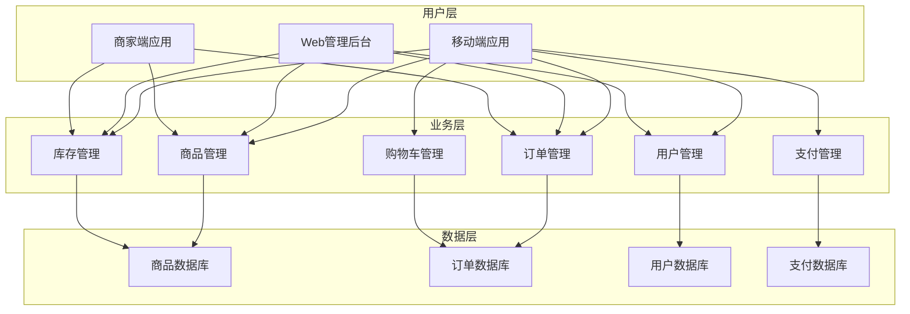

# 第22章：电商应用开发

## 22.1 需求分析与功能设计

### 电商应用功能架构



### 核心数据模型设计

```typescript
// ecommerce.models.ets

// 商品相关模型
export interface Product extends BaseModel {
  name: string;
  description: string;
  price: number;
  originalPrice?: number;
  currency: string;
  category: Category;
  brand?: string;
  images: ProductImage[];
  specifications: ProductSpecification[];
  inventory: InventoryInfo;
  rating: RatingInfo;
  shipping: ShippingInfo;
  status: ProductStatus;
  tags: string[];
  seo?: SEOInfo;
}

export interface ProductImage {
  id: string;
  url: string;
  alt: string;
  order: number;
  isMain: boolean;
}

export interface ProductSpecification {
  name: string;
  value: string;
  type: 'text' | 'number' | 'boolean' | 'select';
  required: boolean;
}

export interface InventoryInfo {
  quantity: number;
  reserved: number;
  available: number;
  lowStockThreshold: number;
  trackInventory: boolean;
}

export interface RatingInfo {
  average: number;
  count: number;
  distribution: Record<number, number>;
}

export interface ShippingInfo {
  weight: number;
  dimensions: {
    length: number;
    width: number;
    height: number;
  };
  freeShipping: boolean;
  shippingCost: number;
}

export enum ProductStatus {
  DRAFT = 'draft',
  ACTIVE = 'active',
  INACTIVE = 'inactive',
  OUT_OF_STOCK = 'out_of_stock',
  DISCONTINUED = 'discontinued'
}

// 分类模型
export interface Category extends BaseModel {
  name: string;
  description: string;
  parentId?: string;
  level: number;
  path: string;
  image?: string;
  isActive: boolean;
  sortOrder: number;
  metadata: CategoryMetadata;
}

export interface CategoryMetadata {
  seoTitle?: string;
  seoDescription?: string;
  featured: boolean;
  displayInMenu: boolean;
}

// 购物车模型
export interface CartItem {
  id: string;
  product: Product;
  quantity: number;
  selected: boolean;
  addedAt: Date;
  customizations?: Record<string, any>;
}

export interface ShoppingCart {
  id: string;
  userId?: string;
  items: CartItem[];
  totals: CartTotals;
  coupon?: Coupon;
  createdAt: Date;
  updatedAt: Date;
}

export interface CartTotals {
  subtotal: number;
  discount: number;
  shipping: number;
  tax: number;
  total: number;
  currency: string;
}

// 订单模型
export interface Order extends BaseModel {
  orderNumber: string;
  userId: string;
  status: OrderStatus;
  items: OrderItem[];
  shippingAddress: Address;
  billingAddress: Address;
  paymentMethod: PaymentMethod;
  totals: OrderTotals;
  timeline: OrderTimeline[];
  tracking?: OrderTracking;
  notes?: string;
}

export interface OrderItem {
  id: string;
  product: Product;
  quantity: number;
  unitPrice: number;
  totalPrice: number;
  customizations?: Record<string, any>;
}

export interface OrderTotals {
  subtotal: number;
  discount: number;
  shipping: number;
  tax: number;
  total: number;
  currency: string;
}

export enum OrderStatus {
  PENDING = 'pending',
  CONFIRMED = 'confirmed',
  PROCESSING = 'processing',
  SHIPPED = 'shipped',
  DELIVERED = 'delivered',
  CANCELLED = 'cancelled',
  REFUNDED = 'refunded'
}

export interface OrderTimeline {
  status: OrderStatus;
  timestamp: Date;
  description: string;
  location?: string;
}

export interface OrderTracking {
  trackingNumber: string;
  carrier: string;
  trackingUrl: string;
  estimatedDelivery: Date;
}

// 地址模型
export interface Address extends BaseModel {
  userId: string;
  type: AddressType;
  name: string;
  phone: string;
  street: string;
  city: string;
  state: string;
  postalCode: string;
  country: string;
  isDefault: boolean;
  coordinates?: {
    latitude: number;
    longitude: number;
  };
}

export enum AddressType {
  SHIPPING = 'shipping',
  BILLING = 'billing'
}

// 支付模型
export interface PaymentMethod extends BaseModel {
  userId: string;
  type: PaymentType;
  provider: PaymentProvider;
  lastFour?: string;
  expiryMonth?: number;
  expiryYear?: number;
  isDefault: boolean;
  metadata: Record<string, any>;
}

export enum PaymentType {
  CREDIT_CARD = 'credit_card',
  DEBIT_CARD = 'debit_card',
  PAYPAL = 'paypal',
  ALIPAY = 'alipay',
  WECHAT_PAY = 'wechat_pay',
  BANK_TRANSFER = 'bank_transfer'
}

export enum PaymentProvider {
  VISA = 'visa',
  MASTERCARD = 'mastercard',
  PAYPAL = 'paypal',
  STRIPE = 'stripe',
  ALIPAY = 'alipay',
  WECHAT = 'wechat'
}

export interface Payment {
  id: string;
  orderId: string;
  amount: number;
  currency: string;
  method: PaymentMethod;
  status: PaymentStatus;
  transactionId?: string;
  gatewayResponse?: any;
  createdAt: Date;
  processedAt?: Date;
}

export enum PaymentStatus {
  PENDING = 'pending',
  PROCESSING = 'processing',
  COMPLETED = 'completed',
  FAILED = 'failed',
  CANCELLED = 'cancelled',
  REFUNDED = 'refunded'
}

// 优惠券模型
export interface Coupon extends BaseModel {
  code: string;
  type: CouponType;
  value: number;
  minimumAmount?: number;
  maximumDiscount?: number;
  usageLimit?: number;
  usageCount: number;
  startDate: Date;
  endDate: Date;
  isActive: boolean;
  applicableProducts?: string[];
  applicableCategories?: string[];
}

export enum CouponType {
  PERCENTAGE = 'percentage',
  FIXED_AMOUNT = 'fixed_amount',
  FREE_SHIPPING = 'free_shipping'
}

// 搜索和筛选模型
export interface SearchRequest {
  query?: string;
  category?: string;
  brand?: string;
  minPrice?: number;
  maxPrice?: number;
  sortBy?: SortOption;
  filters?: SearchFilter[];
  page: number;
  pageSize: number;
}

export interface SearchFilter {
  name: string;
  type: 'range' | 'select' | 'boolean';
  values: any[];
}

export enum SortOption {
  RELEVANCE = 'relevance',
  PRICE_LOW_HIGH = 'price_low_high',
  PRICE_HIGH_LOW = 'price_high_low',
  NEWEST = 'newest',
  RATING_HIGH_LOW = 'rating_high_low',
  BEST_SELLING = 'best_selling'
}

export interface SearchResult {
  products: Product[];
  total: number;
  page: number;
  pageSize: number;
  hasMore: boolean;
  facets: SearchFacet[];
}

export interface SearchFacet {
  name: string;
  type: 'category' | 'brand' | 'price_range' | 'rating';
  options: FacetOption[];
}

export interface FacetOption {
  value: string;
  label: string;
  count: number;
  selected: boolean;
}
```

### 电商应用架构配置

```typescript
// ecommerce.module.config.ets
export const EcommerceModule: ModuleConfig = {
  name: 'EcommerceModule',
  version: '1.0.0',
  dependencies: ['UserModule', 'CoreModule'],
  routes: [
    // 商品相关路由
    {
      path: '/products',
      component: 'ProductListView',
      meta: { title: '商品列表', requireAuth: false }
    },
    {
      path: '/products/:id',
      component: 'ProductDetailView',
      meta: { title: '商品详情', requireAuth: false }
    },
    {
      path: '/categories',
      component: 'CategoryListView',
      meta: { title: '商品分类', requireAuth: false }
    },
    {
      path: '/categories/:id',
      component: 'CategoryProductsView',
      meta: { title: '分类商品', requireAuth: false }
    },
    {
      path: '/search',
      component: 'SearchResultsView',
      meta: { title: '搜索结果', requireAuth: false }
    },

    // 购物车相关路由
    {
      path: '/cart',
      component: 'ShoppingCartView',
      meta: { title: '购物车', requireAuth: true }
    },
    {
      path: '/checkout',
      component: 'CheckoutView',
      meta: { title: '结算', requireAuth: true }
    },

    // 订单相关路由
    {
      path: '/orders',
      component: 'OrderListView',
      meta: { title: '我的订单', requireAuth: true }
    },
    {
      path: '/orders/:id',
      component: 'OrderDetailView',
      meta: { title: '订单详情', requireAuth: true }
    },

    // 支付相关路由
    {
      path: '/payment',
      component: 'PaymentView',
      meta: { title: '支付', requireAuth: true }
    },
    {
      path: '/payment/success',
      component: 'PaymentSuccessView',
      meta: { title: '支付成功', requireAuth: true }
    },
    {
      path: '/payment/failed',
      component: 'PaymentFailedView',
      meta: { title: '支付失败', requireAuth: true }
    },

    // 用户中心相关路由
    {
      path: '/profile',
      component: 'UserProfileView',
      meta: { title: '个人中心', requireAuth: true }
    },
    {
      path: '/addresses',
      component: 'AddressListView',
      meta: { title: '收货地址', requireAuth: true }
    },
    {
      path: '/payment-methods',
      component: 'PaymentMethodsView',
      meta: { title: '支付方式', requireAuth: true }
    }
  ],
  services: [
    {
      name: 'ProductService',
      singleton: true,
      factory: () => new ProductViewModel()
    },
    {
      name: 'CartService',
      singleton: true,
      factory: () => new CartViewModel()
    },
    {
      name: 'OrderService',
      singleton: true,
      factory: () => new OrderViewModel()
    },
    {
      name: 'PaymentService',
      singleton: true,
      factory: () => new PaymentViewModel()
    },
    {
      name: 'SearchService',
      singleton: true,
      factory: () => new SearchViewModel()
    }
  ],
  components: [
    {
      name: 'ProductCard',
      path: '/components/ProductCard',
      global: true
    },
    {
      name: 'CartItem',
      path: '/components/CartItem',
      global: true
    },
    {
      name: 'PriceDisplay',
      path: '/components/PriceDisplay',
      global: true
    },
    {
      name: 'RatingStars',
      path: '/components/RatingStars',
      global: true
    },
    {
      name: 'ProductImageGallery',
      path: '/components/ProductImageGallery',
      global: true
    }
  ]
};
```

## 22.2 首页与商品展示

### 首页ViewModel实现

```typescript
// home.viewmodel.ets
export class HomeViewModel extends BaseViewModel {
  @State featuredProducts: Product[] = [];
  @State newArrivals: Product[] = [];
  @State bestSellers: Product[] = [];
  @State categories: Category[] = [];
  @State banners: Banner[] = [];
  @State promotions: Promotion[] = [];

  private productService: ProductService;
  private categoryService: CategoryService;
  private bannerService: BannerService;

  constructor(
    productService: ProductService,
    categoryService: CategoryService,
    bannerService: BannerService
  ) {
    super();
    this.productService = productService;
    this.categoryService = categoryService;
    this.bannerService = bannerService;
  }

  onInit(): void {
    this.loadHomeData();
  }

  onDestroy(): void {
    // 清理资源
  }

  async loadHomeData(): Promise<void> {
    await Promise.all([
      this.loadBanners(),
      this.loadCategories(),
      this.loadFeaturedProducts(),
      this.loadNewArrivals(),
      this.loadBestSellers(),
      this.loadPromotions()
    ]);
  }

  async loadBanners(): Promise<void> {
    await this.executeAsync(
      async () => {
        const banners = await this.bannerService.getActiveBanners();
        this.banners = banners;
      },
      () => {
        console.info('Banners loaded successfully');
      }
    );
  }

  async loadCategories(): Promise<void> {
    await this.executeAsync(
      async () => {
        const categories = await this.categoryService.getTopCategories();
        this.categories = categories;
      },
      () => {
        console.info('Categories loaded successfully');
      }
    );
  }

  async loadFeaturedProducts(): Promise<void> {
    await this.executeAsync(
      async () => {
        const products = await this.productService.getFeaturedProducts(8);
        this.featuredProducts = products;
      },
      () => {
        console.info('Featured products loaded successfully');
      }
    );
  }

  async loadNewArrivals(): Promise<void> {
    await this.executeAsync(
      async () => {
        const products = await this.productService.getNewArrivals(8);
        this.newArrivals = products;
      },
      () => {
        console.info('New arrivals loaded successfully');
      }
    );
  }

  async loadBestSellers(): Promise<void> {
    await this.executeAsync(
      async () => {
        const products = await this.productService.getBestSellers(8);
        this.bestSellers = products;
      },
      () => {
        console.info('Best sellers loaded successfully');
      }
    );
  }

  async loadPromotions(): Promise<void> {
    await this.executeAsync(
      async () => {
        const promotions = await this.productService.getActivePromotions();
        this.promotions = promotions;
      },
      () => {
        console.info('Promotions loaded successfully');
      }
    );
  }

  async refreshHomeData(): Promise<void> {
    await this.loadHomeData();
  }

  navigateToCategory(categoryId: string): void {
    // 导航到分类页面
    console.info(`Navigate to category: ${categoryId}`);
  }

  navigateToProduct(productId: string): void {
    // 导航到商品详情页面
    console.info(`Navigate to product: ${productId}`);
  }

  navigateToPromotion(promotionId: string): void {
    // 导航到促销页面
    console.info(`Navigate to promotion: ${promotionId}`);
  }
}

// 首页数据模型
export interface Banner {
  id: string;
  title: string;
  subtitle?: string;
  image: string;
  link?: string;
  type: BannerType;
  order: number;
  isActive: boolean;
  startDate: Date;
  endDate: Date;
}

export enum BannerType {
  HERO = 'hero',
  PROMOTION = 'promotion',
  CATEGORY = 'category',
  PRODUCT = 'product'
}

export interface Promotion {
  id: string;
  title: string;
  description: string;
  image: string;
  type: PromotionType;
  discount: number;
  code?: string;
  startDate: Date;
  endDate: Date;
  isActive: boolean;
}

export enum PromotionType {
  PERCENTAGE_OFF = 'percentage_off',
  FIXED_AMOUNT_OFF = 'fixed_amount_off',
  BUY_ONE_GET_ONE = 'buy_one_get_one',
  FREE_SHIPPING = 'free_shipping'
}
```

### 首页UI实现

```typescript
// home.view.ets
@Entry
@Component
struct HomeView {
  @ObjectLink homeViewModel: HomeViewModel;

  private scrollController: ScrollController = new ScrollController();

  aboutToAppear(): void {
    this.homeViewModel.onInit();
  }

  aboutToDisappear(): void {
    this.homeViewModel.onDestroy();
  }

  build() {
    Column() {
      // 状态栏
      this.statusBar()

      // 头部搜索栏
      this.headerSearch()

      // 主内容区域
      Scroll(this.scrollController) {
        Column() {
          // 轮播横幅
          this.bannerCarousel()

          // 分类导航
          this.categoryGrid()

          // 促销活动
          if (this.homeViewModel.promotions.length > 0) {
            this.promotionSection()
          }

          // 精选商品
          this.featuredProductsSection()

          // 新品上市
          this.newArrivalsSection()

          // 热销商品
          this.bestSellersSection()
        }
      }
      .scrollable(ScrollDirection.Vertical)
      .scrollBar(BarState.Off)
      .layoutWeight(1)

      // 底部导航栏
      this.bottomNavigation()
    }
    .width('100%')
    .height('100%')
    .backgroundColor('#F5F5F5')
  }

  @Builder
  statusBar() {
    Row() {
      Text('9:41')
        .fontSize(16)
        .fontColor('#333333')

      Blank()

      Row() {
        Image($r('app.media.signal'))
          .width(16)
          .height(12)
          .margin({ right: 4 })

        Image($r('app.media.wifi'))
          .width(16)
          .height(12)
          .margin({ right: 4 })

        Image($r('app.media.battery'))
          .width(24)
          .height(12)
      }
    }
    .width('100%')
    .padding({ left: 16, right: 16, top: 8, bottom: 8 })
    .backgroundColor(Color.White)
  }

  @Builder
  headerSearch() {
    Row() {
      // Logo
      Image($r('app.media.logo'))
        .width(40)
        .height(40)
        .margin({ right: 12 })

      // 搜索框
      TextInput({ placeholder: '搜索商品、品牌、分类' })
        .width('100%')
        .height(36)
        .backgroundColor('#F8F9FA')
        .borderRadius(18)
        .margin({ right: 12 })
        .onChange((value: string) => {
          // 实时搜索逻辑
        })

      // 扫码按钮
      Button() {
        Image($r('app.media.qr_code'))
          .width(20)
          .height(20)
          .fillColor('#666666')
      }
      .width(36)
      .height(36)
      .backgroundColor(Color.Transparent)
      .borderRadius(18)
    }
    .width('100%')
    .padding({ left: 16, right: 16, top: 8, bottom: 8 })
    .backgroundColor(Color.White)
  }

  @Builder
  bannerCarousel() {
    if (this.homeViewModel.banners.length > 0) {
      Swiper() {
        ForEach(this.homeViewModel.banners, (banner: Banner) => {
          Stack() {
            Image(banner.image)
              .width('100%')
              .height(180)
              .borderRadius(8)
              .objectFit(ImageFit.Cover)

            Column() {
              Text(banner.title)
                .fontSize(20)
                .fontWeight(FontWeight.Bold)
                .fontColor(Color.White)
                .maxLines(1)
                .textOverflow({ overflow: TextOverflow.Ellipsis })

              if (banner.subtitle) {
                Text(banner.subtitle)
                  .fontSize(14)
                  .fontColor(Color.White)
                  .opacity(0.9)
                  .margin({ top: 4 })
              }

              if (banner.link) {
                Button('立即购买')
                  .fontSize(14)
                  .backgroundColor('#007DFF')
                  .fontColor(Color.White)
                  .margin({ top: 12 })
                  .onClick(() => {
                    this.handleBannerClick(banner);
                  })
              }
            }
            .alignItems(HorizontalAlign.Start)
            .padding(16)
            .position({ x: 0, y: 0 })
            .width('100%')
            .height('100%')
            .linearGradient({
              direction: GradientDirection.Bottom,
              colors: [['rgba(0,0,0,0)', 0.0], ['rgba(0,0,0,0.6)', 1.0]]
            })
          }
          .width('100%')
          .height(180)
          .onClick(() => {
            this.handleBannerClick(banner);
          })
        })
      }
      .width('100%')
      .height(180)
      .autoPlay(true)
      .interval(3000)
      .indicator(true)
      .loop(true)
      .margin({ left: 16, right: 16, top: 8, bottom: 8 })
    }
  }

  @Builder
  categoryGrid() {
    Column() {
      Row() {
        Text('商品分类')
          .fontSize(18)
          .fontWeight(FontWeight.Bold)
          .fontColor('#333333')

        Blank()

        Text('查看全部')
          .fontSize(14)
          .fontColor('#007DFF')
          .onClick(() => {
            this.homeViewModel.navigateToCategory('all');
          })
      }
      .width('100%')
      .padding({ left: 16, right: 16, bottom: 12 })

      Grid() {
        ForEach(this.homeViewModel.categories.slice(0, 8), (category: Category) => {
          GridItem() {
            Column() {
              Image(category.image || '/images/default-category.png')
                .width(48)
                .height(48)
                .borderRadius(24)

              Text(category.name)
                .fontSize(12)
                .fontColor('#333333')
                .maxLines(1)
                .textOverflow({ overflow: TextOverflow.Ellipsis })
                .margin({ top: 8 })
            }
            .width('100%')
            .alignItems(HorizontalAlign.Center)
            .onClick(() => {
              this.homeViewModel.navigateToCategory(category.id);
            })
          }
        })
      }
      .columnsTemplate('1fr 1fr 1fr 1fr')
      .rowsGap(16)
      .columnsGap(16)
      .padding({ left: 16, right: 16, bottom: 16 })
    }
    .backgroundColor(Color.White)
    .margin({ top: 8 })
  }

  @Builder
  promotionSection() {
    Column() {
      Row() {
        Text('限时优惠')
          .fontSize(18)
          .fontWeight(FontWeight.Bold)
          .fontColor('#333333')

        Blank()

        Text('更多优惠')
          .fontSize(14)
          .fontColor('#007DFF')
          .onClick(() => {
            // 导航到优惠页面
          })
      }
      .width('100%')
      .padding({ left: 16, right: 16, bottom: 12 })

      Scroll() {
        Row() {
          ForEach(this.homeViewModel.promotions, (promotion: Promotion) => {
            Column() {
              Stack() {
                Image(promotion.image)
                  .width(160)
                  .height(100)
                  .borderRadius(8)
                  .objectFit(ImageFit.Cover)

                Column() {
                  Text(promotion.title)
                    .fontSize(14)
                    .fontWeight(FontWeight.Bold)
                    .fontColor(Color.White)
                    .maxLines(1)
                    .textOverflow({ overflow: TextOverflow.Ellipsis })

                  Text(this.getPromotionDiscountText(promotion))
                    .fontSize(16)
                    .fontColor('#FFE521')
                    .fontWeight(FontWeight.Bold)
                    .margin({ top: 4 })
                }
                .alignItems(HorizontalAlign.Start)
                .padding(8)
                .position({ x: 0, y: 0 })
                .width('100%')
                .height('100%')
                .linearGradient({
                  direction: GradientDirection.Bottom,
                  colors: [['rgba(0,0,0,0)', 0.0], ['rgba(0,0,0,0.7)', 1.0]]
                })
              }
              .margin({ right: 12 })
              .onClick(() => {
                this.homeViewModel.navigateToPromotion(promotion.id);
              })
            }
          })
        }
        .padding({ left: 16, right: 16 })
      }
      .scrollable(ScrollDirection.Horizontal)
      .scrollBar(BarState.Off)
    }
    .backgroundColor(Color.White)
    .margin({ top: 8 })
    .padding({ bottom: 16 })
  }

  @Builder
  featuredProductsSection() {
    Column() {
      Row() {
        Text('精选推荐')
          .fontSize(18)
          .fontWeight(FontWeight.Bold)
          .fontColor('#333333')

        Blank()

        Text('查看更多')
          .fontSize(14)
          .fontColor('#007DFF')
          .onClick(() => {
            // 导航到精选商品页面
          })
      }
      .width('100%')
      .padding({ left: 16, right: 16, bottom: 12 })

      Grid() {
        ForEach(this.homeViewModel.featuredProducts, (product: Product) => {
          GridItem() {
            ProductCard({ product: product })
              .onClick(() => {
                this.homeViewModel.navigateToProduct(product.id);
              })
          }
        })
      }
      .columnsTemplate('1fr 1fr')
      .rowsGap(16)
      .columnsGap(16)
      .padding({ left: 16, right: 16, bottom: 16 })
    }
    .backgroundColor(Color.White)
    .margin({ top: 8 })
  }

  @Builder
  newArrivalsSection() {
    Column() {
      Row() {
        Text('新品上市')
          .fontSize(18)
          .fontWeight(FontWeight.Bold)
          .fontColor('#333333')

        Blank()

        Text('查看更多')
          .fontSize(14)
          .fontColor('#007DFF')
          .onClick(() => {
            // 导航到新品页面
          })
      }
      .width('100%')
      .padding({ left: 16, right: 16, bottom: 12 })

      Scroll() {
        Row() {
          ForEach(this.homeViewModel.newArrivals, (product: Product) => {
            ProductCard({ product: product, width: 160 })
              .margin({ right: 12 })
              .onClick(() => {
                this.homeViewModel.navigateToProduct(product.id);
              })
          })
        }
        .padding({ left: 16, right: 16 })
      }
      .scrollable(ScrollDirection.Horizontal)
      .scrollBar(BarState.Off)
    }
    .backgroundColor(Color.White)
    .margin({ top: 8 })
    .padding({ bottom: 16 })
  }

  @Builder
  bestSellersSection() {
    Column() {
      Row() {
        Text('热销商品')
          .fontSize(18)
          .fontWeight(FontWeight.Bold)
          .fontColor('#333333')

        Blank()

        Text('查看更多')
          .fontSize(14)
          .fontColor('#007DFF')
          .onClick(() => {
            // 导航到热销商品页面
          })
      }
      .width('100%')
      .padding({ left: 16, right: 16, bottom: 12 })

      Grid() {
        ForEach(this.homeViewModel.bestSellers, (product: Product) => {
          GridItem() {
            ProductCard({ product: product })
              .onClick(() => {
                this.homeViewModel.navigateToProduct(product.id);
              })
          }
        })
      }
      .columnsTemplate('1fr 1fr')
      .rowsGap(16)
      .columnsGap(16)
      .padding({ left: 16, right: 16, bottom: 16 })
    }
    .backgroundColor(Color.White)
    .margin({ top: 8 })
  }

  @Builder
  bottomNavigation() {
    Row() {
      Column() {
        Image($r('app.media.home_active'))
          .width(24)
          .height(24)
          .fillColor('#007DFF')

        Text('首页')
          .fontSize(10)
          .fontColor('#007DFF')
          .margin({ top: 4 })
      }
      .layoutWeight(1)
      .justifyContent(FlexAlign.Center)
      .onClick(() => {
        // 当前页面，无需跳转
      })

      Column() {
        Image($r('app.media.category'))
          .width(24)
          .height(24)
          .fillColor('#666666')

        Text('分类')
          .fontSize(10)
          .fontColor('#666666')
          .margin({ top: 4 })
      }
      .layoutWeight(1)
      .justifyContent(FlexAlign.Center)
      .onClick(() => {
        // 导航到分类页面
      })

      Column() {
        Image($r('app.media.cart'))
          .width(24)
          .height(24)
          .fillColor('#666666')

        Text('购物车')
          .fontSize(10)
          .fontColor('#666666')
          .margin({ top: 4 })
      }
      .layoutWeight(1)
      .justifyContent(FlexAlign.Center)
      .onClick(() => {
        // 导航到购物车页面
      })

      Column() {
        Image($r('app.media.profile'))
          .width(24)
          .height(24)
          .fillColor('#666666')

        Text('我的')
          .fontSize(10)
          .fontColor('#666666')
          .margin({ top: 4 })
      }
      .layoutWeight(1)
      .justifyContent(FlexAlign.Center)
      .onClick(() => {
        // 导航到用户中心
      })
    }
    .width('100%')
    .height(60)
    .backgroundColor(Color.White)
    .border({ width: { top: 1 }, color: '#E5E5E5' })
  }

  private handleBannerClick(banner: Banner): void {
    if (banner.link) {
      // 处理横幅点击逻辑
      console.info(`Banner clicked: ${banner.title}, link: ${banner.link}`);
    }
  }

  private getPromotionDiscountText(promotion: Promotion): string {
    switch (promotion.type) {
      case PromotionType.PERCENTAGE_OFF:
        return `${promotion.discount}% OFF`;
      case PromotionType.FIXED_AMOUNT_OFF:
        return `¥${promotion.discount} OFF`;
      case PromotionType.BUY_ONE_GET_ONE:
        return '买一送一';
      case PromotionType.FREE_SHIPPING:
        return '免运费';
      default:
        return '限时优惠';
    }
  }
}
```

### 商品卡片组件

```typescript
// product.card.component.ets
@Component
export struct ProductCard {
  @Prop product: Product;
  @Prop width: number = 0;
  @Prop height: number = 240;
  @Prop showRating: boolean = true;
  @Prop showAddToCart: boolean = true;

  build() {
    Column() {
      // 商品图片
      Stack() {
        Image(this.getMainImage())
          .width(this.width || '100%')
          .height(160)
          .borderRadius({ topLeft: 8, topRight: 8 })
          .objectFit(ImageFit.Cover)

        // 折扣标签
        if (this.hasDiscount()) {
          Text(this.getDiscountText())
            .fontSize(12)
            .fontColor(Color.White)
            .backgroundColor('#FF4757')
            .padding({ left: 8, right: 8, top: 4, bottom: 4 })
            .borderRadius(4)
            .position({ x: 8, y: 8 })
        }

        // 收藏按钮
        Button() {
          Image($r('app.media.favorite'))
            .width(16)
            .height(16)
            .fillColor('#666666')
        }
        .width(32)
        .height(32)
        .backgroundColor('rgba(255,255,255,0.9)')
        .borderRadius(16)
        .position({ x: (this.width || 200) - 40, y: 8 })
        .onClick(() => {
          this.toggleFavorite();
        })
      }

      // 商品信息
      Column() {
        // 商品名称
        Text(this.product.name)
          .fontSize(14)
          .fontColor('#333333')
          .maxLines(2)
          .textOverflow({ overflow: TextOverflow.Ellipsis })
          .width('100%')
          .margin({ top: 8, bottom: 4 })

        // 评分
        if (this.showRating && this.product.rating.count > 0) {
          Row() {
            RatingStars({ rating: this.product.rating.average, size: 12 })
              .margin({ right: 4 })

            Text(`(${this.product.rating.count})`)
              .fontSize(10)
              .fontColor('#999999')
          }
          .width('100%')
          .margin({ bottom: 4 })
        }

        // 价格
        Row() {
          if (this.product.originalPrice && this.product.originalPrice > this.product.price) {
            Text(`¥${this.product.originalPrice}`)
              .fontSize(12)
              .fontColor('#999999')
              .textDecoration({ type: TextDecorationType.LineThrough })
              .margin({ right: 8 })
          }

          Text(`¥${this.product.price}`)
            .fontSize(16)
            .fontColor('#FF4757')
            .fontWeight(FontWeight.Bold)

          Blank()

          // 月销量
          if (this.product.inventory.quantity > 0) {
            Text(`月销 ${this.getMonthlySales()}`)
              .fontSize(10)
              .fontColor('#999999')
          }
        }
        .width('100%')
        .alignItems(VerticalAlign.Bottom)
      }
      .padding(12)
      .layoutWeight(1)

      // 添加购物车按钮
      if (this.showAddToCart && this.isInStock()) {
        Button('加入购物车')
          .fontSize(12)
          .backgroundColor('#007DFF')
          .fontColor(Color.White)
          .width('100%')
          .height(32)
          .margin({ left: 12, right: 12, bottom: 8 })
          .onClick(() => {
            this.addToCart();
          })
      }
    }
    .width(this.width || '100%')
    .height(this.height)
    .backgroundColor(Color.White)
    .borderRadius(8)
  }

  private getMainImage(): string {
    const mainImage = this.product.images.find(img => img.isMain);
    return mainImage?.url || this.product.images[0]?.url || '/images/default-product.png';
  }

  private hasDiscount(): boolean {
    return !!(this.product.originalPrice && this.product.originalPrice > this.product.price);
  }

  private getDiscountText(): string {
    if (!this.hasDiscount()) return '';
    const discount = Math.round((1 - this.product.price / this.product.originalPrice!) * 100);
    return `${discount}% OFF`;
  }

  private getMonthlySales(): string {
    // 模拟月销量数据
    return Math.floor(Math.random() * 1000).toString();
  }

  private isInStock(): boolean {
    return this.product.inventory.available > 0;
  }

  private toggleFavorite(): void {
    // 切换收藏状态
    console.info(`Toggle favorite for product: ${this.product.id}`);
  }

  private addToCart(): void {
    // 添加到购物车
    console.info(`Add to cart: ${this.product.id}`);
  }
}

// 评分星星组件
@Component
export struct RatingStars {
  @Prop rating: number;
  @Prop size: number = 16;
  @Prop color: string = '#FFA502';
  @Prop readonly: boolean = true;

  build() {
    Row() {
      ForEach([1, 2, 3, 4, 5], (star: number) => {
        Image(this.getStarIcon(star))
          .width(this.size)
          .height(this.size)
          .fillColor(this.getStarColor(star))
          .margin({ right: 2 })
          .onClick(() => {
            if (!this.readonly) {
              this.handleStarClick(star);
            }
          })
      })
    }
  }

  private getStarIcon(star: number): Resource {
    if (star <= this.rating) {
      return $r('app.media.star_filled');
    } else if (star - 0.5 <= this.rating) {
      return $r('app.media.star_half');
    } else {
      return $r('app.media.star_empty');
    }
  }

  private getStarColor(star: number): string {
    return star <= this.rating ? this.color : '#E5E5E5';
  }

  private handleStarClick(rating: number): void {
    // 处理评分点击
    console.info(`Rating clicked: ${rating}`);
  }
}
```

## 22.3 购物车与订单系统

### 购物车ViewModel实现

```typescript
// cart.viewmodel.ets
export class CartViewModel extends BaseViewModel {
  @State cart: ShoppingCart | null = null;
  @State selectedItems: CartItem[] = [];
  @State editingItem: CartItem | null = null;

  private cartService: CartService;
  private productService: ProductService;

  constructor(cartService: CartService, productService: ProductService) {
    super();
    this.cartService = cartService;
    this.productService = productService;
  }

  onInit(): void {
    this.loadCart();
  }

  onDestroy(): void {
    // 清理资源
  }

  async loadCart(): Promise<void> {
    await this.executeAsync(
      async () => {
        const cart = await this.cartService.getCurrentCart();
        this.cart = cart;
        this.updateSelectedItems();
      },
      () => {
        console.info('Cart loaded successfully');
      }
    );
  }

  async addToCart(product: Product, quantity: number = 1, customizations?: Record<string, any>): Promise<boolean> {
    const result = await this.executeAsync(
      async () => {
        const cartItem: CartItem = {
          id: this.generateItemId(),
          product,
          quantity,
          selected: true,
          addedAt: new Date(),
          customizations
        };

        const updatedCart = await this.cartService.addToCart(cartItem);
        this.cart = updatedCart;
        this.updateSelectedItems();

        return true;
      },
      (success) => {
        if (success) {
          console.info('Product added to cart successfully');
          this.showAddToCartSuccess(product);
        }
      }
    );

    return result || false;
  }

  async updateItemQuantity(itemId: string, quantity: number): Promise<boolean> {
    if (quantity <= 0) {
      return this.removeFromCart(itemId);
    }

    const result = await this.executeAsync(
      async () => {
        const updatedCart = await this.cartService.updateItemQuantity(itemId, quantity);
        this.cart = updatedCart;
        this.updateSelectedItems();
        return true;
      },
      (success) => {
        if (success) {
          console.info('Item quantity updated successfully');
        }
      }
    );

    return result || false;
  }

  async removeFromCart(itemId: string): Promise<boolean> {
    const result = await this.executeAsync(
      async () => {
        const updatedCart = await this.cartService.removeFromCart(itemId);
        this.cart = updatedCart;
        this.updateSelectedItems();
        return true;
      },
      (success) => {
        if (success) {
          console.info('Item removed from cart successfully');
        }
      }
    );

    return result || false;
  }

  async toggleItemSelection(itemId: string): Promise<void> {
    if (!this.cart) return;

    const updatedItems = this.cart.items.map(item =>
      item.id === itemId ? { ...item, selected: !item.selected } : item
    );

    const updatedCart = { ...this.cart, items: updatedItems };
    this.cart = updatedCart;
    this.updateSelectedItems();

    await this.cartService.updateCart(updatedCart);
  }

  async selectAllItems(selected: boolean): Promise<void> {
    if (!this.cart) return;

    const updatedItems = this.cart.items.map(item => ({ ...item, selected }));
    const updatedCart = { ...this.cart, items: updatedItems };
    this.cart = updatedCart;
    this.updateSelectedItems();

    await this.cartService.updateCart(updatedCart);
  }

  async applyCoupon(code: string): Promise<boolean> {
    const result = await this.executeAsync(
      async () => {
        const updatedCart = await this.cartService.applyCoupon(code);
        this.cart = updatedCart;
        return true;
      },
      (success) => {
        if (success) {
          console.info('Coupon applied successfully');
        }
      }
    );

    return result || false;
  }

  async removeCoupon(): Promise<void> {
    await this.executeAsync(
      async () => {
        const updatedCart = await this.cartService.removeCoupon();
        this.cart = updatedCart;
      },
      () => {
        console.info('Coupon removed successfully');
      }
    );
  }

  async clearCart(): Promise<void> {
    const result = await this.executeAsync(
      async () => {
        await this.cartService.clearCart();
        this.cart = null;
        this.selectedItems = [];
      },
      () => {
        console.info('Cart cleared successfully');
      }
    );
  }

  private updateSelectedItems(): void {
    if (!this.cart) {
      this.selectedItems = [];
      return;
    }

    this.selectedItems = this.cart.items.filter(item => item.selected);
  }

  private generateItemId(): string {
    return Date.now().toString() + Math.random().toString(36).substr(2, 9);
  }

  private showAddToCartSuccess(product: Product): void {
    // 显示添加成功提示
    console.info(`Added "${product.name}" to cart`);
  }

  // Getters
  get cartItemCount(): number {
    return this.cart?.items.length || 0;
  }

  get selectedItemCount(): number {
    return this.selectedItems.length;
  }

  get cartTotal(): number {
    return this.cart?.totals.total || 0;
  }

  get selectedTotal(): number {
    return this.selectedItems.reduce((total, item) => total + (item.product.price * item.quantity), 0);
  }

  get isEmpty(): boolean {
    return !this.cart || this.cart.items.length === 0;
  }

  get hasSelectedItems(): boolean {
    return this.selectedItems.length > 0;
  }
}
```

### 购物车UI实现

```typescript
// shopping.cart.view.ets
@Entry
@Component
struct ShoppingCartView {
  @ObjectLink cartViewModel: CartViewModel;

  aboutToAppear(): void {
    this.cartViewModel.onInit();
  }

  aboutToDisappear(): void {
    this.cartViewModel.onDestroy();
  }

  build() {
    Column() {
      // 头部
      this.header()

      // 购物车内容
      if (this.cartViewModel.isEmpty) {
        this.emptyCartView()
      } else {
        this.cartContentView()
      }
    }
    .width('100%')
    .height('100%')
    .backgroundColor('#F5F5F5')
  }

  @Builder
  header() {
    Row() {
      Button() {
        Image($r('app.media.back'))
          .width(20)
          .height(20)
          .fillColor('#333333')
      }
      .width(32)
      .height(32)
      .backgroundColor(Color.Transparent)
      .onClick(() => {
        // 返回上一页
      })

      Text('购物车')
        .fontSize(18)
        .fontWeight(FontWeight.Bold)
        .fontColor('#333333')
        .margin({ left: 12 })

      Blank()

      Text('管理')
        .fontSize(14)
        .fontColor('#007DFF')
        .onClick(() => {
          // 切换管理模式
        })
    }
    .width('100%')
    .padding({ left: 16, right: 16, top: 8, bottom: 8 })
    .backgroundColor(Color.White)
  }

  @Builder
  emptyCartView() {
    Column() {
      Image($r('app.media.empty_cart'))
        .width(120)
        .height(120)
        .margin({ bottom: 16 })

      Text('购物车还是空的')
        .fontSize(16)
        .fontColor('#333333')
        .margin({ bottom: 8 })

      Text('去挑选一些喜欢的商品吧')
        .fontSize(14)
        .fontColor('#999999')
        .margin({ bottom: 24 })

      Button('去逛逛')
        .fontSize(16)
        .backgroundColor('#007DFF')
        .fontColor(Color.White)
        .width(120)
        .height(40)
        .onClick(() => {
          // 导航到首页或商品列表
        })
    }
    .width('100%')
    .height('100%')
    .justifyContent(FlexAlign.Center)
  }

  @Builder
  cartContentView() {
    Column() {
      // 全选区域
      this.selectAllSection()

      // 购物车商品列表
      this.cartItemsList()

      // 推荐商品
      this.recommendedProducts()

      // 底部结算栏
      this.checkoutBar()
    }
    .layoutWeight(1)
  }

  @Builder
  selectAllSection() {
    Row() {
      Checkbox({ name: 'selectAll', group: 'cartGroup' })
        .select(true)
        .selectedColor('#007DFF')
        .onChange((checked: boolean) => {
          this.cartViewModel.selectAllItems(checked);
        })

      Text('全选')
        .fontSize(14)
        .fontColor('#333333')
        .margin({ left: 8 })

      Blank()

      Text(`共${this.cartViewModel.cartItemCount}件商品`)
        .fontSize(12)
        .fontColor('#999999')
    }
    .width('100%')
    .padding(16)
    .backgroundColor(Color.White)
    .margin({ bottom: 8 })
  }

  @Builder
  cartItemsList() {
    List() {
      ForEach(this.cartViewModel.cart?.items || [], (item: CartItem) => {
        ListItem() {
          CartItemComponent({
            cartItem: item,
            onQuantityChange: (quantity: number) => {
              this.cartViewModel.updateItemQuantity(item.id, quantity);
            },
            onRemove: () => {
              this.showRemoveConfirm(item);
            },
            onSelectChange: (selected: boolean) => {
              this.cartViewModel.toggleItemSelection(item.id);
            }
          })
        }
      })
    }
    .width('100%')
    .layoutWeight(1)
    .backgroundColor(Color.White)
    .padding({ left: 16, right: 16 })
  }

  @Builder
  recommendedProducts() {
    Column() {
      Text('为您推荐')
        .fontSize(16)
        .fontWeight(FontWeight.Bold)
        .fontColor('#333333')
        .margin({ bottom: 12 })

      Scroll() {
        Row() {
          ForEach(this.getRecommendedProducts(), (product: Product) => {
            ProductCard({
              product: product,
              width: 140,
              height: 220,
              showRating: true
            })
              .margin({ right: 12 })
              .onClick(() => {
                // 导航到商品详情
              })
          })
        }
        .padding({ left: 16, right: 16 })
      }
      .scrollable(ScrollDirection.Horizontal)
      .scrollBar(BarState.Off)
    }
    .width('100%')
    .padding({ top: 16, bottom: 16 })
    .backgroundColor(Color.White)
    .margin({ top: 8 })
  }

  @Builder
  checkoutBar() {
    Column() {
      // 优惠码输入
      if (this.cartViewModel.cart?.coupon) {
        Row() {
          Image($r('app.media.coupon'))
            .width(16)
            .height(16)
            .fillColor('#FFA502')
            .margin({ right: 4 })

          Text(this.cartViewModel.cart.coupon.code)
            .fontSize(12)
            .fontColor('#666666')

          Text(`-¥${this.cartViewModel.cart.totals.discount}`)
            .fontSize(12)
            .fontColor('#FF4757')
            .margin({ left: 8 })

          Blank()

          Text('删除')
            .fontSize(12)
            .fontColor('#999999')
            .onClick(() => {
              this.cartViewModel.removeCoupon();
            })
        }
        .width('100%')
        .padding({ left: 16, right: 16, top: 8, bottom: 8 })
        .backgroundColor('#FFF9E6')
      }

      Row() {
        Column() {
          Row() {
            Text(`已选${this.cartViewModel.selectedItemCount}件`)
              .fontSize(12)
              .fontColor('#666666')

            Blank()

            Text(`合计：`)
              .fontSize(14)
              .fontColor('#333333')

            Text(`¥${this.cartViewModel.selectedTotal.toFixed(2)}`)
              .fontSize(18)
              .fontColor('#FF4757')
              .fontWeight(FontWeight.Bold)
          }
          .width('100%')
          .alignItems(VerticalAlign.Center)

          if (this.cartViewModel.selectedTotal >= 99) {
            Text('满99元免运费')
              .fontSize(10)
              .fontColor('#2ED573')
              .margin({ top: 2 })
          }
        }
        .layoutWeight(1)
        .alignItems(HorizontalAlign.Start)

        Button('结算')
          .fontSize(16)
          .backgroundColor(this.cartViewModel.hasSelectedItems ? '#FF4757' : '#CCCCCC')
          .fontColor(Color.White)
          .width(80)
          .height(44)
          .borderRadius(22)
          .enabled(this.cartViewModel.hasSelectedItems)
          .onClick(() => {
            if (this.cartViewModel.hasSelectedItems) {
              this.proceedToCheckout();
            }
          })
      }
      .width('100%')
      .padding({ left: 16, right: 16, top: 12, bottom: 12 })
      .backgroundColor(Color.White)
      .border({ width: { top: 1 }, color: '#E5E5E5' })
    }
  }

  private showRemoveConfirm(item: CartItem): void {
    AlertDialog.show({
      title: '确认删除',
      message: `确定要从购物车中删除"${item.product.name}"吗？`,
      primaryButton: {
        value: '取消',
        action: () => {}
      },
      secondaryButton: {
        value: '删除',
        fontColor: '#FF4757',
        action: () => {
          this.cartViewModel.removeFromCart(item.id);
        }
      }
    });
  }

  private proceedToCheckout(): void {
    // 导航到结算页面
    console.info('Proceeding to checkout');
  }

  private getRecommendedProducts(): Product[] {
    // 模拟推荐商品数据
    return [];
  }
}

// 购物车商品组件
@Component
export struct CartItemComponent {
  @Prop cartItem: CartItem;
  @Prop onQuantityChange: (quantity: number) => void;
  @Prop onRemove: () => void;
  @Prop onSelectChange: (selected: boolean) => void;

  build() {
    Row() {
      // 选择框
      Checkbox({
        name: `item_${this.cartItem.id}`,
        group: 'cartGroup'
      })
        .select(this.cartItem.selected)
        .selectedColor('#007DFF')
        .onChange((checked: boolean) => {
          this.onSelectChange(checked);
        })

      // 商品图片
      Image(this.getMainImage())
        .width(80)
        .height(80)
        .borderRadius(4)
        .margin({ left: 12, right: 12 })
        .objectFit(ImageFit.Cover)

      // 商品信息
      Column() {
        Text(this.cartItem.product.name)
          .fontSize(14)
          .fontColor('#333333')
          .maxLines(2)
          .textOverflow({ overflow: TextOverflow.Ellipsis })
          .width('100%')
          .margin({ bottom: 8 })

        Row() {
          Text(`¥${this.cartItem.product.price}`)
            .fontSize(16)
            .fontColor('#FF4757')
            .fontWeight(FontWeight.Bold)

          if (this.cartItem.product.originalPrice && this.cartItem.product.originalPrice > this.cartItem.product.price) {
            Text(`¥${this.cartItem.product.originalPrice}`)
              .fontSize(12)
              .fontColor('#999999')
              .textDecoration({ type: TextDecorationType.LineThrough })
              .margin({ left: 8 })
          }

          Blank()

          // 数量控制
          Row() {
            Button('-')
              .fontSize(14)
              .fontColor(this.cartItem.quantity > 1 ? '#333333' : '#CCCCCC')
              .width(24)
              .height(24)
              .backgroundColor('#F8F9FA')
              .enabled(this.cartItem.quantity > 1)
              .onClick(() => {
                if (this.cartItem.quantity > 1) {
                  this.onQuantityChange(this.cartItem.quantity - 1);
                }
              })

            Text(this.cartItem.quantity.toString())
              .fontSize(14)
              .fontColor('#333333')
              .width(32)
              .textAlign(TextAlign.Center)

            Button('+')
              .fontSize(14)
              .fontColor('#333333')
              .width(24)
              .height(24)
              .backgroundColor('#F8F9FA')
              .onClick(() => {
                this.onQuantityChange(this.cartItem.quantity + 1);
              })
          }
          .borderRadius(4)
          .border({ width: 1, color: '#E5E5E5' })
        }
        .width('100%')
        .alignItems(VerticalAlign.Center)
      }
      .layoutWeight(1)
      .alignItems(HorizontalAlign.Start)

      // 删除按钮
      Button() {
        Image($r('app.media.delete'))
          .width(16)
          .height(16)
          .fillColor('#999999')
      }
      .width(32)
      .height(32)
      .backgroundColor(Color.Transparent)
      .onClick(() => {
        this.onRemove();
      })
    }
    .width('100%')
    .padding(16)
    .backgroundColor(Color.White)
    .borderRadius(8)
    .margin({ bottom: 8 })
  }

  private getMainImage(): string {
    const mainImage = this.cartItem.product.images.find(img => img.isMain);
    return mainImage?.url || this.cartItem.product.images[0]?.url || '/images/default-product.png';
  }
}
```

## 22.4 支付集成实现

### 支付ViewModel实现

```typescript
// payment.viewmodel.ets
export class PaymentViewModel extends BaseViewModel {
  @State order: Order | null = null;
  @State paymentMethods: PaymentMethod[] = [];
  @State selectedPaymentMethod: PaymentMethod | null = null;
  @State paymentState: PaymentState = PaymentState.SELECT_METHOD;
  @State paymentResult: PaymentResult | null = null;

  private paymentService: PaymentService;
  private orderService: OrderService;

  constructor(paymentService: PaymentService, orderService: OrderService) {
    super();
    this.paymentService = paymentService;
    this.orderService = orderService;
  }

  onInit(): void {
    this.loadPaymentData();
  }

  onDestroy(): void {
    // 清理资源
  }

  async initializePayment(orderId: string): Promise<void> {
    await this.executeAsync(
      async () => {
        // 加载订单信息
        const order = await this.orderService.getOrderById(orderId);
        this.order = order;

        // 加载支付方式
        const paymentMethods = await this.paymentService.getUserPaymentMethods();
        this.paymentMethods = paymentMethods;

        // 设置默认支付方式
        if (paymentMethods.length > 0) {
          const defaultMethod = paymentMethods.find(method => method.isDefault) || paymentMethods[0];
          this.selectedPaymentMethod = defaultMethod;
        }
      },
      () => {
        console.info('Payment initialized successfully');
      }
    );
  }

  async selectPaymentMethod(paymentMethod: PaymentMethod): Promise<void> {
    this.selectedPaymentMethod = paymentMethod;
  }

  async addNewPaymentMethod(paymentData: NewPaymentMethodData): Promise<PaymentMethod | null> {
    const result = await this.executeAsync(
      async () => {
        const paymentMethod = await this.paymentService.addPaymentMethod(paymentData);
        this.paymentMethods.push(paymentMethod);

        // 如果是第一个支付方式，设为默认
        if (this.paymentMethods.length === 1) {
          this.selectedPaymentMethod = paymentMethod;
        }

        return paymentMethod;
      },
      (paymentMethod) => {
        console.info('Payment method added successfully');
      }
    );

    return result;
  }

  async proceedToPayment(): Promise<void> {
    if (!this.order || !this.selectedPaymentMethod) {
      this.setErrorMessage('请选择支付方式');
      return;
    }

    this.paymentState = PaymentState.PROCESSING;

    const result = await this.executeAsync(
      async () => {
        const payment = await this.paymentService.createPayment({
          orderId: this.order!.id,
          amount: this.order!.totals.total,
          currency: this.order!.totals.currency,
          methodId: this.selectedPaymentMethod!.id
        });

        // 根据支付方式执行相应的支付流程
        const paymentResult = await this.executePayment(payment);

        this.paymentState = PaymentState.COMPLETED;
        this.paymentResult = paymentResult;

        return paymentResult;
      },
      (paymentResult) => {
        console.info('Payment completed successfully');
        this.handlePaymentSuccess(paymentResult);
      },
      (error) => {
        this.paymentState = PaymentState.FAILED;
        this.handlePaymentFailure(error);
      }
    );
  }

  private async executePayment(payment: Payment): Promise<PaymentResult> {
    switch (payment.method.type) {
      case PaymentType.ALIPAY:
        return this.paymentService.processAlipayPayment(payment);
      case PaymentType.WECHAT_PAY:
        return this.paymentService.processWechatPayment(payment);
      case PaymentType.CREDIT_CARD:
      case PaymentType.DEBIT_CARD:
        return this.paymentService.processCardPayment(payment);
      case PaymentType.PAYPAL:
        return this.paymentService.processPaypalPayment(payment);
      default:
        throw new Error(`Unsupported payment type: ${payment.method.type}`);
    }
  }

  private handlePaymentSuccess(result: PaymentResult): void {
    // 处理支付成功逻辑
    console.info('Payment successful:', result);

    // 更新订单状态
    if (this.order) {
      this.orderService.updateOrderStatus(this.order.id, OrderStatus.PENDING);
    }

    // 清空购物车
    // this.cartService.clearCart();
  }

  private handlePaymentFailure(error: Error): void {
    // 处理支付失败逻辑
    console.error('Payment failed:', error);

    // 记录支付失败
    if (this.order) {
      this.paymentService.logPaymentFailure(this.order.id, error.message);
    }
  }

  async retryPayment(): Promise<void> {
    if (this.paymentState === PaymentState.FAILED) {
      this.paymentState = PaymentState.SELECT_METHOD;
      this.paymentResult = null;
      await this.proceedToPayment();
    }
  }

  async cancelPayment(): Promise<void> {
    if (this.paymentState === PaymentState.PROCESSING) {
      await this.executeAsync(
        async () => {
          // 取消支付逻辑
          this.paymentState = PaymentState.CANCELLED;
          console.info('Payment cancelled');
        }
      );
    }
  }

  // Getters
  get isPaymentReady(): boolean {
    return !!(this.order && this.selectedPaymentMethod && this.paymentState === PaymentState.SELECT_METHOD);
  }

  get isProcessing(): boolean {
    return this.paymentState === PaymentState.PROCESSING;
  }

  get isCompleted(): boolean {
    return this.paymentState === PaymentState.COMPLETED;
  }

  get isFailed(): boolean {
    return this.paymentState === PaymentState.FAILED;
  }
}

export enum PaymentState {
  SELECT_METHOD = 'select_method',
  PROCESSING = 'processing',
  COMPLETED = 'completed',
  FAILED = 'failed',
  CANCELLED = 'cancelled'
}

export interface PaymentResult {
  success: boolean;
  transactionId?: string;
  paymentId: string;
  amount: number;
  currency: string;
  timestamp: Date;
  gateway?: string;
  receipt?: string;
  errorCode?: string;
  errorMessage?: string;
}

export interface NewPaymentMethodData {
  type: PaymentType;
  provider: PaymentProvider;
  cardNumber?: string;
  expiryMonth?: number;
  expiryYear?: number;
  cvv?: string;
  holderName?: string;
  isDefault?: boolean;
}
```

### 支付UI实现

```typescript
// payment.view.ets
@Entry
@Component
struct PaymentView {
  @ObjectLink paymentViewModel: PaymentViewModel;
  @State orderId: string = '';

  aboutToAppear(): void {
    this.initializePayment();
  }

  aboutToDisappear(): void {
    this.paymentViewModel.onDestroy();
  }

  build() {
    Column() {
      // 头部
      this.header()

      // 支付内容
      if (this.paymentViewModel.isProcessing) {
        this.processingView()
      } else if (this.paymentViewModel.isCompleted) {
        this.successView()
      } else if (this.paymentViewModel.isFailed) {
        this.failureView()
      } else {
        this.paymentContentView()
      }
    }
    .width('100%')
    .height('100%')
    .backgroundColor('#F5F5F5')
  }

  @Builder
  header() {
    Row() {
      Button() {
        Image($r('app.media.back'))
          .width(20)
          .height(20)
          .fillColor('#333333')
      }
      .width(32)
      .height(32)
      .backgroundColor(Color.Transparent)
      .onClick(() => {
        // 返回上一页
      })

      Text('支付')
        .fontSize(18)
        .fontWeight(FontWeight.Bold)
        .fontColor('#333333')
        .margin({ left: 12 })

      Blank()

      if (!this.paymentViewModel.isProcessing) {
        Text('取消')
          .fontSize(14)
          .fontColor('#999999')
          .onClick(() => {
            this.paymentViewModel.cancelPayment();
          })
      }
    }
    .width('100%')
    .padding({ left: 16, right: 16, top: 8, bottom: 8 })
    .backgroundColor(Color.White)
  }

  @Builder
  paymentContentView() {
    Column() {
      // 订单信息
      this.orderInfoSection()

      // 支付方式选择
      this.paymentMethodsSection()

      // 新增支付方式按钮
      this.addPaymentMethodButton()

      // 支付按钮
      this.payButton()
    }
    .layoutWeight(1)
  }

  @Builder
  orderInfoSection() {
    Column() {
      Text('订单信息')
        .fontSize(16)
        .fontWeight(FontWeight.Bold)
        .fontColor('#333333')
        .margin({ bottom: 12 })

      if (this.paymentViewModel.order) {
        Column() {
          Row() {
            Text('订单号')
              .fontSize(14)
              .fontColor('#666666')

            Blank()

            Text(this.paymentViewModel.order.orderNumber)
              .fontSize(14)
              .fontColor('#333333')
          }
          .width('100%')
          .margin({ bottom: 8 })

          Row() {
            Text('商品金额')
              .fontSize(14)
              .fontColor('#666666')

            Blank()

            Text(`¥${this.paymentViewModel.order.totals.subtotal.toFixed(2)}`)
              .fontSize(14)
              .fontColor('#333333')
          }
          .width('100%')
          .margin({ bottom: 8 })

          if (this.paymentViewModel.order.totals.discount > 0) {
            Row() {
              Text('优惠金额')
                .fontSize(14)
                .fontColor('#666666')

              Blank()

              Text(`-¥${this.paymentViewModel.order.totals.discount.toFixed(2)}`)
                .fontSize(14)
                .fontColor('#FF4757')
            }
            .width('100%')
            .margin({ bottom: 8 })
          }

          Row() {
            Text('运费')
              .fontSize(14)
              .fontColor('#666666')

            Blank()

            Text(this.paymentViewModel.order.totals.shipping === 0 ? '免运费' : `¥${this.paymentViewModel.order.totals.shipping.toFixed(2)}`)
              .fontSize(14)
              .fontColor(this.paymentViewModel.order.totals.shipping === 0 ? '#2ED573' : '#333333')
          }
          .width('100%')
          .margin({ bottom: 8 })

          Divider()
            .color('#E5E5E5')
            .margin({ bottom: 8 })

          Row() {
            Text('应付金额')
              .fontSize(16)
              .fontColor('#333333')
              .fontWeight(FontWeight.Bold)

            Blank()

            Text(`¥${this.paymentViewModel.order.totals.total.toFixed(2)}`)
              .fontSize(20)
              .fontColor('#FF4757')
              .fontWeight(FontWeight.Bold)
          }
          .width('100%')
        }
      }
    }
    .width('100%')
    .padding(16)
    .backgroundColor(Color.White)
    .borderRadius(8)
    .margin({ left: 16, right: 16, top: 8, bottom: 8 })
  }

  @Builder
  paymentMethodsSection() {
    Column() {
      Text('支付方式')
        .fontSize(16)
        .fontWeight(FontWeight.Bold)
        .fontColor('#333333')
        .margin({ bottom: 12 })

      if (this.paymentViewModel.paymentMethods.length === 0) {
        Column() {
          Image($r('app.media.no_payment_methods'))
            .width(60)
            .height(60)
            .margin({ bottom: 8 })

          Text('暂无支付方式')
            .fontSize(14)
            .fontColor('#999999')
        }
        .width('100%')
        .height(120)
        .justifyContent(FlexAlign.Center)
        .backgroundColor('#F8F9FA')
        .borderRadius(8)
      } else {
        ForEach(this.paymentViewModel.paymentMethods, (method: PaymentMethod) => {
          this.paymentMethodItem(method)
        })
      }
    }
    .width('100%')
    .padding(16)
    .backgroundColor(Color.White)
    .borderRadius(8)
    .margin({ left: 16, right: 16, bottom: 8 })
  }

  @Builder
  paymentMethodItem(method: PaymentMethod) {
    Row() {
      Radio({ value: method.id, group: 'paymentMethodGroup' })
        .checked(this.paymentViewModel.selectedPaymentMethod?.id === method.id)
        .onChange((checked: boolean) => {
          if (checked) {
            this.paymentViewModel.selectPaymentMethod(method);
          }
        })

      // 支付方式图标
      Image(this.getPaymentMethodIcon(method.type))
        .width(32)
        .height(32)
        .margin({ left: 12, right: 12 })

      Column() {
        Text(this.getPaymentMethodName(method))
          .fontSize(14)
          .fontColor('#333333')

        if (method.type === PaymentType.CREDIT_CARD || method.type === PaymentType.DEBIT_CARD) {
          Text(`**** **** **** ${method.lastFour}`)
            .fontSize(12)
            .fontColor('#999999')
            .margin({ top: 2 })
        }
      }
      .layoutWeight(1)
      .alignItems(HorizontalAlign.Start)

      if (method.isDefault) {
        Text('默认')
          .fontSize(10)
          .fontColor('#007DFF')
          .backgroundColor('#E6F4FF')
          .padding({ left: 6, right: 6, top: 2, bottom: 2 })
          .borderRadius(4)
      }
    }
    .width('100%')
    .padding(12)
    .backgroundColor(this.paymentViewModel.selectedPaymentMethod?.id === method.id ? '#F0F8FF' : Color.Transparent)
    .borderRadius(8)
    .margin({ bottom: 8 })
    .border({
      width: 1,
      color: this.paymentViewModel.selectedPaymentMethod?.id === method.id ? '#007DFF' : Color.Transparent
    })
  }

  @Builder
  addPaymentMethodButton() {
    Button('+ 添加支付方式')
      .fontSize(14)
      .fontColor('#007DFF')
      .backgroundColor(Color.Transparent)
      .border({ width: 1, color: '#007DFF' })
      .width('100%')
      .height(44)
      .margin({ left: 16, right: 16, bottom: 8 })
      .onClick(() => {
        this.showAddPaymentMethodDialog();
      })
  }

  @Builder
  payButton() {
    Button(`支付 ¥${this.paymentViewModel.order?.totals.total.toFixed(2) || '0.00'}`)
      .fontSize(16)
      .fontColor(Color.White)
      .backgroundColor(this.paymentViewModel.isPaymentReady ? '#FF4757' : '#CCCCCC')
      .width('calc(100% - 32px)')
      .height(50)
      .margin({ left: 16, right: 16, bottom: 20 })
      .enabled(this.paymentViewModel.isPaymentReady)
      .onClick(() => {
        this.paymentViewModel.proceedToPayment();
      })
  }

  @Builder
  processingView() {
    Column() {
      LoadingProgress()
        .width(60)
        .height(60)
        .color('#007DFF')
        .margin({ bottom: 16 })

      Text('正在处理支付...')
        .fontSize(16)
        .fontColor('#333333')
        .margin({ bottom: 8 })

      Text('请稍候，不要关闭页面')
        .fontSize(14)
        .fontColor('#999999')
    }
    .width('100%')
    .height('100%')
    .justifyContent(FlexAlign.Center)
  }

  @Builder
  successView() {
    Column() {
      Image($r('app.media.payment_success'))
        .width(80)
        .height(80)
        .margin({ bottom: 16 })

      Text('支付成功')
        .fontSize(20)
        .fontWeight(FontWeight.Bold)
        .fontColor('#333333')
        .margin({ bottom: 8 })

      if (this.paymentViewModel.paymentResult?.transactionId) {
        Text(`交易号：${this.paymentViewModel.paymentResult.transactionId}`)
          .fontSize(14)
          .fontColor('#999999')
          .margin({ bottom: 24 })
      }

      Button('查看订单')
        .fontSize(16)
        .fontColor(Color.White)
        .backgroundColor('#007DFF')
        .width(200)
        .height(44)
        .margin({ bottom: 12 })
        .onClick(() => {
          // 导航到订单详情页面
        })

      Button('返回首页')
        .fontSize(16)
        .fontColor('#007DFF')
        .backgroundColor(Color.Transparent)
        .border({ width: 1, color: '#007DFF' })
        .width(200)
        .height(44)
        .onClick(() => {
          // 导航到首页
        })
    }
    .width('100%')
    .height('100%')
    .justifyContent(FlexAlign.Center)
  }

  @Builder
  failureView() {
    Column() {
      Image($r('app.media.payment_failed'))
        .width(80)
        .height(80)
        .margin({ bottom: 16 })

      Text('支付失败')
        .fontSize(20)
        .fontWeight(FontWeight.Bold)
        .fontColor('#333333')
        .margin({ bottom: 8 })

      if (this.paymentViewModel.paymentResult?.errorMessage) {
        Text(this.paymentViewModel.paymentResult.errorMessage)
          .fontSize(14)
          .fontColor('#999999')
          .margin({ bottom: 24 })
      }

      Button('重新支付')
        .fontSize(16)
        .fontColor(Color.White)
        .backgroundColor('#FF4757')
        .width(200)
        .height(44)
        .margin({ bottom: 12 })
        .onClick(() => {
          this.paymentViewModel.retryPayment();
        })

      Button('返回')
        .fontSize(16)
        .fontColor('#666666')
        .backgroundColor(Color.Transparent)
        .border({ width: 1, color: '#666666' })
        .width(200)
        .height(44)
        .onClick(() => {
          // 返回上一页
        })
    }
    .width('100%')
    .height('100%')
    .justifyContent(FlexAlign.Center)
  }

  private async initializePayment(): Promise<void> {
    // 从路由参数获取订单ID
    await this.paymentViewModel.initializePayment(this.orderId);
  }

  private getPaymentMethodIcon(type: PaymentType): Resource {
    switch (type) {
      case PaymentType.ALIPAY:
        return $r('app.media.alipay');
      case PaymentType.WECHAT_PAY:
        return $r('app.media.wechat_pay');
      case PaymentType.CREDIT_CARD:
        return $r('app.media.credit_card');
      case PaymentType.DEBIT_CARD:
        return $r('app.media.debit_card');
      case PaymentType.PAYPAL:
        return $r('app.media.paypal');
      default:
        return $r('app.media.payment_default');
    }
  }

  private getPaymentMethodName(method: PaymentMethod): string {
    const baseName = this.getPaymentTypeDisplayName(method.type);
    if (method.type === PaymentType.CREDIT_CARD || method.type === PaymentType.DEBIT_CARD) {
      return `${baseName} (${method.provider})`;
    }
    return baseName;
  }

  private getPaymentTypeDisplayName(type: PaymentType): string {
    switch (type) {
      case PaymentType.ALIPAY:
        return '支付宝';
      case PaymentType.WECHAT_PAY:
        return '微信支付';
      case PaymentType.CREDIT_CARD:
        return '信用卡';
      case PaymentType.DEBIT_CARD:
        return '借记卡';
      case PaymentType.PAYPAL:
        return 'PayPal';
      case PaymentType.BANK_TRANSFER:
        return '银行转账';
      default:
        return '未知支付方式';
    }
  }

  private showAddPaymentMethodDialog(): void {
    // 显示添加支付方式对话框
    console.info('Show add payment method dialog');
  }
}
```

## 22.5 用户中心与设置

### 用户中心ViewModel实现

```typescript
// profile.viewmodel.ets
export class ProfileViewModel extends BaseViewModel {
  @State currentUser: User | null = null;
  @State addresses: Address[] = [];
  @State paymentMethods: PaymentMethod[] = [];
  @State orders: Order[] = [];
  @State statistics: UserStatistics | null = null;

  private userService: UserService;
  private addressService: AddressService;
  private paymentService: PaymentService;
  private orderService: OrderService;

  constructor(
    userService: UserService,
    addressService: AddressService,
    paymentService: PaymentService,
    orderService: OrderService
  ) {
    super();
    this.userService = userService;
    this.addressService = addressService;
    this.paymentService = paymentService;
    this.orderService = orderService;
  }

  onInit(): void {
    this.loadUserData();
  }

  onDestroy(): void {
    // 清理资源
  }

  async loadUserData(): Promise<void> {
    await Promise.all([
      this.loadCurrentUser(),
      this.loadAddresses(),
      this.loadPaymentMethods(),
      this.loadOrders(),
      this.loadStatistics()
    ]);
  }

  async loadCurrentUser(): Promise<void> {
    await this.executeAsync(
      async () => {
        const user = await this.userService.getCurrentUser();
        this.currentUser = user;
      },
      () => {
        console.info('Current user loaded successfully');
      }
    );
  }

  async updateProfile(profileData: Partial<User>): Promise<boolean> {
    const result = await this.executeAsync(
      async () => {
        const updatedUser = await this.userService.updateProfile(profileData);
        this.currentUser = updatedUser;
        return true;
      },
      (success) => {
        if (success) {
          console.info('Profile updated successfully');
          this.showSuccessMessage('个人信息更新成功');
        }
      }
    );

    return result || false;
  }

  async changePassword(oldPassword: string, newPassword: string): Promise<boolean> {
    const result = await this.executeAsync(
      async () => {
        const success = await this.userService.changePassword(oldPassword, newPassword);
        return success;
      },
      (success) => {
        if (success) {
          console.info('Password changed successfully');
          this.showSuccessMessage('密码修改成功');
        }
      }
    );

    return result || false;
  }

  async loadAddresses(): Promise<void> {
    await this.executeAsync(
      async () => {
        const addresses = await this.addressService.getUserAddresses();
        this.addresses = addresses;
      },
      () => {
        console.info('Addresses loaded successfully');
      }
    );
  }

  async addAddress(addressData: NewAddressData): Promise<Address | null> {
    const result = await this.executeAsync(
      async () => {
        const address = await this.addressService.addAddress(addressData);
        this.addresses.push(address);
        return address;
      },
      (address) => {
        console.info('Address added successfully');
        this.showSuccessMessage('收货地址添加成功');
      }
    );

    return result;
  }

  async updateAddress(addressId: string, addressData: Partial<NewAddressData>): Promise<boolean> {
    const result = await this.executeAsync(
      async () => {
        const updatedAddress = await this.addressService.updateAddress(addressId, addressData);
        this.addresses = this.addresses.map(addr =>
          addr.id === addressId ? updatedAddress : addr
        );
        return true;
      },
      (success) => {
        if (success) {
          console.info('Address updated successfully');
          this.showSuccessMessage('收货地址更新成功');
        }
      }
    );

    return result || false;
  }

  async deleteAddress(addressId: string): Promise<boolean> {
    const result = await this.executeAsync(
      async () => {
        const success = await this.addressService.deleteAddress(addressId);
        if (success) {
          this.addresses = this.addresses.filter(addr => addr.id !== addressId);
        }
        return success;
      },
      (success) => {
        if (success) {
          console.info('Address deleted successfully');
          this.showSuccessMessage('收货地址删除成功');
        }
      }
    );

    return result || false;
  }

  async setDefaultAddress(addressId: string): Promise<void> {
    await this.executeAsync(
      async () => {
        await this.addressService.setDefaultAddress(addressId);
        this.addresses = this.addresses.map(addr => ({
          ...addr,
          isDefault: addr.id === addressId
        }));
      },
      () => {
        console.info('Default address set successfully');
        this.showSuccessMessage('默认地址设置成功');
      }
    );
  }

  async loadPaymentMethods(): Promise<void> {
    await this.executeAsync(
      async () => {
        const paymentMethods = await this.paymentService.getUserPaymentMethods();
        this.paymentMethods = paymentMethods;
      },
      () => {
        console.info('Payment methods loaded successfully');
      }
    );
  }

  async deletePaymentMethod(methodId: string): Promise<boolean> {
    const result = await this.executeAsync(
      async () => {
        const success = await this.paymentService.deletePaymentMethod(methodId);
        if (success) {
          this.paymentMethods = this.paymentMethods.filter(method => method.id !== methodId);
        }
        return success;
      },
      (success) => {
        if (success) {
          console.info('Payment method deleted successfully');
          this.showSuccessMessage('支付方式删除成功');
        }
      }
    );

    return result || false;
  }

  async loadOrders(): Promise<void> {
    await this.executeAsync(
      async () => {
        const orders = await this.orderService.getUserOrders(1, 10);
        this.orders = orders.data;
      },
      () => {
        console.info('Orders loaded successfully');
      }
    );
  }

  async loadStatistics(): Promise<void> {
    await this.executeAsync(
      async () => {
        const statistics = await this.userService.getUserStatistics();
        this.statistics = statistics;
      },
      () => {
        console.info('Statistics loaded successfully');
      }
    );
  }

  async logout(): Promise<void> {
    await this.executeAsync(
      async () => {
        await this.userService.logout();
        // 清理本地数据
        this.currentUser = null;
        this.addresses = [];
        this.paymentMethods = [];
        this.orders = [];
        this.statistics = null;

        // 导航到登录页面
        this.navigateToLogin();
      },
      () => {
        console.info('Logout successful');
      }
    );
  }

  private showSuccessMessage(message: string): void {
    // 显示成功消息
    console.info(`Success: ${message}`);
  }

  private navigateToLogin(): void {
    // 导航到登录页面
    console.info('Navigate to login page');
  }

  // Getters
  get userName(): string {
    return this.currentUser?.name || '用户';
  }

  get userEmail(): string {
    return this.currentUser?.email || '';
  }

  get userAvatar(): string {
    return this.currentUser?.avatar || '/images/default-avatar.png';
  }

  get defaultAddress(): Address | null {
    return this.addresses.find(addr => addr.isDefault) || null;
  }

  get totalOrders(): number {
    return this.statistics?.totalOrders || 0;
  }

  get totalSpent(): number {
    return this.statistics?.totalSpent || 0;
  }

  get savedAmount(): number {
    return this.statistics?.savedAmount || 0;
  }
}

export interface UserStatistics {
  totalOrders: number;
  totalSpent: number;
  savedAmount: number;
  averageOrderValue: number;
  favoriteCategories: string[];
  recentActivity: UserActivity[];
}

export interface UserActivity {
  type: 'order' | 'review' | 'favorite' | 'cart';
  description: string;
  timestamp: Date;
}

export interface NewAddressData {
  name: string;
  phone: string;
  street: string;
  city: string;
  state: string;
  postalCode: string;
  country: string;
  type: AddressType;
  isDefault?: boolean;
}
```

### 用户中心UI实现

```typescript
// user.profile.view.ets
@Entry
@Component
struct UserProfileView {
  @ObjectLink profileViewModel: ProfileViewModel;

  aboutToAppear(): void {
    this.profileViewModel.onInit();
  }

  aboutToDisappear(): void {
    this.profileViewModel.onDestroy();
  }

  build() {
    Column() {
      // 头部
      this.header()

      // 用户信息卡片
      this.userInfoCard()

      // 统计信息
      this.statisticsSection()

      // 功能菜单
      this.menuSection()

      // 最近订单
      this.recentOrdersSection()

      // 退出登录按钮
      this.logoutButton()
    }
    .width('100%')
    .height('100%')
    .backgroundColor('#F5F5F5')
  }

  @Builder
  header() {
    Row() {
      Text('个人中心')
        .fontSize(18)
        .fontWeight(FontWeight.Bold)
        .fontColor('#333333')

      Blank()

      Button() {
        Image($r('app.media.settings'))
          .width(20)
          .height(20)
          .fillColor('#333333')
      }
      .width(32)
      .height(32)
      .backgroundColor(Color.Transparent)
      .onClick(() => {
        // 导航到设置页面
      })
    }
    .width('100%')
    .padding({ left: 16, right: 16, top: 8, bottom: 8 })
    .backgroundColor(Color.White)
  }

  @Builder
  userInfoCard() {
    Stack() {
      // 背景渐变
      Column()
        .width('100%')
        .height(120)
        .linearGradient({
          direction: GradientDirection.RightBottom,
          colors: [['#007DFF', 0.0], ['#0066CC', 1.0]]
        })

      // 用户信息
      Row() {
        // 头像
        Image(this.profileViewModel.userAvatar)
          .width(60)
          .height(60)
          .borderRadius(30)
          .border({ width: 2, color: Color.White })
          .margin({ right: 16 })

        Column() {
          Text(this.profileViewModel.userName)
            .fontSize(18)
            .fontWeight(FontWeight.Bold)
            .fontColor(Color.White)
            .maxLines(1)
            .textOverflow({ overflow: TextOverflow.Ellipsis })

          Text(this.profileViewModel.userEmail)
            .fontSize(14)
            .fontColor(Color.White)
            .opacity(0.8)
            .maxLines(1)
            .textOverflow({ overflow: TextOverflow.Ellipsis })
            .margin({ top: 4 })

          // 会员等级
          Row() {
            Image($r('app.media.vip_badge'))
              .width(16)
              .height(16)
              .margin({ right: 4 })

            Text('黄金会员')
              .fontSize(12)
              .fontColor('#FFE521')
              .fontWeight(FontWeight.Bold)
          }
          .margin({ top: 8 })
        }
        .layoutWeight(1)
        .alignItems(HorizontalAlign.Start)

        // 编辑按钮
        Button() {
          Image($r('app.media.edit'))
            .width(16)
            .height(16)
            .fillColor(Color.White)
        }
        .width(32)
        .height(32)
        .backgroundColor('rgba(255,255,255,0.2)')
        .borderRadius(16)
        .onClick(() => {
          this.showEditProfileDialog();
        })
      }
      .width('100%')
      .padding(16)
    }
    .margin({ left: 16, right: 16, top: 8, bottom: 8 })
  }

  @Builder
  statisticsSection() {
    Row() {
      Column() {
        Text(this.profileViewModel.totalOrders.toString())
          .fontSize(20)
          .fontWeight(FontWeight.Bold)
          .fontColor('#333333')

        Text('总订单')
          .fontSize(12)
          .fontColor('#999999')
          .margin({ top: 4 })
      }
      .layoutWeight(1)

      Column() {
        Text(`¥${this.profileViewModel.totalSpent.toFixed(0)}`)
          .fontSize(20)
          .fontWeight(FontWeight.Bold)
          .fontColor('#333333')

        Text('总消费')
          .fontSize(12)
          .fontColor('#999999')
          .margin({ top: 4 })
      }
      .layoutWeight(1)

      Column() {
        Text(`¥${this.profileViewModel.savedAmount.toFixed(0)}`)
          .fontSize(20)
          .fontWeight(FontWeight.Bold)
          .fontColor('#2ED573')

        Text('节省金额')
          .fontSize(12)
          .fontColor('#999999')
          .margin({ top: 4 })
      }
      .layoutWeight(1)

      Column() {
        Text('98%')
          .fontSize(20)
          .fontWeight(FontWeight.Bold)
          .fontColor('#007DFF')

        Text('好评率')
          .fontSize(12)
          .fontColor('#999999')
          .margin({ top: 4 })
      }
      .layoutWeight(1)
    }
    .width('100%')
    .padding(16)
    .backgroundColor(Color.White)
    .borderRadius(8)
    .margin({ left: 16, right: 16, bottom: 8 })
  }

  @Builder
  menuSection() {
    Column() {
      // 第一组菜单
      this.menuGroup([
        {
          icon: $r('app.media.orders'),
          title: '我的订单',
          subtitle: '查看全部订单',
          badge: null,
          onClick: () => this.navigateToOrders()
        },
        {
          icon: $r('app.media.addresses'),
          title: '收货地址',
          subtitle: `${this.profileViewModel.addresses.length}个地址`,
          badge: null,
          onClick: () => this.navigateToAddresses()
        },
        {
          icon: $r('app.media.payment_methods'),
          title: '支付方式',
          subtitle: `${this.profileViewModel.paymentMethods.length}个支付方式`,
          badge: null,
          onClick: () => this.navigateToPaymentMethods()
        }
      ])

      // 第二组菜单
      this.menuGroup([
        {
          icon: $r('app.media.favorites'),
          title: '我的收藏',
          subtitle: '查看收藏商品',
          badge: null,
          onClick: () => this.navigateToFavorites()
        },
        {
          icon: $r('app.media.coupons'),
          title: '优惠券',
          subtitle: '查看可用优惠券',
          badge: '3',
          onClick: () => this.navigateToCoupons()
        },
        {
          icon: $r('app.media.reviews'),
          title: '我的评价',
          subtitle: '查看评价记录',
          badge: null,
          onClick: () => this.navigateToReviews()
        }
      ])

      // 第三组菜单
      this.menuGroup([
        {
          icon: $r('app.media.customer_service'),
          title: '客服中心',
          subtitle: '联系在线客服',
          badge: null,
          onClick: () => this.navigateToCustomerService()
        },
        {
          icon: $r('app.media.help'),
          title: '帮助与反馈',
          subtitle: '常见问题解答',
          badge: null,
          onClick: () => this.navigateToHelp()
        },
        {
          icon: $r('app.media.about'),
          title: '关于我们',
          subtitle: '应用介绍',
          badge: null,
          onClick: () => this.navigateToAbout()
        }
      ])
    }
    .width('100%')
  }

  @Builder
  menuGroup(items: MenuItem[]) {
    Column() {
      ForEach(items, (item: MenuItem, index: number) => {
        Row() {
          Image(item.icon)
            .width(20)
            .height(20)
            .fillColor('#333333')
            .margin({ right: 12 })

          Column() {
            Text(item.title)
              .fontSize(16)
              .fontColor('#333333')

            Text(item.subtitle)
              .fontSize(12)
              .fontColor('#999999')
              .margin({ top: 2 })
          }
          .layoutWeight(1)
          .alignItems(HorizontalAlign.Start)

          if (item.badge) {
            Text(item.badge)
              .fontSize(10)
              .fontColor(Color.White)
              .backgroundColor('#FF4757')
              .padding({ left: 6, right: 6, top: 2, bottom: 2 })
              .borderRadius(10)
              .margin({ right: 8 })
          }

          Image($r('app.media.arrow_right'))
            .width(16)
            .height(16)
            .fillColor('#CCCCCC')
        }
        .width('100%')
        .padding(16)
        .onClick(() => {
          item.onClick();
        })

        if (index < items.length - 1) {
          Divider()
            .color('#F0F0F0')
            .margin({ left: 48 })
        }
      })
    }
    .width('100%')
    .padding({ left: 16, right: 16, top: 8, bottom: 8 })
    .backgroundColor(Color.White)
    .borderRadius(8)
  }

  @Builder
  recentOrdersSection() {
    Column() {
      Row() {
        Text('最近订单')
          .fontSize(16)
          .fontWeight(FontWeight.Bold)
          .fontColor('#333333')

        Blank()

        Text('查看全部')
          .fontSize(14)
          .fontColor('#007DFF')
          .onClick(() => {
            this.navigateToOrders();
          })
      }
      .width('100%')
      .margin({ bottom: 12 })

      if (this.profileViewModel.orders.length > 0) {
        ForEach(this.profileViewModel.orders.slice(0, 3), (order: Order) => {
          this.orderItem(order)
        })
      } else {
        Column() {
          Image($r('app.media.no_orders'))
            .width(60)
            .height(60)
            .margin({ bottom: 8 })

          Text('暂无订单')
            .fontSize(14)
            .fontColor('#999999')
        }
        .width('100%')
        .height(100)
        .justifyContent(FlexAlign.Center)
        .backgroundColor('#F8F9FA')
        .borderRadius(8)
      }
    }
    .width('100%')
    .padding(16)
    .backgroundColor(Color.White)
    .borderRadius(8)
    .margin({ left: 16, right: 16, top: 8, bottom: 8 })
  }

  @Builder
  orderItem(order: Order) {
    Row() {
      // 订单图片
      Image(order.items[0]?.product.images[0]?.url || '/images/default-product.png')
        .width(50)
        .height(50)
        .borderRadius(4)
        .margin({ right: 12 })

      Column() {
        Text(order.items[0].product.name)
          .fontSize(14)
          .fontColor('#333333')
          .maxLines(1)
          .textOverflow({ overflow: TextOverflow.Ellipsis })

        Text(`${order.items.length}件商品`)
          .fontSize(12)
          .fontColor('#999999')
          .margin({ top: 2 })

        Text(`¥${order.totals.total.toFixed(2)}`)
          .fontSize(14)
          .fontColor('#FF4757')
          .fontWeight(FontWeight.Bold)
          .margin({ top: 2 })
      }
      .layoutWeight(1)
      .alignItems(HorizontalAlign.Start)

      Column() {
        Text(this.getOrderStatusText(order.status))
          .fontSize(12)
          .fontColor(this.getOrderStatusColor(order.status))
          .backgroundColor(this.getOrderStatusBackgroundColor(order.status))
          .padding({ left: 6, right: 6, top: 2, bottom: 2 })
          .borderRadius(4)
          .margin({ bottom: 4 })

        Text(this.formatOrderDate(order.createdAt))
          .fontSize(10)
          .fontColor('#999999')
      }
      .alignItems(HorizontalAlign.End)
    }
    .width('100%')
    .padding(12)
    .backgroundColor('#F8F9FA')
    .borderRadius(8)
    .margin({ bottom: 8 })
    .onClick(() => {
      this.navigateToOrderDetail(order.id);
    })
  }

  @Builder
  logoutButton() {
    Button('退出登录')
      .fontSize(16)
      .fontColor('#FF4757')
      .backgroundColor(Color.Transparent)
      .border({ width: 1, color: '#FF4757' })
      .width('calc(100% - 32px)')
      .height(44)
      .margin({ left: 16, right: 16, bottom: 20 })
      .onClick(() => {
        this.showLogoutConfirm();
      })
  }

  private showEditProfileDialog(): void {
    // 显示编辑个人信息对话框
    console.info('Show edit profile dialog');
  }

  private showLogoutConfirm(): void {
    AlertDialog.show({
      title: '确认退出',
      message: '确定要退出登录吗？',
      primaryButton: {
        value: '取消',
        action: () => {}
      },
      secondaryButton: {
        value: '退出',
        fontColor: '#FF4757',
        action: () => {
          this.profileViewModel.logout();
        }
      }
    });
  }

  private navigateToOrders(): void {
    console.info('Navigate to orders');
  }

  private navigateToAddresses(): void {
    console.info('Navigate to addresses');
  }

  private navigateToPaymentMethods(): void {
    console.info('Navigate to payment methods');
  }

  private navigateToFavorites(): void {
    console.info('Navigate to favorites');
  }

  private navigateToCoupons(): void {
    console.info('Navigate to coupons');
  }

  private navigateToReviews(): void {
    console.info('Navigate to reviews');
  }

  private navigateToCustomerService(): void {
    console.info('Navigate to customer service');
  }

  private navigateToHelp(): void {
    console.info('Navigate to help');
  }

  private navigateToAbout(): void {
    console.info('Navigate to about');
  }

  private navigateToOrderDetail(orderId: string): void {
    console.info(`Navigate to order detail: ${orderId}`);
  }

  private getOrderStatusText(status: OrderStatus): string {
    switch (status) {
      case OrderStatus.PENDING: return '待确认';
      case OrderStatus.CONFIRMED: return '已确认';
      case OrderStatus.PROCESSING: return '处理中';
      case OrderStatus.SHIPPED: return '已发货';
      case OrderStatus.DELIVERED: return '已送达';
      case OrderStatus.CANCELLED: return '已取消';
      case OrderStatus.REFUNDED: return '已退款';
      default: return '未知状态';
    }
  }

  private getOrderStatusColor(status: OrderStatus): string {
    switch (status) {
      case OrderStatus.DELIVERED: return '#2ED573';
      case OrderStatus.SHIPPED:
      case OrderStatus.PROCESSING:
      case OrderStatus.CONFIRMED: return '#007DFF';
      case OrderStatus.CANCELLED:
      case OrderStatus.REFUNDED: return '#FF4757';
      default: return '#999999';
    }
  }

  private getOrderStatusBackgroundColor(status: OrderStatus): string {
    switch (status) {
      case OrderStatus.DELIVERED: return '#E8F8F5';
      case OrderStatus.SHIPPED:
      case OrderStatus.PROCESSING:
      case OrderStatus.CONFIRMED: return '#E6F4FF';
      case OrderStatus.CANCELLED:
      case OrderStatus.REFUNDED: return '#FFF1F0';
      default: return '#F8F9FA';
    }
  }

  private formatOrderDate(date: Date): string {
    return date.toLocaleDateString();
  }
}

interface MenuItem {
  icon: Resource;
  title: string;
  subtitle: string;
  badge: string | null;
  onClick: () => void;
}
```

## 22.6 总结

本章详细实现了一个完整的HarmonyOS电商应用，涵盖了从需求分析到功能实现的全过程。通过采用第21章建立的MVVM架构和模块化设计，展示了如何构建一个功能丰富、用户体验优秀的电商应用。

### 核心功能实现

1. **需求分析与功能设计** - 完整的电商应用数据模型和功能架构
2. **首页与商品展示** - 丰富的首页布局和商品展示功能
3. **购物车与订单系统** - 完整的购物流程和订单管理
4. **支付集成实现** - 多种支付方式和安全的支付流程
5. **用户中心与设置** - 全面的用户信息管理和个性化设置

### 技术特色

- **MVVM架构应用** - 清晰的分层架构和数据绑定
- **组件化设计** - 可复用的UI组件和业务逻辑模块
- **状态管理** - 完整的数据流和状态同步机制
- **错误处理** - 健壮的异常处理和用户反馈
- **用户体验** - 流畅的交互和直观的界面设计

### 实践价值

这个电商应用示例不仅展示了HarmonyOS开发的技术能力，更重要的是体现了现代移动应用开发的最佳实践。通过这个项目，开发者可以学习到：

- 如何设计复杂的数据模型
- 如何实现完整的业务流程
- 如何优化用户体验
- 如何处理支付等敏感操作
- 如何构建可维护的代码架构

这些经验和技术将为开发其他类型的应用提供坚实的基础和参考。