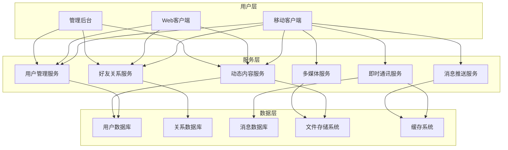
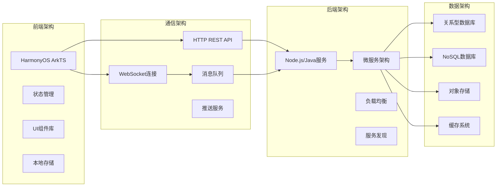

# 第23章：社交应用开发（一）- 需求分析与架构设计

## 23.1 社交应用需求分析

### 社交应用功能架构



### 核心功能模块分析

现代社交应用需要实现的核心功能包括：

1. **即时通讯功能**
   - 单聊和群聊支持
   - 实时消息传输
   - 消息状态同步（已发送、已送达、已读）
   - 离线消息存储和推送
   - 多媒体消息支持（文字、图片、语音、视频、文件）

2. **好友系统设计**
   - 好友添加和管理
   - 好友分组和标签
   - 黑名单和隐私设置
   - 好友推荐和发现
   - 好友权限控制

3. **动态发布与浏览**
   - 文字、图片、视频动态发布
   - 动态流算法和推荐
   - 点赞、评论、分享功能
   - 动态权限控制（公开、好友可见、私密）
   - 动态搜索和筛选

4. **消息推送实现**
   - 实时推送通知
   - 离线推送处理
   - 推送策略和频率控制
   - 推送内容个性化
   - 免打扰设置

5. **多媒体分享功能**
   - 图片上传和压缩
   - 视频录制和上传
   - 文件传输和预览
   - 多媒体缓存管理
   - 内容审核和安全检查

### 技术架构选型



## 23.2 核心数据模型设计

### 用户相关模型

```typescript
// social.models.ets

// 用户基础信息模型
export interface User extends BaseModel {
  username: string;
  nickname: string;
  avatar: string;
  phone: string;
  email?: string;
  gender: Gender;
  birthday?: Date;
  bio?: string;
  location?: Location;
  status: UserStatus;
  privacy: PrivacySettings;
  preferences: UserPreferences;
  statistics: UserStatistics;
  verified: boolean;
  verificationType?: VerificationType;
  lastActiveAt: Date;
  createdAt: Date;
  updatedAt: Date;
}

export enum Gender {
  UNKNOWN = 'unknown',
  MALE = 'male',
  FEMALE = 'female',
  OTHER = 'other'
}

export enum UserStatus {
  ACTIVE = 'active',
  INACTIVE = 'inactive',
  BANNED = 'banned',
  PENDING_VERIFICATION = 'pending_verification'
}

export enum VerificationType {
  NONE = 'none',
  PHONE = 'phone',
  EMAIL = 'email',
  REAL_NAME = 'real_name',
  ENTERPRISE = 'enterprise'
}

export interface Location {
  country: string;
  province: string;
  city: string;
  district?: string;
  coordinates?: {
    latitude: number;
    longitude: number;
  };
}

export interface PrivacySettings {
  profileVisibility: PrivacyLevel;
  friendRequestPermission: FriendRequestPermission;
  postVisibility: PostVisibilityLevel;
  onlineStatusVisibility: boolean;
  lastSeenVisibility: boolean;
  allowSearchByPhone: boolean;
  allowSearchByEmail: boolean;
  allowStrangerMessage: boolean;
}

export enum PrivacyLevel {
  PUBLIC = 'public',
  FRIENDS_ONLY = 'friends_only',
  PRIVATE = 'private'
}

export enum FriendRequestPermission {
  ANYONE = 'anyone',
  FRIENDS_OF_FRIENDS = 'friends_of_friends',
  NO_ONE = 'no_one'
}

export enum PostVisibilityLevel {
  PUBLIC = 'public',
  FRIENDS_ONLY = 'friends_only',
  PRIVATE = 'private',
  CUSTOM = 'custom'
}

export interface UserPreferences {
  language: string;
  theme: ThemeMode;
  fontSize: FontSize;
  messageSound: boolean;
  messageVibration: boolean;
  onlineStatus: boolean;
  readReceipt: boolean;
  autoPlayVideo: boolean;
  downloadOverWifi: boolean;
  notifications: NotificationPreferences;
}

export enum ThemeMode {
  LIGHT = 'light',
  DARK = 'dark',
  AUTO = 'auto'
}

export enum FontSize {
  SMALL = 'small',
  MEDIUM = 'medium',
  LARGE = 'large',
  EXTRA_LARGE = 'extra_large'
}

export interface NotificationPreferences {
  friendRequest: boolean;
  message: boolean;
  like: boolean;
  comment: boolean;
  mention: boolean;
  system: boolean;
  doNotDisturb: boolean;
  doNotDisturbStart?: string;
  doNotDisturbEnd?: string;
}

export interface UserStatistics {
  friendsCount: number;
  followersCount: number;
  followingCount: number;
  postsCount: number;
  likesCount: number;
  commentsCount: number;
  sharesCount: number;
}

// 在线状态模型
export interface OnlineStatus {
  userId: string;
  status: OnlineStatusType;
  lastSeen: Date;
  deviceInfo?: DeviceInfo;
  currentActivity?: UserActivity;
}

export enum OnlineStatusType {
  ONLINE = 'online',
  AWAY = 'away',
  BUSY = 'busy',
  INVISIBLE = 'invisible',
  OFFLINE = 'offline'
}

export interface DeviceInfo {
  deviceId: string;
  deviceType: DeviceType;
  platform: string;
  version: string;
  appVersion: string;
}

export enum DeviceType {
  MOBILE = 'mobile',
  TABLET = 'tablet',
  DESKTOP = 'desktop',
  WEB = 'web'
}

export interface UserActivity {
  type: ActivityType;
  description?: string;
  timestamp: Date;
}

export enum ActivityType {
  TYPING = 'typing',
  RECORDING_VOICE = 'recording_voice',
  IN_CALL = 'in_call',
  PLAYING_GAME = 'playing_game',
  WATCHING_VIDEO = 'watching_video'
}
```

### 好友关系模型

```typescript
// 好友关系模型
export interface Friendship extends BaseModel {
  user1Id: string;
  user2Id: string;
  status: FriendshipStatus;
  initiatorId: string;
  relationship?: RelationshipType;
  tags: string[];
  customSettings?: CustomFriendSettings;
  createdAt: Date;
  updatedAt: Date;
}

export enum FriendshipStatus {
  PENDING = 'pending',
  ACCEPTED = 'accepted',
  DECLINED = 'declined',
  BLOCKED = 'blocked'
}

export enum RelationshipType {
  FRIEND = 'friend',
  BEST_FRIEND = 'best_friend',
  FAMILY = 'family',
  COLLEAGUE = 'colleague',
  CLASSMATE = 'classmate',
  ACQUAINTANCE = 'acquaintance'
}

export interface CustomFriendSettings {
  nickname?: string;
  remark?: string;
  specialMoments?: Date[];
  customNotifications: boolean;
  postVisibility: PostVisibilityLevel;
  chatPinTop: boolean;
  chatBackground?: string;
}

// 好友请求模型
export interface FriendRequest extends BaseModel {
  requesterId: string;
  targetId: string;
  message?: string;
  status: FriendRequestStatus;
  source: FriendRequestSource;
  mutualFriends?: string[];
  processedAt?: Date;
  processorId?: string;
  rejectReason?: string;
  createdAt: Date;
}

export enum FriendRequestStatus {
  PENDING = 'pending',
  ACCEPTED = 'accepted',
  DECLINED = 'declined',
  EXPIRED = 'expired',
  CANCELLED = 'cancelled'
}

export enum FriendRequestSource {
  SEARCH = 'search',
  QR_CODE = 'qr_code',
  RECOMMENDATION = 'recommendation',
  GROUP_CHAT = 'group_chat',
  NEARBY = 'nearby',
  CONTACTS = 'contacts'
}

// 好友分组模型
export interface FriendGroup extends BaseModel {
  userId: string;
  name: string;
  description?: string;
  color?: string;
  icon?: string;
  memberIds: string[];
  isDefault: boolean;
  sortOrder: number;
  createdAt: Date;
  updatedAt: Date;
}

// 好友推荐模型
export interface FriendRecommendation {
  userId: string;
  recommendedUserId: string;
  score: number;
  reasons: RecommendationReason[];
  mutualFriends?: User[];
  mutualGroups?: string[];
  suggestedAt: Date;
  status: RecommendationStatus;
}

export interface RecommendationReason {
  type: ReasonType;
  description: string;
  weight: number;
  relatedUsers?: string[];
}

export enum ReasonType {
  MUTUAL_FRIENDS = 'mutual_friends',
  SAME_GROUP = 'same_group',
  SAME_LOCATION = 'same_location',
  SAME_SCHOOL = 'same_school',
  SAME_COMPANY = 'same_company',
  SIMILAR_INTERESTS = 'similar_interests',
  CONTACTS_SYNC = 'contacts_sync',
  FREQUENT_INTERACTION = 'frequent_interaction'
}

export enum RecommendationStatus {
  PENDING = 'pending',
  ACCEPTED = 'accepted',
  DECLINED = 'declined',
  HIDDEN = 'hidden'
}
```

### 消息与聊天模型

```typescript
// 聊天会话模型
export interface Conversation extends BaseModel {
  type: ConversationType;
  name?: string;
  avatar?: string;
  description?: string;
  participantIds: string[];
  creatorId: string;
  adminIds?: string[];
  lastMessage?: Message;
  lastReadAt?: Date;
  pinned: boolean;
  muted: boolean;
  archived: boolean;
  settings?: ConversationSettings;
  createdAt: Date;
  updatedAt: Date;
}

export enum ConversationType {
  ONE_ON_ONE = 'one_on_one',
  GROUP_CHAT = 'group_chat',
  BROADCAST = 'broadcast',
  SYSTEM = 'system'
}

export interface ConversationSettings {
  messageRetention: MessageRetentionPolicy;
  allowAddMembers: boolean;
  allowRemoveMembers: boolean;
  allowFileSharing: boolean;
  allowVoiceCall: boolean;
  allowVideoCall: boolean;
  requireApproval: boolean;
  autoDelete: boolean;
  autoDeleteAfter?: number; // 小时
}

export enum MessageRetentionPolicy {
  FOREVER = 'forever',
  ONE_DAY = 'one_day',
  ONE_WEEK = 'one_week',
  ONE_MONTH = 'one_month',
  ONE_YEAR = 'one_year'
}

// 消息模型
export interface Message extends BaseModel {
  conversationId: string;
  senderId: string;
  type: MessageType;
  content: MessageContent;
  replyTo?: string;
  forwardFrom?: MessageForwardInfo;
  mentions?: string[];
  status: MessageStatus;
  reactions?: MessageReaction[];
  editHistory?: MessageEdit[];
  deletedAt?: Date;
  deletedBy?: string;
  readBy?: MessageReadReceipt[];
  attachments?: MessageAttachment[];
  metadata?: MessageMetadata;
  createdAt: Date;
  updatedAt: Date;
}

export enum MessageType {
  TEXT = 'text',
  IMAGE = 'image',
  VIDEO = 'video',
  VOICE = 'voice',
  FILE = 'file',
  LOCATION = 'location',
  CONTACT = 'contact',
  SYSTEM = 'system',
  CALL = 'call',
  REACTION = 'reaction'
}

export interface MessageContent {
  text?: string;
  media?: MediaContent;
  location?: LocationContent;
  contact?: ContactContent;
  system?: SystemContent;
  call?: CallContent;
}

export interface MediaContent {
  url: string;
  thumbnail?: string;
  fileName?: string;
  fileSize: number;
  duration?: number; // 视频/语音时长（秒）
  width?: number;
  height?: number;
  format: string;
  metadata?: MediaMetadata;
}

export interface MediaMetadata {
  title?: string;
  artist?: string;
  album?: string;
  resolution?: string;
  bitrate?: number;
  fps?: number;
}

export interface LocationContent {
  latitude: number;
  longitude: number;
  address?: string;
  poi?: string;
}

export interface ContactContent {
  userId: string;
  name: string;
  avatar?: string;
  description?: string;
}

export interface SystemContent {
  type: SystemMessageType;
  content: string;
  relatedUsers?: string[];
}

export enum SystemMessageType {
  USER_JOINED = 'user_joined',
  USER_LEFT = 'user_left',
  USER_ADDED = 'user_added',
  USER_REMOVED = 'user_removed',
  GROUP_CREATED = 'group_created',
  GROUP_UPDATED = 'group_updated',
  NAME_CHANGED = 'name_changed',
  AVATAR_CHANGED = 'avatar_changed'
}

export interface CallContent {
  type: CallType;
  duration?: number;
  status: CallStatus;
  participants?: CallParticipant[];
}

export enum CallType {
  VOICE = 'voice',
  VIDEO = 'video'
}

export enum CallStatus {
  MISSED = 'missed',
  REJECTED = 'rejected',
  COMPLETED = 'completed',
  FAILED = 'failed'
}

export interface CallParticipant {
  userId: string;
  joinedAt: Date;
  leftAt?: Date;
}

export enum MessageStatus {
  SENDING = 'sending',
  SENT = 'sent',
  DELIVERED = 'delivered',
  READ = 'read',
  FAILED = 'failed'
}

export interface MessageReaction {
  emoji: string;
  userIds: string[];
  count: number;
}

export interface MessageEdit {
  content: MessageContent;
  editedAt: Date;
}

export interface MessageForwardInfo {
  originalMessageId: string;
  originalConversationId: string;
  originalSenderId: string;
  forwardedAt: Date;
}

export interface MessageReadReceipt {
  userId: string;
  readAt: Date;
  deviceId: string;
}

export interface MessageAttachment {
  id: string;
  type: AttachmentType;
  name: string;
  url: string;
  size: number;
  mimeType: string;
  thumbnail?: string;
  encryption?: EncryptionInfo;
}

export enum AttachmentType {
  IMAGE = 'image',
  VIDEO = 'video',
  AUDIO = 'audio',
  DOCUMENT = 'document',
  COMPRESSED = 'compressed',
  OTHER = 'other'
}

export interface EncryptionInfo {
  algorithm: string;
  keySize: number;
  iv: string;
}

export interface MessageMetadata {
  priority: MessagePriority;
  ttl?: number; // 消息生存时间（秒）
  tags?: string[];
  customData?: Record<string, any>;
}

export enum MessagePriority {
  LOW = 'low',
  NORMAL = 'normal',
  HIGH = 'high',
  URGENT = 'urgent'
}

// 通话模型
export interface CallSession extends BaseModel {
  conversationId: string;
  type: CallType;
  initiatorId: string;
  participants: CallParticipant[];
  status: CallSessionStatus;
  startTime: Date;
  endTime?: Date;
  duration?: number;
  quality?: CallQuality;
  recording?: CallRecording;
  metadata?: CallMetadata;
}

export enum CallSessionStatus {
  INITIATING = 'initiating',
  RINGING = 'ringing',
  CONNECTING = 'connecting',
  CONNECTED = 'connected',
  ENDING = 'ending',
  ENDED = 'ended',
  FAILED = 'failed'
}

export interface CallQuality {
  videoQuality?: VideoQuality;
  audioQuality?: AudioQuality;
  networkQuality?: NetworkQuality;
}

export enum VideoQuality {
  LOW = 'low',
  MEDIUM = 'medium',
  HIGH = 'high',
  HD = 'hd',
  FULL_HD = 'full_hd'
}

export enum AudioQuality {
  POOR = 'poor',
  FAIR = 'fair',
  GOOD = 'good',
  EXCELLENT = 'excellent'
}

export enum NetworkQuality {
  POOR = 'poor',
  FAIR = 'fair',
  GOOD = 'good',
  EXCELLENT = 'excellent'
}

export interface CallRecording {
  url: string;
  size: number;
  format: string;
  duration: number;
  createdAt: Date;
}

export interface CallMetadata {
  deviceInfo?: DeviceInfo;
  networkInfo?: NetworkInfo;
  codec?: string;
  encryption?: boolean;
}
```

### 动态内容模型

```typescript
// 动态发布模型
export interface Post extends BaseModel {
  authorId: string;
  type: PostType;
  content: PostContent;
  visibility: PostVisibilityLevel;
  location?: LocationContent;
  mentions?: string[];
  tags?: string[];
  statistics: PostStatistics;
  settings: PostSettings;
  createdAt: Date;
  updatedAt: Date;
}

export enum PostType {
  TEXT = 'text',
  IMAGE = 'image',
  VIDEO = 'video',
  LINK = 'link',
  POLL = 'poll',
  LIVE = 'live',
  STORY = 'story'
}

export interface PostContent {
  text?: string;
  media?: MediaContent[];
  link?: LinkContent;
  poll?: PollContent;
  live?: LiveContent;
}

export interface LinkContent {
  url: string;
  title?: string;
  description?: string;
  image?: string;
  siteName?: string;
}

export interface PollContent {
  question: string;
  options: PollOption[];
  multipleChoice: boolean;
  endTime?: Date;
  totalVotes: number;
  userVote?: number[];
}

export interface PollOption {
  id: number;
  text: string;
  votes: number;
  percentage: number;
}

export interface LiveContent {
  streamUrl: string;
  thumbnail?: string;
  title?: string;
  viewerCount?: number;
  startTime: Date;
  endTime?: Date;
  status: LiveStatus;
}

export enum LiveStatus {
  SCHEDULED = 'scheduled',
  LIVE = 'live',
  ENDED = 'ended',
  CANCELLED = 'cancelled'
}

export interface PostStatistics {
  likes: number;
  comments: number;
  shares: number;
  views: number;
  bookmarks: number;
}

export interface PostSettings {
  allowComments: boolean;
  allowSharing: boolean;
  allowDownload: boolean;
  commentApproval: boolean;
  adultContent: boolean;
  sponsored: boolean;
  pinned: boolean;
  featured: boolean;
}

// 点赞模型
export interface Like extends BaseModel {
  userId: string;
  targetType: LikeTargetType;
  targetId: string;
  type: LikeType;
  createdAt: Date;
}

export enum LikeTargetType {
  POST = 'post',
  COMMENT = 'comment',
  MESSAGE = 'message'
}

export enum LikeType {
  LIKE = 'like',
  LOVE = 'love',
  LAUGH = 'laugh',
  WOW = 'wow',
  SAD = 'sad',
  ANGRY = 'angry'
}

// 评论模型
export interface Comment extends BaseModel {
  postId: string;
  authorId: string;
  parentId?: string;
  content: string;
  mentions?: string[];
  attachments?: MessageAttachment[];
  statistics: CommentStatistics;
  status: CommentStatus;
  createdAt: Date;
  updatedAt: Date;
  deletedAt?: Date;
}

export interface CommentStatistics {
  likes: number;
  replies: number;
}

export enum CommentStatus {
  ACTIVE = 'active',
  HIDDEN = 'hidden',
  DELETED = 'deleted'
}

// 分享模型
export interface Share extends BaseModel {
  userId: string;
  targetType: ShareTargetType;
  targetId: string;
  content?: string;
  visibility: PostVisibilityLevel;
  platform?: SharePlatform;
  createdAt: Date;
}

export enum ShareTargetType {
  POST = 'post',
  ARTICLE = 'article',
  PRODUCT = 'product',
  LINK = 'link'
}

export enum SharePlatform {
  INTERNAL = 'internal',
  WECHAT = 'wechat',
  WEIBO = 'weibo',
  QQ = 'qq',
  LINKEDIN = 'linkedin'
}

// 书签模型
export interface Bookmark extends BaseModel {
  userId: string;
  targetType: BookmarkTargetType;
  targetId: string;
  folder?: string;
  tags?: string[];
  note?: string;
  createdAt: Date;
}

export enum BookmarkTargetType {
  POST = 'post',
  ARTICLE = 'article',
  LINK = 'link',
  PRODUCT = 'product',
  VIDEO = 'video'
}
```

## 23.3 社交应用架构配置

### 模块配置

```typescript
// social.module.config.ets
export const SocialModule: ModuleConfig = {
  name: 'SocialModule',
  version: '1.0.0',
  dependencies: ['UserModule', 'CoreModule', 'NotificationModule'],
  routes: [
    // 消息相关路由
    {
      path: '/messages',
      component: 'MessageListView',
      meta: { title: '消息', requireAuth: true }
    },
    {
      path: '/messages/:id',
      component: 'ChatView',
      meta: { title: '聊天', requireAuth: true }
    },
    {
      path: '/calls',
      component: 'CallListView',
      meta: { title: '通话记录', requireAuth: true }
    },

    // 好友相关路由
    {
      path: '/friends',
      component: 'FriendsListView',
      meta: { title: '好友', requireAuth: true }
    },
    {
      path: '/friends/add',
      component: 'AddFriendView',
      meta: { title: '添加好友', requireAuth: true }
    },
    {
      path: '/friend-requests',
      component: 'FriendRequestsView',
      meta: { title: '好友请求', requireAuth: true }
    },
    {
      path: '/friend-suggestions',
      component: 'FriendSuggestionsView',
      meta: { title: '好友推荐', requireAuth: true }
    },

    // 动态相关路由
    {
      path: '/moments',
      component: 'MomentsView',
      meta: { title: '动态', requireAuth: true }
    },
    {
      path: '/moments/create',
      component: 'CreatePostView',
      meta: { title: '发布动态', requireAuth: true }
    },
    {
      path: '/moments/:id',
      component: 'PostDetailView',
      meta: { title: '动态详情', requireAuth: true }
    },

    // 发现相关路由
    {
      path: '/discover',
      component: 'DiscoverView',
      meta: { title: '发现', requireAuth: true }
    },
    {
      path: '/discover/nearby',
      component: 'NearbyPeopleView',
      meta: { title: '附近的人', requireAuth: true }
    },
    {
      path: '/discover/groups',
      component: 'GroupChatListView',
      meta: { title: '群聊', requireAuth: true }
    },

    // 个人中心相关路由
    {
      path: '/profile',
      component: 'ProfileView',
      meta: { title: '个人主页', requireAuth: true }
    },
    {
      path: '/profile/:id',
      component: 'UserProfileView',
      meta: { title: '用户主页', requireAuth: true }
    },
    {
      path: '/settings',
      component: 'SocialSettingsView',
      meta: { title: '社交设置', requireAuth: true }
    },

    // 通知相关路由
    {
      path: '/notifications',
      component: 'NotificationsView',
      meta: { title: '通知', requireAuth: true }
    }
  ],
  services: [
    {
      name: 'MessageService',
      singleton: true,
      factory: () => new MessageViewModel()
    },
    {
      name: 'FriendService',
      singleton: true,
      factory: () => new FriendViewModel()
    },
    {
      name: 'MomentsService',
      singleton: true,
      factory: () => new MomentsViewModel()
    },
    {
      name: 'CallService',
      singleton: true,
      factory: () => new CallViewModel()
    },
    {
      name: 'NotificationService',
      singleton: true,
      factory: () => new SocialNotificationViewModel()
    }
  ],
  components: [
    {
      name: 'MessageBubble',
      path: '/components/MessageBubble',
      global: true
    },
    {
      name: 'UserAvatar',
      path: '/components/UserAvatar',
      global: true
    },
    {
      name: 'PostCard',
      path: '/components/PostCard',
      global: true
    },
    {
      name: 'CommentItem',
      path: '/components/CommentItem',
      global: true
    },
    {
      name: 'OnlineStatusIndicator',
      path: '/components/OnlineStatusIndicator',
      global: true
    },
    {
      name: 'VoiceRecorder',
      path: '/components/VoiceRecorder',
      global: true
    },
    {
      name: 'EmojiPicker',
      path: '/components/EmojiPicker',
      global: true
    }
  ]
};
```

### WebSocket通信架构

```typescript
// websocket.service.ets
export interface WebSocketMessage {
  id: string;
  type: MessageType;
  data: any;
  timestamp: Date;
  from?: string;
  to?: string;
  conversationId?: string;
}

export interface WebSocketConfig {
  url: string;
  protocols?: string[];
  reconnectInterval: number;
  maxReconnectAttempts: number;
  heartbeatInterval: number;
  heartbeatTimeout: number;
}

export class WebSocketService {
  private ws: WebSocket | null = null;
  private config: WebSocketConfig;
  private reconnectAttempts: number = 0;
  private heartbeatTimer?: number;
  private heartbeatTimeoutTimer?: number;
  private messageQueue: WebSocketMessage[] = [];
  private isConnecting: boolean = false;
  private isConnected: boolean = false;

  private readonly messageHandlers: Map<string, (message: WebSocketMessage) => void> = new Map();
  private readonly connectionStateHandlers: ((connected: boolean) => void)[] = [];

  constructor(config: WebSocketConfig) {
    this.config = config;
  }

  async connect(): Promise<void> {
    if (this.isConnecting || this.isConnected) {
      return;
    }

    this.isConnecting = true;

    try {
      await this.createConnection();
    } catch (error) {
      console.error('WebSocket connection failed:', error);
      this.handleConnectionError(error);
    } finally {
      this.isConnecting = false;
    }
  }

  private async createConnection(): Promise<void> {
    return new Promise((resolve, reject) => {
      this.ws = new WebSocket(this.config.url, this.config.protocols);

      this.ws.onopen = () => {
        console.info('WebSocket connected');
        this.isConnected = true;
        this.reconnectAttempts = 0;
        this.startHeartbeat();
        this.processMessageQueue();
        this.notifyConnectionStateChange(true);
        resolve();
      };

      this.ws.onmessage = (event) => {
        this.handleMessage(event.data);
      };

      this.ws.onclose = (event) => {
        console.warn('WebSocket closed:', event.code, event.reason);
        this.isConnected = false;
        this.stopHeartbeat();
        this.notifyConnectionStateChange(false);

        if (!event.wasClean && this.reconnectAttempts < this.config.maxReconnectAttempts) {
          this.scheduleReconnect();
        }
      };

      this.ws.onerror = (error) => {
        console.error('WebSocket error:', error);
        reject(error);
      };
    });
  }

  private handleMessage(data: string): void {
    try {
      const message: WebSocketMessage = JSON.parse(data);

      // 处理心跳响应
      if (message.type === 'pong') {
        this.handlePongMessage();
        return;
      }

      // 处理业务消息
      const handler = this.messageHandlers.get(message.type);
      if (handler) {
        handler(message);
      } else {
        console.warn('No handler for message type:', message.type);
      }

    } catch (error) {
      console.error('Failed to parse WebSocket message:', error);
    }
  }

  sendMessage(type: string, data: any, to?: string, conversationId?: string): void {
    const message: WebSocketMessage = {
      id: this.generateMessageId(),
      type: type as MessageType,
      data,
      timestamp: new Date(),
      from: this.getCurrentUserId(),
      to,
      conversationId
    };

    if (this.isConnected && this.ws) {
      this.ws.send(JSON.stringify(message));
    } else {
      // 连接断开时，消息加入队列
      this.messageQueue.push(message);
    }
  }

  onMessage(type: string, handler: (message: WebSocketMessage) => void): void {
    this.messageHandlers.set(type, handler);
  }

  onConnectionStateChange(handler: (connected: boolean) => void): void {
    this.connectionStateHandlers.push(handler);
  }

  private startHeartbeat(): void {
    this.heartbeatTimer = setInterval(() => {
      this.sendHeartbeat();
    }, this.config.heartbeatInterval);
  }

  private stopHeartbeat(): void {
    if (this.heartbeatTimer) {
      clearInterval(this.heartbeatTimer);
      this.heartbeatTimer = undefined;
    }
    if (this.heartbeatTimeoutTimer) {
      clearTimeout(this.heartbeatTimeoutTimer);
      this.heartbeatTimeoutTimer = undefined;
    }
  }

  private sendHeartbeat(): void {
    if (this.isConnected && this.ws) {
      this.sendMessage('ping', {});

      // 设置心跳超时检测
      this.heartbeatTimeoutTimer = setTimeout(() => {
        console.warn('Heartbeat timeout, closing connection');
        this.close();
      }, this.config.heartbeatTimeout);
    }
  }

  private handlePongMessage(): void {
    if (this.heartbeatTimeoutTimer) {
      clearTimeout(this.heartbeatTimeoutTimer);
      this.heartbeatTimeoutTimer = undefined;
    }
  }

  private processMessageQueue(): void {
    while (this.messageQueue.length > 0 && this.isConnected && this.ws) {
      const message = this.messageQueue.shift()!;
      this.ws.send(JSON.stringify(message));
    }
  }

  private scheduleReconnect(): void {
    this.reconnectAttempts++;
    const delay = Math.min(1000 * Math.pow(2, this.reconnectAttempts), 30000);

    console.info(`Scheduling reconnect attempt ${this.reconnectAttempts} in ${delay}ms`);

    setTimeout(() => {
      this.connect();
    }, delay);
  }

  private handleConnectionError(error: any): void {
    console.error('WebSocket connection error:', error);
    this.scheduleReconnect();
  }

  private notifyConnectionStateChange(connected: boolean): void {
    this.connectionStateHandlers.forEach(handler => {
      try {
        handler(connected);
      } catch (error) {
        console.error('Connection state handler error:', error);
      }
    });
  }

  close(): void {
    this.isConnected = false;
    this.stopHeartbeat();

    if (this.ws) {
      this.ws.close(1000, 'Normal closure');
      this.ws = null;
    }
  }

  private generateMessageId(): string {
    return Date.now().toString() + Math.random().toString(36).substr(2, 9);
  }

  private getCurrentUserId(): string {
    // 获取当前用户ID
    return 'current-user-id';
  }

  isConnectedState(): boolean {
    return this.isConnected;
  }
}
```

## 23.4 即时通讯基础实现

### 消息服务ViewModel

```typescript
// message.viewmodel.ets
export class MessageViewModel extends BaseViewModel {
  @State conversations: Conversation[] = [];
  @State currentConversation: Conversation | null = null;
  @State messages: Message[] = [];
  @State onlineUsers: Map<string, OnlineStatus> = new Map();
  @State typingUsers: Map<string, UserActivity[]> = new Map();
  @State unreadCounts: Map<string, number> = new Map();

  private messageService: MessageService;
  private friendService: FriendService;
  private notificationService: NotificationService;
  private webSocketService: WebSocketService;

  constructor(
    messageService: MessageService,
    friendService: FriendService,
    notificationService: NotificationService,
    webSocketService: WebSocketService
  ) {
    super();
    this.messageService = messageService;
    this.friendService = friendService;
    this.notificationService = notificationService;
    this.webSocketService = webSocketService;

    this.setupWebSocketHandlers();
  }

  onInit(): void {
    this.loadConversations();
    this.connectWebSocket();
  }

  onDestroy(): void {
    this.disconnectWebSocket();
  }

  private setupWebSocketHandlers(): void {
    // 处理新消息
    this.webSocketService.onMessage('new_message', (message) => {
      this.handleNewMessage(message);
    });

    // 处理消息状态更新
    this.webSocketService.onMessage('message_status', (data) => {
      this.handleMessageStatusUpdate(data);
    });

    // 处理用户在线状态
    this.webSocketService.onMessage('user_status', (data) => {
      this.handleUserStatusUpdate(data);
    });

    // 处理正在输入状态
    this.webSocketService.onMessage('typing', (data) => {
      this.handleTypingStatus(data);
    });

    // 处理连接状态变化
    this.webSocketService.onConnectionStateChange((connected) => {
      this.handleConnectionStateChange(connected);
    });
  }

  async loadConversations(): Promise<void> {
    await this.executeAsync(
      async () => {
        const conversations = await this.messageService.getConversations();
        this.conversations = conversations;
        await this.loadUnreadCounts();
      },
      () => {
        console.info('Conversations loaded successfully');
      }
    );
  }

  async loadMessages(conversationId: string, before?: string): Promise<void> {
    await this.executeAsync(
      async () => {
        const messages = await this.messageService.getMessages(conversationId, before);

        if (before) {
          this.messages = [...messages, ...this.messages];
        } else {
          this.messages = messages;
          this.currentConversation = this.conversations.find(c => c.id === conversationId) || null;
        }

        // 标记消息为已读
        await this.markMessagesAsRead(conversationId);
      },
      () => {
        console.info('Messages loaded successfully');
      }
    );
  }

  async sendMessage(
    conversationId: string,
    content: MessageContent,
    type: MessageType = MessageType.TEXT,
    replyTo?: string
  ): Promise<Message | null> {
    const tempMessage: Message = {
      id: this.generateTempId(),
      conversationId,
      senderId: this.getCurrentUserId(),
      type,
      content,
      replyTo,
      status: MessageStatus.SENDING,
      mentions: this.extractMentions(content),
      createdAt: new Date(),
      updatedAt: new Date()
    };

    // 立即添加到UI
    this.messages.push(tempMessage);

    const result = await this.executeAsync(
      async () => {
        const message = await this.messageService.sendMessage({
          conversationId,
          content,
          type,
          replyTo
        });

        // 更新临时消息状态
        const index = this.messages.findIndex(m => m.id === tempMessage.id);
        if (index !== -1) {
          this.messages[index] = message;
        }

        // 更新会话的最后消息
        await this.updateConversationLastMessage(conversationId, message);

        return message;
      },
      (message) => {
        console.info('Message sent successfully');
      },
      (error) => {
        // 发送失败，更新消息状态
        const index = this.messages.findIndex(m => m.id === tempMessage.id);
        if (index !== -1) {
          this.messages[index] = {
            ...this.messages[index],
            status: MessageStatus.FAILED
          };
        }
      }
    );

    return result;
  }

  async sendVoiceMessage(
    conversationId: string,
    audioFile: File,
    duration: number
  ): Promise<Message | null> {
    const content: MessageContent = {
      media: {
        url: URL.createObjectURL(audioFile),
        fileName: audioFile.name,
        fileSize: audioFile.size,
        duration,
        format: audioFile.type.split('/')[1]
      }
    };

    return this.sendMessage(conversationId, content, MessageType.VOICE);
  }

  async sendImageMessage(
    conversationId: string,
    imageFile: File
  ): Promise<Message | null> {
    // 压缩图片
    const compressedImage = await this.compressImage(imageFile);

    const content: MessageContent = {
      media: {
        url: URL.createObjectURL(compressedImage),
        fileName: compressedImage.name,
        fileSize: compressedImage.size,
        width: 0, // 需要获取图片尺寸
        height: 0,
        format: compressedImage.type.split('/')[1]
      }
    };

    return this.sendMessage(conversationId, content, MessageType.IMAGE);
  }

  async sendLocationMessage(
    conversationId: string,
    latitude: number,
    longitude: number,
    address?: string
  ): Promise<Message | null> {
    const content: MessageContent = {
      location: {
        latitude,
        longitude,
        address
      }
    };

    return this.sendMessage(conversationId, content, MessageType.LOCATION);
  }

  async sendContactMessage(
    conversationId: string,
    userId: string
  ): Promise<Message | null> {
    const user = await this.friendService.getUserById(userId);
    if (!user) return null;

    const content: MessageContent = {
      contact: {
        userId,
        name: user.nickname,
        avatar: user.avatar
      }
    };

    return this.sendMessage(conversationId, content, MessageType.CONTACT);
  }

  async deleteMessage(messageId: string): Promise<boolean> {
    const result = await this.executeAsync(
      async () => {
        const success = await this.messageService.deleteMessage(messageId);
        if (success) {
          this.messages = this.messages.filter(m => m.id !== messageId);
        }
        return success;
      },
      (success) => {
        if (success) {
          console.info('Message deleted successfully');
        }
      }
    );

    return result || false;
  }

  async editMessage(messageId: string, content: MessageContent): Promise<boolean> {
    const result = await this.executeAsync(
      async () => {
        const updatedMessage = await this.messageService.editMessage(messageId, content);
        if (updatedMessage) {
          const index = this.messages.findIndex(m => m.id === messageId);
          if (index !== -1) {
            this.messages[index] = updatedMessage;
          }
          return true;
        }
        return false;
      },
      (success) => {
        if (success) {
          console.info('Message edited successfully');
        }
      }
    );

    return result || false;
  }

  async reactToMessage(messageId: string, emoji: string): Promise<void> {
    await this.executeAsync(
      async () => {
        await this.messageService.reactToMessage(messageId, emoji);
        this.webSocketService.sendMessage('message_reaction', {
          messageId,
          emoji
        });
      },
      () => {
        console.info('Message reaction sent');
      }
    );
  }

  async markMessagesAsRead(conversationId: string): Promise<void> {
    await this.executeAsync(
      async () => {
        await this.messageService.markConversationAsRead(conversationId);
        this.unreadCounts.set(conversationId, 0);

        // 通知其他用户消息已读
        this.webSocketService.sendMessage('messages_read', {
          conversationId,
          lastReadAt: new Date()
        });
      },
      () => {
        console.info('Messages marked as read');
      }
    );
  }

  async createConversation(
    participantIds: string[],
    type: ConversationType = ConversationType.ONE_ON_ONE,
    name?: string
  ): Promise<Conversation | null> {
    const result = await this.executeAsync(
      async () => {
        const conversation = await this.messageService.createConversation({
          type,
          name,
          participantIds,
          creatorId: this.getCurrentUserId()
        });

        this.conversations.unshift(conversation);
        return conversation;
      },
      (conversation) => {
        console.info('Conversation created successfully');
      }
    );

    return result;
  }

  async startTyping(conversationId: string): Promise<void> {
    this.webSocketService.sendMessage('typing_start', {
      conversationId
    });
  }

  async stopTyping(conversationId: string): Promise<void> {
    this.webSocketService.sendMessage('typing_stop', {
      conversationId
    });
  }

  // WebSocket事件处理
  private handleNewMessage(messageData: any): void {
    const message: Message = messageData.data;

    if (this.currentConversation?.id === message.conversationId) {
      // 当前会话的消息，直接添加
      this.messages.push(message);

      // 标记为已读
      if (message.senderId !== this.getCurrentUserId()) {
        this.markMessagesAsRead(message.conversationId);
      }
    } else {
      // 其他会话的消息，更新未读数
      const currentCount = this.unreadCounts.get(message.conversationId) || 0;
      this.unreadCounts.set(message.conversationId, currentCount + 1);

      // 更新会话列表
      this.updateConversationLastMessage(message.conversationId, message);

      // 显示通知
      this.showNewMessageNotification(message);
    }
  }

  private handleMessageStatusUpdate(data: any): void {
    const { messageId, status, readBy } = data.data;

    const messageIndex = this.messages.findIndex(m => m.id === messageId);
    if (messageIndex !== -1) {
      this.messages[messageIndex] = {
        ...this.messages[messageIndex],
        status,
        readBy: readBy || this.messages[messageIndex].readBy
      };
    }
  }

  private handleUserStatusUpdate(data: any): void {
    const onlineStatus: OnlineStatus = data.data;
    this.onlineUsers.set(onlineStatus.userId, onlineStatus);
  }

  private handleTypingStatus(data: any): void {
    const { conversationId, userId, type } = data.data;

    if (type === 'start') {
      const currentTyping = this.typingUsers.get(conversationId) || [];
      const existingActivity = currentTyping.find(activity => activity.type === ActivityType.TYPING);

      if (existingActivity) {
        existingActivity.timestamp = new Date();
      } else {
        currentTyping.push({
          type: ActivityType.TYPING,
          timestamp: new Date()
        });
      }

      this.typingUsers.set(conversationId, currentTyping);
    } else {
      const currentTyping = this.typingUsers.get(conversationId) || [];
      this.typingUsers.set(conversationId, currentTyping.filter(activity => activity.type !== ActivityType.TYPING));
    }
  }

  private handleConnectionStateChange(connected: boolean): void {
    if (connected) {
      console.info('WebSocket connected');
      // 重新连接后同步未读消息
      this.syncUnreadMessages();
    } else {
      console.warn('WebSocket disconnected');
      this.setErrorMessage('网络连接已断开');
    }
  }

  // 辅助方法
  private async loadUnreadCounts(): Promise<void> {
    const counts = await this.messageService.getUnreadCounts();
    counts.forEach((count, conversationId) => {
      this.unreadCounts.set(conversationId, count);
    });
  }

  private async updateConversationLastMessage(conversationId: string, message: Message): Promise<void> {
    const conversationIndex = this.conversations.findIndex(c => c.id === conversationId);
    if (conversationIndex !== -1) {
      this.conversations[conversationIndex] = {
        ...this.conversations[conversationIndex],
        lastMessage: message,
        updatedAt: message.createdAt
      };

      // 将会话移到顶部
      const conversation = this.conversations.splice(conversationIndex, 1)[0];
      this.conversations.unshift(conversation);
    }
  }

  private extractMentions(content: MessageContent): string[] {
    // 从消息内容中提取@的用户ID
    const mentions: string[] = [];

    if (content.text) {
      const mentionRegex = /@(\w+)/g;
      let match;
      while ((match = mentionRegex.exec(content.text)) !== null) {
        mentions.push(match[1]);
      }
    }

    return mentions;
  }

  private async compressImage(file: File): Promise<File> {
    return new Promise((resolve) => {
      const canvas = document.createElement('canvas');
      const ctx = canvas.getContext('2d')!;
      const img = new Image();

      img.onload = () => {
        const maxSize = 1024;
        let { width, height } = img;

        if (width > height) {
          if (width > maxSize) {
            height = (height * maxSize) / width;
            width = maxSize;
          }
        } else {
          if (height > maxSize) {
            width = (width * maxSize) / height;
            height = maxSize;
          }
        }

        canvas.width = width;
        canvas.height = height;
        ctx.drawImage(img, 0, 0, width, height);

        canvas.toBlob((blob) => {
          if (blob) {
            resolve(new File([blob], file.name, { type: 'image/jpeg' }));
          } else {
            resolve(file);
          }
        }, 'image/jpeg', 0.8);
      };

      img.src = URL.createObjectURL(file);
    });
  }

  private async syncUnreadMessages(): Promise<void> {
    // 连接恢复后同步未读消息
    await this.loadUnreadCounts();
  }

  private showNewMessageNotification(message: Message): void {
    // 显示新消息通知
    this.notificationService.showNotification({
      title: '新消息',
      body: this.getMessagePreview(message),
      data: { messageId: message.id, conversationId: message.conversationId }
    });
  }

  private getMessagePreview(message: Message): string {
    switch (message.type) {
      case MessageType.TEXT:
        return message.content.text || '';
      case MessageType.IMAGE:
        return '[图片]';
      case MessageType.VIDEO:
        return '[视频]';
      case MessageType.VOICE:
        return '[语音]';
      case MessageType.FILE:
        return '[文件]';
      case MessageType.LOCATION:
        return '[位置]';
      case MessageType.CONTACT:
        return '[联系人]';
      default:
        return '[消息]';
    }
  }

  private connectWebSocket(): void {
    this.webSocketService.connect();
  }

  private disconnectWebSocket(): void {
    this.webSocketService.close();
  }

  private generateTempId(): string {
    return 'temp_' + Date.now() + '_' + Math.random().toString(36).substr(2, 9);
  }

  private getCurrentUserId(): string {
    // 获取当前用户ID
    return 'current-user-id';
  }

  // Getters
  get totalUnreadCount(): number {
    let total = 0;
    this.unreadCounts.forEach(count => {
      total += count;
    });
    return total;
  }

  getTypingUsers(conversationId: string): UserActivity[] {
    return this.typingUsers.get(conversationId) || [];
  }

  getOnlineStatus(userId: string): OnlineStatus | null {
    return this.onlineUsers.get(userId) || null;
  }

  getUnreadCount(conversationId: string): number {
    return this.unreadCounts.get(conversationId) || 0;
  }
}
```

### 实时消息组件

```typescript
// realtime.message.component.ets
@Component
export struct RealtimeMessageComponent {
  @ObjectLink messageViewModel: MessageViewModel;
  @Prop conversationId: string;
  @Prop currentUserId: string;

  private scrollController: ScrollController = new ScrollController();
  private typingTimer?: number;

  aboutToAppear(): void {
    this.messageViewModel.loadMessages(this.conversationId);
  }

  build() {
    Column() {
      // 聊天头部
      this.chatHeader()

      // 消息列表
      this.messageList()

      // 正在输入指示器
      this.typingIndicator()

      // 输入区域
      this.inputArea()
    }
    .width('100%')
    .height('100%')
    .backgroundColor('#F5F5F5')
  }

  @Builder
  chatHeader() {
    Row() {
      Button() {
        Image($r('app.media.back'))
          .width(20)
          .height(20)
          .fillColor('#333333')
      }
      .width(32)
      .height(32)
      .backgroundColor(Color.Transparent)
      .onClick(() => {
        // 返回会话列表
      })

      // 用户头像和信息
      Row() {
        UserAvatarComponent({
          userId: this.getConversationParticipantId(),
          size: 40,
          showOnlineStatus: true
        })

        Column() {
          Text(this.getConversationName())
            .fontSize(16)
            .fontWeight(FontWeight.Bold)
            .fontColor('#333333')
            .maxLines(1)
            .textOverflow({ overflow: TextOverflow.Ellipsis })

          Row() {
            Text(this.getParticipantCount())
              .fontSize(12)
              .fontColor('#666666')

            if (this.hasOnlineUsers()) {
              Text(' • ')
                .fontSize(12)
                .fontColor('#666666')

              Text(`${this.getOnlineUserCount()}人在线`)
                .fontSize(12)
                .fontColor('#2ED573')
            }
          }
          .margin({ top: 2 })
        }
        .layoutWeight(1)
        .alignItems(HorizontalAlign.Start)
        .margin({ left: 12 })
      }

      // 操作按钮
      Row() {
        Button() {
          Image($r('app.media.phone'))
            .width(20)
            .height(20)
            .fillColor('#333333')
        }
        .width(32)
        .height(32)
        .backgroundColor(Color.Transparent)
        .onClick(() => {
          this.startVoiceCall();
        })

        Button() {
          Image($r('app.media.video'))
            .width(20)
          .height(20)
          .fillColor('#333333')
        }
        .width(32)
        .height(32)
        .backgroundColor(Color.Transparent)
        .onClick(() => {
          this.startVideoCall();
        })

        Button() {
          Image($r('app.media.more'))
            .width(20)
            .height(20)
            .fillColor('#333333')
        }
        .width(32)
        .height(32)
        .backgroundColor(Color.Transparent)
        .onClick(() => {
          this.showMoreOptions();
        })
      }
    }
    .width('100%')
    .padding({ left: 16, right: 16, top: 8, bottom: 8 })
    .backgroundColor(Color.White)
    .border({ width: { bottom: 1 }, color: '#E5E5E5' })
  }

  @Builder
  messageList() {
    Scroll(this.scrollController) {
      Column() {
        ForEach(this.messageViewModel.messages, (message: Message) => {
          MessageBubbleComponent({
            message: message,
            isOwn: message.senderId === this.currentUserId,
            onReply: (replyMessage: Message) => {
              this.replyToMessage(replyMessage);
            },
            onReact: (messageId: string, emoji: string) => {
              this.messageViewModel.reactToMessage(messageId, emoji);
            },
            onDelete: (messageId: string) => {
              this.deleteMessage(messageId);
            },
            onEdit: (messageId: string) => {
              this.editMessage(messageId);
            }
          })
        })
      }
      .width('100%')
      .padding({ left: 16, right: 16, top: 8, bottom: 8 })
    }
    .scrollable(ScrollDirection.Vertical)
    .scrollBar(BarState.Off)
    .layoutWeight(1)
    .onScrollEnd(() => {
      this.loadMoreMessages();
    })
  }

  @Builder
  typingIndicator() {
    if (this.messageViewModel.getTypingUsers(this.conversationId).length > 0) {
      Row() {
        LoadingProgress()
          .width(16)
          .height(16)
          .color('#007DFF')
          .margin({ right: 8 })

        Text(this.getTypingText())
          .fontSize(12)
          .fontColor('#666666')
      }
      .width('100%')
      .padding({ left: 24, right: 16, top: 4, bottom: 4 })
      .backgroundColor('#F8F9FA')
    }
  }

  @Builder
  inputArea() {
    Column() {
      // 回复消息预览
      if (this.replyingToMessage) {
        Row() {
          Text('回复')
            .fontSize(12)
            .fontColor('#007DFF')
            .margin({ right: 8 })

          Text(this.getMessagePreview(this.replyingToMessage))
            .fontSize(12)
            .fontColor('#666666')
            .layoutWeight(1)
            .maxLines(1)
            .textOverflow({ overflow: TextOverflow.Ellipsis })

          Button() {
            Image($r('app.media.close'))
              .width(16)
              .height(16)
              .fillColor('#999999')
          }
          .width(24)
          .height(24)
          .backgroundColor(Color.Transparent)
          .onClick(() => {
            this.cancelReply();
          })
        }
        .width('100%')
        .padding({ left: 16, right: 16, top: 8, bottom: 4 })
      }

      // 输入工具栏
      Row() {
        // 表情按钮
        Button() {
          Image($r('app.media.emoji'))
            .width(24)
            .height(24)
            .fillColor('#666666')
        }
        .width(40)
        .height(40)
        .backgroundColor(Color.Transparent)
        .onClick(() => {
          this.showEmojiPicker();
        })

        // 文件按钮
        Button() {
          Image($r('app.media.attach'))
            .width(24)
            .height(24)
            .fillColor('#666666')
        }
        .width(40)
        .height(40)
        .backgroundColor(Color.Transparent)
        .onClick(() => {
          this.showFilePicker();
        })

        // 输入框
        TextInput({ placeholder: '输入消息...' })
          .width('100%')
          .height(40)
          .backgroundColor('#F8F9FA')
          .borderRadius(20)
          .margin({ left: 8, right: 8 })
          .onChange((value: string) => {
            this.handleInputChange(value);
          })
          .onSubmit((value: string) => {
            this.sendTextMessage(value);
          })

        // 语音录制按钮
        if (this.inputText.trim()) {
          Button('发送')
            .fontSize(14)
            .fontColor(Color.White)
            .backgroundColor('#007DFF')
            .width(60)
            .height(40)
            .borderRadius(20)
            .onClick(() => {
              this.sendTextMessage(this.inputText);
            })
        } else {
          Button() {
            Image($r('app.media.microphone'))
              .width(24)
              .height(24)
              .fillColor('#666666')
          }
          .width(40)
          .height(40)
          .backgroundColor(Color.Transparent)
          .onTouch((event) => {
            this.handleVoiceRecord(event);
          })
        }
      }
      .width('100%')
      .padding({ left: 16, right: 16, top: 8, bottom: 8 })
      .alignItems(VerticalAlign.Center)
    }
    .backgroundColor(Color.White)
    .border({ width: { top: 1 }, color: '#E5E5E5' })
  }

  // 事件处理方法
  private async sendTextMessage(text: string): Promise<void> {
    if (!text.trim()) return;

    const content: MessageContent = { text: text.trim() };
    await this.messageViewModel.sendMessage(this.conversationId, content);
    this.inputText = '';
    this.cancelReply();
  }

  private handleInputChange(value: string): void {
    this.inputText = value;

    // 发送正在输入状态
    if (this.typingTimer) {
      clearTimeout(this.typingTimer);
    }

    this.messageViewModel.startTyping(this.conversationId);

    this.typingTimer = setTimeout(() => {
      this.messageViewModel.stopTyping(this.conversationId);
    }, 3000);
  }

  private handleVoiceRecord(event: TouchEvent): void {
    if (event.type === TouchType.Down) {
      this.startVoiceRecording();
    } else if (event.type === TouchType.Up) {
      this.stopVoiceRecording();
    }
  }

  private async startVoiceRecording(): Promise<void> {
    // 开始录音
    console.info('Start voice recording');
  }

  private async stopVoiceRecording(): Promise<void> {
    // 停止录音并发送
    console.info('Stop voice recording');
  }

  private replyToMessage(message: Message): void {
    this.replyingToMessage = message;
  }

  private cancelReply(): void {
    this.replyingToMessage = null;
  }

  private async deleteMessage(messageId: string): Promise<void> {
    await this.messageViewModel.deleteMessage(messageId);
  }

  private async editMessage(messageId: string): Promise<void> {
    const message = this.messageViewModel.messages.find(m => m.id === messageId);
    if (message && message.content.text) {
      this.inputText = message.content.text;
      // 进入编辑模式
    }
  }

  private loadMoreMessages(): void {
    const firstMessage = this.messageViewModel.messages[0];
    if (firstMessage) {
      this.messageViewModel.loadMessages(this.conversationId, firstMessage.id);
    }
  }

  private startVoiceCall(): void {
    console.info('Start voice call');
  }

  private startVideoCall(): void {
    console.info('Start video call');
  }

  private showMoreOptions(): void {
    console.info('Show more options');
  }

  private showEmojiPicker(): void {
    console.info('Show emoji picker');
  }

  private showFilePicker(): void {
    console.info('Show file picker');
  }

  // 辅助方法
  private getConversationParticipantId(): string {
    const conversation = this.messageViewModel.currentConversation;
    if (!conversation) return '';

    // 单聊返回对方ID，群聊返回第一个参与者ID
    if (conversation.type === ConversationType.ONE_ON_ONE) {
      return conversation.participantIds.find(id => id !== this.currentUserId) || '';
    } else {
      return conversation.participantIds[0] || '';
    }
  }

  private getConversationName(): string {
    const conversation = this.messageViewModel.currentConversation;
    if (!conversation) return '';

    if (conversation.name) {
      return conversation.name;
    }

    if (conversation.type === ConversationType.ONE_ON_ONE) {
      return '好友'; // 需要获取用户信息
    } else {
      return `${conversation.participantIds.length}人群聊`;
    }
  }

  private getParticipantCount(): string {
    const conversation = this.messageViewModel.currentConversation;
    if (!conversation) return '';

    if (conversation.type === ConversationType.ONE_ON_ONE) {
      return '单聊';
    } else {
      return `${conversation.participantIds.length}人`;
    }
  }

  private hasOnlineUsers(): boolean {
    const conversation = this.messageViewModel.currentConversation;
    if (!conversation) return false;

    return conversation.participantIds.some(id => {
      const status = this.messageViewModel.getOnlineStatus(id);
      return status && status.status === OnlineStatusType.ONLINE;
    });
  }

  private getOnlineUserCount(): number {
    const conversation = this.messageViewModel.currentConversation;
    if (!conversation) return 0;

    return conversation.participantIds.filter(id => {
      const status = this.messageViewModel.getOnlineStatus(id);
      return status && status.status === OnlineStatusType.ONLINE;
    }).length;
  }

  private getTypingText(): string {
    const typingUsers = this.messageViewModel.getTypingUsers(this.conversationId);
    if (typingUsers.length === 0) return '';

    if (typingUsers.length === 1) {
      return '对方正在输入...';
    } else {
      return `${typingUsers.length}人正在输入...`;
    }
  }

  private getMessagePreview(message: Message): string {
    switch (message.type) {
      case MessageType.TEXT:
        return message.content.text || '';
      case MessageType.IMAGE:
        return '[图片]';
      case MessageType.VIDEO:
        return '[视频]';
      case MessageType.VOICE:
        return '[语音]';
      case MessageType.FILE:
        return '[文件]';
      case MessageType.LOCATION:
        return '[位置]';
      case MessageType.CONTACT:
        return '[联系人]';
      default:
        return '[消息]';
    }
  }

  // 状态变量
  @State inputText: string = '';
  @State replyingToMessage: Message | null = null;
}
```

## 23.5 总结

本章第一部分详细阐述了社交应用的需求分析、架构设计和即时通讯基础实现。通过完整的数据模型设计、WebSocket通信架构和实时消息系统，为构建功能完善的社交应用奠定了坚实的基础。

### 核心技术要点

1. **数据模型设计** - 完整的用户、好友、消息、动态等核心业务模型
2. **WebSocket通信架构** - 实时双向通信、心跳机制、重连策略
3. **即时通讯基础** - 消息发送接收、状态同步、实时通知
4. **MVVM架构应用** - 清晰的分层结构和数据流管理
5. **组件化设计** - 可复用的UI组件和业务逻辑模块

### 技术特色

- **实时性保障** - WebSocket长连接确保消息实时传输
- **可靠性设计** - 消息队列、重连机制、离线消息处理
- **用户体验优化** - 正在输入状态、已读回执、消息状态同步
- **扩展性考虑** - 模块化设计支持功能扩展
- **性能优化** - 图片压缩、消息分页、状态管理优化

这部分内容为后续的社交应用开发提供了完整的技术基础和实现指导，接下来将继续深入好友系统、动态发布、消息推送等高级功能的实现。