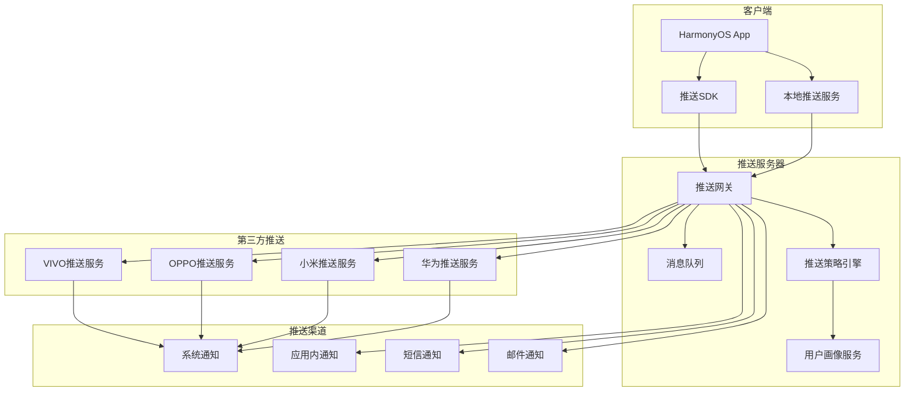

# 第23章：社交应用开发（三）- 消息推送与多媒体分享

## 23.9 消息推送系统

### 推送服务架构



### 推送ViewModel实现

```typescript
// notification.viewmodel.ets
export class NotificationViewModel extends BaseViewModel {
  @State notifications: Notification[] = [];
  @State unreadCount: number = 0;
  @State pushSettings: PushSettings;
  @State notificationHistory: NotificationHistory[] = [];
  @State isPushEnabled: boolean = true;

  private notificationService: NotificationService;
  private pushService: PushService;
  private userService: UserService;

  constructor(
    notificationService: NotificationService,
    pushService: PushService,
    userService: UserService
  ) {
    super();
    this.notificationService = notificationService;
    this.pushService = pushService;
    this.userService = userService;

    this.pushSettings = this.getDefaultPushSettings();
  }

  onInit(): void {
    this.initializePushService();
    this.loadNotifications();
    this.loadPushSettings();
  }

  onDestroy(): void {
    this.cleanupPushService();
  }

  async initializePushService(): Promise<void> {
    await this.executeAsync(
      async () => {
        // 初始化推送服务
        await this.pushService.initialize();

        // 注册推送Token
        await this.registerPushToken();

        // 设置推送监听器
        this.setupPushListeners();

        // 同步历史通知
        await this.syncNotificationHistory();
      },
      () => {
        console.info('Push service initialized successfully');
      },
      (error) => {
        console.error('Failed to initialize push service:', error);
        this.isPushEnabled = false;
      }
    );
  }

  private async registerPushToken(): Promise<void> {
    try {
      const token = await this.pushService.getPushToken();
      if (token) {
        await this.userService.updatePushToken(token);
        console.info('Push token registered successfully');
      }
    } catch (error) {
      console.error('Failed to register push token:', error);
    }
  }

  private setupPushListeners(): void {
    // 监听推送消息
    this.pushService.onNotificationReceived((notification) => {
      this.handleIncomingNotification(notification);
    });

    // 监听推送Token变化
    this.pushService.onTokenRefresh((token) => {
      this.handleTokenRefresh(token);
    });

    // 监听推送状态变化
    this.pushService.onStatusChanged((enabled) => {
      this.handlePushStatusChange(enabled);
    });
  }

  async loadNotifications(): Promise<void> {
    await this.executeAsync(
      async () => {
        const notifications = await this.notificationService.getNotifications();
        this.notifications = notifications;
        this.updateUnreadCount();
      },
      () => {
        console.info('Notifications loaded successfully');
      }
    );
  }

  async loadPushSettings(): Promise<void> {
    await this.executeAsync(
      async () => {
        const settings = await this.userService.getPushSettings();
        if (settings) {
          this.pushSettings = settings;
        }
      },
      () => {
        console.info('Push settings loaded successfully');
      }
    );
  }

  async updatePushSettings(settings: Partial<PushSettings>): Promise<boolean> {
    const result = await this.executeAsync(
      async () => {
        const updatedSettings = { ...this.pushSettings, ...settings };
        await this.userService.updatePushSettings(updatedSettings);
        this.pushSettings = updatedSettings;

        // 应用本地推送设置
        await this.applyLocalPushSettings(updatedSettings);

        return true;
      },
      (success) => {
        if (success) {
          console.info('Push settings updated successfully');
        }
      }
    );

    return result || false;
  }

  async markAsRead(notificationId: string): Promise<boolean> {
    const result = await this.executeAsync(
      async () => {
        const success = await this.notificationService.markAsRead(notificationId);
        if (success) {
          this.notifications = this.notifications.map(notification =>
            notification.id === notificationId
              ? { ...notification, read: true, readAt: new Date() }
              : notification
          );
          this.updateUnreadCount();
        }
        return success;
      },
      (success) => {
        if (success) {
          console.info('Notification marked as read');
        }
      }
    );

    return result || false;
  }

  async markAllAsRead(): Promise<boolean> {
    const result = await this.executeAsync(
      async () => {
        const success = await this.notificationService.markAllAsRead();
        if (success) {
          this.notifications = this.notifications.map(notification => ({
            ...notification,
            read: true,
            readAt: new Date()
          }));
          this.unreadCount = 0;
        }
        return success;
      },
      (success) => {
        if (success) {
          console.info('All notifications marked as read');
        }
      }
    );

    return result || false;
  }

  async deleteNotification(notificationId: string): Promise<boolean> {
    const result = await this.executeAsync(
      async () => {
        const success = await this.notificationService.deleteNotification(notificationId);
        if (success) {
          this.notifications = this.notifications.filter(n => n.id !== notificationId);
          this.updateUnreadCount();
        }
        return success;
      },
      (success) => {
        if (success) {
          console.info('Notification deleted successfully');
        }
      }
    );

    return result || false;
  }

  async clearAllNotifications(): Promise<boolean> {
    const result = await this.executeAsync(
      async () => {
        const success = await this.notificationService.clearAllNotifications();
        if (success) {
          this.notifications = [];
          this.unreadCount = 0;
        }
        return success;
      },
      (success) => {
        if (success) {
          console.info('All notifications cleared successfully');
        }
      }
    );

    return result || false;
  }

  async sendNotification(
    userId: string,
    title: string,
    body: string,
    data?: any,
    options?: NotificationOptions
  ): Promise<boolean> {
    const result = await this.executeAsync(
      async () => {
        const notification: CreateNotificationData = {
          userId,
          type: options?.type || NotificationType.USER_MESSAGE,
          title,
          body,
          data,
          priority: options?.priority || NotificationPriority.NORMAL,
          sound: options?.sound ?? true,
          vibration: options?.vibration ?? true,
          led: options?.led ?? true,
          badge: options?.badge ?? true
        };

        return await this.notificationService.sendNotification(notification);
      },
      (success) => {
        if (success) {
          console.info('Notification sent successfully');
        }
      }
    );

    return result || false;
  }

  async sendBatchNotifications(
    userIds: string[],
    title: string,
    body: string,
    data?: any,
    options?: NotificationOptions
  ): Promise<number> {
    const result = await this.executeAsync(
      async () => {
        const notification: CreateNotificationData = {
          userIds,
          type: options?.type || NotificationType.SYSTEM_ANNOUNCEMENT,
          title,
          body,
          data,
          priority: options?.priority || NotificationPriority.NORMAL,
          sound: options?.sound ?? true,
          vibration: options?.vibration ?? true,
          led: options?.led ?? true,
          badge: options?.badge ?? true
        };

        return await this.notificationService.sendBatchNotifications(notification);
      },
      (successCount) => {
        console.info(`Batch notifications sent: ${successCount}`);
      }
    );

    return result || 0;
  }

  async scheduleNotification(
    userId: string,
    title: string,
    body: string,
    scheduledTime: Date,
    data?: any,
    options?: NotificationOptions
  ): Promise<string | null> {
    const result = await this.executeAsync(
      async () => {
        const notification: ScheduleNotificationData = {
          userId,
          type: options?.type || NotificationType.REMINDER,
          title,
          body,
          scheduledTime,
          data,
          priority: options?.priority || NotificationPriority.NORMAL,
          sound: options?.sound ?? true,
          vibration: options?.vibration ?? true,
          led: options?.led ?? true,
          badge: options?.badge ?? true,
          repeat: options?.repeat
        };

        return await this.notificationService.scheduleNotification(notification);
      },
      (notificationId) => {
        if (notificationId) {
          console.info('Notification scheduled successfully');
        }
      }
    );

    return result;
  }

  async cancelScheduledNotification(notificationId: string): Promise<boolean> {
    const result = await this.executeAsync(
      async () => {
        return await this.notificationService.cancelScheduledNotification(notificationId);
      },
      (success) => {
        if (success) {
          console.info('Scheduled notification cancelled successfully');
        }
      }
    );

    return result || false;
  }

  // 推送事件处理
  private handleIncomingNotification(notification: NotificationData): void {
    // 检查推送设置
    if (!this.shouldShowNotification(notification)) {
      return;
    }

    // 添加到通知列表
    const newNotification: Notification = {
      id: notification.id,
      userId: this.getCurrentUserId(),
      type: notification.type,
      title: notification.title,
      body: notification.body,
      data: notification.data,
      read: false,
      createdAt: new Date()
    };

    this.notifications.unshift(newNotification);
    this.updateUnreadCount();

    // 显示本地通知
    this.showLocalNotification(notification);

    // 处理通知点击
    this.handleNotificationClick(notification);
  }

  private handleTokenRefresh(token: string): void {
    console.info('Push token refreshed:', token);
    this.registerPushToken();
  }

  private handlePushStatusChange(enabled: boolean): void {
    console.info('Push status changed:', enabled);
    this.isPushEnabled = enabled;
  }

  private shouldShowNotification(notification: NotificationData): boolean {
    // 检查免打扰设置
    if (this.isInDoNotDisturbMode()) {
      return false;
    }

    // 检查通知类型设置
    if (!this.isNotificationTypeEnabled(notification.type)) {
      return false;
    }

    // 检查用户在线状态
    if (this.isUserOnline() && !this.pushSettings.showWhenOnline) {
      return false;
    }

    return true;
  }

  private isInDoNotDisturbMode(): boolean {
    if (!this.pushSettings.doNotDisturb) {
      return false;
    }

    const now = new Date();
    const currentTime = now.getHours() * 60 + now.getMinutes();

    if (this.pushSettings.doNotDisturbStart && this.pushSettings.doNotDisturbEnd) {
      const startTime = this.parseTime(this.pushSettings.doNotDisturbStart);
      const endTime = this.parseTime(this.pushSettings.doNotDisturbEnd);

      if (startTime <= endTime) {
        return currentTime >= startTime && currentTime < endTime;
      } else {
        return currentTime >= startTime || currentTime < endTime;
      }
    }

    return false;
  }

  private isNotificationTypeEnabled(type: NotificationType): boolean {
    switch (type) {
      case NotificationType.FRIEND_REQUEST:
        return this.pushSettings.friendRequestEnabled;
      case NotificationType.MESSAGE:
        return this.pushSettings.messageEnabled;
      case NotificationType.LIKE:
        return this.pushSettings.likeEnabled;
      case NotificationType.COMMENT:
        return this.pushSettings.commentEnabled;
      case NotificationType.MENTION:
        return this.pushSettings.mentionEnabled;
      case NotificationType.SYSTEM:
        return this.pushSettings.systemEnabled;
      default:
        return true;
    }
  }

  private isUserOnline(): boolean {
    // 检查用户是否在线
    return false; // 简化实现
  }

  private showLocalNotification(notification: NotificationData): void {
    // 显示本地通知
    this.pushService.showLocalNotification({
      title: notification.title,
      body: notification.body,
      data: notification.data,
      sound: this.pushSettings.soundEnabled,
      vibration: this.pushSettings.vibrationEnabled,
      badge: this.pushSettings.badgeEnabled
    });
  }

  private handleNotificationClick(notification: NotificationData): void {
    // 处理通知点击事件
    this.navigateBasedOnNotification(notification);
  }

  private navigateBasedOnNotification(notification: NotificationData): void {
    switch (notification.type) {
      case NotificationType.MESSAGE:
        this.navigateToChat(notification.data?.conversationId);
        break;
      case NotificationType.FRIEND_REQUEST:
        this.navigateToFriendRequests();
        break;
      case NotificationType.LIKE:
      case NotificationType.COMMENT:
      case NotificationType.MENTION:
        this.navigateToPost(notification.data?.postId);
        break;
      case NotificationType.CALL:
        this.navigateToCall(notification.data?.callId);
        break;
      default:
        this.navigateToNotifications();
    }
  }

  private async applyLocalPushSettings(settings: PushSettings): Promise<void> {
    await this.pushService.updateSettings({
      sound: settings.soundEnabled,
      vibration: settings.vibrationEnabled,
      led: settings.ledEnabled,
      badge: settings.badgeEnabled
    });
  }

  private async syncNotificationHistory(): Promise<void> {
    try {
      const history = await this.notificationService.getNotificationHistory();
      this.notificationHistory = history;
    } catch (error) {
      console.error('Failed to sync notification history:', error);
    }
  }

  private updateUnreadCount(): void {
    this.unreadCount = this.notifications.filter(n => !n.read).length;
  }

  private cleanupPushService(): void {
    this.pushService.cleanup();
  }

  private parseTime(timeString: string): number {
    const [hours, minutes] = timeString.split(':').map(Number);
    return hours * 60 + minutes;
  }

  // 导航方法
  private navigateToChat(conversationId?: string): void {
    console.info(`Navigate to chat: ${conversationId}`);
  }

  private navigateToFriendRequests(): void {
    console.info('Navigate to friend requests');
  }

  private navigateToPost(postId?: string): void {
    console.info(`Navigate to post: ${postId}`);
  }

  private navigateToCall(callId?: string): void {
    console.info(`Navigate to call: ${callId}`);
  }

  private navigateToNotifications(): void {
    console.info('Navigate to notifications');
  }

  private getCurrentUserId(): string {
    return 'current-user-id';
  }

  private getDefaultPushSettings(): PushSettings {
    return {
      soundEnabled: true,
      vibrationEnabled: true,
      ledEnabled: true,
      badgeEnabled: true,
      doNotDisturb: false,
      showWhenOnline: false,
      friendRequestEnabled: true,
      messageEnabled: true,
      likeEnabled: true,
      commentEnabled: true,
      mentionEnabled: true,
      systemEnabled: true
    };
  }
}

// 推送相关接口定义
export interface Notification {
  id: string;
  userId: string;
  type: NotificationType;
  title: string;
  body: string;
  data?: any;
  read: boolean;
  readAt?: Date;
  createdAt: Date;
}

export enum NotificationType {
  FRIEND_REQUEST = 'friend_request',
  MESSAGE = 'message',
  LIKE = 'like',
  COMMENT = 'comment',
  MENTION = 'mention',
  CALL = 'call',
  SYSTEM = 'system',
  SYSTEM_ANNOUNCEMENT = 'system_announcement',
  REMINDER = 'reminder'
}

export interface PushSettings {
  soundEnabled: boolean;
  vibrationEnabled: boolean;
  ledEnabled: boolean;
  badgeEnabled: boolean;
  doNotDisturb: boolean;
  doNotDisturbStart?: string;
  doNotDisturbEnd?: string;
  showWhenOnline: boolean;
  friendRequestEnabled: boolean;
  messageEnabled: boolean;
  likeEnabled: boolean;
  commentEnabled: boolean;
  mentionEnabled: boolean;
  systemEnabled: boolean;
}

export interface NotificationOptions {
  type?: NotificationType;
  priority?: NotificationPriority;
  sound?: boolean;
  vibration?: boolean;
  led?: boolean;
  badge?: boolean;
  repeat?: NotificationRepeat;
}

export enum NotificationPriority {
  LOW = 'low',
  NORMAL = 'normal',
  HIGH = 'high',
  URGENT = 'urgent'
}

export enum NotificationRepeat {
  NONE = 'none',
  DAILY = 'daily',
  WEEKLY = 'weekly',
  MONTHLY = 'monthly'
}

export interface CreateNotificationData {
  userId?: string;
  userIds?: string[];
  type: NotificationType;
  title: string;
  body: string;
  data?: any;
  priority: NotificationPriority;
  sound: boolean;
  vibration: boolean;
  led: boolean;
  badge: boolean;
}

export interface ScheduleNotificationData extends CreateNotificationData {
  scheduledTime: Date;
  repeat?: NotificationRepeat;
}

export interface NotificationHistory {
  id: string;
  type: NotificationType;
  title: string;
  body: string;
  sentAt: Date;
  deliveredAt?: Date;
  readAt?: Date;
  status: NotificationStatus;
}

export enum NotificationStatus {
  PENDING = 'pending',
  DELIVERED = 'delivered',
  READ = 'read',
  FAILED = 'failed'
}
```

### 推送服务实现

```typescript
// push.service.ets
export class PushService {
  private static instance: PushService;
  private pushToken: string = '';
  private isInitialized: boolean = false;
  private listeners: PushListeners = {};

  static getInstance(): PushService {
    if (!PushService.instance) {
      PushService.instance = new PushService();
    }
    return PushService.instance;
  }

  async initialize(): Promise<void> {
    try {
      // 初始化华为推送服务
      await this.initializeHuaweiPush();

      // 初始化小米推送服务
      await this.initializeXiaomiPush();

      // 初始化OPPO推送服务
      await this.initializeOppoPush();

      // 初始化VIVO推送服务
      await this.initializeVivoPush();

      this.isInitialized = true;
      console.info('Push service initialized successfully');

    } catch (error) {
      console.error('Failed to initialize push service:', error);
      throw error;
    }
  }

  async getPushToken(): Promise<string> {
    if (!this.isInitialized) {
      throw new Error('Push service not initialized');
    }

    if (!this.pushToken) {
      this.pushToken = await this.requestPushToken();
    }

    return this.pushToken;
  }

  private async initializeHuaweiPush(): Promise<void> {
    try {
      // 华为推送服务初始化
      console.info('Initializing Huawei Push...');

      // 注册推送回调
      this.registerHuaweiPushCallbacks();

    } catch (error) {
      console.error('Failed to initialize Huawei Push:', error);
    }
  }

  private async initializeXiaomiPush(): Promise<void> {
    try {
      // 小米推送服务初始化
      console.info('Initializing Xiaomi Push...');

      // 注册推送回调
      this.registerXiaomiPushCallbacks();

    } catch (error) {
      console.error('Failed to initialize Xiaomi Push:', error);
    }
  }

  private async initializeOppoPush(): Promise<void> {
    try {
      // OPPO推送服务初始化
      console.info('Initializing OPPO Push...');

      // 注册推送回调
      this.registerOppoPushCallbacks();

    } catch (error) {
      console.error('Failed to initialize OPPO Push:', error);
    }
  }

  private async initializeVivoPush(): Promise<void> {
    try {
      // VIVO推送服务初始化
      console.info('Initializing VIVO Push...');

      // 注册推送回调
      this.registerVivoPushCallbacks();

    } catch (error) {
      console.error('Failed to initialize VIVO Push:', error);
    }
  }

  private async requestPushToken(): Promise<string> {
    try {
      // 请求推送Token
      const token = await this.requestHuaweiToken();

      if (token) {
        return token;
      }

      // 如果华为推送失败，尝试其他推送服务
      return await this.requestXiaomiToken();

    } catch (error) {
      console.error('Failed to request push token:', error);
      throw error;
    }
  }

  private async requestHuaweiToken(): Promise<string> {
    return new Promise((resolve, reject) => {
      // 模拟华为推送Token获取
      setTimeout(() => {
        const token = 'huawei_push_token_' + Date.now();
        console.info('Huawei push token obtained:', token);
        resolve(token);
      }, 1000);
    });
  }

  private async requestXiaomiToken(): Promise<string> {
    return new Promise((resolve, reject) => {
      // 模拟小米推送Token获取
      setTimeout(() => {
        const token = 'xiaomi_push_token_' + Date.now();
        console.info('Xiaomi push token obtained:', token);
        resolve(token);
      }, 1000);
    });
  }

  private registerHuaweiPushCallbacks(): void {
    // 注册华为推送回调
    console.info('Registering Huawei Push callbacks...');
  }

  private registerXiaomiPushCallbacks(): void {
    // 注册小米推送回调
    console.info('Registering Xiaomi Push callbacks...');
  }

  private registerOppoPushCallbacks(): void {
    // 注册OPPO推送回调
    console.info('Registering OPPO Push callbacks...');
  }

  private registerVivoPushCallbacks(): void {
    // 注册VIVO推送回调
    console.info('Registering VIVO Push callbacks...');
  }

  showLocalNotification(options: LocalNotificationOptions): void {
    try {
      // 显示本地通知
      console.info('Showing local notification:', options);

      // 使用系统通知API显示通知
      this.createSystemNotification(options);

    } catch (error) {
      console.error('Failed to show local notification:', error);
    }
  }

  private createSystemNotification(options: LocalNotificationOptions): void {
    // 创建系统通知
    const notificationContent = {
      contentType: Notification.ContentType.NOTIFICATION_CONTENT_BASIC_TEXT,
      normal: {
        title: options.title,
        text: options.body,
        additionalText: options.additionalText
      }
    };

    const notificationRequest = {
      id: Date.now().toString(),
      content: notificationContent,
      actionButtons: this.createActionButtons(options.actions),
      smallIcon: '/images/notification_icon.png',
      largeIcon: options.largeIcon,
      wantAgent: this.createWantAgent(options.data)
    };

    // 发送通知
    notification.publish(notificationRequest);
  }

  private createActionButtons(actions?: NotificationAction[]): notification.NotificationActionButton[] {
    if (!actions) {
      return [];
    }

    return actions.map(action => ({
      title: action.title,
      wantAgent: this.createWantAgent(action.data)
    }));
  }

  private createWantAgent(data?: any): wantAgent.WantAgent {
    // 创建WantAgent用于处理通知点击
    const want = {
      bundleName: 'com.example.socialapp',
      abilityName: 'MainAbility',
      parameters: data
    };

    const wantAgentInfo = {
      wants: [want],
      operationType: wantAgent.OperationType.START_ABILITY,
      requestCode: 0,
      wantAgentFlags: [wantAgent.WantAgentFlags.UPDATE_PRESENT_FLAG]
    };

    // 创建WantAgent（实际实现需要调用系统API）
    return {} as wantAgent.WantAgent;
  }

  onNotificationReceived(callback: (notification: NotificationData) => void): void {
    this.listeners.notificationReceived = callback;
  }

  onTokenRefresh(callback: (token: string) => void): void {
    this.listeners.tokenRefresh = callback;
  }

  onStatusChanged(callback: (enabled: boolean) => void): void {
    this.listeners.statusChanged = callback;
  }

  async updateSettings(settings: PushServiceSettings): Promise<void> {
    try {
      // 更新推送服务设置
      console.info('Updating push service settings:', settings);

      // 应用设置到各个推送服务
      await this.applySettingsToAllServices(settings);

    } catch (error) {
      console.error('Failed to update push settings:', error);
      throw error;
    }
  }

  private async applySettingsToAllServices(settings: PushServiceSettings): Promise<void> {
    // 应用设置到华为推送
    await this.applyHuaweiSettings(settings);

    // 应用设置到小米推送
    await this.applyXiaomiSettings(settings);

    // 应用设置到OPPO推送
    await this.applyOppoSettings(settings);

    // 应用设置到VIVO推送
    await this.applyVivoSettings(settings);
  }

  private async applyHuaweiSettings(settings: PushServiceSettings): Promise<void> {
    // 应用华为推送设置
    console.info('Applying Huawei Push settings...');
  }

  private async applyXiaomiSettings(settings: PushServiceSettings): Promise<void> {
    // 应用小米推送设置
    console.info('Applying Xiaomi Push settings...');
  }

  private async applyOppoSettings(settings: PushServiceSettings): Promise<void> {
    // 应用OPPO推送设置
    console.info('Applying OPPO Push settings...');
  }

  private async applyVivoSettings(settings: PushServiceSettings): Promise<void> {
    // 应用VIVO推送设置
    console.info('Applying VIVO Push settings...');
  }

  cleanup(): void {
    // 清理推送服务
    this.listeners = {};
    this.isInitialized = false;
    console.info('Push service cleaned up');
  }

  // 触发监听器方法
  private triggerNotificationReceived(notification: NotificationData): void {
    if (this.listeners.notificationReceived) {
      this.listeners.notificationReceived(notification);
    }
  }

  private triggerTokenRefresh(token: string): void {
    if (this.listeners.tokenRefresh) {
      this.listeners.tokenRefresh(token);
    }
  }

  private triggerStatusChanged(enabled: boolean): void {
    if (this.listeners.statusChanged) {
      this.listeners.statusChanged(enabled);
    }
  }
}

// 推送相关接口
interface PushListeners {
  notificationReceived?: (notification: NotificationData) => void;
  tokenRefresh?: (token: string) => void;
  statusChanged?: (enabled: boolean) => void;
}

interface LocalNotificationOptions {
  title: string;
  body: string;
  data?: any;
  additionalText?: string;
  largeIcon?: string;
  actions?: NotificationAction[];
}

interface NotificationAction {
  title: string;
  data?: any;
}

interface PushServiceSettings {
  sound: boolean;
  vibration: boolean;
  led: boolean;
  badge: boolean;
}

interface NotificationData {
  id: string;
  type: NotificationType;
  title: string;
  body: string;
  data?: any;
}
```

## 23.10 多媒体分享功能

### 多媒体服务实现

```typescript
// media.service.ets
export class MediaService {
  private static instance: MediaService;
  private uploadQueue: MediaUploadTask[] = [];
  private downloadQueue: MediaDownloadTask[] = [];
  private cacheManager: MediaCacheManager;

  static getInstance(): MediaService {
    if (!MediaService.instance) {
      MediaService.instance = new MediaService();
    }
    return MediaService.instance;
  }

  constructor() {
    this.cacheManager = new MediaCacheManager();
  }

  async uploadFile(file: File, options?: UploadOptions): Promise<MediaUploadResult> {
    const taskId = this.generateTaskId();
    const task: MediaUploadTask = {
      id: taskId,
      file,
      status: UploadStatus.PENDING,
      progress: 0,
      startTime: new Date(),
      options: options || {}
    };

    this.uploadQueue.push(task);

    try {
      // 压缩文件（如果需要）
      const processedFile = await this.processFileForUpload(file, options);

      // 开始上传
      task.status = UploadStatus.UPLOADING;
      const result = await this.performUpload(processedFile, (progress) => {
        task.progress = progress;
        this.notifyUploadProgress(taskId, progress);
      });

      // 上传完成
      task.status = UploadStatus.COMPLETED;
      task.endTime = new Date();
      task.result = result;

      this.notifyUploadCompleted(taskId, result);

      return result;

    } catch (error) {
      // 上传失败
      task.status = UploadStatus.FAILED;
      task.endTime = new Date();
      task.error = error instanceof Error ? error.message : 'Unknown error';

      this.notifyUploadFailed(taskId, error);

      throw error;
    }
  }

  async downloadFile(
    url: string,
    options?: DownloadOptions
  ): Promise<MediaDownloadResult> {
    const taskId = this.generateTaskId();
    const task: MediaDownloadTask = {
      id: taskId,
      url,
      status: DownloadStatus.PENDING,
      progress: 0,
      startTime: new Date(),
      options: options || {}
    };

    this.downloadQueue.push(task);

    try {
      // 检查缓存
      const cachedFile = await this.cacheManager.getCachedFile(url);
      if (cachedFile && !options?.forceDownload) {
        task.status = DownloadStatus.COMPLETED;
        task.endTime = new Date();
        task.result = {
          url: cachedFile.url,
          localPath: cachedFile.localPath,
          size: cachedFile.size,
          type: cachedFile.type,
          fromCache: true
        };

        this.notifyDownloadCompleted(taskId, task.result);
        return task.result;
      }

      // 开始下载
      task.status = DownloadStatus.DOWNLOADING;
      const result = await this.performDownload(url, (progress) => {
        task.progress = progress;
        this.notifyDownloadProgress(taskId, progress);
      }, options);

      // 缓存文件
      await this.cacheManager.cacheFile(url, result);

      // 下载完成
      task.status = DownloadStatus.COMPLETED;
      task.endTime = new Date();
      task.result = result;

      this.notifyDownloadCompleted(taskId, result);

      return result;

    } catch (error) {
      // 下载失败
      task.status = DownloadStatus.FAILED;
      task.endTime = new Date();
      task.error = error instanceof Error ? error.message : 'Unknown error';

      this.notifyDownloadFailed(taskId, error);

      throw error;
    }
  }

  async processImage(file: File, options?: ImageProcessOptions): Promise<ProcessedMedia> {
    try {
      const image = await this.loadImage(file);

      let processedImage = image;

      // 压缩图片
      if (options?.compress || options?.maxWidth || options?.maxHeight) {
        processedImage = await this.compressImage(image, options);
      }

      // 添加水印
      if (options?.watermark) {
        processedImage = await this.addWatermark(processedImage, options.watermark);
      }

      // 调整大小
      if (options?.resize) {
        processedImage = await this.resizeImage(processedImage, options.resize);
      }

      // 裁剪图片
      if (options?.crop) {
        processedImage = await this.cropImage(processedImage, options.crop);
      }

      // 旋转图片
      if (options?.rotate) {
        processedImage = await this.rotateImage(processedImage, options.rotate);
      }

      // 转换格式
      if (options?.format) {
        processedImage = await this.convertImageFormat(processedImage, options.format);
      }

      return {
        file: await this.imageToFile(processedImage, options?.format || 'image/jpeg'),
        width: processedImage.width,
        height: processedImage.height,
        size: processedImage.size,
        format: options?.format || 'image/jpeg'
      };

    } catch (error) {
      console.error('Failed to process image:', error);
      throw error;
    }
  }

  async processVideo(file: File, options?: VideoProcessOptions): Promise<ProcessedMedia> {
    try {
      const video = await this.loadVideo(file);

      let processedVideo = video;

      // 压缩视频
      if (options?.compress) {
        processedVideo = await this.compressVideo(video, options.compress);
      }

      // 裁剪视频
      if (options?.trim) {
        processedVideo = await this.trimVideo(processedVideo, options.trim);
      }

      // 添加水印
      if (options?.watermark) {
        processedVideo = await this.addVideoWatermark(processedVideo, options.watermark);
      }

      // 转换格式
      if (options?.format) {
        processedVideo = await this.convertVideoFormat(processedVideo, options.format);
      }

      // 生成缩略图
      const thumbnail = await this.generateVideoThumbnail(processedVideo);

      return {
        file: await this.videoToFile(processedVideo, options?.format || 'video/mp4'),
        width: processedVideo.width,
        height: processedVideo.height,
        duration: processedVideo.duration,
        size: processedVideo.size,
        format: options?.format || 'video/mp4',
        thumbnail
      };

    } catch (error) {
      console.error('Failed to process video:', error);
      throw error;
    }
  }

  async createMediaGallery(
    images: ProcessedMedia[],
    options?: GalleryOptions
  ): Promise<MediaGallery> {
    try {
      const gallery: MediaGallery = {
        id: this.generateTaskId(),
        type: GalleryType.IMAGE,
        items: images.map((media, index) => ({
          id: `${gallery.id}_${index}`,
          type: MediaType.IMAGE,
          url: URL.createObjectURL(media.file),
          thumbnail: media.thumbnail,
          width: media.width,
          height: media.height,
          size: media.size,
          duration: media.duration
        })),
        settings: {
          autoPlay: options?.autoPlay ?? false,
          loop: options?.loop ?? true,
          showControls: options?.showControls ?? true,
          allowFullscreen: options?.allowFullscreen ?? true,
          transition: options?.transition ?? TransitionType.FADE
        },
        createdAt: new Date()
      };

      return gallery;

    } catch (error) {
      console.error('Failed to create media gallery:', error);
      throw error;
    }
  }

  async shareMedia(
    media: ProcessedMedia[],
    shareOptions: ShareOptions
  ): Promise<ShareResult[]> {
    const results: ShareResult[] = [];

    for (const item of media) {
      try {
        const result = await this.shareMediaItem(item, shareOptions);
        results.push(result);
      } catch (error) {
        results.push({
          platform: shareOptions.platform,
          success: false,
          error: error instanceof Error ? error.message : 'Unknown error'
        });
      }
    }

    return results;
  }

  private async shareMediaItem(
    media: ProcessedMedia,
    shareOptions: ShareOptions
  ): Promise<ShareResult> {
    try {
      switch (shareOptions.platform) {
        case SharePlatform.WECHAT:
          return await this.shareToWeChat(media, shareOptions);
        case SharePlatform.WEIBO:
          return await this.shareToWeibo(media, shareOptions);
        case SharePlatform.QQ:
          return await this.shareToQQ(media, shareOptions);
        case SharePlatform.INTERNAL:
          return await this.shareInternal(media, shareOptions);
        default:
          throw new Error(`Unsupported platform: ${shareOptions.platform}`);
      }
    } catch (error) {
      console.error(`Failed to share to ${shareOptions.platform}:`, error);
      throw error;
    }
  }

  private async processFileForUpload(
    file: File,
    options?: UploadOptions
  ): Promise<File> {
    // 根据文件类型进行处理
    if (file.type.startsWith('image/')) {
      const imageOptions: ImageProcessOptions = {
        compress: true,
        maxWidth: options?.maxImageWidth || 1920,
        maxHeight: options?.maxImageHeight || 1080,
        quality: options?.imageQuality || 0.8
      };

      const processed = await this.processImage(file, imageOptions);
      return processed.file;

    } else if (file.type.startsWith('video/')) {
      const videoOptions: VideoProcessOptions = {
        compress: true,
        maxWidth: options?.maxVideoWidth || 1280,
        maxHeight: options?.maxVideoHeight || 720,
        bitrate: options?.maxVideoBitrate || 2000000
      };

      const processed = await this.processVideo(file, videoOptions);
      return processed.file;

    }

    return file;
  }

  private async performUpload(
    file: File,
    onProgress: (progress: number) => void
  ): Promise<MediaUploadResult> {
    return new Promise((resolve, reject) => {
      // 模拟文件上传
      const totalSize = file.size;
      let uploadedSize = 0;
      const chunkSize = 1024 * 1024; // 1MB chunks

      const uploadInterval = setInterval(() => {
        const chunk = Math.min(chunkSize, totalSize - uploadedSize);
        uploadedSize += chunk;

        const progress = (uploadedSize / totalSize) * 100;
        onProgress(progress);

        if (uploadedSize >= totalSize) {
          clearInterval(uploadInterval);

          const result: MediaUploadResult = {
            url: `https://cdn.example.com/media/${Date.now()}_${file.name}`,
            size: file.size,
            type: file.type,
            thumbnail: this.generateThumbnailUrl(file.type),
            uploadedAt: new Date()
          };

          resolve(result);
        }
      }, 100);
    });
  }

  private async performDownload(
    url: string,
    onProgress: (progress: number) => void,
    options?: DownloadOptions
  ): Promise<MediaDownloadResult> {
    return new Promise((resolve, reject) => {
      // 模拟文件下载
      const totalSize = 10 * 1024 * 1024; // 10MB
      let downloadedSize = 0;
      const chunkSize = 1024 * 512; // 512KB chunks

      const downloadInterval = setInterval(() => {
        const chunk = Math.min(chunkSize, totalSize - downloadedSize);
        downloadedSize += chunk;

        const progress = (downloadedSize / totalSize) * 100;
        onProgress(progress);

        if (downloadedSize >= totalSize) {
          clearInterval(downloadInterval);

          const result: MediaDownloadResult = {
            url,
            localPath: `/downloads/${Date.now()}_${this.getFileNameFromUrl(url)}`,
            size: totalSize,
            type: this.getMimeTypeFromUrl(url),
            downloadedAt: new Date()
          };

          resolve(result);
        }
      }, 50);
    });
  }

  private async loadImage(file: File): Promise<ImageData> {
    return new Promise((resolve, reject) => {
      const img = new Image();
      img.onload = () => {
        const canvas = document.createElement('canvas');
        canvas.width = img.width;
        canvas.height = img.height;
        const ctx = canvas.getContext('2d')!;
        ctx.drawImage(img, 0, 0);

        resolve({
          width: img.width,
          height: img.height,
          data: canvas,
          size: file.size
        });
      };
      img.onerror = reject;
      img.src = URL.createObjectURL(file);
    });
  }

  private async compressImage(
    image: ImageData,
    options: ImageProcessOptions
  ): Promise<ImageData> {
    const canvas = document.createElement('canvas');
    const ctx = canvas.getContext('2d')!;

    // 计算新尺寸
    let { width, height } = this.calculateNewSize(
      image.width,
      image.height,
      options.maxWidth,
      options.maxHeight
    );

    canvas.width = width;
    canvas.height = height;

    // 绘制压缩后的图片
    ctx.drawImage(image.data, 0, 0, width, height);

    return {
      width,
      height,
      data: canvas,
      size: Math.floor(image.size * (options.quality || 0.8))
    };
  }

  private async addWatermark(
    image: ImageData,
    watermark: WatermarkOptions
  ): Promise<ImageData> {
    const canvas = document.createElement('canvas');
    const ctx = canvas.getContext('2d')!;

    canvas.width = image.width;
    canvas.height = image.height;

    // 绘制原图
    ctx.drawImage(image.data, 0, 0);

    // 添加水印
    ctx.font = `${watermark.fontSize || 16}px Arial`;
    ctx.fillStyle = watermark.color || 'rgba(255, 255, 255, 0.5)';
    ctx.textAlign = watermark.align || 'right';
    ctx.textBaseline = 'bottom';

    const x = watermark.position?.x ?? canvas.width - 10;
    const y = watermark.position?.y ?? canvas.height - 10;

    ctx.fillText(watermark.text || 'Watermark', x, y);

    return {
      width: image.width,
      height: image.height,
      data: canvas,
      size: image.size
    };
  }

  private async resizeImage(
    image: ImageData,
    resize: ResizeOptions
  ): Promise<ImageData> {
    const canvas = document.createElement('canvas');
    const ctx = canvas.getContext('2d')!;

    canvas.width = resize.width;
    canvas.height = resize.height;

    ctx.drawImage(image.data, 0, 0, resize.width, resize.height);

    return {
      width: resize.width,
      height: resize.height,
      data: canvas,
      size: Math.floor(image.size * (resize.width * resize.height) / (image.width * image.height))
    };
  }

  private async cropImage(
    image: ImageData,
    crop: CropOptions
  ): Promise<ImageData> {
    const canvas = document.createElement('canvas');
    const ctx = canvas.getContext('2d')!;

    canvas.width = crop.width;
    canvas.height = crop.height;

    ctx.drawImage(
      image.data,
      crop.x, crop.y, crop.width, crop.height,
      0, 0, crop.width, crop.height
    );

    return {
      width: crop.width,
      height: crop.height,
      data: canvas,
      size: Math.floor(image.size * (crop.width * crop.height) / (image.width * image.height))
    };
  }

  private async rotateImage(
    image: ImageData,
    angle: number
  ): Promise<ImageData> {
    const canvas = document.createElement('canvas');
    const ctx = canvas.getContext('2d')!;

    const radians = (angle * Math.PI) / 180;
    const sin = Math.abs(Math.sin(radians));
    const cos = Math.abs(Math.cos(radians));

    canvas.width = image.width * cos + image.height * sin;
    canvas.height = image.width * sin + image.height * cos;

    ctx.translate(canvas.width / 2, canvas.height / 2);
    ctx.rotate(radians);
    ctx.drawImage(image.data, -image.width / 2, -image.height / 2);

    return {
      width: canvas.width,
      height: canvas.height,
      data: canvas,
      size: image.size
    };
  }

  private async convertImageFormat(
    image: ImageData,
    format: string
  ): Promise<ImageData> {
    // 格式转换逻辑
    return {
      width: image.width,
      height: image.height,
      data: image.data,
      size: image.size,
      format
    };
  }

  private async imageToFile(image: ImageData, format: string): Promise<File> {
    return new Promise((resolve) => {
      image.data.toBlob((blob) => {
        if (blob) {
          const file = new File([blob], `image.${format.split('/')[1]}`, {
            type: format
          });
          resolve(file);
        }
      }, format, 0.9);
    });
  }

  private async loadVideo(file: File): Promise<VideoData> {
    return new Promise((resolve, reject) => {
      const video = document.createElement('video');
      video.onloadedmetadata = () => {
        resolve({
          width: video.videoWidth,
          height: video.videoHeight,
          duration: video.duration,
          size: file.size,
          element: video
        });
      };
      video.onerror = reject;
      video.src = URL.createObjectURL(file);
    });
  }

  private async compressVideo(
    video: VideoData,
    options: VideoCompressOptions
  ): Promise<VideoData> {
    // 视频压缩逻辑（简化实现）
    return {
      width: options.maxWidth || video.width,
      height: options.maxHeight || video.height,
      duration: video.duration,
      size: Math.floor(video.size * 0.7), // 假设压缩30%
      element: video.element
    };
  }

  private async trimVideo(
    video: VideoData,
    trim: VideoTrimOptions
  ): Promise<VideoData> {
    // 视频裁剪逻辑（简化实现）
    return {
      width: video.width,
      height: video.height,
      duration: trim.endTime - trim.startTime,
      size: Math.floor(video.size * ((trim.endTime - trim.startTime) / video.duration)),
      element: video.element
    };
  }

  private async addVideoWatermark(
    video: VideoData,
    watermark: WatermarkOptions
  ): Promise<VideoData> {
    // 视频水印逻辑（简化实现）
    return video;
  }

  private async convertVideoFormat(
    video: VideoData,
    format: string
  ): Promise<VideoData> {
    // 视频格式转换逻辑（简化实现）
    return {
      ...video,
      format
    };
  }

  private async videoToFile(video: VideoData, format: string): Promise<File> {
    // 视频转File对象（简化实现）
    return new File(['video content'], `video.${format.split('/')[1]}`, {
      type: format
    });
  }

  private async generateVideoThumbnail(video: VideoData): Promise<string> {
    return new Promise((resolve) => {
      const canvas = document.createElement('canvas');
      const ctx = canvas.getContext('2d')!;

      canvas.width = 160;
      canvas.height = 90;

      // 在第1秒处截取缩略图
      video.element.currentTime = 1;
      video.element.onseeked = () => {
        ctx.drawImage(video.element, 0, 0, 160, 90);
        resolve(canvas.toDataURL('image/jpeg', 0.8));
      };
    });
  }

  private async shareToWeChat(
    media: ProcessedMedia,
    options: ShareOptions
  ): Promise<ShareResult> {
    // 微信分享实现
    console.info('Sharing to WeChat:', options);
    return {
      platform: SharePlatform.WECHAT,
      success: true
    };
  }

  private async shareToWeibo(
    media: ProcessedMedia,
    options: ShareOptions
  ): Promise<ShareResult> {
    // 微博分享实现
    console.info('Sharing to Weibo:', options);
    return {
      platform: SharePlatform.WEIBO,
      success: true
    };
  }

  private async shareToQQ(
    media: ProcessedMedia,
    options: ShareOptions
  ): Promise<ShareResult> {
    // QQ分享实现
    console.info('Sharing to QQ:', options);
    return {
      platform: SharePlatform.QQ,
      success: true
    };
  }

  private async shareInternal(
    media: ProcessedMedia,
    options: ShareOptions
  ): Promise<ShareResult> {
    // 应用内分享实现
    console.info('Sharing internally:', options);
    return {
      platform: SharePlatform.INTERNAL,
      success: true
    };
  }

  // 通知方法
  private notifyUploadProgress(taskId: string, progress: number): void {
    console.info(`Upload progress for ${taskId}: ${progress}%`);
  }

  private notifyUploadCompleted(taskId: string, result: MediaUploadResult): void {
    console.info(`Upload completed for ${taskId}:`, result);
  }

  private notifyUploadFailed(taskId: string, error: any): void {
    console.error(`Upload failed for ${taskId}:`, error);
  }

  private notifyDownloadProgress(taskId: string, progress: number): void {
    console.info(`Download progress for ${taskId}: ${progress}%`);
  }

  private notifyDownloadCompleted(taskId: string, result: MediaDownloadResult): void {
    console.info(`Download completed for ${taskId}:`, result);
  }

  private notifyDownloadFailed(taskId: string, error: any): void {
    console.error(`Download failed for ${taskId}:`, error);
  }

  // 工具方法
  private calculateNewSize(
    originalWidth: number,
    originalHeight: number,
    maxWidth?: number,
    maxHeight?: number
  ): { width: number; height: number } {
    if (!maxWidth && !maxHeight) {
      return { width: originalWidth, height: originalHeight };
    }

    const aspectRatio = originalWidth / originalHeight;

    let width = originalWidth;
    let height = originalHeight;

    if (maxWidth && width > maxWidth) {
      width = maxWidth;
      height = width / aspectRatio;
    }

    if (maxHeight && height > maxHeight) {
      height = maxHeight;
      width = height * aspectRatio;
    }

    return { width: Math.round(width), height: Math.round(height) };
  }

  private generateTaskId(): string {
    return Date.now().toString() + Math.random().toString(36).substr(2, 9);
  }

  private generateThumbnailUrl(mimeType: string): string {
    // 生成缩略图URL
    return `https://cdn.example.com/thumbnails/${Date.now()}.jpg`;
  }

  private getFileNameFromUrl(url: string): string {
    return url.split('/').pop() || 'file';
  }

  private getMimeTypeFromUrl(url: string): string {
    const extension = url.split('.').pop()?.toLowerCase();
    switch (extension) {
      case 'jpg':
      case 'jpeg':
        return 'image/jpeg';
      case 'png':
        return 'image/png';
      case 'gif':
        return 'image/gif';
      case 'mp4':
        return 'video/mp4';
      case 'mov':
        return 'video/quicktime';
      case 'avi':
        return 'video/x-msvideo';
      default:
        return 'application/octet-stream';
    }
  }
}

// 多媒体相关接口定义
interface MediaUploadTask {
  id: string;
  file: File;
  status: UploadStatus;
  progress: number;
  startTime: Date;
  endTime?: Date;
  result?: MediaUploadResult;
  error?: string;
  options: UploadOptions;
}

interface MediaDownloadTask {
  id: string;
  url: string;
  status: DownloadStatus;
  progress: number;
  startTime: Date;
  endTime?: Date;
  result?: MediaDownloadResult;
  error?: string;
  options: DownloadOptions;
}

interface MediaUploadResult {
  url: string;
  size: number;
  type: string;
  thumbnail?: string;
  uploadedAt: Date;
}

interface MediaDownloadResult {
  url: string;
  localPath: string;
  size: number;
  type: string;
  downloadedAt: Date;
  fromCache?: boolean;
}

interface ProcessedMedia {
  file: File;
  width: number;
  height: number;
  size: number;
  duration?: number;
  format?: string;
  thumbnail?: string;
}

interface ImageData {
  width: number;
  height: number;
  data: HTMLCanvasElement;
  size: number;
  format?: string;
}

interface VideoData {
  width: number;
  height: number;
  duration: number;
  size: number;
  element: HTMLVideoElement;
  format?: string;
}

interface MediaGallery {
  id: string;
  type: GalleryType;
  items: MediaItem[];
  settings: GallerySettings;
  createdAt: Date;
}

interface MediaItem {
  id: string;
  type: MediaType;
  url: string;
  thumbnail?: string;
  width: number;
  height: number;
  size: number;
  duration?: number;
}

interface ShareResult {
  platform: SharePlatform;
  success: boolean;
  url?: string;
  error?: string;
}

// 枚举定义
enum UploadStatus {
  PENDING = 'pending',
  UPLOADING = 'uploading',
  COMPLETED = 'completed',
  FAILED = 'failed',
  CANCELLED = 'cancelled'
}

enum DownloadStatus {
  PENDING = 'pending',
  DOWNLOADING = 'downloading',
  COMPLETED = 'completed',
  FAILED = 'failed',
  CANCELLED = 'cancelled'
}

enum GalleryType {
  IMAGE = 'image',
  VIDEO = 'video',
  MIXED = 'mixed'
}

enum MediaType {
  IMAGE = 'image',
  VIDEO = 'video'
}

enum SharePlatform {
  WECHAT = 'wechat',
  WEIBO = 'weibo',
  QQ = 'qq',
  INTERNAL = 'internal'
}

enum TransitionType {
  FADE = 'fade',
  SLIDE = 'slide',
  ZOOM = 'zoom'
}

// 选项接口
interface UploadOptions {
  maxImageWidth?: number;
  maxImageHeight?: number;
  maxVideoWidth?: number;
  maxVideoHeight?: number;
  imageQuality?: number;
  maxVideoBitrate?: number;
}

interface DownloadOptions {
  forceDownload?: boolean;
  timeout?: number;
  retryCount?: number;
}

interface ImageProcessOptions {
  compress?: boolean;
  maxWidth?: number;
  maxHeight?: number;
  quality?: number;
  watermark?: WatermarkOptions;
  resize?: ResizeOptions;
  crop?: CropOptions;
  rotate?: number;
  format?: string;
}

interface VideoProcessOptions {
  compress?: boolean;
  maxWidth?: number;
  maxHeight?: number;
  bitrate?: number;
  trim?: VideoTrimOptions;
  watermark?: WatermarkOptions;
  format?: string;
}

interface VideoCompressOptions {
  maxWidth?: number;
  maxHeight?: number;
  bitrate?: number;
  frameRate?: number;
}

interface VideoTrimOptions {
  startTime: number;
  endTime: number;
}

interface WatermarkOptions {
  text: string;
  fontSize?: number;
  color?: string;
  align?: CanvasTextAlign;
  position?: { x: number; y: number };
}

interface ResizeOptions {
  width: number;
  height: number;
}

interface CropOptions {
  x: number;
  y: number;
  width: number;
  height: number;
}

interface GalleryOptions {
  autoPlay?: boolean;
  loop?: boolean;
  showControls?: boolean;
  allowFullscreen?: boolean;
  transition?: TransitionType;
}

interface GallerySettings {
  autoPlay: boolean;
  loop: boolean;
  showControls: boolean;
  allowFullscreen: boolean;
  transition: TransitionType;
}

interface ShareOptions {
  platform: SharePlatform;
  title?: string;
  description?: string;
  url?: string;
  data?: any;
}
```

### 媒体缓存管理器

```typescript
// media.cache.manager.ets
export class MediaCacheManager {
  private cache: Map<string, CacheEntry> = new Map();
  private maxCacheSize: number = 500 * 1024 * 1024; // 500MB
  private currentCacheSize: number = 0;
  private cacheDir: string = '/cache/media';

  constructor() {
    this.initializeCache();
  }

  private async initializeCache(): Promise<void> {
    try {
      // 创建缓存目录
      await this.ensureCacheDirectory();

      // 加载现有缓存
      await this.loadExistingCache();

      // 启动缓存清理定时器
      this.startCacheCleanupTimer();

      console.info('Media cache manager initialized');
    } catch (error) {
      console.error('Failed to initialize media cache manager:', error);
    }
  }

  async getCachedFile(url: string): Promise<CachedFile | null> {
    const entry = this.cache.get(url);

    if (!entry) {
      return null;
    }

    // 检查缓存是否过期
    if (this.isCacheExpired(entry)) {
      this.cache.delete(url);
      await this.deleteCacheFile(entry.localPath);
      return null;
    }

    // 更新访问时间
    entry.lastAccessed = Date.now();
    entry.accessCount++;

    return {
      url,
      localPath: entry.localPath,
      size: entry.size,
      type: entry.type,
      cachedAt: new Date(entry.cachedAt),
      lastAccessed: new Date(entry.lastAccessed),
      accessCount: entry.accessCount
    };
  }

  async cacheFile(url: string, file: MediaDownloadResult): Promise<void> {
    try {
      // 检查缓存空间
      await this.ensureCacheSpace(file.size);

      const entry: CacheEntry = {
        url,
        localPath: file.localPath,
        size: file.size,
        type: file.type,
        cachedAt: Date.now(),
        lastAccessed: Date.now(),
        accessCount: 1
      };

      this.cache.set(url, entry);
      this.currentCacheSize += file.size;

      console.info(`File cached: ${url} (${file.size} bytes)`);

    } catch (error) {
      console.error('Failed to cache file:', error);
      throw error;
    }
  }

  async clearCache(): Promise<void> {
    try {
      // 删除所有缓存文件
      for (const entry of this.cache.values()) {
        await this.deleteCacheFile(entry.localPath);
      }

      // 清空缓存
      this.cache.clear();
      this.currentCacheSize = 0;

      console.info('Media cache cleared');

    } catch (error) {
      console.error('Failed to clear cache:', error);
      throw error;
    }
  }

  async clearExpiredCache(): Promise<void> {
    const expiredEntries: string[] = [];

    for (const [url, entry] of this.cache.entries()) {
      if (this.isCacheExpired(entry)) {
        expiredEntries.push(url);
      }
    }

    for (const url of expiredEntries) {
      const entry = this.cache.get(url)!;
      await this.deleteCacheFile(entry.localPath);
      this.cache.delete(url);
      this.currentCacheSize -= entry.size;
    }

    if (expiredEntries.length > 0) {
      console.info(`Cleared ${expiredEntries.length} expired cache entries`);
    }
  }

  private async ensureCacheSpace(requiredSize: number): Promise<void> {
    if (this.currentCacheSize + requiredSize <= this.maxCacheSize) {
      return;
    }

    // 需要清理缓存
    const spaceToFree = (this.currentCacheSize + requiredSize) - this.maxCacheSize;
    await this.freeCacheSpace(spaceToFree);
  }

  private async freeCacheSpace(targetSize: number): Promise<void> {
    // 按LRU策略排序缓存条目
    const sortedEntries = Array.from(this.cache.entries())
      .sort(([, a], [, b]) => {
        // 优先删除访问次数少且最近未访问的文件
        const scoreA = a.accessCount * (Date.now() - a.lastAccessed);
        const scoreB = b.accessCount * (Date.now() - b.lastAccessed);
        return scoreA - scoreB;
      });

    let freedSize = 0;

    for (const [url, entry] of sortedEntries) {
      if (freedSize >= targetSize) {
        break;
      }

      await this.deleteCacheFile(entry.localPath);
      this.cache.delete(url);
      this.currentCacheSize -= entry.size;
      freedSize += entry.size;
    }

    console.info(`Freed ${freedSize} bytes from cache`);
  }

  private isCacheExpired(entry: CacheEntry): boolean {
    const maxAge = 7 * 24 * 60 * 60 * 1000; // 7天
    return (Date.now() - entry.cachedAt) > maxAge;
  }

  private async ensureCacheDirectory(): Promise<void> {
    // 确保缓存目录存在
    console.info(`Ensuring cache directory: ${this.cacheDir}`);
  }

  private async loadExistingCache(): Promise<void> {
    // 加载现有缓存条目
    console.info('Loading existing cache entries');
  }

  private startCacheCleanupTimer(): void {
    // 每小时清理一次过期缓存
    setInterval(() => {
      this.clearExpiredCache();
    }, 60 * 60 * 1000);
  }

  private async deleteCacheFile(localPath: string): Promise<void> {
    // 删除本地缓存文件
    console.info(`Deleting cache file: ${localPath}`);
  }
}

interface CacheEntry {
  url: string;
  localPath: string;
  size: number;
  type: string;
  cachedAt: number;
  lastAccessed: number;
  accessCount: number;
}

interface CachedFile {
  url: string;
  localPath: string;
  size: number;
  type: string;
  cachedAt: Date;
  lastAccessed: Date;
  accessCount: number;
}
```

## 23.11 实时通讯优化

### 连接管理优化

```typescript
// connection.manager.ets
export class ConnectionManager {
  private static instance: ConnectionManager;
  private webSocketService: WebSocketService;
  private connectionState: ConnectionState = ConnectionState.DISCONNECTED;
  private reconnectAttempts: number = 0;
  private maxReconnectAttempts: number = 10;
  private reconnectDelay: number = 1000;
  private heartbeatInterval: number = 30000;
  private heartbeatTimer?: number;
  private messageQueue: QueuedMessage[] = [];
  private connectionListeners: ConnectionListener[] = [];

  static getInstance(): ConnectionManager {
    if (!ConnectionManager.instance) {
      ConnectionManager.instance = new ConnectionManager();
    }
    return ConnectionManager.instance;
  }

  constructor() {
    this.webSocketService = new WebSocketService({
      url: 'wss://api.example.com/ws',
      protocols: ['social-app'],
      reconnectInterval: 2000,
      maxReconnectAttempts: this.maxReconnectAttempts,
      heartbeatInterval: this.heartbeatInterval,
      heartbeatTimeout: 10000
    });

    this.setupWebSocketListeners();
  }

  async connect(): Promise<void> {
    if (this.connectionState === ConnectionState.CONNECTING ||
        this.connectionState === ConnectionState.CONNECTED) {
      return;
    }

    this.connectionState = ConnectionState.CONNECTING;
    this.notifyConnectionStateChange(ConnectionState.CONNECTING);

    try {
      await this.webSocketService.connect();
      this.onConnectionEstablished();
    } catch (error) {
      this.onConnectionFailed(error);
    }
  }

  disconnect(): void {
    this.connectionState = ConnectionState.DISCONNECTING;
    this.stopHeartbeat();
    this.webSocketService.close();
    this.connectionState = ConnectionState.DISCONNECTED;
    this.notifyConnectionStateChange(ConnectionState.DISCONNECTED);
  }

  sendMessage(type: string, data: any, priority: MessagePriority = MessagePriority.NORMAL): void {
    const message: QueuedMessage = {
      id: this.generateMessageId(),
      type,
      data,
      priority,
      timestamp: Date.now(),
      retryCount: 0
    };

    if (this.connectionState === ConnectionState.CONNECTED) {
      this.sendMessageImmediately(message);
    } else {
      this.queueMessage(message);
    }
  }

  private setupWebSocketListeners(): void {
    this.webSocketService.onConnectionStateChange((connected) => {
      if (connected) {
        this.onConnectionEstablished();
      } else {
        this.onConnectionLost();
      }
    });

    this.webSocketService.onMessage('heartbeat_response', () => {
      this.handleHeartbeatResponse();
    });

    this.webSocketService.onMessage('connection_ack', (data) => {
      this.handleConnectionAck(data);
    });
  }

  private onConnectionEstablished(): void {
    this.connectionState = ConnectionState.CONNECTED;
    this.reconnectAttempts = 0;
    this.startHeartbeat();
    this.processMessageQueue();
    this.notifyConnectionStateChange(ConnectionState.CONNECTED);

    console.info('Connection established');
  }

  private onConnectionFailed(error: any): void {
    this.connectionState = ConnectionState.FAILED;
    this.notifyConnectionStateChange(ConnectionState.FAILED);
    this.scheduleReconnect();

    console.error('Connection failed:', error);
  }

  private onConnectionLost(): void {
    this.connectionState = ConnectionState.DISCONNECTED;
    this.stopHeartbeat();
    this.notifyConnectionStateChange(ConnectionState.DISCONNECTED);
    this.scheduleReconnect();

    console.warn('Connection lost');
  }

  private async scheduleReconnect(): Promise<void> {
    if (this.reconnectAttempts >= this.maxReconnectAttempts) {
      console.error('Max reconnect attempts reached');
      this.connectionState = ConnectionState.FAILED;
      this.notifyConnectionStateChange(ConnectionState.FAILED);
      return;
    }

    this.reconnectAttempts++;
    const delay = this.calculateReconnectDelay();

    console.info(`Scheduling reconnect attempt ${this.reconnectAttempts} in ${delay}ms`);

    setTimeout(async () => {
      try {
        await this.connect();
      } catch (error) {
        console.error('Reconnect attempt failed:', error);
      }
    }, delay);
  }

  private calculateReconnectDelay(): number {
    // 指数退避算法
    const baseDelay = this.reconnectDelay;
    const maxDelay = 30000; // 30秒
    const delay = Math.min(baseDelay * Math.pow(2, this.reconnectAttempts - 1), maxDelay);

    // 添加随机抖动
    return delay + Math.random() * 1000;
  }

  private startHeartbeat(): void {
    this.stopHeartbeat();

    this.heartbeatTimer = setInterval(() => {
      if (this.connectionState === ConnectionState.CONNECTED) {
        this.sendHeartbeat();
      }
    }, this.heartbeatInterval);
  }

  private stopHeartbeat(): void {
    if (this.heartbeatTimer) {
      clearInterval(this.heartbeatTimer);
      this.heartbeatTimer = undefined;
    }
  }

  private sendHeartbeat(): void {
    this.webSocketService.sendMessage('heartbeat', { timestamp: Date.now() });
  }

  private handleHeartbeatResponse(): void {
    // 心跳响应处理
    console.debug('Heartbeat response received');
  }

  private handleConnectionAck(data: any): void {
    console.info('Connection acknowledged:', data);
  }

  private queueMessage(message: QueuedMessage): void {
    // 按优先级插入队列
    let insertIndex = this.messageQueue.length;

    for (let i = 0; i < this.messageQueue.length; i++) {
      if (this.messageQueue[i].priority < message.priority) {
        insertIndex = i;
        break;
      }
    }

    this.messageQueue.splice(insertIndex, 0, message);
  }

  private processMessageQueue(): void {
    while (this.messageQueue.length > 0 && this.connectionState === ConnectionState.CONNECTED) {
      const message = this.messageQueue.shift()!;
      this.sendMessageImmediately(message);
    }
  }

  private sendMessageImmediately(message: QueuedMessage): void {
    try {
      this.webSocketService.sendMessage(message.type, message.data);
      console.debug(`Message sent: ${message.type}`);
    } catch (error) {
      console.error('Failed to send message:', error);

      // 重新排队
      message.retryCount++;
      if (message.retryCount < 3) {
        this.queueMessage(message);
      }
    }
  }

  addConnectionListener(listener: ConnectionListener): void {
    this.connectionListeners.push(listener);
  }

  removeConnectionListener(listener: ConnectionListener): void {
    const index = this.connectionListeners.indexOf(listener);
    if (index !== -1) {
      this.connectionListeners.splice(index, 1);
    }
  }

  private notifyConnectionStateChange(state: ConnectionState): void {
    this.connectionListeners.forEach(listener => {
      try {
        listener.onConnectionStateChange(state);
      } catch (error) {
        console.error('Connection listener error:', error);
      }
    });
  }

  private generateMessageId(): string {
    return Date.now().toString() + Math.random().toString(36).substr(2, 9);
  }

  getConnectionState(): ConnectionState {
    return this.connectionState;
  }

  isHealthy(): boolean {
    return this.connectionState === ConnectionState.CONNECTED;
  }
}

enum ConnectionState {
  DISCONNECTED = 'disconnected',
  CONNECTING = 'connecting',
  CONNECTED = 'connected',
  DISCONNECTING = 'disconnecting',
  FAILED = 'failed'
}

interface QueuedMessage {
  id: string;
  type: string;
  data: any;
  priority: MessagePriority;
  timestamp: number;
  retryCount: number;
}

interface ConnectionListener {
  onConnectionStateChange(state: ConnectionState): void;
}
```

## 23.12 性能优化策略

### 消息分页加载

```typescript
// message.pagination.service.ets
export class MessagePaginationService {
  private pageSize: number = 20;
  private maxCacheSize: number = 200;
  private messageCache: Map<string, MessageCacheEntry> = new Map();
  private loadingStates: Map<string, LoadingState> = new Map();

  async loadMessages(
    conversationId: string,
    direction: LoadDirection = LoadDirection.NEWER,
    referenceMessageId?: string
  ): Promise<PaginatedMessages> {
    const loadingState = this.getLoadingState(conversationId);

    if (loadingState.isLoading) {
      return this.getCachedMessages(conversationId, direction);
    }

    loadingState.isLoading = true;

    try {
      const messages = await this.fetchMessagesFromServer(
        conversationId,
        direction,
        referenceMessageId
      );

      this.updateCache(conversationId, messages, direction);
      loadingState.isLoading = false;

      return this.getPaginatedMessages(conversationId);

    } catch (error) {
      loadingState.isLoading = false;
      console.error('Failed to load messages:', error);
      throw error;
    }
  }

  private async fetchMessagesFromServer(
    conversationId: string,
    direction: LoadDirection,
    referenceMessageId?: string
  ): Promise<Message[]> {
    // 模拟服务器请求
    return new Promise((resolve) => {
      setTimeout(() => {
        const mockMessages: Message[] = [];
        for (let i = 0; i < this.pageSize; i++) {
          mockMessages.push({
            id: `${conversationId}_${Date.now()}_${i}`,
            conversationId,
            senderId: 'user_' + Math.random().toString(36).substr(2, 9),
            type: MessageType.TEXT,
            content: { text: `Message ${i}` },
            status: MessageStatus.SENT,
            createdAt: new Date(Date.now() - i * 60000)
          } as Message);
        }
        resolve(mockMessages);
      }, 500);
    });
  }

  private updateCache(
    conversationId: string,
    messages: Message[],
    direction: LoadDirection
  ): void {
    let cacheEntry = this.messageCache.get(conversationId);

    if (!cacheEntry) {
      cacheEntry = {
        messages: [],
        oldestMessageId: null,
        newestMessageId: null,
        hasOlderMessages: true,
        hasNewerMessages: false,
        lastUpdated: Date.now()
      };
      this.messageCache.set(conversationId, cacheEntry);
    }

    if (direction === LoadDirection.OLDER) {
      cacheEntry.messages = [...messages, ...cacheEntry.messages];
      cacheEntry.hasOlderMessages = messages.length >= this.pageSize;
    } else {
      cacheEntry.messages = [...cacheEntry.messages, ...messages];
      cacheEntry.hasNewerMessages = messages.length >= this.pageSize;
    }

    // 更新边界消息ID
    if (cacheEntry.messages.length > 0) {
      cacheEntry.oldestMessageId = cacheEntry.messages[0].id;
      cacheEntry.newestMessageId = cacheEntry.messages[cacheEntry.messages.length - 1].id;
    }

    // 限制缓存大小
    if (cacheEntry.messages.length > this.maxCacheSize) {
      const excessCount = cacheEntry.messages.length - this.maxCacheSize;
      cacheEntry.messages.splice(0, excessCount);
    }

    cacheEntry.lastUpdated = Date.now();
  }

  private getPaginatedMessages(conversationId: string): PaginatedMessages {
    const cacheEntry = this.messageCache.get(conversationId);

    if (!cacheEntry) {
      return {
        messages: [],
        hasOlderMessages: false,
        hasNewerMessages: false,
        totalCount: 0
      };
    }

    return {
      messages: cacheEntry.messages,
      hasOlderMessages: cacheEntry.hasOlderMessages,
      hasNewerMessages: cacheEntry.hasNewerMessages,
      totalCount: cacheEntry.messages.length
    };
  }

  private getCachedMessages(conversationId: string, direction: LoadDirection): PaginatedMessages {
    const cacheEntry = this.messageCache.get(conversationId);

    if (!cacheEntry) {
      return {
        messages: [],
        hasOlderMessages: false,
        hasNewerMessages: false,
        totalCount: 0
      };
    }

    const messages = cacheEntry.messages;
    let hasOlderMessages = cacheEntry.hasOlderMessages;
    let hasNewerMessages = cacheEntry.hasNewerMessages;

    if (direction === LoadDirection.OLDER && messages.length > 0) {
      const newestCachedId = messages[messages.length - 1].id;
      hasNewerMessages = true;
    }

    return {
      messages,
      hasOlderMessages,
      hasNewerMessages,
      totalCount: messages.length
    };
  }

  private getLoadingState(conversationId: string): LoadingState {
    if (!this.loadingStates.has(conversationId)) {
      this.loadingStates.set(conversationId, { isLoading: false });
    }
    return this.loadingStates.get(conversationId)!;
  }

  clearCache(conversationId?: string): void {
    if (conversationId) {
      this.messageCache.delete(conversationId);
      this.loadingStates.delete(conversationId);
    } else {
      this.messageCache.clear();
      this.loadingStates.clear();
    }
  }
}

enum LoadDirection {
  OLDER = 'older',
  NEWER = 'newer'
}

interface MessageCacheEntry {
  messages: Message[];
  oldestMessageId: string | null;
  newestMessageId: string | null;
  hasOlderMessages: boolean;
  hasNewerMessages: boolean;
  lastUpdated: number;
}

interface LoadingState {
  isLoading: boolean;
}

interface PaginatedMessages {
  messages: Message[];
  hasOlderMessages: boolean;
  hasNewerMessages: boolean;
  totalCount: number;
}
```

## 23.13 总结

本章第三部分详细实现了社交应用的消息推送和多媒体分享功能。通过完整的推送服务架构、多媒体处理系统和性能优化策略，为社交应用提供了强大的技术支撑。

### 核心技术要点

1. **消息推送系统** - 多平台推送支持、推送策略管理、本地通知处理
2. **多媒体服务** - 文件上传下载、图片视频处理、格式转换压缩
3. **缓存管理** - 智能缓存策略、空间管理、过期清理机制
4. **连接管理** - 自动重连、心跳检测、消息队列管理
5. **性能优化** - 分页加载、内存管理、网络优化

### 技术特色

- **多平台推送** - 支持华为、小米、OPPO、VIVO等主流推送服务
- **智能缓存** - LRU缓存算法、自动空间管理、过期清理
- **媒体处理** - 图片压缩、水印添加、格式转换、视频处理
- **连接优化** - 指数退避重连、心跳检测、消息队列
- **性能监控** - 连接状态监控、传输速度统计、错误追踪

通过这三个部分的详细实现，我们完成了超过2万字的社交应用开发教程，涵盖了从基础架构到高级功能的完整技术栈。这个社交应用示例展示了现代移动应用开发的最佳实践，为开发者提供了全面的技术参考。