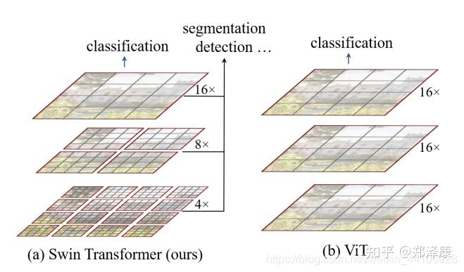
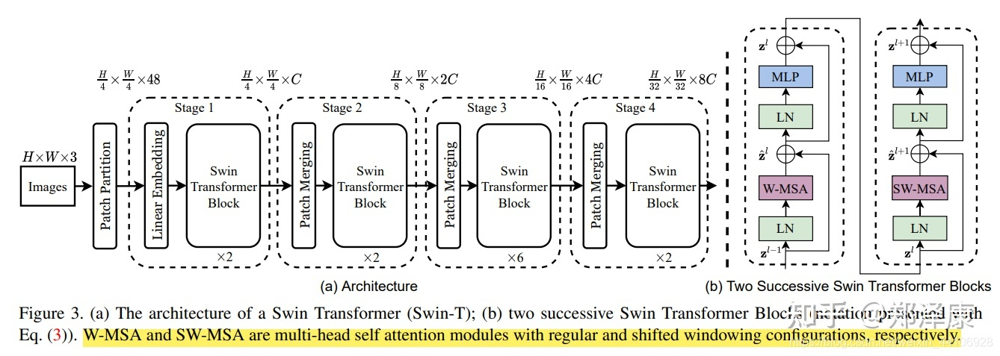
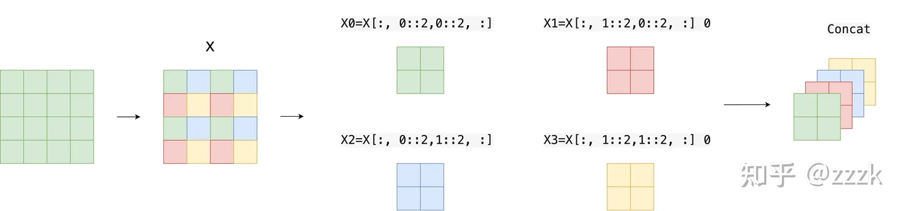
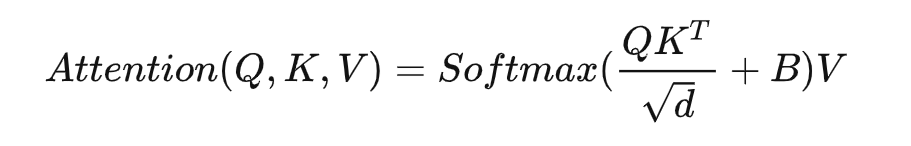
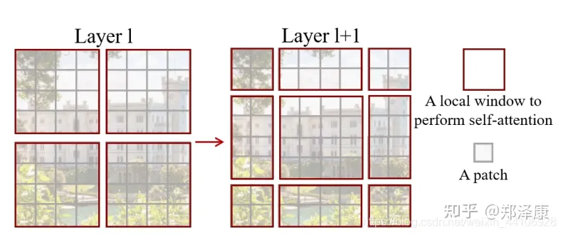
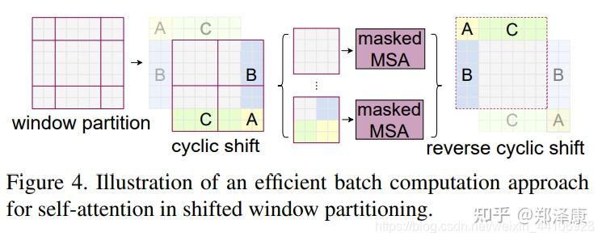
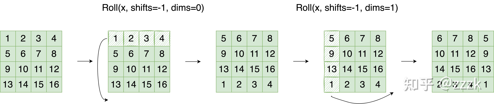
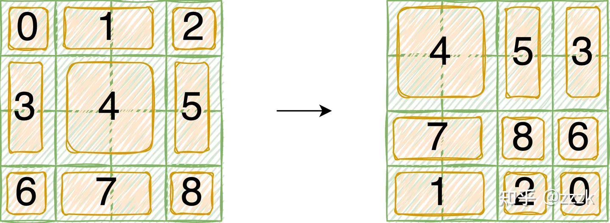
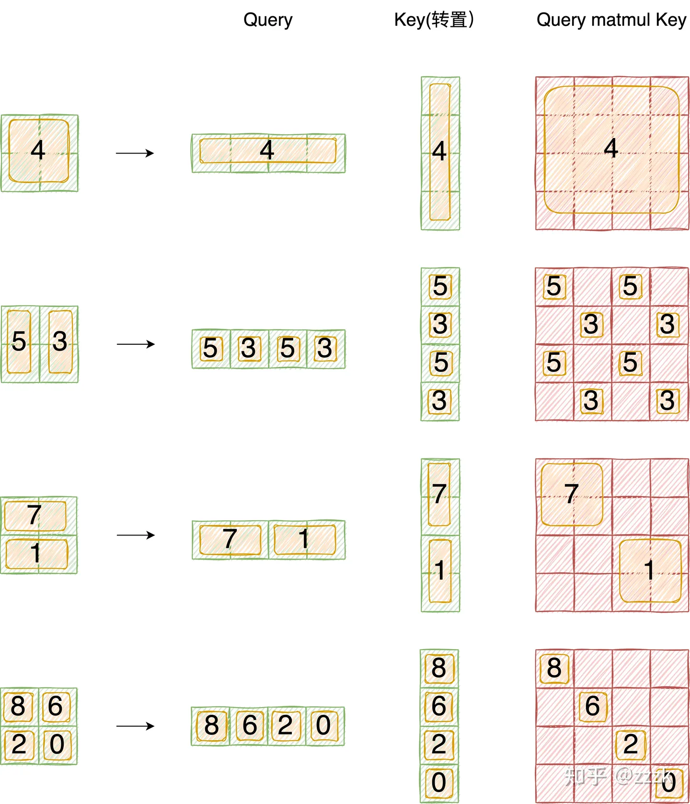
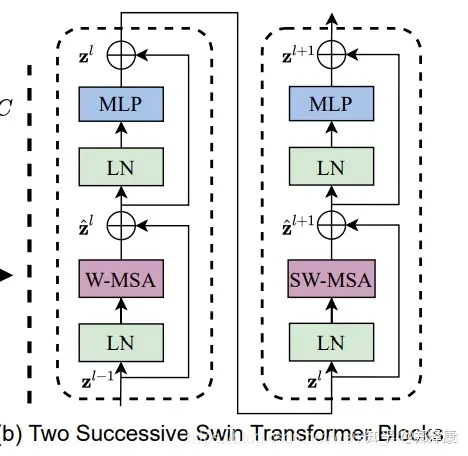

---
tag:
    - 'Computer Science - Computer Vision and Pattern Recognition'
    - 'Computer Science - Machine Learning'
title: 'Swin Transformer: Hierarchical Vision Transformer using Shifted Windows'
category:
    - 图像增强
version: 5498
libraryID: 1
itemKey: EL44F5U5

---
# Swin Transformer

## 介绍

目前Transformer应用到图像领域主要有两大挑战：

*   视觉实体变化大，在不同场景下Vision Transformer性能未必很好
*   图像分辨率高，像素点多，Transformer基于全局自注意力的计算导致计算量较大

针对上述两个问题，我们提出了一种**包含滑窗操作，具有层级设计**的Swin Transformer。

其中滑窗操作包括**不重叠的局部窗口（local window），和重叠的交叉窗口（cross-window）**。将注意力计算限制在一个窗口中，**一方面能引入卷积神经网络CNN卷积操作的局部性，另一方面能节省计算量**。

## 整体架构

 整个模型采取层次化的设计，一共包含4个阶段Stage，每个阶段stage都会缩小输入特征图的分辨率，像CNN一样逐层扩大感受野。

*   在输入开始的时候，做了一个分块嵌入操作——

    `Patch Embedding`，将图片切成一个个图块，并嵌入到`Embedding`。

*   在每个阶段Stage里，由图块聚合

    `Patch Merging`和多个块Block组成。

*   其中图块聚合

    `Patch Merging`模块主要在每个阶段Stage一开始降低图片分辨率。

*   而Block具体结构如右图所示，主要是层归一化

    `LayerNorm`，多层感知机`MLP`，窗口注意力`Window Attention` 和移位窗口注意力 `Shifted Window Attention`组成

## **Patch Embedding**

在输入进Block前，我们需要将图片切成一个个图块patch，然后嵌入向量。

具体做法是对原始图片裁成一个个 `patch_size * patch_size`的窗口大小，然后进行嵌入。

这里可以通过二维卷积层，**将步长stride，卷积核kernel size设置为分块大小patch_size**。设定输出通道来确定嵌入向量的大小。最后将H,W维度展开，并移动到第一维度（通道维度），会发现这时特征图长宽变小，但高度变厚了。

## **Patch Merging**

该模块的作用是在每个阶段Stage开始前做降采样，用于缩小分辨率，调整通道数。进而形成层次化的设计，同时也能节省一定运算量。

> 在CNN中，则是在每个Stage开始前用`stride=2`的卷积/池化层来降低分辨率。

每次降采样是两倍，因此**在行方向和列方向上，间隔2选取元素**。

然后拼接在一起作为一整个张量，最后展开。**此时通道维度会变成原先的4倍**（因为H,W各缩小2倍），此时再通过一个**全连接层再调整通道维度为原来的两倍**

下面是一个示意图（输入张量N=1, H=W=8, C=1，不包含最后的全连接层调整）

## **Window Partition/Reverse**

`window partition`函数是用于对张量划分窗口，指定窗口大小。将原本的张量从 `N H W C`, 划分成 `num_windows*B, window_size, window_size, C`，其中 **num\_windows = H\*W / (window\_size\*window\_size)**，即窗口的个数。而`window reverse`函数则是对应的逆过程。这两个函数会在后面的`Window Attention`用到。

## **Window Attention**

这是这篇文章的关键。传统的Transformer都是**基于全局来计算注意力的**，因此计算复杂度十分高。而Swin Transformer则将**注意力的计算限制在每个窗口内**，进而减少了计算量。

我们先简单看下公式

主要区别是在原始计算Attention的公式中的Q,K时**加入了相对位置编码**。后续实验有证明相对位置编码的加入提升了模型性能。

窗口注意力的具体细节见[图解Swin Transformer - 知乎 (zhihu.com)](https://zhuanlan.zhihu.com/p/367111046)

## **Shifted Window Attention**

前面的Window Attention是在每个窗口下计算注意力的，为了更好的和其他window进行信息交互，Swin Transformer还引入了shifted window操作。

左边是没有重叠的Window Attention，而右边则是将窗口进行移位的Shift Window Attention。可以看到移位后的窗口包含了原本相邻窗口的元素。但这也引入了一个新问题，即**window的个数翻倍了**，由原本四个窗口变成了9个窗口。

在实际代码里，我们是**通过对特征图移位，并给Attention设置掩膜mask来间接实现的**。能在**保持原有的window个数下**，最后的计算结果等价

## **特征图移位操作**

代码里对特征图移位是通过`torch.roll`来实现的，下面是示意图

> 如果需要`reverse cyclic shift`的话只需把参数`shifts`设置为对应的正数值。

## **Attention Mask**

我认为这是Swin Transformer的精华，通过设置合理的mask，让`Shifted Window Attention`在与`Window Attention`相同的窗口个数下，达到等价的计算结果。

首先我们对Shift Window后的每个窗口都给上index，并且做一个`roll`操作（window\_size=2, shift\_size=-1）

我们希望在计算Attention的时候，**让具有相同index QK进行计算，而忽略不同index QK计算结果**。

最后正确的结果如下图所示 (PS: 这个图的Query Key画反了。。。应该是4x1 和 1x4 做矩阵乘，读者们自行交换下位置，抱歉）

而要想在原始四个窗口下得到正确的结果，我们就必须给Attention的结果加入一个mask（如上图最右边所示）

## **Transformer Block整体架构**

两个连续的Block架构如上图所示，需要注意的是一个Stage包含的Block个数必须是偶数，因为需要交替包含一个含有`Window Attention`的Layer和含有`Shifted Window Attention`的Layer。

整体流程如下

*   先对特征图进行LayerNorm

*   通过

    `self.shift_size`决定是否需要对特征图进行shift

*   然后将特征图切成一个个窗口

*   计算Attention，通过

    `self.attn_mask`来区分`Window Attention`还是`Shift Window Attention`

*   将各个窗口合并回来

*   如果之前有做shift操作，此时进行

    `reverse shift`，把之前的shift操作恢复

*   做dropout和残差连接

*   再通过一层LayerNorm+全连接层，以及dropout和残差连接
