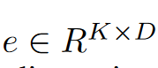
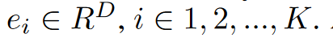
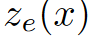
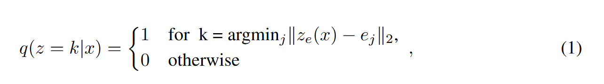
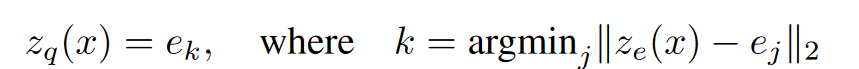
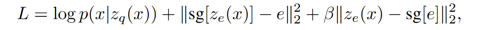
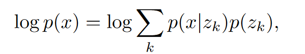
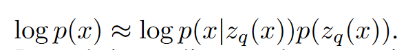

---
tag:
    - 'Computer Science - Machine Learning'
    - VQVAE
title: 'Neural Discrete Representation Learning'
category:
    - 图像增强
version: 5692
libraryID: 1
itemKey: 37WDAMBD

---
# VQ-VAE

## 介绍

离散的特征表示方法可能更适合各种模态的数据，如在自然语言中，单词是离散的。语音表现为符号序列。图像可以通过语言来描述。

## 离散的中间变量

作者在模型中定义了一个潜在的嵌入空间k为离散变量的数量，比如说K种分类方式。D为每个离散变量的维度数。

因此总共由K个离散变量

模型中输入x，通过编码器能够输出

获取到的离散的中间变量是在共享的潜在嵌入空间e中通过最近邻算法查找最匹配的

其中ze ( x )是编码器网络的输出，

解码器输入的为对应的离散变量ek

## 损失函数

第一项是数据从编码器到解码器之间的重构损失，我们只是简单的把梯度从编码器输出的中间特征转移到了解码器输入的中间特征，因此中间的离散变量映射过程没有计算梯度。

第二项L2误差，是将（codebook中的变量）移动到编码器输出变量产生的损失。sg表示在前向计算时被定义为恒等式的停止梯度算子，它具有零偏导数，从而有效地将其操作数约束为一个未更新的常数。

最后一项为承诺损失，由于码本（codebook）中存放的编码（code）数量是有限的，为了使编码器的输出不会让码本中的编码数量无限制的增长。

解码器只优化第一个损失项，编码器优化第一个和最后一个损失项，码本则优化中间的损失项。

这个β值，实际上取值在0.1-2.0之间都对模型效果没啥大的影响，因此作者在之后所有实验中β取值都为0.25。

第一项重构损失，完整的表示为

由于这一段看不懂的原因，作者将损失简化为

