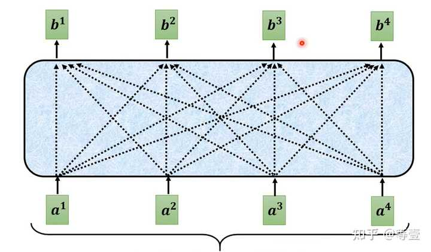
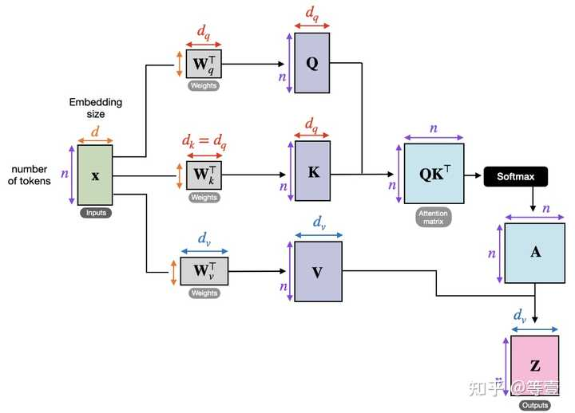
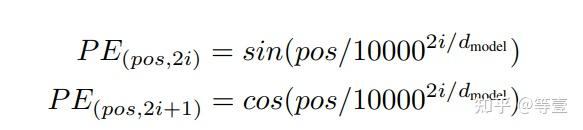
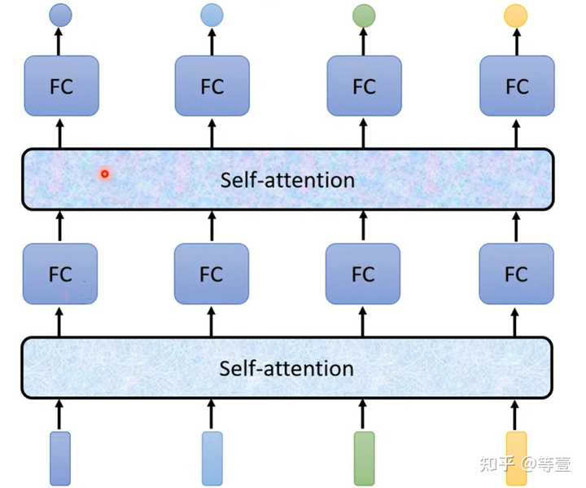
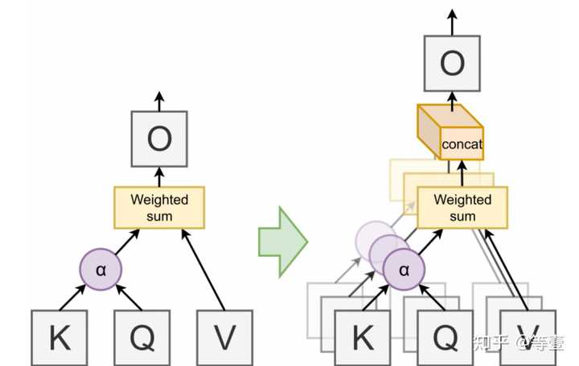
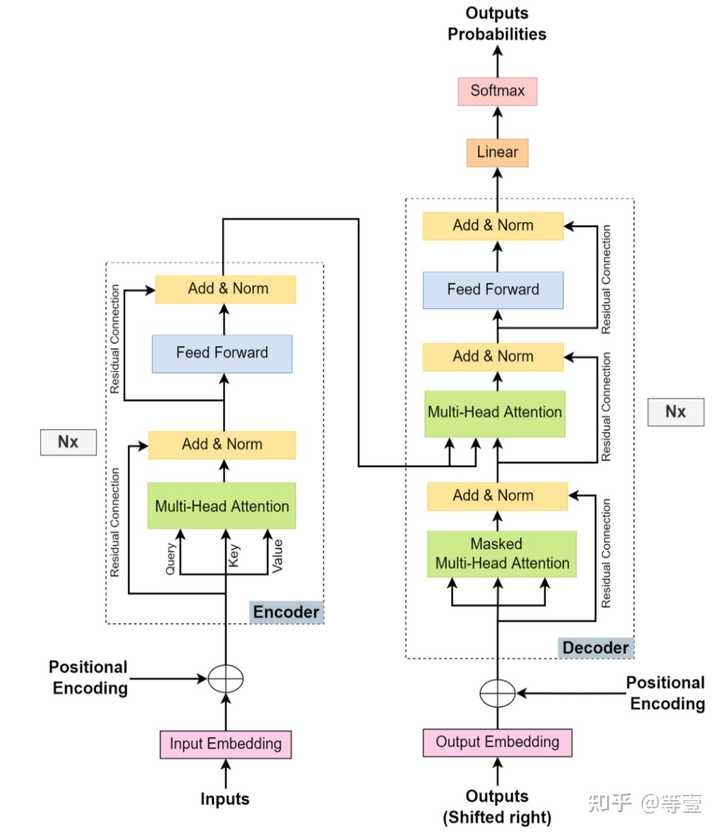
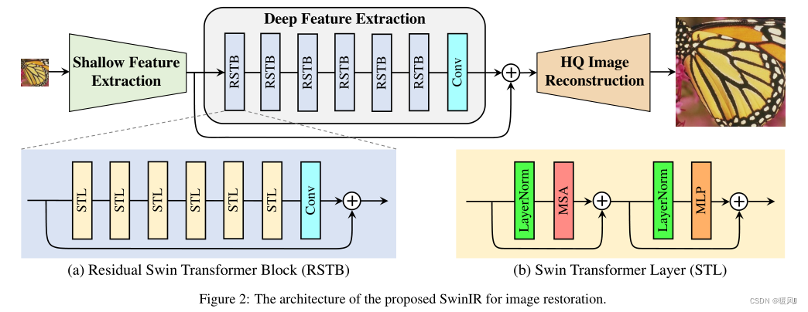
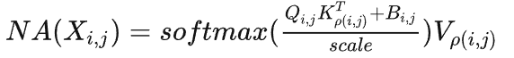
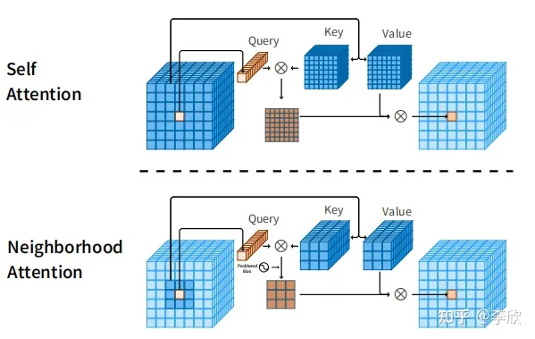
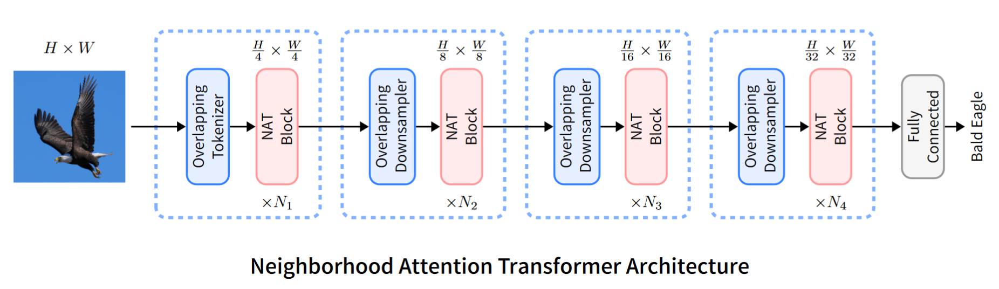

# Transformer 系列学习

## Transformer

Transformer系列最早是在Google在2017年的论文Attention is All You Need中提出，用于解决序列到序列(Sequence to sequence, Seq2Seq)的模型在处理可变长序列时遇到的问题。Seq2Seq指的是模型输入一段序列，输出也是一段序列。

在传统的卷积神经网络中，处理长序列要求输入具有固定的尺寸。在处理变长序列时，需要对较短的序列进行填充，导致计算效率低下。

Transformer采用自注意力机制解决这一问题。

### 自注意力

自注意力能够在序列中的每一个位置上计算该位置与其他位置的关联程度，并且根据这些关联程度甲醛组合序列中的信息。

如上图，a为输入序列，分为了元素a1, a2, a3, a4，我们可以称序列中每个元素为一个token，实际上为向量。这段序列通过中间方框的自注意力操作，最终输出了序列b，也就是b1, b2, b3, b4。其中b中每个元素(token)都保留了a1, a2, a3, a4的关联信息。

自注意力操作从输入中提取了查询(Query)键(key)和值(Value)。

* 查询：查询是你想了解的信息或者是想从文本中提取的特征。
* 键：键用来表示文本中每个词语，能够帮助计算你先了解的信息与其他词语的关联程度
* 值：值指的是文本中每个词语的具体信息、含义或者说特征。

具体的步骤是：

1. 输入值a乘以矩阵中的查询、键和值。查询、键和值是矩阵的权重，需要通过训练不断地优化。
2. 计算查询和键的点积，衡量查询和其他词语之间的关联程度，随后归一化处理。得到每个词语的注意力权重。
3. 根据词语的注意力权重，对其值进行加权求和，得到更加关注与你先了解的信息的一串值。
4. 对步骤3中所有相关的输入得到的值进行加权求和，得到序列的输出。

从矩阵的角度，可以将自注意力整个过程表示为：

如果要考虑输入序列中元素的前后位置信息，还需要对输入使用位置编码。而sin和cos函数可以表示位置信息，因此使用这两种函数进行位置编码。随后将位置向量与输入a相加，再进行自注意力操作，这样自注意力就会考虑序列的前后位置的不同。

自注意力机制可以用以下公式表示
$$
Attention(Q,K,V)=SoftMax(\frac{QK^T}{\sqrt{d}})V
$$
随后将自注意力的输出给到全连接神经网络，让模型进一步学习。

## 

### 多头自注意力机制

多头自注意力机制(Multi-head self attention)是对自注意力机制的扩展，自注意力只能使用一组查询、键和值来计算注意力权重，而多头自注意力可以使用多组查询、键和值计算，也就是多头的含义。从而允许模型同时关注不同的表示子空间，以更好地捕捉输入序列中不同关系和特征。

### 总体架构

Transformer由编码器和解码器组成。

#### 编码器

主要作用是将输入数据编码为计算机能理解的抽象表示。整体结构为多头注意力机制+全连接神经网络，通过残差连接将输入和多头注意力层或者全连接神经网络的输出相加再传递给下一层，避免了梯度递减的问题。

#### 解码器

将抽象表示解码为目标序列。但是采用了掩码多头自注意力，也就是计算注意力得分是，只关注生成内容的当前位置之前的信息，掩盖后面的编码，避免未来信息的泄露。中间部分利用编码器的输出结果计算交叉注意力，通过计算解码器当前位置查询与编码器的输出键之间的注意力权重，将编码器的输出的值甲醛。随后将该表示与解码器当前位置的表示进行融合。

## Vision Transformer

Vision Transformer将最初针对自然语言处理的Transformer技术应用到了计算机视觉领域。

### 模型结构

整体模型通过三个模块组成：

* 展平图块的线性投影层(Linear Projection of Flattened Patches, Embeadding layer)
* Transformer 编码器
* 多层感知机(Multi-Layer Perception，MLP)

#### 展平图块的线性投影层

Transfomer要求输入的是一段序列，序列中每个元素都是一个向量。即二维矩阵[num_token, token_dim]。如下图，输入一段序列，我们用0-9来表示序列中不同的元素(token)，假定每个token长度为768，则我们可以用二维矩阵[10, 768]来表示展平图块的线性投影层的输入。

但是图像的数据格式为三维矩阵[H, W, C]，由长度、宽度、通道数组成，所以我们需要一个嵌入层将原始的图像进行矩阵变换，使其符合Transformer的输入。

1. 首先我们将图像按照给定的大小分割成一堆图块。举例如将输入图片(224x224)按照16x16大小的Patch进行划分，划分后会得到	$( 224 / 16 ) 2 = 196，(224/16)^2=196(224/16) 
   2 =196个图块$。
2. 紧接着 我们将 16 * 16 * 3 的图块，也就是三维矩阵，通过矩阵变换展平为一维向量，得到长度为768的向量，将其称为token。
3. 对于图像分类任务，在得到的token加上类别参数。类别参数是一个可训练的参数，是一个长度为768的向量，与之前从图片中生成的tokens拼接在一起，如`Cat([1, 768], [196, 768]) -> [197, 768]`。模型通过训练优化类别信息。
4. 然后添加图块的位置嵌入(Position Embedding)，同样是可训练的，与上一步得到的token形状一致，也是`[197, 768]`

#### Transformer 编码器

* Layer Norm，这种归一化方法主要是针对自然语言处理领域提出的，这里是对每个token进行归一化处理，
* Multi-Head Attention，与Transformer相同
* Dropout/DropPath，丢弃层
* MLP Block，由全连接+GELU激活函数+Dropout组成，需要注意的是第一个全连接层会把输入节点个数翻4倍[197, 768] -> [197, 3072]，第二个全连接层会还原回原节点个数[197, 3072] -> [197, 768]

#### 多层感知机

多层感知机是为了解决图片分类的问题。Transformer编码器输入和输出的形状是保持不变的。

## Swin Transformer

### 介绍

**卷积神经网络的局限**

1. 图像和卷积核之间的交互**与内容无关**。使用相同的卷积核来恢复不同的图像区域可能不是一个好的选择。
2. CCN只能对**局部信息**进行处理，卷积对于长期依赖性建模是无效的。

**Vision Transformer的局限**

基于一种自注意力机制，能够捕捉上下文之间的全局交互。但是Viison Transformer这种通常将输入图像分割成大小固定的小块，并独立处理每个小块。这种策略不可避免地会带来两个缺点。

1. 恢复的图像可能会在每个小斑块周围引入边界伪影。
2. 每个patch的边界像素会丢失信息。

**Swin Transformer的优点**

由于局部注意机制，它具有CNN处理大尺寸图像的优势。（相比于transformer，CNN的计算量小很多，所以可以处理大尺寸图像）
又具有Transformer的优点，可以用移位窗口方案来建模长期依赖关系。

### 网络结构

* 首先将图片输入到块分割模块中进行分块，然后将图块在通道方向上展平。图像矩阵的形状从[H, W, 3]，变成了[H/4, W/4, 48]
* 通过线性嵌入层对每个像素的通道维度做线性变换，形状改为[H/4, W/4, C]
* 数据再通过4个阶段从而产生不同大小的特征图，第一个阶段会进行线性变换，剩下三个阶段会通过块合并层进行下采样
* 对于图像分类任务，会使用一个Layer Norm层、全局池化层以及全连接层得到最终输出

### 块合并层

块合并层会对输入到该层的图块进行下采样，经过处理之后图块（矩阵）的宽和高会减半，而深度会翻倍。

具体可以由一个4 * 4大小的单通道特征图举例。块合并层将每个2 * 2的相邻像素划分为一个小块，然后从每个小块中抽取一个像素拼接在一起，从而得到4个宽高减半的特征图，随后将这4个特征图在深度方向拼接，再通过一个层归一化层和全连接层，对深度方向做线性变换。从而得到处理后的矩阵输出。 

### 窗口多头自注意力机制

窗口多头自注意力机制（Windows Multi-head Self-Attention，W-MSA）模块是为了减少计算量。之前的VIsion Transformer是将整个特征图（或者说token）应用自注意力机制，计算量庞大，而窗口多头自注意力机制将特征图划分为多个窗口，在每个窗口内应用多头自注意力，从而减小计算量。

窗口多头自注意力和多头自注意力相比，计算复杂度可以由以下公式表示：
$$
Ω(MSA)=4hwC^2+2(hw)^2C
$$

$$
Ω(W−MSA)=4hwC^2+2M^2hwC
$$

- h代表feature map的高度
- w代表feature map的宽度
- C代表feature map的深度
- M代表每个窗口（Windows）的大小

### 窗口偏移的多头自注意力

采用窗口多头自注意力机制，不同窗口之间是无法进行信息传递的，为了解决这一问题，引入了窗口偏移的多头自注意力（Shifted Windows Multi-Head Self-Attention，SW-MSA）机制。该机制会将原有的窗口向上下左右偏移几个像素，从而获得来自其他窗口的信息。通常情况下，这W-MSA和SW-MSA是成对使用的。在降低计算量的同时，又能兼顾不同窗口信息的交流。

但是将窗口偏移后，如上图，就由原来的4个窗口变成9个窗口。后面要对每个窗口内部应用自注意力，会更加麻烦。为了解决这个问题，作者提出了一个更高效的方法。但是这个方法有点麻烦。详情见论文以及[Swin-Transformer网络结构详解](https://blog.csdn.net/qq_37541097/article/details/121119988?spm=1001.2014.3001.5506)

## SwinIR: Swin Transformer for Image Restoration

将Swin Transformer应用在了图像重建领域。

### 网络结构

由三部分组成：浅层特征提取层、深层特征提取层、高质量图像重建层。对所有恢复任务使用相同的特征提取模块，但对不同的任务使用不同的重建模块。

#### 浅层特征提取层

使用一个3×3卷积层来提取浅层特征。卷积层在早期视觉处理方面很好，能引导网络更稳定的优化和更好的结果，更简单的将输入图像空间映射到更高维特征空间。

#### 深层特征提取层

包含多个Swin-T块（RSTB）和一个3×3卷积层，最后用残差连接将输入和输出进行相加。在特征提取的最后使用一个卷积层可以将卷积运算的归纳偏置引入Transformer网络，为以后浅层和深层特征的聚合奠定更好的基础。

### Residual Swin Transformer Block(RSTB)

残差Swin Transformer块是由L个Swin Transformer层和一个卷积层，使用残差连接构成的，这种设计有两个好处：

1. 尽管Transformer可以被视为空间变化卷积的一个具体实例，但带有空间不变性的卷积层可以增强SwinIR的平移不变性。
2. 残差连接提供了从不同块到最后输出连接，允许不同级别的特征聚合。

## Neighborhood Transformer

### 介绍

现有计算机视觉领域Transformer的局限性。

1. 计算复杂度高。虽然其中的`Self Attention`相对于嵌入维度具有线性复杂度(不包括线性投影)，但相对于`Token`数量却具有二次复杂度。而`Token`的数量通常又与图像分辨率呈线性相关。因此，**更高的图像分辨率将会带来复杂度和内存的二次增长**。而过高的复杂度和计算量会影响模型应用于下游的视觉任务。
2. 训练难。卷积的性能大多受益于**归纳偏差**，如局部性、平移等方差和二维邻域结构，而利用点积的自注意力机制是一个全局的操作。虽然`Vision Transformer`中的`MLP`层具有局部性和平移不变性，但其余的归纳偏差必须通过大量数据或先进的训练技术和增强来弥补。

### 领域注意力

主要受到卷积引入领域偏差和局部性原理的启发。领域注意力中每个像素只关注与其相邻的元素。

用$p(i,j)$表示 $(i,j)$处的一个像素的邻域，它是最接近$(i,j)$的像素的一个固定长度的索引集。对于大小为 L×L ，$||p(i,j)|| = L^2$  。因此，在单个像素上的`Neighborhood Attention`可以定义如下：

$B_{i,j}$为相对位置偏差，根据相对位置将其添加到每个注意力权重中。这个操作可以进一步扩展到所有像素$(i,j)$ ，从而形成一种局部注意力的形式。

然而，如果函数p将每个像素映射到所有像素，这将等同于自注意力(带有额外的位置偏差)。这是因为当邻域边界超过输入大小时，$p(i,j)$将包括所有可能的像素。

对于不能居中的边缘地区的像素，扩展邻域以保持感受野的大小。此操作允许领域注意力随着邻域大小的增加而扩大到自注意力机制。

### 基于邻域注意力的Transformer

基于邻域注意力的Transformer(Neighborhood Attention Transformer, NAT)通过使用2个连续的3×3卷积(stride=2)来嵌入输入，进而产生输入空间大小1/4的输入。这类似于使用patch和4×4 patch的嵌入层，但它使用的是**重叠卷积**（即图中的overlapping tokenizer和overlapping downsampler）而不是非重叠卷积。

其中overlapping tokenizer会将图片分成图块，并且展平为一维序列，从而充当transformer中的token来进行邻域注意力的操作。overlapping downsampler

NAT由4个阶段组成，每个阶段后面都连接一个下采样器（最后一个除外）。下采样器将空间大小减少了为原来的一半，而通道数量增加了一倍。这里下采样使用的是3×3卷积(stride=2)。由于`tokenizer（token化工具）`的降采样倍数为4倍，因此模型生成了大小为H/4×W/4、H/8×W/8、H/16×W/16和H/32×W/32的特征图，使得NAT可以更容易地将预训练过的模型迁移到下游任务中。
