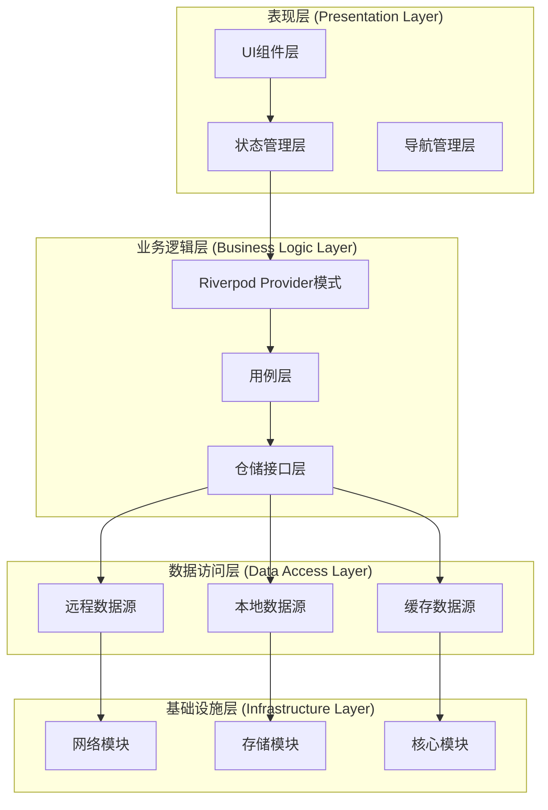
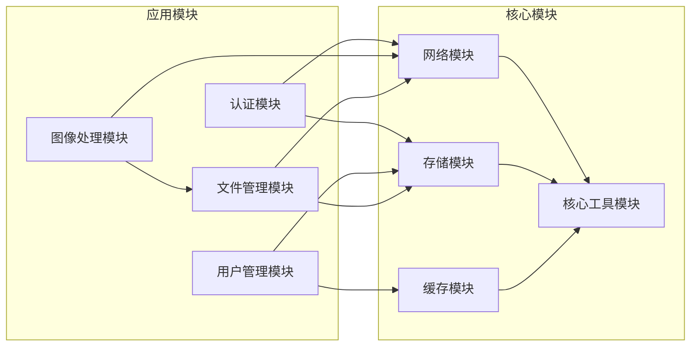
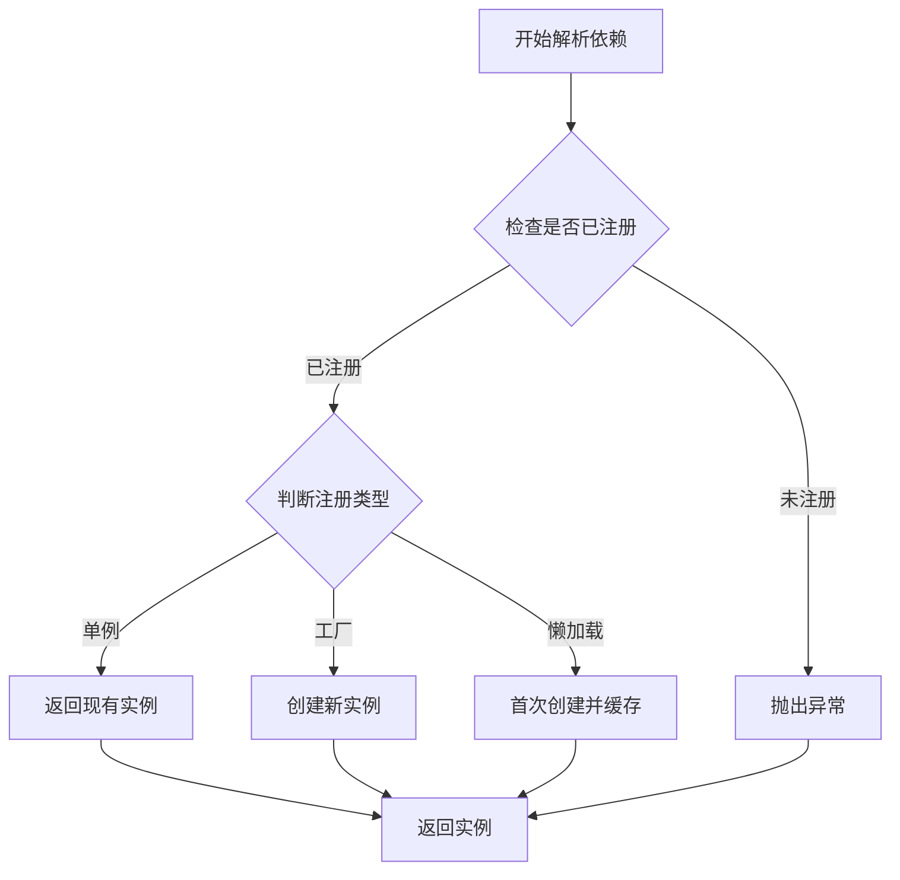
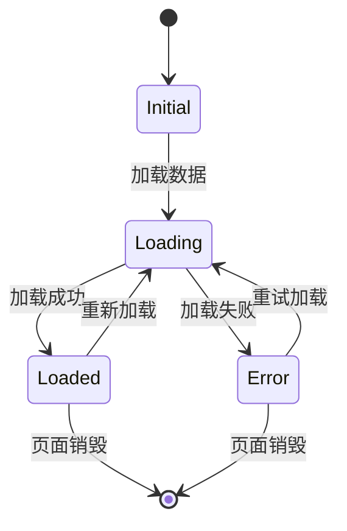
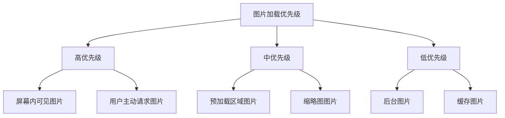
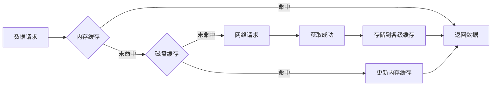
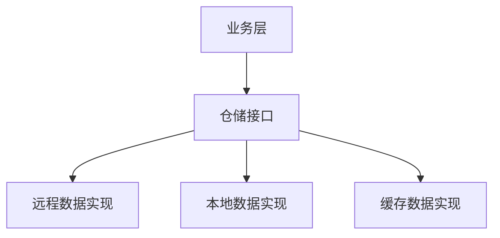
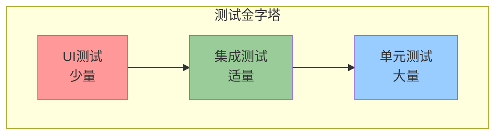

# Dehaze Flutter应用架构设计文档

## 1. 模块化架构

### 1.1 整体架构概览

Dehaze Flutter应用采用分层架构模式，将应用划分为多个独立的层次和模块，每个层次承担特定的职责，实现高内聚、低耦合的设计目标。

### 1.2 组件分层架构

#### 表现层 (Presentation Layer)
负责用户界面的展示和用户交互的处理，是应用的入口点。

**主要职责：**
- 渲染用户界面组件
- 处理用户输入事件
- 展示应用状态
- 执行页面导航
- 提供视觉反馈

**核心组件：**
- **UI组件层**: 包含所有可复用的Widget组件
- **状态管理层**: 使用Riverpod模式管理UI状态
- **导航管理层**: 处理页面路由和导航逻辑

#### 业务逻辑层 (Business Logic Layer)
实现核心业务逻辑和数据处理规则，不依赖具体的UI实现。

**主要职责：**
- 实现业务规则和逻辑
- 数据转换和验证
- 业务流程控制
- 错误处理和异常管理
- 事务协调

**核心组件：**
- **Riverpod Provider模式**: 状态管理实现
- **用例层**: 具体业务用例实现
- **仓储接口层**: 数据访问抽象接口

#### 数据访问层 (Data Access Layer)
负责数据的持久化、获取和管理，为业务层提供统一的数据访问接口。

**主要职责：**
- 数据持久化操作
- 远程API调用
- 本地数据库管理
- 缓存策略实现
- 数据同步机制

**核心组件：**
- **远程数据源**: HTTP API客户端
- **本地数据源**: SQLite数据库
- **缓存数据源**: 内存缓存管理

#### 基础设施层 (Infrastructure Layer)
提供底层技术支持和公共服务，为其他层提供基础设施。

**主要职责：**
- 网络通信管理
- 文件系统操作
- 设备功能调用
- 安全认证服务
- 日志记录和监控

**核心组件：**
- **网络模块**: HTTP客户端配置
- **存储模块**: 文件和数据库操作
- **核心模块**: 通用工具和服务

### 1.3 模块职责划分

| 模块名称 | 所属层次 | 主要职责 | 依赖关系 |
|---------|---------|---------|---------|
| 用户认证模块 | 业务逻辑层 | 用户登录、注册、权限管理 | 仓储层、网络模块 |
| 图像处理模块 | 业务逻辑层 | 图像上传、去雾处理、结果展示 | 算法服务接口、存储模块 |
| 用户管理模块 | 业务逻辑层 | 用户信息管理、偏好设置 | 本地数据源、远程数据源 |
| 文件管理模块 | 数据访问层 | 文件上传下载、本地存储 | 存储模块、网络模块 |
| 网络通信模块 | 基础设施层 | API调用、数据传输 | HTTP客户端、认证模块 |
| 缓存管理模块 | 数据访问层 | 数据缓存、离线支持 | 本地存储、内存管理 |

### 1.4 模块依赖关系

## 2. 设计原则

### 2.1 分层架构原则

#### 单一职责原则 (Single Responsibility Principle)
每个组件和模块都应该有且只有一个变化的理由。

**实施策略：**
- UI组件只负责界面展示
- 业务逻辑组件只处理业务规则
- 数据访问组件只负责数据操作
- 工具类只提供通用功能

#### 开闭原则 (Open-Closed Principle)
软件实体应该对扩展开放，对修改关闭。

**实施策略：**
- 使用抽象接口定义行为契约
- 通过依赖注入实现功能扩展
- 避免直接修改已有实现
- 使用策略模式支持多种实现

#### 里氏替换原则 (Liskov Substitution Principle)
子类型必须能够替换其基类型而不影响程序的正确性。

**实施策略：**
- 接口设计要保持语义一致性
- 避免在子类中破坏父类约定
- 正确使用继承和组合关系

#### 接口隔离原则 (Interface Segregation Principle)
客户端不应该依赖它不需要的接口。

**实施策略：**
- 创建小而专一的接口
- 避免臃肿的接口设计
- 按功能需求拆分接口

#### 依赖倒置原则 (Dependency Inversion Principle)
高层模块不应该依赖低层模块，两者都应该依赖抽象。

**实施策略：**
- 业务层依赖抽象的数据访问接口
- 数据层实现具体的访问逻辑
- 使用依赖注入容器管理依赖

### 2.2 依赖注入策略

#### 服务定位器模式
使用GetIt作为全局服务定位器管理应用中的各种服务。

**优势：**
- 集中管理服务实例
- 延迟初始化支持
- 生命周期管理
- 易于测试和模拟

#### 注册策略
根据服务的性质和使用场景，采用不同的注册方式：

| 服务类型 | 注册方式 | 生命周期 | 使用场景 |
|---------|---------|---------|---------|
| 单例服务 | registerSingleton | 应用生命周期 | 配置服务、网络客户端 |
| 工厂服务 | registerFactory | 每次调用创建 | 业务逻辑组件、数据转换器 |
| 懒加载服务 | registerLazySingleton | 首次使用创建 | 重型服务、可选功能 |

#### 依赖解析顺序

### 2.3 状态管理方案

#### Riverpod模式选择理由
选择Riverpod作为主要的状态管理方案，基于以下考虑：

**技术优势：**
- 编译时安全性，防止运行时错误
- 灵活的Provider类型支持
- 优秀的依赖注入和测试支持
- 现代化的开发体验和API设计

**架构优势：**
- 符合现代Flutter最佳实践
- 支持多种状态管理模式
- 便于组合和扩展
- 与现有生态系统完美集成

#### 状态管理模式

## 3. 性能优化策略

### 3.1 懒加载策略

#### 页面级懒加载
使用Flutter的延迟加载机制，仅在需要时加载页面代码。

**实现方式：**
- 使用`Navigator.push`进行页面导航
- 利用Flutter的路由懒加载特性
- 按需导入页面组件

#### 数据懒加载
实现数据的分批加载，避免一次性加载大量数据。

**策略：**
- **分页加载**: 每页加载固定数量数据
- **滚动加载**: 用户滚动到底部时自动加载
- **预加载机制**: 提前加载用户可能访问的数据

#### 图片懒加载
针对图像处理应用的特点，实现智能的图片加载策略。

**加载优先级：**

### 3.2 缓存机制

#### 多级缓存架构
构建内存、磁盘、网络三级缓存体系，优化数据访问性能。

#### 缓存策略配置

| 缓存类型 | 存储介质 | 容量限制 | 过期策略 | 适用数据 |
|---------|---------|---------|---------|---------|
| 内存缓存 | RAM | 50MB | LRU淘汰 | 用户信息、配置数据 |
| 磁盘缓存 | 文件系统 | 500MB | 时间过期 | 图片、临时文件 |
| 数据库缓存 | SQLite | 无限制 | 版本控制 | 历史记录、用户设置 |

#### 缓存失效策略
- **时间过期**: 设置数据的过期时间
- **版本控制**: 通过版本号管理缓存有效性
- **主动清除**: 在特定操作后主动清除相关缓存
- **空间管理**: LRU算法自动清理过期缓存

### 3.3 内存管理

#### 内存监控机制
实现实时的内存使用监控，及时发现和解决内存泄漏问题。

**监控指标：**
- 应用总内存使用量
- 各组件内存占用
- 内存增长率
- 垃圾回收频率

#### 资源释放策略
建立完善的资源管理机制，确保及时释放不再使用的资源。

**释放策略：**
- 页面销毁时释放相关资源
- 图片对象使用后及时释放
- 网络请求超时自动取消
- 定期清理临时文件和缓存

#### 内存优化实践

| 优化场景 | 具体措施 | 预期效果 |
|---------|---------|---------|
| 图片处理 | 使用压缩格式、尺寸适配 | 减少50%内存占用 |
| 列表渲染 | 视图回收、懒加载 | 提升滚动性能 |
| 数据缓存 | 分层缓存、自动清理 | 降低内存压力 |
| 组件管理 | 及时注销、事件解绑 | 避免内存泄漏 |

## 4. 架构决策

### 4.1 技术选型决策

#### 状态管理技术选择

**候选方案对比：**
| 技术方案 | 学习成本 | 性能表现 | 调试支持 | 社区活跃度 |
|---------|---------|---------|---------|-----------|
| Provider | 低 | 良好 | 一般 | 活跃 |
| Riverpod | 中等 | 优秀 | 良好 | 活跃 |
|GetX | 低 | 优秀 | 良好 | 活跃 |

**最终选择：Riverpod**
**决策理由：**
- 编译时安全性和类型检查
- 灵活的Provider类型支持
- 优秀的测试和调试支持
- 现代化的开发体验
- 与Flutter生态完美集成
- 适合各种规模的应用开发

#### 网络请求库选择

**选择：Dio + Retrofit**
**理由分析：**
- **功能完整性**: 支持拦截器、错误处理、文件上传下载
- **类型安全**: Retrofit提供编译时类型检查
- **易于测试**: 支持Mock和依赖注入
- **性能表现**: 优秀的连接池管理和缓存机制

#### 本地存储方案

**多方案组合策略：**
- **SQLite**: 结构化数据存储（用户信息、历史记录）
- **Hive**: 高性能键值存储（配置、缓存）
- **Shared Preferences**: 简单键值对存储（用户偏好）

### 4.2 设计模式应用

#### 仓储模式 (Repository Pattern)
抽象数据访问逻辑，为业务层提供统一的数据接口。

**优势：**
- 隔离数据源细节
- 便于单元测试
- 支持多数据源切换
- 提高代码可维护性

**实现结构：**

#### 工厂模式 (Factory Pattern)
用于创建不同类型的算法处理器和数据转换器。

**应用场景：**
- 算法处理器工厂：根据算法类型创建对应处理器
- 数据解析器工厂：根据数据格式创建解析器
- 网络请求工厂：根据API类型创建请求客户端

#### 观察者模式 (Observer Pattern)
实现状态变化通知和事件分发机制。

**应用场景：**
- Riverpod Provider状态变化通知
- 用户操作事件分发
- 网络状态变化监听
- 系统主题变化响应

#### 策略模式 (Strategy Pattern)
支持多种算法和数据处理策略的可插拔实现。

**应用场景：**
- 图像处理策略
- 缓存策略
- 数据同步策略
- 错误处理策略

### 4.3 扩展性考虑

#### 插件化架构设计
预留插件接口，支持功能的动态扩展和第三方集成。

**插件类型：**
- **算法插件**: 支持新的去雾算法集成
- **存储插件**: 支持不同的云存储服务
- **认证插件**: 支持多种登录方式
- **主题插件**: 支持自定义UI主题

#### API版本管理
建立完善的API版本管理机制，确保向后兼容性。

**版本策略：**
- URL路径版本控制: `/api/v1/`, `/api/v2/`
- 请求头版本标识: `Accept: application/vnd.api+json;version=1`
- 功能开关机制: 通过配置控制新功能启用

#### 配置驱动架构
通过配置文件控制应用行为，支持不同环境的灵活部署。

**配置层次：**
1. **应用级配置**: 全局设置、功能开关
2. **模块级配置**: 特定模块参数
3. **用户级配置**: 个性化设置
4. **环境级配置**: 开发/测试/生产环境差异

#### 国际化支持
构建完整的国际化框架，支持多语言和地区化需求。

**支持范围：**
- 界面文本多语言
- 日期时间格式本地化
- 数字货币格式适配
- 图片文字内容本地化
- 右到左语言支持

## 5. 架构质量保证

### 5.1 代码质量标准

#### 编码规范
- 遵循Dart官方编码规范
- 使用有效的命名约定
- 保持函数和类的简洁性
- 编写清晰的注释和文档

#### 架构一致性
- 统一的错误处理机制
- 一致的日志记录格式
- 标准化的API响应结构
- 统一的状态管理模式

### 5.2 测试策略

#### 测试金字塔

**测试覆盖目标：**
- 单元测试覆盖率 > 80%
- 集成测试覆盖核心业务流程
- UI测试覆盖关键用户路径

### 5.3 性能监控

#### 关键性能指标 (KPI)
- 应用启动时间 < 3秒
- 页面切换延迟 < 300ms
- 网络请求响应时间 < 2秒
- 内存使用增长 < 10MB/小时
- 崩溃率 < 0.1%

#### 监控机制
- 实时性能数据收集
- 异常情况自动上报
- 性能趋势分析报告
- 用户体验满意度调查

---

*本文档将随着项目的发展持续更新和完善，确保架构设计能够满足业务需求和技术发展的要求。*